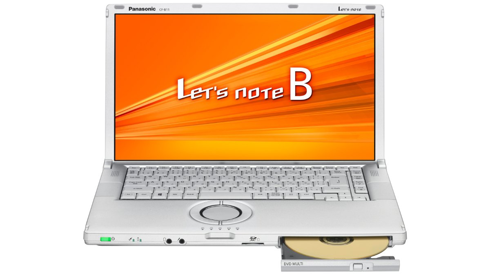
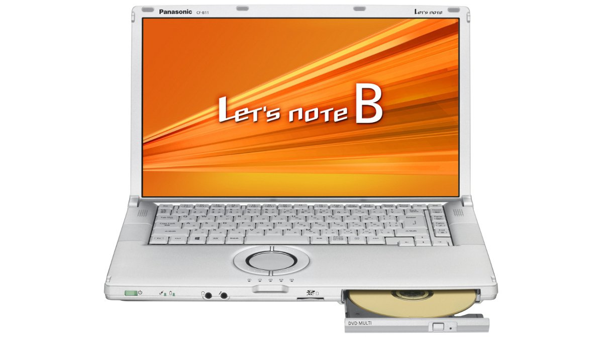
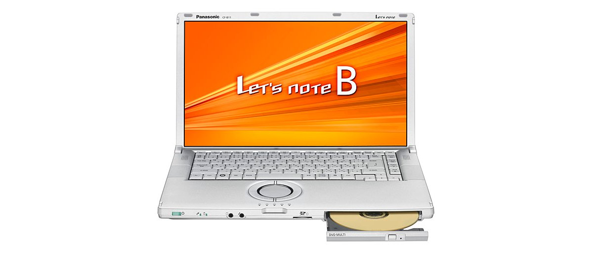

# Panasonic Let's note CF-B11 Specifications

**English** · [日本語](../../ja/CF-B11/) · [中文](../../zh/CF-B11/)

**CF-B11** is a Panasonic Let's note laptop in the B11 series with a 15.6-inch Full HD display. This page lists all 8 part numbers, released 2012-05 – 2013-05. Each part number links to its official spec sheet.

*Panasonic Let's note CF-B11 (CF-B11UWABR, CF-B11UWHBR), silver. Image © Panasonic.*

## Part numbers

| Part number | Released | Discontinued | Summary |
| :-- | :-- | :-- | :-- |
| [CF-B11UWABR](https://panasonic.jp/pc/p-db/CF-B11UWABR_spec.html) | 2013-05 | 2013-11 | Windows 8 Pro 64-bit, Intel® CoreTM i7-3635QM (2.40GHz), Memory: standard 4GB (1 free slot, max 8GB), HDD: 1TB, Super Multi Drive, LAN, Wireless LAN 802.11a(W52/W53/W56)/b/g/n |
| [CF-B11UWHBR](https://panasonic.jp/pc/p-db/CF-B11UWHBR_spec.html) | 2013-05 | 2013-11 | Windows 8 Pro 64-bit, Intel® CoreTM i7-3635QM (2.40GHz), Memory: standard 4GB (1 free slot, max 8GB), HDD: 1TB, Super Multi Drive, LAN, Wireless LAN 802.11a(W52/W53/W56)/b/g/n, Office Home and Business 2013 |
| [CF-B11TWABR](https://panasonic.jp/pc/p-db/CF-B11TWABR_spec.html) | 2013-02 | 2013-08 | Windows 8 Pro 64-bit, Intel® CoreTM i7-3635QM (2.40GHz), Memory: standard 4GB (1 free slot, max 8GB), HDD: 750GB, Super Multi Drive, LAN, Wireless LAN 802.11a(W52/W53/W56)/b/g/n |
| [CF-B11TWHBR](https://panasonic.jp/pc/p-db/CF-B11TWHBR_spec.html) | 2013-02 | 2013-08 | Windows 8 Pro 64-bit, Intel® CoreTM i7-3635QM (2.40GHz), Memory: standard 4GB (1 free slot, max 8GB), HDD: 750GB, Super Multi Drive, LAN, Wireless LAN 802.11a(W52/W53/W56)/b/g/n, Office Home and Business 2013 |
| [CF-B11QWABR](https://panasonic.jp/pc/p-db/CF-B11QWABR_spec.html) | 2012-10 | 2013-05 | Windows 8 Pro 64-bit, Intel® CoreTM i7-3635QM (2.40GHz), Memory: standard 4GB (1 free slot, max 8GB), HDD: 640GB, Super Multi Drive, LAN, Wireless LAN 802.11a(W52/W53/W56)/b/g/n |
| [CF-B11QWHBR](https://panasonic.jp/pc/p-db/CF-B11QWHBR_spec.html) | 2012-10 | 2013-05 | Windows 8 Pro 64-bit, Intel® CoreTM i7-3635QM (2.40GHz), Memory: standard 4GB (1 free slot, max 8GB), HDD: 640GB, Super Multi Drive, LAN, Wireless LAN 802.11a(W52/W53/W56)/b/g/n, Office Home and Business 2010 |
| [CF-B11YWADR](https://panasonic.jp/pc/p-db/CF-B11YWADR_spec.html) | 2012-05 | 2012-10 | Windows® 7 Professional 64-bit Genuine Edition (Service Pack 1 applied), Intel® CoreTM i7-3615QM (2.30GHz), Memory: standard 4GB (1 free slot, max 8GB), HDD: 640GB, Super Multi Drive, LAN, Wireless LAN 802.11a(W52/W53/W56)/b/g/n |
| [CF-B11YWHDR](https://panasonic.jp/pc/p-db/CF-B11YWHDR_spec.html) | 2012-05 | 2012-10 | Windows® 7 Professional 64-bit genuine version (Service Pack 1 applied), Intel® CoreTM i7-3615QM (2.30GHz), Memory: standard 4GB (1 free slot, max 8GB), HDD: 640GB, Super Multi Drive, LAN, wireless LAN 802.11a(W52/W53/W56)/b/g/n, Office Home and Business 2010 <limited quantity> |

## Common specifications

| Item | Value |
| :-- | :-- |
| Chipset | Mobile Intel HM76 Express chipset |
| Memory | Standard 4GB PC3-10600/DDR3L SDRAM, maximum 8GB (1 free slot) |
| Optical drive | Super Multi Drive built-in, equipped with buffer underrun error prevention function (SmoothLink) |
| Display | 15.6-inch widescreen (16:9) Full HD TFT color LCD (1920×1080 dots) |
| Display / Graphics | Intel HD Graphics 4000 (built into CPU) |
| Display / LCD colors | 1920×1080 dots: approx. 16.77 million colors |
| Wireless communication | Intel Centrino Advanced-N 6205 |
| Wireless LAN | IEEE802.11a (W52/W53/W56)/b/g/n compliant |
| Security chip | TPM (TCG V1.2 compliant) |
| Card slots / SD card | SD memory card ×1 slot (SDHC memory card/SDXC memory card support/UHS-I high-speed transfer support/copyright protection technology support) |
| Memory expansion slot | DDR3L 204-pin SO-DIMM dedicated slot ×1 (1.35V/PC3-10600/DDR3L SDRAM) |
| Keyboard | OADG-compliant 86 keys, key pitch 19mm (horizontal and vertical) (excluding some keys) |
| Pointing device | Wheel pad |
| Power consumption | Max approx. 80W |
| Efficiency target achievement (FY2011 standard) | — |
| Color | Silver |
| Weight (with battery) | PC body: approx. 1.895 kg (when the supplied battery pack (approx. 0.31 kg) is installed), PC body: approx. 1.775 kg (when the separately sold lightweight battery pack (approx. 0.19 kg) is installed), AC adapter: approx. 0.29 kg (excluding the power cord (approx. 0.06 kg)) |

## Differences by part number

| Part number | CPU | Memory | Storage | Weight | Battery life |
| :-- | :-- | :-- | :-- | :-- | :-- |
| CF-B11UWABR | Core i7-3635QM | 4GB PC3-10600 | Hard disk drive | 1.895 kg | 6 h |
| CF-B11UWHBR | Core i7-3635QM | 4GB PC3-10600 | Hard disk drive | 1.895 kg | 6 h |
| CF-B11TWABR | Core i7-3635QM | 4GB PC3-10600 | Hard disk drive | 1.895 kg | 6 h |
| CF-B11TWHBR | Core i7-3635QM | 4GB PC3-10600 | Hard disk drive | 1.895 kg | 6 h |
| CF-B11QWABR | Core i7-3635QM | 4GB PC3-10600 | Hard disk drive | 1.895 kg | 6 h |
| CF-B11QWHBR | Core i7-3635QM | 4GB PC3-10600 | Hard disk drive | 1.895 kg | 6 h |
| CF-B11YWADR | Core i7-3615QM | 4GB PC3-10600 | Hard disk drive | 1.895 kg | 6 h |
| CF-B11YWHDR | Core i7-3615QM | 4GB PC3-10600 | Hard disk drive | 1.895 kg | 6 h |

CF-B11UWABR: all differing specifications

| Item | Value |
| :-- | :-- |
| OS | Windows 8 Pro 64-bit genuine version |
| CPU | Intel Core i7-3635QM processor / Intel Smart Cache 6MB, operating frequency 2.40GHz (up to 3.40GHz when using Intel Turbo Boost Technology 2.0) |
| Video memory | Maximum 1664MB (shared with main memory) |
| Hard disk | Hard disk drive (HDD) 1TB (Serial ATA, 5400rpm) Of the above capacity, approx. 14GB is used as recovery area and approx. 1GB as system area (unavailable to user) |
| Optical drive speed / Read | DVD-RAM max 5x, DVD-R max 8x, DVD-RW max 8x, DVD-R DL max 8x, DVD-ROM max 8x, +R max 8x, +R DL max 8x, +RW max 8x, High Speed +RW max 8x, CD-ROM max 24x, CD-R max 24x, CD-RW max 24x, High-Speed CD-RW max 24x, Ultra-Speed CD-RW max 24x |
| Optical drive speed / Write | DVD-RAM rewrite: max 5x, DVD-R write: max 8x, DVD-R DL write: max 6x, DVD-RW rewrite: max 6x, +R write: max 8x, +R DL write: max 6x, +RW rewrite: max 4x, HighSpeed +RW rewrite: max 8x, CD-R write: max 24x, CD-RW rewrite: 4x, High-Speed CD-RW rewrite: 10x, Ultra-Speed CD-RW rewrite: max 24x |
| Supported discs / Read | DVD-ROM ( single layer, dual layer ), DVD-Video, DVD-R ( 1.4GB, 2.8GB, 4.7GB ), DVD-RW ( Ver.1.1/1.2 1.4GB, 2.8GB, 4.7GB, 9.4GB ), DVD-R DL ( 8.5GB ), DVD-RAM ( 1.4GB, 2.8GB, 4.7GB, 9.4GB ), +R ( 4.7GB ), +R DL ( 8.5GB ), +RW ( 4.7GB ), High Speed +RW ( 4.7GB ), CD-Audio, CD-ROM ( XA support ), CD-R, Photo CD ( multi-session support ), Video CD, CD EXTRA, CD-RW, High-Speed CD-RW, Ultra-Speed CD-RW, CD-TEXT |
| Supported discs / Write | DVD-RAM（1.4GB、2.8GB、4.7GB、9.4GB ）、DVD-R（ 1.4GB、2.8 GB、4.7GB for General ）、DVD-R DL（ 8.5GB ）、DVD-RW（ Ver.1.1/1.2 1.4GB、2.8GB、4.7GB、9.4GB）、+R（ 4.7GB ）、+R DL（ 8.5GB）、+RW（ 4.7GB ）、High Speed +RW（ 4.7GB ）、CD-R、CD-RW、High-Speed CD-RW、Ultra-Speed CD-RW |
| Display / External output | 1024×768 dots, 1280×768 dots, 1280×1024 dots, 1360×768 dots, 1366×768 dots, 1400×1050 dots, 1600×900 dots, 1600×1200 dots, 1680×1050 dots, 1920×1080 dots, 1920×1200 dots: approx. 16.77 million colors |
| Display / Simultaneous display | 1024×768 dots, 1280×768 dots, 1280×1024 dots, 1360×768 dots, 1366×768 dots, 1400×1050 dots, 1600×900 dots, 1600×1200 dots, 1680×1050 dots, 1920×1080 dots: approx. 16.77 million colors |
| Wired LAN | 1000BASE-T/100BASE-TX/10BASE-T |
| Audio | PCM sound source (24-bit stereo), Intel High Definition Audio compliant, stereo speakers |
| Card slots / PC Card | － |
| Ports | LAN connector (RJ-45) / external display connector (analog RGB mini D-sub 15-pin) / HDMI output terminal / microphone input terminal (stereo mini jack M3 (plug-in power compatible)) / audio output terminal (stereo mini jack M3) / USB3.0 port x2 (left side) / USB2.0 port x1 (right side) |
| Power | ▼AC adapter / Input: AC100V–240V, 50Hz/60Hz, Output: DC16V, 5.0A, power cord for 100V only / ▼Battery pack / 10.8V lithium-ion, nominal capacity 4500mAh, rated capacity 4200mAh |
| Energy efficiency | 2011 fiscal year standard N category 0.055 |
| Battery life / charge time | ▼Battery life: approx. 6 hours (with optional lightweight battery pack installed: approx. 3 hours) / ▼Charging time: approx. 2 hours (power OFF), approx. 3 hours (power ON) |
| Dimensions (W×D×H) | Width 370.8mm×Depth 229mm×Height 31.4mm, thickest part 43.2mm excluding protrusions |
| Software | Microsoft Internet Explorer 10 / Net Selector 3 / Wireless Toolbox / Security Setting Utility / McAfee PC Security Center / McAfee Anti-Theft / i-Filter 6.0 (30-day trial version) / Infineon TPM Professional Package / Adobe Reader / WinZip 16.5 Japanese version (45-day trial version) / Battery Remaining Display Correction Utility / Wheel Pad Utility / NumLock Notification / Hotkey Settings / Fn Ctrl Swap Utility / Power Plan Extension Utility / Peak Shift Control Utility / Total Media Backup & Record / ArcSoft ShowBiz / Microsoft Windows Media Player 12 / CyberLink PowerDVD10 / Projector Helper / USB Keyboard Helper / Display Helper / Wireless Manager mobile edition6.0 / USB Charging Setting Utility / Screen Split Utility / PC Information Popup / PC Information Viewer / Aptio Setup Utility / PC-Diagnostic Utility / Dashboard for Panasonic PC / Recovery Disc Creation Utility / Hard Disk Data Erase Utility / DirectX 11 / Microsoft .NET Framework 4.5 / Intel PROSet/Wireless Software |
| Accessories | AC adapter, battery pack, instruction manual |

Official spec sheet: <https://panasonic.jp/pc/p-db/CF-B11UWABR_spec.html>

CF-B11UWHBR: all differing specifications

| Item | Value |
| :-- | :-- |
| OS | Windows 8 Pro 64-bit genuine version |
| CPU | Intel Core i7-3635QM processor / Intel Smart Cache 6MB, operating frequency 2.40GHz (up to 3.40GHz when using Intel Turbo Boost Technology 2.0) |
| Video memory | Maximum 1664MB (shared with main memory) |
| Hard disk | Hard disk drive (HDD) 1TB (Serial ATA, 5400rpm) Of the above capacity, approx. 14GB is used as recovery area and approx. 1GB as system area (unavailable to user) |
| Optical drive speed / Read | DVD-RAM max 5x, DVD-R max 8x, DVD-RW max 8x, DVD-R DL max 8x, DVD-ROM max 8x, +R max 8x, +R DL max 8x, +RW max 8x, High Speed +RW max 8x, CD-ROM max 24x, CD-R max 24x, CD-RW max 24x, High-Speed CD-RW max 24x, Ultra-Speed CD-RW max 24x |
| Optical drive speed / Write | DVD-RAM rewrite: max 5x, DVD-R write: max 8x, DVD-R DL write: max 6x, DVD-RW rewrite: max 6x, +R write: max 8x, +R DL write: max 6x, +RW rewrite: max 4x, HighSpeed +RW rewrite: max 8x, CD-R write: max 24x, CD-RW rewrite: 4x, High-Speed CD-RW rewrite: 10x, Ultra-Speed CD-RW rewrite: max 24x |
| Supported discs / Read | DVD-ROM ( single layer, dual layer ), DVD-Video, DVD-R ( 1.4GB, 2.8GB, 4.7GB ), DVD-RW ( Ver.1.1/1.2 1.4GB, 2.8GB, 4.7GB, 9.4GB ), DVD-R DL ( 8.5GB ), DVD-RAM ( 1.4GB, 2.8GB, 4.7GB, 9.4GB ), +R ( 4.7GB ), +R DL ( 8.5GB ), +RW ( 4.7GB ), High Speed +RW ( 4.7GB ), CD-Audio, CD-ROM ( XA support ), CD-R, Photo CD ( multi-session support ), Video CD, CD EXTRA, CD-RW, High-Speed CD-RW, Ultra-Speed CD-RW, CD-TEXT |
| Supported discs / Write | DVD-RAM（1.4GB、2.8GB、4.7GB、9.4GB ）、DVD-R（ 1.4GB、2.8 GB、4.7GB for General ）、DVD-R DL（ 8.5GB ）、DVD-RW（ Ver.1.1/1.2 1.4GB、2.8GB、4.7GB、9.4GB）、+R（ 4.7GB ）、+R DL（ 8.5GB）、+RW（ 4.7GB ）、High Speed +RW（ 4.7GB ）、CD-R、CD-RW、High-Speed CD-RW、Ultra-Speed CD-RW |
| Display / External output | 1024×768 dots, 1280×768 dots, 1280×1024 dots, 1360×768 dots, 1366×768 dots, 1400×1050 dots, 1600×900 dots, 1600×1200 dots, 1680×1050 dots, 1920×1080 dots, 1920×1200 dots: approx. 16.77 million colors |
| Display / Simultaneous display | 1024×768 dots, 1280×768 dots, 1280×1024 dots, 1360×768 dots, 1366×768 dots, 1400×1050 dots, 1600×900 dots, 1600×1200 dots, 1680×1050 dots, 1920×1080 dots: approx. 16.77 million colors |
| Wired LAN | 1000BASE-T/100BASE-TX/10BASE-T |
| Audio | PCM sound source (24-bit stereo), Intel High Definition Audio compliant, stereo speakers |
| Card slots / PC Card | － |
| Ports | LAN connector (RJ-45) / external display connector (analog RGB mini D-sub 15-pin) / HDMI output terminal / microphone input terminal (stereo mini jack M3 (plug-in power compatible)) / audio output terminal (stereo mini jack M3) / USB3.0 port x2 (left side) / USB2.0 port x1 (right side) |
| Power | ▼AC adapter / Input: AC100V–240V, 50Hz/60Hz, Output: DC16V, 5.0A, power cord for 100V only / ▼Battery pack / 10.8V lithium-ion, nominal capacity 4500mAh, rated capacity 4200mAh |
| Energy efficiency | 2011 fiscal year standard N category 0.055 |
| Battery life / charge time | ▼Battery life: TBD approx. 6 hours (when optional lightweight battery pack is installed: approx. 3 hours) / ▼Charging time: approx. 2 hours (power OFF), approx. 3 hours (power ON) |
| Dimensions (W×D×H) | Width 370.8mm×Depth 229mm×Height 31.4mm, thickest part 43.2mm excluding protrusions |
| Software | Microsoft Internet Explorer 10 / Net Selector 3 / Wireless Toolbox / Security Setting Utility / McAfee PC Security Center / McAfee Anti-Theft / i-Filter 6.0 (30-day trial version) / Infineon TPM Professional Package / Adobe Reader / WinZip 16.5 Japanese version (45-day trial version) / Battery Remaining Display Correction Utility / Wheel Pad Utility / NumLock Notification / Hotkey Settings / Fn Ctrl Swap Utility / Power Plan Extension Utility / Peak Shift Control Utility / Total Media Backup & Record / ArcSoft ShowBiz / Microsoft Windows Media Player 12 / CyberLink PowerDVD10 / Projector Helper / USB Keyboard Helper / Display Helper / Wireless Manager mobile edition6.0 / USB Charging Setting Utility / Screen Split Utility / PC Information Popup / PC Information Viewer / Aptio Setup Utility / PC-Diagnostic Utility / Dashboard for Panasonic PC / Recovery Disc Creation Utility / Hard Disk Data Erase Utility / DirectX 11 / Microsoft .NET Framework 4.5 / Intel PROSet/Wireless Software |
| Accessories | AC adapter, battery pack, instruction manual, Microsoft Office Home and Business 2013 |
| Microsoft Office | Microsoft Office Home and Business 2013 |

Official spec sheet: <https://panasonic.jp/pc/p-db/CF-B11UWHBR_spec.html>

CF-B11TWABR: all differing specifications

| Item | Value |
| :-- | :-- |
| OS | Windows 8 Pro 64-bit genuine version |
| CPU | Intel Core i7-3635QM processor / Intel Smart Cache 6MB, operating frequency 2.40GHz (up to 3.40GHz when using Intel Turbo Boost Technology 2.0) |
| Video memory | Maximum 1664MB (shared with main memory) |
| Hard disk | Hard disk drive (HDD) 750GB (Serial ATA, 5400rpm) Of the above capacity, approx. 10GB is used as recovery area and approx. 1GB as system area (unavailable to user) |
| Optical drive speed / Read | DVD-RAM max 5x, DVD-R max 8x, DVD-RW max 8x, DVD-R DL max 8x, DVD-ROM max 8x, +R max 8x, +R DL max 8x, +RW max 8x, High Speed +RW max 8x, CD-ROM max 24x, CD-R max 24x, CD-RW max 24x, High-Speed CD-RW max 24x, Ultra-Speed CD-RW max 24x |
| Optical drive speed / Write | DVD-RAM rewrite: max 5x, DVD-R write: max 8x, DVD-R DL write: max 6x, DVD-RW rewrite: max 6x, +R write: max 8x, +R DL write: max 6x, +RW rewrite: max 4x, HighSpeed +RW rewrite: max 8x, CD-R write: max 24x, CD-RW rewrite: 4x, High-Speed CD-RW rewrite: 10x, Ultra-Speed CD-RW rewrite: max 24x |
| Supported discs / Read | DVD-ROM ( single layer, dual layer ), DVD-Video, DVD-R ( 1.4GB, 2.8GB, 4.7GB ), DVD-RW ( Ver.1.1/1.2 1.4GB, 2.8GB, 4.7GB, 9.4GB ), DVD-R DL ( 8.5GB ), DVD-RAM ( 1.4GB, 2.8GB, 4.7GB, 9.4GB ), +R ( 4.7GB ), +R DL ( 8.5GB ), +RW ( 4.7GB ), High Speed +RW ( 4.7GB ), CD-Audio, CD-ROM ( XA support ), CD-R, Photo CD ( multi-session support ), Video CD, CD EXTRA, CD-RW, High-Speed CD-RW, Ultra-Speed CD-RW, CD-TEXT |
| Supported discs / Write | DVD-RAM（1.4GB、2.8GB、4.7GB、9.4GB ）、DVD-R（ 1.4GB、2.8 GB、4.7GB for General ）、DVD-R DL（ 8.5GB ）、DVD-RW（ Ver.1.1/1.2 1.4GB、2.8GB、4.7GB、9.4GB）、+R（ 4.7GB ）、+R DL（ 8.5GB）、+RW（ 4.7GB ）、High Speed +RW（ 4.7GB ）、CD-R、CD-RW、High-Speed CD-RW、Ultra-Speed CD-RW |
| Display / External output | 1024×768 dots, 1280×768 dots, 1280×1024 dots, 1360×768 dots, 1366×768 dots, 1400×1050 dots, 1600×900 dots, 1600×1200 dots, 1680×1050 dots, 1920×1080 dots, 1920×1200 dots: approx. 16.77 million colors |
| Display / Simultaneous display | 1024×768 dots, 1280×768 dots, 1280×1024 dots, 1360×768 dots, 1366×768 dots, 1400×1050 dots, 1600×900 dots, 1600×1200 dots, 1680×1050 dots, 1920×1080 dots: approx. 16.77 million colors |
| Wired LAN | 1000BASE-T/100BASE-TX/10BASE-T |
| Audio | PCM sound source (24-bit stereo), Intel High Definition Audio compliant, stereo speakers |
| Card slots / PC Card | － |
| Ports | LAN connector (RJ-45) / external display connector (analog RGB mini D-sub 15-pin) / HDMI output terminal / microphone input terminal (stereo mini jack M3 (plug-in power compatible)) / audio output terminal (stereo mini jack M3) / USB3.0 port x2 (left side) / USB2.0 port x1 (right side) |
| Power | ▼AC adapter / Input: AC100V–240V, 50Hz/60Hz, Output: DC16V, 5.0A, power cord for 100V only / ▼Battery pack / 10.8V lithium-ion, nominal capacity 4500mAh, rated capacity 4200mAh |
| Energy efficiency | 2011 fiscal year standard N category 0.055 |
| Battery life / charge time | ▼Battery life: approx. 6 hours (with optional lightweight battery pack installed: approx. 3 hours) / ▼Charging time: approx. 2 hours (power OFF), approx. 3 hours (power ON) |
| Dimensions (W×D×H) | Width 370.8mm×Depth 229mm×Height 31.4mm, thickest part 43.2mm excluding protrusions |
| Software | Microsoft Internet Explorer 10 / Midori no goo Stick / Net Selector 3 / Wireless Tool Box / Security Setting Utility / McAfee PC Security Center / McAfee Anti-Theft / i-Filter 6.0 (30-day trial version) / Infineon TPM Professional Package / Adobe Reader / WinZip 16.5 Japanese version (45-day trial version) / Battery Remaining Display Correction Utility / Wheelpad Utility / NumLock Notification / Hotkey Settings / Fn Ctrl Swap Utility / Power Plan Extended Utility / Peak Shift Control Utility / Total Media Backup & Record / ArcSoft ShowBiz / Microsoft Windows Media Player 12 / CyberLink PowerDVD10 / Projector Helper / USB Keyboard Helper / Display Helper / Wireless Manager mobile edition6.0 / USB Charging Setting Utility / Screen Split Utility / PC Information Popup / PC Information Viewer / Aptio Setup Utility / PC-Diagnostic Utility / Dashboard for Panasonic PC / Recovery Disc Creation Utility / Hard Disk Data Erase Utility / DirectX 11 / Microsoft .NET Framework 4.5 / Intel PROSet/Wireless Software |
| Accessories | AC adapter, battery pack, instruction manual |

Official spec sheet: <https://panasonic.jp/pc/p-db/CF-B11TWABR_spec.html>

CF-B11TWHBR: all differing specifications

| Item | Value |
| :-- | :-- |
| OS | Windows 8 Pro 64-bit genuine version |
| CPU | Intel Core i7-3635QM processor / Intel Smart Cache 6MB, operating frequency 2.40GHz (up to 3.40GHz when using Intel Turbo Boost Technology 2.0) |
| Video memory | Maximum 1664MB (shared with main memory) |
| Hard disk | Hard disk drive (HDD) 750GB (Serial ATA, 5400rpm) Of the above capacity, approx. 10GB is used as recovery area and approx. 1GB as system area (unavailable to user) |
| Optical drive speed / Read | DVD-RAM max 5x, DVD-R max 8x, DVD-RW max 8x, DVD-R DL max 8x, DVD-ROM max 8x, +R max 8x, +R DL max 8x, +RW max 8x, High Speed +RW max 8x, CD-ROM max 24x, CD-R max 24x, CD-RW max 24x, High-Speed CD-RW max 24x, Ultra-Speed CD-RW max 24x |
| Optical drive speed / Write | DVD-RAM rewrite: max 5x, DVD-R write: max 8x, DVD-R DL write: max 6x, DVD-RW rewrite: max 6x, +R write: max 8x, +R DL write: max 6x, +RW rewrite: max 4x, HighSpeed +RW rewrite: max 8x, CD-R write: max 24x, CD-RW rewrite: 4x, High-Speed CD-RW rewrite: 10x, Ultra-Speed CD-RW rewrite: max 24x |
| Supported discs / Read | DVD-ROM ( single layer, dual layer ), DVD-Video, DVD-R ( 1.4GB, 2.8GB, 4.7GB ), DVD-RW ( Ver.1.1/1.2 1.4GB, 2.8GB, 4.7GB, 9.4GB ), DVD-R DL ( 8.5GB ), DVD-RAM ( 1.4GB, 2.8GB, 4.7GB, 9.4GB ), +R ( 4.7GB ), +R DL ( 8.5GB ), +RW ( 4.7GB ), High Speed +RW ( 4.7GB ), CD-Audio, CD-ROM ( XA support ), CD-R, Photo CD ( multi-session support ), Video CD, CD EXTRA, CD-RW, High-Speed CD-RW, Ultra-Speed CD-RW, CD-TEXT |
| Supported discs / Write | DVD-RAM（1.4GB、2.8GB、4.7GB、9.4GB ）、DVD-R（ 1.4GB、2.8 GB、4.7GB for General ）、DVD-R DL（ 8.5GB ）、DVD-RW（ Ver.1.1/1.2 1.4GB、2.8GB、4.7GB、9.4GB）、+R（ 4.7GB ）、+R DL（ 8.5GB）、+RW（ 4.7GB ）、High Speed +RW（ 4.7GB ）、CD-R、CD-RW、High-Speed CD-RW、Ultra-Speed CD-RW |
| Display / External output | 1024×768 dots, 1280×768 dots, 1280×1024 dots, 1360×768 dots, 1366×768 dots, 1400×1050 dots, 1600×900 dots, 1600×1200 dots, 1680×1050 dots, 1920×1080 dots, 1920×1200 dots: approx. 16.77 million colors |
| Display / Simultaneous display | 1024×768 dots, 1280×768 dots, 1280×1024 dots, 1360×768 dots, 1366×768 dots, 1400×1050 dots, 1600×900 dots, 1600×1200 dots, 1680×1050 dots, 1920×1080 dots: approx. 16.77 million colors |
| Wired LAN | 1000BASE-T/100BASE-TX/10BASE-T |
| Audio | PCM sound source (24-bit stereo), Intel High Definition Audio compliant, stereo speakers |
| Card slots / PC Card | － |
| Ports | LAN connector (RJ-45) / external display connector (analog RGB mini D-sub 15-pin) / HDMI output terminal / microphone input terminal (stereo mini jack M3 (plug-in power compatible)) / audio output terminal (stereo mini jack M3) / USB3.0 port x2 (left side) / USB2.0 port x1 (right side) |
| Power | ▼AC adapter / Input: AC100V–240V, 50Hz/60Hz, Output: DC16V, 5.0A, power cord for 100V only / ▼Battery pack / 10.8V lithium-ion, nominal capacity 4500mAh, rated capacity 4200mAh |
| Energy efficiency | 2011 fiscal year standard N category 0.055 |
| Battery life / charge time | ▼Battery life: TBD approx. 6 hours (when optional lightweight battery pack is installed: approx. 3 hours) / ▼Charging time: approx. 2 hours (power OFF), approx. 3 hours (power ON) |
| Dimensions (W×D×H) | Width 370.8mm×Depth 229mm×Height 31.4mm, thickest part 43.2mm excluding protrusions |
| Software | Microsoft Internet Explorer 10 / Midori no goo Stick / Net Selector 3 / Wireless Tool Box / Security Setting Utility / McAfee PC Security Center / McAfee Anti-Theft / i-Filter 6.0 (30-day trial version) / Infineon TPM Professional Package / Adobe Reader / WinZip 16.5 Japanese version (45-day trial version) / Battery Remaining Display Correction Utility / Wheelpad Utility / NumLock Notification / Hotkey Settings / Fn Ctrl Swap Utility / Power Plan Extended Utility / Peak Shift Control Utility / Total Media Backup & Record / ArcSoft ShowBiz / Microsoft Windows Media Player 12 / CyberLink PowerDVD10 / Projector Helper / USB Keyboard Helper / Display Helper / Wireless Manager mobile edition6.0 / USB Charging Setting Utility / Screen Split Utility / PC Information Popup / PC Information Viewer / Aptio Setup Utility / PC-Diagnostic Utility / Dashboard for Panasonic PC / Recovery Disc Creation Utility / Hard Disk Data Erase Utility / DirectX 11 / Microsoft .NET Framework 4.5 / Intel PROSet/Wireless Software |
| Accessories | AC adapter, battery pack, instruction manual, Microsoft Office Home and Business 2013 |
| Microsoft Office | Microsoft Office Home and Business 2013 |

Official spec sheet: <https://panasonic.jp/pc/p-db/CF-B11TWHBR_spec.html>

CF-B11QWABR: all differing specifications

| Item | Value |
| :-- | :-- |
| OS | Windows 8 Pro 64-bit genuine version |
| CPU | Intel Core i7-3635QM processor / Intel Smart Cache 6MB, operating frequency 2.40GHz (up to 3.40GHz when using Intel Turbo Boost Technology 2.0) |
| Video memory | Maximum 1664MB (shared with main memory) |
| Hard disk | Hard disk drive (HDD) 640GB (Serial ATA, 5400rpm) Of the above capacity, approx. 10GB is used as recovery area and approx. 1GB as system area (unavailable to user) |
| Optical drive speed / Read | DVD-RAM max 5x [4.7GB], DVD-R, max 8x, DVD-RW max 8x, DVD-R DL max 8x, DVD-ROM max 8x, +R max 8x, +R DL max 8x, +RW max 8x, High Speed +RW max 8x, CD-ROM max 24x, CD-R max 24x, CD-RW max 24x, High-Speed CD-RW max 24x, Ultra-Speed CD-RW max 24x |
| Optical drive speed / Write | DVD-RAM max 5x [4.7GB], DVD-R max 8x, DVD-R DL max 6x, DVD-RW max 6x, +R max 8x, +RW max 4x, CD-R max 24x, CD-RW 4x, High Speed CD-RW 10x, +R DL max 6x, High Speed +RW max 8x, Ultra Speed CD-RW max 16x |
| Display / External output | 1024×768 dots, 1280×768 dots, 1280×1024 dots, 1360×768 dots, 1366×768 dots, 1400×1050 dots, 1600×900 dots, 1600×1200 dots, 1680×1050 dots, 1920×1080 dots, 1920×1200 dots: approx. 16.77 million colors |
| Display / Simultaneous display | 1024×768 dots, 1280×768 dots, 1280×1024 dots, 1360×768 dots, 1366×768 dots, 1400×1050 dots, 1600×900 dots, 1600×1200 dots, 1680×1050 dots, 1920×1080 dots: approx. 16.77 million colors |
| Wired LAN | 1000BASE-T/100BASE-TX/10BASE-T |
| Audio | PCM sound source (24-bit stereo), Intel High Definition Audio compliant, stereo speakers |
| Card slots / PC Card | － |
| Ports | LAN connector (RJ-45) / external display connector (analog RGB mini Dsub 15-pin) / HDMI output terminal / microphone input terminal (stereo mini jack M3 (plug-in power compatible)) / audio output terminal (stereo mini jack M3) / USB3.0 port x2 (left side) / USB2.0 port x1 (right side) |
| Power | ▼AC adapter / Input: AC100V–240V, 50Hz/60Hz, Output: DC16V, 5.0A, power cord for 100V only / ▼Battery pack / 10.8V lithium-ion, nominal capacity 4.5Ah, rated capacity 4.2Ah |
| Energy efficiency | 2011 fiscal year standard N category 0.055 |
| Battery life / charge time | ▼Battery life: approx. 6 hours (with optional lightweight battery pack installed: approx. 3 hours) / ▼Charging time: approx. 2 hours (power OFF), approx. 3 hours (power ON) |
| Dimensions (W×D×H) | Width 370.8mm×Depth 229mm×Height 31.4mm, thickest part 43.2mm excluding protrusions |
| Software | Microsoft Internet Explorer 10, Adobe Reader 10, Microsoft Windows Media Player 12, DirectX11.1, Microsoft .NET Framework 4.5, Intel PROSet/Wireless Software, VIP Access for Desktop, Infineon TPM Professional Package, "i-Filter 6.0" 30-day free trial version, Net Selector 3, Wireless Tool Box, Battery Remaining Display Correction Utility, Wheelpad Utility, Hotkey Settings, Power Plan Extended Utility, Peak Shift Control Utility, Projector Helper, PC Information Popup, PC Information Viewer, Aptio Setup Utility, PC-Diagnostic Utility, Hard Disk Data Erase Utility, Security Setting Utility, NumLock Notification, Fn Ctrl Function Swap Utility, USB Keyboard Helper, Display Helper, Wireless Manager mobile edition 6.0, Dashboard for Panasonic PC, Window Separator (Screen Split Utility), Recovery Disc Creation Utility, USB Charging Setting Utility, CyberLink PowerDVD 10, Midori no goo Stick, McAfee PC Security Center, Kingsoft Dictionary, WinZip 16.5 Japanese version 45-day trial version, TotalMedia Backup & Record, ShowBiz |
| Accessories | AC adapter, battery pack, instruction manual |
| Supported discs / Read | DVD-ROM, DVD-Video, DVD-R, DVD-RW, DVD-R DL, DVD-RAM, +R, +R DL, +RW, High Speed +RW, CD-Audio, CD-ROM (XA support), CD-R, PhotoCD (multi-session support), VideoCD, CD EXTRA, CD-RW, High-Speed CD-RW, Ultra-Speed CD-RW, CD-TEXT |
| Supported discs / Write | DVD-RAM、DVD-R、DVD-RW、+R、+RW、High Speed +RW、CD-R、CD-RW、High-Speed CD-RW、DVD-R DL、+R DL、Ultra-Speed CD-RW |

Official spec sheet: <https://panasonic.jp/pc/p-db/CF-B11QWABR_spec.html>

CF-B11QWHBR: all differing specifications

| Item | Value |
| :-- | :-- |
| OS | Windows 8 Pro 64-bit genuine version |
| CPU | Intel Core i7-3635QM processor / Intel Smart Cache 6MB, operating frequency 2.40GHz (up to 3.40GHz when using Intel Turbo Boost Technology 2.0) |
| Video memory | Maximum 1664MB (shared with main memory) |
| Hard disk | Hard disk drive (HDD) 640GB (Serial ATA, 5400rpm) Of the above capacity, approx. 10GB is used as recovery area and approx. 1GB as system area (unavailable to user) |
| Optical drive speed / Read | DVD-RAM max 5x [4.7GB], DVD-R, max 8x, DVD-RW max 8x, DVD-R DL max 8x, DVD-ROM max 8x, +R max 8x, +R DL max 8x, +RW max 8x, High Speed +RW max 8x, CD-ROM max 24x, CD-R max 24x, CD-RW max 24x, High-Speed CD-RW max 24x, Ultra-Speed CD-RW max 24x |
| Optical drive speed / Write | DVD-RAM max 5x [4.7GB], DVD-R max 8x, DVD-R DL max 6x, DVD-RW max 6x, +R max 8x, +RW max 4x, CD-R max 24x, CD-RW 4x, High Speed CD-RW 10x, +R DL max 6x, High Speed +RW max 8x, Ultra Speed CD-RW max 16x |
| Display / External output | 1024×768 dots, 1280×768 dots, 1280×1024 dots, 1360×768 dots, 1366×768 dots, 1400×1050 dots, 1600×900 dots, 1600×1200 dots, 1680×1050 dots, 1920×1080 dots, 1920×1200 dots: approx. 16.77 million colors |
| Display / Simultaneous display | 1024×768 dots, 1280×768 dots, 1280×1024 dots, 1360×768 dots, 1366×768 dots, 1400×1050 dots, 1600×900 dots, 1600×1200 dots, 1680×1050 dots, 1920×1080 dots: approx. 16.77 million colors |
| Wired LAN | 1000BASE-T/100BASE-TX/10BASE-T |
| Audio | PCM sound source (24-bit stereo), Intel High Definition Audio compliant, stereo speakers |
| Card slots / PC Card | － |
| Ports | LAN connector (RJ-45) / external display connector (analog RGB mini Dsub 15-pin) / HDMI output terminal / microphone input terminal (stereo mini jack M3 (plug-in power compatible)) / audio output terminal (stereo mini jack M3) / USB3.0 port x2 (left side) / USB2.0 port x1 (right side) |
| Power | ▼AC adapter / Input: AC100V–240V, 50Hz/60Hz, Output: DC16V, 5.0A, power cord for 100V only / ▼Battery pack / 10.8V lithium-ion, nominal capacity 4.5Ah, rated capacity 4.2Ah |
| Energy efficiency | 2011 fiscal year standard N category 0.055 |
| Battery life / charge time | ▼Battery life: approx. 6 hours (with optional lightweight battery pack installed: approx. 3 hours) / ▼Charging time: approx. 2 hours (power OFF), approx. 3 hours (power ON) |
| Dimensions (W×D×H) | Width 370.8mm×Depth 229mm×Height 31.4mm, thickest part 43.2mm excluding protrusions |
| Software | Microsoft Internet Explorer 10, Adobe Reader 10, Microsoft Windows Media Player 12, DirectX11.1, Microsoft .NET Framework 4.5, Intel PROSet/Wireless Software, VIP Access for Desktop, Infineon TPM Professional Package, "i-Filter 6.0" 30-day free trial version, Net Selector 3, Wireless Tool Box, Battery Remaining Display Correction Utility, Wheelpad Utility, Hotkey Settings, Power Plan Extended Utility, Peak Shift Control Utility, Projector Helper, PC Information Popup, PC Information Viewer, Aptio Setup Utility, PC-Diagnostic Utility, Hard Disk Data Erase Utility, Security Setting Utility, NumLock Notification, Fn Ctrl Function Swap Utility, USB Keyboard Helper, Display Helper, Wireless Manager mobile edition 6.0, Dashboard for Panasonic PC, Window Separator (Screen Split Utility), Recovery Disc Creation Utility, USB Charging Setting Utility, CyberLink PowerDVD 10, Midori no goo Stick, McAfee PC Security Center, Kingsoft Dictionary, WinZip 16.5 Japanese version 45-day trial version, TotalMedia Backup & Record, ShowBiz |
| Accessories | AC adapter, battery pack, instruction manual, Microsoft Office Home and Business 2010 |
| Microsoft Office | Microsoft Office Home and Business 2010 |
| Supported discs / Read | DVD-ROM, DVD-Video, DVD-R, DVD-RW, DVD-R DL, DVD-RAM, +R, +R DL, +RW, High Speed +RW, CD-Audio, CD-ROM (XA support), CD-R, PhotoCD (multi-session support), VideoCD, CD EXTRA, CD-RW, High-Speed CD-RW, Ultra-Speed CD-RW, CD-TEXT |
| Supported discs / Write | DVD-RAM、DVD-R、DVD-RW、+R、+RW、High Speed +RW、CD-R、CD-RW、High-Speed CD-RW、DVD-R DL、+R DL、Ultra-Speed CD-RW |

Official spec sheet: <https://panasonic.jp/pc/p-db/CF-B11QWHBR_spec.html>

CF-B11YWADR: all differing specifications

| Item | Value |
| :-- | :-- |
| CPU | Intel Core i7-3615QM processor / Intel Smart Cache 6MB, operating frequency 2.30GHz (up to 3.30GHz when using Intel Turbo Boost Technology 2.0) |
| Video memory | Maximum 1696MB (shared with main memory) |
| Hard disk | Hard disk drive (HDD) 640GB (Serial ATA, 5400rpm) Of the above capacity, approx. 15GB is used as recovery area and approx. 300MB as system area (unavailable to user) |
| Optical drive speed / Read | DVD-RAM max 5x [4.7GB], DVD-R, max 8x, DVD-RW max 8x, DVD-R DL max 8x, DVD-ROM max 8x, +R max 8x, +R DL max 8x, +RW max 8x, High Speed +RW max 8x, CD-ROM max 24x, CD-R max 24x, CD-RW max 24x, High-Speed CD-RW max 24x, Ultra-Speed CD-RW max 24x |
| Optical drive speed / Write | DVD-RAM max 5x [4.7GB], DVD-R max 8x, DVD-R DL max 6x, DVD-RW max 6x, +R max 8x, +RW max 4x, CD-R max 24x, CD-RW 4x, High Speed CD-RW 10x, +R DL max 6x, High Speed +RW max 8x, Ultra Speed CD-RW max 16x |
| Display / External output | 800×600, 1024×768, 1280×720, 1280×768, 1280×1024, 1360×768, 1366×768, 1400×1050, 1600×900, 1600×1200, 1680×1050, 1920×1080, 1920×1200 dots: approx. 16.77 million colors |
| Display / Simultaneous display | 800×600, 1024×768, 1280×720, 1280×768, 1280×1024, 1360×768, 1366×768, 1400×1050, 1600×900, 1600×1200, 1680×1050, 1920×1080: approx. 16.77 million colors |
| Wired LAN | 1000BASE-T/100BASE-TX/10BASE-T, modem not equipped. |
| Audio | PCM sound source (24-bit stereo), Intel High Definition Audio compliant, monaural speaker |
| Card slots / PC Card | Not equipped |
| Ports | LAN connector (RJ-45) / external display connector (analog RGB mini Dsub 15-pin) / HDMI output terminal / microphone input terminal (stereo mini jack M3 (plug-in power compatible)) / audio output terminal (stereo mini jack M3) / USB3.0 port x2 (left side) / USB2.0 port x1 (right side) |
| Power | ▼AC adapter / Input: AC100V–240V, 50Hz/60Hz, Output: DC16V, 5.0A, power cord for 100V only / ▼Battery pack / 10.8V lithium-ion, nominal capacity 4.5Ah, rated capacity 4.2Ah |
| Energy efficiency | 2011 fiscal year standard N category 0.061 |
| Battery life / charge time | ▼Battery life: approx. 6 hours (with optional lightweight battery pack installed: approx. 3 hours) / ▼Charging time: approx. 2 hours (power OFF), approx. 3 hours (power ON) |
| Dimensions (W×D×H) | Width 370.8mm×Depth 229mm×Height 31.4mm (thickest part 43.2mm excluding protrusions) |
| Software | Peak Shift Control Utility, Power Plan Extension Utility, McAfee PC Security Center, Wireless Switching Utility, Security Setting Utility, Battery Remaining Display Correction Utility, Fn Ctrl Function Swap Utility, Optical Disc Drive Letter Change Utility, ATOK for Windows free trial version, Kingsoft Dictionary, Roxio Creator LJB (including MyDVD), CyberLink PowerDVD 10, Recovery Disc Creation Utility, "i-Filter 6.0" (30-day free trial version), DirectX 11, Dashboard for Panasonic PC, Windows XP Mode, Windows Live Mail, Windows Live Photo Gallery, Windows Live Messenger, Windows Live Writer, Windows Live Movie Maker, Windows Live Mesh, USB Charging Setting Utility, Aptio Setup Utility, Hard Disk Data Erase Utility, PC-Diagnostic Utility |
| Accessories | AC adapter, battery pack, instruction manual |
| Supported discs / Read | DVD-ROM, DVD-Video, DVD-R, DVD-RW, DVD-R DL, DVD-RAM, +R, +R DL, +RW, High Speed +RW, CD-Audio, CD-ROM (XA support), CD-R, PhotoCD (multi-session support), VideoCD, CD EXTRA, CD-RW, High-Speed CD-RW, Ultra-Speed CD-RW, CD-TEXT |
| Supported discs / Write | DVD-RAM、DVD-R、DVD-RW、+R、+RW、High Speed +RW、CD-R、CD-RW、High-Speed CD-RW、DVD-R DL、+R DL、Ultra-Speed CD-RW |
| OS | ▼Base OS: Windows7 Professional 64-bit genuine version (Service Pack1 applied)/Windows7 Professional 32-bit genuine version (Service Pack1 applied) / ▼Installed OS: Windows7 Professional 64-bit genuine version (Service Pack1 applied) |

Official spec sheet: <https://panasonic.jp/pc/p-db/CF-B11YWADR_spec.html>

CF-B11YWHDR: all differing specifications

| Item | Value |
| :-- | :-- |
| CPU | Intel Core i7-3615QM processor / Intel Smart Cache 6MB, operating frequency 2.30GHz (up to 3.30GHz when using Intel Turbo Boost Technology 2.0) |
| Video memory | Maximum 1696MB (shared with main memory) |
| Hard disk | Hard disk drive (HDD) 640GB (Serial ATA, 5400rpm) Of the above capacity, approx. 15GB is used as recovery area and approx. 300MB as system area (unavailable to user) |
| Optical drive speed / Read | DVD-RAM max 5x [4.7GB], DVD-R, max 8x, DVD-RW max 8x, DVD-R DL max 8x, DVD-ROM max 8x, +R max 8x, +R DL max 8x, +RW max 8x, High Speed +RW max 8x, CD-ROM max 24x, CD-R max 24x, CD-RW max 24x, High-Speed CD-RW max 24x, Ultra-Speed CD-RW max 24x |
| Optical drive speed / Write | DVD-RAM max 5x [4.7GB], DVD-R max 8x, DVD-R DL max 6x, DVD-RW max 6x, +R max 8x, +RW max 4x, CD-R max 24x, CD-RW 4x, High Speed CD-RW 10x, +R DL max 6x, High Speed +RW max 8x, Ultra Speed CD-RW max 16x |
| Display / External output | 800×600, 1024×768, 1280×720, 1280×768, 1280×1024, 1360×768, 1366×768, 1400×1050, 1600×900, 1600×1200, 1680×1050, 1920×1080, 1920×1200 dots: approx. 16.77 million colors |
| Display / Simultaneous display | 800×600, 1024×768, 1280×720, 1280×768, 1280×1024, 1360×768, 1366×768, 1400×1050, 1600×900, 1600×1200, 1680×1050, 1920×1080: approx. 16.77 million colors |
| Wired LAN | 1000BASE-T/100BASE-TX/10BASE-T, modem not equipped. |
| Audio | PCM sound source (24-bit stereo), Intel High Definition Audio compliant, monaural speaker |
| Card slots / PC Card | Not equipped |
| Ports | LAN connector (RJ-45) / external display connector (analog RGB mini Dsub 15-pin) / HDMI output terminal / microphone input terminal (stereo mini jack M3 (plug-in power compatible)) / audio output terminal (stereo mini jack M3) / USB3.0 port x2 (left side) / USB2.0 port x1 (right side) |
| Power | ▼AC adapter / Input: AC100V–240V, 50Hz/60Hz, Output: DC16V, 5.0A, power cord for 100V only / ▼Battery pack / 10.8V lithium-ion, nominal capacity 4.5Ah, rated capacity 4.2Ah |
| Energy efficiency | 2011 fiscal year standard N category 0.061 |
| Battery life / charge time | ▼Battery life: approx. 6 hours (with optional lightweight battery pack installed: approx. 3 hours) / ▼Charging time: approx. 2 hours (power OFF), approx. 3 hours (power ON) |
| Dimensions (W×D×H) | Width 370.8mm×Depth 229mm×Height 31.4mm (thickest part 43.2mm excluding protrusions) |
| Software | Peak Shift Control Utility, Power Plan Extension Utility, McAfee PC Security Center, Wireless Switching Utility, Security Setting Utility, Battery Remaining Display Correction Utility, Fn Ctrl Function Swap Utility, Optical Disc Drive Letter Change Utility, ATOK for Windows free trial version, Kingsoft Dictionary, Roxio Creator LJB (including MyDVD), CyberLink PowerDVD 10, Recovery Disc Creation Utility, "i-Filter 6.0" (30-day free trial version), DirectX 11, Dashboard for Panasonic PC, Windows XP Mode, Windows Live Mail, Windows Live Photo Gallery, Windows Live Messenger, Windows Live Writer, Windows Live Movie Maker, Windows Live Mesh, USB Charging Setting Utility, Aptio Setup Utility, Hard Disk Data Erase Utility, PC-Diagnostic Utility |
| Accessories | AC adapter, battery pack, instruction manual, Microsoft Office Home and Business 2010 |
| Microsoft Office | Microsoft Office Home and Business 2010 |
| Supported discs / Read | DVD-ROM, DVD-Video, DVD-R, DVD-RW, DVD-R DL, DVD-RAM, +R, +R DL, +RW, High Speed +RW, CD-Audio, CD-ROM (XA support), CD-R, PhotoCD (multi-session support), VideoCD, CD EXTRA, CD-RW, High-Speed CD-RW, Ultra-Speed CD-RW, CD-TEXT |
| Supported discs / Write | DVD-RAM、DVD-R、DVD-RW、+R、+RW、High Speed +RW、CD-R、CD-RW、High-Speed CD-RW、DVD-R DL、+R DL、Ultra-Speed CD-RW |
| OS | ▼Base OS: Windows7 Professional 64-bit genuine version (Service Pack1 applied)/Windows7 Professional 32-bit genuine version (Service Pack1 applied) / ▼Installed OS: Windows7 Professional 64-bit genuine version (Service Pack1 applied) |

Official spec sheet: <https://panasonic.jp/pc/p-db/CF-B11YWHDR_spec.html>

## Photos

*Panasonic Let's note CF-B11 (CF-B11TWABR, CF-B11TWHBR), silver. Image © Panasonic.*

*Panasonic Let's note CF-B11 (CF-B11QWABR, CF-B11QWHBR), silver. Image © Panasonic.*

*Panasonic Let's note CF-B11 (CF-B11YWADR, CF-B11YWHDR), silver. Image © Panasonic.*

## Related models

- [All Let's note models](../)

---

Source: Panasonic's official [discontinued-models list](https://panasonic.jp/pc/support/products/) and spec sheets (panasonic.jp), translated from Japanese; see the official sheets for the authoritative wording. Product images © Panasonic. This is an unofficial compilation, not affiliated with Panasonic.
