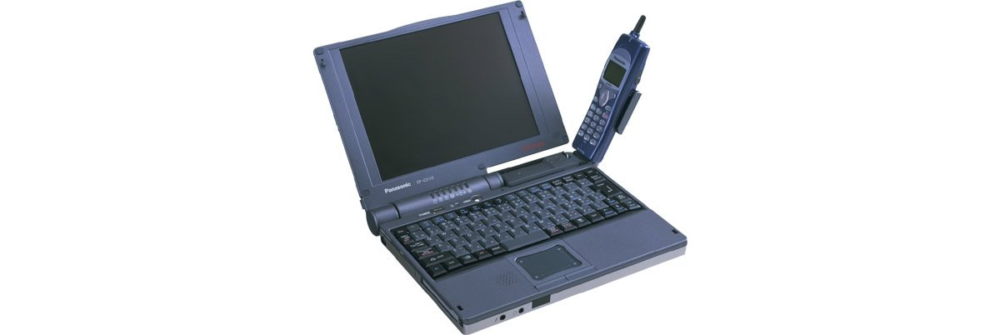

# Panasonic Let's note CF-C33 Specifications

**English** · [日本語](../../ja/CF-C33/) · [中文](../../zh/CF-C33/)

🗄️ See this model in the [Let's note Cabinet](https://letsnote-specs.github.io/en/CF-C33/).

**CF-C33** is a Panasonic Let's note laptop in the comm C33 series with a 8.4-inch SVGA display. This page lists all 5 part numbers, released 1998-10 – 1999-02. Each part number links to its official spec sheet.

*Panasonic Let's note CF-C33 (CF-C33EAJ8C, CF-C33EJ8C, CF-C33J8C). Image © Panasonic.*

## Part numbers

| Part number | Released | Discontinued | Summary |
| :-- | :-- | :-- | :-- |
| [CF-C33EAJ8C](https://panasonic.jp/pc/p-db/CF-C33EAJ8C_spec.html) | 1999-02 | 1999-07 | MMX Pentium (266MHz), HDD: 4.3GB, memory 96MB, camera, Windows 98 |
| [CF-C33EJ8C](https://panasonic.jp/pc/p-db/CF-C33EJ8C_spec.html) | 1999-02 | 1999-03 | MMX Pentium (266MHz), HDD: 4.3GB, memory 96MB, camera, Windows 98 |
| [CF-C33EJ8K](https://panasonic.jp/pc/p-db/CF-C33EJ8K_spec.html) | 1999-02 | 1999-03 | MMX Pentium (266MHz), HDD: 4.3GB, memory 96MB, mobile phone support, Windows 98 |
| [CF-C33J8K](https://panasonic.jp/pc/p-db/CF-C33J8K_spec.html) | 1998-11 | 1999-01 | MMX Pentium (233MHz), HDD: 3.2GB, memory 96MB, mobile phone support, Windows 98 |
| [CF-C33J8C](https://panasonic.jp/pc/p-db/CF-C33J8C_spec.html) | 1998-10 | 1998-12 | MMX Pentium (233MHz), HDD: 3.2GB, memory 96MB, camera, Windows 98 |

## Common specifications

| Item | Value |
| :-- | :-- |
| Chipset | Intel(R) 430TX PCIset |
| Memory | Standard 96MB SDRAM (max. 96MB) |
| Video memory | 2MB |
| Graphics chip | NeoMagic NM2160 |
| Floppy drive (optional) | External 3.5-inch 3-mode support (1.44MB /1.2MB /720KB) |
| Display | SVGA (800×600 dots) 8.4-inch polysilicon TFT color LCD |
| Display / LCD colors | 800×600, 640×480 dots approx. 260,000 colors |
| Display / External output | 640×480, 800×600 dots: approx. 16 million colors, 1024×768 dots: 65,536 colors |
| Display / Simultaneous display | Main unit 800×600 dots: approx. 260,000 colors / External display 800×600 dots: approx. 16 million colors |
| Modem | Built-in Data: 56kbps (V.90/K56flex auto-supported) FAX: 14.4kbps (RJ-11) *2 |
| Audio | PCM sound source (Sound Blaster PRO compatible), FM sound source, monaural speaker, built-in monaural microphone |
| Memory expansion slot | 144-pin DIMM dedicated slot ×1 / (No free slot because 64MB has been added) |
| Ports / Audio | Microphone input (mini jack), audio output (mini jack) |
| Ports / Infrared | IrDA V1.1-compliant 4Mbps *3 |
| Ports / Other | Expansion bus connector |
| Ports / Optional I/O box | Serial (Dsub 9-pin), Parallel (Dsub 25-pin), External display (mini D-sub 9-pin), External mouse/keyboard (mini Din 6-pin), FDD connector |
| Ports / Optional mini I/O box | External display (mini D-sub 9-pin), external mouse/keyboard (mini Din 6-pin) |
| Keyboard | OADG-compliant keyboard (86 keys), key pitch 15mm |
| Power | AC 100V-240V (50Hz/60Hz) (AC cord is for 100V only), / Standard battery pack / Extended battery pack <optional> (lithium-ion) |
| Power consumption | approx. 27W |
| Energy efficiency | In standby mode: approx. 1.0W *4 |
| Battery | Standard battery pack / Runtime: approx. 2.5 hours *5 Charging: approx. 3 hours (power OFF), approx. 5 hours (power ON) *6 / Large capacity battery pack <sold separately> / Runtime: approx. 8 hours *5 Charging: approx. 7 hours (power OFF), approx. 15 hours (power ON) *6 |
| Dimensions (W×D×H) | 255mm × 182mm × 25.4mm (excluding protrusions) |

## Differences by part number

| Part number | CPU | Memory | Storage | Weight | Battery life |
| :-- | :-- | :-- | :-- | :-- | :-- |
| CF-C33EAJ8C | MMX Technology Pentium 266MHz | 96MB SDRAM | 4.3GB | 1.0 kg | 2.5 h |
| CF-C33EJ8C | MMX Technology Pentium 266MHz | 96MB SDRAM | 4.3GB | 1.0 kg | 2.5 h |
| CF-C33EJ8K | MMX Technology Pentium 266MHz | 96MB SDRAM | 4.3GB | 1.1 kg | 2.5 h |
| CF-C33J8K | MMX Technology Pentium 233MHz | 96MB SDRAM | 3.2GB | 1.1 kg | 2.5 h |
| CF-C33J8C | MMX Technology Pentium 233MHz | 96MB SDRAM | 3.2GB | 1.0 kg | 2.5 h |

CF-C33EAJ8C: all differing specifications

| Item | Value |
| :-- | :-- |
| CPU | Intel(R) MMX(R) technology Pentium(R) processor 266MHz |
| L2 cache | 512KB |
| Hard disk | 4.3GB (UltraATA) ※1 |
| PC Card slot | PC card (TypeII ×1 slot), CardBus compatible, ZV-Port compatible / (ZV-Port not supported when 350,000-pixel CCD camera unit <sold separately> is installed) |
| Interface / communication connector | Camera unit (VGA 350,000-pixel CCD camera, rotating type) included |
| Pointing device | Smart Pointer III |
| Weight (with battery) | approx. 1.0kg |
| Software | Microsoft(R) Windows(R) 98, / Microsoft(R) IME 98, / Adobe(R) Acrobat(R) Reader 3.0J ◆, / Quick Capture, / Image Browser, / VideoLink(TM) 323/324 PC Videophone Software *7, / Mobile Phone ◆*8, / Visual Mail (Movie Mail, Illustration Mail *9, Portrait Mail, Voice-on Mail), / Quick Launcher, / Intellisync(TM) for Notebooks ◆, / NIFTY Manager for Windows ◆, / Panasonic Hi-HO Online Sign-up Software |
| Notes | ※1 HDD capacity is displayed as 1GB=1,000,000,000 bytes. / ※2 For use only with NTT analog general lines within Japan. It automatically detects and switches between V.90 and K56flex. Also, 56kbps is the theoretical value when receiving data. When sending data, 33.6kpbs is the maximum speed. / ※3 The effective distance of the infrared communication port is 20–50cm. / ※4 Energy consumption efficiency based on the Energy Saving Act. / ※5 CPU 25%, at the minimum LCD backlight brightness. Varies depending on the operating environment and system settings. / ※6 Charging a fully discharged battery may take time. Even when the power is off, power is consumed, so the battery will run out approximately 1 week after a full charge (when using the standard battery). Also, the charging time when the power is ON is the shortest case. It varies depending on the operating state of the computer. / ※7 Mobile phones and PHS are not supported. / ※8 Fax sizes are the two types A4/letter. / ※9 Some characters may not be displayed correctly depending on the font type. Please use a monospaced font. / Support for the operation of software marked with ◆ is provided by each software manufacturer. / ●This computer is not guaranteed to operate with anything other than Windows 98. / ●This computer is equipped with the APM function in its shipped state. Therefore, functions such as "On-Now" supported by Windows 98 are restricted. / ●Among software and peripherals generally labeled for Windows 98, some cannot be used with this computer. Regarding purchases, please confirm with the seller of each software and peripheral. / ●The included Product Recovery CD-ROM cannot be used to reinstall only the OS. / ●A CD-ROM drive necessary for system reinstallation is not included. It must be purchased separately. |

Official spec sheet: <https://panasonic.jp/pc/p-db/CF-C33EAJ8C_spec.html>

CF-C33EJ8C: all differing specifications

| Item | Value |
| :-- | :-- |
| CPU | Intel(R) MMX(R) technology Pentium(R) processor 266MHz |
| L2 cache | 512KB |
| Hard disk | 4.3GB (UltraATA) ※1 |
| PC Card slot | PC card (TypeII ×1 slot), CardBus compatible, ZV-Port compatible / (ZV-Port not supported when 350,000-pixel CCD camera unit <sold separately> is installed) |
| Interface / communication connector | Camera unit (VGA 350,000-pixel CCD camera, rotating type) included |
| Pointing device | Smart Pointer II |
| Weight (with battery) | approx. 1.0kg |
| Software | Microsoft(R) Windows(R) 98, / Microsoft(R) IME 98, / Adobe(R) Acrobat(R) Reader 3.0J ◆, / Quick Capture, / Image Browser, / Movie Mail, / VideoLink(TM) 323/324 PC Videophone Software *7, / Mobile Phone ◆*8, / Quick Launcher, / Intellisync(TM) for Notebooks ◆, / NIFTY Manager for Windows ◆, / Panasonic Hi-HO Online Sign-up Software |
| Notes | ※1 HDD capacity is displayed as 1GB=1,000,000,000 bytes. / ※2 For use only with NTT analog general lines within Japan. It automatically detects and switches between V.90 and K56flex. Also, 56kbps is the theoretical value when receiving data. When sending data, 33.6kpbs is the maximum speed. / ※3 The effective distance of the infrared communication port is 20–50cm. / ※4 Energy consumption efficiency based on the Energy Saving Act. / ※5 CPU 25%, at the minimum LCD backlight brightness. Varies depending on the operating environment and system settings. / ※6 Charging a fully discharged battery may take time. Even when the power is off, power is consumed, so the battery will run out approximately 1 week after a full charge (when using the standard battery). Also, the charging time when the power is ON is the shortest case. It varies depending on the operating state of the computer. / ※7 Mobile phones and PHS are not supported. / ※8 Fax sizes are the two types A4/letter. / Support for the operation of software marked with ◆ is provided by each software manufacturer. / ●This computer is not guaranteed to operate with anything other than Windows 98. / ●This computer is equipped with the APM function in its shipped state. Therefore, functions such as "On-Now" supported by Windows 98 are restricted. / ●Among software and peripherals generally labeled for Windows 98, some cannot be used with this computer. Regarding purchases, please confirm with the seller of each software and peripheral. / ●The included Product Recovery CD-ROM cannot be used to reinstall only the OS. / ●A CD-ROM drive necessary for system reinstallation is not included. It must be purchased separately. |

Official spec sheet: <https://panasonic.jp/pc/p-db/CF-C33EJ8C_spec.html>

CF-C33EJ8K: all differing specifications

| Item | Value |
| :-- | :-- |
| CPU | Intel(R) MMX(R) technology Pentium(R) processor 266MHz |
| L2 cache | 512KB |
| Hard disk | 4.3GB (UltraATA) ※1 |
| PC Card slot | PC card (TypeII ×1 slot), CardBus compatible, ZV-Port compatible / (ZV-Port not supported when 350,000-pixel CCD camera unit <sold separately> is installed) |
| Interface / communication connector | Mobile phone interface unit (DoPa compatible) included |
| Pointing device | Smart Pointer II |
| Weight (with battery) | approx. 1.1kg |
| Software | Microsoft(R) Windows(R) 98, / Microsoft(R) IME 98, / Adobe(R) Acrobat(R) Reader 3.0J ◆, / Quick Capture, / Image Browser, / Movie Mail, / VideoLink(TM) 323/324 PC Videophone Software *7, / Mobile Phone ◆*8, / Quick Launcher, / Intellisync(TM) for Notebooks ◆, / NIFTY Manager for Windows ◆, / Panasonic Hi-HO Online Sign-up Software |
| Notes | ※1 HDD capacity is displayed as 1GB=1,000,000,000 bytes. / ※2 For use only with NTT analog general lines within Japan. It automatically detects and switches between V.90 and K56flex. Also, 56kbps is the theoretical value when receiving data. When sending data, 33.6kpbs is the maximum speed. / ※3 The effective distance of the infrared communication port is 20–50cm. / ※4 Energy consumption efficiency based on the Energy Saving Act. / ※5 CPU 25%, at the minimum LCD backlight brightness. Varies depending on the operating environment and system settings. / ※6 Charging a fully discharged battery may take time. Even when the power is off, power is consumed, so the battery will run out approximately 1 week after a full charge (when using the standard battery). Also, the charging time when the power is ON is the shortest case. It varies depending on the operating state of the computer. / ※7 Mobile phones and PHS are not supported. / ※8 Fax sizes are the two types A4/letter. / Support for the operation of software marked with ◆ is provided by each software manufacturer. / ●This computer is not guaranteed to operate with anything other than Windows 98. / ●This computer is equipped with the APM function in its shipped state. Therefore, functions such as "On-Now" supported by Windows 98 are restricted. / ●Among software and peripherals generally labeled for Windows 98, some cannot be used with this computer. Regarding purchases, please confirm with the seller of each software and peripheral. / ●The included Product Recovery CD-ROM cannot be used to reinstall only the OS. / ●A CD-ROM drive necessary for system reinstallation is not included. It must be purchased separately. / ●A mobile phone is not included. |

Official spec sheet: <https://panasonic.jp/pc/p-db/CF-C33EJ8K_spec.html>

CF-C33J8K: all differing specifications

| Item | Value |
| :-- | :-- |
| CPU | Intel(R) MMX(R) technology Pentium(R) processor 233MHz |
| L2 cache | 256KB |
| Hard disk | 3.2GB (UltraATA) ※1 |
| PC Card slot | PC card (TypeII ×1 slot), CardBus compatible, ZV-Port compatible / (ZV-Port not supported when 350,000-pixel CCD camera unit <sold separately> is installed) |
| Interface / communication connector | Mobile phone interface unit included |
| Pointing device | Smart Pointer |
| Weight (with battery) | approx. 1.1kg |
| Software | Microsoft(R) Windows(R) 98, / Microsoft(R) IME 98, / Adobe(R) Acrobat(R) Reader 3.0J ◆, / Quick Capture, / Image Browser, / Movie Mail, / VideoLink(TM) 323/324 PC Videophone Software *7, / Mobile Phone ◆*8, / Quick Launcher, / Intellisync(TM) for Notebooks ◆, / NIFTY Manager for Windows ◆, / Panasonic Hi-HO Online Sign-up Software |
| Notes | ※1 HDD capacity is displayed as 1GB=1,000,000,000 bytes. / ※2 For use only with NTT analog general lines within Japan. It automatically detects and switches between V.90 and K56flex. Also, 56kbps is the theoretical value when receiving data. When sending data, 33.6kpbs is the maximum speed. / ※3 The effective distance of the infrared communication port is 20–50cm. / ※4 Energy consumption efficiency based on the Energy Saving Act. / ※5 In power saving mode, at LCD backlight power saving. Varies depending on the operating environment and system settings. / ※6 Charging a fully discharged battery may take time. Even when the power is off, power is consumed, so if left unused the battery will run out. Also, the charging time when the power is ON is the shortest case. It varies depending on the operating state of the computer. / ※7 Mobile phones and PHS are not supported. / ※8 Fax sizes are the two types A4/letter. / Support for the operation of software marked with ◆ is provided by each software manufacturer. / ●This computer is not guaranteed to operate with anything other than Windows 98. / ●This computer is equipped with the APM function in its shipped state. Therefore, functions such as "On-Now" supported by Windows 98 are restricted. / ●Among software and peripherals generally labeled for Windows 98, some cannot be used with this computer. Regarding purchases, please confirm with the seller of each software and peripheral. / ●The included Product Recovery CD-ROM cannot be used to reinstall only the OS. / ●A CD-ROM drive necessary for system reinstallation is not included. It must be purchased separately. / ●A mobile phone is not included. |

Official spec sheet: <https://panasonic.jp/pc/p-db/CF-C33J8K_spec.html>

CF-C33J8C: all differing specifications

| Item | Value |
| :-- | :-- |
| CPU | Intel(R) MMX(R) technology Pentium(R) processor 233MHz |
| L2 cache | 256KB |
| Hard disk | 3.2GB (UltraATA) ※1 |
| PC Card slot | PC card (TypeII ×1 slot), CardBus compatible, ZV-Port compatible / (ZV-Port not supported when 350,000-pixel CCD camera unit is installed) |
| Interface / communication connector | Camera unit (VGA 350,000-pixel CCD camera, rotating type) included |
| Pointing device | Smart Pointer |
| Weight (with battery) | approx. 1.0kg |
| Software | Microsoft(R) Windows(R) 98, / Microsoft(R) IME 98, / Adobe(R) Acrobat(R) Reader 3.0J ◆, / Quick Capture, / Image Browser, / Movie Mail, / VideoLink(TM) 323/324 PC Videophone Software *7, / Mobile Phone ◆*8, / Quick Launcher, / Intellisync(TM) for Notebooks ◆, / NIFTY Manager for Windows ◆, / Panasonic Hi-HO Online Sign-up Software |
| Notes | ※1 HDD capacity is displayed as 1GB=1,000,000,000 bytes. / ※2 For use only with NTT analog general lines within Japan. It automatically detects and switches between V.90 and K56flex. Also, 56kbps is the theoretical value when receiving data. When sending data, 33.6kpbs is the maximum speed. / ※3 The effective distance of the infrared communication port is 20–50cm. / ※4 Energy consumption efficiency based on the Energy Saving Act. / ※5 In power saving mode, at LCD backlight power saving. Varies depending on the operating environment and system settings. / ※6 Charging a fully discharged battery may take time. Even when the power is off, power is consumed, so if left unused the battery will run out. Also, the charging time when the power is ON is the shortest case. It varies depending on the operating state of the computer. / ※7 Mobile phones and PHS are not supported. / ※8 Fax sizes are the two types A4/letter. / Support for the operation of software marked with ◆ is provided by each software manufacturer. / ●This computer is not guaranteed to operate with anything other than Windows 98. / ●This computer is equipped with the APM function in its shipped state. Therefore, functions such as "On-Now" supported by Windows 98 are restricted. / ●Among software and peripherals generally labeled for Windows 98, some cannot be used with this computer. Regarding purchases, please confirm with the seller of each software and peripheral. / ●The included Product Recovery CD-ROM cannot be used to reinstall only the OS. / ●A CD-ROM drive necessary for system reinstallation is not included. It must be purchased separately. |

Official spec sheet: <https://panasonic.jp/pc/p-db/CF-C33J8C_spec.html>

## Photos

*Panasonic Let's note CF-C33 (CF-C33EJ8K, CF-C33J8K). Image © Panasonic.*

## Related models

- [All Let's note models](../)

---

Source: Panasonic's official [discontinued-models list](https://panasonic.jp/pc/support/products/) and spec sheets (panasonic.jp), translated from Japanese; see the official sheets for the authoritative wording. Product images © Panasonic. This is an unofficial compilation, not affiliated with Panasonic.
