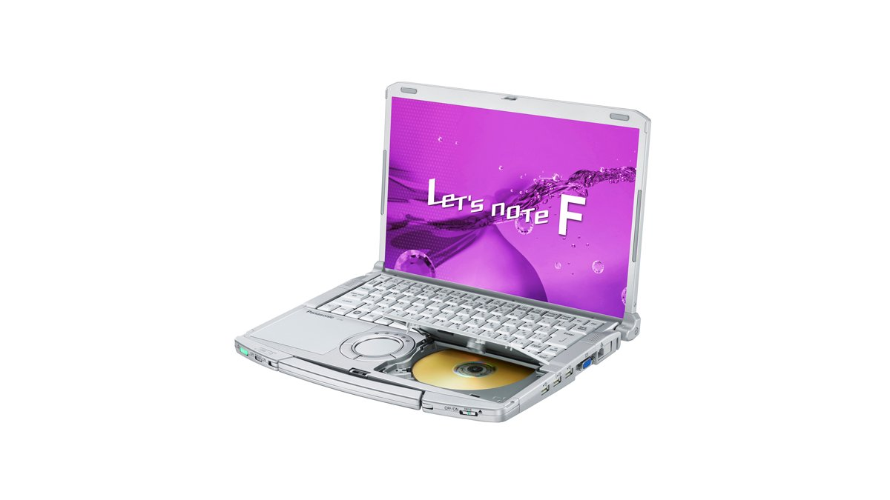
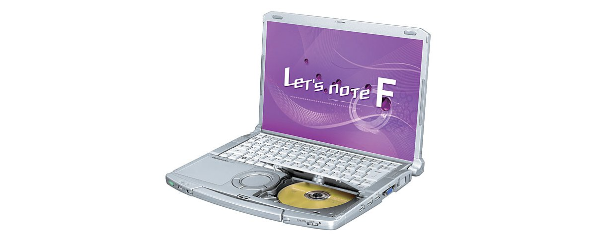
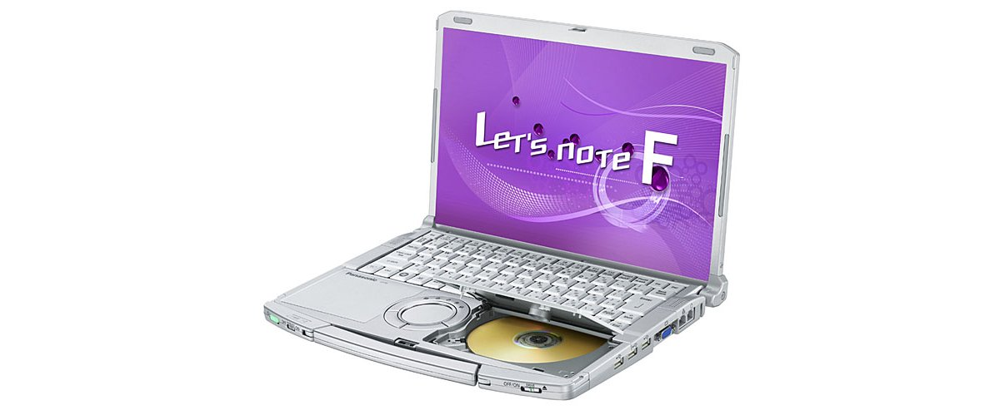
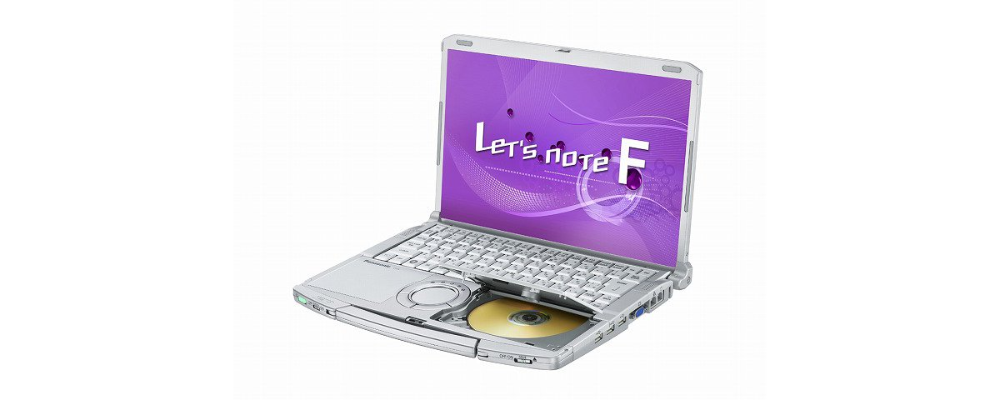

# Panasonic Let's note CF-F8 Specifications

**English** · [日本語](../../ja/CF-F8/) · [中文](../../zh/CF-F8/)

**CF-F8** is a Panasonic Let's note laptop in the F8 series with a 14.1-inch WXGA＋/WXGA display. This page lists all 6 part numbers, released 2008-10 – 2009-10. Each part number links to its official spec sheet.

*Panasonic Let's note CF-F8 (CF-F8HYRCDR, CF-F8HYRNDR). Image © Panasonic.*

## Part numbers

| Part number | Released | Discontinued | Summary |
| :-- | :-- | :-- | :-- |
| [CF-F8HYRCDR](https://panasonic.jp/pc/p-db/CF-F8HYRCDR_spec.html) | 2009-10 | 2010-01 | Windows®7 Professional genuine version, Intel® CoreTM2 Duo SU9400 (1.40GHz), Memory: standard 2GB (max 4GB), HDD: 250GB, Super Multi Drive, LAN, wireless LAN 802.11a(W52/W53/W56)/b/g/n |
| [CF-F8HYRNDR](https://panasonic.jp/pc/p-db/CF-F8HYRNDR_spec.html) | 2009-10 | 2010-01 | Windows®7 Professional genuine version, Intel® CoreTM2 Duo SU9400 (1.40GHz), Memory: standard 2GB (max 4GB), HDD: 250GB, Super Multi Drive, LAN, wireless LAN 802.11a(W52/W53/W56)/b/g/n, Office Personal 2007 <limited quantity> |
| [CF-F8GWQCJR](https://panasonic.jp/pc/p-db/CF-F8GWQCJR_spec.html) | 2009-05 | 2009-09 | Windows Vista® Business with SP1 genuine version, Intel® CoreTM2 Duo SU9400 (1.40GHz), Memory: 1GB+1GB (max 3GB), HDD: 160GB, WXGA (1280×800 dots) LCD, Super Multi Drive, LAN, Wireless LAN 802.11a(W52/W53/W56)/b/g/n |
| [CF-F8GWQQJR](https://panasonic.jp/pc/p-db/CF-F8GWQQJR_spec.html) | 2009-05 | 2009-09 | Windows Vista® Business with SP1 genuine version, Intel® CoreTM2 Duo SU9400 (1.40GHz), Memory: 1GB+1GB (max 3GB), HDD: 160GB, WXGA (1280×800 dots) LCD, LAN, Wireless LAN 802.11a(W52/W53/W56)/b/g/n, Office Personal 2007 <limited quantity> |
| [CF-F8FWMQJR](https://panasonic.jp/pc/p-db/CF-F8FWMQJR_spec.html) | 2009-02 | 2009-05 | Windows Vista® Business with SP1 genuine version, Intel® CoreTM2 Duo SP9300 (2.26GHz), Memory: 1GB+1GB (max 3GB), HDD: 250GB, WXGA+ (1440×900 dots) LCD, Super Multi Drive, LAN, Wireless LAN 802.11a(W52/W53/W56)/b/g/n |
| [CF-F8EWJJJR](https://panasonic.jp/pc/p-db/CF-F8EWJJJR_spec.html) | 2008-10 | 2009-01 | Windows Vista® Business with SP1 genuine version, Intel® CoreTM2 Duo SP9300 (2.26GHz), Memory: 1GB+1GB (max 3GB), HDD: 160GB, WXGA+ (1440×900 dots) LCD, Super Multi Drive, LAN, Wireless LAN 802.11a(J52/W52/W53/W56)/b/g/n |

## Common specifications

| Item | Value |
| :-- | :-- |
| Security chip | TPM (TCG V1.2 compliant) |
| Pointing device | Wheel pad |
| Dimensions (W×D×H) | Width 326mm × Depth 251mm × Height 25.5mm/48.5mm (front/rear) |

## Differences by part number

| Part number | CPU | Memory | Storage | Weight | Battery life |
| :-- | :-- | :-- | :-- | :-- | :-- |
| CF-F8HYRCDR | Ultra-low voltage version Core2 SU9400 | 2GB | 250GB | 1.65 kg | — |
| CF-F8HYRNDR | Ultra-low voltage version Core2 SU9400 | 2GB | 250GB | 1.65 kg | — |
| CF-F8GWQCJR | — | 2GB | 160GB | 1.64 kg | — |
| CF-F8GWQQJR | — | 2GB | 160GB | 1.64 kg | — |
| CF-F8FWMQJR | — | 2GB DDR2 SDRAM | 250GB | 1.63 kg | — |
| CF-F8EWJJJR | — | 2GB DDR2 SDRAM | 160GB | 1.63 kg | — |

CF-F8HYRCDR: all differing specifications

| Item | Value |
| :-- | :-- |
| OS | Windows7(R)Professional genuine edition (32-bit) (includes Windows(R) XP downgrade rights) |
| CPU | Ultra-low voltage Intel(R) CoreTM2 processor SU9400 / operating frequency 1.40GHz / 2nd-level cache memory 3MB, front side bus 800MHz |
| Chipset | Mobile Intel(R) GM45 Express chipset |
| Memory | Standard 2GB (1 free slot) / maximum 4GB |
| Video memory | Max 789MB, 1551MB when 2GB memory is added (shared with main memory) |
| Hard disk | 250GB (Serial ATA) *Of the above capacity, approx. 10GB is used as a repair area (including the recovery data area) and approx. 500MB as a system area (unavailable to the user) |
| Optical drive | Built-in Super Multi Drive, equipped with buffer underrun error prevention function (SmoothLink) |
| Optical drive speed / Read | DVD-RAM max 5x [4.7GB], DVD-R max 8x, DVD-R DL max 8x, DVD-RW max 8x, DVD-ROM max 8x, +R max 8x, +R DL max 8x, +RW max 8x, CD-ROM max 24x, CD-R max 24x, CD-RW max 24x |
| Optical drive speed / Write | DVD-RAM max 5x [4.7GB], DVD-R max 8x, DVD-RW max 6x, +R max 8x, + RW max 4x, High Speed +RW max 6x, CD-R max 24x, CD-RW 4x, High Speed CD-RW 10x |
| Supported discs / Read | DVD-RAM, DVD-ROM, DVD-Video, DVD-R, DVD-RW, DVD-R DL, +R, +R DL, +RW, CD-Audio, CD-R, CD-ROM (XA support), PhotoCD (multi-session support), VideoCD, CD-EXTRA, CD-TEXT, CD-RW |
| Supported discs / Write | DVD-RAM、DVD-R、DVD-RW、+R、+RW、CD-R、CD-RW |
| Floppy drive (optional) | (Sold separately) USB-connected external 3.5-inch 3-mode compatible (1.44MB/1.2MB/720KB) |
| Display | 14.1-inch TFT color LCD WXGA (1280×800 dots) |
| Display / LCD colors | 1280×800 dots: approx. 16.77 million colors |
| Display / External output | 1280×800, 800×600, 1024×768, 1280×768, 1280×1024, 1400×1050, 1680×1050, 1600×1200, 1920×1080, 1920×1200 dots: approx. 16.77 million colors |
| Display / Simultaneous display | 800×600, 1024×768, 1280×768, 1280×800 dots: approx. 16.77 million colors |
| Wireless communication | Intel(R) WiMAX/WiFi Link5150 |
| Wireless LAN | WPA2-AES/TKIP compatible, Wi-Fi compliant IEEE802.11a (W52/W53/W56)/b/g compliant, IEEE802.11n draft 2.0 compliant |
| Mobile WiMAX | Built-in (max. 13Mbps receive, max. 3Mbps transmit) |
| Wired LAN | 1000BASE-T / 100BASE-TX / 10BASE-T |
| Audio | PCM sound source (24-bit stereo), Intel(R) High Definition Audio compliant, stereo speakers |
| Card slots / PC Card | PC card (TYPEII) ×1 slot (CardBus compatible, allowable current 3.3V: 400mA, 5V: 400mA) |
| Card slots / SD card | SD memory card ×1 slot (SDHC memory card/copyright protection technology support) |
| Memory expansion slot | DDR2 200-pin SO-DIMM dedicated slot ×1 (1.8V/PC2-5300/DDR2 SDRAM) |
| Ports | LAN connector (RJ-45), external display connector (analog RGB mini Dsub 15-pin), HDMI output terminal (equipped on S8/N8 only), microphone input (stereo mini jack M3 (plug-in power compatible)), audio output (stereo mini jack M3) |
| Keyboard | OADG-compliant 86 keys, key pitch 19mm (vertical and horizontal) (excluding some keys) |
| Power | ▼AC adapter / Input: AC100V–240V, 50Hz/60Hz, Output: DC16 V, 3.75A, power cord for 100V only / ▼Battery pack / 7.2V lithium-ion, nominal capacity 12.4Ah, rated capacity 11.6Ah |
| Power consumption | Max approx. 60W |
| Energy efficiency | 2007 fiscal year standard Ｉ category 0.00034 |
| Efficiency target achievement | — |
| Weight (with battery) | Approx. 1.65kg (with included battery pack (approx. 0.32kg) installed) |
| Software | Microsoft(R) Internet Explorer8.0, Adobe Reader, Microsoft(R) Windows(R) Media Player 12, Microsoft(R) Windows(R) Movie Maker 6.0, Microsoft(R) .NET Framework 3.5.1, Windows Live Mail, Windows Live Messenger, Windows Live Photo Gallery, Windows Live Writer, Zoom Viewer, PC Information Viewer, PC Information Pop-up, NumLock Notification, Wireless Manager mobile edition 5.5, Wireless Switching Utility, Security Setting Utility, Infineon TPM Professional Package V3.6, Battery Remaining Charge Display Correction Utility, Hotkey Settings, McAfee PC Security Center, Midori no goo Stick, Hard Disk Data Erase Utility, Wheel Pad Utility, Net Selector 2, USB Keyboard Helper, USB Mouse Helper, Fn Ctrl Function Swap Utility, i-Filter 5.0 (30-day Trial Version), Panasonic Power Plan Extension Utility, Display Helper, Pittari View*, Aptio Setup Utility, PC-Diagnostic Utility, Optical Disc Drive Letter Change Utility, Roxio Creator LJB, MyDVD, WinDVD8 (OEM Version) CPRM Support |
| Accessories | Product Recovery DVD-ROM 2 discs (for Windows 7 / for Windows XP), AC adapter, battery pack, instruction manual, etc. |

Official spec sheet: <https://panasonic.jp/pc/p-db/CF-F8HYRCDR_spec.html>

CF-F8HYRNDR: all differing specifications

| Item | Value |
| :-- | :-- |
| OS | Windows7(R)Professional genuine edition (32-bit) (includes Windows(R) XP downgrade rights) |
| CPU | Ultra-low voltage Intel(R) CoreTM2 processor SU9400 / operating frequency 1.40GHz / 2nd-level cache memory 3MB, front side bus 800MHz |
| Chipset | Mobile Intel(R) GM45 Express chipset |
| Memory | Standard 2GB (1 free slot) / maximum 4GB |
| Video memory | Max 789MB, 1551MB when 2GB memory is added (shared with main memory) |
| Hard disk | 250GB (Serial ATA) *Of the above capacity, approx. 10GB is used as a repair area (including the recovery data area) and approx. 500MB as a system area (unavailable to the user) |
| Optical drive | Built-in Super Multi Drive, equipped with buffer underrun error prevention function (SmoothLink) |
| Optical drive speed / Read | DVD-RAM max 5x [4.7GB], DVD-R max 8x, DVD-R DL max 8x, DVD-RW max 8x, DVD-ROM max 8x, +R max 8x, +R DL max 8x, +RW max 8x, CD-ROM max 24x, CD-R max 24x, CD-RW max 24x |
| Optical drive speed / Write | DVD-RAM max 5x [4.7GB], DVD-R max 8x, DVD-RW max 6x, +R max 8x, + RW max 4x, High Speed +RW max 6x, CD-R max 24x, CD-RW 4x, High Speed CD-RW 10x |
| Supported discs / Read | DVD-RAM, DVD-ROM, DVD-Video, DVD-R, DVD-RW, DVD-R DL, +R, +R DL, +RW, CD-Audio, CD-R, CD-ROM (XA support), PhotoCD (multi-session support), VideoCD, CD-EXTRA, CD-TEXT, CD-RW |
| Supported discs / Write | DVD-RAM、DVD-R、DVD-RW、+R、+RW、CD-R、CD-RW |
| Floppy drive (optional) | (Sold separately) USB-connected external 3.5-inch 3-mode compatible (1.44MB/1.2MB/720KB) |
| Display | 14.1-inch TFT color LCD WXGA (1280×800 dots) |
| Display / LCD colors | 1280×800 dots: approx. 16.77 million colors |
| Display / External output | 1280×800, 800×600, 1024×768, 1280×768, 1280×1024, 1400×1050, 1680×1050, 1600×1200, 1920×1080, 1920×1200 dots: approx. 16.77 million colors |
| Display / Simultaneous display | 800×600, 1024×768, 1280×768, 1280×800 dots: approx. 16.77 million colors |
| Wireless communication | Intel(R) WiMAX/WiFi Link5150 |
| Wireless LAN | WPA2-AES/TKIP compatible, Wi-Fi compliant IEEE802.11a (W52/W53/W56)/b/g compliant, IEEE802.11n draft 2.0 compliant |
| Mobile WiMAX | Built-in (max. 13Mbps receive, max. 3Mbps transmit) |
| Wired LAN | 1000BASE-T / 100BASE-TX / 10BASE-T |
| Audio | PCM sound source (24-bit stereo), Intel(R) High Definition Audio compliant, stereo speakers |
| Card slots / PC Card | PC card (TYPEII) ×1 slot (CardBus compatible, allowable current 3.3V: 400mA, 5V: 400mA) |
| Card slots / SD card | SD memory card ×1 slot (SDHC memory card/copyright protection technology support) |
| Memory expansion slot | DDR2 200-pin SO-DIMM dedicated slot ×1 (1.8V/PC2-5300/DDR2 SDRAM) |
| Ports | LAN connector (RJ-45), external display connector (analog RGB mini Dsub 15-pin), HDMI output terminal (equipped on S8/N8 only), microphone input (stereo mini jack M3 (plug-in power compatible)), audio output (stereo mini jack M3) |
| Keyboard | OADG-compliant 86 keys, key pitch 19mm (vertical and horizontal) (excluding some keys) |
| Power | ▼AC adapter / Input: AC100V–240V, 50Hz/60Hz, Output: DC16 V, 3.75A, power cord for 100V only / ▼Battery pack / 7.2V lithium-ion, nominal capacity 12.4Ah, rated capacity 11.6Ah |
| Power consumption | Max approx. 60W |
| Energy efficiency | 2007 fiscal year standard Ｉ category 0.00034 |
| Efficiency target achievement | — |
| Weight (with battery) | Approx. 1.65kg (with included battery pack (approx. 0.32kg) installed) |
| Software | Microsoft(R) Internet Explorer8.0, Adobe Reader, Microsoft(R) Windows(R) Media Player 12, Microsoft(R) Windows(R) Movie Maker 6.0, Microsoft(R) .NET Framework 3.5.1, Windows Live Mail, Windows Live Messenger, Windows Live Photo Gallery, Windows Live Writer, Zoom Viewer, PC Information Viewer, PC Information Pop-up, NumLock Notification, Wireless Manager mobile edition 5.5, Wireless Switching Utility, Security Setting Utility, Infineon TPM Professional Package V3.6, Battery Remaining Charge Display Correction Utility, Hotkey Settings, McAfee PC Security Center, Midori no goo Stick, Hard Disk Data Erase Utility, Wheel Pad Utility, Net Selector 2, USB Keyboard Helper, USB Mouse Helper, Fn Ctrl Function Swap Utility, i-Filter 5.0 (30-day Trial Version), Panasonic Power Plan Extension Utility, Display Helper, Pittari View*, Aptio Setup Utility, PC-Diagnostic Utility, Optical Disc Drive Letter Change Utility, Roxio Creator LJB, MyDVD, WinDVD8 (OEM Version) CPRM Support, Microsoft(R) Office Personal 2007 with Microsoft(R) Office PowerPoint(R) 2007 (Service Pack 1) |
| Accessories | Product Recovery DVD-ROM 2 discs (for Windows 7 / for Windows XP), AC adapter, battery pack, instruction manual, etc. |

Official spec sheet: <https://panasonic.jp/pc/p-db/CF-F8HYRNDR_spec.html>

CF-F8GWQCJR: all differing specifications

| Item | Value |
| :-- | :-- |
| OS | Windows Vista (R) Business with Service Pack 1 genuine edition (includes Windows (R) XP downgrade rights) |
| CPU | vPro(TM) Technology Intel(R) Centrino(R)2 / Intel(R) Core(TM)2 Duo Processor Ultra Low Voltage version SU9400 / Secondary cache memory 3MB, operating frequency 1.40GHz, front side bus 800MHz |
| Chipset | Mobile Intel(R) GS45 Express chipset |
| Memory | Standard 2GB (0 free slots; 1GB memory already added to expansion memory slot) / maximum 3GB |
| Video memory | Max 797MB / up to 1309MB when expansion memory is changed from 1GB to 2GB (shared with main memory) |
| Hard disk | 160GB (Serial ATA, 5400 rpm 2.5-inch HDD) Of the stated capacity, approx. 8GB is used as a repair area (including the recovery data area) (unavailable to the user) |
| Optical drive | Built-in Super Multi Drive, equipped with buffer underrun error prevention function (SmoothLink) |
| Optical drive speed / Read | DVD-RAM 5x [4.7GB], DVD-R max 8x, DVD-R DL max 8x, DVD-RW max 8x, DVD-ROM max 8x, +R max 8x, +R DL max 8x, +RW max 8x, CD-ROM max 24x, CD-R max 24x, CD-RW max 24x |
| Optical drive speed / Write | DVD-RAM max 5x [4.7GB], DVD-R max 8x, DVD-RW max 6x, +R max 8x, +RW max 4x, High Speed +RW max 6x, CD-R max 24x, CD-RW 4x, High Speed CD-RW max 10x |
| Supported discs / Read | DVD-RAM, DVD-ROM, DVD-Video, DVD-R, DVD-RW, DVD-R DL, +R, +R DL, +RW, CD-Audio, CD-R, CD-ROM (XA support), / PhotoCD (multi-session support), VideoCD, CD-EXTRA, CD-TEXT, CD-RW |
| Supported discs / Write | DVD-RAM、DVD-R、DVD-RW、＋R、＋RW、CD-R、CD-RW |
| Floppy drive (optional) | USB-connected external 3.5-inch 3-mode compatible (1.44MB/1.2MB/720KB) |
| Display | WXGA (1280×800 dots) 14.1-inch TFT color LCD |
| Display / LCD colors | 1280×800 dots: approx. 16.77 million colors |
| Display / External output | 800×600, 1024×768, 1280×768, 1280×800, 1280×1024, 1400×1050, 1680×1050, 1600×1200, 1920×1080, 1920×1200 dots: approx. 16.77 million colors |
| Display / Simultaneous display | 800×600, 1024×768, 1280×768, 1280×800 dots: approx. 16.77 million colors |
| Wireless LAN | Intel® WiFi Link 5100AGN, IEEE802.11a (W52/W53/W56)/b/g compliant, IEEE802.11n draft 2.0 compliant, (WPA-AES/TKIP supported, Wi-Fi compliant) |
| Wired LAN | 1000BASE-T/100BASE-TX / 10BASE-T |
| Audio | PCM sound source (24-bit stereo), Intel(R) High Definition Audio compliant, stereo speakers |
| Card slots / PC Card | PC card (TYPEⅡ) ×1 slot (CardBus compatible, allowable current 3.3V: 400mA, 5V: 400mA) |
| Card slots / SD card | SD memory card ×1 slot (SDHC memory card/copyright protection support) |
| Memory expansion slot | DDR2 200-pin SO-DIMM dedicated slot ×1(1.8V/PC2-5300/DDR2 SDRAM) |
| Ports | USB port ×3 (USB2.0), LAN connector (RJ-45), external display connector (analog VGA mini Dsub 15-pin), mini port replicator connector (dedicated 78-pin) |
| Keyboard | OADG-compliant keyboard (86 keys): Key pitch 19mm (horizontal)/19mm (vertical) (excluding some keys) |
| Power | AC adapter input: AC100V–240V (50Hz/60Hz) (power cord for 100V only) / battery pack (10.8V lithium-ion, nominal capacity 5.8Ah/rated capacity 5.4Ah) |
| Power consumption | Max approx. 60W |
| Energy efficiency | 2007 fiscal year standard Ｉ category 0.00030 |
| Efficiency target achievement | — |
| Weight (with battery) | Approx. 1.64kg |
| Software | Microsoft(R) Internet Explorer 7.0, Adobe(R) Reader, Microsoft(R) Windows(R) Media Player 11, DirectX 10, Microsoft(R) Windows(R) Movie Maker 6.0, Microsoft(R) .NET Framework 3.0, Zoom Viewer, PC Information Viewer, PC Information Popup, NumLock Notification, Wireless Manager mobile edition 5.0, Wireless Switch Utility, Security Setting Utility, Infineon TPM Professional Package V3.0 SP2HF2, Battery Remaining Display Correction Utility, Hotkey Setting, McAfee Internet Security Suite Basic Edition, Green goo Stick, Hard Disk Data Erase Utility, Aptio Setup Utility, PC-Diagnostic Utility, Wheel Pad Utility, Net Selector 2, Fn Ctrl Function Swap Utility, Optical Disc Drive Letter Change Utility, WinDVD (TM) 8 (OEM version) CPRM compatible, DVD-MovieAlbumSE 4.5, USB Keyboard Helper, USB Mouse Helper, Panasonic Power Plan Extended Utility, Display Helper, Roxio Creator LJB, MyDVD |
| Accessories | Product Recovery DVD-ROM 2 discs (for Windows Vista(R) / for Windows(R) XP), AC adapter, battery pack, instruction manual, etc. |

Official spec sheet: <https://panasonic.jp/pc/p-db/CF-F8GWQCJR_spec.html>

CF-F8GWQQJR: all differing specifications

| Item | Value |
| :-- | :-- |
| OS | Windows Vista (R) Business with Service Pack 1 genuine edition (includes Windows (R) XP downgrade rights) |
| CPU | vPro(TM) Technology Intel(R) Centrino(R)2 / Intel(R) Core(TM)2 Duo Processor Ultra Low Voltage version SU9400 / Secondary cache memory 3MB, operating frequency 1.40GHz, front side bus 800MHz |
| Chipset | Mobile Intel(R) GS45 Express chipset |
| Memory | Standard 2GB (0 free slots; 1GB memory already added to expansion memory slot) / maximum 3GB |
| Video memory | Max 797MB / up to 1309MB when expansion memory is changed from 1GB to 2GB (shared with main memory) |
| Hard disk | 160GB (Serial ATA, 5400 rpm 2.5-inch HDD) Of the stated capacity, approx. 8GB is used as a repair area (including the recovery data area) (unavailable to the user) |
| Optical drive | Built-in Super Multi Drive, equipped with buffer underrun error prevention function (SmoothLink) |
| Optical drive speed / Read | DVD-RAM 5x [4.7GB], DVD-R max 8x, DVD-R DL max 8x, DVD-RW max 8x, DVD-ROM max 8x, +R max 8x, +R DL max 8x, +RW max 8x, CD-ROM max 24x, CD-R max 24x, CD-RW max 24x |
| Optical drive speed / Write | DVD-RAM max 5x [4.7GB], DVD-R max 8x, DVD-RW max 6x, +R max 8x, +RW max 4x, High Speed +RW max 6x, CD-R max 24x, CD-RW 4x, High Speed CD-RW max 10x |
| Supported discs / Read | DVD-RAM, DVD-ROM, DVD-Video, DVD-R, DVD-RW, DVD-R DL, +R, +R DL, +RW, CD-Audio, CD-R, CD-ROM (XA support), / PhotoCD (multi-session support), VideoCD, CD-EXTRA, CD-TEXT, CD-RW |
| Supported discs / Write | DVD-RAM、DVD-R、DVD-RW、＋R、＋RW、CD-R、CD-RW |
| Floppy drive (optional) | USB-connected external 3.5-inch 3-mode compatible (1.44MB/1.2MB/720KB) |
| Display | WXGA (1280×800 dots) 14.1-inch TFT color LCD |
| Display / LCD colors | 1280×800 dots: approx. 16.77 million colors |
| Display / External output | 800×600, 1024×768, 1280×768, 1280×800, 1280×1024, 1400×1050, 1680×1050, 1600×1200, 1920×1080, 1920×1200 dots: approx. 16.77 million colors |
| Display / Simultaneous display | 800×600, 1024×768, 1280×768, 1280×800 dots: approx. 16.77 million colors |
| Wireless LAN | Intel® WiFi Link 5100AGN, IEEE802.11a (W52/W53/W56)/b/g compliant, IEEE802.11n draft 2.0 compliant, (WPA-AES/TKIP supported, Wi-Fi compliant) |
| Wired LAN | 1000BASE-T/100BASE-TX / 10BASE-T |
| Audio | PCM sound source (24-bit stereo), Intel(R) High Definition Audio compliant, stereo speakers |
| Card slots / PC Card | PC card (TYPEⅡ) ×1 slot (CardBus compatible, allowable current 3.3V: 400mA, 5V: 400mA) |
| Card slots / SD card | SD memory card ×1 slot (SDHC memory card/copyright protection support) |
| Memory expansion slot | DDR2 200-pin SO-DIMM dedicated slot ×1(1.8V/PC2-5300/DDR2 SDRAM) |
| Ports | USB port ×3 (USB2.0), LAN connector (RJ-45), external display connector (analog VGA mini Dsub 15-pin), mini port replicator connector (dedicated 78-pin) |
| Keyboard | OADG-compliant keyboard (86 keys): Key pitch 19mm (horizontal)/19mm (vertical) (excluding some keys) |
| Power | AC adapter input: AC100V–240V (50Hz/60Hz) (power cord for 100V only) / battery pack (10.8V lithium-ion, nominal capacity 5.8Ah/rated capacity 5.4Ah) |
| Power consumption | Max approx. 60W |
| Energy efficiency | 2007 fiscal year standard Ｉ category 0.00030 |
| Efficiency target achievement | — |
| Weight (with battery) | Approx. 1.64kg |
| Software | Microsoft(R) Internet Explorer 7.0, Adobe(R) Reader, Microsoft(R) Windows(R) Media Player 11, DirectX 10, Microsoft(R) Windows(R) Movie Maker 6.0, Microsoft(R) .NET Framework 3.0, Zoom Viewer, PC Information Viewer, PC Information Popup, NumLock Notification, Wireless Manager mobile edition 5.0, Wireless Switch Utility, Security Setting Utility, Infineon TPM Professional Package V3.0 SP2HF2, Battery Remaining Display Correction Utility, Hotkey Setting, McAfee Internet Security Suite Basic Edition, Green goo Stick, Hard Disk Data Erase Utility, Aptio Setup Utility, PC-Diagnostic Utility, Wheel Pad Utility, Net Selector 2, Fn Ctrl Function Swap Utility, Optical Disc Drive Letter Change Utility, WinDVD (TM) 8 (OEM version) CPRM compatible, DVD-MovieAlbumSE 4.5, USB Keyboard Helper, USB Mouse Helper, Panasonic Power Plan Extended Utility, Display Helper, Roxio Creator LJB, MyDVD, Microsoft(R) Office Personal 2007 |
| Accessories | Product Recovery DVD-ROM 2 discs (for Windows Vista(R) / for Windows(R) XP), AC adapter, battery pack, instruction manual, etc. |

Official spec sheet: <https://panasonic.jp/pc/p-db/CF-F8GWQQJR_spec.html>

CF-F8FWMQJR: all differing specifications

| Item | Value |
| :-- | :-- |
| OS | Windows Vista (R) Business with Service Pack 1 genuine edition (includes Windows (R) XP downgrade rights |
| CPU | Intel® Centrino®2 Processor Technology / Intel® Core™2 Duo Processor SP9300 / 2nd-level cache memory 6MB, operating frequency 2.26GHz, front side bus 1066MHz |
| Chipset | Mobile Intel(R) GS45 Express chipset |
| Memory | Standard 2GB DDR2 SDRAM (maximum 3GB), 0 free slots |
| Video memory | Max 797MB / up to 1309MB when expansion memory is changed from 1GB to 2GB (shared with main memory) |
| Hard disk | 250GB (Serial ATA) Of the capacity described on the left, approx. 8GB is used as a repair area (including the recovery data area) (unavailable to the user) |
| Optical drive | Built-in Super Multi Drive, equipped with buffer underrun error prevention function (SmoothLink) |
| Optical drive speed / Read | DVD-RAM 5x [4.7GB], DVD-R max 8x, DVD-R DL max 8x, DVD-RW max 8x, DVD-ROM max 8x, +R max 8x, +R DL max 8x, +RW max 8x, CD-ROM max 24x, CD-R max 24x, CD-RW max 24x |
| Optical drive speed / Write | DVD-RAM max 5x [4.7GB], DVD-R max 8x, DVD-RW max 6x, +R max 8x, High Speed +RW max 6x, CD-R max 24x, CD-RW 4x, High Speed CD-RW max 10x |
| Supported discs / Read | DVD-RAM, DVD-ROM, DVD-Video, DVD-R, DVD-RW, DVD-R DL, +R, +R DL, +RW, CD-Audio, CD-R, CD-ROM (XA support), / PhotoCD (multi-session support), VideoCD, CD-EXTRA, CD-TEXT, CD-RW |
| Supported discs / Write | DVD-RAM、DVD-R、DVD-RW、＋R、＋RW、CD-R、CD-RW |
| Floppy drive (optional) | USB-connected external 3.5-inch 3-mode compatible (1.44MB/1.2MB/720KB) |
| Display | WXGA+ (1440×900 dots) 14.1-inch TFT color LCD |
| Display / LCD colors | 1440×900 dots: approx. 16.77 million colors |
| Display / External output | 800×600, 1024×768, 1280×768, 1280×1024, 1400×1050, 1440×900, 1680×1050, 1600×1200, 1920×1080, 1920×1200 dots: approx. 16.77 million colors |
| Display / Simultaneous display | 800×600, 1024×768, 1280×768, 1440×900 dots: approx. 16.77 million colors |
| Wireless LAN | Intel® WiFi Link 5100AGN, IEEE802.11a (W52/W53/W56)/b/g compliant, IEEE802.11n draft 2.0 compliant, (WPA-AES/TKIP supported, Wi-Fi compliant) |
| Wired LAN | 1000BASE-T/100BASE-TX / 10BASE-T |
| Audio | PCM sound source (24-bit stereo), Intel(R) High Definition Audio compliant, stereo speakers |
| Card slots / PC Card | PC card (TYPEⅡ) ×1 slot (CardBus compatible, allowable current 3.3V: 400mA, 5V: 400mA) |
| Card slots / SD card | SD memory card ×1 slot (SDHC memory card/copyright protection support) |
| Memory expansion slot | DDR2 200-pin SO-DIMM dedicated slot ×1(1.8V/PC2-5300/DDR2 SDRAM) |
| Ports | USB port ×3 (USB2.0), modem connector (RJ-11), LAN connector (RJ-45), external display connector (analog VGA mini Dsub 15-pin), mini port replicator connector (dedicated 78-pin) |
| Keyboard | OADG-compliant keyboard (86 keys): Key pitch 19mm (horizontal)/19mm (vertical) (excluding some keys) |
| Power | AC adapter input: AC100V–240V (50Hz/60Hz) (power cord for 100V only) / battery pack (10.8V lithium-ion, nominal capacity 5.8Ah/rated capacity 5.4Ah) |
| Power consumption | Max approx. 80W |
| Energy efficiency | 2007 fiscal year standard Ｉ category 0.00019 |
| Efficiency target achievement | — |
| Weight (with battery) | Approx. 1.63kg |
| Software | Microsoft(R) Internet Explorer 7.0, Adobe(R) Reader, Microsoft(R) Windows(R) Media Player 11, DirectX 10, Microsoft(R) Windows(R) Movie Maker 6.0, Microsoft(R) .NET Framework 3.0, Zoom Viewer, PC Information Viewer, PC Information Popup, NumLock Notification, Wireless Manager mobile edition 5.0, Wireless Switch Utility, Security Setting Utility, Infineon TPM Professional Package V3.0 SP2HF2, Battery Remaining Display Correction Utility, Hotkey Setting, McAfee Internet Security Suite Basic Edition, Green goo Stick, Hard Disk Data Erase Utility, Aptio Setup Utility, PC-Diagnostic Utility, Wheel Pad Utility, Net Selector 2, Fn Ctrl Function Swap Utility, Optical Disc Drive Letter Change Utility, WinDVD (TM) 8 (OEM version) CPRM compatible, DVD-MovieAlbumSE 4.5, USB Keyboard Helper, USB Mouse Helper, Panasonic Power Plan Extended Utility, Display Helper, Roxio Creator LJB, MyDVD, Microsoft(R) Office Personal 2007 |
| Accessories | Product Recovery DVD-ROM 2 discs (for Windows Vista(R) / for Windows(R) XP), AC adapter, battery pack, instruction manual, etc. |
| Modem | Data: 56kbps (V.90) FAX: 14.4kbps /Voice not supported |

Official spec sheet: <https://panasonic.jp/pc/p-db/CF-F8FWMQJR_spec.html>

CF-F8EWJJJR: all differing specifications

| Item | Value |
| :-- | :-- |
| OS | Windows Vista (R) Business with Service Pack 1 genuine edition (includes Windows (R) XP downgrade rights |
| CPU | Intel® Centrino®2 Processor Technology / Intel® Core™2 Duo Processor SP9300 / 2nd-level cache memory 6MB, operating frequency 2.26GHz, front side bus 1066MHz |
| Chipset | Mobile Intel(R) GS45 Express chipset |
| Memory | Standard 2GB DDR2 SDRAM (maximum 3GB), 0 free slots |
| Video memory | Max 797MB / up to 1309MB when expansion memory is changed from 1GB to 2GB (shared with main memory) |
| Hard disk | 160GB (Serial ATA) Of the above capacity, approx. 7GB is used as a repair area (unavailable to the user) |
| Optical drive | Built-in Super Multi Drive, equipped with buffer underrun error prevention function (SmoothLink) |
| Optical drive speed / Read | DVD-RAM 5x [4.7GB], DVD-R max 8x, DVD-R DL max 8x, DVD-RW max 8x, DVD-ROM max 8x, +R max 8x, +R DL max 8x, +RW max 8x, CD-ROM max 24x, CD-R max 24x, CD-RW max 24x |
| Optical drive speed / Write | DVD-RAM max 5x [4.7GB], DVD-R max 8x, DVD-RW max 6x, +R max 8x, High Speed +RW max 6x, CD-R max 24x, CD-RW 4x, High Speed CD-RW max 10x |
| Supported discs / Read | DVD-RAM, DVD-ROM, DVD-Video, DVD-R, DVD-RW, DVD-R DL, +R, +R DL, +RW, CD-Audio, CD-R, CD-ROM (XA support), / PhotoCD (multi-session support), VideoCD, CD-EXTRA, CD-TEXT, CD-RW |
| Supported discs / Write | DVD-RAM、DVD-R、DVD-RW、＋R、＋RW、CD-R、CD-RW |
| Floppy drive (optional) | USB-connected external 3.5-inch 3-mode compatible (1.44MB/1.2MB/720KB) |
| Display | WXGA+ (1440×900 dots) 14.1-inch TFT color LCD |
| Display / LCD colors | 1440×900 dots: approx. 16.77 million colors |
| Display / External output | 800×600, 1024×768, 1280×768, 1280×1024, 1400×1050, 1440×900, 1680×1050, 1600×1200, 1920×1080, 1920×1200 dots: approx. 16.77 million colors |
| Display / Simultaneous display | 800×600, 1024×768, 1280×768, 1440×900 dots: approx. 16.77 million colors |
| Wireless LAN | Intel® WiFi Link 5100AGN, IEEE802.11a (W52/W53/W56)/b/g compliant, IEEE802.11n draft 2.0 compliant, (WPA-AES/TKIP supported, Wi-Fi compliant) |
| Wired LAN | 1000BASE-T/100BASE-TX / 10BASE-T |
| Audio | PCM sound source (24-bit stereo), Intel(R) High Definition Audio compliant, stereo speakers |
| Card slots / PC Card | PC card (TYPEⅡ) ×1 slot (CardBus compatible, allowable current 3.3V: 400mA, 5V: 400mA) |
| Card slots / SD card | SD memory card ×1 slot (SDHC memory card/copyright protection support) |
| Memory expansion slot | DDR2 200-pin SO-DIMM dedicated slot ×1(1.8V/PC2-5300/DDR2 SDRAM) |
| Ports | USB port ×3 (USB2.0), modem connector (RJ-11), LAN connector (RJ-45), external display connector (analog VGA mini Dsub 15-pin), mini port replicator connector (dedicated 78-pin) |
| Keyboard | OADG-compliant keyboard (86 keys): Key pitch 19mm (horizontal)/19mm (vertical) (excluding some keys) |
| Power | AC adapter input: AC100V–240V (50Hz/60Hz) (power cord for 100V only) / battery pack (10.8V lithium-ion, nominal capacity 5.8Ah/rated capacity 5.4Ah) |
| Power consumption | Max approx. 80W |
| Energy efficiency | 2007 fiscal year standard Ｉ category 0.00019 |
| Weight (with battery) | Approx. 1.63kg |
| Software | Microsoft(R) Internet Explorer7.0, Adobe(R) Reader, Microsoft(R) Windows(R) Media Player 11, DirectX 10, Microsoft(R)Windows(R) Movie Maker 6.0, Microsoft(R) .NET Framework3.0, Zoom Viewer, PC Information Viewer, PC Information Popup, NumLock Notification, Wireless Manager mobile edition5.0, Wireless Switching Utility, Security Settings Utility, Infineon TPM Professional Package V3.0 SP2HF2, Battery Remaining Charge Display Correction Utility, Hotkey Settings, McAfee Internet Security Suite Basic Edition, goo Stick, Hard Disk Data Erase Utility, Aptio Setup Utility, PC-Diagnostic Utility, Wheel Pad Utility, Net Selector 2, Fn Ctrl Function Swap Utility, Optical Disc Drive Letter Change Utility, WinDVD(TM)8 (OEM version) CPRM compatible, DVD-MovieAlbumSE 4.5, USB Keyboard Helper, USB Mouse Helper, Panasonic Power Plan Extension Utility, Display Helper, Roxio Creator LJB, MyDVD, Microsoft(R) Office Personal 2007 |
| Modem | Data: 56kbps (V.90) FAX: 14.4kbps /Voice not supported |

Official spec sheet: <https://panasonic.jp/pc/p-db/CF-F8EWJJJR_spec.html>

## Photos

*Panasonic Let's note CF-F8 (CF-F8GWQCJR, CF-F8GWQQJR). Image © Panasonic.*

*Panasonic Let's note CF-F8 (CF-F8FWMQJR). Image © Panasonic.*

*Panasonic Let's note CF-F8 (CF-F8EWJJJR). Image © Panasonic.*

## Related models

- [All Let's note models](../)

---

Source: Panasonic's official [discontinued-models list](https://panasonic.jp/pc/support/products/) and spec sheets (panasonic.jp), translated from Japanese; see the official sheets for the authoritative wording. Product images © Panasonic. This is an unofficial compilation, not affiliated with Panasonic.
