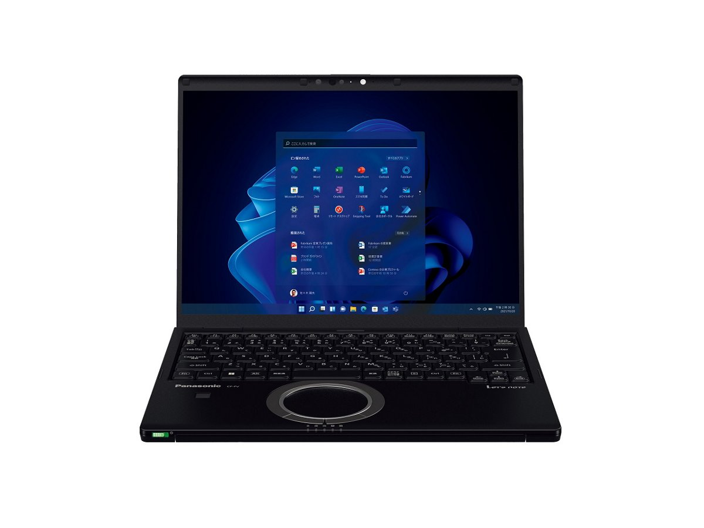
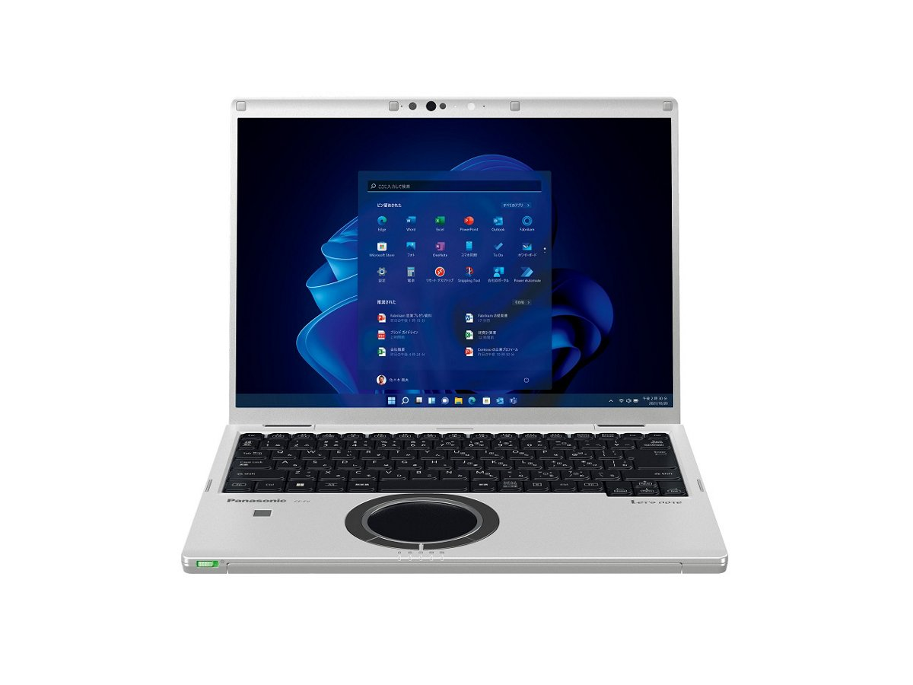

# Panasonic Let's note CF-FV3 Specifications

**English** · [日本語](../../ja/CF-FV3/) · [中文](../../zh/CF-FV3/)

**CF-FV3** is a Panasonic Let's note laptop in the FV series with a 14.0-inch QHD display. This page lists all 10 part numbers, released 2022-06 – 2023-01. Each part number links to its official spec sheet.

*Panasonic Let's note CF-FV3 (CF-FV3KDPCR, CF-FV3HDPCR, CF-FV3DDPCR), black. Image © Panasonic.*

## Part numbers

| Part number | Released | Discontinued | Summary |
| :-- | :-- | :-- | :-- |
| [CF-FV3KDPCR](https://panasonic.jp/pc/p-db/CF-FV3KDPCR_spec.html) | 2023-01 | 2023-08 | Windows 11 Pro 64ビット、インテル® CoreTM i7-1260Pプロセッサー（インテル® EvoTM プラットフォーム準拠）、メモリー：16GB（空きスロットなし）、SSD：512GB、LAN、無線LAN 802.11a（W52/W53/W56）/b/g/n/ac/ax（6GHz帯含む）、Microsoft® Office Home and Business 2021 |
| [CF-FV3KFNCR](https://panasonic.jp/pc/p-db/CF-FV3KFNCR_spec.html) | 2023-01 | 2023-08 | Windows 11 Pro 64ビット、インテル® CoreTM i7-1260Pプロセッサー、メモリー：16GB（空きスロットなし）、SSD：512GB、LAN、無線LAN 802.11a（W52/W53/W56）/b/g/n/ac/ax（6GHz帯含む）、LTE対応ワイヤレスWAN、Microsoft® Office Home and Business 2021 |
| [CF-FV3JDMCR](https://panasonic.jp/pc/p-db/CF-FV3JDMCR_spec.html) | 2023-01 | 2023-08 | Windows 11 Pro 64ビット、インテル® CoreTM i5-1235U プロセッサー、メモリー：16GB（空きスロットなし）、SSD：512GB、LAN、無線LAN 802.11a（W52/W53/W56）/b/g/n/ac/ax（6GHz帯含む）、Microsoft® Office Home and Business 2021 |
| [CF-FV3JDTCR](https://panasonic.jp/pc/p-db/CF-FV3JDTCR_spec.html) | 2023-01 | 2023-08 | Windows 11 Pro 64ビット、インテル® CoreTM i5-1235U プロセッサー、メモリー：16GB（空きスロットなし）、SSD：512GB、LAN、無線LAN 802.11a（W52/W53/W56）/b/g/n/ac/ax（6GHz帯含む） |
| [CF-FV3HDPCR](https://panasonic.jp/pc/p-db/CF-FV3HDPCR_spec.html) | 2022-11 | 2023-03 | Windows 11 Pro 64ビット、インテル® CoreTM i7-1260Pプロセッサー（インテル® EvoTM プラットフォーム準拠）、メモリー：16GB（空きスロットなし）、SSD：512GB、LAN、無線LAN 802.11a（W52/W53/W56）/b/g/n/ac/ax（6GHz帯含む）、Microsoft® Office Home and Business 2021 |
| [CF-FV3HFNCR](https://panasonic.jp/pc/p-db/CF-FV3HFNCR_spec.html) | 2022-11 | 2023-03 | Windows 11 Pro 64ビット、インテル® CoreTM i7-1260Pプロセッサー、メモリー：16GB（空きスロットなし）、SSD：512GB、LAN、無線LAN 802.11a（W52/W53/W56）/b/g/n/ac/ax（6GHz帯含む）、LTE対応ワイヤレスWAN、Microsoft® Office Home and Business 2021 |
| [CF-FV3GDMCR](https://panasonic.jp/pc/p-db/CF-FV3GDMCR_spec.html) | 2022-11 | 2023-03 | Windows 11 Pro 64ビット、インテル® CoreTM i5-1235U プロセッサー、メモリー：16GB（空きスロットなし）、SSD：512GB、LAN、無線LAN 802.11a（W52/W53/W56）/b/g/n/ac/ax（6GHz帯含む）、Microsoft® Office Home and Business 2021 |
| [CF-FV3GDTCR](https://panasonic.jp/pc/p-db/CF-FV3GDTCR_spec.html) | 2022-11 | 2023-03 | Windows 11 Pro 64ビット、インテル® CoreTM i5-1235U プロセッサー、メモリー：16GB（空きスロットなし）、SSD：512GB、LAN、無線LAN 802.11a（W52/W53/W56）/b/g/n/ac/ax（6GHz帯含む） |
| [CF-FV3DDPCR](https://panasonic.jp/pc/p-db/CF-FV3DDPCR_spec.html) | 2022-06 | 2022-11 | Windows 11 Pro 64ビット、インテル® CoreTM i7-1260Pプロセッサー（インテル® EvoTM プラットフォーム準拠）、メモリー：16GB（空きスロットなし）、SSD：512GB、LAN、無線LAN 802.11a（W52/W53/W56）/b/g/n/ac/ax（6GHz帯含む）、Microsoft® Office Home and Business 2021 |
| [CF-FV3DFNCR](https://panasonic.jp/pc/p-db/CF-FV3DFNCR_spec.html) | 2022-06 | 2022-11 | Windows 11 Pro 64ビット、インテル® CoreTM i7-1260Pプロセッサー、メモリー：16GB（空きスロットなし）、SSD：512GB、LAN、無線LAN 802.11a（W52/W53/W56）/b/g/n/ac/ax（6GHz帯含む）、LTE対応ワイヤレスWAN、Microsoft® Office Home and Business 2021 |

## Common specifications

| Item | Value |
| :-- | :-- |
| OS | Windows 11 Pro |
| Chipset | CPUに内蔵 |
| Memory | 16GB LPDDR4x SDRAM（拡張スロットなし） |
| Storage | SSD：512GB（PCIe） / 上記容量のうち約15GBをリカバリー領域、約1GBをシステム領域として使用（ユーザー使用不可） |
| Optical drive | 搭載されていません |
| Display / Graphics | インテル® Iris® Xᵉ グラフィックス（CPUに内蔵） |
| Display / LCD colors | 2160×1440ドット：約1677万色 |
| Display / External output | 最大：1920×1200：約1677万色 / （以下HDMI出力/USB3.1 Type-Cポートのみ） / 最大：4096×2160（30 Hz/60 Hz） |
| Display / Simultaneous display | 最大：1920×1200：約1677万色 / （以下HDMI出力/USB3.1 Type-Cポートのみ） / 最大：2160×1440：約1677万色 |
| Wireless LAN | Wi-Fi 6対応 IEEE802.11a/b/g/n/ac/ax 準拠 （5 GHzチャンネル帯：W52/W53/W56）WPA3、WPA2-AES/TKIP対応 |
| Wired LAN | 1000BASE-T/100BASE-TX/10BASE-T |
| Bluetooth | Bluetooth v5.1 / ■対応プロファイル / 【Classic】 / ・A2DP（Source） / ・AVRCP（Target） / ・HCRP（Client） / ・HFP（AG） / ・HID（Host） / ・OPP（ClientおよびServer） / ・PAN（User） / ・SPP（DevAおよびDevB） / 【Low Energy】 / ・HOGP（Host） |
| Audio | PCM音源（24ビットステレオ）、インテル® High Definition Audio準拠、ステレオスピーカー |
| Security chip | TPM（TCG V2.0準拠） |
| Security (Windows Hello) | 顔認証対応カメラ/指紋センサー（タッチ式） |
| Memory expansion slot | なし |
| Camera | 顔認証対応カメラ、有効画素数：最大 1920x1080ピクセル（約207万画素） |
| Microphone | アレイマイク |
| Sensors | 照度(明るさ)、ジャイロ、加速度 |
| Ports | ・USB3.1 Type-Cポート×2（Thunderbolt™4対応、USB Power Delivery対応） / ・USB3.0 Type-Aポート×3（うち１つはスマホ充電対応を兼ねる） / ・LANコネクター（RJ-45） / ・外部ディスプレイコネクター（アナログRGB ミニD-sub 15ピン） / ・HDMI出力端子（4K60p出力対応） / ・ヘッドセット端子（マイク入力＋オーディオ出力）（ヘッドセットミニジャック3.5mm、CTIA準拠） |
| Power consumption | 最大約85W |
| Energy efficiency | 目標年度2022年度 12区分19.1［kWh/年］ |
| Efficiency target achievement | — |

## Differences by part number

| Part number | CPU | Memory | Storage | Weight | Battery life |
| :-- | :-- | :-- | :-- | :-- | :-- |
| CF-FV3KDPCR | Core i7-1260P | 16GB LPDDR4x SDRAM | 512GB | 1.204 kg | 7 h |
| CF-FV3KFNCR | Core i7-1260P | 16GB LPDDR4x SDRAM | 512GB | 1.139 kg | 7 h |
| CF-FV3JDMCR | Core i5-1235U | 16GB LPDDR4x SDRAM | 512GB | 1.099 kg | 7 h |
| CF-FV3JDTCR | Core i5-1235U | 16GB LPDDR4x SDRAM | 512GB | 0.999 kg | 3.5 h |
| CF-FV3HDPCR | Core i7-1260P | 16GB LPDDR4x SDRAM | 512GB | 1.204 kg | 7 h |
| CF-FV3HFNCR | Core i7-1260P | 16GB LPDDR4x SDRAM | 512GB | 1.139 kg | 7 h |
| CF-FV3GDMCR | Core i5-1235U | 16GB LPDDR4x SDRAM | 512GB | 1.099 kg | 7 h |
| CF-FV3GDTCR | Core i5-1235U | 16GB LPDDR4x SDRAM | 512GB | 0.999 kg | 3.5 h |
| CF-FV3DDPCR | Core i7-1260P | 16GB LPDDR4x SDRAM | 512GB | 1.204 kg | 7 h |
| CF-FV3DFNCR | Core i7-1260P | 16GB LPDDR4x SDRAM | 512GB | 1.139 kg | 7 h |

CF-FV3KDPCR: all differing specifications

| Item | Value |
| :-- | :-- |
| CPU | インテル® Core™ i7-1260P プロセッサー / P-core：最大ターボ周波数4.70 GHz / E-core：最大ターボ周波数3.40 GHz / コア数：12コア/キャッシュ：18MB |
| Video memory | メインメモリーと共用 |
| Display | 14.0 型（3:2）QHD TFTカラー液晶（2160×1440ドット） / （静電容量式マルチタッチパネル、アンチリフレクション保護フィルム付き） |
| Wireless WAN | 搭載されていません |
| SD card slot | SDメモリーカード×1スロット（SDHCメモリーカード/SDXCメモリーカード対応/著作権保護技術対応/UHS-I・UHS-Ⅱ高速転送対応） |
| Keyboard | OADG準拠キーボード（87キー）：キーピッチ19mm（縦・横/一部キーを除く）、バックライト搭載 |
| Pointing device | 高精度タッチパッド対応ホイールパッド・静電タッチパネル（10フィンガー対応） |
| Power | ▼ACアダプター / 入力：AC100V～240V、50Hz/60Hz、出力：DC16V、5.3A、電源コードは100V専用 / ▼ACアダプター（USB Power Delivery対応） / 入力：AC100V～240V、50Hz/60Hz、出力：DC20V、5A、電源コードは100V専用 / ▼バッテリーパック（L） / 11.55V リチウムイオン・定格容量4786mAh |
| Battery life / charge time | ▼駆動時間 / （JEITA Ver.3.0） / 約7時間(動画再生時)、約16.5時間(アイドル時) / ［付属バッテリーパック（L）装着時］ / ▼充電時間 / 最大3時間（電源オフ時）／最大3時間（電源オン時） |
| Dimensions (W×D×H) | 幅308.6mm×奥行235.3mm×高さ18.5mm（突起部除く） |
| Color | ブラック |
| Weight (with battery) | パソコン本体：約1.204kg（付属バッテリーパック(L)（約300g）装着時） / ACアダプター：約230g（電源コード（約60g）除く） |
| Software | ・Microsoft® Edge / ・Microsoft® .NET Framework 4.8 / ・マカフィーリブセーフ（60日間 無料体験版） / ・i-フィルター for マルチデバイス (30日間無料お試し版) / ・WinZip （45日試用版） / ・Aptioセットアップ / ・PC-Diagnosticユーティリティ / ・Panasonic PC設定ユーティリティ / ・DirectX 12 / ・PC情報ビューアー / ・Panasonic PC Camera Utility / ・Panasonic PC快適NAVI / ・Panasonic PC VVork / ・Panaosnic AIデバイスコントローラー |
| Microsoft Office | Microsoft® Office Home and Business 2021 |
| Accessories | バッテリーパック(L)、ACアダプター、ACアダプター（USB Power Delivery対応）、専用布、取扱説明書、Microsoft Office Home & Business 2021 |

Official spec sheet: <https://panasonic.jp/pc/p-db/CF-FV3KDPCR_spec.html>

CF-FV3KFNCR: all differing specifications

| Item | Value |
| :-- | :-- |
| CPU | インテル® Core™ i7-1260P プロセッサー / P-core：最大ターボ周波数4.70 GHz / E-core：最大ターボ周波数3.40 GHz / コア数：12コア/キャッシュ：18MB |
| Video memory | メインメモリーと共用 |
| Display | 14.0型(3:2)QHD TFTカラー液晶 （2160 x 1440ドット）、アンチグレア |
| Wireless WAN | LTE対応 |
| Keyboard | OADG準拠キーボード（87キー）：キーピッチ19mm（縦・横/一部キーを除く）、バックライト搭載 |
| Pointing device | 高精度タッチパッド対応ホイールパッド |
| Power | ▼ACアダプター / 入力：AC100V～240V、50Hz/60Hz、出力：DC16V、5.3A、電源コードは100V専用 / ▼バッテリーパック（L） / 11.55V リチウムイオン・定格容量4786mAh |
| Battery life / charge time | ▼駆動時間 / （JEITA Ver.3.0） / 約7時間(動画再生時)、約16.5時間(アイドル時) / ［付属バッテリーパック（L）装着時］ / ▼充電時間 / 最大3時間（電源オフ時）／最大3時間（電源オン時） |
| Dimensions (W×D×H) | 幅308.6mm×奥行235.3mm×高さ18.2mm（突起部除く） |
| Color | ブラック |
| Weight (with battery) | パソコン本体：約1.139kg（付属バッテリーパック(L)（約300g）装着時） / ACアダプター：約230g（電源コード（約60g）除く） |
| Software | ・Microsoft® Edge / ・Microsoft® .NET Framework 4.8 / ・マカフィーリブセーフ（60日間 無料体験版） / ・i-フィルター for マルチデバイス (30日間無料お試し版) / ・WinZip （45日試用版） / ・Aptioセットアップ / ・PC-Diagnosticユーティリティ / ・Panasonic PC設定ユーティリティ / ・DirectX 12 / ・PC情報ビューアー / ・Panasonic PC Camera Utility / ・Panasonic PC快適NAVI / ・Panasonic PC VVork / ・Panaosnic AIデバイスコントローラー |
| Microsoft Office | Microsoft® Office Home and Business 2021 |
| Accessories | バッテリーパック(L)、ACアダプター、取扱説明書、Microsoft Office Home & Business 2021 |
| Card slots / SD card | SDメモリーカード×1スロット（SDHCメモリーカード/SDXCメモリーカード対応/著作権保護技術対応/UHS-I・UHS-Ⅱ高速転送対応） |
| Card slots / Other | nano SIMカードスロット |

Official spec sheet: <https://panasonic.jp/pc/p-db/CF-FV3KFNCR_spec.html>

CF-FV3JDMCR: all differing specifications

| Item | Value |
| :-- | :-- |
| CPU | インテル® Core™ i5-1235U プロセッサー / P-core：最大ターボ周波数4.40 GHz / E-core：最大ターボ周波数3.30 GHz / コア数：10コア/キャッシュ：12MB |
| Video memory | メインメモリーと共用 |
| Display | 14.0型(3:2)QHD TFTカラー液晶 （2160 x 1440ドット）、アンチグレア |
| Wireless WAN | 搭載されていません |
| SD card slot | SDメモリーカード×1スロット（SDHCメモリーカード/SDXCメモリーカード対応/著作権保護技術対応/UHS-I・UHS-Ⅱ高速転送対応） |
| Keyboard | OADG準拠キーボード（87キー）：キーピッチ19mm（縦・横/一部キーを除く） |
| Pointing device | 高精度タッチパッド対応ホイールパッド |
| Power | ▼ACアダプター / 入力：AC100V～240V、50Hz/60Hz、出力：DC16V、5.3A、電源コードは100V専用 / ▼バッテリーパック（L） / 11.55V リチウムイオン・定格容量4786mAh |
| Battery life / charge time | ▼駆動時間 / （JEITA Ver.3.0） / 約7時間(動画再生時)、約16.5時間(アイドル時) / ［付属バッテリーパック（L）装着時］ / ▼充電時間 / 最大3時間（電源オフ時）／最大3時間（電源オン時） |
| Dimensions (W×D×H) | 幅308.6mm×奥行235.3mm×高さ18.2mm（突起部除く） |
| Color | ブラック＆シルバー |
| Weight (with battery) | パソコン本体：約1.099kg（付属バッテリーパック(L)（約300g）装着時） / ACアダプター：約230g（電源コード（約60g）除く） |
| Software | ・Microsoft® Edge / ・Microsoft® .NET Framework 4.8 / ・マカフィーリブセーフ（60日間 無料体験版） / ・i-フィルター for マルチデバイス (30日間無料お試し版) / ・WinZip （45日試用版） / ・Aptioセットアップ / ・PC-Diagnosticユーティリティ / ・Panasonic PC設定ユーティリティ / ・DirectX 12 / ・PC情報ビューアー / ・Panasonic PC Camera Utility / ・Panasonic PC快適NAVI / ・Panasonic PC VVork / ・Panaosnic AIデバイスコントローラー |
| Microsoft Office | Microsoft® Office Home and Business 2021 |
| Accessories | バッテリーパック(L)、ACアダプター、取扱説明書、Microsoft Office Home & Business 2021 |

Official spec sheet: <https://panasonic.jp/pc/p-db/CF-FV3JDMCR_spec.html>

CF-FV3JDTCR: all differing specifications

| Item | Value |
| :-- | :-- |
| CPU | インテル® Core™ i5-1235U プロセッサー / P-core：最大ターボ周波数4.40 GHz / E-core：最大ターボ周波数3.30 GHz / コア数：10コア/キャッシュ：12MB |
| Video memory | メインメモリーと共用 |
| Display | 14.0型(3:2)QHD TFTカラー液晶 （2160 x 1440ドット）、アンチグレア |
| Wireless WAN | 搭載されていません |
| SD card slot | SDメモリーカード×1スロット（SDHCメモリーカード/SDXCメモリーカード対応/著作権保護技術対応/UHS-I・UHS-Ⅱ高速転送対応） |
| Keyboard | OADG準拠キーボード（87キー）：キーピッチ19mm（縦・横/一部キーを除く） |
| Pointing device | 高精度タッチパッド対応ホイールパッド |
| Power | ▼ACアダプター / 入力：AC100V～240V、50Hz/60Hz、出力：DC16V、5.3A、電源コードは100V専用 / ▼バッテリーパック（S） / 11.55V リチウムイオン・定格容量2543mAh |
| Battery life / charge time | ▼駆動時間 / （JEITA Ver.3.0） / 約3.5時間(動画再生時)、約9時間(アイドル時) / ［付属バッテリーパック（S）装着時］ / ▼充電時間 / 最大2.5時間（電源オフ時）／最大2.5時間（電源オン時） |
| Dimensions (W×D×H) | 幅308.6mm×奥行235.3mm×高さ18.2mm（突起部除く） |
| Color | シルバー |
| Weight (with battery) | パソコン本体：約0.999kg（付属バッテリーパック(S)（約200g）装着時） / ACアダプター：約230g（電源コード（約60g）除く） |
| Software | ・Microsoft® Edge / ・Microsoft® .NET Framework 4.8 / ・マカフィーリブセーフ（60日間 無料体験版） / ・i-フィルター for マルチデバイス (30日間無料お試し版) / ・WinZip （45日試用版） / ・Aptioセットアップ / ・PC-Diagnosticユーティリティ / ・Panasonic PC設定ユーティリティ / ・DirectX 12 / ・PC情報ビューアー / ・Panasonic PC Camera Utility / ・Panasonic PC快適NAVI / ・Panasonic PC VVork / ・Panaosnic AIデバイスコントローラー |
| Accessories | バッテリーパック(S)、ACアダプター、取扱説明書 |

Official spec sheet: <https://panasonic.jp/pc/p-db/CF-FV3JDTCR_spec.html>

CF-FV3HDPCR: all differing specifications

| Item | Value |
| :-- | :-- |
| CPU | インテル® Core™ i7-1260P プロセッサー / P-core：最大ターボ周波数4.70 GHz / E-core：最大ターボ周波数3.40 GHz / コア数：12コア/キャッシュ：18MB |
| Video memory | 最大8140MB (メインメモリーと共用) |
| Display | 14.0 型（3:2）QHD TFTカラー液晶（2160×1440ドット） / （静電容量式マルチタッチパネル、アンチリフレクション保護フィルム付き） |
| Wireless WAN | 搭載されていません |
| SD card slot | SDメモリーカード×1スロット（SDHCメモリーカード/SDXCメモリーカード対応/著作権保護技術対応/UHS-I・UHS-Ⅱ高速転送対応） |
| Keyboard | OADG準拠キーボード（87キー）：キーピッチ19mm（縦・横/一部キーを除く）、バックライト搭載 |
| Pointing device | 高精度タッチパッド対応ホイールパッド・静電タッチパネル（10フィンガー対応） |
| Power | ▼ACアダプター / 入力：AC100V～240V、50Hz/60Hz、出力：DC16V、5.3A、電源コードは100V専用 / ▼ACアダプター（USB Power Delivery対応） / 入力：AC100V～240V、50Hz/60Hz、出力：DC20V、5A、電源コードは100V専用 / ▼バッテリーパック（L） / 11.55V リチウムイオン・定格容量4786mAh |
| Battery life / charge time | ▼駆動時間 / （JEITA Ver.3.0） / 約7時間(動画再生時)、約16.5時間(アイドル時) / ［付属バッテリーパック（L）装着時］ / ▼充電時間 / 最大3時間（電源オフ時）／最大3時間（電源オン時） |
| Dimensions (W×D×H) | 幅308.6mm×奥行235.3mm×高さ18.5mm（突起部除く） |
| Color | ブラック |
| Weight (with battery) | パソコン本体：約1.204kg（付属バッテリーパック(L)（約300g）装着時） / ACアダプター：約230g（電源コード（約60g）除く） |
| Software | ・Microsoft® Edge / ・Microsoft® .NET Framework 4.8 / ・Microsoft® Windows Media Player 12 / ・マカフィーリブセーフ（60日間 無料体験版） / ・i-フィルター for マルチデバイス (30日間無料お試し版) / ・WinZip （45日試用版） / ・Aptioセットアップ / ・PC-Diagnosticユーティリティ / ・Panasonic PC設定ユーティリティ / ・DirectX 12 / ・PC情報ビューアー / ・Panasonic PC Camera Utility / ・Panasonic PC快適NAVI / ・Panasonic PC VVork |
| Microsoft Office | Microsoft® Office Home and Business 2021 |
| Accessories | バッテリーパック(L)、ACアダプター、ACアダプター（USB Power Delivery対応）、専用布、取扱説明書、Microsoft Office Home & Business 2021 |

Official spec sheet: <https://panasonic.jp/pc/p-db/CF-FV3HDPCR_spec.html>

CF-FV3HFNCR: all differing specifications

| Item | Value |
| :-- | :-- |
| CPU | インテル® Core™ i7-1260P プロセッサー / P-core：最大ターボ周波数4.70 GHz / E-core：最大ターボ周波数3.40 GHz / コア数：12コア/キャッシュ：18MB |
| Video memory | 最大8140MB (メインメモリーと共用) |
| Display | 14.0型(3:2)QHD TFTカラー液晶 （2160 x 1440ドット）、アンチグレア |
| Wireless WAN | LTE対応 |
| Keyboard | OADG準拠キーボード（87キー）：キーピッチ19mm（縦・横/一部キーを除く）、バックライト搭載 |
| Pointing device | 高精度タッチパッド対応ホイールパッド |
| Power | ▼ACアダプター / 入力：AC100V～240V、50Hz/60Hz、出力：DC16V、5.3A、電源コードは100V専用 / ▼バッテリーパック（L） / 11.55V リチウムイオン・定格容量4786mAh |
| Battery life / charge time | ▼駆動時間 / （JEITA Ver.3.0） / 約7時間(動画再生時)、約16.5時間(アイドル時) / ［付属バッテリーパック（L）装着時］ / ▼充電時間 / 最大3時間（電源オフ時）／最大3時間（電源オン時） |
| Dimensions (W×D×H) | 幅308.6mm×奥行235.3mm×高さ18.2mm（突起部除く） |
| Color | ブラック |
| Weight (with battery) | パソコン本体：約1.139kg（付属バッテリーパック(L)（約300g）装着時） / ACアダプター：約230g（電源コード（約60g）除く） |
| Software | ・Microsoft® Edge / ・Microsoft® .NET Framework 4.8 / ・Microsoft® Windows Media Player 12 / ・マカフィーリブセーフ（60日間 無料体験版） / ・i-フィルター for マルチデバイス (30日間無料お試し版) / ・WinZip （45日試用版） / ・Aptioセットアップ / ・PC-Diagnosticユーティリティ / ・Panasonic PC設定ユーティリティ / ・DirectX 12 / ・PC情報ビューアー / ・Panasonic PC Camera Utility / ・Panasonic PC快適NAVI / ・Panasonic PC VVork |
| Microsoft Office | Microsoft® Office Home and Business 2021 |
| Accessories | バッテリーパック(L)、ACアダプター、取扱説明書、Microsoft Office Home & Business 2021 |
| Card slots / SD card | SDメモリーカード×1スロット（SDHCメモリーカード/SDXCメモリーカード対応/著作権保護技術対応/UHS-I・UHS-Ⅱ高速転送対応） |
| Card slots / Other | nano SIMカードスロット |

Official spec sheet: <https://panasonic.jp/pc/p-db/CF-FV3HFNCR_spec.html>

CF-FV3GDMCR: all differing specifications

| Item | Value |
| :-- | :-- |
| CPU | インテル® Core™ i5-1235U プロセッサー / P-core：最大ターボ周波数4.40 GHz / E-core：最大ターボ周波数3.30 GHz / コア数：10コア/キャッシュ：12MB |
| Video memory | 最大8140MB (メインメモリーと共用) |
| Display | 14.0型(3:2)QHD TFTカラー液晶 （2160 x 1440ドット）、アンチグレア |
| Wireless WAN | 搭載されていません |
| SD card slot | SDメモリーカード×1スロット（SDHCメモリーカード/SDXCメモリーカード対応/著作権保護技術対応/UHS-I・UHS-Ⅱ高速転送対応） |
| Keyboard | OADG準拠キーボード（87キー）：キーピッチ19mm（縦・横/一部キーを除く） |
| Pointing device | 高精度タッチパッド対応ホイールパッド |
| Power | ▼ACアダプター / 入力：AC100V～240V、50Hz/60Hz、出力：DC16V、5.3A、電源コードは100V専用 / ▼バッテリーパック（L） / 11.55V リチウムイオン・定格容量4786mAh |
| Battery life / charge time | ▼駆動時間 / （JEITA Ver.3.0） / 約7時間(動画再生時)、約16.5時間(アイドル時) / ［付属バッテリーパック（L）装着時］ / ▼充電時間 / 最大3時間（電源オフ時）／最大3時間（電源オン時） |
| Dimensions (W×D×H) | 幅308.6mm×奥行235.3mm×高さ18.2mm（突起部除く） |
| Color | ブラック＆シルバー |
| Weight (with battery) | パソコン本体：約1.099kg（付属バッテリーパック(L)（約300g）装着時） / ACアダプター：約230g（電源コード（約60g）除く） |
| Software | ・Microsoft® Edge / ・Microsoft® .NET Framework 4.8 / ・Microsoft® Windows Media Player 12 / ・マカフィーリブセーフ（60日間 無料体験版） / ・i-フィルター for マルチデバイス (30日間無料お試し版) / ・WinZip （45日試用版） / ・Aptioセットアップ / ・PC-Diagnosticユーティリティ / ・Panasonic PC設定ユーティリティ / ・DirectX 12 / ・PC情報ビューアー / ・Panasonic PC Camera Utility / ・Panasonic PC快適NAVI / ・Panasonic PC VVork |
| Microsoft Office | Microsoft® Office Home and Business 2021 |
| Accessories | バッテリーパック(L)、ACアダプター、取扱説明書、Microsoft Office Home & Business 2021 |

Official spec sheet: <https://panasonic.jp/pc/p-db/CF-FV3GDMCR_spec.html>

CF-FV3GDTCR: all differing specifications

| Item | Value |
| :-- | :-- |
| CPU | インテル® Core™ i5-1235U プロセッサー / P-core：最大ターボ周波数4.40 GHz / E-core：最大ターボ周波数3.30 GHz / コア数：10コア/キャッシュ：12MB |
| Video memory | 最大8140MB (メインメモリーと共用) |
| Display | 14.0型(3:2)QHD TFTカラー液晶 （2160 x 1440ドット）、アンチグレア |
| Wireless WAN | 搭載されていません |
| SD card slot | SDメモリーカード×1スロット（SDHCメモリーカード/SDXCメモリーカード対応/著作権保護技術対応/UHS-I・UHS-Ⅱ高速転送対応） |
| Keyboard | OADG準拠キーボード（87キー）：キーピッチ19mm（縦・横/一部キーを除く） |
| Pointing device | 高精度タッチパッド対応ホイールパッド |
| Power | ▼ACアダプター / 入力：AC100V～240V、50Hz/60Hz、出力：DC16V、5.3A、電源コードは100V専用 / ▼バッテリーパック（S） / 11.55V リチウムイオン・定格容量2543mAh |
| Battery life / charge time | ▼駆動時間 / （JEITA Ver.3.0） / 約3.5時間(動画再生時)、約9時間(アイドル時) / ［付属バッテリーパック（S）装着時］ / ▼充電時間 / 最大2.5時間（電源オフ時）／最大2.5時間（電源オン時） |
| Dimensions (W×D×H) | 幅308.6mm×奥行235.3mm×高さ18.2mm（突起部除く） |
| Color | シルバー |
| Weight (with battery) | パソコン本体：約0.999kg（付属バッテリーパック(S)（約200g）装着時） / ACアダプター：約230g（電源コード（約60g）除く） |
| Software | ・Microsoft® Edge / ・Microsoft® .NET Framework 4.8 / ・Microsoft® Windows Media Player 12 / ・マカフィーリブセーフ（60日間 無料体験版） / ・i-フィルター for マルチデバイス (30日間無料お試し版) / ・WinZip （45日試用版） / ・Aptioセットアップ / ・PC-Diagnosticユーティリティ / ・Panasonic PC設定ユーティリティ / ・DirectX 12 / ・PC情報ビューアー / ・Panasonic PC Camera Utility / ・Panasonic PC快適NAVI / ・Panasonic PC VVork |
| Accessories | バッテリーパック(S)、ACアダプター、取扱説明書 |

Official spec sheet: <https://panasonic.jp/pc/p-db/CF-FV3GDTCR_spec.html>

CF-FV3DDPCR: all differing specifications

| Item | Value |
| :-- | :-- |
| CPU | インテル® Core™ i7-1260P プロセッサー / P-core：最大ターボ周波数4.70 GHz / E-core：最大ターボ周波数3.40 GHz / コア数：12コア/キャッシュ：18MB |
| Video memory | 最大8140MB (メインメモリーと共用) |
| Display | 14.0 型（3:2）QHD TFTカラー液晶（2160×1440ドット） / （静電容量式マルチタッチパネル、アンチリフレクション保護フィルム付き） |
| Wireless WAN | 搭載されていません |
| SD card slot | SDメモリーカード×1スロット（SDHCメモリーカード/SDXCメモリーカード対応/著作権保護技術対応/UHS-I・UHS-Ⅱ高速転送対応） |
| Keyboard | OADG準拠87キー、キーピッチ19mm（縦・横/一部キーを除く）、バックライトキーボード |
| Pointing device | 高精度タッチパッド対応ホイールパッド・静電タッチパネル（10フィンガー対応） |
| Power | ▼ACアダプター / 入力：AC100V～240V、50Hz/60Hz、出力：DC16V、5.3A、電源コードは100V専用 / ▼ACアダプター（USB Power Delivery対応） / 入力：AC100V～240V、50Hz/60Hz、出力：DC20V、5A、電源コードは100V専用 / ▼バッテリーパック（L） / 11.55V リチウムイオン・定格容量4786mAh |
| Battery life / charge time | ▼駆動時間 / （JEITA Ver.3.0） / 約7時間(動画再生時)、約16.5時間(アイドル時) / ［付属バッテリーパック（L）装着時］ / ▼充電時間 / 最大3時間（電源オフ時）／最大3時間（電源オン時） |
| Dimensions (W×D×H) | 幅308.6mm×奥行235.3mm×高さ18.5mm（突起部除く） |
| Color | ブラック |
| Weight (with battery) | パソコン本体：約1.204kg（付属バッテリーパック(L)（約300g）装着時） / ACアダプター：約230g（電源コード（約60g）除く） |
| Software | ・Microsoft® Edge / ・Microsoft® .NET Framework 4.8 / ・Microsoft® Windows Media Player 12 / ・マカフィーリブセーフ（60日間 無料体験版） / ・i-フィルター for マルチデバイス (30日間無料お試し版) / ・WinZip （45日試用版） / ・Aptioセットアップ / ・PC-Diagnosticユーティリティ / ・Panasonic PC設定ユーティリティ / ・DirectX 12 / ・PC情報ビューアー / ・Panasonic PC Camera Utility / ・Panasonic PC快適NAVI / ・Panasonic PC VVork |
| Microsoft Office | Microsoft® Office Home and Business 2021 |
| Accessories | バッテリーパック(L)、ACアダプター、ACアダプター（USB Power Delivery対応）、専用布、取扱説明書、Microsoft Office Home & Business 2021 |

Official spec sheet: <https://panasonic.jp/pc/p-db/CF-FV3DDPCR_spec.html>

CF-FV3DFNCR: all differing specifications

| Item | Value |
| :-- | :-- |
| CPU | インテル® Core™ i7-1260P プロセッサー / P-core：最大ターボ周波数4.70 GHz / E-core：最大ターボ周波数3.40 GHz / コア数：12コア/キャッシュ：18MB |
| Video memory | 最大8140MB (メインメモリーと共用) |
| Display | 14.0型(3:2)QHD TFTカラー液晶 （2160 x 1440ドット）、アンチグレア |
| Wireless WAN | LTE対応（nanoSIMカード） |
| Keyboard | OADG準拠87キー、キーピッチ19mm（縦・横/一部キーを除く）、バックライトキーボード |
| Pointing device | 高精度タッチパッド対応ホイールパッド |
| Power | ▼ACアダプター / 入力：AC100V～240V、50Hz/60Hz、出力：DC16V、5.3A、電源コードは100V専用 / ▼バッテリーパック（L） / 11.55V リチウムイオン・定格容量4786mAh |
| Battery life / charge time | ▼駆動時間 / （JEITA Ver.3.0） / 約7時間(動画再生時)、約16.5時間(アイドル時) / ［付属バッテリーパック（L）装着時］ / ▼充電時間 / 最大3時間（電源オフ時）／最大3時間（電源オン時） |
| Dimensions (W×D×H) | 幅308.6mm×奥行235.3mm×高さ18.2mm（突起部除く） |
| Color | ブラック |
| Weight (with battery) | パソコン本体：約1.139kg（付属バッテリーパック(L)（約300g）装着時） / ACアダプター：約230g（電源コード（約60g）除く） |
| Software | ・Microsoft® Edge / ・Microsoft® .NET Framework 4.8 / ・Microsoft® Windows Media Player 12 / ・マカフィーリブセーフ（60日間 無料体験版） / ・i-フィルター for マルチデバイス (30日間無料お試し版) / ・WinZip （45日試用版） / ・Aptioセットアップ / ・PC-Diagnosticユーティリティ / ・Panasonic PC設定ユーティリティ / ・DirectX 12 / ・PC情報ビューアー / ・Panasonic PC Camera Utility / ・Panasonic PC快適NAVI / ・Panasonic PC VVork |
| Microsoft Office | Microsoft® Office Home and Business 2021 |
| Accessories | バッテリーパック(L)、ACアダプター、取扱説明書、Microsoft Office Home & Business 2021 |
| Card slots / SD card | SDメモリーカード×1スロット（SDHCメモリーカード/SDXCメモリーカード対応/著作権保護技術対応/UHS-I・UHS-Ⅱ高速転送対応） |
| Card slots / Other | nano SIMカードスロット |

Official spec sheet: <https://panasonic.jp/pc/p-db/CF-FV3DFNCR_spec.html>

## Photos

*Panasonic Let's note CF-FV3 (CF-FV3KFNCR, CF-FV3HFNCR, CF-FV3DFNCR), black. Image © Panasonic.*

*Panasonic Let's note CF-FV3 (CF-FV3JDMCR, CF-FV3GDMCR), black & silver. Image © Panasonic.*

*Panasonic Let's note CF-FV3 (CF-FV3JDTCR, CF-FV3GDTCR), silver. Image © Panasonic.*

## Related models

- Newer model in the series: [CF-FV4](../CF-FV4/)
- Older model in the series: [CF-FV1](../CF-FV1/)
- [All Let's note models](../)

---

Source: Panasonic's official [discontinued-models list](https://panasonic.jp/pc/support/products/) and spec sheets (panasonic.jp). Spec values are quoted in the original Japanese. Product images © Panasonic. This is an unofficial compilation, not affiliated with Panasonic.
