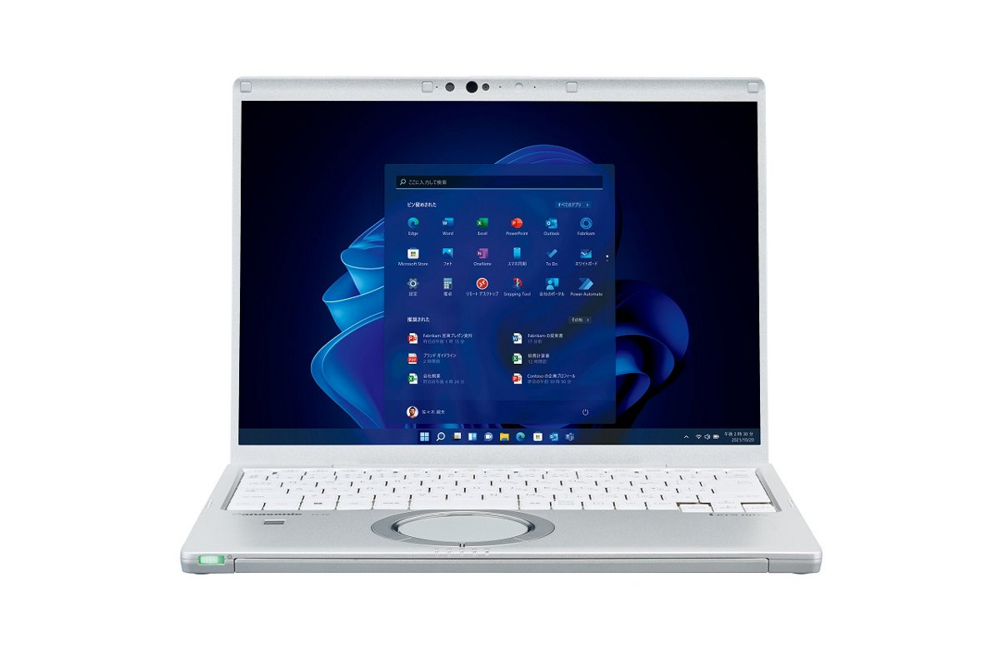
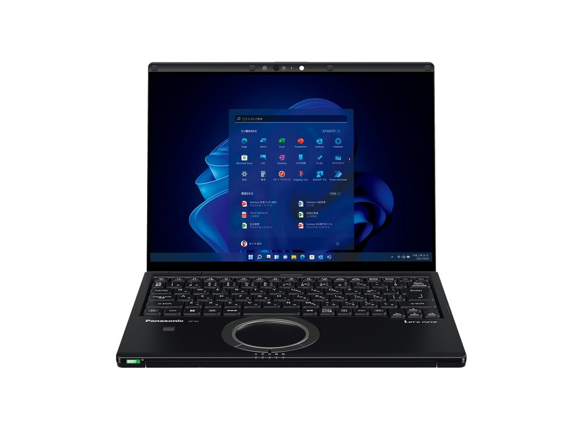

# Panasonic Let's note CF-FV4 Specifications

**English** · [日本語](../../ja/CF-FV4/) · [中文](../../zh/CF-FV4/)

🗄️ See this model in the [Let's note Cabinet](https://letsnote-specs.github.io/en/CF-FV4/).

**CF-FV4** is a Panasonic Let's note laptop in the FV series with a 14.0-inch QHD display. This page lists all 7 part numbers, released 2023-06 – 2024-01. Each part number links to its official spec sheet.

*Panasonic Let's note CF-FV4 (CF-FV4DDNCR, CF-FV4BFNCR), black. Image © Panasonic.*

## Part numbers

| Part number | Released | Discontinued | Summary |
| :-- | :-- | :-- | :-- |
| [CF-FV4DDNCR](https://panasonic.jp/pc/p-db/CF-FV4DDNCR_spec.html) | 2024-01 | 2025-01 | Windows 11 Pro 64-bit, Intel® CoreTM i7-1360P Processor, Memory: 16GB (no free slots), SSD: 512GB, LAN, Wireless LAN 802.11a (W52/W53/W56)/b/g/n/ac/ax (including 6GHz band), Microsoft® Office Home and Business 2021 |
| [CF-FV4CDMCR](https://panasonic.jp/pc/p-db/CF-FV4CDMCR_spec.html) | 2024-01 | 2025-01 | Windows 11 Pro 64-bit, Intel® CoreTM i5-1335U Processor, Memory: 16GB (no free slots), SSD: 512GB, LAN, Wireless LAN 802.11a (W52/W53/W56)/b/g/n/ac/ax (including 6GHz band), Microsoft® Office Home and Business 2021 |
| [CF-FV4CDTCR](https://panasonic.jp/pc/p-db/CF-FV4CDTCR_spec.html) | 2024-01 | 2025-01 | Windows 11 Pro 64-bit, Intel® CoreTM i5-1335U Processor, Memory: 16GB (no free slots), SSD: 512GB, LAN, Wireless LAN 802.11a (W52/W53/W56)/b/g/n/ac/ax (including 6GHz band) |
| [CF-FV4BDPCR](https://panasonic.jp/pc/p-db/CF-FV4BDPCR_spec.html) | 2023-06 | 2024-06 | Windows 11 Pro 64-bit, Intel® CoreTM i7-1360P Processor, Memory: 16GB (no free slots), SSD: 512GB, LAN, Wireless LAN 802.11a (W52/W53/W56)/b/g/n/ac/ax (including 6GHz band), Microsoft® Office Home and Business 2021 |
| [CF-FV4BFNCR](https://panasonic.jp/pc/p-db/CF-FV4BFNCR_spec.html) | 2023-06 | 2024-06 | Windows 11 Pro 64-bit, Intel® CoreTM i7-1360P Processor, Memory: 16GB (no free slots), SSD: 512GB, LAN, Wireless LAN 802.11a (W52/W53/W56)/b/g/n/ac/ax (including 6GHz band), LTE-compatible Wireless WAN, Microsoft® Office Home and Business 2021 |
| [CF-FV4ADMCR](https://panasonic.jp/pc/p-db/CF-FV4ADMCR_spec.html) | 2023-06 | 2024-06 | Windows 11 Pro 64-bit, Intel® CoreTM i5-1335U Processor, Memory: 16GB (no free slots), SSD: 512GB, LAN, Wireless LAN 802.11a (W52/W53/W56)/b/g/n/ac/ax (including 6GHz band), Microsoft® Office Home and Business 2021 |
| [CF-FV4ADTCR](https://panasonic.jp/pc/p-db/CF-FV4ADTCR_spec.html) | 2023-06 | 2024-06 | Windows 11 Pro 64-bit, Intel® CoreTM i5-1335U Processor, Memory: 16GB (no free slots), SSD: 512GB, LAN, Wireless LAN 802.11a (W52/W53/W56)/b/g/n/ac/ax (including 6GHz band) |

## Common specifications

| Item | Value |
| :-- | :-- |
| OS | Windows 11 Pro |
| Chipset | Built into CPU |
| Memory | 16GB LPDDR4x SDRAM (no expansion slot) |
| Video memory | Shared with main memory |
| Storage | SSD: 512GB (PCIe) / Of the above capacity, approx. 15GB is used as recovery area and approx. 1GB as system area (unavailable to user) |
| Optical drive | Not equipped |
| Display / Graphics | Intel® Iris® Xᵉ Graphics (built into CPU) |
| Display / LCD colors | 2160×1440 dots: approx. 16.77 million colors |
| Display / External output | Max: 1920×1200: approx. 16.77 million colors / (only for the following HDMI output/USB3.1 Type-C port) / Max: 4096×2160 (30 Hz/60 Hz) |
| Display / Simultaneous display | Max: 1920×1200: approx. 16.77 million colors / (only for the following HDMI output/USB3.1 Type-C port) / Max: 2160×1440: approx. 16.77 million colors |
| Wireless LAN | Wi-Fi 6E compatible IEEE802.11a/b/g/n/ac/ax (including 6 GHz band) compliant (5 GHz channel band: W52/W53/W56) WPA3, WPA2-AES/TKIP compatible |
| Wired LAN | 1000BASE-T/100BASE-TX/10BASE-T |
| Bluetooth | Bluetooth v5.1 / ■Supported profiles / 【Classic】 / ・A2DP (Source) / ・AVRCP (Target) / ・HCRP (Client) / ・HFP (AG) / ・HID (Host) / ・OPP (Client and Server) / ・PAN (User) / ・SPP (DevA and DevB) / 【Low Energy】 / ・HOGP (Host) |
| Audio | PCM sound source (24-bit stereo), Intel® High Definition Audio compliant, stereo speakers |
| Security chip | TPM (TCG V2.0 compliant) |
| Security (Windows Hello) | Face recognition-compatible camera / Fingerprint sensor (touch type) |
| Memory expansion slot | None |
| Camera | Face recognition-compatible camera, effective pixels: max. 1920x1080 pixels (approx. 2.07 megapixels) |
| Microphone | Array microphone |
| Sensors | Illuminance (brightness), gyro, acceleration |
| Ports | ・USB3.1 Type-C port ×2 (Thunderbolt™4 supported, USB Power Delivery supported) / ・USB3.0 Type-A port ×3 (one of which also supports smartphone charging) / ・LAN connector (RJ-45) / ・External display connector (analog RGB mini D-sub 15 pin) / ・HDMI output terminal (4K60p output supported) / ・Headset terminal (microphone input + audio output) (headset mini jack 3.5mm, CTIA compliant) |
| Energy efficiency | Target year FY2022 12 categories 19.1 [kWh/year] |
| Efficiency target achievement | — |
| Software | ・Microsoft® Edge / ・Microsoft® .NET Framework 4.8 / ・McAfee LiveSafe (60-day free trial version) / ・i-Filter for Multi-Device (30-day free trial version) / ・WinZip (45-day trial version) / ・Aptio Setup / ・PC-Diagnostic Utility / ・Panasonic PC Setting Utility / ・DirectX 12 / ・PC Information Viewer / ・Panasonic PC Camera Utility / ・Panasonic PC Comfort NAVI / ・Panasonic PC VVork / ・Panaosnic AI Device Controller |

## Differences by part number

| Part number | CPU | Memory | Storage | Weight | Battery life |
| :-- | :-- | :-- | :-- | :-- | :-- |
| CF-FV4DDNCR | Core i7-1360P | 16GB LPDDR4x SDRAM | 512GB | 1.109 kg | 7 h |
| CF-FV4CDMCR | Core i5-1335U | 16GB LPDDR4x SDRAM | 512GB | 1.099 kg | 7 h |
| CF-FV4CDTCR | Core i5-1335U | 16GB LPDDR4x SDRAM | 512GB | 0.999 kg | 3.5 h |
| CF-FV4BDPCR | Core i7-1360P | 16GB LPDDR4x SDRAM | 512GB | 1.204 kg | 7 h |
| CF-FV4BFNCR | Core i7-1360P | 16GB LPDDR4x SDRAM | 512GB | 1.139 kg | 7 h |
| CF-FV4ADMCR | Core i5-1335U | 16GB LPDDR4x SDRAM | 512GB | 1.099 kg | 7 h |
| CF-FV4ADTCR | Core i5-1335U | 16GB LPDDR4x SDRAM | 512GB | 0.999 kg | 3.5 h |

CF-FV4DDNCR: all differing specifications

| Item | Value |
| :-- | :-- |
| CPU | Intel® Core™ i7-1360P Processor / P-core: max turbo frequency 5 GHz / E-core: max turbo frequency 3.70 GHz / Cores: 12 cores/Cache: 18MB |
| Display | 14.0-inch (3:2) QHD TFT color LCD (2160 x 1440 dots) anti-glare |
| Wireless WAN | Not equipped |
| SD card slot | SD memory card ×1 slot (SDHC memory card/SDXC memory card support/copyright protection technology support/UHS-I・UHS-II high-speed transfer support) |
| Keyboard | OADG-compliant keyboard (87 keys): Key pitch 19mm (vertical and horizontal/excluding some keys), backlight equipped |
| Pointing device | High-precision touchpad-compatible wheel pad |
| Power | ▼AC adapter / Input: AC100V–240V, 50Hz/60Hz, Output: DC16V, 5.3A, power cord for 100V only / ▼Battery pack (L) / 11.55V lithium-ion, rated capacity 4786mAh |
| Power consumption | Max approx. 85W |
| Battery life / charge time | ▼Battery life / (JEITA Ver.3.0) / approx. 7 hours (video playback), approx. 16.5 hours (idle) / [With supplied battery pack (L) installed] / ▼Charging time / Max 3 hours (power off) / Max 3 hours (power on) |
| Dimensions (W×D×H) | Width 308.6mm × Depth 235.3mm × Height 18.2mm (excluding protrusions) |
| Color | Black |
| Weight (with battery) | PC body: approx. 1.109kg (when equipped with included battery pack (L) (approx. 300g)) / AC adapter: approx. 230g (excluding power cord (approx. 60g)) |
| Microsoft Office | Microsoft® Office Home and Business 2021 |
| Accessories | Battery pack (L), AC adapter, instruction manual, etc. |

Official spec sheet: <https://panasonic.jp/pc/p-db/CF-FV4DDNCR_spec.html>

CF-FV4CDMCR: all differing specifications

| Item | Value |
| :-- | :-- |
| CPU | Intel® Core™ i5-1335U Processor / P-core: max turbo frequency 4.60 GHz / E-core: max turbo frequency 3.40 GHz / Cores: 10 cores/Cache: 12MB |
| Display | 14.0-inch (3:2) QHD TFT color LCD (2160 x 1440 dots) anti-glare |
| Wireless WAN | Not equipped |
| SD card slot | SD memory card ×1 slot (SDHC memory card/SDXC memory card support/copyright protection technology support/UHS-I・UHS-II high-speed transfer support) |
| Keyboard | OADG-compliant keyboard (87 keys): Key pitch 19mm (vertical and horizontal/excluding some keys) |
| Pointing device | High-precision touchpad-compatible wheel pad |
| Power | ▼AC adapter / Input: AC100V–240V, 50Hz/60Hz, Output: DC16V, 4.06A, power cord for 100V only / ▼Battery pack (L) / 11.55V lithium-ion, rated capacity 4786mAh |
| Power consumption | Max approx. 65W |
| Battery life / charge time | ▼Battery life / (JEITA Ver.3.0) / approx. 7 hours (video playback), approx. 16.5 hours (idle) / [With supplied battery pack (L) installed] / ▼Charging time / Max 3 hours (power off) / Max 3 hours (power on) |
| Dimensions (W×D×H) | Width 308.6mm × Depth 235.3mm × Height 18.2mm (excluding protrusions) |
| Color | Black & Silver |
| Weight (with battery) | PC body: approx. 1.099kg (when equipped with included battery pack (L) (approx. 300g)) / AC adapter: approx. 220g (excluding power cord (approx. 60g)) |
| Microsoft Office | Microsoft® Office Home and Business 2021 |
| Accessories | Battery pack (L), AC adapter, instruction manual, etc. |

Official spec sheet: <https://panasonic.jp/pc/p-db/CF-FV4CDMCR_spec.html>

CF-FV4CDTCR: all differing specifications

| Item | Value |
| :-- | :-- |
| CPU | Intel® Core™ i5-1335U Processor / P-core: max turbo frequency 4.60 GHz / E-core: max turbo frequency 3.40 GHz / Cores: 10 cores/Cache: 12MB |
| Display | 14.0-inch (3:2) QHD TFT color LCD (2160 x 1440 dots) anti-glare |
| Wireless WAN | Not equipped |
| SD card slot | SD memory card ×1 slot (SDHC memory card/SDXC memory card support/copyright protection technology support/UHS-I・UHS-II high-speed transfer support) |
| Keyboard | OADG-compliant keyboard (87 keys): Key pitch 19mm (vertical and horizontal/excluding some keys) |
| Pointing device | High-precision touchpad-compatible wheel pad |
| Power | ▼AC adapter / Input: AC100V–240V, 50Hz/60Hz, Output: DC16V, 4.06A, power cord for 100V only / ▼Battery pack (S) / 11.55V lithium-ion, rated capacity 2543mAh |
| Power consumption | Max approx. 65W |
| Battery life / charge time | ▼Battery life / (JEITA Ver.3.0) / approx. 3.5 hours (video playback), approx. 9 hours (idle) / [with included battery pack (S) installed] / ▼Charging time / max. 2.5 hours (power off) / max. 2.5 hours (power on) |
| Dimensions (W×D×H) | Width 308.6mm × Depth 235.3mm × Height 18.2mm (excluding protrusions) |
| Color | Silver |
| Weight (with battery) | PC body: approx. 0.999kg (when equipped with included battery pack (S) (approx. 200g)) / AC adapter: approx. 220g (excluding power cord (approx. 60g)) |
| Accessories | Battery pack (S), AC adapter, instruction manual, etc. |

Official spec sheet: <https://panasonic.jp/pc/p-db/CF-FV4CDTCR_spec.html>

CF-FV4BDPCR: all differing specifications

| Item | Value |
| :-- | :-- |
| CPU | Intel® Core™ i7-1360P Processor / P-core: max turbo frequency 5 GHz / E-core: max turbo frequency 3.70 GHz / Cores: 12 cores/Cache: 18MB |
| Display | 14.0-inch (3:2) QHD TFT color LCD (2160×1440 dots) (capacitive multi-touch panel, with anti-reflection protective film) |
| Wireless WAN | Not equipped |
| SD card slot | SD memory card ×1 slot (SDHC memory card/SDXC memory card support/copyright protection technology support/UHS-I・UHS-II high-speed transfer support) |
| Keyboard | OADG-compliant keyboard (87 keys): Key pitch 19mm (vertical and horizontal/excluding some keys), backlight equipped |
| Pointing device | High-precision touchpad-compatible wheel pad / capacitive touch panel (10-finger support) |
| Power | ▼AC adapter / Input: AC100V–240V, 50Hz/60Hz, Output: DC16V, 5.3A, power cord for 100V only / ▼AC adapter (USB Power Delivery compatible) / Input: AC100V–240V, 50Hz/60Hz, Output: DC20V, 5A, power cord for 100V only / ▼Battery pack (L) / 11.55V lithium-ion, rated capacity 4786mAh |
| Power consumption | Max approx. 85W |
| Battery life / charge time | ▼Battery life / (JEITA Ver.3.0) / approx. 7 hours (video playback), approx. 16.5 hours (idle) / [With supplied battery pack (L) installed] / ▼Charging time / Max 3 hours (power off) / Max 3 hours (power on) |
| Dimensions (W×D×H) | Width 308.6mm × Depth 235.3mm × Height 18.5mm (excluding protrusions) |
| Color | Black |
| Weight (with battery) | PC body: approx. 1.204kg (when equipped with included battery pack (L) (approx. 300g)) / AC adapter: approx. 230g (excluding power cord (approx. 60g)) |
| Microsoft Office | Microsoft® Office Home and Business 2021 |
| Accessories | Battery pack (L), AC adapter, AC adapter (USB Power Delivery compatible), exclusive cloth, instruction manual, Microsoft Office Home & Business 2021 |

Official spec sheet: <https://panasonic.jp/pc/p-db/CF-FV4BDPCR_spec.html>

CF-FV4BFNCR: all differing specifications

| Item | Value |
| :-- | :-- |
| CPU | Intel® Core™ i7-1360P Processor / P-core: max turbo frequency 5 GHz / E-core: max turbo frequency 3.70 GHz / Cores: 12 cores/Cache: 18MB |
| Display | 14.0-inch (3:2) QHD TFT color LCD (2160 x 1440 dots) anti-glare |
| Wireless WAN | LTE supported / (Dual SIM (nano SIM card + eSIM) supported) |
| Keyboard | OADG-compliant keyboard (87 keys): Key pitch 19mm (vertical and horizontal/excluding some keys), backlight equipped |
| Pointing device | High-precision touchpad-compatible wheel pad |
| Power | ▼AC adapter / Input: AC100V–240V, 50Hz/60Hz, Output: DC16V, 5.3A, power cord for 100V only / ▼Battery pack (L) / 11.55V lithium-ion, rated capacity 4786mAh |
| Power consumption | Max approx. 85W |
| Battery life / charge time | ▼Battery life / (JEITA Ver.3.0) / approx. 7 hours (video playback), approx. 16.5 hours (idle) / [With supplied battery pack (L) installed] / ▼Charging time / Max 3 hours (power off) / Max 3 hours (power on) |
| Dimensions (W×D×H) | Width 308.6mm × Depth 235.3mm × Height 18.2mm (excluding protrusions) |
| Color | Black |
| Weight (with battery) | PC body: approx. 1.139kg (when equipped with included battery pack (L) (approx. 300g)) / AC adapter: approx. 230g (excluding power cord (approx. 60g)) |
| Microsoft Office | Microsoft® Office Home and Business 2021 |
| Accessories | Battery pack (L), AC adapter, instruction manual, Microsoft Office Home & Business 2021 |
| Card slots / SD card | SD memory card ×1 slot (SDHC memory card/SDXC memory card support/copyright protection technology support/UHS-I・UHS-II high-speed transfer support) |
| Card slots / Other | nano SIM card slot |

Official spec sheet: <https://panasonic.jp/pc/p-db/CF-FV4BFNCR_spec.html>

CF-FV4ADMCR: all differing specifications

| Item | Value |
| :-- | :-- |
| CPU | Intel® Core™ i5-1335U Processor / P-core: max turbo frequency 4.60 GHz / E-core: max turbo frequency 3.40 GHz / Cores: 10 cores/Cache: 12MB |
| Display | 14.0-inch (3:2) QHD TFT color LCD (2160 x 1440 dots) anti-glare |
| Wireless WAN | Not equipped |
| SD card slot | SD memory card ×1 slot (SDHC memory card/SDXC memory card support/copyright protection technology support/UHS-I・UHS-II high-speed transfer support) |
| Keyboard | OADG-compliant keyboard (87 keys): Key pitch 19mm (vertical and horizontal/excluding some keys) |
| Pointing device | High-precision touchpad-compatible wheel pad |
| Power | ▼AC adapter / Input: AC100V–240V, 50Hz/60Hz, Output: DC16V, 4.06A, power cord for 100V only / ▼Battery pack (L) / 11.55V lithium-ion, rated capacity 4786mAh |
| Power consumption | Max approx. 65W |
| Battery life / charge time | ▼Battery life / (JEITA Ver.3.0) / approx. 7 hours (video playback), approx. 16.5 hours (idle) / [With supplied battery pack (L) installed] / ▼Charging time / Max 3 hours (power off) / Max 3 hours (power on) |
| Dimensions (W×D×H) | Width 308.6mm × Depth 235.3mm × Height 18.2mm (excluding protrusions) |
| Color | Black & Silver |
| Weight (with battery) | PC body: approx. 1.099kg (when equipped with included battery pack (L) (approx. 300g)) / AC adapter: approx. 220g (excluding power cord (approx. 60g)) |
| Microsoft Office | Microsoft® Office Home and Business 2021 |
| Accessories | Battery pack (L), AC adapter, instruction manual, Microsoft Office Home & Business 2021 |

Official spec sheet: <https://panasonic.jp/pc/p-db/CF-FV4ADMCR_spec.html>

CF-FV4ADTCR: all differing specifications

| Item | Value |
| :-- | :-- |
| CPU | Intel® Core™ i5-1335U Processor / P-core: max turbo frequency 4.60 GHz / E-core: max turbo frequency 3.40 GHz / Cores: 10 cores/Cache: 12MB |
| Display | 14.0-inch (3:2) QHD TFT color LCD (2160 x 1440 dots) anti-glare |
| Wireless WAN | Not equipped |
| SD card slot | SD memory card ×1 slot (SDHC memory card/SDXC memory card support/copyright protection technology support/UHS-I・UHS-II high-speed transfer support) |
| Keyboard | OADG-compliant keyboard (87 keys): Key pitch 19mm (vertical and horizontal/excluding some keys) |
| Pointing device | High-precision touchpad-compatible wheel pad |
| Power | ▼AC adapter / Input: AC100V–240V, 50Hz/60Hz, Output: DC16V, 4.06A, power cord for 100V only / ▼Battery pack (S) / 11.55V lithium-ion, rated capacity 2543mAh |
| Power consumption | Max approx. 65W |
| Battery life / charge time | ▼Battery life / (JEITA Ver.3.0) / approx. 3.5 hours (video playback), approx. 9 hours (idle) / [with included battery pack (S) installed] / ▼Charging time / max. 2.5 hours (power off) / max. 2.5 hours (power on) |
| Dimensions (W×D×H) | Width 308.6mm × Depth 235.3mm × Height 18.2mm (excluding protrusions) |
| Color | Silver |
| Weight (with battery) | PC body: approx. 0.999kg (when equipped with included battery pack (S) (approx. 200g)) / AC adapter: approx. 220g (excluding power cord (approx. 60g)) |
| Accessories | Battery pack (S), AC adapter, instruction manual |

Official spec sheet: <https://panasonic.jp/pc/p-db/CF-FV4ADTCR_spec.html>

## Photos

*Panasonic Let's note CF-FV4 (CF-FV4CDMCR, CF-FV4ADMCR), black & silver. Image © Panasonic.*

*Panasonic Let's note CF-FV4 (CF-FV4CDTCR, CF-FV4ADTCR), silver. Image © Panasonic.*

*Panasonic Let's note CF-FV4 (CF-FV4BDPCR), black. Image © Panasonic.*

## Related models

- Newer model in the series: [CF-FV5](../CF-FV5/)
- Older model in the series: [CF-FV3](../CF-FV3/)
- [All Let's note models](../)

---

Source: Panasonic's official [discontinued-models list](https://panasonic.jp/pc/support/products/) and spec sheets (panasonic.jp), translated from Japanese; see the official sheets for the authoritative wording. Product images © Panasonic. This is an unofficial compilation, not affiliated with Panasonic.
