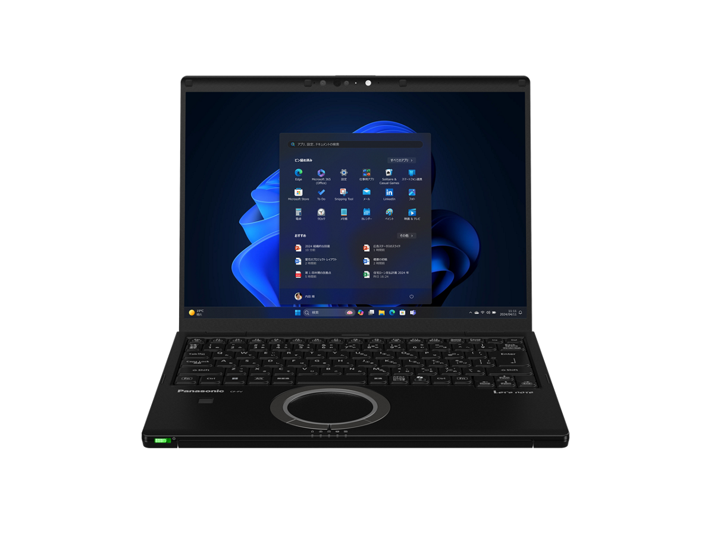
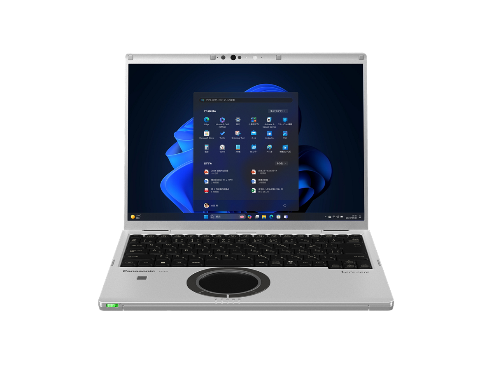
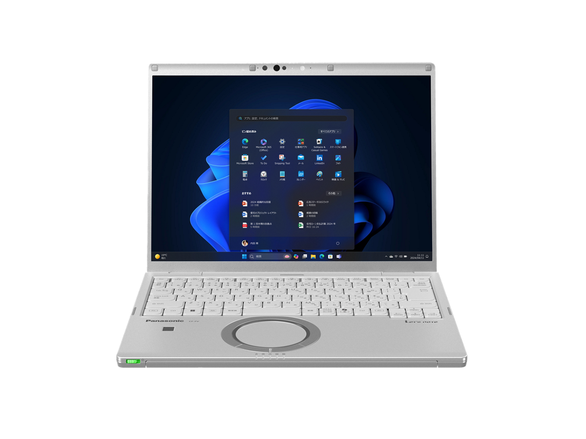
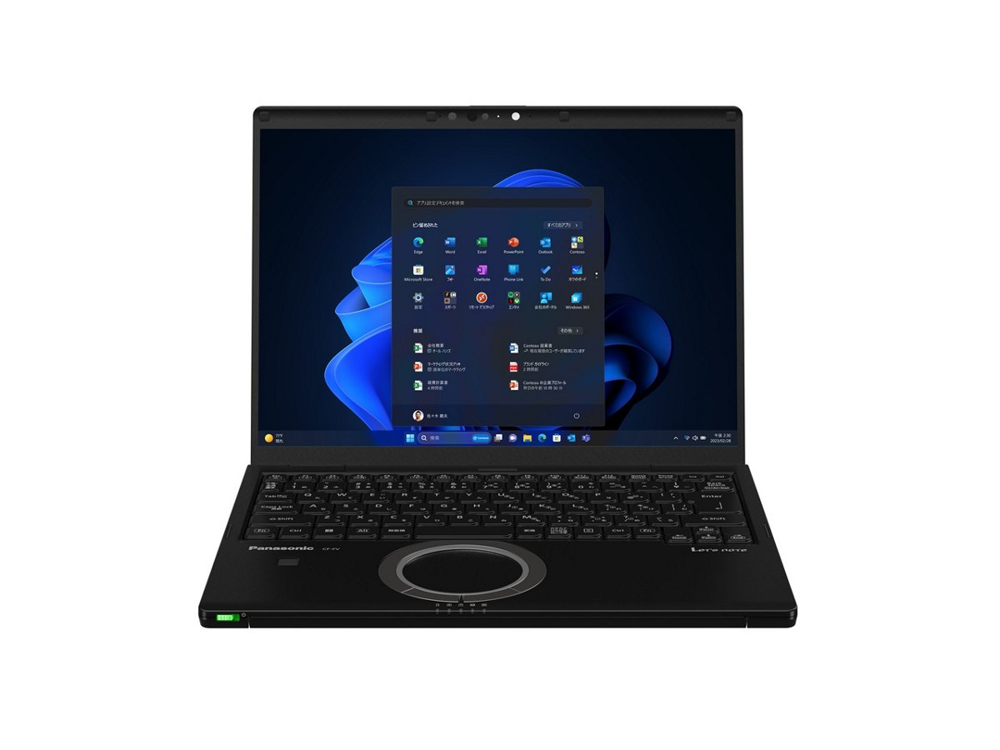
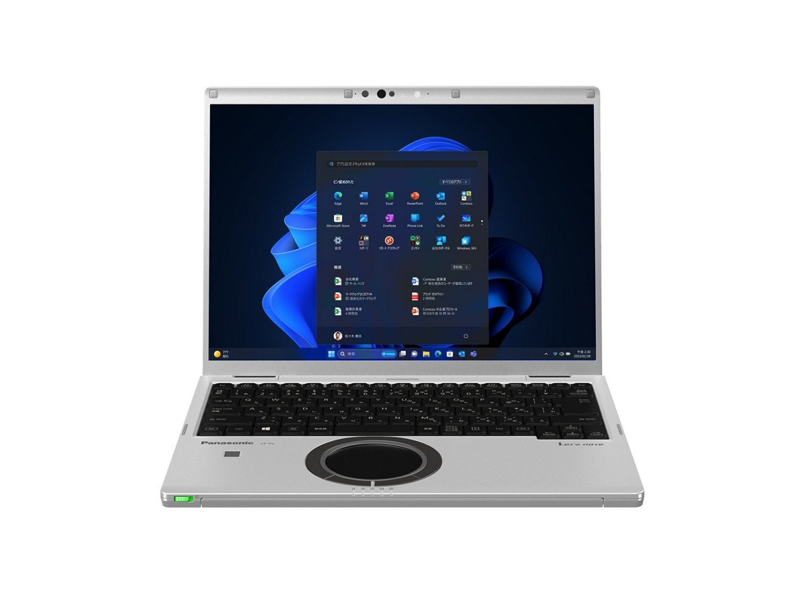
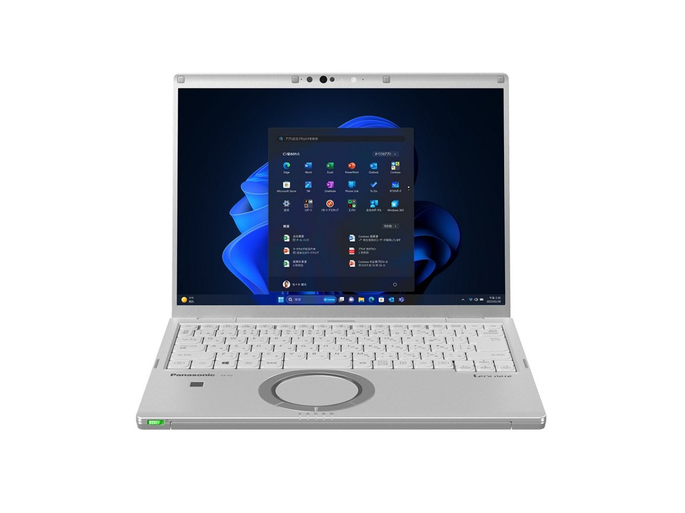

# Panasonic Let's note CF-FV5 Specifications

**English** · [日本語](../../ja/CF-FV5/) · [中文](../../zh/CF-FV5/)

**CF-FV5** is a Panasonic Let's note laptop in the FV series with a 14.0-inch QHD display. This page lists all 6 part numbers, released 2024-07 – 2025-01. Each part number links to its official spec sheet.

*Panasonic Let's note CF-FV5 (CF-FV5HDNCR), black. Image © Panasonic.*

## Part numbers

| Part number | Released | Discontinued | Summary |
| :-- | :-- | :-- | :-- |
| [CF-FV5HDNCR](https://panasonic.jp/pc/p-db/CF-FV5HDNCR_spec.html) | 2025-01 | 2026-03 | Windows 11 Pro 64ビット、インテル® CoreTM Ultra 7 155H プロセッサー、メモリー：16GB（空きスロットなし）、SSD：512GB、LAN、無線LAN 802.11a（W52/W53/W56）/b/g/n/ac/ax（6GHz帯含む）、Microsoft 365 Basic ＋ Office Home & Business 2024 |
| [CF-FV5GDMCR](https://panasonic.jp/pc/p-db/CF-FV5GDMCR_spec.html) | 2025-01 | 2026-03 | Windows 11 Pro 64ビット、インテル® CoreTM Ultra 5 125U プロセッサー、メモリー：16GB（空きスロットなし）、SSD：512GB、LAN、無線LAN 802.11a（W52/W53/W56）/b/g/n/ac/ax（6GHz帯含む）、Microsoft 365 Basic ＋ Office Home & Business 2024 |
| [CF-FV5GDTCR](https://panasonic.jp/pc/p-db/CF-FV5GDTCR_spec.html) | 2025-01 | 2026-03 | Windows 11 Pro 64ビット、インテル® CoreTM Ultra 5 125U プロセッサー、メモリー：16GB（空きスロットなし）、SSD：512GB、LAN、無線LAN 802.11a（W52/W53/W56）/b/g/n/ac/ax（6GHz帯含む） |
| [CF-FV5FDNCR](https://panasonic.jp/pc/p-db/CF-FV5FDNCR_spec.html) | 2024-07 | 2025-08 | Windows 11 Pro 64ビット、インテル® CoreTM Ultra 7 プロセッサー 155H、メモリー：16GB（空きスロットなし）、SSD：512GB、LAN、無線LAN 802.11a（W52/W53/W56）/b/g/n/ac/ax（6GHz帯含む）、Microsoft® Office Home and Business 2021 |
| [CF-FV5EDMCR](https://panasonic.jp/pc/p-db/CF-FV5EDMCR_spec.html) | 2024-07 | 2025-08 | Windows 11 Pro 64ビット、インテル® CoreTM Ultra 5 プロセッサー 125U、メモリー：16GB（空きスロットなし）、SSD：512GB、LAN、無線LAN 802.11a（W52/W53/W56）/b/g/n/ac/ax（6GHz帯含む）、Microsoft® Office Home and Business 2021 |
| [CF-FV5EDTCR](https://panasonic.jp/pc/p-db/CF-FV5EDTCR_spec.html) | 2024-07 | 2025-08 | Windows 11 Pro 64ビット、インテル® CoreTM Ultra 5 プロセッサー 125U、メモリー：16GB（空きスロットなし）、SSD：512GB、LAN、無線LAN 802.11a（W52/W53/W56）/b/g/n/ac/ax（6GHz帯含む） |

## Common specifications

| Item | Value |
| :-- | :-- |
| OS | Windows 11 Pro |
| Chipset | CPUに内蔵 |
| Memory | 16GB LPDDR5X SDRAM（拡張スロットなし） |
| Storage | SSD：512GB（PCIe） / 上記容量のうち約15GBをリカバリー領域、約1GBをシステム領域として使用（ユーザー使用不可） |
| Optical drive | 搭載されていません |
| Display | 14.0型(3:2)QHD TFTカラー液晶 （2160 x 1440ドット）アンチグレア |
| Display / Graphics | インテル® グラフィックス（CPUに内蔵） |
| Display / LCD colors | 2160×1440ドット：約1677万色 |
| Display / External output | 最大：1920×1200：約1677万色 / （以下HDMI出力/USB3.1 Type-Cポートのみ） / 最大：4096×2160（30 Hz/60 Hz/120Hz/144Hz） |
| Display / Simultaneous display | 最大：1920×1200：約1677万色 / （以下HDMI出力/USB3.1 Type-Cポートのみ） / 最大：2160×1440：約1677万色 |
| Wireless LAN | Wi-Fi 6E対応 IEEE802.11a/b/g/n/ac/ax(6 GHz帯含む) 準拠 （5 GHzチャンネル帯：W52/W53/W56）WPA3、WPA2-AES/TKIP対応 |
| Wireless WAN | 搭載されていません |
| Wired LAN | 1000BASE-T/100BASE-TX/10BASE-T |
| Bluetooth | Bluetooth v5.3 / ■対応プロファイル / 【Classic】 / ・A2DP（Source） / ・AVRCP（Target） / ・HCRP（Client） / ・HFP（AG） / ・HID（Host） / ・OPP（ClientおよびServer） / ・PAN（User） / ・SPP（DevAおよびDevB） / 【Low Energy】 / ・HOGP（Host） |
| Audio | PCM音源（24ビットステレオ）、インテル® High Definition Audio準拠、ステレオスピーカー |
| Security chip | TPM（TCG V2.0準拠） |
| Security (Windows Hello) | 顔認証対応カメラ/指紋センサー（タッチ式） |
| SD card slot | SDメモリーカードスロット×1スロット（SDHCメモリーカード/SDXCメモリーカード対応/著作権保護技術対応/UHS-I・UHS-Ⅱ高速転送対応） |
| Memory expansion slot | なし |
| Camera | 顔認証対応カメラ、有効画素数：最大 1920x1080ピクセル（約207万画素） |
| Microphone | アレイマイク |
| Sensors | 照度(明るさ) |
| Ports | ・USB3.1 Type-Cポート×2（Thunderbolt™4対応、USB Power Delivery対応） / ・USB3.0 Type-Aポート×3（うち１つはスマホ充電対応を兼ねる） / ・LANコネクター（RJ-45） / ・外部ディスプレイコネクター（アナログRGB ミニD-sub 15ピン） / ・HDMI出力端子（4K144Hz出力対応） / ・ヘッドセット端子（マイク入力＋オーディオ出力）（ヘッドセットミニジャック3.5mm、CTIA準拠） |
| Pointing device | 高精度タッチパッド対応ホイールパッド |
| Efficiency target achievement | — |
| Dimensions (W×D×H) | 幅308.6mm×奥行235.3mm×高さ18.2mm（突起部除く） |
| Software | ・Microsoft® Edge / ・マカフィーリブセーフ（60日間 無料体験版） / ・i-フィルター for マルチデバイス (30日間無料お試し版) / ・WinZip （45日試用版） / ・Aptioセットアップ / ・PC-Diagnosticユーティリティ / ・Panasonic PC設定ユーティリティ / ・PC情報ビューアー / ・Panasonic PC Camera Utility / ・Panasonic PC快適NAVI / ・Panasonic PC VVork / ・Panaosnic AIデバイスコントローラー |

## Differences by part number

| Part number | CPU | Memory | Storage | Weight | Battery life |
| :-- | :-- | :-- | :-- | :-- | :-- |
| CF-FV5HDNCR | Core Ultra 7 155H | 16GB LPDDR5X SDRAM | 512GB | 1.109 kg | 9.0 h |
| CF-FV5GDMCR | Core Ultra 5 125U | 16GB LPDDR5X SDRAM | 512GB | 1.099 kg | 9.0 h |
| CF-FV5GDTCR | Core Ultra 5 125U | 16GB LPDDR5X SDRAM | 512GB | 0.999 kg | 4.8 h |
| CF-FV5FDNCR | Core Ultra 7 155H | 16GB LPDDR5X SDRAM | 512GB | 1.109 kg | 9 h |
| CF-FV5EDMCR | Core Ultra 5 125U | 16GB LPDDR5X SDRAM | 512GB | 1.099 kg | 9 h |
| CF-FV5EDTCR | Core Ultra 5 125U | 16GB LPDDR5X SDRAM | 512GB | 0.999 kg | 4.8 h |

CF-FV5HDNCR: all differing specifications

| Item | Value |
| :-- | :-- |
| CPU | インテル® Core™ Ultra 7 155H プロセッサー / P-core：最大ターボ周波数4.80 GHz / E-core：最大ターボ周波数3.80 GHz / コア数：16コア/キャッシュ：24MB |
| Keyboard | OADG準拠キーボード（87キー）：キーピッチ19mm（縦・横/一部キーを除く）、バックライト搭載 |
| Power | ▼ACアダプター / 入力：AC100V～240V、50Hz/60Hz、出力：DC16V、5.3A、電源コードは100V専用 / ▼バッテリーパック（L）11.55V リチウムイオン・定格容量4786mAh / ▼バッテリーパック（S）11.55V リチウムイオン・定格容量2543mAh |
| Power consumption | 最大約85W |
| Energy efficiency | 目標年度2022年度 12区分20.2［kWh/年］ |
| Battery life / charge time | ▼駆動時間 / （JEITA Ver.3.0） / 約9.0時間(動画再生時)、約18.1時間(アイドル時)[付属バッテリーパック(L)装着時] / 約4.8時間(動画再生時)、約9.6時間(アイドル時)[付属バッテリーパック(S)装着時] / ▼充電時間 / 最大3時間(電源オフ時)／最大3時間(電源オン時)[付属バッテリーパック(L)装着時] / 最大2.5時間(電源オフ時)／最大2.5時間(電源オン時)[付属バッテリーパック(S)装着時] |
| Color | ブラック |
| Weight (with battery) | パソコン本体：約1.109kg（付属バッテリーパック(L)（約300g）装着時） / パソコン本体：約1.009kg（付属バッテリーパック(S)（約200g）装着時） / ACアダプター：約230g（電源コード（約60g）除く） |
| Microsoft Office | Microsoft 365 Basic + Office Home & Business 2024 |
| Accessories | バッテリーパック(L/S)、ACアダプター、取扱説明書 等 |

Official spec sheet: <https://panasonic.jp/pc/p-db/CF-FV5HDNCR_spec.html>

CF-FV5GDMCR: all differing specifications

| Item | Value |
| :-- | :-- |
| CPU | インテル® Core™ Ultra 5 125U プロセッサー / P-core：最大ターボ周波数4.30 GHz / E-core：最大ターボ周波数3.60 GHz / コア数：12コア/キャッシュ：12MB |
| Keyboard | OADG準拠キーボード（87キー）：キーピッチ19mm（縦・横/一部キーを除く） |
| Power | ▼ACアダプター / 入力：AC100V～240V、50Hz/60Hz、出力：DC16V、4.06A、電源コードは100V専用 / ▼バッテリーパック（L）11.55V リチウムイオン・定格容量4786mAh / ▼バッテリーパック（S）11.55V リチウムイオン・定格容量2543mAh |
| Power consumption | 最大約65W |
| Energy efficiency | 目標年度2022年度 12区分20.2［kWh/年］ |
| Battery life / charge time | ▼駆動時間 / （JEITA Ver.3.0） / 約9.0時間(動画再生時)、約18.1時間(アイドル時)[付属バッテリーパック(L)装着時] / 約4.8時間(動画再生時)、約9.6時間(アイドル時)[付属バッテリーパック(S)装着時] / ▼充電時間 / 最大3時間(電源オフ時)／最大3時間(電源オン時)[付属バッテリーパック(L)装着時] / 最大2.5時間(電源オフ時)／最大2.5時間(電源オン時)[付属バッテリーパック(S)装着時] |
| Color | ブラック＆シルバー |
| Weight (with battery) | パソコン本体：約1.099kg（付属バッテリーパック(L)（約300g）装着時） / パソコン本体：約0.999kg（付属バッテリーパック(S)（約200g）装着時） / ACアダプター：約220g（電源コード（約60g）除く） |
| Microsoft Office | Microsoft 365 Basic + Office Home & Business 2024 |
| Accessories | バッテリーパック(L/S)、ACアダプター、取扱説明書 等 |

Official spec sheet: <https://panasonic.jp/pc/p-db/CF-FV5GDMCR_spec.html>

CF-FV5GDTCR: all differing specifications

| Item | Value |
| :-- | :-- |
| CPU | インテル® Core™ Ultra 5 125U プロセッサー / P-core：最大ターボ周波数4.30 GHz / E-core：最大ターボ周波数3.60 GHz / コア数：12コア/キャッシュ：12MB |
| Keyboard | OADG準拠キーボード（87キー）：キーピッチ19mm（縦・横/一部キーを除く） |
| Power | ▼ACアダプター / 入力：AC100V～240V、50Hz/60Hz、出力：DC16V、4.06A、電源コードは100V専用 / ▼バッテリーパック（S） / 11.55V リチウムイオン・定格容量2543mAh |
| Power consumption | 最大約65W |
| Energy efficiency | 目標年度2022年度 12区分20.2［kWh/年］ |
| Battery life / charge time | ▼駆動時間 / （JEITA Ver.3.0） / 約4.8時間(動画再生時)、約9.6時間(アイドル時) / ［付属バッテリーパック(S)装着時］ / ▼充電時間 / 最大2.5時間(電源オフ時)／最大2.5時間(電源オン時) |
| Color | シルバー |
| Weight (with battery) | パソコン本体：約0.999kg（付属バッテリーパック(S)（約200g）装着時） / ACアダプター：約220g（電源コード（約60g）除く） |
| Accessories | バッテリーパック(S)、ACアダプター、取扱説明書 等 |

Official spec sheet: <https://panasonic.jp/pc/p-db/CF-FV5GDTCR_spec.html>

CF-FV5FDNCR: all differing specifications

| Item | Value |
| :-- | :-- |
| CPU | インテル® Core™ Ultra 7 155H プロセッサー / P-core：最大ターボ周波数4.80 GHz / E-core：最大ターボ周波数3.80 GHz / コア数：16コア/キャッシュ：24MB |
| Keyboard | OADG準拠キーボード（87キー）：キーピッチ19mm（縦・横/一部キーを除く）、バックライト搭載 |
| Power | ▼ACアダプター / 入力：AC100V～240V、50Hz/60Hz、出力：DC16V、5.3A、電源コードは100V専用 / ▼バッテリーパック（L） / 11.55V リチウムイオン・定格容量4786mAh |
| Power consumption | 最大約85W |
| Energy efficiency | 目標年度2022年度 12区分20.0［kWh/年］ |
| Battery life / charge time | ▼駆動時間 / （JEITA Ver.3.0） / 約9時間(動画再生時)、約18.1時間(アイドル時) / ［付属バッテリーパック（L）装着時］ / ▼充電時間 / 最大3時間（電源オフ時）／最大3時間（電源オン時） |
| Color | ブラック |
| Weight (with battery) | パソコン本体：約1.109kg（付属バッテリーパック(L)（約300g）装着時） / ACアダプター：約230g（電源コード（約60g）除く） |
| Microsoft Office | Microsoft® Office Home and Business 2021 |
| Accessories | バッテリーパック(L)、ACアダプター、取扱説明書 等 |

Official spec sheet: <https://panasonic.jp/pc/p-db/CF-FV5FDNCR_spec.html>

CF-FV5EDMCR: all differing specifications

| Item | Value |
| :-- | :-- |
| CPU | インテル® Core™ Ultra 5 125U プロセッサー / P-core：最大ターボ周波数4.30 GHz / E-core：最大ターボ周波数3.60 GHz / コア数：12コア/キャッシュ：12MB |
| Keyboard | OADG準拠キーボード（87キー）：キーピッチ19mm（縦・横/一部キーを除く） |
| Power | ▼ACアダプター / 入力：AC100V～240V、50Hz/60Hz、出力：DC16V、4.06A、電源コードは100V専用 / ▼バッテリーパック（L） / 11.55V リチウムイオン・定格容量4786mAh |
| Power consumption | 最大約65W |
| Energy efficiency | 目標年度2022年度 12区分20.0［kWh/年］ |
| Battery life / charge time | ▼駆動時間 / （JEITA Ver.3.0） / 約9時間(動画再生時)、約18.1時間(アイドル時) / ［付属バッテリーパック（L）装着時］ / ▼充電時間 / 最大3時間（電源オフ時）／最大3時間（電源オン時） |
| Color | ブラック＆シルバー |
| Weight (with battery) | パソコン本体：約1.099kg（付属バッテリーパック(L)（約300g）装着時） / ACアダプター：約220g（電源コード（約60g）除く） |
| Microsoft Office | Microsoft® Office Home and Business 2021 |
| Accessories | バッテリーパック(L)、ACアダプター、取扱説明書 等 |

Official spec sheet: <https://panasonic.jp/pc/p-db/CF-FV5EDMCR_spec.html>

CF-FV5EDTCR: all differing specifications

| Item | Value |
| :-- | :-- |
| CPU | インテル® Core™ Ultra 5 125U プロセッサー / P-core：最大ターボ周波数4.30 GHz / E-core：最大ターボ周波数3.60 GHz / コア数：12コア/キャッシュ：12MB |
| Keyboard | OADG準拠キーボード（87キー）：キーピッチ19mm（縦・横/一部キーを除く） |
| Power | ▼ACアダプター / 入力：AC100V～240V、50Hz/60Hz、出力：DC16V、4.06A、電源コードは100V専用 / ▼バッテリーパック（S） / 11.55V リチウムイオン・定格容量2543mAh |
| Power consumption | 最大約65W |
| Energy efficiency | 目標年度2022年度 12区分20.0［kWh/年］ |
| Battery life / charge time | ▼駆動時間 / （JEITA Ver.3.0） / 約4.8時間(動画再生時)、約9.6時間(アイドル時) / ［付属バッテリーパック（S）装着時］ / ▼充電時間 / 最大2.5時間（電源オフ時）／最大2.5時間（電源オン時） |
| Color | シルバー |
| Weight (with battery) | パソコン本体：約0.999kg（付属バッテリーパック(S)（約200g）装着時） / ACアダプター：約220g（電源コード（約60g）除く） |
| Accessories | バッテリーパック(S)、ACアダプター、取扱説明書 等 |

Official spec sheet: <https://panasonic.jp/pc/p-db/CF-FV5EDTCR_spec.html>

## Photos

*Panasonic Let's note CF-FV5 (CF-FV5GDMCR), black & silver. Image © Panasonic.*

*Panasonic Let's note CF-FV5 (CF-FV5GDTCR), silver. Image © Panasonic.*

*Panasonic Let's note CF-FV5 (CF-FV5FDNCR), black. Image © Panasonic.*

*Panasonic Let's note CF-FV5 (CF-FV5EDMCR), black & silver. Image © Panasonic.*

*Panasonic Let's note CF-FV5 (CF-FV5EDTCR), silver. Image © Panasonic.*

## Related models

- Older model in the series: [CF-FV4](../CF-FV4/)
- [All Let's note models](../)

---

Source: Panasonic's official [discontinued-models list](https://panasonic.jp/pc/support/products/) and spec sheets (panasonic.jp). Spec values are quoted in the original Japanese. Product images © Panasonic. This is an unofficial compilation, not affiliated with Panasonic.
