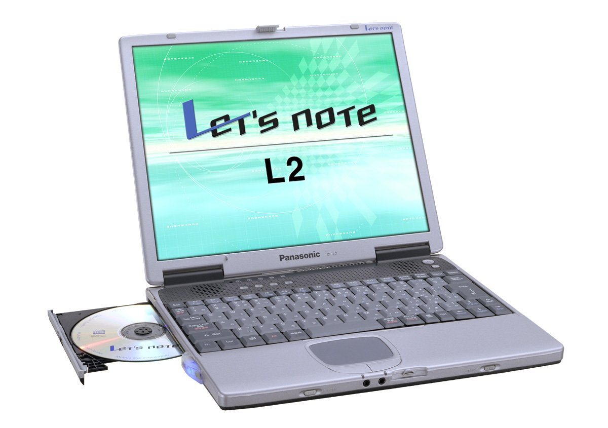

# Panasonic Let's note CF-L2 Specifications

**English** · [日本語](../../ja/CF-L2/) · [中文](../../zh/CF-L2/)

🗄️ See this model in the [Let's note Cabinet](https://letsnote-specs.github.io/en/CF-L2/).

**CF-L2** is a Panasonic Let's note laptop in the L2 series with a 13.3-inch XGA display. This page lists all 1 part numbers, released 2001-06. Each part number links to its official spec sheet.

*Panasonic Let's note CF-L2 (CF-L2R4HMA). Image © Panasonic.*

## Part numbers

| Part number | Released | Discontinued | Summary |
| :-- | :-- | :-- | :-- |
| [CF-L2R4HMA](https://panasonic.jp/pc/p-db/CF-L2R4HMA_spec.html) | 2001-06 | 2002-04 | PentiumIII(700MHz)SS、HDD：20GB、CD-R/RW、H"IN、Office XP、Windows Me |

## Specifications

| Item | Value |
| :-- | :-- |
| CPU | Intel(R) SpeedStep(TM) Technology-compatible Mobile Pentium(R) III Processor 700MHz (System bus clock : 100MHz) |
| Chipset | Intel(R) 440MX Chipset |
| Memory | Standard 64MB SDRAM (max. 192MB) |
| L2 cache | 256KB |
| Video memory | 4MB |
| Graphics chip | Silicon Motion(R), Inc. Lynx 3DM+ |
| Hard disk | 20GB (UltraATA) ※1 |
| Optical drive | CD-R/RW drive・removable / CD-R: max. 8x write / CD-RW: max. 4x rewrite / CD-ROM: max. 24x read |
| Floppy drive (optional) | External USB connection 3.5-inch 3-mode support (1.44MB /1.2MB /720KB) |
| Multi-bay | CD-R/RW drive (standard), weight saver (standard), extended battery pack adapter set (optional) interchangeable |
| Display | XGA (1024×768 dots) 13.3-inch TFT color LCD |
| Display / LCD colors | 1024×768 dots: approx. 16 million colors ※2 |
| Display / External output | 640×480, 800×600, 1024×768, 1280×1024 dots: approx. 16 million colors |
| Display / Simultaneous display | 640×480, 800×600, 1024×768, 1280×1024 *3 dots: approx. 16 million colors *2 |
| Display / Dual display (example) | Internal LCD 1024×768 dots: 65536 colors - External display 1024×768 dots: approx. 16 million colors |
| Modem | Built-in Data: 56kbps (V.90/K56flex auto-supported) FAX: 14.4kbps / voice not supported (RJ-11) *4 |
| Wired LAN | Built-in 100BASE-TX /10BASE-T (RJ-45) *5 |
| Audio | PCM sound source (16-bit stereo), built-in speaker (stereo) |
| PC Card slot | PC card (Type II ×1 slot) CardBus compatible |
| Memory expansion slot | 144-pin DIMM dedicated slot ×1 (64MB /128MB) |
| Interface / H" IN module | Built-in *6 (voice, FAX, etc. not supported) |
| Wireless com port / Mobile phone | PDC : data/FAX 9600bps, packet 9600bps/28.8kbps / cdmaOne : data/FAX 14.4kbps, packet 64kbps |
| Wireless com port / PHS | PIAFS 64K / PIAFS 32K |
| Audio port | Microphone input (monaural mini jack), audio output (stereo mini jack) |
| USB | 4-pin ×2 |
| Serial port | Dsub 9-pin |
| Parallel port | Dsub 25-pin |
| External display port | Analog RGB mini Dsub 15-pin |
| Mouse / external keyboard | Mini Din 6-pin |
| Keyboard | OADG-compliant keyboard (86 keys): key pitch 19mm |
| Pointing device | Flat pad |
| Power | AC 100V-240V (50Hz/60Hz) (AC cord is for 100V only), / Standard battery pack / Extended battery pack adapter set <optional> (lithium-ion) |
| Power consumption | Max approx. 60W *7 |
| Energy efficiency | S classification 0.00092 ※8 |
| Battery | Standard battery pack / Runtime: approx. 4.0 hours *9 Charging: approx. 3 hours (power OFF), approx. 3.5 hours (power ON) *10 / Standard + extended battery pack adapter set <sold separately> / Runtime: approx. 8.0 hours *9 Charging: approx. 6 hours (power OFF), approx. 7 hours (power ON) *10 |
| Dimensions (W×D×H) | 297mm × 238.5mm × 25.6mm (front)・29.7mm (rear) (excluding protrusions) |
| Weight (with battery) | Approx. 1.7kg (with weight saver installed) / Approx. 2.0kg (with CD-R/RW drive installed) / Approx. 2.1kg (with extended battery <sold separately> installed) |
| Software | Microsoft(R) Windows(R) Millennium Edition, / Microsoft(R) Internet Explorer 5.5, / Microsoft(R) IME 2002◆, / Microsoft(R) Office XP Personal ◆ (Word, Excel, Outlook, Bookshelf Basic), / Adobe(R) Acrobat(R) Reader◆, / Internet Starter, / Panasonic PC Online Member Registration, / Online Sign-up (@nifty, BIGLOBE, DION, OCN, ODN, docomo AOL) ◆, / Radio Wave Status Monitor II, / Screen Switching Utility, / B's Recorder GOLD/B's CLiP ◆, / Mobile Editor 2000 ◆*11, / DMI Viewer, / H"IN Sign-up, / H"IN Utility |
| Accessories | Product Recovery CD-ROM (2 discs), USB-connected FDD, AC adapter, modular cable, standard battery pack, weight saver, application CD-ROM (1 disc), Microsoft(R) Office XP Personal application pack, instruction manual, etc. |
| Notes | *1 HDD capacity is shown as 1GB=1,000,000,000 bytes. / *2 Achieved by the dithering function of the graphics accelerator for the internal LCD. / *3 A part of the entire screen (1024×768 dots) is displayed on the internal LCD. When the cursor is moved to the edge of the screen, the entire screen scrolls. / *4 For exclusive use with NTT analog general lines within Japan. Automatically distinguishes and switches between V.90 and K56flex. Also, 56kbps is the theoretical value when receiving data. When sending data, 33.6kbps is the maximum speed. / *5 Some items cannot be used depending on the connector shape. / *6 Not compatible with the called-party-limited service (Two LINK DATA). / *7 Rated input power value based on the Japan Electronics and Information Technology Industries Association Guidelines for Harmonic Suppression Measures for Household and General-Purpose Products Execution Plan: 36W. / *8 Energy consumption efficiency is the power consumption measured by the measuring method specified in the Energy Conservation Act divided by the composite theoretical performance specified in the Energy Conservation Act. / *9 At minimum LCD backlight brightness. Varies depending on the operating environment and system settings. / *10 Charging a completely discharged battery may take time. / *11 The optional mobile phone connection cable is required. / Support for the operation of software marked with ◆ is provided by each software manufacturer. / / ●This computer is not guaranteed to operate with anything other than Windows Me. / ●Among software and peripherals generally labeled for Windows Me, some cannot be used with this computer. Please confirm with the vendor of each software and peripheral before purchasing. / ●The included Product Recovery CD-ROM cannot reinstall the OS only. |

## Related models

- [All Let's note models](../)

---

Source: Panasonic's official [discontinued-models list](https://panasonic.jp/pc/support/products/) and spec sheets (panasonic.jp), translated from Japanese; see the official sheets for the authoritative wording. Product images © Panasonic. This is an unofficial compilation, not affiliated with Panasonic.
