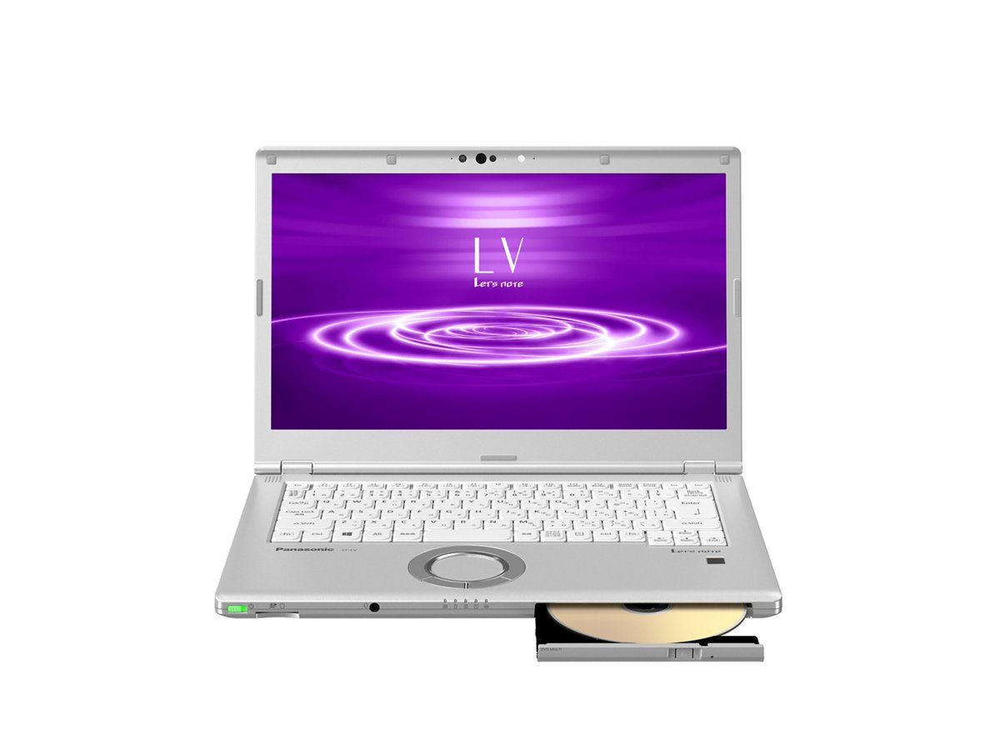
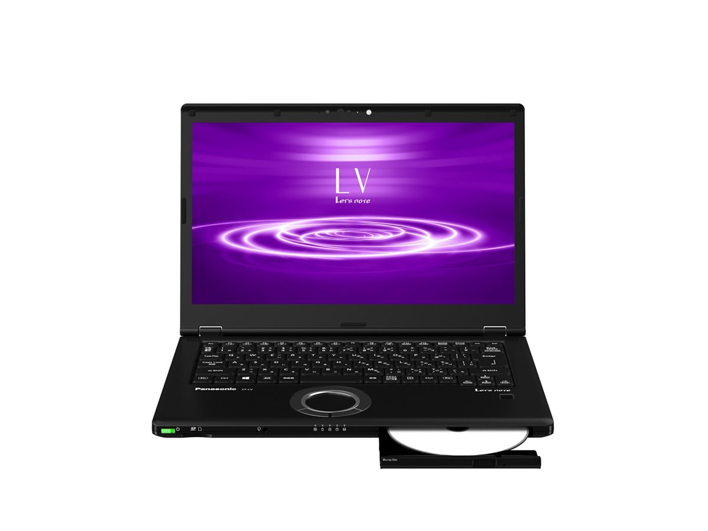
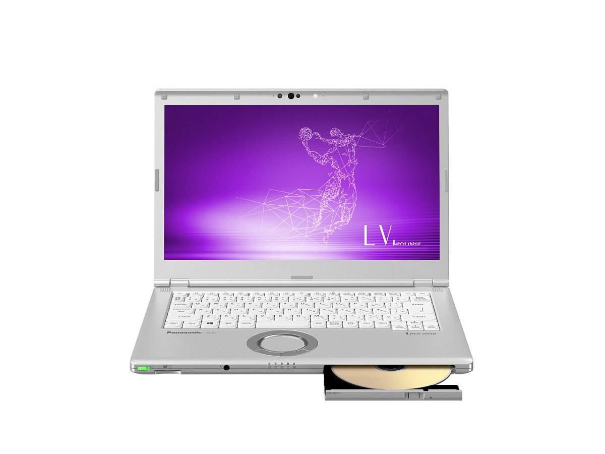
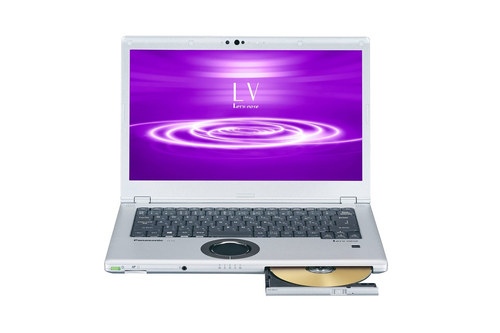
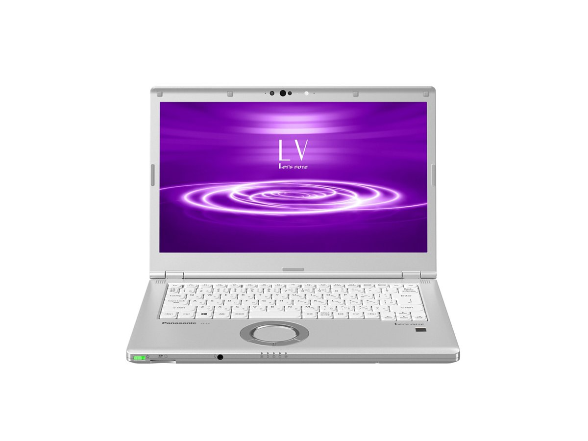
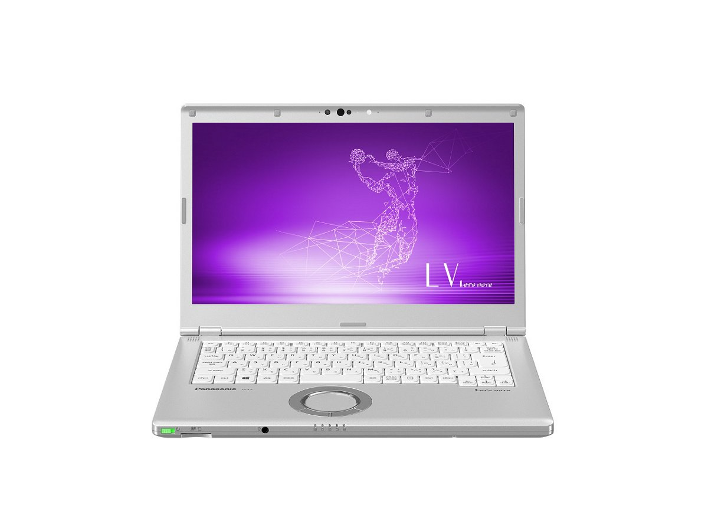
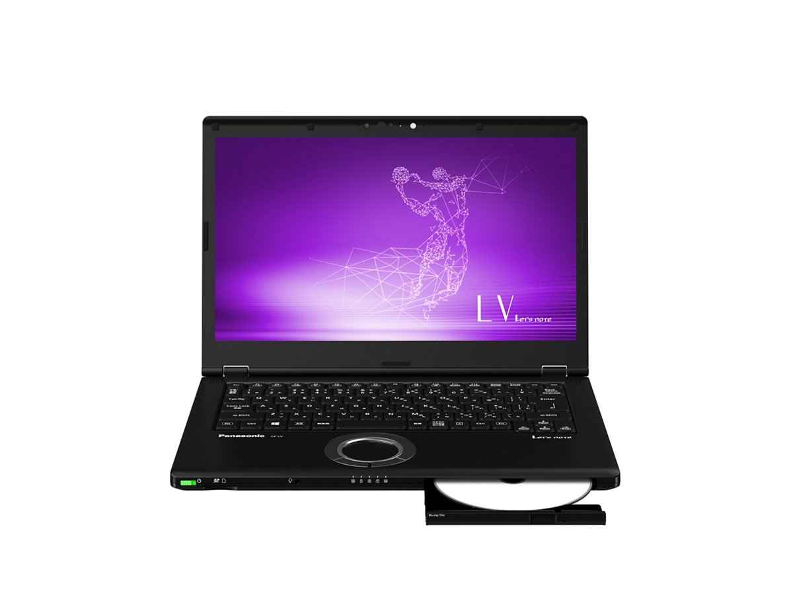

# Panasonic Let's note CF-LV8 Specifications

**English** · [日本語](../../ja/CF-LV8/) · [中文](../../zh/CF-LV8/)

**CF-LV8** is a Panasonic Let's note laptop in the LV series with a 14.0-inch Full HD display. This page lists all 11 part numbers, released 2019-06 – 2020-01. Each part number links to its official spec sheet.

*Panasonic Let's note CF-LV8 (CF-LV8NDSQR, CF-LV8FDSQR, CF-LV8FDPQR), silver. Image © Panasonic.*

## Part numbers

| Part number | Released | Discontinued | Summary |
| :-- | :-- | :-- | :-- |
| [CF-LV8NDSQR](https://panasonic.jp/pc/p-db/CF-LV8NDSQR_spec.html) | 2020-01 | 2020-10 | Windows 10 Pro 64-bit, Intel® CoreTM i5-8265U processor, Memory: 8GB (no empty slot), SSD: 256GB, Super Multi Drive, LAN, Wireless LAN 802.11a (W52/W53/W56)/b/g/n/ac, Microsoft® Office Home and Business 2019 |
| [CF-LV8NDMQR](https://panasonic.jp/pc/p-db/CF-LV8NDMQR_spec.html) | 2020-01 | 2020-10 | Windows 10 Pro 64-bit, Intel® CoreTM i5-8265U processor, Memory: 16GB (no empty slot), SSD: 256GB, Super Multi Drive, LAN, Wireless LAN 802.11a (W52/W53/W56)/b/g/n/ac, Microsoft® Office Home and Business 2019 |
| [CF-LV8PDNQR](https://panasonic.jp/pc/p-db/CF-LV8PDNQR_spec.html) | 2020-01 | 2020-10 | Windows 10 Pro 64-bit, Intel® CoreTM i7-8565U processor, Memory: 8GB (no empty slot), SSD: 512GB, Blu-ray Disc Drive, LAN, Wireless LAN 802.11a (W52/W53/W56)/b/g/n/ac, Microsoft® Office Home and Business 2019 |
| [CF-LV8FDCQR](https://panasonic.jp/pc/p-db/CF-LV8FDCQR_spec.html) | 2019-10 | 2020-05 | Windows 10 Pro 64-bit, Intel® CoreTM i5-8265U processor, Memory: 8GB (no empty slot), SSD: 256GB, LAN, Wireless LAN 802.11a (W52/W53/W56)/b/g/n/ac, Microsoft® Office Home and Business 2019 |
| [CF-LV8FDSQR](https://panasonic.jp/pc/p-db/CF-LV8FDSQR_spec.html) | 2019-10 | 2020-05 | Windows 10 Pro 64-bit, Intel® CoreTM i5-8265U processor, Memory: 8GB (no empty slot), SSD: 256GB, Super Multi Drive, LAN, Wireless LAN 802.11a (W52/W53/W56)/b/g/n/ac, Microsoft® Office Home and Business 2019 |
| [CF-LV8FDPQR](https://panasonic.jp/pc/p-db/CF-LV8FDPQR_spec.html) | 2019-10 | 2020-05 | Windows 10 Pro 64-bit, Intel® CoreTM i5-8265U processor, Memory: 16GB (no empty slot), SSD: 256GB, Super Multi Drive, LAN, Wireless LAN 802.11a (W52/W53/W56)/b/g/n/ac, Microsoft® Office Home and Business 2019 |
| [CF-LV8GDVQR](https://panasonic.jp/pc/p-db/CF-LV8GDVQR_spec.html) | 2019-10 | 2020-05 | Windows 10 Pro 64-bit, Intel® CoreTM i7-8565U processor, Memory: 8GB (no free slot), SSD: 512GB, Blu-ray Disc Drive, LAN, Wireless LAN 802.11a (W52/W53/W56)/b/g/n/ac, Microsoft® Office Home and Business 2019 |
| [CF-LV8KDCQR](https://panasonic.jp/pc/p-db/CF-LV8KDCQR_spec.html) | 2019-06 | 2020-01 | Windows 10 Pro 64-bit, Intel® CoreTM i5-8265U processor, Memory: 8GB (no empty slot), SSD: 256GB, LAN, Wireless LAN 802.11a (W52/W53/W56)/b/g/n/ac, Microsoft® Office Home and Business 2019 |
| [CF-LV8KDGQR](https://panasonic.jp/pc/p-db/CF-LV8KDGQR_spec.html) | 2019-06 | 2020-01 | Windows 10 Pro 64-bit, Intel® CoreTM i5-8265U processor, Memory: 8GB (no empty slot), SSD: 256GB, Super Multi Drive, LAN, Wireless LAN 802.11a (W52/W53/W56)/b/g/n/ac, Microsoft® Office Home and Business 2019 |
| [CF-LV8KDPQR](https://panasonic.jp/pc/p-db/CF-LV8KDPQR_spec.html) | 2019-06 | 2020-01 | Windows 10 Pro 64-bit, Intel® CoreTM i5-8265U processor, Memory: 16GB (no empty slot), SSD: 256GB, Super Multi Drive, LAN, Wireless LAN 802.11a (W52/W53/W56)/b/g/n/ac, Microsoft® Office Home and Business 2019 |
| [CF-LV8LDVQR](https://panasonic.jp/pc/p-db/CF-LV8LDVQR_spec.html) | 2019-06 | 2020-01 | Windows 10 Pro 64-bit, Intel® CoreTM i7-8565U processor, Memory: 8GB (no free slot), SSD: 512GB, Blu-ray Disc Drive, LAN, Wireless LAN 802.11a (W52/W53/W56)/b/g/n/ac, Microsoft® Office Home and Business 2019 |

## Common specifications

| Item | Value |
| :-- | :-- |
| Chipset | Built into CPU |
| Display | 14-inch (16:9) Full HD TFT color LCD (1920 x 1080 dots), anti-glare |
| Display / LCD colors | 1920×1080 dots: approx. 16.77 million colors |
| Display / External output | 1024×768, 1280×768, 1280×1024, 1360×768, 1366×768, 1400×1050, 1600×900, 1600×1200, 1680×1050, 1920×1080, 1920×1200 dots: approx. 16.77 million colors / HDMI output only: 2560×1440, 3840×2160 (30 Hz/60 Hz), 4096×2160 (30 Hz/60 Hz) |
| Display / Simultaneous display | 1024×768, 1280×768, 1280×1024, 1360×768, 1366×768, 1400×1050, 1600×900, 1680×1050, 1920×1080 dots: approx. 16.77 million colors |
| LTE | Not equipped |
| Wired LAN | 1000BASE-T/100BASE-TX/10BASE-T |
| Bluetooth | Bluetooth v5.0 / ■Supported profiles / 【Classic】 / ・A2DP (Source) / ・AVRCP (Target) / ・HCRP (Client) / ・HFP (AG) / ・HID (Host) / ・OPP (Client and Server) / ・PAN (User) / ・SPP (DevA and DevB) / 【Low Energy】 / ・HOGP (Host) |
| Security chip | TPM (TCG V2.0 compliant) |
| SD card slot | SD memory card ×1 slot (SDHC memory card/SDXC memory card support/copyright protection technology support/UHS-I・UHS-II high-speed transfer support) |
| Memory expansion slot | None |
| Camera | Face recognition-compatible camera, effective pixels: max. 1920×1080 pixels (approx. 2.07 megapixels) |
| Microphone | Array microphone |
| Sensors | Illuminance sensor |
| Pointing device | Wheel pad |
| Power consumption | Max approx. 85W |
| Microsoft Office | Microsoft® Office Home and Business 2019 |

## Differences by part number

| Part number | CPU | Memory | Storage | Weight | Battery life |
| :-- | :-- | :-- | :-- | :-- | :-- |
| CF-LV8NDSQR | Core i5-8265U | 8GB LPDDR3 SDRAM | 256GB | 1.27 kg | 12 h |
| CF-LV8NDMQR | Core i5-8265U | 16GB LPDDR3 SDRAM | 256GB | 1.27 kg | 11.5 h |
| CF-LV8PDNQR | Core i7-8565U | 8GB LPDDR3 SDRAM | 512GB | 1.405 kg | 18.5 h |
| CF-LV8FDCQR | Core i5-8265U | 8GB LPDDR3 SDRAM | 256GB | 1.19 kg | 12 h |
| CF-LV8FDSQR | Core i5-8265U | 8GB LPDDR3 SDRAM | 256GB | 1.27 kg | 12 h |
| CF-LV8FDPQR | Core i5-8265U | 16GB LPDDR3 SDRAM | 256GB | 1.27 kg | 11.5 h |
| CF-LV8GDVQR | Core i7-8565U | 8GB LPDDR3 SDRAM | 512GB | 1.405 kg | 18.5 h |
| CF-LV8KDCQR | Core i5-8265U | 8GB LPDDR3 SDRAM | 256GB | 1.17 kg | 13 h |
| CF-LV8KDGQR | Core i5-8265U | 8GB LPDDR3 SDRAM | 256GB | 1.25 kg | 13 h |
| CF-LV8KDPQR | Core i5-8265U | 16GB LPDDR3 SDRAM | 256GB | 1.25 kg | 12.5 h |
| CF-LV8LDVQR | Core i7-8565U | 8GB LPDDR3 SDRAM | 512GB | 1.385 kg | 19.5 h |

CF-LV8NDSQR: all differing specifications

| Item | Value |
| :-- | :-- |
| OS | Windows 10 Pro 64-bit |
| CPU | Intel® Core™ i5-8265U Processor / (Intel® Smart Cache 6MB, clock speed 1.60GHz, up to 3.90GHz when using Intel® Turbo Boost Technology 2.0) |
| Memory | 8GB LPDDR3 SDRAM (no expansion slot) |
| Video memory | Max. 4128MB (shared with main memory) |
| SSD | Flash memory drive (SSD) 256GB (PCIe) Of the above capacity, approx. 15GB is used as the recovery area and approx. 1GB as the system area (unavailable to the user) |
| Optical drive | Built-in Super Multi Drive (DVD/CD), equipped with buffer underrun error prevention function |
| Optical drive speed / Read | DVD-RAM: max 5x / DVD-ROM: max 8x / DVD-R: max 8x / DVD-R DL: max 8x / DVD-RW: max 8x / +R: max 8x / +R DL: max 8x / +RW: max 8x / High Speed +RW: max 8x / CD-ROM: max 24x / CD-R: max 24x / CD-RW: max 24x / High-Speed CD-RW: max 24x / Ultra-Speed CD-RW: max 24x |
| Optical drive speed / Write | DVD-RAM rewrite: max 5x / DVD-R write: max 8x / DVD-R DL write: max 6x / DVD-RW rewrite: max 6x / +R write: max 8x / +R DL write: max 6x / +RW rewrite: max 4x / High Speed +RW rewrite: max 8x / CD-R write: max 24x / CD-RW rewrite: 4x / High-Speed CD-RW rewrite: 10x / Ultra-Speed CD-RW rewrite: max 16x |
| Supported discs / Read | DVD-RAM ( 1.4GB, 2.8GB, 4.7GB, 9.4GB ) / DVD-ROM ( single layer, dual layer ) / DVD-Video ( single layer, dual layer ) / DVD-R ( 1.4GB, 2.8GB, 3.95GB, 4.7GB ) / DVD-R DL ( 8.5GB ) / DVD-RW ( Ver.1.1/1.2 1.4GB, 2.8GB, 4.7GB, 9.4GB ) / +R ( 4.7GB ) / +R DL ( 8.5GB ) / +RW ( 4.7GB ) / High Speed +RW ( 4.7GB ) / CD-Audio / CD-ROM ( XA support ) / Photo CD ( multi-session support ) / Video CD / CD EXTRA / CD-TEXT / CD-R / CD-RW / High-Speed CD-RW / Ultra-Speed CD-RW |
| Supported discs / Write | DVD-RAM（1.4GB、2.8GB、4.7GB、9.4GB） / DVD-R（1.4GB、2.8 GB、4.7GB for General） / DVD-R DL（8.5GB） / DVD-RW（Ver.1.1/1.2 1.4GB、2.8GB、4.7GB、9.4GB） / +R（ 4.7GB） / +R DL（8.5GB） / +RW（ 4.7GB） / High Speed +RW（ 4.7GB） / CD-R / CD-RW / High-Speed CD-RW / Ultra-Speed CD-RW |
| Display / Graphics | Intel® UHD Graphics 620 (built into CPU) |
| Wireless communication | Intel® Wireless-AC 9560 |
| Wireless LAN | IEEE802.11a (W52/W53/W56)/b/g/n/ac compliant (WPA3, WPA2-AES/TKIP support, Wi-Fi compliant) |
| Audio | PCM sound source (24-bit stereo), Intel® High Definition Audio compliant, stereo speakers |
| Security (Windows Hello) | Face recognition-compatible camera / Fingerprint sensor (touch type) |
| Ports | ・USB3.1 Type-C port (Thunderbolt™3, USB Power Delivery supported) / ・USB3.0 Type-A port ×3 (one of which also supports smartphone charging) / ・LAN connector (RJ-45) / ・External display connector (analog RGB mini D-sub 15 pin) / ・HDMI output terminal (4K60p output supported) / ・Headset terminal (microphone input + audio output) (headset mini jack 3.5mm, CTIA compliant) |
| Keyboard | OADG-compliant 87 keys, key pitch 19mm (vertical/horizontal) (excluding some keys) |
| Power | ▼AC adapter / Input: AC100V–240V, 50Hz/60Hz, Output: DC16V, 5.3A, power cord for 100V only / ▼Battery pack (S) / 7.2V lithium-ion, rated capacity 5900mAh |
| Energy efficiency | Target fiscal year 2022 standard, 10 categories 19.7 [kWh/year] |
| Efficiency target achievement | Energy-saving standard achievement rate 74% |
| Battery life / charge time | ▼Battery life / (JEITA Ver.2.0) / approx. 12 hours / ▼Charging time / approx. 3 hours both when power ON and OFF |
| Dimensions (W×D×H) | Width 333.0mm × Depth 225.3mm × Height 24.5mm (excluding protrusions) |
| Color | Silver |
| Weight (with battery) | PC body: approx. 1.27kg (when attached battery pack (S) (approx. 255g)) / AC adapter: approx. 260g (excluding power cord (approx. 60g)) |
| Software | ・Microsoft® Internet Explorer 11 / ・Microsoft® Edge / ・Microsoft® .NET Framework 4.8 / ・Microsoft® Windows Media Player 12 / ・McAfee LiveSafe (60-day free trial version) / ・i-Filter 6.0 (30-day free trial version) / ・WinZip 20.5 Japanese version (45-day trial version) / ・Power2Go for Panasonic / ・PowerDirector for Panasonic / ・CyberLink PowerDVD14 / ・Aptio Setup Utility / ・PC-Diagnostic Utility / ・Panasonic PC Settings Utility / ・Hard Disk Data Erase Utility / ・DirectX 12 / ・PC Information Viewer / ・Panasonic PC Recovery Disc Creation Utility / ・Panasonic PC Camera Utility |
| Accessories | Battery pack (S), AC adapter, instruction manual, Microsoft Office Home & Business 2019, etc. |

Official spec sheet: <https://panasonic.jp/pc/p-db/CF-LV8NDSQR_spec.html>

CF-LV8NDMQR: all differing specifications

| Item | Value |
| :-- | :-- |
| OS | Windows 10 Pro 64-bit |
| CPU | Intel® Core™ i5-8265U Processor / (Intel® Smart Cache 6MB, clock speed 1.60GHz, up to 3.90GHz when using Intel® Turbo Boost Technology 2.0) |
| Memory | 16GB LPDDR3 SDRAM (no expansion slot) |
| Video memory | Max 8224MB (shared with main memory) |
| SSD | Flash memory drive (SSD) 256GB (PCIe) Of the above capacity, approx. 15GB is used as the recovery area and approx. 1GB as the system area (unavailable to the user) |
| Optical drive | Built-in Super Multi Drive (DVD/CD), equipped with buffer underrun error prevention function |
| Optical drive speed / Read | DVD-RAM: max 5x / DVD-ROM: max 8x / DVD-R: max 8x / DVD-R DL: max 8x / DVD-RW: max 8x / +R: max 8x / +R DL: max 8x / +RW: max 8x / High Speed +RW: max 8x / CD-ROM: max 24x / CD-R: max 24x / CD-RW: max 24x / High-Speed CD-RW: max 24x / Ultra-Speed CD-RW: max 24x |
| Optical drive speed / Write | DVD-RAM rewrite: max 5x / DVD-R write: max 8x / DVD-R DL write: max 6x / DVD-RW rewrite: max 6x / +R write: max 8x / +R DL write: max 6x / +RW rewrite: max 4x / High Speed +RW rewrite: max 8x / CD-R write: max 24x / CD-RW rewrite: 4x / High-Speed CD-RW rewrite: 10x / Ultra-Speed CD-RW rewrite: max 16x |
| Supported discs / Read | DVD-RAM ( 1.4GB, 2.8GB, 4.7GB, 9.4GB ) / DVD-ROM ( single layer, dual layer ) / DVD-Video ( single layer, dual layer ) / DVD-R ( 1.4GB, 2.8GB, 3.95GB, 4.7GB ) / DVD-R DL ( 8.5GB ) / DVD-RW ( Ver.1.1/1.2 1.4GB, 2.8GB, 4.7GB, 9.4GB ) / +R ( 4.7GB ) / +R DL ( 8.5GB ) / +RW ( 4.7GB ) / High Speed +RW ( 4.7GB ) / CD-Audio / CD-ROM ( XA support ) / Photo CD ( multi-session support ) / Video CD / CD EXTRA / CD-TEXT / CD-R / CD-RW / High-Speed CD-RW / Ultra-Speed CD-RW |
| Supported discs / Write | DVD-RAM（1.4GB、2.8GB、4.7GB、9.4GB） / DVD-R（1.4GB、2.8 GB、4.7GB for General） / DVD-R DL（8.5GB） / DVD-RW（Ver.1.1/1.2 1.4GB、2.8GB、4.7GB、9.4GB） / +R（ 4.7GB） / +R DL（8.5GB） / +RW（ 4.7GB） / High Speed +RW（ 4.7GB） / CD-R / CD-RW / High-Speed CD-RW / Ultra-Speed CD-RW |
| Display / Graphics | Intel® UHD Graphics 620 (built into CPU) |
| Wireless communication | Intel® Wireless-AC 9560 |
| Wireless LAN | IEEE802.11a (W52/W53/W56)/b/g/n/ac compliant (WPA3, WPA2-AES/TKIP support, Wi-Fi compliant) |
| Audio | PCM sound source (24-bit stereo), Intel® High Definition Audio compliant, stereo speakers |
| Security (Windows Hello) | Face recognition-compatible camera / Fingerprint sensor (touch type) |
| Ports | ・USB3.1 Type-C port (Thunderbolt™3, USB Power Delivery supported) / ・USB3.0 Type-A port ×3 (one of which also supports smartphone charging) / ・LAN connector (RJ-45) / ・External display connector (analog RGB mini D-sub 15 pin) / ・HDMI output terminal (4K60p output supported) / ・Headset terminal (microphone input + audio output) (headset mini jack 3.5mm, CTIA compliant) |
| Keyboard | OADG-compliant 87 keys, key pitch 19mm (vertical/horizontal) (excluding some keys) |
| Power | ▼AC adapter / Input: AC100V–240V, 50Hz/60Hz, Output: DC16V, 5.3A, power cord for 100V only / ▼Battery pack (S) / 7.2V lithium-ion, rated capacity 5900mAh |
| Energy efficiency | Target fiscal year 2022 standard, 10 categories 21.6 [kWh/year] |
| Efficiency target achievement | Energy-saving standard achievement rate 75% |
| Battery life / charge time | ▼Battery life / (JEITA Ver.2.0) / approx. 11.5 hours / ▼Charging time / approx. 3 hours both when power ON and OFF |
| Dimensions (W×D×H) | Width 333.0mm × Depth 225.3mm × Height 24.5mm (excluding protrusions) |
| Color | Silver & Black |
| Weight (with battery) | PC body: approx. 1.27kg (when attached battery pack (S) (approx. 255g)) / AC adapter: approx. 260g (excluding power cord (approx. 60g)) |
| Software | ・Microsoft® Internet Explorer 11 / ・Microsoft® Edge / ・Microsoft® .NET Framework 4.8 / ・Microsoft® Windows Media Player 12 / ・McAfee LiveSafe (60-day free trial version) / ・i-Filter 6.0 (30-day free trial version) / ・WinZip 20.5 Japanese version (45-day trial version) / ・Power2Go for Panasonic / ・PowerDirector for Panasonic / ・CyberLink PowerDVD14 / ・Aptio Setup Utility / ・PC-Diagnostic Utility / ・Panasonic PC Settings Utility / ・Hard Disk Data Erase Utility / ・DirectX 12 / ・PC Information Viewer / ・Panasonic PC Recovery Disc Creation Utility / ・Panasonic PC Camera Utility |
| Accessories | Battery pack (S), AC adapter, instruction manual, Microsoft Office Home & Business 2019, etc. |

Official spec sheet: <https://panasonic.jp/pc/p-db/CF-LV8NDMQR_spec.html>

CF-LV8PDNQR: all differing specifications

| Item | Value |
| :-- | :-- |
| OS | Windows 10 Pro 64-bit |
| CPU | Intel® Core™ i7-8565U Processor / (Intel® Smart Cache 8MB, clock speed 1.80GHz, up to 4.60GHz when using Intel® Turbo Boost Technology 2.0) |
| Memory | 8GB LPDDR3 SDRAM (no expansion slot) |
| Video memory | Max. 4128MB (shared with main memory) |
| SSD | Flash memory drive (SSD) 512GB (PCIe) Of the above capacity, approx. 15GB is used as the recovery area and approx. 1GB as the system area (unavailable to the user) |
| Optical drive | Blu-ray Disc Drive built-in / DVD Super Multi Drive function / Buffer underrun error prevention function equipped |
| Optical drive speed / Read | BD-ROM: max 6x / BD-R: max 6x / BD-R DL: max 6x / BD-R LTH: max 6x / BD-R XL: max 6x / BD-RE: max 6x / BD-RE DL: max 6x / BD-RE XL: max 4x / DVD-RAM: max 5x / DVD-ROM: max 8x / DVD-R: max 8x / DVD-R DL: max 8x / DVD-RW: max 8x / +R: max 8x / +R DL: max 8x / +RW: max 8x / High Speed +RW: max 8x / CD-ROM: max 24x / CD-R: max 24x / CD-RW: max 24x / High-Speed CD-RW: max 24x / Ultra-Speed CD-RW: max 24x |
| Optical drive speed / Write | BD-R write: max 6x / BD-R DL write: max 6x / BD-R LTH write: max 4x / BD-R XL write: max 4x / BD-RE rewrite: 2x / BD-RE DL rewrite: 2x / BD-RE XL rewrite: 2x / DVD-RAM rewrite: max 5x / DVD-R write: max 8x / DVD-R DL write: max 6x / DVD-RW rewrite: max 6x / +R write: max 8x / +R DL write: max 6x / +RW rewrite: max 4x / High Speed +RW rewrite: max 8x / CD-R write: max 24x / CD-RW rewrite: 4x / High-Speed CD-RW rewrite: 10x / Ultra-Speed CD-RW rewrite: max 16x |
| Supported discs / Read | BD-ROM / BD-R (Ver.1.1/1.2/1.3, 25GB) / BD-R DL (Ver.1.1/1.2/1.3, 50GB) / BD-R LTH (Ver.1.2/1.3, 25GB) / BD-R XL (Ver.2.0, 100GB) / BD-RE (Ver. 2.1, 25GB) / BD-RE DL (Ver.2.1, 50GB) / BD-RE XL (Ver.3.0, 100GB) / DVD-RAM ( 1.4GB, 2.8GB, 4.7GB, 9.4GB ) / DVD-ROM (single layer, dual layer) / DVD-Video (single layer, dual layer) / DVD-R (1.4GB, 2.8GB, 3.95GB, 4.7GB) / DVD-R DL (8.5GB) / DVD-RW (Ver.1.1/1.2 1.4GB, 2.8GB, 4.7GB, 9.4GB) / +R (4.7GB) / +R DL (8.5GB) / +RW (4.7GB) / High Speed +RW (4.7GB) / CD-Audio / CD-ROM (XA support) / Photo CD (multi-session support) / Video CD / CD EXTRA / CD-TEXT / CD-R / CD-RW / High-Speed CD-RW / Ultra-Speed CD-RW |
| Supported discs / Write | BD-R（25GB） / BD-R DL（50GB） / BD-R LTH（25GB） / BD-R XL（100GB） / BD-RE（25GB） / BD-RE DL（50GB） / BD-RE XL（100GB） / DVD-RAM（1.4GB、2.8GB、4.7GB、9.4GB） / DVD-R（1.4GB、2.8 GB、4.7GB for General） / DVD-R DL（8.5GB） / DVD-RW（Ver.1.1/1.2 1.4GB、2.8GB、4.7GB、9.4GB） / +R（ 4.7GB） / +R DL（8.5GB） / +RW（ 4.7GB） / High Speed +RW（ 4.7GB） / CD-R / CD-RW / High-Speed CD-RW / Ultra-Speed CD-RW |
| Display / Graphics | Intel® UHD Graphics 620 (built into CPU) |
| Wireless communication | Intel® Wireless-AC 9560 |
| Wireless LAN | IEEE802.11a (W52/W53/W56)/b/g/n/ac compliant (WPA3, WPA2-AES/TKIP support, Wi-Fi compliant) |
| Audio | PCM sound source (24-bit stereo), Intel® High Definition Audio compliant, stereo speakers |
| Security (Windows Hello) | Face recognition-compatible camera / Fingerprint sensor (touch type) |
| Ports | ・USB3.1 Type-C port (Thunderbolt™3, USB Power Delivery supported) / ・USB3.0 Type-A port ×3 (one of which also supports smartphone charging) / ・LAN connector (RJ-45) / ・External display connector (analog RGB mini D-sub 15 pin) / ・HDMI output terminal (4K60p output supported) / ・Headset terminal (microphone input + audio output) (headset mini jack 3.5mm, CTIA compliant) |
| Keyboard | OADG-compliant 87 keys, key pitch 19mm (vertical/horizontal) (excluding some keys) |
| Power | ▼AC adapter / Input: AC100V–240V, 50Hz/60Hz, Output: DC16V, 5.3A, power cord for 100V only / ▼Battery pack (L) / 10.8V lithium-ion, rated capacity 6300mAh |
| Energy efficiency | Target fiscal year 2022 standard, 12 categories 19.7 [kWh/year] |
| Efficiency target achievement | — |
| Battery life / charge time | ▼Battery life / (JEITA Ver.2.0) / approx. 18.5 hours / ▼Charging time / approx. 3 hours both with power ON and OFF |
| Dimensions (W×D×H) | Width 333.0mm × Depth 225.3mm × Height 24.5mm (excluding protrusions) |
| Color | Black |
| Weight (with battery) | PC body: approx. 1.405kg (with included battery pack (L) (approx. 355g) installed) / AC adapter: approx. 260g (excluding power cord (approx. 60g)) |
| Software | ・Microsoft® Internet Explorer 11 / ・Microsoft® Edge / ・Microsoft® .NET Framework 4.8 / ・Microsoft® Windows Media Player 12 / ・McAfee LiveSafe (60-day free trial version) / ・i-Filter 6.0 (30-day free trial version) / ・WinZip 20.5 Japanese version (45-day trial version) / ・Power2Go for Panasonic / ・PowerDirector BD for Panasonic / ・CyberLink PowerDVD14 / ・Aptio Setup Utility / ・PC-Diagnostic Utility / ・Panasonic PC Settings Utility / ・Hard Disk Data Erase Utility / ・DirectX 12 / ・PC Information Viewer / ・Panasonic PC Recovery Disc Creation Utility / ・Panasonic PC Camera Utility |
| Accessories | Battery pack (L), AC adapter, instruction manual, Microsoft Office Home & Business 2019, etc. |

Official spec sheet: <https://panasonic.jp/pc/p-db/CF-LV8PDNQR_spec.html>

CF-LV8FDCQR: all differing specifications

| Item | Value |
| :-- | :-- |
| OS | Windows 10 Pro 64-bit (Japanese version) |
| CPU | Intel® Core™ i5-8265U Processor / (Intel® Smart Cache 6MB, clock speed 1.60GHz, up to 3.90GHz when using Intel® Turbo Boost Technology 2.0) |
| Memory | 8GB LPDDR3 SDRAM (no expansion slot) |
| Video memory | Max. 4130MB (shared with main memory) |
| SSD | Flash memory drive (SSD) 256GB (PCIe) Of the above capacity, approx. 15GB is used as the recovery area and approx. 1GB as the system area (unavailable to the user) |
| Optical drive | Not equipped |
| Display / Graphics | Intel® UHD Graphics 620 (built into CPU) |
| Wireless communication | Intel® Wireless-AC 9560 |
| Wireless LAN | IEEE802.11a (W52/W53/W56)/b/g/n/ac compliant (WPA2-AES/TKIP support, Wi-Fi compliant) |
| Audio | PCM sound source (24-bit stereo), Intel® High Definition Audio compliant, stereo speakers |
| Security (Windows Hello) | Face recognition-compatible camera / Fingerprint sensor (touch type) |
| Ports | ・USB3.1 Type-C port (Thunderbolt™3, USB Power Delivery supported) / ・USB3.0 Type-A port ×3 (one of which also supports smartphone charging) / ・LAN connector (RJ-45) / ・External display connector (analog RGB mini D-sub 15 pin) / ・HDMI output terminal (4K60p output supported) / ・Headset terminal (microphone input + audio output) (headset mini jack 3.5mm, CTIA compliant) |
| Keyboard | OADG-compliant 87 keys, key pitch 19mm (vertical/horizontal) (excluding some keys) |
| Power | ▼AC adapter / Input: AC100V–240V, 50Hz/60Hz, Output: DC16V, 5.3A, power cord for 100V only / ▼Battery pack (S) / 7.2V lithium-ion, rated capacity 5900mAh |
| Energy efficiency | 2011 fiscal year standard N category 0.025 |
| Battery life / charge time | ▼Battery life / (JEITA Ver.2.0) / approx. 12 hours / ▼Charging time / approx. 3 hours both when power ON and OFF |
| Dimensions (W×D×H) | Width 333.0mm × Depth 225.3mm × Height 24.5mm (excluding protrusions) |
| Color | Silver |
| Weight (with battery) | PC body: approx. 1.19kg (when equipped with included battery pack (S) (approx. 255g)) / AC adapter: approx. 260g (excluding power cord (approx. 60g)) |
| Software | ・Microsoft® Internet Explorer 11 / ・Microsoft® Edge / ・Microsoft® .NET Framework 4.8 / ・Microsoft® Windows Media Player 12 / ・McAfee LiveSafe (60-day free trial) / ・i-Filter 6.0 (30-day free trial) / ・WinZip 20.5 Japanese version (45-day trial) / ・Aptio Setup Utility / ・PC-Diagnostic Utility / ・Panasonic PC Settings Utility / ・Hard Disk Data Erase Utility / ・DirectX 12 / ・PC Information Viewer / ・Panasonic PC Recovery Disc Creation Utility / ・Panasonic PC Camera Utility |
| Accessories | Battery pack (S), AC adapter, instruction manual, Microsoft Office Home & Business 2019, etc. |
| Efficiency target achievement (FY2011 standard) | — |

Official spec sheet: <https://panasonic.jp/pc/p-db/CF-LV8FDCQR_spec.html>

CF-LV8FDSQR: all differing specifications

| Item | Value |
| :-- | :-- |
| OS | Windows 10 Pro 64-bit (Japanese version) |
| CPU | Intel® Core™ i5-8265U Processor / (Intel® Smart Cache 6MB, clock speed 1.60GHz, up to 3.90GHz when using Intel® Turbo Boost Technology 2.0) |
| Memory | 8GB LPDDR3 SDRAM (no expansion slot) |
| Video memory | Max. 4130MB (shared with main memory) |
| SSD | Flash memory drive (SSD) 256GB (PCIe) Of the above capacity, approx. 15GB is used as the recovery area and approx. 1GB as the system area (unavailable to the user) |
| Optical drive | Built-in Super Multi Drive (DVD/CD), equipped with buffer underrun error prevention function |
| Optical drive speed / Read | DVD-RAM: max 5x / DVD-ROM: max 8x / DVD-R: max 8x / DVD-R DL: max 8x / DVD-RW: max 8x / +R: max 8x / +R DL: max 8x / +RW: max 8x / High Speed +RW: max 8x / CD-ROM: max 24x / CD-R: max 24x / CD-RW: max 24x / High-Speed CD-RW: max 24x / Ultra-Speed CD-RW: max 24x |
| Optical drive speed / Write | DVD-RAM rewrite: max 5x / DVD-R write: max 8x / DVD-R DL write: max 6x / DVD-RW rewrite: max 6x / +R write: max 8x / +R DL write: max 6x / +RW rewrite: max 4x / High Speed +RW rewrite: max 8x / CD-R write: max 24x / CD-RW rewrite: 4x / High-Speed CD-RW rewrite: 10x / Ultra-Speed CD-RW rewrite: max 16x |
| Supported discs / Read | DVD-RAM ( 1.4GB, 2.8GB, 4.7GB, 9.4GB ) / DVD-ROM ( single layer, dual layer ) / DVD-Video ( single layer, dual layer ) / DVD-R ( 1.4GB, 2.8GB, 3.95GB, 4.7GB ) / DVD-R DL ( 8.5GB ) / DVD-RW ( Ver.1.1/1.2 1.4GB, 2.8GB, 4.7GB, 9.4GB ) / +R ( 4.7GB ) / +R DL ( 8.5GB ) / +RW ( 4.7GB ) / High Speed +RW ( 4.7GB ) / CD-Audio / CD-ROM ( XA support ) / Photo CD ( multi-session support ) / Video CD / CD EXTRA / CD-TEXT / CD-R / CD-RW / High-Speed CD-RW / Ultra-Speed CD-RW |
| Supported discs / Write | DVD-RAM（1.4GB、2.8GB、4.7GB、9.4GB） / DVD-R（1.4GB、2.8 GB、4.7GB for General） / DVD-R DL（8.5GB） / DVD-RW（Ver.1.1/1.2 1.4GB、2.8GB、4.7GB、9.4GB） / +R（ 4.7GB） / +R DL（8.5GB） / +RW（ 4.7GB） / High Speed +RW（ 4.7GB） / CD-R / CD-RW / High-Speed CD-RW / Ultra-Speed CD-RW |
| Display / Graphics | Intel® UHD Graphics 620 (built into CPU) |
| Wireless communication | Intel® Wireless-AC 9560 |
| Wireless LAN | IEEE802.11a (W52/W53/W56)/b/g/n/ac compliant (WPA2-AES/TKIP support, Wi-Fi compliant) |
| Audio | PCM sound source (24-bit stereo), Intel® High Definition Audio compliant, stereo speakers |
| Security (Windows Hello) | Face recognition-compatible camera / Fingerprint sensor (touch type) |
| Ports | ・USB3.1 Type-C port (Thunderbolt™3, USB Power Delivery supported) / ・USB3.0 Type-A port ×3 (one of which also supports smartphone charging) / ・LAN connector (RJ-45) / ・External display connector (analog RGB mini D-sub 15 pin) / ・HDMI output terminal (4K60p output supported) / ・Headset terminal (microphone input + audio output) (headset mini jack 3.5mm, CTIA compliant) |
| Keyboard | OADG-compliant 87 keys, key pitch 19mm (vertical/horizontal) (excluding some keys) |
| Power | ▼AC adapter / Input: AC100V–240V, 50Hz/60Hz, Output: DC16V, 5.3A, power cord for 100V only / ▼Battery pack (S) / 7.2V lithium-ion, rated capacity 5900mAh |
| Energy efficiency | 2011 fiscal year standard N category 0.025 |
| Battery life / charge time | ▼Battery life / (JEITA Ver.2.0) / approx. 12 hours / ▼Charging time / approx. 3 hours both when power ON and OFF |
| Dimensions (W×D×H) | Width 333.0mm × Depth 225.3mm × Height 24.5mm (excluding protrusions) |
| Color | Silver |
| Weight (with battery) | PC body: approx. 1.27kg (when attached battery pack (S) (approx. 255g)) / AC adapter: approx. 260g (excluding power cord (approx. 60g)) |
| Software | ・Microsoft® Internet Explorer 11 / ・Microsoft® Edge / ・Microsoft® .NET Framework 4.8 / ・Microsoft® Windows Media Player 12 / ・McAfee LiveSafe (60-day free trial version) / ・i-Filter 6.0 (30-day free trial version) / ・WinZip 20.5 Japanese version (45-day trial version) / ・Power2Go for Panasonic / ・PowerDirector for Panasonic / ・CyberLink PowerDVD14 / ・Aptio Setup Utility / ・PC-Diagnostic Utility / ・Panasonic PC Settings Utility / ・Hard Disk Data Erase Utility / ・DirectX 12 / ・PC Information Viewer / ・Panasonic PC Recovery Disc Creation Utility / ・Panasonic PC Camera Utility |
| Accessories | Battery pack (S), AC adapter, instruction manual, Microsoft Office Home & Business 2019, etc. |
| Efficiency target achievement (FY2011 standard) | — |

Official spec sheet: <https://panasonic.jp/pc/p-db/CF-LV8FDSQR_spec.html>

CF-LV8FDPQR: all differing specifications

| Item | Value |
| :-- | :-- |
| OS | Windows 10 Pro 64-bit (Japanese version) |
| CPU | Intel® Core™ i5-8265U Processor / (Intel® Smart Cache 6MB, clock speed 1.60GHz, up to 3.90GHz when using Intel® Turbo Boost Technology 2.0) |
| Memory | 16GB LPDDR3 SDRAM (no expansion slot) |
| Video memory | Max 8242MB (shared with main memory) |
| SSD | Flash memory drive (SSD) 256GB (PCIe) Of the above capacity, approx. 15GB is used as the recovery area and approx. 1GB as the system area (unavailable to the user) |
| Optical drive | Built-in Super Multi Drive (DVD/CD), equipped with buffer underrun error prevention function |
| Optical drive speed / Read | DVD-RAM: max 5x / DVD-ROM: max 8x / DVD-R: max 8x / DVD-R DL: max 8x / DVD-RW: max 8x / +R: max 8x / +R DL: max 8x / +RW: max 8x / High Speed +RW: max 8x / CD-ROM: max 24x / CD-R: max 24x / CD-RW: max 24x / High-Speed CD-RW: max 24x / Ultra-Speed CD-RW: max 24x |
| Optical drive speed / Write | DVD-RAM rewrite: max 5x / DVD-R write: max 8x / DVD-R DL write: max 6x / DVD-RW rewrite: max 6x / +R write: max 8x / +R DL write: max 6x / +RW rewrite: max 4x / High Speed +RW rewrite: max 8x / CD-R write: max 24x / CD-RW rewrite: 4x / High-Speed CD-RW rewrite: 10x / Ultra-Speed CD-RW rewrite: max 16x |
| Supported discs / Read | DVD-RAM ( 1.4GB, 2.8GB, 4.7GB, 9.4GB ) / DVD-ROM ( single layer, dual layer ) / DVD-Video ( single layer, dual layer ) / DVD-R ( 1.4GB, 2.8GB, 3.95GB, 4.7GB ) / DVD-R DL ( 8.5GB ) / DVD-RW ( Ver.1.1/1.2 1.4GB, 2.8GB, 4.7GB, 9.4GB ) / +R ( 4.7GB ) / +R DL ( 8.5GB ) / +RW ( 4.7GB ) / High Speed +RW ( 4.7GB ) / CD-Audio / CD-ROM ( XA support ) / Photo CD ( multi-session support ) / Video CD / CD EXTRA / CD-TEXT / CD-R / CD-RW / High-Speed CD-RW / Ultra-Speed CD-RW |
| Supported discs / Write | DVD-RAM（1.4GB、2.8GB、4.7GB、9.4GB） / DVD-R（1.4GB、2.8 GB、4.7GB for General） / DVD-R DL（8.5GB） / DVD-RW（Ver.1.1/1.2 1.4GB、2.8GB、4.7GB、9.4GB） / +R（ 4.7GB） / +R DL（8.5GB） / +RW（ 4.7GB） / High Speed +RW（ 4.7GB） / CD-R / CD-RW / High-Speed CD-RW / Ultra-Speed CD-RW |
| Display / Graphics | Intel® UHD Graphics 620 (built into CPU) |
| Wireless communication | Intel® Wireless-AC 9560 |
| Wireless LAN | IEEE802.11a (W52/W53/W56)/b/g/n/ac compliant (WPA2-AES/TKIP support, Wi-Fi compliant) |
| Audio | PCM sound source (24-bit stereo), Intel® High Definition Audio compliant, stereo speakers |
| Security (Windows Hello) | Face recognition-compatible camera / Fingerprint sensor (touch type) |
| Ports | ・USB3.1 Type-C port (Thunderbolt™3, USB Power Delivery supported) / ・USB3.0 Type-A port ×3 (one of which also supports smartphone charging) / ・LAN connector (RJ-45) / ・External display connector (analog RGB mini D-sub 15 pin) / ・HDMI output terminal (4K60p output supported) / ・Headset terminal (microphone input + audio output) (headset mini jack 3.5mm, CTIA compliant) |
| Keyboard | OADG-compliant 87 keys, key pitch 19mm (vertical/horizontal) (excluding some keys) |
| Power | ▼AC adapter / Input: AC100V–240V, 50Hz/60Hz, Output: DC16V, 5.3A, power cord for 100V only / ▼Battery pack (S) / 7.2V lithium-ion, rated capacity 5900mAh |
| Energy efficiency | 2011 fiscal year standard M category 0.025 |
| Battery life / charge time | ▼Battery life / (JEITA Ver.2.0) / approx. 11.5 hours / ▼Charging time / approx. 3 hours both when power ON and OFF |
| Dimensions (W×D×H) | Width 333.0mm × Depth 225.3mm × Height 24.5mm (excluding protrusions) |
| Color | Silver |
| Weight (with battery) | PC body: approx. 1.27kg (when attached battery pack (S) (approx. 255g)) / AC adapter: approx. 260g (excluding power cord (approx. 60g)) |
| Software | ・Microsoft® Internet Explorer 11 / ・Microsoft® Edge / ・Microsoft® .NET Framework 4.8 / ・Microsoft® Windows Media Player 12 / ・McAfee LiveSafe (60-day free trial version) / ・i-Filter 6.0 (30-day free trial version) / ・WinZip 20.5 Japanese version (45-day trial version) / ・Power2Go for Panasonic / ・PowerDirector for Panasonic / ・CyberLink PowerDVD14 / ・Aptio Setup Utility / ・PC-Diagnostic Utility / ・Panasonic PC Settings Utility / ・Hard Disk Data Erase Utility / ・DirectX 12 / ・PC Information Viewer / ・Panasonic PC Recovery Disc Creation Utility / ・Panasonic PC Camera Utility |
| Accessories | Battery pack (S), AC adapter, instruction manual, Microsoft Office Home & Business 2019, etc. |
| Efficiency target achievement (FY2011 standard) | — |

Official spec sheet: <https://panasonic.jp/pc/p-db/CF-LV8FDPQR_spec.html>

CF-LV8GDVQR: all differing specifications

| Item | Value |
| :-- | :-- |
| OS | Windows 10 Pro 64-bit (Japanese version) |
| CPU | Intel® Core™ i7-8565U Processor / (Intel® Smart Cache 8MB, clock speed 1.80GHz, up to 4.60GHz when using Intel® Turbo Boost Technology 2.0) |
| Memory | 8GB LPDDR3 SDRAM (no expansion slot) |
| Video memory | Max. 4130MB (shared with main memory) |
| SSD | Flash memory drive (SSD) 512GB (PCIe) Of the above capacity, approx. 15GB is used as the recovery area and approx. 1GB as the system area (unavailable to the user) |
| Optical drive | Blu-ray Disc Drive built-in / DVD Super Multi Drive function / Buffer underrun error prevention function equipped |
| Optical drive speed / Read | BD-ROM: max 6x / BD-R: max 6x / BD-R DL: max 6x / BD-R LTH: max 6x / BD-R XL: max 6x / BD-RE: max 6x / BD-RE DL: max 6x / BD-RE XL: max 4x / DVD-RAM: max 5x / DVD-ROM: max 8x / DVD-R: max 8x / DVD-R DL: max 8x / DVD-RW: max 8x / +R: max 8x / +R DL: max 8x / +RW: max 8x / High Speed +RW: max 8x / CD-ROM: max 24x / CD-R: max 24x / CD-RW: max 24x / High-Speed CD-RW: max 24x / Ultra-Speed CD-RW: max 24x |
| Optical drive speed / Write | BD-R write: max 6x / BD-R DL write: max 6x / BD-R LTH write: max 4x / BD-R XL write: max 4x / BD-RE rewrite: 2x / BD-RE DL rewrite: 2x / BD-RE XL rewrite: 2x / DVD-RAM rewrite: max 5x / DVD-R write: max 8x / DVD-R DL write: max 6x / DVD-RW rewrite: max 6x / +R write: max 8x / +R DL write: max 6x / +RW rewrite: max 4x / High Speed +RW rewrite: max 8x / CD-R write: max 24x / CD-RW rewrite: 4x / High-Speed CD-RW rewrite: 10x / Ultra-Speed CD-RW rewrite: max 16x |
| Supported discs / Read | BD-ROM / BD-R (Ver.1.1/1.2/1.3, 25GB) / BD-R DL (Ver.1.1/1.2/1.3, 50GB) / BD-R LTH (Ver.1.2/1.3, 25GB) / BD-R XL (Ver.2.0, 100GB) / BD-RE (Ver. 2.1, 25GB) / BD-RE DL (Ver.2.1, 50GB) / BD-RE XL (Ver.3.0, 100GB) / DVD-RAM ( 1.4GB, 2.8GB, 4.7GB, 9.4GB ) / DVD-ROM (single layer, dual layer) / DVD-Video (single layer, dual layer) / DVD-R (1.4GB, 2.8GB, 3.95GB, 4.7GB) / DVD-R DL (8.5GB) / DVD-RW (Ver.1.1/1.2 1.4GB, 2.8GB, 4.7GB, 9.4GB) / +R (4.7GB) / +R DL (8.5GB) / +RW (4.7GB) / High Speed +RW (4.7GB) / CD-Audio / CD-ROM (XA support) / Photo CD (multi-session support) / Video CD / CD EXTRA / CD-TEXT / CD-R / CD-RW / High-Speed CD-RW / Ultra-Speed CD-RW |
| Supported discs / Write | BD-R（25GB） / BD-R DL（50GB） / BD-R LTH（25GB） / BD-R XL（100GB） / BD-RE（25GB） / BD-RE DL（50GB） / BD-RE XL（100GB） / DVD-RAM（1.4GB、2.8GB、4.7GB、9.4GB） / DVD-R（1.4GB、2.8 GB、4.7GB for General） / DVD-R DL（8.5GB） / DVD-RW（Ver.1.1/1.2 1.4GB、2.8GB、4.7GB、9.4GB） / +R（ 4.7GB） / +R DL（8.5GB） / +RW（ 4.7GB） / High Speed +RW（ 4.7GB） / CD-R / CD-RW / High-Speed CD-RW / Ultra-Speed CD-RW |
| Display / Graphics | Intel® UHD Graphics 620 (built into CPU) |
| Wireless communication | Intel® Wireless-AC 9560 |
| Wireless LAN | IEEE802.11a (W52/W53/W56)/b/g/n/ac compliant (WPA2-AES/TKIP support, Wi-Fi compliant) |
| Audio | PCM sound source (24-bit stereo), Intel® High Definition Audio compliant, stereo speakers |
| Security (Windows Hello) | Face recognition-compatible camera / Fingerprint sensor (touch type) |
| Ports | ・USB3.1 Type-C port (Thunderbolt™3, USB Power Delivery supported) / ・USB3.0 Type-A port ×3 (one of which also supports smartphone charging) / ・LAN connector (RJ-45) / ・External display connector (analog RGB mini D-sub 15 pin) / ・HDMI output terminal (4K60p output supported) / ・Headset terminal (microphone input + audio output) (headset mini jack 3.5mm, CTIA compliant) |
| Keyboard | OADG-compliant 87 keys, key pitch 19mm (vertical/horizontal) (excluding some keys) |
| Power | ▼AC adapter / Input: AC100V–240V, 50Hz/60Hz, Output: DC16V, 5.3A, power cord for 100V only / ▼Battery pack (L) / 10.8V lithium-ion, rated capacity 6300mAh |
| Energy efficiency | 2011 fiscal year standard N category 0.022 |
| Battery life / charge time | ▼Battery life / (JEITA Ver.2.0) / approx. 18.5 hours / ▼Charging time / approx. 3 hours both with power ON and OFF |
| Dimensions (W×D×H) | Width 333.0mm × Depth 225.3mm × Height 24.5mm (excluding protrusions) |
| Color | Black |
| Weight (with battery) | PC body: approx. 1.405kg (with included battery pack (L) (approx. 355g) installed) / AC adapter: approx. 260g (excluding power cord (approx. 60g)) |
| Software | ・Microsoft® Internet Explorer 11 / ・Microsoft® Edge / ・Microsoft® .NET Framework 4.8 / ・Microsoft® Windows Media Player 12 / ・McAfee LiveSafe (60-day free trial version) / ・i-Filter 6.0 (30-day free trial version) / ・WinZip 20.5 Japanese version (45-day trial version) / ・Power2Go for Panasonic / ・PowerDirector BD for Panasonic / ・CyberLink PowerDVD14 / ・Aptio Setup Utility / ・PC-Diagnostic Utility / ・Panasonic PC Settings Utility / ・Hard Disk Data Erase Utility / ・DirectX 12 / ・PC Information Viewer / ・Panasonic PC Recovery Disc Creation Utility / ・Panasonic PC Camera Utility |
| Accessories | Battery pack (L), AC adapter, instruction manual, Microsoft Office Home & Business 2019, etc. |
| Efficiency target achievement (FY2011 standard) | — |

Official spec sheet: <https://panasonic.jp/pc/p-db/CF-LV8GDVQR_spec.html>

CF-LV8KDCQR: all differing specifications

| Item | Value |
| :-- | :-- |
| OS | Windows 10 Pro 64-bit (Japanese version) |
| CPU | Intel Core i5-8265U processor / Intel Smart Cache 6MB, operating frequency 1.60GHz (up to 3.90GHz when using Intel Turbo Boost Technology 2.0) |
| Memory | 8GB LPDDR3 SDRAM (no expansion slot) |
| Video memory | Max. 4130MB (shared with main memory) |
| SSD | Flash memory drive (SSD) 256GB (Serial ATA) Of the above capacity, approx. 15GB is used as the recovery area and approx. 1GB as the system area (unavailable to the user) |
| Optical drive | Not equipped |
| Display / Graphics | Intel UHD Graphics 620 (integrated in CPU) |
| Wireless communication | Intel Wireless-AC 9560 |
| Wireless LAN | IEEE802.11a (W52/W53/W56)/b/g/n/ac compliant (WPA2-AES/TKIP support, Wi-Fi compliant) |
| Audio | PCM sound source (24-bit stereo), Intel High Definition Audio compliant, stereo speakers |
| Ports | ・USB3.1 Type-C port (Thunderbolt™3, USB Power Delivery supported) / ・USB3.0 Type-A port ×3 (one of which also supports smartphone charging) / ・LAN connector (RJ-45) / ・External display connector (analog RGB mini D-sub 15 pin) / ・HDMI output terminal (4K60p output supported) / ・Headset terminal (microphone input + audio output) (headset mini jack 3.5mm (M3), CTIA compliant) |
| Keyboard | OADG-compliant 87 keys, key pitch 19mm (vertical/horizontal) (excluding some keys) |
| Power | ▼AC adapter / Input: AC100V–240V, 50Hz/60Hz, Output: DC16V, 5.3A, power cord for 100V only / ▼Battery pack (S) / 7.2V lithium-ion, rated capacity 5900mAh |
| Energy efficiency | 2011 fiscal year standard N category 0.025 |
| Battery life / charge time | ▼Battery life / (JEITA Ver.2.0) / approx. 13 hours / ▼Charging time / 3 hours both with power ON and OFF |
| Dimensions (W×D×H) | Width 333.0mm × Depth 225.3mm × Height 24.5mm Excluding protrusions |
| Color | Silver |
| Weight (with battery) | PC body: approx. 1.17kg (when equipped with included battery pack (S) (approx. 255g)) / AC adapter: approx. 260g (excluding power cord (approx. 60g)) |
| Software | ・Microsoft® Internet Explorer 11 / ・Microsoft® Edge / ・Microsoft® .NET Framework 4.7 / ・Microsoft® Windows Media Player 12 / ・McAfee LiveSafe (60-day free trial) / ・i-Filter 6.0 (30-day free trial) / ・WinZip 20.5 Japanese version (45-day trial) / ・Aptio Setup Utility / ・PC-Diagnostic Utility / ・Panasonic PC Settings Utility / ・Hard Disk Data Erase Utility / ・DirectX 12 / ・Intel PROSet/Wireless Software / ・PC Information Viewer / ・Panasonic PC Recovery Disc Creation Utility / ・Panasonic PC Camera Utility |
| Accessories | AC adapter, battery pack (S), instruction manual, Microsoft Office Home & Business 2019, etc. |
| Efficiency target achievement (FY2011 standard) | — |

Official spec sheet: <https://panasonic.jp/pc/p-db/CF-LV8KDCQR_spec.html>

CF-LV8KDGQR: all differing specifications

| Item | Value |
| :-- | :-- |
| OS | Windows 10 Pro 64-bit (Japanese version) |
| CPU | Intel Core i5-8265U processor / Intel Smart Cache 6MB, operating frequency 1.60GHz (up to 3.90GHz when using Intel Turbo Boost Technology 2.0) |
| Memory | 8GB LPDDR3 SDRAM (no expansion slot) |
| Video memory | Max. 4130MB (shared with main memory) |
| SSD | Flash memory drive (SSD) 256GB (Serial ATA) Of the above capacity, approx. 15GB is used as the recovery area and approx. 1GB as the system area (unavailable to the user) |
| Optical drive | Built-in Super Multi Drive (DVD/CD), equipped with buffer underrun error prevention function |
| Optical drive speed / Read | DVD-RAM: max 5x / DVD-ROM: max 8x / DVD-R: max 8x / DVD-R DL: max 8x / DVD-RW: max 8x / +R: max 8x / +R DL: max 8x / +RW: max 8x / High Speed +RW: max 8x / CD-ROM: max 24x / CD-R: max 24x / CD-RW: max 24x / High-Speed CD-RW: max 24x / Ultra-Speed CD-RW: max 24x |
| Optical drive speed / Write | DVD-RAM rewrite: max 5x / DVD-R write: max 8x / DVD-R DL write: max 6x / DVD-RW rewrite: max 6x / +R write: max 8x / +R DL write: max 6x / +RW rewrite: max 4x / High Speed +RW rewrite: max 8x / CD-R write: max 24x / CD-RW rewrite: 4x / High-Speed CD-RW rewrite: 10x / Ultra-Speed CD-RW rewrite: max 16x |
| Supported discs / Read | DVD-RAM ( 1.4GB, 2.8GB, 4.7GB, 9.4GB ) / DVD-ROM ( single layer, dual layer ) / DVD-Video ( single layer, dual layer ) / DVD-R ( 1.4GB, 2.8GB, 3.95GB, 4.7GB ) / DVD-R DL ( 8.5GB ) / DVD-RW ( Ver.1.1/1.2 1.4GB, 2.8GB, 4.7GB, 9.4GB ) / +R ( 4.7GB ) / +R DL ( 8.5GB ) / +RW ( 4.7GB ) / High Speed +RW ( 4.7GB ) / CD-Audio / CD-ROM ( XA support ) / Photo CD ( multi-session support ) / Video CD / CD EXTRA / CD-TEXT / CD-R / CD-RW / High-Speed CD-RW / Ultra-Speed CD-RW |
| Supported discs / Write | DVD-RAM（1.4GB、2.8GB、4.7GB、9.4GB） / DVD-R（1.4GB、2.8 GB、4.7GB for General） / DVD-R DL（8.5GB） / DVD-RW（Ver.1.1/1.2 1.4GB、2.8GB、4.7GB、9.4GB） / +R（ 4.7GB） / +R DL（8.5GB） / +RW（ 4.7GB） / High Speed +RW（ 4.7GB） / CD-R / CD-RW / High-Speed CD-RW / Ultra-Speed CD-RW |
| Display / Graphics | Intel UHD Graphics 620 (integrated in CPU) |
| Wireless communication | Intel Wireless-AC 9560 |
| Wireless LAN | IEEE802.11a (W52/W53/W56)/b/g/n/ac compliant (WPA2-AES/TKIP support, Wi-Fi compliant) |
| Audio | PCM sound source (24-bit stereo), Intel High Definition Audio compliant, stereo speakers |
| Ports | ・USB3.1 Type-C port (Thunderbolt™3, USB Power Delivery supported) / ・USB3.0 Type-A port ×3 (one of which also supports smartphone charging) / ・LAN connector (RJ-45) / ・External display connector (analog RGB mini D-sub 15 pin) / ・HDMI output terminal (4K60p output supported) / ・Headset terminal (microphone input + audio output) (headset mini jack 3.5mm (M3), CTIA compliant) |
| Keyboard | OADG-compliant 87 keys, key pitch 19mm (vertical/horizontal) (excluding some keys) |
| Power | ▼AC adapter / Input: AC100V–240V, 50Hz/60Hz, Output: DC16V, 5.3A, power cord for 100V only / ▼Battery pack (S) / 7.2V lithium-ion, rated capacity 5900mAh |
| Energy efficiency | 2011 fiscal year standard N category 0.025 |
| Battery life / charge time | ▼Battery life / (JEITA Ver.2.0) / approx. 13 hours / ▼Charging time / 3 hours both with power ON and OFF |
| Dimensions (W×D×H) | Width 333.0mm × Depth 225.3mm × Height 24.5mm Excluding protrusions |
| Color | Silver |
| Weight (with battery) | PC body: approx. 1.25kg (when attached battery pack (S) (approx. 255g)) / AC adapter: approx. 260g (excluding power cord (approx. 60g)) |
| Software | ・Microsoft® Internet Explorer 11 / ・Microsoft® Edge / ・Microsoft® .NET Framework 4.7 / ・Microsoft® Windows Media Player 12 / ・McAfee LiveSafe (60-day free trial) / ・i-Filter 6.0 (30-day free trial) / ・WinZip 20.5 Japanese version (45-day trial) / ・Power2Go for Panasonic / ・PowerDirector for Panasonic / ・CyberLink PowerDVD14 / ・Aptio Setup Utility / ・PC-Diagnostic Utility / ・Panasonic PC Settings Utility / ・Hard Disk Data Erase Utility / ・DirectX 12 / ・Intel PROSet/Wireless Software / ・PC Information Viewer / ・Panasonic PC Recovery Disc Creation Utility / ・Panasonic PC Camera Utility |
| Accessories | AC adapter, battery pack (S), instruction manual, Microsoft Office Home & Business 2019, etc. |
| Efficiency target achievement (FY2011 standard) | — |

Official spec sheet: <https://panasonic.jp/pc/p-db/CF-LV8KDGQR_spec.html>

CF-LV8KDPQR: all differing specifications

| Item | Value |
| :-- | :-- |
| OS | Windows 10 Pro 64-bit (Japanese version) |
| CPU | Intel Core i5-8265U processor / Intel Smart Cache 6MB, operating frequency 1.60GHz (up to 3.90GHz when using Intel Turbo Boost Technology 2.0) |
| Memory | 16GB LPDDR3 SDRAM (no expansion slot) |
| Video memory | Max 8242MB (shared with main memory) |
| SSD | Flash memory drive (SSD) 256GB (Serial ATA) Of the above capacity, approx. 15GB is used as the recovery area and approx. 1GB as the system area (unavailable to the user) |
| Optical drive | Built-in Super Multi Drive (DVD/CD), equipped with buffer underrun error prevention function |
| Optical drive speed / Read | DVD-RAM: max 5x / DVD-ROM: max 8x / DVD-R: max 8x / DVD-R DL: max 8x / DVD-RW: max 8x / +R: max 8x / +R DL: max 8x / +RW: max 8x / High Speed +RW: max 8x / CD-ROM: max 24x / CD-R: max 24x / CD-RW: max 24x / High-Speed CD-RW: max 24x / Ultra-Speed CD-RW: max 24x |
| Optical drive speed / Write | DVD-RAM rewrite: max 5x / DVD-R write: max 8x / DVD-R DL write: max 6x / DVD-RW rewrite: max 6x / +R write: max 8x / +R DL write: max 6x / +RW rewrite: max 4x / High Speed +RW rewrite: max 8x / CD-R write: max 24x / CD-RW rewrite: 4x / High-Speed CD-RW rewrite: 10x / Ultra-Speed CD-RW rewrite: max 16x |
| Supported discs / Read | DVD-RAM ( 1.4GB, 2.8GB, 4.7GB, 9.4GB ) / DVD-ROM ( single layer, dual layer ) / DVD-Video ( single layer, dual layer ) / DVD-R ( 1.4GB, 2.8GB, 3.95GB, 4.7GB ) / DVD-R DL ( 8.5GB ) / DVD-RW ( Ver.1.1/1.2 1.4GB, 2.8GB, 4.7GB, 9.4GB ) / +R ( 4.7GB ) / +R DL ( 8.5GB ) / +RW ( 4.7GB ) / High Speed +RW ( 4.7GB ) / CD-Audio / CD-ROM ( XA support ) / Photo CD ( multi-session support ) / Video CD / CD EXTRA / CD-TEXT / CD-R / CD-RW / High-Speed CD-RW / Ultra-Speed CD-RW |
| Supported discs / Write | DVD-RAM（1.4GB、2.8GB、4.7GB、9.4GB） / DVD-R（1.4GB、2.8 GB、4.7GB for General） / DVD-R DL（8.5GB） / DVD-RW（Ver.1.1/1.2 1.4GB、2.8GB、4.7GB、9.4GB） / +R（ 4.7GB） / +R DL（8.5GB） / +RW（ 4.7GB） / High Speed +RW（ 4.7GB） / CD-R / CD-RW / High-Speed CD-RW / Ultra-Speed CD-RW |
| Display / Graphics | Intel UHD Graphics 620 (integrated in CPU) |
| Wireless communication | Intel Wireless-AC 9560 |
| Wireless LAN | IEEE802.11a (W52/W53/W56)/b/g/n/ac compliant (WPA2-AES/TKIP support, Wi-Fi compliant) |
| Audio | PCM sound source (24-bit stereo), Intel High Definition Audio compliant, stereo speakers |
| Ports | ・USB3.1 Type-C port (Thunderbolt™3, USB Power Delivery supported) / ・USB3.0 Type-A port ×3 (one of which also supports smartphone charging) / ・LAN connector (RJ-45) / ・External display connector (analog RGB mini D-sub 15 pin) / ・HDMI output terminal (4K60p output supported) / ・Headset terminal (microphone input + audio output) (headset mini jack 3.5mm (M3), CTIA compliant) |
| Keyboard | OADG-compliant 87 keys, key pitch 19mm (vertical/horizontal) (excluding some keys) |
| Power | ▼AC adapter / Input: AC100V–240V, 50Hz/60Hz, Output: DC16V, 5.3A, power cord for 100V only / ▼Battery pack (L) / 7.2V lithium-ion, rated capacity 5900mAh |
| Energy efficiency | 2011 fiscal year standard M category 0.025 |
| Battery life / charge time | ▼Battery life / (JEITA Ver.2.0) / approx. 12.5 hours / ▼Charging time / 3 hours both when power ON and OFF |
| Dimensions (W×D×H) | Width 333.0mm × Depth 225.3mm × Height 24.5mm Excluding protrusions |
| Color | Silver |
| Weight (with battery) | PC body: approx. 1.25kg (when attached battery pack (S) (approx. 255g)) / AC adapter: approx. 260g (excluding power cord (approx. 60g)) |
| Software | ・Microsoft® Internet Explorer 11 / ・Microsoft® Edge / ・Microsoft® .NET Framework 4.7 / ・Microsoft® Windows Media Player 12 / ・McAfee LiveSafe (60-day free trial) / ・i-Filter 6.0 (30-day free trial) / ・WinZip 20.5 Japanese version (45-day trial) / ・Power2Go for Panasonic / ・PowerDirector for Panasonic / ・CyberLink PowerDVD14 / ・Aptio Setup Utility / ・PC-Diagnostic Utility / ・Panasonic PC Settings Utility / ・Hard Disk Data Erase Utility / ・DirectX 12 / ・Intel PROSet/Wireless Software / ・PC Information Viewer / ・Panasonic PC Recovery Disc Creation Utility / ・Panasonic PC Camera Utility |
| Accessories | AC adapter, battery pack (S), instruction manual, Microsoft Office Home & Business 2019, etc. |
| Efficiency target achievement (FY2011 standard) | — |

Official spec sheet: <https://panasonic.jp/pc/p-db/CF-LV8KDPQR_spec.html>

CF-LV8LDVQR: all differing specifications

| Item | Value |
| :-- | :-- |
| OS | Windows 10 Pro 64-bit (Japanese version) |
| CPU | Intel Core i7-8565U Processor / Intel Smart Cache 8MB, Operating Frequency 1.80GHz (up to 4.60GHz with Intel Turbo Boost Technology 2.0) |
| Memory | 8GB LPDDR3 SDRAM (no expansion slot) |
| Video memory | Max. 4130MB (shared with main memory) |
| SSD | Flash memory drive (SSD) 512GB (Serial ATA) Of the above capacity, approx. 15GB is used as the recovery area and approx. 1GB as the system area (unavailable to the user) |
| Optical drive | Blu-ray Disc Drive built-in / DVD Super Multi Drive function / Buffer underrun error prevention function equipped |
| Optical drive speed / Read | BD-ROM: max 6x / BD-R: max 6x / BD-R DL: max 6x / BD-R LTH: max 6x / BD-R XL: max 6x / BD-RE: max 6x / BD-RE DL: max 6x / BD-RE XL: max 4x / DVD-RAM: max 5x / DVD-ROM: max 8x / DVD-R: max 8x / DVD-R DL: max 8x / DVD-RW: max 8x / +R: max 8x / +R DL: max 8x / +RW: max 8x / High Speed +RW: max 8x / CD-ROM: max 24x / CD-R: max 24x / CD-RW: max 24x / High-Speed CD-RW: max 24x / Ultra-Speed CD-RW: max 24x |
| Optical drive speed / Write | BD-R write: max 6x / BD-R DL write: max 6x / BD-R LTH write: max 4x / BD-R XL write: max 4x / BD-RE rewrite: 2x / BD-RE DL rewrite: 2x / BD-RE XL rewrite: 2x / DVD-RAM rewrite: max 5x / DVD-R write: max 8x / DVD-R DL write: max 6x / DVD-RW rewrite: max 6x / +R write: max 8x / +R DL write: max 6x / +RW rewrite: max 4x / High Speed +RW rewrite: max 8x / CD-R write: max 24x / CD-RW rewrite: 4x / High-Speed CD-RW rewrite: 10x / Ultra-Speed CD-RW rewrite: max 16x |
| Supported discs / Read | BD-ROM / BD-R (Ver.1.1/1.2/1.3, 25GB) / BD-R DL (Ver.1.1/1.2/1.3, 50GB) / BD-R LTH (Ver.1.2/1.3, 25GB) / BD-R XL (Ver.2.0, 100GB) / BD-RE (Ver. 2.1, 25GB) / BD-RE DL (Ver.2.1, 50GB) / BD-RE XL (Ver.3.0, 100GB) / DVD-RAM ( 1.4GB, 2.8GB, 4.7GB, 9.4GB ) / DVD-ROM (single layer, dual layer) / DVD-Video (single layer, dual layer) / DVD-R (1.4GB, 2.8GB, 3.95GB, 4.7GB) / DVD-R DL (8.5GB) / DVD-RW (Ver.1.1/1.2 1.4GB, 2.8GB, 4.7GB, 9.4GB) / +R (4.7GB) / +R DL (8.5GB) / +RW (4.7GB) / High Speed +RW (4.7GB) / CD-Audio / CD-ROM (XA support) / Photo CD (multi-session support) / Video CD / CD EXTRA / CD-TEXT / CD-R / CD-RW / High-Speed CD-RW / Ultra-Speed CD-RW |
| Supported discs / Write | BD-R（25GB） / BD-R DL（50GB） / BD-R LTH（25GB） / BD-R XL（100GB） / BD-RE（25GB） / BD-RE DL（50GB） / BD-RE XL（100GB） / DVD-RAM（1.4GB、2.8GB、4.7GB、9.4GB） / DVD-R（1.4GB、2.8 GB、4.7GB for General） / DVD-R DL（8.5GB） / DVD-RW（Ver.1.1/1.2 1.4GB、2.8GB、4.7GB、9.4GB） / +R（ 4.7GB） / +R DL（8.5GB） / +RW（ 4.7GB） / High Speed +RW（ 4.7GB） / CD-R / CD-RW / High-Speed CD-RW / Ultra-Speed CD-RW |
| Display / Graphics | Intel UHD Graphics 620 (integrated in CPU) |
| Wireless communication | Intel Wireless-AC 9560 |
| Wireless LAN | IEEE802.11a (W52/W53/W56)/b/g/n/ac compliant (WPA2-AES/TKIP support, Wi-Fi compliant) |
| Audio | PCM sound source (24-bit stereo), Intel High Definition Audio compliant, stereo speakers |
| Ports | ・USB3.1 Type-C port (Thunderbolt™3, USB Power Delivery supported) / ・USB3.0 Type-A port ×3 (one of which also supports smartphone charging) / ・LAN connector (RJ-45) / ・External display connector (analog RGB mini D-sub 15 pin) / ・HDMI output terminal (4K60p output supported) / ・Headset terminal (microphone input + audio output) (headset mini jack 3.5mm (M3), CTIA compliant) |
| Keyboard | OADG-compliant 87 keys, key pitch 19mm (vertical/horizontal) (excluding some keys) |
| Power | ▼AC adapter / Input: AC100V–240V, 50Hz/60Hz, Output: DC16V, 5.3A, power cord for 100V only / ▼Battery pack (L) / 10.8V lithium-ion, rated capacity 6300mAh |
| Energy efficiency | 2011 fiscal year standard N category 0.022 |
| Battery life / charge time | ▼Battery life / (JEITA Ver.2.0) / approx. 19.5 hours / ▼Charging time / 3 hours both with power ON and OFF |
| Dimensions (W×D×H) | Width 333.0mm × Depth 225.3mm × Height 24.5mm Excluding protrusions |
| Color | Black |
| Weight (with battery) | PC body: approx. 1.385kg (with included battery pack (L) (approx. 355g) installed) / AC adapter: approx. 260g (excluding power cord (approx. 60g)) |
| Software | ・Microsoft® Internet Explorer 11 / ・Microsoft® Edge / ・Microsoft® .NET Framework 4.7 / ・Microsoft® Windows Media Player 12 / ・McAfee LiveSafe (60-day free trial) / ・i-Filter 6.0 (30-day free trial) / ・WinZip 20.5 Japanese version (45-day trial) / ・Power2Go for Panasonic / ・PowerDirector BD for Panasonic / ・CyberLink PowerDVD14 / ・Aptio Setup Utility / ・PC-Diagnostic Utility / ・Panasonic PC Settings Utility / ・Hard Disk Data Erase Utility / ・DirectX 12 / ・Intel PROSet/Wireless Software / ・PC Information Viewer / ・Panasonic PC Recovery Disc Creation Utility / ・Panasonic PC Camera Utility |
| Accessories | AC adapter, battery pack (L), instruction manual, Microsoft Office Home & Business 2019, etc. |
| Efficiency target achievement (FY2011 standard) | — |

Official spec sheet: <https://panasonic.jp/pc/p-db/CF-LV8LDVQR_spec.html>

## Photos

*Panasonic Let's note CF-LV8 (CF-LV8PDNQR, CF-LV8GDVQR), black. Image © Panasonic.*

*Panasonic Let's note CF-LV8 (CF-LV8KDGQR, CF-LV8KDPQR), silver. Image © Panasonic.*

*Panasonic Let's note CF-LV8 (CF-LV8NDMQR), silver & black. Image © Panasonic.*

*Panasonic Let's note CF-LV8 (CF-LV8FDCQR), silver. Image © Panasonic.*

*Panasonic Let's note CF-LV8 (CF-LV8KDCQR), silver. Image © Panasonic.*

*Panasonic Let's note CF-LV8 (CF-LV8LDVQR), black. Image © Panasonic.*

## Related models

- Newer model in the series: [CF-LV9](../CF-LV9/)
- Older model in the series: [CF-LV7](../CF-LV7/)
- [All Let's note models](../)

---

Source: Panasonic's official [discontinued-models list](https://panasonic.jp/pc/support/products/) and spec sheets (panasonic.jp), translated from Japanese; see the official sheets for the authoritative wording. Product images © Panasonic. This is an unofficial compilation, not affiliated with Panasonic.
