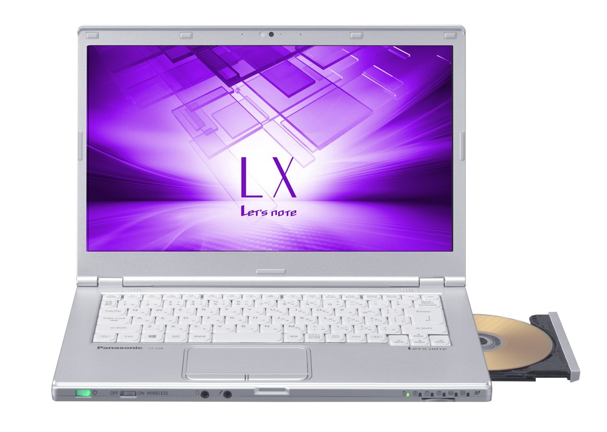
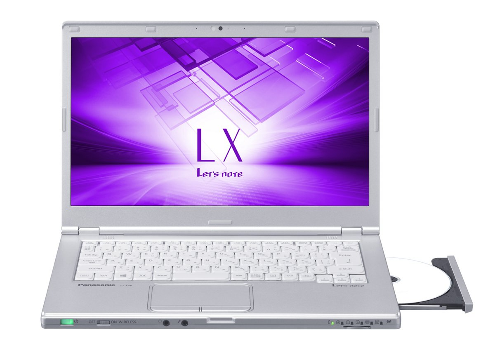
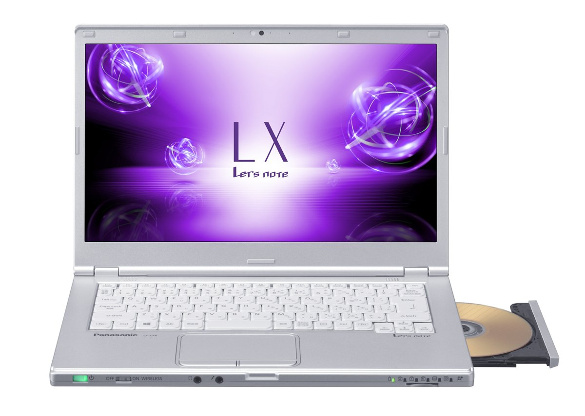
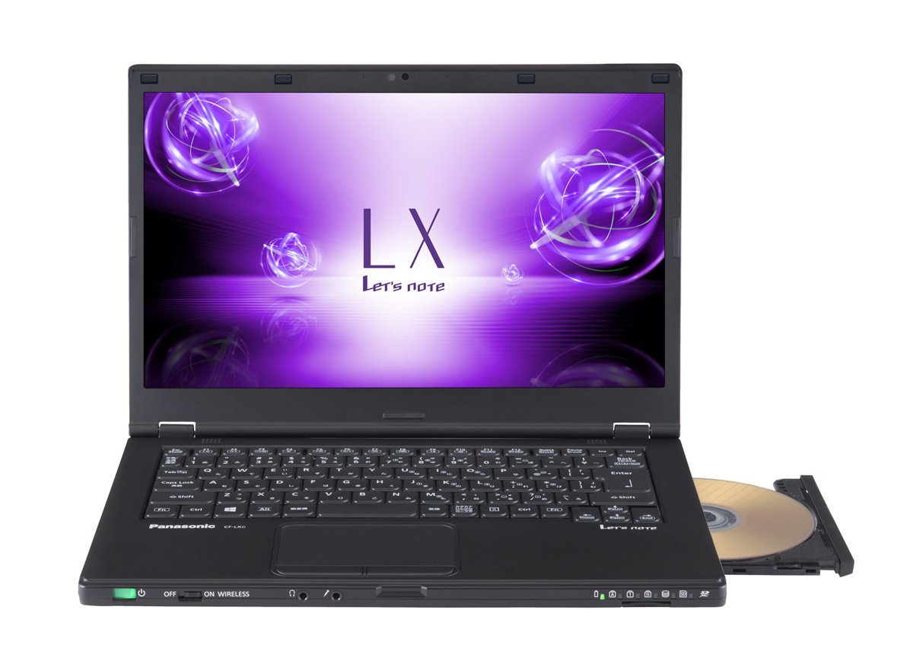
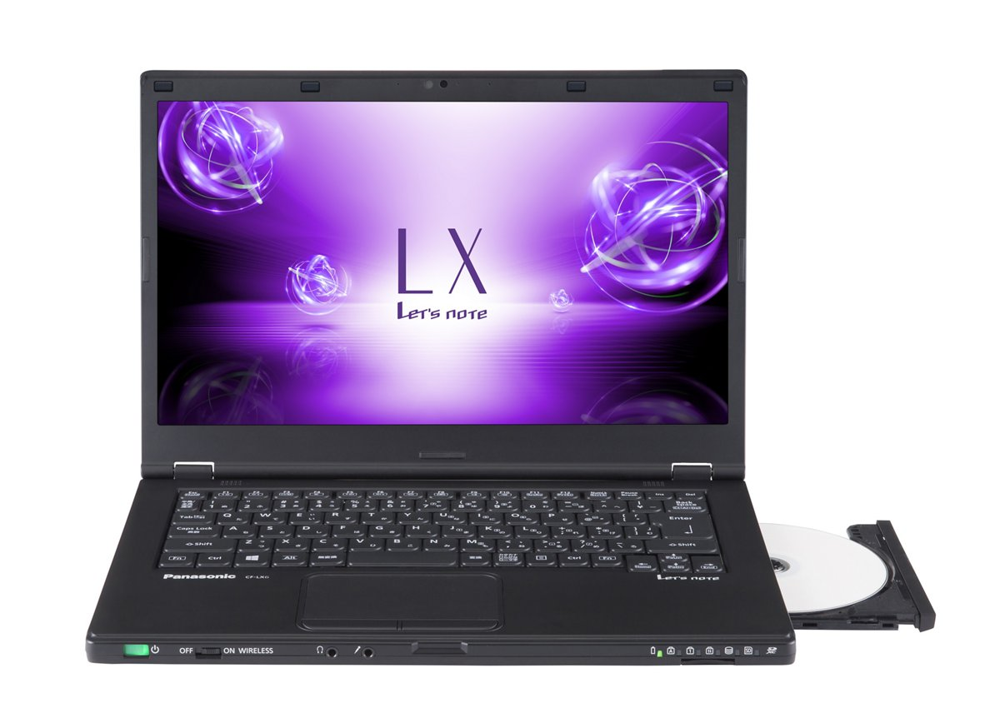
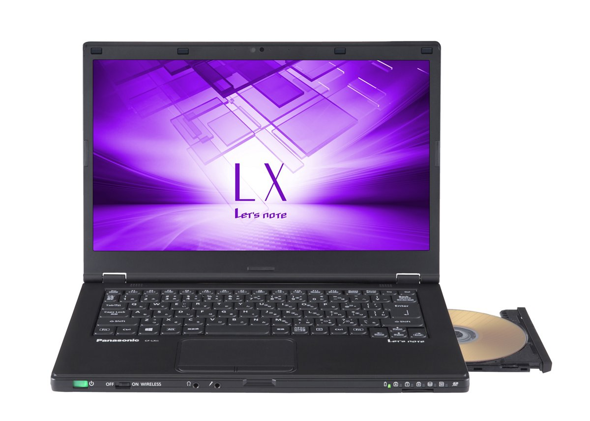
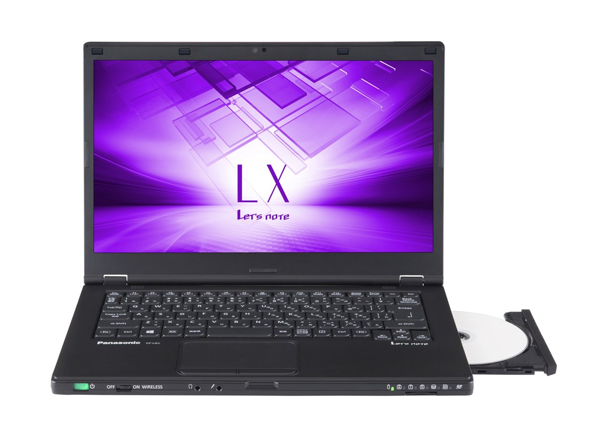

# Panasonic Let's note CF-LX6 Specifications

**English** · [日本語](../../ja/CF-LX6/) · [中文](../../zh/CF-LX6/)

🗄️ See this model in the [Let's note Cabinet](https://letsnote-specs.github.io/en/CF-LX6/).

**CF-LX6** is a Panasonic Let's note laptop in the LX series with a 13.3-inch HD/14-inch HD+ display. This page lists all 12 part numbers, released 2016-10 – 2018-02. Each part number links to its official spec sheet.

*Panasonic Let's note CF-LX6 (CF-LX6PDAQR, CF-LX6BDAQR, CF-LX6HDAQR), silver. Image © Panasonic.*

## Part numbers

| Part number | Released | Discontinued | Summary |
| :-- | :-- | :-- | :-- |
| [CF-LX6LDAQR](https://panasonic.jp/pc/p-db/CF-LX6LDAQR_spec.html) | 2018-02 | 2018-10 | Windows 10 Pro 64-bit, Intel® CoreTM i5-7200U processor, Memory: 8GB (no free slot), HDD: 1TB, Super Multi Drive, LAN, Wireless LAN 802.11a (W52/W53/W56)/b/g/n/ac, Microsoft® Office Home and Business 2016 |
| [CF-LX6LDGQR](https://panasonic.jp/pc/p-db/CF-LX6LDGQR_spec.html) | 2018-02 | 2018-10 | Windows 10 Pro 64-bit, Intel® CoreTM i5-7200U processor, Memory: 8GB (no free slot), SSD: 256GB, Super Multi Drive, LAN, Wireless LAN 802.11a (W52/W53/W56)/b/g/n/ac, Microsoft® Office Home and Business 2016 |
| [CF-LX6MDXQR](https://panasonic.jp/pc/p-db/CF-LX6MDXQR_spec.html) | 2018-02 | 2018-10 | Windows 10 Pro 64-bit, Intel® CoreTM i7-7500U processor, Memory: 8GB (no empty slot), SSD: 128GB + HDD: 1TB, Blu-ray Disc Drive, LAN, Wireless LAN 802.11a (W52/W53/W56)/b/g/n/ac, Microsoft® Office Home and Business 2016 |
| [CF-LX6PDAQR](https://panasonic.jp/pc/p-db/CF-LX6PDAQR_spec.html) | 2017-10 | 2018-09 | Windows 10 Pro 64-bit, Intel® CoreTM i5-7200U processor, Memory: 8GB (no free slot), HDD: 1TB, Super Multi Drive, LAN, Wireless LAN 802.11a (W52/W53/W56)/b/g/n/ac, Microsoft® Office Home and Business Premium |
| [CF-LX6PDGQR](https://panasonic.jp/pc/p-db/CF-LX6PDGQR_spec.html) | 2017-10 | 2018-09 | Windows 10 Pro 64-bit, Intel® CoreTM i5-7200U processor, Memory: 8GB (no free slot), SSD: 256GB, Super Multi Drive, LAN, Wireless LAN 802.11a (W52/W53/W56)/b/g/n/ac, Microsoft® Office Home and Business Premium |
| [CF-LX6QDXQR](https://panasonic.jp/pc/p-db/CF-LX6QDXQR_spec.html) | 2017-10 | 2018-09 | Windows 10 Pro 64-bit, Intel® CoreTM i7-7500U processor, Memory: 8GB (no empty slot), SSD: 128GB + HDD: 1TB, Blu-ray Disc Drive, LAN, Wireless LAN 802.11a (W52/W53/W56)/b/g/n/ac, Microsoft® Office Home and Business Premium |
| [CF-LX6BDAQR](https://panasonic.jp/pc/p-db/CF-LX6BDAQR_spec.html) | 2017-06 | 2018-01 | Windows 10 Pro 64-bit, Intel® CoreTM i5-7200U processor, Memory: 8GB (no expansion slot), HDD: 1TB, Super Multi Drive, LAN, Wireless LAN 802.11a (W52/W53/W56)/b/g/n/ac, Microsoft® Office Home and Business Premium |
| [CF-LX6CDYQR](https://panasonic.jp/pc/p-db/CF-LX6CDYQR_spec.html) | 2017-06 | 2018-01 | Windows 10 Pro 64-bit, Intel® CoreTM i7-7500U processor, Memory: 8GB (no expansion slot), SSD: 128GB + HDD: 1TB, Blu-ray Disc Drive, LAN, Wireless LAN 802.11a (W52/W53/W56)/b/g/n/ac, Microsoft® Office Home and Business Premium |
| [CF-LX6HDAQR](https://panasonic.jp/pc/p-db/CF-LX6HDAQR_spec.html) | 2017-01 | 2017-09 | Windows 10 Pro 64-bit, Intel® CoreTM i5-7200U processor, Memory: 8GB (no expansion slot), HDD: 1TB, Super Multi Drive, LAN, Wireless LAN 802.11a (W52/W53/W56)/b/g/n/ac, Microsoft® Office Home and Business Premium |
| [CF-LX6HD9QR](https://panasonic.jp/pc/p-db/CF-LX6HD9QR_spec.html) | 2017-01 | 2017-09 | Windows 10 Pro 64-bit, Intel® CoreTM i5-7200U processor, Memory: 8GB (no expansion slot), SSD: 256GB, Blu-ray Disc Drive, LAN, Wireless LAN 802.11a (W52/W53/W56)/b/g/n/ac, Microsoft® Office Home and Business Premium |
| [CF-LX6EDAQR](https://panasonic.jp/pc/p-db/CF-LX6EDAQR_spec.html) | 2016-10 | 2017-02 | Windows 10 Pro 64-bit, Intel® CoreTM i5-7200U processor, Memory: 8GB (no expansion slot), HDD: 750GB, Super Multi Drive, LAN, Wireless LAN 802.11a (W52/W53/W56)/b/g/n/ac, Microsoft® Office Home and Business Premium |
| [CF-LX6ED9QR](https://panasonic.jp/pc/p-db/CF-LX6ED9QR_spec.html) | 2016-10 | 2017-02 | Windows 10 Pro 64-bit, Intel® CoreTM i5-7200U processor, Memory: 8GB (no expansion slot), SSD: 256GB, Blu-ray Disc Drive, LAN, Wireless LAN 802.11a (W52/W53/W56)/b/g/n/ac, Microsoft® Office Home and Business Premium |

## Common specifications

| Item | Value |
| :-- | :-- |
| OS | Windows 10 Pro 64-bit (Japanese version) |
| Chipset | Built into CPU |
| Memory | 8GB LPDDR3 SDRAM (no expansion slot) |
| Display | 14-inch (16:9) Full HD TFT color LCD (1920 x 1080 dots), anti-glare |
| Display / Graphics | Intel HD Graphics 620 (built into CPU) |
| Display / LCD colors | 1920×1080 dots: approx. 16.77 million colors |
| Display / Simultaneous display | 1024×768, 1280×768, 1280×1024, 1360×768, 1366×768, 1400×1050, 1600×900, 1680×1050, 1920×1080 dots: approx. 16.77 million colors |
| Wireless communication | Intel Dual Band Wireless-AC 8265 |
| Wireless LAN | IEEE802.11a (W52/W53/W56)/b/g/n/ac compliant |
| Wired LAN | 1000BASE-T/100BASE-TX/10BASE-T |
| Bluetooth | Bluetooth v4.1 / ■Supported profiles / 【Classic】 / ・A2DP (Source) / ・AVRCP (Target) / ・HCRP (Client) / ・HFP (AG) / ・HID (Host) / ・OPP (Client and Server) / ・PAN (User) / ・SPP (DevA and DevB) / 【Low Energy】 / ・HOGP (Host) |
| Audio | PCM sound source (24-bit stereo), Intel High Definition Audio compliant, stereo speakers |
| Security chip | TPM (TCG V2.0 compliant) |
| Memory expansion slot | None |
| Camera | Effective pixels: max. 1920×1080 pixels (approx. 2.07 megapixels) |
| Microphone | Array microphone |
| Sensors | Illuminance sensor |
| Pointing device | Touchpad |
| Power consumption | Max approx. 65W |
| Efficiency target achievement (FY2011 standard) | — |
| Dimensions (W×D×H) | Width 333mm×Depth 225.6mm×Height 24.5mm excluding protrusions |

## Differences by part number

| Part number | CPU | Memory | Storage | Weight | Battery life |
| :-- | :-- | :-- | :-- | :-- | :-- |
| CF-LX6LDAQR | Core i5-7200U | 8GB LPDDR3 SDRAM | Hard disk drive | 1.35 kg | 8 h |
| CF-LX6LDGQR | Core i5-7200U | 8GB LPDDR3 SDRAM | 256GB | 1.275 kg | 10 h |
| CF-LX6MDXQR | Core i7-7500U | 8GB LPDDR3 SDRAM | Hard disk drive | 1.515 kg | 16 h |
| CF-LX6PDAQR | Core i5-7200U | 8GB LPDDR3 SDRAM | Hard disk drive | 1.35 kg | 8 h |
| CF-LX6PDGQR | Core i5-7200U | 8GB LPDDR3 SDRAM | 256GB | 1.275 kg | 10 h |
| CF-LX6QDXQR | Core i7-7500U | 8GB LPDDR3 SDRAM | Hard disk drive | 1.515 kg | 16 h |
| CF-LX6BDAQR | Core i5-7200U | 8GB LPDDR3 SDRAM | Hard disk drive | 1.35 kg | 8 h |
| CF-LX6CDYQR | Core i7-7500U | 8GB LPDDR3 SDRAM | Hard disk drive | 1.515 kg | 16 h |
| CF-LX6HDAQR | Core i5-7200U | 8GB LPDDR3 SDRAM | Hard disk drive | 1.35 kg | 8 h |
| CF-LX6HD9QR | Core i5-7200U | 8GB LPDDR3 SDRAM | 256GB | 1.435 kg | 20 h |
| CF-LX6EDAQR | Core i5-7200U | 8GB LPDDR3 SDRAM | Hard disk drive | 1.35 kg | 8 h |
| CF-LX6ED9QR | Core i5-7200U | 8GB LPDDR3 SDRAM | 256GB | 1.435 kg | 20 h |

CF-LX6LDAQR: all differing specifications

| Item | Value |
| :-- | :-- |
| CPU | Intel Core i5-7200U processor / Intel Smart Cache 3MB, operating frequency 2.50GHz (up to 3.10GHz when using Intel Turbo Boost Technology 2.0) |
| Video memory | Max 4170MB (shared with main memory) |
| Hard disk | Hard disk drive (HDD) 1TB (Serial ATA) Of the above capacity, approx. 15GB is used as recovery area and approx. 1GB as system area (unavailable to user) |
| Optical drive | Built-in Super Multi Drive (DVD/CD), equipped with buffer underrun error prevention function |
| Optical drive speed / Read | DVD-RAM: max 5x / DVD-ROM: max 8x / DVD-R: max 8x / DVD-R DL: max 8x / DVD-RW: max 8x / +R: max 8x / +R DL: max 8x / +RW: max 8x / High Speed +RW: max 8x / CD-ROM: max 24x / CD-R: max 24x / CD-RW: max 24x / High-Speed CD-RW: max 24x / Ultra-Speed CD-RW: max 24x |
| Optical drive speed / Write | DVD-RAM rewrite: max 5x / DVD-R write: max 8x / DVD-R DL write: max 6x / DVD-RW rewrite: max 6x / +R write: max 8x / +R DL write: max 6x / +RW rewrite: max 4x / High Speed +RW rewrite: max 8x / CD-R write: max 24x / CD-RW rewrite: 4x / High-Speed CD-RW rewrite: 10x / Ultra-Speed CD-RW rewrite: max 16x |
| Supported discs / Read | DVD-RAM ( 1.4GB, 2.8GB, 4.7GB, 9.4GB ) / DVD-ROM ( single layer, dual layer ) / DVD-Video ( single layer, dual layer ) / DVD-R ( 1.4GB, 2.8GB, 4.7GB ) / DVD-R DL ( 8.5GB ) / DVD-RW ( Ver.1.1/1.2 1.4GB, 2.8GB, 4.7GB, 9.4GB ) / +R ( 4.7GB ) / +R DL ( 8.5GB ) / +RW ( 4.7GB ) / High Speed +RW ( 4.7GB ) / CD-Audio / CD-ROM ( XA support ) / Photo CD ( multi-session support ) / Video CD / CD EXTRA / CD-TEXT / CD-R / CD-RW / High-Speed CD-RW / Ultra-Speed CD-RW |
| Supported discs / Write | DVD-RAM（1.4GB、2.8GB、4.7GB、9.4GB） / DVD-R（1.4GB、2.8 GB、4.7GB for General） / DVD-R DL（8.5GB） / DVD-RW（Ver.1.1/1.2 1.4GB、2.8GB、4.7GB、9.4GB） / +R（ 4.7GB） / +R DL（8.5GB） / +RW（ 4.7GB） / High Speed +RW（ 4.7GB） / CD-R / CD-RW / High-Speed CD-RW / Ultra-Speed CD-RW |
| Display / External output | 1024×768, 1280×768, 1280×1024, 1360×768, 1366×768, 1400×1050, 1600×900, 1600×1200, 1680×1050, 1920×1080, 1920×1200 dots: approx. 16.77 million colors / HDMI output only: 3840×2160 (30 Hz/60 Hz), 4096×2160 (30 Hz/60 Hz) |
| LTE | Not equipped |
| SD card slot | SD memory card ×1 slot (SDHC memory card/SDXC memory card support/copyright protection technology support/UHS-I high-speed transfer support) |
| Ports | ・USB3.0 Type-A port ×3 (one of which also serves as a USB charging port) / ・LAN connector (RJ-45) / ・External display connector (analog RGB mini D-sub 15 pin) / ・HDMI output terminal (4K60p output supported) / ・Microphone input terminal (stereo mini jack M3 (plug-in power supported)) / ・Audio output terminal (stereo mini jack M3) |
| Keyboard | OADG-compliant 87 keys, key pitch 19mm (vertical/horizontal) (excluding some keys) |
| Power | ▼AC adapter / Input: AC100V–240V, 50Hz/60Hz, Output: DC16V, 4.06A, power cord for 100V only / ▼Battery pack (S) / 10.8V lithium-ion, rated capacity 3400mAh |
| Energy efficiency | 2011 fiscal year standard N category 0.022 |
| Battery life / charge time | ▼Battery life / (JEITA Ver.2.0) approx. 8 hours / ▼Charging time / approx. 3 hours both with power ON and OFF |
| Color | Silver |
| Weight (with battery) | PC body: approx. 1.35kg (when attached battery pack (S) (approx. 190g)) / AC adapter: approx. 220g (excluding power cord (approx. 60g)) |
| Software | ・Microsoft® Internet Explorer 11 / ・Microsoft® Edge / ・Microsoft® .NET Framework 4.7 / ・Microsoft® Windows Media Player 12 / ・NetSelector Lite / ・Intel® Wireless Bluetooth® / ・McAfee LiveSafe (60-day free trial) / ・i-Filter 6.0 (30-day free trial) / ・WinZip 20.5 Japanese version (45-day trial) / ・Power2Go with DVD authoring / ・CyberLink PowerDVD14 / ・Wireless Manager mobile edition / ・Aptio Setup Utility / ・PC-Diagnostic Utility / ・Panasonic PC Settings Utility / ・Hard Disk Data Erase Utility / ・DirectX 12 / ・Intel PROSet/Wireless Software / ・Panasonic PC Screen Sharing Assist Utility / ・PC Information Viewer / ・Panasonic PC Recovery Disc Creation Utility |
| Microsoft Office | Microsoft® Office Home and Business 2016 |
| Accessories | AC adapter, battery pack (S), instruction manual, Microsoft Office Home & Business 2016, etc. |

Official spec sheet: <https://panasonic.jp/pc/p-db/CF-LX6LDAQR_spec.html>

CF-LX6LDGQR: all differing specifications

| Item | Value |
| :-- | :-- |
| CPU | Intel Core i5-7200U processor / Intel Smart Cache 3MB, operating frequency 2.50GHz (up to 3.10GHz when using Intel Turbo Boost Technology 2.0) |
| Video memory | Max 4170MB (shared with main memory) |
| Optical drive | Built-in Super Multi Drive (DVD/CD), equipped with buffer underrun error prevention function |
| Optical drive speed / Read | DVD-RAM: max 5x / DVD-ROM: max 8x / DVD-R: max 8x / DVD-R DL: max 8x / DVD-RW: max 8x / +R: max 8x / +R DL: max 8x / +RW: max 8x / High Speed +RW: max 8x / CD-ROM: max 24x / CD-R: max 24x / CD-RW: max 24x / High-Speed CD-RW: max 24x / Ultra-Speed CD-RW: max 24x |
| Optical drive speed / Write | DVD-RAM rewrite: max 5x / DVD-R write: max 8x / DVD-R DL write: max 6x / DVD-RW rewrite: max 6x / +R write: max 8x / +R DL write: max 6x / +RW rewrite: max 4x / High Speed +RW rewrite: max 8x / CD-R write: max 24x / CD-RW rewrite: 4x / High-Speed CD-RW rewrite: 10x / Ultra-Speed CD-RW rewrite: max 16x |
| Supported discs / Read | DVD-RAM ( 1.4GB, 2.8GB, 4.7GB, 9.4GB ) / DVD-ROM ( single layer, dual layer ) / DVD-Video ( single layer, dual layer ) / DVD-R ( 1.4GB, 2.8GB, 4.7GB ) / DVD-R DL ( 8.5GB ) / DVD-RW ( Ver.1.1/1.2 1.4GB, 2.8GB, 4.7GB, 9.4GB ) / +R ( 4.7GB ) / +R DL ( 8.5GB ) / +RW ( 4.7GB ) / High Speed +RW ( 4.7GB ) / CD-Audio / CD-ROM ( XA support ) / Photo CD ( multi-session support ) / Video CD / CD EXTRA / CD-TEXT / CD-R / CD-RW / High-Speed CD-RW / Ultra-Speed CD-RW |
| Supported discs / Write | DVD-RAM（1.4GB、2.8GB、4.7GB、9.4GB） / DVD-R（1.4GB、2.8 GB、4.7GB for General） / DVD-R DL（8.5GB） / DVD-RW（Ver.1.1/1.2 1.4GB、2.8GB、4.7GB、9.4GB） / +R（ 4.7GB） / +R DL（8.5GB） / +RW（ 4.7GB） / High Speed +RW（ 4.7GB） / CD-R / CD-RW / High-Speed CD-RW / Ultra-Speed CD-RW |
| Display / External output | 1024×768, 1280×768, 1280×1024, 1360×768, 1366×768, 1400×1050, 1600×900, 1600×1200, 1680×1050, 1920×1080, 1920×1200 dots: approx. 16.77 million colors / HDMI output only: 3840×2160 (30 Hz/60 Hz), 4096×2160 (30 Hz/60 Hz) |
| LTE | Not equipped |
| SD card slot | SD memory card ×1 slot (SDHC memory card/SDXC memory card support/copyright protection technology support/UHS-I high-speed transfer support) |
| Ports | ・USB3.0 Type-A port ×3 (one of which also serves as a USB charging port) / ・LAN connector (RJ-45) / ・External display connector (analog RGB mini D-sub 15 pin) / ・HDMI output terminal (4K60p output supported) / ・Microphone input terminal (stereo mini jack M3 (plug-in power supported)) / ・Audio output terminal (stereo mini jack M3) |
| Keyboard | OADG-compliant 87 keys, key pitch 19mm (vertical/horizontal) (excluding some keys) |
| Power | ▼AC adapter / Input: AC100V–240V, 50Hz/60Hz, Output: DC16V, 4.06A, power cord for 100V only / ▼Battery pack (S) / 10.8V lithium-ion, rated capacity 3400mAh |
| Energy efficiency | 2011 fiscal year standard N category 0.022 |
| Battery life / charge time | ▼Battery life / (JEITA Ver.2.0) approx. 10 hours / ▼Charging time / approx. 3 hours both with power ON and OFF |
| Color | Black |
| Weight (with battery) | PC body: approx. 1.275kg (when attached battery pack (S) (approx. 190g)) / AC adapter: approx. 220g (excluding power cord (approx. 60g)) |
| Software | ・Microsoft® Internet Explorer 11 / ・Microsoft® Edge / ・Microsoft® .NET Framework 4.7 / ・Microsoft® Windows Media Player 12 / ・NetSelector Lite / ・Intel® Wireless Bluetooth® / ・McAfee LiveSafe (60-day free trial) / ・i-Filter 6.0 (30-day free trial) / ・WinZip 20.5 Japanese version (45-day trial) / ・Power2Go with DVD authoring / ・CyberLink PowerDVD14 / ・Wireless Manager mobile edition / ・Aptio Setup Utility / ・PC-Diagnostic Utility / ・Panasonic PC Settings Utility / ・Hard Disk Data Erase Utility / ・DirectX 12 / ・Intel PROSet/Wireless Software / ・Panasonic PC Screen Sharing Assist Utility / ・PC Information Viewer / ・Panasonic PC Recovery Disc Creation Utility |
| Microsoft Office | Microsoft® Office Home and Business 2016 |
| Accessories | AC adapter, battery pack (S), instruction manual, Microsoft Office Home & Business 2016, etc. |
| SSD | Flash memory drive (SSD) 256GB (Serial ATA) Of the above capacity, approx. 15GB is used as the recovery area and approx. 1GB as the system area (unavailable to the user) |

Official spec sheet: <https://panasonic.jp/pc/p-db/CF-LX6LDGQR_spec.html>

CF-LX6MDXQR: all differing specifications

| Item | Value |
| :-- | :-- |
| CPU | Intel Core i7-7500U Processor / Intel Smart Cache 4MB, Operating Frequency 2.70GHz (up to 3.50GHz with Intel Turbo Boost Technology 2.0) |
| Video memory | Max 4170MB (shared with main memory) |
| Hard disk | Hard disk drive (HDD) 1TB (Serial ATA) |
| Optical drive | Blu-ray Disc Drive built-in / DVD Super Multi Drive function / Buffer underrun error prevention function equipped |
| Optical drive speed / Read | BD-ROM: max 6x / BD-R: max 6x / BD-R DL: max 6x / BD-R LTH: max 6x / BD-R XL: max 6x / BD-RE: max 6x / BD-RE DL: max 6x / BD-RE XL: max 4x / DVD-RAM: max 5x / DVD-ROM: max 8x / DVD-R: max 8x / DVD-R DL: max 8x / DVD-RW: max 8x / +R: max 8x / +R DL: max 8x / +RW: max 8x / High Speed +RW: max 8x / CD-ROM: max 24x / CD-R: max 24x / CD-RW: max 24x / High-Speed CD-RW: max 24x / Ultra-Speed CD-RW: max 24x |
| Optical drive speed / Write | BD-R write: max 6x / BD-R DL write: max 6x / BD-R LTH write: max 4x / BD-R XL write: max 4x / BD-RE rewrite: 2x / BD-RE DL rewrite: 2x / BD-RE XL rewrite: 2x / DVD-RAM rewrite: max 5x / DVD-R write: max 8x / DVD-R DL write: max 6x / DVD-RW rewrite: max 6x / +R write: max 8x / +R DL write: max 6x / +RW rewrite: max 4x / High Speed +RW rewrite: max 8x / CD-R write: max 24x / CD-RW rewrite: 4x / High-Speed CD-RW rewrite: 10x / Ultra-Speed CD-RW rewrite: max 16x |
| Supported discs / Read | BD-ROM / BD-R (Ver.1.1/1.2/1.3, 25GB) / BD-R DL (Ver.1.1/1.2/1.3, 50GB) / BD-R LTH (Ver.1.2/1.3, 25GB) / BD-R XL (Ver.2.0, 100GB) / BD-RE (Ver. 2.1, 25GB) / BD-RE DL (Ver.2.1, 50GB) / BD-RE XL (Ver.3.0, 100GB) / DVD-RAM ( 1.4GB, 2.8GB, 4.7GB, 9.4GB ) / DVD-ROM (single layer, dual layer) / DVD-Video (single layer, dual layer) / DVD-R (1.4GB, 2.8GB, 4.7GB) / DVD-R DL (8.5GB) / DVD-RW (Ver.1.1/1.2 1.4GB, 2.8GB, 4.7GB, 9.4GB) / +R (4.7GB) / +R DL (8.5GB) / +RW (4.7GB) / High Speed +RW (4.7GB) / CD-Audio / CD-ROM (XA support) / Photo CD (multi-session support) / Video CD / CD EXTRA / CD-TEXT / CD-R / CD-RW / High-Speed CD-RW / Ultra-Speed CD-RW |
| Supported discs / Write | BD-R（25GB） / BD-R DL（50GB） / BD-R LTH（25GB） / BD-R XL（100GB） / BD-RE（25GB） / BD-RE DL（50GB） / BD-RE XL（100GB） / DVD-RAM（1.4GB、2.8GB、4.7GB、9.4GB） / DVD-R（1.4GB、2.8 GB、4.7GB for General） / DVD-R DL（8.5GB） / DVD-RW（Ver.1.1/1.2 1.4GB、2.8GB、4.7GB、9.4GB） / +R（ 4.7GB） / +R DL（8.5GB） / +RW（ 4.7GB） / High Speed +RW（ 4.7GB） / CD-R / CD-RW / High-Speed CD-RW / Ultra-Speed CD-RW |
| Display / External output | 1024×768, 1280×768, 1280×1024, 1360×768, 1366×768, 1400×1050, 1600×900, 1600×1200, 1680×1050, 1920×1080, 1920×1200 dots: approx. 16.77 million colors / HDMI output only: 3840×2160 (30 Hz/60 Hz), 4096×2160 (30 Hz/60 Hz) |
| LTE | Not equipped |
| SD card slot | SD memory card ×1 slot (SDHC memory card/SDXC memory card support/copyright protection technology support/UHS-I high-speed transfer support) |
| Ports | ・USB3.0 Type-A port ×3 (one of which also serves as a USB charging port) / ・LAN connector (RJ-45) / ・External display connector (analog RGB mini D-sub 15 pin) / ・HDMI output terminal (4K60p output supported) / ・Microphone input terminal (stereo mini jack M3 (plug-in power supported)) / ・Audio output terminal (stereo mini jack M3) |
| Keyboard | OADG-compliant 87 keys, key pitch 19mm (vertical/horizontal) (excluding some keys) |
| Power | ▼AC adapter / Input: AC100V–240V, 50Hz/60Hz, Output: DC16V, 4.06A, power cord for 100V only / ▼Battery pack (L) / 10.8V lithium-ion, rated capacity 6800mAh |
| Energy efficiency | 2011 fiscal year standard N category 0.019 |
| Battery life / charge time | ▼Battery life / (JEITA Ver.2.0) / approx. 16 hours / ▼Charging time / 3 hours both with power ON and OFF |
| Color | Black |
| Weight (with battery) | PC body: approx. 1.515kg (with included battery pack (L) (approx. 330g) installed) / AC adapter: approx. 220g (excluding power cord (approx. 60g)) |
| Software | ・Microsoft® Internet Explorer 11 / ・Microsoft® Edge / ・Microsoft® .NET Framework 4.7 / ・Microsoft® Windows Media Player 12 / ・NetSelector Lite / ・Intel® Wireless Bluetooth® / ・McAfee LiveSafe (60-day free trial) / ・i-Filter 6.0 (30-day free trial) / ・WinZip 20.5 Japanese version (45-day trial) / ・Power2Go with DVD authoring / ・Power Producer BD / ・CyberLink PowerDVD14 / ・Wireless Manager mobile edition / ・Aptio Setup Utility / ・PC-Diagnostic Utility / ・Panasonic PC Settings Utility / ・Hard Disk Data Erase Utility / ・DirectX 12 / ・Intel PROSet/Wireless Software / ・Panasonic PC Screen Sharing Assist Utility / ・PC Information Viewer / ・Panasonic PC Recovery Disc Creation Utility |
| Microsoft Office | Microsoft® Office Home and Business 2016 |
| Accessories | AC adapter, battery pack (L), instruction manual, Microsoft Office Home & Business 2016, etc. |
| SSD | Flash memory drive (SSD) 128GB (Serial ATA) Of the above capacity, approx. 15GB is used as the recovery area and approx. 1GB as the system area (unavailable to the user) |

Official spec sheet: <https://panasonic.jp/pc/p-db/CF-LX6MDXQR_spec.html>

CF-LX6PDAQR: all differing specifications

| Item | Value |
| :-- | :-- |
| CPU | Intel Core i5-7200U processor / Intel Smart Cache 3MB, operating frequency 2.50GHz (up to 3.10GHz when using Intel Turbo Boost Technology 2.0) |
| Video memory | Max 4170MB (shared with main memory) |
| Hard disk | Hard disk drive (HDD) 1TB (Serial ATA, 5400rpm) Of the above capacity, approx. 15GB is used as recovery area and approx. 1GB as system area (unavailable to user) |
| Optical drive | Built-in Super Multi Drive (DVD/CD), equipped with buffer underrun error prevention function |
| Optical drive speed / Read | DVD-RAM: max 5x / DVD-ROM: max 8x / DVD-R: max 8x / DVD-R DL: max 8x / DVD-RW: max 8x / +R: max 8x / +R DL: max 8x / +RW: max 8x / High Speed +RW: max 8x / CD-ROM: max 24x / CD-R: max 24x / CD-RW: max 24x / High-Speed CD-RW: max 24x / Ultra-Speed CD-RW: max 24x |
| Optical drive speed / Write | DVD-RAM rewrite: max 5x / DVD-R write: max 8x / DVD-R DL write: max 6x / DVD-RW rewrite: max 6x / +R write: max 8x / +R DL write: max 6x / +RW rewrite: max 4x / High Speed +RW rewrite: max 8x / CD-R write: max 24x / CD-RW rewrite: 4x / High-Speed CD-RW rewrite: 10x / Ultra-Speed CD-RW rewrite: max 16x |
| Supported discs / Read | DVD-RAM ( 1.4GB, 2.8GB, 4.7GB, 9.4GB ) / DVD-ROM ( single layer, dual layer ) / DVD-Video ( single layer, dual layer ) / DVD-R ( 1.4GB, 2.8GB, 4.7GB ) / DVD-R DL ( 8.5GB ) / DVD-RW ( Ver.1.1/1.2 1.4GB, 2.8GB, 4.7GB, 9.4GB ) / +R ( 4.7GB ) / +R DL ( 8.5GB ) / +RW ( 4.7GB ) / High Speed +RW ( 4.7GB ) / CD-Audio / CD-ROM ( XA support ) / Photo CD ( multi-session support ) / Video CD / CD EXTRA / CD-TEXT / CD-R / CD-RW / High-Speed CD-RW / Ultra-Speed CD-RW |
| Supported discs / Write | DVD-RAM（1.4GB、2.8GB、4.7GB、9.4GB） / DVD-R（1.4GB、2.8 GB、4.7GB for General） / DVD-R DL（8.5GB） / DVD-RW（Ver.1.1/1.2 1.4GB、2.8GB、4.7GB、9.4GB） / +R（ 4.7GB） / +R DL（8.5GB） / +RW（ 4.7GB） / High Speed +RW（ 4.7GB） / CD-R / CD-RW / High-Speed CD-RW / Ultra-Speed CD-RW |
| Display / External output | 1024×768, 1280×768, 1280×1024, 1360×768, 1366×768, 1400×1050, 1600×900, 1600×1200, 1680×1050, 1920×1080, 1920×1200 dots: approx. 16.77 million colors / HDMI output only: 3840×2160 (30 Hz/60 Hz), 4096×2160 (30 Hz/60 Hz) |
| LTE | None |
| SD card slot | SD memory card ×1 slot (SDHC memory card/SDXC memory card support/UHS-I high-speed transfer support/copyright protection technology support) |
| Ports | ・LAN connector (RJ-45) / ・External display connector (Analog RGB mini D-sub 15-pin) / ・HDMI output terminal / ・Microphone input terminal (Stereo mini jack M3 (plug-in power compatible)) / ・Audio output terminal (Stereo mini jack M3) / ・USB3.0 port × 3 (one of which also serves as a USB charging port) |
| Keyboard | OADG-compliant 87 keys, key pitch 19mm (vertical/horizontal) (excluding some keys) |
| Power | ▼AC adapter / Input: AC100V–240V, 50Hz/60Hz, Output: DC16V, 4.06A, power cord for 100V only / ▼Battery pack / 10.8V lithium-ion, nominal capacity 3550mAh, rated capacity 3400mAh |
| Energy efficiency | 2011 fiscal year standard N category 0.022 |
| Battery life / charge time | ▼Battery life / (JEITA Ver.2.0) approx. 8 hours / ▼Charging time / approx. 3 hours both with power ON and OFF |
| Color | Silver |
| Weight (with battery) | PC body: approx. 1.35kg (when attached battery pack (S) (approx. 190g)) / AC adapter: approx. 220g (excluding power cord (approx. 60g)) |
| Software | ・Microsoft® Internet Explorer 11 / ・Microsoft® Edge / ・Microsoft® .NET Framework 4.7 / ・Microsoft® Windows Media Player 12 / ・NetSelector Lite / ・Intel® Wireless Bluetooth® / ・McAfee LiveSafe (60-day free trial) / ・i-Filter 6.0 (30-day free trial) / ・WinZip 20.5 Japanese version (45-day trial) / ・Power2Go with DVD authoring / ・CyberLink PowerDVD14 / ・Wireless Manager mobile edition / ・Aptio Setup Utility / ・PC-Diagnostic Utility / ・Panasonic PC Settings Utility / ・Hard Disk Data Erase Utility / ・DirectX 12 / ・Intel PROSet/Wireless Software / ・Panasonic PC Screen Sharing Assist Utility / ・PC Information Viewer / ・Panasonic PC Recovery Disc Creation Utility |
| Microsoft Office | Microsoft® Office Home and Business Premium |
| Accessories | Standard AC adapter, battery pack (S), instruction manual, Microsoft Office Home & Business Premium |

Official spec sheet: <https://panasonic.jp/pc/p-db/CF-LX6PDAQR_spec.html>

CF-LX6PDGQR: all differing specifications

| Item | Value |
| :-- | :-- |
| CPU | Intel Core i5-7200U processor / Intel Smart Cache 3MB, operating frequency 2.50GHz (up to 3.10GHz when using Intel Turbo Boost Technology 2.0) |
| Video memory | Max 4170MB (shared with main memory) |
| Optical drive | Built-in Super Multi Drive (DVD/CD), equipped with buffer underrun error prevention function |
| Optical drive speed / Read | DVD-RAM: max 5x / DVD-ROM: max 8x / DVD-R: max 8x / DVD-R DL: max 8x / DVD-RW: max 8x / +R: max 8x / +R DL: max 8x / +RW: max 8x / High Speed +RW: max 8x / CD-ROM: max 24x / CD-R: max 24x / CD-RW: max 24x / High-Speed CD-RW: max 24x / Ultra-Speed CD-RW: max 24x |
| Optical drive speed / Write | DVD-RAM rewrite: max 5x / DVD-R write: max 8x / DVD-R DL write: max 6x / DVD-RW rewrite: max 6x / +R write: max 8x / +R DL write: max 6x / +RW rewrite: max 4x / High Speed +RW rewrite: max 8x / CD-R write: max 24x / CD-RW rewrite: 4x / High-Speed CD-RW rewrite: 10x / Ultra-Speed CD-RW rewrite: max 16x |
| Supported discs / Read | DVD-RAM ( 1.4GB, 2.8GB, 4.7GB, 9.4GB ) / DVD-ROM ( single layer, dual layer ) / DVD-Video ( single layer, dual layer ) / DVD-R ( 1.4GB, 2.8GB, 4.7GB ) / DVD-R DL ( 8.5GB ) / DVD-RW ( Ver.1.1/1.2 1.4GB, 2.8GB, 4.7GB, 9.4GB ) / +R ( 4.7GB ) / +R DL ( 8.5GB ) / +RW ( 4.7GB ) / High Speed +RW ( 4.7GB ) / CD-Audio / CD-ROM ( XA support ) / Photo CD ( multi-session support ) / Video CD / CD EXTRA / CD-TEXT / CD-R / CD-RW / High-Speed CD-RW / Ultra-Speed CD-RW |
| Supported discs / Write | DVD-RAM（1.4GB、2.8GB、4.7GB、9.4GB） / DVD-R（1.4GB、2.8 GB、4.7GB for General） / DVD-R DL（8.5GB） / DVD-RW（Ver.1.1/1.2 1.4GB、2.8GB、4.7GB、9.4GB） / +R（ 4.7GB） / +R DL（8.5GB） / +RW（ 4.7GB） / High Speed +RW（ 4.7GB） / CD-R / CD-RW / High-Speed CD-RW / Ultra-Speed CD-RW |
| Display / External output | 1024×768, 1280×768, 1280×1024, 1360×768, 1366×768, 1400×1050, 1600×900, 1600×1200, 1680×1050, 1920×1080, 1920×1200 dots: approx. 16.77 million colors / HDMI output only: 3840×2160 (30 Hz/60 Hz), 4096×2160 (30 Hz/60 Hz) |
| LTE | None |
| SD card slot | SD memory card ×1 slot (SDHC memory card/SDXC memory card support/UHS-I high-speed transfer support/copyright protection technology support) |
| Ports | ・LAN connector (RJ-45) / ・External display connector (Analog RGB mini D-sub 15-pin) / ・HDMI output terminal / ・Microphone input terminal (Stereo mini jack M3 (plug-in power compatible)) / ・Audio output terminal (Stereo mini jack M3) / ・USB3.0 port × 3 (one of which also serves as a USB charging port) |
| Keyboard | OADG-compliant 87 keys, key pitch 19mm (vertical/horizontal) (excluding some keys) |
| Power | ▼AC adapter / Input: AC100V–240V, 50Hz/60Hz, Output: DC16V, 4.06A, power cord for 100V only / ▼Battery pack / 10.8V lithium-ion, nominal capacity 3550mAh, rated capacity 3400mAh |
| Energy efficiency | 2011 fiscal year standard N category 0.022 |
| Battery life / charge time | ▼Battery life / (JEITA Ver.2.0) approx. 10 hours / ▼Charging time / approx. 3 hours both with power ON and OFF |
| Color | Black |
| Weight (with battery) | PC body: approx. 1.275kg (when attached battery pack (S) (approx. 190g)) / AC adapter: approx. 220g (excluding power cord (approx. 60g)) |
| Software | ・Microsoft® Internet Explorer 11 / ・Microsoft® Edge / ・Microsoft® .NET Framework 4.7 / ・Microsoft® Windows Media Player 12 / ・NetSelector Lite / ・Intel® Wireless Bluetooth® / ・McAfee LiveSafe (60-day free trial) / ・i-Filter 6.0 (30-day free trial) / ・WinZip 20.5 Japanese version (45-day trial) / ・Power2Go with DVD authoring / ・CyberLink PowerDVD14 / ・Wireless Manager mobile edition / ・Aptio Setup Utility / ・PC-Diagnostic Utility / ・Panasonic PC Settings Utility / ・Hard Disk Data Erase Utility / ・DirectX 12 / ・Intel PROSet/Wireless Software / ・Panasonic PC Screen Sharing Assist Utility / ・PC Information Viewer / ・Panasonic PC Recovery Disc Creation Utility |
| Microsoft Office | Microsoft® Office Home and Business Premium |
| Accessories | Standard AC adapter, battery pack (S), instruction manual, Microsoft Office Home & Business Premium |
| SSD | Flash memory drive (SSD) 256GB (Serial ATA) Of the above capacity, approx. 15GB is used as the recovery area and approx. 1GB as the system area (unavailable to the user) |

Official spec sheet: <https://panasonic.jp/pc/p-db/CF-LX6PDGQR_spec.html>

CF-LX6QDXQR: all differing specifications

| Item | Value |
| :-- | :-- |
| CPU | Intel Core i7-7500U Processor / Intel Smart Cache 4MB, Operating Frequency 2.70GHz (up to 3.50GHz with Intel Turbo Boost Technology 2.0) |
| Video memory | Max 4170MB (shared with main memory) |
| Hard disk | Hard disk drive (HDD) 1TB (Serial ATA, 5400rpm) |
| Optical drive | Blu-ray Disc Drive built-in / DVD Super Multi Drive function / Buffer underrun error prevention function equipped |
| Optical drive speed / Read | BD-ROM: max 6x / BD-R: max 6x / BD-R DL: max 6x / BD-R LTH: max 6x / BD-R XL: max 6x / BD-RE: max 6x / BD-RE DL: max 6x / BD-RE XL: max 4x / DVD-RAM: max 5x / DVD-ROM: max 8x / DVD-R: max 8x / DVD-R DL: max 8x / DVD-RW: max 8x / +R: max 8x / +R DL: max 8x / +RW: max 8x / High Speed +RW: max 8x / CD-ROM: max 24x / CD-R: max 24x / CD-RW: max 24x / High-Speed CD-RW: max 24x / Ultra-Speed CD-RW: max 24x |
| Optical drive speed / Write | BD-R write: max 6x / BD-R DL write: max 6x / BD-R LTH write: max 4x / BD-R XL write: max 4x / BD-RE rewrite: 2x / BD-RE DL rewrite: 2x / BD-RE XL rewrite: 2x / DVD-RAM rewrite: max 5x / DVD-R write: max 8x / DVD-R DL write: max 6x / DVD-RW rewrite: max 6x / +R write: max 8x / +R DL write: max 6x / +RW rewrite: max 4x / High Speed +RW rewrite: max 8x / CD-R write: max 24x / CD-RW rewrite: 4x / High-Speed CD-RW rewrite: 10x / Ultra-Speed CD-RW rewrite: max 16x |
| Supported discs / Read | BD-ROM / BD-R (Ver.1.1/1.2/1.3, 25GB) / BD-R DL (Ver.1.1/1.2/1.3, 50GB) / BD-R LTH (Ver.1.2/1.3, 25GB) / BD-R XL (Ver.2.0, 100GB) / BD-RE (Ver. 2.1, 25GB) / BD-RE DL (Ver.2.1, 50GB) / BD-RE XL (Ver.3.0, 100GB) / DVD-RAM ( 1.4GB, 2.8GB, 4.7GB, 9.4GB ) / DVD-ROM (single layer, dual layer) / DVD-Video (single layer, dual layer) / DVD-R (1.4GB, 2.8GB, 4.7GB) / DVD-R DL (8.5GB) / DVD-RW (Ver.1.1/1.2 1.4GB, 2.8GB, 4.7GB, 9.4GB) / +R (4.7GB) / +R DL (8.5GB) / +RW (4.7GB) / High Speed +RW (4.7GB) / CD-Audio / CD-ROM (XA support) / Photo CD (multi-session support) / Video CD / CD EXTRA / CD-TEXT / CD-R / CD-RW / High-Speed CD-RW / Ultra-Speed CD-RW |
| Supported discs / Write | BD-R（25GB） / BD-R DL（50GB） / BD-R LTH（25GB） / BD-R XL（100GB） / BD-RE（25GB） / BD-RE DL（50GB） / BD-RE XL（100GB） / DVD-RAM（1.4GB、2.8GB、4.7GB、9.4GB） / DVD-R（1.4GB、2.8 GB、4.7GB for General） / DVD-R DL（8.5GB） / DVD-RW（Ver.1.1/1.2 1.4GB、2.8GB、4.7GB、9.4GB） / +R（ 4.7GB） / +R DL（8.5GB） / +RW（ 4.7GB） / High Speed +RW（ 4.7GB） / CD-R / CD-RW / High-Speed CD-RW / Ultra-Speed CD-RW |
| Display / External output | 1024×768, 1280×768, 1280×1024, 1360×768, 1366×768, 1400×1050, 1600×900, 1600×1200, 1680×1050, 1920×1080, 1920×1200 dots: approx. 16.77 million colors / HDMI output only: 3840×2160 (30 Hz/60 Hz), 4096×2160 (30 Hz/60 Hz) |
| LTE | None |
| SD card slot | SD memory card ×1 slot (SDHC memory card/SDXC memory card support/UHS-I high-speed transfer support/copyright protection technology support) |
| Ports | ・LAN connector (RJ-45) / ・External display connector (Analog RGB mini D-sub 15-pin) / ・HDMI output terminal / ・Microphone input terminal (Stereo mini jack M3 (plug-in power compatible)) / ・Audio output terminal (Stereo mini jack M3) / ・USB3.0 port × 3 (one of which also serves as a USB charging port) |
| Keyboard | OADG-compliant 87 keys, key pitch 19mm (vertical/horizontal) (excluding some keys) |
| Power | ▼AC adapter / Input: AC100V–240V, 50Hz/60Hz, Output: DC16V, 4.06A, power cord for 100V only / ▼Battery pack / 10.8V lithium-ion, nominal capacity 7100mAh, rated capacity 6800mAh |
| Energy efficiency | 2011 fiscal year standard N category 0.019 |
| Battery life / charge time | ▼Battery life / (JEITA Ver.2.0) / approx. 16 hours / ▼Charging time / 3 hours both with power ON and OFF |
| Color | Black |
| Weight (with battery) | PC body: approx. 1.515kg (with included battery pack (L) (approx. 330g) installed) / AC adapter: approx. 220g (excluding power cord (approx. 60g)) |
| Software | ・Microsoft® Internet Explorer 11 / ・Microsoft® Edge / ・Microsoft® .NET Framework 4.7 / ・Microsoft® Windows Media Player 12 / ・NetSelector Lite / ・Intel® Wireless Bluetooth® / ・McAfee LiveSafe (60-day free trial) / ・i-Filter 6.0 (30-day free trial) / ・WinZip 20.5 Japanese version (45-day trial) / ・Power2Go with DVD authoring / ・Power Producer BD / ・CyberLink PowerDVD14 / ・Wireless Manager mobile edition / ・Aptio Setup Utility / ・PC-Diagnostic Utility / ・Panasonic PC Settings Utility / ・Hard Disk Data Erase Utility / ・DirectX 12 / ・Intel PROSet/Wireless Software / ・Panasonic PC Screen Sharing Assist Utility / ・PC Information Viewer / ・Panasonic PC Recovery Disc Creation Utility |
| Microsoft Office | Microsoft® Office Home and Business Premium |
| Accessories | Standard AC adapter, battery pack (L), instruction manual, Microsoft Office Home & Business Premium |
| SSD | Flash memory drive (SSD) 128GB (Serial ATA) Of the above capacity, approx. 15GB is used as the recovery area and approx. 1GB as the system area (unavailable to the user) |

Official spec sheet: <https://panasonic.jp/pc/p-db/CF-LX6QDXQR_spec.html>

CF-LX6BDAQR: all differing specifications

| Item | Value |
| :-- | :-- |
| CPU | Intel Core i5-7200U processor / Intel Smart Cache 3MB, operating frequency 2.50GHz (up to 3.10GHz when using Intel Turbo Boost Technology 2.0) |
| Video memory | Max 4170MB (shared with main memory) |
| Hard disk | Hard disk drive (HDD) 1TB (Serial ATA, 5400rpm) Of the above capacity, approx. 15GB is used as recovery area and approx. 1GB as system area (unavailable to user) |
| Optical drive | Built-in Super Multi Drive (DVD/CD), equipped with buffer underrun error prevention function |
| Optical drive speed / Read | DVD-RAM: max 5x / DVD-ROM: max 8x / DVD-R: max 8x / DVD-R DL: max 8x / DVD-RW: max 8x / +R: max 8x / +R DL: max 8x / +RW: max 8x / High Speed +RW: max 8x / CD-ROM: max 24x / CD-R: max 24x / CD-RW: max 24x / High-Speed CD-RW: max 24x / Ultra-Speed CD-RW: max 24x |
| Optical drive speed / Write | DVD-RAM rewrite: max 5x / DVD-R write: max 8x / DVD-R DL write: max 6x / DVD-RW rewrite: max 6x / +R write: max 8x / +R DL write: max 6x / +RW rewrite: max 4x / High Speed +RW rewrite: max 8x / CD-R write: max 24x / CD-RW rewrite: 4x / High-Speed CD-RW rewrite: 10x / Ultra-Speed CD-RW rewrite: max 16x |
| Supported discs / Read | DVD-RAM ( 1.4GB, 2.8GB, 4.7GB, 9.4GB ) / DVD-ROM ( single layer, dual layer ) / DVD-Video ( single layer, dual layer ) / DVD-R ( 1.4GB, 2.8GB, 4.7GB ) / DVD-R DL ( 8.5GB ) / DVD-RW ( Ver.1.1/1.2 1.4GB, 2.8GB, 4.7GB, 9.4GB ) / +R ( 4.7GB ) / +R DL ( 8.5GB ) / +RW ( 4.7GB ) / High Speed +RW ( 4.7GB ) / CD-Audio / CD-ROM ( XA support ) / Photo CD ( multi-session support ) / Video CD / CD EXTRA / CD-TEXT / CD-R / CD-RW / High-Speed CD-RW / Ultra-Speed CD-RW |
| Supported discs / Write | DVD-RAM（1.4GB、2.8GB、4.7GB、9.4GB） / DVD-R（1.4GB、2.8 GB、4.7GB for General） / DVD-R DL（8.5GB） / DVD-RW（Ver.1.1/1.2 1.4GB、2.8GB、4.7GB、9.4GB） / +R（ 4.7GB） / +R DL（8.5GB） / +RW（ 4.7GB） / High Speed +RW（ 4.7GB） / CD-R / CD-RW / High-Speed CD-RW / Ultra-Speed CD-RW |
| Display / External output | 1024×768, 1280×768, 1280×1024, 1360×768, 1366×768, 1400×1050, 1600×900, 1600×1200, 1680×1050, 1920×1080, 1920×1200 dots: approx. 16.77 million colors / (below, HDMI output only) / 3840×2160 (30 Hz/60 Hz), 4096×2160 (30 Hz/60 Hz) |
| LTE | None |
| SD card slot | SD memory card ×1 slot (SDHC memory card/SDXC memory card support/UHS-I high-speed transfer support/copyright protection technology support) |
| Ports | ・LAN connector (RJ-45) / ・External display connector (Analog RGB mini D-sub 15-pin) / ・HDMI output terminal / ・Microphone input terminal (Stereo mini jack M3 (plug-in power compatible)) / ・Audio output terminal (Stereo mini jack M3) / ・USB3.0 port × 3 (one of which also serves as a USB charging port) |
| Keyboard | OADG-compliant 87 keys, key pitch 19mm (vertical/horizontal) (excluding some keys) |
| Power | ▼AC adapter / Input: AC100V–240V, 50Hz/60Hz, Output: DC16V, 4.06A, power cord for 100V only / ▼Battery pack / 10.8V lithium-ion, nominal capacity 3550mAh, rated capacity 3400mAh |
| Energy efficiency | 2011 fiscal year standard N category 0.022 |
| Battery life / charge time | ▼Battery life / (JEITA Ver.2.0) approx. 8 hours / ▼Charging time / approx. 3 hours both with power ON and OFF |
| Color | Silver |
| Weight (with battery) | PC body: approx. 1.35kg (when attached battery pack (S) (approx. 190g)) / AC adapter: approx. 220g (excluding power cord (approx. 60g)) |
| Software | ・Microsoft® Internet Explorer 11 / ・Microsoft® Edge / ・Microsoft® .NET Framework 4.6 / ・Microsoft® Windows Media Player 12 / ・Network Selector Lite / ・Intel® Wireless Bluetooth® / ・McAfee LiveSafe (60-day free trial version) / ・i-Filter 6.0 (30-day free trial version) / ・WinZip 20.5 Japanese version (45-day trial version) / ・Power2Go with DVD authoring / ・CyberLink PowerDVD12 / ・Display Helper / ・Wireless Manager mobile edition / ・Aptio Setup Utility / ・PC-Diagnostic Utility / ・Panasonic PC Setting Utility / ・Hard Disk Data Erase Utility / ・DirectX 12 / ・Intel PROSet/Wireless Software / ・Screen Sharing Assist Utility / ・PC Information Viewer / ・Recovery Disc Creation Utility |
| Microsoft Office | Microsoft® Office Home and Business Premium |
| Accessories | Standard AC adapter, battery pack (S), instruction manual, Microsoft Office Home & Business Premium |

Official spec sheet: <https://panasonic.jp/pc/p-db/CF-LX6BDAQR_spec.html>

CF-LX6CDYQR: all differing specifications

| Item | Value |
| :-- | :-- |
| CPU | Intel Core i7-7500U Processor / Intel Smart Cache 4MB, Operating Frequency 2.70GHz (up to 3.50GHz with Intel Turbo Boost Technology 2.0) |
| Video memory | Max 4170MB (shared with main memory) |
| Hard disk | Hard disk drive (HDD) 1TB (Serial ATA, 5400rpm) |
| Optical drive | Blu-ray Disc Drive built-in / DVD Super Multi Drive function / Buffer underrun error prevention function equipped |
| Optical drive speed / Read | BD-ROM: max 6x / BD-R: max 6x / BD-R DL: max 6x / BD-R LTH: max 6x / BD-R XL: max 6x / BD-RE: max 6x / BD-RE DL: max 6x / BD-RE XL: max 4x / DVD-RAM: max 5x / DVD-ROM: max 8x / DVD-R: max 8x / DVD-R DL: max 8x / DVD-RW: max 8x / +R: max 8x / +R DL: max 8x / +RW: max 8x / High Speed +RW: max 8x / CD-ROM: max 24x / CD-R: max 24x / CD-RW: max 24x / High-Speed CD-RW: max 24x / Ultra-Speed CD-RW: max 24x |
| Optical drive speed / Write | BD-R write: max 6x / BD-R DL write: max 6x / BD-R LTH write: max 4x / BD-R XL write: max 4x / BD-RE rewrite: 2x / BD-RE DL rewrite: 2x / BD-RE XL rewrite: 2x / DVD-RAM rewrite: max 5x / DVD-R write: max 8x / DVD-R DL write: max 6x / DVD-RW rewrite: max 6x / +R write: max 8x / +R DL write: max 6x / +RW rewrite: max 4x / High Speed +RW rewrite: max 8x / CD-R write: max 24x / CD-RW rewrite: 4x / High-Speed CD-RW rewrite: 10x / Ultra-Speed CD-RW rewrite: max 16x |
| Supported discs / Read | BD-ROM / BD-R (Ver.1.1/1.2/1.3, 25GB) / BD-R DL (Ver.1.1/1.2/1.3, 50GB) / BD-R LTH (Ver.1.2/1.3, 25GB) / BD-R XL (Ver.2.0, 100GB) / BD-RE (Ver. 2.1, 25GB) / BD-RE DL (Ver.2.1, 50GB) / BD-RE XL (Ver.3.0, 100GB) / DVD-RAM ( 1.4GB, 2.8GB, 4.7GB, 9.4GB ) / DVD-ROM (single layer, dual layer) / DVD-Video (single layer, dual layer) / DVD-R (1.4GB, 2.8GB, 4.7GB) / DVD-R DL (8.5GB) / DVD-RW (Ver.1.1/1.2 1.4GB, 2.8GB, 4.7GB, 9.4GB) / +R (4.7GB) / +R DL (8.5GB) / +RW (4.7GB) / High Speed +RW (4.7GB) / CD-Audio / CD-ROM (XA support) / Photo CD (multi-session support) / Video CD / CD EXTRA / CD-TEXT / CD-R / CD-RW / High-Speed CD-RW / Ultra-Speed CD-RW |
| Supported discs / Write | BD-R（25GB） / BD-R DL（50GB） / BD-R LTH（25GB） / BD-R XL（100GB） / BD-RE（25GB） / BD-RE DL（50GB） / BD-RE XL（100GB） / DVD-RAM（1.4GB、2.8GB、4.7GB、9.4GB） / DVD-R（1.4GB、2.8 GB、4.7GB for General） / DVD-R DL（8.5GB） / DVD-RW（Ver.1.1/1.2 1.4GB、2.8GB、4.7GB、9.4GB） / +R（ 4.7GB） / +R DL（8.5GB） / +RW（ 4.7GB） / High Speed +RW（ 4.7GB） / CD-R / CD-RW / High-Speed CD-RW / Ultra-Speed CD-RW |
| Display / External output | 1024×768, 1280×768, 1280×1024, 1360×768, 1366×768, 1400×1050, 1600×900, 1600×1200, 1680×1050, 1920×1080, 1920×1200 dots: approx. 16.77 million colors / (below, HDMI output only) / 3840×2160 (30 Hz/60 Hz), 4096×2160 (30 Hz/60 Hz) |
| LTE | None |
| SD card slot | SD memory card ×1 slot (SDHC memory card/SDXC memory card support/UHS-I high-speed transfer support/copyright protection technology support) |
| Ports | ・LAN connector (RJ-45) / ・External display connector (Analog RGB mini D-sub 15-pin) / ・HDMI output terminal / ・Microphone input terminal (Stereo mini jack M3 (plug-in power compatible)) / ・Audio output terminal (Stereo mini jack M3) / ・USB3.0 port × 3 (one of which also serves as a USB charging port) |
| Keyboard | OADG-compliant 87 keys, key pitch 19mm (vertical/horizontal) (excluding some keys) |
| Power | ▼AC adapter / Input: AC100V–240V, 50Hz/60Hz, Output: DC16V, 4.06A, power cord for 100V only / ▼Battery pack / 10.8V lithium-ion, nominal capacity 7100mAh, rated capacity 6800mAh |
| Energy efficiency | 2011 fiscal year standard N category 0.019 |
| Battery life / charge time | ▼Battery life / (JEITA Ver.2.0) / approx. 16 hours / ▼Charging time / 3 hours both with power ON and OFF |
| Color | Silver |
| Weight (with battery) | PC body: approx. 1.515kg (with included battery pack (L) (approx. 330g) installed) / AC adapter: approx. 220g (excluding power cord (approx. 60g)) |
| Software | ・Microsoft® Internet Explorer 11 / ・Microsoft® Edge / ・Microsoft® .NET Framework 4.6 / ・Microsoft® Windows Media Player 12 / ・Network Selector Lite / ・Intel® Wireless Bluetooth® / ・McAfee LiveSafe (60-day free trial version) / ・i-Filter 6.0 (30-day free trial version) / ・WinZip 20.5 Japanese version (45-day trial version) / ・Power2Go with DVD authoring / ・Power Producer BD / ・CyberLink PowerDVD12 / ・Display Helper / ・Wireless Manager mobile edition / ・Aptio Setup Utility / ・PC-Diagnostic Utility / ・Panasonic PC Setting Utility / ・Hard Disk Data Erase Utility / ・DirectX 12 / ・Intel PROSet/Wireless Software / ・Screen Sharing Assist Utility / ・PC Information Viewer / ・Recovery Disc Creation Utility |
| Microsoft Office | Microsoft® Office Home and Business Premium |
| Accessories | Standard AC adapter, battery pack (L), instruction manual, Microsoft Office Home & Business Premium |
| SSD | Flash memory drive (SSD) 128GB (Serial ATA) Of the above capacity, approx. 15GB is used as the recovery area and approx. 1GB as the system area (unavailable to the user) |

Official spec sheet: <https://panasonic.jp/pc/p-db/CF-LX6CDYQR_spec.html>

CF-LX6HDAQR: all differing specifications

| Item | Value |
| :-- | :-- |
| CPU | Intel Core i5-7200U processor / Intel Smart Cache 3MB, operating frequency 2.50GHz (up to 3.10GHz when using Intel Turbo Boost Technology 2.0) |
| Video memory | Max 4170MB (shared with main memory) |
| Hard disk | Hard disk drive (HDD) 1TB (Serial ATA, 5400rpm) Of the above capacity, approx. 15GB is used as recovery area and approx. 1GB as system area (unavailable to user) |
| Optical drive | Built-in Super Multi Drive (DVD/CD), equipped with buffer underrun error prevention function |
| Optical drive speed / Read | DVD-RAM: max 5x / DVD-ROM: max 8x / DVD-R: max 8x / DVD-R DL: max 8x / DVD-RW: max 8x / +R: max 8x / +R DL: max 8x / +RW: max 8x / High Speed +RW: max 8x / CD-ROM: max 24x / CD-R: max 24x / CD-RW: max 24x / High-Speed CD-RW: max 24x / Ultra-Speed CD-RW: max 24x |
| Optical drive speed / Write | DVD-RAM rewrite: max 5x / DVD-R write: max 8x / DVD-R DL write: max 6x / DVD-RW rewrite: max 6x / +R write: max 8x / +R DL write: max 6x / +RW rewrite: max 4x / High Speed +RW rewrite: max 8x / CD-R write: max 24x / CD-RW rewrite: 4x / High-Speed CD-RW rewrite: 10x / Ultra-Speed CD-RW rewrite: max 16x |
| Supported discs / Read | DVD-RAM ( 1.4GB, 2.8GB, 4.7GB, 9.4GB ) / DVD-ROM ( single layer, dual layer ) / DVD-Video ( single layer, dual layer ) / DVD-R ( 1.4GB, 2.8GB, 4.7GB ) / DVD-R DL ( 8.5GB ) / DVD-RW ( Ver.1.1/1.2 1.4GB, 2.8GB, 4.7GB, 9.4GB ) / +R ( 4.7GB ) / +R DL ( 8.5GB ) / +RW ( 4.7GB ) / High Speed +RW ( 4.7GB ) / CD-Audio / CD-ROM ( XA support ) / Photo CD ( multi-session support ) / Video CD / CD EXTRA / CD-TEXT / CD-R / CD-RW / High-Speed CD-RW / Ultra-Speed CD-RW |
| Supported discs / Write | DVD-RAM（1.4GB、2.8GB、4.7GB、9.4GB） / DVD-R（1.4GB、2.8 GB、4.7GB for General） / DVD-R DL（8.5GB） / DVD-RW（Ver.1.1/1.2 1.4GB、2.8GB、4.7GB、9.4GB） / +R（ 4.7GB） / +R DL（8.5GB） / +RW（ 4.7GB） / High Speed +RW（ 4.7GB） / CD-R / CD-RW / High-Speed CD-RW / Ultra-Speed CD-RW |
| Display / External output | 1024×768, 1280×768, 1280×1024, 1360×768, 1366×768, 1400×1050, 1600×900, 1600×1200, 1680×1050, 1920×1080, 1920×1200 dots: approx. 16.77 million colors / (below, HDMI output only) / 3840× 2160 (30 Hz/60 Hz), 4096 × 2160 (30 Hz/60 Hz) |
| LTE | None |
| SD card slot | SD memory card ×1 slot (SDHC memory card/SDXC memory card support/UHS-I high-speed transfer support/copyright protection technology support) |
| Ports | ・LAN connector (RJ-45) / ・External display connector (Analog RGB mini D-sub 15-pin) / ・HDMI output terminal / ・Microphone input terminal (Stereo mini jack M3 (plug-in power compatible)) / ・Audio output terminal (Stereo mini jack M3) / ・USB3.0 port × 3 (one of which also serves as a USB charging port) |
| Keyboard | OADG-compliant 87 keys, key pitch 19mm (vertical/horizontal) (excluding some keys) |
| Power | ▼AC adapter / Input: AC100V–240V, 50Hz/60Hz, Output: DC16V, 4.06A, power cord for 100V only / ▼Battery pack / 10.8V lithium-ion, nominal capacity 3550mAh, rated capacity 3400mAh |
| Energy efficiency | 2011 fiscal year standard N category 0.022 |
| Battery life / charge time | ▼Battery life / (JEITA Ver.2.0) approx. 8 hours / ▼Charging time / approx. 3 hours both with power ON and OFF |
| Color | Silver |
| Weight (with battery) | PC body: approx. 1.35kg (when attached battery pack (S) (approx. 190g)) / AC adapter: approx. 220g (excluding power cord (approx. 60g)) |
| Software | ・Microsoft® Internet Explorer 11 / ・Microsoft® Edge / ・Microsoft® .NET Framework 4.6 / ・Microsoft® Windows Media Player 12 / ・Network Selector Lite / ・Intel® Wireless Bluetooth® / ・McAfee LiveSafe (60-day free trial version) / ・i-Filter 6.0 (30-day free trial version) / ・WinZip 20.5 Japanese version (45-day trial version) / ・Power2Go with DVD authoring / ・CyberLink PowerDVD12 / ・Display Helper / ・Wireless Manager mobile edition / ・Aptio Setup Utility / ・PC-Diagnostic Utility / ・Panasonic PC Setting Utility / ・Hard Disk Data Erase Utility / ・DirectX 12 / ・Intel PROSet/Wireless Software / ・Screen Sharing Assist Utility / ・PC Information Viewer / ・Recovery Disc Creation Utility |
| Microsoft Office | Microsoft® Office Home and Business Premium |
| Accessories | Standard AC adapter, battery pack (S), instruction manual, Microsoft Office Home & Business Premium |

Official spec sheet: <https://panasonic.jp/pc/p-db/CF-LX6HDAQR_spec.html>

CF-LX6HD9QR: all differing specifications

| Item | Value |
| :-- | :-- |
| CPU | Intel Core i5-7200U processor / Intel Smart Cache 3MB, operating frequency 2.50GHz (up to 3.10GHz when using Intel Turbo Boost Technology 2.0) |
| Video memory | Max 4170MB (shared with main memory) |
| Optical drive | Blu-ray Disc Drive built-in / DVD Super Multi Drive function / Buffer underrun error prevention function equipped |
| Optical drive speed / Read | BD-ROM: max 6x / BD-R: max 6x / BD-R DL: max 6x / BD-R LTH: max 6x / BD-R XL: max 6x / BD-RE: max 6x / BD-RE DL: max 6x / BD-RE XL: max 4x / DVD-RAM: max 5x / DVD-ROM: max 8x / DVD-R: max 8x / DVD-R DL: max 8x / DVD-RW: max 8x / +R: max 8x / +R DL: max 8x / +RW: max 8x / High Speed +RW: max 8x / CD-ROM: max 24x / CD-R: max 24x / CD-RW: max 24x / High-Speed CD-RW: max 24x / Ultra-Speed CD-RW: max 24x |
| Optical drive speed / Write | BD-R write: max 6x / BD-R DL write: max 6x / BD-R LTH write: max 4x / BD-R XL write: max 4x / BD-RE rewrite: 2x / BD-RE DL rewrite: 2x / BD-RE XL rewrite: 2x / DVD-RAM rewrite: max 5x / DVD-R write: max 8x / DVD-R DL write: max 6x / DVD-RW rewrite: max 6x / +R write: max 8x / +R DL write: max 6x / +RW rewrite: max 4x / High Speed +RW rewrite: max 8x / CD-R write: max 24x / CD-RW rewrite: 4x / High-Speed CD-RW rewrite: 10x / Ultra-Speed CD-RW rewrite: max 16x |
| Supported discs / Read | BD-ROM / BD-R (Ver.1.1/1.2/1.3, 25GB) / BD-R DL (Ver.1.1/1.2/1.3, 50GB) / BD-R LTH (Ver.1.2/1.3, 25GB) / BD-R XL (Ver.2.0, 100GB) / BD-RE (Ver. 2.1, 25GB) / BD-RE DL (Ver.2.1, 50GB) / BD-RE XL (Ver.3.0, 100GB) / DVD-RAM ( 1.4GB, 2.8GB, 4.7GB, 9.4GB ) / DVD-ROM (single layer, dual layer) / DVD-Video (single layer, dual layer) / DVD-R (1.4GB, 2.8GB, 4.7GB) / DVD-R DL (8.5GB) / DVD-RW (Ver.1.1/1.2 1.4GB, 2.8GB, 4.7GB, 9.4GB) / +R (4.7GB) / +R DL (8.5GB) / +RW (4.7GB) / High Speed +RW (4.7GB) / CD-Audio / CD-ROM (XA support) / Photo CD (multi-session support) / Video CD / CD EXTRA / CD-TEXT / CD-R / CD-RW / High-Speed CD-RW / Ultra-Speed CD-RW |
| Supported discs / Write | BD-R（25GB） / BD-R DL（50GB） / BD-R LTH（25GB） / BD-R XL（100GB） / BD-RE（25GB） / BD-RE DL（50GB） / BD-RE XL（100GB） / DVD-RAM（1.4GB、2.8GB、4.7GB、9.4GB） / DVD-R（1.4GB、2.8 GB、4.7GB for General） / DVD-R DL（8.5GB） / DVD-RW（Ver.1.1/1.2 1.4GB、2.8GB、4.7GB、9.4GB） / +R（ 4.7GB） / +R DL（8.5GB） / +RW（ 4.7GB） / High Speed +RW（ 4.7GB） / CD-R / CD-RW / High-Speed CD-RW / Ultra-Speed CD-RW |
| Display / External output | 1024×768, 1280×768, 1280×1024, 1360×768, 1366×768, 1400×1050, 1600×900, 1600×1200, 1680×1050, 1920×1080, 1920×1200 dots: approx. 16.77 million colors / (below, HDMI output only) / 3840× 2160 (30 Hz/60 Hz), 4096 × 2160 (30 Hz/60 Hz) |
| LTE | None |
| SD card slot | SD memory card ×1 slot (SDHC memory card/SDXC memory card support/UHS-I high-speed transfer support/copyright protection technology support) |
| Ports | ・LAN connector (RJ-45) / ・External display connector (Analog RGB mini D-sub 15-pin) / ・HDMI output terminal / ・Microphone input terminal (Stereo mini jack M3 (plug-in power compatible)) / ・Audio output terminal (Stereo mini jack M3) / ・USB3.0 port × 3 (one of which also serves as a USB charging port) |
| Keyboard | OADG-compliant 87 keys, key pitch 19mm (vertical/horizontal) (excluding some keys) |
| Power | ▼AC adapter / Input: AC100V–240V, 50Hz/60Hz, Output: DC16V, 4.06A, power cord for 100V only / ▼Battery pack / 10.8V lithium-ion, nominal capacity 7100mAh, rated capacity 6800mAh |
| Energy efficiency | 2011 fiscal year standard N category 0.022 |
| Battery life / charge time | ▼Battery life / (JEITA Ver.2.0) / approx. 20 hours / ▼Charging time / approx. 3 hours both with power ON and OFF |
| Color | Silver |
| Weight (with battery) | PC body: approx. 1.435kg (with included battery pack (L) (approx. 330g) installed) / AC adapter: approx. 220g (excluding power cord (approx. 60g)) |
| Software | ・Microsoft® Internet Explorer 11 / ・Microsoft® Edge / ・Microsoft® .NET Framework 4.6 / ・Microsoft® Windows Media Player 12 / ・Network Selector Lite / ・Intel® Wireless Bluetooth® / ・McAfee LiveSafe (60-day free trial version) / ・i-Filter 6.0 (30-day free trial version) / ・WinZip 20.5 Japanese version (45-day trial version) / ・Power2Go with DVD authoring / ・Power Producer BD / ・CyberLink PowerDVD12 / ・Display Helper / ・Wireless Manager mobile edition / ・Aptio Setup Utility / ・PC-Diagnostic Utility / ・Panasonic PC Setting Utility / ・Hard Disk Data Erase Utility / ・DirectX 12 / ・Intel PROSet/Wireless Software / ・Screen Sharing Assist Utility / ・PC Information Viewer / ・Recovery Disc Creation Utility |
| Microsoft Office | Microsoft® Office Home and Business Premium |
| Accessories | Standard AC adapter, battery pack (L), instruction manual, Microsoft Office Home & Business Premium |
| SSD | Flash memory drive (SSD) 256GB (Serial ATA) Of the above capacity, approx. 15GB is used as the recovery area and approx. 1GB as the system area (unavailable to the user) |

Official spec sheet: <https://panasonic.jp/pc/p-db/CF-LX6HD9QR_spec.html>

CF-LX6EDAQR: all differing specifications

| Item | Value |
| :-- | :-- |
| CPU | Intel Core i5-7200U processor / Intel Smart Cache 3MB, operating frequency 2.50GHz (up to 3.10GHz when using Intel Turbo Boost Technology 2.0) |
| Video memory | Max 4176MB (shared with main memory) |
| Hard disk | Hard disk drive (HDD) 750GB (Serial ATA, 5400rpm) Of the above capacity, approx. 15GB is used as recovery area and approx. 1GB as system area (unavailable to user) |
| Optical drive | Built-in Super Multi Drive (DVD/CD), equipped with buffer underrun error prevention function |
| Optical drive speed / Read | DVD-RAM: max 5x / DVD-ROM: max 8x / DVD-R: max 8x / DVD-R DL: max 8x / DVD-RW: max 8x / +R: max 8x / +R DL: max 8x / +RW: max 8x / High Speed +RW: max 8x / CD-ROM: max 24x / CD-R: max 24x / CD-RW: max 24x / High-Speed CD-RW: max 24x / Ultra-Speed CD-RW: max 24x |
| Optical drive speed / Write | DVD-RAM rewrite: max 5x / DVD-R write: max 8x / DVD-R DL write: max 6x / DVD-RW rewrite: max 6x / +R write: max 8x / +R DL write: max 6x / +RW rewrite: max 4x / HighSpeed +RW rewrite: max 8x / CD-R write: max 24x / CD-RW rewrite: 4x / High-Speed CD-RW rewrite: 10x / Ultra-Speed CD-RW rewrite: max 16x |
| Supported discs / Read | DVD-RAM ( 1.4GB, 2.8GB, 4.7GB, 9.4GB ) / DVD-ROM ( single layer, dual layer ) / DVD-Video ( single layer, dual layer ) / DVD-R ( 1.4GB, 2.8GB, 4.7GB ) / DVD-R DL ( 8.5GB ) / DVD-RW ( Ver.1.1/1.2 1.4GB, 2.8GB, 4.7GB, 9.4GB ) / +R ( 4.7GB ) / +R DL ( 8.5GB ) / +RW ( 4.7GB ) / HighSpeed +RW ( 4.7GB ) / CD-Audio / CD-ROM ( XA support ) / Photo CD ( multi-session support ) / Video CD / CD EXTRA / CD-TEXT / CD-R / CD-RW / High-Speed CD-RW / Ultra-Speed CD-RW |
| Supported discs / Write | DVD-RAM（1.4GB、2.8GB、4.7GB、9.4GB） / DVD-R（1.4GB、2.8 GB、4.7GB for General） / DVD-R DL（8.5GB） / DVD-RW（Ver.1.1/1.2 1.4GB、2.8GB、4.7GB、9.4GB） / +R（ 4.7GB） / +R DL（8.5GB） / +RW（ 4.7GB） / High Speed +RW（ 4.7GB） / CD-R / CD-RW / High-Speed CD-RW / Ultra-Speed CD-RW |
| Display / External output | 1024×768, 1280×768, 1280×1024, 1360×768, 1366×768, 1400×1050, 1600×900, 1600×1200, 1680×1050, 1920×1080, 1920×1200 dots: approx. 16.77 million colors / (below, HDMI output only) / 3840× 2160 (30 Hz/60 Hz), 4096 × 2160 (30 Hz/60 Hz) |
| LTE | None |
| SD card slot | SD memory card ×1 slot (SDHC memory card/SDXC memory card support/UHS-I high-speed transfer support/copyright protection technology support) |
| Ports | ・LAN connector (RJ-45) / ・External display connector (Analog RGB mini D-sub 15-pin) / ・HDMI output terminal / ・Microphone input terminal (Stereo mini jack M3 (plug-in power compatible)) / ・Audio output terminal (Stereo mini jack M3) / ・USB3.0 port × 3 (one of which also serves as a USB charging port) |
| Keyboard | OADG-compliant 87 keys, key pitch 19mm (vertical/horizontal) (excluding some keys) |
| Power | ▼AC adapter / Input: AC100V–240V, 50Hz/60Hz, Output: DC16V, 4.06A, power cord for 100V only / ▼Battery pack / 10.8V lithium-ion, nominal capacity 3550mAh, rated capacity 3400mAh |
| Energy efficiency | 2011 fiscal year standard N category 0.022 |
| Battery life / charge time | ▼Battery life: / (JEITA Ver.2.0) approx. 8 hours / ▼Charging time: / approx. 3 hours both when power is ON and OFF |
| Color | Silver |
| Weight (with battery) | PC body: approx. 1.35kg (when attached battery pack (S) (approx. 190g)) / AC adapter: approx. 220g (excluding power cord (approx. 60g)) |
| Software | ・Microsoft® Internet Explorer 11 / ・Microsoft® Edge / ・Microsoft® .NET Framework 4.6 / ・Microsoft® Windows Media Player 12 / ・Network Selector Lite / ・Intel® Wireless Bluetooth® / ・McAfee LiveSafe (60-day free trial version) / ・i-Filter 6.0 (30-day free trial version) / ・WinZip 20.5 Japanese version (45-day trial version) / ・Power2Go with DVD authoring / ・CyberLink PowerDVD12 / ・Display Helper / ・Wireless Manager mobile edition / ・Aptio Setup Utility / ・PC-Diagnostic Utility / ・Panasonic PC Setting Utility / ・Hard Disk Data Erase Utility / ・DirectX 12 / ・Intel PROSet/Wireless Software / ・Screen Sharing Assist Utility / ・PC Information Viewer / ・Recovery Disc Creation Utility |
| Microsoft Office | Microsoft® Office Home and Business Premium |
| Accessories | Standard AC adapter, battery pack (S), instruction manual, Microsoft Office Home & Business Premium |

Official spec sheet: <https://panasonic.jp/pc/p-db/CF-LX6EDAQR_spec.html>

CF-LX6ED9QR: all differing specifications

| Item | Value |
| :-- | :-- |
| CPU | Intel Core i5-7200U processor / Intel Smart Cache 3MB, operating frequency 2.50GHz (up to 3.10GHz when using Intel Turbo Boost Technology 2.0) |
| Video memory | Max 4176MB (shared with main memory) |
| Optical drive | Blu-ray Disc Drive built-in / DVD Super Multi Drive function / Buffer underrun error prevention function equipped |
| Optical drive speed / Read | BD-ROM: max 6x / BD-R: max 6x / BD-R DL: max 6x / BD-R LTH: max 6x / BD-R XL: max 6x / BD-RE: max 6x / BD-RE DL: max 6x / BD-RE XL: max 4x / DVD-RAM: max 5x / DVD-ROM: max 8x / DVD-R: max 8x / DVD-R DL: max 8x / DVD-RW: max 8x / +R: max 8x / +R DL: max 8x / +RW: max 8x / High Speed +RW: max 8x / CD-ROM: max 24x / CD-R: max 24x / CD-RW: max 24x / High-Speed CD-RW: max 24x / Ultra-Speed CD-RW: max 24x |
| Optical drive speed / Write | BD-R write: max 6x / BD-R DL write: max 6x / BD-R LTH write: max 4x / BD-R XL write: max 4x / BD-RE rewrite: 2x / BD-RE DL rewrite: 2x / BD-RE XL rewrite: 2x / DVD-RAM rewrite: max 5x / DVD-R write: max 8x / DVD-R DL write: max 6x / DVD-RW rewrite: max 6x / +R write: max 8x / +R DL write: max 6x / +RW rewrite: max 4x / HighSpeed +RW rewrite: max 8x / CD-R write: max 24x / CD-RW rewrite: 4x / High-Speed CD-RW rewrite: 10x / Ultra-Speed CD-RW rewrite: max 16x |
| Supported discs / Read | BD-ROM / BD-R (Ver.1.1/1.2/1.3, 25GB) / BD-R DL (Ver.1.1/1.2/1.3, 50GB) / BD-R LTH (Ver.1.2/1.3, 25GB) / BD-R XL (Ver.2.0, 100GB) / BD-RE (Ver. 2.1, 25GB) / BD-RE DL (Ver.2.1, 50GB) / BD-RE XL (Ver.3.0, 100GB) / DVD-RAM ( 1.4GB, 2.8GB, 4.7GB, 9.4GB ) / DVD-ROM (single layer, dual layer) / DVD-Video (single layer, dual layer) / DVD-R (1.4GB, 2.8GB, 4.7GB) / DVD-R DL (8.5GB) / DVD-RW (Ver.1.1/1.2 1.4GB, 2.8GB, 4.7GB, 9.4GB) / +R (4.7GB) / +R DL (8.5GB) / +RW (4.7GB) / HighSpeed +RW (4.7GB) / CD-Audio / CD-ROM (XA support) / Photo CD (multi-session support) / Video CD / CD EXTRA / CD-TEXT / CD-R / CD-RW / High-Speed CD-RW / Ultra-Speed CD-RW |
| Supported discs / Write | BD-R（25GB） / BD-R DL（50GB） / BD-R LTH（25GB） / BD-R XL（100GB） / BD-RE（25GB） / BD-RE DL（50GB） / BD-RE XL（100GB） / DVD-RAM（1.4GB、2.8GB、4.7GB、9.4GB） / DVD-R（1.4GB、2.8 GB、4.7GB for General） / DVD-R DL（8.5GB） / DVD-RW（Ver.1.1/1.2 1.4GB、2.8GB、4.7GB、9.4GB） / +R（ 4.7GB） / +R DL（8.5GB） / +RW（ 4.7GB） / High Speed +RW（ 4.7GB） / CD-R / CD-RW / High-Speed CD-RW / Ultra-Speed CD-RW |
| Display / External output | 1024×768, 1280×768, 1280×1024, 1360×768, 1366×768, 1400×1050, 1600×900, 1600×1200, 1680×1050, 1920×1080, 1920×1200 dots: approx. 16.77 million colors / (below, HDMI output only) / 3840× 2160 (30 Hz/60 Hz), 4096 × 2160 (30 Hz/60 Hz) |
| LTE | None |
| SD card slot | SD memory card ×1 slot (SDHC memory card/SDXC memory card support/UHS-I high-speed transfer support/copyright protection technology support) |
| Ports | ・LAN connector (RJ-45) / ・External display connector (Analog RGB mini D-sub 15-pin) / ・HDMI output terminal / ・Microphone input terminal (Stereo mini jack M3 (plug-in power compatible)) / ・Audio output terminal (Stereo mini jack M3) / ・USB3.0 port × 3 (one of which also serves as a USB charging port) |
| Keyboard | OADG-compliant 87 keys, key pitch 19mm (vertical/horizontal) (excluding some keys) |
| Power | ▼AC adapter / Input: AC100V–240V, 50Hz/60Hz, Output: DC16V, 4.06A, power cord for 100V only / ▼Battery pack / 10.8V lithium-ion, nominal capacity 7100mAh, rated capacity 6800mAh |
| Energy efficiency | 2011 fiscal year standard N category 0.022 |
| Battery life / charge time | ▼Battery life : / (JEITA Ver.2.0) approx. 20 hours / ▼Charging time: / approx. 3 hours both with power ON and OFF |
| Color | Silver |
| Weight (with battery) | PC body: approx. 1.435kg (with included battery pack (L) (approx. 330g) installed) / AC adapter: approx. 220g (excluding power cord (approx. 60g)) |
| Software | ・Microsoft® Internet Explorer 11 / ・Microsoft® Edge / ・Microsoft® .NET Framework 4.6 / ・Microsoft® Windows Media Player 12 / ・Network Selector Lite / ・Intel® Wireless Bluetooth® / ・McAfee LiveSafe (60-day free trial version) / ・i-Filter 6.0 (30-day free trial version) / ・WinZip 20.5 Japanese version (45-day trial version) / ・Power2Go with DVD authoring / ・Power Producer BD / ・CyberLink PowerDVD12 / ・Display Helper / ・Wireless Manager mobile edition / ・Aptio Setup Utility / ・PC-Diagnostic Utility / ・Panasonic PC Setting Utility / ・Hard Disk Data Erase Utility / ・DirectX 12 / ・Intel PROSet/Wireless Software / ・Screen Sharing Assist Utility / ・PC Information Viewer / ・Recovery Disc Creation Utility |
| Microsoft Office | Microsoft® Office Home and Business Premium |
| Accessories | Standard AC adapter, battery pack (L), instruction manual, Microsoft Office Home & Business Premium |
| SSD | Flash memory drive (SSD) 256GB (Serial ATA) Of the above capacity, approx. 15GB is used as the recovery area and approx. 1GB as the system area (unavailable to the user) |

Official spec sheet: <https://panasonic.jp/pc/p-db/CF-LX6ED9QR_spec.html>

## Photos

*Panasonic Let's note CF-LX6 (CF-LX6CDYQR, CF-LX6HD9QR), silver. Image © Panasonic.*

*Panasonic Let's note CF-LX6 (CF-LX6LDAQR), silver. Image © Panasonic.*

*Panasonic Let's note CF-LX6 (CF-LX6LDGQR), black. Image © Panasonic.*

*Panasonic Let's note CF-LX6 (CF-LX6MDXQR), black. Image © Panasonic.*

*Panasonic Let's note CF-LX6 (CF-LX6PDGQR), black. Image © Panasonic.*

*Panasonic Let's note CF-LX6 (CF-LX6QDXQR), black. Image © Panasonic.*

## Related models

- Older model in the series: [CF-LX5](../CF-LX5/)
- [All Let's note models](../)

---

Source: Panasonic's official [discontinued-models list](https://panasonic.jp/pc/support/products/) and spec sheets (panasonic.jp), translated from Japanese; see the official sheets for the authoritative wording. Product images © Panasonic. This is an unofficial compilation, not affiliated with Panasonic.
