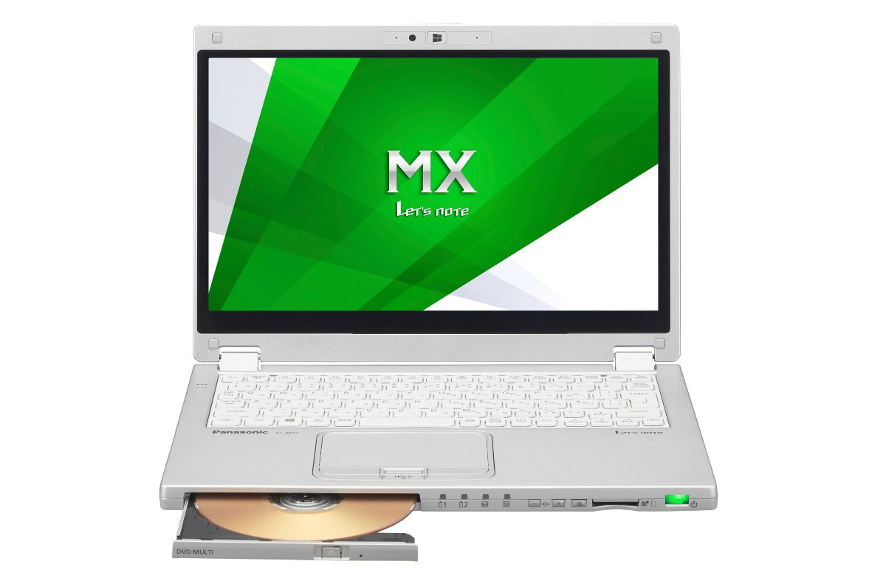
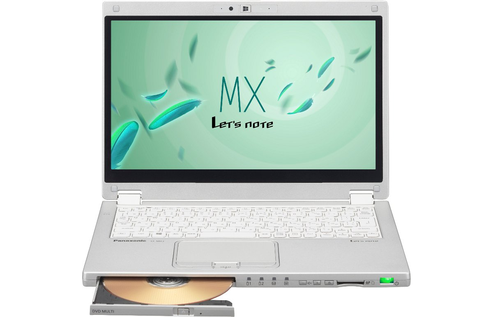
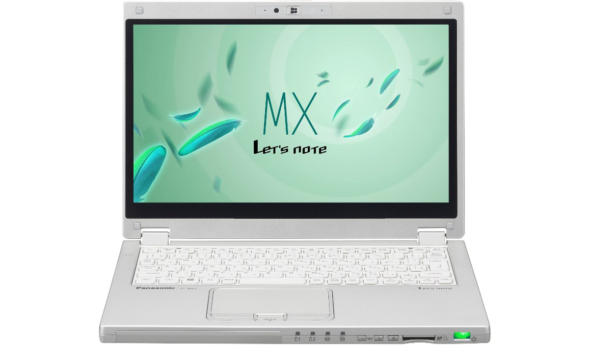
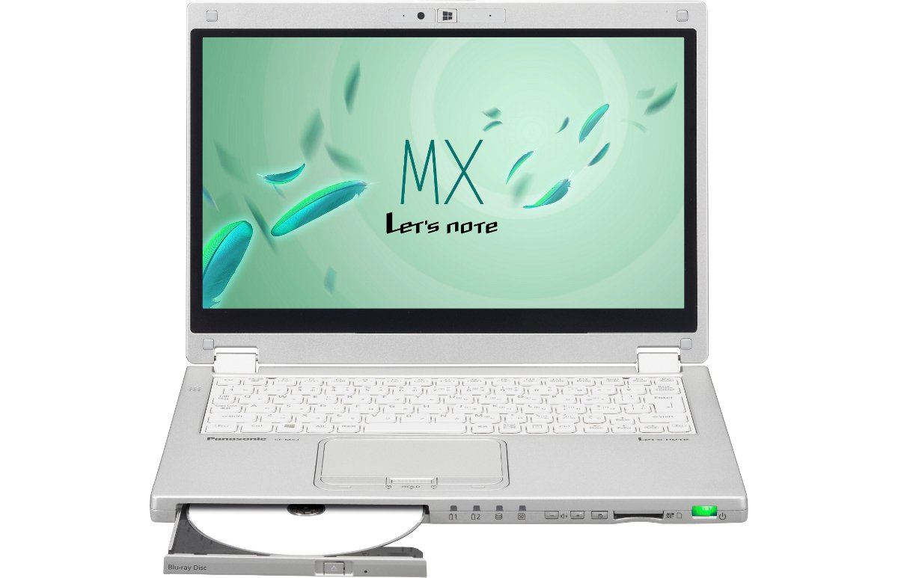
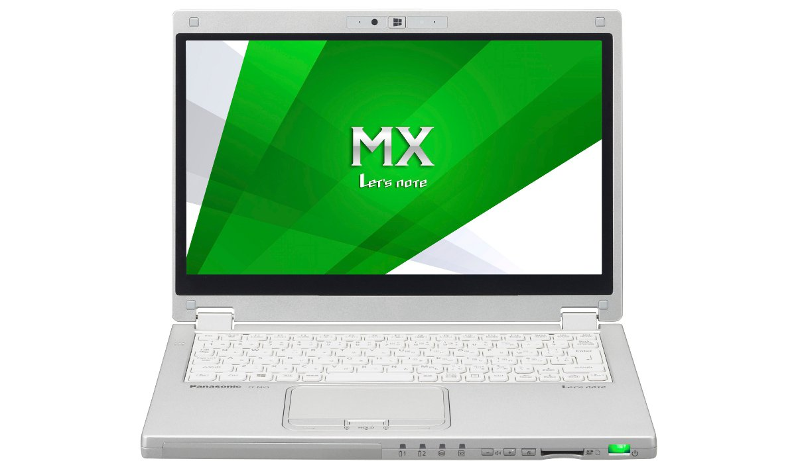
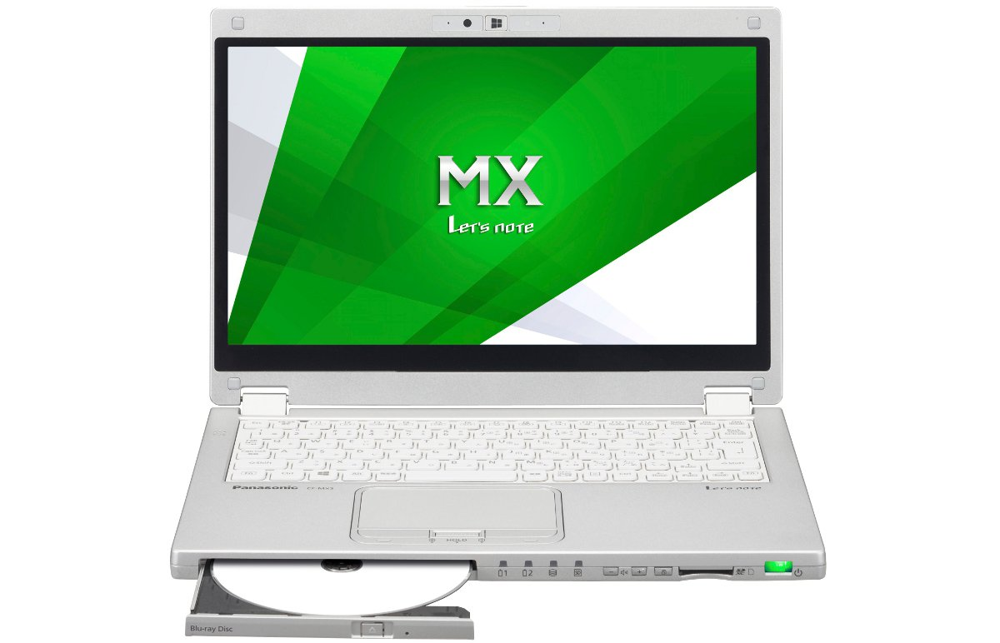

# Panasonic Let's note CF-MX3 Specifications

**English** · [日本語](../../ja/CF-MX3/) · [中文](../../zh/CF-MX3/)

**CF-MX3** is a Panasonic Let's note laptop in the MX series with a 12.5-inch Full HD display. This page lists all 11 part numbers, released 2014-01 – 2014-10. Each part number links to its official spec sheet.

*Panasonic Let's note CF-MX3 (CF-MX3JEBJR, CF-MX3JEGJR, CF-MX3SEBJR, CF-MX3SEGJR …), silver. Image © Panasonic.*

## Part numbers

| Part number | Released | Discontinued | Summary |
| :-- | :-- | :-- | :-- |
| [CF-MX3DDQJR](https://panasonic.jp/pc/p-db/CF-MX3DDQJR_spec.html) | 2014-10 | 2015-06 | Windows 8.1 Update 64-bit, Intel® CoreTM i5-4210U processor, Memory: 8GB (no expansion slot), SSD: 128GB, LAN, Wireless LAN 802.11a(W52/W53/W56)/b/g/n/ac |
| [CF-MX3DDFJR](https://panasonic.jp/pc/p-db/CF-MX3DDFJR_spec.html) | 2014-10 | 2015-06 | Windows 8.1 Update 64-bit, Intel® CoreTM i5-4210U processor, Memory: 8GB (no expansion slot), SSD: 128GB, Super Multi Drive, LAN, Wireless LAN 802.11a(W52/W53/W56)/b/g/n/ac |
| [CF-MX3DDGJR](https://panasonic.jp/pc/p-db/CF-MX3DDGJR_spec.html) | 2014-10 | 2015-06 | Windows 8.1 Update 64-bit, Intel® CoreTM i5-4210U processor, Memory: 8GB (no expansion slot), SSD: 128GB, Super Multi Drive, LAN, Wireless LAN 802.11a(W52/W53/W56)/b/g/n/ac, Microsoft® Office Home and Business Premium |
| [CF-MX3ZDYBR](https://panasonic.jp/pc/p-db/CF-MX3ZDYBR_spec.html) | 2014-10 | 2015-06 | Windows 8.1 Pro Update 64-bit, Intel® CoreTM i7-4510U processor, Memory: 8GB (no expansion slot), SSD: 256GB, Blu-ray Disc Drive, LAN, wireless LAN 802.11a(W52/W53/W56)/b/g/n/ac, Microsoft® Office Home and Business Premium |
| [CF-MX3JEKJR](https://panasonic.jp/pc/p-db/CF-MX3JEKJR_spec.html) | 2014-05 | 2015-02 | Windows 8.1 Update 64-bit, Intel® CoreTM i5-4310U (2.00GHz), Memory: 4GB (no expansion slot), SSD: 128GB, LAN, Wireless LAN 802.11a(W52/W53/W56)/b/g/n/ac |
| [CF-MX3JEBJR](https://panasonic.jp/pc/p-db/CF-MX3JEBJR_spec.html) | 2014-05 | 2015-02 | Windows 8.1 Update 64-bit, Intel® CoreTM i5-4310U (2.00GHz), Memory: 4GB (no expansion slot), SSD: 128GB, Super Multi Drive, LAN, Wireless LAN 802.11a(W52/W53/W56)/b/g/n/ac |
| [CF-MX3JEGJR](https://panasonic.jp/pc/p-db/CF-MX3JEGJR_spec.html) | 2014-05 | 2015-02 | Windows 8.1 Update 64-bit, Intel® CoreTM i5-4310U (2.00GHz), Memory: 4GB (no expansion slot), SSD: 128GB, Super Multi Drive, LAN, Wireless LAN 802.11a(W52/W53/W56)/b/g/n/ac, Office Home and Business 2013 |
| [CF-MX3VEWBR](https://panasonic.jp/pc/p-db/CF-MX3VEWBR_spec.html) | 2014-05 | 2015-02 | Windows 8.1 Pro Update 64-bit, Intel® CoreTM i7-4500U (1.80GHz), Memory: 8GB (no expansion slot), SSD: 256GB, Blu-ray Disc Drive, LAN, wireless LAN 802.11a(W52/W53/W56)/b/g/n/ac |
| [CF-MX3SEBJR](https://panasonic.jp/pc/p-db/CF-MX3SEBJR_spec.html) | 2014-01 | 2014-05 | Windows 8.1 64-bit, Intel® CoreTM i5-4200U (1.60GHz), Memory: standard 4GB (no expansion slot), SSD: 128GB, Super Multi Drive, LAN, Wireless LAN 802.11a(W52/W53/W56)/b/g/n/ac |
| [CF-MX3SEGJR](https://panasonic.jp/pc/p-db/CF-MX3SEGJR_spec.html) | 2014-01 | 2014-05 | Windows 8.1 64-bit, Intel® CoreTM i5-4200U (1.60GHz), Memory: standard 4GB (no expansion slot), SSD: 128GB, Super Multi Drive, LAN, Wireless LAN 802.11a(W52/W53/W56)/b/g/n/ac, Office Home and Business 2013 |
| [CF-MX3TEABR](https://panasonic.jp/pc/p-db/CF-MX3TEABR_spec.html) | 2014-01 | 2014-05 | Windows 8.1 Pro 64-bit, Intel® CoreTM i7-4500U (1.80GHz), Memory: standard 8GB (no expansion slot), SSD: 256GB, Super Multi Drive, LAN, Wireless LAN 802.11a(W52/W53/W56)/b/g/n/ac |

## Common specifications

| Item | Value |
| :-- | :-- |
| Video memory | Max. 1792MB (shared with main memory) |
| Display | 12.5-inch widescreen (16:9) Full HD TFT color IPS LCD (1920×1080 dots), capacitive touchscreen, with anti-glare protective film |
| Display / Graphics | Intel HD Graphics 4400 (built into CPU) |
| Display / LCD colors | 1920×1080 dots: approx. 16.77 million colors |
| Wireless communication | Intel Dual Band Wireless-AC 7260 |
| Wireless LAN | IEEE802.11a (W52/W53/W56)/b/g/n/ac compliant |
| Wired LAN | 1000BASE-T/100BASE-TX/10BASE-T |
| Audio | PCM sound source (24-bit stereo), Intel High Definition Audio compliant, monaural speaker |
| SD card slot | SD memory card ×1 slot (SDHC memory card/SDXC memory card support/UHS-I, UHS-II high-speed transfer support/copyright protection technology support) |
| Camera | Resolution: Full HD (1080p), effective pixels: max. 1920x1080 pixels |
| Microphone | Array microphone |
| Sensors | Illuminance sensor / Geomagnetic sensor / Gyro sensor / Acceleration sensor |
| Ports | LAN connector (RJ-45) / external display connector (analog RGB mini D-sub 15-pin) / HDMI output terminal / microphone input terminal (stereo mini jack M3 (plug-in power compatible)) / audio output terminal (stereo mini jack M3) / USB3.0 port x2 (one of which also serves as a USB charging port) |
| Keyboard | OADG-compliant 86 keys, key pitch 19mm (horizontal)/15.2mm (vertical) (excluding some keys) |
| Pointing device | Capacitive touchscreen (LCD) / Touchpad |
| Power consumption | Max approx. 45W |
| Efficiency target achievement (FY2011 standard) | — |
| Dimensions (W×D×H) | Width 301.4mm × Depth 210mm × Height 21mm (height in tablet state is 21.5mm) Excluding protrusions |
| Color | Silver |

## Differences by part number

| Part number | CPU | Memory | Storage | Weight | Battery life |
| :-- | :-- | :-- | :-- | :-- | :-- |
| CF-MX3DDQJR | Core i5-4210U | 8GB DDR3L SDRAM | 128GB | 1.118 kg | 9.5 h |
| CF-MX3DDFJR | Core i5-4210U | 8GB DDR3L SDRAM | 128GB | 1.198 kg | 9.5 h |
| CF-MX3DDGJR | Core i5-4210U | 8GB DDR3L SDRAM | 128GB | 1.198 kg | 9.5 h |
| CF-MX3ZDYBR | Core i7-4510U | 8GB DDR3L SDRAM | 256GB | 1.238 kg | 9.5 h |
| CF-MX3JEKJR | Core i5-4310U | 4GB DDR3L SDRAM | 128GB | 1.118 kg | 10 h |
| CF-MX3JEBJR | Core i5-4310U | 4GB DDR3L SDRAM | 128GB | 1.198 kg | 10 h |
| CF-MX3JEGJR | Core i5-4310U | 4GB DDR3L SDRAM | 128GB | 1.198 kg | 10 h |
| CF-MX3VEWBR | Core i7-4500U | 8GB DDR3L SDRAM | 256GB | 1.238 kg | 9.5 h |
| CF-MX3SEBJR | Core i5-4200U | 4GB DDR3L SDRAM | 128GB | 1.198 kg | 15 h |
| CF-MX3SEGJR | Core i5-4200U | 4GB DDR3L SDRAM | 128GB | 1.198 kg | 15 h |
| CF-MX3TEABR | Core i7-4500U | 8GB DDR3L SDRAM | 256GB | 1.198 kg | 14.5 h |

CF-MX3DDQJR: all differing specifications

| Item | Value |
| :-- | :-- |
| OS | Windows 8.1 Update 64-bit (Japanese version) |
| CPU | Intel Core i5-4210U processor / Intel Smart Cache 3MB, operating frequency 1.7GHz (up to 2.7GHz when using Intel Turbo Boost Technology 2.0) |
| Memory | 8GB DDR3L SDRAM (no free slots) |
| SSD | Flash memory drive (SSD) 128GB (Serial ATA) Of the above capacity, approx. 16GB is used as the recovery area and approx. 1GB as the system area (unavailable to the user) |
| Display / External output | 1024×768, 1280×768, 1280×1024, 1360×768, 1366×768, 1400×1050, 1600×900, 1600×1200, 1680×1050, 1920×1080, 1920×1200 dots: approx. 16.77 million colors |
| Display / Simultaneous display | 1024×768, 1280×768, 1280×1024, 1360×768, 1366×768, 1400×1050, 1600×900, 1680×1050, 1920×1080: approx. 16.77 million colors |
| Bluetooth | Bluetooth v4.0 / ■Supported profiles / 【Classic】 / ・A2DP (Source) / ・AVRCP (Target) / ・BIP (Client) / ・BPP (Sender) / ・FTP (Client and Server) / ・HCRP (Client) / ・HFP (AG) / ・HID (Host) / ・HSP (AG) / ・OPP (Client and Server) / ・PAN (User) / ・PBAP (PCE) / ・SPP (DevA and DevB) / ・SYNC (Client) / 【Low Energy】 / ・HOGP (Host) |
| Power | ▼AC adapter / Input: AC100V–240V, 50Hz/60Hz, Output: DC16V, 2.8A, power cord for 100V only / ▼Battery pack / 7.2V lithium-ion, nominal capacity 4880mAh, rated capacity 4560mAh / ▼Built-in battery (non-replaceable) / 7.6V lithium-ion, nominal capacity 2060Ah, rated capacity 2000mAh |
| Energy efficiency | 2011 fiscal year standard N category 0.029 |
| Battery life / charge time | ▼Battery life: / (JEITA Ver.2.0) approx. 9.5 hours / (JEITA Ver.1.0) approx. 14.5 hours / ▼Charging time: / approx. 4 hours (both when power ON/OFF) / approx. 2 hours (when built-in battery is fully charged, both when power ON/OFF) |
| Weight (with battery) | PC body: approx. 1.118kg, AC adapter: approx. 0.185kg (excluding wall mount plug (approx. 0.02kg) and power cord (approx. 0.06 kg)) |
| Software | ・Microsoft Internet Explorer 11 / ・NetSelector Lite / ・Wireless Toolbox / ・Intel PROSet/Wireless Software for Bluetooth Technology / ・Security setting utility / ・McAfee PC Security Center / ・i-Filter 6.0 (30-day trial version) / ・Adobe Reader / ・WinZip 17.0 Japanese version (45-day trial version) / ・Battery remaining display correction utility / ・NumLock Notification / ・Hotkey setting / ・Fn Ctrl swap utility / ・HOLD mode setting utility / ・Touch operation help utility / ・Handwriting tool 2 / ・Power plan extension utility / ・Peak shift control utility / ・Microsoft Windows Media Player 12 / ・Projector Helper / ・USB Keyboard Helper / ・Display Helper / ・Wireless Manager mobile edition / ・USB charging setting utility / ・Camera utility (for desktop screen) / ・Camera for Panasonic PC (for Start screen) / ・Screen split utility / ・Screen rotation tool / ・Touch panel mode setting utility / ・PC Information Popup / ・PC Information Viewer / ・Aptio setup utility / ・PC-Diagnostic utility / ・Dashboard for Panasonic PC / ・Recovery disc creation utility / ・Hard disk data erasure utility / ・DirectX 11.2 / ・Microsoft .NET Framework 4.5 / ・Intel PROSet/Wireless Software / ・VIP Access for Desktop / ・Intel Smart Connect Technology / ・Skype (for Start screen) / ・NAVITIME (for Start screen) / ・Adobe Reader Touch (for Start screen) / ・Bing Translator (for Start screen) |
| Accessories | AC adapter, wall mount plug, battery pack, stylus pen, instruction manual |

Official spec sheet: <https://panasonic.jp/pc/p-db/CF-MX3DDQJR_spec.html>

CF-MX3DDFJR: all differing specifications

| Item | Value |
| :-- | :-- |
| OS | Windows 8.1 Update 64-bit (Japanese version) |
| CPU | Intel Core i5-4210U processor / Intel Smart Cache 3MB, operating frequency 1.7GHz (up to 2.7GHz when using Intel Turbo Boost Technology 2.0) |
| Memory | 8GB DDR3L SDRAM (no free slots) |
| SSD | Flash memory drive (SSD) 128GB (Serial ATA) Of the above capacity, approx. 16GB is used as the recovery area and approx. 1GB as the system area (unavailable to the user) |
| Display / External output | 1024×768, 1280×768, 1280×1024, 1360×768, 1366×768, 1400×1050, 1600×900, 1600×1200, 1680×1050, 1920×1080, 1920×1200 dots: approx. 16.77 million colors |
| Display / Simultaneous display | 1024×768, 1280×768, 1280×1024, 1360×768, 1366×768, 1400×1050, 1600×900, 1680×1050, 1920×1080: approx. 16.77 million colors |
| Bluetooth | Bluetooth v4.0 / ■Supported profiles / 【Classic】 / ・A2DP (Source) / ・AVRCP (Target) / ・BIP (Client) / ・BPP (Sender) / ・FTP (Client and Server) / ・HCRP (Client) / ・HFP (AG) / ・HID (Host) / ・HSP (AG) / ・OPP (Client and Server) / ・PAN (User) / ・PBAP (PCE) / ・SPP (DevA and DevB) / ・SYNC (Client) / 【Low Energy】 / ・HOGP (Host) |
| Power | ▼AC adapter / Input: AC100V–240V, 50Hz/60Hz, Output: DC16V, 2.8A, power cord for 100V only / ▼Battery pack / 7.2V lithium-ion, nominal capacity 4880mAh, rated capacity 4560mAh / ▼Built-in battery (non-replaceable) / 7.6V lithium-ion, nominal capacity 2060Ah, rated capacity 2000mAh |
| Energy efficiency | 2011 fiscal year standard N category 0.029 |
| Battery life / charge time | ▼Battery life: / (JEITA Ver.2.0) approx. 9.5 hours / (JEITA Ver.1.0) approx. 14.5 hours / ▼Charging time: / approx. 4 hours (both when power ON/OFF) / approx. 2 hours (when built-in battery is fully charged, both when power ON/OFF) |
| Weight (with battery) | PC body: approx. 1.198kg, AC adapter: approx. 0.185kg (excluding wall mount plug (approx. 0.02kg) and power cord (approx. 0.06 kg)) |
| Software | ・Microsoft Internet Explorer 11 / ・NetSelector Lite / ・Wireless Toolbox / ・Intel PROSet/Wireless Software for Bluetooth Technology / ・Security setting utility / ・McAfee PC Security Center / ・i-Filter 6.0 (30-day trial version) / ・Adobe Reader / ・WinZip 17.0 Japanese version (45-day trial version) / ・Battery remaining display correction utility / ・NumLock Notification / ・Hotkey setting / ・Fn Ctrl swap utility / ・HOLD mode setting utility / ・Touch operation help utility / ・Handwriting tool 2 / ・Power plan extension utility / ・Peak shift control utility / ・Total Media Backup & Record / ・ArcSoft ShowBiz / ・Microsoft Windows Media Player 12 / ・CyberLink PowerDVD10 / ・Projector Helper / ・USB Keyboard Helper / ・Display Helper / ・Wireless Manager mobile edition / ・USB charging setting utility / ・Camera utility (for desktop screen) / ・Camera for Panasonic PC (for Start screen) / ・Screen split utility / ・Screen rotation tool / ・Touch panel mode setting utility / ・PC Information Popup / ・PC Information Viewer / ・Aptio setup utility / ・PC-Diagnostic utility / ・Dashboard for Panasonic PC / ・Recovery disc creation utility / ・Hard disk data erasure utility / ・DirectX 11.2 / ・Microsoft .NET Framework 4.5 / ・Intel PROSet/Wireless Software / ・VIP Access for Desktop / ・Intel Smart Connect Technology / ・Skype (for Start screen) / ・NAVITIME (for Start screen) / ・Adobe Reader Touch (for Start screen) / ・Bing Translator (for Start screen) |
| Accessories | AC adapter, wall mount plug, battery pack, stylus pen, instruction manual |
| Optical drive | Built-in Super Multi Drive (DVD/CD), equipped with buffer underrun error prevention function, tray-loading drive |
| Optical drive speed / Read | DVD-RAM: max 5x / DVD-ROM: max 8x / DVD-R: max 8x / DVD-R DL: max 8x / DVD-RW: max 8x / +R: max 8x / +R DL: max 8x / +RW: max 8x / HighSpeed +RW: max 8x / CD-ROM: max 24x / CD-R: max 24x / CD-RW: max 24x / High-Speed CD-RW: max 24x / Ultra-Speed CD-RW: max 24x |
| Optical drive speed / Write | DVD-RAM rewrite: max 5x / DVD-R write: max 8x / DVD-R DL write: max 6x / DVD-RW rewrite: max 6x / +R write: max 8x / +R DL write: max 6x / +RW rewrite: max 4x / High Speed +RW rewrite: max 8x / CD-R write: max 24x / CD-RW rewrite: 4x / High-Speed CD-RW rewrite: 10x / Ultra-Speed CD-RW rewrite: max 16x |
| Supported discs / Read | DVD-RAM ( 1.4GB, 2.8GB, 4.7GB, 9.4GB ) / DVD-ROM ( single layer, dual layer ) / DVD-Video ( single layer, dual layer ) / DVD-R ( 1.4GB, 2.8GB, 4.7GB ) / DVD-R DL ( 8.5GB ) / DVD-RW ( Ver.1.1/1.2 1.4GB, 2.8GB, 4.7GB, 9.4GB ) / +R ( 4.7GB ) / +R DL ( 8.5GB ) / +RW ( 4.7GB ) / HighSpeed +RW ( 4.7GB ) / CD-Audio / CD-ROM ( XA support ) / Photo CD ( multi-session support ) / Video CD / CD EXTRA / CD-TEXT / CD-R / CD-RW / High-Speed CD-RW / Ultra-Speed CD-RW |
| Supported discs / Write | DVD-RAM（ 1.4GB、2.8GB、4.7GB、9.4GB） / DVD-R（ 1.4GB、2.8 GB、4.7GB for General） / DVD-R DL（ 8.5GB ） / DVD-RW（ Ver.1.1/1.2 1.4GB、2.8GB、4.7GB、9.4GB） / +R（ 4.7GB ） / +R DL（ 8.5GB ） / +RW（ 4.7GB ） / High Speed +RW（ 4.7GB） / CD-R / CD-RW / High-Speed CD-RW / Ultra-Speed CD-RW |

Official spec sheet: <https://panasonic.jp/pc/p-db/CF-MX3DDFJR_spec.html>

CF-MX3DDGJR: all differing specifications

| Item | Value |
| :-- | :-- |
| OS | Windows 8.1 Update 64-bit (Japanese version) |
| CPU | Intel Core i5-4210U processor / Intel Smart Cache 3MB, operating frequency 1.7GHz (up to 2.7GHz when using Intel Turbo Boost Technology 2.0) |
| Memory | 8GB DDR3L SDRAM (no free slots) |
| SSD | Flash memory drive (SSD) 128GB (Serial ATA) Of the above capacity, approx. 16GB is used as the recovery area and approx. 1GB as the system area (unavailable to the user) |
| Display / External output | 1024×768, 1280×768, 1280×1024, 1360×768, 1366×768, 1400×1050, 1600×900, 1600×1200, 1680×1050, 1920×1080, 1920×1200 dots: approx. 16.77 million colors |
| Display / Simultaneous display | 1024×768, 1280×768, 1280×1024, 1360×768, 1366×768, 1400×1050, 1600×900, 1680×1050, 1920×1080: approx. 16.77 million colors |
| Bluetooth | Bluetooth v4.0 / ■Supported profiles / 【Classic】 / ・A2DP (Source) / ・AVRCP (Target) / ・BIP (Client) / ・BPP (Sender) / ・FTP (Client and Server) / ・HCRP (Client) / ・HFP (AG) / ・HID (Host) / ・HSP (AG) / ・OPP (Client and Server) / ・PAN (User) / ・PBAP (PCE) / ・SPP (DevA and DevB) / ・SYNC (Client) / 【Low Energy】 / ・HOGP (Host) |
| Power | ▼AC adapter / Input: AC100V–240V, 50Hz/60Hz, Output: DC16V, 2.8A, power cord for 100V only / ▼Battery pack / 7.2V lithium-ion, nominal capacity 4880mAh, rated capacity 4560mAh / ▼Built-in battery (non-replaceable) / 7.6V lithium-ion, nominal capacity 2060Ah, rated capacity 2000mAh |
| Energy efficiency | 2011 fiscal year standard N category 0.029 |
| Battery life / charge time | ▼Battery life: / (JEITA Ver.2.0) approx. 9.5 hours / (JEITA Ver.1.0) approx. 14.5 hours / ▼Charging time: / approx. 4 hours (both when power ON/OFF) / approx. 2 hours (when built-in battery is fully charged, both when power ON/OFF) |
| Weight (with battery) | PC body: approx. 1.198kg, AC adapter: approx. 0.185kg (excluding wall mount plug (approx. 0.02kg) and power cord (approx. 0.06 kg)) |
| Software | ・Microsoft Internet Explorer 11 / ・NetSelector Lite / ・Wireless Toolbox / ・Intel PROSet/Wireless Software for Bluetooth Technology / ・Security setting utility / ・McAfee PC Security Center / ・i-Filter 6.0 (30-day trial version) / ・Adobe Reader / ・WinZip 17.0 Japanese version (45-day trial version) / ・Battery remaining display correction utility / ・NumLock Notification / ・Hotkey setting / ・Fn Ctrl swap utility / ・HOLD mode setting utility / ・Touch operation help utility / ・Handwriting tool 2 / ・Power plan extension utility / ・Peak shift control utility / ・Total Media Backup & Record / ・ArcSoft ShowBiz / ・Microsoft Windows Media Player 12 / ・CyberLink PowerDVD10 / ・Projector Helper / ・USB Keyboard Helper / ・Display Helper / ・Wireless Manager mobile edition / ・USB charging setting utility / ・Camera utility (for desktop screen) / ・Camera for Panasonic PC (for Start screen) / ・Screen split utility / ・Screen rotation tool / ・Touch panel mode setting utility / ・PC Information Popup / ・PC Information Viewer / ・Aptio setup utility / ・PC-Diagnostic utility / ・Dashboard for Panasonic PC / ・Recovery disc creation utility / ・Hard disk data erasure utility / ・DirectX 11.2 / ・Microsoft .NET Framework 4.5 / ・Intel PROSet/Wireless Software / ・VIP Access for Desktop / ・Intel Smart Connect Technology / ・Skype (for Start screen) / ・NAVITIME (for Start screen) / ・Adobe Reader Touch (for Start screen) / ・Bing Translator (for Start screen) |
| Accessories | AC adapter, wall mount plug, battery pack, stylus pen, instruction manual, Microsoft Office Home & Business Premium |
| Optical drive | Built-in Super Multi Drive (DVD/CD), equipped with buffer underrun error prevention function, tray-loading drive |
| Optical drive speed / Read | DVD-RAM: max 5x / DVD-ROM: max 8x / DVD-R: max 8x / DVD-R DL: max 8x / DVD-RW: max 8x / +R: max 8x / +R DL: max 8x / +RW: max 8x / HighSpeed +RW: max 8x / CD-ROM: max 24x / CD-R: max 24x / CD-RW: max 24x / High-Speed CD-RW: max 24x / Ultra-Speed CD-RW: max 24x |
| Optical drive speed / Write | DVD-RAM rewrite: max 5x / DVD-R write: max 8x / DVD-R DL write: max 6x / DVD-RW rewrite: max 6x / +R write: max 8x / +R DL write: max 6x / +RW rewrite: max 4x / High Speed +RW rewrite: max 8x / CD-R write: max 24x / CD-RW rewrite: 4x / High-Speed CD-RW rewrite: 10x / Ultra-Speed CD-RW rewrite: max 16x |
| Supported discs / Read | DVD-RAM ( 1.4GB, 2.8GB, 4.7GB, 9.4GB ) / DVD-ROM ( single layer, dual layer ) / DVD-Video ( single layer, dual layer ) / DVD-R ( 1.4GB, 2.8GB, 4.7GB ) / DVD-R DL ( 8.5GB ) / DVD-RW ( Ver.1.1/1.2 1.4GB, 2.8GB, 4.7GB, 9.4GB ) / +R ( 4.7GB ) / +R DL ( 8.5GB ) / +RW ( 4.7GB ) / HighSpeed +RW ( 4.7GB ) / CD-Audio / CD-ROM ( XA support ) / Photo CD ( multi-session support ) / Video CD / CD EXTRA / CD-TEXT / CD-R / CD-RW / High-Speed CD-RW / Ultra-Speed CD-RW |
| Supported discs / Write | DVD-RAM（ 1.4GB、2.8GB、4.7GB、9.4GB） / DVD-R（ 1.4GB、2.8 GB、4.7GB for General） / DVD-R DL（ 8.5GB ） / DVD-RW（ Ver.1.1/1.2 1.4GB、2.8GB、4.7GB、9.4GB） / +R（ 4.7GB ） / +R DL（ 8.5GB ） / +RW（ 4.7GB ） / High Speed +RW（ 4.7GB） / CD-R / CD-RW / High-Speed CD-RW / Ultra-Speed CD-RW |
| Microsoft Office | Microsoft Office Home & Business Premium |

Official spec sheet: <https://panasonic.jp/pc/p-db/CF-MX3DDGJR_spec.html>

CF-MX3ZDYBR: all differing specifications

| Item | Value |
| :-- | :-- |
| OS | Windows 8.1 Pro Update 64-bit (Japanese version) |
| CPU | Intel Core i7-4510U Processor / Intel Smart Cache 4MB, Operating Frequency 2.0GHz (up to 3.1GHz with Intel Turbo Boost Technology 2.0) |
| Memory | 8GB DDR3L SDRAM (no free slots) |
| SSD | Flash memory drive (SSD) 256GB (Serial ATA) Of the above capacity, approx. 16GB is used as the recovery area and approx. 1GB as the system area (unavailable to the user) |
| Display / External output | 1024×768, 1280×768, 1280×1024, 1360×768, 1366×768, 1400×1050, 1600×900, 1600×1200, 1680×1050, 1920×1080, 1920×1200 dots: approx. 16.77 million colors |
| Display / Simultaneous display | 1024×768, 1280×768, 1280×1024, 1360×768, 1366×768, 1400×1050, 1600×900, 1680×1050, 1920×1080: approx. 16.77 million colors |
| Bluetooth | Bluetooth v4.0 / ■Supported profiles / 【Classic】 / ・A2DP (Source) / ・AVRCP (Target) / ・BIP (Client) / ・BPP (Sender) / ・FTP (Client and Server) / ・HCRP (Client) / ・HFP (AG) / ・HID (Host) / ・HSP (AG) / ・OPP (Client and Server) / ・PAN (User) / ・PBAP (PCE) / ・SPP (DevA and DevB) / ・SYNC (Client) / 【Low Energy】 / ・HOGP (Host) |
| Power | ▼AC adapter / Input: AC100V–240V, 50Hz/60Hz, Output: DC16V, 2.8A, power cord for 100V only / ▼Battery pack / 7.2V lithium-ion, nominal capacity 4880mAh, rated capacity 4560mAh / ▼Built-in battery (non-replaceable) / 7.6V lithium-ion, nominal capacity 2060Ah, rated capacity 2000mAh |
| Energy efficiency | 2011 fiscal year standard N category 0.026 |
| Battery life / charge time | ▼Battery life: / (JEITA Ver.2.0) approx. 9.5 hours / (JEITA Ver.1.0) approx. 14.5 hours / ▼Charging time: / approx. 4 hours (both when power ON/OFF) / approx. 2 hours (when built-in battery is fully charged, both when power ON/OFF) |
| Weight (with battery) | PC body: approx. 1.238kg, AC adapter: approx. 0.185kg (excluding wall mount plug (approx. 0.02kg) and power cord (approx. 0.06kg)) |
| Software | ・Microsoft Internet Explorer 11 / ・NetSelector Lite / ・Wireless Toolbox / ・Intel PROSet/Wireless Software for Bluetooth Technology / ・Security setting utility / ・McAfee PC Security Center / ・i-Filter 6.0 (30-day trial version) / ・Adobe Reader / ・WinZip 17.0 Japanese version (45-day trial version) / ・Battery remaining display correction utility / ・NumLock Notification / ・Hotkey setting / ・Fn Ctrl swap utility / ・HOLD mode setting utility / ・Touch operation help utility / ・Handwriting tool 2 / ・Power plan extension utility / ・Peak shift control utility / ・Total Media Backup & Record / ・ArcSoft ShowBiz / ・Microsoft Windows Media Player 12 / ・CyberLink PowerDVD10 / ・Projector Helper / ・USB Keyboard Helper / ・Display Helper / ・Wireless Manager mobile edition / ・USB charging setting utility / ・Camera utility (for desktop screen) / ・Camera for Panasonic PC (for Start screen) / ・Screen split utility / ・Screen rotation tool / ・Touch panel mode setting utility / ・PC Information Popup / ・PC Information Viewer / ・Aptio setup utility / ・PC-Diagnostic utility / ・Dashboard for Panasonic PC / ・Recovery disc creation utility / ・Hard disk data erasure utility / ・DirectX 11.2 / ・Microsoft .NET Framework 4.5 / ・Intel PROSet/Wireless Software / ・VIP Access for Desktop / ・Intel Smart Connect Technology / ・Skype (for Start screen) / ・NAVITIME (for Start screen) / ・Adobe Reader Touch (for Start screen) / ・Bing Translator (for Start screen) |
| Accessories | AC adapter, wall mount plug, battery pack, stylus pen, instruction manual, Microsoft Office Home & Business Premium |
| Optical drive | Blu-ray Disc Drive built-in / DVD Super Multi Drive function / Buffer underrun error prevention function equipped |
| Optical drive speed / Read | BD-ROM: max 6x / BD-R: max 6x / BD-R DL: max 6x / BD-R LTH: max 6x / BD-R XL: max 6x / BD-RE: max 6x / BD-RE DL: max 6x / BD-RE XL: max 4x / DVD-RAM: max 5x / DVD-ROM: max 8x / DVD-R: max 8x / DVD-R DL: max 8x / DVD-RW: max 8x / +R: max 8x / +R DL: max 8x / +RW: max 8x / High Speed +RW: max 8x / CD-ROM: max 24x / CD-R: max 24x / CD-RW: max 24x / High-Speed CD-RW: max 24x / Ultra-Speed CD-RW: max 24x |
| Optical drive speed / Write | BD-R write: max 6x / BD-R DL write: max 6x / BD-R LTH write: max 4x / BD-R XL write: max 4x / BD-RE rewrite: 2x / BD-RE DL rewrite: 2x / BD-RE XL rewrite: 2x / DVD-RAM rewrite: max 5x / DVD-R write: max 8x / DVD-R DL write: max 6x / DVD-RW rewrite: max 6x / +R write: max 8x / +R DL write: max 6x / +RW rewrite: max 4x / HighSpeed +RW rewrite: max 8x / CD-R write: max 24x / CD-RW rewrite: 4x / High-Speed CD-RW rewrite: 10x / Ultra-Speed CD-RW rewrite: max 16x |
| Supported discs / Read | BD-ROM / BD-R (Ver.1.1/1.2/1.3, 25GB) / BD-R DL (Ver.1.1/1.2/1.3, 50GB) / BD-R LTH (Ver.1.2/1.3, 25GB) / BD-R XL (Ver.2.0, 100GB) / BD-RE (Ver. 2.1, 25GB) / BD-RE DL (Ver.2.1, 50GB) / BD-RE XL (Ver.3.0, 100GB) / DVD-RAM ( 1.4GB, 2.8GB, 4.7GB, 9.4GB ) / DVD-ROM (single layer, dual layer) / DVD-Video (single layer, dual layer) / DVD-R (1.4GB, 2.8GB, 4.7GB) / DVD-R DL (8.5GB) / DVD-RW (Ver.1.1/1.2 1.4GB, 2.8GB, 4.7GB, 9.4GB) / +R (4.7GB) / +R DL (8.5GB) / +RW (4.7GB) / HighSpeed +RW (4.7GB) / CD-Audio / CD-ROM (XA support) / Photo CD (multi-session support) / Video CD / CD EXTRA / CD-TEXT / CD-R / CD-RW / High-Speed CD-RW / Ultra-Speed CD-RW |
| Supported discs / Write | BD-R（25GB） / BD-R DL（50GB） / BD-R LTH（25GB） / BD-R XL（100GB） / BD-RE（25GB） / BD-RE DL（50GB） / BD-RE XL（100GB） / DVD-RAM（1.4GB、2.8GB、4.7GB、9.4GB） / DVD-R（1.4GB、2.8 GB、4.7GB for General） / DVD-R DL（8.5GB） / DVD-RW（Ver.1.1/1.2 1.4GB、2.8GB、4.7GB、9.4GB） / +R（ 4.7GB） / +R DL（8.5GB） / +RW（ 4.7GB） / High Speed +RW（ 4.7GB） / CD-R / CD-RW / High-Speed CD-RW / Ultra-Speed CD-RW |
| Microsoft Office | Microsoft Office Home & Business Premium |

Official spec sheet: <https://panasonic.jp/pc/p-db/CF-MX3ZDYBR_spec.html>

CF-MX3JEKJR: all differing specifications

| Item | Value |
| :-- | :-- |
| OS | Windows 8.1 Update 64-bit (Japanese version) |
| CPU | Intel Core i5-4310U processor / Intel Smart Cache 3MB, operating frequency 2.0GHz (up to 3.0GHz when using Intel Turbo Boost Technology 2.0) |
| Memory | 4GB DDR3L SDRAM (no empty slots) |
| SSD | Flash memory drive (SSD) 128GB (Serial ATA) Of the above capacity, approx. 16GB is used as the recovery area and approx. 1GB as the system area (unavailable to the user) |
| Display / External output | 1024×768 dots, 1280×768 dots, 1280×1024 dots, 1360×768 dots, 1366×768 dots, 1400×1050 dots, 1600×900 dots, 1600×1200 dots, 1680×1050 dots, 1920×1080 dots, 1920×1200 dots: approx. 16.77 million colors |
| Display / Simultaneous display | 1024×768 dots, 1280×768 dots, 1280×1024 dots, 1360×768 dots, 1366×768 dots, 1400×1050 dots, 1600×900 dots, 1680×1050 dots, 1920×1080 dots: approx. 16.77 million colors |
| Bluetooth | Bluetooth v4.0 / ■Supported profiles / 【Classic】 / ・A2DP (Source) / ・AVRCP (Target) / ・BIP (Client) / ・BPP (Sender) / ・FTP (Client and Server) / ・HCRP (Client) / ・HFP (AG) / ・HID (Host) / ・HSP (AG) / ・OPP (Client and Server) / ・PAN (User) / ・PBAP (PCE) / ・SPP (DevA and DevB) / ・SYNC (Client) / 【Low Energy】 / ・HOGP (Host) |
| Power | ▼AC adapter / Input: AC100V–240V, 50Hz/60Hz, Output: DC16V, 2.8A, power cord for 100V only / ▼Battery pack / 7.2V lithium-ion, nominal capacity 4880mAh, rated capacity 4560mAh / ▼Built-in battery (non-replaceable) / 7.6V lithium-ion, nominal capacity 2060mAh, rated capacity 2000mAh |
| Energy efficiency | 2011 standards R category 0.026 |
| Battery life / charge time | ▼Battery life: / (JEITA Ver.2.0) approx. 10 hours / (JEITA Ver.1.0) approx. 15 hours / ▼Charging time: / approx. 4 hours (both when power ON/OFF) / approx. 2 hours (when built-in battery is fully charged, both when power ON/OFF) |
| Weight (with battery) | PC body: approx. 1.118kg, AC adapter: approx. 0.185kg (excluding wall mount plug (approx. 0.02kg) and power cord (approx. 0.06 kg)) |
| Software | Microsoft Internet Explorer 11 / NetSelector Lite / Wireless Toolbox / Intel PROSet/Wireless Software for Bluetooth Technology / WiMAX Connection Utility / Security Setting Utility / McAfee PC Security Center / i-Filter 6.0 (30-day trial version) / Adobe Reader / WinZip 17.0 Japanese version (45-day trial version) / Battery Remaining Display Correction Utility / NumLock Notification / Hotkey Settings / Fn Ctrl Swap Utility / HOLD Mode Setting Utility / Touch Operation Help Utility / Touch Panel Mode Setting Utility / Handwriting Tool 2 / Power Plan Extension Utility / Peak Shift Control Utility / Microsoft Windows Media Player 12 / Projector Helper / USB Keyboard Helper / Display Helper / Wireless Manager mobile edition6.0 / USB Charging Setting Utility / Camera Utility (for Desktop Screen) / Camera for Panasonic PC (for Start Screen) / Screen Split Utility / Screen Rotation Tool / PC Information Popup / PC Information Viewer / Aptio Setup Utility / PC-Diagnostic Utility / Dashboard for Panasonic PC / Recovery Disc Creation Utility / Hard Disk Data Erase Utility / DirectX 11.2 / Microsoft .NET Framework 4.5 / Intel PROSet/Wireless Software / VIP Access for Desktop (Application Software for Intel IPT) / Intel Smart Connect Technology / Skype / NAVITIME |
| Accessories | AC adapter, wall mount plug, battery pack, stylus pen, instruction manual |
| Mobile WiMAX | IEEE802.16e-2005 compliant (max. 28Mbps reception (best-effort method), max. 8Mbps transmission (best-effort method)) |

Official spec sheet: <https://panasonic.jp/pc/p-db/CF-MX3JEKJR_spec.html>

CF-MX3JEBJR: all differing specifications

| Item | Value |
| :-- | :-- |
| OS | Windows 8.1 Update 64-bit (Japanese version) |
| CPU | Intel Core i5-4310U processor / Intel Smart Cache 3MB, operating frequency 2.0GHz (up to 3.0GHz when using Intel Turbo Boost Technology 2.0) |
| Memory | 4GB DDR3L SDRAM (no empty slots) |
| SSD | Flash memory drive (SSD) 128GB (Serial ATA) Of the above capacity, approx. 16GB is used as the recovery area and approx. 1GB as the system area (unavailable to the user) |
| Display / External output | 1024×768 dots, 1280×768 dots, 1280×1024 dots, 1360×768 dots, 1366×768 dots, 1400×1050 dots, 1600×900 dots, 1600×1200 dots, 1680×1050 dots, 1920×1080 dots, 1920×1200 dots: approx. 16.77 million colors |
| Display / Simultaneous display | 1024×768 dots, 1280×768 dots, 1280×1024 dots, 1360×768 dots, 1366×768 dots, 1400×1050 dots, 1600×900 dots, 1680×1050 dots, 1920×1080 dots: approx. 16.77 million colors |
| Bluetooth | Bluetooth v4.0 / ■Supported profiles / 【Classic】 / ・A2DP (Source) / ・AVRCP (Target) / ・BIP (Client) / ・BPP (Sender) / ・FTP (Client and Server) / ・HCRP (Client) / ・HFP (AG) / ・HID (Host) / ・HSP (AG) / ・OPP (Client and Server) / ・PAN (User) / ・PBAP (PCE) / ・SPP (DevA and DevB) / ・SYNC (Client) / 【Low Energy】 / ・HOGP (Host) |
| Power | ▼AC adapter / Input: AC100V–240V, 50Hz/60Hz, Output: DC16V, 2.8A, power cord for 100V only / ▼Battery pack / 7.2V lithium-ion, nominal capacity 4880mAh, rated capacity 4560mAh / ▼Built-in battery (non-replaceable) / 7.6V lithium-ion, nominal capacity 2060Ah, rated capacity 2000mAh |
| Energy efficiency | 2011 standards R category 0.026 |
| Battery life / charge time | ▼Battery life: / (JEITA Ver.2.0) approx. 10 hours / (JEITA Ver.1.0) approx. 15 hours / ▼Charging time: / approx. 4 hours (both when power ON/OFF) / approx. 2 hours (when built-in battery is fully charged, both when power ON/OFF) |
| Weight (with battery) | PC body: approx. 1.198kg, AC adapter: approx. 0.185kg (excluding wall mount plug (approx. 0.02kg) and power cord (approx. 0.06 kg)) |
| Software | Microsoft Internet Explorer 11 / NetSelector Lite / Wireless Toolbox / Intel PROSet/Wireless Software for Bluetooth Technology / WiMAX Connection Utility / Security Setting Utility / McAfee PC Security Center / i-Filter 6.0 (30-day trial version) / Adobe Reader / WinZip 17.0 Japanese version (45-day trial version) / Battery Remaining Display Correction Utility / NumLock Notification / Hotkey Settings / Fn Ctrl Swap Utility / HOLD Mode Setting Utility / Touch Operation Help Utility / Touch Panel Mode Setting Utility / Handwriting Tool 2 / Power Plan Extension Utility / Peak Shift Control Utility / Total Media Backup & Record / ArcSoft ShowBiz / Microsoft Windows Media Player 12 / CyberLink PowerDVD10 / Projector Helper / USB Keyboard Helper / Display Helper / Wireless Manager mobile edition6.0 / USB Charging Setting Utility / Camera Utility (for Desktop Screen) / Camera for Panasonic PC (for Start Screen) / Screen Split Utility / Screen Rotation Tool / PC Information Popup / PC Information Viewer / Aptio Setup Utility / PC-Diagnostic Utility / Dashboard for Panasonic PC / Recovery Disc Creation Utility / Hard Disk Data Erase Utility / DirectX 11.2 / Microsoft .NET Framework 4.5 / Intel PROSet/Wireless Software / VIP Access for Desktop (Application Software for Intel IPT) / Intel Smart Connect Technology / Skype / NAVITIME |
| Accessories | AC adapter, wall mount plug, battery pack, stylus pen, instruction manual |
| Optical drive | Built-in Super Multi Drive (DVD/CD), equipped with buffer underrun error prevention function, tray-loading drive |
| Optical drive speed / Read | DVD-RAM: max 5x / DVD-ROM: max 8x / DVD-R: max 8x / DVD-R DL: max 8x / DVD-RW: max 8x / +R: max 8x / +R DL: max 8x / +RW: max 8x / HighSpeed +RW: max 8x / CD-ROM: max 24x / CD-R: max 24x / CD-RW: max 24x / High-Speed CD-RW: max 24x / Ultra-Speed CD-RW: max 24x |
| Optical drive speed / Write | DVD-RAM rewrite: max 5x / DVD-R write: max 8x / DVD-R DL write: max 6x / DVD-RW rewrite: max 6x / +R write: max 8x / +R DL write: max 6x / +RW rewrite: max 4x / High Speed +RW rewrite: max 8x / CD-R write: max 24x / CD-RW rewrite: 4x / High-Speed CD-RW rewrite: 10x / Ultra-Speed CD-RW rewrite: max 16x |
| Supported discs / Read | DVD-RAM ( 1.4GB, 2.8GB, 4.7GB, 9.4GB ) / DVD-ROM ( single layer, dual layer ) / DVD-Video ( single layer, dual layer ) / DVD-R ( 1.4GB, 2.8GB, 4.7GB ) / DVD-R DL ( 8.5GB ) / DVD-RW ( Ver.1.1/1.2 1.4GB, 2.8GB, 4.7GB, 9.4GB ) / +R ( 4.7GB ) / +R DL ( 8.5GB ) / +RW ( 4.7GB ) / HighSpeed +RW ( 4.7GB ) / CD-Audio / CD-ROM ( XA support ) / Photo CD ( multi-session support ) / Video CD / CD EXTRA / CD-TEXT / CD-R / CD-RW / High-Speed CD-RW / Ultra-Speed CD-RW |
| Supported discs / Write | DVD-RAM（ 1.4GB、2.8GB、4.7GB、9.4GB） / DVD-R（ 1.4GB、2.8 GB、4.7GB for General） / DVD-R DL（ 8.5GB ） / DVD-RW（ Ver.1.1/1.2 1.4GB、2.8GB、4.7GB、9.4GB） / +R（ 4.7GB ） / +R DL（ 8.5GB ） / +RW（ 4.7GB ） / High Speed +RW（ 4.7GB） / CD-R / CD-RW / High-Speed CD-RW / Ultra-Speed CD-RW |
| Mobile WiMAX | IEEE802.16e-2005 compliant (max. 28Mbps reception (best-effort method), max. 8Mbps transmission (best-effort method)) |

Official spec sheet: <https://panasonic.jp/pc/p-db/CF-MX3JEBJR_spec.html>

CF-MX3JEGJR: all differing specifications

| Item | Value |
| :-- | :-- |
| OS | Windows 8.1 Update 64-bit (Japanese version) |
| CPU | Intel Core i5-4310U processor / Intel Smart Cache 3MB, operating frequency 2.0GHz (up to 3.0GHz when using Intel Turbo Boost Technology 2.0) |
| Memory | 4GB DDR3L SDRAM (no empty slots) |
| SSD | Flash memory drive (SSD) 128GB (Serial ATA) Of the above capacity, approx. 16GB is used as the recovery area and approx. 1GB as the system area (unavailable to the user) |
| Display / External output | 1024×768 dots, 1280×768 dots, 1280×1024 dots, 1360×768 dots, 1366×768 dots, 1400×1050 dots, 1600×900 dots, 1600×1200 dots, 1680×1050 dots, 1920×1080 dots, 1920×1200 dots: approx. 16.77 million colors |
| Display / Simultaneous display | 1024×768 dots, 1280×768 dots, 1280×1024 dots, 1360×768 dots, 1366×768 dots, 1400×1050 dots, 1600×900 dots, 1680×1050 dots, 1920×1080 dots: approx. 16.77 million colors |
| Bluetooth | Bluetooth v4.0 / ■Supported profiles / 【Classic】 / ・A2DP (Source) / ・AVRCP (Target) / ・BIP (Client) / ・BPP (Sender) / ・FTP (Client and Server) / ・HCRP (Client) / ・HFP (AG) / ・HID (Host) / ・HSP (AG) / ・OPP (Client and Server) / ・PAN (User) / ・PBAP (PCE) / ・SPP (DevA and DevB) / ・SYNC (Client) / 【Low Energy】 / ・HOGP (Host) |
| Power | ▼AC adapter / Input: AC100V–240V, 50Hz/60Hz, Output: DC16V, 2.8A, power cord for 100V only / ▼Battery pack / 7.2V lithium-ion, nominal capacity 4880mAh, rated capacity 4560mAh / ▼Built-in battery (non-replaceable) / 7.6V lithium-ion, nominal capacity 2060Ah, rated capacity 2000mAh |
| Energy efficiency | 2011 standards R category 0.026 |
| Battery life / charge time | ▼Battery life: / (JEITA Ver.2.0) approx. 10 hours / (JEITA Ver.1.0) approx. 15 hours / ▼Charging time: / approx. 4 hours (both when power ON/OFF) / approx. 2 hours (when built-in battery is fully charged, both when power ON/OFF) |
| Weight (with battery) | PC body: approx. 1.198kg, AC adapter: approx. 0.185kg (excluding wall mount plug (approx. 0.02kg) and power cord (approx. 0.06 kg)) |
| Software | Microsoft Internet Explorer 11 / NetSelector Lite / Wireless Toolbox / Intel PROSet/Wireless Software for Bluetooth Technology / WiMAX Connection Utility / Security Setting Utility / McAfee PC Security Center / i-Filter 6.0 (30-day trial version) / Adobe Reader / WinZip 17.0 Japanese version (45-day trial version) / Battery Remaining Display Correction Utility / NumLock Notification / Hotkey Settings / Fn Ctrl Swap Utility / HOLD Mode Setting Utility / Touch Operation Help Utility / Touch Panel Mode Setting Utility / Handwriting Tool 2 / Power Plan Extension Utility / Peak Shift Control Utility / Total Media Backup & Record / ArcSoft ShowBiz / Microsoft Windows Media Player 12 / CyberLink PowerDVD10 / Projector Helper / USB Keyboard Helper / Display Helper / Wireless Manager mobile edition6.0 / USB Charging Setting Utility / Camera Utility (for Desktop Screen) / Camera for Panasonic PC (for Start Screen) / Screen Split Utility / Screen Rotation Tool / PC Information Popup / PC Information Viewer / Aptio Setup Utility / PC-Diagnostic Utility / Dashboard for Panasonic PC / Recovery Disc Creation Utility / Hard Disk Data Erase Utility / DirectX 11.2 / Microsoft .NET Framework 4.5 / Intel PROSet/Wireless Software / VIP Access for Desktop (Application Software for Intel IPT) / Intel Smart Connect Technology / Skype / NAVITIME |
| Accessories | AC adapter, wall mount plug, battery pack, stylus pen, instruction manual, Microsoft Office Home and Business 2013 ServicePack1 |
| Optical drive | Built-in Super Multi Drive (DVD/CD), equipped with buffer underrun error prevention function, tray-loading drive |
| Optical drive speed / Read | DVD-RAM: max 5x / DVD-ROM: max 8x / DVD-R: max 8x / DVD-R DL: max 8x / DVD-RW: max 8x / +R: max 8x / +R DL: max 8x / +RW: max 8x / HighSpeed +RW: max 8x / CD-ROM: max 24x / CD-R: max 24x / CD-RW: max 24x / High-Speed CD-RW: max 24x / Ultra-Speed CD-RW: max 24x |
| Optical drive speed / Write | DVD-RAM rewrite: max 5x / DVD-R write: max 8x / DVD-R DL write: max 6x / DVD-RW rewrite: max 6x / +R write: max 8x / +R DL write: max 6x / +RW rewrite: max 4x / High Speed +RW rewrite: max 8x / CD-R write: max 24x / CD-RW rewrite: 4x / High-Speed CD-RW rewrite: 10x / Ultra-Speed CD-RW rewrite: max 16x |
| Supported discs / Read | DVD-RAM ( 1.4GB, 2.8GB, 4.7GB, 9.4GB ) / DVD-ROM ( single layer, dual layer ) / DVD-Video ( single layer, dual layer ) / DVD-R ( 1.4GB, 2.8GB, 4.7GB ) / DVD-R DL ( 8.5GB ) / DVD-RW ( Ver.1.1/1.2 1.4GB, 2.8GB, 4.7GB, 9.4GB ) / +R ( 4.7GB ) / +R DL ( 8.5GB ) / +RW ( 4.7GB ) / HighSpeed +RW ( 4.7GB ) / CD-Audio / CD-ROM ( XA support ) / Photo CD ( multi-session support ) / Video CD / CD EXTRA / CD-TEXT / CD-R / CD-RW / High-Speed CD-RW / Ultra-Speed CD-RW |
| Supported discs / Write | DVD-RAM（ 1.4GB、2.8GB、4.7GB、9.4GB） / DVD-R（ 1.4GB、2.8 GB、4.7GB for General） / DVD-R DL（ 8.5GB ） / DVD-RW（ Ver.1.1/1.2 1.4GB、2.8GB、4.7GB、9.4GB） / +R（ 4.7GB ） / +R DL（ 8.5GB ） / +RW（ 4.7GB ） / High Speed +RW（ 4.7GB） / CD-R / CD-RW / High-Speed CD-RW / Ultra-Speed CD-RW |
| Microsoft Office | Microsoft Office Home and Business 2013 ServicePack1 |
| Mobile WiMAX | IEEE802.16e-2005 compliant (max. 28Mbps reception (best-effort method), max. 8Mbps transmission (best-effort method)) |

Official spec sheet: <https://panasonic.jp/pc/p-db/CF-MX3JEGJR_spec.html>

CF-MX3VEWBR: all differing specifications

| Item | Value |
| :-- | :-- |
| OS | Windows 8.1 Pro Update 64-bit (Japanese version) |
| CPU | Intel Core i7-4500U Processor / Intel Smart Cache 4MB, Operating Frequency 1.80GHz (up to 3.0GHz with Intel Turbo Boost Technology 2.0) |
| Memory | 8GB DDR3L SDRAM (no free slots) |
| SSD | Flash memory drive (SSD) 256GB (Serial ATA) Of the above capacity, approx. 16GB is used as the recovery area and approx. 1GB as the system area (unavailable to the user) |
| Display / External output | 1024×768 dots, 1280×768 dots, 1280×1024 dots, 1360×768 dots, 1366×768 dots, 1400×1050 dots, 1600×900 dots, 1600×1200 dots, 1680×1050 dots, 1920×1080 dots, 1920×1200 dots: approx. 16.77 million colors |
| Display / Simultaneous display | 1024×768 dots, 1280×768 dots, 1280×1024 dots, 1360×768 dots, 1366×768 dots, 1400×1050 dots, 1600×900 dots, 1680×1050 dots, 1920×1080 dots: approx. 16.77 million colors |
| Bluetooth | Bluetooth v4.0 / ■Supported profiles / 【Classic】 / ・A2DP (Source) / ・AVRCP (Target) / ・BIP (Client) / ・BPP (Sender) / ・FTP (Client and Server) / ・HCRP (Client) / ・HFP (AG) / ・HID (Host) / ・HSP (AG) / ・OPP (Client and Server) / ・PAN (User) / ・PBAP (PCE) / ・SPP (DevA and DevB) / ・SYNC (Client) / 【Low Energy】 / ・HOGP (Host) |
| Power | ▼AC adapter / Input: AC100V–240V, 50Hz/60Hz, Output: DC16V, 2.8A, power cord for 100V only / ▼Battery pack / 7.2V lithium-ion, nominal capacity 4880mAh, rated capacity 4560mAh / ▼Built-in battery (non-replaceable) / 7.6V lithium-ion, nominal capacity 2060Ah, rated capacity 2000mAh |
| Energy efficiency | 2011 fiscal year standard N category 0.026 |
| Battery life / charge time | ▼Battery life: / (JEITA Ver.2.0) approx. 9.5 hours / (JEITA Ver.1.0) approx. 14.5 hours / ▼Charging time: / approx. 4 hours (both when power ON/OFF) / approx. 2 hours (when built-in battery is fully charged, both when power ON/OFF) |
| Weight (with battery) | PC body: approx. 1.238kg, AC adapter: approx. 0.185kg (excluding wall mount plug (approx. 0.02kg) and power cord (approx. 0.06kg)) |
| Software | Microsoft Internet Explorer 11 / NetSelector Lite / Wireless Toolbox / Intel PROSet/Wireless Software for Bluetooth Technology / WiMAX Connection Utility / Security Setting Utility / McAfee PC Security Center / i-Filter 6.0 (30-day trial version) / Adobe Reader / WinZip 17.0 Japanese version (45-day trial version) / Battery Remaining Display Correction Utility / NumLock Notification / Hotkey Settings / Fn Ctrl Swap Utility / HOLD Mode Setting Utility / Touch Operation Help Utility / Touch Panel Mode Setting Utility / Handwriting Tool 2 / Power Plan Extension Utility / Peak Shift Control Utility / Total Media Backup & Record / ArcSoft ShowBiz / Microsoft Windows Media Player 12 / CyberLink PowerDVD10 / Projector Helper / USB Keyboard Helper / Display Helper / Wireless Manager mobile edition6.0 / USB Charging Setting Utility / Camera Utility (for Desktop Screen) / Camera for Panasonic PC (for Start Screen) / Screen Split Utility / Screen Rotation Tool / PC Information Popup / PC Information Viewer / Aptio Setup Utility / PC-Diagnostic Utility / Dashboard for Panasonic PC / Recovery Disc Creation Utility / Hard Disk Data Erase Utility / DirectX 11.2 / Microsoft .NET Framework 4.5 / Intel PROSet/Wireless Software / VIP Access for Desktop (Application Software for Intel IPT) / Intel Smart Connect Technology / Skype / NAVITIME |
| Accessories | AC adapter, wall mount plug, battery pack, stylus pen, instruction manual |
| Optical drive | Blu-ray Disc Drive built-in / DVD Super Multi Drive function / Buffer underrun error prevention function equipped |
| Optical drive speed / Read | BD-ROM: max 6x / BD-R: max 6x / BD-R DL: max 6x / BD-R LTH: max 6x / BD-R XL: max 6x / BD-RE: max 6x / BD-RE DL: max 6x / BD-RE XL: max 4x / DVD-RAM: max 5x / DVD-ROM: max 8x / DVD-R: max 8x / DVD-R DL: max 8x / DVD-RW: max 8x / +R: max 8x / +R DL: max 8x / +RW: max 8x / High Speed +RW: max 8x / CD-ROM: max 24x / CD-R: max 24x / CD-RW: max 24x / High-Speed CD-RW: max 24x / Ultra-Speed CD-RW: max 24x |
| Optical drive speed / Write | BD-R write: max 6x / BD-R DL write: max 6x / BD-R LTH write: max 4x / BD-R XL write: max 4x / BD-RE rewrite: 2x / BD-RE DL rewrite: 2x / BD-RE XL rewrite: 2x / DVD-RAM rewrite: max 5x / DVD-R write: max 8x / DVD-R DL write: max 6x / DVD-RW rewrite: max 6x / +R write: max 8x / +R DL write: max 6x / +RW rewrite: max 4x / HighSpeed +RW rewrite: max 8x / CD-R write: max 24x / CD-RW rewrite: 4x / High-Speed CD-RW rewrite: 10x / Ultra-Speed CD-RW rewrite: max 16x |
| Supported discs / Read | BD-ROM / BD-R (Ver.1.1/1.2/1.3, 25GB) / BD-R DL (Ver.1.1/1.2/1.3, 50GB) / BD-R LTH (Ver.1.2/1.3, 25GB) / BD-R XL (Ver.2.0, 100GB) / BD-RE (Ver. 2.1, 25GB) / BD-RE DL (Ver.2.1, 50GB) / BD-RE XL (Ver.3.0, 100GB) / DVD-RAM ( 1.4GB, 2.8GB, 4.7GB, 9.4GB ) / DVD-ROM (single layer, dual layer) / DVD-Video (single layer, dual layer) / DVD-R (1.4GB, 2.8GB, 4.7GB) / DVD-R DL (8.5GB) / DVD-RW (Ver.1.1/1.2 1.4GB, 2.8GB, 4.7GB, 9.4GB) / +R (4.7GB) / +R DL (8.5GB) / +RW (4.7GB) / HighSpeed +RW (4.7GB) / CD-Audio / CD-ROM (XA support) / Photo CD (multi-session support) / Video CD / CD EXTRA / CD-TEXT / CD-R / CD-RW / High-Speed CD-RW / Ultra-Speed CD-RW |
| Supported discs / Write | BD-R（25GB） / BD-R DL（50GB） / BD-R LTH（25GB） / BD-R XL（100GB） / BD-RE（25GB） / BD-RE DL（50GB） / BD-RE XL（100GB） / DVD-RAM（1.4GB、2.8GB、4.7GB、9.4GB） / DVD-R（1.4GB、2.8 GB、4.7GB for General） / DVD-R DL（8.5GB） / DVD-RW（Ver.1.1/1.2 1.4GB、2.8GB、4.7GB、9.4GB） / +R（ 4.7GB） / +R DL（8.5GB） / +RW（ 4.7GB） / High Speed +RW（ 4.7GB） / CD-R / CD-RW / High-Speed CD-RW / Ultra-Speed CD-RW |
| Mobile WiMAX | IEEE802.16e-2005 compliant (max. 28Mbps reception (best-effort method), max. 8Mbps transmission (best-effort method)) |

Official spec sheet: <https://panasonic.jp/pc/p-db/CF-MX3VEWBR_spec.html>

CF-MX3SEBJR: all differing specifications

| Item | Value |
| :-- | :-- |
| OS | Windows 8.1 64-bit (Japanese version) |
| CPU | Intel Core i5-4200U processor / Intel Smart Cache 3MB, operating frequency 1.60GHz (up to 2.6GHz when using Intel Turbo Boost Technology 2.0) |
| Memory | 4GB DDR3L SDRAM (no empty slots) |
| SSD | Flash memory drive (SSD) 128GB (Serial ATA) Of the above capacity, approx. 16GB is used as the recovery area and approx. 1GB as the system area (unavailable to the user) |
| Display / External output | 1024×768 dots, 1280×768 dots, 1280×1024 dots, 1360×768 dots, 1366×768 dots, 1400×1050 dots, 1600×900 dots, 1600×1200 dots, 1680×1050 dots, 1920×1080 dots, 1920×1200 dots: approx. 16.77 million colors |
| Display / Simultaneous display | 1024×768 dots, 1280×768 dots, 1280×1024 dots, 1360×768 dots, 1366×768 dots, 1400×1050 dots, 1600×900 dots, 1680×1050 dots, 1920×1080 dots: approx. 16.77 million colors |
| Bluetooth | Bluetooth v4.0 |
| Power | ▼AC adapter / Input: AC100V–240V, 50Hz/60Hz, Output: DC16V, 2.8A, power cord for 100V only / ▼Battery pack / 7.2V lithium-ion, nominal capacity 4880mAh, rated capacity 4560mAh / ▼Built-in battery (non-replaceable) / 7.6V lithium-ion, nominal capacity 2060Ah, rated capacity 2000mAh |
| Energy efficiency | 2011 standards R category 0.030 |
| Battery life / charge time | ▼Battery life: approx. 15 hours / ▼Charging time: approx. 4 hours (both when power is ON/OFF), approx. 2 hours (when built-in battery is fully charged, both when power is ON/OFF) |
| Weight (with battery) | PC body: approx. 1.198kg, AC adapter: approx. 0.185kg (excluding wall mount plug (approx. 0.02kg) and power cord (approx. 0.06 kg)) |
| Software | Microsoft Internet Explorer 11 / NetSelector Lite / Wireless Toolbox / Intel PROSet/Wireless Software for Bluetooth Technology / WiMAX Connection Utility / Security Setting Utility / McAfee PC Security Center / i-Filter 6.0 (30-day trial version) / Adobe Reader / WinZip 17.0 Japanese version (45-day trial version) / Battery Remaining Display Correction Utility / NumLock Notification / Hotkey Settings / Fn Ctrl Swap Utility / HOLD Mode Setting Utility / Touch Operation Help Utility / Touch Panel Mode Setting Utility / Handwriting Tool 2 / Power Plan Extension Utility / Peak Shift Control Utility / Total Media Backup & Record / ArcSoft ShowBiz / Microsoft Windows Media Player 12 / CyberLink PowerDVD10 / Projector Helper / USB Keyboard Helper / Display Helper / Wireless Manager mobile edition6.0 / USB Charging Setting Utility / Camera Utility (for Desktop Screen) / Camera for Panasonic PC (for Start Screen) / Screen Split Utility / Screen Rotation Tool / PC Information Popup / PC Information Viewer / Aptio Setup Utility / PC-Diagnostic Utility / Dashboard for Panasonic PC / Recovery Disc Creation Utility / Hard Disk Data Erase Utility / DirectX 11.2 / Microsoft .NET Framework 4.5 / Intel PROSet/Wireless Software / VIP Access for Desktop (Application Software for Intel IPT) / Intel Smart Connect Technology / Skype / NAVITIME |
| Accessories | AC adapter, wall mount plug, battery pack, stylus pen, instruction manual |
| Optical drive | Built-in DVD Super Multi Drive with buffer underrun error prevention function, tray-loading drive |
| Optical drive speed / Read | DVD-RAM: max 5x / DVD-ROM: max 8x / DVD-R: max 8x / DVD-R DL: max 8x / DVD-RW: max 8x / DVD+R: max 8x / DVD+R DL: max 8x / DVD+RW: max 8x / HighSpeed DVD+RW: max 8x / CD-ROM: max 24x / CD-R: max 24x / CD-RW: max 24x / High-Speed CD-RW: max 24x / Ultra-Speed CD-RW: max 24x |
| Optical drive speed / Write | DVD-RAM rewrite: max 5x / DVD-R write: max 8x / DVD-R DL write: max 6x / DVD-RW rewrite: max 6x / DVD+R write: max 8x / DVD+R DL write: max 6x / DVD+RW rewrite: max 4x / High Speed DVD+RW rewrite: max 8x / CD-R write: max 24x / CD-RW rewrite: 4x / High-Speed CD-RW rewrite: 10x / Ultra-Speed CD-RW rewrite: max 16x |
| Supported discs / Read | DVD-RAM ( 1.4GB, 2.8GB, 4.7GB, 9.4GB ) / DVD-ROM ( single layer, dual layer ) / DVD-Video / DVD-R ( 1.4GB, 2.8GB, 4.7GB ) / DVD-R DL ( 8.5GB ) / DVD-RW ( Ver.1.1/1.2 1.4GB, 2.8GB, 4.7GB, 9.4GB ) / DVD+R ( 4.7GB ) / DVD+R DL ( 8.5GB ) / DVD+RW ( 4.7GB ) / HighSpeed DVD+RW ( 4.7GB ) / CD-Audio / CD-ROM ( XA support ) / Photo CD ( multi-session support ) / Video CD / CD EXTRA / CD-TEXT / CD-R / CD-RW / High-Speed CD-RW / Ultra-Speed CD-RW |
| Supported discs / Write | DVD-RAM（ 1.4GB、2.8GB、4.7GB、9.4GB） / DVD-R（ 1.4GB、2.8 GB、4.7GB for General） / DVD-R DL（ 8.5GB ） / DVD-RW（ Ver.1.1/1.2 1.4GB、2.8GB、4.7GB、9.4GB） / DVD+R（ 4.7GB ） / DVD+R DL（ 8.5GB ） / DVD+RW（ 4.7GB ） / High Speed DVD+RW（ 4.7GB） / CD-R / CD-RW / High-Speed CD-RW / Ultra-Speed CD-RW |
| Mobile WiMAX | IEEE802.16e-2005 compliant (max. 28Mbps reception (best-effort method), max. 8Mbps transmission (best-effort method)) |

Official spec sheet: <https://panasonic.jp/pc/p-db/CF-MX3SEBJR_spec.html>

CF-MX3SEGJR: all differing specifications

| Item | Value |
| :-- | :-- |
| OS | Windows 8.1 64-bit (Japanese version) |
| CPU | Intel Core i5-4200U processor / Intel Smart Cache 3MB, operating frequency 1.60GHz (up to 2.6GHz when using Intel Turbo Boost Technology 2.0) |
| Memory | 4GB DDR3L SDRAM (no empty slots) |
| SSD | Flash memory drive (SSD) 128GB (Serial ATA) Of the above capacity, approx. 16GB is used as the recovery area and approx. 1GB as the system area (unavailable to the user) |
| Display / External output | 1024×768 dots, 1280×768 dots, 1280×1024 dots, 1360×768 dots, 1366×768 dots, 1400×1050 dots, 1600×900 dots, 1600×1200 dots, 1680×1050 dots, 1920×1080 dots, 1920×1200 dots: approx. 16.77 million colors |
| Display / Simultaneous display | 1024×768 dots, 1280×768 dots, 1280×1024 dots, 1360×768 dots, 1366×768 dots, 1400×1050 dots, 1600×900 dots, 1680×1050 dots, 1920×1080 dots: approx. 16.77 million colors |
| Bluetooth | Bluetooth v4.0 |
| Power | ▼AC adapter / Input: AC100V–240V, 50Hz/60Hz, Output: DC16V, 2.8A, power cord for 100V only / ▼Battery pack / 7.2V lithium-ion, nominal capacity 4880mAh, rated capacity 4560mAh / ▼Built-in battery (non-replaceable) / 7.6V lithium-ion, nominal capacity 2060Ah, rated capacity 2000mAh |
| Energy efficiency | 2011 standards R category 0.030 |
| Battery life / charge time | ▼Battery life: approx. 15 hours / ▼Charging time: approx. 4 hours (both when power is ON/OFF), approx. 2 hours (when built-in battery is fully charged, both when power is ON/OFF) |
| Weight (with battery) | PC body: approx. 1.198kg, AC adapter: approx. 0.185kg (excluding wall mount plug (approx. 0.02kg) and power cord (approx. 0.06 kg)) |
| Software | Microsoft Office Home and Business 2013 |
| Accessories | AC adapter, wall mount plug, battery pack, stylus pen, instruction manual, Microsoft Office Home and Business 2013 |
| Optical drive | Built-in DVD Super Multi Drive with buffer underrun error prevention function, tray-loading drive |
| Optical drive speed / Read | DVD-RAM: max 5x / DVD-ROM: max 8x / DVD-R: max 8x / DVD-R DL: max 8x / DVD-RW: max 8x / DVD+R: max 8x / DVD+R DL: max 8x / DVD+RW: max 8x / HighSpeed DVD+RW: max 8x / CD-ROM: max 24x / CD-R: max 24x / CD-RW: max 24x / High-Speed CD-RW: max 24x / Ultra-Speed CD-RW: max 24x |
| Optical drive speed / Write | DVD-RAM rewrite: max 5x / DVD-R write: max 8x / DVD-R DL write: max 6x / DVD-RW rewrite: max 6x / DVD+R write: max 8x / DVD+R DL write: max 6x / DVD+RW rewrite: max 4x / High Speed DVD+RW rewrite: max 8x / CD-R write: max 24x / CD-RW rewrite: 4x / High-Speed CD-RW rewrite: 10x / Ultra-Speed CD-RW rewrite: max 16x |
| Supported discs / Read | DVD-RAM ( 1.4GB, 2.8GB, 4.7GB, 9.4GB ) / DVD-ROM ( single layer, dual layer ) / DVD-Video / DVD-R ( 1.4GB, 2.8GB, 4.7GB ) / DVD-R DL ( 8.5GB ) / DVD-RW ( Ver.1.1/1.2 1.4GB, 2.8GB, 4.7GB, 9.4GB ) / DVD+R ( 4.7GB ) / DVD+R DL ( 8.5GB ) / DVD+RW ( 4.7GB ) / HighSpeed DVD+RW ( 4.7GB ) / CD-Audio / CD-ROM ( XA support ) / Photo CD ( multi-session support ) / Video CD / CD EXTRA / CD-TEXT / CD-R / CD-RW / High-Speed CD-RW / Ultra-Speed CD-RW |
| Supported discs / Write | DVD-RAM（ 1.4GB、2.8GB、4.7GB、9.4GB） / DVD-R（ 1.4GB、2.8 GB、4.7GB for General） / DVD-R DL（ 8.5GB ） / DVD-RW（ Ver.1.1/1.2 1.4GB、2.8GB、4.7GB、9.4GB） / DVD+R（ 4.7GB ） / DVD+R DL（ 8.5GB ） / DVD+RW（ 4.7GB ） / High Speed DVD+RW（ 4.7GB） / CD-R / CD-RW / High-Speed CD-RW / Ultra-Speed CD-RW |
| Mobile WiMAX | IEEE802.16e-2005 compliant (max. 28Mbps reception (best-effort method), max. 8Mbps transmission (best-effort method)) |

Official spec sheet: <https://panasonic.jp/pc/p-db/CF-MX3SEGJR_spec.html>

CF-MX3TEABR: all differing specifications

| Item | Value |
| :-- | :-- |
| OS | Windows 8.1 Pro 64-bit (Japanese version) |
| CPU | Intel Core i7-4500U Processor / Intel Smart Cache 4MB, Operating Frequency 1.80GHz (up to 3.0GHz with Intel Turbo Boost Technology 2.0) |
| Memory | 8GB DDR3L SDRAM (no free slots) |
| SSD | Flash memory drive (SSD) 256GB (Serial ATA) Of the above capacity, approx. 16GB is used as the recovery area and approx. 1GB as the system area (unavailable to the user) |
| Display / External output | 1024×768 dots, 1280×768 dots, 1280×1024 dots, 1360×768 dots, 1366×768 dots, 1400×1050 dots, 1600×900 dots, 1600×1200 dots, 1680×1050 dots, 1920×1080 dots, 1920×1200 dots: approx. 16.77 million colors |
| Display / Simultaneous display | 1024×768 dots, 1280×768 dots, 1280×1024 dots, 1360×768 dots, 1366×768 dots, 1400×1050 dots, 1600×900 dots, 1680×1050 dots, 1920×1080 dots: approx. 16.77 million colors |
| Bluetooth | Bluetooth v4.0 |
| Power | ▼AC adapter / Input: AC100V–240V, 50Hz/60Hz, Output: DC16V, 2.8A, power cord for 100V only / ▼Battery pack / 7.2V lithium-ion, nominal capacity 4880mAh, rated capacity 4560mAh / ▼Built-in battery (non-replaceable) / 7.6V lithium-ion, nominal capacity 2060Ah, rated capacity 2000mAh |
| Energy efficiency | 2011 fiscal year standard N category 0.026 |
| Battery life / charge time | ▼Battery life: approx. 14.5 hours / ▼Charging time: approx. 4 hours (both when power is ON/OFF), approx. 2 hours (when built-in battery is fully charged, both when power is ON/OFF) |
| Weight (with battery) | PC body: approx. 1.198kg, AC adapter: approx. 0.185kg (excluding wall mount plug (approx. 0.02kg) and power cord (approx. 0.06 kg)) |
| Software | Microsoft Internet Explorer 11 / NetSelector Lite / Wireless Toolbox / Intel PROSet/Wireless Software for Bluetooth Technology / WiMAX Connection Utility / Security Setting Utility / McAfee PC Security Center / i-Filter 6.0 (30-day trial version) / Adobe Reader / WinZip 17.0 Japanese version (45-day trial version) / Battery Remaining Display Correction Utility / NumLock Notification / Hotkey Settings / Fn Ctrl Swap Utility / HOLD Mode Setting Utility / Touch Operation Help Utility / Touch Panel Mode Setting Utility / Handwriting Tool 2 / Power Plan Extension Utility / Peak Shift Control Utility / Total Media Backup & Record / ArcSoft ShowBiz / Microsoft Windows Media Player 12 / CyberLink PowerDVD10 / Projector Helper / USB Keyboard Helper / Display Helper / Wireless Manager mobile edition6.0 / USB Charging Setting Utility / Camera Utility (for Desktop Screen) / Camera for Panasonic PC (for Start Screen) / Screen Split Utility / Screen Rotation Tool / PC Information Popup / PC Information Viewer / Aptio Setup Utility / PC-Diagnostic Utility / Dashboard for Panasonic PC / Recovery Disc Creation Utility / Hard Disk Data Erase Utility / DirectX 11.2 / Microsoft .NET Framework 4.5 / Intel PROSet/Wireless Software / VIP Access for Desktop (Application Software for Intel IPT) / Intel Smart Connect Technology / Skype / NAVITIME |
| Accessories | AC adapter, wall mount plug, battery pack, stylus pen, instruction manual |
| Optical drive | Built-in DVD Super Multi Drive with buffer underrun error prevention function, tray-loading drive |
| Optical drive speed / Read | DVD-RAM: max 5x / DVD-ROM: max 8x / DVD-R: max 8x / DVD-R DL: max 8x / DVD-RW: max 8x / DVD+R: max 8x / DVD+R DL: max 8x / DVD+RW: max 8x / HighSpeed DVD+RW: max 8x / CD-ROM: max 24x / CD-R: max 24x / CD-RW: max 24x / High-Speed CD-RW: max 24x / Ultra-Speed CD-RW: max 24x |
| Optical drive speed / Write | DVD-RAM rewrite: max 5x / DVD-R write: max 8x / DVD-R DL write: max 6x / DVD-RW rewrite: max 6x / DVD+R write: max 8x / DVD+R DL write: max 6x / DVD+RW rewrite: max 4x / High Speed DVD+RW rewrite: max 8x / CD-R write: max 24x / CD-RW rewrite: 4x / High-Speed CD-RW rewrite: 10x / Ultra-Speed CD-RW rewrite: max 16x |
| Supported discs / Read | DVD-RAM ( 1.4GB, 2.8GB, 4.7GB, 9.4GB ) / DVD-ROM ( single layer, dual layer ) / DVD-Video / DVD-R ( 1.4GB, 2.8GB, 4.7GB ) / DVD-R DL ( 8.5GB ) / DVD-RW ( Ver.1.1/1.2 1.4GB, 2.8GB, 4.7GB, 9.4GB ) / DVD+R ( 4.7GB ) / DVD+R DL ( 8.5GB ) / DVD+RW ( 4.7GB ) / HighSpeed DVD+RW ( 4.7GB ) / CD-Audio / CD-ROM ( XA support ) / Photo CD ( multi-session support ) / Video CD / CD EXTRA / CD-TEXT / CD-R / CD-RW / High-Speed CD-RW / Ultra-Speed CD-RW |
| Supported discs / Write | DVD-RAM（ 1.4GB、2.8GB、4.7GB、9.4GB） / DVD-R（ 1.4GB、2.8 GB、4.7GB for General） / DVD-R DL（ 8.5GB ） / DVD-RW（ Ver.1.1/1.2 1.4GB、2.8GB、4.7GB、9.4GB） / DVD+R（ 4.7GB ） / DVD+R DL（ 8.5GB ） / DVD+RW（ 4.7GB ） / High Speed DVD+RW（ 4.7GB） / CD-R / CD-RW / High-Speed CD-RW / Ultra-Speed CD-RW |
| Mobile WiMAX | IEEE802.16e-2005 compliant (max. 28Mbps reception (best-effort method), max. 8Mbps transmission (best-effort method)) |

Official spec sheet: <https://panasonic.jp/pc/p-db/CF-MX3TEABR_spec.html>

## Photos

*Panasonic Let's note CF-MX3 (CF-MX3DDFJR, CF-MX3DDGJR), silver. Image © Panasonic.*

*Panasonic Let's note CF-MX3 (CF-MX3DDQJR), silver. Image © Panasonic.*

*Panasonic Let's note CF-MX3 (CF-MX3ZDYBR), silver. Image © Panasonic.*

*Panasonic Let's note CF-MX3 (CF-MX3JEKJR), silver. Image © Panasonic.*

*Panasonic Let's note CF-MX3 (CF-MX3VEWBR), silver. Image © Panasonic.*

## Related models

- Newer model in the series: [CF-MX4](../CF-MX4/)
- [All Let's note models](../)

---

Source: Panasonic's official [discontinued-models list](https://panasonic.jp/pc/support/products/) and spec sheets (panasonic.jp), translated from Japanese; see the official sheets for the authoritative wording. Product images © Panasonic. This is an unofficial compilation, not affiliated with Panasonic.
