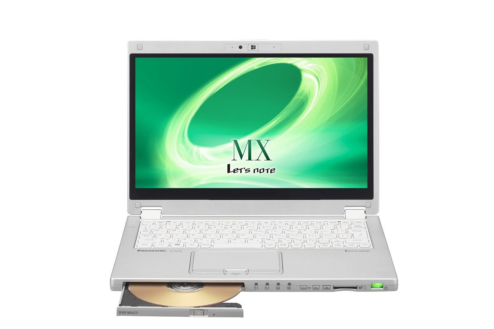
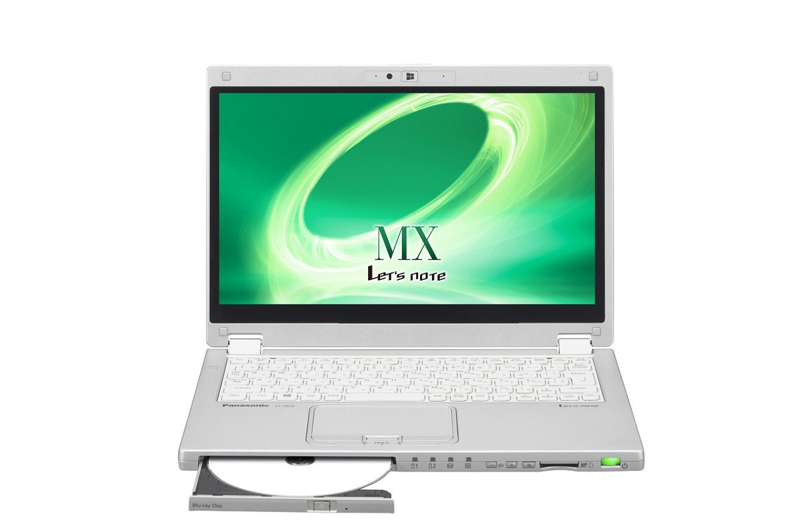
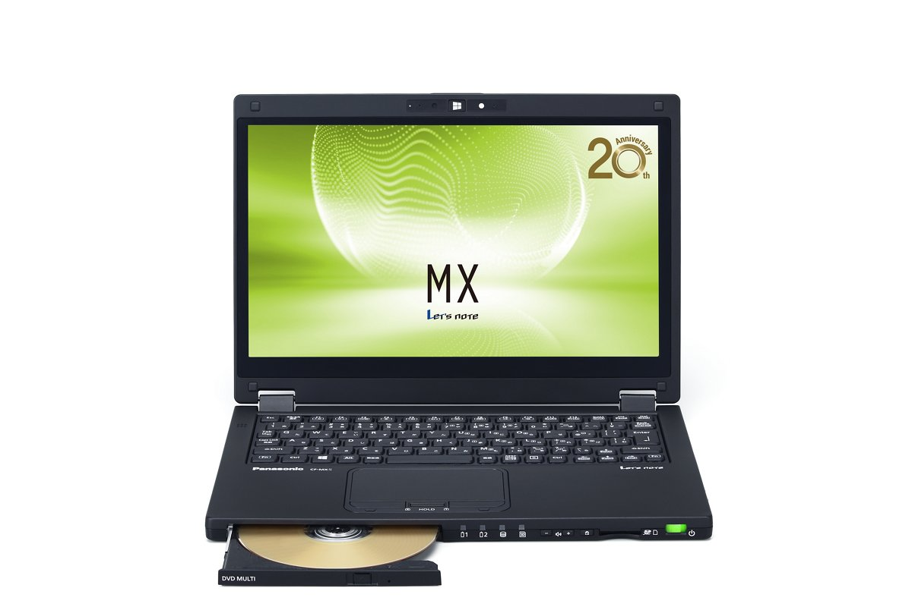
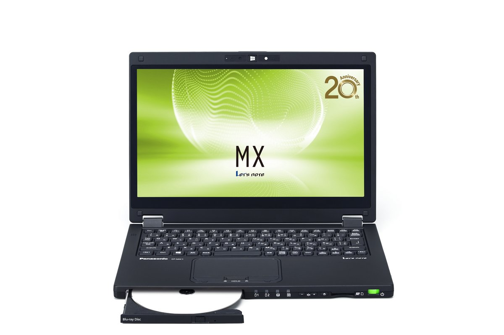
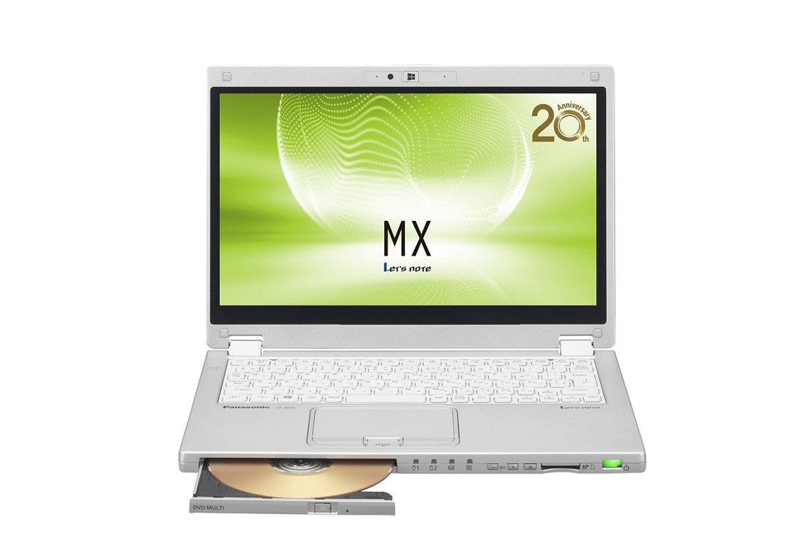
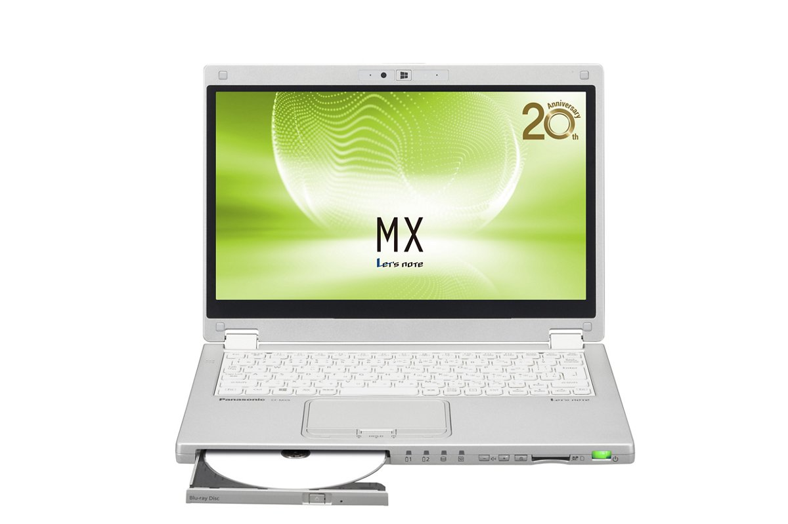

# Panasonic Let's note CF-MX5 Specifications

**English** · [日本語](../../ja/CF-MX5/) · [中文](../../zh/CF-MX5/)

**CF-MX5** is a Panasonic Let's note laptop in the MX series with a 12.5-inch Full HD display. This page lists all 8 part numbers, released 2015-10 – 2016-10. Each part number links to its official spec sheet.

*Panasonic Let's note CF-MX5 (CF-MX5HDGPR, CF-MX5YDGPR), silver. Image © Panasonic.*

## Part numbers

| Part number | Released | Discontinued | Summary |
| :-- | :-- | :-- | :-- |
| [CF-MX5WD0PR](https://panasonic.jp/pc/p-db/CF-MX5WD0PR_spec.html) | 2016-10 | 2017-02 | Windows 10 Home 64ビット、Intel® CoreTM i5-6200U プロセッサー、メモリー：8GB（拡張スロットなし）、SSD：128GB、スーパーマルチドライブ、LAN、無線LAN 802.11a（W52/W53/W56）/b/g/n/ac、Microsoft® Office Home and Business Premium |
| [CF-MX5XF8QR](https://panasonic.jp/pc/p-db/CF-MX5XF8QR_spec.html) | 2016-10 | 2017-02 | Windows 10 Pro 64ビット、Intel® CoreTM i7-6500U プロセッサー、メモリー：8GB（拡張スロットなし）、SSD：256GB、ブルーレイディスクドライブ、LAN、無線LAN 802.11a（W52/W53/W56）/b/g/n/ac、LTE対応ワイヤレスWAN、Microsoft® Office Home and Business Premium |
| [CF-MX5WDGPR](https://panasonic.jp/pc/p-db/CF-MX5WDGPR_spec.html) | 2016-06 | 2017-01 | Windows 10 Home 64ビット、Intel® CoreTM i5-6200U プロセッサー、メモリー：8GB（拡張スロットなし）、SSD：128GB、スーパーマルチドライブ、LAN、無線LAN 802.11a（W52/W53/W56）/b/g/n/ac、Microsoft® Office Home and Business Premium |
| [CF-MX5XFYQR](https://panasonic.jp/pc/p-db/CF-MX5XFYQR_spec.html) | 2016-06 | 2017-01 | Windows 10 Pro 64ビット、Intel® CoreTM i7-6500U プロセッサー、メモリー：8GB（拡張スロットなし）、SSD：256GB、ブルーレイディスクドライブ、LAN、無線LAN 802.11a（W52/W53/W56）/b/g/n/ac、LTE対応ワイヤレスWAN、Microsoft® Office Home and Business Premium |
| [CF-MX5HDGPR](https://panasonic.jp/pc/p-db/CF-MX5HDGPR_spec.html) | 2016-01 | 2016-11 | Windows 10 Home 64ビット、Intel® CoreTM i5-6200U プロセッサー、メモリー：8GB（拡張スロットなし）、SSD：128GB、スーパーマルチドライブ、LAN、無線LAN 802.11a（W52/W53/W56）/b/g/n/ac、Microsoft® Office Home and Business Premium |
| [CF-MX5JFYQR](https://panasonic.jp/pc/p-db/CF-MX5JFYQR_spec.html) | 2016-01 | 2016-11 | Windows 10 Pro 64ビット、Intel® CoreTM i7-6500U プロセッサー、メモリー：8GB（拡張スロットなし）、SSD：256GB、ブルーレイディスクドライブ、LAN、無線LAN 802.11a（W52/W53/W56）/b/g/n/ac、LTE対応ワイヤレスWAN、Microsoft® Office Home and Business Premium |
| [CF-MX5YDGPR](https://panasonic.jp/pc/p-db/CF-MX5YDGPR_spec.html) | 2015-10 | 2016-11 | Windows 10 Home 64ビット、Intel® CoreTM i5-6200U プロセッサー、メモリー：8GB（拡張スロットなし）、SSD：128GB、スーパーマルチドライブ、LAN、無線LAN 802.11a（W52/W53/W56）/b/g/n/ac、Microsoft® Office Home and Business Premium |
| [CF-MX5ZFYQR](https://panasonic.jp/pc/p-db/CF-MX5ZFYQR_spec.html) | 2015-10 | 2016-11 | Windows 10 Pro 64ビット、Intel® CoreTM i7-6500U プロセッサー、メモリー：8GB（拡張スロットなし）、SSD：256GB、ブルーレイディスクドライブ、LAN、無線LAN 802.11a（W52/W53/W56）/b/g/n/ac、LTE対応ワイヤレスWAN、Microsoft® Office Home and Business Premium |

## Common specifications

| Item | Value |
| :-- | :-- |
| Chipset | CPUに内蔵 |
| Memory | 8GB LPDDR3 SDRAM（拡張スロットなし） |
| Display / Graphics | インテル HD グラフィックス520（CPUに内蔵） |
| Display / LCD colors | 1920×1080ドット：約1677万色 |
| Display / External output | 1024×768、1280×768、1280×1024、1360×768、1366×768、1400×1050、1600×900、1600×1200、1680×1050、1920×1080、1920×1200ドット：約1677万色 |
| Wireless communication | インテル Dual Band Wireless-AC 8260 |
| Wireless LAN | IEEE802.11a（W52/W53/W56）/b/g/n/ac 準拠 |
| Wired LAN | 1000BASE-T/100BASE-TX/10BASE-T |
| Bluetooth | Bluetooth v4.1 / ■対応プロファイル / 【Classic】 / ・A2DP（Source） / ・AVRCP（Target） / ・HCRP（Client） / ・HFP（AG） / ・HID（Host） / ・OPP（ClientおよびServer） / ・PAN（User） / ・SPP（DevAおよびDevB） / 【Low Energy】 / ・HOGP（Host） |
| Audio | PCM音源（24ビットステレオ）、インテル High Definition Audio準拠、モノラルスピーカー |
| Memory expansion slot | なし |
| Camera | 有効画素数：最大1920x1080ピクセル(約207万画素) |
| Microphone | アレイマイク |
| Sensors | 照度センサー / 地磁気センサー / ジャイロセンサー / 加速度センサー |
| Ports | ・LANコネクター（RJ-45） / ・外部ディスプレイコネクター（アナログRGB ミニD-sub 15ピン） / ・HDMI出力端子 / ・マイク入力端子（ステレオミニジャックM3（プラグインパワー対応）） / ・オーディオ出力端子（ステレオミニジャックM3） / ・USB3.0ポート×2（うち1つはUSB充電ポートも兼ねる） |
| Keyboard | OADG準拠86キー、キーピッチ19mm(横)/15.2mm(縦)(一部キーを除く） |
| Pointing device | 静電タッチパネル/タッチパッド |
| Power consumption | 最大約45W |
| Efficiency target achievement (FY2011 standard) | — |
| Dimensions (W×D×H) | 幅301.4mm×奥行210mm×高さ21mm（タブレット状態の高さは21.5mm） 突起部除く |
| Microsoft Office | Microsoft® Office Home and Business Premium |
| Accessories | ウォールマウントプラグ付きACアダプター、バッテリーパック、専用布、スタイラスペン、取扱説明書、Microsoft Office Home & Business Premium |

## Differences by part number

| Part number | CPU | Memory | Storage | Weight | Battery life |
| :-- | :-- | :-- | :-- | :-- | :-- |
| CF-MX5WD0PR | Core i5-6200U | 8GB LPDDR3 SDRAM | 128GB | 1.198 kg | 12 h |
| CF-MX5XF8QR | Core i7-6500U | 8GB LPDDR3 SDRAM | 256GB | 1.255 kg | 12 h |
| CF-MX5WDGPR | Core i5-6200U | 8GB LPDDR3 SDRAM | 128GB | 1.198 kg | 12 h |
| CF-MX5XFYQR | Core i7-6500U | 8GB LPDDR3 SDRAM | 256GB | 1.255 kg | 12 h |
| CF-MX5HDGPR | Core i5-6200U | 8GB LPDDR3 SDRAM | 128GB | 1.198 kg | 12 h |
| CF-MX5JFYQR | Core i7-6500U | 8GB LPDDR3 SDRAM | 256GB | 1.255 kg | 12 h |
| CF-MX5YDGPR | Core i5-6200U | 8GB LPDDR3 SDRAM | 128GB | 1.198 kg | 12 h |
| CF-MX5ZFYQR | Core i7-6500U | 8GB LPDDR3 SDRAM | 256GB | 1.255 kg | 12 h |

CF-MX5WD0PR: all differing specifications

| Item | Value |
| :-- | :-- |
| OS | Windows 10 Home 64ビット（日本語版） / パナソニックはWindows 10 Proをおすすめします |
| CPU | インテル Core i5-6200U プロセッサー / インテルスマートキャッシュ3MB、動作周波数2.30GHz（インテル ターボ・ブースト・テクノロジー2.0利用時は最大2.80GHz） |
| Video memory | 最大4176MB (メインメモリーと共用) |
| SSD | フラッシュメモリードライブ（SSD）128GB（Serial ATA）上記容量のうち約15GBをリカバリー領域、約1GBをシステム領域として使用（ユーザー使用不可） |
| Optical drive | DVDスーパーマルチドライブ内蔵 バッファアンダーランエラー防止機能搭載 |
| Optical drive speed / Read | DVD-RAM：最大5倍速 / DVD-ROM：最大8倍速 / DVD-R：最大8倍速 / DVD-R DL:最大8倍速 / DVD-RW：最大8倍速 / +R：最大8倍速 / +R DL：最大8倍速 / +RW：最大8倍速 / HighSpeed +RW：最大8倍速 / CD-ROM：最大24倍速 / CD-R：最大24倍速 / CD-RW：最大24倍速 / High-Speed CD-RW：最大24倍速 / Ultra-Speed CD-RW：最大24倍速 |
| Optical drive speed / Write | DVD-RAM書き換え：最大5倍速 / DVD-R 書き込み：最大8倍速 / DVD-R DL 書き込み：最大6倍速 / DVD-RW 書き換え：最大6倍速 / +R 書き込み：最大8倍速 / +R DL 書き込み：最大6倍速 / +RW 書き換え：最大4倍速 / High Speed +RW 書き換え：最大8倍速 / CD-R 書き込み：最大24倍速 / CD-RW 書き換え：4倍速 / High-Speed CD-RW 書き換え：10倍速 / Ultra-Speed CD-RW 書き換え：最大16倍速 |
| Supported discs / Read | DVD-RAM（ 1.4GB、2.8GB、4.7GB、9.4GB ） / DVD-ROM（1層、2層） / DVD-Video（1層、2層） / DVD-R（ 1.4GB、2.8GB、4.7GB） / DVD-R DL（ 8.5GB ） / DVD-RW（ Ver.1.1/1.2 1.4GB、2.8GB、4.7GB、9.4GB） / +R（ 4.7GB ） / +R DL（ 8.5GB ） / +RW（ 4.7GB ） / HighSpeed +RW（ 4.7GB ） / CD-Audio / CD-ROM（XA対応） / Photo CD（マルチセッション対応） / Video CD / CD EXTRA / CD-TEXT / CD-R / CD-RW / High-Speed CD-RW / Ultra-Speed CD-RW |
| Supported discs / Write | DVD-RAM（ 1.4GB、2.8GB、4.7GB、9.4GB） / DVD-R（ 1.4GB、2.8 GB、4.7GB for General） / DVD-R DL（ 8.5GB ） / DVD-RW（ Ver.1.1/1.2 1.4GB、2.8GB、4.7GB、9.4GB） / +R（ 4.7GB ） / +R DL（ 8.5GB ） / +RW（ 4.7GB ） / High Speed +RW（ 4.7GB） / CD-R / CD-RW / High-Speed CD-RW / Ultra-Speed CD-RW |
| Display | 12.5型(16:9)Full HD TFTカラーIPS液晶 （1920×1080ドット）、静電タッチパネル、アンチグレア保護フィルム付 |
| Display / Simultaneous display | 1024×768、1280×768、1280×1024、1360×768、1366×768、1400×1050、1600×900、1680×1050、1920×1080ドット：約1677万色 |
| LTE | なし |
| Security chip | TPM（TCG V1.2準拠） |
| SD card slot | SDメモリーカード×1スロット（SDHCメモリーカード/SDXCメモリーカード対応/UHS-I、UHS-II高速転送対応/著作権保護技術対応） |
| Power | ▼ACアダプター / 入力：AC100V～240V、50Hz/60Hz、出力：DC16V、2.8A、電源コードは100V専用 / ▼バッテリーパック / 7.2V リチウムイオン・公称容量4800mAh、定格容量4560mAh / ▼内蔵バッテリー（交換できません） / 7.6V リチウムイオン・公称容量2060mAh、定格容量2000mAh |
| Energy efficiency | 2011年度基準 N区分0.022 |
| Battery life / charge time | ▼駆動時間 ： / （JEITA Ver.2.0）約12時間 / ▼充電時間： / 約4時間（電源OFF時）、約4時間（電源ON時） |
| Color | ブラック |
| Weight (with battery) | パソコン本体：約1.198kg（付属バッテリーパック(約200ｇ）装着時） / ACアダプター：約185g（ウォールマウントプラグ（約20g）電源コード（約60g）除く） |
| Software | ・Microsoft® Internet Explorer 11 / ・Microsoft® Edge / ・Microsoft® .NET Framework 4.6 / ・Microsoft® Windows Media Player 12 / ・ネットセレクターLite / ・手書きツール2 / ・インテル® ワイヤレス Bluetooth® / ・マカフィーリブセーフ（60日間 無料体験版） / ・i-フィルター6.0 (30日間無料お試し版) / ・WinZip 19.5日本語版（45日体験版） / ・Power2Go with DVD authoring / ・CyberLink PowerDVD12 / ・ディスプレイヘルパー / ・Wireless Manager mobile edition / ・Intel WiDi / ・Aptioセットアップユーティリティ / ・PC-Diagnosticユーティリティ / ・パナソニックPC設定ユーティリティ / ・ハードディスクデータ消去ユーティリティ / ・DirectX 12 / ・インテル PROSet/Wireless Software / ・画面共有アシストユーティリティー / ・PC情報ビューアー / ・リカバリーディスク作成ユーティリティ |

Official spec sheet: <https://panasonic.jp/pc/p-db/CF-MX5WD0PR_spec.html>

CF-MX5XF8QR: all differing specifications

| Item | Value |
| :-- | :-- |
| OS | Windows 10 Pro 64ビット（日本語版） |
| CPU | インテル Core i7-6500U プロセッサー / インテルスマートキャッシュ4MB、動作周波数2.50GHz（インテル ターボ・ブースト・テクノロジー2.0利用時は最大3.10GHz） |
| Video memory | 最大4176MB (メインメモリーと共用) |
| SSD | フラッシュメモリードライブ（SSD）256GB（Serial ATA）上記容量のうち約15GBをリカバリー領域、約1GBをシステム領域として使用（ユーザー使用不可） |
| Optical drive | ブルーレイディスクドライブ内蔵 / DVDスーパーマルチドライブ機能/バッファーアンダーランエラー防止機能搭載 |
| Optical drive speed / Read | BD-ROM：最大6倍速 / BD-R：最大6倍速 / BD-R DL：最大6倍速 / BD-R LTH：最大6倍速 / BD-R XL：最大6倍速 / BD-RE：最大6倍速 / BD-RE DL：最大6倍速 / BD-RE XL：最大4倍速 / DVD-RAM：最大5 倍速 / DVD-ROM：最大8 倍速 / DVD-R：最大8倍速 / DVD-R DL：最大8 倍速 / DVD-RW：最大8 倍速 / +R：最大8 倍速 / +R DL：最大8 倍速 / +RW：最大8 倍速 / High Speed +RW：最大8 倍速 / CD-ROM：最大24 倍速 / CD-R：最大24 倍速 / CD-RW：最大24 倍速 / High-Speed CD-RW：最大24 倍速 / Ultra-Speed CD-RW：最大24 倍速 |
| Optical drive speed / Write | BD-R書き込み：最大6 倍速 / BD-R DL書き込み：最大6 倍速 / BD-R LTH 書き込み：最大4 倍速 / BD-R XL書き込み：最大4 倍速 / BD-RE書き換え：2倍速 / BD-RE DL書き換え：2 倍速 / BD-RE XL 書き換え：2倍速 / DVD-RAM書き換え：最大5 倍速 / DVD-R 書き込み：最大8 倍速 / DVD-R DL書き込み：最大6 倍速 / DVD-RW書き換え：最大6 倍速 / +R 書き込み：最大8 倍速 / +R DL書き込み：最大6 倍速 / +RW 書き換え：最大4 倍速 / HighSpeed +RW書き換え：最大8 倍速 / CD-R 書き込み：最大24 倍速 / CD-RW 書き換え：4 倍速 / High-Speed CD-RW書き換え：10 倍速 / Ultra-Speed CD-RW書き換え：最大16 倍速 |
| Supported discs / Read | BD-ROM / BD-R（Ver.1.1/1.2/1.3、25GB） / BD-R DL（Ver.1.1/1.2/1.3、50GB） / BD-R LTH（Ver.1.2/1.3、25GB） / BD-R XL（Ver.2.0、100GB） / BD-RE（Ver. 2.1、25GB） / BD-RE DL（Ver.2.1、50GB） / BD-RE XL（Ver.3.0、100GB） / DVD-RAM（ 1.4GB、2.8GB、4.7GB、9.4GB ） / DVD-ROM（1層、2層） / DVD-Video（1層、2層） / DVD-R（1.4GB、2.8GB、4.7GB） / DVD-R DL（8.5GB） / DVD-RW（Ver.1.1/1.2 1.4GB、2.8GB、4.7GB、9.4GB） / +R（4.7GB） / +R DL（8.5GB） / +RW（4.7GB） / HighSpeed +RW（4.7GB） / CD-Audio / CD-ROM（XA対応） / Photo CD（マルチセッション対応） / Video CD / CD EXTRA / CD-TEXT / CD-R / CD-RW / High-Speed CD-RW / Ultra-Speed CD-RW |
| Supported discs / Write | BD-R（25GB） / BD-R DL（50GB） / BD-R LTH（25GB） / BD-R XL（100GB） / BD-RE（25GB） / BD-RE DL（50GB） / BD-RE XL（100GB） / DVD-RAM（1.4GB、2.8GB、4.7GB、9.4GB） / DVD-R（1.4GB、2.8 GB、4.7GB for General） / DVD-R DL（8.5GB） / DVD-RW（Ver.1.1/1.2 1.4GB、2.8GB、4.7GB、9.4GB） / +R（ 4.7GB） / +R DL（8.5GB） / +RW（ 4.7GB） / High Speed +RW（ 4.7GB） / CD-R / CD-RW / High-Speed CD-RW / Ultra-Speed CD-RW |
| Display | 12.5型(16:9)Full HD TFTカラーIPS液晶 （1920×1080ドット）、静電タッチパネル、アンチグレア保護フィルム付 |
| Display / Simultaneous display | 1024×768、1280×768、1280×1024、1360×768、1366×768、1400×1050、1600×900、1680×1050、1920×1080ドット：約1677万色 |
| LTE | ワイヤレスWANモジュール内蔵（LTE対応） |
| Security chip | TPM（TCG V1.2準拠） |
| Power | ▼ACアダプター / 入力：AC100V～240V、50Hz/60Hz、出力：DC16V、2.8A、電源コードは100V専用 / ▼バッテリーパック / 7.2V リチウムイオン・公称容量4800mAh、定格容量4560mAh / ▼内蔵バッテリー（交換できません） / 7.6V リチウムイオン・公称容量2060mAh、定格容量2000mAh |
| Energy efficiency | 2011年度基準 N区分0.019 |
| Battery life / charge time | ▼駆動時間 ： / （JEITA Ver.2.0）約12時間 / ▼充電時間： / 約4時間（電源OFF時）、約4時間（電源ON時） |
| Color | ブラック |
| Weight (with battery) | パソコン本体：約1.255kg（付属バッテリーパック(約200ｇ）装着時） / ACアダプター：約185g（ウォールマウントプラグ（約20g）電源コード（約60g）除く） |
| Software | ・Microsoft® Internet Explorer 11 / ・Microsoft® Edge / ・Microsoft® .NET Framework 4.6 / ・Microsoft® Windows Media Player 12 / ・ネットセレクターLite / ・手書きツール2 / ・インテル® ワイヤレス Bluetooth® / ・マカフィーリブセーフ（60日間 無料体験版） / ・i-フィルター6.0 (30日間無料お試し版) / ・WinZip 19.5日本語版（45日体験版） / ・Power2Go with DVD authoring / ・Power Producer BD / ・CyberLink PowerDVD12 / ・ディスプレイヘルパー / ・Wireless Manager mobile edition / ・Intel WiDi / ・Aptioセットアップユーティリティ / ・PC-Diagnosticユーティリティ / ・パナソニックPC設定ユーティリティ / ・ハードディスクデータ消去ユーティリティ / ・DirectX 12 / ・インテル PROSet/Wireless Software / ・画面共有アシストユーティリティー / ・PC情報ビューアー / ・リカバリーディスク作成ユーティリティ |
| Card slots / SD card | SDメモリーカード×1スロット（SDHCメモリーカード/SDXCメモリーカード対応/UHS-I、UHS-II高速転送対応/著作権保護技術対応） |
| Card slots / Other | ドコモUIMカードスロット(標準サイズ) |

Official spec sheet: <https://panasonic.jp/pc/p-db/CF-MX5XF8QR_spec.html>

CF-MX5WDGPR: all differing specifications

| Item | Value |
| :-- | :-- |
| OS | Windows 10 Home 64ビット（日本語版） |
| CPU | インテル Core i5-6200U プロセッサー / インテルスマートキャッシュ3MB、動作周波数2.30GHz（インテル ターボ・ブースト・テクノロジー2.0利用時は最大2.80GHz） |
| Video memory | 最大4176MB (メインメモリーと共用) |
| SSD | フラッシュメモリードライブ（SSD）128GB（Serial ATA）上記容量のうち約15GBをリカバリー領域、約1GBをシステム領域として使用（ユーザー使用不可） |
| Optical drive | DVDスーパーマルチドライブ内蔵 バッファアンダーランエラー防止機能搭載 |
| Optical drive speed / Read | DVD-RAM：最大5倍速 / DVD-ROM：最大8倍速 / DVD-R：最大8倍速 / DVD-R DL:最大8倍速 / DVD-RW：最大8倍速 / +R：最大8倍速 / +R DL：最大8倍速 / +RW：最大8倍速 / HighSpeed +RW：最大8倍速 / CD-ROM：最大24倍速 / CD-R：最大24倍速 / CD-RW：最大24倍速 / High-Speed CD-RW：最大24倍速 / Ultra-Speed CD-RW：最大24倍速 |
| Optical drive speed / Write | DVD-RAM書き換え：最大5倍速 / DVD-R 書き込み：最大8倍速 / DVD-R DL 書き込み：最大6倍速 / DVD-RW 書き換え：最大6倍速 / +R 書き込み：最大8倍速 / +R DL 書き込み：最大6倍速 / +RW 書き換え：最大4倍速 / High Speed +RW 書き換え：最大8倍速 / CD-R 書き込み：最大24倍速 / CD-RW 書き換え：4倍速 / High-Speed CD-RW 書き換え：10倍速 / Ultra-Speed CD-RW 書き換え：最大16倍速 |
| Supported discs / Read | DVD-RAM（ 1.4GB、2.8GB、4.7GB、9.4GB ） / DVD-ROM（1層、2層） / DVD-Video（1層、2層） / DVD-R（ 1.4GB、2.8GB、4.7GB） / DVD-R DL（ 8.5GB ） / DVD-RW（ Ver.1.1/1.2 1.4GB、2.8GB、4.7GB、9.4GB） / +R（ 4.7GB ） / +R DL（ 8.5GB ） / +RW（ 4.7GB ） / HighSpeed +RW（ 4.7GB ） / CD-Audio / CD-ROM（XA対応） / Photo CD（マルチセッション対応） / Video CD / CD EXTRA / CD-TEXT / CD-R / CD-RW / High-Speed CD-RW / Ultra-Speed CD-RW |
| Supported discs / Write | DVD-RAM（ 1.4GB、2.8GB、4.7GB、9.4GB） / DVD-R（ 1.4GB、2.8 GB、4.7GB for General） / DVD-R DL（ 8.5GB ） / DVD-RW（ Ver.1.1/1.2 1.4GB、2.8GB、4.7GB、9.4GB） / +R（ 4.7GB ） / +R DL（ 8.5GB ） / +RW（ 4.7GB ） / High Speed +RW（ 4.7GB） / CD-R / CD-RW / High-Speed CD-RW / Ultra-Speed CD-RW |
| Display | 12.5型ワイド(16:9)Full HD TFTカラーIPS液晶 （1920×1080ドット）、静電タッチパネル、アンチグレア保護フィルム付 |
| Display / Simultaneous display | 1024×768、1280×768、1280×1024、1360×768、1366×768、1400×1050、1600×900、1680×1050、1920×1080ドット：約1677万色 |
| LTE | なし |
| Security chip | TPM（TCG V1.2準拠） |
| SD card slot | SDメモリーカード×1スロット（SDHCメモリーカード/SDXCメモリーカード対応/UHS-I、UHS-II高速転送対応/著作権保護技術対応） |
| Power | ▼ACアダプター / 入力：AC100V～240V、50Hz/60Hz、出力：DC16V、2.8A、電源コードは100V専用 / ▼バッテリーパック / 7.2V リチウムイオン・公称容量4800mAh、定格容量4560mAh / ▼内蔵バッテリー（交換できません） / 7.6V リチウムイオン・公称容量2060mAh、定格容量2000mAh |
| Energy efficiency | 2011年度基準 N区分0.022 |
| Battery life / charge time | ▼駆動時間 ： / （JEITA Ver.2.0）約12時間 / ▼充電時間： / 約4時間（電源OFF時）、約4時間（電源ON時） |
| Color | シルバー |
| Weight (with battery) | パソコン本体：約1.198kg（付属バッテリーパック(約200ｇ）装着時） / ACアダプター：約185g（ウォールマウントプラグ（約20g）電源コード（約60g）除く） |
| Software | ・Microsoft® Internet Explorer 11 / ・Microsoft® Edge / ・Microsoft® .NET Framework 4.6 / ・Microsoft® Windows Media Player 12 / ・ネットセレクターLite / ・手書きツール2 / ・インテル® ワイヤレス Bluetooth® / ・マカフィーリブセーフ（60日間 無料体験版） / ・i-フィルター6.0 (30日間無料お試し版) / ・WinZip 19.5日本語版（45日体験版） / ・Power2Go with DVD authoring / ・CyberLink PowerDVD12 / ・ディスプレイヘルパー / ・Wireless Manager mobile edition / ・Intel WiDi / ・Aptioセットアップユーティリティ / ・PC-Diagnosticユーティリティ / ・パナソニックPC設定ユーティリティ / ・ハードディスクデータ消去ユーティリティ / ・DirectX 12 / ・インテル PROSet/Wireless Software / ・画面共有アシストユーティリティー / ・PC情報ビューアー / ・リカバリーディスク作成ユーティリティ |

Official spec sheet: <https://panasonic.jp/pc/p-db/CF-MX5WDGPR_spec.html>

CF-MX5XFYQR: all differing specifications

| Item | Value |
| :-- | :-- |
| OS | Windows 10 Pro 64ビット（日本語版） |
| CPU | インテル Core i7-6500U プロセッサー / インテルスマートキャッシュ4MB、動作周波数2.50GHz（インテル ターボ・ブースト・テクノロジー2.0利用時は最大3.10GHz） |
| Video memory | 最大4176MB (メインメモリーと共用) |
| SSD | フラッシュメモリードライブ（SSD）256GB（Serial ATA）上記容量のうち約15GBをリカバリー領域、約1GBをシステム領域として使用（ユーザー使用不可） |
| Optical drive | ブルーレイディスクドライブ内蔵 / DVDスーパーマルチドライブ機能/バッファーアンダーランエラー防止機能搭載 |
| Optical drive speed / Read | BD-ROM：最大6倍速 / BD-R：最大6倍速 / BD-R DL：最大6倍速 / BD-R LTH：最大6倍速 / BD-R XL：最大6倍速 / BD-RE：最大6倍速 / BD-RE DL：最大6倍速 / BD-RE XL：最大4倍速 / DVD-RAM：最大5 倍速 / DVD-ROM：最大8 倍速 / DVD-R：最大8倍速 / DVD-R DL：最大8 倍速 / DVD-RW：最大8 倍速 / +R：最大8 倍速 / +R DL：最大8 倍速 / +RW：最大8 倍速 / High Speed +RW：最大8 倍速 / CD-ROM：最大24 倍速 / CD-R：最大24 倍速 / CD-RW：最大24 倍速 / High-Speed CD-RW：最大24 倍速 / Ultra-Speed CD-RW：最大24 倍速 |
| Optical drive speed / Write | BD-R書き込み：最大6 倍速 / BD-R DL書き込み：最大6 倍速 / BD-R LTH 書き込み：最大4 倍速 / BD-R XL書き込み：最大4 倍速 / BD-RE書き換え：2倍速 / BD-RE DL書き換え：2 倍速 / BD-RE XL 書き換え：2倍速 / DVD-RAM書き換え：最大5 倍速 / DVD-R 書き込み：最大8 倍速 / DVD-R DL書き込み：最大6 倍速 / DVD-RW書き換え：最大6 倍速 / +R 書き込み：最大8 倍速 / +R DL書き込み：最大6 倍速 / +RW 書き換え：最大4 倍速 / HighSpeed +RW書き換え：最大8 倍速 / CD-R 書き込み：最大24 倍速 / CD-RW 書き換え：4 倍速 / High-Speed CD-RW書き換え：10 倍速 / Ultra-Speed CD-RW書き換え：最大16 倍速 |
| Supported discs / Read | BD-ROM / BD-R（Ver.1.1/1.2/1.3、25GB） / BD-R DL（Ver.1.1/1.2/1.3、50GB） / BD-R LTH（Ver.1.2/1.3、25GB） / BD-R XL（Ver.2.0、100GB） / BD-RE（Ver. 2.1、25GB） / BD-RE DL（Ver.2.1、50GB） / BD-RE XL（Ver.3.0、100GB） / DVD-RAM（ 1.4GB、2.8GB、4.7GB、9.4GB ） / DVD-ROM（1層、2層） / DVD-Video（1層、2層） / DVD-R（1.4GB、2.8GB、4.7GB） / DVD-R DL（8.5GB） / DVD-RW（Ver.1.1/1.2 1.4GB、2.8GB、4.7GB、9.4GB） / +R（4.7GB） / +R DL（8.5GB） / +RW（4.7GB） / HighSpeed +RW（4.7GB） / CD-Audio / CD-ROM（XA対応） / Photo CD（マルチセッション対応） / Video CD / CD EXTRA / CD-TEXT / CD-R / CD-RW / High-Speed CD-RW / Ultra-Speed CD-RW |
| Supported discs / Write | BD-R（25GB） / BD-R DL（50GB） / BD-R LTH（25GB） / BD-R XL（100GB） / BD-RE（25GB） / BD-RE DL（50GB） / BD-RE XL（100GB） / DVD-RAM（1.4GB、2.8GB、4.7GB、9.4GB） / DVD-R（1.4GB、2.8 GB、4.7GB for General） / DVD-R DL（8.5GB） / DVD-RW（Ver.1.1/1.2 1.4GB、2.8GB、4.7GB、9.4GB） / +R（ 4.7GB） / +R DL（8.5GB） / +RW（ 4.7GB） / High Speed +RW（ 4.7GB） / CD-R / CD-RW / High-Speed CD-RW / Ultra-Speed CD-RW |
| Display | 12.5型ワイド(16:9)Full HD TFTカラーIPS液晶 （1920×1080ドット）、静電タッチパネル、アンチグレア保護フィルム付 |
| Display / Simultaneous display | 1024×768、1280×768、1280×1024、1360×768、1366×768、1400×1050、1600×900、1680×1050、1920×1080ドット：約1677万色 |
| LTE | ワイヤレスWANモジュール内蔵（LTE対応） |
| Security chip | TPM（TCG V1.2準拠） |
| Power | ▼ACアダプター / 入力：AC100V～240V、50Hz/60Hz、出力：DC16V、2.8A、電源コードは100V専用 / ▼バッテリーパック / 7.2V リチウムイオン・公称容量4800mAh、定格容量4560mAh / ▼内蔵バッテリー（交換できません） / 7.6V リチウムイオン・公称容量2060mAh、定格容量2000mAh |
| Energy efficiency | 2011年度基準 N区分0.019 |
| Battery life / charge time | ▼駆動時間 ： / （JEITA Ver.2.0）約12時間 / ▼充電時間： / 約4時間（電源OFF時）、約4時間（電源ON時） |
| Color | シルバー |
| Weight (with battery) | パソコン本体：約1.255kg（付属バッテリーパック(約200ｇ）装着時） / ACアダプター：約185g（ウォールマウントプラグ（約20g）電源コード（約60g）除く） |
| Software | ・Microsoft® Internet Explorer 11 / ・Microsoft® Edge / ・Microsoft® .NET Framework 4.6 / ・Microsoft® Windows Media Player 12 / ・ネットセレクターLite / ・手書きツール2 / ・インテル® ワイヤレス Bluetooth® / ・マカフィーリブセーフ（60日間 無料体験版） / ・i-フィルター6.0 (30日間無料お試し版) / ・WinZip 19.5日本語版（45日体験版） / ・Power2Go with DVD authoring / ・Power Producer BD / ・CyberLink PowerDVD12 / ・ディスプレイヘルパー / ・Wireless Manager mobile edition / ・Intel WiDi / ・Aptioセットアップユーティリティ / ・PC-Diagnosticユーティリティ / ・パナソニックPC設定ユーティリティ / ・ハードディスクデータ消去ユーティリティ / ・DirectX 12 / ・インテル PROSet/Wireless Software / ・画面共有アシストユーティリティー / ・PC情報ビューアー / ・リカバリーディスク作成ユーティリティ |
| Card slots / SD card | SDメモリーカード×1スロット（SDHCメモリーカード/SDXCメモリーカード対応/UHS-I、UHS-II高速転送対応/著作権保護技術対応） |
| Card slots / Other | ドコモUIMカードスロット(標準サイズ) |

Official spec sheet: <https://panasonic.jp/pc/p-db/CF-MX5XFYQR_spec.html>

CF-MX5HDGPR: all differing specifications

| Item | Value |
| :-- | :-- |
| OS | Windows 10 Home 64ビット（日本語版） |
| CPU | インテル Core i5-6200U プロセッサー / インテルスマートキャッシュ3MB、動作周波数2.30GHz（インテル ターボ・ブースト・テクノロジー2.0利用時は最大2.80GHz） |
| Video memory | 最大4178MB (メインメモリーと共用) |
| SSD | フラッシュメモリードライブ（SSD）128GB（Serial ATA）上記容量のうち約15GBをリカバリー領域、約1GBをシステム領域として使用（ユーザー使用不可） |
| Optical drive | DVDスーパーマルチドライブ内蔵 バッファアンダーランエラー防止機能搭載 |
| Optical drive speed / Read | DVD-RAM：最大5倍速 / DVD-ROM：最大8倍速 / DVD-R：最大8倍速 / DVD-R DL:最大8倍速 / DVD-RW：最大8倍速 / +R：最大8倍速 / +R DL：最大8倍速 / +RW：最大8倍速 / HighSpeed +RW：最大8倍速 / CD-ROM：最大24倍速 / CD-R：最大24倍速 / CD-RW：最大24倍速 / High-Speed CD-RW：最大24倍速 / Ultra-Speed CD-RW：最大24倍速 |
| Optical drive speed / Write | DVD-RAM書き換え：最大5倍速 / DVD-R 書き込み：最大8倍速 / DVD-R DL 書き込み：最大6倍速 / DVD-RW 書き換え：最大6倍速 / +R 書き込み：最大8倍速 / +R DL 書き込み：最大6倍速 / +RW 書き換え：最大4倍速 / High Speed +RW 書き換え：最大8倍速 / CD-R 書き込み：最大24倍速 / CD-RW 書き換え：4倍速 / High-Speed CD-RW 書き換え：10倍速 / Ultra-Speed CD-RW 書き換え：最大16倍速 |
| Supported discs / Read | DVD-RAM（ 1.4GB、2.8GB、4.7GB、9.4GB ） / DVD-ROM（1層、2層） / DVD-Video（1層、2層） / DVD-R（ 1.4GB、2.8GB、4.7GB） / DVD-R DL（ 8.5GB ） / DVD-RW（ Ver.1.1/1.2 1.4GB、2.8GB、4.7GB、9.4GB） / +R（ 4.7GB ） / +R DL（ 8.5GB ） / +RW（ 4.7GB ） / HighSpeed +RW（ 4.7GB ） / CD-Audio / CD-ROM（XA対応） / Photo CD（マルチセッション対応） / Video CD / CD EXTRA / CD-TEXT / CD-R / CD-RW / High-Speed CD-RW / Ultra-Speed CD-RW |
| Supported discs / Write | DVD-RAM（ 1.4GB、2.8GB、4.7GB、9.4GB） / DVD-R（ 1.4GB、2.8 GB、4.7GB for General） / DVD-R DL（ 8.5GB ） / DVD-RW（ Ver.1.1/1.2 1.4GB、2.8GB、4.7GB、9.4GB） / +R（ 4.7GB ） / +R DL（ 8.5GB ） / +RW（ 4.7GB ） / High Speed +RW（ 4.7GB） / CD-R / CD-RW / High-Speed CD-RW / Ultra-Speed CD-RW |
| Display | 12.5型ワイド(16:9)Full HD TFTカラーIPS液晶 （1920×1080ドット）、静電タッチパネル、アンチグレア保護フィルム付 |
| Display / Simultaneous display | 1024×768、1280×768、1280×1024、1360×768、1366×768、1400×1050、1600×900、1680×1050、1920×1080：約1677万色 |
| LTE | なし |
| SD card slot | SDメモリーカード×1スロット（SDHCメモリーカード/SDXCメモリーカード対応/UHS-I、UHS-II高速転送対応/著作権保護技術対応） |
| Power | ▼ACアダプター / 入力：AC100V～240V、50Hz/60Hz、出力：DC16V、2.8A、電源コードは100V専用 / ▼バッテリーパック / 7.2V リチウムイオン・公称容量4800mAh、定格容量4560mAh / ▼内蔵バッテリー（交換できません） / 7.6V リチウムイオン・公称容量2060mAh、定格容量2000mAh |
| Energy efficiency | 2011年度基準 N区分0.022 |
| Battery life / charge time | ▼駆動時間 ： / （JEITA Ver.2.0）約12時間 / ▼充電時間： / 約4時間（電源OFF時）、約4時間（電源ON時） |
| Color | シルバー |
| Weight (with battery) | パソコン本体：約1.198kg（付属バッテリーパック(約200ｇ）装着時） / ACアダプター：約185g（ウォールマウントプラグ（約20g）電源コード（約60g）除く） |
| Software | ・Microsoft® Internet Explorer 11 / ・Microsoft® Edge / ・Microsoft® .NET Framework 4.6 / ・Microsoft® Windows Media Player 12 / ・ネットセレクターLite / ・手書きツール2 / ・インテル® ワイヤレス Bluetooth® / ・マカフィーリブセーフ（60日間 無料体験版） / ・i-フィルター6.0 (30日間無料お試し版) / ・WinZip 19.5日本語版（45日体験版） / ・Power2Go with DVD authoring / ・CyberLink PowerDVD12 / ・ディスプレイヘルパー / ・Wireless Manager mobile edition / ・Intel WiDi / ・Aptioセットアップユーティリティ / ・PC-Diagnosticユーティリティ / ・パナソニックPC設定ユーティリティ / ・ハードディスクデータ消去ユーティリティ / ・DirectX 12 / ・インテル PROSet/Wireless Software / ・画面共有アシストユーティリティー / ・PC情報ビューアー / ・リカバリーディスク作成ユーティリティ |

Official spec sheet: <https://panasonic.jp/pc/p-db/CF-MX5HDGPR_spec.html>

CF-MX5JFYQR: all differing specifications

| Item | Value |
| :-- | :-- |
| OS | Windows 10 Pro 64ビット（日本語版） |
| CPU | インテル Core i7-6500U プロセッサー / インテルスマートキャッシュ4MB、動作周波数2.50GHz（インテル ターボ・ブースト・テクノロジー2.0利用時は最大3.10GHz） |
| Video memory | 最大4178MB (メインメモリーと共用) |
| SSD | フラッシュメモリードライブ（SSD）256GB（Serial ATA）上記容量のうち約15GBをリカバリー領域、約1GBをシステム領域として使用（ユーザー使用不可） |
| Optical drive | ブルーレイディスクドライブ内蔵 / DVDスーパーマルチドライブ機能/バッファーアンダーランエラー防止機能搭載 |
| Optical drive speed / Read | BD-ROM：最大6倍速 / BD-R：最大6倍速 / BD-R DL：最大6倍速 / BD-R LTH：最大6倍速 / BD-R XL：最大6倍速 / BD-RE：最大6倍速 / BD-RE DL：最大6倍速 / BD-RE XL：最大4倍速 / DVD-RAM：最大5 倍速 / DVD-ROM：最大8 倍速 / DVD-R：最大8倍速 / DVD-R DL：最大8 倍速 / DVD-RW：最大8 倍速 / +R：最大8 倍速 / +R DL：最大8 倍速 / +RW：最大8 倍速 / High Speed +RW：最大8 倍速 / CD-ROM：最大24 倍速 / CD-R：最大24 倍速 / CD-RW：最大24 倍速 / High-Speed CD-RW：最大24 倍速 / Ultra-Speed CD-RW：最大24 倍速 |
| Optical drive speed / Write | BD-R書き込み：最大6 倍速 / BD-R DL書き込み：最大6 倍速 / BD-R LTH 書き込み：最大4 倍速 / BD-R XL書き込み：最大4 倍速 / BD-RE書き換え：2倍速 / BD-RE DL書き換え：2 倍速 / BD-RE XL 書き換え：2倍速 / DVD-RAM書き換え：最大5 倍速 / DVD-R 書き込み：最大8 倍速 / DVD-R DL書き込み：最大6 倍速 / DVD-RW書き換え：最大6 倍速 / +R 書き込み：最大8 倍速 / +R DL書き込み：最大6 倍速 / +RW 書き換え：最大4 倍速 / HighSpeed +RW書き換え：最大8 倍速 / CD-R 書き込み：最大24 倍速 / CD-RW 書き換え：4 倍速 / High-Speed CD-RW書き換え：10 倍速 / Ultra-Speed CD-RW書き換え：最大16 倍速 |
| Supported discs / Read | BD-ROM / BD-R（Ver.1.1/1.2/1.3、25GB） / BD-R DL（Ver.1.1/1.2/1.3、50GB） / BD-R LTH（Ver.1.2/1.3、25GB） / BD-R XL（Ver.2.0、100GB） / BD-RE（Ver. 2.1、25GB） / BD-RE DL（Ver.2.1、50GB） / BD-RE XL（Ver.3.0、100GB） / DVD-RAM（ 1.4GB、2.8GB、4.7GB、9.4GB ） / DVD-ROM（1層、2層） / DVD-Video（1層、2層） / DVD-R（1.4GB、2.8GB、4.7GB） / DVD-R DL（8.5GB） / DVD-RW（Ver.1.1/1.2 1.4GB、2.8GB、4.7GB、9.4GB） / +R（4.7GB） / +R DL（8.5GB） / +RW（4.7GB） / HighSpeed +RW（4.7GB） / CD-Audio / CD-ROM（XA対応） / Photo CD（マルチセッション対応） / Video CD / CD EXTRA / CD-TEXT / CD-R / CD-RW / High-Speed CD-RW / Ultra-Speed CD-RW |
| Supported discs / Write | BD-R（25GB） / BD-R DL（50GB） / BD-R LTH（25GB） / BD-R XL（100GB） / BD-RE（25GB） / BD-RE DL（50GB） / BD-RE XL（100GB） / DVD-RAM（1.4GB、2.8GB、4.7GB、9.4GB） / DVD-R（1.4GB、2.8 GB、4.7GB for General） / DVD-R DL（8.5GB） / DVD-RW（Ver.1.1/1.2 1.4GB、2.8GB、4.7GB、9.4GB） / +R（ 4.7GB） / +R DL（8.5GB） / +RW（ 4.7GB） / High Speed +RW（ 4.7GB） / CD-R / CD-RW / High-Speed CD-RW / Ultra-Speed CD-RW |
| Display | 12.5型ワイド(16:9)Full HD TFTカラーIPS液晶 （1920×1080ドット）、静電タッチパネル、アンチグレア保護フィルム付 |
| Display / Simultaneous display | 1024×768、1280×768、1280×1024、1360×768、1366×768、1400×1050、1600×900、1680×1050、1920×1080：約1677万色 |
| LTE | ワイヤレスWANモジュール内蔵(Xi(LTE)対応) |
| Power | ▼ACアダプター / 入力：AC100V～240V、50Hz/60Hz、出力：DC16V、2.8A、電源コードは100V専用 / ▼バッテリーパック / 7.2V リチウムイオン・公称容量4800mAh、定格容量4560mAh / ▼内蔵バッテリー（交換できません） / 7.6V リチウムイオン・公称容量2060mAh、定格容量2000mAh |
| Energy efficiency | 2011年度基準 N区分0.019 |
| Battery life / charge time | ▼駆動時間 ： / （JEITA Ver.2.0）約12時間 / ▼充電時間： / 約4時間（電源OFF時）、約4時間（電源ON時） |
| Color | シルバー |
| Weight (with battery) | パソコン本体：約1.255kg（付属バッテリーパック(約200ｇ）装着時） / ACアダプター：約185g（ウォールマウントプラグ（約20g）電源コード（約60g）除く） |
| Software | ・Microsoft® Internet Explorer 11 / ・Microsoft® Edge / ・Microsoft® .NET Framework 4.6 / ・Microsoft® Windows Media Player 12 / ・ネットセレクターLite / ・手書きツール2 / ・インテル® ワイヤレス Bluetooth® / ・マカフィーリブセーフ（60日間 無料体験版） / ・i-フィルター6.0 (30日間無料お試し版) / ・WinZip 19.5日本語版（45日体験版） / ・Power2Go with DVD authoring / ・Power Producer BD / ・CyberLink PowerDVD12 / ・ディスプレイヘルパー / ・Wireless Manager mobile edition / ・Intel WiDi / ・Aptioセットアップユーティリティ / ・PC-Diagnosticユーティリティ / ・パナソニックPC設定ユーティリティ / ・ハードディスクデータ消去ユーティリティ / ・DirectX 12 / ・インテル PROSet/Wireless Software / ・画面共有アシストユーティリティー / ・PC情報ビューアー / ・リカバリーディスク作成ユーティリティ |
| Card slots / SD card | SDメモリーカード×1スロット（SDHCメモリーカード/SDXCメモリーカード対応/UHS-I、UHS-II高速転送対応/著作権保護技術対応） |
| Card slots / Other | ドコモUIMカード(標準サイズ) |

Official spec sheet: <https://panasonic.jp/pc/p-db/CF-MX5JFYQR_spec.html>

CF-MX5YDGPR: all differing specifications

| Item | Value |
| :-- | :-- |
| OS | Windows 10 Home 64ビット（日本語版） |
| CPU | インテル Core i5-6200U プロセッサー / インテルスマートキャッシュ3MB、動作周波数2.30GHz（インテル ターボ・ブースト・テクノロジー2.0利用時は最大2.80GHz） |
| Video memory | 最大4176MB (メインメモリーと共用) |
| SSD | フラッシュメモリードライブ（SSD）128GB（Serial ATA）上記容量のうち約15GBをリカバリー領域、約1GBをシステム領域として使用（ユーザー使用不可） |
| Optical drive | DVDスーパーマルチドライブ内蔵 バッファアンダーランエラー防止機能搭載 |
| Optical drive speed / Read | DVD-RAM：最大5倍速 / DVD-ROM：最大8倍速 / DVD-R：最大8倍速 / DVD-R DL:最大8倍速 / DVD-RW：最大8倍速 / +R：最大8倍速 / +R DL：最大8倍速 / +RW：最大8倍速 / HighSpeed +RW：最大8倍速 / CD-ROM：最大24倍速 / CD-R：最大24倍速 / CD-RW：最大24倍速 / High-Speed CD-RW：最大24倍速 / Ultra-Speed CD-RW：最大24倍速 |
| Optical drive speed / Write | DVD-RAM書き換え：最大5倍速 / DVD-R 書き込み：最大8倍速 / DVD-R DL 書き込み：最大6倍速 / DVD-RW 書き換え：最大6倍速 / +R 書き込み：最大8倍速 / +R DL 書き込み：最大6倍速 / +RW 書き換え：最大4倍速 / High Speed +RW 書き換え：最大8倍速 / CD-R 書き込み：最大24倍速 / CD-RW 書き換え：4倍速 / High-Speed CD-RW 書き換え：10倍速 / Ultra-Speed CD-RW 書き換え：最大16倍速 |
| Supported discs / Read | DVD-RAM（ 1.4GB、2.8GB、4.7GB、9.4GB ） / DVD-ROM（1層、2層） / DVD-Video（1層、2層） / DVD-R（ 1.4GB、2.8GB、4.7GB） / DVD-R DL（ 8.5GB ） / DVD-RW（ Ver.1.1/1.2 1.4GB、2.8GB、4.7GB、9.4GB） / +R（ 4.7GB ） / +R DL（ 8.5GB ） / +RW（ 4.7GB ） / HighSpeed +RW（ 4.7GB ） / CD-Audio / CD-ROM（XA対応） / Photo CD（マルチセッション対応） / Video CD / CD EXTRA / CD-TEXT / CD-R / CD-RW / High-Speed CD-RW / Ultra-Speed CD-RW |
| Supported discs / Write | DVD-RAM（ 1.4GB、2.8GB、4.7GB、9.4GB） / DVD-R（ 1.4GB、2.8 GB、4.7GB for General） / DVD-R DL（ 8.5GB ） / DVD-RW（ Ver.1.1/1.2 1.4GB、2.8GB、4.7GB、9.4GB） / +R（ 4.7GB ） / +R DL（ 8.5GB ） / +RW（ 4.7GB ） / High Speed +RW（ 4.7GB） / CD-R / CD-RW / High-Speed CD-RW / Ultra-Speed CD-RW |
| Display | 12.5型ワイド(16:9)Full HD TFTカラーIPS液晶 （1920×1080ドット）、静電タッチパネル、アンチグレア保護フィルム付 |
| Display / Simultaneous display | 1024×768、1280×768、1280×1024、1360×768、1366×768、1400×1050、1600×900、1680×1050、1920×1080：約1677万色 |
| LTE | なし |
| SD card slot | SDメモリーカード×1スロット（SDHCメモリーカード/SDXCメモリーカード対応/UHS-I、UHS-II高速転送対応/著作権保護技術対応） |
| Power | ▼ACアダプター / 入力：AC100V～240V、50Hz/60Hz、出力：DC16V、2.8A、電源コードは100V専用 / ▼バッテリーパック / 7.2V リチウムイオン・公称容量4880mAh、定格容量4560mAh / ▼内蔵バッテリー（交換できません） / 7.6V リチウムイオン・公称容量2060mAh、定格容量2000mAh |
| Energy efficiency | 2011年度基準 N区分0.022 |
| Battery life / charge time | ▼駆動時間： / （JEITA Ver.2.0）約12時間 / ▼充電時間： / 約4時間（電源OFF時）、約4時間（電源ON時） |
| Color | シルバー |
| Weight (with battery) | パソコン本体：約1.198kg / ACアダプター：約0.185kg（ウォールマウントプラグ（約0.20kg）電源コード（約0.06 kg）除く） |
| Software | ・Microsoft® Internet Explorer 11 / ・Microsoft® Edge / ・Microsoft® .NET Framework 4.6 / ・Microsoft® Windows Media Player 12 / ・ネットセレクターLite / ・手書きツール2 / ・インテル® ワイヤレス Bluetooth® / ・マカフィーリブセーフ（60日間 無料体験版） / ・i-フィルター6.0 (30日間無料お試し版) / ・WinZip 19.5日本語版（45日体験版） / ・Power2Go with DVD authoring / ・CyberLink PowerDVD12 / ・ディスプレイヘルパー / ・Wireless Manager mobile edition / ・Intel WiDi / ・Aptioセットアップユーティリティ / ・PC-Diagnosticユーティリティ / ・パナソニックPC設定ユーティリティ / ・ハードディスクデータ消去ユーティリティ / ・DirectX 12 / ・インテル PROSet/Wireless Software / ・画面共有アシストユーティリティー / ・PC情報ビューアー / ・リカバリーディスク作成ユーティリティ |

Official spec sheet: <https://panasonic.jp/pc/p-db/CF-MX5YDGPR_spec.html>

CF-MX5ZFYQR: all differing specifications

| Item | Value |
| :-- | :-- |
| OS | Windows 10 Pro 64ビット（日本語版） |
| CPU | インテル Core i7-6500U プロセッサー / インテルスマートキャッシュ4MB、動作周波数2.50GHz（インテル ターボ・ブースト・テクノロジー2.0利用時は最大3.10GHz） |
| Video memory | 最大4176MB (メインメモリーと共用) |
| SSD | フラッシュメモリードライブ（SSD）256GB（Serial ATA）上記容量のうち約15GBをリカバリー領域、約1GBをシステム領域として使用（ユーザー使用不可） |
| Optical drive | ブルーレイディスクドライブ内蔵 / DVDスーパーマルチドライブ機能/バッファーアンダーランエラー防止機能搭載 |
| Optical drive speed / Read | BD-ROM：最大6倍速 / BD-R：最大6倍速 / BD-R DL：最大6倍速 / BD-R LTH：最大6倍速 / BD-R XL：最大6倍速 / BD-RE：最大6倍速 / BD-RE DL：最大6倍速 / BD-RE XL：最大4倍速 / DVD-RAM：最大5 倍速 / DVD-ROM：最大8 倍速 / DVD-R：最大8倍速 / DVD-R DL：最大8 倍速 / DVD-RW：最大8 倍速 / +R：最大8 倍速 / +R DL：最大8 倍速 / +RW：最大8 倍速 / High Speed +RW：最大8 倍速 / CD-ROM：最大24 倍速 / CD-R：最大24 倍速 / CD-RW：最大24 倍速 / High-Speed CD-RW：最大24 倍速 / Ultra-Speed CD-RW：最大24 倍速 |
| Optical drive speed / Write | BD-R書き込み：最大6 倍速 / BD-R DL書き込み：最大6 倍速 / BD-R LTH 書き込み：最大4 倍速 / BD-R XL書き込み：最大4 倍速 / BD-RE書き換え：2倍速 / BD-RE DL書き換え：2 倍速 / BD-RE XL 書き換え：2倍速 / DVD-RAM書き換え：最大5 倍速 / DVD-R 書き込み：最大8 倍速 / DVD-R DL書き込み：最大6 倍速 / DVD-RW書き換え：最大6 倍速 / +R 書き込み：最大8 倍速 / +R DL書き込み：最大6 倍速 / +RW 書き換え：最大4 倍速 / HighSpeed +RW書き換え：最大8 倍速 / CD-R 書き込み：最大24 倍速 / CD-RW 書き換え：4 倍速 / High-Speed CD-RW書き換え：10 倍速 / Ultra-Speed CD-RW書き換え：最大16 倍速 |
| Supported discs / Read | BD-ROM / BD-R（Ver.1.1/1.2/1.3、25GB） / BD-R DL（Ver.1.1/1.2/1.3、50GB） / BD-R LTH（Ver.1.2/1.3、25GB） / BD-R XL（Ver.2.0、100GB） / BD-RE（Ver. 2.1、25GB） / BD-RE DL（Ver.2.1、50GB） / BD-RE XL（Ver.3.0、100GB） / DVD-RAM（ 1.4GB、2.8GB、4.7GB、9.4GB ） / DVD-ROM（1層、2層） / DVD-Video（1層、2層） / DVD-R（1.4GB、2.8GB、4.7GB） / DVD-R DL（8.5GB） / DVD-RW（Ver.1.1/1.2 1.4GB、2.8GB、4.7GB、9.4GB） / +R（4.7GB） / +R DL（8.5GB） / +RW（4.7GB） / HighSpeed +RW（4.7GB） / CD-Audio / CD-ROM（XA対応） / Photo CD（マルチセッション対応） / Video CD / CD EXTRA / CD-TEXT / CD-R / CD-RW / High-Speed CD-RW / Ultra-Speed CD-RW |
| Supported discs / Write | BD-R（25GB） / BD-R DL（50GB） / BD-R LTH（25GB） / BD-R XL（100GB） / BD-RE（25GB） / BD-RE DL（50GB） / BD-RE XL（100GB） / DVD-RAM（1.4GB、2.8GB、4.7GB、9.4GB） / DVD-R（1.4GB、2.8 GB、4.7GB for General） / DVD-R DL（8.5GB） / DVD-RW（Ver.1.1/1.2 1.4GB、2.8GB、4.7GB、9.4GB） / +R（ 4.7GB） / +R DL（8.5GB） / +RW（ 4.7GB） / High Speed +RW（ 4.7GB） / CD-R / CD-RW / High-Speed CD-RW / Ultra-Speed CD-RW |
| Display | 12.5型ワイド(16:9)Full HD TFTカラーIPS液晶 （1920×1080ドット）、静電タッチパネル、アンチグレア保護フィルム付 |
| Display / Simultaneous display | 1024×768、1280×768、1280×1024、1360×768、1366×768、1400×1050、1600×900、1680×1050、1920×1080：約1677万色 |
| LTE | ワイヤレスWANモジュール内蔵(Xi(LTE)対応) |
| Power | ▼ACアダプター / 入力：AC100V～240V、50Hz/60Hz、出力：DC16V、2.8A、電源コードは100V専用 / ▼バッテリーパック / 7.2V リチウムイオン・公称容量4880mAh、定格容量4560mAh / ▼内蔵バッテリー（交換できません） / 7.6V リチウムイオン・公称容量2060mAh、定格容量2000mAh |
| Energy efficiency | 2011年度基準 N区分0.019 |
| Battery life / charge time | ▼駆動時間： / （JEITA Ver.2.0）約12時間 / ▼充電時間： / 約4時間（電源OFF時）、約4時間（電源ON時） |
| Color | シルバー |
| Weight (with battery) | パソコン本体：約1.255kg / ACアダプター：約0.185kg（ウォールマウントプラグ（約0.20kg）電源コード（約0.06 kg）除く） |
| Software | ・Microsoft® Internet Explorer 11 / ・Microsoft® Edge / ・Microsoft® .NET Framework 4.6 / ・Microsoft® Windows Media Player 12 / ・ネットセレクターLite / ・手書きツール2 / ・インテル® ワイヤレス Bluetooth® / ・マカフィーリブセーフ（60日間 無料体験版） / ・i-フィルター6.0 (30日間無料お試し版) / ・WinZip 19.5日本語版（45日体験版） / ・Power2Go with DVD authoring / ・Power Producer BD / ・CyberLink PowerDVD12 / ・ディスプレイヘルパー / ・Wireless Manager mobile edition / ・Intel WiDi / ・Aptioセットアップユーティリティ / ・PC-Diagnosticユーティリティ / ・パナソニックPC設定ユーティリティ / ・ハードディスクデータ消去ユーティリティ / ・DirectX 12 / ・インテル PROSet/Wireless Software / ・画面共有アシストユーティリティー / ・PC情報ビューアー / ・リカバリーディスク作成ユーティリティ |
| Card slots / SD card | SDメモリーカード×1スロット（SDHCメモリーカード/SDXCメモリーカード対応/UHS-I、UHS-II高速転送対応/著作権保護技術対応） |
| Card slots / Other | ドコモUIMカード(標準サイズ) |

Official spec sheet: <https://panasonic.jp/pc/p-db/CF-MX5ZFYQR_spec.html>

## Photos

*Panasonic Let's note CF-MX5 (CF-MX5JFYQR, CF-MX5ZFYQR), silver. Image © Panasonic.*

*Panasonic Let's note CF-MX5 (CF-MX5WD0PR), black. Image © Panasonic.*

*Panasonic Let's note CF-MX5 (CF-MX5XF8QR), black. Image © Panasonic.*

*Panasonic Let's note CF-MX5 (CF-MX5WDGPR), silver. Image © Panasonic.*

*Panasonic Let's note CF-MX5 (CF-MX5XFYQR), silver. Image © Panasonic.*

## Related models

- Older model in the series: [CF-MX4](../CF-MX4/)
- [All Let's note models](../)

---

Source: Panasonic's official [discontinued-models list](https://panasonic.jp/pc/support/products/) and spec sheets (panasonic.jp). Spec values are quoted in the original Japanese. Product images © Panasonic. This is an unofficial compilation, not affiliated with Panasonic.
