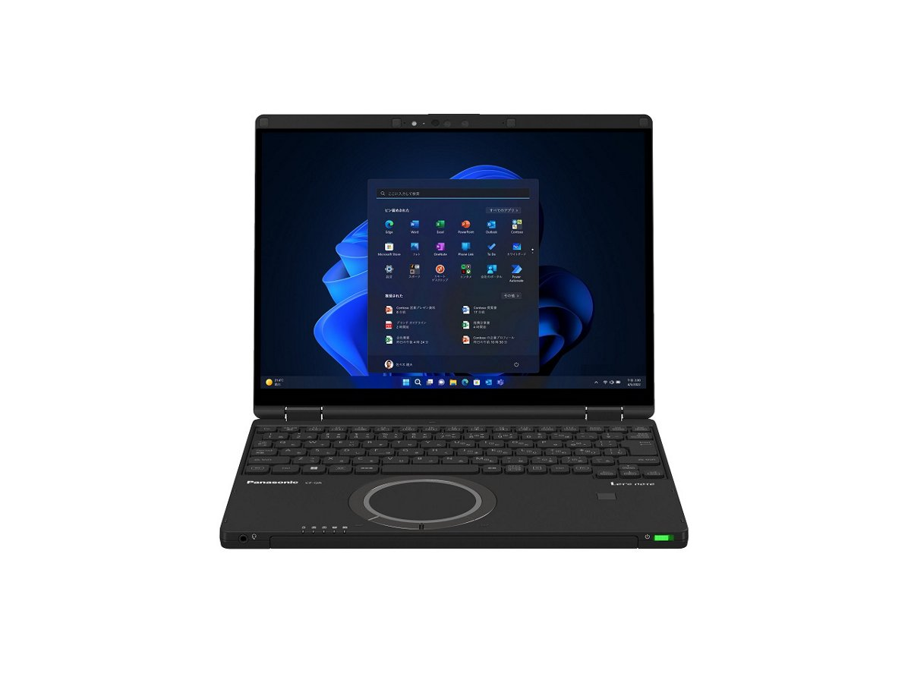
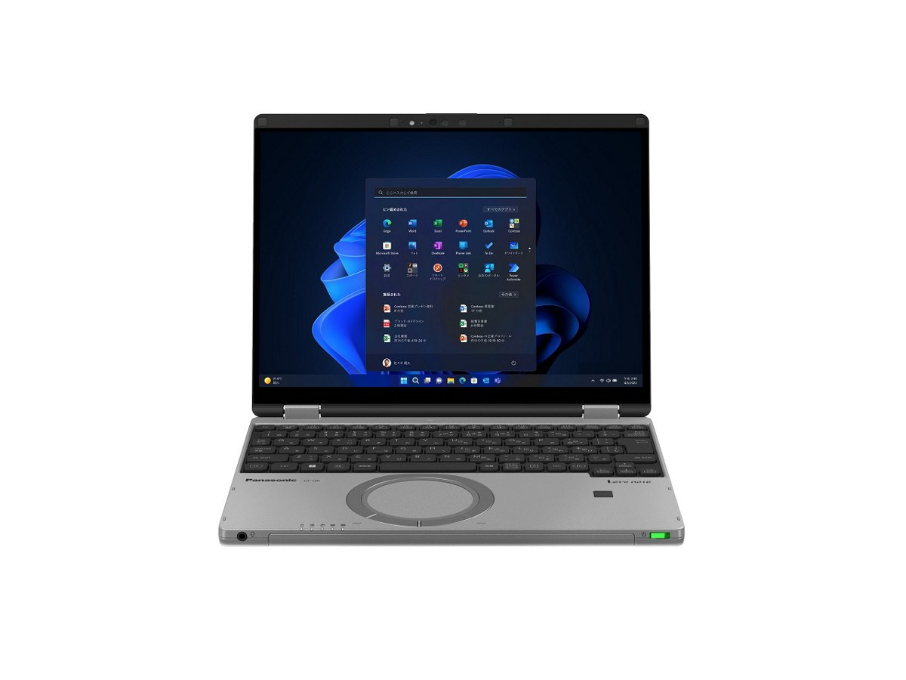
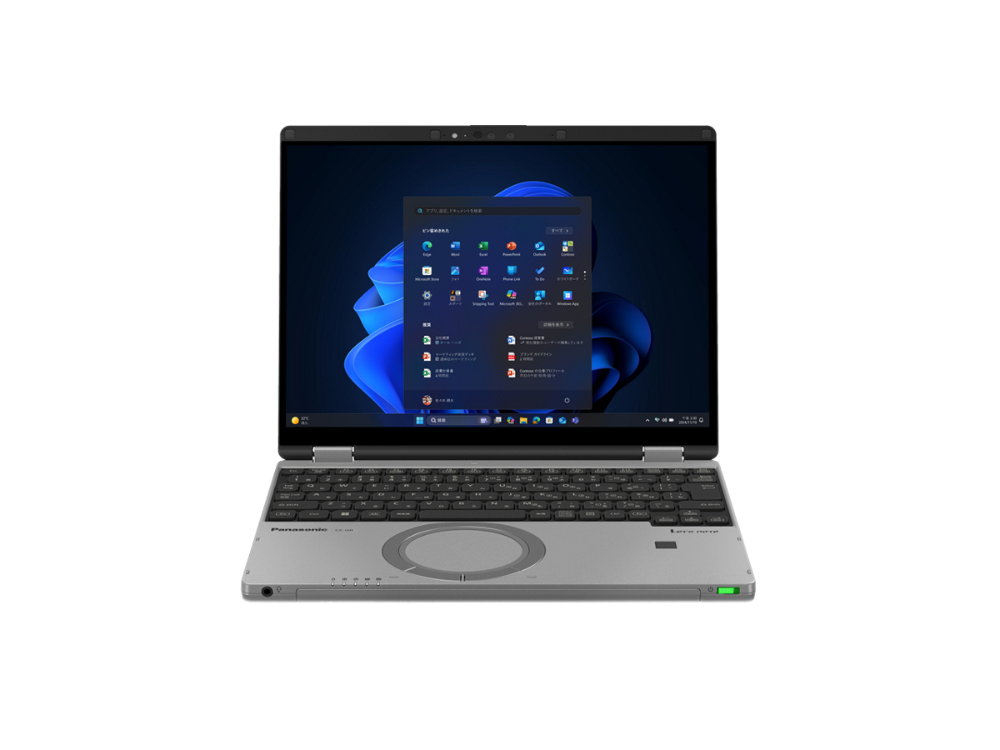
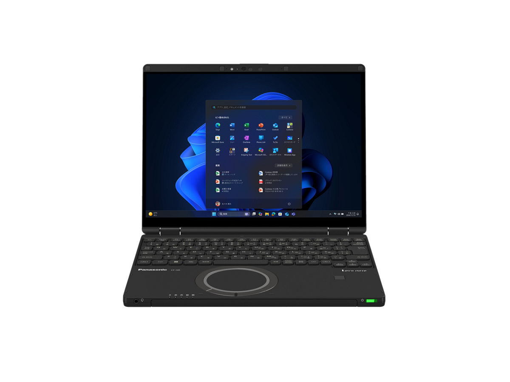

# Panasonic Let's note CF-QR4 Specifications

**English** · [日本語](../../ja/CF-QR4/) · [中文](../../zh/CF-QR4/)

🗄️ See this model in the [Let's note Cabinet](https://letsnote-specs.github.io/en/CF-QR4/).

**CF-QR4** is a Panasonic Let's note laptop in the QR series with a 12.4-inch FHD+ display. This page lists all 7 part numbers, released 2023-06 – 2025-01. Each part number links to its official spec sheet.

*Panasonic Let's note CF-QR4 (CF-QR4FDNCR, CF-QR4BFPCR), black. Image © Panasonic.*

## Part numbers

| Part number | Released | Discontinued | Summary |
| :-- | :-- | :-- | :-- |
| [CF-QR4JDTCR](https://panasonic.jp/pc/p-db/CF-QR4JDTCR_spec.html) | — | On sale | — |
| [CF-QR4KDNCR](https://panasonic.jp/pc/p-db/CF-QR4KDNCR_spec.html) | — | On sale | — |
| [CF-QR4HDNCR](https://panasonic.jp/pc/p-db/CF-QR4HDNCR_spec.html) | 2025-01 | 2026-03 | Windows 11 Pro 64-bit, Intel® CoreTM i7-1360P Processor, Memory: 16GB (no free slots), SSD: 512GB, LAN, Wireless LAN 802.11a (W52/W53/W56)/b/g/n/ac/ax (including 6GHz band), Microsoft 365 Basic + Office Home & Business 2024 |
| [CF-QR4FDNCR](https://panasonic.jp/pc/p-db/CF-QR4FDNCR_spec.html) | 2024-06 | 2025-08 | Windows 11 Pro 64-bit, Intel® CoreTM i7-1360P Processor, Memory: 16GB (no free slots), SSD: 512GB, LAN, Wireless LAN 802.11a (W52/W53/W56)/b/g/n/ac/ax (including 6GHz band), Microsoft® Office Home and Business 2021 |
| [CF-QR4ADTCR](https://panasonic.jp/pc/p-db/CF-QR4ADTCR_spec.html) | 2023-06 | 2025-01 | Windows 11 Pro 64-bit, Intel®, CoreTM i5-1335U Processor, Memory: 16GB (no free slots), SSD: 512GB, LAN, Wireless LAN 802.11a (W52/W53/W56)/b/g/n/ac/ax (including 6GHz band) |
| [CF-QR4BFPCR](https://panasonic.jp/pc/p-db/CF-QR4BFPCR_spec.html) | 2023-06 | 2023-10 | Windows 11 Pro 64-bit, Intel®, CoreTM i7-1360P Processor, Memory: 16GB (no free slots), SSD: 512GB, LAN, Wireless LAN 802.11a (W52/W53/W56)/b/g/n/ac/ax (including 6GHz band), LTE-compatible Wireless WAN, Microsoft® Office Home and Business 2021 |
| [CF-QR4ADMCR](https://panasonic.jp/pc/p-db/CF-QR4ADMCR_spec.html) | 2023-06 | 2023-10 | Windows 11 Pro 64-bit, Intel®, CoreTM i5-1335U Processor, Memory: 16GB (no free slots), SSD: 512GB, LAN, Wireless LAN 802.11a (W52/W53/W56)/b/g/n/ac/ax (including 6GHz band), Microsoft® Office Home and Business 2021 |

## Common specifications

| Item | Value |
| :-- | :-- |
| OS | Windows 11 Pro |
| Chipset | Built into CPU |
| Storage | SSD: 512GB (PCIe) / Of the above capacity, approx. 15GB is used as recovery area and approx. 1GB as system area (unavailable to user) |
| Optical drive | Not equipped |
| Display / Graphics | Intel® Iris® Xᵉ Graphics (built into CPU) |
| Display / LCD colors | 1920×1280 dots: approx. 16.77 million colors |
| Wired LAN | 1000BASE-T/100BASE-TX/10BASE-T |
| Memory expansion slot | None |
| Microphone | Array microphone |
| Sensors | Illuminance (brightness), AI sensor, gyro, acceleration |
| Keyboard | OADG-compliant keyboard (86 keys): Key pitch 19mm (horizontal)/15.5mm (vertical) (excluding some keys) |
| Pointing device | High-precision touchpad-compatible wheel pad / capacitive touch panel (10-finger support) |
| Power consumption | Max approx. 65W |
| Efficiency target achievement | — |
| Dimensions (W×D×H) | Width 273.2mm × Depth 208.9mm × Height 19.9mm (excluding protrusions) |

## Differences by part number

| Part number | CPU | Memory | Storage | Weight | Battery life |
| :-- | :-- | :-- | :-- | :-- | :-- |
| CF-QR4JDTCR | Core i5-1335U | 16GB LPDDR4X SDRAM | 512GB | 1.029 kg | 7.6 h |
| CF-QR4KDNCR | Core i7-1360P | 16GB LPDDR4X SDRAM | 512GB | 1.029 kg | 7.6 h |
| CF-QR4HDNCR | Core i7-1360P | 16GB LPDDR4X SDRAM | 512GB | 1.029 kg | 7.6 h |
| CF-QR4FDNCR | Core i7-1360P | 16GB LPDDR4X SDRAM | 512GB | 1.029 kg | 7.6 h |
| CF-QR4ADTCR | Core i5-1335U | 16GB LPDDR4x SDRAM | 512GB | 1.029 kg | 7 h |
| CF-QR4BFPCR | Core i7-1360P | 16GB LPDDR4x SDRAM | 512GB | 1.049 kg | 7 h |
| CF-QR4ADMCR | Core i5-1335U | 16GB LPDDR4x SDRAM | 512GB | 1.029 kg | 7 h |

CF-QR4JDTCR: all differing specifications

| Item | Value |
| :-- | :-- |
| CPU | Intel® Core™ i5-1335U Processor / P-core: max turbo frequency 4.60 GHz / E-core: max turbo frequency 3.40 GHz / Cores: 10 cores/Cache: 12MB |
| Memory | 16GB LPDDR4X SDRAM (no expansion slot) |
| Display | 12.4-inch (3:2) FHD+ TFT color LCD (1920 x 1280 dots) (capacitive multi-touch panel, with anti-reflection protective film) / External display output Max.: 1920×1200: approx. 16.77 million colors, HDMI output/USB Type-C (5Gbps) port, Max.: 4096×2160 (30 Hz/60 Hz) / Simultaneous main unit + external display Max.: 1920×1200: approx. 16.77 million colors, HDMI output/USB Type-C (5Gbps) port, 1920×1280 dots: approx. 16.77 million colors |
| Wireless LAN | Wi-Fi 6E compatible IEEE802.11a/b/g/n/ac/ax (including 6GHz band) compliant (5GHz channel band: W52/W53/W56) WPA3, WPA2-AES/TKIP compatible |
| Wireless WAN | Not equipped |
| Bluetooth | Bluetooth v5.3 / ■Supported profiles / 【Classic】 / ・A2DP (Source) / ・AVRCP (Target) / ・HCRP (Client) / ・HFP (AG) / ・HID (Host) / ・OPP (Client and Server) / ・PAN (User) / ・SPP (DevA and DevB) / 【Low Energy】 / ・HOGP (Host) |
| Audio | PCM sound source (24-bit stereo), Intel® High Definition Audio compliant, stereo speakers (box-type speakers) |
| Security | TPM (TCG V2.0 compliant) / Fingerprint sensor: touch type |
| Security (Windows Hello) | Windows Hello Enhanced Sign-in Security compatible |
| SD card slot | SD memory card slot ×1 slot (SDHC memory card/SDXC memory card support/copyright protection technology support/UHS-I・UHS-II high-speed transfer support) |
| Camera | Effective pixels: FHD 1920×1080 pixels (approx. 2.07 million pixels), 30fps, Windows Hello face recognition support |
| Ports | ・USB Type-C port (Thunderbolt™4 supported, USB Power Delivery supported) ×2 / ・USB Type-A (5Gbps) port ×3 (one of which also supports smartphone charging) / ・LAN connector (RJ-45) / ・External display connector (analog RGB mini D-sub 15 pin) / ・HDMI output terminal / ・Headset terminal (microphone input + audio output) (headset mini jack 3.5mm (M3)), CTIA compliant) |
| Power | ▼AC adapter / Input: AC100V–240V (50Hz/60Hz), Output: DC5V: max 3A, DC9V: max 3A, DC15V: max 3A, DC20V: max 3.25A, power cord for 100V only (USB Power Delivery supported) / ▼Battery pack (standard) / 11.55V lithium-ion, rated capacity 4300mAh |
| Energy efficiency | Target year FY2022 12 categories 17.2 [kWh/year] |
| Battery life / charge time | ▼Battery life / (JEITA Ver.3.0) / approx. 7.6 hours (video playback), approx. 19.8 hours (idle) [With supplied battery pack (standard) installed] / ▼Charging time / Max 3 hours (power off) / Max 3 hours (power on) |
| Color | Calm Gray |
| Weight (with battery) | PC body: approx. 1.029kg (when equipped with included battery pack (standard approx. 270g)) / AC adapter: approx. 140g (excluding power cord (approx. 60g) and USB connection cable (approx. 36g)) |
| Software | ・Microsoft® Edge / ・McAfee LiveSafe (60-day free trial version) / ・i-Filter for Multi-Device (30-day free trial version) / ・WinZip (45-day trial version) / ・Aptio Setup / ・PC-Diagnostic Utility / ・Panasonic PC Setting Utility / ・PC Information Viewer / ・Panasonic PC Camera Utility / ・Panasonic PC Comfort NAVI / ・Panasonic PC VVork / ・Panasonic AI Device Controller |
| Accessories | AC adapter (USB Power Delivery compatible), battery pack (standard), instruction manual, etc. |

Official spec sheet: <https://panasonic.jp/pc/p-db/CF-QR4JDTCR_spec.html>

CF-QR4KDNCR: all differing specifications

| Item | Value |
| :-- | :-- |
| CPU | Intel® Core™ i7-1360P Processor / P-core: max turbo frequency 5.00 GHz / E-core: max turbo frequency 3.70 GHz / Cores: 12 cores/Cache: 18MB |
| Memory | 16GB LPDDR4X SDRAM (no expansion slot) |
| Display | 12.4-inch (3:2) FHD+ TFT color LCD (1920 x 1280 dots) (capacitive multi-touch panel, with anti-reflection protective film) / External display output Max.: 1920×1200: approx. 16.77 million colors, HDMI output/USB Type-C (5Gbps) port, Max.: 4096×2160 (30 Hz/60 Hz) / Simultaneous main unit + external display Max.: 1920×1200: approx. 16.77 million colors, HDMI output/USB Type-C (5Gbps) port, 1920×1280 dots: approx. 16.77 million colors |
| Wireless LAN | Wi-Fi 6E compatible IEEE802.11a/b/g/n/ac/ax (including 6GHz band) compliant (5GHz channel band: W52/W53/W56) WPA3, WPA2-AES/TKIP compatible |
| Wireless WAN | Not equipped |
| Bluetooth | Bluetooth v5.3 / ■Supported profiles / 【Classic】 / ・A2DP (Source) / ・AVRCP (Target) / ・HCRP (Client) / ・HFP (AG) / ・HID (Host) / ・OPP (Client and Server) / ・PAN (User) / ・SPP (DevA and DevB) / 【Low Energy】 / ・HOGP (Host) |
| Audio | PCM sound source (24-bit stereo), Intel® High Definition Audio compliant, stereo speakers (box-type speakers) |
| Security | TPM (TCG V2.0 compliant) / Fingerprint sensor: touch type |
| Security (Windows Hello) | Windows Hello Enhanced Sign-in Security compatible |
| SD card slot | SD memory card slot ×1 slot (SDHC memory card/SDXC memory card support/copyright protection technology support/UHS-I・UHS-II high-speed transfer support) |
| Camera | Effective pixels: FHD 1920×1080 pixels (approx. 2.07 million pixels), 30fps, Windows Hello face recognition support |
| Ports | ・USB Type-C port (Thunderbolt™4 supported, USB Power Delivery supported) ×2 / ・USB Type-A (5Gbps) port ×3 (one of which also supports smartphone charging) / ・LAN connector (RJ-45) / ・External display connector (analog RGB mini D-sub 15 pin) / ・HDMI output terminal / ・Headset terminal (microphone input + audio output) (headset mini jack 3.5mm (M3)), CTIA compliant) |
| Power | ▼AC adapter / Input: AC100V–240V (50Hz/60Hz), Output: DC5V: max 3A, DC9V: max 3A, DC15V: max 3A, DC20V: max 3.25A, power cord for 100V only (USB Power Delivery supported) / ▼Battery pack (standard) / 11.55V lithium-ion, rated capacity 4300mAh |
| Energy efficiency | Target year FY2022 12 categories 17.2 [kWh/year] |
| Battery life / charge time | ▼Battery life / (JEITA Ver.3.0) / approx. 7.6 hours (video playback), approx. 19.8 hours (idle) [With supplied battery pack (standard) installed] / ▼Charging time / Max 3 hours (power off) / Max 3 hours (power on) |
| Color | Black |
| Weight (with battery) | PC body: approx. 1.029kg (when equipped with included battery pack (standard approx. 270g)) / AC adapter: approx. 140g (excluding power cord (approx. 60g) and USB connection cable (approx. 36g)) |
| Software | ・Microsoft® Edge / ・McAfee LiveSafe (60-day free trial version) / ・i-Filter for Multi-Device (30-day free trial version) / ・WinZip (45-day trial version) / ・Aptio Setup / ・PC-Diagnostic Utility / ・Panasonic PC Setting Utility / ・PC Information Viewer / ・Panasonic PC Camera Utility / ・Panasonic PC Comfort NAVI / ・Panasonic PC VVork / ・Panasonic AI Device Controller |
| Accessories | AC adapter (USB Power Delivery compatible), battery pack (standard), instruction manual, etc. |
| Microsoft Office | Microsoft 365 Basic + Office Home & Business 2024 |

Official spec sheet: <https://panasonic.jp/pc/p-db/CF-QR4KDNCR_spec.html>

CF-QR4HDNCR: all differing specifications

| Item | Value |
| :-- | :-- |
| CPU | Intel® Core™ i7-1360P Processor / P-core: max turbo frequency 5 GHz / E-core: max turbo frequency 3.70 GHz / Cores: 12 cores/Cache: 18MB |
| Memory | 16GB LPDDR4X SDRAM (no expansion slot) |
| Display | 12.4-inch (3:2) FHD+ TFT color LCD (1920 x 1280 dots) (capacitive multi-touch panel, with anti-reflection protective film) |
| Wireless LAN | Wi-Fi 6E compatible IEEE802.11a/b/g/n/ac/ax (including 6 GHz band) compliant (5 GHz channel band: W52/W53/W56) WPA3, WPA2-AES/TKIP compatible |
| Wireless WAN | Not equipped |
| Bluetooth | Bluetooth v5.3 / ■Supported profiles / 【Classic】 / ・A2DP (Source) / ・AVRCP (Target) / ・HCRP (Client) / ・HFP (AG) / ・HID (Host) / ・OPP (Client and Server) / ・PAN (User) / ・SPP (DevA and DevB) / 【Low Energy】 / ・HOGP (Host) |
| Audio | PCM sound source (24-bit stereo), Intel® High Definition Audio compliant, stereo speakers |
| Security (Windows Hello) | Face recognition-compatible camera / Fingerprint sensor (touch type) |
| SD card slot | SD memory card slot ×1 slot (SDHC memory card/SDXC memory card support/copyright protection technology support/UHS-I・UHS-II high-speed transfer support) |
| Camera | Face recognition-compatible camera (AI sensor support), effective pixels: max. 1920x1080 pixels (approx. 2.07 megapixels) |
| Ports | ・USB3.1 Type-C port ×2 (Thunderbolt™4 supported, USB Power Delivery supported) / ・USB3.0 Type-A port ×3 (one of which also supports smartphone charging) / ・LAN connector (RJ-45) / ・External display connector (analog RGB mini D-sub 15 pin) / ・HDMI output terminal (4K60Hz output supported) / ・Headset terminal (microphone input + audio output) (headset mini jack 3.5mm, CTIA compliant) |
| Power | ▼AC adapter / Input: AC100V–240V, 50Hz/60Hz, Output: DC20V, 3.25A, power cord for 100V only (USB Power Delivery compatible) / ▼Battery pack (standard) / 11.55V lithium-ion, rated capacity 4300mAh |
| Energy efficiency | Target year FY2022 12 categories 17.2 [kWh/year] |
| Battery life / charge time | ▼Battery life / (JEITA Ver.3.0) / approx. 7.6 hours (video playback), approx. 19.8 hours (idle) / [With supplied battery pack (standard) installed] / ▼Charging time / Max 3 hours (power off) / Max 3 hours (power on) |
| Color | Black |
| Weight (with battery) | PC body: approx. 1.029kg (when equipped with included battery pack (standard approx. 270g)) / AC adapter: approx. 140g (excluding power cord (approx. 60g) and USB connection cable (approx. 36g)) |
| Software | ・Microsoft® Edge / ・McAfee LiveSafe (60-day free trial version) / ・i-Filter for Multi-Device (30-day free trial version) / ・WinZip (45-day trial version) / ・Aptio Setup / ・PC-Diagnostic Utility / ・Panasonic PC Setting Utility / ・PC Information Viewer / ・Panasonic PC Camera Utility / ・Panasonic PC Comfort NAVI / ・Panasonic PC VVork / ・Panaosnic AI Device Controller |
| Accessories | Battery pack (standard), AC adapter (USB Power Delivery compatible), instruction manual, etc. |
| Microsoft Office | Microsoft 365 Basic + Office Home & Business 2024 |
| Display / External output | Max: 1920×1200: approx. 16.77 million colors / (only for the following HDMI output/USB3.1 Type-C port) / Max: 4096×2160 (30 Hz/60 Hz) |
| Display / Simultaneous display | Max: 1920×1200: approx. 16.77 million colors / (only for the following HDMI output/USB3.1 Type-C port) / Max: 1920×1280: approx. 16.77 million colors |
| Security chip | TPM (TCG V2.0 compliant) |

Official spec sheet: <https://panasonic.jp/pc/p-db/CF-QR4HDNCR_spec.html>

CF-QR4FDNCR: all differing specifications

| Item | Value |
| :-- | :-- |
| CPU | Intel® Core™ i7-1360P Processor / P-core: max turbo frequency 5 GHz / E-core: max turbo frequency 3.70 GHz / Cores: 12 cores/Cache: 18MB |
| Memory | 16GB LPDDR4X SDRAM (no expansion slot) |
| Display | 12.4-inch (3:2) FHD+ TFT color LCD (1920 x 1280 dots) (capacitive multi-touch panel, with anti-reflection protective film) |
| Wireless LAN | Wi-Fi 6E compatible IEEE802.11a/b/g/n/ac/ax (including 6 GHz band) compliant (5 GHz channel band: W52/W53/W56) WPA3, WPA2-AES/TKIP compatible |
| Wireless WAN | Not equipped |
| Bluetooth | Bluetooth v5.3 / ■Supported profiles / 【Classic】 / ・A2DP (Source) / ・AVRCP (Target) / ・HCRP (Client) / ・HFP (AG) / ・HID (Host) / ・OPP (Client and Server) / ・PAN (User) / ・SPP (DevA and DevB) / 【Low Energy】 / ・HOGP (Host) |
| Audio | PCM sound source (24-bit stereo), Intel® High Definition Audio compliant, stereo speakers |
| Security (Windows Hello) | Face recognition-compatible camera / Fingerprint sensor (touch type) |
| SD card slot | SD memory card slot ×1 slot (SDHC memory card/SDXC memory card support/copyright protection technology support/UHS-I・UHS-II high-speed transfer support) |
| Camera | Face recognition-compatible camera (AI sensor support), effective pixels: max. 1920x1080 pixels (approx. 2.07 megapixels) |
| Ports | ・USB3.1 Type-C port ×2 (Thunderbolt™4 supported, USB Power Delivery supported) / ・USB3.0 Type-A port ×3 (one of which also supports smartphone charging) / ・LAN connector (RJ-45) / ・External display connector (analog RGB mini D-sub 15 pin) / ・HDMI output terminal (4K60Hz output supported) / ・Headset terminal (microphone input + audio output) (headset mini jack 3.5mm, CTIA compliant) |
| Power | ▼AC adapter / Input: AC100V–240V, 50Hz/60Hz, Output: DC20V, 3.25A, power cord for 100V only (USB Power Delivery compatible) / ▼Battery pack (standard) / 11.55V lithium-ion, rated capacity 4300mAh |
| Energy efficiency | Target year FY2022 12 categories 17.2 [kWh/year] |
| Battery life / charge time | ▼Battery life / (JEITA Ver.3.0) / approx. 7.6 hours (video playback), approx. 19.8 hours (idle) / [With supplied battery pack (standard) installed] / ▼Charging time / Max 3 hours (power off) / Max 3 hours (power on) |
| Color | Black |
| Weight (with battery) | PC body: approx. 1.029kg (when equipped with included battery pack (standard approx. 270g)) / AC adapter: approx. 140g (excluding power cord (approx. 60g) and USB connection cable (approx. 36g)) |
| Software | ・Microsoft® Edge / ・McAfee LiveSafe (60-day free trial version) / ・i-Filter for Multi-Device (30-day free trial version) / ・WinZip (45-day trial version) / ・Aptio Setup / ・PC-Diagnostic Utility / ・Panasonic PC Setting Utility / ・PC Information Viewer / ・Panasonic PC Camera Utility / ・Panasonic PC Comfort NAVI / ・Panasonic PC VVork / ・Panaosnic AI Device Controller |
| Accessories | Battery pack (standard), AC adapter (USB Power Delivery compatible), instruction manual, etc. |
| Microsoft Office | Microsoft® Office Home and Business 2021 |
| Display / External output | Max: 1920×1200: approx. 16.77 million colors / (only for the following HDMI output/USB3.1 Type-C port) / Max: 4096×2160 (30 Hz/60 Hz) |
| Display / Simultaneous display | Max: 1920×1200: approx. 16.77 million colors / (only for the following HDMI output/USB3.1 Type-C port) / Max: 1920×1280: approx. 16.77 million colors |
| Security chip | TPM (TCG V2.0 compliant) |

Official spec sheet: <https://panasonic.jp/pc/p-db/CF-QR4FDNCR_spec.html>

CF-QR4ADTCR: all differing specifications

| Item | Value |
| :-- | :-- |
| CPU | Intel® Core™ i5-1335U Processor / P-core: max turbo frequency 4.60 GHz / E-core: max turbo frequency 3.40 GHz / Cores: 10 cores/Cache: 12MB |
| Memory | 16GB LPDDR4x SDRAM (no expansion slot) |
| Display | 12.4-inch (3:2) FHD+ TFT color LCD (1920 x 1280 dots) (capacitive multi-touch panel, with anti-reflection protective film) |
| Wireless LAN | Wi-Fi 6E compatible IEEE802.11a/b/g/n/ac/ax (including 6 GHz band) compliant (5 GHz channel band: W52/W53/W56) WPA3, WPA2-AES/TKIP compatible |
| Wireless WAN | Not equipped |
| Bluetooth | Bluetooth v5.1 / ■Supported profiles / 【Classic】 / ・A2DP (Source) / ・AVRCP (Target) / ・HCRP (Client) / ・HFP (AG) / ・HID (Host) / ・OPP (Client and Server) / ・PAN (User) / ・SPP (DevA and DevB) / 【Low Energy】 / ・HOGP (Host) |
| Audio | PCM sound source (24-bit stereo), Intel® High Definition Audio compliant, stereo speakers |
| Security (Windows Hello) | Face recognition-compatible camera / Fingerprint sensor (touch type) |
| SD card slot | SD memory card ×1 slot (SDHC memory card/SDXC memory card support/copyright protection technology support/UHS-I・UHS-II high-speed transfer support) |
| Camera | Face recognition-compatible camera (AI sensor support), effective pixels: max. 1920x1080 pixels (approx. 2.07 megapixels) |
| Ports | ・USB3.1 Type-C port ×2 (Thunderbolt™4 supported, USB Power Delivery supported) / ・USB3.0 Type-A port ×3 (one of which also supports smartphone charging) / ・LAN connector (RJ-45) / ・External display connector (analog RGB mini D-sub 15 pin) / ・HDMI output terminal (4K60p output supported) / ・Headset terminal (microphone input + audio output) (headset mini jack 3.5mm, CTIA compliant) |
| Power | ▼AC adapter / Input: AC100V–240V, 50Hz/60Hz, Output: DC16V, 4.06A, power cord for 100V only / ▼Battery pack (standard) / 11.55V lithium-ion, rated capacity 4300mAh |
| Energy efficiency | Target year FY2022 12 categories 17.9 [kWh/year] |
| Battery life / charge time | ▼Battery life / (JEITA Ver.3.0) / approx. 7 hours (video playback), approx. 15.5 hours (idle) / [With supplied battery pack (standard) installed] / ▼Charging time / Max 3 hours (power off) / Max 3 hours (power on) |
| Color | Calm Gray |
| Weight (with battery) | PC body: approx. 1.029kg (when equipped with included battery pack (approx. 270g)) / AC adapter: approx. 220g (excluding power cord (approx. 60g)) |
| Software | ・Microsoft® Edge / ・Microsoft® .NET Framework 4.8 / ・McAfee LiveSafe (60-day free trial version) / ・i-Filter for Multi-Device (30-day free trial version) / ・WinZip (45-day trial version) / ・Aptio Setup / ・PC-Diagnostic Utility / ・Panasonic PC Setting Utility / ・DirectX 12 / ・PC Information Viewer / ・Panasonic PC Camera Utility / ・Panasonic PC Comfort NAVI / ・Panasonic PC VVork / ・Panaosnic PC AI Device Controller |
| Accessories | Battery pack (standard), AC adapter, dedicated cloth, instruction manual |
| Display / External output | Max: 1920×1200: approx. 16.77 million colors / (only for the following HDMI output/USB3.1 Type-C port) / Max: 4096×2160 (30 Hz/60 Hz) |
| Display / Simultaneous display | Max: 1920×1200: approx. 16.77 million colors / (only for the following HDMI output/USB3.1 Type-C port) / Max: 1920×1280: approx. 16.77 million colors |
| Security chip | TPM (TCG V2.0 compliant) |
| Video memory | Shared with main memory |
| Notes | — |

Official spec sheet: <https://panasonic.jp/pc/p-db/CF-QR4ADTCR_spec.html>

CF-QR4BFPCR: all differing specifications

| Item | Value |
| :-- | :-- |
| CPU | Intel® Core™ i7-1360P Processor / P-core: max turbo frequency 5 GHz / E-core: max turbo frequency 3.70 GHz / Cores: 12 cores/Cache: 18MB |
| Memory | 16GB LPDDR4x SDRAM (no expansion slot) |
| Display | 12.4-inch (3:2) FHD+ TFT color LCD (1920 x 1280 dots) (capacitive multi-touch panel, with anti-reflection protective film) |
| Wireless LAN | Wi-Fi 6E compatible IEEE802.11a/b/g/n/ac/ax (including 6 GHz band) compliant (5 GHz channel band: W52/W53/W56) WPA3, WPA2-AES/TKIP compatible |
| Wireless WAN | LTE supported / (Dual SIM (nano SIM card + eSIM) supported) |
| Bluetooth | Bluetooth v5.1 / ■Supported profiles / 【Classic】 / ・A2DP (Source) / ・AVRCP (Target) / ・HCRP (Client) / ・HFP (AG) / ・HID (Host) / ・OPP (Client and Server) / ・PAN (User) / ・SPP (DevA and DevB) / 【Low Energy】 / ・HOGP (Host) |
| Audio | PCM sound source (24-bit stereo), Intel® High Definition Audio compliant, stereo speakers |
| Security (Windows Hello) | Face recognition-compatible camera / Fingerprint sensor (touch type) |
| Camera | Face recognition-compatible camera (AI sensor support), effective pixels: max. 1920x1080 pixels (approx. 2.07 megapixels) |
| Ports | ・USB3.1 Type-C port ×2 (Thunderbolt™4 supported, USB Power Delivery supported) / ・USB3.0 Type-A port ×3 (one of which also supports smartphone charging) / ・LAN connector (RJ-45) / ・External display connector (analog RGB mini D-sub 15 pin) / ・HDMI output terminal (4K60p output supported) / ・Headset terminal (microphone input + audio output) (headset mini jack 3.5mm, CTIA compliant) |
| Power | ▼AC adapter / Input: AC100V–240V, 50Hz/60Hz, Output: DC16V, 4.06A, power cord for 100V only / ▼Battery pack (standard) / 11.55V lithium-ion, rated capacity 4300mAh |
| Energy efficiency | Target year FY2022 12 categories 17.9 [kWh/year] |
| Battery life / charge time | ▼Battery life / (JEITA Ver.3.0) / approx. 7 hours (video playback), approx. 15.5 hours (idle) / [With supplied battery pack (standard) installed] / ▼Charging time / Max 3 hours (power off) / Max 3 hours (power on) |
| Color | Black |
| Weight (with battery) | PC body: approx. 1.049kg (when equipped with included battery pack (approx. 270g)) / AC adapter: approx. 220g (excluding power cord (approx. 60g)) |
| Software | ・Microsoft® Edge / ・Microsoft® .NET Framework 4.8 / ・McAfee LiveSafe (60-day free trial version) / ・i-Filter for Multi-Device (30-day free trial version) / ・WinZip (45-day trial version) / ・Aptio Setup / ・PC-Diagnostic Utility / ・Panasonic PC Setting Utility / ・DirectX 12 / ・PC Information Viewer / ・Panasonic PC Camera Utility / ・Panasonic PC Comfort NAVI / ・Panasonic PC VVork / ・Panaosnic PC AI Device Controller |
| Accessories | Battery pack (standard), AC adapter, dedicated cloth, instruction manual, Microsoft Office Home & Business 2021, etc. |
| Microsoft Office | Microsoft® Office Home and Business 2021 |
| Display / External output | Max: 1920×1200: approx. 16.77 million colors / (only for the following HDMI output/USB3.1 Type-C port) / Max: 4096×2160 (30 Hz/60 Hz) |
| Display / Simultaneous display | Max: 1920×1200: approx. 16.77 million colors / (only for the following HDMI output/USB3.1 Type-C port) / Max: 1920×1280: approx. 16.77 million colors |
| Security chip | TPM (TCG V2.0 compliant) |
| Video memory | Shared with main memory |
| Notes | — |
| Card slots / SD card | SD memory card ×1 slot (SDHC memory card/SDXC memory card support/copyright protection technology support/UHS-I・UHS-II high-speed transfer support) |
| Card slots / Other | nano SIM card slot |

Official spec sheet: <https://panasonic.jp/pc/p-db/CF-QR4BFPCR_spec.html>

CF-QR4ADMCR: all differing specifications

| Item | Value |
| :-- | :-- |
| CPU | Intel® Core™ i5-1335U Processor / P-core: max turbo frequency 4.60 GHz / E-core: max turbo frequency 3.40 GHz / Cores: 10 cores/Cache: 12MB |
| Memory | 16GB LPDDR4x SDRAM (no expansion slot) |
| Display | 12.4-inch (3:2) FHD+ TFT color LCD (1920 x 1280 dots) (capacitive multi-touch panel, with anti-reflection protective film) |
| Wireless LAN | Wi-Fi 6E compatible IEEE802.11a/b/g/n/ac/ax (including 6 GHz band) compliant (5 GHz channel band: W52/W53/W56) WPA3, WPA2-AES/TKIP compatible |
| Wireless WAN | Not equipped |
| Bluetooth | Bluetooth v5.1 / ■Supported profiles / 【Classic】 / ・A2DP (Source) / ・AVRCP (Target) / ・HCRP (Client) / ・HFP (AG) / ・HID (Host) / ・OPP (Client and Server) / ・PAN (User) / ・SPP (DevA and DevB) / 【Low Energy】 / ・HOGP (Host) |
| Audio | PCM sound source (24-bit stereo), Intel® High Definition Audio compliant, stereo speakers |
| Security (Windows Hello) | Face recognition-compatible camera / Fingerprint sensor (touch type) |
| SD card slot | SD memory card ×1 slot (SDHC memory card/SDXC memory card support/copyright protection technology support/UHS-I・UHS-II high-speed transfer support) |
| Camera | Face recognition-compatible camera (AI sensor support), effective pixels: max. 1920x1080 pixels (approx. 2.07 megapixels) |
| Ports | ・USB3.1 Type-C port ×2 (Thunderbolt™4 supported, USB Power Delivery supported) / ・USB3.0 Type-A port ×3 (one of which also supports smartphone charging) / ・LAN connector (RJ-45) / ・External display connector (analog RGB mini D-sub 15 pin) / ・HDMI output terminal (4K60p output supported) / ・Headset terminal (microphone input + audio output) (headset mini jack 3.5mm, CTIA compliant) |
| Power | ▼AC adapter / Input: AC100V–240V, 50Hz/60Hz, Output: DC16V, 4.06A, power cord for 100V only / ▼Battery pack (standard) / 11.55V lithium-ion, rated capacity 4300mAh |
| Energy efficiency | Target year FY2022 12 categories 17.9 [kWh/year] |
| Battery life / charge time | ▼Battery life / (JEITA Ver.3.0) / approx. 7 hours (video playback), approx. 15.5 hours (idle) / [With supplied battery pack (standard) installed] / ▼Charging time / Max 3 hours (power off) / Max 3 hours (power on) |
| Color | Calm Gray |
| Weight (with battery) | PC body: approx. 1.029kg (when equipped with included battery pack (approx. 270g)) / AC adapter: approx. 220g (excluding power cord (approx. 60g)) |
| Software | ・Microsoft® Edge / ・Microsoft® .NET Framework 4.8 / ・McAfee LiveSafe (60-day free trial version) / ・i-Filter for Multi-Device (30-day free trial version) / ・WinZip (45-day trial version) / ・Aptio Setup / ・PC-Diagnostic Utility / ・Panasonic PC Setting Utility / ・DirectX 12 / ・PC Information Viewer / ・Panasonic PC Camera Utility / ・Panasonic PC Comfort NAVI / ・Panasonic PC VVork / ・Panaosnic PC AI Device Controller |
| Accessories | Battery pack (standard), AC adapter, dedicated cloth, instruction manual, Microsoft Office Home & Business 2021, etc. |
| Microsoft Office | Microsoft® Office Home and Business 2021 |
| Display / External output | Max: 1920×1200: approx. 16.77 million colors / (only for the following HDMI output/USB3.1 Type-C port) / Max: 4096×2160 (30 Hz/60 Hz) |
| Display / Simultaneous display | Max: 1920×1200: approx. 16.77 million colors / (only for the following HDMI output/USB3.1 Type-C port) / Max: 1920×1280: approx. 16.77 million colors |
| Security chip | TPM (TCG V2.0 compliant) |
| Video memory | Shared with main memory |
| Notes | — |

Official spec sheet: <https://panasonic.jp/pc/p-db/CF-QR4ADMCR_spec.html>

## Photos

*Panasonic Let's note CF-QR4 (CF-QR4ADTCR, CF-QR4ADMCR), calm gray. Image © Panasonic.*

*Panasonic Let's note CF-QR4 (CF-QR4HDNCR), black. Image © Panasonic.*

*Panasonic Let's note CF-QR4 (CF-QR4JDTCR), calm gray. Image © Panasonic.*

*Panasonic Let's note CF-QR4 (CF-QR4KDNCR), black. Image © Panasonic.*

## Related models

- [All Let's note models](../)

---

Source: Panasonic's official [discontinued-models list](https://panasonic.jp/pc/support/products/) and spec sheets (panasonic.jp), translated from Japanese; see the official sheets for the authoritative wording. Product images © Panasonic. This is an unofficial compilation, not affiliated with Panasonic.
