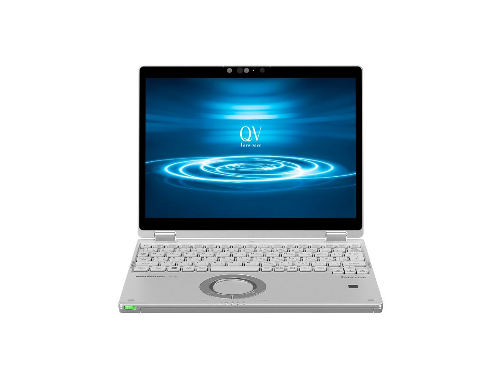
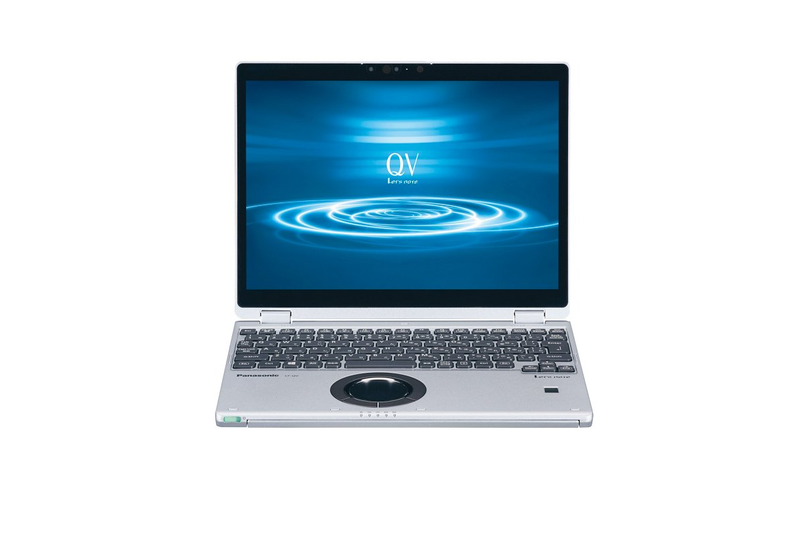
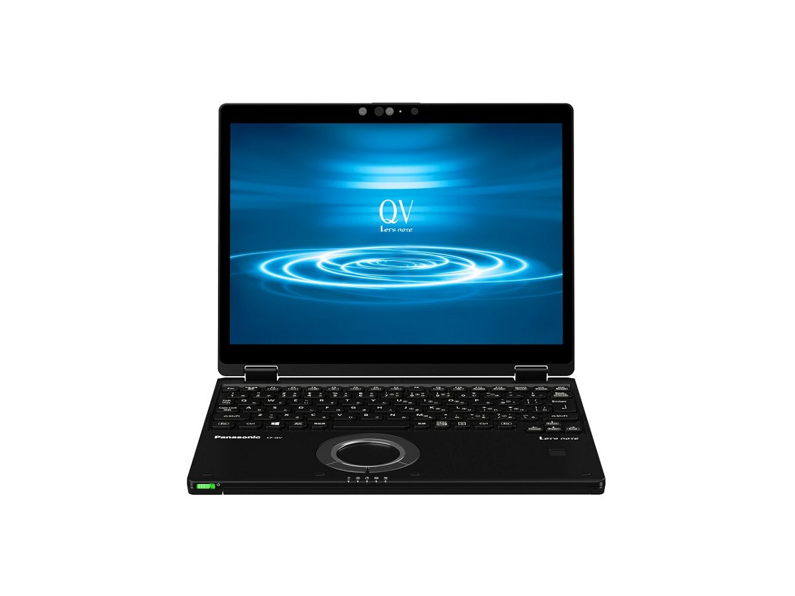

# Panasonic Let's note CF-QV8 Specifications

**English** · [日本語](../../ja/CF-QV8/) · [中文](../../zh/CF-QV8/)

🗄️ See this model in the [Let's note Cabinet](https://letsnote-specs.github.io/en/CF-QV8/).

**CF-QV8** is a Panasonic Let's note laptop in the QV series with a 12.0-inch WQXGA＋ display. This page lists all 7 part numbers, released 2019-10 – 2020-01. Each part number links to its official spec sheet.

*Panasonic Let's note CF-QV8 (CF-QV8NDGQR, CF-QV8FDGQR, CF-QV8FDPQR, CF-QV8GDGQR …), silver. Image © Panasonic.*

## Part numbers

| Part number | Released | Discontinued | Summary |
| :-- | :-- | :-- | :-- |
| [CF-QV8NDGQR](https://panasonic.jp/pc/p-db/CF-QV8NDGQR_spec.html) | 2020-01 | 2020-10 | Windows 10 Pro 64-bit, Intel® CoreTM i5-8265U processor, Memory: 8GB (no empty slot), SSD: 256GB, LAN, Wireless LAN 802.11a (W52/W53/W56)/b/g/n/ac, Microsoft® Office Home and Business 2019 |
| [CF-QV8NDMQR](https://panasonic.jp/pc/p-db/CF-QV8NDMQR_spec.html) | 2020-01 | 2020-10 | Windows 10 Pro 64-bit, Intel® CoreTM i5-8265U processor, Memory: 16GB (no free slot), SSD: 256GB, LAN, Wireless LAN 802.11a (W52/W53/W56)/b/g/n/ac, Microsoft® Office Home and Business 2019 |
| [CF-QV8PFNQR](https://panasonic.jp/pc/p-db/CF-QV8PFNQR_spec.html) | 2020-01 | 2020-10 | Windows 10 Pro 64-bit, Intel® CoreTM i7-8565U processor, Memory: 8GB (no empty slot), SSD: 512GB, LAN, Wireless LAN 802.11a (W52/W53/W56)/b/g/n/ac, Microsoft® Office Home and Business 2019 |
| [CF-QV8FDGQR](https://panasonic.jp/pc/p-db/CF-QV8FDGQR_spec.html) | 2019-10 | 2020-05 | Windows 10 Pro 64-bit, Intel® CoreTM i5-8265U processor, Memory: 8GB (no empty slot), SSD: 256GB, LAN, Wireless LAN 802.11a (W52/W53/W56)/b/g/n/ac, Microsoft® Office Home and Business 2019 |
| [CF-QV8FDPQR](https://panasonic.jp/pc/p-db/CF-QV8FDPQR_spec.html) | 2019-10 | 2020-05 | Windows 10 Pro 64-bit, Intel® CoreTM i5-8265U processor, Memory: 16GB (no empty slot), SSD: 256GB, LAN, Wireless LAN 802.11a (W52/W53/W56)/b/g/n/ac, Microsoft® Office Home and Business 2019 |
| [CF-QV8GDGQR](https://panasonic.jp/pc/p-db/CF-QV8GDGQR_spec.html) | 2019-10 | 2020-05 | Windows 10 Pro 64-bit, Intel® CoreTM i7-8565U processor, Memory: 8GB (no free slot), SSD: 256GB, LAN, Wireless LAN 802.11a (W52/W53/W56)/b/g/n/ac, Microsoft® Office Home and Business 2019 |
| [CF-QV8GFRQR](https://panasonic.jp/pc/p-db/CF-QV8GFRQR_spec.html) | 2019-10 | 2020-05 | Windows 10 Pro 64-bit, Intel® CoreTM i7-8565U processor, Memory: 8GB (no free slot), SSD: 512GB, LAN, Wireless LAN 802.11a (W52/W53/W56)/b/g/n/ac, LTE-compatible wireless WAN, Microsoft® Office Home and Business 2019 |

## Common specifications

| Item | Value |
| :-- | :-- |
| Chipset | Built into CPU |
| Optical drive | Not equipped |
| Display | 12.0-inch (3:2) WQXGA+ TFT color LCD (2880×1920 dots) (capacitive multi-touch panel, with anti-reflection protective film) |
| Display / Graphics | Intel® UHD Graphics 620 (built into CPU) |
| Display / LCD colors | 2880×1920 dots: approx. 16.77 million colors |
| Wireless communication | Intel® Wireless-AC 9560 |
| Wired LAN | 1000BASE-T/100BASE-TX/10BASE-T |
| Bluetooth | Bluetooth v5.0 / ■Supported profiles / 【Classic】 / ・A2DP (Source) / ・AVRCP (Target) / ・HCRP (Client) / ・HFP (AG) / ・HID (Host) / ・OPP (Client and Server) / ・PAN (User) / ・SPP (DevA and DevB) / 【Low Energy】 / ・HOGP (Host) |
| Audio | PCM sound source (24-bit stereo), Intel® High Definition Audio compliant, stereo speakers |
| Security chip | TPM (TCG V2.0 compliant) |
| Security (Windows Hello) | Face recognition-compatible camera / Fingerprint sensor (touch type) |
| Memory expansion slot | None |
| Camera | Face recognition-compatible camera, effective pixels: max. 1920x1080 pixels (approx. 2.07 megapixels) |
| Microphone | Array microphone |
| Sensors | Illuminance sensor / Geomagnetic sensor / Gyro sensor / Acceleration sensor |
| Ports | ・USB3.1 Type-C port (Thunderbolt™3, USB Power Delivery supported) / ・USB3.0 Type-A port ×3 (one of which also supports smartphone charging) / ・LAN connector (RJ-45) / ・External display connector (analog RGB mini D-sub 15 pin) / ・HDMI output terminal (4K60p output supported) / ・Headset terminal (microphone input + audio output) (headset mini jack 3.5mm, CTIA compliant) |
| Keyboard | OADG-compliant 86 keys, key pitch 19mm (horizontal)/15.2mm (vertical) (excluding some keys) |
| Pointing device | Wheel pad, electrostatic touch panel (10-finger support) |
| Power | ▼AC adapter / Input: AC100V–240V, 50Hz/60Hz, Output: DC16V, 4.06A, power cord for 100V only / ▼Battery pack / 7.6V lithium-ion, rated capacity 5020mAh |
| Power consumption | Max approx. 65W |
| Battery life / charge time | ▼Battery life / (JEITA Ver.2.0) / approx. 10 hours / ▼Charging time / approx. 2.5 hours (power OFF), approx. 2.5 hours (power ON) |
| Dimensions (W×D×H) | Width 273.0mm × Depth 209.2mm × Height 18.7mm (excluding protrusions) |
| Software | ・Microsoft® Internet Explorer 11 / ・Microsoft® Edge / ・Microsoft® .NET Framework 4.8 / ・Microsoft® Windows Media Player 12 / ・McAfee LiveSafe (60-day free trial) / ・i-Filter 6.0 (30-day free trial) / ・WinZip 20.5 Japanese version (45-day trial) / ・Aptio Setup Utility / ・PC-Diagnostic Utility / ・Panasonic PC Settings Utility / ・Hard Disk Data Erase Utility / ・DirectX 12 / ・PC Information Viewer / ・Panasonic PC Recovery Disc Creation Utility / ・Panasonic PC Camera Utility |
| Microsoft Office | Microsoft® Office Home and Business 2019 |
| Accessories | Battery pack, AC adapter, dedicated cloth, instruction manual, Microsoft Office Home & Business 2019, etc. |

## Differences by part number

| Part number | CPU | Memory | Storage | Weight | Battery life |
| :-- | :-- | :-- | :-- | :-- | :-- |
| CF-QV8NDGQR | Core i5-8265U | 8GB LPDDR3 SDRAM | 256GB | 0.949 kg | 10 h |
| CF-QV8NDMQR | Core i5-8265U | 16GB LPDDR3 SDRAM | 256GB | 0.949 kg | 10 h |
| CF-QV8PFNQR | Core i7-8565U | 8GB LPDDR3 SDRAM | 512GB | 0.979 kg | 10 h |
| CF-QV8FDGQR | Core i5-8265U | 8GB LPDDR3 SDRAM | 256GB | 0.949 kg | 10 h |
| CF-QV8FDPQR | Core i5-8265U | 16GB LPDDR3 SDRAM | 256GB | 0.949 kg | 10 h |
| CF-QV8GDGQR | Core i7-8565U | 8GB LPDDR3 SDRAM | 256GB | 0.949 kg | 10 h |
| CF-QV8GFRQR | Core i7-8565U | 8GB LPDDR3 SDRAM | 512GB | 0.979 kg | 10 h |

CF-QV8NDGQR: all differing specifications

| Item | Value |
| :-- | :-- |
| OS | Windows 10 Pro 64-bit |
| CPU | Intel® Core™ i5-8265U Processor / (Intel® Smart Cache 6MB, clock speed 1.60 GHz, up to 3.90 GHz when using Intel® Turbo Boost Technology 2.0) |
| Memory | 8GB LPDDR3 SDRAM (no expansion slot) |
| Video memory | Max. 4127MB (shared with main memory) |
| SSD | Flash memory drive (SSD) 256GB (PCIe) Of the above capacity, approx. 15GB is used as the recovery area and approx. 1GB as the system area (unavailable to the user) |
| Display / External output | 1024×768, 1280×768, 1280×1024, 1360×768, 1366×768, 1400×1050, 1600×900, 1600×1200, 1680×1050, 1920×1080, 1920×1200 dots: approx. 16.77 million colors / HDMI output only: 2560×1440, 3840×2160 (30 Hz/60 Hz), 4096×2160 (30 Hz/60 Hz) |
| Display / Simultaneous display | 1024×768, 1280×768, 1280×1024, 1360×768, 1366×768, 1400×1050, 1600×900, 1600×1200, 1680×1050, 1920×1080, 1920×1200, 2160×1440, 2880×1920 dots: approx. 16.77 million colors |
| Wireless LAN | IEEE802.11a (W52/W53/W56)/b/g/n/ac compliant (WPA3, WPA2-AES/TKIP support, Wi-Fi compliant) |
| LTE | Not equipped |
| SD card slot | SD memory card ×1 slot (SDHC memory card/SDXC memory card support/copyright protection technology support/UHS-I・UHS-II high-speed transfer support) |
| Energy efficiency | Target fiscal year 2022 standard, 10 categories 20.9 [kWh/year] |
| Efficiency target achievement | Energy-saving standard achievement rate 74% |
| Color | Silver |
| Weight (with battery) | PC body: approx. 0.949kg (when equipped with included battery pack (approx. 235g)) / AC adapter: approx. 220g (excluding power cord (approx. 60g)) |

Official spec sheet: <https://panasonic.jp/pc/p-db/CF-QV8NDGQR_spec.html>

CF-QV8NDMQR: all differing specifications

| Item | Value |
| :-- | :-- |
| OS | Windows 10 Pro 64-bit |
| CPU | Intel® Core™ i5-8265U Processor / (Intel® Smart Cache 6MB, clock speed 1.60 GHz, up to 3.90 GHz when using Intel® Turbo Boost Technology 2.0) |
| Memory | 16GB LPDDR3 SDRAM (no expansion slot) |
| Video memory | Max 8223MB (shared with main memory) |
| SSD | Flash memory drive (SSD) 256GB (PCIe) Of the above capacity, approx. 15GB is used as the recovery area and approx. 1GB as the system area (unavailable to the user) |
| Display / External output | 1024×768, 1280×768, 1280×1024, 1360×768, 1366×768, 1400×1050, 1600×900, 1600×1200, 1680×1050, 1920×1080, 1920×1200 dots: approx. 16.77 million colors / HDMI output only: 2560×1440, 3840×2160 (30 Hz/60 Hz), 4096×2160 (30 Hz/60 Hz) |
| Display / Simultaneous display | 1024×768, 1280×768, 1280×1024, 1360×768, 1366×768, 1400×1050, 1600×900, 1600×1200, 1680×1050, 1920×1080, 1920×1200, 2160×1440, 2880×1920 dots: approx. 16.77 million colors |
| Wireless LAN | IEEE802.11a (W52/W53/W56)/b/g/n/ac compliant (WPA3, WPA2-AES/TKIP support, Wi-Fi compliant) |
| LTE | Not equipped |
| SD card slot | SD memory card ×1 slot (SDHC memory card/SDXC memory card support/copyright protection technology support/UHS-I・UHS-II high-speed transfer support) |
| Energy efficiency | Target fiscal year 2022 standard, 10 categories 20.9 [kWh/year] |
| Efficiency target achievement | Energy-saving standard achievement rate 81% |
| Color | Silver & Black |
| Weight (with battery) | PC body: approx. 0.949kg (when equipped with included battery pack (approx. 235g)) / AC adapter: approx. 220g (excluding power cord (approx. 60g)) |

Official spec sheet: <https://panasonic.jp/pc/p-db/CF-QV8NDMQR_spec.html>

CF-QV8PFNQR: all differing specifications

| Item | Value |
| :-- | :-- |
| OS | Windows 10 Pro 64-bit |
| CPU | Intel® Core™ i7-8565U Processor / (Intel® Smart Cache 8MB, clock speed 1.80GHz, up to 4.60GHz when using Intel® Turbo Boost Technology 2.0) |
| Memory | 8GB LPDDR3 SDRAM (no expansion slot) |
| Video memory | Max. 4127MB (shared with main memory) |
| SSD | Flash memory drive (SSD) 512GB (PCIe) Of the above capacity, approx. 15GB is used as the recovery area and approx. 1GB as the system area (unavailable to the user) |
| Display / External output | 1024×768, 1280×768, 1280×1024, 1360×768, 1366×768, 1400×1050, 1600×900, 1600×1200, 1680×1050, 1920×1080, 1920×1200 dots: approx. 16.77 million colors / HDMI output only: 2560×1440, 3840×2160 (30 Hz/60 Hz), 4096×2160 (30 Hz/60 Hz) |
| Display / Simultaneous display | 1024×768, 1280×768, 1280×1024, 1360×768, 1366×768, 1400×1050, 1600×900, 1600×1200, 1680×1050, 1920×1080, 1920×1200, 2160×1440, 2880×1920 dots: approx. 16.77 million colors |
| Wireless LAN | IEEE802.11a (W52/W53/W56)/b/g/n/ac compliant (WPA3, WPA2-AES/TKIP support, Wi-Fi compliant) |
| LTE | Built-in wireless WAN module (LTE compatible) |
| Energy efficiency | Target fiscal year 2022 standard, 12 categories 20.9 [kWh/year] |
| Efficiency target achievement | — |
| Color | Black |
| Weight (with battery) | PC body: approx. 0.979kg (when equipped with included battery pack (approx. 235g)) / AC adapter: approx. 220g (excluding power cord (approx. 60g)) |
| Card slots / SD card | SD memory card ×1 slot (SDHC memory card/SDXC memory card support/copyright protection technology support/UHS-I・UHS-II high-speed transfer support) |
| Card slots / Other | nano SIM card slot |

Official spec sheet: <https://panasonic.jp/pc/p-db/CF-QV8PFNQR_spec.html>

CF-QV8FDGQR: all differing specifications

| Item | Value |
| :-- | :-- |
| OS | Windows 10 Pro 64-bit (Japanese version) |
| CPU | Intel® Core™ i5-8265U Processor / (Intel® Smart Cache 6MB, clock speed 1.60 GHz, up to 3.90 GHz when using Intel® Turbo Boost Technology 2.0) |
| Memory | 8GB LPDDR3 SDRAM (no expansion slot) |
| Video memory | Max. 4136MB (shared with main memory) |
| SSD | Flash memory drive (SSD) 256GB (PCIe) Of the above capacity, approx. 15GB is used as the recovery area and approx. 1GB as the system area (unavailable to the user) |
| Display / External output | 1024×768, 1280×768, 1280×1024, 1360×768, 1366×768, 1400×1050, 1600×900, 1600×1200, 1680×1050, 1920×1080, 1920×1200 dots: approx. 16.77 million colors / HDMI output only: 2560Ｘ1440, 3840×2160 (30 Hz/60 Hz), 4096×2160 (30 Hz/60 Hz) |
| Display / Simultaneous display | 1024×768, 1280×768, 1280×1024, 1360×768, 1366×768, 1400×1050, 1600×900, 1600×1200, 1680×1050, 1920×1080, 1920×1200, 2160X1440, 2880X1920 dots: approx. 16.77 million colors |
| Wireless LAN | IEEE802.11a (W52/W53/W56)/b/g/n/ac compliant (WPA2-AES/TKIP support, Wi-Fi compliant) |
| LTE | Not equipped |
| SD card slot | SD memory card ×1 slot (SDHC memory card/SDXC memory card support/copyright protection technology support/UHS-I・UHS-II high-speed transfer support) |
| Energy efficiency | 2011 fiscal year standard N category 0.025 |
| Color | Silver |
| Weight (with battery) | PC body: approx. 0.949kg (when equipped with included battery pack (approx. 235g)) / AC adapter: approx. 220g (excluding power cord (approx. 60g)) |
| Efficiency target achievement (FY2011 standard) | — |

Official spec sheet: <https://panasonic.jp/pc/p-db/CF-QV8FDGQR_spec.html>

CF-QV8FDPQR: all differing specifications

| Item | Value |
| :-- | :-- |
| OS | Windows 10 Pro 64-bit (Japanese version) |
| CPU | Intel® Core™ i5-8265U Processor / (Intel® Smart Cache 6MB, clock speed 1.60 GHz, up to 3.90 GHz when using Intel® Turbo Boost Technology 2.0) |
| Memory | 16GB LPDDR3 SDRAM (no expansion slot) |
| Video memory | Max 8232MB (shared with main memory) |
| SSD | Flash memory drive (SSD) 256GB (PCIe) Of the above capacity, approx. 15GB is used as the recovery area and approx. 1GB as the system area (unavailable to the user) |
| Display / External output | 1024×768, 1280×768, 1280×1024, 1360×768, 1366×768, 1400×1050, 1600×900, 1600×1200, 1680×1050, 1920×1080, 1920×1200 dots: approx. 16.77 million colors / HDMI output only: 2560Ｘ1440, 3840×2160 (30 Hz/60 Hz), 4096×2160 (30 Hz/60 Hz) |
| Display / Simultaneous display | 1024×768, 1280×768, 1280×1024, 1360×768, 1366×768, 1400×1050, 1600×900, 1600×1200, 1680×1050, 1920×1080, 1920×1200, 2160X1440, 2880X1920 dots: approx. 16.77 million colors |
| Wireless LAN | IEEE802.11a (W52/W53/W56)/b/g/n/ac compliant (WPA2-AES/TKIP support, Wi-Fi compliant) |
| LTE | Not equipped |
| SD card slot | SD memory card ×1 slot (SDHC memory card/SDXC memory card support/copyright protection technology support/UHS-I・UHS-II high-speed transfer support) |
| Energy efficiency | 2011 fiscal year standard M category 0.025 |
| Color | Silver |
| Weight (with battery) | PC body: approx. 0.949kg (when equipped with included battery pack (approx. 235g)) / AC adapter: approx. 220g (excluding power cord (approx. 60g)) |
| Efficiency target achievement (FY2011 standard) | — |

Official spec sheet: <https://panasonic.jp/pc/p-db/CF-QV8FDPQR_spec.html>

CF-QV8GDGQR: all differing specifications

| Item | Value |
| :-- | :-- |
| OS | Windows 10 Pro 64-bit (Japanese version) |
| CPU | Intel® Core™ i7-8565U Processor / (Intel® Smart Cache 8MB, clock speed 1.80GHz, up to 4.60GHz when using Intel® Turbo Boost Technology 2.0) |
| Memory | 8GB LPDDR3 SDRAM (no expansion slot) |
| Video memory | Max. 4136MB (shared with main memory) |
| SSD | Flash memory drive (SSD) 256GB (PCIe) Of the above capacity, approx. 15GB is used as the recovery area and approx. 1GB as the system area (unavailable to the user) |
| Display / External output | 1024×768, 1280×768, 1280×1024, 1360×768, 1366×768, 1400×1050, 1600×900, 1600×1200, 1680×1050, 1920×1080, 1920×1200 dots: approx. 16.77 million colors / HDMI output only: 2560Ｘ1440, 3840×2160 (30 Hz/60 Hz), 4096×2160 (30 Hz/60 Hz) |
| Display / Simultaneous display | 1024×768, 1280×768, 1280×1024, 1360×768, 1366×768, 1400×1050, 1600×900, 1600×1200, 1680×1050, 1920×1080, 1920×1200, 2160X1440, 2880X1920 dots: approx. 16.77 million colors |
| Wireless LAN | IEEE802.11a (W52/W53/W56)/b/g/n/ac compliant (WPA2-AES/TKIP support, Wi-Fi compliant) |
| LTE | Not equipped |
| SD card slot | SD memory card ×1 slot (SDHC memory card/SDXC memory card support/copyright protection technology support/UHS-I・UHS-II high-speed transfer support) |
| Energy efficiency | 2011 fiscal year standard N category 0.022 |
| Color | Silver |
| Weight (with battery) | PC body: approx. 0.949kg (when equipped with included battery pack (approx. 235g)) / AC adapter: approx. 220g (excluding power cord (approx. 60g)) |
| Efficiency target achievement (FY2011 standard) | — |

Official spec sheet: <https://panasonic.jp/pc/p-db/CF-QV8GDGQR_spec.html>

CF-QV8GFRQR: all differing specifications

| Item | Value |
| :-- | :-- |
| OS | Windows 10 Pro 64-bit (Japanese version) |
| CPU | Intel® Core™ i7-8565U Processor / (Intel® Smart Cache 8MB, clock speed 1.80GHz, up to 4.60GHz when using Intel® Turbo Boost Technology 2.0) |
| Memory | 8GB LPDDR3 SDRAM (no expansion slot) |
| Video memory | Max. 4136MB (shared with main memory) |
| SSD | Flash memory drive (SSD) 512GB (PCIe) Of the above capacity, approx. 15GB is used as the recovery area and approx. 1GB as the system area (unavailable to the user) |
| Display / External output | 1024×768, 1280×768, 1280×1024, 1360×768, 1366×768, 1400×1050, 1600×900, 1600×1200, 1680×1050, 1920×1080, 1920×1200 dots: approx. 16.77 million colors / HDMI output only: 2560Ｘ1440, 3840×2160 (30 Hz/60 Hz), 4096×2160 (30 Hz/60 Hz) |
| Display / Simultaneous display | 1024×768, 1280×768, 1280×1024, 1360×768, 1366×768, 1400×1050, 1600×900, 1600×1200, 1680×1050, 1920×1080, 1920×1200, 2160X1440, 2880X1920 dots: approx. 16.77 million colors |
| Wireless LAN | IEEE802.11a (W52/W53/W56)/b/g/n/ac compliant (WPA2-AES/TKIP support, Wi-Fi compliant) |
| LTE | Built-in wireless WAN module (LTE compatible) |
| Energy efficiency | 2011 fiscal year standard N category 0.022 |
| Color | Silver |
| Weight (with battery) | PC body: approx. 0.979kg (when equipped with included battery pack (approx. 235g)) / AC adapter: approx. 220g (excluding power cord (approx. 60g)) |
| Card slots / SD card | SD memory card ×1 slot (SDHC memory card/SDXC memory card support/copyright protection technology support/UHS-I・UHS-II high-speed transfer support) |
| Card slots / Other | nano SIM card slot |
| Efficiency target achievement (FY2011 standard) | — |

Official spec sheet: <https://panasonic.jp/pc/p-db/CF-QV8GFRQR_spec.html>

## Photos

*Panasonic Let's note CF-QV8 (CF-QV8NDMQR), silver & black. Image © Panasonic.*

*Panasonic Let's note CF-QV8 (CF-QV8PFNQR), black. Image © Panasonic.*

## Related models

- Newer model in the series: [CF-QV9](../CF-QV9/)
- [All Let's note models](../)

---

Source: Panasonic's official [discontinued-models list](https://panasonic.jp/pc/support/products/) and spec sheets (panasonic.jp), translated from Japanese; see the official sheets for the authoritative wording. Product images © Panasonic. This is an unofficial compilation, not affiliated with Panasonic.
