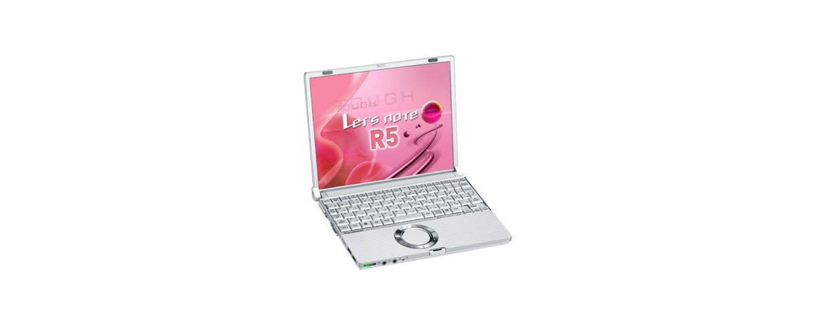
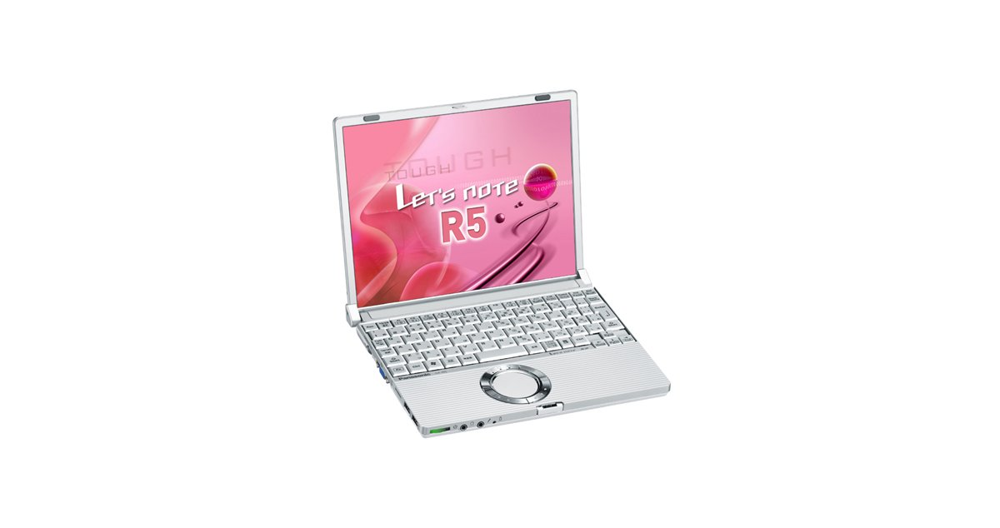

# Panasonic Let's note CF-R5 Specifications

**English** · [日本語](../../ja/CF-R5/) · [中文](../../zh/CF-R5/)

**CF-R5** is a Panasonic Let's note laptop in the R5 series with a 10.4-inch XGA display. This page lists all 2 part numbers, released 2006-05 – 2006-10. Each part number links to its official spec sheet.

*Panasonic Let's note CF-R5 (CF-R5LW4AXR). Image © Panasonic.*

## Part numbers

| Part number | Released | Discontinued | Summary |
| :-- | :-- | :-- | :-- |
| CF-R5LW4AXR | 2006-10 | 2006-10 | Genuine Windows® XP Professional, CoreTM Solo U1400 (1.20GHz・ULV), Memory: 512MB (max 1.5GB), HDD: 60GB, LAN, Wireless LAN 802.11a(J52/W52/W53)/b/g, USB2.0 |
| [CF-R5KW4AXR](https://panasonic.jp/pc/p-db/CF-R5KW4AXR_spec.html) | 2006-05 | 2006-08 | Genuine Windows® XP Professional, CoreTM Solo U1300 (1.06GHz・ULV), Memory: 512MB (max 1024MB), HDD: 60GB, LAN, Wireless LAN 802.11a(J52/W52/W53)/b/g, USB2.0 |

## Specifications

| Item | Value |
| :-- | :-- |
| OS | Microsoft(R) Windows(R) XP Professional Service Pack 2 with Enhanced Security Features (NTFS File System) |
| CPU | Intel(R) Centrino(R) Mobile Technology / Intel(R) Core TM Solo processor Ultra Low Voltage U1300 (1.06 GHz) / (2nd-level cache memory 2 MB, operating frequency 1.06 GHz, front side bus 533 MHz) |
| Chipset | Mobile Intel(R) 945GMS Express chipset |
| Memory | Standard 512 MB / max. 1024 MB (PC2-4200 / DDR2 SDRAM) |
| Video memory | Maximum 128 MB (shared with main memory) |
| Hard disk | 60 GB (Ultra ATA100) (2.5-inch) / of the above capacity, approx. 3 GB is used as recovery data area (user unavailable) |
| Floppy drive (optional) | USB-connected external 3.5-inch 3-mode supported / (1.44 MB/1.2 MB/720 KB) |
| Display | XGA (1024×768 dots) 10.4-inch TFT color LCD |
| Display / LCD colors | 1024×768 dots: approx. 16.77 million colors |
| Display / External output | 800×600 dots, 1024×768 dots, 1280×768 dots, 1280×1024 dots, 1400×1050 dots, 1600×1200 dots, 2048×1536 dots (60Hz): approx. 16.77 million colors |
| Display / Simultaneous display | 800×600 dots, 1024×768 dots: approx. 16.77 million colors |
| Wireless LAN | Intel(R) PRO/Wireless 3945 ABG Network Connection IEEE802.11a (J52/W52/W53)/b/g compliant (WPA-AES/TKIP support, Wi-Fi compliant) |
| Modem | Data: 56 kbps(V.90) FAX: 14.4 kbps/Voice not supported |
| Wired LAN | 100BASE-TX / 10BASE-T |
| Audio | PCM sound source (16-bit stereo), monaural speaker |
| Security chip | TPM (TCG V1.2 compliant) |
| Card slots / PC Card | PC card (TYPE II) ×1 slot / (CardBus compatible, allowable current 3.3 V: 400 mA, 5 V: 400 mA) |
| Card slots / SD card | SD memory card ×1 slot (copyright protection function supported)・transfer speed 8MB/sec |
| Memory expansion slot | DDR2 172-pin MicroDIMM dedicated slot ×1 (1.8V/PC2-4200/DDR2 SDRAM) |
| Keyboard | OADG-compliant keyboard (85 keys): key pitch 17mm (horizontal) × 14.3mm (vertical) |
| Pointing device | Wheel pad |
| Power | AC100 V-240 V (50 Hz/60 Hz) (Power cord is for 100 V only), Battery pack (7.4 V lithium-ion, 7.8 Ah) |
| Power consumption | Max approx. 40 W |
| Energy efficiency | S classification 0.00025 |
| Efficiency target achievement | — |
| Battery | Battery life: approx. 11 hours / Charging time: approx. 5 hours (power OFF), approx. 6 hours (power ON) |
| Dimensions (excluding protrusions) | Width 229 mm×Depth 183.5 mm×Height 24.2 mm/41.6 mm (front/rear) |
| Weight (with battery) | Approx. 999 g |
| Software | Microsoft(R) Internet Explorer 6 Service Pack 2, Adobe Reader, DMI viewer, Microsoft(R) Windows(R) Media Player 10, DirectX 9.0c, Microsoft(R) Windows(R) Movie Maker 2.1, Microsoft(R) .NET Framework 1.1, NetSelector, SD Utility, WheelPad Utility, Hotkey Settings, goo Stick, Setup Utility, hi-ho Online Sign-up, Font Size Enlargement Utility, Zoom Viewer, PC Information Viewer, NumLock Notification, Hard Disk Data Erase Utility, Wireless Manager mobile edition 2.0, McAfee(R) VirusScan◆, Wireless Switching Utility, Security Settings Utility, Economy Mode (ECO) Switching Utility, Power Saving Settings Utility, Battery Remaining Charge Display Correction Utility, Infineon TPM Professional Package V2.5, PC-Diagnostic Utility / Word processing, spreadsheet and other application software is not installed. |
| Accessories | AC adapter, battery pack, instruction manual, etc. |

## Photos

*Panasonic Let's note CF-R5 (CF-R5KW4AXR). Image © Panasonic.*

## Related models

- [All Let's note models](../)

---

Source: Panasonic's official [discontinued-models list](https://panasonic.jp/pc/support/products/) and spec sheets (panasonic.jp), translated from Japanese; see the official sheets for the authoritative wording. Product images © Panasonic. This is an unofficial compilation, not affiliated with Panasonic.
