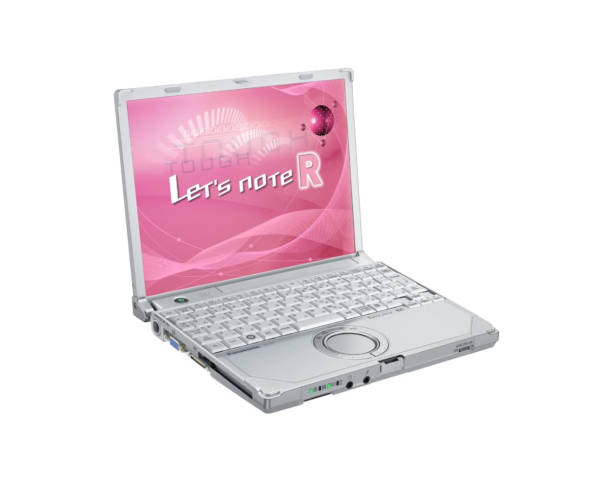

# Panasonic Let's note CF-R7 Specifications

**English** · [日本語](../../ja/CF-R7/) · [中文](../../zh/CF-R7/)

**CF-R7** is a Panasonic Let's note laptop in the R7 series with a 10.4-inch XGA display. This page lists all 6 part numbers, released 2007-10 – 2008-05. Each part number links to its official spec sheet.

*Panasonic Let's note CF-R7 (CF-R7DW6AJR, CF-R7DW6NJR, CF-R7CW5AJR, CF-R7CW5NJR …). Image © Panasonic.*

## Part numbers

| Part number | Released | Discontinued | Summary |
| :-- | :-- | :-- | :-- |
| [CF-R7DW6AJR](https://panasonic.jp/pc/p-db/CF-R7DW6AJR_spec.html) | 2008-05 | 2009-01 | Windows Vista® Business with SP1 genuine version, Intel® CoreTM2 Duo U7600 (1.20GHz), Memory: standard 1GB (max 2GB), HDD: 120GB, LAN, Wireless LAN 802.11a(J52/W52/W53/W56)/b/g, USB2.0 |
| [CF-R7DW6NJR](https://panasonic.jp/pc/p-db/CF-R7DW6NJR_spec.html) | 2008-05 | 2009-01 | Windows Vista® Business with SP1 genuine version, Intel® CoreTM2 Duo U7600 (1.20GHz), Memory: standard 1GB (max 2GB), HDD: 120GB, LAN, Wireless LAN 802.11a(J52/W52/W53/W56)/b/g, USB2.0, Office Personal <limited quantity> |
| [CF-R7CW5AJR](https://panasonic.jp/pc/p-db/CF-R7CW5AJR_spec.html) | 2008-02 | 2008-04 | Windows Vista® Business genuine edition, CoreTM2 Duo U7600 (1.20GHz・ULV), Memory: 1GB (max 2GB), HDD: 80GB, LAN, Wireless LAN 802.11a(J52/W52/W53/W56)/b/g, USB2.0 |
| [CF-R7CW5NJR](https://panasonic.jp/pc/p-db/CF-R7CW5NJR_spec.html) | 2008-02 | 2008-04 | Windows Vista® Business genuine edition, CoreTM2 U7600 (1.20GHz・ULV), Memory: 1GB (max 2GB), HDD: 80GB, LAN, Wireless LAN 802.11a(J52/W52/W53/W56)/b/g, USB2.0, Office Personal ＜Limited quantity＞ |
| [CF-R7BW5AJR](https://panasonic.jp/pc/p-db/CF-R7BW5AJR_spec.html) | 2007-10 | 2008-01 | Windows Vista® Business genuine edition, CoreTM2 Duo U7500 (1.06GHz・ULV), Memory: 1GB (max 2GB), HDD: 80GB, LAN, Wireless LAN 802.11a(J52/W52/W53/W56)/b/g, USB2.0 |
| [CF-R7BW5NJR](https://panasonic.jp/pc/p-db/CF-R7BW5NJR_spec.html) | 2007-10 | 2008-01 | Windows Vista® Business genuine edition, CoreTM2 Duo U7500 (1.06GHz・ULV), Memory: 1GB (max 2GB), HDD: 80GB, LAN, Wireless LAN 802.11a(J52/W52/W53/W56)/b/g, USB2.0, Office Personal ＜Limited quantity＞ |

## Common specifications

| Item | Value |
| :-- | :-- |
| Chipset | Mobile Intel(R) GM965 Express chipset |
| Memory | Standard 1GB DDR2 SDRAM (maximum 2GB), 1 free slot |
| Floppy drive (optional) | USB-connected external 3.5-inch 3-mode compatible (1.44MB/1.2MB/720KB) |
| Display | XGA (1024×768 dots) 10.4-inch TFT color LCD |
| Display / LCD colors | 1024×768 dots: approx. 16.77 million colors |
| Display / External output | 800×600, 1024×768, 1280×768, 1280×1024, 1400×1050, 1440×900, 1600×1200 dots: approx. 16.77 million colors |
| Display / Simultaneous display | 800×600, 1024×768 dots: approx. 16.77 million colors |
| Wireless LAN | Intel® Wireless WiFi Link 4965AGN, IEEE802.11a (J52/W52/W53/W56)/b/g compliant, (WPA-AES/TKIP supported, Wi-Fi compliant) |
| Modem | Data: 56kbps (V.90) FAX: 14.4kbps /Voice not supported |
| Wired LAN | 1000BASE-T/100BASE-TX / 10BASE-T |
| Audio | PCM sound source (24-bit stereo), Intel(R) High Definition Audio compliant, monaural speaker |
| Security chip | TPM (TCG V1.2 compliant) |
| Memory expansion slot | DDR2 172-pin MicroDIMM dedicated slot ×1 |
| Keyboard | OADG-compliant keyboard (85 keys): key pitch 17mm (horizontal)/14.3mm (vertical) (excluding some keys) |
| Pointing device | Wheel pad |
| Power | AC adapter input: AC100V–240V (50Hz/60Hz) (power cord for 100V only) / battery pack (7.2 V lithium-ion, 5.8 Ah) |
| Power consumption | Max approx. 45W |
| Efficiency target achievement | — |
| Dimensions (W×D×H) | Width 229mm×Depth 187 mm×Height 29.4mm/42.5mm (front/rear) |

## Differences by part number

| Part number | CPU | Memory | Storage | Weight | Battery life |
| :-- | :-- | :-- | :-- | :-- | :-- |
| CF-R7DW6AJR | — | 1GB DDR2 SDRAM | 120GB | 0.94 kg | — |
| CF-R7DW6NJR | — | 1GB DDR2 SDRAM | 120GB | 0.94 kg | — |
| CF-R7CW5AJR | — | 1GB DDR2 SDRAM | 80GB | 0.94 kg | — |
| CF-R7CW5NJR | — | 1GB DDR2 SDRAM | 80GB | 0.94 kg | — |
| CF-R7BW5AJR | — | 1GB DDR2 SDRAM | 80GB | 0.94 kg | — |
| CF-R7BW5NJR | — | 1GB DDR2 SDRAM | 80GB | 0.94 kg | — |

CF-R7DW6AJR: all differing specifications

| Item | Value |
| :-- | :-- |
| OS | Windows Vista (R) Business with Service Pack 1 genuine edition (includes Windows (R) XP downgrade rights) |
| CPU | Intel® Core™2 Processor / Ultra Low Voltage U7600 / 2nd-level cache memory 2MB, operating frequency 1.20GHz, front side bus 533MHz |
| Video memory | Max. 251MB / Max. 358MB when memory is expanded (shared with main memory) |
| Hard disk | 120GB (Serial ATA) Of the capacity shown at left, approx. 6GB is used as a recovery area (including the recovery data area) (unavailable to the user) |
| Card slots / PC Card | PC card (TYPEⅡ) ×1 slot (CardBus compatible, allowable current 3.3V: 400mA, 5V: 400mA) |
| Card slots / SD card | SD memory card ×1 slot (SDHC memory card/copyright protection technology support) |
| Ports | USB port ×2 (USB2.0), modem connector (RJ-11), LAN connector (RJ-45), external display connector (analog RGB mini Dsub 15-pin), mini port replicator connector (dedicated 50-pin) |
| Energy efficiency | 2007 fiscal year standard Ｉ category 0.00034 |
| Weight (with battery) | approx. 0.94kg |
| Software | Microsoft(R) Internet Explorer7.0, Adobe(R) Reader, DMI Viewer, Microsoft(R) Windows(R) Media Player 11, DirectX 10, Microsoft(R)Windows(R) Movie Maker 6.0, Microsoft(R) .NET Framework3.0, Zoom Viewer, PC Information Viewer, PC Information Popup, NumLock Notification, Wireless Manager mobile edition4.5, Wireless Switching Utility, Security Settings Utility, Infineon TPM Professional Package V3.0 SP2HF2, Economy Mode (ECO) Switching Utility, Power Saving Settings Utility, Battery Remaining Charge Display Correction Utility, Hotkey Settings, McAfee Internet Security Suite Basic Edition, goo Stick, Hard Disk Data Erase Utility, Setup Utility, PC-Diagnostic Utility, Wheel Pad Utility, Net Selector 2, LAN Power Saving Utility, Fan Control Utility, Fn Ctrl Function Swap Utility |
| Accessories | 2 Product Recovery DVD-ROMs (for Windows Vista(R) / Windows(R) XP), AC adapter, battery pack, instruction manual, etc. |

Official spec sheet: <https://panasonic.jp/pc/p-db/CF-R7DW6AJR_spec.html>

CF-R7DW6NJR: all differing specifications

| Item | Value |
| :-- | :-- |
| OS | Windows Vista (R) Business with Service Pack 1 genuine edition (includes Windows (R) XP downgrade rights) |
| CPU | Intel® Core™2 Processor / Ultra Low Voltage U7600 / 2nd-level cache memory 2MB, operating frequency 1.20GHz, front side bus 533MHz |
| Video memory | Max. 251MB / Max. 358MB when memory is expanded (shared with main memory) |
| Hard disk | 120GB (Serial ATA) Of the capacity shown at left, approx. 6GB is used as a recovery area (including the recovery data area) (unavailable to the user) |
| Card slots / PC Card | PC card (TYPEⅡ) ×1 slot (CardBus compatible, allowable current 3.3V: 400mA, 5V: 400mA) |
| Card slots / SD card | SD memory card ×1 slot (SDHC memory card/copyright protection technology support) |
| Ports | USB port ×2 (USB2.0), modem connector (RJ-11), LAN connector (RJ-45), / external display connector (analog RGB mini Dsub 15-pin), mini port replicator connector (dedicated 50-pin) |
| Energy efficiency | 2007 fiscal year standard Ｉ category 0.00034 |
| Weight (with battery) | approx. 0.94kg |
| Software | Microsoft(R) Internet Explorer7.0, Adobe(R) Reader, DMI Viewer, Microsoft(R) Windows(R) Media Player 11, DirectX 10, Microsoft(R)Windows(R) Movie Maker 6.0, Microsoft(R) .NET Framework3.0, Zoom Viewer, PC Information Viewer, PC Information Popup, NumLock Notification, Wireless Manager mobile edition4.5, Wireless Switching Utility, Security Settings Utility, Infineon TPM Professional Package V3.0 SP2HF2, Economy Mode (ECO) Switching Utility, Power Saving Settings Utility, Battery Remaining Charge Display Correction Utility, Hotkey Settings, McAfee Internet Security Suite Basic Edition, goo Stick, Hard Disk Data Erase Utility, Setup Utility, PC-Diagnostic Utility, Wheel Pad Utility, Net Selector 2, LAN Power Saving Utility, Fan Control Utility, Fn Ctrl Function Swap Utility, Microsoft(R)Office Personal 2007withPowerPoint 2007 |
| Accessories | 2 Product Recovery DVD-ROMs (for Windows Vista(R) / Windows(R) XP), AC adapter, battery pack, instruction manual, etc. |

Official spec sheet: <https://panasonic.jp/pc/p-db/CF-R7DW6NJR_spec.html>

CF-R7CW5AJR: all differing specifications

| Item | Value |
| :-- | :-- |
| OS | Windows Vista (R) Business genuine edition (includes Windows (R) XP downgrade rights) |
| CPU | Intel® Core™2 Duo Processor / Ultra Low Voltage U7600 / 2nd-level cache memory 2MB, operating frequency 1.20GHz, front side bus 533MHz |
| Video memory | Max. 251MB / Max. 358MB when memory is expanded (shared with main memory) |
| Hard disk | Of the capacity shown on the left, approx. 6GB of 80GB (Serial ATA) is used as a recovery area (including the recovery data area) (Not user accessible) |
| Card slots / PC Card | PC card (TYPEⅡ) ×1 slot (CardBus compatible, allowable current 3.3V: 400mA, 5V: 400mA) |
| Card slots / SD card | SD memory card ×1 slot (SDHC memory card/copyright protection support) |
| Ports | USB port ×2 (USB2.0), modem connector (RJ-11), LAN connector (RJ-45), external display connector (analog RGB mini Dsub 15-pin), mini port replicator connector (dedicated 50-pin) |
| Energy efficiency | 2007 fiscal year standard Ｉ category 0.00034 |
| Weight (with battery) | Approx. 940g |
| Software | Microsoft(R) Internet Explorer7.0, Adobe(R) Reader, DMI Viewer, Microsoft(R) Windows(R) Media Player 11, DirectX 10, Microsoft(R)Windows(R) Movie Maker 6.0, Microsoft(R) .NET Framework3.0, Zoom Viewer, PC Information Viewer, PC Information Popup Utility, NumLock Notification, Wireless Manager mobile edition4.5, Wireless Switching Utility, Security Settings Utility, Infineon TPM Professional Package V3.0 SP2, Economy Mode (ECO) Switching Utility, Power Saving Settings Utility, Battery Remaining Charge Display Correction Utility, Hotkey Settings, McAfee Internet Security Suite Basic Edition, goo Stick, Hard Disk Data Erase Utility, Setup Utility, PC-Diagnostic Utility, Wheel Pad Utility, Net Selector 2, LAN Power Saving Utility, Fan Control Utility, Fn Ctrl Function Swap Utility |
| Accessories | 2 Product Recovery DVD-ROMs (for Windows Vista(R) / Windows(R) XP), AC adapter, battery pack, instruction manual, etc. |

Official spec sheet: <https://panasonic.jp/pc/p-db/CF-R7CW5AJR_spec.html>

CF-R7CW5NJR: all differing specifications

| Item | Value |
| :-- | :-- |
| OS | Windows Vista (R) Business genuine edition (includes Windows (R) XP downgrade rights) |
| CPU | Intel® Core™2 Duo Processor / Ultra Low Voltage U7600 / 2nd-level cache memory 2MB, operating frequency 1.20GHz, front side bus 533MHz |
| Video memory | Max. 251MB / Max. 358MB when memory is expanded (shared with main memory) |
| Hard disk | Of the capacity shown on the left, approx. 6GB of 80GB (Serial ATA) is used as a recovery area (including the recovery data area) (Not user accessible) |
| Card slots / PC Card | PC card (TYPEⅡ) ×1 slot (CardBus compatible, allowable current 3.3V: 400mA, 5V: 400mA) |
| Card slots / SD card | SD memory card ×1 slot (SDHC memory card/copyright protection support) |
| Ports | USB port ×2 (USB2.0), modem connector (RJ-11), LAN connector (RJ-45), / external display connector (analog RGB mini Dsub 15-pin), mini port replicator connector (dedicated 50-pin) |
| Energy efficiency | 2007 fiscal year standard Ｉ category 0.00034 |
| Weight (with battery) | Approx. 940g |
| Software | Microsoft(R) Internet Explorer7.0, Adobe(R) Reader, DMI Viewer, Microsoft(R) Windows(R) Media Player 11, DirectX 10, Microsoft(R)Windows(R) Movie Maker 6.0, Microsoft(R) .NET Framework3.0, Zoom Viewer, PC Information Viewer, PC Information Popup Utility, NumLock Notification, Wireless Manager mobile edition4.5, Wireless Switching Utility, Security Settings Utility, Infineon TPM Professional Package V3.0 SP2, Economy Mode (ECO) Switching Utility, Power Saving Settings Utility, Battery Remaining Charge Display Correction Utility, Hotkey Settings, McAfee Internet Security Suite Basic Edition, goo Stick, Hard Disk Data Erase Utility, Setup Utility, PC-Diagnostic Utility, Wheel Pad Utility, Net Selector 2, LAN Power Saving Utility, Fan Control Utility, Fn Ctrl Function Swap Utility, Microsoft(R) Office Personal 2007withPowerPoint 2007 |
| Accessories | Product Recovery DVD-ROM 2 discs (for Windows Vista(R) / for Windows(R) XP), AC adapter, battery pack, instruction manual, etc. |

Official spec sheet: <https://panasonic.jp/pc/p-db/CF-R7CW5NJR_spec.html>

CF-R7BW5AJR: all differing specifications

| Item | Value |
| :-- | :-- |
| OS | Windows Vista (R) Business genuine edition (includes Windows (R) XP downgrade rights) |
| CPU | Intel® Core™2 Duo Processor / Ultra Low Voltage U7500 / 2nd-level cache memory 2MB, operating frequency 1.06GHz, front side bus 533MHz |
| Video memory | Max. 358MB (shared with main memory) |
| Hard disk | Of the capacity shown on the left, approx. 6GB of 80GB (Serial ATA) is used as a recovery area (including the recovery data area). (Not user accessible) |
| Card slots / PC Card | PC card (TYPEII) ×1 slot (CardBus compatible, allowable current 3.3V: 400mA, 5V: 400mA) |
| Card slots / SD card | SD memory card ×1 slot (SDHC memory card/copyright protection support) |
| Ports | USB port ×2 (USB2.0), modem connector (RJ-11), LAN connector (RJ-45), external display connector (analog RGB mini Dsub 15-pin), mini port replicator connector (dedicated 50-pin) |
| Energy efficiency | 2007 fiscal year standard Ｉ category 0.00041 |
| Weight (with battery) | Approx. 940g |
| Software | Microsoft(R) Internet Explorer7.0, Adobe(R) Reader, DMI Viewer, Microsoft(R) Windows(R) Media Player 11, DirectX 10, Microsoft(R)Windows(R) Movie Maker 6.0, Microsoft(R) .NET Framework3.0, Zoom Viewer, PC Information Viewer, PC Information Popup Utility, NumLock Notification, Wireless Manager mobile edition4.5, Wireless Switching Utility, Security Settings Utility, Infineon TPM Professional Package V3.0 SP1, Economy Mode (ECO) Switching Utility, Power Saving Settings Utility, Battery Remaining Charge Display Correction Utility, Hotkey Settings, McAfee Internet Security Suite Basic Edition, goo Stick, Hard Disk Data Erase Utility, Setup Utility, PC-Diagnostic Utility, Wheel Pad Utility, Net Selector 2, LAN Power Saving Utility, Fan Control Utility, Fn Ctrl Function Swap Utility |
| Accessories | Product Recovery DVD-ROM, AC adapter, battery pack, instruction manual, etc. |

Official spec sheet: <https://panasonic.jp/pc/p-db/CF-R7BW5AJR_spec.html>

CF-R7BW5NJR: all differing specifications

| Item | Value |
| :-- | :-- |
| OS | Windows Vista (R) Business genuine edition (includes Windows (R) XP downgrade rights) |
| CPU | Intel® Core™2 Duo Processor / Ultra Low Voltage U7500 / 2nd-level cache memory 2MB, operating frequency 1.06GHz, front side bus 533MHz |
| Video memory | Max. 358MB (shared with main memory) |
| Hard disk | Of the capacity shown on the left, approx. 6GB of 80GB (Serial ATA) is used as a recovery area (including the recovery data area). (Not user accessible) |
| Card slots / PC Card | PC card (TYPEII) ×1 slot (CardBus compatible, allowable current 3.3V: 400mA, 5V: 400mA) |
| Card slots / SD card | SD memory card ×1 slot (SDHC memory card/copyright protection support) |
| Ports | USB port ×2 (USB2.0), modem connector (RJ-11), LAN connector (RJ-45), / external display connector (analog RGB mini Dsub 15-pin), mini port replicator connector (dedicated 50-pin) |
| Energy efficiency | 2007 fiscal year standard Ｉ category 0.00041 |
| Weight (with battery) | Approx. 940g |
| Software | Microsoft(R) Internet Explorer7.0, Adobe(R) Reader, DMI Viewer, Microsoft(R) Windows(R) Media Player 11, DirectX 10, Microsoft(R)Windows(R) Movie Maker 6.0, Microsoft(R) .NET Framework3.0, Zoom Viewer, PC Information Viewer, PC Information Popup Utility, NumLock Notification, Wireless Manager mobile edition4.5, Wireless Switching Utility, Security Settings Utility, Infineon TPM Professional Package V3.0 SP1, Economy Mode (ECO) Switching Utility, Power Saving Settings Utility, Battery Remaining Charge Display Correction Utility, Hotkey Settings, McAfee Internet Security Suite Basic Edition, goo Stick, Hard Disk Data Erase Utility, Setup Utility, PC-Diagnostic Utility, Wheel Pad Utility, Net Selector 2, LAN Power Saving Utility, Fan Control Utility, Fn Ctrl Function Swap Utility, Microsoft(R) Office Personal 2007withPowerPoint 2007 |
| Accessories | Product Recovery DVD-ROM, AC adapter, battery pack, instruction manual, etc. |

Official spec sheet: <https://panasonic.jp/pc/p-db/CF-R7BW5NJR_spec.html>

## Related models

- [All Let's note models](../)

---

Source: Panasonic's official [discontinued-models list](https://panasonic.jp/pc/support/products/) and spec sheets (panasonic.jp), translated from Japanese; see the official sheets for the authoritative wording. Product images © Panasonic. This is an unofficial compilation, not affiliated with Panasonic.
