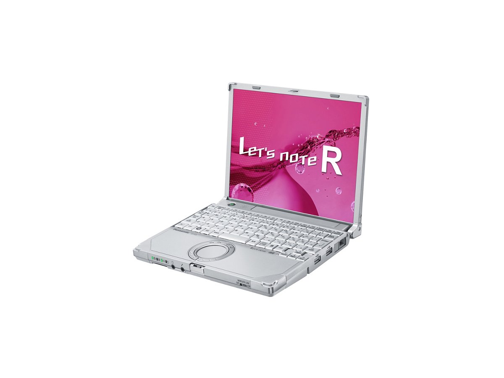
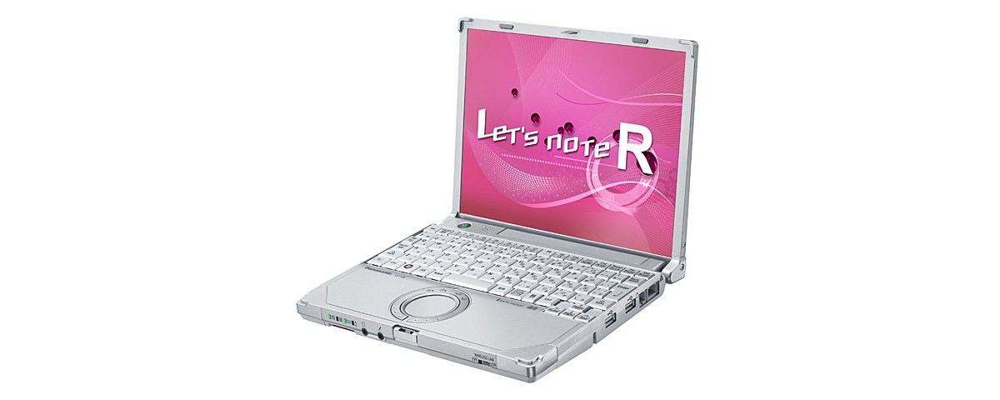
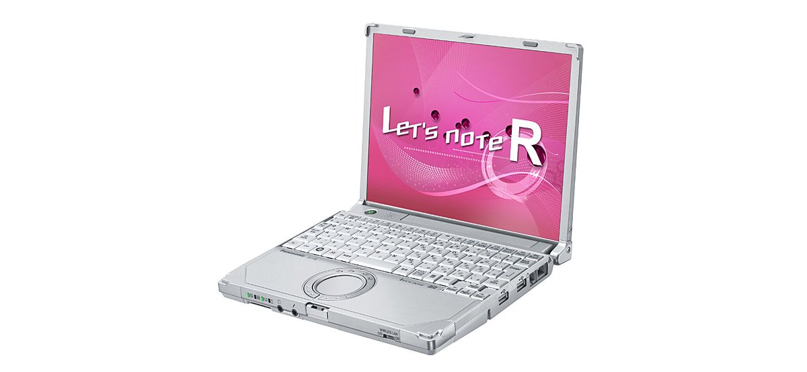
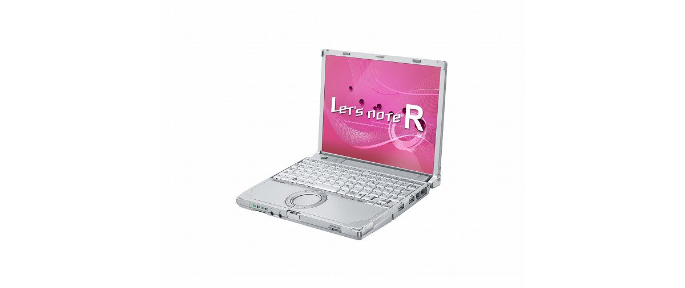
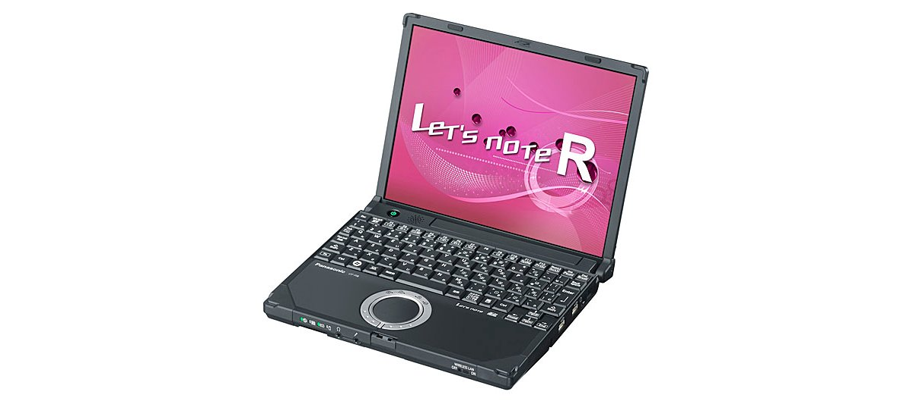
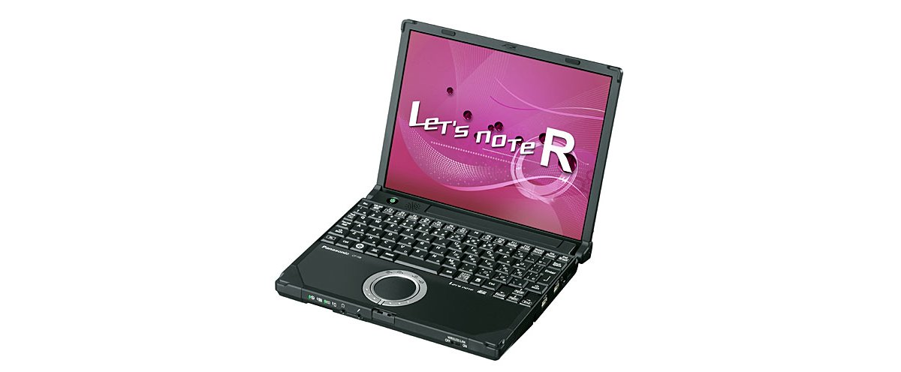
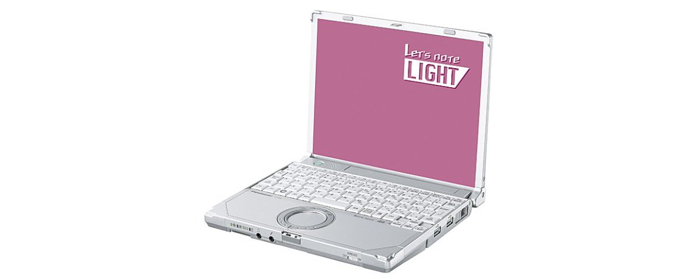

# Panasonic Let's note CF-R8 Specifications

**English** · [日本語](../../ja/CF-R8/) · [中文](../../zh/CF-R8/)

🗄️ See this model in the [Let's note Cabinet](https://letsnote-specs.github.io/en/CF-R8/).

**CF-R8** is a Panasonic Let's note laptop in the LIGHT R8 series with a 10.4-inch XGA display. This page lists all 12 part numbers, released 2008-10 – 2009-12. Each part number links to its official spec sheet.

*Panasonic Let's note CF-R8 (CF-R8HWKCDR, CF-R8HWKNDR). Image © Panasonic.*

## Part numbers

| Part number | Released | Discontinued | Summary |
| :-- | :-- | :-- | :-- |
| [CF-R8WW1ADR](https://panasonic.jp/pc/p-db/CF-R8WW1ADR_spec.html) | 2009-12 | 2010-04 | Windows 7 model: Windows® 7 Professional OEM version, Intel® CoreTM2 Solo SU3500 (1.40GHz), Memory: standard 2GB (max 4GB), HDD: 160GB, LAN, Wireless LAN 802.11a(W52/W53/W56)/b/g/n |
| [CF-R8HWKCDR](https://panasonic.jp/pc/p-db/CF-R8HWKCDR_spec.html) | 2009-11 | 2010-01 | Windows® 7 Professional Genuine Edition, Intel® CoreTM2 Duo SU9600 (1.60GHz), Memory: standard 2GB (max 4GB), HDD: 250GB, LAN, Wireless LAN 802.11a(W52/W53/W56)/b/g/n |
| [CF-R8HWKNDR](https://panasonic.jp/pc/p-db/CF-R8HWKNDR_spec.html) | 2009-11 | 2010-01 | Windows® 7 Professional Genuine Edition, Intel® CoreTM2 Duo SU9400 (1.40GHz), Memory: standard 2GB (max 4GB), HDD: 160GB, LAN, Wireless LAN 802.11a(W52/W53/W56)/b/g/n, Office Personal 2007 <Limited quantity> |
| [CF-R8GWJCJR](https://panasonic.jp/pc/p-db/CF-R8GWJCJR_spec.html) | 2009-06 | 2009-09 | Black model: Windows Vista® Business with SP1 Genuine Edition, Intel® CoreTM2 Duo SU9400 (1.40GHz), Memory: 2GB + 1GB (max 4GB), HDD: 160GB, LAN, Wireless LAN 802.11a(W52/W53/W56)/b/g/n <Limited quantity> |
| [CF-R8WW1AJR](https://panasonic.jp/pc/p-db/CF-R8WW1AJR_spec.html) | 2009-06 | 2009-09 | Windows Vista model: Windows Vista® Business with SP1 genuine edition, Intel® CoreTM2 Solo SU3500 (1.40GHz), Memory: standard 2GB (max 4GB), HDD: 160GB, LAN, Wireless LAN 802.11a(W52/W53/W56)/b/g/n |
| [CF-R8GW1AJR](https://panasonic.jp/pc/p-db/CF-R8GW1AJR_spec.html) | 2009-05 | 2009-09 | Windows Vista® Business with SP1 genuine version, Intel® CoreTM2 Duo SU9400 (1.40GHz), Memory: standard 2GB (max 4GB), HDD: 160GB, LAN, Wireless LAN 802.11a(W52/W53/W56)/b/g/n |
| [CF-R8GW1NJR](https://panasonic.jp/pc/p-db/CF-R8GW1NJR_spec.html) | 2009-05 | 2009-09 | Windows Vista® Business with SP1 genuine version, Intel® CoreTM2 Duo SU9400 (1.40GHz), Memory: standard 2GB (max 4GB), HDD: 160GB, LAN, Wireless LAN 802.11a(W52/W53/W56)/b/g/n, Office Personal 2007 <limited quantity> |
| [CF-R8FWJCJR](https://panasonic.jp/pc/p-db/CF-R8FWJCJR_spec.html) | 2009-03 | 2009-05 | Black model: Windows Vista® Business with SP1 Genuine Edition, Intel® CoreTM2 Duo SU9300 (1.20GHz), Memory: 2GB + 1GB (max 4GB), HDD: 160GB, LAN, Wireless LAN 802.11a(W52/W53/W56)/b/g/n <Limited quantity> |
| [CF-R8FW1AJR](https://panasonic.jp/pc/p-db/CF-R8FW1AJR_spec.html) | 2009-02 | 2009-05 | Windows Vista® Business with SP1 genuine version, Intel® CoreTM2 Duo SU9300 (1.20GHz), Memory: standard 2GB (max 4GB), HDD: 160GB, LAN, Wireless LAN 802.11a(W52/W53/W56)/b/g/n |
| [CF-R8FW1NJR](https://panasonic.jp/pc/p-db/CF-R8FW1NJR_spec.html) | 2009-02 | 2009-05 | Windows Vista® Business with SP1 genuine version, Intel® CoreTM2 Duo SU9300 (1.20GHz), Memory: standard 2GB (max 4GB), HDD: 160GB, LAN, Wireless LAN 802.11a(W52/W53/W56)/b/g/n, Office Personal 2007 <limited quantity> |
| [CF-R8EW6AJR](https://panasonic.jp/pc/p-db/CF-R8EW6AJR_spec.html) | 2008-10 | 2009-01 | Windows Vista® Business with SP1 genuine version, Intel® CoreTM2 Duo SU9300(1.20GHz), Memory: 1GB (max 3GB), HDD: 120GB, LAN, Wireless LAN 802.11a(W52/W53/W56)/b/g/n |
| [CF-R8EW6NJR](https://panasonic.jp/pc/p-db/CF-R8EW6NJR_spec.html) | 2008-10 | 2009-01 | Windows Vista® Business with SP1 genuine version, Intel® CoreTM2 Duo SU9300 (1.20GHz), Memory: 1GB (max 3GB), HDD: 120GB, LAN, Wireless LAN 802.11a(W52/W53/W56)/b/g/n, Office Personal 2007 <limited quantity> |

## Common specifications

| Item | Value |
| :-- | :-- |
| Keyboard | OADG-compliant keyboard (85 keys): key pitch 17mm (horizontal)/14.3mm (vertical) (excluding some keys) |
| Pointing device | Wheel pad |
| Power consumption | Max approx. 45W |
| Efficiency target achievement | — |

## Differences by part number

| Part number | CPU | Memory | Storage | Weight | Battery life |
| :-- | :-- | :-- | :-- | :-- | :-- |
| CF-R8WW1ADR | Ultra-low voltage version Core2 Solo SU3500 | 2GB | 160GB | 0.94 kg | 8 h |
| CF-R8HWKCDR | Ultra-low voltage version Core2 Duo SU9600 | 2GB | 250GB | 0.93 kg | 8 h |
| CF-R8HWKNDR | Ultra-low voltage version Core2 Duo SU9600 | 2GB | 250GB | 0.93 kg | 8 h |
| CF-R8GWJCJR | — | 3GB | 160GB | 0.94 kg | 8 h |
| CF-R8WW1AJR | — | 2GB | 160GB | 0.94 kg | 8 h |
| CF-R8GW1AJR | — | 2GB DDR2 SDRAM | 160GB | 0.93 kg | 8 h |
| CF-R8GW1NJR | — | 2GB DDR2 SDRAM | 160GB | 0.93 kg | — |
| CF-R8FWJCJR | — | 3GB DDR2 SDRAM | — | 0.94 kg | 8 h |
| CF-R8FW1AJR | — | 2GB DDR2 SDRAM | 160GB | 0.93 kg | 8 h |
| CF-R8FW1NJR | — | 2GB DDR2 SDRAM | 160GB | 0.93 kg | — |
| CF-R8EW6AJR | — | 1GB DDR2 SDRAM | 120GB | 0.93 kg | 8 h |
| CF-R8EW6NJR | — | 1GB DDR2 SDRAM | 120GB | 0.93 kg | — |

CF-R8WW1ADR: all differing specifications

| Item | Value |
| :-- | :-- |
| OS | Windows 7 (R) Professional 32-bit OEM version (Japanese version) |
| CPU | Ultra-low voltage Intel(R) Core(TM)2 Solo processor SU3500 / (2nd-level cache memory 3MB, operating frequency 1.40GHz, front side bus 800MHz) |
| Chipset | Mobile Intel(R) GS45 Express chipset |
| Memory | Standard 2GB (1 free slot) / maximum 4GB |
| Video memory | Max 797MB (shared with main memory), (up to 1309MB when 1GB memory is added, up to 1551MB when 2GB memory is added) |
| Hard disk | 160GB (Serial ATA) Of the stated capacity, approx. 8GB is used as a repair area (including the recovery data area) (unavailable to the user) |
| Floppy drive (optional) | USB-connected external 3.5-inch 3-mode compatible (1.44MB/1.2MB/720KB) |
| Display | 10.4-inch XGA (1024×768 dots) TFT color LCD |
| Display / LCD colors | 1024×768 dots: approx. 16.77 million colors |
| Display / External output | 800x600, 1024x768, 1280x768, 1280x1024, 1400x1050, 1440x900, 1680x1050, 1600x1200, 1920x1080, 1920x1200 dots: approx. 16.77 million colors |
| Display / Simultaneous display | 800×600, 1024×768 dots: approx. 16.77 million colors |
| Wireless LAN | Intel(R) WiFi Link 5100 (WPA2-AES/TKIP support, Wi-Fi compliant) / IEEE802.11a (W52/W53/W56)/b/g compliant, IEEE802.11n draft 2.0 compliant |
| Wired LAN | 1000BASE-T / 100BASE-TX / 10BASE-T |
| Audio | PCM sound source (24-bit stereo), Intel(R) High Definition Audio compliant, monaural speaker |
| Card slots / PC Card | PC card (TYPEⅡ) ×1 slot (CardBus compatible, allowable current 3.3V: 400mA, 5V: 400mA) |
| Card slots / SD card | SD memory card ×1 slot (SDHC memory card/copyright protection support) |
| Memory expansion slot | DDR2 200-pin SO-DIMM dedicated slot ×1 (1.8V/PC2-5300/DDR2 SDRAM) |
| Ports | USB port ×2 (USB2.0), LAN connector (RJ-45), external display connector (analog RGB mini Dsub 15-pin), microphone input terminal (stereo mini jack M3 (plug-in power supported)), audio output terminal (stereo mini jack M3) |
| Power | AC adapter Input: AC100V-240V, 50Hz/60Hz, Output: DC16 V, 2.8A (power cord for 100V only) / Battery pack (7.2 V lithium-ion, nominal capacity 5.8 Ah/rated capacity 5.4 Ah) |
| Energy efficiency | 2007 fiscal year standard I category 0.00049 |
| Battery | Battery life: approx. 8 hours (when battery Economy Mode (ECO) is disabled) / Charging time: approx. 4.5 hours (power off), approx. 5.5 hours (power on) |
| Dimensions (W×D×H) | Width 229mm×Depth 187 mm×Height 29.4mm/42.5mm (front/rear) |
| Weight (with battery) | approx. 0.94kg (when the included battery pack (approx. 0.22kg) is installed) |
| Software | MicrosoftR Internet Explorer 8.0, Adobe Reader, MicrosoftR WindowsR Media Player 12, MicrosoftR .NET Framework 3.5.1, Net Selector 2, Wheel Pad Utility, Hotkey Settings, Midori no goo Stick, Windows Live Mail, Windows Live Photo Gallery, Windows Live Messenger, Windows Live Writer, Zoom Viewer, PC Information Viewer, PC Information Popup, NumLock Notification, USB Keyboard Helper, USB Mouse Helper, / Display Helper, Wireless Manager mobile edition 5.5, Panasonic Power Plan Extension Utility, McAfee PC Security Center, Wireless Switching Utility, Security Settings Utility, Battery Remaining Charge Display Correction Utility, / Fn Ctrl Function Swap Utility, i-Filter 5.0 (30-day trial version), Pittari View, Aptio Setup Utility, Hard Disk Data Erase Utility, PC-Diagnostic Utility |
| Accessories | Product Recovery DVD-ROM 1 disc (Windows(R)7 Professional 32-bit), AC adapter, battery pack, instruction manual, etc. |

Official spec sheet: <https://panasonic.jp/pc/p-db/CF-R8WW1ADR_spec.html>

CF-R8HWKCDR: all differing specifications

| Item | Value |
| :-- | :-- |
| OS | Windows7(R)Professional genuine edition (32-bit) (includes Windows(R) XP downgrade rights) |
| CPU | Ultra-low voltage Intel(R) CoreTM2 Duo processor SU9600 / operating frequency 1.60GHz / 2nd-level cache memory 3MB, front side bus 800MHz |
| Chipset | Mobile Intel(R) GM45 Express chipset |
| Memory | Standard 2GB (1 free slot) / maximum 4GB |
| Video memory | Max 797MB, 1551MB when 2GB memory is added (shared with main memory) |
| Hard disk | 250GB (Serial ATA) *Of the above capacity, approx. 10GB is used as a repair area (including the recovery data area) and approx. 500MB as a system area (unavailable to the user) |
| Floppy drive (optional) | (Sold separately) USB-connected external 3.5-inch 3-mode compatible (1.44MB/1.2MB/720KB) |
| Display | XGA (1024×768 dots) 10.4-inch TFT color LCD |
| Display / LCD colors | 1024×768 dots: approx. 16.77 million colors |
| Display / External output | 800x600, 1024x768, 1280x768, 1280x1024, 1400x1050, 1680x1050, 1600x1200, 1920x1080, 1920x1200 dots: approx. 16.77 million colors |
| Display / Simultaneous display | 800×600, 1024×768 dots: approx. 16.77 million colors |
| Wireless LAN | WPA2-AES/TKIP compatible, Wi-Fi compliant IEEE802.11a (W52/W53/W56)/b/g compliant, IEEE802.11n draft 2.0 compliant |
| Wired LAN | 1000BASE-T / 100BASE-TX / 10BASE-T |
| Audio | PCM sound source (24-bit stereo), Intel(R) High Definition Audio compliant, monaural speaker |
| Card slots / PC Card | PC card (TYPEII) ×1 slot (CardBus compatible, allowable current 3.3V: 400mA, 5V: 400mA) |
| Card slots / SD card | SD memory card ×1 slot (SDHC memory card/copyright protection technology support) |
| Memory expansion slot | DDR2 200-pin SO-DIMM dedicated slot ×1 (1.8V/PC2-5300/DDR2 SDRAM) |
| Ports | LAN connector (RJ-45), external display connector (analog RGB mini Dsub 15-pin), HDMI output terminal (equipped on S8/N8 only), microphone input (stereo mini jack M3 (plug-in power compatible)), audio output (stereo mini jack M3), USB port x2 (USB2.0) |
| Power | ▼AC adapter / Input: AC100V–240V, 50Hz/60Hz, Output: DC16 V, 2.8A, power cord for 100V only / ▼Battery pack / 7.2V lithium-ion, nominal capacity 5.8Ah, rated capacity 5.4Ah |
| Energy efficiency | 2007 fiscal year standard I category 0.00026 |
| Battery | Battery life approx. 8 hours |
| Dimensions (W×D×H) | Width 229mm×Depth 187 mm×Height 29.4mm/42.5mm (front/rear) |
| Weight (with battery) | PC body: approx. 0.93kg (when equipped with included battery pack (approx. 0.22kg)) |
| Software | Microsoft(R) Internet Explorer8.0, Adobe Reader, Microsoft(R) Windows(R) Media Player 12, Microsoft(R) Windows(R) Movie Maker 6.0, Microsoft(R) .NET Framework 3.5.1, Windows Live Mail, Windows Live Messenger, Windows Live Photo Gallery, Windows Live Writer, Zoom Viewer, PC Information Viewer, PC Information Pop-up, NumLock Notification, Wireless Manager mobile edition 5.5, Wireless Switching Utility, Security Setting Utility, Infineon TPM Professional Package V3.6, Battery Remaining Charge Display Correction Utility, Hotkey Settings, McAfee PC Security Center, Midori no goo Stick, Hard Disk Data Erase Utility, Wheel Pad Utility, Net Selector 2, USB Keyboard Helper, USB Mouse Helper, Fn Ctrl Function Swap Utility, i-Filter 5.0 (30-day Trial Version), Panasonic Power Plan Extension Utility, Display Helper, Pittari View*, Aptio Setup Utility, PC-Diagnostic Utility |
| Accessories | Product Recovery DVD-ROM 2 discs (for Windows 7 / for Windows XP), AC adapter, battery pack, instruction manual, etc. |
| Wireless communication | Intel(R) WiFi Link 5100 |
| Security chip | TPM (TCG V1.2 compliant) |

Official spec sheet: <https://panasonic.jp/pc/p-db/CF-R8HWKCDR_spec.html>

CF-R8HWKNDR: all differing specifications

| Item | Value |
| :-- | :-- |
| OS | Windows7(R)Professional genuine edition (32-bit) (includes Windows(R) XP downgrade rights) |
| CPU | Ultra-low voltage Intel(R) CoreTM2 Duo processor SU9600 / operating frequency 1.60GHz / 2nd-level cache memory 3MB, front side bus 800MHz |
| Chipset | Mobile Intel(R) GM45 Express chipset |
| Memory | Standard 2GB (1 free slot) / maximum 4GB |
| Video memory | Max 797MB, 1551MB when 2GB memory is added (shared with main memory) |
| Hard disk | 250GB (Serial ATA) *Of the above capacity, approx. 10GB is used as a repair area (including the recovery data area) and approx. 500MB as a system area (unavailable to the user) |
| Floppy drive (optional) | (Sold separately) USB-connected external 3.5-inch 3-mode compatible (1.44MB/1.2MB/720KB) |
| Display | XGA (1024×768 dots) 10.4-inch TFT color LCD |
| Display / LCD colors | 1024×768 dots: approx. 16.77 million colors |
| Display / External output | 800x600, 1024x768, 1280x768, 1280x1024, 1400x1050, 1680x1050, 1600x1200, 1920x1080, 1920x1200 dots: approx. 16.77 million colors |
| Display / Simultaneous display | 800×600, 1024×768 dots: approx. 16.77 million colors |
| Wireless LAN | WPA2-AES/TKIP compatible, Wi-Fi compliant IEEE802.11a (W52/W53/W56)/b/g compliant, IEEE802.11n draft 2.0 compliant |
| Wired LAN | 1000BASE-T / 100BASE-TX / 10BASE-T |
| Audio | PCM sound source (24-bit stereo), Intel(R) High Definition Audio compliant, monaural speaker |
| Card slots / PC Card | PC card (TYPEII) ×1 slot (CardBus compatible, allowable current 3.3V: 400mA, 5V: 400mA) |
| Card slots / SD card | SD memory card ×1 slot (SDHC memory card/copyright protection technology support) |
| Memory expansion slot | DDR2 200-pin SO-DIMM dedicated slot ×1 (1.8V/PC2-5300/DDR2 SDRAM) |
| Ports | LAN connector (RJ-45), external display connector (analog RGB mini Dsub 15-pin), microphone input (stereo mini jack M3 (plug-in power supported)), audio output (stereo mini jack M3), USB ports ×2 (USB2.0) |
| Power | ▼AC adapter / Input: AC100V–240V, 50Hz/60Hz, Output: DC16 V, 2.8A, power cord for 100V only / ▼Battery pack / 7.2V lithium-ion, nominal capacity 5.8Ah, rated capacity 5.4Ah |
| Energy efficiency | 2007 fiscal year standard I category 0.00026 |
| Battery | Battery life approx. 8 hours |
| Dimensions (W×D×H) | Width 229mm×Depth 187 mm×Height 29.4mm/42.5mm (front/rear) |
| Weight (with battery) | PC body: approx. 0.93kg (when equipped with included battery pack (approx. 0.22kg)) |
| Software | Microsoft(R) Internet Explorer8.0, Adobe Reader, Microsoft(R) Windows(R) Media Player 12, Microsoft(R) Windows(R) Movie Maker 6.0, Microsoft(R) .NET Framework 3.5.1, Windows Live Mail, Windows Live Messenger, Windows Live Photo Gallery, Windows Live Writer, Zoom Viewer, PC Information Viewer, PC Information Pop-up, NumLock Notification, Wireless Manager mobile edition 5.5, Wireless Switching Utility, Security Setting Utility, Infineon TPM Professional Package V3.6, Battery Remaining Charge Display Correction Utility, Hotkey Settings, McAfee PC Security Center, Midori no goo Stick, Hard Disk Data Erase Utility, Wheel Pad Utility, Net Selector 2, USB Keyboard Helper, USB Mouse Helper, Fn Ctrl Function Swap Utility, i-Filter 5.0 (30-day Trial Version), Panasonic Power Plan Extension Utility, Display Helper, Pittari View*, Aptio Setup Utility, PC-Diagnostic Utility, Microsoft(R) Office Personal 2007 with Microsoft(R) Office PowerPoint(R) 2007 (Service Pack 1) |
| Accessories | Product Recovery DVD-ROM 2 discs (for Windows 7 / for Windows XP), AC adapter, battery pack, instruction manual, etc. |
| Wireless communication | Intel(R) WiFi Link 5100 |
| Security chip | TPM (TCG V1.2 compliant) |

Official spec sheet: <https://panasonic.jp/pc/p-db/CF-R8HWKNDR_spec.html>

CF-R8GWJCJR: all differing specifications

| Item | Value |
| :-- | :-- |
| OS | Windows Vista (R) Business with Service Pack 1 genuine edition (32-bit) (includes Windows (R) XP downgrade rights) |
| CPU | vPro(TM) Technology Intel(R) Centrino(R)2 / Intel(R) Core(TM)2 Duo Processor / Ultra Low Voltage version SU9400 / Secondary cache memory 3MB, operating frequency 1.40GHz, front side bus 800MHz |
| Chipset | Mobile Intel(R) GS45 Express chipset |
| Memory | Standard 3GB (0 free slots: 1GB memory already added to expansion memory slot) / maximum 4GB |
| Video memory | Maximum 1309MB (shared with main memory) (maximum 1551MB when expansion memory is changed to 2GB) |
| Hard disk | 160GB (Serial ATA) Of the stated capacity, approx. 8GB is used as a repair area (including the recovery data area) (unavailable to the user) |
| Floppy drive (optional) | USB-connected external 3.5-inch 3-mode compatible (1.44MB/1.2MB/720KB) |
| Display | 10.4-inch XGA (1024×768 dots) TFT color LCD |
| Display / LCD colors | 1024×768 dots: approx. 16.77 million colors |
| Display / External output | 800x600, 1024x768, 1280x768, 1280x1024, 1400x1050, 1440x900, 1680x1050, 1600x1200, 1920x1080, 1920x1200 dots: approx. 16.77 million colors |
| Display / Simultaneous display | 800×600, 1024×768 dots: approx. 16.77 million colors |
| Wireless LAN | Intel® WiFi Link 5100AGN, IEEE802.11a (W52/W53/W56)/b/g compliant, IEEE802.11n draft 2.0 compliant, (WPA-AES/TKIP supported, Wi-Fi compliant) |
| Wired LAN | 1000BASE-T / 100BASE-TX / 10BASE-T |
| Audio | PCM sound source (24-bit stereo), Intel(R) High Definition Audio compliant, monaural speaker |
| Card slots / PC Card | PC card (TYPEⅡ) ×1 slot (CardBus compatible, allowable current 3.3V: 400mA, 5V: 400mA) |
| Card slots / SD card | SD memory card ×1 slot (SDHC memory card/copyright protection support) |
| Memory expansion slot | DDR2 200-pin SO-DIMM dedicated slot ×1 (1.8V/PC2-5300/DDR2 SDRAM), 1GB memory added |
| Ports | USB port ×2 (USB2.0), modem connector (RJ-11), LAN connector (RJ-45), external display connector (analog RGB mini Dsub 15-pin), mini port replicator connector (dedicated 50-pin), microphone input terminal (stereo mini jack M3 (plug-in power supported)), audio output terminal (stereo mini jack M3) |
| Power | AC adapter input: AC100V–240V, 50Hz/60Hz, output: DC16 V, 2.8A (power cord for 100V only) / battery pack (7.2 V lithium-ion, nominal capacity 5.8 Ah/rated capacity 5.4 Ah) |
| Energy efficiency | 2007 fiscal year standard I category 0.00026 |
| Battery | Battery life approx. 8 hours |
| Dimensions (W×D×H) | Width 229mm×Depth 187mm×Height 29.4mm/42.5mm (front/rear) |
| Weight (with battery) | approx. 0.94kg (when the included battery pack (approx. 0.22kg) is installed) |
| Software | Microsoft(R) Internet Explorer 7.0, Adobe(R) Reader, Microsoft(R) Windows(R) Media Player 11, DirectX 10, Microsoft(R) Windows(R) Movie Maker 6.0, Microsoft(R) .NET Framework 3.0, Zoom Viewer, PC Information Viewer, PC Information Popup, NumLock Notification, Wireless Manager mobile edition 5.5, Wireless Switch Utility, Security Setting Utility, Infineon TPM Professional Package V3.5 SP1 (CF-W8GWJCJR/R8GWJCJR only), Battery Remaining Display Correction Utility, Hotkey Setting, McAfee PC Security Center, Green goo Stick, Hard Disk Data Erase Utility, Wheel Pad Utility, Net Selector 2, USB Keyboard Helper, USB Mouse Helper, Fn Ctrl Function Swap Utility, i-Filter 5.0 (30-day trial version), Panasonic Power Plan Extended Utility, Display Helper, Aptio Setup Utility, PC-Diagnostic Utility |
| Accessories | 2 Product Recovery DVD-ROMs (for Windows Vista(R) / Windows(R) XP), AC adapter, battery pack, instruction manual, etc. |
| Security chip | TPM (TCG V1.2 compliant) |
| Modem | Data: 56kbps (V.90) FAX: 14.4kbps /Voice not supported |

Official spec sheet: <https://panasonic.jp/pc/p-db/CF-R8GWJCJR_spec.html>

CF-R8WW1AJR: all differing specifications

| Item | Value |
| :-- | :-- |
| OS | Windows Vista (R) Business with Service Pack 1 genuine edition (32-bit) (includes Windows (R) XP downgrade rights) |
| CPU | Intel® Centrino® Processor Technology / Intel® Core™2 Solo Processor / Ultra Low Voltage SU3500 / 2nd-level cache memory 3MB, operating frequency 1.40GHz, front side bus 800MHz |
| Chipset | Mobile Intel(R) GS45 Express chipset |
| Memory | Standard 2GB (1 free slot) / maximum 4GB |
| Video memory | Max 797MB (shared with main memory), (up to 1309MB when 1GB memory is added, up to 1551MB when 2GB memory is added) |
| Hard disk | 160GB (Serial ATA) Of the stated capacity, approx. 8GB is used as a repair area (including the recovery data area) (unavailable to the user) |
| Floppy drive (optional) | USB-connected external 3.5-inch 3-mode compatible (1.44MB/1.2MB/720KB) |
| Display | 10.4-inch XGA (1024×768 dots) TFT color LCD |
| Display / LCD colors | 1024×768 dots: approx. 16.77 million colors |
| Display / External output | 800x600, 1024x768, 1280x768, 1280x1024, 1400x1050, 1440x900, 1680x1050, 1600x1200, 1920x1080, 1920x1200 dots: approx. 16.77 million colors |
| Display / Simultaneous display | 800×600, 1024×768 dots: approx. 16.77 million colors |
| Wireless LAN | Intel(R) WiFi Link 5100 (WPA2-AES/TKIP support, Wi-Fi compliant) / IEEE802.11a (W52/W53/W56)/b/g compliant, IEEE802.11n draft 2.0 compliant |
| Wired LAN | 1000BASE-T / 100BASE-TX / 10BASE-T |
| Audio | PCM sound source (24-bit stereo), Intel(R) High Definition Audio compliant, monaural speaker |
| Card slots / PC Card | PC card (TYPEⅡ) ×1 slot (CardBus compatible, allowable current 3.3V: 400mA, 5V: 400mA) |
| Card slots / SD card | SD memory card ×1 slot (SDHC memory card/copyright protection support) |
| Memory expansion slot | DDR2 200-pin SO-DIMM dedicated slot ×1 (1.8V/PC2-5300/DDR2 SDRAM) |
| Ports | USB port ×2 (USB2.0), LAN connector (RJ-45), external display connector (analog RGB mini Dsub 15-pin), microphone input terminal (stereo mini jack M3 (plug-in power supported)), audio output terminal (stereo mini jack M3) |
| Power | AC adapter Input: AC100V-240V, 50Hz/60Hz, Output: DC16 V, 2.8A (power cord for 100V only) / Battery pack (7.2 V lithium-ion, nominal capacity 5.8 Ah/rated capacity 5.4 Ah) |
| Energy efficiency | 2007 fiscal year standard I category 0.00049 |
| Battery | Battery life approx. 8 hours |
| Dimensions (W×D×H) | Width 229mm×Depth 187 mm×Height 29.4mm/42.5mm (front/rear) |
| Weight (with battery) | approx. 0.94kg (when the included battery pack (approx. 0.22kg) is installed) |
| Software | Microsoft(R) Internet Explorer 7.0, Adobe(R) Reader, Microsoft(R) Windows(R) Media Player 11, DirectX 10, Microsoft(R) Windows(R) Movie Maker 6.0, Microsoft(R) .NET Framework 3.0, Zoom Viewer, PC Information Viewer, PC Information Popup, NumLock Notification, Wireless Manager mobile edition 5.5, Wireless Switch Utility, Security Setting Utility, Infineon TPM Professional Package V3.5 SP1 (CF-W8GWJCJR/R8GWJCJR only), Battery Remaining Display Correction Utility, Hotkey Setting, McAfee PC Security Center, Green goo Stick, Hard Disk Data Erase Utility, Wheel Pad Utility, Net Selector 2, USB Keyboard Helper, USB Mouse Helper, Fn Ctrl Function Swap Utility, i-Filter 5.0 (30-day trial version), Panasonic Power Plan Extended Utility, Display Helper, Aptio Setup Utility, PC-Diagnostic Utility |
| Accessories | 2 Product Recovery DVD-ROMs (for Windows Vista(R) / Windows(R) XP), AC adapter, battery pack, instruction manual, etc. |

Official spec sheet: <https://panasonic.jp/pc/p-db/CF-R8WW1AJR_spec.html>

CF-R8GW1AJR: all differing specifications

| Item | Value |
| :-- | :-- |
| OS | Windows Vista (R) Business with Service Pack 1 genuine edition (includes Windows (R) XP downgrade rights) |
| CPU | vPro(TM) Technology Intel(R) Centrino(R)2 / Intel(R) Core(TM)2 Duo Processor / Ultra Low Voltage version SU9400 / Secondary cache memory 3MB, operating frequency 1.40GHz, front side bus 800MHz |
| Chipset | Mobile Intel(R) GS45 Express chipset |
| Memory | Standard 2GB DDR2 SDRAM (maximum 4GB), 1 free slot |
| Video memory | Max 797MB / up to 1309MB when 1GB expansion memory is added, up to 1551MB when 2GB expansion memory is added (shared with main memory) |
| Hard disk | 160GB (Serial ATA) Of the stated capacity, approx. 8GB is used as a repair area (including the recovery data area) (unavailable to the user) |
| Floppy drive (optional) | USB-connected external 3.5-inch 3-mode compatible (1.44MB/1.2MB/720KB) |
| Display | XGA (1024×768 dots) 10.4-inch TFT color LCD |
| Display / LCD colors | 1024×768 dots: approx. 16.77 million colors |
| Display / External output | 800x600, 1024x768, 1280x768, 1280x1024, 1400x1050, 1440x900, 1680x1050, 1600x1200, 1920x1080, 1920x1200 dots: approx. 16.77 million colors |
| Display / Simultaneous display | 800×600, 1024×768 dots: approx. 16.77 million colors |
| Wireless LAN | Intel® WiFi Link 5100AGN, IEEE802.11a (W52/W53/W56)/b/g compliant, IEEE802.11n draft 2.0 compliant, (WPA-AES/TKIP supported, Wi-Fi compliant) |
| Wired LAN | 1000BASE-T / 100BASE-TX / 10BASE-T |
| Audio | PCM sound source (24-bit stereo), Intel(R) High Definition Audio compliant, monaural speaker |
| Card slots / PC Card | PC card (TYPEⅡ) ×1 slot (CardBus compatible, allowable current 3.3V: 400mA, 5V: 400mA) |
| Card slots / SD card | SD memory card ×1 slot (SDHC memory card/copyright protection support) |
| Memory expansion slot | DDR2 200-pin SO-DIMM dedicated slot ×1 (1.8V/PC2-5300/DDR2 SDRAM) |
| Ports | USB port ×2 (USB2.0), modem connector (RJ-11), LAN connector (RJ-45), external display connector (analog VGA mini Dsub 15-pin), mini port replicator connector (dedicated 50-pin) |
| Power | AC adapter input: AC100V–240V (50Hz/60Hz) (power cord for 100V only) / battery pack (7.2 V lithium-ion, nominal capacity 5.8 Ah/rated capacity 5.4 Ah) |
| Energy efficiency | 2007 fiscal year standard I category 0.00026 |
| Battery | Battery life approx. 8 hours |
| Dimensions (W×D×H) | Width 229mm×Depth 187 mm×Height 29.4mm/42.5mm (front/rear) |
| Weight (with battery) | approx. 0.93kg |
| Software | Microsoft(R) Internet Explorer 7.0, Adobe(R) Reader, Microsoft(R) Windows(R) Media Player 11, DirectX 10, Microsoft(R) Windows(R) Movie Maker 6.0, Microsoft(R) .NET Framework 3.0, Zoom Viewer, PC Information Viewer, PC Information Popup, NumLock Notification, Wireless Manager mobile edition 5.0, Wireless Switch Utility, Security Setting Utility, Infineon TPM Professional Package V3.0 SP2HF2, Battery Remaining Display Correction Utility, Hotkey Setting, McAfee Internet Security Suite Basic Edition, Green goo Stick, Hard Disk Data Erase Utility, Wheel Pad Utility, Net Selector 2, USB Keyboard Helper, USB Mouse Helper, Fn Ctrl Function Swap Utility, Panasonic Power Plan Extended Utility, Display Helper, Aptio Setup Utility, PC-Diagnostic Utility |
| Accessories | 2 Product Recovery DVD-ROMs (for Windows Vista(R) / Windows(R) XP), AC adapter, battery pack, instruction manual, etc. |
| Security chip | TPM (TCG V1.2 compliant) |
| Modem | Data: 56kbps (V.90) FAX: 14.4kbps /Voice not supported |

Official spec sheet: <https://panasonic.jp/pc/p-db/CF-R8GW1AJR_spec.html>

CF-R8GW1NJR: all differing specifications

| Item | Value |
| :-- | :-- |
| OS | Windows Vista (R) Business with Service Pack 1 genuine edition (includes Windows (R) XP downgrade rights) |
| CPU | vPro(TM) Technology Intel(R) Centrino(R)2 / Intel(R) Core(TM)2 Duo Processor / Ultra Low Voltage version SU9400 / Secondary cache memory 3MB, operating frequency 1.40GHz, front side bus 800MHz |
| Chipset | Mobile Intel(R) GS45 Express chipset |
| Memory | Standard 2GB DDR2 SDRAM (maximum 4GB), 1 free slot |
| Video memory | Max 797MB / up to 1309MB when 1GB expansion memory is added, up to 1551MB when 2GB expansion memory is added (shared with main memory) |
| Hard disk | 160GB (Serial ATA) Of the stated capacity, approx. 8GB is used as a repair area (including the recovery data area) (unavailable to the user) |
| Floppy drive (optional) | USB-connected external 3.5-inch 3-mode compatible (1.44MB/1.2MB/720KB) |
| Display | XGA (1024×768 dots) 10.4-inch TFT color LCD |
| Display / LCD colors | 1024×768 dots: approx. 16.77 million colors |
| Display / External output | 800x600, 1024x768, 1280x768, 1280x1024, 1400x1050, 1440x900, 1680x1050, 1600x1200, 1920x1080, 1920x1200 dots: approx. 16.77 million colors |
| Display / Simultaneous display | 800×600, 1024×768 dots: approx. 16.77 million colors |
| Wireless LAN | Intel® WiFi Link 5100AGN, IEEE802.11a (W52/W53/W56)/b/g compliant, IEEE802.11n draft 2.0 compliant, (WPA-AES/TKIP supported, Wi-Fi compliant) |
| Wired LAN | 1000BASE-T / 100BASE-TX / 10BASE-T |
| Audio | PCM sound source (24-bit stereo), Intel(R) High Definition Audio compliant, monaural speaker |
| Card slots / PC Card | PC card (TYPEⅡ) ×1 slot (CardBus compatible, allowable current 3.3V: 400mA, 5V: 400mA) |
| Card slots / SD card | SD memory card ×1 slot (SDHC memory card/copyright protection support) |
| Memory expansion slot | DDR2 200-pin SO-DIMM dedicated slot ×1 (1.8V/PC2-5300/DDR2 SDRAM) |
| Ports | USB port ×2 (USB2.0), modem connector (RJ-11), LAN connector (RJ-45), external display connector (analog VGA mini Dsub 15-pin), mini port replicator connector (dedicated 50-pin) |
| Power | AC adapter input: AC100V–240V (50Hz/60Hz) (power cord for 100V only) / battery pack (7.2 V lithium-ion, nominal capacity 5.8 Ah/rated capacity 5.4 Ah) |
| Energy efficiency | 2007 fiscal year standard Ｉ category 0.00026 |
| Battery | Runtime 8 hours |
| Dimensions (W×D×H) | Width 229mm×Depth 187 mm×Height 29.4mm/42.5mm (front/rear) |
| Weight (with battery) | approx. 0.93kg |
| Software | Microsoft(R) Internet Explorer 7.0, Adobe(R) Reader, Microsoft(R) Windows(R) Media Player 11, DirectX 10, Microsoft(R) Windows(R) Movie Maker 6.0, Microsoft(R) .NET Framework 3.0, Zoom Viewer, PC Information Viewer, PC Information Popup, NumLock Notification, Wireless Manager mobile edition 5.0, Wireless Switch Utility, Security Setting Utility, Infineon TPM Professional Package V3.0 SP2HF2, Battery Remaining Display Correction Utility, Hotkey Setting, McAfee Internet Security Suite Basic Edition, Green goo Stick, Hard Disk Data Erase Utility, Wheel Pad Utility, Net Selector 2, USB Keyboard Helper, USB Mouse Helper, Fn Ctrl Function Swap Utility, Panasonic Power Plan Extended Utility, Display Helper, Aptio Setup Utility, PC-Diagnostic Utility, Microsoft(R) Office Personal 2007 with PowerPoint 2007 |
| Accessories | 2 Product Recovery DVD-ROMs (for Windows Vista(R) / Windows(R) XP), AC adapter, battery pack, instruction manual, etc. |
| Security chip | TPM (TCG V1.2 compliant) |
| Modem | Data: 56kbps (V.90) FAX: 14.4kbps /Voice not supported |

Official spec sheet: <https://panasonic.jp/pc/p-db/CF-R8GW1NJR_spec.html>

CF-R8FWJCJR: all differing specifications

| Item | Value |
| :-- | :-- |
| Memory | Standard 3GB DDR2 SDRAM (1GB memory already installed in expansion memory slot. 0 free slots. If the standard-equipped 1GB memory is removed and 2GB memory is added, it can be upgraded to a maximum of 4GB. |
| Power | AC adapter input: AC100V–240V (50Hz/60Hz) (power cord for 100V only) / battery pack (7.2 V lithium-ion, nominal capacity 5.8 Ah/rated capacity 5.4 Ah) |
| Energy efficiency | 2007 fiscal year standard I category 0.00030 |
| Battery | Battery life approx. 8 hours |
| Dimensions (W×D×H) | Width 229mm×Depth 187 mm×Height 29.4mm/42.5mm (front/rear) |
| Weight (with battery) | approx. 0.94kg |
| Software | Microsoft(R) Internet Explorer 7.0, Adobe(R) Reader, Microsoft(R) Windows(R) Media Player 11, DirectX 10, Microsoft(R) Windows(R) Movie Maker 6.0, Microsoft(R) .NET Framework 3.0, Zoom Viewer, PC Information Viewer, PC Information Popup, NumLock Notification, Wireless Manager mobile edition 5.0, Wireless Switch Utility, Security Setting Utility, Infineon TPM Professional Package V3.0 SP2HF2, Battery Remaining Display Correction Utility, Hotkey Setting, McAfee Internet Security Suite Basic Edition, Green goo Stick, Hard Disk Data Erase Utility, Wheel Pad Utility, Net Selector 2, USB Keyboard Helper, USB Mouse Helper, Fn Ctrl Function Swap Utility, Panasonic Power Plan Extended Utility, Display Helper, Aptio Setup Utility, PC-Diagnostic Utility |
| Accessories | 2 Product Recovery DVD-ROMs (for Windows Vista(R) / Windows(R) XP), AC adapter, battery pack, instruction manual, etc. |

Official spec sheet: <https://panasonic.jp/pc/p-db/CF-R8FWJCJR_spec.html>

CF-R8FW1AJR: all differing specifications

| Item | Value |
| :-- | :-- |
| OS | Windows Vista (R) Business with Service Pack 1 genuine edition (includes Windows (R) XP downgrade rights) |
| CPU | Intel® Centrino® 2 Technology Processor / Intel® Core™2 Duo Processor / Ultra Low Voltage SU9300 / 2nd-level cache memory 3MB, operating frequency 1.20GHz, front side bus 800MHz |
| Chipset | Mobile Intel(R) GS45 Express chipset |
| Memory | Standard 2GB DDR2 SDRAM (maximum 4GB), 1 free slot |
| Video memory | Max 797MB / up to 1309MB when 1GB expansion memory is added, up to 1551MB when 2GB expansion memory is added (shared with main memory) |
| Hard disk | 160GB (Serial ATA) Of the stated capacity, approx. 8GB is used as a repair area (including the recovery data area) (unavailable to the user) |
| Floppy drive (optional) | USB-connected external 3.5-inch 3-mode compatible (1.44MB/1.2MB/720KB) |
| Display | XGA (1024×768 dots) 10.4-inch TFT color LCD |
| Display / LCD colors | 1024×768 dots: approx. 16.77 million colors |
| Display / External output | 800x600, 1024x768, 1280x768, 1280x1024, 1400x1050, 1440x900, 1680x1050, 1600x1200, 1920x1080, 1920x1200 dots: approx. 16.77 million colors |
| Display / Simultaneous display | 800×600, 1024×768 dots: approx. 16.77 million colors |
| Wireless LAN | Intel® WiFi Link 5100AGN, IEEE802.11a (W52/W53/W56)/b/g compliant, IEEE802.11n draft 2.0 compliant, (WPA-AES/TKIP supported, Wi-Fi compliant) |
| Wired LAN | 1000BASE-T / 100BASE-TX / 10BASE-T |
| Audio | PCM sound source (24-bit stereo), Intel(R) High Definition Audio compliant, monaural speaker |
| Card slots / PC Card | PC card (TYPEⅡ) ×1 slot (CardBus compatible, allowable current 3.3V: 400mA, 5V: 400mA) |
| Card slots / SD card | SD memory card ×1 slot (SDHC memory card/copyright protection support) |
| Memory expansion slot | DDR2 200-pin MicroDIMM dedicated slot ×1 (1.8V/PC2-5300/DDR2 SDRAM) |
| Ports | USB port ×2 (USB2.0), modem connector (RJ-11), LAN connector (RJ-45), external display connector (analog VGA mini Dsub 15-pin), mini port replicator connector (dedicated 50-pin) |
| Power | AC adapter input: AC100V–240V (50Hz/60Hz) (power cord for 100V only) / battery pack (7.2 V lithium-ion, nominal capacity 5.8 Ah/rated capacity 5.4 Ah) |
| Energy efficiency | 2007 fiscal year standard I category 0.00030 |
| Battery | Battery life approx. 8 hours |
| Dimensions (W×D×H) | Width 229mm×Depth 187 mm×Height 29.4mm/42.5mm (front/rear) |
| Weight (with battery) | approx. 0.93kg |
| Software | Microsoft(R) Internet Explorer 7.0, Adobe(R) Reader, Microsoft(R) Windows(R) Media Player 11, DirectX 10, Microsoft(R) Windows(R) Movie Maker 6.0, Microsoft(R) .NET Framework 3.0, Zoom Viewer, PC Information Viewer, PC Information Popup, NumLock Notification, Wireless Manager mobile edition 5.0, Wireless Switch Utility, Security Setting Utility, Infineon TPM Professional Package V3.0 SP2HF2, Battery Remaining Display Correction Utility, Hotkey Setting, McAfee Internet Security Suite Basic Edition, Green goo Stick, Hard Disk Data Erase Utility, Wheel Pad Utility, Net Selector 2, USB Keyboard Helper, USB Mouse Helper, Fn Ctrl Function Swap Utility, Panasonic Power Plan Extended Utility, Display Helper, Aptio Setup Utility, PC-Diagnostic Utility |
| Accessories | 2 Product Recovery DVD-ROMs (for Windows Vista(R) / Windows(R) XP), AC adapter, battery pack, instruction manual, etc. |
| Security chip | TPM (TCG V1.2 compliant) |
| Modem | Data: 56kbps (V.90) FAX: 14.4kbps /Voice not supported |

Official spec sheet: <https://panasonic.jp/pc/p-db/CF-R8FW1AJR_spec.html>

CF-R8FW1NJR: all differing specifications

| Item | Value |
| :-- | :-- |
| OS | Windows Vista (R) Business with Service Pack 1 genuine edition (includes Windows (R) XP downgrade rights) |
| CPU | Intel® Centrino®2 Processor Technology / Intel® Core™2 Duo Processor / Ultra Low Voltage SU9300 / 2nd-level cache memory 3MB, operating frequency 1.20GHz, front side bus 800MHz |
| Chipset | Mobile Intel(R) GS45 Express chipset |
| Memory | Standard 2GB DDR2 SDRAM (maximum 4GB), 1 free slot |
| Video memory | Max 797MB / up to 1309MB when 1GB expansion memory is added, up to 1551MB when 2GB expansion memory is added (shared with main memory) |
| Hard disk | 160GB (Serial ATA) Of the stated capacity, approx. 8GB is used as a repair area (including the recovery data area) (unavailable to the user) |
| Floppy drive (optional) | USB-connected external 3.5-inch 3-mode compatible (1.44MB/1.2MB/720KB) |
| Display | XGA (1024×768 dots) 10.4-inch TFT color LCD |
| Display / LCD colors | 1024×768 dots: approx. 16.77 million colors |
| Display / External output | 800x600, 1024x768, 1280x768, 1280x1024, 1400x1050, 1440x900, 1680x1050, 1600x1200, 1920x1080, 1920x1200 dots: approx. 16.77 million colors |
| Display / Simultaneous display | 800×600, 1024×768 dots: approx. 16.77 million colors |
| Wireless LAN | Intel® WiFi Link 5100AGN, IEEE802.11a (W52/W53/W56)/b/g compliant, IEEE802.11n draft 2.0 compliant, (WPA-AES/TKIP supported, Wi-Fi compliant) |
| Wired LAN | 1000BASE-T / 100BASE-TX / 10BASE-T |
| Audio | PCM sound source (24-bit stereo), Intel(R) High Definition Audio compliant, monaural speaker |
| Card slots / PC Card | PC card (TYPEⅡ) ×1 slot (CardBus compatible, allowable current 3.3V: 400mA, 5V: 400mA) |
| Card slots / SD card | SD memory card ×1 slot (SDHC memory card/copyright protection support) |
| Memory expansion slot | DDR2 172-pin MicroDIMM dedicated slot ×1 (1.8V/PC2-5300/DDR2 SDRAM) |
| Ports | USB port ×2 (USB2.0), modem connector (RJ-11), LAN connector (RJ-45), external display connector (analog VGA mini Dsub 15-pin), mini port replicator connector (dedicated 50-pin) |
| Power | AC adapter input: AC100V–240V (50Hz/60Hz) (power cord for 100V only) / battery pack (7.2 V lithium-ion, nominal capacity 5.8 Ah/rated capacity 5.4 Ah) |
| Energy efficiency | 2007 fiscal year standard Ｉ category 0.00030 |
| Battery | Runtime 8 hours |
| Dimensions (W×D×H) | Width 229mm×Depth 187 mm×Height 29.4mm/42.5mm (front/rear) |
| Weight (with battery) | approx. 0.93kg |
| Software | Microsoft(R) Internet Explorer 7.0, Adobe(R) Reader, Microsoft(R) Windows(R) Media Player 11, DirectX 10, Microsoft(R) Windows(R) Movie Maker 6.0, Microsoft(R) .NET Framework 3.0, Zoom Viewer, PC Information Viewer, PC Information Popup, NumLock Notification, Wireless Manager mobile edition 5.0, Wireless Switch Utility, Security Setting Utility, Infineon TPM Professional Package V3.0 SP2HF2, Battery Remaining Display Correction Utility, Hotkey Setting, McAfee Internet Security Suite Basic Edition, Green goo Stick, Hard Disk Data Erase Utility, Wheel Pad Utility, Net Selector 2, USB Keyboard Helper, USB Mouse Helper, Fn Ctrl Function Swap Utility, Panasonic Power Plan Extended Utility, Display Helper, Aptio Setup Utility, PC-Diagnostic Utility, Microsoft(R) Office Personal 2007 with PowerPoint 2007 |
| Accessories | 2 Product Recovery DVD-ROMs (for Windows Vista(R) / Windows(R) XP), AC adapter, battery pack, instruction manual, etc. |
| Security chip | TPM (TCG V1.2 compliant) |
| Modem | Data: 56kbps (V.90) FAX: 14.4kbps /Voice not supported |

Official spec sheet: <https://panasonic.jp/pc/p-db/CF-R8FW1NJR_spec.html>

CF-R8EW6AJR: all differing specifications

| Item | Value |
| :-- | :-- |
| OS | Windows Vista (R) Business with Service Pack 1 genuine edition (includes Windows (R) XP downgrade rights) |
| CPU | Intel® Centrino® 2 Technology Processor / Intel® Core™2 Duo Processor / Ultra Low Voltage SU9300 / 2nd-level cache memory 3MB, operating frequency 1.20GHz, front side bus 800MHz |
| Chipset | Mobile Intel(R) GS45 Express chipset |
| Memory | Standard 1GB DDR2 SDRAM (maximum 3GB), 1 free slot |
| Video memory | Max. 285MB / Max. 797MB when 1GB expansion memory is added, Max. 1309MB when 2GB expansion memory is added (shared with main memory) |
| Hard disk | 120GB (Serial ATA) Of the capacity shown at left, approx. 6GB is used as a recovery area (including the recovery data area) (unavailable to the user) |
| Floppy drive (optional) | USB-connected external 3.5-inch 3-mode compatible (1.44MB/1.2MB/720KB) |
| Display | XGA (1024×768 dots) 10.4-inch TFT color LCD |
| Display / LCD colors | 1024×768 dots: approx. 16.77 million colors |
| Display / External output | 800x600, 1024x768, 1280x768, 1280x1024, 1400x1050, 1440x900, 1680x1050, 1600x1200, 1920x1080, 1920x1200 dots: approx. 16.77 million colors |
| Display / Simultaneous display | 800×600, 1024×768 dots: approx. 16.77 million colors |
| Wireless LAN | Intel® WiFi Link 5100AGN, IEEE802.11a (W52/W53/W56)/b/g compliant, IEEE802.11n draft 2.0 compliant, (WPA-AES/TKIP supported, Wi-Fi compliant) |
| Wired LAN | 1000BASE-T / 100BASE-TX / 10BASE-T |
| Audio | PCM sound source (24-bit stereo), Intel(R) High Definition Audio compliant, monaural speaker |
| Card slots / PC Card | PC card (TYPEⅡ) ×1 slot (CardBus compatible, allowable current 3.3V: 400mA, 5V: 400mA) |
| Card slots / SD card | SD memory card ×1 slot (SDHC memory card/copyright protection support) |
| Memory expansion slot | DDR2 200-pin MicroDIMM dedicated slot ×1 (1.8V/PC2-5300/DDR2 SDRAM) |
| Ports | USB port ×2 (USB2.0), modem connector (RJ-11), LAN connector (RJ-45), external display connector (analog VGA mini Dsub 15-pin), mini port replicator connector (dedicated 50-pin) |
| Power | AC adapter input: AC100V–240V (50Hz/60Hz) (power cord for 100V only) / battery pack (7.2 V lithium-ion, nominal capacity 5.8 Ah/rated capacity 5.4 Ah) |
| Energy efficiency | 2007 fiscal year standard I category 0.00030 |
| Battery | Battery life approx. 8 hours |
| Dimensions (W×D×H) | Width 229mm×Depth 187 mm×Height 29.4mm/42.5mm (front/rear) |
| Weight (with battery) | approx. 0.93kg |
| Software | Microsoft(R) Internet Explorer 7.0, Adobe(R) Reader, Microsoft(R) Windows(R) Media Player 11, DirectX 10, Microsoft(R) Windows(R) Movie Maker 6.0, Microsoft(R) .NET Framework 3.0, Zoom Viewer, PC Information Viewer, PC Information Popup, NumLock Notification, Wireless Manager mobile edition 5.0, Wireless Switch Utility, Security Setting Utility, Infineon TPM Professional Package V3.0 SP2HF2, Battery Remaining Display Correction Utility, Hotkey Setting, McAfee Internet Security Suite Basic Edition, goo Stick, Hard Disk Data Erase Utility, Wheel Pad Utility, Net Selector 2, USB Keyboard Helper, USB Mouse Helper, Fn Ctrl Function Swap Utility, Panasonic Power Plan Extended Utility, Display Helper, Aptio Setup Utility, PC-Diagnostic Utility |
| Accessories | 2 Product Recovery DVD-ROMs (for Windows Vista(R) / Windows(R) XP), AC adapter, battery pack, instruction manual, etc. |
| Security chip | TPM (TCG V1.2 compliant) |
| Modem | Data: 56kbps (V.90) FAX: 14.4kbps /Voice not supported |

Official spec sheet: <https://panasonic.jp/pc/p-db/CF-R8EW6AJR_spec.html>

CF-R8EW6NJR: all differing specifications

| Item | Value |
| :-- | :-- |
| OS | Windows Vista (R) Business with Service Pack 1 genuine edition (includes Windows (R) XP downgrade rights) |
| CPU | Intel® Centrino®2 Processor Technology / Intel® Core™2 Duo Processor / Ultra Low Voltage SU9300 / 2nd-level cache memory 3MB, operating frequency 1.20GHz, front side bus 800MHz |
| Chipset | Mobile Intel(R) GS45 Express chipset |
| Memory | Standard 1GB DDR2 SDRAM (maximum 3GB), 1 free slot |
| Video memory | Max. 285MB / Max. 797MB when 1GB expansion memory is added, Max. 1309MB when 2GB expansion memory is added (shared with main memory) |
| Hard disk | 120GB (Serial ATA) Of the capacity listed on the left, approx. 7GB is used as a recovery area (including the recovery data area) (unavailable to the user) |
| Floppy drive (optional) | USB-connected external 3.5-inch 3-mode compatible (1.44MB/1.2MB/720KB) |
| Display | XGA (1024×768 dots) 10.4-inch TFT color LCD |
| Display / LCD colors | 1024×768 dots: approx. 16.77 million colors |
| Display / External output | 800x600, 1024x768, 1280x768, 1280x1024, 1400x1050, 1440x900, 1680x1050, 1600x1200, 1920x1080, 1920x1200 dots: approx. 16.77 million colors |
| Display / Simultaneous display | 800×600, 1024×768 dots: approx. 16.77 million colors |
| Wireless LAN | Intel® WiFi Link 5100AGN, IEEE802.11a (W52/W53/W56)/b/g compliant, IEEE802.11n draft 2.0 compliant, (WPA-AES/TKIP supported, Wi-Fi compliant) |
| Wired LAN | 1000BASE-T / 100BASE-TX / 10BASE-T |
| Audio | PCM sound source (24-bit stereo), Intel(R) High Definition Audio compliant, monaural speaker |
| Card slots / PC Card | PC card (TYPEⅡ) ×1 slot (CardBus compatible, allowable current 3.3V: 400mA, 5V: 400mA) |
| Card slots / SD card | SD memory card ×1 slot (SDHC memory card/copyright protection support) |
| Memory expansion slot | DDR2 200-pin MicroDIMM dedicated slot ×1 (1.8V/PC2-5300/DDR2 SDRAM) |
| Ports | USB port ×2 (USB2.0), modem connector (RJ-11), LAN connector (RJ-45), external display connector (analog VGA mini Dsub 15-pin), mini port replicator connector (dedicated 50-pin) |
| Power | AC adapter input: AC100V–240V (50Hz/60Hz) (power cord for 100V only) / battery pack (7.2 V lithium-ion, nominal capacity 5.8 Ah/rated capacity 5.4 Ah) |
| Energy efficiency | 2007 fiscal year standard Ｉ category 0.00030 |
| Battery | Runtime 8 hours |
| Dimensions (W×D×H) | Width 229mm×Depth 187 mm×Height 29.4mm/42.5mm (front/rear) |
| Weight (with battery) | approx. 0.93kg |
| Software | Microsoft(R) Internet Explorer 7.0, Adobe(R) Reader, Microsoft(R) Windows(R) Media Player 11, DirectX 10, Microsoft(R) Windows(R) Movie Maker 6.0, Microsoft(R) .NET Framework 3.0, Zoom Viewer, PC Information Viewer, PC Information Popup, NumLock Notification, Wireless Manager mobile edition 5.0, Wireless Switch Utility, Security Setting Utility, Infineon TPM Professional Package V3.0 SP2HF2, Battery Remaining Display Correction Utility, Hotkey Setting, McAfee Internet Security Suite Basic Edition, goo Stick, Hard Disk Data Erase Utility, Wheel Pad Utility, Net Selector 2, USB Keyboard Helper, USB Mouse Helper, Fn Ctrl Function Swap Utility, Panasonic Power Plan Extended Utility, Display Helper, Aptio Setup Utility, PC-Diagnostic Utility, Microsoft(R) Office Personal 2007 with PowerPoint 2007 |
| Accessories | 2 Product Recovery DVD-ROMs (for Windows Vista(R) / Windows(R) XP), AC adapter, battery pack, instruction manual, etc. |
| Security chip | TPM (TCG V1.2 compliant) |
| Modem | Data: 56kbps (V.90) FAX: 14.4kbps /Voice not supported |

Official spec sheet: <https://panasonic.jp/pc/p-db/CF-R8EW6NJR_spec.html>

## Photos

*Panasonic Let's note CF-R8 (CF-R8GW1AJR, CF-R8GW1NJR). Image © Panasonic.*

*Panasonic Let's note CF-R8 (CF-R8FW1AJR, CF-R8FW1NJR). Image © Panasonic.*

*Panasonic Let's note CF-R8 (CF-R8EW6AJR, CF-R8EW6NJR). Image © Panasonic.*

*Panasonic Let's note CF-R8 (CF-R8GWJCJR). Image © Panasonic.*

*Panasonic Let's note CF-R8 (CF-R8FWJCJR). Image © Panasonic.*

*Panasonic Let's note CF-R8 (CF-R8WW1ADR). Image © Panasonic.*

## Related models

- [All Let's note models](../)

---

Source: Panasonic's official [discontinued-models list](https://panasonic.jp/pc/support/products/) and spec sheets (panasonic.jp), translated from Japanese; see the official sheets for the authoritative wording. Product images © Panasonic. This is an unofficial compilation, not affiliated with Panasonic.
