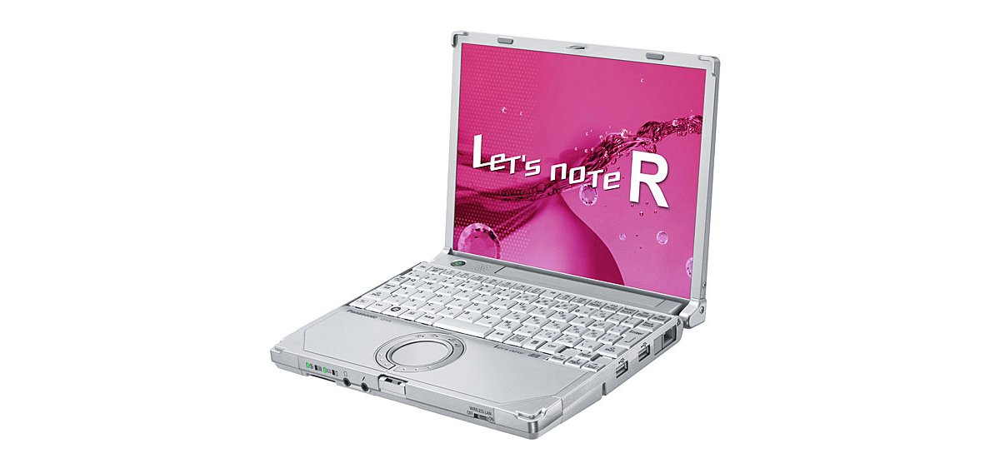
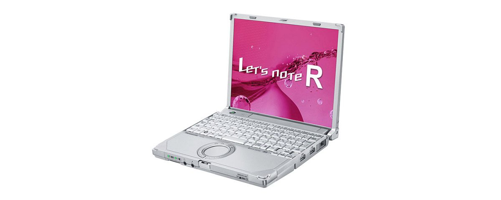

# Panasonic Let's note CF-R9 Specifications

**English** · [日本語](../../ja/CF-R9/) · [中文](../../zh/CF-R9/)

**CF-R9** is a Panasonic Let's note laptop in the R9 series with a 10.4-inch XGA display. This page lists all 4 part numbers, released 2010-02 – 2010-05. Each part number links to its official spec sheet.

*Panasonic Let's note CF-R9 (CF-R9JWACDR, CF-R9JWANDR). Image © Panasonic.*

## Part numbers

| Part number | Released | Discontinued | Summary |
| :-- | :-- | :-- | :-- |
| [CF-R9KWCEDR](https://panasonic.jp/pc/p-db/CF-R9KWCEDR_spec.html) | 2010-05 | 2010-09 | Windows® 7 Professional Genuine Edition, Intel® CoreTM i7-640UM (1.20GHz), Memory: standard 4GB (2GB memory added to expansion memory slot), HDD: 250GB, LAN, Wireless LAN 802.11a(W52/W53/W56)/b/g/n |
| [CF-R9KWCTDR](https://panasonic.jp/pc/p-db/CF-R9KWCTDR_spec.html) | 2010-05 | 2010-09 | Windows® 7 Professional Genuine Edition, Intel® CoreTM i7-640UM (1.20GHz), Memory: standard 4GB (2GB memory added to expansion memory slot), HDD: 250GB, LAN, Wireless LAN 802.11a(W52/W53/W56)/b/g/n, Office Home and Business 2010 <Limited quantity> |
| [CF-R9JWACDR](https://panasonic.jp/pc/p-db/CF-R9JWACDR_spec.html) | 2010-02 | 2010-05 | Windows® 7 Professional Genuine Edition, Intel® CoreTM i7-620UM (1.06GHz), Memory: standard 2GB (max 4GB), HDD: 250GB, LAN, Wireless LAN 802.11a(W52/W53/W56)/b/g/n |
| [CF-R9JWANDR](https://panasonic.jp/pc/p-db/CF-R9JWANDR_spec.html) | 2010-02 | 2010-05 | Windows® 7 Professional Genuine Edition, Intel® CoreTM i7-620UM (1.06GHz), Memory: standard 2GB (max 4GB), HDD: 160GB, LAN, Wireless LAN 802.11a(W52/W53/W56)/b/g/n, Office Personal 2007 <Limited quantity> |

## Common specifications

| Item | Value |
| :-- | :-- |
| Chipset | Mobile Intel QM57 Express chipset |
| Display | 10.4-inch TFT color LCD XGA (1024×768 dots) |
| Display / LCD colors | 1024×768 dots: approx. 16.77 million colors |
| Display / External output | 800×600, 1024×768, 1280×768, 1280×1024, 1400×1050, 1680×1050, 1600×1200, 1920×1080, 1920×1200 dots: approx. 16.77 million colors |
| Display / Simultaneous display | 800×600, 1024×768 dots: approx. 16.77 million colors |
| Wireless communication | Intel Centrino Advanced-N 6200 |
| Wireless LAN | IEEE802.11a (W52/W53/W56)/b/g/n compliant |
| Wired LAN | 1000BASE-T / 100BASE-TX / 10BASE-T |
| Audio | PCM sound source (24-bit stereo), Intel High Definition Audio compliant, monaural speaker |
| Security chip | TPM (TCG V1.2 compliant) |
| Keyboard | OADG-compliant 85 keys, key pitch 17mm (horizontal)/14.3mm (vertical) (excluding some keys) |
| Pointing device | Wheel pad |
| Power consumption | Max approx. 45W |
| Dimensions (W×D×H) | Width 229mm×Depth 187mm×Height 29.4mm/42.5mm (front/rear) |
| Accessories | 1 Product Recovery DVD-ROM (for Windows 7), AC adapter, battery pack, instruction manual, etc. |

## Differences by part number

| Part number | CPU | Memory | Storage | Weight | Battery life |
| :-- | :-- | :-- | :-- | :-- | :-- |
| CF-R9KWCEDR | Core i7-640UM vPro Smart Cache 4MB, operating frequency 1.20GHz, | 4GB DDR3 SDRAM | 250GB | 0.94 kg | 7 h |
| CF-R9KWCTDR | Core i7-640UM vPro Smart Cache 4MB, operating frequency 1.20GHz, | 4GB DDR3 SDRAM | 250GB | 0.94 kg | 7 h |
| CF-R9JWACDR | Ultra-low voltage version Core i7-620UM vPro | 2GB DDR3 SDRAM | 250GB | 0.93 kg | 7.5 h |
| CF-R9JWANDR | Ultra-low voltage version Core i7-620UM vPro | 2GB DDR3 SDRAM | 250GB | 0.93 kg | — |

CF-R9KWCEDR: all differing specifications

| Item | Value |
| :-- | :-- |
| OS | ▼Base OS: Windows7 Professional 32-bit genuine version/Windows7 Professional64-bit genuine version (WindowsXPMode equipped)▼Installed OS: Windows7 Professional 32-bit genuine version (WindowsXP Mode equipped) *All Japanese versions. |
| CPU | Intel vPro Technology, ultra-low voltage version / Intel Core i7-640UM vPro Processor Intel Smart Cache 4MB, clock speed 1.20GHz, (up to 2.26GHz when using Intel Turbo Boost Technology) |
| Memory | Standard 4GB DDR3 SDRAM (2GB memory already added to expansion memory slot, 0 free slots) |
| Video memory | Maximum 1563MB (shared with main memory) |
| Hard disk | 250GB (Serial ATA, 2.5-inch HDD 5400 rpm), of the above capacity, approx. 12GB is used as a recovery area and approx. 300MB as a system area (unavailable to the user) |
| Display / Graphics | Intel HD Graphics equipped (built into Ultra Low Voltage Intel Core i7-640UM vPro Processor) |
| Card slots / PC Card | PC card (TYPEII) ×1 slot (CardBus compatible, allowable current 3.3V: 400mA, 5V: 400mA) |
| Card slots / SD card | SD memory card ×1 slot (SDHC memory card/SDXC memory card support/copyright protection technology support) |
| Memory expansion slot | DDR3 204-pin SO-DIMM dedicated slot ×1 (1.5V/PC3-6400/DDR3 SDRAM) (2GB memory added, 0 free slots) |
| Ports | LAN connector (RJ-45), external display connector (analog RGB mini Dsub 15-pin), microphone input (stereo mini jack M3 (plug-in power compatible)), audio output (stereo mini jack M3)), USB port x2 (USB2.0) |
| Power | ▼AC adapter: Input: AC100V–240V, 50Hz/60Hz, Output: DC16V, 2.8A, power cord for 100V only / ▼Battery pack / 7.2V lithium-ion, nominal capacity 6.2Ah, rated capacity 5.8Ah |
| Energy efficiency | 2011 standards S category 0.18 / 2007 standards I category 0.00018 |
| Efficiency target achievement | — |
| Efficiency target achievement (FY2011 standard) | — |
| Battery life / charge time | Battery life: approx. 7 hours / Charging time: approx. 3.5 hours (power OFF), approx. 5 hours (power ON) |
| Weight (with battery) | PC body: approx. 0.94kg (when equipped with included battery pack (approx. 0.22kg)) |
| Software | Microsoft Internet Explorer8.0, Adobe Reader, Microsoft Windows Media Player 12, Microsoft .NET Framework 3.5.1, Windows Live Mail, Windows Live Messenger, Windows Live Photo Gallery, Windows Live Writer, Zoom Viewer, PC Information Viewer, PC Information Popup, NumLock Notification, Wireless Manager mobile edition5.5, Wireless Switch Utility, Security Setting Utility, Infineon TPM Professional Package V3.6, Battery Remaining Display Correction Utility, Hotkey Settings, McAfee PC Security Center, Midori no goo Stick, Hard Disk Data Erase Utility, Wheelpad Utility, Net Selector 2, USB Keyboard Helper, USB Mouse Helper, Fn Ctrl Function Swap Utility, i-Filter 5.0 (30-day trial version), Power Plan Extended Utility, Display Helper, Pittari View, Aptio Setup Utility, PC-Diagnostic Utility, Projector Helper, Windows XP Mode, Intel PROSet/Wireless Software |

Official spec sheet: <https://panasonic.jp/pc/p-db/CF-R9KWCEDR_spec.html>

CF-R9KWCTDR: all differing specifications

| Item | Value |
| :-- | :-- |
| OS | ▼Base OS: Windows7 Professional 32-bit genuine version/Windows7 Professional64-bit genuine version (WindowsXPMode equipped)▼Installed OS: Windows7 Professional 32-bit genuine version (WindowsXP Mode equipped) *All Japanese versions. |
| CPU | Intel vPro Technology, ultra-low voltage version / Intel Core i7-640UM vPro Processor Intel Smart Cache 4MB, clock speed 1.20GHz, (up to 2.26GHz when using Intel Turbo Boost Technology) |
| Memory | Standard 4GB DDR3 SDRAM (2GB memory already added to expansion memory slot, 0 free slots) |
| Video memory | Maximum 1563MB (shared with main memory) |
| Hard disk | 250GB (Serial ATA, 2.5-inch HDD 5400 rpm), of the above capacity, approx. 12GB is used as a recovery area and approx. 300MB as a system area (unavailable to the user) |
| Display / Graphics | Intel HD Graphics equipped (built into Ultra Low Voltage Intel Core i7-640UM vPro Processor) |
| Card slots / PC Card | PC card (TYPEII) ×1 slot (CardBus compatible, allowable current 3.3V: 400mA, 5V: 400mA) |
| Card slots / SD card | SD memory card ×1 slot (SDHC memory card/SDXC memory card support/copyright protection technology support) |
| Memory expansion slot | DDR3 204-pin SO-DIMM dedicated slot ×1 (1.5V/PC3-6400/DDR3 SDRAM) (2GB memory added, 0 free slots) |
| Ports | LAN connector (RJ-45), external display connector (analog RGB mini Dsub 15-pin), microphone input (stereo mini jack M3 (plug-in power compatible)), audio output (stereo mini jack M3)), USB port x2 (USB2.0) |
| Power | ▼AC adapter: Input: AC100V–240V, 50Hz/60Hz, Output: DC16V, 2.8A, power cord for 100V only / ▼Battery pack / 7.2V lithium-ion, nominal capacity 6.2Ah, rated capacity 5.8Ah |
| Energy efficiency | 2011 standards S category 0.18 / 2007 standards I category 0.00018 |
| Efficiency target achievement (FY2011 standard) | — |
| Battery life / charge time | Battery life: approx. 7 hours / Charging time: approx. 3.5 hours (power OFF), approx. 5 hours (power ON) |
| Weight (with battery) | PC body: approx. 0.94kg (when equipped with included battery pack (approx. 0.22kg)) |
| Software | Microsoft Internet Explorer8.0, Adobe Reader, Microsoft Windows Media Player 12, Microsoft .NET Framework 3.5.1, Windows Live Mail, Windows Live Messenger, Windows Live Photo Gallery, Windows Live Writer, Zoom Viewer, PC Information Viewer, PC Information Popup, NumLock Notification, Wireless Manager mobile edition5.5, Wireless Switch Utility, Security Setting Utility, Infineon TPM Professional Package V3.6, Battery Remaining Display Correction Utility, Hotkey Settings, McAfee PC Security Center, Midori no goo Stick, Hard Disk Data Erase Utility, Wheelpad Utility, Net Selector 2, USB Keyboard Helper, USB Mouse Helper, Fn Ctrl Function Swap Utility, i-Filter 5.0 (30-day trial version), Power Plan Extended Utility, Display Helper, Pittari View, Aptio Setup Utility, PC-Diagnostic Utility, Projector Helper, Windows XP Mode, Intel PROSet/Wireless Software, Office Home and Business 2010 equipped (Word, Excel, PowerPoint, Outlook, OneNote) |

Official spec sheet: <https://panasonic.jp/pc/p-db/CF-R9KWCTDR_spec.html>

CF-R9JWACDR: all differing specifications

| Item | Value |
| :-- | :-- |
| OS | ▼Base OS: Windows7 Professional 32-bit genuine version/Windows7 Professional 64-bit genuine version (WindowsXP Mode equipped) / ▼Installed OS: Windows7 Professional 32-bit genuine version (WindowsXP Mode equipped) *All Japanese versions |
| CPU | Ultra-low voltage Intel Core i7-620UM vPro processor / Intel Smart Cache 4MB, operating frequency 1.06GHz, / max. 2.13GHz when using Intel Turbo Boost Technology |
| Memory | Standard 2GB DDR3 SDRAM (1 free slot) / maximum 4GB |
| Video memory | Max 763MB, 1563MB when 2GB memory is added (shared with main memory) |
| Hard disk | 250GB (Serial ATA) *Of the capacity described on the left, approx. 12GB is used as a recovery area and approx. 300MB as a system area (unavailable to the user) |
| Card slots / PC Card | PC card (TYPEII) ×1 slot (CardBus compatible, allowable current 3.3V: 400Ma, 5V: 400mA) |
| Card slots / SD card | SD memory card ×1 slot (SDHC memory card/copyright protection technology support) |
| Memory expansion slot | DDR3 204-pin SO-DIMM dedicated slot ×1 (1.5V/PC3-6400/DDR3 SDRAM) |
| Ports | LAN connector (RJ-45), external display connector (analog RGB mini Dsub 15-pin), microphone input (stereo mini jack M3 (plug-in power supported)), audio output (stereo mini jack M3) |
| Power | ▼AC adapter / Input: AC100V–240V, 50Hz/60Hz, Output: DC16 V, 2.8A, power cord for 100V only / ▼Battery pack / 7.2V lithium-ion, nominal capacity 6.2Ah, rated capacity 5.8Ah |
| Energy efficiency | 2007 fiscal year standard l category 0.00019 |
| Efficiency target achievement | — |
| Weight (with battery) | PC body: approx. 0.93kg (when equipped with included battery pack (approx. 0.22kg)) |
| Software | Microsoft Internet Explorer8.0, Adobe Reader, Microsoft Windows Media Player 12, DirectX 11, Microsoft .NET Framework 3.5.1, Windows Live Mail, Windows Live Messenger, Windows Live Photo Gallery, Windows Live Writer, Zoom Viewer, PC Information Viewer, PC Information Popup, NumLock Notification, Wireless Manager mobile edition5.5, Wireless Switch Utility, Security Setting Utility, Infineon TPM Professional Package V3.6, Battery Remaining Display Correction Utility, Hotkey Settings, McAfee PC Security Center, Midori no goo Stick, Hard Disk Data Erase Utility, Wheelpad Utility, Net Selector 2, USB Keyboard Helper, USB Mouse Helper, Fn Ctrl Function Swap Utility, i-Filter 5.0 (30-day trial version), Panasonic Power Plan Extended Utility, Display Helper, Pittari View, Aptio Setup Utility, PC-Diagnostic Utility, Projector Helper, Windows XP Mode |
| Floppy drive (optional) | (Sold separately) USB-connected external 3.5-inch 3-mode compatible (1.44MB/1.2MB/720KB) |
| Battery | Battery life approx. 7.5 hours |

Official spec sheet: <https://panasonic.jp/pc/p-db/CF-R9JWACDR_spec.html>

CF-R9JWANDR: all differing specifications

| Item | Value |
| :-- | :-- |
| OS | ▼Base OS: Windows7 Professional 32-bit genuine version/Windows7 Professional 64-bit genuine version (WindowsXP Mode equipped) / ▼Installed OS: Windows7 Professional 32-bit genuine version (WindowsXP Mode equipped) *All Japanese versions |
| CPU | Ultra-low voltage Intel Core i7-620UM vPro processor / Intel Smart Cache 4MB, operating frequency 1.06GHz, / max. 2.13GHz when using Intel Turbo Boost Technology |
| Memory | Standard 2GB DDR3 SDRAM (1 free slot) / maximum 4GB |
| Video memory | Max 763MB, 1563MB when 2GB memory is added (shared with main memory) |
| Hard disk | 250GB (Serial ATA) *Of the capacity described on the left, approx. 12GB is used as a recovery area and approx. 300MB as a system area (unavailable to the user) |
| Card slots / PC Card | PC card (TYPEII) ×1 slot (CardBus compatible, allowable current 3.3V: 400Ma, 5V: 400mA) |
| Card slots / SD card | SD memory card ×1 slot (SDHC memory card/copyright protection technology support) |
| Memory expansion slot | DDR3 204-pin SO-DIMM dedicated slot ×1 (1.5V/PC3-6400/DDR3 SDRAM) |
| Ports | LAN connector (RJ-45), external display connector (analog RGB mini Dsub 15-pin), microphone input (stereo mini jack M3 (plug-in power supported)), audio output (stereo mini jack M3) |
| Power | ▼AC adapter / Input: AC100V–240V, 50Hz/60Hz, Output: DC16 V, 2.8A, power cord for 100V only / ▼Battery pack / 7.2V lithium-ion, nominal capacity 6.2Ah, rated capacity 5.8Ah |
| Energy efficiency | 2007 fiscal year standard l category 0.00019 |
| Efficiency target achievement | — |
| Weight (with battery) | PC body: approx. 0.93kg (when equipped with included battery pack (approx. 0.22kg)) |
| Software | Microsoft Internet Explorer8.0, Adobe Reader, Microsoft Windows Media Player 12, DirectX 11, Microsoft .NET Framework 3.5.1, Windows Live Mail, Windows Live Messenger, Windows Live Photo Gallery, Windows Live Writer, Zoom Viewer, PC Information Viewer, PC Information Popup, NumLock Notification, Wireless Manager mobile edition5.5, Wireless Switch Utility, Security Setting Utility, Infineon TPM Professional Package V3.6, Battery Remaining Display Correction Utility, Hotkey Settings, McAfee PC Security Center, Midori no goo Stick, Hard Disk Data Erase Utility, Wheelpad Utility, Net Selector 2, USB Keyboard Helper, USB Mouse Helper, Fn Ctrl Function Swap Utility, i-Filter 5.0 (30-day trial version), Panasonic Power Plan Extended Utility, Display Helper, Pittari View, Aptio Setup Utility, PC-Diagnostic Utility, Projector Helper, Windows XP Mode, Microsoft(R) Office Personal 2007 with Microsoft(R) Office PowerPoint(R) 2007(ServicePack2) |
| Floppy drive (optional) | (Sold separately) USB-connected external 3.5-inch 3-mode compatible (1.44MB/1.2MB/720KB) |
| Battery | 2007 fiscal year standard l category 0.00019 |

Official spec sheet: <https://panasonic.jp/pc/p-db/CF-R9JWANDR_spec.html>

## Photos

*Panasonic Let's note CF-R9 (CF-R9KWCEDR). Image © Panasonic.*

*Panasonic Let's note CF-R9 (CF-R9KWCTDR). Image © Panasonic.*

## Related models

- [All Let's note models](../)

---

Source: Panasonic's official [discontinued-models list](https://panasonic.jp/pc/support/products/) and spec sheets (panasonic.jp), translated from Japanese; see the official sheets for the authoritative wording. Product images © Panasonic. This is an unofficial compilation, not affiliated with Panasonic.
