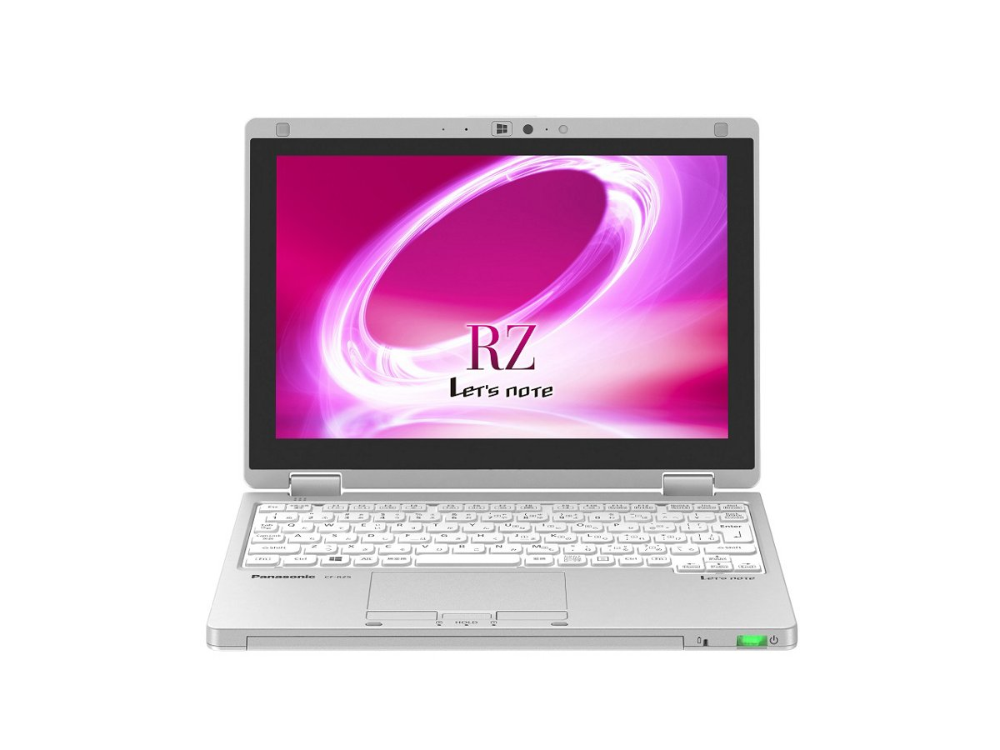
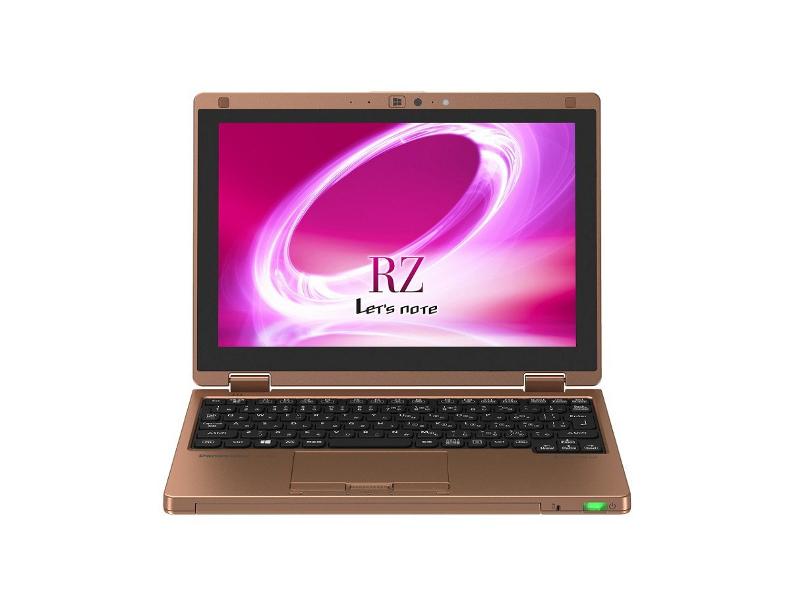
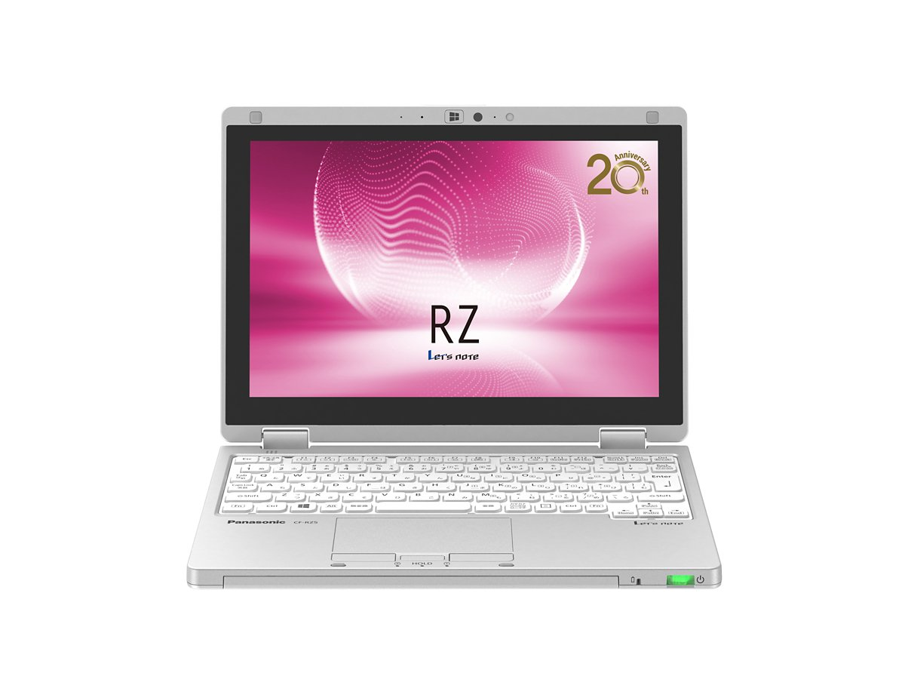
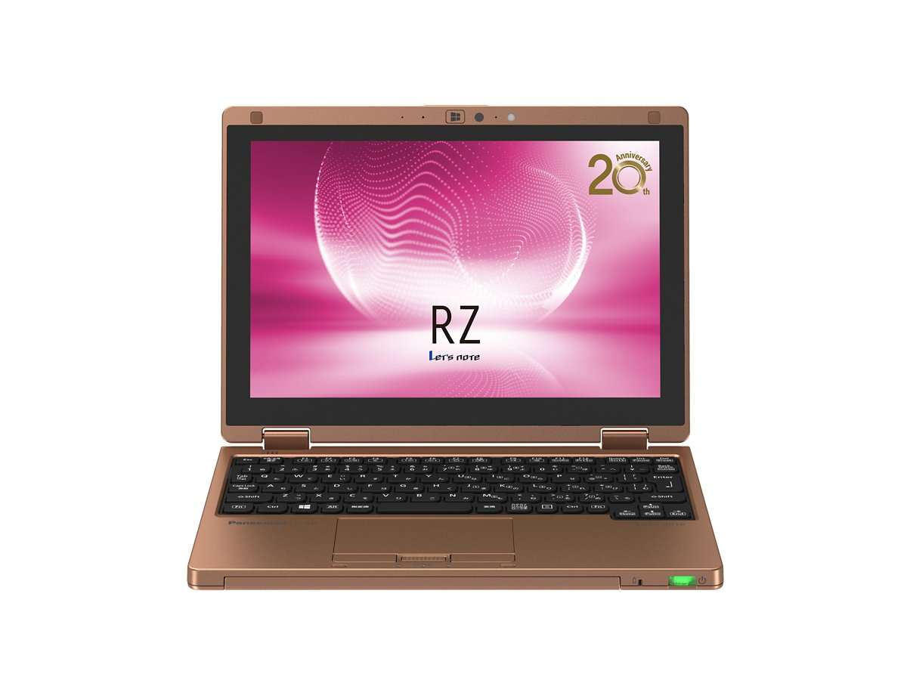

# Panasonic Let's note CF-RZ5 Specifications

**English** · [日本語](../../ja/CF-RZ5/) · [中文](../../zh/CF-RZ5/)

**CF-RZ5** is a Panasonic Let's note laptop in the RZ series with a 10.1-inch WUXGA display. This page lists all 13 part numbers, released 2015-10 – 2016-06. Each part number links to its official spec sheet.

*Panasonic Let's note CF-RZ5 (CF-RZ5GDFPR, CF-RZ5HDLQR, CF-RZ5CDDPR, CF-RZ5CDFPR …), silver. Image © Panasonic.*

## Part numbers

| Part number | Released | Discontinued | Summary |
| :-- | :-- | :-- | :-- |
| [CF-RZ5VDFPR](https://panasonic.jp/pc/p-db/CF-RZ5VDFPR_spec.html) | 2016-06 | 2017-01 | Windows 10 Home 64-bit, Intel® CoreTM m3-6Y30 processor, Memory: 8GB (no expansion slot), SSD: 128GB, LAN, Wireless LAN 802.11a (W52/W53/W56)/b/g/n/ac, Microsoft® Office Home and Business Premium |
| [CF-RZ5VFEPR](https://panasonic.jp/pc/p-db/CF-RZ5VFEPR_spec.html) | 2016-06 | 2017-01 | Windows 10 Home 64-bit, Intel® CoreTM m3-6Y30 processor, Memory: 8GB (no expansion slot), SSD: 128GB, LAN, Wireless LAN 802.11a (W52/W53/W56)/b/g/n/ac, LTE-compatible wireless WAN, Microsoft® Office Home and Business Premium |
| [CF-RZ5WDLQR](https://panasonic.jp/pc/p-db/CF-RZ5WDLQR_spec.html) | 2016-06 | 2017-01 | Windows 10 Pro 64-bit, Intel® CoreTM m5-6Y54 processor, Memory: 8GB (no expansion slot), SSD: 256GB, LAN, Wireless LAN 802.11a (W52/W53/W56)/b/g/n/ac, Microsoft® Office Home and Business Premium |
| [CF-RZ5WFMQR](https://panasonic.jp/pc/p-db/CF-RZ5WFMQR_spec.html) | 2016-06 | 2017-01 | Windows 10 Pro 64-bit, Intel® CoreTM m5-6Y54 processor, Memory: 8GB (no expansion slot), SSD: 256GB, LAN, Wireless LAN 802.11a (W52/W53/W56)/b/g/n/ac, LTE-compatible wireless WAN, Microsoft® Office Home and Business Premium |
| [CF-RZ5GDFPR](https://panasonic.jp/pc/p-db/CF-RZ5GDFPR_spec.html) | 2016-01 | 2016-11 | Windows 10 Home 64-bit, Intel® CoreTM m3-6Y30 processor, Memory: 4GB (no expansion slot), SSD: 128GB, LAN, Wireless LAN 802.11a (W52/W53/W56)/b/g/n/ac, Microsoft® Office Home and Business Premium |
| [CF-RZ5GFEPR](https://panasonic.jp/pc/p-db/CF-RZ5GFEPR_spec.html) | 2016-01 | 2016-11 | Windows 10 Home 64-bit, Intel® CoreTM m3-6Y30 processor, Memory: 4GB (no expansion slot), SSD: 128GB, LAN, Wireless LAN 802.11a (W52/W53/W56)/b/g/n/ac, LTE-compatible wireless WAN, Microsoft® Office Home and Business Premium |
| [CF-RZ5HDLQR](https://panasonic.jp/pc/p-db/CF-RZ5HDLQR_spec.html) | 2016-01 | 2016-11 | Windows 10 Pro 64-bit, Intel® CoreTM m5-6Y54 processor, Memory: 8GB (no expansion slot), SSD: 256GB, LAN, Wireless LAN 802.11a (W52/W53/W56)/b/g/n/ac, Microsoft® Office Home and Business Premium |
| [CF-RZ5HFMQR](https://panasonic.jp/pc/p-db/CF-RZ5HFMQR_spec.html) | 2016-01 | 2016-11 | Windows 10 Pro 64-bit, Intel® CoreTM m5-6Y54 processor, Memory: 8GB (no expansion slot), SSD: 256GB, LAN, Wireless LAN 802.11a (W52/W53/W56)/b/g/n/ac, LTE-compatible wireless WAN, Microsoft® Office Home and Business Premium |
| [CF-RZ5CDDPR](https://panasonic.jp/pc/p-db/CF-RZ5CDDPR_spec.html) | 2015-10 | 2016-11 | Windows 10 Home 64-bit, Intel® CoreTM m3-6Y30 processor, Memory: 4GB (no expansion slot), SSD: 128GB, LAN, Wireless LAN 802.11a (W52/W53/W56)/b/g/n/ac |
| [CF-RZ5CDFPR](https://panasonic.jp/pc/p-db/CF-RZ5CDFPR_spec.html) | 2015-10 | 2016-11 | Windows 10 Home 64-bit, Intel® CoreTM m3-6Y30 processor, Memory: 4GB (no expansion slot), SSD: 128GB, LAN, Wireless LAN 802.11a (W52/W53/W56)/b/g/n/ac, Microsoft® Office Home and Business Premium |
| [CF-RZ5CFEPR](https://panasonic.jp/pc/p-db/CF-RZ5CFEPR_spec.html) | 2015-10 | 2016-11 | Windows 10 Home 64-bit, Intel® CoreTM m3-6Y30 processor, Memory: 4GB (no expansion slot), SSD: 128GB, LAN, Wireless LAN 802.11a (W52/W53/W56)/b/g/n/ac, LTE-compatible wireless WAN |
| [CF-RZ5YDLQR](https://panasonic.jp/pc/p-db/CF-RZ5YDLQR_spec.html) | 2015-10 | 2016-11 | Windows 10 Pro 64-bit, Intel® CoreTM m5-6Y54 processor, Memory: 8GB (no expansion slot), SSD: 256GB, LAN, Wireless LAN 802.11a (W52/W53/W56)/b/g/n/ac, Microsoft® Office Home and Business Premium |
| [CF-RZ5YFMQR](https://panasonic.jp/pc/p-db/CF-RZ5YFMQR_spec.html) | 2015-10 | 2016-11 | Windows 10 Pro 64-bit, Intel® CoreTM m5-6Y54 processor, Memory: 8GB (no expansion slot), SSD: 256GB, LAN, Wireless LAN 802.11a (W52/W53/W56)/b/g/n/ac, LTE-compatible wireless WAN, Microsoft® Office Home and Business Premium |

## Common specifications

| Item | Value |
| :-- | :-- |
| Chipset | Built into CPU |
| Display | 10.1-inch (16:10) WUXGA TFT color IPS LCD (1920×1200 dots), electrostatic touch panel, with anti-glare protective film |
| Display / Graphics | Intel HD Graphics 515 (built into CPU) |
| Display / LCD colors | 1920×1200 dots: approx. 16.77 million colors |
| Display / External output | 1024×768, 1280×768, 1280×1024, 1360×768, 1366×768, 1400×1050, 1600×900, 1600×1200, 1680×1050, 1920×1080, 1920×1200 dots: approx. 16.77 million colors |
| Display / Simultaneous display | 1024×768, 1280×768, 1280×1024, 1360×768, 1366×768, 1400×1050, 1600×900, 1600×1200, 1680×1050, 1920×1080, 1920×1200 dots: approx. 16.77 million colors |
| Wireless communication | Intel Dual Band Wireless-AC 8260 |
| Wireless LAN | IEEE802.11a (W52/W53/W56)/b/g/n/ac compliant |
| Wired LAN | 1000BASE-T/100BASE-TX/10BASE-T |
| Bluetooth | Bluetooth v4.1 / ■Supported profiles / 【Classic】 / ・A2DP (Source) / ・AVRCP (Target) / ・HCRP (Client) / ・HFP (AG) / ・HID (Host) / ・OPP (Client and Server) / ・PAN (User) / ・SPP (DevA and DevB) / 【Low Energy】 / ・HOGP (Host) |
| Audio | PCM sound source (24-bit stereo), Intel High Definition Audio compliant, monaural speaker |
| Memory expansion slot | None |
| Camera | Effective pixels: max. 1920×1080 pixels (approx. 2.07 megapixels) |
| Microphone | Array microphone |
| Sensors | Illuminance sensor / Geomagnetic sensor / Gyro sensor / Acceleration sensor |
| Ports | ・LAN connector (RJ-45) / ・External display connector (Analog RGB mini D-sub 15-pin) / ・HDMI output terminal / ・Headset terminal (Microphone input + audio output) (headset mini jack M3) / ・USB3.0 port × 3 (one of which also serves as a USB charging port) |
| Keyboard | OADG-compliant 86 keys, key pitch 16.8mm (horizontal)/14.2mm (vertical) (excluding some keys) |
| Pointing device | Capacitive touch panel / Touchpad |
| Power | ▼AC adapter / Input: AC100V–240V, 50Hz/60Hz, Output: DC16V, 2.8A, power cord for 100V only / ▼Battery pack / 7.6V (lithium-ion) nominal capacity 4860mAh, rated capacity 4740mAh |
| Power consumption | Max approx. 45W |
| Efficiency target achievement (FY2011 standard) | — |
| Dimensions (W×D×H) | Width 250mm × Depth 180.8mm × Height 19.5mm (excluding protrusions) |
| Software | ・Microsoft® Internet Explorer 11 / ・Microsoft® Edge / ・Microsoft® .NET Framework 4.6 / ・Microsoft® Windows Media Player 12 / ・NetSelector Lite / ・Handwriting Tool 2 / ・Intel® Wireless Bluetooth® / ・McAfee LiveSafe (60-day free trial) / ・i-Filter 6.0 (30-day free trial) / ・WinZip 19.5 Japanese version (45-day trial) / ・Display Helper / ・Wireless Manager mobile edition / ・Intel WiDi / ・Aptio Setup Utility / ・PC-Diagnostic Utility / ・Panasonic PC Settings Utility / ・Hard Disk Data Erase Utility / ・DirectX 12 / ・Intel PROSet/Wireless Software / ・Screen Sharing Assist Utility / ・PC Information Viewer / ・Recovery Disc Creation Utility |

## Differences by part number

| Part number | CPU | Memory | Storage | Weight | Battery life |
| :-- | :-- | :-- | :-- | :-- | :-- |
| CF-RZ5VDFPR | Core m3-6Y30 | 8GB LPDDR3 SDRAM | 128GB | 0.745 kg | 11 h |
| CF-RZ5VFEPR | Core m3-6Y30 | 8GB LPDDR3 SDRAM | 128GB | 0.77 kg | 11 h |
| CF-RZ5WDLQR | Core m5-6Y54 | 8GB LPDDR3 SDRAM | 256GB | 0.745 kg | 11 h |
| CF-RZ5WFMQR | Core m5-6Y54 | 8GB LPDDR3 SDRAM | 256GB | 0.77 kg | 11 h |
| CF-RZ5GDFPR | Core m3-6Y30 | 4GB LPDDR3 SDRAM | 128GB | 0.745 kg | 11.5 h |
| CF-RZ5GFEPR | Core m3-6Y30 | 4GB LPDDR3 SDRAM | 128GB | 0.77 kg | 11.5 h |
| CF-RZ5HDLQR | Core m5-6Y54 | 8GB LPDDR3 SDRAM | 256GB | 0.745 kg | 11 h |
| CF-RZ5HFMQR | Core m5-6Y54 | 8GB LPDDR3 SDRAM | 256GB | 0.77 kg | 11 h |
| CF-RZ5CDDPR | Core m3-6Y30 | 4GB LPDDR3 SDRAM | 128GB | 0.745 kg | 11.5 h |
| CF-RZ5CDFPR | Core m3-6Y30 | 4GB LPDDR3 SDRAM | 128GB | 0.745 kg | 11.5 h |
| CF-RZ5CFEPR | Core m3-6Y30 | 4GB LPDDR3 SDRAM | 128GB | 0.770 kg | 11.5 h |
| CF-RZ5YDLQR | Core m5-6Y54 | 8GB LPDDR3 SDRAM | 256GB | 0.745 kg | 11 h |
| CF-RZ5YFMQR | Core m5-6Y54 | 8GB LPDDR3 SDRAM | 256GB | 0.770 kg | 11 h |

CF-RZ5VDFPR: all differing specifications

| Item | Value |
| :-- | :-- |
| OS | Windows 10 Home 64-bit (Japanese version) |
| CPU | Intel Core m3-6Y30 Processor / Intel Smart Cache 4MB, Operating Frequency 0.90GHz (up to 2.20GHz with Intel Turbo Boost Technology 2.0) |
| Memory | 8GB LPDDR3 SDRAM (no expansion slot) |
| Video memory | Max 4176MB (shared with main memory) |
| SSD | Flash memory drive (SSD) 128GB (Serial ATA) Of the above capacity, approx. 15GB is used as the recovery area and approx. 1GB as the system area (unavailable to the user) |
| LTE | None |
| Security chip | TPM (TCG V1.2 compliant) |
| SD card slot | SD memory card ×1 slot (SDHC memory card/SDXC memory card support/UHS-II, UHS-I high-speed transfer support/copyright protection technology support) |
| Energy efficiency | 2011 fiscal year standard N category 0.021 |
| Battery life / charge time | ▼Battery life : / (JEITA Ver.2.0) approx. 11 hours / ▼Charging time: / approx. 2.5 hours (both power ON/OFF) |
| Color | Silver |
| Weight (with battery) | PC body: approx. 0.745kg (when attached battery pack (approx. 200g) is installed) / AC adapter: approx. 185g (excluding wall mount plug (approx. 20g) and power cord (approx. 60g)) |
| Microsoft Office | Microsoft® Office Home and Business Premium |
| Accessories | AC adapter with wall-mount plug, battery pack, dedicated cloth, instruction manual, Microsoft Office Home & Business Premium |

Official spec sheet: <https://panasonic.jp/pc/p-db/CF-RZ5VDFPR_spec.html>

CF-RZ5VFEPR: all differing specifications

| Item | Value |
| :-- | :-- |
| OS | Windows 10 Home 64-bit (Japanese version) |
| CPU | Intel Core m3-6Y30 Processor / Intel Smart Cache 4MB, Operating Frequency 0.90GHz (up to 2.20GHz with Intel Turbo Boost Technology 2.0) |
| Memory | 8GB LPDDR3 SDRAM (no expansion slot) |
| Video memory | Max 4176MB (shared with main memory) |
| SSD | Flash memory drive (SSD) 128GB (Serial ATA) Of the above capacity, approx. 15GB is used as the recovery area and approx. 1GB as the system area (unavailable to the user) |
| LTE | Built-in wireless WAN module (LTE compatible) |
| Security chip | TPM (TCG V1.2 compliant) |
| Energy efficiency | 2011 fiscal year standard N category 0.021 |
| Battery life / charge time | ▼Battery life : / (JEITA Ver.2.0) approx. 11 hours / ▼Charging time: / approx. 2.5 hours (both power ON/OFF) |
| Color | Blue & Copper |
| Weight (with battery) | PC body: approx. 0.77kg (when equipped with included battery pack (approx. 200g)) / AC adapter: approx. 185g (excluding wall mount plug (approx. 20g) and power cord (approx. 60g)) |
| Microsoft Office | Microsoft® Office Home and Business Premium |
| Accessories | AC adapter with wall-mount plug, battery pack, dedicated cloth, instruction manual, Microsoft Office Home & Business Premium |
| Card slots / SD card | SD memory card ×1 slot (SDHC memory card/SDXC memory card support/UHS-II, UHS-I high-speed transfer support/copyright protection technology support) |
| Card slots / Other | docomo UIM card slot (standard size) |

Official spec sheet: <https://panasonic.jp/pc/p-db/CF-RZ5VFEPR_spec.html>

CF-RZ5WDLQR: all differing specifications

| Item | Value |
| :-- | :-- |
| OS | Windows 10 Pro 64-bit (Japanese version) |
| CPU | Intel Core m5-6Y54 Processor / Intel Smart Cache 4MB, Operating Frequency 1.10GHz (up to 2.70GHz with Intel Turbo Boost Technology 2.0) |
| Memory | 8GB LPDDR3 SDRAM (no expansion slot) |
| Video memory | Max 4176MB (shared with main memory) |
| SSD | Flash memory drive (SSD) 256GB (Serial ATA) Of the above capacity, approx. 15GB is used as the recovery area and approx. 1GB as the system area (unavailable to the user) |
| LTE | None |
| Security chip | TPM (TCG V1.2 compliant) |
| SD card slot | SD memory card ×1 slot (SDHC memory card/SDXC memory card support/UHS-II, UHS-I high-speed transfer support/copyright protection technology support) |
| Energy efficiency | 2011 fiscal year standard N category 0.017 |
| Battery life / charge time | ▼Battery life : / (JEITA Ver.2.0) approx. 11 hours / ▼Charging time: / approx. 2.5 hours (both power ON/OFF) |
| Color | Silver |
| Weight (with battery) | PC body: approx. 0.745kg (when attached battery pack (approx. 200g) is installed) / AC adapter: approx. 185g (excluding wall mount plug (approx. 20g) and power cord (approx. 60g)) |
| Microsoft Office | Microsoft® Office Home and Business Premium |
| Accessories | AC adapter with wall-mount plug, battery pack, dedicated cloth, instruction manual, Microsoft Office Home & Business Premium |

Official spec sheet: <https://panasonic.jp/pc/p-db/CF-RZ5WDLQR_spec.html>

CF-RZ5WFMQR: all differing specifications

| Item | Value |
| :-- | :-- |
| OS | Windows 10 Pro 64-bit (Japanese version) |
| CPU | Intel Core m5-6Y54 Processor / Intel Smart Cache 4MB, Operating Frequency 1.10GHz (up to 2.70GHz with Intel Turbo Boost Technology 2.0) |
| Memory | 8GB LPDDR3 SDRAM (no expansion slot) |
| Video memory | Max 4176MB (shared with main memory) |
| SSD | Flash memory drive (SSD) 256GB (Serial ATA) Of the above capacity, approx. 15GB is used as the recovery area and approx. 1GB as the system area (unavailable to the user) |
| LTE | Built-in wireless WAN module (LTE compatible) |
| Security chip | TPM (TCG V1.2 compliant) |
| Energy efficiency | 2011 fiscal year standard N category 0.017 |
| Battery life / charge time | ▼Battery life : / (JEITA Ver.2.0) approx. 11 hours / ▼Charging time: / approx. 2.5 hours (both power ON/OFF) |
| Color | Warm Gold & Copper |
| Weight (with battery) | PC body: approx. 0.77kg (when equipped with included battery pack (approx. 200g)) / AC adapter: approx. 185g (excluding wall mount plug (approx. 20g) and power cord (approx. 60g)) |
| Microsoft Office | Microsoft® Office Home and Business Premium |
| Accessories | AC adapter with wall-mount plug, battery pack, dedicated cloth, instruction manual, Microsoft Office Home & Business Premium |
| Card slots / SD card | SD memory card ×1 slot (SDHC memory card/SDXC memory card support/UHS-II, UHS-I high-speed transfer support/copyright protection technology support) |
| Card slots / Other | docomo UIM card slot (standard size) |

Official spec sheet: <https://panasonic.jp/pc/p-db/CF-RZ5WFMQR_spec.html>

CF-RZ5GDFPR: all differing specifications

| Item | Value |
| :-- | :-- |
| OS | Windows 10 Home 64-bit (Japanese version) |
| CPU | Intel Core m3-6Y30 Processor / Intel Smart Cache 4MB, Operating Frequency 0.90GHz (up to 2.20GHz with Intel Turbo Boost Technology 2.0) |
| Memory | 4GB LPDDR3 SDRAM (no expansion slot) |
| Video memory | Max. 2119MB (shared with main memory) |
| SSD | Flash memory drive (SSD) 128GB (Serial ATA) Of the above capacity, approx. 15GB is used as the recovery area and approx. 1GB as the system area (unavailable to the user) |
| LTE | None |
| SD card slot | SD memory card ×1 slot (SDHC memory card/SDXC memory card support/UHS-II, UHS-I high-speed transfer support/copyright protection technology support) |
| Energy efficiency | 2011 standards S category 0.021 |
| Battery life / charge time | ▼Battery life : / (JEITA Ver.2.0) approx. 11.5 hours / ▼Charging time: / approx. 2.5 hours (both power ON/OFF) |
| Color | Silver |
| Weight (with battery) | PC body: approx. 0.745kg (when attached battery pack (approx. 200g) is installed) / AC adapter: approx. 185g (excluding wall mount plug (approx. 20g) and power cord (approx. 60g)) |
| Microsoft Office | Microsoft® Office Home and Business Premium |
| Accessories | AC adapter with wall-mount plug, battery pack, dedicated cloth, instruction manual, Microsoft Office Home & Business Premium |

Official spec sheet: <https://panasonic.jp/pc/p-db/CF-RZ5GDFPR_spec.html>

CF-RZ5GFEPR: all differing specifications

| Item | Value |
| :-- | :-- |
| OS | Windows 10 Home 64-bit (Japanese version) |
| CPU | Intel Core m3-6Y30 Processor / Intel Smart Cache 4MB, Operating Frequency 0.90GHz (up to 2.20GHz with Intel Turbo Boost Technology 2.0) |
| Memory | 4GB LPDDR3 SDRAM (no expansion slot) |
| Video memory | Max. 2119MB (shared with main memory) |
| SSD | Flash memory drive (SSD) 128GB (Serial ATA) Of the above capacity, approx. 15GB is used as the recovery area and approx. 1GB as the system area (unavailable to the user) |
| LTE | Built-in wireless WAN module (Xi (LTE) compatible) |
| Energy efficiency | 2011 standards S category 0.021 |
| Battery life / charge time | ▼Battery life : / (JEITA Ver.2.0) approx. 11.5 hours / ▼Charging time: / approx. 2.5 hours (both power ON/OFF) |
| Color | Blue & Copper |
| Weight (with battery) | PC body: approx. 0.77kg (when equipped with included battery pack (approx. 200g)) / AC adapter: approx. 185g (excluding wall mount plug (approx. 20g) and power cord (approx. 60g)) |
| Microsoft Office | Microsoft® Office Home and Business Premium |
| Accessories | AC adapter with wall-mount plug, battery pack, dedicated cloth, instruction manual, Microsoft Office Home & Business Premium |
| Card slots / SD card | SD memory card ×1 slot (SDHC memory card/SDXC memory card support/UHS-II, UHS-I high-speed transfer support/copyright protection technology support) |
| Card slots / Other | docomo UIM card (standard size) |

Official spec sheet: <https://panasonic.jp/pc/p-db/CF-RZ5GFEPR_spec.html>

CF-RZ5HDLQR: all differing specifications

| Item | Value |
| :-- | :-- |
| OS | Windows 10 Pro 64-bit (Japanese version) |
| CPU | Intel Core m5-6Y54 Processor / Intel Smart Cache 4MB, Operating Frequency 1.10GHz (up to 2.70GHz with Intel Turbo Boost Technology 2.0) |
| Memory | 8GB LPDDR3 SDRAM (no expansion slot) |
| Video memory | Max 4178MB (shared with main memory) |
| SSD | Flash memory drive (SSD) 256GB (Serial ATA) Of the above capacity, approx. 15GB is used as the recovery area and approx. 1GB as the system area (unavailable to the user) |
| LTE | None |
| SD card slot | SD memory card ×1 slot (SDHC memory card/SDXC memory card support/UHS-II, UHS-I high-speed transfer support/copyright protection technology support) |
| Energy efficiency | 2011 fiscal year standard N category 0.017 |
| Battery life / charge time | ▼Battery life : / (JEITA Ver.2.0) approx. 11 hours / ▼Charging time: / approx. 2.5 hours (both power ON/OFF) |
| Color | Silver |
| Weight (with battery) | PC body: approx. 0.745kg (when attached battery pack (approx. 200g) is installed) / AC adapter: approx. 185g (excluding wall mount plug (approx. 20g) and power cord (approx. 60g)) |
| Microsoft Office | Microsoft® Office Home and Business Premium |
| Accessories | AC adapter with wall-mount plug, battery pack, dedicated cloth, instruction manual, Microsoft Office Home & Business Premium |

Official spec sheet: <https://panasonic.jp/pc/p-db/CF-RZ5HDLQR_spec.html>

CF-RZ5HFMQR: all differing specifications

| Item | Value |
| :-- | :-- |
| OS | Windows 10 Pro 64-bit (Japanese version) |
| CPU | Intel Core m5-6Y54 Processor / Intel Smart Cache 4MB, Operating Frequency 1.10GHz (up to 2.70GHz with Intel Turbo Boost Technology 2.0) |
| Memory | 8GB LPDDR3 SDRAM (no expansion slot) |
| Video memory | Max 4178MB (shared with main memory) |
| SSD | Flash memory drive (SSD) 256GB (Serial ATA) Of the above capacity, approx. 15GB is used as the recovery area and approx. 1GB as the system area (unavailable to the user) |
| LTE | Built-in wireless WAN module (Xi (LTE) compatible) |
| Energy efficiency | 2011 fiscal year standard N category 0.017 |
| Battery life / charge time | ▼Battery life : / (JEITA Ver.2.0) approx. 11 hours / ▼Charging time: / approx. 2.5 hours (both power ON/OFF) |
| Color | Warm Gold & Copper |
| Weight (with battery) | PC body: approx. 0.77kg (when equipped with included battery pack (approx. 200g)) / AC adapter: approx. 185g (excluding wall mount plug (approx. 20g) and power cord (approx. 60g)) |
| Microsoft Office | Microsoft® Office Home and Business Premium |
| Accessories | AC adapter with wall-mount plug, battery pack, dedicated cloth, instruction manual, Microsoft Office Home & Business Premium |
| Card slots / SD card | SD memory card ×1 slot (SDHC memory card/SDXC memory card support/UHS-II, UHS-I high-speed transfer support/copyright protection technology support) |
| Card slots / Other | docomo UIM card (standard size) |

Official spec sheet: <https://panasonic.jp/pc/p-db/CF-RZ5HFMQR_spec.html>

CF-RZ5CDDPR: all differing specifications

| Item | Value |
| :-- | :-- |
| OS | Windows 10 Home 64-bit (Japanese version) |
| CPU | Intel Core m3-6Y30 Processor / Intel Smart Cache 4MB, Operating Frequency 0.90GHz (up to 2.20GHz with Intel Turbo Boost Technology 2.0) |
| Memory | 4GB LPDDR3 SDRAM (no expansion slot) |
| Video memory | Max. 2128MB (shared with main memory) |
| SSD | Flash memory drive (SSD) 128GB (Serial ATA) Of the above capacity, approx. 15GB is used as the recovery area and approx. 1GB as the system area (unavailable to the user) |
| LTE | None |
| SD card slot | SD memory card ×1 slot (SDHC memory card/SDXC memory card support/UHS-II, UHS-I high-speed transfer support/copyright protection technology support) |
| Energy efficiency | 2011 standards S category 0.021 |
| Battery life / charge time | ▼Battery life: / (JEITA Ver.2.0) approx. 11.5 hours / ▼Charging time: / approx. 2.5 hours (both when power ON/OFF) |
| Color | Silver |
| Weight (with battery) | PC body: approx. 0.745kg / AC adapter: approx. 0.185kg (excluding wall mount plug (approx. 0.20kg) and power cord (approx. 0.06 kg)) |
| Accessories | AC adapter with wall-mount plug, battery pack, dedicated cloth, instruction manual |

Official spec sheet: <https://panasonic.jp/pc/p-db/CF-RZ5CDDPR_spec.html>

CF-RZ5CDFPR: all differing specifications

| Item | Value |
| :-- | :-- |
| OS | Windows 10 Home 64-bit (Japanese version) |
| CPU | Intel Core m3-6Y30 Processor / Intel Smart Cache 4MB, Operating Frequency 0.90GHz (up to 2.20GHz with Intel Turbo Boost Technology 2.0) |
| Memory | 4GB LPDDR3 SDRAM (no expansion slot) |
| Video memory | Max. 2128MB (shared with main memory) |
| SSD | Flash memory drive (SSD) 128GB (Serial ATA) Of the above capacity, approx. 15GB is used as the recovery area and approx. 1GB as the system area (unavailable to the user) |
| LTE | None |
| SD card slot | SD memory card ×1 slot (SDHC memory card/SDXC memory card support/UHS-II, UHS-I high-speed transfer support/copyright protection technology support) |
| Energy efficiency | 2011 standards S category 0.021 |
| Battery life / charge time | ▼Battery life: / (JEITA Ver.2.0) approx. 11.5 hours / ▼Charging time: / approx. 2.5 hours (both when power ON/OFF) |
| Color | Silver |
| Weight (with battery) | PC body: approx. 0.745kg / AC adapter: approx. 0.185kg (excluding wall mount plug (approx. 0.20kg) and power cord (approx. 0.06 kg)) |
| Microsoft Office | Microsoft® Office Home and Business Premium |
| Accessories | AC adapter with wall-mount plug, battery pack, dedicated cloth, instruction manual, Microsoft Office Home & Business Premium |

Official spec sheet: <https://panasonic.jp/pc/p-db/CF-RZ5CDFPR_spec.html>

CF-RZ5CFEPR: all differing specifications

| Item | Value |
| :-- | :-- |
| OS | Windows 10 Home 64-bit (Japanese version) |
| CPU | Intel Core m3-6Y30 Processor / Intel Smart Cache 4MB, Operating Frequency 0.90GHz (up to 2.20GHz with Intel Turbo Boost Technology 2.0) |
| Memory | 4GB LPDDR3 SDRAM (no expansion slot) |
| Video memory | Max. 2128MB (shared with main memory) |
| SSD | Flash memory drive (SSD) 128GB (Serial ATA) Of the above capacity, approx. 15GB is used as the recovery area and approx. 1GB as the system area (unavailable to the user) |
| LTE | Built-in wireless WAN module (Xi (LTE) compatible) |
| Energy efficiency | 2011 standards S category 0.021 |
| Battery life / charge time | ▼Battery life: / (JEITA Ver.2.0) approx. 11.5 hours / ▼Charging time: / approx. 2.5 hours (both when power ON/OFF) |
| Color | Blue & Copper |
| Weight (with battery) | PC body: approx. 0.770kg / AC adapter: approx. 0.185kg (excluding wall mount plug (approx. 0.20kg) and power cord (approx. 0.06 kg)) |
| Accessories | AC adapter with wall-mount plug, battery pack, dedicated cloth, instruction manual |
| Card slots / SD card | SD memory card ×1 slot (SDHC memory card/SDXC memory card support/UHS-II, UHS-I high-speed transfer support/copyright protection technology support) |
| Card slots / Other | docomo UIM card (standard size) |

Official spec sheet: <https://panasonic.jp/pc/p-db/CF-RZ5CFEPR_spec.html>

CF-RZ5YDLQR: all differing specifications

| Item | Value |
| :-- | :-- |
| OS | Windows 10 Pro 64-bit (Japanese version) |
| CPU | Intel Core m5-6Y54 Processor / Intel Smart Cache 4MB, Operating Frequency 1.10GHz (up to 2.70GHz with Intel Turbo Boost Technology 2.0) |
| Memory | 8GB LPDDR3 SDRAM (no expansion slot) |
| Video memory | Max 4176MB (shared with main memory) |
| SSD | Flash memory drive (SSD) 256GB (Serial ATA) Of the above capacity, approx. 15GB is used as the recovery area and approx. 1GB as the system area (unavailable to the user) |
| LTE | None |
| SD card slot | SD memory card ×1 slot (SDHC memory card/SDXC memory card support/UHS-II, UHS-I high-speed transfer support/copyright protection technology support) |
| Energy efficiency | 2011 fiscal year standard N category 0.017 |
| Battery life / charge time | ▼Battery life: / (JEITA Ver.2.0) approx. 11 hours / ▼Charging time: / approx. 2.5 hours (both when power ON/OFF) |
| Color | Silver |
| Weight (with battery) | PC body: approx. 0.745kg / AC adapter: approx. 0.185kg (excluding wall mount plug (approx. 0.20kg) and power cord (approx. 0.06 kg)) |
| Microsoft Office | Microsoft® Office Home and Business Premium |
| Accessories | AC adapter with wall-mount plug, battery pack, dedicated cloth, instruction manual, Microsoft Office Home & Business Premium |

Official spec sheet: <https://panasonic.jp/pc/p-db/CF-RZ5YDLQR_spec.html>

CF-RZ5YFMQR: all differing specifications

| Item | Value |
| :-- | :-- |
| OS | Windows 10 Pro 64-bit (Japanese version) |
| CPU | Intel Core m5-6Y54 Processor / Intel Smart Cache 4MB, Operating Frequency 1.10GHz (up to 2.70GHz with Intel Turbo Boost Technology 2.0) |
| Memory | 8GB LPDDR3 SDRAM (no expansion slot) |
| Video memory | Max 4176MB (shared with main memory) |
| SSD | Flash memory drive (SSD) 256GB (Serial ATA) Of the above capacity, approx. 15GB is used as the recovery area and approx. 1GB as the system area (unavailable to the user) |
| LTE | Built-in wireless WAN module (Xi (LTE) compatible) |
| Energy efficiency | 2011 fiscal year standard N category 0.017 |
| Battery life / charge time | ▼Battery life: / (JEITA Ver.2.0) approx. 11 hours / ▼Charging time: / approx. 2.5 hours (both when power ON/OFF) |
| Color | Warm Gold & Copper |
| Weight (with battery) | PC body: approx. 0.770kg / AC adapter: approx. 0.185kg (excluding wall mount plug (approx. 0.20kg) and power cord (approx. 0.06 kg)) |
| Microsoft Office | Microsoft® Office Home and Business Premium |
| Accessories | AC adapter with wall-mount plug, battery pack, dedicated cloth, instruction manual, Microsoft Office Home & Business Premium |
| Card slots / SD card | SD memory card ×1 slot (SDHC memory card/SDXC memory card support/UHS-II, UHS-I high-speed transfer support/copyright protection technology support) |
| Card slots / Other | docomo UIM card (standard size) |

Official spec sheet: <https://panasonic.jp/pc/p-db/CF-RZ5YFMQR_spec.html>

## Photos

*Panasonic Let's note CF-RZ5 (CF-RZ5GFEPR, CF-RZ5HFMQR, CF-RZ5CFEPR, CF-RZ5YFMQR), blue & copper. Image © Panasonic.*

*Panasonic Let's note CF-RZ5 (CF-RZ5VDFPR, CF-RZ5WDLQR), silver. Image © Panasonic.*

*Panasonic Let's note CF-RZ5 (CF-RZ5VFEPR, CF-RZ5WFMQR), blue & copper. Image © Panasonic.*

## Related models

- Newer model in the series: [CF-RZ6](../CF-RZ6/)
- Older model in the series: [CF-RZ4](../CF-RZ4/)
- [All Let's note models](../)

---

Source: Panasonic's official [discontinued-models list](https://panasonic.jp/pc/support/products/) and spec sheets (panasonic.jp), translated from Japanese; see the official sheets for the authoritative wording. Product images © Panasonic. This is an unofficial compilation, not affiliated with Panasonic.
