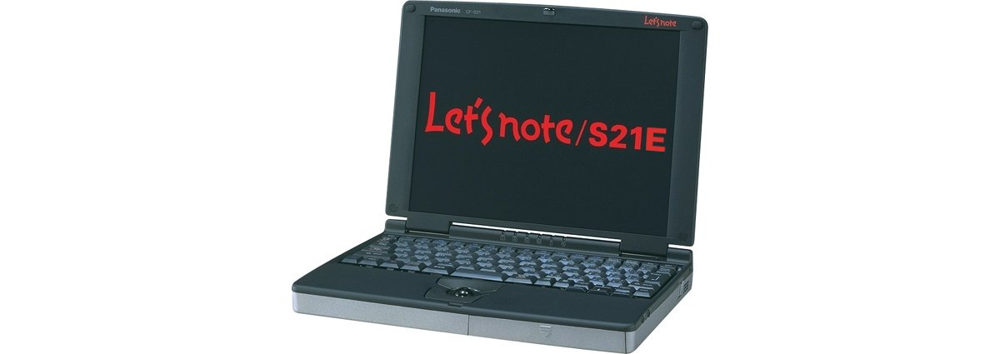
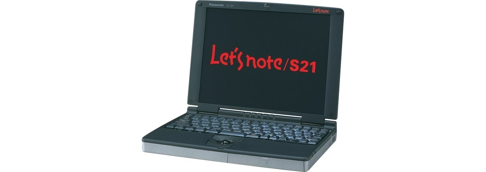
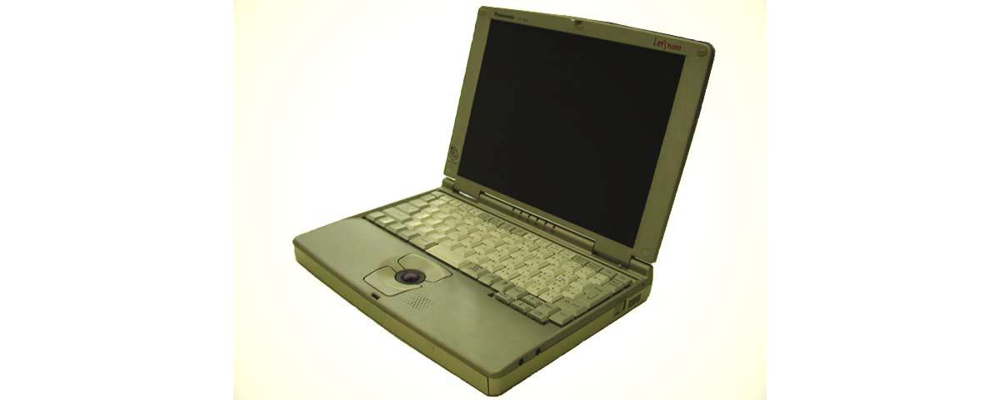

# Panasonic Let's note CF-S21 Specifications

**English** · [日本語](../../ja/CF-S21/) · [中文](../../zh/CF-S21/)

**CF-S21** is a Panasonic Let's note laptop in the S22/S21 series with a 10.4-inch SVGA display. This page lists all 5 part numbers, released 1998-06 – 1998-09. Each part number links to its official spec sheet.

*Panasonic Let's note CF-S21 (CF-S21EJ8, CF-S21EJ81). Image © Panasonic.*

## Part numbers

| Part number | Released | Discontinued | Summary |
| :-- | :-- | :-- | :-- |
| [CF-S21EJ8](https://panasonic.jp/pc/p-db/CF-S21EJ8_spec.html) | 1998-09 | 1998-12 | MMX Pentium (233MHz), HDD: 4.3GB, memory 96MB, Windows 98 |
| [CF-S21EJ81](https://panasonic.jp/pc/p-db/CF-S21EJ81_spec.html) | 1998-09 | 1998-12 | MMX Pentium (233MHz), HDD: 4.3GB, memory 96MB, Windows 98, Excel&Word |
| [CF-S21J8](https://panasonic.jp/pc/p-db/CF-S21J8_spec.html) | 1998-07 | 1998-08 | MMX Pentium (200MHz), HDD: 3.2GB, memory 96MB, Windows 98 |
| [CF-S21J8-N](https://panasonic.jp/pc/p-db/CF-S21J8-N_spec.html) | 1998-07 | 1998-08 | Champagne gold model of CF-S21J8 |
| [CF-S21J5](https://panasonic.jp/pc/p-db/CF-S21J5_spec.html) | 1998-06 | 1999-09 | MMX Pentium (200MHz), HDD: 3.2GB, memory 96MB, Windows 95 |

## Common specifications

| Item | Value |
| :-- | :-- |
| Chipset | Intel(R) 430TX PCI set |
| Memory | Standard 96MB EDO (max. 96MB) |
| L2 cache | 256KB |
| Video memory | 2MB |
| Graphics chip | NeoMagic NM2160 |
| Hard disk | 3.2GB (UltraATA) ※1 |
| Floppy drive (optional) | External 3.5-inch 3-mode support (1.44MB /1.2MB /720KB) |
| Display | SVGA (800×600 dots) 10.4-inch TFT color LCD |
| Display / LCD colors | 800×600 dots approx. 260,000 colors |
| Display / External output | 640×480, 800×600 dots: approx. 16 million colors, 1024×768 dots: 65,536 colors |
| Display / Simultaneous display | Main unit 800×600 dots: approx. 260,000 colors / External display 800×600 dots: approx. 16 million colors |
| Audio | PCM sound source (Sound Blaster PRO compatible), FM sound source, monaural speaker, built-in monaural microphone |
| PC Card slot | PC card (TypeII×2 or TypeIII×1 slot), CardBus compatible *2, ZV-Port compatible *2 |
| Memory expansion slot | 144-pin DIMM dedicated slot ×1 / (No free slot because 64MB has been added) |
| Ports / Audio | Microphone input (mini jack), audio output (mini jack) |
| Ports / USB | 4-pin |
| Ports / Serial | Dsub 9-pin |
| Ports / Parallel | Dsub 25-pin |
| Ports / External display | Analog RGB mini Dsub 15-pin |
| Ports / Mouse / keyboard | Mini Din 6-pin |
| Ports / Infrared | IrDA V1.1-compliant 4Mbps / ASK-compliant *3 |
| Ports / Other | FDD dedicated connector |
| Keyboard | OADG-compliant keyboard (88 keys), key pitch 17mm |
| Pointing device | Optical trackball (diameter 16mm) |
| Power | AC 100V-240V (50Hz/60Hz) (AC cord is for 100V only), / Battery pack (lithium-ion) |
| Power consumption | approx. 28W |
| Battery | Runtime: approx. 5.0 hours *5 Charging: approx. 3.0 hours (when power OFF), approx. 10 hours (when power ON) *6 |
| Dimensions (W×D×H) | 255mm × 192mm × 32.6mm (excluding protrusions) |
| Weight (with battery) | Approx. 1.45kg |

## Differences by part number

| Part number | CPU | Memory | Storage | Weight | Battery life |
| :-- | :-- | :-- | :-- | :-- | :-- |
| CF-S21EJ8 | MMX Technology Pentium 233MHz | 96MB EDO | 3.2GB | 1.45 kg | 5.0 h |
| CF-S21EJ81 | MMX Technology Pentium 233MHz | 96MB EDO | 3.2GB | 1.45 kg | 5.0 h |
| CF-S21J8 | MMX Technology Pentium 200MHz | 96MB EDO | 3.2GB | 1.45 kg | 5.0 h |
| CF-S21J8-N | MMX Technology Pentium 200MHz | 96MB EDO | 3.2GB | 1.45 kg | 5.0 h |
| CF-S21J5 | MMX Technology Pentium 200MHz | 96MB EDO | 3.2GB | 1.45 kg | 5.0 h |

CF-S21EJ8: all differing specifications

| Item | Value |
| :-- | :-- |
| CPU | Intel(R) MMX(R) technology Pentium(R) processor 233MHz |
| Energy efficiency | In standby mode: approx. 0.9W *4 |
| Software | Microsoft(R) Windows(R) 98, / Microsoft(R) IME 98, / NIFTY Manager for Windows ◆, / Mouse Ware, / Intellisync(TM) for Notebooks ◆, / Panasonic Hi-HO Online Sign-up Software |
| Notes | ※1 HDD capacity is shown as 1GB=1,000,000,000 bytes. / ※2 Only one of the 2 slots can be used at a time. / ※3 The effective distance of the infrared communication port is 20–50cm. / ※4 Energy consumption efficiency based on the Energy Saving Act. / ※5 When power-saving mode is set and the LCD backlight is in power-saving state. Varies depending on operating environment and system settings. / ※6 Charging a completely discharged battery may take time. Even when the power is off, power is consumed, so if left unused the remaining battery charge will be lost. Also, the charging time when the power is ON is the shortest case. It varies depending on the computer's operating state. / ◆ Support for the operation of software marked with ◆ is provided by each software manufacturer. / ● This computer is guaranteed to operate only with Windows 98. / ● Some software and peripheral devices generally labeled for Windows 98 cannot be used with this computer. For purchases, please check with the seller of each software or peripheral device. / ● A CD-ROM drive necessary for reinstalling the system is not included. It must be purchased separately. |

Official spec sheet: <https://panasonic.jp/pc/p-db/CF-S21EJ8_spec.html>

CF-S21EJ81: all differing specifications

| Item | Value |
| :-- | :-- |
| CPU | Intel(R) MMX(R) technology Pentium(R) processor 233MHz |
| Energy efficiency | In standby mode: approx. 0.9W *4 |
| Software | Microsoft(R) Windows(R) 98, / Microsoft(R) IME 98, / Microsoft(R) Excel 97 for Windows ◆, / Microsoft(R) Word 98 for Windows ◆, / Microsoft(R) Outlook(TM) 98 for Windows ◆, / Microsoft(R)/Shogakukan Bookshelf(R) Basic ◆*7, / NIFTY Manager for Windows ◆, / Mouse Ware, / Intellisync(TM) for Notebooks ◆, / Panasonic Hi-HO Online Sign-up Software |
| Notes | ※1 HDD capacity is shown as 1GB=1,000,000,000 bytes. / ※2 Only one of the 2 slots can be used at a time. / ※3 The effective distance of the infrared communication port is 20–50cm. / ※4 Energy consumption efficiency based on the Energy Saving Act. / ※5 When power-saving mode is set and the LCD backlight is in power-saving state. Varies depending on operating environment and system settings. / ※6 Charging a completely discharged battery may take time. Even when the power is off, power is consumed, so if left unused the remaining battery charge will be lost. Also, the charging time when the power is ON is the shortest case. It varies depending on the computer's operating state. / ※7 CD-ROM attachment only. / ◆ Support for the operation of software marked with ◆ is provided by each software manufacturer. / ● This computer is guaranteed to operate only with Windows 98. / ● Some software and peripheral devices generally labeled for Windows 98 cannot be used with this computer. For purchases, please check with the seller of each software or peripheral device. / ● A CD-ROM drive necessary for reinstalling the system is not included. It must be purchased separately. |

Official spec sheet: <https://panasonic.jp/pc/p-db/CF-S21EJ81_spec.html>

CF-S21J8: all differing specifications

| Item | Value |
| :-- | :-- |
| CPU | Intel(R) MMX(R) technology Pentium(R) processor 200MHz |
| Energy efficiency | In standby mode: approx. 0.9W *4 |
| Software | Microsoft(R) Windows(R) 98, / Microsoft(R) IME 98, / NIFTY Manager for Windows ◆, / Mouse Ware, / Intellisync(TM) for Notebooks ◆, / Panasonic Hi-HO Online Sign-up Software |
| Notes | ※1 HDD capacity is shown as 1GB=1,000,000,000 bytes. / ※2 Only one of the 2 slots can be used at a time. / ※3 The effective distance of the infrared communication port is 20–50cm. / ※4 Energy consumption efficiency based on the Energy Saving Act. / ※5 When power-saving mode is set and the LCD backlight is in power-saving state. Varies depending on operating environment and system settings. / ※6 Charging a completely discharged battery may take time. Even when the power is off, power is consumed, so if left unused the remaining battery charge will be lost. Also, the charging time when the power is ON is the shortest case. It varies depending on the computer's operating state. / ◆ Support for the operation of software marked with ◆ is provided by each software manufacturer. / ● This computer is guaranteed to operate only with Windows 98. / ● Some software and peripheral devices generally labeled for Windows 98 cannot be used with this computer. For purchases, please check with the seller of each software or peripheral device. / ● A CD-ROM drive necessary for reinstalling the system is not included. It must be purchased separately. |

Official spec sheet: <https://panasonic.jp/pc/p-db/CF-S21J8_spec.html>

CF-S21J8-N: all differing specifications

| Item | Value |
| :-- | :-- |
| CPU | Intel(R) MMX(R) technology Pentium(R) processor 200MHz |
| Energy efficiency | In standby mode: approx. 0.9W *4 |
| Software | Microsoft(R) Windows(R) 98, / Microsoft(R) IME 98, / NIFTY Manager for Windows ◆, / Mouse Ware, / Intellisync(TM) for Notebooks ◆, / Panasonic Hi-HO Online Sign-up Software |
| Notes | ※1 HDD capacity is shown as 1GB=1,000,000,000 bytes. / ※2 Only one of the 2 slots can be used at a time. / ※3 The effective distance of the infrared communication port is 20–50cm. / ※4 Energy consumption efficiency based on the Energy Saving Act. / ※5 When power-saving mode is set and the LCD backlight is in power-saving state. Varies depending on operating environment and system settings. / ※6 Charging a completely discharged battery may take time. Even when the power is off, power is consumed, so if left unused the remaining battery charge will be lost. Also, the charging time when the power is ON is the shortest case. It varies depending on the computer's operating state. / ◆ Support for the operation of software marked with ◆ is provided by each software manufacturer. / ● This computer is guaranteed to operate only with Windows 98. / ● Some software and peripheral devices generally labeled for Windows 98 cannot be used with this computer. For purchases, please check with the seller of each software or peripheral device. / ● A CD-ROM drive necessary for reinstalling the system is not included. It must be purchased separately. |

Official spec sheet: <https://panasonic.jp/pc/p-db/CF-S21J8-N_spec.html>

CF-S21J5: all differing specifications

| Item | Value |
| :-- | :-- |
| CPU | Intel(R) MMX(R) technology Pentium(R) processor 200MHz |
| Energy efficiency | In standby mode: approx. 4W *4 |
| Software | Microsoft(R) Windows(R) 95, / Microsoft(R) Internet Explorer 4.01, / Microsoft(R) IME97, / NIFTY Manager for Windows ◆, / Intellisync(TM) for Notebooks ◆, / Panasonic Hi-HO Online Signup Software |
| Notes | ※1 HDD capacity is shown as 1GB=1,000,000,000 bytes. / ※2 Only one of the 2 slots can be used at a time. / ※3 The effective distance of the infrared communication port is 20–50cm. / ※4 Energy consumption efficiency based on the Energy Saving Act. / ※5 When power-saving mode is set and the LCD backlight is in power-saving state. Varies depending on operating environment and system settings. / ※6 Charging a completely discharged battery may take time. Even when the power is off, power is consumed, so if left unused the remaining battery charge will be lost. Also, the charging time when the power is ON is the shortest case. It varies depending on the computer's operating state. / ◆ Support for the operation of software marked with ◆ is provided by each software manufacturer. / ● This computer is guaranteed to operate only with Windows 95. / ● Some software and peripheral devices generally labeled for Windows 95 cannot be used with this computer. For purchases, please check with the seller of each software or peripheral device. / ● A CD-ROM drive necessary for reinstalling the system is not included. It must be purchased separately. |

Official spec sheet: <https://panasonic.jp/pc/p-db/CF-S21J5_spec.html>

## Photos

*Panasonic Let's note CF-S21 (CF-S21J8, CF-S21J5). Image © Panasonic.*

*Panasonic Let's note CF-S21 (CF-S21J8-N). Image © Panasonic.*

## Related models

- Newer model in the series: [CF-S22](../CF-S22/)
- [All Let's note models](../)

---

Source: Panasonic's official [discontinued-models list](https://panasonic.jp/pc/support/products/) and spec sheets (panasonic.jp), translated from Japanese; see the official sheets for the authoritative wording. Product images © Panasonic. This is an unofficial compilation, not affiliated with Panasonic.
