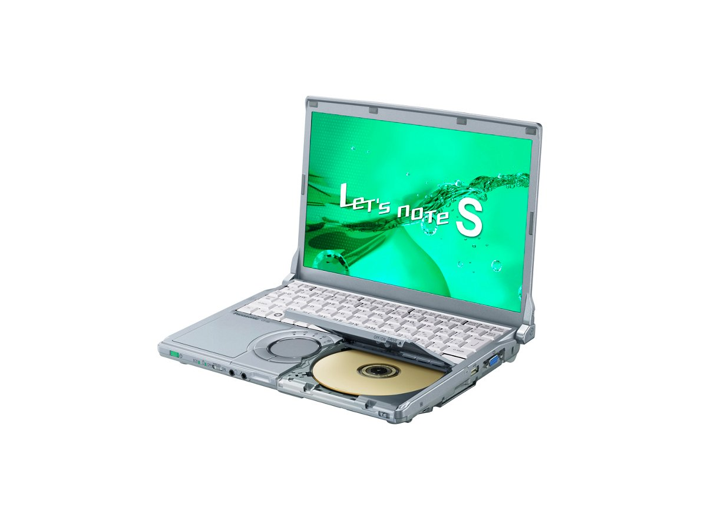
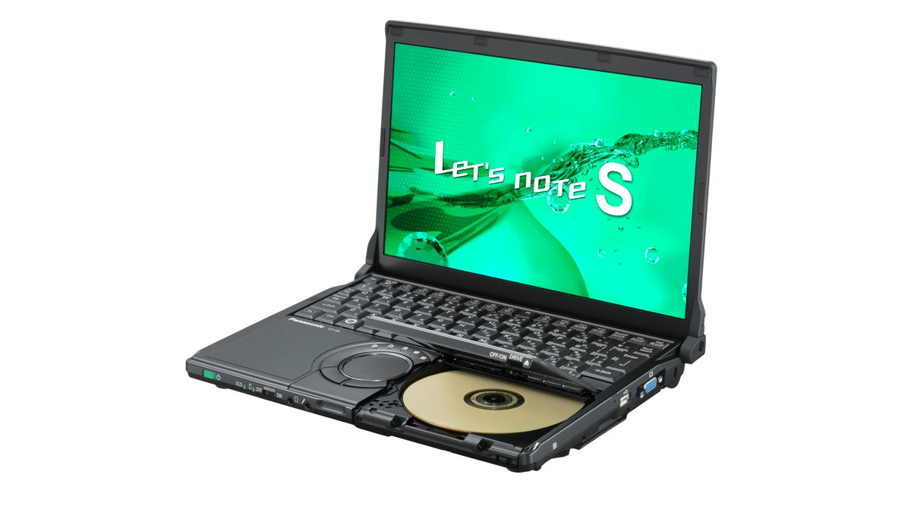

# Panasonic Let's note CF-S8 Specifications

**English** · [日本語](../../ja/CF-S8/) · [中文](../../zh/CF-S8/)

**CF-S8** is a Panasonic Let's note laptop in the S8 series with a 12.1-inch WXGA display. This page lists all 3 part numbers, released 2009-10 – 2009-11. Each part number links to its official spec sheet.

*Panasonic Let's note CF-S8 (CF-S8HYEADR, CF-S8HYEPDR). Image © Panasonic.*

## Part numbers

| Part number | Released | Discontinued | Summary |
| :-- | :-- | :-- | :-- |
| [CF-S8HYEBDR](https://panasonic.jp/pc/p-db/CF-S8HYEBDR_spec.html) | 2009-11 | 2010-01 | Black model: Windows®7 Professional Genuine Edition, Intel® CoreTM2 Duo P8700 (2.53GHz), Memory: standard 2GB (max 4GB), HDD: 250GB, Super Multi Drive, LAN, Wireless LAN 802.11a(W52/W53/W56)/b/g/n <Limited quantity> |
| [CF-S8HYEADR](https://panasonic.jp/pc/p-db/CF-S8HYEADR_spec.html) | 2009-10 | 2010-01 | Windows®7 Professional genuine version, Intel® CoreTM2 Duo P8700 (2.53GHz), Memory: standard 2GB (max 4GB), HDD: 250GB, Super Multi Drive, LAN, wireless LAN 802.11a(W52/W53/W56)/b/g/n |
| [CF-S8HYEPDR](https://panasonic.jp/pc/p-db/CF-S8HYEPDR_spec.html) | 2009-10 | 2010-01 | Windows®7 Professional genuine version, Intel® CoreTM2 Duo P8700 (2.53GHz), Memory: standard 2GB (max 4GB), HDD: 250GB, Super Multi Drive, LAN, wireless LAN 802.11a(W52/W53/W56)/b/g/n, Office Personal 2007 <limited quantity> |

## Common specifications

| Item | Value |
| :-- | :-- |
| OS | Windows7(R)Professional genuine edition (32-bit) (includes Windows(R) XP downgrade rights) |
| CPU | Intel(R) CoreTM2 Duo processor P8700 / operating frequency 2.53GHz / 2nd-level cache memory 3MB, front side bus 1066MHz |
| Chipset | Mobile Intel(R) GM45 Express chipset |
| Memory | Standard 2GB (1 free slot) / maximum 4GB |
| Video memory | Max 765MB, 1551MB when 2GB memory is added (shared with main memory) |
| Hard disk | 250GB (Serial ATA) *Of the above capacity, approx. 10GB is used as a repair area (including the recovery data area) and approx. 500MB as a system area (unavailable to the user) |
| Optical drive | Built-in Super Multi Drive, equipped with buffer underrun error prevention function (SmoothLink) |
| Optical drive speed / Read | DVD-RAM max 5x [4.7GB], DVD-R max 8x, DVD-R DL max 8x, DVD-RW max 8x, DVD-ROM max 8x, +R max 8x, +R DL max 8x, +RW max 8x, CD-ROM max 24x, CD-R max 24x, CD-RW max 24x |
| Optical drive speed / Write | DVD-RAM max 5x [4.7GB], DVD-R max 8x, DVD-RW max 6x, +R max 8x, + RW max 4x, High Speed +RW max 6x, CD-R max 24x, CD-RW 4x, High Speed CD-RW 10x |
| Supported discs / Read | DVD-RAM, DVD-ROM, DVD-Video, DVD-R, DVD-RW, DVD-R DL, +R, +R DL, +RW, CD-Audio, CD-R, CD-ROM (XA support), PhotoCD (multi-session support), VideoCD, CD-EXTRA, CD-TEXT, CD-RW |
| Supported discs / Write | DVD-RAM、DVD-R、DVD-RW、+R、+RW、CD-R、CD-RW |
| Floppy drive (optional) | (Sold separately) USB-connected external 3.5-inch 3-mode compatible (1.44MB/1.2MB/720KB) |
| Display | 12.1-inch TFT color LCD WXGA (1280×800 dots) |
| Display / LCD colors | 1280×800 dots: approx. 16.77 million colors |
| Display / External output | 1280×720, 800×600, 1024×768, 1280×768, 1280×1024, 1400×1050, 1680×1050, 1600×1200, 1920×1080, 1920×1200 dots: approx. 16.77 million colors |
| Display / Simultaneous display | 800×600, 1024×768, 1280×720, 1280×768, 1280×800 dots: approx. 16.77 million colors |
| Wireless communication | Intel(R) WiMAX/WiFi Link5150 |
| Wireless LAN | WPA2-AES/TKIP compatible, Wi-Fi compliant IEEE802.11a (W52/W53/W56)/b/g compliant, IEEE802.11n draft 2.0 compliant |
| Wired LAN | 1000BASE-T / 100BASE-TX / 10BASE-T |
| Audio | PCM sound source (24-bit stereo), Intel(R) High Definition Audio compliant, monaural speaker |
| Security chip | TPM (TCG V1.2 compliant) |
| Card slots / PC Card | PC card (TYPEII) ×1 slot (CardBus compatible, allowable current 3.3V: 400mA, 5V: 400mA) |
| Card slots / SD card | SD memory card ×1 slot (SDHC memory card/copyright protection technology support) |
| Memory expansion slot | DDR2 200-pin SO-DIMM dedicated slot ×1 (1.8V/PC2-5300/DDR2 SDRAM) |
| Ports | LAN connector (RJ-45), external display connector (analog RGB mini Dsub 15-pin), HDMI output terminal (equipped on S8/N8 only), microphone input (stereo mini jack M3 (plug-in power compatible)), audio output (stereo mini jack M3) |
| Keyboard | OADG-compliant 85 keys, key pitch 19mm (horizontal)/16mm (vertical) (excluding some keys) |
| Pointing device | Wheel pad |
| Power | ▼AC adapter / Input: AC100V–240V, 50Hz/60Hz, Output: DC16 V, 3.75A, power cord for 100V only / ▼Battery pack / 7.2V lithium-ion, nominal capacity 12.4Ah, rated capacity 11.6Ah |
| Power consumption | Max approx. 60W |
| Energy efficiency | 2007 fiscal year standard l category 0.00020 |
| Efficiency target achievement | — |
| Battery | 7.2V lithium-ion, nominal capacity 12.4Ah, rated capacity 11.6Ah, (sold separately) lightweight battery pack 7.2V lithium-ion, 6.2Ah, rated capacity 6.8Ah |
| Dimensions (W×D×H) | Width 282.8mm × Depth 209.6mm × Height 23.4mm/38.7mm (front/rear) *Excluding protrusions. Thickest part is 41.4mm |
| Weight (with battery) | PC body: approx. 1.32kg (when attached battery pack (approx. 0.41kg)), PC body: approx. 1.16kg (when attached optional lightweight battery pack (approx. 0.25kg)) |
| Accessories | Product Recovery DVD-ROM 2 discs (for Windows 7 / for Windows XP), AC adapter, battery pack, instruction manual, etc. |

## Differences by part number

| Part number | CPU | Memory | Storage | Weight | Battery life |
| :-- | :-- | :-- | :-- | :-- | :-- |
| CF-S8HYEBDR | Core2 Duo P8700 | 2GB | 250GB | 1.32 kg | — |
| CF-S8HYEADR | Core2 Duo P8700 | 2GB | 250GB | 1.32 kg | — |
| CF-S8HYEPDR | Core2 Duo P8700 | 2GB | 250GB | 1.32 kg | — |

CF-S8HYEBDR: all differing specifications

| Item | Value |
| :-- | :-- |
| Mobile WiMAX | Built-in (max. 13Mbps receive, max. 3Mbps transmit) |
| Software | Microsoft(R) Internet Explorer8.0, Adobe Reader, Microsoft(R) Windows(R) Media Player 12, Microsoft(R) Windows(R) Movie Maker 6.0, Microsoft(R) .NET Framework 3.5.1, Windows Live Mail, Windows Live Messenger, Windows Live Photo Gallery, Windows Live Writer, Zoom Viewer, PC Information Viewer, PC Information Pop-up, NumLock Notification, Wireless Manager mobile edition 5.5, Wireless Switching Utility, Security Setting Utility, Infineon TPM Professional Package V3.6, Battery Remaining Charge Display Correction Utility, Hotkey Settings, McAfee PC Security Center, Midori no goo Stick, Hard Disk Data Erase Utility, Wheel Pad Utility, Net Selector 2, USB Keyboard Helper, USB Mouse Helper, Fn Ctrl Function Swap Utility, i-Filter 5.0 (30-day Trial Version), Panasonic Power Plan Extension Utility, Display Helper, Pittari View*, Aptio Setup Utility, PC-Diagnostic Utility, Optical Disc Drive Letter Change Utility, Roxio Creator LJB, MyDVD, WinDVD8 (OEM Version) CPRM Support |

Official spec sheet: <https://panasonic.jp/pc/p-db/CF-S8HYEBDR_spec.html>

CF-S8HYEADR: all differing specifications

| Item | Value |
| :-- | :-- |
| Mobile WiMAX | Built-in (max. 13Mbps receive, max. 3Mbps transmit) |
| Software | Microsoft(R) Internet Explorer8.0, Adobe Reader, Microsoft(R) Windows(R) Media Player 12, Microsoft(R) Windows(R) Movie Maker 6.0, Microsoft(R) .NET Framework 3.5.1, Windows Live Mail, Windows Live Messenger, Windows Live Photo Gallery, Windows Live Writer, Zoom Viewer, PC Information Viewer, PC Information Pop-up, NumLock Notification, Wireless Manager mobile edition 5.5, Wireless Switching Utility, Security Setting Utility, Infineon TPM Professional Package V3.6, Battery Remaining Charge Display Correction Utility, Hotkey Settings, McAfee PC Security Center, Midori no goo Stick, Hard Disk Data Erase Utility, Wheel Pad Utility, Net Selector 2, USB Keyboard Helper, USB Mouse Helper, Fn Ctrl Function Swap Utility, i-Filter 5.0 (30-day Trial Version), Panasonic Power Plan Extension Utility, Display Helper, Pittari View*, Aptio Setup Utility, PC-Diagnostic Utility |

Official spec sheet: <https://panasonic.jp/pc/p-db/CF-S8HYEADR_spec.html>

CF-S8HYEPDR: all differing specifications

| Item | Value |
| :-- | :-- |
| Mobile WiMAX | Built-in (max. 13Mbps receive, max. 3Mbps transmit) |
| Software | Microsoft(R) Internet Explorer8.0, Adobe Reader, Microsoft(R) Windows(R) Media Player 12, Microsoft(R) Windows(R) Movie Maker 6.0, Microsoft(R) .NET Framework 3.5.1, Windows Live Mail, Windows Live Messenger, Windows Live Photo Gallery, Windows Live Writer, Zoom Viewer, PC Information Viewer, PC Information Pop-up, NumLock Notification, Wireless Manager mobile edition 5.5, Wireless Switching Utility, Security Setting Utility, Infineon TPM Professional Package V3.6, Battery Remaining Charge Display Correction Utility, Hotkey Settings, McAfee PC Security Center, Midori no goo Stick, Hard Disk Data Erase Utility, Wheel Pad Utility, Net Selector 2, USB Keyboard Helper, USB Mouse Helper, Fn Ctrl Function Swap Utility, i-Filter 5.0 (30-day Trial Version), Panasonic Power Plan Extension Utility, Display Helper, Pittari View*, Aptio Setup Utility, PC-Diagnostic Utility, Optical Disc Drive Letter Change Utility, Roxio Creator LJB, MyDVD, WinDVD8 (OEM Version) CPRM Support, Microsoft(R) Office Personal 2007 with Microsoft(R) Office PowerPoint(R) 2007 (Service Pack 1) |

Official spec sheet: <https://panasonic.jp/pc/p-db/CF-S8HYEPDR_spec.html>

## Photos

*Panasonic Let's note CF-S8 (CF-S8HYEBDR). Image © Panasonic.*

## Related models

- [All Let's note models](../)

---

Source: Panasonic's official [discontinued-models list](https://panasonic.jp/pc/support/products/) and spec sheets (panasonic.jp), translated from Japanese; see the official sheets for the authoritative wording. Product images © Panasonic. This is an unofficial compilation, not affiliated with Panasonic.
