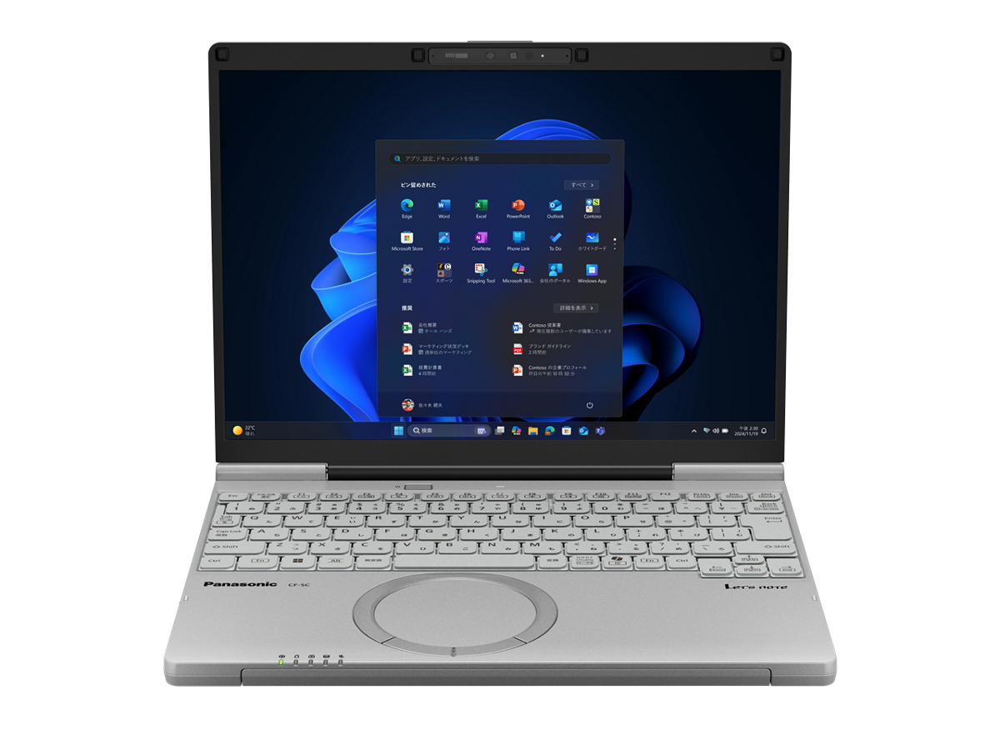
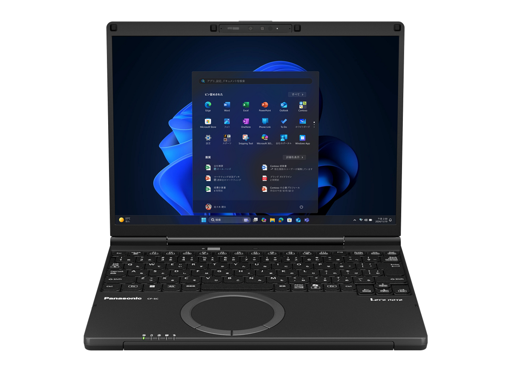

# Panasonic Let's note CF-SC6 Specifications

**English** · [日本語](../../ja/CF-SC6/) · [中文](../../zh/CF-SC6/)

🗄️ See this model in the [Let's note Cabinet](https://letsnote-specs.github.io/en/CF-SC6/).

**CF-SC6** is a Panasonic Let's note laptop. This page lists all 3 part numbers. Each part number links to its official spec sheet.

*Panasonic Let's note CF-SC6 (CF-SC6ADMCR, CF-SC6ADTCR), calm gray. Image © Panasonic.*

## Part numbers

| Part number | Released | Discontinued | Summary |
| :-- | :-- | :-- | :-- |
| [CF-SC6ADMCR](https://panasonic.jp/pc/p-db/CF-SC6ADMCR_spec.html) | — | On sale | — |
| [CF-SC6ADTCR](https://panasonic.jp/pc/p-db/CF-SC6ADTCR_spec.html) | — | On sale | — |
| [CF-SC6BDPCR](https://panasonic.jp/pc/p-db/CF-SC6BDPCR_spec.html) | — | On sale | — |

## Common specifications

| Item | Value |
| :-- | :-- |
| OS | Windows 11 Pro |
| Chipset | Built into CPU |
| Optical drive | Not equipped |
| Display | 12.4-inch (3:2) FHD+ TFT color LCD (1920 x 1280 dots) anti-glare / External display output Max.: 3840×2160 (30 Hz/60 Hz/120Hz/144Hz) / Simultaneous main unit + external display Max.: 1920×1280: approx. 16.77 million colors |
| Display / LCD colors | 1920×1280 dots: approx. 16.77 million colors |
| Wireless LAN | Wi-Fi 6E compatible IEEE802.11a/b/g/n/ac/ax (including 6GHz band) compliant (5GHz channel band: W52/W53/W56) WPA3, WPA2-AES/TKIP compatible |
| Wireless WAN | Not equipped |
| Wired LAN | 1000BASE-T/100BASE-TX/10BASE-T |
| Bluetooth | Bluetooth v5.3 / ■Supported profiles / 【Classic】 / ・A2DP (Source) / ・AVRCP (Target) / ・HCRP (Client) / ・HFP (AG) / ・HID (Host) / ・OPP (Client and Server) / ・PAN (User) / ・SPP (DevA and DevB) / 【Low Energy】 / ・HOGP (Host) |
| Audio | PCM sound source (24-bit stereo), Intel® High Definition Audio compliant, stereo speakers (box-type speakers) |
| Security | Secured-Core PC support / Security chip: TPM (TCG V2.0 compliant) / Fingerprint sensor: touch type, integrated with power button |
| Security (Windows Hello) | Windows Hello Enhanced Sign-in Security compatible |
| Memory expansion slot | None |
| Camera | Effective pixels: FHD 1920×1080 pixels (approx. 2.07 million pixels), 30fps, Windows Hello face recognition support, privacy shutter equipped, vHDR support |
| Microphone | Array microphone |
| Ports | ・USB Type-C port (Thunderbolt™4 supported, USB Power Delivery supported) ×2 / ・USB Type-A (5Gbps) port ×2 (one of which also supports smartphone charging) / ・LAN connector (RJ-45) / ・HDMI output terminal (4K144Hz output supported) / ・Headset terminal (microphone input + audio output) (headset mini jack 3.5mm (M3)), CTIA compliant) |
| Keyboard | OADG-compliant keyboard (86 keys): Key pitch 19mm (horizontal)/16mm (vertical) (excluding some keys) |
| Pointing device | High-precision touchpad-compatible wheel pad |
| Power | ▼AC adapter / Input: AC100V–240V (50Hz/60Hz), Output: DC 5V: max 3A, DC 9V: max 3A, DC 15V: max 3A, DC 20V: max 3.25A, power cord for 100V only (USB Power Delivery supported) / ▼Battery pack / 11.58V lithium-ion, rated capacity 4772mAh |
| Power consumption | Max approx. 65W |
| Energy efficiency | Target year FY2022 12 categories 13.5 [kWh/year] |
| Efficiency target achievement | — |
| Battery life / charge time | ▼Battery life / (JEITA Ver.3.0) / approx. 12.7 hours (video playback), approx. 34.6 hours (idle) / ▼Charging time / max. 2.5 hours (power off) / max. 2.5 hours (power on) |
| Dimensions (W×D×H) | Width 273.2mm × Depth 208.9mm × Height 19.9mm (excluding protrusions) |
| Weight (with battery) | PC body: approx. 0.919kg (when equipped with included battery pack (approx. 285g)) / AC adapter: approx. 140g (excluding power cord (approx. 60g) and USB connection cable (approx. 36g)) |
| Software | ・Microsoft® Edge / ・McAfee LiveSafe (60-day free trial version) / ・i-Filter for Multi-Device (30-day free trial version) / ・Aptio Setup / ・PC-Diagnostic Utility / ・PC Information Viewer / ・Panasonic PC VVork / ・Panasonic AI Device Controller / ・Panasonic PC Hub |
| Accessories | AC adapter (USB Power Delivery compatible), battery pack, instruction manual, etc. |

## Differences by part number

| Part number | CPU | Memory | Storage | Weight | Battery life |
| :-- | :-- | :-- | :-- | :-- | :-- |
| CF-SC6ADMCR | Core Ultra 5 225U | 16GB LPDDR5X SDRAM | 512GB | 0.919 kg | 12.7 h |
| CF-SC6ADTCR | Core Ultra 5 225U | 16GB LPDDR5X SDRAM | 512GB | 0.919 kg | 12.7 h |
| CF-SC6BDPCR | Core Ultra 7 255H | 32GB LPDDR5X SDRAM | 1TB | 0.919 kg | 12.7 h |

CF-SC6ADMCR: all differing specifications

| Item | Value |
| :-- | :-- |
| CPU | Intel® Core™ Ultra 5 Processor 225U / P-core: max turbo frequency 4.80 GHz / E-core: max turbo frequency 3.80 GHz / Low power E-core: max turbo frequency 2.40 GHz / Cores: 12 cores/Cache: 12MB |
| Memory | 16GB LPDDR5X SDRAM (no expansion slot) |
| Storage | SSD: 512GB (PCIe) / Of the above capacity, approx. 15GB is used as recovery area and approx. 1GB as system area (unavailable to user) |
| Display / Graphics | Intel® Graphics (built into CPU) |
| Color | Calm Gray |
| Microsoft Office | Microsoft 365 Basic + Office Home & Business 2024 |

Official spec sheet: <https://panasonic.jp/pc/p-db/CF-SC6ADMCR_spec.html>

CF-SC6ADTCR: all differing specifications

| Item | Value |
| :-- | :-- |
| CPU | Intel® Core™ Ultra 5 Processor 225U / P-core: max turbo frequency 4.80 GHz / E-core: max turbo frequency 3.80 GHz / Low power E-core: max turbo frequency 2.40 GHz / Cores: 12 cores/Cache: 12MB |
| Memory | 16GB LPDDR5X SDRAM (no expansion slot) |
| Storage | SSD: 512GB (PCIe) / Of the above capacity, approx. 15GB is used as recovery area and approx. 1GB as system area (unavailable to user) |
| Display / Graphics | Intel® Graphics (built into CPU) |
| Color | Calm Gray |

Official spec sheet: <https://panasonic.jp/pc/p-db/CF-SC6ADTCR_spec.html>

CF-SC6BDPCR: all differing specifications

| Item | Value |
| :-- | :-- |
| CPU | Intel® Core™ Ultra 7 Processor 255H / P-core: max turbo frequency 5.10 GHz / E-core: max turbo frequency 4.40 GHz / Low power E-core: max turbo frequency 2.50 GHz / Cores: 16 cores/Cache: 24MB |
| Memory | 32GB LPDDR5X SDRAM (no expansion slot) |
| Storage | SSD: 1TB (PCIe) / Of the above capacity, approx. 15GB is used as recovery area and approx. 1GB as system area (unavailable to user) |
| Display / Graphics | Intel® Arc™ Graphics (integrated in CPU) |
| Color | Black |
| Microsoft Office | Microsoft 365 Basic + Office Home & Business 2024 |

Official spec sheet: <https://panasonic.jp/pc/p-db/CF-SC6BDPCR_spec.html>

## Photos

*Panasonic Let's note CF-SC6 (CF-SC6BDPCR), black. Image © Panasonic.*

## Related models

- [All Let's note models](../)

---

Source: Panasonic's official [discontinued-models list](https://panasonic.jp/pc/support/products/) and spec sheets (panasonic.jp), translated from Japanese; see the official sheets for the authoritative wording. Product images © Panasonic. This is an unofficial compilation, not affiliated with Panasonic.
