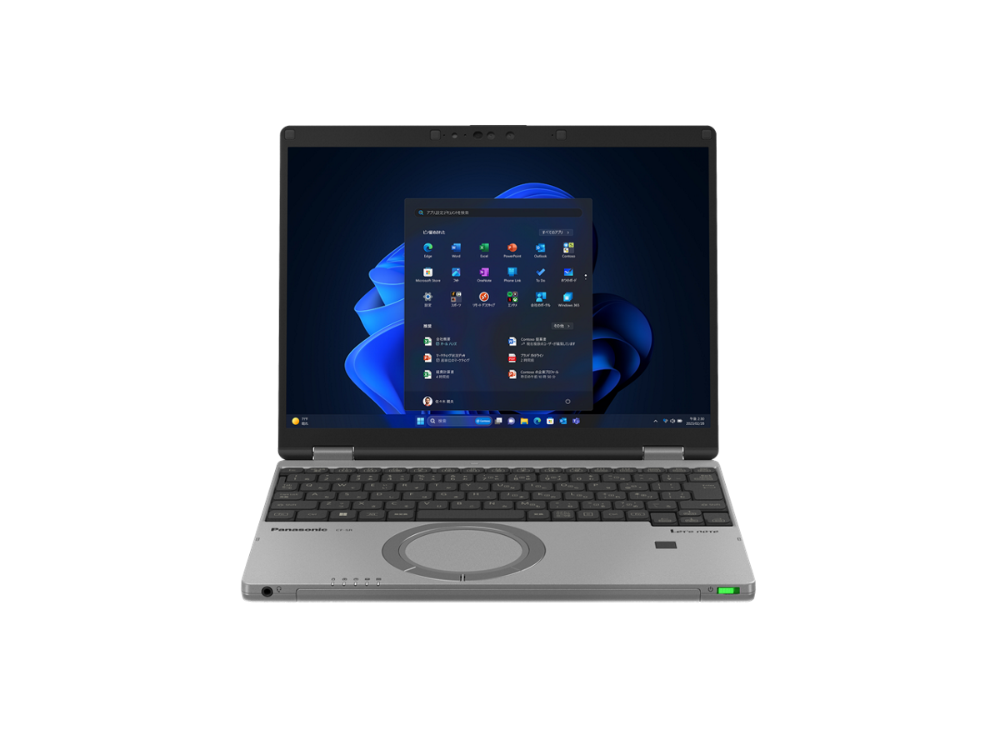
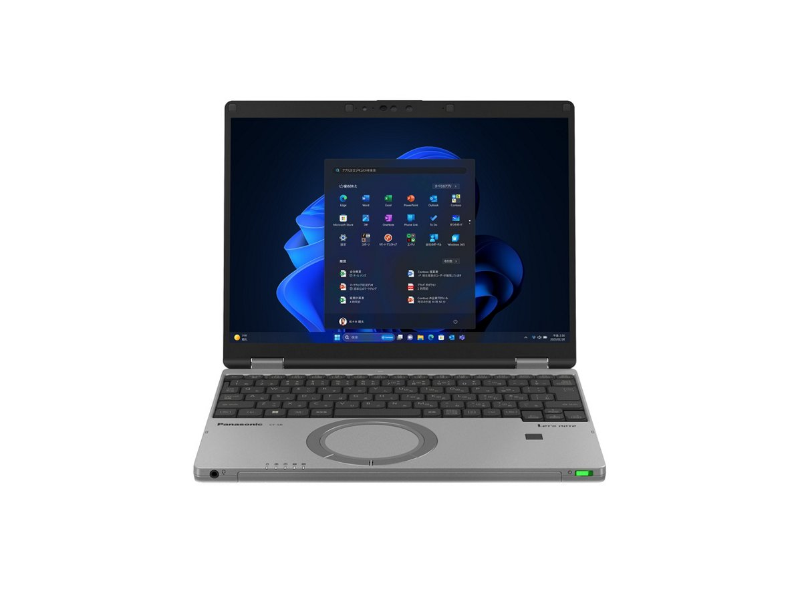
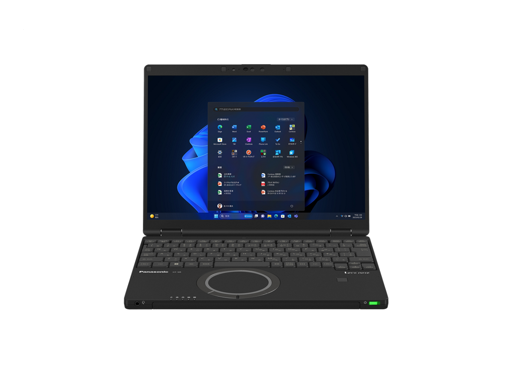
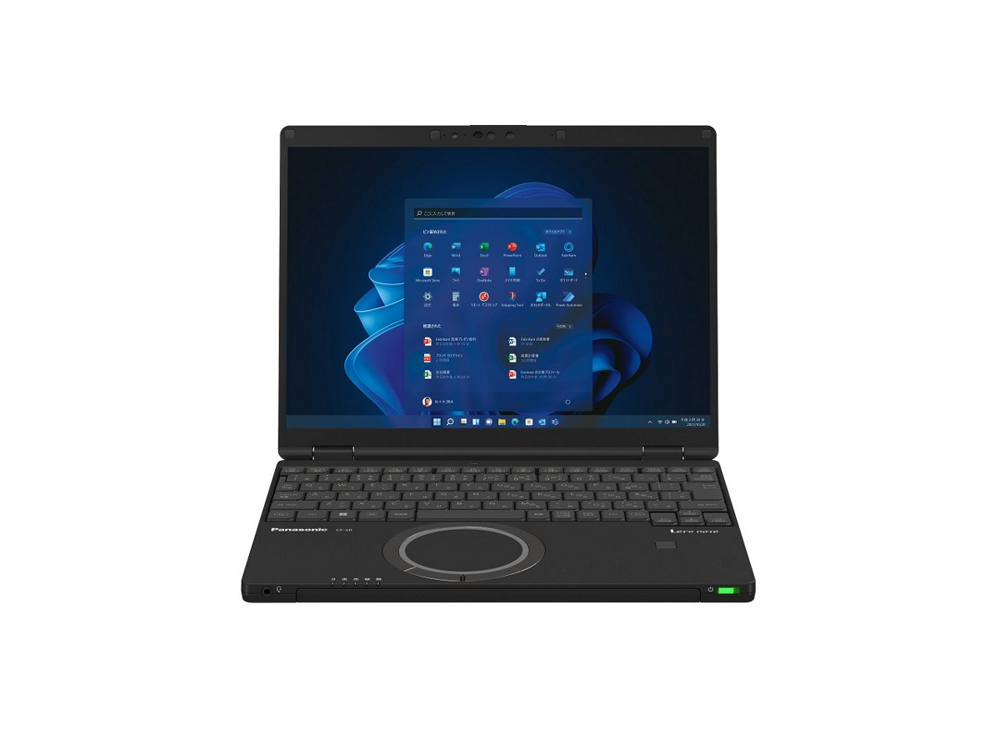

# Panasonic Let's note CF-SR4 Specifications

**English** · [日本語](../../ja/CF-SR4/) · [中文](../../zh/CF-SR4/)

**CF-SR4** is a Panasonic Let's note laptop in the SR series with a 12.4-inch FHD+ display. This page lists all 13 part numbers, released 2023-06 – 2025-01. Each part number links to its official spec sheet.

*Panasonic Let's note CF-SR4 (CF-SR4GDMCR, CF-SR4GDTCR), calm gray. Image © Panasonic.*

## Part numbers

| Part number | Released | Discontinued | Summary |
| :-- | :-- | :-- | :-- |
| [CF-SR4HDNCR](https://panasonic.jp/pc/p-db/CF-SR4HDNCR_spec.html) | 2025-01 | 2026-03 | Windows 11 Pro 64ビット、インテル® CoreTM i7-1360Pプロセッサー、メモリー：16GB（空きスロットなし）、SSD：512GB、LAN、無線LAN 802.11a（W52/W53/W56）/b/g/n/ac/ax（6GHz帯含む）、Microsoft 365 Basic ＋ Office Home & Business 2024 |
| [CF-SR4GDMCR](https://panasonic.jp/pc/p-db/CF-SR4GDMCR_spec.html) | 2025-01 | 2026-03 | Windows 11 Pro 64ビット、インテル® CoreTM i5-1335Uプロセッサー、メモリー：16GB（空きスロットなし）、SSD：512GB、LAN、無線LAN 802.11a（W52/W53/W56）/b/g/n/ac/ax（6GHz帯含む）、Microsoft 365 Basic ＋ Office Home & Business 2024 |
| [CF-SR4GDTCR](https://panasonic.jp/pc/p-db/CF-SR4GDTCR_spec.html) | 2025-01 | 2026-03 | Windows 11 Pro 64ビット、インテル® CoreTM i5-1335Uプロセッサー、メモリー：16GB（空きスロットなし）、SSD：512GB、LAN、無線LAN 802.11a（W52/W53/W56）/b/g/n/ac/ax（6GHz帯含む） |
| [CF-SR4FDNCR](https://panasonic.jp/pc/p-db/CF-SR4FDNCR_spec.html) | 2024-06 | 2025-08 | Windows 11 Pro 64ビット、インテル® CoreTM i7-1360Pプロセッサー、メモリー：16GB（空きスロットなし）、SSD：512GB、LAN、無線LAN 802.11a（W52/W53/W56）/b/g/n/ac/ax（6GHz帯含む）、Microsoft® Office Home and Business 2021 |
| [CF-SR4EDMCR](https://panasonic.jp/pc/p-db/CF-SR4EDMCR_spec.html) | 2024-06 | 2025-08 | Windows 11 Pro 64ビット、インテル® CoreTM i5-1335Uプロセッサー、メモリー：16GB（空きスロットなし）、SSD：512GB、LAN、無線LAN 802.11a（W52/W53/W56）/b/g/n/ac/ax（6GHz帯含む）、Microsoft® Office Home and Business 2021 |
| [CF-SR4EDTCR](https://panasonic.jp/pc/p-db/CF-SR4EDTCR_spec.html) | 2024-06 | 2025-08 | Windows 11 Pro 64ビット、インテル® CoreTM i5-1335Uプロセッサー、メモリー：16GB（空きスロットなし）、SSD：512GB、LAN、無線LAN 802.11a（W52/W53/W56）/b/g/n/ac/ax（6GHz帯含む） |
| [CF-SR4DDNCR](https://panasonic.jp/pc/p-db/CF-SR4DDNCR_spec.html) | 2024-01 | 2025-01 | Windows 11 Pro 64ビット、インテル® CoreTM i7-1360Pプロセッサー、メモリー：16GB（空きスロットなし）、SSD：512GB、LAN、無線LAN 802.11a（W52/W53/W56）/b/g/n/ac/ax（6GHz帯含む）、Microsoft® Office Home and Business 2021 |
| [CF-SR4CDMCR](https://panasonic.jp/pc/p-db/CF-SR4CDMCR_spec.html) | 2024-01 | 2025-01 | Windows 11 Pro 64ビット、インテル® CoreTM i5-1335Uプロセッサー、メモリー：16GB（空きスロットなし）、SSD：512GB、LAN、無線LAN 802.11a（W52/W53/W56）/b/g/n/ac/ax（6GHz帯含む）、Microsoft® Office Home and Business 2021 |
| [CF-SR4CDTCR](https://panasonic.jp/pc/p-db/CF-SR4CDTCR_spec.html) | 2024-01 | 2025-01 | Windows 11 Pro 64ビット、インテル® CoreTM i5-1335Uプロセッサー、メモリー：16GB（空きスロットなし）、SSD：512GB、LAN、無線LAN 802.11a（W52/W53/W56）/b/g/n/ac/ax（6GHz帯含む） |
| [CF-SR4BFPCR](https://panasonic.jp/pc/p-db/CF-SR4BFPCR_spec.html) | 2023-06 | 2024-06 | Windows 11 Pro 64ビット、インテル® CoreTM i7-1360Pプロセッサー、メモリー：16GB（空きスロットなし）、SSD：512GB、LAN、無線LAN 802.11a（W52/W53/W56）/b/g/n/ac/ax（6GHz帯含む）、LTE対応ワイヤレスWAN、Microsoft® Office Home and Business 2021 |
| [CF-SR4BDNCR](https://panasonic.jp/pc/p-db/CF-SR4BDNCR_spec.html) | 2023-06 | 2024-06 | Windows 11 Pro 64ビット、インテル® CoreTM i7-1360Pプロセッサー、メモリー：16GB（空きスロットなし）、SSD：512GB、LAN、無線LAN 802.11a（W52/W53/W56）/b/g/n/ac/ax（6GHz帯含む）、Microsoft® Office Home and Business 2021 |
| [CF-SR4ADMCR](https://panasonic.jp/pc/p-db/CF-SR4ADMCR_spec.html) | 2023-06 | 2024-06 | Windows 11 Pro 64ビット、インテル® CoreTM i5-1335Uプロセッサー、メモリー：16GB（空きスロットなし）、SSD：512GB、LAN、無線LAN 802.11a（W52/W53/W56）/b/g/n/ac/ax（6GHz帯含む）、Microsoft® Office Home and Business 2021 |
| [CF-SR4ADTCR](https://panasonic.jp/pc/p-db/CF-SR4ADTCR_spec.html) | 2023-06 | 2024-06 | Windows 11 Pro 64ビット、インテル® CoreTM i5-1335Uプロセッサー、メモリー：16GB（空きスロットなし）、SSD：512GB、LAN、無線LAN 802.11a（W52/W53/W56）/b/g/n/ac/ax（6GHz帯含む） |

## Common specifications

| Item | Value |
| :-- | :-- |
| OS | Windows 11 Pro |
| Chipset | CPUに内蔵 |
| Storage | SSD：512GB（PCIe） / 上記容量のうち約15GBをリカバリー領域、約1GBをシステム領域として使用（ユーザー使用不可） |
| Optical drive | 搭載されていません |
| Display | 12.4型(3:2)FHD+ TFTカラー液晶 （1920 x 1280ドット）アンチグレア |
| Display / Graphics | インテル® Iris® Xᵉ グラフィックス（CPUに内蔵） |
| Display / LCD colors | 1920×1280ドット：約1677万色 |
| Display / External output | 最大：1920×1200：約1677万色 / （以下HDMI出力/USB3.1 Type-Cポートのみ） / 最大：4096×2160（30 Hz/60 Hz） |
| Display / Simultaneous display | 最大：1920×1200：約1677万色 / （以下HDMI出力/USB3.1 Type-Cポートのみ） / 最大：1920×1280：約1677万色 |
| Wireless LAN | Wi-Fi 6E対応 IEEE802.11a/b/g/n/ac/ax(6 GHz帯含む) 準拠 （5 GHzチャンネル帯：W52/W53/W56）WPA3、WPA2-AES/TKIP対応 |
| Wired LAN | 1000BASE-T/100BASE-TX/10BASE-T |
| Audio | PCM音源（24ビットステレオ）、インテル® High Definition Audio準拠、ステレオスピーカー |
| Security chip | TPM（TCG V2.0準拠） |
| Security (Windows Hello) | 顔認証対応カメラ/指紋センサー（タッチ式） |
| Memory expansion slot | なし |
| Camera | 顔認証対応カメラ（AIセンサー対応）、有効画素数：最大 1920x1080ピクセル（約207万画素） |
| Microphone | アレイマイク |
| Sensors | 照度(明るさ)、AIセンサー |
| Pointing device | 高精度タッチパッド対応ホイールパッド |
| Power consumption | 最大約65W |
| Efficiency target achievement | — |
| Dimensions (W×D×H) | 幅273.2mm×奥行208.9mm×高さ19.9mm（突起部除く） |

## Differences by part number

| Part number | CPU | Memory | Storage | Weight | Battery life |
| :-- | :-- | :-- | :-- | :-- | :-- |
| CF-SR4HDNCR | Core i7-1360P | 16GB LPDDR4X SDRAM | 512GB | 0.949 kg | 7.6 h |
| CF-SR4GDMCR | Core i5-1335U | 16GB LPDDR4X SDRAM | 512GB | 0.939 kg | 7.6 h |
| CF-SR4GDTCR | Core i5-1335U | 16GB LPDDR4X SDRAM | 512GB | 0.859 kg | 4.5 h |
| CF-SR4FDNCR | Core i7-1360P | 16GB LPDDR4X SDRAM | 512GB | 0.949 kg | 7.6 h |
| CF-SR4EDMCR | Core i5-1335U | 16GB LPDDR4X SDRAM | 512GB | 0.939 kg | 7.6 h |
| CF-SR4EDTCR | Core i5-1335U | 16GB LPDDR4X SDRAM | 512GB | 0.859 kg | 4.5 h |
| CF-SR4DDNCR | Core i7-1360P | 16GB LPDDR4x SDRAM | 512GB | 0.949 kg | 7 h |
| CF-SR4CDMCR | Core i5-1335U | 16GB LPDDR4x SDRAM | 512GB | 0.939 kg | 7 h |
| CF-SR4CDTCR | Core i5-1335U | 16GB LPDDR4x SDRAM | 512GB | 0.859 kg | 4 h |
| CF-SR4BFPCR | Core i7-1360P | 16GB LPDDR4x SDRAM | 512GB | 0.969 kg | 7 h |
| CF-SR4BDNCR | Core i7-1360P | 16GB LPDDR4x SDRAM | 512GB | 0.949 kg | 7 h |
| CF-SR4ADMCR | Core i5-1335U | 16GB LPDDR4x SDRAM | 512GB | 0.939 kg | 7 h |
| CF-SR4ADTCR | Core i5-1335U | 16GB LPDDR4x SDRAM | 512GB | 0.859 kg | 4 h |

CF-SR4HDNCR: all differing specifications

| Item | Value |
| :-- | :-- |
| CPU | インテル® Core™ i7-1360P プロセッサー / P-core：最大ターボ周波数5 GHz / E-core：最大ターボ周波数3.70 GHz / コア数：12コア/キャッシュ：18MB |
| Memory | 16GB LPDDR4X SDRAM（拡張スロットなし） |
| Wireless WAN | 搭載されていません |
| Bluetooth | Bluetooth v5.3 / ■対応プロファイル / 【Classic】 / ・A2DP（Source） / ・AVRCP（Target） / ・HCRP（Client） / ・HFP（AG） / ・HID（Host） / ・OPP（ClientおよびServer） / ・PAN（User） / ・SPP（DevAおよびDevB） / 【Low Energy】 / ・HOGP（Host） |
| SD card slot | SDメモリーカードスロット×1スロット（SDHCメモリーカード/SDXCメモリーカード対応/著作権保護技術対応/UHS-I・UHS-Ⅱ高速転送対応） |
| Ports | ・USB3.1 Type-Cポート×2（Thunderbolt™4対応、USB Power Delivery対応） / ・USB3.0 Type-Aポート×3（うち１つはスマホ充電対応を兼ねる） / ・LANコネクター（RJ-45） / ・外部ディスプレイコネクター（アナログRGB ミニD-sub 15ピン） / ・HDMI出力端子（4K60Hz出力対応） / ・ヘッドセット端子（マイク入力＋オーディオ出力）（ヘッドセットミニジャック3.5mm、CTIA準拠） |
| Keyboard | OADG準拠キーボード（86キー）：キーピッチ19mm（横）/16mm（縦）（一部キーを除く）、バックライト搭載 |
| Power | ▼ACアダプター / 入力：AC100V～240V、50Hz/60Hz、出力：DC20V、3.25A、電源コードは100V専用(USB Power Delivery対応) / ▼バッテリーパック(標準) 11.55V リチウムイオン・定格容量4300mAh / ▼バッテリーパック(軽量) 11.55V リチウムイオン・定格容量2543mAh |
| Energy efficiency | 目標年度2022年度 12区分17.2［kWh/年］ |
| Battery life / charge time | ▼駆動時間 / （JEITA Ver.3.0） / 約7.6時間(動画再生時)、約19.8時間(アイドル時)[付属バッテリーパック(標準)装着時] / 約4.5時間(動画再生時)、約11.8時間(アイドル時)[付属バッテリーパック(軽量)装着時] / ▼充電時間 / 最大3時間(電源オフ時)／最大3時間(電源オン時)[付属バッテリーパック(標準)装着時] / 最大2.5時間(電源オフ時)／最大2.5時間(電源オン時)[付属バッテリーパック(軽量)装着時] |
| Color | ブラック |
| Weight (with battery) | パソコン本体：約0.949kg（付属バッテリーパック(標準 約270g）装着時） / パソコン本体：約0.869kg（付属バッテリーパック(軽量 約190g）装着時） / ACアダプター：約140g（電源コード（約60g）、USB接続ケーブル（約36g）除く） |
| Software | ・Microsoft® Edge / ・マカフィーリブセーフ（60日間 無料体験版） / ・i-フィルター for マルチデバイス (30日間無料お試し版) / ・WinZip （45日試用版） / ・Aptioセットアップ / ・PC-Diagnosticユーティリティ / ・Panasonic PC設定ユーティリティ / ・PC情報ビューアー / ・Panasonic PC Camera Utility / ・Panasonic PC快適NAVI / ・Panasonic PC VVork / ・Panaosnic AIデバイスコントローラー |
| Microsoft Office | Microsoft 365 Basic + Office Home & Business 2024 |
| Accessories | バッテリーパック(標準/軽量)、ACアダプター(USB Power Delivery対応)、取扱説明書 等 |

Official spec sheet: <https://panasonic.jp/pc/p-db/CF-SR4HDNCR_spec.html>

CF-SR4GDMCR: all differing specifications

| Item | Value |
| :-- | :-- |
| CPU | インテル® Core™ i5-1335U プロセッサー / P-core：最大ターボ周波数4.60 GHz / E-core：最大ターボ周波数3.40 GHz / コア数：10コア/キャッシュ：12MB |
| Memory | 16GB LPDDR4X SDRAM（拡張スロットなし） |
| Wireless WAN | 搭載されていません |
| Bluetooth | Bluetooth v5.3 / ■対応プロファイル / 【Classic】 / ・A2DP（Source） / ・AVRCP（Target） / ・HCRP（Client） / ・HFP（AG） / ・HID（Host） / ・OPP（ClientおよびServer） / ・PAN（User） / ・SPP（DevAおよびDevB） / 【Low Energy】 / ・HOGP（Host） |
| SD card slot | SDメモリーカードスロット×1スロット（SDHCメモリーカード/SDXCメモリーカード対応/著作権保護技術対応/UHS-I・UHS-Ⅱ高速転送対応） |
| Ports | ・USB3.1 Type-Cポート×2（Thunderbolt™4対応、USB Power Delivery対応） / ・USB3.0 Type-Aポート×3（うち１つはスマホ充電対応を兼ねる） / ・LANコネクター（RJ-45） / ・外部ディスプレイコネクター（アナログRGB ミニD-sub 15ピン） / ・HDMI出力端子（4K60Hz出力対応） / ・ヘッドセット端子（マイク入力＋オーディオ出力）（ヘッドセットミニジャック3.5mm、CTIA準拠） |
| Keyboard | OADG準拠キーボード（86キー）：キーピッチ19mm（横）/16mm（縦）（一部キーを除く） |
| Power | ▼ACアダプター / 入力：AC100V～240V、50Hz/60Hz、出力：DC20V、3.25A、電源コードは100V専用(USB Power Delivery対応) / ▼バッテリーパック(標準) 11.55V リチウムイオン・定格容量4300mAh / ▼バッテリーパック(軽量) 11.55V リチウムイオン・定格容量2543mAh |
| Energy efficiency | 目標年度2022年度 12区分17.2［kWh/年］ |
| Battery life / charge time | ▼駆動時間 / （JEITA Ver.3.0） / 約7.6時間(動画再生時)、約19.8時間(アイドル時)[付属バッテリーパック(標準)装着時] / 約4.5時間(動画再生時)、約11.8時間(アイドル時)[付属バッテリーパック(軽量)装着時] / ▼充電時間 / 最大3時間(電源オフ時)／最大3時間(電源オン時)[付属バッテリーパック(標準)装着時] / 最大2.5時間(電源オフ時)／最大2.5時間(電源オン時)[付属バッテリーパック(軽量)装着時] |
| Color | カームグレイ |
| Weight (with battery) | パソコン本体：約0.939kg（付属バッテリーパック(標準 約270g）装着時） / パソコン本体：約0.859kg（付属バッテリーパック(軽量 約190g）装着時） / ACアダプター：約140g（電源コード（約60g）、USB接続ケーブル（約36g）除く） |
| Software | ・Microsoft® Edge / ・マカフィーリブセーフ（60日間 無料体験版） / ・i-フィルター for マルチデバイス (30日間無料お試し版) / ・WinZip （45日試用版） / ・Aptioセットアップ / ・PC-Diagnosticユーティリティ / ・Panasonic PC設定ユーティリティ / ・PC情報ビューアー / ・Panasonic PC Camera Utility / ・Panasonic PC快適NAVI / ・Panasonic PC VVork / ・Panaosnic AIデバイスコントローラー |
| Microsoft Office | Microsoft 365 Basic + Office Home & Business 2024 |
| Accessories | バッテリーパック(標準/軽量)、ACアダプター(USB Power Delivery対応)、取扱説明書 等 |

Official spec sheet: <https://panasonic.jp/pc/p-db/CF-SR4GDMCR_spec.html>

CF-SR4GDTCR: all differing specifications

| Item | Value |
| :-- | :-- |
| CPU | インテル® Core™ i5-1335U プロセッサー / P-core：最大ターボ周波数4.60 GHz / E-core：最大ターボ周波数3.40 GHz / コア数：10コア/キャッシュ：12MB |
| Memory | 16GB LPDDR4X SDRAM（拡張スロットなし） |
| Wireless WAN | 搭載されていません |
| Bluetooth | Bluetooth v5.3 / ■対応プロファイル / 【Classic】 / ・A2DP（Source） / ・AVRCP（Target） / ・HCRP（Client） / ・HFP（AG） / ・HID（Host） / ・OPP（ClientおよびServer） / ・PAN（User） / ・SPP（DevAおよびDevB） / 【Low Energy】 / ・HOGP（Host） |
| SD card slot | SDメモリーカードスロット×1スロット（SDHCメモリーカード/SDXCメモリーカード対応/著作権保護技術対応/UHS-I・UHS-Ⅱ高速転送対応） |
| Ports | ・USB3.1 Type-Cポート×2（Thunderbolt™4対応、USB Power Delivery対応） / ・USB3.0 Type-Aポート×3（うち１つはスマホ充電対応を兼ねる） / ・LANコネクター（RJ-45） / ・外部ディスプレイコネクター（アナログRGB ミニD-sub 15ピン） / ・HDMI出力端子（4K60Hz出力対応） / ・ヘッドセット端子（マイク入力＋オーディオ出力）（ヘッドセットミニジャック3.5mm、CTIA準拠） |
| Keyboard | OADG準拠キーボード（86キー）：キーピッチ19mm（横）/16mm（縦）（一部キーを除く） |
| Power | ▼ACアダプター / 入力：AC100V～240V、50Hz/60Hz、出力：DC20V、3.25A、電源コードは100V専用(USB Power Delivery対応) / ▼バッテリーパック（軽量） / 11.55V リチウムイオン・定格容量2543mAh |
| Energy efficiency | 目標年度2022年度 12区分17.2［kWh/年］ |
| Battery life / charge time | ▼駆動時間 / （JEITA Ver.3.0） / 約4.5時間(動画再生時)、約11.8時間(アイドル時) / ［付属バッテリーパック（軽量）装着時］ / ▼充電時間 / 最大2.5時間（電源オフ時）／最大2.5時間（電源オン時） |
| Color | カームグレイ |
| Weight (with battery) | パソコン本体：約0.859kg（付属バッテリーパック(軽量 約190g）装着時） / ACアダプター：約140g（電源コード（約60g）、USB接続ケーブル（約36g）除く） |
| Software | ・Microsoft® Edge / ・マカフィーリブセーフ（60日間 無料体験版） / ・i-フィルター for マルチデバイス (30日間無料お試し版) / ・WinZip （45日試用版） / ・Aptioセットアップ / ・PC-Diagnosticユーティリティ / ・Panasonic PC設定ユーティリティ / ・PC情報ビューアー / ・Panasonic PC Camera Utility / ・Panasonic PC快適NAVI / ・Panasonic PC VVork / ・Panaosnic AIデバイスコントローラー |
| Accessories | バッテリーパック(軽量)、ACアダプター(USB Power Delivery対応)、取扱説明書 等 |

Official spec sheet: <https://panasonic.jp/pc/p-db/CF-SR4GDTCR_spec.html>

CF-SR4FDNCR: all differing specifications

| Item | Value |
| :-- | :-- |
| CPU | インテル® Core™ i7-1360P プロセッサー / P-core：最大ターボ周波数5 GHz / E-core：最大ターボ周波数3.70 GHz / コア数：12コア/キャッシュ：18MB |
| Memory | 16GB LPDDR4X SDRAM（拡張スロットなし） |
| Wireless WAN | 搭載されていません |
| Bluetooth | Bluetooth v5.3 / ■対応プロファイル / 【Classic】 / ・A2DP（Source） / ・AVRCP（Target） / ・HCRP（Client） / ・HFP（AG） / ・HID（Host） / ・OPP（ClientおよびServer） / ・PAN（User） / ・SPP（DevAおよびDevB） / 【Low Energy】 / ・HOGP（Host） |
| SD card slot | SDメモリーカードスロット×1スロット（SDHCメモリーカード/SDXCメモリーカード対応/著作権保護技術対応/UHS-I・UHS-Ⅱ高速転送対応） |
| Ports | ・USB3.1 Type-Cポート×2（Thunderbolt™4対応、USB Power Delivery対応） / ・USB3.0 Type-Aポート×3（うち１つはスマホ充電対応を兼ねる） / ・LANコネクター（RJ-45） / ・外部ディスプレイコネクター（アナログRGB ミニD-sub 15ピン） / ・HDMI出力端子（4K60Hz出力対応） / ・ヘッドセット端子（マイク入力＋オーディオ出力）（ヘッドセットミニジャック3.5mm、CTIA準拠） |
| Keyboard | OADG準拠キーボード（86キー）：キーピッチ19mm（横）/16mm（縦）（一部キーを除く）、バックライト搭載 |
| Power | ▼ACアダプター / 入力：AC100V～240V、50Hz/60Hz、出力：DC20V、3.25A、電源コードは100V専用(USB Power Delivery対応) / ▼バッテリーパック(標準) / 11.55V リチウムイオン・定格容量4300mAh |
| Energy efficiency | 目標年度2022年度 12区分17.2［kWh/年］ |
| Battery life / charge time | ▼駆動時間 / （JEITA Ver.3.0） / 約7.6時間(動画再生時)、約19.8時間(アイドル時) / ［付属バッテリーパック（標準）装着時］ / ▼充電時間 / 最大3時間（電源オフ時）／最大3時間（電源オン時） |
| Color | ブラック |
| Weight (with battery) | パソコン本体：約0.949kg（付属バッテリーパック(標準 約270g）装着時） / ACアダプター：約140g（電源コード（約60g）、USB接続ケーブル（約36g）除く） |
| Software | ・Microsoft® Edge / ・マカフィーリブセーフ（60日間 無料体験版） / ・i-フィルター for マルチデバイス (30日間無料お試し版) / ・WinZip （45日試用版） / ・Aptioセットアップ / ・PC-Diagnosticユーティリティ / ・Panasonic PC設定ユーティリティ / ・PC情報ビューアー / ・Panasonic PC Camera Utility / ・Panasonic PC快適NAVI / ・Panasonic PC VVork / ・Panaosnic AIデバイスコントローラー |
| Microsoft Office | Microsoft® Office Home and Business 2021 |
| Accessories | バッテリーパック(標準)、ACアダプター(USB Power Delivery対応)、取扱説明書 等 |

Official spec sheet: <https://panasonic.jp/pc/p-db/CF-SR4FDNCR_spec.html>

CF-SR4EDMCR: all differing specifications

| Item | Value |
| :-- | :-- |
| CPU | インテル® Core™ i5-1335U プロセッサー / P-core：最大ターボ周波数4.60 GHz / E-core：最大ターボ周波数3.40 GHz / コア数：10コア/キャッシュ：12MB |
| Memory | 16GB LPDDR4X SDRAM（拡張スロットなし） |
| Wireless WAN | 搭載されていません |
| Bluetooth | Bluetooth v5.3 / ■対応プロファイル / 【Classic】 / ・A2DP（Source） / ・AVRCP（Target） / ・HCRP（Client） / ・HFP（AG） / ・HID（Host） / ・OPP（ClientおよびServer） / ・PAN（User） / ・SPP（DevAおよびDevB） / 【Low Energy】 / ・HOGP（Host） |
| SD card slot | SDメモリーカードスロット×1スロット（SDHCメモリーカード/SDXCメモリーカード対応/著作権保護技術対応/UHS-I・UHS-Ⅱ高速転送対応） |
| Ports | ・USB3.1 Type-Cポート×2（Thunderbolt™4対応、USB Power Delivery対応） / ・USB3.0 Type-Aポート×3（うち１つはスマホ充電対応を兼ねる） / ・LANコネクター（RJ-45） / ・外部ディスプレイコネクター（アナログRGB ミニD-sub 15ピン） / ・HDMI出力端子（4K60Hz出力対応） / ・ヘッドセット端子（マイク入力＋オーディオ出力）（ヘッドセットミニジャック3.5mm、CTIA準拠） |
| Keyboard | OADG準拠キーボード（86キー）：キーピッチ19mm（横）/16mm（縦）（一部キーを除く） |
| Power | ▼ACアダプター / 入力：AC100V～240V、50Hz/60Hz、出力：DC20V、3.25A、電源コードは100V専用(USB Power Delivery対応) / ▼バッテリーパック(標準) / 11.55V リチウムイオン・定格容量4300mAh |
| Energy efficiency | 目標年度2022年度 12区分17.2［kWh/年］ |
| Battery life / charge time | ▼駆動時間 / （JEITA Ver.3.0） / 約7.6時間(動画再生時)、約19.8時間(アイドル時) / ［付属バッテリーパック（標準）装着時］ / ▼充電時間 / 最大3時間（電源オフ時）／最大3時間（電源オン時） |
| Color | カームグレイ |
| Weight (with battery) | パソコン本体：約0.939kg（付属バッテリーパック(標準 約270g）装着時） / ACアダプター：約140g（電源コード（約60g）、USB接続ケーブル（約36g）除く） |
| Software | ・Microsoft® Edge / ・マカフィーリブセーフ（60日間 無料体験版） / ・i-フィルター for マルチデバイス (30日間無料お試し版) / ・WinZip （45日試用版） / ・Aptioセットアップ / ・PC-Diagnosticユーティリティ / ・Panasonic PC設定ユーティリティ / ・PC情報ビューアー / ・Panasonic PC Camera Utility / ・Panasonic PC快適NAVI / ・Panasonic PC VVork / ・Panaosnic AIデバイスコントローラー |
| Microsoft Office | Microsoft® Office Home and Business 2021 |
| Accessories | バッテリーパック(標準)、ACアダプター(USB Power Delivery対応)、取扱説明書 等 |

Official spec sheet: <https://panasonic.jp/pc/p-db/CF-SR4EDMCR_spec.html>

CF-SR4EDTCR: all differing specifications

| Item | Value |
| :-- | :-- |
| CPU | インテル® Core™ i5-1335U プロセッサー / P-core：最大ターボ周波数4.60 GHz / E-core：最大ターボ周波数3.40 GHz / コア数：10コア/キャッシュ：12MB |
| Memory | 16GB LPDDR4X SDRAM（拡張スロットなし） |
| Wireless WAN | 搭載されていません |
| Bluetooth | Bluetooth v5.3 / ■対応プロファイル / 【Classic】 / ・A2DP（Source） / ・AVRCP（Target） / ・HCRP（Client） / ・HFP（AG） / ・HID（Host） / ・OPP（ClientおよびServer） / ・PAN（User） / ・SPP（DevAおよびDevB） / 【Low Energy】 / ・HOGP（Host） |
| SD card slot | SDメモリーカードスロット×1スロット（SDHCメモリーカード/SDXCメモリーカード対応/著作権保護技術対応/UHS-I・UHS-Ⅱ高速転送対応） |
| Ports | ・USB3.1 Type-Cポート×2（Thunderbolt™4対応、USB Power Delivery対応） / ・USB3.0 Type-Aポート×3（うち１つはスマホ充電対応を兼ねる） / ・LANコネクター（RJ-45） / ・外部ディスプレイコネクター（アナログRGB ミニD-sub 15ピン） / ・HDMI出力端子（4K60Hz出力対応） / ・ヘッドセット端子（マイク入力＋オーディオ出力）（ヘッドセットミニジャック3.5mm、CTIA準拠） |
| Keyboard | OADG準拠キーボード（86キー）：キーピッチ19mm（横）/16mm（縦）（一部キーを除く） |
| Power | ▼ACアダプター / 入力：AC100V～240V、50Hz/60Hz、出力：DC20V、3.25A、電源コードは100V専用(USB Power Delivery対応) / ▼バッテリーパック（軽量） / 11.55V リチウムイオン・定格容量2543mAh |
| Energy efficiency | 目標年度2022年度 12区分17.2［kWh/年］ |
| Battery life / charge time | ▼駆動時間 / （JEITA Ver.3.0） / 約4.5時間(動画再生時)、約11.8時間(アイドル時) / ［付属バッテリーパック（軽量）装着時］ / ▼充電時間 / 最大2.5時間（電源オフ時）／最大2.5時間（電源オン時） |
| Color | カームグレイ |
| Weight (with battery) | パソコン本体：約0.859kg（付属バッテリーパック(軽量 約190g）装着時） / ACアダプター：約140g（電源コード（約60g）、USB接続ケーブル（約36g）除く） |
| Software | ・Microsoft® Edge / ・マカフィーリブセーフ（60日間 無料体験版） / ・i-フィルター for マルチデバイス (30日間無料お試し版) / ・WinZip （45日試用版） / ・Aptioセットアップ / ・PC-Diagnosticユーティリティ / ・Panasonic PC設定ユーティリティ / ・PC情報ビューアー / ・Panasonic PC Camera Utility / ・Panasonic PC快適NAVI / ・Panasonic PC VVork / ・Panaosnic AIデバイスコントローラー |
| Accessories | バッテリーパック(軽量)、ACアダプター(USB Power Delivery対応)、取扱説明書 等 |

Official spec sheet: <https://panasonic.jp/pc/p-db/CF-SR4EDTCR_spec.html>

CF-SR4DDNCR: all differing specifications

| Item | Value |
| :-- | :-- |
| CPU | インテル® Core™ i7-1360P プロセッサー / P-core：最大ターボ周波数5 GHz / E-core：最大ターボ周波数3.70 GHz / コア数：12コア/キャッシュ：18MB |
| Memory | 16GB LPDDR4x SDRAM（拡張スロットなし） |
| Wireless WAN | 搭載されていません |
| Bluetooth | Bluetooth v5.1 / ■対応プロファイル / 【Classic】 / ・A2DP（Source） / ・AVRCP（Target） / ・HCRP（Client） / ・HFP（AG） / ・HID（Host） / ・OPP（ClientおよびServer） / ・PAN（User） / ・SPP（DevAおよびDevB） / 【Low Energy】 / ・HOGP（Host） |
| SD card slot | SDメモリーカード×1スロット（SDHCメモリーカード/SDXCメモリーカード対応/著作権保護技術対応/UHS-I・UHS-Ⅱ高速転送対応） |
| Ports | ・USB3.1 Type-Cポート×2（Thunderbolt™4対応、USB Power Delivery対応） / ・USB3.0 Type-Aポート×3（うち１つはスマホ充電対応を兼ねる） / ・LANコネクター（RJ-45） / ・外部ディスプレイコネクター（アナログRGB ミニD-sub 15ピン） / ・HDMI出力端子（4K60p出力対応） / ・ヘッドセット端子（マイク入力＋オーディオ出力）（ヘッドセットミニジャック3.5mm、CTIA準拠） |
| Keyboard | OADG準拠キーボード（86キー）：キーピッチ19mm（横）/16mm（縦）（一部キーを除く）、バックライト搭載 |
| Power | ▼ACアダプター / 入力：AC100V～240V、50Hz/60Hz、出力：DC16V、4.06A、電源コードは100V専用 / ▼バッテリーパック（標準） / 11.55V リチウムイオン・定格容量4300mAh |
| Energy efficiency | 目標年度2022年度 12区分17.9［kWh/年］ |
| Battery life / charge time | ▼駆動時間 / （JEITA Ver.3.0） / 約7時間(動画再生時)、約15.5時間(アイドル時) / ［付属バッテリーパック（標準）装着時］ / ▼充電時間 / 最大3時間（電源オフ時）／最大3時間（電源オン時） |
| Color | ブラック |
| Weight (with battery) | パソコン本体：約0.949kg（付属バッテリーパック(標準 約270g）装着時） / ACアダプター：約220g（電源コード（約60g）除く） |
| Software | ・Microsoft® Edge / ・Microsoft® .NET Framework 4.8 / ・マカフィーリブセーフ（60日間 無料体験版） / ・i-フィルター for マルチデバイス (30日間無料お試し版) / ・WinZip （45日試用版） / ・Aptioセットアップ / ・PC-Diagnosticユーティリティ / ・Panasonic PC設定ユーティリティ / ・DirectX 12 / ・PC情報ビューアー / ・Panasonic PC Camera Utility / ・Panasonic PC快適NAVI / ・Panasonic PC VVork / ・Panaosnic AIデバイスコントローラー |
| Microsoft Office | Microsoft® Office Home and Business 2021 |
| Accessories | バッテリーパック(標準)、ACアダプター、取扱説明書 等 |
| Video memory | メインメモリーと共用 |

Official spec sheet: <https://panasonic.jp/pc/p-db/CF-SR4DDNCR_spec.html>

CF-SR4CDMCR: all differing specifications

| Item | Value |
| :-- | :-- |
| CPU | インテル® Core™ i5-1335U プロセッサー / P-core：最大ターボ周波数4.60 GHz / E-core：最大ターボ周波数3.40 GHz / コア数：10コア/キャッシュ：12MB |
| Memory | 16GB LPDDR4x SDRAM（拡張スロットなし） |
| Wireless WAN | 搭載されていません |
| Bluetooth | Bluetooth v5.1 / ■対応プロファイル / 【Classic】 / ・A2DP（Source） / ・AVRCP（Target） / ・HCRP（Client） / ・HFP（AG） / ・HID（Host） / ・OPP（ClientおよびServer） / ・PAN（User） / ・SPP（DevAおよびDevB） / 【Low Energy】 / ・HOGP（Host） |
| SD card slot | SDメモリーカード×1スロット（SDHCメモリーカード/SDXCメモリーカード対応/著作権保護技術対応/UHS-I・UHS-Ⅱ高速転送対応） |
| Ports | ・USB3.1 Type-Cポート×2（Thunderbolt™4対応、USB Power Delivery対応） / ・USB3.0 Type-Aポート×3（うち１つはスマホ充電対応を兼ねる） / ・LANコネクター（RJ-45） / ・外部ディスプレイコネクター（アナログRGB ミニD-sub 15ピン） / ・HDMI出力端子（4K60p出力対応） / ・ヘッドセット端子（マイク入力＋オーディオ出力）（ヘッドセットミニジャック3.5mm、CTIA準拠） |
| Keyboard | OADG準拠キーボード（86キー）：キーピッチ19mm（横）/16mm（縦）（一部キーを除く） |
| Power | ▼ACアダプター / 入力：AC100V～240V、50Hz/60Hz、出力：DC16V、4.06A、電源コードは100V専用 / ▼バッテリーパック（標準） / 11.55V リチウムイオン・定格容量4300mAh |
| Energy efficiency | 目標年度2022年度 12区分17.9［kWh/年］ |
| Battery life / charge time | ▼駆動時間 / （JEITA Ver.3.0） / 約7時間(動画再生時)、約15.5時間(アイドル時) / ［付属バッテリーパック（標準）装着時］ / ▼充電時間 / 最大3時間（電源オフ時）／最大3時間（電源オン時） |
| Color | カームグレイ |
| Weight (with battery) | パソコン本体：約0.939kg（付属バッテリーパック(標準 約270g）装着時） / ACアダプター：約220g（電源コード（約60g）除く） |
| Software | ・Microsoft® Edge / ・Microsoft® .NET Framework 4.8 / ・マカフィーリブセーフ（60日間 無料体験版） / ・i-フィルター for マルチデバイス (30日間無料お試し版) / ・WinZip （45日試用版） / ・Aptioセットアップ / ・PC-Diagnosticユーティリティ / ・Panasonic PC設定ユーティリティ / ・DirectX 12 / ・PC情報ビューアー / ・Panasonic PC Camera Utility / ・Panasonic PC快適NAVI / ・Panasonic PC VVork / ・Panaosnic AIデバイスコントローラー |
| Microsoft Office | Microsoft® Office Home and Business 2021 |
| Accessories | バッテリーパック(標準)、ACアダプター、取扱説明書 等 |
| Video memory | メインメモリーと共用 |

Official spec sheet: <https://panasonic.jp/pc/p-db/CF-SR4CDMCR_spec.html>

CF-SR4CDTCR: all differing specifications

| Item | Value |
| :-- | :-- |
| CPU | インテル® Core™ i5-1335U プロセッサー / P-core：最大ターボ周波数4.60 GHz / E-core：最大ターボ周波数3.40 GHz / コア数：10コア/キャッシュ：12MB |
| Memory | 16GB LPDDR4x SDRAM（拡張スロットなし） |
| Wireless WAN | 搭載されていません |
| Bluetooth | Bluetooth v5.1 / ■対応プロファイル / 【Classic】 / ・A2DP（Source） / ・AVRCP（Target） / ・HCRP（Client） / ・HFP（AG） / ・HID（Host） / ・OPP（ClientおよびServer） / ・PAN（User） / ・SPP（DevAおよびDevB） / 【Low Energy】 / ・HOGP（Host） |
| SD card slot | SDメモリーカード×1スロット（SDHCメモリーカード/SDXCメモリーカード対応/著作権保護技術対応/UHS-I・UHS-Ⅱ高速転送対応） |
| Ports | ・USB3.1 Type-Cポート×2（Thunderbolt™4対応、USB Power Delivery対応） / ・USB3.0 Type-Aポート×3（うち１つはスマホ充電対応を兼ねる） / ・LANコネクター（RJ-45） / ・外部ディスプレイコネクター（アナログRGB ミニD-sub 15ピン） / ・HDMI出力端子（4K60p出力対応） / ・ヘッドセット端子（マイク入力＋オーディオ出力）（ヘッドセットミニジャック3.5mm、CTIA準拠） |
| Keyboard | OADG準拠キーボード（86キー）：キーピッチ19mm（横）/16mm（縦）（一部キーを除く） |
| Power | ▼ACアダプター / 入力：AC100V～240V、50Hz/60Hz、出力：DC16V、4.06A、電源コードは100V専用 / ▼バッテリーパック（軽量） / 11.55V リチウムイオン・定格容量2543mAh |
| Energy efficiency | 目標年度2022年度 12区分17.9［kWh/年］ |
| Battery life / charge time | ▼駆動時間 / （JEITA Ver.3.0） / 約4時間(動画再生時)、約9時間(アイドル時) / ［付属バッテリーパック（軽量）装着時］ / ▼充電時間 / 最大2.5時間（電源オフ時）／最大2.5時間（電源オン時） |
| Color | カームグレイ |
| Weight (with battery) | パソコン本体：約0.859kg（付属バッテリーパック(軽量 約190g）装着時） / ACアダプター：約220g（電源コード（約60g）除く） |
| Software | ・Microsoft® Edge / ・Microsoft® .NET Framework 4.8 / ・マカフィーリブセーフ（60日間 無料体験版） / ・i-フィルター for マルチデバイス (30日間無料お試し版) / ・WinZip （45日試用版） / ・Aptioセットアップ / ・PC-Diagnosticユーティリティ / ・Panasonic PC設定ユーティリティ / ・DirectX 12 / ・PC情報ビューアー / ・Panasonic PC Camera Utility / ・Panasonic PC快適NAVI / ・Panasonic PC VVork / ・Panaosnic AIデバイスコントローラー |
| Accessories | バッテリーパック(軽量)、ACアダプター、取扱説明書 等 |
| Video memory | メインメモリーと共用 |

Official spec sheet: <https://panasonic.jp/pc/p-db/CF-SR4CDTCR_spec.html>

CF-SR4BFPCR: all differing specifications

| Item | Value |
| :-- | :-- |
| CPU | インテル® Core™ i7-1360P プロセッサー / P-core：最大ターボ周波数5 GHz / E-core：最大ターボ周波数3.70 GHz / コア数：12コア/キャッシュ：18MB |
| Memory | 16GB LPDDR4x SDRAM（拡張スロットなし） |
| Wireless WAN | LTE対応 / （デュアルSIM(nano SIMカード＋eSIM)対応） |
| Bluetooth | Bluetooth v5.1 / ■対応プロファイル / 【Classic】 / ・A2DP（Source） / ・AVRCP（Target） / ・HCRP（Client） / ・HFP（AG） / ・HID（Host） / ・OPP（ClientおよびServer） / ・PAN（User） / ・SPP（DevAおよびDevB） / 【Low Energy】 / ・HOGP（Host） |
| Ports | ・USB3.1 Type-Cポート×2（Thunderbolt™4対応、USB Power Delivery対応） / ・USB3.0 Type-Aポート×3（うち１つはスマホ充電対応を兼ねる） / ・LANコネクター（RJ-45） / ・外部ディスプレイコネクター（アナログRGB ミニD-sub 15ピン） / ・HDMI出力端子（4K60p出力対応） / ・ヘッドセット端子（マイク入力＋オーディオ出力）（ヘッドセットミニジャック3.5mm、CTIA準拠） |
| Keyboard | OADG準拠キーボード（86キー）：キーピッチ19mm（横）/16mm（縦）（一部キーを除く）、バックライト搭載 |
| Power | ▼ACアダプター / 入力：AC100V～240V、50Hz/60Hz、出力：DC16V、4.06A、電源コードは100V専用 / ▼バッテリーパック（標準） / 11.55V リチウムイオン・定格容量4300mAh |
| Energy efficiency | 目標年度2022年度 12区分17.9［kWh/年］ |
| Battery life / charge time | ▼駆動時間 / （JEITA Ver.3.0） / 約7時間(動画再生時)、約15.5時間(アイドル時) / ［付属バッテリーパック（標準）装着時］ / ▼充電時間 / 最大3時間（電源オフ時）／最大3時間（電源オン時） |
| Color | ブラック |
| Weight (with battery) | パソコン本体：約0.969kg（付属バッテリーパック(標準 約270g）装着時） / ACアダプター：約220g（電源コード（約60g）除く） |
| Software | ・Microsoft® Edge / ・Microsoft® .NET Framework 4.8 / ・マカフィーリブセーフ（60日間 無料体験版） / ・i-フィルター for マルチデバイス (30日間無料お試し版) / ・WinZip （45日試用版） / ・Aptioセットアップ / ・PC-Diagnosticユーティリティ / ・Panasonic PC設定ユーティリティ / ・DirectX 12 / ・PC情報ビューアー / ・Panasonic PC Camera Utility / ・Panasonic PC快適NAVI / ・Panasonic PC VVork / ・Panaosnic AIデバイスコントローラー |
| Microsoft Office | Microsoft® Office Home and Business 2021 |
| Accessories | バッテリーパック(標準)、ACアダプター、取扱説明書、Microsoft Office Home & Business 2021 |
| Video memory | メインメモリーと共用 |
| Card slots / SD card | SDメモリーカード×1スロット（SDHCメモリーカード/SDXCメモリーカード対応/著作権保護技術対応/UHS-I・UHS-Ⅱ高速転送対応） |
| Card slots / Other | nano SIMカードスロット |

Official spec sheet: <https://panasonic.jp/pc/p-db/CF-SR4BFPCR_spec.html>

CF-SR4BDNCR: all differing specifications

| Item | Value |
| :-- | :-- |
| CPU | インテル® Core™ i7-1360P プロセッサー / P-core：最大ターボ周波数5 GHz / E-core：最大ターボ周波数3.70 GHz / コア数：12コア/キャッシュ：18MB |
| Memory | 16GB LPDDR4x SDRAM（拡張スロットなし） |
| Wireless WAN | 搭載されていません |
| Bluetooth | Bluetooth v5.1 / ■対応プロファイル / 【Classic】 / ・A2DP（Source） / ・AVRCP（Target） / ・HCRP（Client） / ・HFP（AG） / ・HID（Host） / ・OPP（ClientおよびServer） / ・PAN（User） / ・SPP（DevAおよびDevB） / 【Low Energy】 / ・HOGP（Host） |
| SD card slot | SDメモリーカード×1スロット（SDHCメモリーカード/SDXCメモリーカード対応/著作権保護技術対応/UHS-I・UHS-Ⅱ高速転送対応） |
| Ports | ・USB3.1 Type-Cポート×2（Thunderbolt™4対応、USB Power Delivery対応） / ・USB3.0 Type-Aポート×3（うち１つはスマホ充電対応を兼ねる） / ・LANコネクター（RJ-45） / ・外部ディスプレイコネクター（アナログRGB ミニD-sub 15ピン） / ・HDMI出力端子（4K60p出力対応） / ・ヘッドセット端子（マイク入力＋オーディオ出力）（ヘッドセットミニジャック3.5mm、CTIA準拠） |
| Keyboard | OADG準拠キーボード（86キー）：キーピッチ19mm（横）/16mm（縦）（一部キーを除く）、バックライト搭載 |
| Power | ▼ACアダプター / 入力：AC100V～240V、50Hz/60Hz、出力：DC16V、4.06A、電源コードは100V専用 / ▼バッテリーパック（標準） / 11.55V リチウムイオン・定格容量4300mAh |
| Energy efficiency | 目標年度2022年度 12区分17.9［kWh/年］ |
| Battery life / charge time | ▼駆動時間 / （JEITA Ver.3.0） / 約7時間(動画再生時)、約15.5時間(アイドル時) / ［付属バッテリーパック（標準）装着時］ / ▼充電時間 / 最大3時間（電源オフ時）／最大3時間（電源オン時） |
| Color | ブラック |
| Weight (with battery) | パソコン本体：約0.949kg（付属バッテリーパック(標準 約270g）装着時） / ACアダプター：約220g（電源コード（約60g）除く） |
| Software | ・Microsoft® Edge / ・Microsoft® .NET Framework 4.8 / ・マカフィーリブセーフ（60日間 無料体験版） / ・i-フィルター for マルチデバイス (30日間無料お試し版) / ・WinZip （45日試用版） / ・Aptioセットアップ / ・PC-Diagnosticユーティリティ / ・Panasonic PC設定ユーティリティ / ・DirectX 12 / ・PC情報ビューアー / ・Panasonic PC Camera Utility / ・Panasonic PC快適NAVI / ・Panasonic PC VVork / ・Panaosnic AIデバイスコントローラー |
| Microsoft Office | Microsoft® Office Home and Business 2021 |
| Accessories | バッテリーパック(標準)、ACアダプター、取扱説明書、Microsoft Office Home & Business 2021 |
| Video memory | メインメモリーと共用 |

Official spec sheet: <https://panasonic.jp/pc/p-db/CF-SR4BDNCR_spec.html>

CF-SR4ADMCR: all differing specifications

| Item | Value |
| :-- | :-- |
| CPU | インテル® Core™ i5-1335U プロセッサー / P-core：最大ターボ周波数4.60 GHz / E-core：最大ターボ周波数3.40 GHz / コア数：10コア/キャッシュ：12MB |
| Memory | 16GB LPDDR4x SDRAM（拡張スロットなし） |
| Wireless WAN | 搭載されていません |
| Bluetooth | Bluetooth v5.1 / ■対応プロファイル / 【Classic】 / ・A2DP（Source） / ・AVRCP（Target） / ・HCRP（Client） / ・HFP（AG） / ・HID（Host） / ・OPP（ClientおよびServer） / ・PAN（User） / ・SPP（DevAおよびDevB） / 【Low Energy】 / ・HOGP（Host） |
| SD card slot | SDメモリーカード×1スロット（SDHCメモリーカード/SDXCメモリーカード対応/著作権保護技術対応/UHS-I・UHS-Ⅱ高速転送対応） |
| Ports | ・USB3.1 Type-Cポート×2（Thunderbolt™4対応、USB Power Delivery対応） / ・USB3.0 Type-Aポート×3（うち１つはスマホ充電対応を兼ねる） / ・LANコネクター（RJ-45） / ・外部ディスプレイコネクター（アナログRGB ミニD-sub 15ピン） / ・HDMI出力端子（4K60p出力対応） / ・ヘッドセット端子（マイク入力＋オーディオ出力）（ヘッドセットミニジャック3.5mm、CTIA準拠） |
| Keyboard | OADG準拠キーボード（86キー）：キーピッチ19mm（横）/16mm（縦）（一部キーを除く） |
| Power | ▼ACアダプター / 入力：AC100V～240V、50Hz/60Hz、出力：DC16V、4.06A、電源コードは100V専用 / ▼バッテリーパック（標準） / 11.55V リチウムイオン・定格容量4300mAh |
| Energy efficiency | 目標年度2022年度 12区分17.9［kWh/年］ |
| Battery life / charge time | ▼駆動時間 / （JEITA Ver.3.0） / 約7時間(動画再生時)、約15.5時間(アイドル時) / ［付属バッテリーパック（標準）装着時］ / ▼充電時間 / 最大3時間（電源オフ時）／最大3時間（電源オン時） |
| Color | カームグレイ |
| Weight (with battery) | パソコン本体：約0.939kg（付属バッテリーパック(標準 約270g）装着時） / ACアダプター：約220g（電源コード（約60g）除く） |
| Software | ・Microsoft® Edge / ・Microsoft® .NET Framework 4.8 / ・マカフィーリブセーフ（60日間 無料体験版） / ・i-フィルター for マルチデバイス (30日間無料お試し版) / ・WinZip （45日試用版） / ・Aptioセットアップ / ・PC-Diagnosticユーティリティ / ・Panasonic PC設定ユーティリティ / ・DirectX 12 / ・PC情報ビューアー / ・Panasonic PC Camera Utility / ・Panasonic PC快適NAVI / ・Panasonic PC VVork / ・Panaosnic AIデバイスコントローラー |
| Microsoft Office | Microsoft® Office Home and Business 2021 |
| Accessories | バッテリーパック(標準)、ACアダプター、取扱説明書、Microsoft Office Home & Business 2021 |
| Video memory | メインメモリーと共用 |

Official spec sheet: <https://panasonic.jp/pc/p-db/CF-SR4ADMCR_spec.html>

CF-SR4ADTCR: all differing specifications

| Item | Value |
| :-- | :-- |
| CPU | インテル® Core™ i5-1335U プロセッサー / P-core：最大ターボ周波数4.60 GHz / E-core：最大ターボ周波数3.40 GHz / コア数：10コア/キャッシュ：12MB |
| Memory | 16GB LPDDR4x SDRAM（拡張スロットなし） |
| Wireless WAN | 搭載されていません |
| Bluetooth | Bluetooth v5.1 / ■対応プロファイル / 【Classic】 / ・A2DP（Source） / ・AVRCP（Target） / ・HCRP（Client） / ・HFP（AG） / ・HID（Host） / ・OPP（ClientおよびServer） / ・PAN（User） / ・SPP（DevAおよびDevB） / 【Low Energy】 / ・HOGP（Host） |
| SD card slot | SDメモリーカード×1スロット（SDHCメモリーカード/SDXCメモリーカード対応/著作権保護技術対応/UHS-I・UHS-Ⅱ高速転送対応） |
| Ports | ・USB3.1 Type-Cポート×2（Thunderbolt™4対応、USB Power Delivery対応） / ・USB3.0 Type-Aポート×3（うち１つはスマホ充電対応を兼ねる） / ・LANコネクター（RJ-45） / ・外部ディスプレイコネクター（アナログRGB ミニD-sub 15ピン） / ・HDMI出力端子（4K60p出力対応） / ・ヘッドセット端子（マイク入力＋オーディオ出力）（ヘッドセットミニジャック3.5mm、CTIA準拠） |
| Keyboard | OADG準拠キーボード（86キー）：キーピッチ19mm（横）/16mm（縦）（一部キーを除く） |
| Power | ▼ACアダプター / 入力：AC100V～240V、50Hz/60Hz、出力：DC16V、4.06A、電源コードは100V専用 / ▼バッテリーパック（軽量） / 11.55V リチウムイオン・定格容量2543mAh |
| Energy efficiency | 目標年度2022年度 12区分17.9［kWh/年］ |
| Battery life / charge time | ▼駆動時間 / （JEITA Ver.3.0） / 約4時間(動画再生時)、約9時間(アイドル時) / ［付属バッテリーパック（軽量）装着時］ / ▼充電時間 / 最大2.5時間（電源オフ時）／最大2.5時間（電源オン時） |
| Color | カームグレイ |
| Weight (with battery) | パソコン本体：約0.859kg（付属バッテリーパック(軽量 約190g）装着時） / ACアダプター：約220g（電源コード（約60g）除く） |
| Software | ・Microsoft® Edge / ・Microsoft® .NET Framework 4.8 / ・マカフィーリブセーフ（60日間 無料体験版） / ・i-フィルター for マルチデバイス (30日間無料お試し版) / ・WinZip （45日試用版） / ・Aptioセットアップ / ・PC-Diagnosticユーティリティ / ・Panasonic PC設定ユーティリティ / ・DirectX 12 / ・PC情報ビューアー / ・Panasonic PC Camera Utility / ・Panasonic PC快適NAVI / ・Panasonic PC VVork / ・Panaosnic AIデバイスコントローラー |
| Accessories | バッテリーパック(軽量)、ACアダプター、取扱説明書 |
| Video memory | メインメモリーと共用 |

Official spec sheet: <https://panasonic.jp/pc/p-db/CF-SR4ADTCR_spec.html>

## Photos

*Panasonic Let's note CF-SR4 (CF-SR4EDMCR, CF-SR4EDTCR), calm gray. Image © Panasonic.*

*Panasonic Let's note CF-SR4 (CF-SR4HDNCR), black. Image © Panasonic.*

*Panasonic Let's note CF-SR4 (CF-SR4FDNCR), black. Image © Panasonic.*

*Panasonic Let's note CF-SR4 (CF-SR4CDMCR, CF-SR4CDTCR, CF-SR4ADMCR, CF-SR4ADTCR), calm gray. Image © Panasonic.*

*Panasonic Let's note CF-SR4 (CF-SR4DDNCR, CF-SR4BFPCR, CF-SR4BDNCR), black. Image © Panasonic.*

## Related models

- Older model in the series: [CF-SR3](../CF-SR3/)
- [All Let's note models](../)

---

Source: Panasonic's official [discontinued-models list](https://panasonic.jp/pc/support/products/) and spec sheets (panasonic.jp). Spec values are quoted in the original Japanese. Product images © Panasonic. This is an unofficial compilation, not affiliated with Panasonic.
