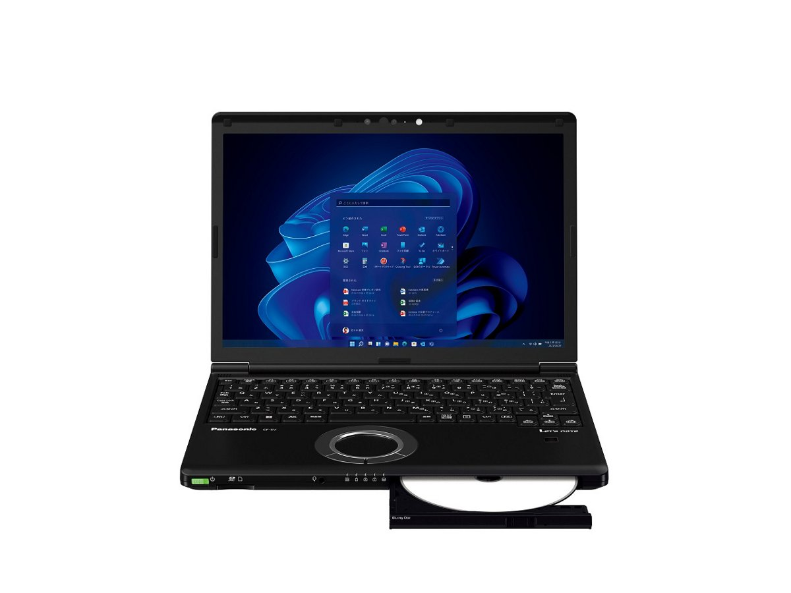
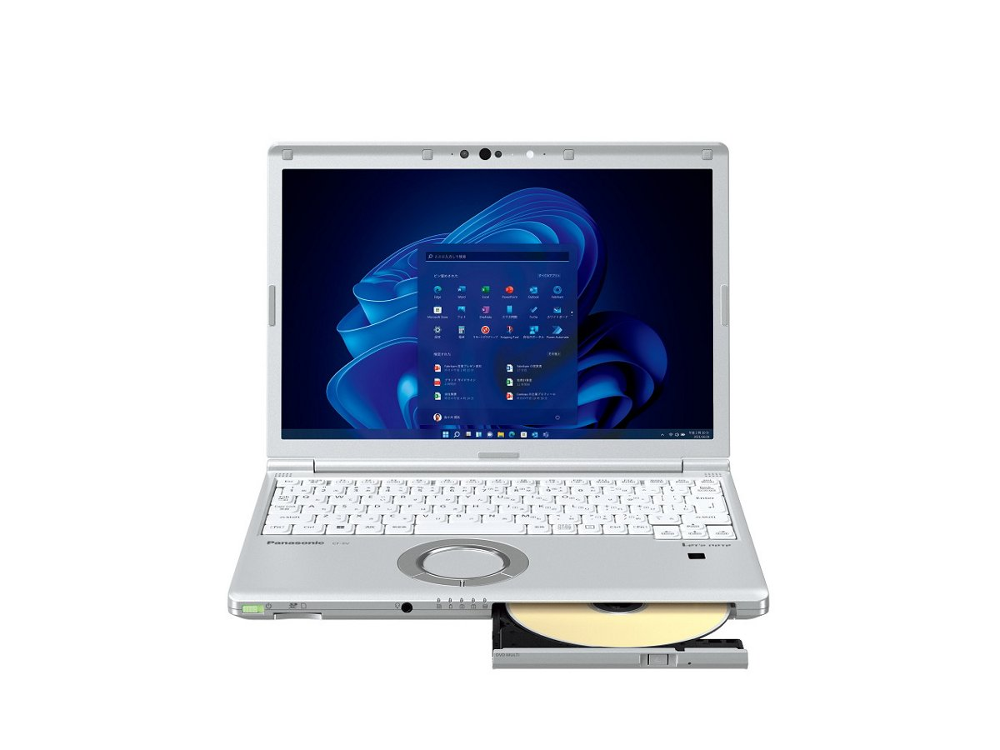
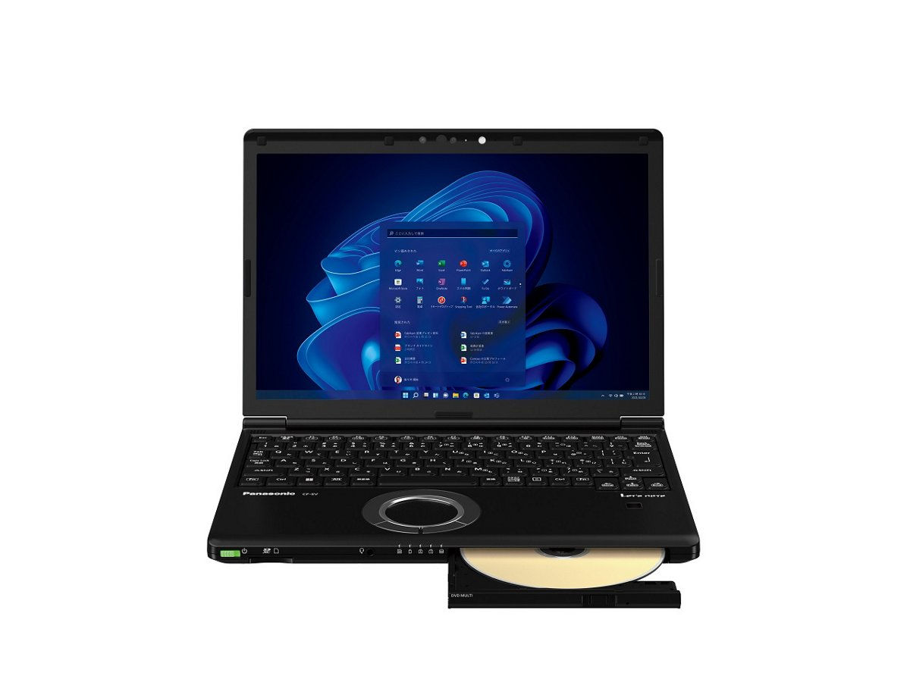
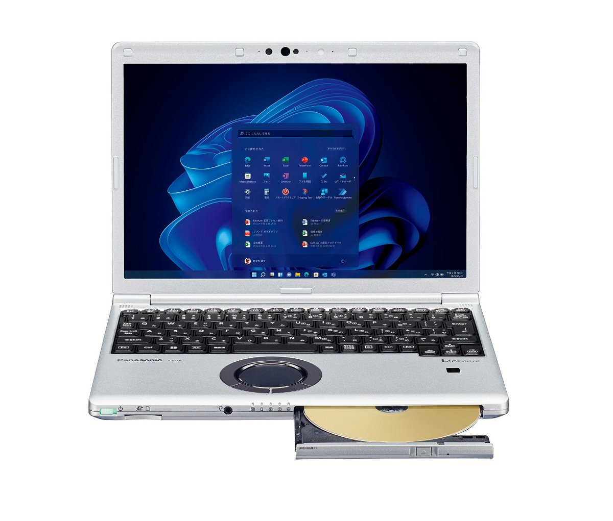
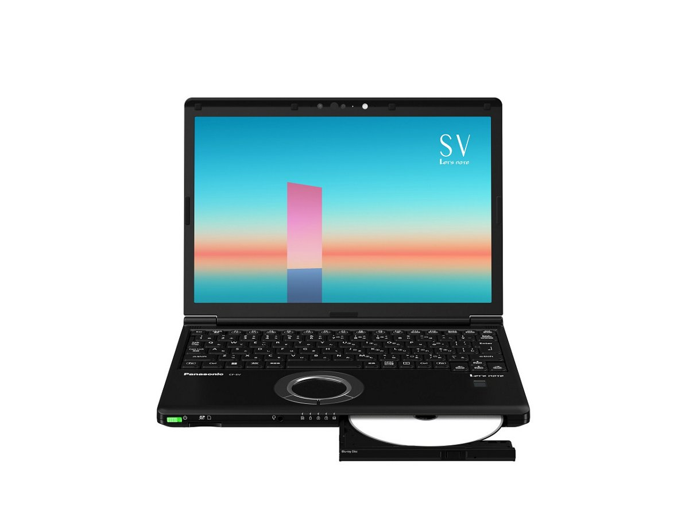
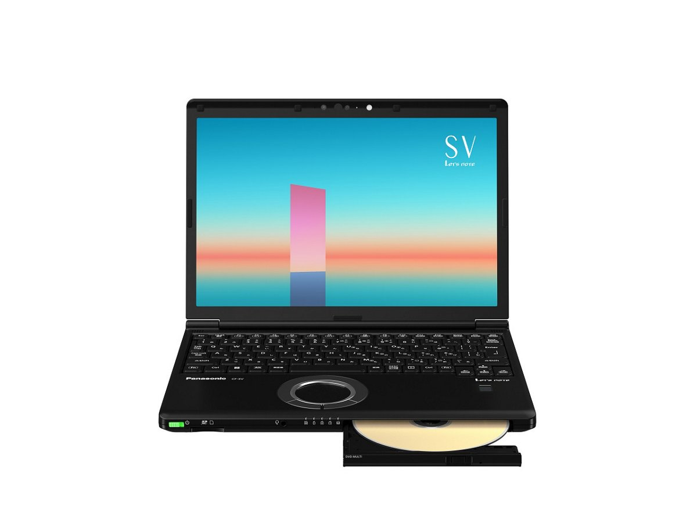
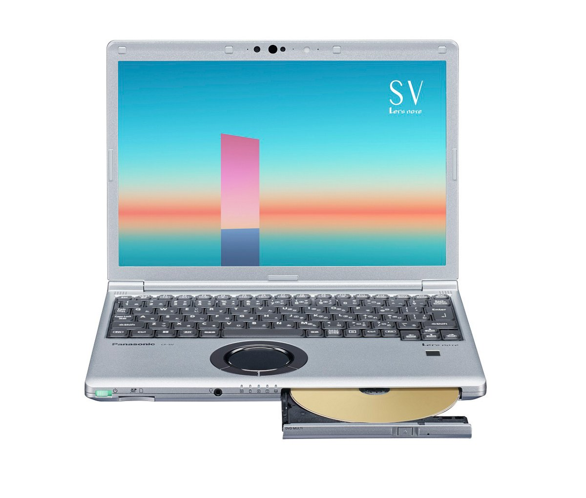

# Panasonic Let's note CF-SV2 Specifications

**English** · [日本語](../../ja/CF-SV2/) · [中文](../../zh/CF-SV2/)

**CF-SV2** is a Panasonic Let's note laptop in the SV series with a 12.1-inch WUXGA display. This page lists all 12 part numbers, released 2022-01 – 2023-01. Each part number links to its official spec sheet.

*Panasonic Let's note CF-SV2 (CF-SV2KFNCR, CF-SV2HFNCR, CF-SV2DFNCR), black. Image © Panasonic.*

## Part numbers

| Part number | Released | Discontinued | Summary |
| :-- | :-- | :-- | :-- |
| [CF-SV2KFNCR](https://panasonic.jp/pc/p-db/CF-SV2KFNCR_spec.html) | 2023-01 | 2023-08 | Windows 11 Pro 64ビット、インテル® CoreTM i7-1195G7プロセッサー、メモリー：16GB（空きスロットなし）、SSD：512GB、ブルーレイディスクドライブ、LAN、無線LAN 802.11a（W52/W53/W56）/b/g/n/ac/ax（6GHz帯含む）、LTE対応ワイヤレスWAN、Microsoft® Office Home and Business 2021 |
| [CF-SV2JDCCR](https://panasonic.jp/pc/p-db/CF-SV2JDCCR_spec.html) | 2023-01 | 2023-08 | Windows 11 Pro 64ビット、インテル® CoreTM i5-1155G7プロセッサー、メモリー：16GB（空きスロットなし）、SSD：512GB、スーパーマルチドライブ、LAN、無線LAN 802.11a（W52/W53/W56）/b/g/n/ac/ax（6GHz帯含む） |
| [CF-SV2HFNCR](https://panasonic.jp/pc/p-db/CF-SV2HFNCR_spec.html) | 2022-11 | 2023-03 | Windows 11 Pro 64ビット、インテル® CoreTM i7-1195G7プロセッサー、メモリー：16GB（空きスロットなし）、SSD：512GB、ブルーレイディスクドライブ、LAN、無線LAN 802.11a（W52/W53/W56）/b/g/n/ac/ax（6GHz帯含む）、LTE対応ワイヤレスWAN、Microsoft® Office Home and Business 2021 |
| [CF-SV2GDCCR](https://panasonic.jp/pc/p-db/CF-SV2GDCCR_spec.html) | 2022-11 | 2023-03 | Windows 11 Pro 64ビット、インテル® CoreTM i5-1155G7プロセッサー、メモリー：16GB（空きスロットなし）、SSD：512GB、スーパーマルチドライブ、LAN、無線LAN 802.11a（W52/W53/W56）/b/g/n/ac/ax（6GHz帯含む） |
| [CF-SV2DFNCR](https://panasonic.jp/pc/p-db/CF-SV2DFNCR_spec.html) | 2022-06 | 2022-11 | Windows 11 Pro 64ビット、インテル® CoreTM i7-1195G7プロセッサー、メモリー：16GB（空きスロットなし）、SSD：512GB、ブルーレイディスクドライブ、LAN、無線LAN 802.11a（W52/W53/W56）/b/g/n/ac/ax（6GHz帯含む）、LTE対応ワイヤレスWAN、Microsoft® Office Home and Business 2021 |
| [CF-SV2DDUCR](https://panasonic.jp/pc/p-db/CF-SV2DDUCR_spec.html) | 2022-06 | 2022-11 | Windows 11 Pro 64ビット、インテル® CoreTM i7-1195G7プロセッサー、メモリー：16GB（空きスロットなし）、SSD：512GB、スーパーマルチドライブ、LAN、無線LAN 802.11a（W52/W53/W56）/b/g/n/ac/ax（6GHz帯含む）、Microsoft® Office Home and Business 2021 |
| [CF-SV2BDMCR](https://panasonic.jp/pc/p-db/CF-SV2BDMCR_spec.html) | 2022-06 | 2022-11 | Windows 11 Pro 64ビット、インテル® CoreTM i5-1155G7プロセッサー、メモリー：16GB（空きスロットなし）、SSD：512GB、スーパーマルチドライブ、LAN、無線LAN 802.11a（W52/W53/W56）/b/g/n/ac/ax（6GHz帯含む）、Microsoft® Office Home and Business 2021 |
| [CF-SV2BDCCR](https://panasonic.jp/pc/p-db/CF-SV2BDCCR_spec.html) | 2022-06 | 2022-11 | Windows 11 Pro 64ビット、インテル® CoreTM i5-1155G7プロセッサー、メモリー：16GB（空きスロットなし）、SSD：512GB、スーパーマルチドライブ、LAN、無線LAN 802.11a（W52/W53/W56）/b/g/n/ac/ax（6GHz帯含む） |
| [CF-SV2MFNCR](https://panasonic.jp/pc/p-db/CF-SV2MFNCR_spec.html) | 2022-01 | 2022-05 | Windows 11 Pro 64ビット、インテル® CoreTM i7-1195G7プロセッサー、メモリー：16GB（空きスロットなし）、SSD：512GB、ブルーレイディスクドライブ、LAN、無線LAN 802.11a（W52/W53/W56）/b/g/n/ac/ax（6GHz帯含む）、LTE対応ワイヤレスWAN、Microsoft® Office Home and Business 2021 |
| [CF-SV2MDUCR](https://panasonic.jp/pc/p-db/CF-SV2MDUCR_spec.html) | 2022-01 | 2022-05 | Windows 11 Pro 64ビット、インテル® CoreTM i7-1195G7プロセッサー、メモリー：16GB（空きスロットなし）、SSD：512GB、スーパーマルチドライブ、LAN、無線LAN 802.11a（W52/W53/W56）/b/g/n/ac/ax（6GHz帯含む）、Microsoft® Office Home and Business 2021 |
| [CF-SV2LDMCR](https://panasonic.jp/pc/p-db/CF-SV2LDMCR_spec.html) | 2022-01 | 2022-05 | Windows 11 Pro 64ビット、インテル® CoreTM i5-1155G7プロセッサー、メモリー：16GB（空きスロットなし）、SSD：512GB、スーパーマルチドライブ、LAN、無線LAN 802.11a（W52/W53/W56）/b/g/n/ac/ax（6GHz帯含む）、Microsoft® Office Home and Business 2021 |
| [CF-SV2LDCCR](https://panasonic.jp/pc/p-db/CF-SV2LDCCR_spec.html) | 2022-01 | 2022-05 | Windows 11 Pro 64ビット、インテル® CoreTM i5-1155G7プロセッサー、メモリー：16GB（空きスロットなし）、SSD：512GB、スーパーマルチドライブ、LAN、無線LAN 802.11a（W52/W53/W56）/b/g/n/ac/ax（6GHz帯含む） |

## Common specifications

| Item | Value |
| :-- | :-- |
| OS | Windows 11 Pro |
| Chipset | CPUに内蔵 |
| Memory | 16GB LPDDR4x SDRAM（拡張スロットなし） |
| Storage | SSD：512GB（PCIe） / 上記容量のうち約15GBをリカバリー領域、約1GBをシステム領域として使用（ユーザー使用不可） |
| Display | 12.1型(16:10)WUXGA TFTカラー液晶 （1920 x 1200ドット）、アンチグレア |
| Display / Graphics | インテル® Iris® Xᵉ グラフィックス（CPUに内蔵） |
| Display / LCD colors | 1920×1200ドット：約1677万色 |
| Display / External output | 最大：1920×1200：約1677万色 / （以下HDMI出力/USB3.1 Type-Cポートのみ） / 最大：4096×2160（30 Hz/60 Hz） |
| Display / Simultaneous display | 最大：1920×1200：約1677万色 |
| Wired LAN | 1000BASE-T/100BASE-TX/10BASE-T |
| Bluetooth | Bluetooth v5.1 / ■対応プロファイル / 【Classic】 / ・A2DP（Source） / ・AVRCP（Target） / ・HCRP（Client） / ・HFP（AG） / ・HID（Host） / ・OPP（ClientおよびServer） / ・PAN（User） / ・SPP（DevAおよびDevB） / 【Low Energy】 / ・HOGP（Host） |
| Audio | PCM音源（24ビットステレオ）、インテル® High Definition Audio準拠、ステレオスピーカー |
| Security chip | TPM（TCG V2.0準拠） |
| Security (Windows Hello) | 顔認証対応カメラ/指紋センサー（タッチ式） |
| Memory expansion slot | なし |
| Camera | 顔認証対応カメラ、有効画素数：最大 1920x1080ピクセル（約207万画素） |
| Microphone | アレイマイク |
| Sensors | 照度(明るさ) |
| Ports | ・USB3.1 Type-Cポート（Thunderbolt™4対応、USB Power Delivery対応） / ・USB3.0 Type-Aポート×3（うち１つはスマホ充電対応を兼ねる） / ・LANコネクター（RJ-45） / ・外部ディスプレイコネクター（アナログRGB ミニD-sub 15ピン） / ・HDMI出力端子（4K60p出力対応） / ・ヘッドセット端子（マイク入力＋オーディオ出力）（ヘッドセットミニジャック3.5mm、CTIA準拠） |
| Pointing device | ホイールパッド |
| Power consumption | 最大約85W |
| Energy efficiency | 目標年度2022年度 12区分18.7［kWh/年］ |
| Efficiency target achievement | — |
| Dimensions (W×D×H) | 幅283.5mm×奥行203.8mm×高さ24.5mm（突起部除く） |

## Differences by part number

| Part number | CPU | Memory | Storage | Weight | Battery life |
| :-- | :-- | :-- | :-- | :-- | :-- |
| CF-SV2KFNCR | Core i7-1195G7 | 16GB LPDDR4x SDRAM | 512GB | 1.169 kg | 19.5 h |
| CF-SV2JDCCR | Core i5-1155G7 | 16GB LPDDR4x SDRAM | 512GB | 1.009 kg | 12.5 h |
| CF-SV2HFNCR | Core i7-1195G7 | 16GB LPDDR4x SDRAM | 512GB | 1.169 kg | 19.5 h |
| CF-SV2GDCCR | Core i5-1155G7 | 16GB LPDDR4x SDRAM | 512GB | 1.009 kg | 12.5 h |
| CF-SV2DFNCR | Core i7-1195G7 | 16GB LPDDR4x SDRAM | 512GB | 1.169 kg | 19.5 h |
| CF-SV2DDUCR | Core i7-1195G7 | 16GB LPDDR4x SDRAM | 512GB | 1.109 kg | 19.5 h |
| CF-SV2BDMCR | Core i5-1155G7 | 16GB LPDDR4x SDRAM | 512GB | 1.009 kg | 12.5 h |
| CF-SV2BDCCR | Core i5-1155G7 | 16GB LPDDR4x SDRAM | 512GB | 1.009 kg | 12.5 h |
| CF-SV2MFNCR | Core i7-1195G7 | 16GB LPDDR4x SDRAM | 512GB | 1.169 kg | 19.5 h |
| CF-SV2MDUCR | Core i7-1195G7 | 16GB LPDDR4x SDRAM | 512GB | 1.109 kg | 19.5 h |
| CF-SV2LDMCR | Core i5-1155G7 | 16GB LPDDR4x SDRAM | 512GB | 1.009 kg | 12.5 h |
| CF-SV2LDCCR | Core i5-1155G7 | 16GB LPDDR4x SDRAM | 512GB | 1.009 kg | 12.5 h |

CF-SV2KFNCR: all differing specifications

| Item | Value |
| :-- | :-- |
| CPU | インテル® Core™ i7-1195G7 プロセッサー / インテル® ターボ・ブースト・テクノロジー2.0利用時は最大5.00GHz / コア数：4コア / キャッシュ：12MB |
| Video memory | メインメモリーと共用 |
| Optical drive | ブルーレイディスクドライブ内蔵 / DVDスーパーマルチドライブ機能/バッファーアンダーランエラー防止機能搭載 |
| Optical drive speed / Read | BD-ROM：最大6倍速 / BD-R：最大6倍速 / BD-R DL：最大6倍速 / BD-R LTH：最大6倍速 / BD-R XL：最大6倍速 / BD-RE：最大6倍速 / BD-RE DL：最大6倍速 / BD-RE XL：最大4倍速 / DVD-RAM：最大5 倍速 / DVD-ROM：最大8 倍速 / DVD-R：最大8倍速 / DVD-R DL：最大8 倍速 / DVD-RW：最大8 倍速 / +R：最大8 倍速 / +R DL：最大8 倍速 / +RW：最大8 倍速 / High Speed +RW：最大8 倍速 / CD-ROM：最大24 倍速 / CD-R：最大24 倍速 / CD-RW：最大24 倍速 / High-Speed CD-RW：最大24 倍速 / Ultra-Speed CD-RW：最大24 倍速 |
| Optical drive speed / Write | BD-R書き込み：最大6 倍速 / BD-R DL書き込み：最大6 倍速 / BD-R LTH 書き込み：最大4 倍速 / BD-R XL書き込み：最大4 倍速 / BD-RE書き換え：2倍速 / BD-RE DL書き換え：2 倍速 / BD-RE XL 書き換え：2倍速 / DVD-RAM書き換え：最大5 倍速 / DVD-R 書き込み：最大8 倍速 / DVD-R DL書き込み：最大6 倍速 / DVD-RW書き換え：最大6 倍速 / +R 書き込み：最大8 倍速 / +R DL書き込み：最大6 倍速 / +RW 書き換え：最大4 倍速 / High Speed +RW書き換え：最大8 倍速 / CD-R 書き込み：最大24 倍速 / CD-RW 書き換え：4 倍速 / High-Speed CD-RW書き換え：10 倍速 / Ultra-Speed CD-RW書き換え：最大16 倍速 |
| Supported discs / Read | BD-ROM / BD-R（Ver.1.1/1.2/1.3、25GB） / BD-R DL（Ver.1.1/1.2/1.3、50GB） / BD-R LTH（Ver.1.2/1.3、25GB） / BD-R XL（Ver.2.0、100GB） / BD-RE（Ver. 2.1、25GB） / BD-RE DL（Ver.2.1、50GB） / BD-RE XL（Ver.3.0、100GB） / DVD-RAM（ 1.4GB、2.8GB、4.7GB、9.4GB ） / DVD-ROM（1層、2層） / DVD-Video（1層、2層） / DVD-R（1.4GB、2.8GB、3.95GB、4.7GB） / DVD-R DL（8.5GB） / DVD-RW（Ver.1.1/1.2 1.4GB、2.8GB、4.7GB、9.4GB） / +R（4.7GB） / +R DL（8.5GB） / +RW（4.7GB） / High Speed +RW（4.7GB） / CD-Audio / CD-ROM（XA対応） / Photo CD（マルチセッション対応） / Video CD / CD EXTRA / CD-TEXT / CD-R / CD-RW / High-Speed CD-RW / Ultra-Speed CD-RW |
| Supported discs / Write | BD-R（25GB） / BD-R DL（50GB） / BD-R LTH（25GB） / BD-R XL（100GB） / BD-RE（25GB） / BD-RE DL（50GB） / BD-RE XL（100GB） / DVD-RAM（1.4GB、2.8GB、4.7GB、9.4GB） / DVD-R（1.4GB、2.8 GB、4.7GB for General） / DVD-R DL（8.5GB） / DVD-RW（Ver.1.1/1.2 1.4GB、2.8GB、4.7GB、9.4GB） / +R（ 4.7GB） / +R DL（8.5GB） / +RW（ 4.7GB） / High Speed +RW（ 4.7GB） / CD-R / CD-RW / High-Speed CD-RW / Ultra-Speed CD-RW |
| Wireless LAN | Wi-Fi 6対応 IEEE802.11a/b/g/n/ac/ax 準拠 （5 GHzチャンネル帯：W52/W53/W56）WPA3、WPA2-AES/TKIP対応 |
| Wireless WAN | LTE対応 / （デュアルSIM(nano SIMカード＋eSIM)対応） |
| Card slots / SD card | SDメモリーカード×1スロット（SDHCメモリーカード/SDXCメモリーカード対応/著作権保護技術対応/UHS-I・UHS-Ⅱ高速転送対応） |
| Card slots / Other | nano SIMカードスロット |
| Keyboard | OADG準拠キーボード（86キー）：キーピッチ19mm(横)/16mm(縦)(一部キーを除く） |
| Power | ▼ACアダプター / 入力：AC100V～240V、50Hz/60Hz、出力：DC16V、5.3A、電源コードは100V専用 / ▼バッテリーパック（L） / 10.8V リチウムイオン・定格容量6300mAh |
| Battery life / charge time | ▼駆動時間 / （JEITA Ver.2.0） / 約19.5時間［付属バッテリーパック（L）装着時］ / ▼充電時間 / 最大3時間（電源オフ時）／最大3時間（電源オン時） |
| Color | ブラック |
| Weight (with battery) | パソコン本体：約1.169kg（付属バッテリーパック(L)（約355g）装着時） / ACアダプター：約260gまたは約230g（電源コード（約60g）除く） |
| Software | ・Microsoft® Edge / ・Microsoft® .NET Framework 4.8 / ・マカフィーリブセーフ（60日間 無料体験版） / ・i-フィルター for マルチデバイス (30日間無料お試し版) / ・WinZip （45日試用版） / ・Power2Go for Panasonic / ・PowerDirector BD for Panasonic / ・CyberLink PowerDVD14 / ・Aptioセットアップ / ・PC-Diagnosticユーティリティ / ・Panasonic PC設定ユーティリティ / ・DirectX 12 / ・PC情報ビューアー / ・Panasonic PC Camera Utility / ・Panasonic PC快適NAVI / ・Panasonic PC VVork |
| Microsoft Office | Microsoft® Office Home and Business 2021 |
| Accessories | バッテリーパック(L)、ACアダプター、取扱説明書、Microsoft Office Home & Business 2021等 |

Official spec sheet: <https://panasonic.jp/pc/p-db/CF-SV2KFNCR_spec.html>

CF-SV2JDCCR: all differing specifications

| Item | Value |
| :-- | :-- |
| CPU | インテル® Core™ i5-1155G7 プロセッサー / インテル® ターボ・ブースト・テクノロジー2.0利用時は最大4.50GHz / コア数：4コア / キャッシュ：8MB |
| Video memory | メインメモリーと共用 |
| Optical drive | DVDスーパーマルチドライブ内蔵 バッファアンダーランエラー防止機能搭載 |
| Optical drive speed / Read | DVD-RAM：最大5倍速 / DVD-ROM：最大8倍速 / DVD-R：最大8倍速 / DVD-R DL:最大8倍速 / DVD-RW：最大8倍速 / +R：最大8倍速 / +R DL：最大8倍速 / +RW：最大8倍速 / High Speed +RW：最大8倍速 / CD-ROM：最大24倍速 / CD-R：最大24倍速 / CD-RW：最大24倍速 / High-Speed CD-RW：最大24倍速 / Ultra-Speed CD-RW：最大24倍速 |
| Optical drive speed / Write | DVD-RAM書き換え：最大5倍速 / DVD-R 書き込み：最大8倍速 / DVD-R DL 書き込み：最大6倍速 / DVD-RW 書き換え：最大6倍速 / +R 書き込み：最大8倍速 / +R DL 書き込み：最大6倍速 / +RW 書き換え：最大4倍速 / High Speed +RW 書き換え：最大8倍速 / CD-R 書き込み：最大24倍速 / CD-RW 書き換え：4倍速 / High-Speed CD-RW 書き換え：10倍速 / Ultra-Speed CD-RW 書き換え：最大16倍速 |
| Supported discs / Read | DVD-RAM（ 1.4GB、2.8GB、4.7GB、9.4GB ） / DVD-ROM（1層、2層） / DVD-Video（1層、2層） / DVD-R（ 1.4GB、2.8GB、3.95GB、4.7GB） / DVD-R DL（ 8.5GB ） / DVD-RW（ Ver.1.1/1.2 1.4GB、2.8GB、4.7GB、9.4GB） / +R（ 4.7GB ） / +R DL（ 8.5GB ） / +RW（ 4.7GB ） / High Speed +RW（ 4.7GB ） / CD-Audio / CD-ROM（XA対応） / Photo CD（マルチセッション対応） / Video CD / CD EXTRA / CD-TEXT / CD-R / CD-RW / High-Speed CD-RW / Ultra-Speed CD-RW |
| Supported discs / Write | DVD-RAM（ 1.4GB、2.8GB、4.7GB、9.4GB） / DVD-R（ 1.4GB、2.8 GB、4.7GB for General） / DVD-R DL（ 8.5GB ） / DVD-RW（ Ver.1.1/1.2 1.4GB、2.8GB、4.7GB、9.4GB） / +R（ 4.7GB ） / +R DL（ 8.5GB ） / +RW（ 4.7GB ） / High Speed +RW（ 4.7GB） / CD-R / CD-RW / High-Speed CD-RW / Ultra-Speed CD-RW |
| Wireless LAN | Wi-Fi 6対応 IEEE802.11a/b/g/n/ac/ax 準拠 （5 GHzチャンネル帯：W52/W53/W56）WPA3、WPA2-AES/TKIP対応 |
| Wireless WAN | 搭載されていません |
| Keyboard | OADG準拠キーボード（86キー）：キーピッチ19mm(横)/16mm(縦)(一部キーを除く） |
| Power | ▼ACアダプター / 入力：AC100V～240V、50Hz/60Hz、出力：DC16V、5.3A、電源コードは100V専用 / ▼バッテリーパック（S） / 7.2V リチウムイオン・定格容量5900mAh |
| Battery life / charge time | ▼駆動時間 / （JEITA Ver.2.0） / 約12.5時間［付属バッテリーパック（S）装着時］ / ▼充電時間 / 最大3時間（電源オフ時）／最大3時間（電源オン時） |
| Color | シルバー |
| Weight (with battery) | パソコン本体：約1.009kg（付属バッテリーパック(S)（約255g）装着時） / ACアダプター：約260gまたは約230g（電源コード（約60g）除く） |
| Software | ・Microsoft® Edge / ・Microsoft® .NET Framework 4.8 / ・マカフィーリブセーフ（60日間 無料体験版） / ・i-フィルター for マルチデバイス (30日間無料お試し版) / ・WinZip （45日試用版） / ・Power2Go for Panasonic / ・PowerDirector for Panasonic / ・CyberLink PowerDVD14 / ・Aptioセットアップ / ・PC-Diagnosticユーティリティ / ・Panasonic PC設定ユーティリティ / ・DirectX 12 / ・PC情報ビューアー / ・Panasonic PC Camera Utility / ・Panasonic PC快適NAVI / ・Panasonic PC VVork |
| Accessories | バッテリーパック(S)、ACアダプター、取扱説明書 |
| SD card slot | SDメモリーカード×1スロット（SDHCメモリーカード/SDXCメモリーカード対応/著作権保護技術対応/UHS-I・UHS-Ⅱ高速転送対応） |

Official spec sheet: <https://panasonic.jp/pc/p-db/CF-SV2JDCCR_spec.html>

CF-SV2HFNCR: all differing specifications

| Item | Value |
| :-- | :-- |
| CPU | インテル® Core™ i7-1195G7 プロセッサー / インテル® ターボ・ブースト・テクノロジー2.0利用時は最大5.00GHz / コア数：4コア / キャッシュ：12MB |
| Video memory | 最大8110MB (メインメモリーと共用) |
| Optical drive | ブルーレイディスクドライブ内蔵 / DVDスーパーマルチドライブ機能/バッファーアンダーランエラー防止機能搭載 |
| Optical drive speed / Read | BD-ROM：最大6倍速 / BD-R：最大6倍速 / BD-R DL：最大6倍速 / BD-R LTH：最大6倍速 / BD-R XL：最大6倍速 / BD-RE：最大6倍速 / BD-RE DL：最大6倍速 / BD-RE XL：最大4倍速 / DVD-RAM：最大5 倍速 / DVD-ROM：最大8 倍速 / DVD-R：最大8倍速 / DVD-R DL：最大8 倍速 / DVD-RW：最大8 倍速 / +R：最大8 倍速 / +R DL：最大8 倍速 / +RW：最大8 倍速 / High Speed +RW：最大8 倍速 / CD-ROM：最大24 倍速 / CD-R：最大24 倍速 / CD-RW：最大24 倍速 / High-Speed CD-RW：最大24 倍速 / Ultra-Speed CD-RW：最大24 倍速 |
| Optical drive speed / Write | BD-R書き込み：最大6 倍速 / BD-R DL書き込み：最大6 倍速 / BD-R LTH 書き込み：最大4 倍速 / BD-R XL書き込み：最大4 倍速 / BD-RE書き換え：2倍速 / BD-RE DL書き換え：2 倍速 / BD-RE XL 書き換え：2倍速 / DVD-RAM書き換え：最大5 倍速 / DVD-R 書き込み：最大8 倍速 / DVD-R DL書き込み：最大6 倍速 / DVD-RW書き換え：最大6 倍速 / +R 書き込み：最大8 倍速 / +R DL書き込み：最大6 倍速 / +RW 書き換え：最大4 倍速 / High Speed +RW書き換え：最大8 倍速 / CD-R 書き込み：最大24 倍速 / CD-RW 書き換え：4 倍速 / High-Speed CD-RW書き換え：10 倍速 / Ultra-Speed CD-RW書き換え：最大16 倍速 |
| Supported discs / Read | BD-ROM / BD-R（Ver.1.1/1.2/1.3、25GB） / BD-R DL（Ver.1.1/1.2/1.3、50GB） / BD-R LTH（Ver.1.2/1.3、25GB） / BD-R XL（Ver.2.0、100GB） / BD-RE（Ver. 2.1、25GB） / BD-RE DL（Ver.2.1、50GB） / BD-RE XL（Ver.3.0、100GB） / DVD-RAM（ 1.4GB、2.8GB、4.7GB、9.4GB ） / DVD-ROM（1層、2層） / DVD-Video（1層、2層） / DVD-R（1.4GB、2.8GB、3.95GB、4.7GB） / DVD-R DL（8.5GB） / DVD-RW（Ver.1.1/1.2 1.4GB、2.8GB、4.7GB、9.4GB） / +R（4.7GB） / +R DL（8.5GB） / +RW（4.7GB） / High Speed +RW（4.7GB） / CD-Audio / CD-ROM（XA対応） / Photo CD（マルチセッション対応） / Video CD / CD EXTRA / CD-TEXT / CD-R / CD-RW / High-Speed CD-RW / Ultra-Speed CD-RW |
| Supported discs / Write | BD-R（25GB） / BD-R DL（50GB） / BD-R LTH（25GB） / BD-R XL（100GB） / BD-RE（25GB） / BD-RE DL（50GB） / BD-RE XL（100GB） / DVD-RAM（1.4GB、2.8GB、4.7GB、9.4GB） / DVD-R（1.4GB、2.8 GB、4.7GB for General） / DVD-R DL（8.5GB） / DVD-RW（Ver.1.1/1.2 1.4GB、2.8GB、4.7GB、9.4GB） / +R（ 4.7GB） / +R DL（8.5GB） / +RW（ 4.7GB） / High Speed +RW（ 4.7GB） / CD-R / CD-RW / High-Speed CD-RW / Ultra-Speed CD-RW |
| Wireless LAN | Wi-Fi 6対応 IEEE802.11a/b/g/n/ac/ax 準拠 （5 GHzチャンネル帯：W52/W53/W56）WPA3、WPA2-AES/TKIP対応 |
| Wireless WAN | LTE対応 / （デュアルSIM(nano SIMカード＋eSIM)対応） |
| Card slots / SD card | SDメモリーカード×1スロット（SDHCメモリーカード/SDXCメモリーカード対応/著作権保護技術対応/UHS-I・UHS-Ⅱ高速転送対応） |
| Card slots / Other | nano SIMカードスロット |
| Keyboard | OADG準拠キーボード（86キー）：キーピッチ19mm(横)/16mm(縦)(一部キーを除く） |
| Power | ▼ACアダプター / 入力：AC100V～240V、50Hz/60Hz、出力：DC16V、5.3A、電源コードは100V専用 / ▼バッテリーパック（L） / 10.8V リチウムイオン・定格容量6300mAh |
| Battery life / charge time | ▼駆動時間 / （JEITA Ver.2.0） / 約19.5時間［付属バッテリーパック（L）装着時］ / ▼充電時間 / 最大3時間（電源オフ時）／最大3時間（電源オン時） |
| Color | ブラック |
| Weight (with battery) | パソコン本体：約1.169kg（付属バッテリーパック(L)（約355g）装着時） / ACアダプター：約260gまたは約230g（電源コード（約60g）除く） |
| Software | ・Microsoft® Edge / ・Microsoft® .NET Framework 4.8 / ・Microsoft® Windows Media Player 12 / ・マカフィーリブセーフ（60日間 無料体験版） / ・i-フィルター for マルチデバイス (30日間無料お試し版) / ・WinZip （45日試用版） / ・Power2Go for Panasonic / ・PowerDirector BD for Panasonic / ・CyberLink PowerDVD14 / ・Aptioセットアップ / ・PC-Diagnosticユーティリティ / ・Panasonic PC設定ユーティリティ / ・DirectX 12 / ・PC情報ビューアー / ・Panasonic PC Camera Utility / ・Panasonic PC快適NAVI / ・Panasonic PC VVork |
| Microsoft Office | Microsoft® Office Home and Business 2021 |
| Accessories | バッテリーパック(L)、ACアダプター、取扱説明書、Microsoft Office Home & Business 2021等 |

Official spec sheet: <https://panasonic.jp/pc/p-db/CF-SV2HFNCR_spec.html>

CF-SV2GDCCR: all differing specifications

| Item | Value |
| :-- | :-- |
| CPU | インテル® Core™ i5-1155G7 プロセッサー / インテル® ターボ・ブースト・テクノロジー2.0利用時は最大4.50GHz / コア数：4コア / キャッシュ：8MB |
| Video memory | 最大8110MB (メインメモリーと共用) |
| Optical drive | DVDスーパーマルチドライブ内蔵 バッファアンダーランエラー防止機能搭載 |
| Optical drive speed / Read | DVD-RAM：最大5倍速 / DVD-ROM：最大8倍速 / DVD-R：最大8倍速 / DVD-R DL:最大8倍速 / DVD-RW：最大8倍速 / +R：最大8倍速 / +R DL：最大8倍速 / +RW：最大8倍速 / High Speed +RW：最大8倍速 / CD-ROM：最大24倍速 / CD-R：最大24倍速 / CD-RW：最大24倍速 / High-Speed CD-RW：最大24倍速 / Ultra-Speed CD-RW：最大24倍速 |
| Optical drive speed / Write | DVD-RAM書き換え：最大5倍速 / DVD-R 書き込み：最大8倍速 / DVD-R DL 書き込み：最大6倍速 / DVD-RW 書き換え：最大6倍速 / +R 書き込み：最大8倍速 / +R DL 書き込み：最大6倍速 / +RW 書き換え：最大4倍速 / High Speed +RW 書き換え：最大8倍速 / CD-R 書き込み：最大24倍速 / CD-RW 書き換え：4倍速 / High-Speed CD-RW 書き換え：10倍速 / Ultra-Speed CD-RW 書き換え：最大16倍速 |
| Supported discs / Read | DVD-RAM（ 1.4GB、2.8GB、4.7GB、9.4GB ） / DVD-ROM（1層、2層） / DVD-Video（1層、2層） / DVD-R（ 1.4GB、2.8GB、3.95GB、4.7GB） / DVD-R DL（ 8.5GB ） / DVD-RW（ Ver.1.1/1.2 1.4GB、2.8GB、4.7GB、9.4GB） / +R（ 4.7GB ） / +R DL（ 8.5GB ） / +RW（ 4.7GB ） / High Speed +RW（ 4.7GB ） / CD-Audio / CD-ROM（XA対応） / Photo CD（マルチセッション対応） / Video CD / CD EXTRA / CD-TEXT / CD-R / CD-RW / High-Speed CD-RW / Ultra-Speed CD-RW |
| Supported discs / Write | DVD-RAM（ 1.4GB、2.8GB、4.7GB、9.4GB） / DVD-R（ 1.4GB、2.8 GB、4.7GB for General） / DVD-R DL（ 8.5GB ） / DVD-RW（ Ver.1.1/1.2 1.4GB、2.8GB、4.7GB、9.4GB） / +R（ 4.7GB ） / +R DL（ 8.5GB ） / +RW（ 4.7GB ） / High Speed +RW（ 4.7GB） / CD-R / CD-RW / High-Speed CD-RW / Ultra-Speed CD-RW |
| Wireless LAN | Wi-Fi 6対応 IEEE802.11a/b/g/n/ac/ax 準拠 （5 GHzチャンネル帯：W52/W53/W56）WPA3、WPA2-AES/TKIP対応 |
| Wireless WAN | 搭載されていません |
| Keyboard | OADG準拠キーボード（86キー）：キーピッチ19mm(横)/16mm(縦)(一部キーを除く） |
| Power | ▼ACアダプター / 入力：AC100V～240V、50Hz/60Hz、出力：DC16V、5.3A、電源コードは100V専用 / ▼バッテリーパック（S） / 7.2V リチウムイオン・定格容量5900mAh |
| Battery life / charge time | ▼駆動時間 / （JEITA Ver.2.0） / 約12.5時間［付属バッテリーパック（S）装着時］ / ▼充電時間 / 最大3時間（電源オフ時）／最大3時間（電源オン時） |
| Color | シルバー |
| Weight (with battery) | パソコン本体：約1.009kg（付属バッテリーパック(S)（約255g）装着時） / ACアダプター：約260gまたは約230g（電源コード（約60g）除く） |
| Software | ・Microsoft® Edge / ・Microsoft® .NET Framework 4.8 / ・Microsoft® Windows Media Player 12 / ・マカフィーリブセーフ（60日間 無料体験版） / ・i-フィルター for マルチデバイス (30日間無料お試し版) / ・WinZip （45日試用版） / ・Power2Go for Panasonic / ・PowerDirector for Panasonic / ・CyberLink PowerDVD14 / ・Aptioセットアップ / ・PC-Diagnosticユーティリティ / ・Panasonic PC設定ユーティリティ / ・DirectX 12 / ・PC情報ビューアー / ・Panasonic PC Camera Utility / ・Panasonic PC快適NAVI / ・Panasonic PC VVork |
| Accessories | バッテリーパック(S)、ACアダプター、取扱説明書 |
| SD card slot | SDメモリーカード×1スロット（SDHCメモリーカード/SDXCメモリーカード対応/著作権保護技術対応/UHS-I・UHS-Ⅱ高速転送対応） |

Official spec sheet: <https://panasonic.jp/pc/p-db/CF-SV2GDCCR_spec.html>

CF-SV2DFNCR: all differing specifications

| Item | Value |
| :-- | :-- |
| CPU | インテル® Core™ i7-1195G7 プロセッサー / インテル® ターボ・ブースト・テクノロジー2.0利用時は最大5.00GHz / コア数：4コア / キャッシュ：12MB |
| Video memory | 最大8110MB (メインメモリーと共用) |
| Optical drive | ブルーレイディスクドライブ内蔵 / DVDスーパーマルチドライブ機能/バッファーアンダーランエラー防止機能搭載 |
| Optical drive speed / Read | BD-ROM：最大6倍速 / BD-R：最大6倍速 / BD-R DL：最大6倍速 / BD-R LTH：最大6倍速 / BD-R XL：最大6倍速 / BD-RE：最大6倍速 / BD-RE DL：最大6倍速 / BD-RE XL：最大4倍速 / DVD-RAM：最大5 倍速 / DVD-ROM：最大8 倍速 / DVD-R：最大8倍速 / DVD-R DL：最大8 倍速 / DVD-RW：最大8 倍速 / +R：最大8 倍速 / +R DL：最大8 倍速 / +RW：最大8 倍速 / High Speed +RW：最大8 倍速 / CD-ROM：最大24 倍速 / CD-R：最大24 倍速 / CD-RW：最大24 倍速 / High-Speed CD-RW：最大24 倍速 / Ultra-Speed CD-RW：最大24 倍速 |
| Optical drive speed / Write | BD-R書き込み：最大6 倍速 / BD-R DL書き込み：最大6 倍速 / BD-R LTH 書き込み：最大4 倍速 / BD-R XL書き込み：最大4 倍速 / BD-RE書き換え：2倍速 / BD-RE DL書き換え：2 倍速 / BD-RE XL 書き換え：2倍速 / DVD-RAM書き換え：最大5 倍速 / DVD-R 書き込み：最大8 倍速 / DVD-R DL書き込み：最大6 倍速 / DVD-RW書き換え：最大6 倍速 / +R 書き込み：最大8 倍速 / +R DL書き込み：最大6 倍速 / +RW 書き換え：最大4 倍速 / High Speed +RW書き換え：最大8 倍速 / CD-R 書き込み：最大24 倍速 / CD-RW 書き換え：4 倍速 / High-Speed CD-RW書き換え：10 倍速 / Ultra-Speed CD-RW書き換え：最大16 倍速 |
| Supported discs / Read | BD-ROM / BD-R（Ver.1.1/1.2/1.3、25GB） / BD-R DL（Ver.1.1/1.2/1.3、50GB） / BD-R LTH（Ver.1.2/1.3、25GB） / BD-R XL（Ver.2.0、100GB） / BD-RE（Ver. 2.1、25GB） / BD-RE DL（Ver.2.1、50GB） / BD-RE XL（Ver.3.0、100GB） / DVD-RAM（ 1.4GB、2.8GB、4.7GB、9.4GB ） / DVD-ROM（1層、2層） / DVD-Video（1層、2層） / DVD-R（1.4GB、2.8GB、3.95GB、4.7GB） / DVD-R DL（8.5GB） / DVD-RW（Ver.1.1/1.2 1.4GB、2.8GB、4.7GB、9.4GB） / +R（4.7GB） / +R DL（8.5GB） / +RW（4.7GB） / High Speed +RW（4.7GB） / CD-Audio / CD-ROM（XA対応） / Photo CD（マルチセッション対応） / Video CD / CD EXTRA / CD-TEXT / CD-R / CD-RW / High-Speed CD-RW / Ultra-Speed CD-RW |
| Supported discs / Write | BD-R（25GB） / BD-R DL（50GB） / BD-R LTH（25GB） / BD-R XL（100GB） / BD-RE（25GB） / BD-RE DL（50GB） / BD-RE XL（100GB） / DVD-RAM（1.4GB、2.8GB、4.7GB、9.4GB） / DVD-R（1.4GB、2.8 GB、4.7GB for General） / DVD-R DL（8.5GB） / DVD-RW（Ver.1.1/1.2 1.4GB、2.8GB、4.7GB、9.4GB） / +R（ 4.7GB） / +R DL（8.5GB） / +RW（ 4.7GB） / High Speed +RW（ 4.7GB） / CD-R / CD-RW / High-Speed CD-RW / Ultra-Speed CD-RW |
| Wireless LAN | Wi-Fi 6対応 IEEE802.11a/b/g/n/ac/ax 準拠 （5 GHzチャンネル帯：W52/W53/W56）WPA3、WPA2-AES/TKIP対応 |
| Wireless WAN | LTE対応 / （デュアルSIM(nano SIMカード＋eSIM)対応） |
| Card slots / SD card | SDメモリーカード×1スロット（SDHCメモリーカード/SDXCメモリーカード対応/著作権保護技術対応/UHS-I・UHS-Ⅱ高速転送対応） |
| Card slots / Other | nano SIMカードスロット |
| Keyboard | OADG準拠86キー、キーピッチ19mm(横)/16mm(縦)(一部キーを除く） |
| Power | ▼ACアダプター / 入力：AC100V～240V、50Hz/60Hz、出力：DC16V、5.3A、電源コードは100V専用 / ▼バッテリーパック（L） / 10.8V リチウムイオン・定格容量6300mAh |
| Battery life / charge time | ▼駆動時間 / （JEITA Ver.2.0） / 約19.5時間［付属バッテリーパック（L）装着時］ / ▼充電時間 / 最大3時間（電源オフ時）／最大3時間（電源オン時） |
| Color | ブラック |
| Weight (with battery) | パソコン本体：約1.169kg（付属バッテリーパック(L)（約355g）装着時） / ACアダプター：約260gまたは約230g（電源コード（約60g）除く） |
| Software | ・Microsoft® Edge / ・Microsoft® .NET Framework 4.8 / ・Microsoft® Windows Media Player 12 / ・マカフィーリブセーフ（60日間 無料体験版） / ・i-フィルター for マルチデバイス (30日間無料お試し版) / ・WinZip （45日試用版） / ・Power2Go for Panasonic / ・PowerDirector BD for Panasonic / ・CyberLink PowerDVD14 / ・Aptioセットアップ / ・PC-Diagnosticユーティリティ / ・Panasonic PC設定ユーティリティ / ・DirectX 12 / ・PC情報ビューアー / ・Panasonic PC Camera Utility / ・Panasonic PC快適NAVI / ・Panasonic PC VVork |
| Microsoft Office | Microsoft® Office Home and Business 2021 |
| Accessories | バッテリーパック(L)、ACアダプター、取扱説明書、Microsoft Office Home & Business 2021等 |

Official spec sheet: <https://panasonic.jp/pc/p-db/CF-SV2DFNCR_spec.html>

CF-SV2DDUCR: all differing specifications

| Item | Value |
| :-- | :-- |
| CPU | インテル® Core™ i7-1195G7 プロセッサー / インテル® ターボ・ブースト・テクノロジー2.0利用時は最大5.00GHz / コア数：4コア / キャッシュ：12MB |
| Video memory | 最大8110MB (メインメモリーと共用) |
| Optical drive | DVDスーパーマルチドライブ内蔵 バッファアンダーランエラー防止機能搭載 |
| Optical drive speed / Read | DVD-RAM：最大5倍速 / DVD-ROM：最大8倍速 / DVD-R：最大8倍速 / DVD-R DL:最大8倍速 / DVD-RW：最大8倍速 / +R：最大8倍速 / +R DL：最大8倍速 / +RW：最大8倍速 / High Speed +RW：最大8倍速 / CD-ROM：最大24倍速 / CD-R：最大24倍速 / CD-RW：最大24倍速 / High-Speed CD-RW：最大24倍速 / Ultra-Speed CD-RW：最大24倍速 |
| Optical drive speed / Write | DVD-RAM書き換え：最大5倍速 / DVD-R 書き込み：最大8倍速 / DVD-R DL 書き込み：最大6倍速 / DVD-RW 書き換え：最大6倍速 / +R 書き込み：最大8倍速 / +R DL 書き込み：最大6倍速 / +RW 書き換え：最大4倍速 / High Speed +RW 書き換え：最大8倍速 / CD-R 書き込み：最大24倍速 / CD-RW 書き換え：4倍速 / High-Speed CD-RW 書き換え：10倍速 / Ultra-Speed CD-RW 書き換え：最大16倍速 |
| Supported discs / Read | DVD-RAM（ 1.4GB、2.8GB、4.7GB、9.4GB ） / DVD-ROM（1層、2層） / DVD-Video（1層、2層） / DVD-R（ 1.4GB、2.8GB、3.95GB、4.7GB） / DVD-R DL（ 8.5GB ） / DVD-RW（ Ver.1.1/1.2 1.4GB、2.8GB、4.7GB、9.4GB） / +R（ 4.7GB ） / +R DL（ 8.5GB ） / +RW（ 4.7GB ） / High Speed +RW（ 4.7GB ） / CD-Audio / CD-ROM（XA対応） / Photo CD（マルチセッション対応） / Video CD / CD EXTRA / CD-TEXT / CD-R / CD-RW / High-Speed CD-RW / Ultra-Speed CD-RW |
| Supported discs / Write | DVD-RAM（ 1.4GB、2.8GB、4.7GB、9.4GB） / DVD-R（ 1.4GB、2.8 GB、4.7GB for General） / DVD-R DL（ 8.5GB ） / DVD-RW（ Ver.1.1/1.2 1.4GB、2.8GB、4.7GB、9.4GB） / +R（ 4.7GB ） / +R DL（ 8.5GB ） / +RW（ 4.7GB ） / High Speed +RW（ 4.7GB） / CD-R / CD-RW / High-Speed CD-RW / Ultra-Speed CD-RW |
| Wireless LAN | Wi-Fi 6対応 IEEE802.11a/b/g/n/ac/ax 準拠 （5 GHzチャンネル帯：W52/W53/W56）WPA3、WPA2-AES/TKIP対応 |
| Wireless WAN | 搭載されていません |
| Keyboard | OADG準拠86キー、キーピッチ19mm(横)/16mm(縦)(一部キーを除く） |
| Power | ▼ACアダプター / 入力：AC100V～240V、50Hz/60Hz、出力：DC16V、5.3A、電源コードは100V専用 / ▼バッテリーパック（L） / 10.8V リチウムイオン・定格容量6300mAh |
| Battery life / charge time | ▼駆動時間 / （JEITA Ver.2.0） / 約19.5時間［付属バッテリーパック（L）装着時］ / ▼充電時間 / 最大3時間（電源オフ時）／最大3時間（電源オン時） |
| Color | ブラック |
| Weight (with battery) | パソコン本体：約1.109kg（付属バッテリーパック（L）(約355g)装着時） / ACアダプター：約260gまたは約230g（電源コード（約60g）除く） |
| Software | ・Microsoft® Edge / ・Microsoft® .NET Framework 4.8 / ・Microsoft® Windows Media Player 12 / ・マカフィーリブセーフ（60日間 無料体験版） / ・i-フィルター for マルチデバイス (30日間無料お試し版) / ・WinZip （45日試用版） / ・Power2Go for Panasonic / ・PowerDirector for Panasonic / ・CyberLink PowerDVD14 / ・Aptioセットアップ / ・PC-Diagnosticユーティリティ / ・Panasonic PC設定ユーティリティ / ・DirectX 12 / ・PC情報ビューアー / ・Panasonic PC Camera Utility / ・Panasonic PC快適NAVI / ・Panasonic PC VVork |
| Microsoft Office | Microsoft® Office Home and Business 2021 |
| Accessories | バッテリーパック(L)、ACアダプター、取扱説明書、Microsoft Office Home & Business 2021等 |
| SD card slot | SDメモリーカード×1スロット（SDHCメモリーカード/SDXCメモリーカード対応/著作権保護技術対応/UHS-I・UHS-Ⅱ高速転送対応） |

Official spec sheet: <https://panasonic.jp/pc/p-db/CF-SV2DDUCR_spec.html>

CF-SV2BDMCR: all differing specifications

| Item | Value |
| :-- | :-- |
| CPU | インテル® Core™ i5-1155G7 プロセッサー / インテル® ターボ・ブースト・テクノロジー2.0利用時は最大4.50GHz / コア数：4コア / キャッシュ：8MB |
| Video memory | 最大8110MB (メインメモリーと共用) |
| Optical drive | DVDスーパーマルチドライブ内蔵 バッファアンダーランエラー防止機能搭載 |
| Optical drive speed / Read | DVD-RAM：最大5倍速 / DVD-ROM：最大8倍速 / DVD-R：最大8倍速 / DVD-R DL:最大8倍速 / DVD-RW：最大8倍速 / +R：最大8倍速 / +R DL：最大8倍速 / +RW：最大8倍速 / High Speed +RW：最大8倍速 / CD-ROM：最大24倍速 / CD-R：最大24倍速 / CD-RW：最大24倍速 / High-Speed CD-RW：最大24倍速 / Ultra-Speed CD-RW：最大24倍速 |
| Optical drive speed / Write | DVD-RAM書き換え：最大5倍速 / DVD-R 書き込み：最大8倍速 / DVD-R DL 書き込み：最大6倍速 / DVD-RW 書き換え：最大6倍速 / +R 書き込み：最大8倍速 / +R DL 書き込み：最大6倍速 / +RW 書き換え：最大4倍速 / High Speed +RW 書き換え：最大8倍速 / CD-R 書き込み：最大24倍速 / CD-RW 書き換え：4倍速 / High-Speed CD-RW 書き換え：10倍速 / Ultra-Speed CD-RW 書き換え：最大16倍速 |
| Supported discs / Read | DVD-RAM（ 1.4GB、2.8GB、4.7GB、9.4GB ） / DVD-ROM（1層、2層） / DVD-Video（1層、2層） / DVD-R（ 1.4GB、2.8GB、3.95GB、4.7GB） / DVD-R DL（ 8.5GB ） / DVD-RW（ Ver.1.1/1.2 1.4GB、2.8GB、4.7GB、9.4GB） / +R（ 4.7GB ） / +R DL（ 8.5GB ） / +RW（ 4.7GB ） / High Speed +RW（ 4.7GB ） / CD-Audio / CD-ROM（XA対応） / Photo CD（マルチセッション対応） / Video CD / CD EXTRA / CD-TEXT / CD-R / CD-RW / High-Speed CD-RW / Ultra-Speed CD-RW |
| Supported discs / Write | DVD-RAM（ 1.4GB、2.8GB、4.7GB、9.4GB） / DVD-R（ 1.4GB、2.8 GB、4.7GB for General） / DVD-R DL（ 8.5GB ） / DVD-RW（ Ver.1.1/1.2 1.4GB、2.8GB、4.7GB、9.4GB） / +R（ 4.7GB ） / +R DL（ 8.5GB ） / +RW（ 4.7GB ） / High Speed +RW（ 4.7GB） / CD-R / CD-RW / High-Speed CD-RW / Ultra-Speed CD-RW |
| Wireless LAN | Wi-Fi 6対応 IEEE802.11a/b/g/n/ac/ax 準拠 （5 GHzチャンネル帯：W52/W53/W56）WPA3、WPA2-AES/TKIP対応 |
| Wireless WAN | 搭載されていません |
| Keyboard | OADG準拠86キー、キーピッチ19mm(横)/16mm(縦)(一部キーを除く） |
| Power | ▼ACアダプター / 入力：AC100V～240V、50Hz/60Hz、出力：DC16V、5.3A、電源コードは100V専用 / ▼バッテリーパック（S） / 7.2V リチウムイオン・定格容量5900mAh |
| Battery life / charge time | ▼駆動時間 / （JEITA Ver.2.0） / 約12.5時間［付属バッテリーパック（S）装着時］ / ▼充電時間 / 最大3時間（電源オフ時）／最大3時間（電源オン時） |
| Color | ブラック&シルバー |
| Weight (with battery) | パソコン本体：約1.009kg（付属バッテリーパック(S)（約255g）装着時） / ACアダプター：約260gまたは約230g（電源コード（約60g）除く） |
| Software | ・Microsoft® Edge / ・Microsoft® .NET Framework 4.8 / ・Microsoft® Windows Media Player 12 / ・マカフィーリブセーフ（60日間 無料体験版） / ・i-フィルター for マルチデバイス (30日間無料お試し版) / ・WinZip （45日試用版） / ・Power2Go for Panasonic / ・PowerDirector for Panasonic / ・CyberLink PowerDVD14 / ・Aptioセットアップ / ・PC-Diagnosticユーティリティ / ・Panasonic PC設定ユーティリティ / ・DirectX 12 / ・PC情報ビューアー / ・Panasonic PC Camera Utility / ・Panasonic PC快適NAVI / ・Panasonic PC VVork |
| Microsoft Office | Microsoft® Office Home and Business 2021 |
| Accessories | バッテリーパック(S)、ACアダプター、取扱説明書、Microsoft Office Home & Business 2021等 |
| SD card slot | SDメモリーカード×1スロット（SDHCメモリーカード/SDXCメモリーカード対応/著作権保護技術対応/UHS-I・UHS-Ⅱ高速転送対応） |

Official spec sheet: <https://panasonic.jp/pc/p-db/CF-SV2BDMCR_spec.html>

CF-SV2BDCCR: all differing specifications

| Item | Value |
| :-- | :-- |
| CPU | インテル® Core™ i5-1155G7 プロセッサー / インテル® ターボ・ブースト・テクノロジー2.0利用時は最大4.50GHz / コア数：4コア / キャッシュ：8MB |
| Video memory | 最大8110MB (メインメモリーと共用) |
| Optical drive | DVDスーパーマルチドライブ内蔵 バッファアンダーランエラー防止機能搭載 |
| Optical drive speed / Read | DVD-RAM：最大5倍速 / DVD-ROM：最大8倍速 / DVD-R：最大8倍速 / DVD-R DL:最大8倍速 / DVD-RW：最大8倍速 / +R：最大8倍速 / +R DL：最大8倍速 / +RW：最大8倍速 / High Speed +RW：最大8倍速 / CD-ROM：最大24倍速 / CD-R：最大24倍速 / CD-RW：最大24倍速 / High-Speed CD-RW：最大24倍速 / Ultra-Speed CD-RW：最大24倍速 |
| Optical drive speed / Write | DVD-RAM書き換え：最大5倍速 / DVD-R 書き込み：最大8倍速 / DVD-R DL 書き込み：最大6倍速 / DVD-RW 書き換え：最大6倍速 / +R 書き込み：最大8倍速 / +R DL 書き込み：最大6倍速 / +RW 書き換え：最大4倍速 / High Speed +RW 書き換え：最大8倍速 / CD-R 書き込み：最大24倍速 / CD-RW 書き換え：4倍速 / High-Speed CD-RW 書き換え：10倍速 / Ultra-Speed CD-RW 書き換え：最大16倍速 |
| Supported discs / Read | DVD-RAM（ 1.4GB、2.8GB、4.7GB、9.4GB ） / DVD-ROM（1層、2層） / DVD-Video（1層、2層） / DVD-R（ 1.4GB、2.8GB、3.95GB、4.7GB） / DVD-R DL（ 8.5GB ） / DVD-RW（ Ver.1.1/1.2 1.4GB、2.8GB、4.7GB、9.4GB） / +R（ 4.7GB ） / +R DL（ 8.5GB ） / +RW（ 4.7GB ） / High Speed +RW（ 4.7GB ） / CD-Audio / CD-ROM（XA対応） / Photo CD（マルチセッション対応） / Video CD / CD EXTRA / CD-TEXT / CD-R / CD-RW / High-Speed CD-RW / Ultra-Speed CD-RW |
| Supported discs / Write | DVD-RAM（ 1.4GB、2.8GB、4.7GB、9.4GB） / DVD-R（ 1.4GB、2.8 GB、4.7GB for General） / DVD-R DL（ 8.5GB ） / DVD-RW（ Ver.1.1/1.2 1.4GB、2.8GB、4.7GB、9.4GB） / +R（ 4.7GB ） / +R DL（ 8.5GB ） / +RW（ 4.7GB ） / High Speed +RW（ 4.7GB） / CD-R / CD-RW / High-Speed CD-RW / Ultra-Speed CD-RW |
| Wireless LAN | Wi-Fi 6対応 IEEE802.11a/b/g/n/ac/ax 準拠 （5 GHzチャンネル帯：W52/W53/W56）WPA3、WPA2-AES/TKIP対応 |
| Wireless WAN | 搭載されていません |
| Keyboard | OADG準拠86キー、キーピッチ19mm(横)/16mm(縦)(一部キーを除く） |
| Power | ▼ACアダプター / 入力：AC100V～240V、50Hz/60Hz、出力：DC16V、5.3A、電源コードは100V専用 / ▼バッテリーパック（S） / 7.2V リチウムイオン・定格容量5900mAh |
| Battery life / charge time | ▼駆動時間 / （JEITA Ver.2.0） / 約12.5時間［付属バッテリーパック（S）装着時］ / ▼充電時間 / 最大3時間（電源オフ時）／最大3時間（電源オン時） |
| Color | シルバー |
| Weight (with battery) | パソコン本体：約1.009kg（付属バッテリーパック(S)（約255g）装着時） / ACアダプター：約260gまたは約230g（電源コード（約60g）除く） |
| Software | ・Microsoft® Edge / ・Microsoft® .NET Framework 4.8 / ・Microsoft® Windows Media Player 12 / ・マカフィーリブセーフ（60日間 無料体験版） / ・i-フィルター for マルチデバイス (30日間無料お試し版) / ・WinZip （45日試用版） / ・Power2Go for Panasonic / ・PowerDirector for Panasonic / ・CyberLink PowerDVD14 / ・Aptioセットアップ / ・PC-Diagnosticユーティリティ / ・Panasonic PC設定ユーティリティ / ・DirectX 12 / ・PC情報ビューアー / ・Panasonic PC Camera Utility / ・Panasonic PC快適NAVI / ・Panasonic PC VVork |
| Accessories | バッテリーパック(S)、ACアダプター、取扱説明書 |
| SD card slot | SDメモリーカード×1スロット（SDHCメモリーカード/SDXCメモリーカード対応/著作権保護技術対応/UHS-I・UHS-Ⅱ高速転送対応） |

Official spec sheet: <https://panasonic.jp/pc/p-db/CF-SV2BDCCR_spec.html>

CF-SV2MFNCR: all differing specifications

| Item | Value |
| :-- | :-- |
| CPU | インテル® Core™ i7-1195G7 プロセッサー / (キャッシュ12MB、インテル® ターボ・ブースト・テクノロジー2.0利用時は最大5.00GHz） |
| Video memory | 最大8110MB (メインメモリーと共用) |
| Optical drive | ブルーレイディスクドライブ内蔵 / DVDスーパーマルチドライブ機能/バッファーアンダーランエラー防止機能搭載 |
| Optical drive speed / Read | BD-ROM：最大6倍速 / BD-R：最大6倍速 / BD-R DL：最大6倍速 / BD-R LTH：最大6倍速 / BD-R XL：最大6倍速 / BD-RE：最大6倍速 / BD-RE DL：最大6倍速 / BD-RE XL：最大4倍速 / DVD-RAM：最大5 倍速 / DVD-ROM：最大8 倍速 / DVD-R：最大8倍速 / DVD-R DL：最大8 倍速 / DVD-RW：最大8 倍速 / +R：最大8 倍速 / +R DL：最大8 倍速 / +RW：最大8 倍速 / High Speed +RW：最大8 倍速 / CD-ROM：最大24 倍速 / CD-R：最大24 倍速 / CD-RW：最大24 倍速 / High-Speed CD-RW：最大24 倍速 / Ultra-Speed CD-RW：最大24 倍速 |
| Optical drive speed / Write | BD-R書き込み：最大6 倍速 / BD-R DL書き込み：最大6 倍速 / BD-R LTH 書き込み：最大4 倍速 / BD-R XL書き込み：最大4 倍速 / BD-RE書き換え：2倍速 / BD-RE DL書き換え：2 倍速 / BD-RE XL 書き換え：2倍速 / DVD-RAM書き換え：最大5 倍速 / DVD-R 書き込み：最大8 倍速 / DVD-R DL書き込み：最大6 倍速 / DVD-RW書き換え：最大6 倍速 / +R 書き込み：最大8 倍速 / +R DL書き込み：最大6 倍速 / +RW 書き換え：最大4 倍速 / High Speed +RW書き換え：最大8 倍速 / CD-R 書き込み：最大24 倍速 / CD-RW 書き換え：4 倍速 / High-Speed CD-RW書き換え：10 倍速 / Ultra-Speed CD-RW書き換え：最大16 倍速 |
| Supported discs / Read | BD-ROM / BD-R（Ver.1.1/1.2/1.3、25GB） / BD-R DL（Ver.1.1/1.2/1.3、50GB） / BD-R LTH（Ver.1.2/1.3、25GB） / BD-R XL（Ver.2.0、100GB） / BD-RE（Ver. 2.1、25GB） / BD-RE DL（Ver.2.1、50GB） / BD-RE XL（Ver.3.0、100GB） / DVD-RAM（ 1.4GB、2.8GB、4.7GB、9.4GB ） / DVD-ROM（1層、2層） / DVD-Video（1層、2層） / DVD-R（1.4GB、2.8GB、3.95GB、4.7GB） / DVD-R DL（8.5GB） / DVD-RW（Ver.1.1/1.2 1.4GB、2.8GB、4.7GB、9.4GB） / +R（4.7GB） / +R DL（8.5GB） / +RW（4.7GB） / High Speed +RW（4.7GB） / CD-Audio / CD-ROM（XA対応） / Photo CD（マルチセッション対応） / Video CD / CD EXTRA / CD-TEXT / CD-R / CD-RW / High-Speed CD-RW / Ultra-Speed CD-RW |
| Supported discs / Write | BD-R（25GB） / BD-R DL（50GB） / BD-R LTH（25GB） / BD-R XL（100GB） / BD-RE（25GB） / BD-RE DL（50GB） / BD-RE XL（100GB） / DVD-RAM（1.4GB、2.8GB、4.7GB、9.4GB） / DVD-R（1.4GB、2.8 GB、4.7GB for General） / DVD-R DL（8.5GB） / DVD-RW（Ver.1.1/1.2 1.4GB、2.8GB、4.7GB、9.4GB） / +R（ 4.7GB） / +R DL（8.5GB） / +RW（ 4.7GB） / High Speed +RW（ 4.7GB） / CD-R / CD-RW / High-Speed CD-RW / Ultra-Speed CD-RW |
| Wireless LAN | IEEE802.11a/b/g/n/ac/ax 準拠 （5 GHzチャンネル帯：W52/W53/W56）WPA3、WPA2-AES/TKIP対応、Wi-Fi準拠 |
| Card slots / SD card | SDメモリーカード×1スロット（SDHCメモリーカード/SDXCメモリーカード対応/著作権保護技術対応/UHS-I・UHS-Ⅱ高速転送対応） |
| Card slots / Other | nano SIMカードスロット |
| Keyboard | OADG準拠86キー、キーピッチ19mm(横)/16mm(縦)(一部キーを除く） |
| Power | ▼ACアダプター / 入力：AC100V～240V、50Hz/60Hz、出力：DC16V、5.3A、電源コードは100V専用 / ▼バッテリーパック（L） / 10.8V リチウムイオン・定格容量6300mAh |
| Battery life / charge time | ▼駆動時間 / （JEITA Ver.2.0） / 約19.5時間［付属バッテリーパック（L）装着時］ / ▼充電時間 / 最大3時間（電源オフ時）／最大3時間（電源オン時） |
| Color | ブラック |
| Weight (with battery) | パソコン本体：約1.169kg（付属バッテリーパック(L)（約355g）装着時） / ACアダプター：約260gまたは約230g（電源コード（約60g）除く） |
| Software | ・Microsoft® Edge / ・Microsoft® .NET Framework 4.8 / ・Microsoft® Windows Media Player 12 / ・マカフィーリブセーフ（60日間 無料体験版） / ・i-フィルター for マルチデバイス (30日間無料お試し版) / ・WinZip （45日試用版） / ・Power2Go for Panasonic / ・PowerDirector BD for Panasonic / ・CyberLink PowerDVD14 / ・Aptioセットアップ / ・PC-Diagnosticユーティリティ / ・Panasonic PC設定ユーティリティ / ・ハードディスクデータ消去ユーティリティ / ・DirectX 12 / ・PC情報ビューアー / ・Panasonic PC リカバリーディスク作成ユーティリティ / ・Panasonic PC Camera Utility / ・Panasonic PC快適NAVI / ・Panasonic PC VVork |
| Microsoft Office | Microsoft® Office Home and Business 2021 |
| Accessories | バッテリーパック(L)、ACアダプター、取扱説明書、Microsoft Office Home & Business 2021等 |
| CPU cores | 4コア |
| Wireless communication | Intel® Wi-Fi 6 AX201 |
| LTE | ワイヤレスWANモジュール内蔵（LTE対応） |

Official spec sheet: <https://panasonic.jp/pc/p-db/CF-SV2MFNCR_spec.html>

CF-SV2MDUCR: all differing specifications

| Item | Value |
| :-- | :-- |
| CPU | インテル® Core™ i7-1195G7 プロセッサー / (キャッシュ12MB、インテル® ターボ・ブースト・テクノロジー2.0利用時は最大5.00GHz） |
| Video memory | 最大8110MB (メインメモリーと共用) |
| Optical drive | DVDスーパーマルチドライブ内蔵 バッファアンダーランエラー防止機能搭載 |
| Optical drive speed / Read | DVD-RAM：最大5倍速 / DVD-ROM：最大8倍速 / DVD-R：最大8倍速 / DVD-R DL:最大8倍速 / DVD-RW：最大8倍速 / +R：最大8倍速 / +R DL：最大8倍速 / +RW：最大8倍速 / High Speed +RW：最大8倍速 / CD-ROM：最大24倍速 / CD-R：最大24倍速 / CD-RW：最大24倍速 / High-Speed CD-RW：最大24倍速 / Ultra-Speed CD-RW：最大24倍速 |
| Optical drive speed / Write | DVD-RAM書き換え：最大5倍速 / DVD-R 書き込み：最大8倍速 / DVD-R DL 書き込み：最大6倍速 / DVD-RW 書き換え：最大6倍速 / +R 書き込み：最大8倍速 / +R DL 書き込み：最大6倍速 / +RW 書き換え：最大4倍速 / High Speed +RW 書き換え：最大8倍速 / CD-R 書き込み：最大24倍速 / CD-RW 書き換え：4倍速 / High-Speed CD-RW 書き換え：10倍速 / Ultra-Speed CD-RW 書き換え：最大16倍速 |
| Supported discs / Read | DVD-RAM（ 1.4GB、2.8GB、4.7GB、9.4GB ） / DVD-ROM（1層、2層） / DVD-Video（1層、2層） / DVD-R（ 1.4GB、2.8GB、3.95GB、4.7GB） / DVD-R DL（ 8.5GB ） / DVD-RW（ Ver.1.1/1.2 1.4GB、2.8GB、4.7GB、9.4GB） / +R（ 4.7GB ） / +R DL（ 8.5GB ） / +RW（ 4.7GB ） / High Speed +RW（ 4.7GB ） / CD-Audio / CD-ROM（XA対応） / Photo CD（マルチセッション対応） / Video CD / CD EXTRA / CD-TEXT / CD-R / CD-RW / High-Speed CD-RW / Ultra-Speed CD-RW |
| Supported discs / Write | DVD-RAM（ 1.4GB、2.8GB、4.7GB、9.4GB） / DVD-R（ 1.4GB、2.8 GB、4.7GB for General） / DVD-R DL（ 8.5GB ） / DVD-RW（ Ver.1.1/1.2 1.4GB、2.8GB、4.7GB、9.4GB） / +R（ 4.7GB ） / +R DL（ 8.5GB ） / +RW（ 4.7GB ） / High Speed +RW（ 4.7GB） / CD-R / CD-RW / High-Speed CD-RW / Ultra-Speed CD-RW |
| Wireless LAN | IEEE802.11a/b/g/n/ac/ax 準拠 （5 GHzチャンネル帯：W52/W53/W56）WPA3、WPA2-AES/TKIP対応、Wi-Fi準拠 |
| Keyboard | OADG準拠86キー、キーピッチ19mm(横)/16mm(縦)(一部キーを除く） |
| Power | ▼ACアダプター / 入力：AC100V～240V、50Hz/60Hz、出力：DC16V、5.3A、電源コードは100V専用 / ▼バッテリーパック（L） / 10.8V リチウムイオン・定格容量6300mAh |
| Battery life / charge time | ▼駆動時間 / （JEITA Ver.2.0） / 約19.5時間［付属バッテリーパック（L）装着時］ / ▼充電時間 / 最大3時間（電源オフ時）／最大3時間（電源オン時） |
| Color | ブラック |
| Weight (with battery) | パソコン本体：約1.109kg（付属バッテリーパック（L）(約355g)装着時） / ACアダプター：約260gまたは約230g（電源コード（約60g）除く） |
| Software | ・Microsoft® Edge / ・Microsoft® .NET Framework 4.8 / ・Microsoft® Windows Media Player 12 / ・マカフィーリブセーフ（60日間 無料体験版） / ・i-フィルター for マルチデバイス (30日間無料お試し版) / ・WinZip （45日試用版） / ・Power2Go for Panasonic / ・PowerDirector for Panasonic / ・CyberLink PowerDVD14 / ・Aptioセットアップ / ・PC-Diagnosticユーティリティ / ・Panasonic PC設定ユーティリティ / ・ハードディスクデータ消去ユーティリティ / ・DirectX 12 / ・PC情報ビューアー / ・Panasonic PC リカバリーディスク作成ユーティリティ / ・Panasonic PC Camera Utility / ・Panasonic PC快適NAVI / ・Panasonic PC VVork |
| Microsoft Office | Microsoft® Office Home and Business 2021 |
| Accessories | バッテリーパック(L)、ACアダプター、取扱説明書、Microsoft Office Home & Business 2021等 |
| SD card slot | SDメモリーカード×1スロット（SDHCメモリーカード/SDXCメモリーカード対応/著作権保護技術対応/UHS-I・UHS-Ⅱ高速転送対応） |
| CPU cores | 4コア |
| Wireless communication | Intel® Wi-Fi 6 AX201 |
| LTE | 搭載されていません |

Official spec sheet: <https://panasonic.jp/pc/p-db/CF-SV2MDUCR_spec.html>

CF-SV2LDMCR: all differing specifications

| Item | Value |
| :-- | :-- |
| CPU | インテル® Core™ i5-1155G7 プロセッサー / (キャッシュ 8MB、インテル® ターボ・ブースト・テクノロジー2.0利用時は最大4.50GHz） |
| Video memory | 最大8110MB (メインメモリーと共用) |
| Optical drive | DVDスーパーマルチドライブ内蔵 バッファアンダーランエラー防止機能搭載 |
| Optical drive speed / Read | DVD-RAM：最大5倍速 / DVD-ROM：最大8倍速 / DVD-R：最大8倍速 / DVD-R DL:最大8倍速 / DVD-RW：最大8倍速 / +R：最大8倍速 / +R DL：最大8倍速 / +RW：最大8倍速 / High Speed +RW：最大8倍速 / CD-ROM：最大24倍速 / CD-R：最大24倍速 / CD-RW：最大24倍速 / High-Speed CD-RW：最大24倍速 / Ultra-Speed CD-RW：最大24倍速 |
| Optical drive speed / Write | DVD-RAM書き換え：最大5倍速 / DVD-R 書き込み：最大8倍速 / DVD-R DL 書き込み：最大6倍速 / DVD-RW 書き換え：最大6倍速 / +R 書き込み：最大8倍速 / +R DL 書き込み：最大6倍速 / +RW 書き換え：最大4倍速 / High Speed +RW 書き換え：最大8倍速 / CD-R 書き込み：最大24倍速 / CD-RW 書き換え：4倍速 / High-Speed CD-RW 書き換え：10倍速 / Ultra-Speed CD-RW 書き換え：最大16倍速 |
| Supported discs / Read | DVD-RAM（ 1.4GB、2.8GB、4.7GB、9.4GB ） / DVD-ROM（1層、2層） / DVD-Video（1層、2層） / DVD-R（ 1.4GB、2.8GB、3.95GB、4.7GB） / DVD-R DL（ 8.5GB ） / DVD-RW（ Ver.1.1/1.2 1.4GB、2.8GB、4.7GB、9.4GB） / +R（ 4.7GB ） / +R DL（ 8.5GB ） / +RW（ 4.7GB ） / High Speed +RW（ 4.7GB ） / CD-Audio / CD-ROM（XA対応） / Photo CD（マルチセッション対応） / Video CD / CD EXTRA / CD-TEXT / CD-R / CD-RW / High-Speed CD-RW / Ultra-Speed CD-RW |
| Supported discs / Write | DVD-RAM（ 1.4GB、2.8GB、4.7GB、9.4GB） / DVD-R（ 1.4GB、2.8 GB、4.7GB for General） / DVD-R DL（ 8.5GB ） / DVD-RW（ Ver.1.1/1.2 1.4GB、2.8GB、4.7GB、9.4GB） / +R（ 4.7GB ） / +R DL（ 8.5GB ） / +RW（ 4.7GB ） / High Speed +RW（ 4.7GB） / CD-R / CD-RW / High-Speed CD-RW / Ultra-Speed CD-RW |
| Wireless LAN | IEEE802.11a/b/g/n/ac/ax 準拠 （5 GHzチャンネル帯：W52/W53/W56）WPA3、WPA2-AES/TKIP対応、Wi-Fi準拠 |
| Keyboard | OADG準拠86キー、キーピッチ19mm(横)/16mm(縦)(一部キーを除く） |
| Power | ▼ACアダプター / 入力：AC100V～240V、50Hz/60Hz、出力：DC16V、5.3A、電源コードは100V専用 / ▼バッテリーパック（S） / 7.2V リチウムイオン・定格容量5900mAh |
| Battery life / charge time | ▼駆動時間 / （JEITA Ver.2.0） / 約12.5時間［付属バッテリーパック（S）装着時］ / ▼充電時間 / 最大3時間（電源オフ時）／最大3時間（電源オン時） |
| Color | ブラック&シルバー |
| Weight (with battery) | パソコン本体：約1.009kg（付属バッテリーパック(S)（約255g）装着時） / ACアダプター：約260gまたは約230g（電源コード（約60g）除く） |
| Software | ・Microsoft® Edge / ・Microsoft® .NET Framework 4.8 / ・Microsoft® Windows Media Player 12 / ・マカフィーリブセーフ（60日間 無料体験版） / ・i-フィルター for マルチデバイス (30日間無料お試し版) / ・WinZip （45日試用版） / ・Power2Go for Panasonic / ・PowerDirector for Panasonic / ・CyberLink PowerDVD14 / ・Aptioセットアップ / ・PC-Diagnosticユーティリティ / ・Panasonic PC設定ユーティリティ / ・ハードディスクデータ消去ユーティリティ / ・DirectX 12 / ・PC情報ビューアー / ・Panasonic PC リカバリーディスク作成ユーティリティ / ・Panasonic PC Camera Utility / ・Panasonic PC快適NAVI / ・Panasonic PC VVork |
| Microsoft Office | Microsoft® Office Home and Business 2021 |
| Accessories | バッテリーパック(S)、ACアダプター、取扱説明書、Microsoft Office Home & Business 2021等 |
| SD card slot | SDメモリーカード×1スロット（SDHCメモリーカード/SDXCメモリーカード対応/著作権保護技術対応/UHS-I・UHS-Ⅱ高速転送対応） |
| CPU cores | 4コア |
| Wireless communication | Intel® Wi-Fi 6 AX201 |
| LTE | 搭載されていません |

Official spec sheet: <https://panasonic.jp/pc/p-db/CF-SV2LDMCR_spec.html>

CF-SV2LDCCR: all differing specifications

| Item | Value |
| :-- | :-- |
| CPU | インテル® Core™ i5-1155G7 プロセッサー / (キャッシュ 8MB、インテル® ターボ・ブースト・テクノロジー2.0利用時は最大4.50GHz） |
| Video memory | 最大8110MB (メインメモリーと共用) |
| Optical drive | DVDスーパーマルチドライブ内蔵 バッファアンダーランエラー防止機能搭載 |
| Optical drive speed / Read | DVD-RAM：最大5倍速 / DVD-ROM：最大8倍速 / DVD-R：最大8倍速 / DVD-R DL:最大8倍速 / DVD-RW：最大8倍速 / +R：最大8倍速 / +R DL：最大8倍速 / +RW：最大8倍速 / High Speed +RW：最大8倍速 / CD-ROM：最大24倍速 / CD-R：最大24倍速 / CD-RW：最大24倍速 / High-Speed CD-RW：最大24倍速 / Ultra-Speed CD-RW：最大24倍速 |
| Optical drive speed / Write | DVD-RAM書き換え：最大5倍速 / DVD-R 書き込み：最大8倍速 / DVD-R DL 書き込み：最大6倍速 / DVD-RW 書き換え：最大6倍速 / +R 書き込み：最大8倍速 / +R DL 書き込み：最大6倍速 / +RW 書き換え：最大4倍速 / High Speed +RW 書き換え：最大8倍速 / CD-R 書き込み：最大24倍速 / CD-RW 書き換え：4倍速 / High-Speed CD-RW 書き換え：10倍速 / Ultra-Speed CD-RW 書き換え：最大16倍速 |
| Supported discs / Read | DVD-RAM（ 1.4GB、2.8GB、4.7GB、9.4GB ） / DVD-ROM（1層、2層） / DVD-Video（1層、2層） / DVD-R（ 1.4GB、2.8GB、3.95GB、4.7GB） / DVD-R DL（ 8.5GB ） / DVD-RW（ Ver.1.1/1.2 1.4GB、2.8GB、4.7GB、9.4GB） / +R（ 4.7GB ） / +R DL（ 8.5GB ） / +RW（ 4.7GB ） / High Speed +RW（ 4.7GB ） / CD-Audio / CD-ROM（XA対応） / Photo CD（マルチセッション対応） / Video CD / CD EXTRA / CD-TEXT / CD-R / CD-RW / High-Speed CD-RW / Ultra-Speed CD-RW |
| Supported discs / Write | DVD-RAM（ 1.4GB、2.8GB、4.7GB、9.4GB） / DVD-R（ 1.4GB、2.8 GB、4.7GB for General） / DVD-R DL（ 8.5GB ） / DVD-RW（ Ver.1.1/1.2 1.4GB、2.8GB、4.7GB、9.4GB） / +R（ 4.7GB ） / +R DL（ 8.5GB ） / +RW（ 4.7GB ） / High Speed +RW（ 4.7GB） / CD-R / CD-RW / High-Speed CD-RW / Ultra-Speed CD-RW |
| Wireless LAN | IEEE802.11a/b/g/n/ac/ax 準拠 （5 GHzチャンネル帯：W52/W53/W56）WPA3、WPA2-AES/TKIP対応、Wi-Fi準拠 |
| Keyboard | OADG準拠86キー、キーピッチ19mm(横)/16mm(縦)(一部キーを除く） |
| Power | ▼ACアダプター / 入力：AC100V～240V、50Hz/60Hz、出力：DC16V、5.3A、電源コードは100V専用 / ▼バッテリーパック（S） / 7.2V リチウムイオン・定格容量5900mAh |
| Battery life / charge time | ▼駆動時間 / （JEITA Ver.2.0） / 約12.5時間［付属バッテリーパック（S）装着時］ / ▼充電時間 / 最大3時間（電源オフ時）／最大3時間（電源オン時） |
| Color | シルバー |
| Weight (with battery) | パソコン本体：約1.009kg（付属バッテリーパック(S)（約255g）装着時） / ACアダプター：約260gまたは約230g（電源コード（約60g）除く） |
| Software | ・Microsoft® Edge / ・Microsoft® .NET Framework 4.8 / ・Microsoft® Windows Media Player 12 / ・マカフィーリブセーフ（60日間 無料体験版） / ・i-フィルター for マルチデバイス (30日間無料お試し版) / ・WinZip （45日試用版） / ・Power2Go for Panasonic / ・PowerDirector for Panasonic / ・CyberLink PowerDVD14 / ・Aptioセットアップ / ・PC-Diagnosticユーティリティ / ・Panasonic PC設定ユーティリティ / ・ハードディスクデータ消去ユーティリティ / ・DirectX 12 / ・PC情報ビューアー / ・Panasonic PC リカバリーディスク作成ユーティリティ / ・Panasonic PC Camera Utility / ・Panasonic PC快適NAVI / ・Panasonic PC VVork |
| Accessories | バッテリーパック(S)、ACアダプター、取扱説明書 |
| SD card slot | SDメモリーカード×1スロット（SDHCメモリーカード/SDXCメモリーカード対応/著作権保護技術対応/UHS-I・UHS-Ⅱ高速転送対応） |
| CPU cores | 4コア |
| Wireless communication | Intel® Wi-Fi 6 AX201 |
| LTE | 搭載されていません |

Official spec sheet: <https://panasonic.jp/pc/p-db/CF-SV2LDCCR_spec.html>

## Photos

*Panasonic Let's note CF-SV2 (CF-SV2JDCCR, CF-SV2GDCCR, CF-SV2BDCCR), silver. Image © Panasonic.*

*Panasonic Let's note CF-SV2 (CF-SV2DDUCR), black. Image © Panasonic.*

*Panasonic Let's note CF-SV2 (CF-SV2BDMCR), black & silver. Image © Panasonic.*

*Panasonic Let's note CF-SV2 (CF-SV2MFNCR), black. Image © Panasonic.*

*Panasonic Let's note CF-SV2 (CF-SV2MDUCR), black. Image © Panasonic.*

*Panasonic Let's note CF-SV2 (CF-SV2LDMCR), black & silver. Image © Panasonic.*

## Related models

- Older model in the series: [CF-SV1](../CF-SV1/)
- [All Let's note models](../)

---

Source: Panasonic's official [discontinued-models list](https://panasonic.jp/pc/support/products/) and spec sheets (panasonic.jp). Spec values are quoted in the original Japanese. Product images © Panasonic. This is an unofficial compilation, not affiliated with Panasonic.
