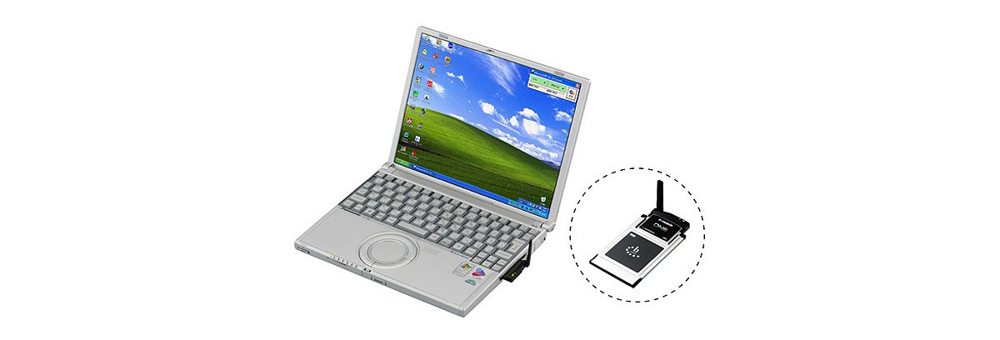

# Panasonic Let's note CF-W2 Specifications

**English** · [日本語](../../ja/CF-W2/) · [中文](../../zh/CF-W2/)

🗄️ See this model in the [Let's note Cabinet](https://letsnote-specs.github.io/en/CF-W2/).

**CF-W2** is a Panasonic Let's note laptop in the W2 series with a 12.1-inch XGA display. This page lists all 10 part numbers, released 2003-06 – 2005-02. Each part number links to its official spec sheet.

*Panasonic Let's note CF-W2 (CF-W2BW1AXR, CF-W2BW1HXR, CF-W2AW1AXR). Image © Panasonic.*

## Part numbers

| Part number | Released | Discontinued | Summary |
| :-- | :-- | :-- | :-- |
| [CF-W2FW6AXR](https://panasonic.jp/pc/p-db/CF-W2FW6AXR_spec.html) | 2005-02 | 2005-04 | Windows® XP Professional, PentiumM 753 (1.2GHz・ULV), Memory: 256MB (max 768MB), HDD: 40GB, Super Multi Drive, LAN, Wireless LAN (802.11a/b/g), USB2.0 |
| [CF-W2EW6AXR](https://panasonic.jp/pc/p-db/CF-W2EW6AXR_spec.html) | 2004-11 | 2004-12 | Windows® XP Professional, PentiumM 733 (1.1GHz・ULV), Memory: 256MB (max 768MB), HDD: 40GB, Super Multi Drive, LAN, Wireless LAN (802.11a/b/g), USB2.0 |
| [CF-W2EW1AXR](https://panasonic.jp/pc/p-db/CF-W2EW1AXR_spec.html) | 2004-10 | 2004-11 | Windows® XP Professional, PentiumM 733 (1.1GHz・ULV), Memory: 256MB (max 768MB), HDD: 40GB, DVD-ROM&CD-R/RW, LAN, Wireless LAN (802.11a/b/g), USB2.0 |
| [CF-W2DW6BXR](https://panasonic.jp/pc/p-db/CF-W2DW6BXR_spec.html) | 2004-08 | 2004-08 | Windows® XP Professional, PentiumM (1.1GHz・ULV), Memory: 256MB (max 768MB), HDD: 40GB, DVD MULTI drive, LAN, Wireless LAN (802.11b/g), USB2.0, b-mobile |
| [CF-W2DW6AXR](https://panasonic.jp/pc/p-db/CF-W2DW6AXR_spec.html) | 2004-06 | 2004-07 | Windows® XP Professional, PentiumM (1.1GHz・ULV), Memory: 256MB (max 768MB), HDD: 40GB, DVD MULTI Drive, LAN, Wireless LAN (802.11b/g), USB2.0 |
| [CF-W2DW1AXR](https://panasonic.jp/pc/p-db/CF-W2DW1AXR_spec.html) | 2004-05 | 2004-06 | Windows® XP Professional, PentiumM (1.1GHz・ULV), Memory: 256MB (max 768MB), HDD: 40GB, DVD-ROM&CD-R/RW, LAN, Wireless LAN (802.11b/g), USB2.0 |
| [CF-W2CW1AXR](https://panasonic.jp/pc/p-db/CF-W2CW1AXR_spec.html) | 2004-02 | 2004-04 | Windows® XP Professional, PentiumM (1GHz・ULV), Memory: 256MB (max 512MB), HDD: 40GB, DVD-ROM&CD-R/RW, LAN, Wireless LAN (802.11b/g), USB2.0 |
| [CF-W2BW1AXR](https://panasonic.jp/pc/p-db/CF-W2BW1AXR_spec.html) | 2003-10 | 2004-01 | Windows® XP Professional, PentiumM (1GHz・ULV), Memory: 256MB (max 512MB), HDD: 40GB, DVD-ROM&CD-R/RW, LAN, Wireless LAN (802.11b), USB2.0 |
| [CF-W2BW1HXR](https://panasonic.jp/pc/p-db/CF-W2BW1HXR_spec.html) | 2003-10 | 2004-01 | Windows® XP Professional, PentiumM (1GHz・ULV), Memory: 256MB (max 512MB), HDD: 40GB, DVD-ROM&CD-R/RW, LAN, Wireless LAN (802.11b), USB2.0, Office Personal 2003, Office OneNote 2003 <limited quantity> |
| [CF-W2AW1AXR](https://panasonic.jp/pc/p-db/CF-W2AW1AXR_spec.html) | 2003-06 | 2003-08 | Windows® XP Professional, PentiumM (900MHz・ULV), Memory: 256MB (max 512MB), HDD: 40GB, DVD-ROM&CD-R/RW, LAN, Wireless LAN (802.11b), USB2.0 |

## Common specifications

| Item | Value |
| :-- | :-- |
| Chipset | Intel(R) 855GM chipset |
| Display | XGA (1024×768 dots) 12.1-inch TFT color LCD |
| Wired LAN | 100BASE-TX / 10BASE-T |
| Audio | PCM sound source (16-bit stereo), monaural speaker |
| Ports / USB | USB connector ×2 (USB2.0) |
| Ports / External display | Analog RGB mini Dsub 15-pin |
| Ports / Other | Modem connector (RJ-11), LAN connector (RJ-45) |
| Pointing device | Wheel pad |
| Power consumption | Max approx. 40 W |
| Dimensions (excluding protrusions) | Width 268 mm×Depth 209.2 mm×Height 27.5 mm/41.5 mm (front/rear) excluding protrusions |

## Differences by part number

| Part number | CPU | Memory | Storage | Weight | Battery life |
| :-- | :-- | :-- | :-- | :-- | :-- |
| CF-W2FW6AXR | Pentium M Ultra Low Voltage Edition 753 | 256 MB | 40 GB | 1.29 kg | 7.5 h |
| CF-W2EW6AXR | Pentium M Ultra Low Voltage Edition 733 | 256 MB | 40 GB | 1.29 kg | 7.5 h |
| CF-W2EW1AXR | Pentium M Ultra Low Voltage Edition 733 | 256 MB | 40 GB | 1.29 kg | 7.5 h |
| CF-W2DW6BXR | Ultra-low voltage version Pentium M 1.1GHz | 256 MB | 40 GB | 1.29 kg | 7 h |
| CF-W2DW6AXR | Ultra-low voltage version Pentium M 1.1GHz | 256 MB | 40 GB | 1.29 kg | 7 h |
| CF-W2DW1AXR | Ultra-low voltage version Pentium M 1.1GHz | 256 MB | 40 GB | 1.29 kg | 7.5 h |
| CF-W2CW1AXR | Ultra-low voltage version Pentium M 1GHz | 256 MB | 40 GB | 1.29 kg | 7.5 h |
| CF-W2BW1AXR | Ultra-low voltage version Pentium M 1GHz | 256 MB | 40 GB | 1.29 kg | 7.5 h |
| CF-W2BW1HXR | Ultra-low voltage version Pentium M 1GHz | 256 MB | 40 GB | 1.29 kg | 7.5 h |
| CF-W2AW1AXR | Ultra-low voltage version Pentium M 900 MHz | 256 MB | 40 GB | 1.29 kg | 7.5 h |

CF-W2FW6AXR: all differing specifications

| Item | Value |
| :-- | :-- |
| OS | Microsoft(R) Windows(R) XP Professional Service Pack 2 with Enhanced Security Features |
| CPU | Intel(R) Centrino(TM) Mobile Technology / Intel(R) Pentium(R) M processor Ultra Low Voltage 753 (2nd-level cache memory 2 MB, operating frequency 1.20 GHz, front side bus 400 MHz) |
| Memory | Standard 256 Mbytes / maximum 768 Mbytes (PC2100 / DDR SDRAM) |
| Video memory | Max 64 MByte (shared with main memory) |
| Hard disk | 40 GB (Ultra ATA100) |
| Optical drive | Built-in Super Multi Drive, equipped with buffer underrun error prevention function (SmoothLinkTM) |
| Optical drive speed / Read | DVD-RAM 2x (4.7GB)/1x (2.6GB), DVD-R max 4x, DVD-RW max 4x, DVD-ROM max 8x, +R max 4x, +RW max 4x, CD-ROM max 24x, CD-R max 24x, CD-RW max 20x |
| Optical drive speed / Write | DVD-RAM 2x (4.7GB), DVD-R max 2x, DVD-RW max 2x, +R 2.4x, +RW 2.4x, CD-R max 24x, CD-RW max 10x |
| Supported discs / Read | DVD-RAM, DVD-ROM, DVD-Video, DVD-R, DVD-RW (Ver.1.1/1.2), +R, +RW, CD-ROM (XA compatible), PhotoCD (multi-session compatible), VideoCD, CD-EXTRA, CD-Audio, CD-R, CD-RW |
| Supported discs / Write | DVD-RAM、DVD-R、DVD-RW（Ver.1.1/1.2）、+R、+RW、CD-R、CD-RW |
| Floppy drive (optional) | USB-connected external 3.5-inch 3-mode supported (1.44 MB/1.2 MB/720 KB) (optional) |
| Display / LCD colors | 1024×768 dots: approx. 16.77 million colors |
| Display / External output | 800×600, 1024×768, 1280×1024, 1600×1200 dots: approx. 16.77 million colors |
| Display / Simultaneous display | 800×600, 1024×768 dots: approx. 16.77 million colors |
| Wireless LAN | Intel(R) PRO / Wireless 2915ABG, IEEE802.11a/b/g compliant, (WPA support, Wi-Fi compliant) |
| Modem | Data: 56 kbps( V.90 )FAX: 14.4 kbps/Voice not supported |
| Card slots / PC Card | PC card (TYPE II) ×1 slot CardBus compatible / allowable current (3.3 V: 400 mA, 5 V: 400 mA) |
| Card slots / SD card | SD memory card ×1 slot (copyright protection technology support) |
| Memory expansion slot | 172-pin microDIMM dedicated slot ×1 (PC2100 / DDR SDRAM) |
| Ports / Audio | Microphone input (monaural mini jack), audio output (stereo mini jack) |
| Keyboard | OADG-compliant keyboard (87 keys): key pitch 19mm (horizontal) × 16mm (vertical) (excluding some keys) |
| Power | AC100 V-240 V (50 Hz/60 Hz) (Power cord is for 100 V only), Standard battery pack (7.4 V lithium-ion, 7.05 Ah) |
| Energy efficiency | S classification 0.00021 / Rated input power value based on the Japan Electronics and Information Technology Industries Association Information Processing Equipment Harmonic Current Suppression Measures Implementation Plan: 24 W |
| Efficiency target achievement | — |
| Battery | Battery life approx. 7.5 hours / Charging time approx. 4.5 hours (power OFF), approx. 4.5 hours (power ON) |
| Weight (with battery) | approx. 1290 g (including standard battery) |
| Software | Microsoft(R) Internet Explorer 6 Service Pack 2, Adobe(R) Reader, DMI viewer, Microsoft(R) Windows(R) MediaTM Player 9, DirectX 9.0c, Microsoft(R) Windows(R) Movie Maker 2.1, NetSelector, SD Utility, WheelPad Utility, Online Sign-up (hi-ho, @nifty, DION, OCN), Font Size Enlargement Utility, Zoom Viewer, PC Information Viewer, NumLock Notification, Hard Disk Data Erase Utility, Wireless Manager mobile edition, McAfee(R) VirusScan◆, Wireless LAN Switching Utility, B's Recorder GOLD8 BASIC◆, B's CLiP 6◆, Win DVD 5 (OEM version) CPRM compatible◆, Optical Disc Drive Power Saving Utility, DVD-MovieAlbum SE 4.0, B's DVD Expert (authoring software) / * Word processing, spreadsheet and other application software is not installed. |

Official spec sheet: <https://panasonic.jp/pc/p-db/CF-W2FW6AXR_spec.html>

CF-W2EW6AXR: all differing specifications

| Item | Value |
| :-- | :-- |
| OS | Microsoft(R) Windows(R) XP Professional Service Pack 2 with Enhanced Security Features |
| CPU | Intel(R) CentrinoTM Mobile Technology / Intel(R) Pentium(R) M processor Ultra Low Voltage 733 (2nd-level cache memory 2 MB, operating frequency 1.10 GHz, front side bus 400 MHz) |
| Memory | Standard 256 Mbytes / maximum 768 Mbytes (PC2100 / DDR SDRAM) |
| Video memory | Max 64 MByte (shared with main memory) |
| Hard disk | 40 GB (Ultra ATA100) |
| Optical drive | Built-in Super Multi Drive, equipped with buffer underrun error prevention function (SmoothLinkTM) |
| Optical drive speed / Read | DVD-RAM 2x (4.7GB)/1x (2.6GB), DVD-R max 4x, DVD-RW max 4x, DVD-ROM max 8x, +R 4x, +RW 4x, CD-ROM max 24x, CD-R max 24x, CD-RW max 20x |
| Optical drive speed / Write | DVD-RAM 2x (4.7GB), DVD-R max 2x, DVD-RW max 2x, +R 2.4x, +RW 2.4x, CD-R max 24x, CD-RW max 10x |
| Supported discs / Read | DVD-RAM, DVD-ROM, DVD-Video, DVD-R, DVD-RW (Ver.1.1/1.2), +R, +RW, CD-DA, CD-ROM (XA compatible), PhotoCD (multi-session compatible), VideoCD, CD-EXTRA, CD-R, CD-RW |
| Supported discs / Write | DVD-RAM、DVD-R、DVD-RW（Ver.1.1/1.2）、+R、+RW、CD-R、CD-RW |
| Floppy drive (optional) | USB-connected external 3.5-inch 3-mode supported (1.44 MB/1.2 MB/720 KB) (optional) |
| Display / LCD colors | 1024×768 dots: approx. 16.77 million colors |
| Display / External output | 800×600, 1024×768, 1280×1024, 1600×1200 dots: approx. 16.77 million colors |
| Display / Simultaneous display | 800×600, 1024×768 dots: approx. 16.77 million colors |
| Wireless LAN | Intel(R) PRO / Wireless 2915ABG, IEEE802.11a/b/g compliant, (WPA support, Wi-Fi compliant) |
| Modem | Data: 56 kbps( V.90 )FAX: 14.4 kbps/Voice not supported |
| Card slots / PC Card | PC card (TYPE II) ×1 slot CardBus compatible / allowable current (3.3 V: 400 mA, 5 V: 400 mA) |
| Card slots / SD card | SD memory card ×1 slot (copyright protection technology support) |
| Memory expansion slot | 172-pin microDIMM dedicated slot ×1 (PC2100 / DDR SDRAM) |
| Ports / Audio | Microphone input (monaural mini jack), audio output (stereo mini jack) |
| Keyboard | OADG-compliant keyboard (87 keys): key pitch 19 mm (horizontal) (excluding some keys) |
| Power | AC100 V-240 V (50 Hz/60 Hz) (Power cord is for 100 V only), Standard battery pack (7.4 V lithium-ion, 7.05 Ah) |
| Energy efficiency | S classification 0.00023 / Rated input power value based on the Japan Electronics and Information Technology Industries Association Information Processing Equipment Harmonic Current Suppression Measures Implementation Plan: 24 W |
| Battery | Battery life approx. 7.5 hours / Charging time approx. 4.5 hours (power OFF), approx. 4.5 hours (power ON) |
| Weight (with battery) | approx. 1290 g (including standard battery) |
| Software | Microsoft(R) Internet Explorer 6 Service Pack 2, Adobe(R) Reader, DMI viewer, Microsoft(R) Windows(R) MediaTM Player 9, DirectX 9.0c, Microsoft(R) Windows(R) Movie Maker 2.1, NetSelector, SD Utility, WheelPad Utility, Online Sign-up (hi-ho, @nifty, DION, OCN), Font Size Enlargement Utility, Zoom Viewer, PC Information Viewer, NumLock Notification, Hard Disk Data Erase Utility, Wireless Manager mobile edition, DVD-MovieAlbum SE 4, McAfee(R) VirusScan◆, Wireless LAN Switching Utility, B's Recorder GOLD7 BASIC◆, B's CLiP 6◆, Win DVD 5 (OEM version) CPRM compatible◆, Optical Disc Drive Power Saving Utility / * Word processing, spreadsheet and other application software is not installed. |

Official spec sheet: <https://panasonic.jp/pc/p-db/CF-W2EW6AXR_spec.html>

CF-W2EW1AXR: all differing specifications

| Item | Value |
| :-- | :-- |
| OS | Microsoft(R) Windows(R) XP Professional Service Pack 2 with Enhanced Security Features |
| CPU | Intel(R) Pentium(R) M Processor Ultra Low Voltage 733 (2nd-level cache memory 2 Mbytes, operating frequency 1.10GHz, front side bus 400MHz) |
| Memory | Standard 256 Mbytes / maximum 768 Mbytes (PC2100 / DDR SDRAM) |
| Video memory | Max 64 MByte (shared with main memory) |
| Hard disk | 40 GB (Ultra ATA100) |
| Optical drive | Built-in DVD-ROM & CD-R/RW drive with buffer underrun error prevention function (SmoothLink TM) |
| Optical drive speed / Read | DVD-RAM 2x [4.7GB]/1x [2.6GB], DVD-R max 4x, DVD-RW max 4x, DVD-ROM max 8x, CD-ROM max 24x, CD-R max 24x, CD-RW max 24x |
| Optical drive speed / Write | CD-R max. 24x, CD-RW max. 16x |
| Supported discs / Read | DVD-RAM, DVD-ROM, DVD-Video, DVD-R, DVD-RW (Ver.1.1), CD-DA, CD-ROM (XA support), Photo CD (multi-session support), Video CD, CD-EXTRA, CD-TEXT, CD-R, CD-RW |
| Supported discs / Write | CD-R、CD-RW |
| Floppy drive (optional) | USB-connected external 3.5-inch 3-mode supported (1.44 MB/1.2 MB/720 KB) (optional) |
| Display / LCD colors | 1024×768 dots: approx. 16.77 million colors |
| Display / External output | 800×600, 1024×768, 1280×1024, 1600×1200 dots: approx. 16.77 million colors |
| Display / Simultaneous display | 800×600, 1024×768 dots: approx. 16.77 million colors |
| Wireless LAN | Intel(R) PRO / Wireless 2915ABG, IEEE802.11a/b/g compliant, (WPA support, Wi-Fi compliant) |
| Modem | Data: 56 kbps( V.90 )FAX: 14.4 kbps/Voice not supported |
| Card slots / PC Card | PC card (TYPE II) ×1 slot CardBus compatible / allowable current (3.3 V: 400 mA, 5 V: 400 mA) |
| Card slots / SD card | SD memory card ×1 slot (copyright protection technology support) |
| Memory expansion slot | 172-pin microDIMM dedicated slot ×1 (PC2100 / DDR SDRAM) |
| Ports / Audio | Microphone input (monaural mini jack), audio output (stereo mini jack) |
| Keyboard | OADG-compliant keyboard (87 keys): key pitch 19 mm (horizontal) (excluding some keys) |
| Power | AC100 V-240 V (50 Hz/60 Hz) (Power cord is for 100 V only), Standard battery pack (7.4 V lithium-ion, 7.05 Ah) |
| Energy efficiency | S classification 0.00023 / Rated input power value based on the Japan Electronics and Information Technology Industries Association Information Processing Equipment Harmonic Current Suppression Measures Implementation Plan: 24 W |
| Battery | Battery life approx. 7.5 hours / Charging time approx. 4.5 hours (power OFF), approx. 4.5 hours (power ON) |
| Weight (with battery) | approx. 1290 g (including standard battery) |
| Software | Microsoft(R) Internet Explorer 6 Service Pack 2, Adobe(R) Reader, DMI viewer, Microsoft(R) Windows(R) MediaTM Player 9, DirectX 9.0c, Microsoft(R) Windows(R) Movie Maker 2.1, NetSelector, SD Utility, WheelPad Utility, Online Sign-up (hi-ho, @nifty, DION, OCN), Font Size Enlargement Utility, Zoom Viewer, PC Information Viewer, NumLock Notification, Hard Disk Data Erase Utility, Wireless Manager mobile edition, McAfee(R) VirusScan◆, Wireless LAN Switching Utility, B's Recorder GOLD7 BASIC◆, B's CLiP 6◆, Win DVD 5 (OEM version) CPRM compatible◆, Optical Disc Drive Power Saving Utility / * Word processing, spreadsheet and other application software is not installed. |

Official spec sheet: <https://panasonic.jp/pc/p-db/CF-W2EW1AXR_spec.html>

CF-W2DW6BXR: all differing specifications

| Item | Value |
| :-- | :-- |
| OS | Microsoft(R)Windows(R) XP Professional with Service Pack 1a |
| CPU | Ultra-low voltage Intel(R) Pentium(R) M processor 1.1GHz (system bus clock: 400 MHz) |
| Memory | Standard 256 Mbytes / maximum 768 Mbytes (PC2100 / DDR SDRAM) |
| Video memory | Max 64 MByte (shared with main memory) |
| Hard disk | 40 GB (Ultra ATA100) |
| Optical drive | Built-in DVD MULTI drive / Equipped with buffer underrun error prevention function (Lossless Linking, SmoothLink) |
| Optical drive speed / Read | DVD-RAM 2x (4.7GB)/1x (2.6GB), DVD-R max 4x, DVD-RW max 4x, DVD-ROM max 8x, CD-ROM max 24x, CD-R max 24x, CD-RW max 12x |
| Optical drive speed / Write | DVD-RAM: 2x (4.7GB), DVD-R: max 2x, DVD-RW: max 2x, CD-R: max 16x, CD-RW: max 8x |
| Supported discs / Read | DVD-RAM, DVD-ROM, DVD-Video, DVD-R, DVD-RW (Ver.1.1), CD-DA, CD-ROM (XA support), Photo CD (multi-session support), Video CD, CD-EXTRA, CD-R, CD-RW |
| Supported discs / Write | DVD-RAM [9.4GB/2.8GB (double-sided) / 4.7GB/1.4GB (single-sided)], DVD-R (for General Ver2.0), DVD-RW (Ver.1.1), CD-R, CD-RW |
| Floppy drive (optional) | USB-connected external 3.5-inch 3-mode supported (1.44 MB/1.2 MB/720 KB) (optional) |
| Display / LCD colors | 1024×768 dots: approx. 16.77 million colors |
| Display / External output | 800×600 dots, 1024×768 dots, 1280×1024 dots, 1600×1200 dots: approx. 16.77 million colors |
| Display / Simultaneous display | 800×600 dots, 1024×768 dots: approx. 16.77 million colors |
| Wireless LAN | Intel(R) PRO/Wireless 2200BG / IEEE802.11b/g compliant (WPA support, Wi-Fi compliant) |
| Modem | Data: 56 kbps( V.90 ) / FAX: 14.4 kbps/Voice not supported |
| Card slots / PC Card | PC card (TYPE II) ×1 slot CardBus compatible / allowable current (3.3V: 400mA, 5V: 400mA) |
| Card slots / SD card | SD memory card ×1 slot (SD I/O not supported) Also supports copyright protection |
| Memory expansion slot | 172-pin microDIMM dedicated slot ×1 / (PC2100 / DDR SDRAM) |
| Ports / Audio | Microphone input (monaural mini jack), / Audio output (stereo mini jack) |
| Keyboard | OADG-compliant keyboard (87 keys): key pitch 19mm (horizontal) × 16mm (vertical) |
| Power | AC100 V-240 V (50 Hz/60 Hz) (Power cord is for 100 V only), Standard battery pack (7.4 V lithium-ion, 6.6 Ah) |
| Energy efficiency | S classification 0.00023 / Rated input power value based on the Japan Electronics and Information Technology Industries Association Home Appliances and General-Purpose Products Harmonic Suppression Measures Guidelines Implementation Plan: 24Ｗ |
| Battery | Battery life approx. 7 hours / Charging time approx. 4.5 hours (power OFF), approx. 4.5 hours (power ON) |
| Weight (with battery) | approx. 1290 g (including standard battery) |
| Software | Microsoft(R) Internet Explorer 6 Service Pack 1, Adobe(R) Acrobat(R) Reader, DMI Viewer, Microsoft(R) Windows Media(TM) Player 9, DirectX 9.0b, Microsoft(R) Windows(R) Movie Maker 2.0, Net Selector, SD Utility, Wheelpad Utility, Online Signup◆ (hi-ho, @nifty, BIGLOBE, DION, OCN, ODN, AOL), Font Size Enlargement Utility, PC Information Viewer, B's Recorder GOLD7 BASIC◆, B's CliP 5◆, WinDVD5 (OEM version)◆CPRM supported, Hard Disk Data Erase Utility, McAfee(R) Virus Scan◆, Wireless Manager mobile edition , DVD-MovieAlbum SE4, b Access ONE▲ |
| L2 cache | 1 Mbyte |
| About b-mobile ONE | Unlimited use for 30 days. After 30 days, you must purchase a renewal license. (Renewal license in 6, 12, 24-month units) / <Available areas> / ・b-mobile uses the DDI Pocket network. / ・Available areas are being expanded sequentially. There are also places where data communication is possible even if they are outside the area on the area map. / ・Please check the area map on the following Japan Communications website. / http://www.bmobile.ne.jp/personal/area/index.html / <Requests> / ・This product uses a best-effort method, so speeds may decrease depending on the location and communication conditions. / ・This product cannot be returned after purchase, and the plan cannot be changed during the usage period. / ・The model of the b-mobile PHS data communication card included with this product cannot be changed. / ・The internet connection may be disconnected once every hour. / ・b-mobile is a product that allows you to comfortably use wireless internet such as the Web and email. For PHS data communication, traffic control is in place for file exchange (P2P) applications and continuous long-time file downloads. |

Official spec sheet: <https://panasonic.jp/pc/p-db/CF-W2DW6BXR_spec.html>

CF-W2DW6AXR: all differing specifications

| Item | Value |
| :-- | :-- |
| OS | Microsoft(R)Windows(R) XP Professional with Service Pack 1a |
| CPU | Ultra-low voltage Intel(R) Pentium(R) M processor 1.1GHz / (system bus clock: 400 MHz) |
| Memory | Standard 256 Mbytes / maximum 768 Mbytes (PC2100 / DDR SDRAM) |
| Video memory | Max 64 MByte (shared with main memory) |
| Hard disk | 40 GB (Ultra ATA100) |
| Optical drive | Built-in DVD MULTI drive / Equipped with buffer underrun error prevention function (Lossless Linking, SmoothLinkTM) |
| Optical drive speed / Read | DVD-RAM 2x (4.7GB)/1x (2.6GB), DVD-R max 4x, DVD-RW max 4x, DVD-ROM max 8x, CD-ROM max 24x, CD-R max 24x, CD-RW max 12x |
| Optical drive speed / Write | DVD-RAM: 2x (4.7GB), DVD-R: max 2x, DVD-RW: max 2x, CD-R: max 16x, CD-RW: max 8x |
| Supported discs / Read | DVD-RAM, DVD-ROM, DVD-Video, DVD-R, DVD-RW (Ver.1.1), CD-DA, CD-ROM (XA support), Photo CD (multi-session support), Video CD, CD-EXTRA, CD-R, CD-RW |
| Supported discs / Write | DVD-RAM [9.4GB/2.8GB (double-sided) / 4.7GB/1.4GB (single-sided)], DVD-R (for General Ver2.0), DVD-RW, CD-R, CD-RW |
| Floppy drive (optional) | USB-connected external 3.5-inch 3-mode supported (1.44 MB/1.2 MB/720 KB) (optional) |
| Display / LCD colors | 1024×768 dots: approx. 16.77 million colors |
| Display / External output | 800×600 dots, 1024×768 dots, 1280×1024 dots, 1600×1200 dots: approx. 16.77 million colors |
| Display / Simultaneous display | 800×600 dots, 1024×768 dots: approx. 16.77 million colors |
| Wireless LAN | Intel(R) PRO/Wireless 2200BG / IEEE802.11b/g compliant (WPA support, Wi-Fi compliant) |
| Modem | Data: 56 kbps( V.90 )FAX: 14.4 kbps/Voice not supported |
| Card slots / PC Card | PC card (TYPE II) ×1 slot CardBus compatible / allowable current (3.3V: 400mA, 5V: 400mA) |
| Card slots / SD card | SD memory card ×1 slot also supports copyright protection function |
| Memory expansion slot | 172-pin microDIMM dedicated slot ×1 (PC2100 / DDR SDRAM) |
| Ports / Audio | Microphone input (monaural mini jack), audio output (stereo mini jack) |
| Keyboard | OADG-compliant keyboard (87 keys): key pitch 19mm (horizontal) |
| Power | AC100 V-240 V (50 Hz/60 Hz) (Power cord is for 100 V only), Standard battery pack (7.4 V lithium-ion, 6.6 Ah) |
| Energy efficiency | S classification 0.00023 / Rated input power value based on the Japan Electronics and Information Technology Industries Association Home Appliances and General-Purpose Products Harmonic Suppression Measures Guidelines Implementation Plan: 24Ｗ |
| Battery | Battery life approx. 7 hours / Charging time approx. 4.5 hours (power OFF), approx. 4.5 hours (power ON) |
| Weight (with battery) | approx. 1290 g (including standard battery) |
| Software | Microsoft(R) Internet Explorer 6 Service Pack 1, Adobe(R) Acrobat(R) Reader, DMI Viewer, Microsoft(R) Windows Media(TM) Player 9, DirectX 9.0b, Microsoft(R) Windows(R) Movie Maker 2.0, Net Selector, SD Utility, Wheelpad Utility, Online Signup◆ (hi-ho, @nifty, BIGLOBE, DION, OCN, ODN, AOL), Font Size Enlargement Utility, PC Information Viewer, B's Recorder GOLD7 BASIC◆, B's CliP 5◆, WinDVD5 (OEM version)◆CPRM supported, Hard Disk Data Erase Utility, McAfee(R) Virus Scan◆, Wireless Manager mobile edition , DVD MovieAlbum SE4 |
| L2 cache | 1 Mbyte |

Official spec sheet: <https://panasonic.jp/pc/p-db/CF-W2DW6AXR_spec.html>

CF-W2DW1AXR: all differing specifications

| Item | Value |
| :-- | :-- |
| OS | Microsoft(R)Windows(R) XP Professional with Service Pack 1a |
| CPU | Ultra-low voltage Intel(R) Pentium(R) M processor 1.1GHz / (system bus clock: 400 MHz) |
| Memory | Standard 256 Mbytes / maximum 768 Mbytes (PC2100 / DDR SDRAM) |
| Video memory | Max 64 MByte (shared with main memory) |
| Hard disk | 40 GB (Ultra ATA100) |
| Optical drive | Built-in DVD-ROM & CD-R/RW drive with buffer underrun error prevention function (SmoothLink TM) |
| Optical drive speed / Read | DVD-RAM 2x (4.7GB)/1x (2.6GB), DVD-R max 4x, DVD-RW max 4x, DVD-ROM max 8x, CD-ROM max 24x, CD-R max 24x, CD-RW max 24x |
| Optical drive speed / Write | CD-R max. 24x, CD-RW max. 16x |
| Supported discs / Read | DVD-RAM, DVD-ROM, DVD-Video, DVD-R, DVD-RW (Ver.1.1), CD-DA, CD-ROM (XA support), Photo CD (multi-session support), Video CD, CD-EXTRA, CD-R, CD-RW |
| Supported discs / Write | CD-R、CD-RW |
| Floppy drive (optional) | USB-connected external 3.5-inch 3-mode supported (1.44 MB/1.2 MB/720 KB) (optional) |
| Display / LCD colors | 1024×768 dots: approx. 16.77 million colors |
| Display / External output | 800×600 dots, 1024×768 dots, 1280×1024 dots, 1600×1200 dots: approx. 16.77 million colors |
| Display / Simultaneous display | 800×600 dots, 1024×768 dots: approx. 16.77 million colors |
| Wireless LAN | Intel(R) PRO/Wireless 2200BG / IEEE802.11b/g compliant (WPA support, Wi-Fi compliant) |
| Modem | Data: 56 kbps( V.90 )FAX: 14.4 kbps/Voice not supported |
| Card slots / PC Card | PC card (TYPE II) ×1 slot CardBus compatible / allowable current (3.3V: 400mA, 5V: 400mA) |
| Card slots / SD card | SD memory card ×1 slot also supports copyright protection function |
| Memory expansion slot | 172-pin microDIMM dedicated slot ×1 (PC2100 / DDR SDRAM) |
| Ports / Audio | Microphone input (monaural mini jack), audio output (stereo mini jack) |
| Keyboard | OADG-compliant keyboard (87 keys): key pitch 19mm (horizontal) |
| Power | AC100 V-240 V (50 Hz/60 Hz) (Power cord is for 100 V only), Standard battery pack (7.4 V lithium-ion, 6.6 Ah) |
| Energy efficiency | S classification 0.00023 / Rated input power value based on the Japan Electronics and Information Technology Industries Association Home Appliances and General-Purpose Products Harmonic Suppression Measures Guidelines Implementation Plan: 24W |
| Battery | Battery life approx. 7.5 hours / Charging time approx. 4.5 hours (power OFF), approx. 4.5 hours (power ON) |
| Weight (with battery) | approx. 1290 g (including standard battery) |
| Software | Microsoft(R) Internet Explorer 6 Service Pack 1, Adobe(R) Acrobat(R) Reader, DMI Viewer, Microsoft(R) Windows Media(TM) Player 9, DirectX 9.0b, Microsoft(R) Windows(R) Movie Maker 2.0, Net Selector, SD Utility, Wheelpad Utility, Online Signup◆ (hi-ho, @nifty, BIGLOBE, DION, OCN, ODN, AOL), Font Size Enlargement Utility, PC Information Viewer, B's Recorder GOLD7 BASIC◆, B's CliP 5◆, WinDVD5 (OEM version)◆CPRM supported, Hard Disk Data Erase Utility, McAfee(R) Virus Scan◆, Wireless Manager mobile edition |
| L2 cache | 1 Mbyte |

Official spec sheet: <https://panasonic.jp/pc/p-db/CF-W2DW1AXR_spec.html>

CF-W2CW1AXR: all differing specifications

| Item | Value |
| :-- | :-- |
| OS | Microsoft(R)Windows(R) XP Professional with Service Pack 1a |
| CPU | Ultra-low voltage Intel(R) Pentium(R) M processor 1GHz / (system bus clock: 400 MHz) |
| Memory | Standard 256 MB / maximum 512 MB (PC2100 / DDR SDRAM) |
| Video memory | Max 64MB (shared with main memory) |
| Hard disk | 40 GB (Ultra ATA100) |
| Optical drive | Built-in DVD-ROM & CD-R/RW drive with buffer underrun error prevention function (SmoothLink TM) |
| Optical drive speed / Read | DVD-RAM 2x (4.7GB)/1x (2.6GB), DVD-R max 4x, DVD-RW max 4x, DVD-ROM max 8x, CD-ROM max 24x, CD-R max 24x, CD-RW max 24x |
| Optical drive speed / Write | CD-R max. 24x, CD-RW max. 16x |
| Supported discs / Read | DVD-RAM, DVD-ROM, DVD-Video, DVD-R, DVD-RW (Ver.1.1), CD-DA, CD-ROM (XA support), Photo CD (multi-session support), Video CD, CD-EXTRA, CD-R, CD-RW |
| Supported discs / Write | CD-R、CD-RW |
| Floppy drive (optional) | USB-connected external 3.5-inch 3-mode supported (1.44 MB/1.2 MB/720 KB) (optional) |
| Display / LCD colors | 1024×768 dots: approx. 16 million colors |
| Display / External output | 800×600 dots, 1024×768 dots, 1280×1024 dots, 1600×1200 dots: approx. 16 million colors |
| Display / Simultaneous display | 800×600 dots, 1024×768 dots: approx. 16 million colors |
| Wireless LAN | Intel(R) PRO/Wireless 2200BG / IEEE802.11b/g compliant (WPA support, Wi-Fi compliant) |
| Modem | Data: 56 kbps( V.90 )FAX: 14.4 kbps/Voice not supported |
| Card slots / PC Card | PC card (TYPE II) ×1 slot CardBus compatible |
| Card slots / SD card | SD memory card ×1 slot (SD I/O not supported) |
| Memory expansion slot | 172-pin microDIMM dedicated slot ×1 (PC2100 / DDR SDRAM) |
| Ports / Audio | Microphone input (monaural mini jack), audio output (stereo mini jack) |
| Keyboard | OADG-compliant keyboard (87 keys): key pitch 19mm (horizontal) |
| Power | AC100 V-240 V (50 Hz/60 Hz) (AC cord is for 100 V only), Standard battery pack (7.4 V lithium-ion, 6.6 Ah) |
| Energy efficiency | S classification 0.00025 |
| Battery | Battery life approx. 7.5 hours / Charging time approx. 4.5 hours (power OFF), approx. 4.5 hours (power ON) |
| Weight (with battery) | approx. 1290 g |
| Software | Microsoft(R) Internet Explorer 6 Service Pack 1, Adobe(R) Acrobat(R) Reader, DMI viewer, Microsoft(R) Windows Media(TM) Player 9, DirectX 9b, Microsoft(R) Windows(R) Movie Maker 2.0, NetSelector, SD Utility, WheelPad Utility, Online Sign-up◆ (hi-ho, @nifty, BIGLOBE, DION, OCN, ODN, docomo AOL), PC Information Viewer, B's Recorder GOLD7 BASIC◆, B's CliP 5, WinDVD5 (OEM version)◆, Hard Disk Data Erase Utility, McAfee(R) VirusScan◆ |
| L2 cache | 1 MB |

Official spec sheet: <https://panasonic.jp/pc/p-db/CF-W2CW1AXR_spec.html>

CF-W2BW1AXR: all differing specifications

| Item | Value |
| :-- | :-- |
| CPU | Ultra-low voltage Intel(R) Pentium(R) M processor 1GHz / (system bus clock: 400 MHz) |
| Memory | Standard 256 MB / maximum 512 MB (PC2100 / DDR SDRAM) |
| Video memory | Max 64MB (shared with main memory) |
| Hard disk | 40 GB (Ultra ATA100) |
| Optical drive | Built-in DVD-ROM & CD-R/RW drive with buffer underrun error prevention function (SmoothLink TM) |
| Optical drive speed / Read | DVD-RAM 2x (4.7GB)/1x (2.6GB), DVD-R max 4x, DVD-RW max 4x, DVD-ROM max 8x, CD-ROM max 24x, CD-R max 24x, CD-RW max 24x |
| Optical drive speed / Write | CD-R max. 24x, CD-RW max. 16x |
| Supported discs / Read | DVD-RAM, DVD-ROM, DVD-Video, DVD-R, DVD-RW (Ver.1.1), CD-DA, CD-ROM (XA support), Photo CD (multi-session support), Video CD, CD-EXTRA, CD-R, CD-RW |
| Supported discs / Write | CD-R、CD-RW |
| Floppy drive (optional) | USB-connected external 3.5-inch 3-mode supported (1.44 MB/1.2 MB/720 KB) (optional) / * Formatting to 1.2MB/720KB is not supported. |
| Display / LCD colors | 1024×768 dots: approx. 16 million colors |
| Display / External output | 800×600 dots, 1024×768 dots, 1280×1024 dots, 1600×1200 dots: approx. 16 million colors |
| Display / Simultaneous display | 800×600 dots, 1024×768 dots: approx. 16 million colors |
| Wireless LAN | Intel(R) PRO/Wireless 2100 / IEEE802.11b compliant (Wi-Fi compliant) |
| Modem | Data: 56 kbps( V.90 )FAX: 14.4 kbps/Voice not supported |
| Card slots / PC Card | PC card (TYPE II) ×1 slot CardBus compatible |
| Card slots / SD card | SD memory card ×1 slot |
| Memory expansion slot | 172-pin microDIMM dedicated slot ×1 (256MB・PC2100 / DDR SDRAM) |
| Ports / Audio | Microphone input (monaural mini jack), audio output (stereo mini jack) |
| Keyboard | OADG-compliant keyboard (87 keys): key pitch 19mm |
| Power | AC100 V-240 V (50 Hz/60 Hz) (AC cord is for 100 V only), Standard battery pack (7.4 V lithium-ion, 6.6 Ah) |
| Energy efficiency | S classification 0.00036 |
| Battery | Battery life approx. 7.5 hours / Charging time approx. 4.5 hours (power OFF), approx. 4.5 hours (power ON) |
| Weight (with battery) | approx. 1290 g |
| Software | Microsoft(R) Windows(R) XP Professional with Service Pack 1a, Microsoft(R) Internet Explorer 6 Service Pack 1, Adobe(R) Acrobat(R) Reader, DMI Viewer, Microsoft(R) Windows Media(TM) Player 9, DirectX 9.0b, Microsoft(R) Windows(R) Movie Maker 2.0, Net Selector, SD Utility, Wheel Pad Utility, Online Sign-up◆ (hi-ho, @nifty, BIGLOBE, DION, OCN, ODN, docomo AOL, NTT Hotspot), PC Information Viewer,, Hard Disk Data Erase Utility, B's Recorder GOLD7 BASIC◆, B's CLiP5, WinDVD4◆, McAfee(R) VirusScan◆ |
| L2 cache | 1 MB |
| Notes | *30 Data transfer speed is our measured value. / *31 CD-R, CD-RW, DVD-RAM, DVD-R, and DVD-RW performance may not be guaranteed depending on the writing state or recording format. |

Official spec sheet: <https://panasonic.jp/pc/p-db/CF-W2BW1AXR_spec.html>

CF-W2BW1HXR: all differing specifications

| Item | Value |
| :-- | :-- |
| CPU | Ultra-low voltage Intel(R) Pentium(R) M processor 1GHz / (system bus clock: 400 MHz) |
| Memory | Standard 256 MB / maximum 512 MB (PC2100 / DDR SDRAM) |
| Video memory | Max 64MB (shared with main memory) |
| Hard disk | 40 GB (Ultra ATA100) |
| Optical drive | Built-in DVD-ROM & CD-R/RW drive with buffer underrun error prevention function (SmoothLink TM) |
| Optical drive speed / Read | DVD-RAM 2x (4.7GB)/1x (2.6GB), DVD-R max 4x, DVD-RW max 4x, DVD-ROM max 8x, CD-ROM max 24x, CD-R max 24x, CD-RW max 24x |
| Optical drive speed / Write | CD-R max. 24x, CD-RW max. 16x |
| Supported discs / Read | DVD-RAM, DVD-ROM, DVD-Video, DVD-R, DVD-RW (Ver.1.1), CD-DA, CD-ROM (XA support), Photo CD (multi-session support), Video CD, CD-EXTRA, CD-R, CD-RW |
| Supported discs / Write | CD-R、CD-RW |
| Floppy drive (optional) | USB-connected external 3.5-inch 3-mode supported (1.44 MB/1.2 MB/720 KB) (optional) / * Formatting to 1.2MB/720KB is not supported. |
| Display / LCD colors | 1024×768 dots: approx. 16 million colors |
| Display / External output | 800×600 dots, 1024×768 dots, 1280×1024 dots, 1600×1200 dots: approx. 16 million colors |
| Display / Simultaneous display | 800×600 dots, 1024×768 dots: approx. 16 million colors |
| Wireless LAN | Intel(R) PRO/Wireless 2100 / IEEE802.11b compliant (Wi-Fi compliant) |
| Modem | Data: 56 kbps( V.90 ) / FAX: 14.4 kbps/Voice not supported |
| Card slots / PC Card | PC card (TYPE II) ×1 slot CardBus compatible |
| Card slots / SD card | SD memory card ×1 slot |
| Memory expansion slot | 172-pin microDIMM dedicated slot ×1 (256MB・PC2100 / DDR SDRAM) |
| Ports / Audio | Microphone input (monaural mini jack), audio output (stereo mini jack) |
| Keyboard | OADG-compliant keyboard (87 keys): key pitch 19mm |
| Power | AC100 V-240 V (50 Hz/60 Hz) (AC cord is for 100 V only), Standard battery pack (7.4 V lithium-ion, 6.6 Ah) |
| Energy efficiency | S classification 0.00036 |
| Battery | Battery life approx. 7.5 hours / Charging time approx. 4.5 hours (power OFF), approx. 4.5 hours (power ON) |
| Weight (with battery) | approx. 1290 g |
| Software | Microsoft(R) Windows(R) XP Professional with Service Pack 1a, Microsoft(R) Internet Explorer 6 Service Pack 1, Adobe(R) Acrobat(R) Reader, DMI Viewer, Microsoft(R) Windows Media(TM) Player 9, DirectX 9.0b, Microsoft(R) Windows(R) Movie Maker 2.0, Net Selector, SD Utility, Wheel Pad Utility, Online Sign-up◆ (hi-ho, @nifty, BIGLOBE, DION, OCN, ODN, docomo AOL, NTT Hotspot), PC Information Viewer, Hard Disk Data Erase Utility, B's Recorder GOLD7 BASIC◆, B's CLiP5, WinDVD4◆, McAfee(R) VirusScan◆, Microsoft(R) Office Personal Edition 2003◆, Microsoft(R) Office OneNote(TM) 2003◆ |
| L2 cache | 1 MB |
| Notes | *30 Data transfer speed is our measured value. / *31 CD-R, CD-RW, DVD-RAM, DVD-R, and DVD-RW performance may not be guaranteed depending on the writing state or recording format. |

Official spec sheet: <https://panasonic.jp/pc/p-db/CF-W2BW1HXR_spec.html>

CF-W2AW1AXR: all differing specifications

| Item | Value |
| :-- | :-- |
| CPU | Ultra-low voltage Intel(R) Pentium(R) M processor 900 MHz (system bus clock: 400 MHz) |
| Memory | Standard 256 MB / maximum 512 MB (PC2100 / DDR SDRAM) |
| Video memory | Max 64MB (shared with main memory) |
| Hard disk | 40 GB (Ultra ATA100) |
| Optical drive | Built-in DVD-ROM & CD-R/RW drive with buffer underrun error prevention function (SmoothLink TM) |
| Floppy drive (optional) | USB-connected external 3.5-inch 3-mode supported (1.44 MB/1.2 MB/720 KB) (optional) |
| Display / LCD colors | 1024×768 dots: approx. 16 million colors |
| Display / External output | 800×600 dots, 1024×768 dots, 1280×1024 dots, 1600×1200 dots: approx. 16 million colors |
| Display / Simultaneous display | 800×600 dots, 1024×768 dots: approx. 16 million colors |
| Wireless LAN | Intel(R) PRO/Wireless 2100 / IEEE802.11b compliant, Wi-Fi compliant |
| Modem | Data: 56 kbps( V.90 ) / FAX: 14.4 kbps/Voice not supported |
| Card slots / PC Card | PC card (TYPE II) ×1 slot CardBus compatible |
| Card slots / SD card | SD memory card ×1 slot |
| Memory expansion slot | 172-pin microDIMM dedicated slot ×1 (PC2100 / DDR SDRAM) |
| Ports / Audio | Microphone input (monaural mini jack), audio output (stereo mini jack) |
| Keyboard | OADG-compliant keyboard (87 keys): key pitch 19mm |
| Power | AC100 V-240 V (50 Hz/60 Hz) (AC cord is for 100 V only), Standard battery pack (7.4 V lithium-ion, 6.6 Ah) |
| Energy efficiency | S classification 0.00040 |
| Battery | Battery life approx. 7.5 hours / Charging time approx. 4.5 hours (power OFF), approx. 4.5 hours (power ON) |
| Weight (with battery) | approx. 1290 g |
| Software | Microsoft(R)Windows(R) XP Professional with Service Pack1, Microsoft(R)Internet Explorer 6 Service Pack1, Adobe(R) Acrobat(R) Reader, DMI Viewer, Microsoft(R) Windows MediaTM Player 9, DirectX 9, Microsoft(R)Windows(R) Movie Maker 2.0, Net Selector, SD Utility, Wheel Pad Utility, Online Sign-up◆(hi-ho, @nifty, BIGLOBE, DION, OCN, ODN, docomo AOL), NTT Hotspot Auto Login Tool, PC Information Viewer, B's Recorder GOLD5 BASIC◆, B's CLiP, WinDVD4◆, Hard Disk Data Erase Utility |
| L2 cache | 1 MB |
| Optical drive / continuous data transfer speed | DVD-RAM: (at 4.7GB) 2x read, (at 2.6GB) 1x read, / DVD-R: max 4x read / DVD-RW: max 4x read / CD-R: (when recording) max 16x, (when reading) max 24x / CD-RW: (when recording) max 10x, (when reading) max 12x / DVD-ROM: max 8x / CD-ROM: max 24x |
| Supported discs / Recording・Playback | CD-R、CD-RW |
| Supported discs / Playback | DVD-RAM (4.7GB / 2.6GB), DVD-ROM, DVD-Video, DVD-R, DVD-RW (Ver.1.1), CD-DA, CD-ROM (XA compatible), Photo CD (multi-session compatible), Video CD, CD-EXTRA, CD-R, CD-RW |

Official spec sheet: <https://panasonic.jp/pc/p-db/CF-W2AW1AXR_spec.html>

## Photos

*Panasonic Let's note CF-W2 (CF-W2FW6AXR, CF-W2EW6AXR). Image © Panasonic.*

*Panasonic Let's note CF-W2 (CF-W2DW6AXR, CF-W2DW1AXR). Image © Panasonic.*

*Panasonic Let's note CF-W2 (CF-W2EW1AXR). Image © Panasonic.*

*Panasonic Let's note CF-W2 (CF-W2DW6BXR). Image © Panasonic.*

*Panasonic Let's note CF-W2 (CF-W2CW1AXR). Image © Panasonic.*

## Related models

- [All Let's note models](../)

---

Source: Panasonic's official [discontinued-models list](https://panasonic.jp/pc/support/products/) and spec sheets (panasonic.jp), translated from Japanese; see the official sheets for the authoritative wording. Product images © Panasonic. This is an unofficial compilation, not affiliated with Panasonic.
