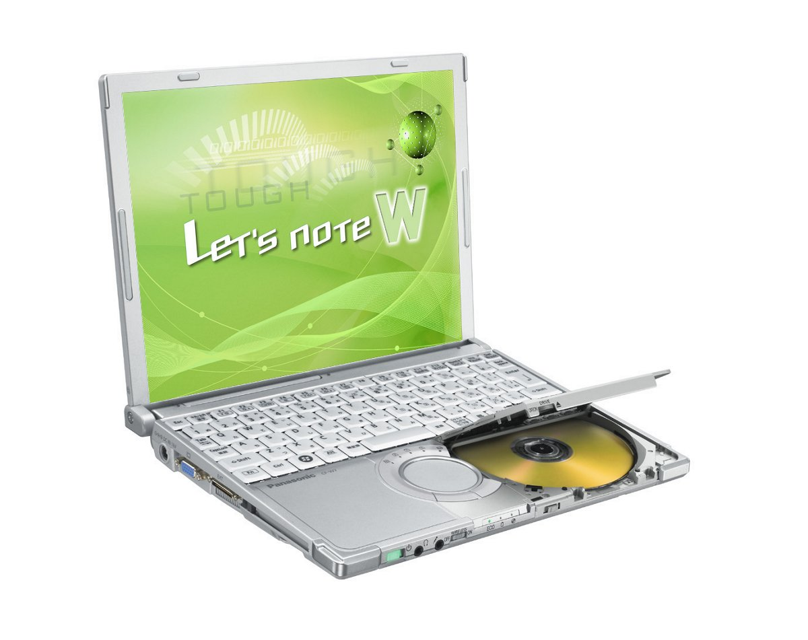
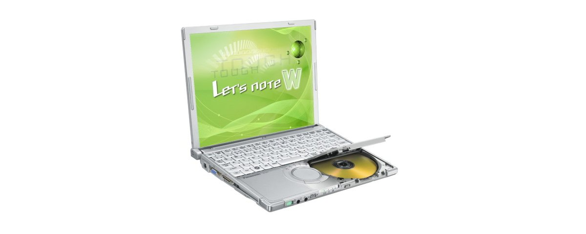

# Panasonic Let's note CF-W7 Specifications

**English** · [日本語](../../ja/CF-W7/) · [中文](../../zh/CF-W7/)

**CF-W7** is a Panasonic Let's note laptop in the W7 series with a 12.1-inch XGA display. This page lists all 7 part numbers, released 2007-11 – 2008-05. Each part number links to its official spec sheet.

*Panasonic Let's note CF-W7 (CF-W7DWJAJR, CF-W7DWJNJR, CF-W7CWHAJR, CF-W7CWHNJR …). Image © Panasonic.*

## Part numbers

| Part number | Released | Discontinued | Summary |
| :-- | :-- | :-- | :-- |
| [CF-W7DWJQJR](https://panasonic.jp/pc/p-db/CF-W7DWJQJR_spec.html) | 2008-05 | 2009-01 | Windows Vista® Business with SP1 正規版、インテル® CoreTM2 Duo U7600（1.20GHz）、メモリー：標準2GB（拡張メモリースロットに 1GBメモリーを増設済み・空きスロット0）、HDD：120GB、スーパーマルチドライブ、LAN、無線LAN 802.11a(J52/W52/W53/W56)/b/g、USB2.0、Office Personal ＜台数限定＞ |
| [CF-W7DWJAJR](https://panasonic.jp/pc/p-db/CF-W7DWJAJR_spec.html) | 2008-05 | 2009-01 | Windows Vista® Business with SP1 正規版 、インテル® CoreTM2 Duo U7600（1.20GHz）、メモリー：標準1GB（最大2GB）、HDD：120GB、スーパーマルチドライブ、LAN、無線LAN 802.11a(J52/W52/W53/W56)/b/g、USB2.0 |
| [CF-W7DWJNJR](https://panasonic.jp/pc/p-db/CF-W7DWJNJR_spec.html) | 2008-05 | 2009-01 | Windows Vista® Business with SP1 正規版 、インテル® CoreTM2 Duo U7600（1.20GHz）、メモリー：標準1GB（最大2GB）、HDD：120GB、スーパーマルチドライブ、LAN、無線LAN 802.11a(J52/W52/W53/W56)/b/g、USB2.0、Office Personal ＜台数限定＞ |
| [CF-W7CWHAJR](https://panasonic.jp/pc/p-db/CF-W7CWHAJR_spec.html) | 2008-02 | 2008-04 | Windows Vista® Business 正規版 、CoreTM2 Duo U7600(1.20GHz・ULV)、メモリー：1GB（最大2GB）、HDD：80GB、スーパーマルチドライブ、LAN、無線LAN 802.11a(J52/W52/W53/W56)/b/g、USB2.0 |
| [CF-W7CWHNJR](https://panasonic.jp/pc/p-db/CF-W7CWHNJR_spec.html) | 2008-02 | 2008-04 | Windows Vista® Business正規版 、CoreTM2 Duo U7600(1.20GHz・ULV)、メモリー：1GB（最大2GB）、HDD：80GB、スーパーマルチドライブ、LAN、無線LAN 802.11a(J52/W52/W53/W56)/b/g、USB2.0、Office Personal ＜台数限定＞ |
| [CF-W7BWHAJR](https://panasonic.jp/pc/p-db/CF-W7BWHAJR_spec.html) | 2007-11 | 2008-01 | Windows Vista® Business 正規版 、CoreTM2 Duo U7500(1.06GHz・ULV)、メモリー：1GB（最大2GB)、HDD：80GB、スーパーマルチドライブ、LAN、無線LAN 802.11a(J52/W52/W53/W56)/b/g、USB2.0 |
| [CF-W7BWHNJR](https://panasonic.jp/pc/p-db/CF-W7BWHNJR_spec.html) | 2007-11 | 2008-01 | Windows Vista® Business正規版 、CoreTM2 Duo U7500(1.06GHz・ULV)、メモリー：1GB（最大2GB)、HDD：80GB、スーパーマルチドライブ、LAN、無線LAN 802.11a(J52/W52/W53/W56)/b/g、USB2.0、Office Personal ＜台数限定＞ |

## Common specifications

| Item | Value |
| :-- | :-- |
| Chipset | モバイル インテル（R） GM965 Express チップセット |
| Optical drive speed / Write | DVD-RAM 2倍速/2～3倍速[4.7GB]、 / DVD-R 最大8倍速、DVD-RW 最大4倍速、＋R 最大8倍速、＋RW 4倍速、CD-R 最大16倍速、CD-RW 最大10倍速 |
| Supported discs / Read | DVD-RAM、DVD-ROM､DVD-Video､DVD-R､DVD-RW、DVD-R DL、＋R、+R DL、＋RW、CD-Audio､CD-R、CD-ROM(XA対応)､ / PhotoCD(マルチセッション対応)､VideoCD､CD-EXTRA､CD-TEXT、CD-RW |
| Supported discs / Write | DVD-RAM、DVD-R、DVD-RW、＋R、＋RW、CD-R、CD-RW |
| Floppy drive (optional) | USB接続外付3.5型3モード対応（1.44MB/1.2MB/720KB） |
| Display | XGA(1024×768ドット)12.1型TFTカラー液晶 |
| Display / LCD colors | 1024×768ドット：約1677万色 |
| Display / External output | 800×600、1024×768、1280×768、1280×1024、1400×1050、1440×900、1600×1200ドット：約1677万色 |
| Display / Simultaneous display | 800×600、1024×768ドット：約1677万色 |
| Wireless LAN | インテル（R） Wireless WiFi Link 4965AGN、IEEE802.11a（J52/W52/W53/W56）/b/g準拠、(WPA-AES/TKIP対応、Wi-Fi準拠) |
| Modem | データ：56kbps（V.90） FAX：14.4kbps /ボイス非対応 |
| Wired LAN | 1000BASE-T/100BASE-TX / 10BASE-T |
| Audio | PCM音源（24ビットステレオ）、インテル（R） High Definition Audio 準拠、モノラルスピーカー |
| Security chip | ＴＰＭ（TCG V1.2準拠） |
| Keyboard | OADG準拠キーボード（85キー）：キーピッチ19mm(横)/16mm(縦) / (一部キーを除く) |
| Pointing device | ホイールパッド |
| Power | ACアダプター 入力：AC100V～240V（50Hz/60Hz）（電源コードは100V専用） / バッテリーパック（10.8Vリチウムイオン・5.8Ah） / 別売軽量バッテリーパック（10.8Vリチウムイオン・2.9Ah） |
| Power consumption | 最大約60W |
| Efficiency target achievement | — |
| Dimensions (W×D×H) | 幅272mm×奥行214.3mm×高さ24.9mm/45.3mm（前部/後部） |

## Differences by part number

| Part number | CPU | Memory | Storage | Weight | Battery life |
| :-- | :-- | :-- | :-- | :-- | :-- |
| CF-W7DWJQJR | — | 2GB DDR2 SDRAM | 120GB | 1.259 kg | — |
| CF-W7DWJAJR | — | 1GB DDR2 SDRAM | 120GB | 1.249 kg | — |
| CF-W7DWJNJR | — | 1GB DDR2 SDRAM | 120GB | 1.249 kg | — |
| CF-W7CWHAJR | — | 1GB DDR2 SDRAM | 80GB | 1.249 kg | — |
| CF-W7CWHNJR | — | 1GB DDR2 SDRAM | 80GB | 1.249 kg | — |
| CF-W7BWHAJR | — | 1GB DDR2 SDRAM | 80GB | 1.249 kg | — |
| CF-W7BWHNJR | — | 1GB DDR2 SDRAM | 80GB | 1.249 kg | — |

CF-W7DWJQJR: all differing specifications

| Item | Value |
| :-- | :-- |
| OS | Windows Vista（R） Business with Service Pack 1 正規版（Windows（R） XPダウングレード権含む） |
| CPU | インテル（R） CoreTM2 プロセッサー / 超低電圧版 U7600 / 2次キャッシュメモリー 2MB、動作周波数 1.20GHz、フロントサイド・バス 533MHz |
| Memory | 標準2GB DDR2 SDRAM |
| Video memory | 最大251MB / メモリー増設時最大358MB （メインメモリーと共用） |
| Hard disk | 120GB（Serial ATA）上記容量のうち約2GBは修復用領域として使用（ユーザー使用不可） |
| Optical drive | スーパーマルチドライブ内蔵、バッファーアンダーランエラー防止機能（SmoothLink）搭載 |
| Optical drive speed / Read | DVD-RAM 3倍速[4.7GB]、 / DVD-R 最大8倍速、DVD-R DL 最大4倍速、DVD-RW 最大4倍速、DVD-ROM 最大8倍速、＋R 最大8倍速、+R DL 最大4倍速、＋RW 最大4倍速、CD-ROM 最大24倍速、CD-R 最大24倍速、CD-RW 最大24倍速 |
| Card slots / PC Card | PCカード（TYPEⅡ）×1スロット(CardBus対応、許容電流3.3V：400mA、5V：400mA) |
| Card slots / SD card | SDメモリーカード×1スロット（SDHCメモリーカード/著作権保護技術対応） |
| Memory expansion slot | DDR2 200ピンSO-DIMM専用スロット×1(1.8V/PC2-4200/DDR2 SDRAM) |
| Ports | USBポート×3（USB2.0）、モデムコネクター（RJ-11）、LANコネクター（RJ-45）、 / 外部ディスプレイコネクター（アナログRGB ミニDsub 15ピン）、ミニポートリプリケーターコネクター（専用50ピン） |
| Energy efficiency | 2007年度基準Ｉ区分0.00034 |
| Weight (with battery) | 約1.259kg/約1.14kg（別売軽量バッテリーパック使用時） |
| Software | Microsoft（R） Internet Explorer7.0、Adobe（R） Reader、DMIビューアー、Microsoft（R） Windows（R） Media Player 11、DirectX 10、Microsoft（R）Windows（R） Movie Maker 6.0、Microsoft（R） .NET Framework3.0、ズームビューアー、PC情報ビューアー、PC情報ポップアップ、NumLockお知らせ、Wireless Manager mobile edition4.5、無線切り替えユーティリティ、セキュリティ設定ユーティリティ、Infineon TPM Professional Package V3.0 SP2HF2、エコノミーモード（ECO）切り替えユーティリティ、省電力設定ユーティリティ、バッテリー残量表示補正ユーティリティ、Hotkey設定、マカフィー・インターネットセキュリティスイートベーシックエディション、gooスティック、ハードディスクデータ消去ユーティリティ、セットアップユーティリティ、PC-Diagnosticユーティリティ、ホイールパッドユーティリティ、ネットセレクター2、LAN省電力ユーティリティ、ファン制御ユーティリティ、Fn Ctrl機能入れ換えユーティリティ / オプティカルディスクドライブ文字変更ユーティリティ、オプティカルディスクドライブ省電力ユーティリティ、B's Recorder GOLD9 BASIC◆、B's CliP7◆、WinDVDTM8(OEM版)CPRM対応◆、DVD-MovieAlbumSE 4.5、B's DVD Professional2（オーサリングソフト）◆、Microsoft（R） Office Personal 2007withPowerPoint 2007 |
| Accessories | プロダクトリカバリーDVD-ROM 2枚（Windows Vista(R)用 / Windows(R) XP用）、ACアダプター、バッテリーパック、取扱説明書 等 |

Official spec sheet: <https://panasonic.jp/pc/p-db/CF-W7DWJQJR_spec.html>

CF-W7DWJAJR: all differing specifications

| Item | Value |
| :-- | :-- |
| OS | Windows Vista（R） Business with Service Pack 1 正規版（Windows（R） XPダウングレード権含む） |
| CPU | インテル（R） CoreTM2 プロセッサー / 超低電圧版 U7600 / 2次キャッシュメモリー 2MB、動作周波数 1.20GHz、フロントサイド・バス 533MHz |
| Memory | 標準1GB DDR2 SDRAM（最大2GB）空きスロット1 |
| Video memory | 最大251MB / メモリー増設時最大358MB （メインメモリーと共用） |
| Hard disk | 120GB（Serial ATA）上記容量のうち約2GBは修復用領域として使用（ユーザー使用不可） |
| Optical drive | スーパーマルチドライブ内蔵、バッファーアンダーランエラー防止機能（SmoothLink）搭載 |
| Optical drive speed / Read | DVD-RAM 3倍速[4.7GB]、DVD-R 最大8倍速、DVD-R DL 最大4倍速、DVD-RW 最大4倍速、DVD-ROM 最大8倍速、＋R 最大8倍速、+R DL 最大4倍速、＋RW 最大4倍速、CD-ROM 最大24倍速、CD-R 最大24倍速、CD-RW 最大24倍速 |
| Card slots / PC Card | PCカード（TYPEⅡ）×1スロット(CardBus対応、許容電流3.3V：400mA、5V：400mA) |
| Card slots / SD card | SDメモリーカード×1スロット（SDHCメモリーカード/著作権保護技術対応） |
| Memory expansion slot | DDR2 200ピンSO-DIMM専用スロット×1(1.8V/PC2-4200/DDR2 SDRAM) |
| Ports | USBポート×3（USB2.0）、モデムコネクター（RJ-11）、LANコネクター（RJ-45）、 / 外部ディスプレイコネクター（アナログRGB ミニDsub 15ピン）、ミニポートリプリケーターコネクター（専用50ピン） |
| Energy efficiency | 2007年度基準Ｉ区分0.00034 |
| Weight (with battery) | 約1.249kg/約1.13kg（別売軽量バッテリーパック使用時） |
| Software | Microsoft（R） Internet Explorer7.0、Adobe（R） Reader、DMIビューアー、Microsoft（R） Windows（R） Media Player 11、DirectX 10、Microsoft（R）Windows（R） Movie Maker 6.0、Microsoft（R） .NET Framework3.0、ズームビューアー、PC情報ビューアー、PC情報ポップアップ、NumLockお知らせ、Wireless Manager mobile edition4.5、無線切り替えユーティリティ、セキュリティ設定ユーティリティ、Infineon TPM Professional Package V3.0 SP2HF2、エコノミーモード（ECO）切り替えユーティリティ、省電力設定ユーティリティ、バッテリー残量表示補正ユーティリティ、Hotkey設定、マカフィー・インターネットセキュリティスイートベーシックエディション、gooスティック、ハードディスクデータ消去ユーティリティ、セットアップユーティリティ、PC-Diagnosticユーティリティ、ホイールパッドユーティリティ、ネットセレクター2、LAN省電力ユーティリティ、ファン制御ユーティリティ、Fn Ctrl機能入れ換えユーティリティ / オプティカルディスクドライブ文字変更ユーティリティ、オプティカルディスクドライブ省電力ユーティリティ、B's Recorder GOLD9 BASIC◆、B's CliP7◆、WinDVDTM8(OEM版)CPRM対応◆、DVD-MovieAlbumSE 4.5、B's DVD Professional2（オーサリングソフト）◆ |
| Accessories | プロダクトリカバリーDVD-ROM 2枚（Windows Vista(R)用 / Windows(R) XP用）、ACアダプター、バッテリーパック、取扱説明書 等 |

Official spec sheet: <https://panasonic.jp/pc/p-db/CF-W7DWJAJR_spec.html>

CF-W7DWJNJR: all differing specifications

| Item | Value |
| :-- | :-- |
| OS | Windows Vista（R） Business with Service Pack 1 正規版（Windows（R） XPダウングレード権含む） |
| CPU | インテル（R） CoreTM2 プロセッサー / 超低電圧版 U7600 / 2次キャッシュメモリー 2MB、動作周波数 1.20GHz、フロントサイド・バス 533MHz |
| Memory | 標準1GB DDR2 SDRAM（最大2GB）空きスロット1 |
| Video memory | 最大251MB / メモリー増設時最大358MB （メインメモリーと共用） |
| Hard disk | 120GB（Serial ATA）上記容量のうち約2GBは修復用領域として使用（ユーザー使用不可） |
| Optical drive | スーパーマルチドライブ内蔵、バッファーアンダーランエラー防止機能（SmoothLink）搭載 |
| Optical drive speed / Read | DVD-RAM 3倍速[4.7GB]、 / DVD-R 最大8倍速、DVD-R DL 最大4倍速、DVD-RW 最大4倍速、DVD-ROM 最大8倍速、＋R 最大8倍速、+R DL 最大4倍速、＋RW 最大4倍速、CD-ROM 最大24倍速、CD-R 最大24倍速、CD-RW 最大24倍速 |
| Card slots / PC Card | PCカード（TYPEⅡ）×1スロット(CardBus対応、許容電流3.3V：400mA、5V：400mA) |
| Card slots / SD card | SDメモリーカード×1スロット（SDHCメモリーカード/著作権保護技術対応） |
| Memory expansion slot | DDR2 200ピンSO-DIMM専用スロット×1(1.8V/PC2-4200/DDR2 SDRAM) |
| Ports | USBポート×3（USB2.0）、モデムコネクター（RJ-11）、LANコネクター（RJ-45）、 / 外部ディスプレイコネクター（アナログRGB ミニDsub 15ピン）、ミニポートリプリケーターコネクター（専用50ピン） |
| Energy efficiency | 2007年度基準Ｉ区分0.00034 |
| Weight (with battery) | 約1.249kg/約1.13kg（別売軽量バッテリーパック使用時） |
| Software | Microsoft（R） Internet Explorer7.0、Adobe（R） Reader、DMIビューアー、Microsoft（R） Windows（R） Media Player 11、DirectX 10、Microsoft（R）Windows（R） Movie Maker 6.0、Microsoft（R） .NET Framework3.0、ズームビューアー、PC情報ビューアー、PC情報ポップアップ、NumLockお知らせ、Wireless Manager mobile edition4.5、無線切り替えユーティリティ、セキュリティ設定ユーティリティ、Infineon TPM Professional Package V3.0 SP2HF2、エコノミーモード（ECO）切り替えユーティリティ、省電力設定ユーティリティ、バッテリー残量表示補正ユーティリティ、Hotkey設定、マカフィー・インターネットセキュリティスイートベーシックエディション、gooスティック、ハードディスクデータ消去ユーティリティ、セットアップユーティリティ、PC-Diagnosticユーティリティ、ホイールパッドユーティリティ、ネットセレクター2、LAN省電力ユーティリティ、ファン制御ユーティリティ、Fn Ctrl機能入れ換えユーティリティ / オプティカルディスクドライブ文字変更ユーティリティ、オプティカルディスクドライブ省電力ユーティリティ、B's Recorder GOLD9 BASIC◆、B's CliP7◆、WinDVDTM8(OEM版)CPRM対応◆、DVD-MovieAlbumSE 4.5、B's DVD Professional2（オーサリングソフト）◆、Microsoft（R） Office Personal 2007withPowerPoint 2007 |
| Accessories | プロダクトリカバリーDVD-ROM 2枚（Windows Vista(R)用 / Windows(R) XP用）、ACアダプター、バッテリーパック、取扱説明書 等 |

Official spec sheet: <https://panasonic.jp/pc/p-db/CF-W7DWJNJR_spec.html>

CF-W7CWHAJR: all differing specifications

| Item | Value |
| :-- | :-- |
| OS | Windows Vista（R） Business 正規版（Windows（R） XPダウングレード権含む） |
| CPU | インテル（R） CoreTM2 Duoプロセッサー / 超低電圧版 U7600 / 2次キャッシュメモリー 2MB、動作周波数 1.20GHz、フロントサイド・バス 533MHz |
| Memory | 標準1GB DDR2 SDRAM（最大2GB）空きスロット1 |
| Video memory | 最大251MB / メモリー増設時最大358MB （メインメモリーと共用） |
| Hard disk | 80GB（Serial ATA）上記容量のうち約2GBは修復用領域として使用（ユーザー使用不可） |
| Optical drive | スーパーマルチドライブ内蔵、バッファアンダーランエラー防止機能（SmoothLink）搭載 |
| Optical drive speed / Read | DVD-RAM 3倍速[4.7GB]、DVD-R 最大8倍速、DVD-R DL 最大4倍速、DVD-RW 最大4倍速、DVD-ROM 最大8倍速、＋R 最大8倍速、+R DL 最大4倍速、＋RW 最大4倍速、CD-ROM 最大24倍速、CD-R 最大24倍速、CD-RW 最大24倍速 |
| Card slots / PC Card | PCカード（TYPEⅡ）×1スロット(CardBus対応、許容電流3.3V：400mA、5V：400mA) |
| Card slots / SD card | SDメモリーカード×1スロット（SDHCメモリーカード/著作権保護機能対応） |
| Memory expansion slot | DDR2 200ピンSO-DIMM専用スロット×1(1.8V/PC2-4200/DDR2 SDRAM) |
| Ports | USBポート×3（USB2.0）、モデムコネクター（RJ-11）、LANコネクター（RJ-45）、 / 外部ディスプレイコネクター（アナログRGB ミニDsub 15ピン）、ミニポートリプリケーターコネクター（専用50ピン） |
| Energy efficiency | 2007年度基準Ｉ区分0.00034 |
| Weight (with battery) | 約1249g/約1130g（別売軽量バッテリーパック使用時） |
| Software | Microsoft（R） Internet Explorer7.0、Adobe（R） Reader、DMIビューアー、Microsoft（R） Windows（R） Media Player 11、DirectX 10、Microsoft（R）Windows（R） Movie Maker 6.0、Microsoft（R） .NET Framework3.0、ズームビューアー、PC情報ビューアー、PC情報ポップアップユーティリティ、NumLockお知らせ、Wireless Manager mobile edition4.5、無線切り替えユーティリティ、セキュリティ設定ユーティリティ、Infineon TPM Professional Package V3.0 SP2、エコノミーモード（ECO）切り替えユーティリティ、省電力設定ユーティリティ、バッテリー残量表示補正ユーティリティ、Hotkey設定、マカフィー・インターネットセキュリティスイートベーシックエディション、gooスティック、ハードディスクデータ消去ユーティリティ、セットアップユーティリティ、PC-Diagnosticユーティリティ、ホイールパッドユーティリティ、ネットセレクター2、LAN省電力ユーティリティ、ファン制御ユーティリティ、Fn Ctrl機能入れ換えユーティリティ / オプティカルディスクドライブ文字変更ユーティリティ、オプティカルディスクドライブ省電力ユーティリティ、B's Recorder GOLD9 BASIC、B's CliP7、WinDVDTM8(OEM版)CPRM対応、DVD-MovieAlbumSE 4.5、B's DVD Professional2（オーサリングソフト） |
| Accessories | プロダクトリカバリーDVD-ROM 2枚（Windows Vista(R)用 / Windows(R) XP用）、ACアダプター、バッテリーパック、取扱説明書 等 |

Official spec sheet: <https://panasonic.jp/pc/p-db/CF-W7CWHAJR_spec.html>

CF-W7CWHNJR: all differing specifications

| Item | Value |
| :-- | :-- |
| OS | Windows Vista（R） Business 正規版（Windows（R） XPダウングレード権含む） |
| CPU | インテル（R） CoreTM2 Duoプロセッサー / 超低電圧版 U7600 / 2次キャッシュメモリー 2MB、動作周波数 1.20GHz、フロントサイド・バス 533MHz |
| Memory | 標準1GB DDR2 SDRAM（最大2GB）空きスロット1 |
| Video memory | 最大251MB / メモリー増設時最大358MB （メインメモリーと共用） |
| Hard disk | 80GB（Serial ATA）上記容量のうち約2GBは修復用領域として使用（ユーザー使用不可） |
| Optical drive | スーパーマルチドライブ内蔵、バッファアンダーランエラー防止機能（SmoothLink）搭載 |
| Optical drive speed / Read | DVD-RAM 3倍速[4.7GB]、 / DVD-R 最大8倍速、DVD-R DL 最大4倍速、DVD-RW 最大4倍速、DVD-ROM 最大8倍速、＋R 最大8倍速、+R DL 最大4倍速、＋RW 最大4倍速、CD-ROM 最大24倍速、CD-R 最大24倍速、CD-RW 最大24倍速 |
| Card slots / PC Card | PCカード（TYPEⅡ）×1スロット(CardBus対応、許容電流3.3V：400mA、5V：400mA) |
| Card slots / SD card | SDメモリーカード×1スロット（SDHCメモリーカード/著作権保護機能対応） |
| Memory expansion slot | DDR2 200ピンSO-DIMM専用スロット×1(1.8V/PC2-4200/DDR2 SDRAM) |
| Ports | USBポート×3（USB2.0）、モデムコネクター（RJ-11）、LANコネクター（RJ-45）、 / 外部ディスプレイコネクター（アナログRGB ミニDsub 15ピン）、ミニポートリプリケーターコネクター（専用50ピン） |
| Energy efficiency | 2007年度基準Ｉ区分0.00034 |
| Weight (with battery) | 約1249g/約1130g（別売軽量バッテリーパック使用時） |
| Software | Microsoft（R） Internet Explorer7.0、Adobe（R） Reader、DMIビューアー、Microsoft（R） Windows（R） Media Player 11、DirectX 10、Microsoft（R）Windows（R） Movie Maker 6.0、Microsoft（R） .NET Framework3.0、ズームビューアー、PC情報ビューアー、PC情報ポップアップユーティリティ、NumLockお知らせ、Wireless Manager mobile edition4.5、無線切り替えユーティリティ、セキュリティ設定ユーティリティ、Infineon TPM Professional Package V3.0 SP2、エコノミーモード（ECO）切り替えユーティリティ、省電力設定ユーティリティ、バッテリー残量表示補正ユーティリティ、Hotkey設定、マカフィー・インターネットセキュリティスイートベーシックエディション、gooスティック、ハードディスクデータ消去ユーティリティ、セットアップユーティリティ、PC-Diagnosticユーティリティ、ホイールパッドユーティリティ、ネットセレクター2、LAN省電力ユーティリティ、ファン制御ユーティリティ、Fn Ctrl機能入れ換えユーティリティ / オプティカルディスクドライブ文字変更ユーティリティ、オプティカルディスクドライブ省電力ユーティリティ、B's Recorder GOLD9 BASIC、B's CliP7、WinDVDTM8(OEM版)CPRM対応、DVD-MovieAlbumSE 4.5、B's DVD Professional2（オーサリングソフト）Microsoft（R） Office Personal 2007withPowerPoint 2007 |
| Accessories | プロダクトリカバリーDVD-ROM 2枚（Windows Vista(R)用 / Windows(R) XP用）、ACアダプター、バッテリーパック、取扱説明書 等 |

Official spec sheet: <https://panasonic.jp/pc/p-db/CF-W7CWHNJR_spec.html>

CF-W7BWHAJR: all differing specifications

| Item | Value |
| :-- | :-- |
| OS | Windows Vista（R） Business 正規版（Windows（R） XPダウングレード権含む） |
| CPU | インテル（R） CoreTM2 Duoプロセッサー / 超低電圧版 U7500 / 2次キャッシュメモリー 2MB、動作周波数 1.06GHz、フロントサイド・バス 533MHz |
| Memory | 標準1GB DDR2 SDRAM（最大2GB）空きスロット1 |
| Video memory | 最大358MB （メインメモリーと共用） |
| Hard disk | 80GB（Serial ATA）上記容量のうち約2GBは修復用領域として使用。（ユーザー使用不可） |
| Optical drive | スーパーマルチドライブ内蔵、バッファアンダーランエラー防止機能（SmoothLink）搭載 |
| Optical drive speed / Read | DVD-RAM 3倍速[4.7GB]、DVD-R 最大8倍速、DVD-R DL 最大4倍速、DVD-RW 最大4倍速、DVD-ROM 最大8倍速、＋R 最大8倍速、+R DL 最大4倍速、＋RW 最大4倍速、CD-ROM 最大24倍速、CD-R 最大24倍速、CD-RW 最大24倍速 |
| Card slots / PC Card | PCカード（TYPEII）×1スロット(CardBus対応、許容電流3.3V：400mA、5V：400mA) |
| Card slots / SD card | SDメモリーカード×1スロット（SDHCメモリーカード/著作権保護機能対応） |
| Memory expansion slot | DDR2 200ピンSO-DIMM専用スロット×1[W7/T7](1.8V/PC2-4200/DDR2 SDRAM) |
| Ports | USBポート×3（USB2.0）、モデムコネクター（RJ-11）、LANコネクター（RJ-45）、 / 外部ディスプレイコネクター（アナログRGB ミニDsub 15ピン）、ミニポートリプリケーターコネクター（専用50ピン） |
| Energy efficiency | 2007年度基準Ｉ区分0.00041 |
| Weight (with battery) | 約1249g/約1130g（別売軽量バッテリーパック使用時） |
| Software | Microsoft（R） Internet Explorer7.0、Adobe（R） Reader、DMIビューアー、Microsoft（R） Windows（R） Media Player 11、DirectX 10、Microsoft（R）Windows（R） Movie Maker 6.0、Microsoft（R） .NET Framework3.0、ズームビューアー、PC情報ビューアー、PC情報ポップアップユーティリティ、NumLockお知らせ、Wireless Manager mobile edition4.5、無線切り替えユーティリティ、セキュリティ設定ユーティリティ、Infineon TPM Professional Package V3.0 SP1、エコノミーモード（ECO）切り替えユーティリティ、省電力設定ユーティリティ、バッテリー残量表示補正ユーティリティ、Hotkey設定、マカフィー・インターネットセキュリティスイートベーシックエディション、gooスティック、ハードディスクデータ消去ユーティリティ、セットアップユーティリティ、PC-Diagnosticユーティリティ、ホイールパッドユーティリティ、ネットセレクター2、LAN省電力ユーティリティ、ファン制御ユーティリティ、Fn Ctrl機能入れ換えユーティリティ / オプティカルディスクドライブ文字変更ユーティリティ、オプティカルディスクドライブ省電力ユーティリティ、B's Recorder GOLD9 BASIC、B'sCliP7、WinDVDTM8(OEM版)CPRM対応、DVD-MovieAlbumSE 4.5、B's DVD Professional2（オーサリングソフト） |
| Accessories | プロダクトリカバリーDVD-ROM、ACアダプター、バッテリーパック、取扱説明書 等 |

Official spec sheet: <https://panasonic.jp/pc/p-db/CF-W7BWHAJR_spec.html>

CF-W7BWHNJR: all differing specifications

| Item | Value |
| :-- | :-- |
| OS | Windows Vista（R） Business 正規版（Windows（R） XPダウングレード権含む） |
| CPU | インテル（R） CoreTM2 Duoプロセッサー / 超低電圧版 U7500 / 2次キャッシュメモリー 2MB、動作周波数 1.06GHz、フロントサイド・バス 533MHz |
| Memory | 標準1GB DDR2 SDRAM（最大2GB）空きスロット1 |
| Video memory | 最大358MB （メインメモリーと共用） |
| Hard disk | 80GB（Serial ATA）上記容量のうち約2GBは修復用領域として使用。（ユーザー使用不可） |
| Optical drive | スーパーマルチドライブ内蔵、バッファアンダーランエラー防止機能（SmoothLink）搭載 |
| Optical drive speed / Read | DVD-RAM 3倍速[4.7GB]、 / DVD-R 最大8倍速、DVD-R DL 最大4倍速、DVD-RW 最大4倍速、DVD-ROM 最大8倍速、＋R 最大8倍速、+R DL 最大4倍速、＋RW 最大4倍速、CD-ROM 最大24倍速、CD-R 最大24倍速、CD-RW 最大24倍速 |
| Card slots / PC Card | PCカード（TYPEII）×1スロット(CardBus対応、許容電流3.3V：400mA、5V：400mA) |
| Card slots / SD card | SDメモリーカード×1スロット（SDHCメモリーカード/著作権保護機能対応） |
| Memory expansion slot | DDR2 200ピンSO-DIMM専用スロット×1(1.8V/PC2-4200/DDR2 SDRAM) |
| Ports | USBポート×3（USB2.0）[W7/T7]、モデムコネクター（RJ-11）、LANコネクター（RJ-45）、 / 外部ディスプレイコネクター（アナログRGB ミニDsub 15ピン）、ミニポートリプリケーターコネクター（専用50ピン） |
| Energy efficiency | 2007年度基準Ｉ区分0.00041 |
| Weight (with battery) | 約1249g/約1130g（別売軽量バッテリーパック使用時） |
| Software | Microsoft（R） Internet Explorer7.0、Adobe（R） Reader、DMIビューアー、Microsoft（R） Windows（R） Media Player 11、DirectX 10、Microsoft（R）Windows（R） Movie Maker 6.0、Microsoft（R） .NET Framework3.0、ズームビューアー、PC情報ビューアー、PC情報ポップアップユーティリティ、NumLockお知らせ、Wireless Manager mobile edition4.5、無線切り替えユーティリティ、セキュリティ設定ユーティリティ、Infineon TPM Professional Package V3.0 SP1、エコノミーモード（ECO）切り替えユーティリティ、省電力設定ユーティリティ、バッテリー残量表示補正ユーティリティ、Hotkey設定、マカフィー・インターネットセキュリティスイートベーシックエディション、gooスティック、ハードディスクデータ消去ユーティリティ、セットアップユーティリティ、PC-Diagnosticユーティリティ、ホイールパッドユーティリティ、ネットセレクター2、LAN省電力ユーティリティ、ファン制御ユーティリティ、Fn Ctrl機能入れ換えユーティリティ / オプティカルディスクドライブ文字変更ユーティリティ、オプティカルディスクドライブ省電力ユーティリティ、B's Recorder GOLD9 BASIC、B'sCliP7、WinDVDTM8(OEM版)CPRM対応、DVD-MovieAlbumSE 4.5、B's DVD Professional2（オーサリングソフト）Microsoft（R） Office Personal 2007withPowerPoint 2007 |
| Accessories | プロダクトリカバリーDVD-ROM、ACアダプター、バッテリーパック、取扱説明書 等 |

Official spec sheet: <https://panasonic.jp/pc/p-db/CF-W7BWHNJR_spec.html>

## Photos

*Panasonic Let's note CF-W7 (CF-W7DWJQJR). Image © Panasonic.*

## Related models

- [All Let's note models](../)

---

Source: Panasonic's official [discontinued-models list](https://panasonic.jp/pc/support/products/) and spec sheets (panasonic.jp). Spec values are quoted in the original Japanese. Product images © Panasonic. This is an unofficial compilation, not affiliated with Panasonic.
