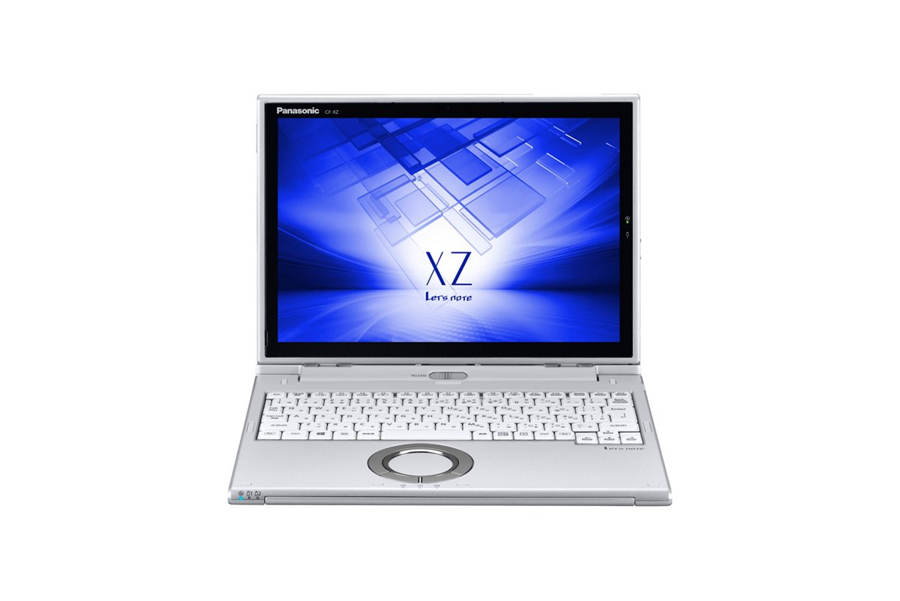
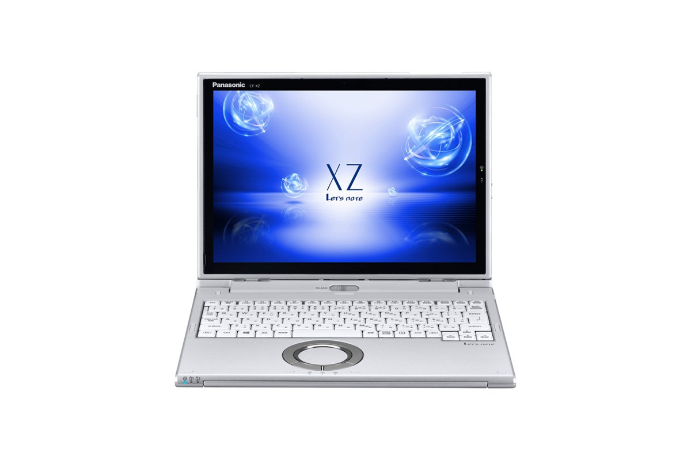
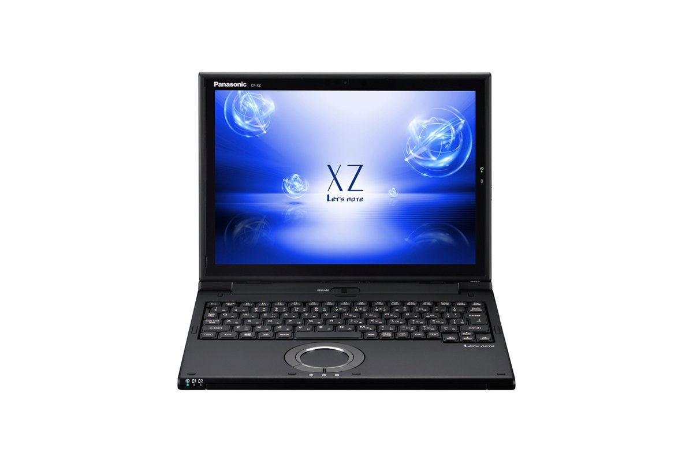
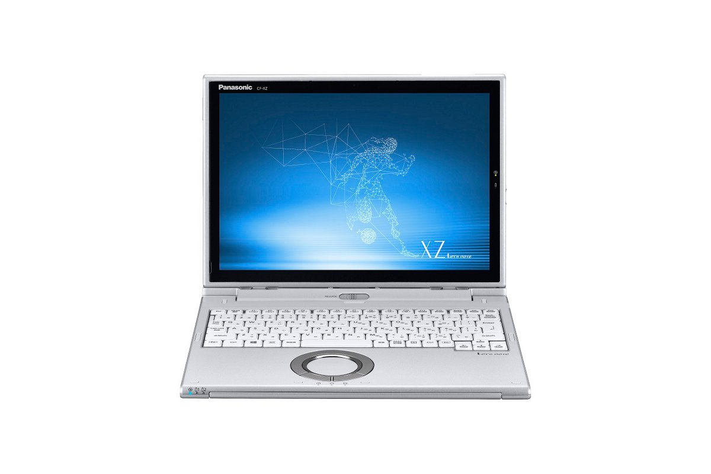
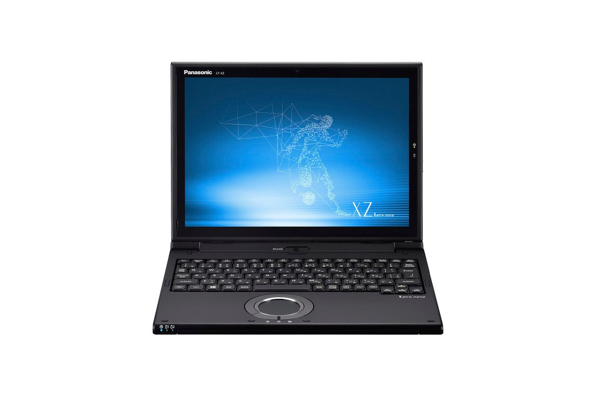
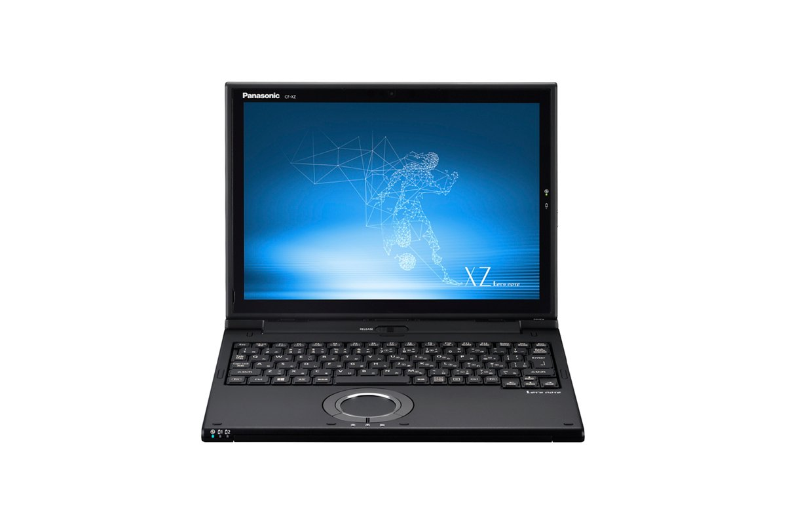

# Panasonic Let's note CF-XZ6 Specifications

**English** · [日本語](../../ja/CF-XZ6/) · [中文](../../zh/CF-XZ6/)

🗄️ See this model in the [Let's note Cabinet](https://letsnote-specs.github.io/en/CF-XZ6/).

**CF-XZ6** is a Panasonic Let's note laptop in the XZ series with a 12.0-inch QHD display. This page lists all 21 part numbers, released 2017-02 – 2019-06. Each part number links to its official spec sheet.

*Panasonic Let's note CF-XZ6 (CF-XZ6PDAPR, CF-XZ6PDCQR, CF-XZ6PFKQR, CF-XZ6BDAPR …), silver. Image © Panasonic.*

## Part numbers

| Part number | Released | Discontinued | Summary |
| :-- | :-- | :-- | :-- |
| [CF-XZ6KDCQR](https://panasonic.jp/pc/p-db/CF-XZ6KDCQR_spec.html) | 2019-06 | 2020-01 | Windows 10 Pro 64-bit, Intel® CoreTM i5-7200U processor, Memory: 8GB (no expansion slot), SSD: 256GB, LAN, Wireless LAN 802.11a (W52/W53/W56)/b/g/n/ac, Microsoft® Office Home and Business 2019 |
| [CF-XZ6KFKQR](https://panasonic.jp/pc/p-db/CF-XZ6KFKQR_spec.html) | 2019-06 | 2020-01 | Windows 10 Pro 64-bit, Intel® CoreTM i5-7200U processor, Memory: 8GB (no expansion slot), SSD: 256GB, LAN, Wireless LAN 802.11a (W52/W53/W56)/b/g/n/ac, LTE-compatible Wireless WAN, Microsoft® Office Home and Business 2019 |
| [CF-XZ6CFKQR](https://panasonic.jp/pc/p-db/CF-XZ6CFKQR_spec.html) | 2019-01 | 2019-10 | Windows 10 Pro 64-bit, Intel® CoreTM i5-7200U processor, Memory: 8GB (no expansion slot), SSD: 256GB, LAN, Wireless LAN 802.11a (W52/W53/W56)/b/g/n/ac, LTE-compatible Wireless WAN, Microsoft® Office Home and Business 2019 |
| [CF-XZ6CDCQR](https://panasonic.jp/pc/p-db/CF-XZ6CDCQR_spec.html) | 2019-01 | 2019-10 | Windows 10 Pro 64-bit, Intel® CoreTM i5-7200U processor, Memory: 8GB (no expansion slot), SSD: 256GB, LAN, Wireless LAN 802.11a (W52/W53/W56)/b/g/n/ac, Microsoft® Office Home and Business 2019 |
| [CF-XZ6DDAPR](https://panasonic.jp/pc/p-db/CF-XZ6DDAPR_spec.html) | 2018-10 | 2019-06 | Windows 10 Home 64-bit, Intel® CoreTM i5-7200U processor, Memory: 8GB (no expansion slot), SSD: 128GB, LAN, Wireless LAN 802.11a (W52/W53/W56)/b/g/n/ac, Microsoft® Office Home and Business 2016 |
| [CF-XZ6DFKQR](https://panasonic.jp/pc/p-db/CF-XZ6DFKQR_spec.html) | 2018-10 | 2019-06 | Windows 10 Pro 64-bit, Intel® CoreTM i5-7200U processor, Memory: 8GB (no expansion slot), SSD: 256GB, LAN, Wireless LAN 802.11a (W52/W53/W56)/b/g/n/ac, LTE-compatible Wireless WAN, Microsoft® Office Home and Business 2016 |
| [CF-XZ62DCQR](https://panasonic.jp/pc/p-db/CF-XZ62DCQR_spec.html) | 2018-06 | 2019-02 | Windows 10 Pro 64-bit, Intel® CoreTM i5-7200U processor, Memory: 8GB (no expansion slot), SSD: 256GB, LAN, Wireless LAN 802.11a (W52/W53/W56)/b/g/n/ac, Microsoft® Office Home and Business 2016 |
| [CF-XZ62FKQR](https://panasonic.jp/pc/p-db/CF-XZ62FKQR_spec.html) | 2018-06 | 2019-02 | Windows 10 Pro 64-bit, Intel® CoreTM i5-7200U processor, Memory: 8GB (no expansion slot), SSD: 256GB, LAN, Wireless LAN 802.11a (W52/W53/W56)/b/g/n/ac, LTE-compatible Wireless WAN, Microsoft® Office Home and Business 2016 |
| [CF-XZ6LDAPR](https://panasonic.jp/pc/p-db/CF-XZ6LDAPR_spec.html) | 2018-02 | 2018-10 | Windows 10 Home 64-bit, Intel® CoreTM i5-7200U processor, Memory: 8GB (no expansion slot), SSD: 128GB, LAN, Wireless LAN 802.11a (W52/W53/W56)/b/g/n/ac, Microsoft® Office Home and Business 2016 |
| [CF-XZ6LDCQR](https://panasonic.jp/pc/p-db/CF-XZ6LDCQR_spec.html) | 2018-02 | 2018-10 | Windows 10 Pro 64-bit, Intel® CoreTM i5-7200U processor, Memory: 8GB (no expansion slot), SSD: 256GB, LAN, Wireless LAN 802.11a (W52/W53/W56)/b/g/n/ac, Microsoft® Office Home and Business 2016 |
| [CF-XZ6LFKQR](https://panasonic.jp/pc/p-db/CF-XZ6LFKQR_spec.html) | 2018-02 | 2018-10 | Windows 10 Pro 64-bit, Intel® CoreTM i5-7200U processor, Memory: 8GB (no expansion slot), SSD: 256GB, LAN, Wireless LAN 802.11a (W52/W53/W56)/b/g/n/ac, LTE-compatible Wireless WAN, Microsoft® Office Home and Business 2016 |
| [CF-XZ6PDAPR](https://panasonic.jp/pc/p-db/CF-XZ6PDAPR_spec.html) | 2017-10 | 2018-09 | Windows 10 Home 64-bit, Intel® CoreTM i5-7200U processor, Memory: 8GB (no expansion slot), SSD: 128GB, LAN, Wireless LAN 802.11a (W52/W53/W56)/b/g/n/ac, Microsoft® Office Home and Business Premium |
| [CF-XZ6PDCQR](https://panasonic.jp/pc/p-db/CF-XZ6PDCQR_spec.html) | 2017-10 | 2018-09 | Windows 10 Pro 64-bit, Intel® CoreTM i5-7200U processor, Memory: 8GB (no expansion slot), SSD: 256GB, LAN, Wireless LAN 802.11a (W52/W53/W56)/b/g/n/ac, Microsoft® Office Home and Business Premium |
| [CF-XZ6PFKQR](https://panasonic.jp/pc/p-db/CF-XZ6PFKQR_spec.html) | 2017-10 | 2018-09 | Windows 10 Pro 64-bit, Intel® CoreTM i5-7200U processor, Memory: 8GB (no expansion slot), SSD: 256GB, LAN, Wireless LAN 802.11a (W52/W53/W56)/b/g/n/ac, LTE-compatible Wireless WAN, Microsoft® Office Home and Business Premium |
| [CF-XZ6BDAPR](https://panasonic.jp/pc/p-db/CF-XZ6BDAPR_spec.html) | 2017-06 | 2018-01 | Windows 10 Home 64-bit, Intel® CoreTM i5-7200U processor, Memory: 8GB (no expansion slot), SSD: 128GB, LAN, Wireless LAN 802.11a (W52/W53/W56)/b/g/n/ac, Microsoft® Office Home and Business Premium |
| [CF-XZ6BDBQR](https://panasonic.jp/pc/p-db/CF-XZ6BDBQR_spec.html) | 2017-06 | 2018-01 | Windows 10 Pro 64-bit, Intel® CoreTM i5-7200U processor, Memory: 8GB (no expansion slot), SSD: 256GB, LAN, Wireless LAN 802.11a (W52/W53/W56)/b/g/n/ac, Microsoft® Office Home and Business Premium |
| [CF-XZ6BFYQR](https://panasonic.jp/pc/p-db/CF-XZ6BFYQR_spec.html) | 2017-06 | 2018-01 | Windows 10 Pro 64-bit, Intel® CoreTM i5-7200U processor, Memory: 8GB (no expansion slot), SSD: 256GB, LAN, Wireless LAN 802.11a (W52/W53/W56)/b/g/n/ac, LTE-compatible Wireless WAN, Microsoft® Office Home and Business Premium |
| [CF-XZ6HDAPR](https://panasonic.jp/pc/p-db/CF-XZ6HDAPR_spec.html) | 2017-02 | 2017-09 | Windows 10 Home 64-bit, Intel® CoreTM i5-7200U processor, Memory: 8GB (no expansion slot), SSD: 128GB, LAN, Wireless LAN 802.11a (W52/W53/W56)/b/g/n/ac, Microsoft® Office Home and Business Premium |
| [CF-XZ6HFAQR](https://panasonic.jp/pc/p-db/CF-XZ6HFAQR_spec.html) | 2017-02 | 2017-09 | Windows 10 Pro 64-bit, Intel® CoreTM i5-7200U processor, Memory: 8GB (no expansion slot), SSD: 128GB, LAN, Wireless LAN 802.11a (W52/W53/W56)/b/g/n/ac, LTE-compatible Wireless WAN, Microsoft® Office Home and Business Premium |
| [CF-XZ6HDBQR](https://panasonic.jp/pc/p-db/CF-XZ6HDBQR_spec.html) | 2017-02 | 2017-09 | Windows 10 Pro 64-bit, Intel® CoreTM i5-7200U processor, Memory: 8GB (no expansion slot), SSD: 256GB, LAN, Wireless LAN 802.11a (W52/W53/W56)/b/g/n/ac, Microsoft® Office Home and Business Premium |
| [CF-XZ6HFBQR](https://panasonic.jp/pc/p-db/CF-XZ6HFBQR_spec.html) | 2017-02 | 2017-09 | Windows 10 Pro 64-bit, Intel® CoreTM i5-7200U processor, Memory: 8GB (no expansion slot), SSD: 256GB, LAN, Wireless LAN 802.11a (W52/W53/W56)/b/g/n/ac, LTE-compatible Wireless WAN, Microsoft® Office Home and Business Premium |

## Common specifications

| Item | Value |
| :-- | :-- |
| CPU | Intel Core i5-7200U processor / Intel Smart Cache 3MB, operating frequency 2.50GHz (up to 3.10GHz when using Intel Turbo Boost Technology 2.0) |
| Chipset | Built into CPU |
| Memory | 8GB LPDDR3 SDRAM (no expansion slot) |
| Display | 12.0-inch (3:2) QHD TFT color LCD (2160×1440 dots), capacitive touch panel, with anti-reflection protective film |
| Display / Graphics | Intel HD Graphics 620 (integrated in CPU) |
| Display / LCD colors | 2160×1440 dots: approx. 16.77 million colors |
| Display / Simultaneous display | 1024×768, 1280×768, 1280×1024, 1360×768, 1366×768, 1400×1050, 1600×900, 1600×1200, 1680×1050, 1920×1080, 1920×1200, 2160×1440 dots: approx. 16.77 million colors |
| Wireless communication | Intel Dual Band Wireless-AC 8265 |
| Wired LAN | 1000BASE-T/100BASE-TX/10BASE-T |
| Audio | PCM sound source (24-bit stereo), Intel High Definition Audio compliant, monaural speaker |
| Security chip | TPM (TCG V2.0 compliant) |
| Memory expansion slot | None |
| Microphone | Array microphone |
| Sensors | Illuminance sensor / Geomagnetic sensor / Gyro sensor / Acceleration sensor |
| Keyboard | OADG-compliant 86 keys, key pitch 19mm (horizontal)/16mm (vertical) (excluding some keys) |
| Power consumption | Max approx. 45W |
| Energy efficiency | 2011 fiscal year standard N category 0.023 |
| Efficiency target achievement (FY2011 standard) | — |

## Differences by part number

| Part number | CPU | Memory | Storage | Weight | Battery life |
| :-- | :-- | :-- | :-- | :-- | :-- |
| CF-XZ6KDCQR | Core i5-7200U | 8GB LPDDR3 SDRAM | 256GB | 1.029 kg | 9 h |
| CF-XZ6KFKQR | Core i5-7200U | 8GB LPDDR3 SDRAM | 256GB | 1.224 kg | 18.5 h |
| CF-XZ6CFKQR | Core i5-7200U | 8GB LPDDR3 SDRAM | 256GB | 1.224 kg | 18.5 h |
| CF-XZ6CDCQR | Core i5-7200U | 8GB LPDDR3 SDRAM | 256GB | 1.029 kg | 9 h |
| CF-XZ6DDAPR | Core i5-7200U | 8GB LPDDR3 SDRAM | 128GB | 1.019 kg | 9 h |
| CF-XZ6DFKQR | Core i5-7200U | 8GB LPDDR3 SDRAM | 256GB | 1.224 kg | 18.5 h |
| CF-XZ62DCQR | Core i5-7200U | 8GB LPDDR3 SDRAM | 256GB | 1.029 kg | 9 h |
| CF-XZ62FKQR | Core i5-7200U | 8GB LPDDR3 SDRAM | 256GB | 1.224 kg | 18.5 h |
| CF-XZ6LDAPR | Core i5-7200U | 8GB LPDDR3 SDRAM | 128GB | 1.019 kg | 9 h |
| CF-XZ6LDCQR | Core i5-7200U | 8GB LPDDR3 SDRAM | 256GB | 1.029 kg | 9 h |
| CF-XZ6LFKQR | Core i5-7200U | 8GB LPDDR3 SDRAM | 256GB | 1.224 kg | 18.5 h |
| CF-XZ6PDAPR | Core i5-7200U | 8GB LPDDR3 SDRAM | 128GB | 1.019 kg | 9 h |
| CF-XZ6PDCQR | Core i5-7200U | 8GB LPDDR3 SDRAM | 256GB | 1.019 kg | 9 h |
| CF-XZ6PFKQR | Core i5-7200U | 8GB LPDDR3 SDRAM | 256GB | 1.224 kg | 18.5 h |
| CF-XZ6BDAPR | Core i5-7200U | 8GB LPDDR3 SDRAM | 128GB | 1.019 kg | 9 h |
| CF-XZ6BDBQR | Core i5-7200U | 8GB LPDDR3 SDRAM | 256GB | 1.109 kg | 15 h |
| CF-XZ6BFYQR | Core i5-7200U | 8GB LPDDR3 SDRAM | 256GB | 1.214 kg | 18.5 h |
| CF-XZ6HDAPR | Core i5-7200U | 8GB LPDDR3 SDRAM | 128GB | 1.019 kg | 9 h |
| CF-XZ6HFAQR | Core i5-7200U | 8GB LPDDR3 SDRAM | 128GB | 1.059 kg | 9 h |
| CF-XZ6HDBQR | Core i5-7200U | 8GB LPDDR3 SDRAM | 256GB | 1.109 kg | 15 h |
| CF-XZ6HFBQR | Core i5-7200U | 8GB LPDDR3 SDRAM | 256GB | 1.149 kg | 15 h |

CF-XZ6KDCQR: all differing specifications

| Item | Value |
| :-- | :-- |
| OS | Windows 10 Pro 64-bit (Japanese version) |
| Video memory | Max. 4169MB (shared with main memory) |
| SSD | Flash memory drive (SSD) 256GB (Serial ATA) Of the above capacity, approx. 15GB is used as the recovery area and approx. 1GB as the system area (unavailable to the user) |
| Optical drive | Not equipped |
| Display / External output | 1024×768, 1280×768, 1280×1024, 1360×768, 1366×768, 1400×1050, 1600×900, 1600×1200, 1680×1050, 1920×1080, 1920×1200 dots: approx. 16.77 million colors / HDMI output only: 2560Ｘ1440, 3840×2160 (30 Hz/60 Hz), 4096×2160 (30 Hz/60 Hz) |
| Wireless LAN | IEEE802.11a (W52/W53/W56)/b/g/n/ac compliant (WPA2-AES/TKIP support, Wi-Fi compliant) |
| LTE | Not equipped |
| Bluetooth | Bluetooth v4.2 / ■Supported profiles / 【Classic】 / ・A2DP (Source) / ・AVRCP (Target) / ・HCRP (Client) / ・HFP (AG) / ・HID (Host) / ・OPP (Client and Server) / ・PAN (User) / ・SPP (DevA and DevB) / 【Low Energy】 / ・HOGP (Host) |
| Card slots / Keyboard base | SD memory card ×1 slot (SDHC memory card/SDXC memory card support/copyright protection technology support/UHS-I・UHS-II high-speed transfer support) |
| Card slots / Tablet | － |
| Camera | Face recognition-compatible camera (front), effective pixels: max. 1920x1080 pixels (approx. 2.07 megapixels) / Rear camera: max. 3200x2400 pixels (approx. 8 megapixels) |
| Ports / Keyboard base | ・USB3.0 Type-A port ×3 (one of which also supports smartphone charging) / ・LAN connector (RJ-45) / ・External display connector (analog RGB mini D-sub 15 pin) / ・HDMI output terminal (4K60p output supported) |
| Ports / Tablet | ・USB3.1 Type-C port / ・Headset terminal (microphone input + audio output (headset mini jack 3.5mm (M3), CTIA compliant)) |
| Pointing device | Capacitive touch panel (10-finger support, active pen support) / Wheelpad |
| Power | ▼AC adapter / Input: AC100V–240V, 50Hz/60Hz, Output: DC16V, 2.8A, power cord for 100V only / ▼Battery / Keyboard base: / Battery pack (S): 7.6V lithium-ion, rated capacity 2600mAh / Tablet section: / Built-in battery (S) (non-replaceable) / 7.6V (lithium-ion), rated capacity 1770mAh |
| Battery life / charge time | ▼Battery life / (JEITA Ver.2.0) / Main unit: approx. 9 hours / Tablet unit: approx. 4.5 hours / ▼Charging time / Main unit: approx. 2.5 hours (power OFF), approx. 2.5 hours (power ON) / Tablet unit: approx. 2.5 hours (power OFF), approx. 2.5 hours (power ON) |
| Dimensions (W×D×H) | Width 288.5mm × Depth 223.7mm × Height 22.0mm (tablet part: Width 286.5mm × Depth 206.2mm × Height 9.5mm) Excluding protrusions |
| Color | Silver |
| Weight (with battery) | PC body: approx. 1.029kg (when equipped with included battery pack (S) (approx. 140g)) / Tablet part: approx. 0.56kg / AC adapter: approx. 175g (excluding wall mount plug (approx. 20g) and power cord (approx. 60g)) |
| Software | ・Microsoft® Internet Explorer 11 / ・Microsoft® Edge / ・Microsoft® .NET Framework 4.7 / ・Microsoft® Windows Media Player 12 / ・McAfee LiveSafe (60-day free trial) / ・i-Filter 6.0 (30-day free trial) / ・WinZip 20.5 Japanese version (45-day trial) / ・Aptio Setup Utility / ・PC-Diagnostic Utility / ・Panasonic PC Settings Utility / ・Hard Disk Data Erase Utility / ・DirectX 12 / ・Intel PROSet/Wireless Software / ・Panasonic PC Screen Sharing Assist Utility / ・PC Information Viewer / ・Panasonic PC Recovery Disc Creation Utility / ・Panasonic PC Camera Utility |
| Microsoft Office | Microsoft® Office Home and Business 2019 |
| Accessories | Battery pack for keyboard base [S], AC adapter with wall-mount plug, active pen (1 AAA alkaline battery, 1 replacement refill), dedicated cloth, instruction manual, Microsoft Office Home & Business 2019 etc. |

Official spec sheet: <https://panasonic.jp/pc/p-db/CF-XZ6KDCQR_spec.html>

CF-XZ6KFKQR: all differing specifications

| Item | Value |
| :-- | :-- |
| OS | Windows 10 Pro 64-bit (Japanese version) |
| Video memory | Max. 4169MB (shared with main memory) |
| SSD | Flash memory drive (SSD) 256GB (Serial ATA) Of the above capacity, approx. 15GB is used as the recovery area and approx. 1GB as the system area (unavailable to the user) |
| Optical drive | Not equipped |
| Display / External output | 1024×768, 1280×768, 1280×1024, 1360×768, 1366×768, 1400×1050, 1600×900, 1600×1200, 1680×1050, 1920×1080, 1920×1200 dots: approx. 16.77 million colors / HDMI output only: 2560Ｘ1440, 3840×2160 (30 Hz/60 Hz), 4096×2160 (30 Hz/60 Hz) |
| Wireless LAN | IEEE802.11a (W52/W53/W56)/b/g/n/ac compliant (WPA2-AES/TKIP support, Wi-Fi compliant) |
| LTE | Built-in wireless WAN module (LTE compatible) |
| Bluetooth | Bluetooth v4.2 / ■Supported profiles / 【Classic】 / ・A2DP (Source) / ・AVRCP (Target) / ・HCRP (Client) / ・HFP (AG) / ・HID (Host) / ・OPP (Client and Server) / ・PAN (User) / ・SPP (DevA and DevB) / 【Low Energy】 / ・HOGP (Host) |
| Card slots / Keyboard base | SD memory card ×1 slot (SDHC memory card/SDXC memory card support/copyright protection technology support/UHS-I・UHS-II high-speed transfer support) |
| Card slots / Tablet | nano SIM card slot |
| Camera | Face recognition-compatible camera (front), effective pixels: max. 1920x1080 pixels (approx. 2.07 megapixels) / Rear camera: max. 3200x2400 pixels (approx. 8 megapixels) |
| Ports / Keyboard base | ・USB3.0 Type-A port ×3 (one of which also supports smartphone charging) / ・LAN connector (RJ-45) / ・External display connector (analog RGB mini D-sub 15 pin) / ・HDMI output terminal (4K60p output supported) |
| Ports / Tablet | ・USB3.1 Type-C port / ・Headset terminal (microphone input + audio output (headset mini jack 3.5mm (M3), CTIA compliant)) |
| Pointing device | Capacitive touch panel (10-finger support, active pen support) / Wheelpad |
| Power | ▼AC adapter / Input: AC100V–240V, 50Hz/60Hz, Output: DC16V, 2.8A, power cord for 100V only / ▼Battery / Keyboard base: / Battery pack (L): 7.6V lithium-ion, rated capacity 5200mAh / Tablet section: / Built-in battery (L) (non-replaceable) / 7.6V (lithium-ion), rated capacity 3540mAh |
| Battery life / charge time | ▼Battery life / (JEITA Ver.2.0) / Main unit: approx. 18.5 hours / Tablet unit: approx. 9 hours / ▼Charging time / Main unit: approx. 2.5 hours (power OFF), approx. 3.5 hours (power ON) / Tablet unit: approx. 2.5 hours (power OFF), approx. 2.5 hours (power ON) |
| Dimensions (W×D×H) | Width 288.5mm × Depth 223.7mm × Height 22.0mm (tablet part: Width 286.5mm × Depth 206.2mm × Height 9.5mm) Excluding protrusions |
| Color | Black |
| Weight (with battery) | PC body: approx. 1.224kg (when attached battery pack (L) (approx. 230g)) / Tablet unit: approx. 0.665kg / AC adapter: approx. 175g (excluding wall mount plug (approx. 20g) and power cord (approx. 60g)) |
| Software | ・Microsoft® Internet Explorer 11 / ・Microsoft® Edge / ・Microsoft® .NET Framework 4.7 / ・Microsoft® Windows Media Player 12 / ・McAfee LiveSafe (60-day free trial) / ・i-Filter 6.0 (30-day free trial) / ・WinZip 20.5 Japanese version (45-day trial) / ・Aptio Setup Utility / ・PC-Diagnostic Utility / ・Panasonic PC Settings Utility / ・Hard Disk Data Erase Utility / ・DirectX 12 / ・Intel PROSet/Wireless Software / ・Panasonic PC Screen Sharing Assist Utility / ・PC Information Viewer / ・Panasonic PC Recovery Disc Creation Utility / ・Panasonic PC Camera Utility |
| Microsoft Office | Microsoft® Office Home and Business 2019 |
| Accessories | Battery pack for keyboard base [L], AC adapter with wall-mount plug, active pen (1 AAA alkaline battery, 1 replacement refill), dedicated cloth, instruction manual, Microsoft Office Home & Business 2019 etc. |

Official spec sheet: <https://panasonic.jp/pc/p-db/CF-XZ6KFKQR_spec.html>

CF-XZ6CFKQR: all differing specifications

| Item | Value |
| :-- | :-- |
| OS | Windows 10 Pro 64-bit (Japanese version) |
| Video memory | Max. 4169MB (shared with main memory) |
| SSD | Flash memory drive (SSD) 256GB (Serial ATA) Of the above capacity, approx. 15GB is used as the recovery area and approx. 1GB as the system area (unavailable to the user) |
| Optical drive | Not equipped |
| Display / External output | 1024×768, 1280×768, 1280×1024, 1360×768, 1366×768, 1400×1050, 1600×900, 1600×1200, 1680×1050, 1920×1080, 1920×1200 dots: approx. 16.77 million colors / HDMI output only: 2560Ｘ1440, 3840×2160 (30 Hz/60 Hz), 4096×2160 (30 Hz/60 Hz) |
| Wireless LAN | IEEE802.11a (W52/W53/W56)/b/g/n/ac compliant |
| LTE | Built-in wireless WAN module (LTE compatible) |
| Bluetooth | Bluetooth v4.2 / ■Supported profiles / 【Classic】 / ・A2DP (Source) / ・AVRCP (Target) / ・HCRP (Client) / ・HFP (AG) / ・HID (Host) / ・OPP (Client and Server) / ・PAN (User) / ・SPP (DevA and DevB) / 【Low Energy】 / ・HOGP (Host) |
| Card slots / Keyboard base | SD memory card ×1 slot (SDHC memory card/SDXC memory card support/copyright protection technology support/UHS-I・UHS-II high-speed transfer support) |
| Card slots / Tablet | nano SIM card slot |
| Camera | Face recognition-compatible camera (front), effective pixels: max. 1920x1080 pixels (approx. 2.07 megapixels) / Rear camera: max. 3200x2400 pixels (approx. 8 megapixels) |
| Ports / Keyboard base | ・USB3.0 Type-A port ×3 (one of which also supports smartphone charging) / ・LAN connector (RJ-45) / ・External display connector (analog RGB mini D-sub 15 pin) / ・HDMI output terminal (4K60p output supported) |
| Ports / Tablet | ・USB3.1 Type-C port / ・Headset terminal (microphone input + audio output (headset mini jack M3, CTIA compliant)) |
| Pointing device | Capacitive touch panel (10-finger support, active pen support) / Wheelpad |
| Power | ▼AC adapter / Input: AC100V–240V, 50Hz/60Hz, Output: DC16V, 2.8A, power cord for 100V only / ▼Battery / Keyboard base: / Battery pack (L): 7.6V lithium-ion, rated capacity 5200mAh / Tablet section: / Built-in battery (L) (non-replaceable) / 7.6V (lithium-ion), rated capacity 3540mAh |
| Battery life / charge time | ▼Battery life / (JEITA Ver.2.0) / Main unit: approx. 18.5 hours / Tablet unit: approx. 9 hours / ▼Charging time / Main unit: approx. 2.5 hours (power OFF), approx. 3.5 hours (power ON) / Tablet unit: approx. 2.5 hours (power OFF), approx. 2.5 hours (power ON) |
| Dimensions (W×D×H) | Width 288.5mm × Depth 223.7mm × Height 22mm (tablet part: Width 286.5mm × Depth 206.2mm × Height 9.5mm) Excluding protrusions |
| Color | Black |
| Weight (with battery) | PC body: approx. 1.224kg (when attached battery pack (L) (approx. 230g)) / Tablet unit: approx. 0.665kg / AC adapter: approx. 175g (excluding wall mount plug (approx. 20g) and power cord (approx. 60g)) |
| Software | ・Microsoft® Internet Explorer 11 / ・Microsoft® Edge / ・Microsoft® .NET Framework 4.7 / ・Microsoft® Windows Media Player 12 / ・NetSelector Lite / ・McAfee LiveSafe (60-day free trial) / ・i-Filter 6.0 (30-day free trial) / ・WinZip 20.5 Japanese version (45-day trial) / ・Wireless Manager mobile edition / ・Aptio Setup Utility / ・PC-Diagnostic Utility / ・Panasonic PC Settings Utility / ・Hard Disk Data Erase Utility / ・DirectX 12 / ・Intel PROSet/Wireless Software / ・Panasonic PC Screen Sharing Assist Utility / ・PC Information Viewer / ・Panasonic PC Recovery Disc Creation Utility / ・Panasonic PC Camera Utility / ・Wheelpad Touch Lite |
| Microsoft Office | Microsoft® Office Home and Business 2019 |
| Accessories | Battery pack for keyboard base [L], AC adapter with wall-mount plug, active pen (1 AAA alkaline battery, 1 replacement refill), dedicated cloth, instruction manual, Microsoft Office Home & Business 2019 etc. |

Official spec sheet: <https://panasonic.jp/pc/p-db/CF-XZ6CFKQR_spec.html>

CF-XZ6CDCQR: all differing specifications

| Item | Value |
| :-- | :-- |
| OS | Windows 10 Pro 64-bit (Japanese version) |
| Video memory | Max. 4169MB (shared with main memory) |
| SSD | Flash memory drive (SSD) 256GB (Serial ATA) Of the above capacity, approx. 15GB is used as the recovery area and approx. 1GB as the system area (unavailable to the user) |
| Optical drive | Not equipped |
| Display / External output | 1024×768, 1280×768, 1280×1024, 1360×768, 1366×768, 1400×1050, 1600×900, 1600×1200, 1680×1050, 1920×1080, 1920×1200 dots: approx. 16.77 million colors / HDMI output only: 2560Ｘ1440, 3840×2160 (30 Hz/60 Hz), 4096×2160 (30 Hz/60 Hz) |
| Wireless LAN | IEEE802.11a (W52/W53/W56)/b/g/n/ac compliant |
| LTE | Not equipped |
| Bluetooth | Bluetooth v4.2 / ■Supported profiles / 【Classic】 / ・A2DP (Source) / ・AVRCP (Target) / ・HCRP (Client) / ・HFP (AG) / ・HID (Host) / ・OPP (Client and Server) / ・PAN (User) / ・SPP (DevA and DevB) / 【Low Energy】 / ・HOGP (Host) |
| Card slots / Keyboard base | SD memory card ×1 slot (SDHC memory card/SDXC memory card support/copyright protection technology support/UHS-I・UHS-II high-speed transfer support) |
| Card slots / Tablet | － |
| Camera | Face recognition-compatible camera (front), effective pixels: max. 1920x1080 pixels (approx. 2.07 megapixels) / Rear camera: max. 3200x2400 pixels (approx. 8 megapixels) |
| Ports / Keyboard base | ・USB3.0 Type-A port ×3 (one of which also supports smartphone charging) / ・LAN connector (RJ-45) / ・External display connector (analog RGB mini D-sub 15 pin) / ・HDMI output terminal (4K60p output supported) |
| Ports / Tablet | ・USB3.1 Type-C port / ・Headset terminal (microphone input + audio output (headset mini jack M3, CTIA compliant)) |
| Pointing device | Capacitive touch panel (10-finger support, active pen support) / Wheelpad |
| Power | ▼AC adapter / Input: AC100V–240V, 50Hz/60Hz, Output: DC16V, 2.8A, power cord for 100V only / ▼Battery / Keyboard base: / Battery pack (S): 7.6V lithium-ion, rated capacity 2600mAh / Tablet section: / Built-in battery (S) (non-replaceable) / 7.6V (lithium-ion), rated capacity 1770mAh |
| Battery life / charge time | ▼Battery life / (JEITA Ver.2.0) / Main unit: approx. 9 hours / Tablet unit: approx. 4.5 hours / ▼Charging time / Main unit: approx. 2.5 hours (power OFF), approx. 2.5 hours (power ON) / Tablet unit: approx. 2.5 hours (power OFF), approx. 2.5 hours (power ON) |
| Dimensions (W×D×H) | Width 288.5mm × Depth 223.7mm × Height 22mm (tablet part: Width 286.5mm × Depth 206.2mm × Height 9.5mm) Excluding protrusions |
| Color | Silver |
| Weight (with battery) | PC body: approx. 1.029kg (when equipped with included battery pack (S) (approx. 140g)) / Tablet part: approx. 0.56kg / AC adapter: approx. 175g (excluding wall mount plug (approx. 20g) and power cord (approx. 60g)) |
| Software | ・Microsoft® Internet Explorer 11 / ・Microsoft® Edge / ・Microsoft® .NET Framework 4.7 / ・Microsoft® Windows Media Player 12 / ・NetSelector Lite / ・McAfee LiveSafe (60-day free trial) / ・i-Filter 6.0 (30-day free trial) / ・WinZip 20.5 Japanese version (45-day trial) / ・Wireless Manager mobile edition / ・Aptio Setup Utility / ・PC-Diagnostic Utility / ・Panasonic PC Settings Utility / ・Hard Disk Data Erase Utility / ・DirectX 12 / ・Intel PROSet/Wireless Software / ・Panasonic PC Screen Sharing Assist Utility / ・PC Information Viewer / ・Panasonic PC Recovery Disc Creation Utility / ・Panasonic PC Camera Utility / ・Wheelpad Touch Lite |
| Microsoft Office | Microsoft® Office Home and Business 2019 |
| Accessories | Battery pack for keyboard base [S], AC adapter with wall-mount plug, active pen (1 AAA alkaline battery, 1 replacement refill), dedicated cloth, instruction manual, Microsoft Office Home & Business 2019 etc. |

Official spec sheet: <https://panasonic.jp/pc/p-db/CF-XZ6CDCQR_spec.html>

CF-XZ6DDAPR: all differing specifications

| Item | Value |
| :-- | :-- |
| OS | Windows 10 Home 64-bit (Japanese version) / Panasonic recommends Windows 10 Pro |
| Video memory | Max 4170MB (shared with main memory) |
| SSD | Flash memory drive (SSD) 128GB (Serial ATA) Of the above capacity, approx. 15GB is used as the recovery area and approx. 1GB as the system area (unavailable to the user) |
| Optical drive | Not equipped |
| Display / External output | 1024×768, 1280×768, 1280×1024, 1360×768, 1366×768, 1400×1050, 1600×900, 1600×1200, 1680×1050, 1920×1080, 1920×1200 dots: approx. 16.77 million colors / HDMI output only: 2560Ｘ1440, 3840×2160 (30 Hz/60 Hz), 4096×2160 (30 Hz/60 Hz) |
| Wireless LAN | IEEE802.11a (W52/W53/W56)/b/g/n/ac compliant |
| LTE | Not equipped |
| Bluetooth | Bluetooth v4.2 / ■Supported profiles / 【Classic】 / ・A2DP (Source) / ・AVRCP (Target) / ・HCRP (Client) / ・HFP (AG) / ・HID (Host) / ・OPP (Client and Server) / ・PAN (User) / ・SPP (DevA and DevB) / 【Low Energy】 / ・HOGP (Host) |
| Card slots / Keyboard base | SD memory card ×1 slot (SDHC memory card/SDXC memory card support/copyright protection technology support/UHS-I・UHS-II high-speed transfer support) |
| Card slots / Tablet | － |
| Camera | Face recognition-compatible camera (front), effective pixels: max. 1920x1080 pixels (approx. 2.07 megapixels) |
| Ports / Keyboard base | ・USB3.0 Type-A port ×3 (one of which also supports smartphone charging) / ・LAN connector (RJ-45) / ・External display connector (analog RGB mini D-sub 15 pin) / ・HDMI output terminal (4K60p output supported) |
| Ports / Tablet | ・USB3.1 Type-C port / ・Headset terminal (microphone input + audio output (headset mini jack M3, CTIA compliant)) |
| Pointing device | Capacitive touch panel (10-finger support, active pen support) / Wheelpad |
| Power | ▼AC adapter / Input: AC100V–240V, 50Hz/60Hz, Output: DC16V, 2.8A, power cord for 100V only / ▼Battery / Keyboard base: / Battery pack (S): 7.6V lithium-ion, rated capacity 2600mAh / Tablet section: / Built-in battery (S) (non-replaceable) / 7.6V (lithium-ion), rated capacity 1770mAh |
| Battery life / charge time | ▼Battery life / (JEITA Ver.2.0) / Main unit: approx. 9 hours / Tablet unit: approx. 4.5 hours / ▼Charging time / Main unit: approx. 2.5 hours (power OFF), approx. 2.5 hours (power ON) / Tablet unit: approx. 2.5 hours (power OFF), approx. 2.5 hours (power ON) |
| Dimensions (W×D×H) | Width 288.5mm × Depth 223.7mm × Height 22mm (tablet part: Width 286.5mm × Depth 206.2mm × Height 9.5mm) Excluding protrusions |
| Color | Silver |
| Weight (with battery) | PC body: approx. 1.019kg (when equipped with included battery pack (S) (approx. 140g)) / Tablet part: approx. 0.55kg / AC adapter: approx. 175g (excluding wall mount plug (approx. 20g) and power cord (approx. 60g)) |
| Software | ・Microsoft® Internet Explorer 11 / ・Microsoft® Edge / ・Microsoft® .NET Framework 4.7 / ・Microsoft® Windows Media Player 12 / ・NetSelector Lite / ・Intel® Wireless Bluetooth® / ・McAfee LiveSafe (60-day free trial) / ・i-Filter 6.0 (30-day free trial) / ・WinZip 20.5 Japanese version (45-day trial) / ・Wireless Manager mobile edition / ・Aptio Setup Utility / ・PC-Diagnostic Utility / ・Panasonic PC Settings Utility / ・Hard Disk Data Erase Utility / ・DirectX 12 / ・Intel PROSet/Wireless Software / ・Panasonic PC Screen Sharing Assist Utility / ・PC Information Viewer / ・Panasonic PC Recovery Disc Creation Utility / ・Panasonic PC Camera Utility / ・Wheelpad Touch Lite |
| Microsoft Office | Microsoft® Office Home and Business 2016 |
| Accessories | Battery pack for keyboard base [S], AC adapter with wall-mount plug, active pen (1 AAA alkaline battery, 1 replacement refill), dedicated cloth, instruction manual, Microsoft Office Home & Business 2016 etc. |

Official spec sheet: <https://panasonic.jp/pc/p-db/CF-XZ6DDAPR_spec.html>

CF-XZ6DFKQR: all differing specifications

| Item | Value |
| :-- | :-- |
| OS | Windows 10 Pro 64-bit (Japanese version) |
| Video memory | Max 4170MB (shared with main memory) |
| SSD | Flash memory drive (SSD) 256GB (Serial ATA) Of the above capacity, approx. 15GB is used as the recovery area and approx. 1GB as the system area (unavailable to the user) |
| Optical drive | Not equipped |
| Display / External output | 1024×768, 1280×768, 1280×1024, 1360×768, 1366×768, 1400×1050, 1600×900, 1600×1200, 1680×1050, 1920×1080, 1920×1200 dots: approx. 16.77 million colors / HDMI output only: 2560Ｘ1440, 3840×2160 (30 Hz/60 Hz), 4096×2160 (30 Hz/60 Hz) |
| Wireless LAN | IEEE802.11a (W52/W53/W56)/b/g/n/ac compliant |
| LTE | Built-in wireless WAN module (LTE compatible) |
| Bluetooth | Bluetooth v4.2 / ■Supported profiles / 【Classic】 / ・A2DP (Source) / ・AVRCP (Target) / ・HCRP (Client) / ・HFP (AG) / ・HID (Host) / ・OPP (Client and Server) / ・PAN (User) / ・SPP (DevA and DevB) / 【Low Energy】 / ・HOGP (Host) |
| Card slots / Keyboard base | SD memory card ×1 slot (SDHC memory card/SDXC memory card support/copyright protection technology support/UHS-I・UHS-II high-speed transfer support) |
| Card slots / Tablet | nano SIM card slot |
| Camera | Face recognition-compatible camera (front), effective pixels: max. 1920x1080 pixels (approx. 2.07 megapixels) / Rear camera: max. 3200x2400 pixels (approx. 8 megapixels) |
| Ports / Keyboard base | ・USB3.0 Type-A port ×3 (one of which also supports smartphone charging) / ・LAN connector (RJ-45) / ・External display connector (analog RGB mini D-sub 15 pin) / ・HDMI output terminal (4K60p output supported) |
| Ports / Tablet | ・USB3.1 Type-C port / ・Headset terminal (microphone input + audio output (headset mini jack M3, CTIA compliant)) |
| Pointing device | Capacitive touch panel (10-finger support, active pen support) / Wheelpad |
| Power | ▼AC adapter / Input: AC100V–240V, 50Hz/60Hz, Output: DC16V, 2.8A, power cord for 100V only / ▼Battery / Keyboard base: / Battery pack (L): 7.6V lithium-ion, rated capacity 5200mAh / Tablet section: / Built-in battery (L) (non-replaceable) / 7.6V (lithium-ion), rated capacity 3540mAh |
| Battery life / charge time | ▼Battery life / (JEITA Ver.2.0) / Main unit: approx. 18.5 hours / Tablet unit: approx. 9 hours / ▼Charging time / Main unit: approx. 2.5 hours (power OFF), approx. 3.5 hours (power ON) / Tablet unit: approx. 2.5 hours (power OFF), approx. 2.5 hours (power ON) |
| Dimensions (W×D×H) | Width 288.5mm × Depth 223.7mm × Height 22mm (tablet part: Width 286.5mm × Depth 206.2mm × Height 9.5mm) Excluding protrusions |
| Color | Black |
| Weight (with battery) | PC body: approx. 1.224kg (when attached battery pack (L) (approx. 230g)) / Tablet unit: approx. 0.665kg / AC adapter: approx. 175g (excluding wall mount plug (approx. 20g) and power cord (approx. 60g)) |
| Software | ・Microsoft® Internet Explorer 11 / ・Microsoft® Edge / ・Microsoft® .NET Framework 4.7 / ・Microsoft® Windows Media Player 12 / ・NetSelector Lite / ・Intel® Wireless Bluetooth® / ・McAfee LiveSafe (60-day free trial) / ・i-Filter 6.0 (30-day free trial) / ・WinZip 20.5 Japanese version (45-day trial) / ・Wireless Manager mobile edition / ・Aptio Setup Utility / ・PC-Diagnostic Utility / ・Panasonic PC Settings Utility / ・Hard Disk Data Erase Utility / ・DirectX 12 / ・Intel PROSet/Wireless Software / ・Panasonic PC Screen Sharing Assist Utility / ・PC Information Viewer / ・Panasonic PC Recovery Disc Creation Utility / ・Panasonic PC Camera Utility / ・Wheelpad Touch Lite |
| Microsoft Office | Microsoft® Office Home and Business 2016 |
| Accessories | Battery pack for keyboard base [L], AC adapter with wall-mount plug, active pen (1 AAA alkaline battery, 1 replacement refill), dedicated cloth, instruction manual, Microsoft Office Home & Business 2016 etc. |

Official spec sheet: <https://panasonic.jp/pc/p-db/CF-XZ6DFKQR_spec.html>

CF-XZ62DCQR: all differing specifications

| Item | Value |
| :-- | :-- |
| OS | Windows 10 Pro 64-bit (Japanese version) |
| Video memory | Max 4170MB (shared with main memory) |
| SSD | Flash memory drive (SSD) 256GB (Serial ATA) Of the above capacity, approx. 15GB is used as the recovery area and approx. 1GB as the system area (unavailable to the user) |
| Optical drive | Not equipped |
| Display / External output | 1024×768, 1280×768, 1280×1024, 1360×768, 1366×768, 1400×1050, 1600×900, 1600×1200, 1680×1050, 1920×1080, 1920×1200 dots: approx. 16.77 million colors / HDMI output only: 2560Ｘ1440, 3840×2160 (30 Hz/60 Hz), 4096×2160 (30 Hz/60 Hz) |
| Wireless LAN | IEEE802.11a (W52/W53/W56)/b/g/n/ac compliant |
| LTE | Not equipped |
| Bluetooth | Bluetooth v4.1 / ■Supported profiles / 【Classic】 / ・A2DP (Source) / ・AVRCP (Target) / ・HCRP (Client) / ・HFP (AG) / ・HID (Host) / ・OPP (Client and Server) / ・PAN (User) / ・SPP (DevA and DevB) / 【Low Energy】 / ・HOGP (Host) |
| Card slots / Keyboard base | SD memory card ×1 slot (SDHC memory card/SDXC memory card support/copyright protection technology support/UHS-I・UHS-II high-speed transfer support) |
| Card slots / Tablet | － |
| Camera | Face recognition-compatible camera (front), effective pixels: max. 1920x1080 pixels (approx. 2.07 megapixels) / Rear camera: max. 3200x2400 pixels (approx. 8 megapixels) |
| Ports / Keyboard base | ・USB3.0 Type-A port ×3 (one of which also supports smartphone charging) / ・LAN connector (RJ-45) / ・External display connector (analog RGB mini D-sub 15 pin) / ・HDMI output terminal (4K60p output supported) |
| Ports / Tablet | ・USB3.1 Type-C port / ・Headset terminal (microphone input + audio output (headset mini jack M3, CTIA compliant)) |
| Pointing device | Capacitive touch panel (10-finger support, active pen support) / Wheelpad |
| Power | ▼AC adapter / Input: AC100V–240V, 50Hz/60Hz, Output: DC16V, 2.8A, power cord for 100V only / ▼Battery / Keyboard base: / Battery pack (S): 7.6V lithium-ion, rated capacity 2600mAh / Tablet section: / Built-in battery (S) (non-replaceable) / 7.6V (lithium-ion), rated capacity 1770mAh |
| Battery life / charge time | ▼Battery life / (JEITA Ver.2.0) / Main unit: approx. 9 hours / Tablet unit: approx. 4.5 hours / ▼Charging time / Main unit: approx. 2.5 hours (power OFF), approx. 2.5 hours (power ON) / Tablet unit: approx. 2.5 hours (power OFF), approx. 2.5 hours (power ON) |
| Dimensions (W×D×H) | Width 288.5mm × Depth 223.7mm × Height 22mm (tablet part: Width 286.5mm × Depth 206.2mm × Height 9.5mm) Excluding protrusions |
| Color | Silver |
| Weight (with battery) | PC body: approx. 1.029kg (when equipped with included battery pack (S) (approx. 140g)) / Tablet part: approx. 0.560kg / AC adapter: approx. 175g (excluding wall mount plug (approx. 20g) and power cord (approx. 60g)) |
| Software | ・Microsoft® Internet Explorer 11 / ・Microsoft® Edge / ・Microsoft® .NET Framework 4.7 / ・Microsoft® Windows Media Player 12 / ・NetSelector Lite / ・Intel® Wireless Bluetooth® / ・McAfee LiveSafe (60-day free trial) / ・i-Filter 6.0 (30-day free trial) / ・WinZip 20.5 Japanese version (45-day trial) / ・Wireless Manager mobile edition / ・Aptio Setup Utility / ・PC-Diagnostic Utility / ・Panasonic PC Settings Utility / ・Hard Disk Data Erase Utility / ・DirectX 12 / ・Intel PROSet/Wireless Software / ・Panasonic PC Screen Sharing Assist Utility / ・PC Information Viewer / ・Panasonic PC Recovery Disc Creation Utility / ・Panasonic PC Camera Utility / ・Wheelpad Touch Lite |
| Microsoft Office | Microsoft® Office Home and Business 2016 |
| Accessories | Battery pack for keyboard base [S], AC adapter with wall-mount plug, active pen (1 AAA alkaline battery, 1 replacement refill), dedicated cloth, instruction manual, Microsoft Office Home & Business 2016 etc. |

Official spec sheet: <https://panasonic.jp/pc/p-db/CF-XZ62DCQR_spec.html>

CF-XZ62FKQR: all differing specifications

| Item | Value |
| :-- | :-- |
| OS | Windows 10 Pro 64-bit (Japanese version) |
| Video memory | Max 4170MB (shared with main memory) |
| SSD | Flash memory drive (SSD) 256GB (Serial ATA) Of the above capacity, approx. 15GB is used as the recovery area and approx. 1GB as the system area (unavailable to the user) |
| Optical drive | Not equipped |
| Display / External output | 1024×768, 1280×768, 1280×1024, 1360×768, 1366×768, 1400×1050, 1600×900, 1600×1200, 1680×1050, 1920×1080, 1920×1200 dots: approx. 16.77 million colors / HDMI output only: 2560Ｘ1440, 3840×2160 (30 Hz/60 Hz), 4096×2160 (30 Hz/60 Hz) |
| Wireless LAN | IEEE802.11a (W52/W53/W56)/b/g/n/ac compliant |
| LTE | Built-in wireless WAN module (LTE compatible) |
| Bluetooth | Bluetooth v4.1 / ■Supported profiles / 【Classic】 / ・A2DP (Source) / ・AVRCP (Target) / ・HCRP (Client) / ・HFP (AG) / ・HID (Host) / ・OPP (Client and Server) / ・PAN (User) / ・SPP (DevA and DevB) / 【Low Energy】 / ・HOGP (Host) |
| Card slots / Keyboard base | SD memory card ×1 slot (SDHC memory card/SDXC memory card support/copyright protection technology support/UHS-I・UHS-II high-speed transfer support) |
| Card slots / Tablet | nano SIM card slot |
| Camera | Face recognition-compatible camera (front), effective pixels: max. 1920x1080 pixels (approx. 2.07 megapixels) / Rear camera: max. 3200x2400 pixels (approx. 8 megapixels) |
| Ports / Keyboard base | ・USB3.0 Type-A port ×3 (one of which also supports smartphone charging) / ・LAN connector (RJ-45) / ・External display connector (analog RGB mini D-sub 15 pin) / ・HDMI output terminal (4K60p output supported) |
| Ports / Tablet | ・USB3.1 Type-C port / ・Headset terminal (microphone input + audio output (headset mini jack M3, CTIA compliant)) |
| Pointing device | Capacitive touch panel (10-finger support, active pen support) / Wheelpad |
| Power | ▼AC adapter / Input: AC100V–240V, 50Hz/60Hz, Output: DC16V, 2.8A, power cord for 100V only / ▼Battery / Keyboard base: / Battery pack (L): 7.6V lithium-ion, rated capacity 5200mAh / Tablet section: / Built-in battery (L) (non-replaceable) / 7.6V (lithium-ion), rated capacity 3540mAh |
| Battery life / charge time | ▼Battery life / (JEITA Ver.2.0) / Main unit: approx. 18.5 hours / Tablet unit: approx. 9 hours / ▼Charging time / Main unit: approx. 2.5 hours (power OFF), approx. 3.5 hours (power ON) / Tablet unit: approx. 2.5 hours (power OFF), approx. 2.5 hours (power ON) |
| Dimensions (W×D×H) | Width 288.5mm × Depth 223.7mm × Height 22mm (tablet part: Width 286.5mm × Depth 206.2mm × Height 9.5mm) Excluding protrusions |
| Color | Black |
| Weight (with battery) | PC body: approx. 1.224kg (when attached battery pack (L) (approx. 230g)) / Tablet unit: approx. 0.665kg / AC adapter: approx. 175g (excluding wall mount plug (approx. 20g) and power cord (approx. 60g)) |
| Software | ・Microsoft® Internet Explorer 11 / ・Microsoft® Edge / ・Microsoft® .NET Framework 4.7 / ・Microsoft® Windows Media Player 12 / ・NetSelector Lite / ・Intel® Wireless Bluetooth® / ・McAfee LiveSafe (60-day free trial) / ・i-Filter 6.0 (30-day free trial) / ・WinZip 20.5 Japanese version (45-day trial) / ・Wireless Manager mobile edition / ・Aptio Setup Utility / ・PC-Diagnostic Utility / ・Panasonic PC Settings Utility / ・Hard Disk Data Erase Utility / ・DirectX 12 / ・Intel PROSet/Wireless Software / ・Panasonic PC Screen Sharing Assist Utility / ・PC Information Viewer / ・Panasonic PC Recovery Disc Creation Utility / ・Panasonic PC Camera Utility / ・Wheelpad Touch Lite |
| Microsoft Office | Microsoft® Office Home and Business 2016 |
| Accessories | Battery pack for keyboard base [L], AC adapter with wall-mount plug, active pen (1 AAA alkaline battery, 1 replacement refill), dedicated cloth, instruction manual, Microsoft Office Home & Business 2016 etc. |

Official spec sheet: <https://panasonic.jp/pc/p-db/CF-XZ62FKQR_spec.html>

CF-XZ6LDAPR: all differing specifications

| Item | Value |
| :-- | :-- |
| OS | Windows 10 Home 64-bit (Japanese version) / Panasonic recommends Windows 10 Pro |
| Video memory | Max 4170MB (shared with main memory) |
| SSD | Flash memory drive (SSD) 128GB (Serial ATA) Of the above capacity, approx. 15GB is used as the recovery area and approx. 1GB as the system area (unavailable to the user) |
| Optical drive | Not equipped |
| Display / External output | 1024×768, 1280×768, 1280×1024, 1360×768, 1366×768, 1400×1050, 1600×900, 1600×1200, 1680×1050, 1920×1080, 1920×1200 dots: approx. 16.77 million colors / HDMI output only: 2560Ｘ1440, 3840×2160 (30 Hz/60 Hz), 4096×2160 (30 Hz/60 Hz) |
| Wireless LAN | IEEE802.11a (W52/W53/W56)/b/g/n/ac compliant |
| LTE | Not equipped |
| Bluetooth | Bluetooth v4.1 / ■Supported profiles / 【Classic】 / ・A2DP (Source) / ・AVRCP (Target) / ・HCRP (Client) / ・HFP (AG) / ・HID (Host) / ・OPP (Client and Server) / ・PAN (User) / ・SPP (DevA and DevB) / 【Low Energy】 / ・HOGP (Host) |
| Card slots / Keyboard base | SD memory card ×1 slot (SDHC memory card/SDXC memory card support/copyright protection technology support/UHS-I・UHS-II high-speed transfer support) |
| Card slots / Tablet | － |
| Camera | Face recognition-compatible camera (front), effective pixels: max. 1920x1080 pixels (approx. 2.07 megapixels) |
| Ports / Keyboard base | ・USB3.0 Type-A port ×3 (one of which also supports smartphone charging) / ・LAN connector (RJ-45) / ・External display connector (analog RGB mini D-sub 15 pin) / ・HDMI output terminal (4K60p output supported) |
| Ports / Tablet | ・USB3.1 Type-C port / ・Headset terminal (microphone input + audio output (headset mini jack M3, CTIA compliant)) |
| Pointing device | Capacitive touch panel (10-finger support, active pen support) / Wheelpad |
| Power | ▼AC adapter / Input: AC100V–240V, 50Hz/60Hz, Output: DC16V, 2.8A, power cord for 100V only / ▼Battery / Keyboard base: / Battery pack (S): 7.6V lithium-ion, rated capacity 2600mAh / Tablet section: / Built-in battery (S) (non-replaceable) / 7.6V (lithium-ion), rated capacity 1770mAh |
| Battery life / charge time | ▼Battery life / (JEITA Ver.2.0) / Main unit: approx. 9 hours / Tablet unit: approx. 4.5 hours / ▼Charging time / Main unit: approx. 2.5 hours (power OFF), approx. 2.5 hours (power ON) / Tablet unit: approx. 2.5 hours (power OFF), approx. 2.5 hours (power ON) |
| Dimensions (W×D×H) | Width 288.5mm × Depth 223.7mm × Height 22mm (tablet part: Width 286.5mm × Depth 206.2mm × Height 9.5mm) Excluding protrusions |
| Color | Silver |
| Weight (with battery) | PC body: approx. 1.019kg (when equipped with included battery pack (S) (approx. 140g)) / Tablet part: approx. 0.550kg / AC adapter: approx. 175g (excluding wall mount plug (approx. 20g) and power cord (approx. 60g)) |
| Software | ・Microsoft® Internet Explorer 11 / ・Microsoft® Edge / ・Microsoft® .NET Framework 4.7 / ・Microsoft® Windows Media Player 12 / ・NetSelector Lite / ・Intel® Wireless Bluetooth® / ・McAfee LiveSafe (60-day free trial) / ・i-Filter 6.0 (30-day free trial) / ・WinZip 20.5 Japanese version (45-day trial) / ・Wireless Manager mobile edition / ・Aptio Setup Utility / ・PC-Diagnostic Utility / ・Panasonic PC Settings Utility / ・Hard Disk Data Erase Utility / ・DirectX 12 / ・Intel PROSet/Wireless Software / ・Panasonic PC Screen Sharing Assist Utility / ・PC Information Viewer / ・Panasonic PC Recovery Disc Creation Utility / ・Panasonic PC Camera Utility / ・Wheelpad Touch Lite |
| Microsoft Office | Microsoft® Office Home and Business 2016 |
| Accessories | Battery pack for keyboard base [S], AC adapter with wall-mount plug, active pen (1 AAA alkaline battery, 1 replacement refill), dedicated cloth, instruction manual, Microsoft Office Home & Business 2016 etc. |

Official spec sheet: <https://panasonic.jp/pc/p-db/CF-XZ6LDAPR_spec.html>

CF-XZ6LDCQR: all differing specifications

| Item | Value |
| :-- | :-- |
| OS | Windows 10 Pro 64-bit (Japanese version) |
| Video memory | Max 4170MB (shared with main memory) |
| SSD | Flash memory drive (SSD) 256GB (Serial ATA) Of the above capacity, approx. 15GB is used as the recovery area and approx. 1GB as the system area (unavailable to the user) |
| Optical drive | Not equipped |
| Display / External output | 1024×768, 1280×768, 1280×1024, 1360×768, 1366×768, 1400×1050, 1600×900, 1600×1200, 1680×1050, 1920×1080, 1920×1200 dots: approx. 16.77 million colors / HDMI output only: 2560Ｘ1440, 3840×2160 (30 Hz/60 Hz), 4096×2160 (30 Hz/60 Hz) |
| Wireless LAN | IEEE802.11a (W52/W53/W56)/b/g/n/ac compliant |
| LTE | Not equipped |
| Bluetooth | Bluetooth v4.1 / ■Supported profiles / 【Classic】 / ・A2DP (Source) / ・AVRCP (Target) / ・HCRP (Client) / ・HFP (AG) / ・HID (Host) / ・OPP (Client and Server) / ・PAN (User) / ・SPP (DevA and DevB) / 【Low Energy】 / ・HOGP (Host) |
| Card slots / Keyboard base | SD memory card ×1 slot (SDHC memory card/SDXC memory card support/copyright protection technology support/UHS-I・UHS-II high-speed transfer support) |
| Card slots / Tablet | － |
| Camera | Face recognition-compatible camera (front), effective pixels: max. 1920x1080 pixels (approx. 2.07 megapixels) / Rear camera: max. 3200x2400 pixels (approx. 8 megapixels) |
| Ports / Keyboard base | ・USB3.0 Type-A port ×3 (one of which also supports smartphone charging) / ・LAN connector (RJ-45) / ・External display connector (analog RGB mini D-sub 15 pin) / ・HDMI output terminal (4K60p output supported) |
| Ports / Tablet | ・USB3.1 Type-C port / ・Headset terminal (microphone input + audio output (headset mini jack M3, CTIA compliant)) |
| Pointing device | Capacitive touch panel (10-finger support, active pen support) / Wheelpad |
| Power | ▼AC adapter / Input: AC100V–240V, 50Hz/60Hz, Output: DC16V, 2.8A, power cord for 100V only / ▼Battery / Keyboard base: / Battery pack (S): 7.6V lithium-ion, rated capacity 2600mAh / Tablet section: / Built-in battery (S) (non-replaceable) / 7.6V (lithium-ion), rated capacity 1770mAh |
| Battery life / charge time | ▼Battery life / (JEITA Ver.2.0) / Main unit: approx. 9 hours / Tablet unit: approx. 4.5 hours / ▼Charging time / Main unit: approx. 2.5 hours (power OFF), approx. 2.5 hours (power ON) / Tablet unit: approx. 2.5 hours (power OFF), approx. 2.5 hours (power ON) |
| Dimensions (W×D×H) | Width 288.5mm × Depth 223.7mm × Height 22mm (tablet part: Width 286.5mm × Depth 206.2mm × Height 9.5mm) Excluding protrusions |
| Color | Silver |
| Weight (with battery) | PC body: approx. 1.029kg (when equipped with included battery pack (S) (approx. 140g)) / Tablet part: approx. 0.560kg / AC adapter: approx. 175g (excluding wall mount plug (approx. 20g) and power cord (approx. 60g)) |
| Software | ・Microsoft® Internet Explorer 11 / ・Microsoft® Edge / ・Microsoft® .NET Framework 4.7 / ・Microsoft® Windows Media Player 12 / ・NetSelector Lite / ・Intel® Wireless Bluetooth® / ・McAfee LiveSafe (60-day free trial) / ・i-Filter 6.0 (30-day free trial) / ・WinZip 20.5 Japanese version (45-day trial) / ・Wireless Manager mobile edition / ・Aptio Setup Utility / ・PC-Diagnostic Utility / ・Panasonic PC Settings Utility / ・Hard Disk Data Erase Utility / ・DirectX 12 / ・Intel PROSet/Wireless Software / ・Panasonic PC Screen Sharing Assist Utility / ・PC Information Viewer / ・Panasonic PC Recovery Disc Creation Utility / ・Panasonic PC Camera Utility / ・Wheelpad Touch Lite |
| Microsoft Office | Microsoft® Office Home and Business 2016 |
| Accessories | Battery pack for keyboard base [S], AC adapter with wall-mount plug, active pen (1 AAA alkaline battery, 1 replacement refill), dedicated cloth, instruction manual, Microsoft Office Home & Business 2016 etc. |

Official spec sheet: <https://panasonic.jp/pc/p-db/CF-XZ6LDCQR_spec.html>

CF-XZ6LFKQR: all differing specifications

| Item | Value |
| :-- | :-- |
| OS | Windows 10 Pro 64-bit (Japanese version) |
| Video memory | Max 4170MB (shared with main memory) |
| SSD | Flash memory drive (SSD) 256GB (Serial ATA) Of the above capacity, approx. 15GB is used as the recovery area and approx. 1GB as the system area (unavailable to the user) |
| Optical drive | Not equipped |
| Display / External output | 1024×768, 1280×768, 1280×1024, 1360×768, 1366×768, 1400×1050, 1600×900, 1600×1200, 1680×1050, 1920×1080, 1920×1200 dots: approx. 16.77 million colors / HDMI output only: 2560Ｘ1440, 3840×2160 (30 Hz/60 Hz), 4096×2160 (30 Hz/60 Hz) |
| Wireless LAN | IEEE802.11a (W52/W53/W56)/b/g/n/ac compliant |
| LTE | Built-in wireless WAN module (LTE compatible) |
| Bluetooth | Bluetooth v4.1 / ■Supported profiles / 【Classic】 / ・A2DP (Source) / ・AVRCP (Target) / ・HCRP (Client) / ・HFP (AG) / ・HID (Host) / ・OPP (Client and Server) / ・PAN (User) / ・SPP (DevA and DevB) / 【Low Energy】 / ・HOGP (Host) |
| Card slots / Keyboard base | SD memory card ×1 slot (SDHC memory card/SDXC memory card support/copyright protection technology support/UHS-I・UHS-II high-speed transfer support) |
| Card slots / Tablet | nano SIM card slot |
| Camera | Face recognition-compatible camera (front), effective pixels: max. 1920x1080 pixels (approx. 2.07 megapixels) / Rear camera: max. 3200x2400 pixels (approx. 8 megapixels) |
| Ports / Keyboard base | ・USB3.0 Type-A port ×3 (one of which also supports smartphone charging) / ・LAN connector (RJ-45) / ・External display connector (analog RGB mini D-sub 15 pin) / ・HDMI output terminal (4K60p output supported) |
| Ports / Tablet | ・USB3.1 Type-C port / ・Headset terminal (microphone input + audio output (headset mini jack M3, CTIA compliant)) |
| Pointing device | Capacitive touch panel (10-finger support, active pen support) / Wheelpad |
| Power | ▼AC adapter / Input: AC100V–240V, 50Hz/60Hz, Output: DC16V, 2.8A, power cord for 100V only / ▼Battery / Keyboard base: / Battery pack (L): 7.6V lithium-ion, rated capacity 5200mAh / Tablet section: / Built-in battery (L) (non-replaceable) / 7.6V (lithium-ion), rated capacity 3540mAh |
| Battery life / charge time | ▼Battery life / (JEITA Ver.2.0) / Main unit: approx. 18.5 hours / Tablet unit: approx. 9 hours / ▼Charging time / Main unit: approx. 2.5 hours (power OFF), approx. 3.5 hours (power ON) / Tablet unit: approx. 2.5 hours (power OFF), approx. 2.5 hours (power ON) |
| Dimensions (W×D×H) | Width 288.5mm × Depth 223.7mm × Height 22mm (tablet part: Width 286.5mm × Depth 206.2mm × Height 9.5mm) Excluding protrusions |
| Color | Black |
| Weight (with battery) | PC body: approx. 1.224kg (when attached battery pack (L) (approx. 230g)) / Tablet unit: approx. 0.665kg / AC adapter: approx. 175g (excluding wall mount plug (approx. 20g) and power cord (approx. 60g)) |
| Software | ・Microsoft® Internet Explorer 11 / ・Microsoft® Edge / ・Microsoft® .NET Framework 4.7 / ・Microsoft® Windows Media Player 12 / ・NetSelector Lite / ・Intel® Wireless Bluetooth® / ・McAfee LiveSafe (60-day free trial) / ・i-Filter 6.0 (30-day free trial) / ・WinZip 20.5 Japanese version (45-day trial) / ・Wireless Manager mobile edition / ・Aptio Setup Utility / ・PC-Diagnostic Utility / ・Panasonic PC Settings Utility / ・Hard Disk Data Erase Utility / ・DirectX 12 / ・Intel PROSet/Wireless Software / ・Panasonic PC Screen Sharing Assist Utility / ・PC Information Viewer / ・Panasonic PC Recovery Disc Creation Utility / ・Panasonic PC Camera Utility / ・Wheelpad Touch Lite |
| Microsoft Office | Microsoft® Office Home and Business 2016 |
| Accessories | Battery pack for keyboard base [L], AC adapter with wall-mount plug, active pen (1 AAA alkaline battery, 1 replacement refill), dedicated cloth, instruction manual, Microsoft Office Home & Business 2016 etc. |

Official spec sheet: <https://panasonic.jp/pc/p-db/CF-XZ6LFKQR_spec.html>

CF-XZ6PDAPR: all differing specifications

| Item | Value |
| :-- | :-- |
| OS | Windows 10 Home 64-bit (Japanese version) / Panasonic recommends Windows 10 Pro |
| Video memory | Max 4170MB (shared with main memory) |
| SSD | Flash memory drive (SSD) 128GB (Serial ATA) Of the above capacity, approx. 15GB is used as the recovery area and approx. 1GB as the system area (unavailable to the user) |
| Optical drive | Not equipped. |
| Display / External output | 1024×768, 1280×768, 1280×1024, 1360×768, 1366×768, 1400×1050, 1600×900, 1600×1200, 1680×1050, 1920×1080, 1920×1200 dots: approx. 16.77 million colors / HDMI output only: 3840×2160 (30 Hz/60 Hz), 4096×2160 (30 Hz/60 Hz) |
| Wireless LAN | IEEE802.11a (W52/W53/W56)/b/g/n/ac compliant |
| LTE | Not equipped |
| Bluetooth | Bluetooth v4.1 / ■Supported profiles / 【Classic】 / ・A2DP (Source) / ・AVRCP (Target) / ・HCRP (Client) / ・HFP (AG) / ・HID (Host) / ・OPP (Client and Server) / ・PAN (User) / ・SPP (DevA and DevB) / 【Low Energy】 / ・HOGP (Host) |
| Card slots / Keyboard base | SD memory card ×1 slot (SDHC memory card/SDXC memory card support/UHS-I・UHS-II high-speed transfer support/copyright protection technology support) |
| Card slots / Tablet | － |
| Camera | Face recognition-compatible IR camera (front): effective pixels max. 1920x1080 pixels (approx. 2.07 megapixels) |
| Ports / Keyboard base | ・USB3.0 port ×3 (one of which also serves as a USB charging port) / ・LAN connector (RJ-45) / ・External display connector (analog RGB mini D-sub 15 pin) / ・HDMI output terminal (4K60p output supported) |
| Ports / Tablet | ・USB Type-C port / ・Headset terminal (microphone input + audio output (headset mini jack M3, CTIA compliant)) |
| Pointing device | Capacitive touch panel (10-finger support, active pen support) / Wheelpad |
| Power | ▼AC adapter / Input: AC100V–240V, 50Hz/60Hz, Output: DC16V, 2.8A, power cord for 100V only / ▼Battery / Keyboard base: / Battery pack (S): 7.6V lithium-ion, nominal capacity 2720mAh, rated capacity 2600mAh / Tablet section: / Built-in battery (non-replaceable) / 7.6V (lithium-ion), nominal capacity 1880mAh/rated capacity 1770mAh |
| Battery life / charge time | ▼Battery life / (JEITA Ver.2.0) / Main unit: approx. 9 hours / Tablet unit: approx. 4.5 hours / ▼Charging time / Main unit: approx. 2.5 hours (power OFF), approx. 2.5 hours (power ON) / Tablet unit: approx. 2.5 hours (power OFF), approx. 2.5 hours (power ON) |
| Dimensions (W×D×H) | Width 288.5mm × Depth 223.7mm × Height 22mm (tablet part: Width 286.5mm × Depth 206.2mm × Height 9.5mm) Excluding protrusions |
| Color | Silver |
| Weight (with battery) | PC body: approx. 1.019kg (when equipped with included battery pack (S) (approx. 140g)) / Tablet part: approx. 0.550kg / AC adapter: approx. 175g (excluding wall mount plug (approx. 20g) and power cord (approx. 60g)) |
| Software | ・Microsoft® Internet Explorer 11 / ・Microsoft® Edge / ・Microsoft® .NET Framework 4.7 / ・Microsoft® Windows Media Player 12 / ・NetSelector Lite / ・Intel® Wireless Bluetooth® / ・McAfee LiveSafe (60-day free trial) / ・i-Filter 6.0 (30-day free trial) / ・WinZip 20.5 Japanese version (45-day trial) / ・Wireless Manager mobile edition / ・Aptio Setup Utility / ・PC-Diagnostic Utility / ・Panasonic PC Settings Utility / ・Hard Disk Data Erase Utility / ・DirectX 12 / ・Intel PROSet/Wireless Software / ・Panasonic PC Screen Sharing Assist Utility / ・PC Information Viewer / ・Panasonic PC Recovery Disc Creation Utility / ・Panasonic PC Camera Utility / ・Wheelpad Touch Lite |
| Microsoft Office | Microsoft® Office Home and Business Premium |
| Accessories | Battery pack for keyboard base [S], AC adapter with wall-mount plug, active pen (1 AAA alkaline battery, 1 replacement refill), dedicated cloth, instruction manual, Microsoft Office Home & Business Premium |

Official spec sheet: <https://panasonic.jp/pc/p-db/CF-XZ6PDAPR_spec.html>

CF-XZ6PDCQR: all differing specifications

| Item | Value |
| :-- | :-- |
| OS | Windows 10 Pro 64-bit (Japanese version) |
| Video memory | Max 4170MB (shared with main memory) |
| SSD | Flash memory drive (SSD) 256GB (Serial ATA) Of the above capacity, approx. 15GB is used as the recovery area and approx. 1GB as the system area (unavailable to the user) |
| Optical drive | Not equipped. |
| Display / External output | 1024×768, 1280×768, 1280×1024, 1360×768, 1366×768, 1400×1050, 1600×900, 1600×1200, 1680×1050, 1920×1080, 1920×1200 dots: approx. 16.77 million colors / HDMI output only: 3840×2160 (30 Hz/60 Hz), 4096×2160 (30 Hz/60 Hz) |
| Wireless LAN | IEEE802.11a (W52/W53/W56)/b/g/n/ac compliant |
| LTE | Not equipped |
| Bluetooth | Bluetooth v4.1 / ■Supported profiles / 【Classic】 / ・A2DP (Source) / ・AVRCP (Target) / ・HCRP (Client) / ・HFP (AG) / ・HID (Host) / ・OPP (Client and Server) / ・PAN (User) / ・SPP (DevA and DevB) / 【Low Energy】 / ・HOGP (Host) |
| Card slots / Keyboard base | SD memory card ×1 slot (SDHC memory card/SDXC memory card support/UHS-I・UHS-II high-speed transfer support/copyright protection technology support) |
| Card slots / Tablet | － |
| Camera | Face recognition-compatible IR camera (front): effective pixels max. 1920x1080 pixels (approx. 2.07 megapixels) |
| Ports / Keyboard base | ・USB3.0 port ×3 (one of which also serves as a USB charging port) / ・LAN connector (RJ-45) / ・External display connector (analog RGB mini D-sub 15 pin) / ・HDMI output terminal (4K60p output supported) |
| Ports / Tablet | ・USB Type-C port / ・Headset terminal (microphone input + audio output (headset mini jack M3, CTIA compliant)) |
| Pointing device | Capacitive touch panel (10-finger support, active pen support) / Wheelpad |
| Power | ▼AC adapter / Input: AC100V–240V, 50Hz/60Hz, Output: DC16V, 2.8A, power cord for 100V only / ▼Battery / Keyboard base: / Battery pack (S): 7.6V lithium-ion, nominal capacity 2720mAh, rated capacity 2600mAh / Tablet section: / Built-in battery (non-replaceable) / 7.6V (lithium-ion), nominal capacity 1880mAh/rated capacity 1770mAh |
| Battery life / charge time | ▼Battery life / (JEITA Ver.2.0) / Main unit: approx. 9 hours / Tablet unit: approx. 4.5 hours / ▼Charging time / Main unit: approx. 2.5 hours (power OFF), approx. 2.5 hours (power ON) / Tablet unit: approx. 2.5 hours (power OFF), approx. 2.5 hours (power ON) |
| Dimensions (W×D×H) | Width 288.5mm × Depth 223.7mm × Height 22mm (tablet part: Width 286.5mm × Depth 206.2mm × Height 9.5mm) Excluding protrusions |
| Color | Silver |
| Weight (with battery) | PC body: approx. 1.019kg (when equipped with included battery pack (S) (approx. 140g)) / Tablet part: approx. 0.550kg / AC adapter: approx. 175g (excluding wall mount plug (approx. 20g) and power cord (approx. 60g)) |
| Software | ・Microsoft® Internet Explorer 11 / ・Microsoft® Edge / ・Microsoft® .NET Framework 4.7 / ・Microsoft® Windows Media Player 12 / ・NetSelector Lite / ・Intel® Wireless Bluetooth® / ・McAfee LiveSafe (60-day free trial) / ・i-Filter 6.0 (30-day free trial) / ・WinZip 20.5 Japanese version (45-day trial) / ・Wireless Manager mobile edition / ・Aptio Setup Utility / ・PC-Diagnostic Utility / ・Panasonic PC Settings Utility / ・Hard Disk Data Erase Utility / ・DirectX 12 / ・Intel PROSet/Wireless Software / ・Panasonic PC Screen Sharing Assist Utility / ・PC Information Viewer / ・Panasonic PC Recovery Disc Creation Utility / ・Panasonic PC Camera Utility / ・Wheelpad Touch Lite |
| Microsoft Office | Microsoft® Office Home and Business Premium |
| Accessories | Battery pack for keyboard base [S], AC adapter with wall-mount plug, active pen (1 AAA alkaline battery, 1 replacement refill), dedicated cloth, instruction manual, Microsoft Office Home & Business Premium |

Official spec sheet: <https://panasonic.jp/pc/p-db/CF-XZ6PDCQR_spec.html>

CF-XZ6PFKQR: all differing specifications

| Item | Value |
| :-- | :-- |
| OS | Windows 10 Pro 64-bit (Japanese version) |
| Video memory | Max 4170MB (shared with main memory) |
| SSD | Flash memory drive (SSD) 256GB (Serial ATA) Of the above capacity, approx. 15GB is used as the recovery area and approx. 1GB as the system area (unavailable to the user) |
| Optical drive | Not equipped. |
| Display / External output | 1024×768, 1280×768, 1280×1024, 1360×768, 1366×768, 1400×1050, 1600×900, 1600×1200, 1680×1050, 1920×1080, 1920×1200 dots: approx. 16.77 million colors / HDMI output only: 3840×2160 (30 Hz/60 Hz), 4096×2160 (30 Hz/60 Hz) |
| Wireless LAN | IEEE802.11a (W52/W53/W56)/b/g/n/ac compliant |
| LTE | Built-in wireless WAN module (LTE compatible) |
| Bluetooth | Bluetooth v4.1 / ■Supported profiles / 【Classic】 / ・A2DP (Source) / ・AVRCP (Target) / ・HCRP (Client) / ・HFP (AG) / ・HID (Host) / ・OPP (Client and Server) / ・PAN (User) / ・SPP (DevA and DevB) / 【Low Energy】 / ・HOGP (Host) |
| Card slots / Keyboard base | SD memory card ×1 slot (SDHC memory card/SDXC memory card support/UHS-I・UHS-II high-speed transfer support/copyright protection technology support) |
| Card slots / Tablet | nano SIM card slot |
| Camera | Face recognition-compatible IR camera (front): effective pixels max. 1920x1080 pixels (approx. 2.07 megapixels) / Rear camera: max. 3200x2400 pixels (approx. 8 megapixels) |
| Ports / Keyboard base | ・USB3.0 port ×3 (one of which also serves as a USB charging port) / ・LAN connector (RJ-45) / ・External display connector (analog RGB mini D-sub 15 pin) / ・HDMI output terminal (4K60p output supported) |
| Ports / Tablet | ・USB Type-C port / ・Headset terminal (microphone input + audio output (headset mini jack M3, CTIA compliant)) |
| Pointing device | Capacitive touch panel (10-finger support, active pen support) / Wheelpad |
| Power | ▼AC adapter / Input: AC100V–240V, 50Hz/60Hz, Output: DC16V, 2.8A, power cord for 100V only / ▼Battery / Keyboard base: / Battery pack (L): 7.6V lithium-ion, nominal capacity 5440mAh, rated capacity 5200mAh / Tablet section: / Built-in battery (non-replaceable) / 7.6V (lithium-ion), nominal capacity 3760mAh/rated capacity 3540mAh |
| Battery life / charge time | ▼Battery life / (JEITA Ver.2.0) / Main unit: approx. 18.5 hours / Tablet unit: approx. 9 hours / ▼Charging time / Main unit: approx. 2.5 hours (power OFF), approx. 3.5 hours (power ON) / Tablet unit: approx. 2.5 hours (power OFF), approx. 2.5 hours (power ON) |
| Dimensions (W×D×H) | Width 288.5mm × Depth 223.7mm × Height 22mm (tablet part: Width 286.5mm × Depth 206.2mm × Height 9.5mm) Excluding protrusions |
| Color | Silver |
| Weight (with battery) | PC body: approx. 1.224kg (when attached battery pack (L) (approx. 230g)) / Tablet unit: approx. 0.665kg / AC adapter: approx. 175g (excluding wall mount plug (approx. 20g) and power cord (approx. 60g)) |
| Software | ・Microsoft® Internet Explorer 11 / ・Microsoft® Edge / ・Microsoft® .NET Framework 4.7 / ・Microsoft® Windows Media Player 12 / ・NetSelector Lite / ・Intel® Wireless Bluetooth® / ・McAfee LiveSafe (60-day free trial) / ・i-Filter 6.0 (30-day free trial) / ・WinZip 20.5 Japanese version (45-day trial) / ・Wireless Manager mobile edition / ・Aptio Setup Utility / ・PC-Diagnostic Utility / ・Panasonic PC Settings Utility / ・Hard Disk Data Erase Utility / ・DirectX 12 / ・Intel PROSet/Wireless Software / ・Panasonic PC Screen Sharing Assist Utility / ・PC Information Viewer / ・Panasonic PC Recovery Disc Creation Utility / ・Panasonic PC Camera Utility / ・Wheelpad Touch Lite |
| Microsoft Office | Microsoft® Office Home and Business Premium |
| Accessories | Battery pack for keyboard base [L], AC adapter with wall-mount plug, active pen (1 AAA alkaline battery, 1 replacement refill), dedicated cloth, instruction manual, Microsoft Office Home & Business Premium |

Official spec sheet: <https://panasonic.jp/pc/p-db/CF-XZ6PFKQR_spec.html>

CF-XZ6BDAPR: all differing specifications

| Item | Value |
| :-- | :-- |
| OS | Windows 10 Home 64-bit (Japanese version) / Panasonic recommends Windows 10 Pro |
| Video memory | Max 4170MB (shared with main memory) |
| SSD | Flash memory drive (SSD) 128GB (Serial ATA) Of the above capacity, approx. 15GB is used as the recovery area and approx. 1GB as the system area (unavailable to the user) |
| Optical drive | Not equipped. |
| Display / External output | 1024×768, 1280×768, 1280×1024, 1360×768, 1366×768, 1400×1050, 1600×900, 1600×1200, 1680×1050, 1920×1080, 1920×1200 dots: approx. 16.77 million colors / HDMI output only: 3840×2160 (30 Hz/60 Hz), 4096×2160 (30 Hz/60 Hz) |
| Wireless LAN | IEEE802.11a (W52/W53/W56)/b/g/n/ac compliant |
| LTE | Not equipped |
| Bluetooth | Bluetooth v4.1 / ■Supported profiles / 【Classic】 / ・A2DP (Source) / ・AVRCP (Target) / ・HCRP (Client) / ・HFP (AG) / ・HID (Host) / ・OPP (Client and Server) / ・PAN (User) / ・SPP (DevA and DevB) / 【Low Energy】 / ・HOGP (Host) |
| Card slots / Keyboard base | SD memory card ×1 slot (SDHC memory card/SDXC memory card support/UHS-I・UHS-II high-speed transfer support/copyright protection technology support) |
| Card slots / Tablet | － |
| Camera | Face recognition-compatible IR camera (front): effective pixels max. 1920x1080 pixels (approx. 2.07 megapixels) |
| Ports / Keyboard base | ・USB3.0 port ×3 (one of which also serves as a USB charging port) / ・LAN connector (RJ-45) / ・External display connector (analog RGB mini D-sub 15 pin) / ・HDMI output terminal (4K60p output supported) |
| Ports / Tablet | ・USB Type-C port / ・Headset terminal (microphone input + audio output (headset mini jack M3, CTIA compliant)) |
| Pointing device | Capacitive touch panel / Wheelpad |
| Power | ▼AC adapter / Input: AC100V–240V, 50Hz/60Hz, Output: DC16V, 2.8A, power cord for 100V only / ▼Battery / Keyboard base: / Battery pack (S): 7.6V lithium-ion, nominal capacity 2720mAh, rated capacity 2600mAh / Tablet section: / Built-in battery (non-replaceable) / 7.6V (lithium-ion), nominal capacity 1880mAh/rated capacity 1770mAh |
| Battery life / charge time | ▼Battery life / (JEITA Ver.2.0) / Main unit: approx. 9 hours / Tablet unit: approx. 4.5 hours / ▼Charging time / Main unit: approx. 2.5 hours (power OFF), approx. 2.5 hours (power ON) / Tablet unit: approx. 2.5 hours (power OFF), approx. 2.5 hours (power ON) |
| Dimensions (W×D×H) | Width 288.5mm × Depth 223.7mm × Height 22mm (tablet part: Width 286.5mm × Depth 206.2mm × Height 9.5mm) Excluding protrusions |
| Color | Silver |
| Weight (with battery) | PC body: approx. 1.019kg (when equipped with included battery pack (S) (approx. 140g)) / Tablet part: approx. 0.550kg / AC adapter: approx. 175g (excluding wall mount plug (approx. 20g) and power cord (approx. 60g)) |
| Software | ・Microsoft® Internet Explorer 11 / ・Microsoft® Edge / ・Microsoft® .NET Framework 4.6 / ・Microsoft® Windows Media Player 12 / ・NetSelector Lite / ・Handwriting Tool 2 / ・Intel® Wireless Bluetooth® / ・McAfee LiveSafe (60-day free trial) / ・i-Filter 6.0 (30-day free trial) / ・WinZip 20.5 Japanese version (45-day trial) / ・Display Helper / ・Wireless Manager mobile edition / ・Aptio Setup Utility / ・PC-Diagnostic Utility / ・Panasonic PC Settings Utility / ・Hard Disk Data Erase Utility / ・DirectX 12 / ・Intel PROSet/Wireless Software / ・Screen Sharing Assist Utility / ・PC Information Viewer / ・Recovery Disc Creation Utility / ・Panasonic PC Camera Utility / ・Wheelpad Touch Lite |
| Microsoft Office | Microsoft® Office Home and Business Premium |
| Accessories | Battery pack for keyboard base [S], AC adapter with wall-mount plug, active pen (1 AAA alkaline battery, 1 replacement refill), dedicated cloth, instruction manual, Microsoft Office Home & Business Premium |

Official spec sheet: <https://panasonic.jp/pc/p-db/CF-XZ6BDAPR_spec.html>

CF-XZ6BDBQR: all differing specifications

| Item | Value |
| :-- | :-- |
| OS | Windows 10 Pro 64-bit (Japanese version) |
| Video memory | Max 4170MB (shared with main memory) |
| SSD | Flash memory drive (SSD) 256GB (Serial ATA) Of the above capacity, approx. 15GB is used as the recovery area and approx. 1GB as the system area (unavailable to the user) |
| Optical drive | Not equipped. |
| Display / External output | 1024×768, 1280×768, 1280×1024, 1360×768, 1366×768, 1400×1050, 1600×900, 1600×1200, 1680×1050, 1920×1080, 1920×1200 dots: approx. 16.77 million colors / HDMI output only: 3840×2160 (30 Hz/60 Hz), 4096×2160 (30 Hz/60 Hz) |
| Wireless LAN | IEEE802.11a (W52/W53/W56)/b/g/n/ac compliant |
| LTE | Not equipped |
| Bluetooth | Bluetooth v4.1 / ■Supported profiles / 【Classic】 / ・A2DP (Source) / ・AVRCP (Target) / ・HCRP (Client) / ・HFP (AG) / ・HID (Host) / ・OPP (Client and Server) / ・PAN (User) / ・SPP (DevA and DevB) / 【Low Energy】 / ・HOGP (Host) |
| Card slots / Keyboard base | SD memory card ×1 slot (SDHC memory card/SDXC memory card support/UHS-I・UHS-II high-speed transfer support/copyright protection technology support) |
| Card slots / Tablet | － |
| Camera | Face recognition-compatible IR camera (front): effective pixels max. 1920x1080 pixels (approx. 2.07 megapixels) |
| Ports / Keyboard base | ・USB3.0 port ×3 (one of which also serves as a USB charging port) / ・LAN connector (RJ-45) / ・External display connector (analog RGB mini D-sub 15 pin) / ・HDMI output terminal (4K60p output supported) |
| Ports / Tablet | ・USB Type-C port / ・Headset terminal (microphone input + audio output (headset mini jack M3, CTIA compliant)) |
| Pointing device | Capacitive touch panel / Wheelpad |
| Power | ▼AC adapter / Input: AC100V–240V, 50Hz/60Hz, Output: DC16V, 2.8A, power cord for 100V only / ▼Battery / Keyboard base: / Battery pack (L): 7.6V lithium-ion, nominal capacity 5440mAh, rated capacity 5200mAh / Tablet section: / Built-in battery (non-replaceable) / 7.6V (lithium-ion), nominal capacity 1880mAh/rated capacity 1770mAh |
| Battery life / charge time | ▼Battery life / (JEITA Ver.2.0) / Main unit: approx. 15 hours / Tablet unit: approx. 4.5 hours / ▼Charging time / Main unit: approx. 2.5 hours (power OFF), approx. 3 hours (power ON) / Tablet unit: approx. 2.5 hours (power OFF), approx. 2.5 hours (power ON) |
| Dimensions (W×D×H) | Width 288.5mm × Depth 223.7mm × Height 22mm (tablet part: Width 286.5mm × Depth 206.2mm × Height 9.5mm) Excluding protrusions |
| Color | Silver |
| Weight (with battery) | PC body: approx. 1.109kg (when equipped with included battery pack (L) (approx. 230g)) / Tablet unit: approx. 0.550kg / AC adapter: approx. 175g (excluding wall mount plug (approx. 20g) and power cord (approx. 60g)) |
| Software | ・Microsoft® Internet Explorer 11 / ・Microsoft® Edge / ・Microsoft® .NET Framework 4.6 / ・Microsoft® Windows Media Player 12 / ・NetSelector Lite / ・Handwriting Tool 2 / ・Intel® Wireless Bluetooth® / ・McAfee LiveSafe (60-day free trial) / ・i-Filter 6.0 (30-day free trial) / ・WinZip 20.5 Japanese version (45-day trial) / ・Display Helper / ・Wireless Manager mobile edition / ・Aptio Setup Utility / ・PC-Diagnostic Utility / ・Panasonic PC Settings Utility / ・Hard Disk Data Erase Utility / ・DirectX 12 / ・Intel PROSet/Wireless Software / ・Screen Sharing Assist Utility / ・PC Information Viewer / ・Recovery Disc Creation Utility / ・Panasonic PC Camera Utility / ・Wheelpad Touch Lite |
| Microsoft Office | Microsoft® Office Home and Business Premium |
| Accessories | Battery pack for keyboard base [L], AC adapter with wall-mount plug, active pen (1 AAA alkaline battery, 1 replacement refill), dedicated cloth, instruction manual, Microsoft Office Home & Business Premium |

Official spec sheet: <https://panasonic.jp/pc/p-db/CF-XZ6BDBQR_spec.html>

CF-XZ6BFYQR: all differing specifications

| Item | Value |
| :-- | :-- |
| OS | Windows 10 Pro 64-bit (Japanese version) |
| Video memory | Max 4170MB (shared with main memory) |
| SSD | Flash memory drive (SSD) 256GB (Serial ATA) Of the above capacity, approx. 15GB is used as the recovery area and approx. 1GB as the system area (unavailable to the user) |
| Optical drive | Not equipped. |
| Display / External output | 1024×768, 1280×768, 1280×1024, 1360×768, 1366×768, 1400×1050, 1600×900, 1600×1200, 1680×1050, 1920×1080, 1920×1200 dots: approx. 16.77 million colors / HDMI output only: 3840×2160 (30 Hz/60 Hz), 4096×2160 (30 Hz/60 Hz) |
| Wireless LAN | IEEE802.11a (W52/W53/W56)/b/g/n/ac compliant |
| LTE | Built-in wireless WAN module (LTE compatible) |
| Bluetooth | Bluetooth v4.1 / ■Supported profiles / 【Classic】 / ・A2DP (Source) / ・AVRCP (Target) / ・HCRP (Client) / ・HFP (AG) / ・HID (Host) / ・OPP (Client and Server) / ・PAN (User) / ・SPP (DevA and DevB) / 【Low Energy】 / ・HOGP (Host) |
| Card slots / Keyboard base | SD memory card ×1 slot (SDHC memory card/SDXC memory card support/UHS-I・UHS-II high-speed transfer support/copyright protection technology support) |
| Card slots / Tablet | nano SIM card slot |
| Camera | Face recognition-compatible IR camera (front): effective pixels max. 1920x1080 pixels (approx. 2.07 megapixels) |
| Ports / Keyboard base | ・USB3.0 port ×3 (one of which also serves as a USB charging port) / ・LAN connector (RJ-45) / ・External display connector (analog RGB mini D-sub 15 pin) / ・HDMI output terminal (4K60p output supported) |
| Ports / Tablet | ・USB Type-C port / ・Headset terminal (microphone input + audio output (headset mini jack M3, CTIA compliant)) |
| Pointing device | Capacitive touch panel / Wheelpad |
| Power | ▼AC adapter / Input: AC100V–240V, 50Hz/60Hz, Output: DC16V, 2.8A, power cord for 100V only / ▼Battery / Keyboard base: / Battery pack (L): 7.6V lithium-ion, nominal capacity 5440mAh, rated capacity 5200mAh / Tablet section: / Built-in battery (non-replaceable) / 7.6V (lithium-ion), nominal capacity 3760mAh/rated capacity 3540mAh |
| Battery life / charge time | ▼Battery life / (JEITA Ver.2.0) / Main unit: approx. 18.5 hours / Tablet unit: approx. 9 hours / ▼Charging time / Main unit: approx. 2.5 hours (power OFF), approx. 3.5 hours (power ON) / Tablet unit: approx. 2.5 hours (power OFF), approx. 2.5 hours (power ON) |
| Dimensions (W×D×H) | Width 288.5mm × Depth 223.7mm × Height 22mm (tablet part: Width 286.5mm × Depth 206.2mm × Height 9.5mm) Excluding protrusions |
| Color | Silver |
| Weight (with battery) | PC body: approx. 1.214kg (when attached battery pack (L) (approx. 230g)) / Tablet unit: approx. 0.655kg / AC adapter: approx. 175g (excluding wall mount plug (approx. 20g) and power cord (approx. 60g)) |
| Software | ・Microsoft® Internet Explorer 11 / ・Microsoft® Edge / ・Microsoft® .NET Framework 4.6 / ・Microsoft® Windows Media Player 12 / ・NetSelector Lite / ・Handwriting Tool 2 / ・Intel® Wireless Bluetooth® / ・McAfee LiveSafe (60-day free trial) / ・i-Filter 6.0 (30-day free trial) / ・WinZip 20.5 Japanese version (45-day trial) / ・Display Helper / ・Wireless Manager mobile edition / ・Aptio Setup Utility / ・PC-Diagnostic Utility / ・Panasonic PC Settings Utility / ・Hard Disk Data Erase Utility / ・DirectX 12 / ・Intel PROSet/Wireless Software / ・Screen Sharing Assist Utility / ・PC Information Viewer / ・Recovery Disc Creation Utility / ・Panasonic PC Camera Utility / ・Wheelpad Touch Lite |
| Microsoft Office | Microsoft® Office Home and Business Premium |
| Accessories | Battery pack for keyboard base [L], AC adapter with wall-mount plug, active pen (1 AAA alkaline battery, 1 replacement refill), dedicated cloth, instruction manual, Microsoft Office Home & Business Premium |

Official spec sheet: <https://panasonic.jp/pc/p-db/CF-XZ6BFYQR_spec.html>

CF-XZ6HDAPR: all differing specifications

| Item | Value |
| :-- | :-- |
| OS | Windows 10 Home 64-bit (Japanese version) / Panasonic recommends Windows 10 Pro |
| Video memory | Max 4170MB (shared with main memory) |
| SSD | Flash memory drive (SSD) 128GB (Serial ATA) Of the above capacity, approx. 15GB is used as the recovery area and approx. 1GB as the system area (unavailable to the user) |
| Optical drive | Not equipped. |
| Display / External output | 1024×768, 1280×768, 1280×1024, 1360×768, 1366×768, 1400×1050, 1600×900, 1600×1200, 1680×1050, 1920×1080, 1920×1200 dots: approx. 16.77 million colors / HDMI output only: 3840×2160 (30 Hz/60 Hz), 4096×2160 (30 Hz/60 Hz) |
| Wireless LAN | IEEE802.11a (W52/W53/W56)/b/g/n/ac compliant |
| LTE | Not equipped |
| Bluetooth | Bluetooth v4.1 / ■Supported profiles / 【Classic】 / ・A2DP (Source) / ・AVRCP (Target) / ・HCRP (Client) / ・HFP (AG) / ・HID (Host) / ・OPP (Client and Server) / ・PAN (User) / ・SPP (DevA and DevB) / 【Low Energy】 / ・HOGP (Host) |
| Card slots / Keyboard base | SD memory card ×1 slot (SDHC memory card/SDXC memory card support/UHS-I・UHS-II high-speed transfer support/copyright protection technology support) |
| Card slots / Tablet | － |
| Camera | Face recognition-compatible IR camera (front): effective pixels max. 1920x1080 pixels (approx. 2.07 megapixels) |
| Ports / Keyboard base | ・USB3.0 port ×3 (one of which also serves as a USB charging port) / ・LAN connector (RJ-45) / ・External display connector (analog RGB mini D-sub 15 pin) / ・HDMI output terminal (4K60p output supported) |
| Ports / Tablet | ・USB Type-C port / ・Headset terminal (microphone input + audio output (headset mini jack M3, CTIA compliant)) |
| Pointing device | Capacitive touch panel / Wheelpad |
| Power | ▼AC adapter / Input: AC100V–240V, 50Hz/60Hz, Output: DC16V, 2.8A, power cord for 100V only / ▼Battery / Keyboard base: / Battery pack (S): 7.6V lithium-ion, nominal capacity 2720mAh, rated capacity 2600mAh / Tablet section: / Built-in battery (non-replaceable) / 7.6V (lithium-ion), nominal capacity 1880mAh/rated capacity 1770mAh |
| Battery life / charge time | ▼Battery life / (JEITA Ver.2.0) / Main unit: approx. 9 hours / Tablet unit: approx. 4.5 hours / ▼Charging time / Main unit: approx. 2.5 hours (power OFF), approx. 2.5 hours (power ON) / Tablet unit: approx. 2.5 hours (power OFF), approx. 2.5 hours (power ON) |
| Dimensions (W×D×H) | Width 288.5mm × Depth 223.7mm × Height 22mm (tablet part: Width 286.5mm × Depth 206.2mm × Height 9.5mm) Excluding protrusions |
| Color | Silver |
| Weight (with battery) | PC body: approx. 1.019kg (when equipped with included battery pack (approx. 140g)) / Tablet part: approx. 0.55kg / AC adapter: approx. 175g (excluding wall mount plug (approx. 20g) and power cord (approx. 60g)) |
| Software | ・Microsoft® Internet Explorer 11 / ・Microsoft® Edge / ・Microsoft® .NET Framework 4.6 / ・Microsoft® Windows Media Player 12 / ・NetSelector Lite / ・Handwriting Tool 2 / ・Intel® Wireless Bluetooth® / ・McAfee LiveSafe (60-day free trial) / ・i-Filter 6.0 (30-day free trial) / ・WinZip 20.5 Japanese version (45-day trial) / ・Display Helper / ・Wireless Manager mobile edition / ・Aptio Setup Utility / ・PC-Diagnostic Utility / ・Panasonic PC Settings Utility / ・Hard Disk Data Erase Utility / ・DirectX 12 / ・Intel PROSet/Wireless Software / ・Screen Sharing Assist Utility / ・PC Information Viewer / ・Recovery Disc Creation Utility / ・Panasonic PC Camera Utility / ・Wheelpad Touch Lite |
| Microsoft Office | Microsoft® Office Home and Business Premium |
| Accessories | Battery pack for keyboard base [S], AC adapter with wall-mount plug, dedicated cloth, instruction manual, Microsoft Office Home & Business Premium |

Official spec sheet: <https://panasonic.jp/pc/p-db/CF-XZ6HDAPR_spec.html>

CF-XZ6HFAQR: all differing specifications

| Item | Value |
| :-- | :-- |
| OS | Windows 10 Pro 64-bit (Japanese version) |
| Video memory | Max 4170MB (shared with main memory) |
| SSD | Flash memory drive (SSD) 128GB (Serial ATA) Of the above capacity, approx. 15GB is used as the recovery area and approx. 1GB as the system area (unavailable to the user) |
| Optical drive | Not equipped. |
| Display / External output | 1024×768, 1280×768, 1280×1024, 1360×768, 1366×768, 1400×1050, 1600×900, 1600×1200, 1680×1050, 1920×1080, 1920×1200 dots: approx. 16.77 million colors / HDMI output only: 3840×2160 (30 Hz/60 Hz), 4096×2160 (30 Hz/60 Hz) |
| Wireless LAN | IEEE802.11a (W52/W53/W56)/b/g/n/ac compliant |
| LTE | Built-in wireless WAN module (LTE compatible) |
| Bluetooth | Bluetooth v4.1 / ■Supported profiles / 【Classic】 / ・A2DP (Source) / ・AVRCP (Target) / ・HCRP (Client) / ・HFP (AG) / ・HID (Host) / ・OPP (Client and Server) / ・PAN (User) / ・SPP (DevA and DevB) / 【Low Energy】 / ・HOGP (Host) |
| Card slots / Keyboard base | SD memory card ×1 slot (SDHC memory card/SDXC memory card support/UHS-I・UHS-II high-speed transfer support/copyright protection technology support) |
| Card slots / Tablet | nano SIM card slot |
| Camera | Face recognition-compatible IR camera (front): effective pixels max. 1920x1080 pixels (approx. 2.07 megapixels) |
| Ports / Keyboard base | ・USB3.0 port ×3 (one of which also serves as a USB charging port) / ・LAN connector (RJ-45) / ・External display connector (analog RGB mini D-sub 15 pin) / ・HDMI output terminal (4K60p output supported) |
| Ports / Tablet | ・USB Type-C port / ・Headset terminal (microphone input + audio output (headset mini jack M3, CTIA compliant)) |
| Pointing device | Capacitive touch panel / Wheelpad |
| Power | ▼AC adapter / Input: AC100V–240V, 50Hz/60Hz, Output: DC16V, 2.8A, power cord for 100V only / ▼Battery / Keyboard base: / Battery pack (S): 7.6V lithium-ion, nominal capacity 2720mAh, rated capacity 2600mAh / Tablet section: / Built-in battery (non-replaceable) / 7.6V (lithium-ion), nominal capacity 1880mAh/rated capacity 1770mAh |
| Battery life / charge time | ▼Battery life / (JEITA Ver.2.0) / Main unit: approx. 9 hours / Tablet unit: approx. 4.5 hours / ▼Charging time / Main unit: approx. 2.5 hours (power OFF), approx. 2.5 hours (power ON) / Tablet unit: approx. 2.5 hours (power OFF), approx. 2.5 hours (power ON) |
| Dimensions (W×D×H) | Width 288.5mm × Depth 223.7mm × Height 22mm (tablet part: Width 286.5mm × Depth 206.2mm × Height 9.5mm) Excluding protrusions |
| Color | Silver |
| Weight (with battery) | PC body: approx. 1.059kg (when equipped with included battery pack (S) (approx. 140g)) / Tablet part: approx. 0.59kg / AC adapter: approx. 175g (excluding wall mount plug (approx. 20g) and power cord (approx. 60g)) |
| Software | ・Microsoft® Internet Explorer 11 / ・Microsoft® Edge / ・Microsoft® .NET Framework 4.6 / ・Microsoft® Windows Media Player 12 / ・NetSelector Lite / ・Handwriting Tool 2 / ・Intel® Wireless Bluetooth® / ・McAfee LiveSafe (60-day free trial) / ・i-Filter 6.0 (30-day free trial) / ・WinZip 20.5 Japanese version (45-day trial) / ・Display Helper / ・Wireless Manager mobile edition / ・Aptio Setup Utility / ・PC-Diagnostic Utility / ・Panasonic PC Settings Utility / ・Hard Disk Data Erase Utility / ・DirectX 12 / ・Intel PROSet/Wireless Software / ・Screen Sharing Assist Utility / ・PC Information Viewer / ・Recovery Disc Creation Utility / ・Panasonic PC Camera Utility / ・Wheelpad Touch Lite |
| Microsoft Office | Microsoft® Office Home and Business Premium |
| Accessories | Battery pack for keyboard base [S], AC adapter with wall-mount plug, dedicated cloth, instruction manual, Microsoft Office Home & Business Premium |

Official spec sheet: <https://panasonic.jp/pc/p-db/CF-XZ6HFAQR_spec.html>

CF-XZ6HDBQR: all differing specifications

| Item | Value |
| :-- | :-- |
| OS | Windows 10 Pro 64-bit (Japanese version) |
| Video memory | Max 4170MB (shared with main memory) |
| SSD | Flash memory drive (SSD) 256GB (Serial ATA) Of the above capacity, approx. 15GB is used as the recovery area and approx. 1GB as the system area (unavailable to the user) |
| Optical drive | Not equipped. |
| Display / External output | 1024×768, 1280×768, 1280×1024, 1360×768, 1366×768, 1400×1050, 1600×900, 1600×1200, 1680×1050, 1920×1080, 1920×1200 dots: approx. 16.77 million colors / HDMI output only: 3840×2160 (30 Hz/60 Hz), 4096×2160 (30 Hz/60 Hz) |
| Wireless LAN | IEEE802.11a (W52/W53/W56)/b/g/n/ac compliant |
| LTE | Not equipped |
| Bluetooth | Bluetooth v4.1 / ■Supported profiles / 【Classic】 / ・A2DP (Source) / ・AVRCP (Target) / ・HCRP (Client) / ・HFP (AG) / ・HID (Host) / ・OPP (Client and Server) / ・PAN (User) / ・SPP (DevA and DevB) / 【Low Energy】 / ・HOGP (Host) |
| Card slots / Keyboard base | SD memory card ×1 slot (SDHC memory card/SDXC memory card support/UHS-I・UHS-II high-speed transfer support/copyright protection technology support) |
| Card slots / Tablet | － |
| Camera | Face recognition-compatible IR camera (front): effective pixels max. 1920x1080 pixels (approx. 2.07 megapixels) |
| Ports / Keyboard base | ・USB3.0 port ×3 (one of which also serves as a USB charging port) / ・LAN connector (RJ-45) / ・External display connector (analog RGB mini D-sub 15 pin) / ・HDMI output terminal (4K60p output supported) |
| Ports / Tablet | ・USB Type-C port / ・Headset terminal (microphone input + audio output (headset mini jack M3, CTIA compliant)) |
| Pointing device | Capacitive touch panel / Wheelpad |
| Power | ▼AC adapter / Input: AC100V–240V, 50Hz/60Hz, Output: DC16V, 2.8A, power cord for 100V only / ▼Battery / Keyboard base: / Battery pack (L): 7.6V lithium-ion, nominal capacity 5440mAh, rated capacity 5200mAh / Tablet section: / Built-in battery (non-replaceable) / 7.6V (lithium-ion), nominal capacity 1880mAh/rated capacity 1770mAh |
| Battery life / charge time | ▼Battery life / (JEITA Ver.2.0) / Main unit: approx. 15 hours / Tablet unit: approx. 4.5 hours / ▼Charging time / Main unit: approx. 2.5 hours (power OFF), approx. 3 hours (power ON) / Tablet unit: approx. 2.5 hours (power OFF), approx. 2.5 hours (power ON) |
| Dimensions (W×D×H) | Width 288.5mm × Depth 223.7mm × Height 22mm (tablet part: Width 286.5mm × Depth 206.2mm × Height 9.5mm) Excluding protrusions |
| Color | Silver |
| Weight (with battery) | PC body: approx. 1.109kg (when equipped with included battery pack (L) (approx. 230g)) / Tablet unit: approx. 0.55kg / AC adapter: approx. 175g (excluding wall mount plug (approx. 20g) and power cord (approx. 60g)) |
| Software | ・Microsoft® Internet Explorer 11 / ・Microsoft® Edge / ・Microsoft® .NET Framework 4.6 / ・Microsoft® Windows Media Player 12 / ・NetSelector Lite / ・Handwriting Tool 2 / ・Intel® Wireless Bluetooth® / ・McAfee LiveSafe (60-day free trial) / ・i-Filter 6.0 (30-day free trial) / ・WinZip 20.5 Japanese version (45-day trial) / ・Display Helper / ・Wireless Manager mobile edition / ・Aptio Setup Utility / ・PC-Diagnostic Utility / ・Panasonic PC Settings Utility / ・Hard Disk Data Erase Utility / ・DirectX 12 / ・Intel PROSet/Wireless Software / ・Screen Sharing Assist Utility / ・PC Information Viewer / ・Recovery Disc Creation Utility / ・Panasonic PC Camera Utility / ・Wheelpad Touch Lite |
| Microsoft Office | Microsoft® Office Home and Business Premium |
| Accessories | Battery pack for keyboard base [L], AC adapter with wall-mount plug, dedicated cloth, instruction manual, Microsoft Office Home & Business Premium |

Official spec sheet: <https://panasonic.jp/pc/p-db/CF-XZ6HDBQR_spec.html>

CF-XZ6HFBQR: all differing specifications

| Item | Value |
| :-- | :-- |
| OS | Windows 10 Pro 64-bit (Japanese version) |
| Video memory | Max 4170MB (shared with main memory) |
| SSD | Flash memory drive (SSD) 256GB (Serial ATA) Of the above capacity, approx. 15GB is used as the recovery area and approx. 1GB as the system area (unavailable to the user) |
| Optical drive | Not equipped. |
| Display / External output | 1024×768, 1280×768, 1280×1024, 1360×768, 1366×768, 1400×1050, 1600×900, 1600×1200, 1680×1050, 1920×1080, 1920×1200 dots: approx. 16.77 million colors / HDMI output only: 3840×2160 (30 Hz/60 Hz), 4096×2160 (30 Hz/60 Hz) |
| Wireless LAN | IEEE802.11a (W52/W53/W56)/b/g/n/ac compliant |
| LTE | Built-in wireless WAN module (LTE compatible) |
| Bluetooth | Bluetooth v4.1 / ■Supported profiles / 【Classic】 / ・A2DP (Source) / ・AVRCP (Target) / ・HCRP (Client) / ・HFP (AG) / ・HID (Host) / ・OPP (Client and Server) / ・PAN (User) / ・SPP (DevA and DevB) / 【Low Energy】 / ・HOGP (Host) |
| Card slots / Keyboard base | SD memory card ×1 slot (SDHC memory card/SDXC memory card support/UHS-I・UHS-II high-speed transfer support/copyright protection technology support) |
| Card slots / Tablet | nano SIM card slot |
| Camera | Face recognition-compatible IR camera (front): effective pixels max. 1920x1080 pixels (approx. 2.07 megapixels) |
| Ports / Keyboard base | ・USB3.0 port ×3 (one of which also serves as a USB charging port) / ・LAN connector (RJ-45) / ・External display connector (analog RGB mini D-sub 15 pin) / ・HDMI output terminal (4K60p output supported) |
| Ports / Tablet | ・USB Type-C port / ・Headset terminal (microphone input + audio output (headset mini jack M3, CTIA compliant)) |
| Pointing device | Capacitive touch panel / Wheelpad |
| Power | ▼AC adapter / Input: AC100V–240V, 50Hz/60Hz, Output: DC16V, 2.8A, power cord for 100V only / ▼Battery / Keyboard base: / Battery pack (L): 7.6V lithium-ion, nominal capacity 5440mAh, rated capacity 5200mAh / Tablet section: / Built-in battery (non-replaceable) / 7.6V (lithium-ion), nominal capacity 1880mAh/rated capacity 1770mAh |
| Battery life / charge time | ▼Battery life / (JEITA Ver.2.0) / Main unit: approx. 15 hours / Tablet unit: approx. 4.5 hours / ▼Charging time / Main unit: approx. 2.5 hours (power OFF), approx. 3 hours (power ON) / Tablet unit: approx. 2.5 hours (power OFF), approx. 2.5 hours (power ON) |
| Dimensions (W×D×H) | Width 288.5mm × Depth 223.7mm × Height 22mm (tablet part: Width 286.5mm × Depth 206.2mm × Height 9.5mm) Excluding protrusions |
| Color | Silver |
| Weight (with battery) | PC body: approx. 1.149kg (when equipped with included battery pack (L) (approx. 230g)) / Tablet unit: approx. 0.59kg / AC adapter: approx. 175g (excluding wall mount plug (approx. 20g) and power cord (approx. 60g)) |
| Software | ・Microsoft® Internet Explorer 11 / ・Microsoft® Edge / ・Microsoft® .NET Framework 4.6 / ・Microsoft® Windows Media Player 12 / ・NetSelector Lite / ・Handwriting Tool 2 / ・Intel® Wireless Bluetooth® / ・McAfee LiveSafe (60-day free trial) / ・i-Filter 6.0 (30-day free trial) / ・WinZip 20.5 Japanese version (45-day trial) / ・Display Helper / ・Wireless Manager mobile edition / ・Aptio Setup Utility / ・PC-Diagnostic Utility / ・Panasonic PC Settings Utility / ・Hard Disk Data Erase Utility / ・DirectX 12 / ・Intel PROSet/Wireless Software / ・Screen Sharing Assist Utility / ・PC Information Viewer / ・Recovery Disc Creation Utility / ・Panasonic PC Camera Utility / ・Wheelpad Touch Lite |
| Microsoft Office | Microsoft® Office Home and Business Premium |
| Accessories | Battery pack for keyboard base [L], AC adapter with wall-mount plug, dedicated cloth, instruction manual, Microsoft Office Home & Business Premium |

Official spec sheet: <https://panasonic.jp/pc/p-db/CF-XZ6HFBQR_spec.html>

## Photos

*Panasonic Let's note CF-XZ6 (CF-XZ6DDAPR, CF-XZ62DCQR, CF-XZ6LDAPR, CF-XZ6LDCQR), silver. Image © Panasonic.*

*Panasonic Let's note CF-XZ6 (CF-XZ6DFKQR, CF-XZ62FKQR, CF-XZ6LFKQR), black. Image © Panasonic.*

*Panasonic Let's note CF-XZ6 (CF-XZ6KDCQR), silver. Image © Panasonic.*

*Panasonic Let's note CF-XZ6 (CF-XZ6KFKQR), black. Image © Panasonic.*

*Panasonic Let's note CF-XZ6 (CF-XZ6CFKQR), black. Image © Panasonic.*

*Panasonic Let's note CF-XZ6 (CF-XZ6CDCQR), silver. Image © Panasonic.*

## Related models

- [All Let's note models](../)

---

Source: Panasonic's official [discontinued-models list](https://panasonic.jp/pc/support/products/) and spec sheets (panasonic.jp), translated from Japanese; see the official sheets for the authoritative wording. Product images © Panasonic. This is an unofficial compilation, not affiliated with Panasonic.
