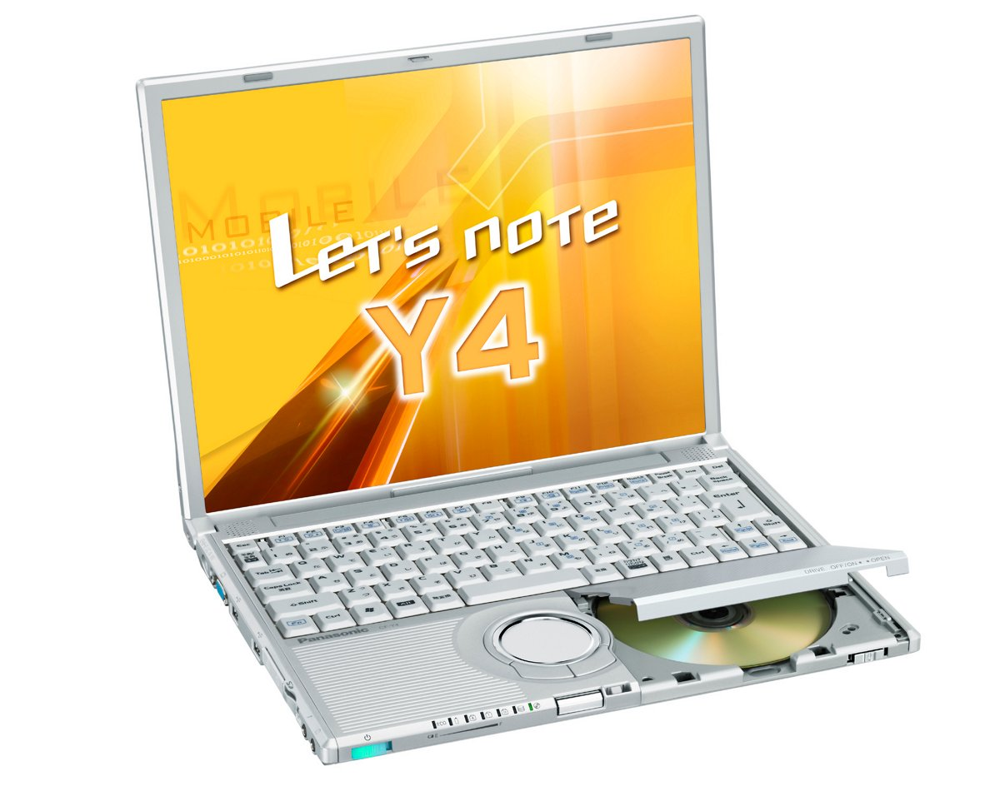
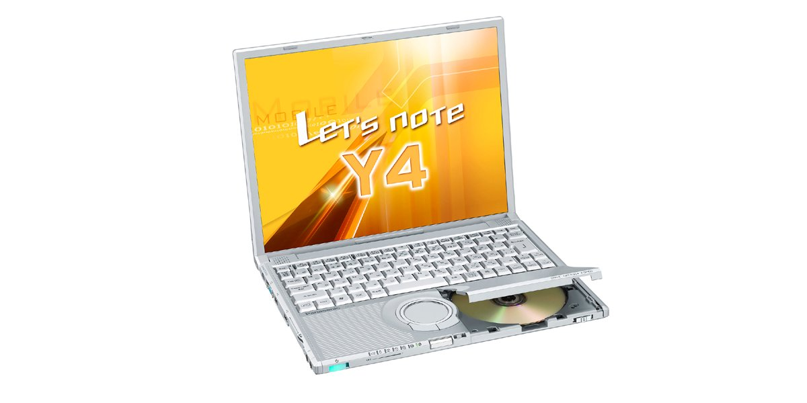

# Panasonic Let's note CF-Y4 Specifications

**English** · [日本語](../../ja/CF-Y4/) · [中文](../../zh/CF-Y4/)

**CF-Y4** is a Panasonic Let's note laptop in the Y4 series with a 14.1-inch SXGA＋ display. This page lists all 3 part numbers, released 2005-05 – 2006-02. Each part number links to its official spec sheet.

*Panasonic Let's note CF-Y4 (CF-Y4JW8AXR). Image © Panasonic.*

## Part numbers

| Part number | Released | Discontinued | Summary |
| :-- | :-- | :-- | :-- |
| [CF-Y4JW8AXR](https://panasonic.jp/pc/p-db/CF-Y4JW8AXR_spec.html) | 2006-02 | 2006-04 | Windows® XP Professional, Pentium M 778 (1.6GHz・LV), Memory: 512MB (max 1024MB), HDD: 60GB, Super Multi Drive, LAN, Wireless LAN 802.11a(J52/W52/W53)/b/g, USB2.0 |
| [CF-Y4HW8AXR](https://panasonic.jp/pc/p-db/CF-Y4HW8AXR_spec.html) | 2005-10 | 2005-11 | Windows® XP Professional, Pentium M 778 (1.6GHz・LV), Memory: 512MB (max 1024MB), HDD: 60GB, Super Multi Drive, LAN, Wireless LAN 802.11a(J52/W52/W53)/b/g, USB2.0 |
| [CF-Y4GW8AXR](https://panasonic.jp/pc/p-db/CF-Y4GW8AXR_spec.html) | 2005-05 | 2005-08 | Windows® XP Professional, PentiumM 758 (1.5GHz・LV), Memory: 512MB (max 1024MB), HDD: 60GB, Super Multi Drive, LAN, Wireless LAN 802.11a(J52)/b/g, USB2.0 |

## Common specifications

| Item | Value |
| :-- | :-- |
| OS | Microsoft(R) Windows(R) XP Professional Service Pack 2 with Enhanced Security Features (NTFS File System) |
| Chipset | Intel(R) 915GMS Express chipset |
| Memory | Standard 512 MB / max. 1024 MB (PC2-3200 / DDR2 SDRAM) |
| Video memory | Maximum 128 MByte (shared with main memory) |
| Hard disk | 60 GB (Ultra ATA100) |
| Optical drive | Super Multi Drive built-in / Equipped with buffer underrun error prevention function (SmoothLink) |
| Optical drive speed / Read | DVD-RAM 2x (4.7GB)/1x (2.6GB), DVD-R max 4x, DVD-RW max 4x, DVD-ROM max 8x, +R max 4x, +R DL max 4x, +RW max 4x, CD-ROM max 24x, CD-R max 24x, CD-RW max 20x |
| Supported discs / Write | DVD-RAM、DVD-R、DVD-RW（Ver.1.1/1.2）、+R、+RW、CD-R、CD-RW |
| Floppy drive (optional) | USB-connected external 3.5-inch 3-mode supported (1.44 MB/1.2 MB/720 KB) (optional) |
| Display | SXGA+(1400×1050 dots) 14.1-inch TFT color LCD |
| Display / LCD colors | 1400×1050 dots: approx. 16.77 million colors |
| Display / External output | 800×600 dots, 1024×768 dots, 1280×768 dots, 1280×1024 dots, 1400×1050 dots, 1600×1200 dots, 2048×1536 dots: approx. 16.77 million colors |
| Display / Simultaneous display | 800×600 dots, 1024×768 dots, 1280×768 dots, 1280×1024 dots, 1400×1050 dots: approx. 16.77 million colors |
| Modem | Data: 56 kbps( V.90 ) / FAX: 14.4 kbps/Voice not supported |
| Wired LAN | 100BASE-TX / 10BASE-T |
| Audio | PCM sound source (16-bit stereo), stereo speaker |
| Security chip | TPM (TCG V1.1b compliant) |
| Card slots / PC Card | PC card (TYPE II) ×1 slot CardBus compatible / allowable current (3.3 V: 400 mA, 5V: 400 mA) |
| Memory expansion slot | DDR2 172-pin MicroDIMM dedicated slot ×1 (1.8V/PC2-3200/DDR2 SDRAM) |
| Ports / Audio | Microphone input (monaural mini jack), audio output (stereo mini jack) |
| Ports / USB | USB connector x 2 (USB2.0 x 2) |
| Ports / External display | Analog RGB mini Dsub 15-pin |
| Ports / Other | Modem connector (RJ-11), LAN connector (RJ-45) |
| Keyboard | OADG-compliant keyboard (86 keys): key pitch 19mm (horizontal/vertical) (excluding some keys) |
| Pointing device | Wheel pad |
| Power | AC100 V–240 V (50 Hz/60 Hz) (power cord for 100 V only), standard battery pack (7.4 V lithium-ion, 7.65 Ah) |
| Power consumption | Max approx. 40 W |
| Efficiency target achievement | — |
| Battery | Battery life approx. 7 hours (when Economy Mode (ECO) is disabled) / Charging time approx. 5 hours (power off), approx. 6.5 hours (power on) |
| Dimensions (excluding protrusions) | Width 309 mm × Depth 243 mm × Height 33 mm/46 mm (front/rear) Excluding protrusions |
| Weight (with battery) | approx. 1530 g (including standard battery) |

## Differences by part number

| Part number | CPU | Memory | Storage | Weight | Battery life |
| :-- | :-- | :-- | :-- | :-- | :-- |
| CF-Y4JW8AXR | Pentium M Low Voltage Edition 778 | 512 MB | 60 GB | 1.53 kg | 7 h |
| CF-Y4HW8AXR | Pentium M Low Voltage Edition 778 | 512 MB | 60 GB | 1.53 kg | 7 h |
| CF-Y4GW8AXR | Pentium M Low Voltage Edition 758 | 512 MB | 60 GB | 1.53 kg | 7 h |

CF-Y4JW8AXR: all differing specifications

| Item | Value |
| :-- | :-- |
| CPU | Intel(R) Centrino(R) Mobile Technology / Intel(R) Pentium(R) M processor Low Voltage 778 (2nd-level cache memory 2 MB, operating frequency 1.60 GHz, front side bus 400 MHz) |
| Optical drive speed / Write | DVD-RAM 2x (4.7GB), DVD-R max 4x, DVD-RW max 2x, +R max 4x, +RW 2.4x, CD-R max 24x, CD-RW max 10x |
| Supported discs / Read | DVD-RAM, DVD-ROM, DVD-Video, DVD-R, DVD-RW, +R, +R DL, +RW, CD-Audio, CD-ROM (XA support), PhotoCD (multi-session support), VideoCD, CD-EXTRA, CD-TEXT, CD-R, CD-RW |
| Wireless LAN | Intel(R) PRO / Wireless 2915ABG, IEEE802.11a (J52/W52/W53)/b/g compliant, (WPA-AES/TKIP support, Wi-Fi compliant) |
| Card slots / SD card | SD memory card ×1 slot (copyright protection technology supported)・transfer speed 8M bytes/sec |
| Energy efficiency | S classification 0.00017 / Rated input power value based on the Japan Electronics and Information Technology Industries Association Information Processing Equipment Harmonic Current Suppression Measures Implementation Plan: 24 W |
| Software | Microsoft(R) Internet Explorer 6 Service Pack 2, Adobe(R) Reader, DMI viewer, Microsoft(R) Windows(R) Media Player 10, DirectX 9.0c, Microsoft(R) Windows(R) Movie Maker 2.1, Microsoft(R) .NET Framework 1.1, NetSelector, SD Utility, WheelPad Utility, Hotkey Settings, goo Stick, Setup Utility, Online Sign-up (hi-ho, DION), Font Size Enlargement Utility, Zoom Viewer, PC Information Viewer, NumLock Notification, Hard Disk Data Erase Utility, Wireless Manager mobile edition 2.0, McAfee(R) VirusScan◆ , Wireless LAN Switching Utility, Economy Mode (ECO) Switching Utility, Battery Remaining Charge Display Correction Utility, Infineon TPM Professional Package V1.7 SP4, B's Recorder GOLD8 BASIC◆, B's CLiP 6◆, Win DVD 5 (OEM version) CPRM compatible◆, Power Saving Settings Utility, Optical Disc Drive Letter Change Utility, Optical Disc Drive Power Saving Utility, DVD-MovieAlbum SE 4, B's DVD Expert (authoring software)◆, PC-Diagnostic Utility / * Word processing, spreadsheet and other application software is not installed. |

Official spec sheet: <https://panasonic.jp/pc/p-db/CF-Y4JW8AXR_spec.html>

CF-Y4HW8AXR: all differing specifications

| Item | Value |
| :-- | :-- |
| CPU | Intel(R) CentrinoTM Mobile Technology / Intel(R) Pentium(R) M processor Low Voltage 778 (2nd-level cache memory 2 MB, operating frequency 1.60 GHz, front side bus 400 MHz) |
| Optical drive speed / Write | DVD-RAM 2x (4.7GB), DVD-R max 2x, DVD-RW max 2x, +R 2.4x, +RW 2.4x, CD-R max 24x, CD-RW max 10x |
| Supported discs / Read | DVD-RAM, DVD-ROM, DVD-Video, DVD-R, DVD-RW (Ver.1.1/1.2), +R, +R DL, +RW, CD-ROM (XA compatible), PhotoCD (multi-session compatible), VideoCD, CD-EXTRA, CD-TEXT, CD-Audio, CD-R, CD-RW |
| Wireless LAN | Intel(R) PRO / Wireless 2915ABG, IEEE802.11a (J52/W52/W53)/b/g compliant, (WPA-AES/TKIP support, Wi-Fi compliant) |
| Card slots / SD card | SD memory card ×1 slot (copyright protection technology supported)・transfer speed 8M bytes/sec |
| Energy efficiency | S classification 0.00017 / Rated input power value based on the Japan Electronics and Information Technology Industries Association Information Processing Equipment Harmonic Current Suppression Measures Implementation Plan: 24 W |
| Software | Microsoft(R) Internet Explorer 6 Service Pack 2, Adobe(R) Reader, DMI viewer, Microsoft(R) Windows(R) MediaTM Player 10, DirectX 9.0c, Microsoft(R) Windows(R) Movie, NumLock Notification, Hard Disk Data Erase Utility, Maker 2.1, Microsoft(R) NET Framework 1.1, NetSelector, SD Utility, WheelPad Utility, Hotkey Settings, goo Stick, Setup Utility, Online Sign-up (hi-ho, DION), Font Size Enlargement Utility, Zoom Viewer, PC Information Viewer, Wireless Manager mobile edition 2.0, McAfee(R) VirusScan◆, PC-Diagnostic Utility, Wireless LAN Switching Utility, Economy Mode (ECO) Switching Utility, Power Saving Settings Utility, Battery Remaining Charge Display Correction Utility, Infineon TPM Professional Package V1.7 SP4, B's Recorder GOLD8 BASIC◆, B's CLiP 6◆, Win DVD 5 (OEM version) CPRM compatible◆, Optical Disc Drive Letter Change Utility, Optical Disc Drive Power Saving Utility, DVD-MovieAlbum SE 4, B's DVD Expert (authoring software) / * Word processing, spreadsheet and other application software is not installed. |

Official spec sheet: <https://panasonic.jp/pc/p-db/CF-Y4HW8AXR_spec.html>

CF-Y4GW8AXR: all differing specifications

| Item | Value |
| :-- | :-- |
| CPU | Intel(R) CentrinoTM Mobile Technology / Intel(R) Pentium(R) M processor Low Voltage 758 (2nd-level cache memory 2 MB, operating frequency 1.50 GHz, front side bus 400 MHz) |
| Optical drive speed / Write | DVD-RAM 2x (4.7GB), DVD-R max 2x, DVD-RW max 2x, +R 2.4x, +RW 2.4x, CD-R max 24x, CD-RW max 10x |
| Supported discs / Read | DVD-RAM, DVD-ROM, DVD-Video, DVD-R, DVD-RW (Ver.1.1/1.2), +R, +R DL, +RW, CD-ROM (XA compatible), PhotoCD (multi-session compatible), VideoCD, CD-EXTRA, CD-TEXT, CD-Audio, CD-R, CD-RW |
| Wireless LAN | Intel(R) PRO / Wireless 2915ABG, IEEE802.11a/b/g compliant, (WPA-AES/TKIP support, Wi-Fi compliant) |
| Card slots / SD card | SD memory card ×1 slot (copyright protection technology supported) |
| Energy efficiency | S classification 0.00018 / Rated input power value based on the Japan Electronics and Information Technology Industries Association Information Processing Equipment Harmonic Current Suppression Measures Implementation Plan: 24 W |
| Software | Microsoft(R) Internet Explorer 6 Service Pack 2, Adobe(R) Reader, DMI viewer, Microsoft(R) Windows(R) MediaTM Player 10, DirectX 9.0c, Microsoft(R) Windows(R) Movie Maker 2.1, Microsoft(R) NET Framework 1.1, NetSelector, SD Utility, WheelPad Utility, Hotkey Settings, goo Stick, Setup Utility, Various Provider Online Sign-up (hi-ho, DION, OCN), Font Size Enlargement Utility, Zoom Viewer, PC Information Viewer, NumLock Notification, Hard Disk Data Erase Utility, Wireless Manager mobile edition 2.0, McAfee(R) VirusScan◆, Wireless LAN Switching Utility, Economy Mode (ECO) Switching Utility, Battery Remaining Charge Display Correction Utility, Infinion TPM Professional Package V1.7 SP3, B's Recorder GOLD8 BASIC◆, B's CLiP 6◆, Win DVD 5 (OEM version) CPRM compatible◆, Optical Disc Drive Power Saving Utility, DVD-MovieAlbum SE 4, B's DVD Expert (authoring software) / * Word processing, spreadsheet and other application software is not installed. |

Official spec sheet: <https://panasonic.jp/pc/p-db/CF-Y4GW8AXR_spec.html>

## Photos

*Panasonic Let's note CF-Y4 (CF-Y4HW8AXR). Image © Panasonic.*

*Panasonic Let's note CF-Y4 (CF-Y4GW8AXR). Image © Panasonic.*

## Related models

- [All Let's note models](../)

---

Source: Panasonic's official [discontinued-models list](https://panasonic.jp/pc/support/products/) and spec sheets (panasonic.jp), translated from Japanese; see the official sheets for the authoritative wording. Product images © Panasonic. This is an unofficial compilation, not affiliated with Panasonic.
