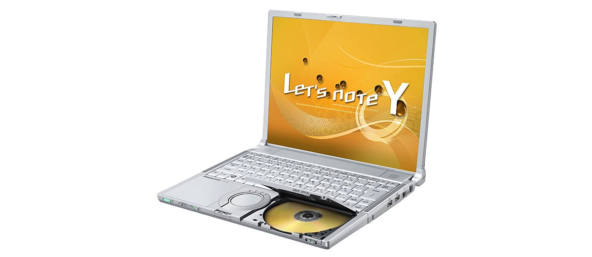
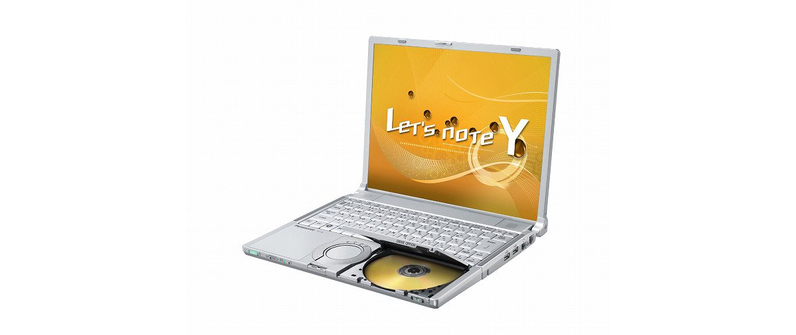

# Panasonic Let's note CF-Y8 Specifications

**English** · [日本語](../../ja/CF-Y8/) · [中文](../../zh/CF-Y8/)

**CF-Y8** is a Panasonic Let's note laptop in the Y8 series with a 14.1-inch SXGA＋ display. This page lists all 4 part numbers, released 2008-10 – 2009-02. Each part number links to its official spec sheet.

*Panasonic Let's note CF-Y8 (CF-Y8FWMCJR, CF-Y8FWMQJR). Image © Panasonic.*

## Part numbers

| Part number | Released | Discontinued | Summary |
| :-- | :-- | :-- | :-- |
| [CF-Y8FWMCJR](https://panasonic.jp/pc/p-db/CF-Y8FWMCJR_spec.html) | 2009-02 | 2009-04 | Windows Vista® Business with SP1 正規版 、インテル® CoreTM2 Duo L7800（2GHz）、メモリー：標準1GB＋1GB（最大2GB）、HDD：250GB、スーパーマルチドライブ、LAN、無線LAN 802.11a(W52/W53/W56)/b/g/n |
| [CF-Y8FWMQJR](https://panasonic.jp/pc/p-db/CF-Y8FWMQJR_spec.html) | 2009-02 | 2009-04 | Windows Vista® Business with SP1 正規版 、インテル® CoreTM2 Duo L7800（2GHz）、メモリー：標準1GB＋1GB（最大2GB）、HDD：250GB、スーパーマルチドライブ、LAN、無線LAN 802.11a(W52/W53/W56)/b/g/n、Office Personal 2007 ＜台数限定＞ |
| [CF-Y8EWJAJR](https://panasonic.jp/pc/p-db/CF-Y8EWJAJR_spec.html) | 2008-10 | 2009-01 | Windows Vista® Business with SP1 正規版 、インテル® CoreTM2 Duo L7800（2GHz）、メモリー：標準1GB（最大2GB）、HDD：160GB、スーパーマルチドライブ、LAN、無線LAN 802.11a(W52/W53/W56)/b/g/n |
| [CF-Y8EWJNJR](https://panasonic.jp/pc/p-db/CF-Y8EWJNJR_spec.html) | 2008-10 | 2009-01 | Windows Vista® Business with SP1正規版 、インテル® CoreTM2 Duo L7800（2GHz）、メモリー：標準1GB（最大2GB）、HDD：160GB、スーパーマルチドライブ、LAN、無線LAN 802.11a(W52/W53/W56)/b/g/n、Office Personal 2007 ＜台数限定＞ |

## Common specifications

| Item | Value |
| :-- | :-- |
| OS | Windows Vista（R） Business with Service Pack 1 正規版（Windows（R） XPダウングレード権含む） |
| Chipset | モバイル インテル（R） GM965 Express チップセット |
| Video memory | 最大251MB / メモリー増設時最大358MB （メインメモリーと共用） |
| Optical drive | スーパーマルチドライブ内蔵、バッファーアンダーランエラー防止機能（SmoothLink）搭載 |
| Optical drive speed / Read | DVD-RAM ２倍速[4.7GB]/1倍速[2.6GB]、DVD-R 最大4倍速、DVD-RW 最大4倍速、DVD-ROM 最大8倍速、＋R 最大4倍速、+R DL 最大4倍速、＋RW 最大4倍速、CD-ROM 最大24倍速、CD-R 最大24倍速、CD-RW 最大20倍速 |
| Optical drive speed / Write | DVD-RAM 2倍速[4.7GB]、DVD-R 最大4倍速、DVD-RW 最大2倍速、＋R 最大4倍速、＋RW 2.4倍速、CD-R 最大24倍速、CD-RW 最大10倍速 |
| Supported discs / Read | DVD-RAM、DVD-ROM､DVD-Video､DVD-R､DVD-RW、＋R、+R DL、＋RW、CD-Audio､CD-R、CD-ROM(XA対応)､PhotoCD(マルチセッション対応)､VideoCD､CD-EXTRA､CD-TEXT、CD-RW |
| Supported discs / Write | DVD-RAMDVD-R、DVD-RW、＋R、＋RW、CD-R、CD-RW |
| Floppy drive (optional) | USB接続外付3.5型3モード対応（1.44MB/1.2MB/720KB） |
| Display / LCD colors | 1400×1050ドット：約1677万色 |
| Display / External output | 800×600、1024×768、1280×768、1280×1024、1400×1050、1440×900、1600×1200ドット：約1677万色 |
| Display / Simultaneous display | 800×600、1024×768、1280×768、1280×1024、1400ｘ1050ドット：約1677万色 |
| Wireless LAN | インテル（R） Wireless WiFi Link 4965AGN、IEEE802.11a（J52/W52/W53/W56）/b/g準拠、(WPA-AES/TKIP対応、Wi-Fi準拠) |
| Modem | データ：56kbps（V.90） FAX：14.4kbps /ボイス非対応 |
| Audio | PCM音源（24ビットステレオ）、インテル（R） High Definition Audio 準拠、ステレオスピーカー |
| Card slots / PC Card | PCカード（TYPEⅡ）×1スロット(CardBus対応、許容電流3.3V：400mA、5V：400mA) |
| Keyboard | OADG準拠キーボード（86キー）：キーピッチ19mm（縦・横）(一部キーを除く) |
| Pointing device | ホイールパッド |
| Power consumption | 最大約60W |
| Efficiency target achievement | — |
| Dimensions (W×D×H) | 幅309.6mm×奥行245.5mm×高さ28mm/44.5mm（前部/後部） |
| Accessories | プロダクトリカバリーDVD-ROM 2枚（Windows Vista(R)用 / Windows(R) XP用）、ACアダプター、バッテリーパック、取扱説明書 等 |

## Differences by part number

| Part number | CPU | Memory | Storage | Weight | Battery life |
| :-- | :-- | :-- | :-- | :-- | :-- |
| CF-Y8FWMCJR | — | 2GB DDR2 SDRAM | 250GB | 1.52 kg | — |
| CF-Y8FWMQJR | — | 2GB DDR2 SDRAM | 250GB | — | — |
| CF-Y8EWJAJR | — | 1GB DDR2 SDRAM | 160GB | 1.51 kg | — |
| CF-Y8EWJNJR | — | 1GB DDR2 SDRAM | 160GB | — | — |

CF-Y8FWMCJR: all differing specifications

| Item | Value |
| :-- | :-- |
| CPU | インテル（R） Centrino（R）2 プロセッサー・テクノロジー / インテル（R） Core（TM）2 Duo プロセッサー 低電圧版 L7800 / 2次キャッシュメモリー 4MB、動作周波数 2GHz、フロントサイド・バス 800MHz |
| Memory | 標準2GB DDR2 SDRAM（最大2GB）（拡張メモリースロットに1GBメモリーを増設済み、空きスロット0） |
| Hard disk | 250GB（Serial ATA）左記容量のうち約8GBは修復用領域（リカバリー用データ領域を含む）として使用（ユーザー使用不可） |
| Display | SXGA＋(1400×1050ドット) / 14.1型TFTカラー液晶 |
| Wired LAN | 1000BASE-T / 100BASE-TX / 10BASE-T |
| Security chip | TPM（TCG V1.2準拠） |
| Card slots / SD card | SDメモリーカード×1スロット（SDHCメモリーカード/著作権保護機能対応） |
| Memory expansion slot | DDR2 172ピンマイクロDIMM専用スロット×1(PC2-4200/DDR2 SDRAM) |
| Ports | USBポート×2（USB2.0）、モデムコネクター（RJ-11）、LANコネクター（RJ-45）、外部ディスプレイコネクター（アナログVGA ミニDsub 15ピン）、ミニポートリプリケーターコネクター（専用50ピン） |
| Power | ACアダプター 入力：AC100V～240V（50Hz/60Hz）（電源コードは100V専用） / バッテリーパック（10.65Vリチウムイオン・公称容量5.7 Ah/定格容量5.4Ah） |
| Energy efficiency | 2007年度基準Ｉ区分0.00019 |
| Weight (with battery) | 約1.52kg |
| Software | Microsoft（R） Internet Explorer7.0、Adobe（R） Reader、Microsoft（R） Windows（R） Media Player 11、DirectX 10、Microsoft（R）Windows（R） Movie Maker 6.0、Microsoft（R） .NET Framework3.0、ズームビューアー、PC情報ビューアー、PC情報ポップアップ、NumLockお知らせ、Wireless Manager mobile edition5.0、無線切り替えユーティリティ、セキュリティ設定ユーティリティ、Infineon TPM Professional Package V3.0 SP2HF2、バッテリー残量表示補正ユーティリティ、Hotkey設定、マカフィー・インターネットセキュリティスイートベーシックエディション、緑のgooスティック、ハードディスクデータ消去ユーティリティ、ホイールパッドユーティリティ、ネットセレクター2、USBキーボードヘルパー、USBマウスヘルパー、Fn Ctrl機能入れ換えユーティリティ、DMIビューアー、エコノミーモード（ECO）切り替えユーティリティ、省電力設定ユーティリティ、LAN省電力ユーティリティ、ファン制御ユーティリティ、セットアップユーティリティ、PC-Diagnosticユーティリティ、オプティカルディスクドライブ文字変更ユーティリティ、オプティカルディスクドライブ省電力ユーティリティ、Roxio Creator LJB、MyDVD、WinDVDTM8(OEM版) CPRM対応、DVD-MovieAlbumSE 4.5 |

Official spec sheet: <https://panasonic.jp/pc/p-db/CF-Y8FWMCJR_spec.html>

CF-Y8FWMQJR: all differing specifications

| Item | Value |
| :-- | :-- |
| CPU | インテル（R） Centrino（R） プロセッサー・テクノロジー / インテル（R） CoreTM2 Duo / プロセッサー 低電圧版 Ｌ7800 / 2次キャッシュメモリー 4MB、 / 動作周波数 2GHz、 / フロントサイド・バス 800MHz |
| Memory | 標準2GB DDR2 SDRAM（最大2GB）（拡張メモリースロットに1GBメモリーを増設済み、空きスロット0） |
| Hard disk | 250GB（Serial ATA）左記容量のうち約8GBは修復用領域（リカバリー用データ領域を含む）として使用（ユーザー使用不可） |
| Display | SXGA＋(1400×1050ドット)14.1型TFTカラー液晶 |
| Wired LAN | 1000BASE-T/100BASE-TX / 10BASE-T |
| Security chip | ＴＰＭ（TCG V1.2準拠） |
| Card slots / SD card | SDメモリーカード×1スロット（SDHCメモリーカード/著作権保護技術対応） |
| Memory expansion slot | DDR2 172ピンマイクロDIMM専用スロット×1 |
| Ports | USBポート×2（USB2.0）、モデムコネクター（RJ-11）、LANコネクター（RJ-45）、 / 外部ディスプレイコネクター（アナログRGB ミニDsub 15ピン）、ミニポートリプリケーターコネクター（専用50ピン） |
| Power | ACアダプター 入力：AC100V～240V（50Hz/60Hz）（電源コードは100V専用） / バッテリーパック（10.65Vリチウムイオン・5.7 Ah） |
| Energy efficiency | 2007年度基準Ｉ区分0.00023 |
| Weight (with battery) | 約1.52ｋg |
| Software | Microsoft（R） Internet Explorer7.0、Adobe（R） Reader、DMIビューアー、Microsoft（R） Windows（R） Media Player 11、DirectX 10、Microsoft（R）Windows（R） Movie Maker 6.0、Microsoft（R） .NET Framework3.0、ズームビューアー、PC情報ビューアー、PC情報ポップアップ、NumLockお知らせ、Wireless Manager mobile edition4.5、無線切り替えユーティリティ、セキュリティ設定ユーティリティ、Infineon TPM Professional Package V3.0 SP2HF2、エコノミーモード（ECO）切り替えユーティリティ、省電力設定ユーティリティ、バッテリー残量表示補正ユーティリティ、Hotkey設定、マカフィー・インターネットセキュリティスイートベーシックエディション、緑のgooスティック、ハードディスクデータ消去ユーティリティ、セットアップユーティリティ、PC-Diagnosticユーティリティ、ホイールパッドユーティリティ、ネットセレクター2、LAN省電力ユーティリティ、ファン制御ユーティリティ、Fn Ctrl機能入れ換えユーティリティ / オプティカルディスクドライブ文字変更ユーティリティ、オプティカルディスクドライブ省電力ユーティリティ、B's Recorder GOLD9 BASIC◆、B's CliP71◆、WinDVDTM8(OEM版)CPRM対応◆、DVD-MovieAlbumSE 4.5、B's DVD Professional2（オーサリングソフト）◆、Microsoft（R） Office Personal 2007withPowerPoint 2007 |

Official spec sheet: <https://panasonic.jp/pc/p-db/CF-Y8FWMQJR_spec.html>

CF-Y8EWJAJR: all differing specifications

| Item | Value |
| :-- | :-- |
| CPU | インテル（R） Centrino（R）2 プロセッサー・テクノロジー / インテル（R） Core（TM）2 Duo プロセッサー 低電圧版 L7800 / 2次キャッシュメモリー 4MB、動作周波数 2GHz、フロントサイド・バス 800MHz |
| Memory | 標準1GB DDR2 SDRAM（最大2GB）空きスロット1 |
| Hard disk | 160GB（Serial ATA）左記容量のうち約6GBは修復用領域として使用（ユーザー使用不可） |
| Display | SXGA＋(1400×1050ドット) / 14.1型TFTカラー液晶 |
| Wired LAN | 1000BASE-T / 100BASE-TX / 10BASE-T |
| Security chip | TPM（TCG V1.2準拠） |
| Card slots / SD card | SDメモリーカード×1スロット（SDHCメモリーカード/著作権保護機能対応） |
| Memory expansion slot | DDR2 172ピンマイクロDIMM専用スロット×1(PC2-4200/DDR2 SDRAM) |
| Ports | USBポート×2（USB2.0）、モデムコネクター（RJ-11）、LANコネクター（RJ-45）、外部ディスプレイコネクター（アナログVGA ミニDsub 15ピン）、ミニポートリプリケーターコネクター（専用50ピン） |
| Power | ACアダプター 入力：AC100V～240V（50Hz/60Hz）（電源コードは100V専用） / バッテリーパック（10.65Vリチウムイオン・公称容量5.7 Ah/定格容量5.4Ah） |
| Energy efficiency | 2007年度基準Ｉ区分0.00019 |
| Weight (with battery) | 約1.51kg |
| Software | Microsoft（R） Internet Explorer7.0、Adobe（R） Reader、Microsoft（R） Windows（R） Media Player 11、DirectX 10、Microsoft（R）Windows（R） Movie Maker 6.0、Microsoft（R） .NET Framework3.0、ズームビューアー、PC情報ビューアー、PC情報ポップアップ、NumLockお知らせ、Wireless Manager mobile edition5.0、無線切り替えユーティリティ、セキュリティ設定ユーティリティ、Infineon TPM Professional Package V3.0 SP2HF2、バッテリー残量表示補正ユーティリティ、Hotkey設定、マカフィー・インターネットセキュリティスイートベーシックエディション、gooスティック、ハードディスクデータ消去ユーティリティ、ホイールパッドユーティリティ、ネットセレクター2、USBキーボードヘルパー、USBマウスヘルパー、Fn Ctrl機能入れ換えユーティリティ、DMIビューアー、エコノミーモード（ECO）切り替えユーティリティ、省電力設定ユーティリティ、LAN省電力ユーティリティ、ファン制御ユーティリティ、セットアップユーティリティ、PC-Diagnosticユーティリティ、オプティカルディスクドライブ文字変更ユーティリティ、オプティカルディスクドライブ省電力ユーティリティ、Roxio Creator LJB、MyDVD、WinDVDTM8(OEM版) CPRM対応、DVD-MovieAlbumSE 4.5 |

Official spec sheet: <https://panasonic.jp/pc/p-db/CF-Y8EWJAJR_spec.html>

CF-Y8EWJNJR: all differing specifications

| Item | Value |
| :-- | :-- |
| CPU | インテル（R） Centrino（R） 2 プロセッサー・テクノロジー / インテル（R） Core（TM）2 Duo プロセッサー 低電圧版 L7800 / 2次キャッシュメモリー 4MB、 / 動作周波数 2GHz、 / フロントサイド・バス 800MHz |
| Memory | 標準1GB DDR2 SDRAM（最大2GB）空きスロット1 |
| Hard disk | 160GB（Serial ATA）左記容量のうち約6GBは修復用領域として使用（ユーザー使用不可） |
| Display | SXGA＋(1400×1050ドット)14.1型TFTカラー液晶 |
| Wired LAN | 1000BASE-T / 100BASE-TX / 10BASE-T |
| Security chip | TPM（TCG V1.2準拠） |
| Card slots / SD card | SDメモリーカード×1スロット（SDHCメモリーカード/著作権保護機能対応） |
| Memory expansion slot | DDR2 172ピンマイクロDIMM専用スロット×1 (PC2-4200/DDR2 SDRAM) |
| Ports | USBポート×2（USB2.0）、モデムコネクター（RJ-11）、LANコネクター（RJ-45）、外部ディスプレイコネクター（アナログVGA ミニDsub 15ピン）、ミニポートリプリケーターコネクター（専用50ピン） |
| Power | ACアダプター 入力：AC100V～240V（50Hz/60Hz）（電源コードは100V専用） / バッテリーパック（10.65Vリチウムイオン・公称容量5.7 Ah/定格容量5.4 Ah） |
| Energy efficiency | 2007年度基準Ｉ区分0.00019 |
| Weight (with battery) | 約1.51ｋg |
| Software | Microsoft（R） Internet Explorer7.0、Adobe（R） Reader、Microsoft（R） Windows（R） Media Player 11、DirectX 10、Microsoft（R）Windows（R） Movie Maker 6.0、Microsoft（R） .NET Framework3.0、ズームビューアー、PC情報ビューアー、PC情報ポップアップ、NumLockお知らせ、Wireless Manager mobile edition5.0、無線切り替えユーティリティ、セキュリティ設定ユーティリティ、Infineon TPM Professional Package V3.0 SP2HF2、バッテリー残量表示補正ユーティリティ、Hotkey設定、マカフィー・インターネットセキュリティスイートベーシックエディション、gooスティック、ハードディスクデータ消去ユーティリティ、ホイールパッドユーティリティ、ネットセレクター2、USBキーボードヘルパー、USBマウスヘルパー、Fn Ctrl機能入れ換えユーティリティ、DMIビューアー、エコノミーモード（ECO）切り替えユーティリティ、省電力設定ユーティリティ、LAN省電力ユーティリティ、ファン制御ユーティリティ、セットアップユーティリティ、PC-Diagnosticユーティリティ、オプティカルディスクドライブ文字変更ユーティリティ、オプティカルディスクドライブ省電力ユーティリティ、Roxio Creator LJB、MyDVD、WinDVDTM8(OEM版) CPRM対応、DVD-MovieAlbumSE 4.5、Microsoft（R） Office Personal 2007 with PowerPoint 2007 |

Official spec sheet: <https://panasonic.jp/pc/p-db/CF-Y8EWJNJR_spec.html>

## Photos

*Panasonic Let's note CF-Y8 (CF-Y8EWJAJR, CF-Y8EWJNJR). Image © Panasonic.*

## Related models

- [All Let's note models](../)

---

Source: Panasonic's official [discontinued-models list](https://panasonic.jp/pc/support/products/) and spec sheets (panasonic.jp). Spec values are quoted in the original Japanese. Product images © Panasonic. This is an unofficial compilation, not affiliated with Panasonic.
