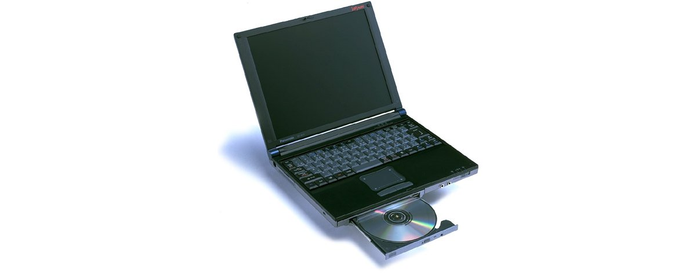

# レッツノート CF-A77 スペック・仕様一覧

[English](../../en/CF-A77/) · **日本語** · [中文](../../zh/CF-A77/)

🗄️ [レッツノート陳列棚](https://letsnote-specs.github.io/ja/CF-A77/)でこの機種を見る

パナソニック レッツノート **CF-A77**（ace A77/A44シリーズ・11.3型XGA液晶）の全2品番（1999-06 – 1999-07発売）のスペック・仕様をまとめたページです。各品番の公式仕様表へのリンクも掲載しています。

*レッツノート CF-A77（CF-A77J8）。画像 © Panasonic*

## 品番一覧

| 品番 | 発売 | 生産終了 | 主な仕様 |
| :-- | :-- | :-- | :-- |
| [CF-A77J81](https://panasonic.jp/pc/p-db/CF-A77J81_spec.html) | 1999-07 | 1999-08 | Celeron(300MHz)、HDD：6.4GB、CD-ROM、LAN、Windows 98、Office2000 |
| [CF-A77J8](https://panasonic.jp/pc/p-db/CF-A77J8_spec.html) | 1999-06 | 1999-08 | Celeron(300MHz)、HDD：6.4GB、CD-ROM、LAN、Windows 98 |

## 共通仕様

| 項目 | 仕様 |
| :-- | :-- |
| CPU | モバイルIntel(R) Celeron(TM)プロセッサ 300MHz |
| チップセット | Intel(R) 440BX AGPset |
| メインメモリー | 標準 64MB SDRAM (最大 128MB) |
| ２次キャッシュメモリー | 128KB |
| ビデオメモリー | 2.5MB |
| グラフィックチップ | NeoMagic社製NM2200 |
| ハードディスクドライブ | 6.4GB (UltraATA) ※1 |
| 光学式ドライブ | CD-ROMドライブ :最大24倍速・着脱式 |
| フロッピーディスクドライブ(オプション) | 外付け 3.5型 3モード対応 (1.44MB /1.2MB /720KB) |
| マルチベイ | CD-ROMドライブ(標準添付)、拡張バッテリーパック(オプション)、 / ウェイトセーバー（標準添付）を交換可 |
| 表示方式 | XGA(1024×768ドット) 11.3型TFTカラー液晶 |
| 表示方式 / LCD表示 | 1024×768ドット :約1600万色 ※2 |
| 表示方式 / 外部ディスプレイ出力 | 640×480、800×600、1024×768ドット :約1600万色、1280×1024ドット :256色 |
| 表示方式 / 本体＋外部ディスプレイ同時表示 | 640×480、800×600、1024×768ドット :約1600万色 ※2、1280×1024ドット ※3 :256色 |
| 表示方式 / デュアルディスプレイ表示(例) | 内部LCD 1024×768ドット :約65,536万色 － 外部ディスプレイ 640×480ドット :256色 / 内部LCD 1024×768ドット :256色 － 外部ディスプレイ 1024×768ドット :256色 |
| モデム | 本体内蔵 データ :56kbps (V.90/K56flex自動対応) FAX :14.4kbps、ボイス機能対応 (RJ-11) ※4 |
| LAN | 本体内蔵 100BASE-TX /10BASE-T (RJ-45) ※5 |
| サウンド機能 | PCM音源(Windows Sound System互換)、モノラルスピーカー、モノラルマイク内蔵 |
| PCカードスロット | PCカード(TypeII×1スロット)、CardBus対応 |
| 拡張メモリースロット | 144ピンDIMM専用スロット×1 |
| インターフェース / 音声 | マイク入力(ミニジャック)、オーディオ出力(ミニジャック) |
| インターフェース / USBコネクター | 4ピン |
| インターフェース / 赤外線通信 | IrDA V1.1準拠4Mbps ※6 |
| インターフェース / その他インターフェース | 拡張バスコネクター |
| インターフェース / オプション(Ｉ／Ｏボックス) | シリアル(Dsub 9ピン)、パラレル(Dsub 25ピン)、外部ディスプレイ(ミニD-sub9ピン)、外部マウス／キーボード(ミニDin 6ピン)、FDDコネクター |
| インターフェース / オプション（ミニＩ／Ｏボックス） | 外部ディスプレイ(ミニD-sub9ピン)、外部マウス／キーボード(ミニDin 6ピン) |
| キーボード | OADG準拠キーボード (86キー)、キーピッチ 17mm |
| ポインティングデバイス | スマートポインターIII |
| 電源 | AC 100V-240V (50Hz/60Hz)(ACコードは100V専用)、 / 標準バッテリーパック／拡張バッテリーパック<別売>／大容量バッテリーパック<別売> (リチウムイオン) |
| 消費電力 | 約35W |
| エネルギー消費効率 | スタンバイモード時 : 約1.0W ※7 |
| バッテリー | 標準バッテリーパック / 駆動:約1.8時間 ※8※9 充電:約2.5時間(電源OFF時)、約5.5時間(電源ON時)※10 / 標準＋拡張バッテリーパック<別売> / 駆動:約7時間 ※9 充電:約7時間(電源OFF時)、約18.5時間(電源ON時)※10 / 大容量<別売>＋拡張バッテリーパック<別売> / 駆動:約11時間 ※9 充電:約9.5時間(電源OFF時)、約28時間(電源ON時)※10 |
| 外形寸法(幅×奥行×高さ) | 270mm × 215mm × 29mm (突起部除く) |
| 質量(バッテリーを含む） | 約1.60kg (CD-ROMドライブ装着時) |

## 品番別の違い

| 品番 | CPU | メモリー | ストレージ | 質量 | 駆動時間 |
| :-- | :-- | :-- | :-- | :-- | :-- |
| CF-A77J81 | Celeron 300MHz | 64MB SDRAM | 6.4GB | 1.60 kg | 1.8 h |
| CF-A77J8 | Celeron 300MHz | 64MB SDRAM | 6.4GB | 1.60 kg | 1.8 h |

CF-A77J81 の仕様の違い（すべて）

| 項目 | 仕様 |
| :-- | :-- |
| ソフトウェア | Microsoft(R) Windows(R) 98、 / Microsoft(R) Office 2000 Personal ◆※11、 / Microsoft(R) IME 2000、 / Microsoft(R) Internet Explorer 5、 / Adobe(R) Acrobat(R) Reader 3.0J ◆、 / モバイルフォン ◆※12、 / イラストメール ※13、 / クイックラウンチャー、 / クイックコネクションセレクター、 / Intellisync(TM) for Notebooks ◆、 / Phoenix PowerPanel(TM)、 / Phoenix BaySwap(TM)、 / NIFTY Manager for Windows ◆、 / Panasonic Hi-HO オンラインサインアップソフト |
| 注意書き | ※1 HDD容量は1GB=1,000,000,000バイト表示。 / ※2 内部LCDについては、グラフィックアクセラレーターのディザリング機能により実現。 / ※3 同時表示では、画面全体の一部(1024×768ドット)が表示されます。カーソルを画面の端に移動すると、画面全体がスクロールします。 / ※4 日本国内NTTアナログ一般回線専用です。V.90とK56flexを自動判別して切り替わります。また、56kbpsはデータ受信時の理論値です。データ送信時は33.6kpbsが最大速度です。 / ※5 コネクターの形状によっては使用できないものがあります。 / ※6 赤外線通信ポートの有効距離は20～50cmとなります。 / ※7 省エネ法に基づくエネルギー消費効率。 / ※8 CD-ROMドライブ内蔵時。 / ※9 LCDバックライト輝度最低時。動作環境・システム設定により変動します。 / ※10 完全放電したバッテリーを充電すると時間がかかる場合があります。電源が切れている状態でも電力を消費するので、満充電から約1週間(標準バッテリー使用時)でバッテリー残量がなくなります。また、電源ONの充電時間は最短の場合です。コンピュータの動作状態により変動します。 / ※11 「Bookshelf Basic 2.0」はCD-ROM添付のみです。 / ※12 ファクスのサイズはA4／レターの2種類です。 / ※13 フォントの種類によって正しく表示されない場合があります。等幅フォントをお使いください。 / ◆印のソフトウェアの操作に関するサポートは、各ソフトメーカーで行っております。 / ●本パソコンはWindows 98 以外では動作保証しておりません。 / ●一般的にWindows 98用と表記されているソフト及び周辺機器の中には本パソコンで使用できないものがあります。ご購入に関しては、各ソフト及び周辺機器の販売元にご確認ください。 / ●付属のプロダクトリカバリーCD-ROMではOSのみの再インストールは行えません。 |

公式仕様表: <https://panasonic.jp/pc/p-db/CF-A77J81_spec.html>

CF-A77J8 の仕様の違い（すべて）

| 項目 | 仕様 |
| :-- | :-- |
| ソフトウェア | Microsoft(R) Windows(R) 98、 / Microsoft(R) IME 98、 / Microsoft(R) Internet Explorer 4.01、 / Adobe(R) Acrobat(R) Reader 3.0J ◆、 / モバイルフォン ◆※11、 / イラストメール ※12、 / クイックラウンチャー、 / クイックコネクションセレクター、 / Intellisync(TM) for Notebooks ◆、 / Phoenix PowerPanel(TM)、 / Phoenix BaySwap(TM)、 / NIFTY Manager for Windows ◆、 / Panasonic Hi-HO オンラインサインアップソフト |
| 注意書き | ※1 HDD容量は1GB=1,000,000,000バイト表示。 / ※2 内部LCDについては、グラフィックアクセラレーターのディザリング機能により実現。 / ※3 同時表示では、画面全体の一部(1024×768ドット)が表示されます。カーソルを画面の端に移動すると、画面全体がスクロールします。 / ※4 日本国内NTTアナログ一般回線専用です。V.90とK56flexを自動判別して切り替わります。また、56kbpsはデータ受信時の理論値です。データ送信時は33.6kpbsが最大速度です。 / ※5 コネクターの形状によっては使用できないものがあります。 / ※6 赤外線通信ポートの有効距離は20～50cmとなります。 / ※7 省エネ法に基づくエネルギー消費効率。 / ※8 CD-ROMドライブ内蔵時。 / ※9 LCDバックライト輝度最低時。動作環境・システム設定により変動します。 / ※10 完全放電したバッテリーを充電すると時間がかかる場合があります。電源が切れている状態でも電力を消費するので、満充電から約1週間(標準バッテリー使用時)でバッテリー残量がなくなります。また、電源ONの充電時間は最短の場合です。コンピュータの動作状態により変動します。 / ※11 ファクスのサイズはA4／レターの2種類です。 / ※12 フォントの種類によって正しく表示されない場合があります。等幅フォントをお使いください。 / ◆印のソフトウェアの操作に関するサポートは、各ソフトメーカーで行っております。 / ●本パソコンはWindows 98 以外では動作保証しておりません。 / ●一般的にWindows 98用と表記されているソフト及び周辺機器の中には本パソコンで使用できないものがあります。ご購入に関しては、各ソフト及び周辺機器の販売元にご確認ください。 / ●付属のプロダクトリカバリーCD-ROMではOSのみの再インストールは行えません。 |

公式仕様表: <https://panasonic.jp/pc/p-db/CF-A77J8_spec.html>

## 関連機種

- 同シリーズの前機種: [CF-A44](../CF-A44/)
- [レッツノート全機種一覧](../)

---

出典：パナソニック公式[生産終了品一覧](https://panasonic.jp/pc/support/products/)および各品番の仕様表（panasonic.jp）。製品画像 © Panasonic。本ページは非公式のまとめであり、パナソニックとは関係ありません。
