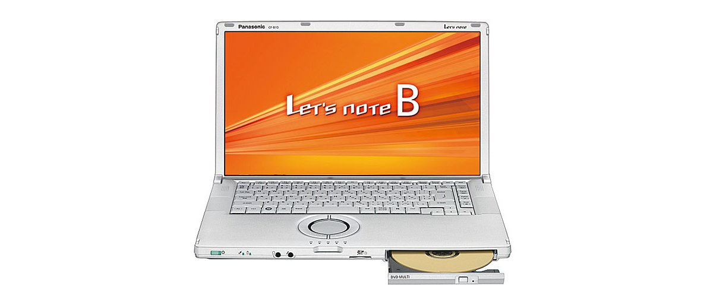
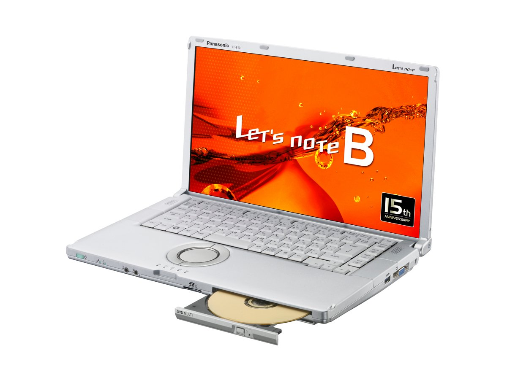

# レッツノート CF-B10 スペック・仕様一覧

[English](../../en/CF-B10/) · **日本語** · [中文](../../zh/CF-B10/)

🗄️ [レッツノート陳列棚](https://letsnote-specs.github.io/ja/CF-B10/)でこの機種を見る

パナソニック レッツノート **CF-B10**（B10シリーズ・15.6型Full HD液晶・光学式ドライブ内蔵）の全8品番（2011-03 – 2012-02発売）のスペック・仕様をまとめたページです。各品番の公式仕様表へのリンクも掲載しています。

*レッツノート CF-B10（CF-B10CWADR, CF-B10CWHDR, CF-B10AWADR, CF-B10AWHDR）。画像 © Panasonic*

## 品番一覧

| 品番 | 発売 | 生産終了 | 主な仕様 |
| :-- | :-- | :-- | :-- |
| [CF-B10WWADR](https://panasonic.jp/pc/p-db/CF-B10WWADR_spec.html) | 2012-02 | 2012-05 | Windows® 7 Professional 64ビット 正規版（Service Pack 1 適用済み）、インテル® CoreTM i7-2675QM（2.20GHz）、メモリー：標準4GB（空きスロット1、最大8GB）、HDD：640GB、スーパーマルチドライブ、LAN、無線LAN 802.11a(W52/W53/W56)/b/g/n |
| [CF-B10WWHDR](https://panasonic.jp/pc/p-db/CF-B10WWHDR_spec.html) | 2012-02 | 2012-05 | Windows® 7 Professional 64ビット 正規版 （Service Pack 1 適用済み）、インテル® CoreTM i7-2675QM（2.20GHz）、メモリー：標準4GB（空きスロット1、最大8GB）、HDD：640GB、スーパーマルチドライブ、LAN、無線LAN 802.11a(W52/W53/W56)/b/g/n、Office Home and Business 2010 ＜台数限定＞ |
| [CF-B10EWADR](https://panasonic.jp/pc/p-db/CF-B10EWADR_spec.html) | 2011-09 | 2012-02 | Windows® 7 Professional 64ビット 正規版（Service Pack 1 適用済み）、インテル® CoreTM i5-2540M（2.60GHz）、メモリー：標準4GB（空きスロット1、最大8GB）、HDD：640GB、スーパーマルチドライブ、LAN、無線LAN 802.11a(W52/W53/W56)/b/g/n |
| [CF-B10EWHDR](https://panasonic.jp/pc/p-db/CF-B10EWHDR_spec.html) | 2011-09 | 2012-02 | Windows® 7 Professional 64ビット 正規版 （Service Pack 1 適用済み）、インテル® CoreTM i5-2540M（2.60GHz） 、メモリー：標準4GB（空きスロット1、最大8GB）、HDD：640GB、スーパーマルチドライブ、LAN、無線LAN 802.11a(W52/W53/W56)/b/g/n、Office Home and Business 2010 ＜台数限定＞ |
| [CF-B10CWADR](https://panasonic.jp/pc/p-db/CF-B10CWADR_spec.html) | 2011-05 | 2011-09 | Windows® 7 Professional 64ビット 正規版（Service Pack 1 適用済み）、インテル® CoreTM i5-2520M（2.50GHz）、メモリー：標準4GB（空きスロット1、最大8GB）、HDD：640GB、スーパーマルチドライブ、LAN、無線LAN 802.11a(W52/W53/W56)/b/g/n |
| [CF-B10CWHDR](https://panasonic.jp/pc/p-db/CF-B10CWHDR_spec.html) | 2011-05 | 2011-09 | Windows® 7 Professional 64ビット 正規版 （Service Pack 1 適用済み）、インテル® CoreTM i5-2520M（2.50GHz） 、メモリー：標準4GB（空きスロット1、最大8GB）、HDD：640GB、スーパーマルチドライブ、LAN、無線LAN 802.11a(W52/W53/W56)/b/g/n、Office Home and Business 2010 ＜台数限定＞ |
| [CF-B10AWADR](https://panasonic.jp/pc/p-db/CF-B10AWADR_spec.html) | 2011-03 | 2011-04 | Windows® 7 Professional 正規版 、インテル® CoreTM i5-2520M（2.50GHz）、メモリー：標準4GB（最大8GB）、HDD：500GB、スーパーマルチドライブ、LAN、無線LAN 802.11a(W52/W53/W56)/b/g/n |
| [CF-B10AWHDR](https://panasonic.jp/pc/p-db/CF-B10AWHDR_spec.html) | 2011-03 | 2011-04 | Windows® 7 Professional 正規版 、インテル® CoreTM i5-2520M（2.50GHz）、メモリー：標準4GB（最大8GB）、HDD：500GB、スーパーマルチドライブ、LAN、無線LAN 802.11a(W52/W53/W56)/b/g/n、Office Home and Business 2010 ＜台数限定＞ |

## 共通仕様

| 項目 | 仕様 |
| :-- | :-- |
| ビデオメモリー | 最大1696MB (メインメモリーと共用) |
| 連続データ転送速度 / 記録 | DVD-RAM最大5倍速[4.7GB]、DVD-R 最大8倍速、DVD-RW 最大6倍速、+R 最大8倍速、+RW 最大4倍速、CD-R 最大24倍速、CD-RW 4倍速、High Speed CD-RW 10倍速、DVD-R DL 最大6倍速、+R DL 最大6倍速、High Speed +RW 最大8倍速、Ultra Speed CD-RW 最大24倍速 |
| 表示方式 / LCD表示 | 1920×1080ドット：約1677万色 |
| 表示方式 / 外部ディスプレイ出力 | 1280×720、1360×768、1366×768、1600×900、800×600、1024×768、1280×768、1280×1024、1400×1050、1680×1050、1600×1200、1920×1080、1920×1200ドット：約1677万色 |
| 表示方式 / 本体＋外部ディスプレイ同時表示 | 800×600、1024×768、1280×720、1280×768、1280×1024、1360X768、1366X768、1400Ｘ1050、1600Ｘ900、1680Ｘ1050、1600X1200、1920Ｘ1080ドット：約1677万色 |
| ワイヤレス通信機能 | インテル Centrino Advanced-N 6205 |
| 無線LAN | IEEE802.11a（W52/W53/W56）/b/g/n準拠 |
| LAN | 1000BASE-T/100BASE-TX/10BASE-T |
| サウンド機能 | PCM音源（24ビットステレオ）、インテルHigh Definition Audio 準拠、ステレオスピーカー |
| カードスロット / PCカードスロット | 搭載されていません |
| 拡張メモリースロット | DDR3 204ピンSO-DIMM専用スロット×1 (1.5V/PC3-8500/DDR3 SDRAM) |
| キーボード | OADG準拠90キー、キーピッチ19mm(縦・横)(一部キーを除く) |
| 達成率( 2011年度基準 ) | — |
| 外形寸法(幅×奥行×高さ) | 幅370.8mm×奥行229mm×高さ31.4mm/43.2mm（前部/後部） |

## 品番別の違い

| 品番 | CPU | メモリー | ストレージ | 質量 | 駆動時間 |
| :-- | :-- | :-- | :-- | :-- | :-- |
| CF-B10WWADR | Core i7-2675QM | 4GB PC3-8500 | 640GB | 1.895 kg | 6 h |
| CF-B10WWHDR | Core i7-2675QM | 4GB PC3-8500 | 640GB | 1.895 kg | 6 h |
| CF-B10EWADR | Core i5-2540M vPro | 4GB PC3-8500 | 640GB | 1.88 kg | 6 h |
| CF-B10EWHDR | Core i5-2540M vPro | 4GB PC3-8500 | 640GB | 1.88 kg | 6 h |
| CF-B10CWADR | Core i5-2520M vPro | 4GB PC3-8500 | 640GB | 1.88 kg | 6 h |
| CF-B10CWHDR | Core i5-2520M vPro | 4GB PC3-8500 | 640GB | 1.88 kg | 6 h |
| CF-B10AWADR | Core i5-2520M vPro スマートキャッシュ3MB、動作周波数2.50GHz | 4GB PC3-8500 | 500GB | 1.88 kg | 6 h |
| CF-B10AWHDR | Core i5 | 4GB PC3-8500 | 500GB | 1.88 kg | 6 h |

CF-B10WWADR の仕様の違い（すべて）

| 項目 | 仕様 |
| :-- | :-- |
| OS | ▼ベースOS：Windows7 Professional32ビット正規版/Windows7 Professional 64ビット正規版(WindowsXP Mode搭載) / ▼インストールOS：Windows7 Professional64ビット正規版(WindowsXP Mode搭載)[Service Pack1適用済] |
| CPU | インテル Core i7-2675QM プロセッサー / インテルスマートキャッシュ6MB、動作周波数2.20GHz（インテル ターボ・ブースト・テクノロジー2.0利用時は最大3.10GHz） |
| チップセット | モバイルインテル HM65 Express チップセット |
| メインメモリー | 標準4GB PC3-8500/DDR3 SDRAM 最大8GB （空きスロット1） |
| ハードディスクドライブ | 640GB（Serial ATA、2.5型HDD 5400回転/分）上記容量のうち約12GBをリカバリー領域、約300MBをシステム領域として使用（ユーザー使用不可） |
| 光学式ドライブ | スーパーマルチドライブ内蔵 バッファアンダーランエラー防止機能(SmoothLink)搭載、フロントドライブ(DVDマルチ) |
| 連続データ転送速度 / 再生 | DVD-RAM最大5倍速[4.7GB]、DVD-R、最大8倍速、DVD-RW 最大8倍速、DVD-R DL 最大8倍速、DVD-ROM 最大8倍速、+R 最大8倍速、+R DL 最大8倍速、+RW 最大8倍速、High Speed +RW 最大8倍速、CD-ROM 最大24倍速、CD-R 最大24倍速、CD-RW 最大24倍速、High-Speed CD-RW 最大24倍速、Ultra-Speed CD-RW 最大24倍速 |
| 対応ディスク・対応フォーマット / 再生 | DVD-ROM、DVD-Video、DVD-R、DVD-RW、DVD-R DL、DVD-RAM、+R、+R DL、+RW、High Speed +RW、CD-Audio、CD-ROM (XA対応)、CD-R、PhotoCD(マルチセッション対応)、VideoCD、CD EXTRA、CD-RW、High-Speed CD-RW、Ultra-Speed CD-RW、CD-TEXT |
| 対応ディスク・対応フォーマット / 記録 | DVD-RAM、DVD-R、DVD-RW、+R、+RW、High Speed +RW、CD-R、CD-RW、High-Speed CD-RW、DVD-R DL、+R DL、Ultra-Speed CD-RW |
| 表示方式 | 15.6型ワイド(16:9) Full HD TFTカラー液晶（1920 x 1080ドット） |
| 表示方式 / グラフィックアクセラレーター | インテル HD グラフィックス3000 搭載 （インテル Core i7-2675QM プロセッサーに内蔵） |
| セキュリティチップ | TPM（TCG V1.2準拠） |
| カードスロット / SDメモリーカードスロット | SDメモリーカード×1スロット（SDHCメモリーカード/SDXCメモリーカード対応/UHS-I高速転送対応/著作権保護技術対応） |
| インターフェース | LANコネクター（RJ-45）、外部ディスプレイコネクター（アナログRGB ミニDsub 15ピン）、HDMI出力端子、マイク入力端子（ステレオミニジャックM3（プラグインパワー対応））、オーディオ出力端子（ステレオミニジャックM3）、USB2.0ポート×2(左側面)、USB3.0ポート×1(右側面) |
| 電源 | ▼ACアダプター：入力：AC100V～240V、50Hz/60Hz、出力：DC16V、5.0A、電源コードは100V専用 / ▼バッテリーパック：10.8V リチウムイオン・ / 公称容量4.5Ah、定格容量4.2Ah（別売）バッテリーパック(S)：10.8V リチウムイオン・公称容量2.25Ah、定格容量2.1Ah |
| 消費電力 | 最大約80W |
| エネルギー消費効率 | 2011年度基準 N区分0.067 |
| 駆動／充電時間 | ▼駆動時間：約6時間 （別売のバッテリーパック(S)装着時：約3時間） / ▼充電時間：約2時間（電源OFF時）、約3時間（電源ON時）急速充電対応 |
| 質量(バッテリーを含む） | パソコン本体：約1.895kg（付属のバッテリーパック(L)(約0.31kg)装着時）、パソコン本体：約1.775kg（別売バッテリーパック(S)(約0.19kg)装着時）、ACアダプター：約0.2kg（電源コード（約0.06 kg）除く） |
| ソフトウェア | Microsoft Internet Explorer 9.0、緑のgooスティック、ネットセレクター3、無線切り替えユーティリティ、セキュリティ設定ユーティリティ、マカフィー・PCセキュリティセンター、i-フィルター6.0 (30日お試し版)、Infineon TPM Professional Package V3.7、Adobe Reader、WinZip 14.5日本語版、バッテリー残量表示補正ユーティリティ、ホイールパッドユーティリティ、NumLockお知らせ、Hotkey設定、Fn Ctrl機能入れ換えユーティリティ、ATOK for Windows 無償試用版、キングソフト辞書、電源プラン拡張ユーティリティ、ピークシフト制御ユーティリティ、Microsoft Windows Media Player 12、プロジェクターヘルパー、USBキーボードヘルパー、ディスプレイヘルパー、Wireless Manager mobile edition5.5、インテル WiDiソフトウェア、カメラユーティリティ、ズームビューアー、Windows XP Mode、画面分割ユーティリティ、クイックブートマネージャー、PC情報ポップアップ、PC情報ビューアー、Aptioセットアップユーティリティ、PC-Diagnosticユーティリティ、Dashboard for Panasonic PC、ハードディスクデータ消去ユーティリティ、DirectX 11、Microsoft .NET Framework 3.5.1、インテル PROSet/Wireless Software 、インテル My WiFi テクノロジー、VIP Access for Desktop（インテル IPT 用アプリケーションソフト）、インテル アイデンティティー･プロテクション･テクノロジー、Windows Liveメール、Windows Liveフォトギャラリー、Windows Live Messanger、Windows Live Writer、Silverlight、ぴったりビュー、オプティカルディスクドライブ文字変更ユーティリティ、Roxio Creator LJB（MyDVD含む）、Corel WinDVD 2010(OEM版)CPRM対応、リカバリーディスク作成ユーティリティ、CyberLink PowerDVD 10 |
| 付属品 | ACアダプター、バッテリーパック(L)、取扱説明書 等 |

公式仕様表: <https://panasonic.jp/pc/p-db/CF-B10WWADR_spec.html>

CF-B10WWHDR の仕様の違い（すべて）

| 項目 | 仕様 |
| :-- | :-- |
| OS | ▼ベースOS：Windows7 Professional32ビット正規版/Windows7 Professional 64ビット正規版(WindowsXP Mode搭載) / ▼インストールOS：Windows7 Professional64ビット正規版(WindowsXP Mode搭載)[Service Pack1適用済] |
| CPU | インテル Core i7-2675QM プロセッサー / インテルスマートキャッシュ6MB、動作周波数2.20GHz（インテル ターボ・ブースト・テクノロジー2.0利用時は最大3.10GHz |
| チップセット | モバイルインテル HM65 Express チップセット |
| メインメモリー | 標準4GB PC3-8500/DDR3 SDRAM 最大8GB （空きスロット1） |
| ハードディスクドライブ | 640GB（Serial ATA、2.5型HDD 5400回転/分）上記容量のうち約12GBをリカバリー領域、約300MBをシステム領域として使用（ユーザー使用不可） |
| 光学式ドライブ | スーパーマルチドライブ内蔵 バッファアンダーランエラー防止機能(SmoothLink)搭載、フロントドライブ(DVDマルチ) |
| 連続データ転送速度 / 再生 | DVD-RAM最大5倍速[4.7GB]、DVD-R、最大8倍速、DVD-RW 最大8倍速、DVD-R DL 最大8倍速、DVD-ROM 最大8倍速、+R 最大8倍速、+R DL 最大8倍速、+RW 最大8倍速、High Speed +RW 最大8倍速、CD-ROM 最大24倍速、CD-R 最大24倍速、CD-RW 最大24倍速、High-Speed CD-RW 最大24倍速、Ultra-Speed CD-RW 最大24倍速 |
| 対応ディスク・対応フォーマット / 再生 | DVD-ROM、DVD-Video、DVD-R、DVD-RW、DVD-R DL、DVD-RAM、+R、+R DL、+RW、High Speed +RW、CD-Audio、CD-ROM (XA対応)、CD-R、PhotoCD(マルチセッション対応)、VideoCD、CD EXTRA、CD-RW、High-Speed CD-RW、Ultra-Speed CD-RW、CD-TEXT |
| 対応ディスク・対応フォーマット / 記録 | DVD-RAM、DVD-R、DVD-RW、+R、+RW、High Speed +RW、CD-R、CD-RW、High-Speed CD-RW、DVD-R DL、+R DL、Ultra-Speed CD-RW |
| 表示方式 | 15.6型ワイド(16:9) Full HD TFTカラー液晶（1920 x 1080ドット） |
| 表示方式 / グラフィックアクセラレーター | インテル HD グラフィックス3000 搭載 （インテル Core i7-2675QM プロセッサーに内蔵） |
| セキュリティチップ | TPM（TCG V1.2準拠） |
| カードスロット / SDメモリーカードスロット | SDメモリーカード×1スロット（SDHCメモリーカード/SDXCメモリーカード対応/UHS-I高速転送対応/著作権保護技術対応） |
| インターフェース | LANコネクター（RJ-45）、外部ディスプレイコネクター（アナログRGB ミニDsub 15ピン）、HDMI出力端子、マイク入力端子（ステレオミニジャックM3（プラグインパワー対応））、オーディオ出力端子（ステレオミニジャックM3）、USB2.0ポート×2(左側面)、USB3.0ポート×1(右側面) |
| 電源 | ▼ACアダプター：入力：AC100V～240V、50Hz/60Hz、出力：DC16V、5.0A、電源コードは100V専用 / ▼バッテリーパック：10.8V リチウムイオン・ / 公称容量4.5Ah、定格容量4.2Ah（別売）バッテリーパック(S)：10.8V リチウムイオン・公称容量2.25Ah、定格容量2.1Ah |
| 消費電力 | 最大約80W |
| エネルギー消費効率 | 2011年度基準 N区分0.067 |
| 駆動／充電時間 | ▼駆動時間：約6時間 （別売のバッテリーパック(S)装着時：約3時間） / ▼充電時間：約2時間（電源OFF時）、約3時間（電源ON時）急速充電対応 |
| 質量(バッテリーを含む） | パソコン本体：約1.895kg（付属のバッテリーパック(L)(約0.31kg)装着時）、パソコン本体：約1.775kg（別売バッテリーパック(S)(約0.19kg)装着時）、ACアダプター：約0.2kg（電源コード（約0.06 kg）除く） |
| ソフトウェア | Microsoft Internet Explorer 9.0、緑のgooスティック、ネットセレクター3、無線切り替えユーティリティ、セキュリティ設定ユーティリティ、マカフィー・PCセキュリティセンター、i-フィルター6.0 (30日お試し版)、Infineon TPM Professional Package V3.7、Adobe Reader、WinZip 14.5日本語版、バッテリー残量表示補正ユーティリティ、ホイールパッドユーティリティ、NumLockお知らせ、Hotkey設定、Fn Ctrl機能入れ換えユーティリティ、ATOK for Windows 無償試用版、キングソフト辞書、電源プラン拡張ユーティリティ、ピークシフト制御ユーティリティ、Microsoft Windows Media Player 12、プロジェクターヘルパー、USBキーボードヘルパー、ディスプレイヘルパー、Wireless Manager mobile edition5.5、インテル WiDiソフトウェア、カメラユーティリティ、ズームビューアー、Windows XP Mode、画面分割ユーティリティ、クイックブートマネージャー、PC情報ポップアップ、PC情報ビューアー、Aptioセットアップユーティリティ、PC-Diagnosticユーティリティ、Dashboard for Panasonic PC、ハードディスクデータ消去ユーティリティ、DirectX 11、Microsoft .NET Framework 3.5.1、インテル PROSet/Wireless Software 、インテル My WiFi テクノロジー、VIP Access for Desktop（インテル IPT 用アプリケーションソフト）、インテル アイデンティティー･プロテクション･テクノロジー、Windows Liveメール、Windows Liveフォトギャラリー、Windows Live Messanger、Windows Live Writer、Silverlight、ぴったりビュー、オプティカルディスクドライブ文字変更ユーティリティ、Roxio Creator LJB（MyDVD含む）、Corel WinDVD 2010(OEM版)CPRM対応、リカバリーディスク作成ユーティリティ、CyberLink PowerDVD 10 |
| 付属品 | ACアダプター、バッテリーパック(L)、取扱説明書 等 |
| Microsoft Office | Office Home and Business 2010（Word、Excel、PowerPoint、Outlook、OneNote） |

公式仕様表: <https://panasonic.jp/pc/p-db/CF-B10WWHDR_spec.html>

CF-B10EWADR の仕様の違い（すべて）

| 項目 | 仕様 |
| :-- | :-- |
| OS | ▼ベースOS：Windows7 Professional32ビット正規版/Windows7 Professional 64ビット正規版(WindowsXP Mode搭載) / ▼インストールOS：Windows7 Professional64ビット正規版(WindowsXP Mode搭載)[Service Pack1適用済] |
| CPU | インテル vPro テクノロジー採用 / インテル Core i5-2540M vPro プロセッサー / インテルスマートキャッシュ3MB、動作周波数2.60GHz（インテル ターボ・ブースト・テクノロジー2.0利用時は最大3.30GHz） |
| チップセット | モバイルインテル QM67 Express チップセット |
| メインメモリー | 標準4GB PC3-8500/DDR3 SDRAM 最大8GB （空きスロット1） |
| ハードディスクドライブ | 640GB（Serial ATA、2.5型HDD 5400回転/分）上記容量のうち約12GBをリカバリー領域、約300MBをシステム領域として使用（ユーザー使用不可） |
| 光学式ドライブ | スーパーマルチドライブ内蔵 バッファアンダーランエラー防止機能(SmoothLink)搭載、フロントドライブ(DVDマルチ) |
| 連続データ転送速度 / 再生 | DVD-RAM最大5倍速[4.7GB]、DVD-R、最大8倍速、DVD-RW 最大8倍速、DVD-R DL 最大8倍速、DVD-ROM 最大8倍速、+R 最大8倍速、+R DL 最大8倍速、+RW 最大8倍速、High Speed +RW 最大8倍速、CD-ROM 最大24倍速、CD-R 最大24倍速、CD-RW 最大24倍速、High-Speed CD-RW 最大24倍速、Ultra-Speed CD-RW 最大24倍速 |
| 対応ディスク・対応フォーマット / 再生 | DVD-ROM、DVD-Video、DVD-R、DVD-RW、DVD-R DL、DVD-RAM、+R、+R DL、+RW、High Speed +RW、CD-Audio、CD-ROM (XA対応)、CD-R、PhotoCD(マルチセッション対応)、VideoCD、CD EXTRA、CD-RW、High-Speed CD-RW、Ultra-Speed CD-RW、CD-TEXT |
| 対応ディスク・対応フォーマット / 記録 | DVD-RAM、DVD-R、DVD-RW、+R、+RW、High Speed +RW、CD-R、CD-RW、High-Speed CD-RW、DVD-R DL、+R DL、Ultra-Speed CD-RW |
| 表示方式 | 15.6型ワイド(16:9) Full HD TFTカラー液晶（1920 x 1080ドット） |
| 表示方式 / グラフィックアクセラレーター | インテル HD グラフィックス3000 搭載 （インテル Core i5-2540M vPro プロセッサーに内蔵） |
| セキュリティチップ | TPM（TCG V1.2準拠） |
| カードスロット / SDメモリーカードスロット | SDメモリーカード×1スロット（SDHCメモリーカード/SDXCメモリーカード対応/UHS-I高速転送対応/著作権保護技術対応） |
| インターフェース | LANコネクター（RJ-45）、外部ディスプレイコネクター（アナログRGB ミニDsub 15ピン）、HDMI出力端子、マイク入力端子（ステレオミニジャックM3（プラグインパワー対応））、オーディオ出力端子（ステレオミニジャックM3）、USB2.0ポート×2(左側面)、USB3.0ポート×1(右側面) |
| 電源 | ▼ACアダプター：入力：AC100V～240V、50Hz/60Hz、出力：DC16V、4.06A、電源コードは100V専用 / ▼バッテリーパック：10.8V リチウムイオン・ / 公称容量4.5Ah、定格容量4.2Ah（別売）バッテリーパック(S)：10.8V リチウムイオン・公称容量2.25Ah、定格容量2.1Ah |
| 消費電力 | 最大約65W |
| エネルギー消費効率 | 2011年度基準 N区分0.090 |
| 駆動／充電時間 | ▼駆動時間：約6時間 （別売のバッテリーパック(S)装着時：約3時間） / ▼充電時間：約2時間（電源OFF時）、約3時間（電源ON時）急速充電対応 |
| 質量(バッテリーを含む） | パソコン本体：約1.88kg（付属のバッテリーパック(L)(約0.31kg)装着時）、パソコン本体：約1.76kg（別売バッテリーパック(S)(約0.19kg)装着時）、ACアダプター：約0.2kg（電源コード（約0.06 kg）除く） |
| ソフトウェア | Microsoft Internet Explorer 9.0、緑のgooスティック、ネットセレクター2、無線切り替えユーティリティ、セキュリティ設定ユーティリティ、マカフィー・PCセキュリティセンター、i-フィルター6.0 (30日お試し版)、Infineon TPM Professional Package V3.7、Adobe Reader、WinZip 14.5日本語版、バッテリー残量表示補正ユーティリティ、ホイールパッドユーティリティ、NumLockお知らせ、Hotkey設定、Fn Ctrl機能入れ換えユーティリティ、ATOK for Windows 無償試用版、キングソフト辞書、電源プラン拡張ユーティリティ、ピークシフト制御ユーティリティ、Microsoft Windows Media Player 12、プロジェクターヘルパー、USBキーボードヘルパー、ディスプレイヘルパー、Wireless Manager mobile edition5.5、インテル ワイヤレス・ディスプレイ・ソフトウェア、ズームビューアー、Windows XP Mode、クイックブートマネージャー、PC情報ポップアップ、PC情報ビューアー、Aptioセットアップユーティリティ、PC-Diagnosticユーティリティ、ハードディスクデータ消去ユーティリティ、DirectX 11、Microsoft .NET Framework 3.5.1、インテル PROSet/Wireless Software 、インテル アイデンティティー･プロテクション･テクノロジー、Windows Liveメール、Windows Liveフォトギャラリー、Windows Live Messanger、Windows Live Writer、Silverlight、ぴったりビュー、オプティカルディスクドライブ文字変更ユーティリティ、Roxio Creator LJB（MyDVD含む）、Corel WinDVD 2010(OEM版)CPRM対応、リカバリーディスク作成ユーティリティ |
| 付属品 | ACアダプター、バッテリーパック、取扱説明書 等 |

公式仕様表: <https://panasonic.jp/pc/p-db/CF-B10EWADR_spec.html>

CF-B10EWHDR の仕様の違い（すべて）

| 項目 | 仕様 |
| :-- | :-- |
| OS | ▼ベースOS：Windows7 Professional32ビット正規版/Windows7 Professional 64ビット正規版(WindowsXP Mode搭載) / ▼インストールOS：Windows7 Professional64ビット正規版(WindowsXP Mode搭載)[Service Pack1適用済] |
| CPU | インテル vPro テクノロジー採用 / インテル Core i5-2540M vPro プロセッサー / インテルスマートキャッシュ3MB、動作周波数2.60GHz（インテル ターボ・ブースト・テクノロジー2.0利用時は最大3.30GHz） |
| チップセット | モバイルインテル QM67 Express チップセット |
| メインメモリー | 標準4GB PC3-8500/DDR3 SDRAM 最大8GB （空きスロット1） |
| ハードディスクドライブ | 640GB（Serial ATA、2.5型HDD 5400回転/分）上記容量のうち約12GBをリカバリー領域、約300MBをシステム領域として使用（ユーザー使用不可） |
| 光学式ドライブ | スーパーマルチドライブ内蔵 バッファアンダーランエラー防止機能(SmoothLink)搭載、フロントドライブ(DVDマルチ) |
| 連続データ転送速度 / 再生 | DVD-RAM最大5倍速[4.7GB]、DVD-R、最大8倍速、DVD-RW 最大8倍速、DVD-R DL 最大8倍速、DVD-ROM 最大8倍速、+R 最大8倍速、+R DL 最大8倍速、+RW 最大8倍速、High Speed +RW 最大8倍速、CD-ROM 最大24倍速、CD-R 最大24倍速、CD-RW 最大24倍速、High-Speed CD-RW 最大24倍速、Ultra-Speed CD-RW 最大24倍速 |
| 対応ディスク・対応フォーマット / 再生 | DVD-ROM、DVD-Video、DVD-R、DVD-RW、DVD-R DL、DVD-RAM、+R、+R DL、+RW、High Speed +RW、CD-Audio、CD-ROM (XA対応)、CD-R、PhotoCD(マルチセッション対応)、VideoCD、CD EXTRA、CD-RW、High-Speed CD-RW、Ultra-Speed CD-RW、CD-TEXT |
| 対応ディスク・対応フォーマット / 記録 | DVD-RAM、DVD-R、DVD-RW、+R、+RW、High Speed +RW、CD-R、CD-RW、High-Speed CD-RW、DVD-R DL、+R DL、Ultra-Speed CD-RW |
| 表示方式 | 15.6型ワイド(16:9) Full HD TFTカラー液晶（1920 x 1080ドット） |
| 表示方式 / グラフィックアクセラレーター | インテル HD グラフィックス3000 搭載 （インテル Core i5-2540M vPro プロセッサーに内蔵） |
| セキュリティチップ | TPM（TCG V1.2準拠） |
| カードスロット / SDメモリーカードスロット | SDメモリーカード×1スロット（SDHCメモリーカード/SDXCメモリーカード対応/UHS-I高速転送対応/著作権保護技術対応） |
| インターフェース | LANコネクター（RJ-45）、外部ディスプレイコネクター（アナログRGB ミニDsub 15ピン）、HDMI出力端子、マイク入力端子（ステレオミニジャックM3（プラグインパワー対応））、オーディオ出力端子（ステレオミニジャックM3）、USB2.0ポート×2(左側面)、USB3.0ポート×1(右側面) |
| 電源 | ▼ACアダプター：入力：AC100V～240V、50Hz/60Hz、出力：DC16V、4.06A、電源コードは100V専用 / ▼バッテリーパック：10.8V リチウムイオン・ / 公称容量4.5Ah、定格容量4.2Ah（別売）バッテリーパック(S)：10.8V リチウムイオン・公称容量2.25Ah、定格容量2.1Ah |
| 消費電力 | 最大約65W |
| エネルギー消費効率 | 2011年度基準 N区分0.090 |
| 駆動／充電時間 | ▼駆動時間：約6時間 （別売のバッテリーパック(S)装着時：約3時間） / ▼充電時間：約2時間（電源OFF時）、約3時間（電源ON時）急速充電対応 |
| 質量(バッテリーを含む） | パソコン本体：約1.88kg（付属のバッテリーパック(L)(約0.31kg)装着時）、パソコン本体：約1.76kg（別売バッテリーパック(S)(約0.19kg)装着時）、ACアダプター：約0.2kg（電源コード（約0.06 kg）除く） |
| ソフトウェア | Microsoft Internet Explorer 9.0、緑のgooスティック、ネットセレクター2、無線切り替えユーティリティ、セキュリティ設定ユーティリティ、マカフィー・PCセキュリティセンター、i-フィルター6.0 (30日お試し版)、Infineon TPM Professional Package V3.7、Adobe Reader、WinZip 14.5日本語版、バッテリー残量表示補正ユーティリティ、ホイールパッドユーティリティ、NumLockお知らせ、Hotkey設定、Fn Ctrl機能入れ換えユーティリティ、ATOK for Windows 無償試用版、キングソフト辞書、電源プラン拡張ユーティリティ、ピークシフト制御ユーティリティ、Microsoft Windows Media Player 12、プロジェクターヘルパー、USBキーボードヘルパー、ディスプレイヘルパー、Wireless Manager mobile edition5.5、インテル ワイヤレス・ディスプレイ・ソフトウェア、ズームビューアー、Windows XP Mode、クイックブートマネージャー、PC情報ポップアップ、PC情報ビューアー、Aptioセットアップユーティリティ、PC-Diagnosticユーティリティ、ハードディスクデータ消去ユーティリティ、DirectX 11、Microsoft .NET Framework 3.5.1、インテル PROSet/Wireless Software 、インテル アイデンティティー･プロテクション･テクノロジー、Windows Liveメール、Windows Liveフォトギャラリー、Windows Live Messanger、Windows Live Writer、Silverlight、ぴったりビュー、オプティカルディスクドライブ文字変更ユーティリティ、Roxio Creator LJB（MyDVD含む）、Corel WinDVD 2010(OEM版)CPRM対応、リカバリーディスク作成ユーティリティ |
| 付属品 | ACアダプター、バッテリーパック、取扱説明書 等 |
| Microsoft Office | Office Home and Business 2010（Word、Excel、PowerPoint、Outlook、OneNote） |

公式仕様表: <https://panasonic.jp/pc/p-db/CF-B10EWHDR_spec.html>

CF-B10CWADR の仕様の違い（すべて）

| 項目 | 仕様 |
| :-- | :-- |
| OS | ▼ベースOS：Windows7 Professional32ビット正規版/Windows7 Professional 64ビット正規版(WindowsXP Mode搭載) / ▼インストールOS：Windows7 Professional64ビット正規版(WindowsXP Mode搭載)[Service Pack1適用済] |
| CPU | インテル vPro テクノロジー採用 / インテル Core i5-2520M vPro プロセッサー / インテルスマートキャッシュ3MB、動作周波数2.50GHz（インテル ターボ・ブースト・テクノロジー2.0利用時は最大3.20GHz） |
| メインメモリー | 標準4GB PC3-8500/DDR3 SDRAM 最大8GB （空きスロット1） |
| ハードディスクドライブ | 640GB（Serial ATA、2.5型HDD 5400回転/分）上記容量のうち約12GBをリカバリー領域、約300MBをシステム領域として使用（ユーザー使用不可） |
| 光学式ドライブ | スーパーマルチドライブ内蔵 バッファアンダーランエラー防止機能(SmoothLink)搭載、フロントドライブ(DVDマルチ) |
| 連続データ転送速度 / 再生 | DVD-RAM最大5倍速[4.7GB]、DVD-R、最大8倍速、DVD-RW 最大8倍速、DVD-R DL 最大8倍速、DVD-ROM 最大8倍速、+R 最大8倍速、+R DL 最大8倍速、+RW 最大8倍速、High Speed +RW 最大8倍速、CD-ROM 最大24倍速、CD-R 最大24倍速、CD-RW 最大24倍速、High-Speed CD-RW 最大24倍速、Ultra-Speed CD-RW 最大24倍速 |
| 対応ディスク・対応フォーマット / 再生 | DVD-ROM、DVD-Video、DVD-R、DVD-RW、DVD-R DL、DVD-RAM、+R、+R DL、+RW、High Speed +RW、CD-Audio、CD-ROM (XA対応)、CD-R、PhotoCD(マルチセッション対応)、VideoCD、CD EXTRA、CD-RW、High-Speed CD-RW、Ultra-Speed CD-RW、CD-TEXT |
| 対応ディスク・対応フォーマット / 記録 | DVD-RAM、DVD-R、DVD-RW、+R、+RW、High Speed +RW、CD-R、CD-RW、High-Speed CD-RW、DVD-R DL、+R DL、Ultra-Speed CD-RW |
| 表示方式 | 15.6型ワイド(16:9) Full HD TFTカラー液晶（1920 x 1080ドット） |
| セキュリティチップ | TPM（TCG V1.2準拠） |
| カードスロット / SDメモリーカードスロット | SDメモリーカード×1スロット（SDHCメモリーカード/SDXCメモリーカード対応/UHS-I高速転送対応/著作権保護技術対応） |
| インターフェース | LANコネクター（RJ-45）、外部ディスプレイコネクター（アナログRGB ミニDsub 15ピン）、HDMI出力端子、マイク入力端子（ステレオミニジャックM3（プラグインパワー対応））、オーディオ出力端子（ステレオミニジャックM3）、USB2.0ポート×3 |
| 電源 | ▼ACアダプター：入力：AC100V～240V、50Hz/60Hz、出力：DC16V、4.06A、電源コードは100V専用 / ▼バッテリーパック：10.8V リチウムイオン・ / 公称容量4.5Ah、定格容量4.2Ah（別売）バッテリーパック(S)：10.8V リチウムイオン・公称容量2.25Ah、定格容量2.1Ah |
| 消費電力 | 最大約65W |
| エネルギー消費効率 | 2011年度基準 N区分0.093 |
| 駆動／充電時間 | ▼駆動時間：約6時間 （別売のバッテリーパック(S)装着時：約3時間） / ▼充電時間：約2時間（電源OFF時）、約3時間（電源ON時）急速充電対応 |
| 質量(バッテリーを含む） | パソコン本体：約1.88kg（付属のバッテリーパック(L)(約0.31kg)装着時）、パソコン本体：約1.76kg（別売バッテリーパック(S)(約0.19kg)装着時）、ACアダプター：約0.2kg（電源コード（約0.06 kg）除く） |
| ソフトウェア | Microsoft Internet Explorer 9.0、緑のgooスティック、ネットセレクター2、無線切り替えユーティリティ、セキュリティ設定ユーティリティ、マカフィー・PCセキュリティセンター、i-フィルター6.0 (30日お試し版)、Infineon TPM Professional Package V3.7、Adobe Reader、WinZip 14.5日本語版、バッテリー残量表示補正ユーティリティ、ホイールパッドユーティリティ、NumLockお知らせ、Hotkey設定、Fn Ctrl機能入れ換えユーティリティ、ATOK for Windows 無償試用版、キングソフト辞書、電源プラン拡張ユーティリティ、Microsoft Windows Media Player 12、プロジェクターヘルパー、USBキーボードヘルパー、ディスプレイヘルパー、Wireless Manager mobile edition5.5、インテル ワイヤレス・ディスプレイ・ソフトウェア、ズームビューアー、Windows XP Mode、クイックブートマネージャー、PC情報ポップアップ、PC情報ビューアー、Aptioセットアップユーティリティ、PC-Diagnosticユーティリティ、ハードディスクデータ消去ユーティリティ、DirectX 11、Microsoft .NET Framework 3.5.1、インテル PROSet/Wireless Software 、インテル アイデンティティー･プロテクション･テクノロジー、Windows Liveメール、Windows Liveフォトギャラリー、Windows Live Messanger、Windows Live Writer、Silverlight、オプティカルディスクドライブ文字変更ユーティリティ、Roxio Creator LJB（MyDVD含む）、Corel WinDVD 2010(OEM版)CPRM対応、リカバリーディスク作成ユーティリティ、画面分割ユーティリティ「ウィンドウ・セパレーター」、ぴったりビュー |
| 付属品 | ACアダプター、バッテリーパック、取扱説明書 等 |

公式仕様表: <https://panasonic.jp/pc/p-db/CF-B10CWADR_spec.html>

CF-B10CWHDR の仕様の違い（すべて）

| 項目 | 仕様 |
| :-- | :-- |
| OS | ▼ベースOS：Windows7 Professional32ビット正規版/Windows7 Professional 64ビット正規版(WindowsXP Mode搭載) / ▼インストールOS：Windows7 Professional64ビット正規版(WindowsXP Mode搭載)[Service Pack1適用済] |
| CPU | インテル vPro テクノロジー採用 / インテル Core i5-2520M vPro プロセッサー / インテルスマートキャッシュ3MB、動作周波数2.50GHz（インテル ターボ・ブースト・テクノロジー2.0利用時は最大3.20GHz） |
| メインメモリー | 標準4GB PC3-8500/DDR3 SDRAM 最大8GB （空きスロット1） |
| ハードディスクドライブ | 640GB（Serial ATA、2.5型HDD 5400回転/分）上記容量のうち約12GBをリカバリー領域、約300MBをシステム領域として使用（ユーザー使用不可） |
| 光学式ドライブ | スーパーマルチドライブ内蔵 バッファアンダーランエラー防止機能(SmoothLink)搭載、フロントドライブ(DVDマルチ) |
| 連続データ転送速度 / 再生 | DVD-RAM最大5倍速[4.7GB]、DVD-R、最大8倍速、DVD-RW 最大8倍速、DVD-R DL 最大8倍速、DVD-ROM 最大8倍速、+R 最大8倍速、+R DL 最大8倍速、+RW 最大8倍速、High Speed +RW 最大8倍速、CD-ROM 最大24倍速、CD-R 最大24倍速、CD-RW 最大24倍速、High-Speed CD-RW 最大24倍速、Ultra-Speed CD-RW 最大24倍速 |
| 対応ディスク・対応フォーマット / 再生 | DVD-ROM、DVD-Video、DVD-R、DVD-RW、DVD-R DL、DVD-RAM、+R、+R DL、+RW、High Speed +RW、CD-Audio、CD-ROM (XA対応)、CD-R、PhotoCD(マルチセッション対応)、VideoCD、CD EXTRA、CD-RW、High-Speed CD-RW、Ultra-Speed CD-RW、CD-TEXT |
| 対応ディスク・対応フォーマット / 記録 | DVD-RAM、DVD-R、DVD-RW、+R、+RW、High Speed +RW、CD-R、CD-RW、High-Speed CD-RW、DVD-R DL、+R DL、Ultra-Speed CD-RW |
| 表示方式 | 15.6型ワイド(16:9) Full HD TFTカラー液晶（1920 x 1080ドット） |
| セキュリティチップ | TPM（TCG V1.2準拠） |
| カードスロット / SDメモリーカードスロット | SDメモリーカード×1スロット（SDHCメモリーカード/SDXCメモリーカード対応/UHS-I高速転送対応/著作権保護技術対応） |
| インターフェース | LANコネクター（RJ-45）、外部ディスプレイコネクター（アナログRGB ミニDsub 15ピン）、HDMI出力端子、マイク入力端子（ステレオミニジャックM3（プラグインパワー対応））、オーディオ出力端子（ステレオミニジャックM3）、USB2.0ポート×3 |
| 電源 | ▼ACアダプター：入力：AC100V～240V、50Hz/60Hz、出力：DC16V、4.06A、電源コードは100V専用 / ▼バッテリーパック：10.8V リチウムイオン・ / 公称容量4.5Ah、定格容量4.2Ah（別売）バッテリーパック(S)：10.8V リチウムイオン・公称容量2.25Ah、定格容量2.1Ah |
| 消費電力 | 最大約65W |
| エネルギー消費効率 | 2011年度基準 N区分0.093 |
| 駆動／充電時間 | ▼駆動時間：約6時間 （別売のバッテリーパック(S)装着時：約3時間） / ▼充電時間：約2時間（電源OFF時）、約3時間（電源ON時）急速充電対応 |
| 質量(バッテリーを含む） | パソコン本体：約1.88kg（付属のバッテリーパック(L)(約0.31kg)装着時）、パソコン本体：約1.76kg（別売バッテリーパック(S)(約0.19kg)装着時）、ACアダプター：約0.2kg（電源コード（約0.06 kg）除く） |
| ソフトウェア | Microsoft Internet Explorer 9.0、緑のgooスティック、ネットセレクター2、無線切り替えユーティリティ、セキュリティ設定ユーティリティ、マカフィー・PCセキュリティセンター、i-フィルター6.0 (30日お試し版)、Infineon TPM Professional Package V3.7、Adobe Reader、WinZip 14.5日本語版、バッテリー残量表示補正ユーティリティ、ホイールパッドユーティリティ、NumLockお知らせ、Hotkey設定、Fn Ctrl機能入れ換えユーティリティ、ATOK for Windows 無償試用版、キングソフト辞書、電源プラン拡張ユーティリティ、Microsoft Windows Media Player 12、プロジェクターヘルパー、USBキーボードヘルパー、ディスプレイヘルパー、Wireless Manager mobile edition5.5、インテル ワイヤレス・ディスプレイ・ソフトウェア、ズームビューアー、Windows XP Mode、クイックブートマネージャー、PC情報ポップアップ、PC情報ビューアー、Aptioセットアップユーティリティ、PC-Diagnosticユーティリティ、ハードディスクデータ消去ユーティリティ、DirectX 11、Microsoft .NET Framework 3.5.1、インテル PROSet/Wireless Software 、インテル アイデンティティー･プロテクション･テクノロジー、Windows Liveメール、Windows Liveフォトギャラリー、Windows Live Messanger、Windows Live Writer、Silverlight、オプティカルディスクドライブ文字変更ユーティリティ、Roxio Creator LJB（MyDVD含む）、Corel WinDVD 2010(OEM版)CPRM対応、リカバリーディスク作成ユーティリティ、画面分割ユーティリティ「ウィンドウ・セパレーター」、ぴったりビュー |
| 付属品 | ACアダプター、バッテリーパック、取扱説明書 等 |
| Microsoft Office | Office Home and Business 2010（Word、Excel、PowerPoint、Outlook、OneNote） |

公式仕様表: <https://panasonic.jp/pc/p-db/CF-B10CWHDR_spec.html>

CF-B10AWADR の仕様の違い（すべて）

| 項目 | 仕様 |
| :-- | :-- |
| OS | ▼ベースOS：Windows7 Professional 32ビット正規版/Windows7 Professional 64ビット正規版(Windows XP Mode搭載) ▼インストールOS：Windows7 Professional 64ビット正規版(Windows XP Mode搭載)※全て日本語版 |
| CPU | インテル vPro テクノロジー採用 / インテル Core i5-2520M vPro プロセッサーインテルスマートキャッシュ3MB、動作周波数2.50GHz（インテルターボ・ブースト・テクノロジー利用時は最大3.20GHz） |
| メインメモリー | 標準4GB PC3-8500/DDR3 SDRAM 最大8 GB（空きスロット1） |
| ハードディスクドライブ | 500GB（Serial ATA、2.5型HDD 5400回転/分）上記容量のうち約12GBをリカバリー領域、約300MBをシステム領域として使用（ユーザー使用不可） |
| 光学式ドライブ | スーパーマルチドライブ内蔵 バッファアンダーランエラー防止機能搭載、フロントドライブ（DVDマルチ） |
| 連続データ転送速度 / 再生 | DVD-RAM最大5倍速[4.7GB]、DVD-R最大8倍速、DVD-RW 最大8倍速、DVD-R DL 最大8倍速、DVD-ROM 最大8倍速、+R 最大8倍速、+R DL 最大8倍速、+RW 最大8倍速、High Speed +RW 最大8倍速、CD-ROM 最大24倍速、CD-R 最大24倍速、CD-RW 最大24倍速、High-Speed CD-RW 最大24倍速、Ultra-Speed CD-RW 最大24倍速 |
| 対応ディスク・対応フォーマット / 再生 | DVD-RAM、DVD-ROM、DVD-Video、DVD-R、DVD-RW、DVD-R DL、+R、+R DL、+RW、High Speed +RW、CD-Audio、CD-ROM (XA対応)、CD-R、PhotoCD(マルチセッション対応)、VideoCD、CD EXTRA、CD-RW、High-Speed CD-RW、Ultra-Speed CD-RW、CD-TEXT |
| 対応ディスク・対応フォーマット / 記録 | DVD-RAM、DVD-R、DVD-RW、+R、+RW、CD-R、CD-RW、High Speed +RW、High-Speed CD-RW、DVD-R DL、+R DL、Ultra Speed CD-RW |
| 表示方式 | 15.6型ワイド(16:9) フルHD TFTカラー液晶（1920x1080ドット） |
| セキュリティチップ | ＴＰＭ（TCG V1.2準拠） |
| カードスロット / SDメモリーカードスロット | SDメモリーカード×1スロット（SDHCメモリーカード/SDXCメモリーカード対応/著作権保護技術/UHS-I高速転送対応） |
| インターフェース | LANコネクター（RJ-45）、外部ディスプレイコネクター（アナログRGB ミニDsub 15ピン）、HDMI出力端子、マイク入力（ステレオミニジャックM3（プラグインパワー対応））、オーディオ出力（ステレオミニジャックM3）、USBポート×3（USB2.0） |
| 電源 | ▼ACアダプター：入力：AC100V～240V、50Hz/60Hz、出力：DC16 V、4.06A、電源コードは100V専用 / ▼バッテリーパック：10.8Vリチウムイオン・公称容量4.5Ah、定格容量4.2Ah、（別売）バッテリーパック(S)：10.8Vリチウムイオン・公称容量2.25Ah、定格容量2.10Ah |
| 消費電力 | 最大約65W |
| エネルギー消費効率 | 2011年度基準 N区分0.093 |
| 駆動／充電時間 | 約6時間（別売のバッテリーパック(S)装着時：約3時間）／約2時間（電源OFF時）、約3時間（電源ON時）別売のバッテリーパック(S)装着時：約2時間（電源OFF時）、約3時間（電源ON時） |
| 質量(バッテリーを含む） | パソコン本体：約1.88kg（付属のバッテリーパック(L)(約0.31kg)装着時）パソコン本体：約1.76kg（別売のバッテリーパック(S)(約0.19kg)装着時）ACアダプター：約0.2 kg（電源コード（約0.06 kg）除く） |
| ソフトウェア | Microsoft Internet Explorer8.0、Adobe Reader、Microsoft Windows Media Player 12、Microsoft .NET Framework 3.5.1、WindowsLiveメール、WindowsLive Messenger、WindowsLiveフォトギャラリー、WindowsLive Writer、ズームビューアー、PC情報ビューアー、PC情報ポップアップ、NumLockお知らせ、Wireless Manager mobile edition5.5、無線切り替えユーティリティ、セキュリティ設定ユーティリティ、Infineon TPM Professional Package V3.7、バッテリー残量表示補正ユーティリティ、Hotkey設定、マカフィー・PCセキュリティセンター、緑のgooスティック、ハードディスクデータ消去ユーティリティ、ホイールパッドユーティリティ、ネットセレクター2、USBキーボードヘルパー、Fn Ctrl機能入れ換えユーティリティ、i-フィルター5.0 (30日お試し版) 、電源プラン拡張ユーティリティ、ディスプレイヘルパー、ぴったりビュー、Aptioセットアップユーティリティ、PC-Diagnosticユーティリティ 、プロジェクターヘルパー、クイックブートマネージャー、リカバリーディスク作成ユーティリティ、Windows XP Mode、インテル PROSet/Wireless Software、ATOK for Windows 無償試用版、キングソフト辞書、WinZip 14.5日本語版 |
| 付属品 | ACアダプター、バッテリーパック、取扱説明書 等 |

公式仕様表: <https://panasonic.jp/pc/p-db/CF-B10AWADR_spec.html>

CF-B10AWHDR の仕様の違い（すべて）

| 項目 | 仕様 |
| :-- | :-- |
| OS | ▼ベースOS：Windows7 Professional 32ビット正規版/Windows7 Professional 64ビット正規版(Windows XP Mode搭載) ▼インストールOS：Windows7 Professional 64ビット正規版(Windows XP Mode搭載)※全て日本語版 |
| CPU | インテル Core i5 プロセッサー / ※詳細はリリースをご確認ください。http://panasonic.co.jp/corp/news/official.data/data.dir/jn110127-2/jn110127-2.html |
| メインメモリー | 標準4GB PC3-8500/DDR3 SDRAM 最大8 GB（空きスロット1） |
| ハードディスクドライブ | 500GB（Serial ATA、2.5型HDD 5400回転/分）上記容量のうち約12GBをリカバリー領域、約300MBをシステム領域として使用（ユーザー使用不可） |
| 光学式ドライブ | スーパーマルチドライブ内蔵 バッファアンダーランエラー防止機能搭載、フロントドライブ（DVDマルチ） |
| 連続データ転送速度 / 再生 | DVD-RAM最大5倍速[4.7GB]、DVD-R最大8倍速、DVD-RW 最大8倍速、DVD-R DL 最大8倍速、DVD-ROM 最大8倍速、+R 最大8倍速、+R DL 最大8倍速、+RW 最大8倍速、High Speed +RW 最大8倍速、CD-ROM 最大24倍速、CD-R 最大24倍速、CD-RW 最大24倍速、High-Speed CD-RW 最大24倍速、Ultra-Speed CD-RW 最大24倍速 |
| 対応ディスク・対応フォーマット / 再生 | DVD-RAM、DVD-ROM、DVD-Video、DVD-R、DVD-RW、DVD-R DL、+R、+R DL、+RW、High Speed +RW、CD-Audio、CD-ROM (XA対応)、CD-R、PhotoCD(マルチセッション対応)、VideoCD、CD EXTRA、CD-RW、High-Speed CD-RW、Ultra-Speed CD-RW、CD-TEXT |
| 対応ディスク・対応フォーマット / 記録 | DVD-RAM、DVD-R、DVD-RW、+R、+RW、CD-R、CD-RW、High Speed +RW、High-Speed CD-RW、DVD-R DL、+R DL、Ultra Speed CD-RW |
| 表示方式 | 15.6型ワイド(16:9) フルHD TFTカラー液晶（1920x1080ドット） |
| セキュリティチップ | ＴＰＭ（TCG V1.2準拠） |
| カードスロット / SDメモリーカードスロット | SDメモリーカード×1スロット（SDHCメモリーカード/SDXCメモリーカード対応/著作権保護技術/UHS-I高速転送対応） |
| インターフェース | LANコネクター（RJ-45）、外部ディスプレイコネクター（アナログRGB ミニDsub 15ピン）、HDMI出力端子、マイク入力（ステレオミニジャックM3（プラグインパワー対応））、オーディオ出力（ステレオミニジャックM3）、USBポート×3（USB2.0） |
| 電源 | ▼ACアダプター：入力：AC100V～240V、50Hz/60Hz、出力：DC16 V、4.06A、電源コードは100V専用 / ▼バッテリーパック：10.8Vリチウムイオン・公称容量4.5Ah、定格容量4.2Ah、（別売）バッテリーパック(S)：10.8Vリチウムイオン・公称容量2.25Ah、定格容量2.10Ah |
| 消費電力 | 最大約65W |
| エネルギー消費効率 | 2011年度基準 N区分0.093 |
| 駆動／充電時間 | 約6時間（別売のバッテリーパック(S)装着時：約3時間）／約2時間（電源OFF時）、約3時間（電源ON時）別売のバッテリーパック(S)装着時：約2時間（電源OFF時）、約3時間（電源ON時） |
| 質量(バッテリーを含む） | パソコン本体：約1.88kg（付属のバッテリーパック(L)(約0.31kg)装着時）パソコン本体：約1.76kg（別売のバッテリーパック(S)(約0.19kg)装着時）ACアダプター：約0.2 kg（電源コード（約0.06 kg）除く） |
| ソフトウェア | Microsoft Internet Explorer8.0、Adobe Reader、Microsoft Windows Media Player 12、Microsoft .NET Framework 3.5.1、WindowsLiveメール、WindowsLive Messenger、WindowsLiveフォトギャラリー、WindowsLive Writer、ズームビューアー、PC情報ビューアー、PC情報ポップアップ、NumLockお知らせ、Wireless Manager mobile edition5.5、無線切り替えユーティリティ、セキュリティ設定ユーティリティ、Infineon TPM Professional Package V3.7、バッテリー残量表示補正ユーティリティ、Hotkey設定、マカフィー・PCセキュリティセンター、緑のgooスティック、ハードディスクデータ消去ユーティリティ、ホイールパッドユーティリティ、ネットセレクター2、USBキーボードヘルパー、Fn Ctrl機能入れ換えユーティリティ、i-フィルター5.0 (30日お試し版) 、電源プラン拡張ユーティリティ、ディスプレイヘルパー、ぴったりビュー、Aptioセットアップユーティリティ、PC-Diagnosticユーティリティ 、プロジェクターヘルパー、クイックブートマネージャー、リカバリーディスク作成ユーティリティ、Windows XP Mode、インテル PROSet/Wireless Software、ATOK for Windows 無償試用版、キングソフト辞書、WinZip 14.5日本語版 |
| 付属品 | ACアダプター、バッテリーパック、取扱説明書 等 |
| Microsoft Office | Office Home and Business 2010（Word、Excel、PowerPoint、Outlook、OneNote） |

公式仕様表: <https://panasonic.jp/pc/p-db/CF-B10AWHDR_spec.html>

## 写真

*レッツノート CF-B10（CF-B10WWADR, CF-B10WWHDR）。画像 © Panasonic*

*レッツノート CF-B10（CF-B10EWADR, CF-B10EWHDR）。画像 © Panasonic*

## 関連機種

- [レッツノート全機種一覧](../)

---

出典：パナソニック公式[生産終了品一覧](https://panasonic.jp/pc/support/products/)および各品番の仕様表（panasonic.jp）。製品画像 © Panasonic。本ページは非公式のまとめであり、パナソニックとは関係ありません。
