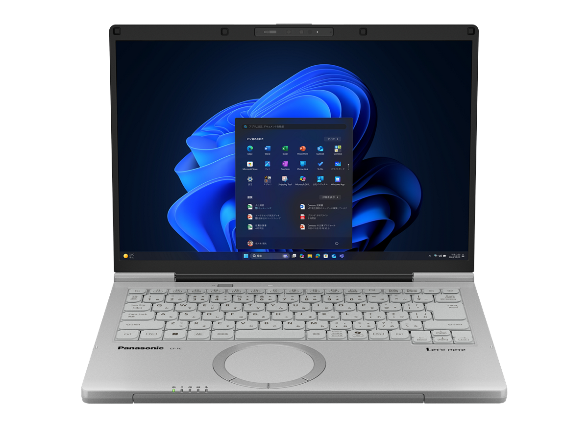
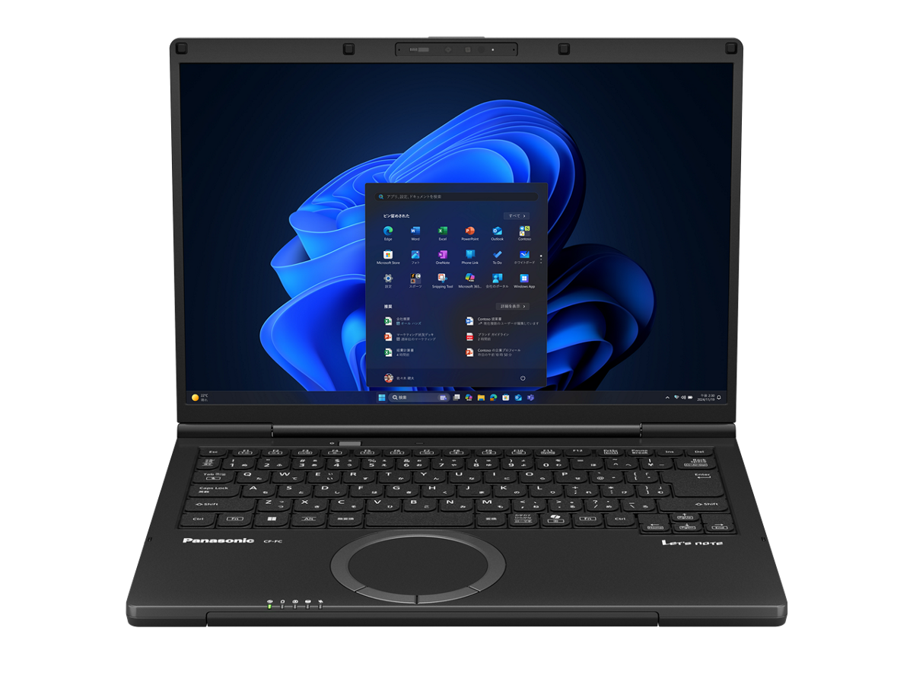

# レッツノート CF-FC6 スペック・仕様一覧

[English](../../en/CF-FC6/) · **日本語** · [中文](../../zh/CF-FC6/)

🗄️ [レッツノート陳列棚](https://letsnote-specs.github.io/ja/CF-FC6/)でこの機種を見る

パナソニック レッツノート **CF-FC6**の全3品番のスペック・仕様をまとめたページです。各品番の公式仕様表へのリンクも掲載しています。

*レッツノート CF-FC6（CF-FC6ADMCR, CF-FC6ADTCR）・カームグレイ。画像 © Panasonic*

## 品番一覧

| 品番 | 発売 | 生産終了 | 主な仕様 |
| :-- | :-- | :-- | :-- |
| [CF-FC6ADMCR](https://panasonic.jp/pc/p-db/CF-FC6ADMCR_spec.html) | — | 発売中 | — |
| [CF-FC6ADTCR](https://panasonic.jp/pc/p-db/CF-FC6ADTCR_spec.html) | — | 発売中 | — |
| [CF-FC6BDPCR](https://panasonic.jp/pc/p-db/CF-FC6BDPCR_spec.html) | — | 発売中 | — |

## 共通仕様

| 項目 | 仕様 |
| :-- | :-- |
| 搭載OS | Windows 11 Pro |
| チップセット | CPUに内蔵 |
| 光学式ドライブ | 搭載されていません |
| 表示方式 | 14.0型(16:10)WUXGA TFTカラー液晶 （1920 x 1200ドット）アンチグレア / 外部ディスプレイ表示 最大：3840×2160（30 Hz/60 Hz/120Hz/144Hz） / 本体＋外部ディスプレイ同時表示 最大：1920×1200：約1677万色 |
| 無線LAN | Wi-Fi 6E対応 IEEE802.11a/b/g/n/ac/ax(6GHz帯含む) 準拠 （5GHzチャンネル帯：W52/W53/W56）WPA3、WPA2-AES/TKIP対応 |
| ワイヤレスWAN | 搭載されていません |
| LAN | 1000BASE-T/100BASE-TX/10BASE-T |
| Bluetooth | Bluetooth v5.3 / ■対応プロファイル / 【Classic】 / ・A2DP（Source） / ・AVRCP（Target） / ・HCRP（Client） / ・HFP（AG） / ・HID（Host） / ・OPP（ClientおよびServer） / ・PAN（User） / ・SPP（DevAおよびDevB） / 【Low Energy】 / ・HOGP（Host） |
| サウンド機能 | PCM音源（24ビットステレオ）、インテル® High Definition Audio準拠、ステレオスピーカー(ボックス型スピーカー) |
| セキュリティ | Secured-Core PC対応 / セキュリティチップ：TPM（TCG V2.0準拠） / 指紋センサー：タッチ式、電源ボタン一体型 |
| セキュリティ(Windows Hello対応) | Windows Hello Enhanced Sign-in Security 対応 |
| 拡張メモリースロット | なし |
| カメラ | 有効画素数：FHD 1920×1080ピクセル（約207万画素）、30fps、 Windows Hello顔認証対応、プライバシーシャッター搭載、vHDR対応 |
| 内蔵マイク | アレイマイク |
| インターフェース | ・USB Type-Cポート（Thunderbolt™4対応、USB Power Delivery対応）×2 / ・USB Type-A(5Gbps)ポート×2（うち１つはスマホ充電対応を兼ねる） / ・LANコネクター（RJ-45） / ・HDMI出力端子（4K144Hz出力対応） / ・ヘッドセット端子（マイク入力＋オーディオ出力）（ヘッドセットミニジャック3.5mm(M3))、CTIA準拠） |
| キーボード | OADG準拠キーボード（87キー）：キーピッチ19mm（横）/19mm（縦）（一部キーを除く） |
| ポインティングデバイス | 高精度タッチパッド対応ホイールパッド |
| 電源 | ▼ACアダプター(USB Power Delivery対応) / 入力：AC100V～240V(50Hz/60Hz) 、出力：DC 5V：最大3A、DC 9V：最大3A、DC 15V：最大3A、DC 20V：最大3.25A、電源コードは100V専用 / ▼バッテリーパック / 11.58V リチウムイオン・定格容量4772mAh |
| 消費電力 | 最大約65W |
| エネルギー消費効率 | 目標年度2022年度 12区分13.9［kWh/年］ |
| 達成率 | — |
| 駆動／充電時間 | ▼駆動時間 / （JEITA Ver.3.0） / 約11.5時間(動画再生時)、約26.1時間(アイドル時) / ▼充電時間 / 最大2.5時間(電源オフ時)／最大2.5時間(電源オン時) |
| 外形寸法(幅×奥行×高さ) | 幅約314.4mm×奥行き約223.4mm×高さ約19.9mm（突起部除く） |
| 質量(バッテリーを含む） | パソコン本体：約1.039kg（付属バッテリーパック(約285g）装着時） / ACアダプター：約140g（電源コード（約60g）、USB接続ケーブル（約36g）除く） |
| ソフトウェア | ・Microsoft® Edge / ・マカフィーリブセーフ（60日間 無料体験版） / ・i-フィルター for マルチデバイス (30日間無料お試し版) / ・Aptioセットアップ / ・PC-Diagnosticユーティリティ / ・PC情報ビューアー / ・Panasonic PC VVork / ・Panasonic AIデバイスコントローラー / ・Panasonic PC Hub |
| 付属品 | ACアダプター(USB Power Delivery対応)、バッテリーパック、取扱説明書 等 |

## 品番別の違い

| 品番 | CPU | メモリー | ストレージ | 質量 | 駆動時間 |
| :-- | :-- | :-- | :-- | :-- | :-- |
| CF-FC6ADMCR | Core Ultra 5 225U | 16GB LPDDR5X SDRAM | 512GB | 1.039 kg | 11.5 h |
| CF-FC6ADTCR | Core Ultra 5 225U | 16GB LPDDR5X SDRAM | 512GB | 1.039 kg | 11.5 h |
| CF-FC6BDPCR | Core Ultra 7 255H | 32GB LPDDR5X SDRAM | 1TB | 1.039 kg | 11.5 h |

CF-FC6ADMCR の仕様の違い（すべて）

| 項目 | 仕様 |
| :-- | :-- |
| CPU | インテル® Core™ Ultra 5 プロセッサー 225U / P-core：最大ターボ周波数4.80 GHz / E-core：最大ターボ周波数3.80 GHz / 低消費電力 E-core：最大ターボ周波数2.40 GHz / コア数：12コア/キャッシュ：12MB |
| メインメモリー | 16GB LPDDR5X SDRAM（拡張スロットなし） |
| ストレージ | SSD：512GB（PCIe） / 上記容量のうち約15GBをリカバリー領域、約1GBをシステム領域として使用（ユーザー使用不可） |
| 表示方式 / グラフィックアクセラレーター | インテル® グラフィックス（CPUに内蔵） |
| 本体カラー | カームグレイ |
| Microsoft Office | Microsoft 365 Basic + Office Home & Business 2024 |

公式仕様表: <https://panasonic.jp/pc/p-db/CF-FC6ADMCR_spec.html>

CF-FC6ADTCR の仕様の違い（すべて）

| 項目 | 仕様 |
| :-- | :-- |
| CPU | インテル® Core™ Ultra 5 プロセッサー 225U / P-core：最大ターボ周波数4.80 GHz / E-core：最大ターボ周波数3.80 GHz / 低消費電力 E-core：最大ターボ周波数2.40 GHz / コア数：12コア/キャッシュ：12MB |
| メインメモリー | 16GB LPDDR5X SDRAM（拡張スロットなし） |
| ストレージ | SSD：512GB（PCIe） / 上記容量のうち約15GBをリカバリー領域、約1GBをシステム領域として使用（ユーザー使用不可） |
| 表示方式 / グラフィックアクセラレーター | インテル® グラフィックス（CPUに内蔵） |
| 本体カラー | カームグレイ |

公式仕様表: <https://panasonic.jp/pc/p-db/CF-FC6ADTCR_spec.html>

CF-FC6BDPCR の仕様の違い（すべて）

| 項目 | 仕様 |
| :-- | :-- |
| CPU | インテル® Core™ Ultra 7 プロセッサー 255H / P-core：最大ターボ周波数5.10 GHz / E-core：最大ターボ周波数4.40 GHz / 低消費電力 E-core：最大ターボ周波数2.50 GHz / コア数：16コア/キャッシュ：24MB |
| メインメモリー | 32GB LPDDR5X SDRAM（拡張スロットなし） |
| ストレージ | SSD：1TB（PCIe） / 上記容量のうち約15GBをリカバリー領域、約1GBをシステム領域として使用（ユーザー使用不可） |
| 表示方式 / グラフィックアクセラレーター | インテル® Arc™ グラフィックス（CPUに内蔵） |
| 本体カラー | ブラック |
| Microsoft Office | Microsoft 365 Basic + Office Home & Business 2024 |

公式仕様表: <https://panasonic.jp/pc/p-db/CF-FC6BDPCR_spec.html>

## 写真

*レッツノート CF-FC6（CF-FC6BDPCR）・ブラック。画像 © Panasonic*

## 関連機種

- [レッツノート全機種一覧](../)

---

出典：パナソニック公式[生産終了品一覧](https://panasonic.jp/pc/support/products/)および各品番の仕様表（panasonic.jp）。製品画像 © Panasonic。本ページは非公式のまとめであり、パナソニックとは関係ありません。
