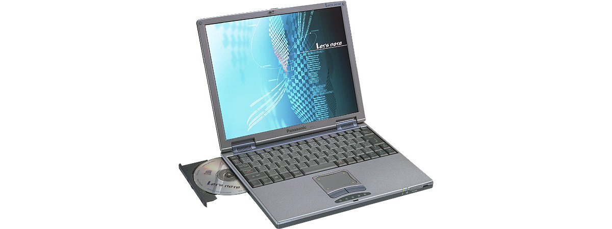

# レッツノート CF-L1 スペック・仕様一覧

[English](../../en/CF-L1/) · **日本語** · [中文](../../zh/CF-L1/)

パナソニック レッツノート **CF-L1**（L1シリーズ・13.3型XGA液晶）の全7品番（1999-11 – 2000-09発売）のスペック・仕様をまとめたページです。各品番の公式仕様表へのリンクも掲載しています。

*レッツノート CF-L1（CF-L1GA, CF-L1XR, CF-L1XA, CF-L1XS …）。画像 © Panasonic*

## 品番一覧

| 品番 | 発売 | 生産終了 | 主な仕様 |
| :-- | :-- | :-- | :-- |
| [CF-L1GA](https://panasonic.jp/pc/p-db/CF-L1GA_spec.html) | 2000-09 | 2000-09 | PentiumIII(500MHz)、HDD：10GB、CD-ROM、LAN、Office2000、Windows Me |
| [CF-L1XS](https://panasonic.jp/pc/p-db/CF-L1XS_spec.html) | 2000-07 | 2000-07 | Celeron(450MHz)、HDD：10GB、CD-ROM、LAN、Windows 98SE |
| [CF-L1XR](https://panasonic.jp/pc/p-db/CF-L1XR_spec.html) | 2000-06 | 2000-07 | PentiumIII(600MHz)LV、HDD：20GB、CD-ROM、LAN、Windows 98SE |
| [CF-L1XA](https://panasonic.jp/pc/p-db/CF-L1XA_spec.html) | 2000-05 | 2000-08 | PentiumIII(450MHz)、HDD：10GB、CD-ROM、Office2000、Windows 98SE |
| [CF-L1ER](https://panasonic.jp/pc/p-db/CF-L1ER_spec.html) | 2000-03 | 2000-04 | PentiumIII(500MHz)LV、HDD：8.1GB、CD-ROM、LAN、Windows 98SE |
| [CF-L1EA](https://panasonic.jp/pc/p-db/CF-L1EA_spec.html) | 2000-02 | 2000-04 | Celeron(450MHz)、HDD：8.1GB、CD-ROM、Office2000、Windows 98SE |
| [CF-L1A](https://panasonic.jp/pc/p-db/CF-L1A_spec.html) | 1999-11 | 1999-12 | Celeron(400MHz)、HDD：6GB、CD-ROM、Windows 98SE |

## 共通仕様

| 項目 | 仕様 |
| :-- | :-- |
| メインメモリー | 標準 64MB SDRAM (最大 192MB) |
| ビデオメモリー | 4MB |
| 光学式ドライブ | CD-ROMドライブ :最大24倍速・着脱式 |
| フロッピーディスクドライブ(オプション) | 外付け USB接続 3.5型 3モード対応 (1.44MB /1.2MB /720KB) |
| マルチベイ | CD-ROMドライブ(標準添付)、バッテリーパックアダプターセット(オプション)を交換可 |
| 表示方式 | XGA(1024×768ドット) 13.3型TFTカラー液晶 |
| 表示方式 / LCD表示 | 1024×768ドット :約1600万色 ※2 |
| 表示方式 / 外部ディスプレイ出力 | 640×480、800×600、1024×768ドット :約1600万色 |
| 表示方式 / 本体＋外部ディスプレイ同時表示 | 640×480、800×600、1024×768ドット :約1600万色 ※2 |
| 表示方式 / デュアルディスプレイ表示(例) | 内部LCD 1024×768ドット :65536色 － 外部ディスプレイ 1024×768ドット :約1600万色 |
| モデム | 本体内蔵 データ :56kbps (V.90/X2自動対応) FAX :14.4kbps /ボイス非対応 (RJ-11) ※3 |
| サウンド機能 | PCM音源 (16ビットステレオ)、スピーカー内蔵(ステレオ) |
| PCカードスロット | PCカード(TypeII×1スロット)、CardBus対応 |
| 拡張メモリースロット | 144ピンDIMM専用スロット×1 (64MB /128MB) |
| インターフェース / 音声 | マイク入力(モノラルミニジャック)、オーディオ出力(ステレオミニジャック) |
| インターフェース / USBコネクター | 4ピン |
| インターフェース / シリアルコネクター | Dsub 9ピン |
| インターフェース / パラレルコネクター | Dsub 25ピン |
| インターフェース / 外部ディスプレイコネクター | アナログRGB ミニDsub 15ピン |
| インターフェース / マウス／外部キーボード | ミニDin 6ピン |
| キーボード | OADG準拠キーボード (86キー) :キーピッチ 19mm |
| 電源 | AC 100V-240V (50Hz/60Hz)(ACコードは100V専用)、 / 標準バッテリーパック／バッテリーパックアダプターセット<別売>(リチウムイオン) |
| 消費電力 | 約50W |
| 外形寸法(幅×奥行×高さ) | 297mm × 236.5mm × 24.0mm(前部)・26.3mm(後部) (突起部除く) |

## 品番別の違い

| 品番 | CPU | メモリー | ストレージ | 質量 | 駆動時間 |
| :-- | :-- | :-- | :-- | :-- | :-- |
| CF-L1GA | Pentium III 500MHz | 64MB SDRAM | 10GB | 2.0 kg | 3.0 h |
| CF-L1XS | Celeron 450MHz | 64MB SDRAM | 10GB | 1.97 kg | 3.0 h |
| CF-L1XR | 低電圧版Pentium III 600MHz | 64MB SDRAM | 20GB | 1.97 kg | 3.5 h |
| CF-L1XA | Pentium III 450MHz | 64MB SDRAM | 10GB | 1.97 kg | 3.5 h |
| CF-L1ER | 低電圧版Pentium III 500MHz | 64MB SDRAM | 8.1GB | 1.97 kg | 3.5 h |
| CF-L1EA | Celeron 450MHz | 64MB SDRAM | 8.1GB | 1.97 kg | 3.5 h |
| CF-L1A | Celeron 400MHz | 64MB SDRAM | 6.0GB | 1.97 kg | 3.5 h |

CF-L1GA の仕様の違い（すべて）

| 項目 | 仕様 |
| :-- | :-- |
| CPU | モバイル Intel(R) Pentium(R) III プロセッサ 500MHz (システムバスクロック : 100MHz) |
| チップセット | Intel(R) 440MX PCIset |
| ２次キャッシュメモリー | 256KB |
| グラフィックチップ | Silicon Motion(R), Inc.製 Lynx EM4 SM710 |
| ハードディスクドライブ | 10GB (UltraATA) ※1 |
| LAN | 本体内蔵 100BASE-TX /10BASE-T (RJ-45) ※4 |
| インターフェース / 赤外線通信 | IrDA Ver1.1 :最大 4Mbps ※5 |
| ポインティングデバイス | スマートポインターIV |
| エネルギー消費効率 | S区分 0.0013 ※6 |
| バッテリー | 標準バッテリーパック / 駆動:約3.0時間 ※7 充電:約3.0時間(電源OFF時)、約5.0時間(電源ON時)※8 / 標準＋バッテリーパックアダプターセット<別売> / 駆動:約6.0時間 ※7 充電:約6.0時間(電源OFF時)、約10.0時間(電源ON時)※8 |
| 質量(バッテリーを含む） | 約2.0kg (CD-ROMドライブ装着時) |
| ソフトウェア | Microsoft(R) Windows(R) Millennium Edition、 / Microsoft(R) Internet Explorer 5.5、 / Microsoft(R) IME 2000、 / Microsoft(R) Office 2000 Personal ◆※9、 / Adobe(R) Acrobat(R) Reader ◆、 / ウェブナビゲーター 2、 / インターネットスターター、 / イラストメール ※10、 / クイックラウンチャー、 / メール自動送受信、 / まいと～くFAX 2001 Lite ◆※11、 / 筆ぐるめV7.0 ◆、 / オンラインサインアップ (@nifty、DION、ODN) ◆ |
| 注意書き | ※1 HDD容量は1GB=1,000,000,000バイト表示。 / ※2 内部LCDについては、グラフィックアクセラレーターのディザリング機能により実現。 / ※3 日本国内NTTアナログ一般回線専用です。V.90とX2を自動判別して切り換わります。また、56kbpsはデータ受信時の理論値です。データ送信時は33.6kbpsが最大速度です。 / ※4 コネクターの形状によっては使用できないものがあります。 / ※5 赤外線通信ポートの有効距離は20～50cmとなります。4Mbps通信をサポートするソフトウエアは搭載されていません。 / ※6 エネルギー消費効率とは、省エネ法で定める測定方法により、測定された消費電力を省エネ法で定める複合理論性能で除したものです。 / ※7 LCDバックライト輝度最低時。動作環境・システム設定により変動します。 / ※8 完全放電したバッテリーを充電すると時間がかかる場合があります。電源が切れている状態でも電力を消費するので、放置するとバッテリー残量がなくなります。また、電源ONの充電時間は最短の場合です。コンピュータの動作状態により変動します。 / ※9 「Bookshelf Basic 2.0」はCD-ROM添付のみです。 / ※10 フォントの種類によって正しく表示されない場合があります。等幅フォントをお使いください。 / ※11 内蔵モデム以外では動作保証しておりません。ボイス機能には対応していません。 / ◆印のソフトウエアの操作に関するサポートは、各ソフトメーカーで行っております。 / / ●本パソコンはWindows Me 以外では動作保証しておりません。 / ●一般的にWindows Me用と表記されているソフト及び周辺機器の中には本パソコンで使用できないものがあります。ご購入に関しては、各ソフト及び周辺機器の販売元にご確認ください。 / ●付属のプロダクトリカバリーCD-ROMではOSのみの再インストールは行えません。 |

公式仕様表: <https://panasonic.jp/pc/p-db/CF-L1GA_spec.html>

CF-L1XS の仕様の違い（すべて）

| 項目 | 仕様 |
| :-- | :-- |
| CPU | モバイルIntel(R) Celeron(TM)プロセッサ 450MHz (システムバスクロック : 100MHz) |
| チップセット | Intel(R) 440MX Chipset |
| ２次キャッシュメモリー | 128KB |
| グラフィックチップ | Silicon Motion(R), Inc.製 Lynx EM4 SM710 |
| ハードディスクドライブ | 10GB (UltraATA) ※1 |
| LAN | 本体内蔵 100BASE-TX /10BASE-T (RJ-45) ※4 |
| インターフェース / 赤外線通信 | IrDA Ver1.1 :最大 4Mbps ※5 |
| ポインティングデバイス | スマートポインターIV |
| エネルギー消費効率 | S区分 0.0029 ※6 |
| バッテリー | 標準バッテリーパック / 駆動:約3.0時間 ※7 充電:約3.0時間(電源OFF時)、約5.0時間(電源ON時)※8 / 標準＋バッテリーパックアダプターセット<別売> / 駆動:約6.0時間 ※7 充電:約6.0時間(電源OFF時)、約10.0時間(電源ON時)※8 |
| 質量(バッテリーを含む） | 約1.97kg (CD-ROMドライブ装着時平均値) |
| ソフトウェア | Microsoft(R) Windows(R) 98 Second Edition、 / Microsoft(R) Internet Explorer 5.01、 / Microsoft(R) IME 98、 / Intellisync(R) for Notebooks ◆、 / Adobe(R) Acrobat(R) Reader 4 ◆、 / インターネットスターター、 / ウェブナビゲーター、 / イラストメール ※9、 / クイックラウンチャー、 / まいと～くFAX 2001 Lite ◆※10、 / 筆ぐるめ V7.0◆、 / オンラインサインアップ (@nifty、DION、KDD、ODN) ◆ |
| 注意書き | ※1 HDD容量は1GB=1,000,000,000バイト表示。 / ※2 内部LCDについては、グラフィックアクセラレーターのディザリング機能により実現。 / ※3 日本国内NTTアナログ一般回線専用です。V.90とX2を自動判別して切り換わります。また、56kbpsはデータ受信時の理論値です。データ送信時は33.6kbpsが最大速度です。 / ※4 コネクターの形状によっては使用できないものがあります。 / ※5 赤外線通信ポートの有効距離は20～50cmとなります。 / ※6 エネルギー消費効率とは、省エネ法で定める測定方法により、測定された消費電力を省エネ法で定める複合理論性能で除したものです。 / ※7 LCDバックライト輝度最低時。動作環境・システム設定により変動します。 / ※8 完全放電したバッテリーを充電すると時間がかかる場合があります。電源が切れている状態でも電力を消費するので、放置するとバッテリー残量がなくなります。また、電源ONの充電時間は最短の場合です。コンピュータの動作状態により変動します。 / ※9 フォントの種類によって正しく表示されない場合があります。等幅フォントをお使いください。 / ※10 内蔵モデム以外では動作保証しておりません。ボイス機能には対応していません。 / ◆印のソフトウエアの操作に関するサポートは、各ソフトメーカーで行っております。 / / ●本パソコンはWindows 98 Second Edition 以外では動作保証しておりません。 / ●一般的にWindows 98 Second Edition用と表記されているソフト及び周辺機器の中には本パソコンで使用できないものがあります。ご購入に関しては、各ソフト及び周辺機器の販売元にご確認ください。 / ●付属のプロダクトリカバリーCD-ROMではOSのみの再インストールは行えません。 |

公式仕様表: <https://panasonic.jp/pc/p-db/CF-L1XS_spec.html>

CF-L1XR の仕様の違い（すべて）

| 項目 | 仕様 |
| :-- | :-- |
| CPU | 低電圧版モバイルIntel(R) Pentium(R) III プロセッサ 600MHz (システムバスクロック : 100MHz) |
| チップセット | Intel(R) 440MX Chipset |
| ２次キャッシュメモリー | 256KB |
| グラフィックチップ | Silicon Motion(R), Inc.製 Lynx EM4 SM710 |
| ハードディスクドライブ | 20GB (UltraATA) ※1 |
| LAN | 本体内蔵 100BASE-TX /10BASE-T (RJ-45) ※4 |
| インターフェース / 赤外線通信 | IrDA Ver1.1 :最大 4Mbps ※5 |
| ポインティングデバイス | スマートポインターIV |
| エネルギー消費効率 | S区分 0.0011 ※6 |
| バッテリー | 標準バッテリーパック / 駆動:約3.5時間 ※7 充電:約3.0時間(電源OFF時)、約5.0時間(電源ON時)※8 / 標準＋バッテリーパックアダプターセット<別売> / 駆動:約7.0時間 ※7 充電:約6.0時間(電源OFF時)、約10.0時間(電源ON時)※8 |
| 質量(バッテリーを含む） | 約1.97kg (CD-ROMドライブ装着時平均値) |
| ソフトウェア | Microsoft(R) Windows(R) 98 Second Edition、 / Microsoft(R) Internet Explorer 5.01、 / Microsoft(R) IME 98、 / Intellisync(R) for Notebooks ◆、 / Adobe(R) Acrobat(R) Reader 4 ◆、 / インターネットスターター、 / ウェブナビゲーター、 / イラストメール ※9、 / クイックラウンチャー、 / メール自動送受信、 / まいと～くFAX 2001 Lite ◆※10、 / 筆ぐるめ V7.0 ◆、 / オンラインサインアップ(@nifty、DION、KDD、ODN) ◆ |
| 注意書き | ※1 HDD容量は1GB=1,000,000,000バイト表示。 / ※2 内部LCDについては、グラフィックアクセラレーターのディザリング機能により実現。 / ※3 日本国内NTTアナログ一般回線専用です。V.90とX2を自動判別して切り換わります。また、56kbpsはデータ受信時の理論値です。データ送信時は33.6kbpsが最大速度です。 / ※4 コネクターの形状によっては使用できないものがあります。 / ※5 赤外線通信ポートの有効距離は20～50cmとなります。 / ※6 エネルギー消費効率とは、省エネ法で定める測定方法により、測定された消費電力を省エネ法で定める複合理論性能で除したものです。 / ※7 LCDバックライト輝度最低時。動作環境・システム設定により変動します。 / ※8 完全放電したバッテリーを充電すると時間がかかる場合があります。電源が切れている状態でも電力を消費するので、放置するとバッテリー残量がなくなります。また、電源ONの充電時間は最短の場合です。コンピュータの動作状態により変動します。 / ※9 フォントの種類によって正しく表示されない場合があります。等幅フォントをお使いください。 / ※10 内蔵モデム以外では動作保証しておりません。ボイス機能には対応していません。 / ◆印のソフトウエアの操作に関するサポートは、各ソフトメーカーで行っております。 / / ●本パソコンはWindows 98 Second Edition 以外では動作保証しておりません。 / ●一般的にWindows 98 Second Edition用と表記されているソフト及び周辺機器の中には本パソコンで使用できないものがあります。ご購入に関しては、各ソフト及び周辺機器の販売元にご確認ください。 / ●付属のプロダクトリカバリーCD-ROMではOSのみの再インストールは行えません。 |

公式仕様表: <https://panasonic.jp/pc/p-db/CF-L1XR_spec.html>

CF-L1XA の仕様の違い（すべて）

| 項目 | 仕様 |
| :-- | :-- |
| CPU | モバイル Intel(R) Pentium(R) III プロセッサ 450MHz (システムバスクロック : 100MHz) |
| チップセット | Intel(R) 440MX Chipset |
| ２次キャッシュメモリー | 256KB |
| グラフィックチップ | Silicon Motion(R), Inc.製 Lynx EM4 SM710 |
| ハードディスクドライブ | 10GB (UltraATA) ※1 |
| インターフェース / 赤外線通信 | IrDA Ver1.1 :最大 4Mbps ※4 |
| ポインティングデバイス | スマートポインターIV |
| エネルギー消費効率 | S区分 0.0014 ※5 |
| バッテリー | 標準バッテリーパック / 駆動:約3.5時間 ※6 充電:約3.0時間(電源OFF時)、約5.0時間(電源ON時)※7 / 標準＋バッテリーパックアダプターセット<別売> / 駆動:約7.0時間 ※6 充電:約6.0時間(電源OFF時)、約10.0時間(電源ON時)※7 |
| 質量(バッテリーを含む） | 約1.97kg (CD-ROMドライブ装着時平均値) |
| ソフトウェア | Microsoft(R) Windows(R) 98 Second Edition、 / Microsoft(R) Internet Explorer 5.01、 / Microsoft(R) Office 2000 Personal ◆※8、 / Microsoft(R) IME 2000 ◆、 / Intellisync(R) for Notebooks ◆、 / Adobe(R) Acrobat(R) Reader 4 ◆、 / インターネットスターター、 / ウェブナビゲーター、 / イラストメール ※9、 / クイックラウンチャー、 / メール自動送受信、 / まいと～くFAX 2001 Lite ◆※10、 / 筆ぐるめ V7.0◆、 / オンラインサインアップ (@nifty、DION、KDD、ODN) ◆ |
| 注意書き | ※1 HDD容量は1GB=1,000,000,000バイト表示。 / ※2 内部LCDについては、グラフィックアクセラレーターのディザリング機能により実現。 / ※3 日本国内NTTアナログ一般回線専用です。V.90とX2を自動判別して切り換わります。また、56kbpsはデータ受信時の理論値です。データ送信時は33.6kbpsが最大速度です。 / ※4 赤外線通信ポートの有効距離は20～50cmとなります。 / ※5 エネルギー消費効率とは、省エネ法で定める測定方法により、測定された消費電力を省エネ法で定める複合理論性能で除したものです。 / ※6 LCDバックライト輝度最低時。動作環境・システム設定により変動します。 / ※7 完全放電したバッテリーを充電すると時間がかかる場合があります。電源が切れている状態でも電力を消費するので、放置するとバッテリー残量がなくなります。また、電源ONの充電時間は最短の場合です。コンピュータの動作状態により変動します。 / ※8 「Bookshelf Basic 2.0」はCD-ROM添付のみです。 / ※9 フォントの種類によって正しく表示されない場合があります。等幅フォントをお使いください。 / ※10 内蔵モデム以外では動作保証しておりません。ボイス機能には対応していません。 / ◆印のソフトウエアの操作に関するサポートは、各ソフトメーカーで行っております。 / / ●本パソコンはWindows 98 Second Edition 以外では動作保証しておりません。 / ●一般的にWindows 98 Second Edition用と表記されているソフト及び周辺機器の中には本パソコンで使用できないものがあります。ご購入に関しては、各ソフト及び周辺機器の販売元にご確認ください。 / ●付属のプロダクトリカバリーCD-ROMではOSのみの再インストールは行えません。 |

公式仕様表: <https://panasonic.jp/pc/p-db/CF-L1XA_spec.html>

CF-L1ER の仕様の違い（すべて）

| 項目 | 仕様 |
| :-- | :-- |
| CPU | 低電圧版モバイルIntel(R) Pentium(R) III プロセッサ 500MHz (システムバスクロック : 100MHz) |
| チップセット | Intel(R) 440MX Chipset |
| ２次キャッシュメモリー | 256KB |
| グラフィックチップ | Silicon Motion(R), Inc.製 Lynx EM4 SM710 |
| ハードディスクドライブ | 8.1GB (UltraATA) ※1 |
| LAN | 本体内蔵 100BASE-TX /10BASE-T (RJ-45) ※4 |
| インターフェース / 赤外線通信 | IrDA Ver1.1 :最大 4Mbps ※5 |
| ポインティングデバイス | スマートポインターIII |
| エネルギー消費効率 | S区分 0.0013 ※6 |
| バッテリー | 標準バッテリーパック / 駆動:約3.5時間 ※7 充電:約3.0時間(電源OFF時)、約5.0時間(電源ON時)※8 / 標準＋バッテリーパックアダプターセット<別売> / 駆動:約7.0時間 ※7 充電:約6.0時間(電源OFF時)、約10.0時間(電源ON時)※8 |
| 質量(バッテリーを含む） | 約1.97kg (CD-ROMドライブ装着時平均値) |
| ソフトウェア | Microsoft(R) Windows(R) 98 Second Edition、 / Microsoft(R) Internet Explorer 5、 / Microsoft(R) IME 98、 / Intellisync(R) for Notebooks ◆、 / Adobe(R) Acrobat(R) Reader 4.0 ◆、 / インターネットスターター、 / ウェブナビゲーター、 / イラストメール ※9、 / クイックラウンチャー、 / まいと～くFAX 2001 Lite ◆※10、 / 筆ぐるめ V7.0◆、 / @niftyでインターネット ◆、 / オンラインサインアップ (DION、KDD、ODN) ◆ |
| 注意書き | ※1 HDD容量は1GB=1,000,000,000バイト表示。 / ※2 内部LCDについては、グラフィックアクセラレーターのディザリング機能により実現。 / ※3 日本国内NTTアナログ一般回線専用です。V.90とX2を自動判別して切り換わります。また、56kbpsはデータ受信時の理論値です。データ送信時は33.6kbpsが最大速度です。 / ※4 コネクターの形状によっては使用できないものがあります。 / ※5 赤外線通信ポートの有効距離は20～50cmとなります。 / ※6 エネルギー消費効率とは、省エネ法で定める測定方法により、測定された消費電力を省エネ法で定める複合理論性能で除したものです。 / ※7 LCDバックライト輝度最低時。動作環境・システム設定により変動します。 / ※8 完全放電したバッテリーを充電すると時間がかかる場合があります。電源が切れている状態でも電力を消費するので、放置するとバッテリー残量がなくなります。また、電源ONの充電時間は最短の場合です。コンピュータの動作状態により変動します。 / ※9 フォントの種類によって正しく表示されない場合があります。等幅フォントをお使いください。 / ※10 内蔵モデム以外では動作保証しておりません。ボイス機能には対応していません。 / ◆印のソフトウエアの操作に関するサポートは、各ソフトメーカーで行っております。 / / ●本パソコンはWindows 98 Second Edition 以外では動作保証しておりません。 / ●一般的にWindows 98 Second Edition用と表記されているソフト及び周辺機器の中には本パソコンで使用できないものがあります。ご購入に関しては、各ソフト及び周辺機器の販売元にご確認ください。 / ●付属のプロダクトリカバリーCD-ROMではOSのみの再インストールは行えません。 |

公式仕様表: <https://panasonic.jp/pc/p-db/CF-L1ER_spec.html>

CF-L1EA の仕様の違い（すべて）

| 項目 | 仕様 |
| :-- | :-- |
| CPU | モバイルIntel(R) Celeron(TM)プロセッサ 450MHz (システムバスクロック : 100MHz) |
| チップセット | Intel(R) 440MX Chipset |
| ２次キャッシュメモリー | 128KB |
| グラフィックチップ | Silicon Motion(R), Inc.製 Lynx EM4 SM710 |
| ハードディスクドライブ | 8.1GB (UltraATA) ※1 |
| インターフェース / 赤外線通信 | IrDA Ver1.1 :最大 4Mbps ※4 |
| ポインティングデバイス | スマートポインターIII |
| エネルギー消費効率 | S区分 0.0029 ※6 |
| バッテリー | 標準バッテリーパック / 駆動:約3.5時間 ※7 充電:約3.0時間(電源OFF時)、約5.0時間(電源ON時)※8 / 標準＋バッテリーパックアダプターセット<別売> / 駆動:約7.0時間 ※7 充電:約6.0時間(電源OFF時)、約10.0時間(電源ON時)※8 |
| 質量(バッテリーを含む） | 約1.97kg (CD-ROMドライブ装着時平均値) |
| ソフトウェア | Microsoft(R) Windows(R) 98 Second Edition、 / Microsoft(R) Internet Explorer 5、 / Microsoft(R) IME 2000、 / Microsoft(R) Office 2000 Personal ◆※10、 / Intellisync(R) for Notebooks ◆、 / Adobe(R) Acrobat(R) Reader 4.0 ◆、 / インターネットスターター、 / ウェブナビゲーター、 / イラストメール ※11、 / クイックラウンチャー、 / まいと～くFAX 2001 Lite ◆※12、 / 筆ぐるめ V7.0◆、 / @niftyでインターネット ◆、 / オンラインサインアップ(DION、KDD、ODN) ◆ |
| 注意書き | ※1 HDD容量は1GB=1,000,000,000バイト表示。 / ※2 内部LCDについては、グラフィックアクセラレーターのディザリング機能により実現。 / ※3 日本国内NTTアナログ一般回線専用です。V.90とX2を自動判別して切り換わります。また、56kbpsはデータ受信時の理論値です。データ送信時は33.6kbpsが最大速度です。 / ※4 コネクターの形状によっては使用できないものがあります。 / ※5 赤外線通信ポートの有効距離は20～50cmとなります。 / ※6 エネルギー消費効率とは、省エネ法で定める測定方法により、測定された消費電力を省エネ法で定める複合理論性能で除したものです。 / ※7 LCDバックライト輝度最低時。動作環境・システム設定により変動します。 / ※8 完全放電したバッテリーを充電すると時間がかかる場合があります。電源が切れている状態でも電力を消費するので、放置するとバッテリー残量がなくなります。また、電源ONの充電時間は最短の場合です。コンピュータの動作状態により変動します。 / ※9 「Bookshelf Basic 2.0」はCD-ROM添付のみです。 / ※10 フォントの種類によって正しく表示されない場合があります。等幅フォントをお使いください。 / ※11 内蔵モデム以外では動作保証しておりません。ボイス機能には対応していません。 / ◆印のソフトウエアの操作に関するサポートは、各ソフトメーカーで行っております。 / / ●本パソコンはWindows 98 Second Edition 以外では動作保証しておりません。 / ●一般的にWindows 98 Second Edition用と表記されているソフト及び周辺機器の中には本パソコンで使用できないものがあります。ご購入に関しては、各ソフト及び周辺機器の販売元にご確認ください。 / ●付属のプロダクトリカバリーCD-ROMではOSのみの再インストールは行えません。 |

公式仕様表: <https://panasonic.jp/pc/p-db/CF-L1EA_spec.html>

CF-L1A の仕様の違い（すべて）

| 項目 | 仕様 |
| :-- | :-- |
| CPU | モバイルIntel(R) Celeron(TM)プロセッサ 400MHz |
| チップセット | Intel(R) 440MX Chipset |
| ２次キャッシュメモリー | 128KB |
| グラフィックチップ | Silicon Motion(R), Inc.製 Lynx EM4 |
| ハードディスクドライブ | 6.0GB (UltraATA) ※1 |
| インターフェース / 赤外線通信 | IrDA Ver1.1 :最大 4Mbps ※4 |
| ポインティングデバイス | スマートポインターIII |
| エネルギー消費効率 | スタンバイモード時 : 約1.5W ※5 |
| バッテリー | 標準バッテリーパック / 駆動:約3.5時間 ※6 充電:約3.0時間(電源OFF時)、約5.0時間(電源ON時)※7 / 標準＋バッテリーパックアダプターセット<別売> / 駆動:約7.0時間 ※6 充電:約6.0時間(電源OFF時)、約10.0時間(電源ON時)※7 |
| 質量(バッテリーを含む） | 約1.97kg (CD-ROMドライブ装着時) |
| ソフトウェア | Microsoft(R) Windows(R) 98 Second Edition、 / Microsoft(R) Internet Explorer5.0、 / Microsoft(R) IME 2000、 / Microsoft(R) Office 2000 Personal ◆※8、 / Intellisync(R) for Notebooks ◆、 / Adobe(R) Acrobat(R) Reader 4.0J ◆、 / インターネットスターター、 / ウェブナビゲーター、 / イラストメール ※9、 / クイックラウンチャー、 / まいと～くFAX V3 Lite ◆※10、 / 筆ぐるめ◆、 / Phoenix PowerPanel(TM)、 / ニフティサーブでインターネット ◆、 / オンラインサインアップ(DION、ODN) ◆ |
| 注意書き | ※1 HDD容量は1GB=1,000,000,000バイト表示。 / ※2 内部LCDについては、グラフィックアクセラレーターのディザリング機能により実現。 / ※3 日本国内NTTアナログ一般回線専用です。V.90とX2を自動判別して切り換わります。また、56kbpsはデータ受信時の理論値です。データ送信時は33.6kbpsが最大速度です。 / ※4 赤外線通信ポートの有効距離は20～50cmとなります。 / ※5 省エネ法に基づくエネルギー消費効率。 / ※6 LCDバックライト輝度最低時。動作環境・システム設定により変動します。 / ※7 完全放電したバッテリーを充電すると時間がかかる場合があります。電源が切れている状態でも電力を消費するので、放置するとバッテリー残量がなくなります。また、電源ONの充電時間は最短の場合です。コンピュータの動作状態により変動します。 / ※8 「Bookshelf Basic 2.0」はCD-ROM添付のみです。 / ※9 フォントの種類によって正しく表示されない場合があります。等幅フォントをお使いください。 / ※10 内蔵モデム以外では動作保証しておりません。ボイス機能には対応していません。 / ◆印のソフトウエアの操作に関するサポートは、各ソフトメーカーで行っております。 / / ●本パソコンはWindows 98 Second Edition 以外では動作保証しておりません。 / ●一般的にWindows 98 Second Edition用と表記されているソフト及び周辺機器の中には本パソコンで使用できないものがあります。ご購入に関しては、各ソフト及び周辺機器の販売元にご確認ください。 / ●付属のプロダクトリカバリーCD-ROMではOSのみの再インストールは行えません。 |

公式仕様表: <https://panasonic.jp/pc/p-db/CF-L1A_spec.html>

## 関連機種

- [レッツノート全機種一覧](../)

---

出典：パナソニック公式[生産終了品一覧](https://panasonic.jp/pc/support/products/)および各品番の仕様表（panasonic.jp）。製品画像 © Panasonic。本ページは非公式のまとめであり、パナソニックとは関係ありません。
