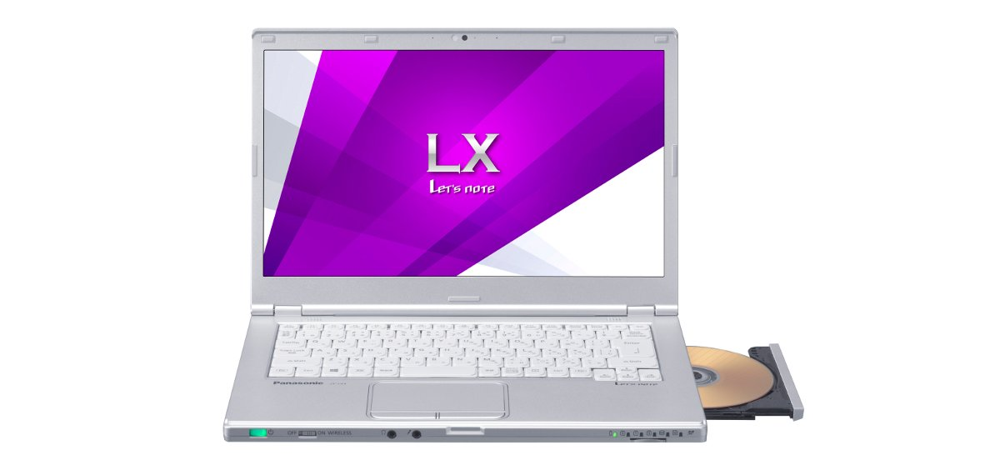
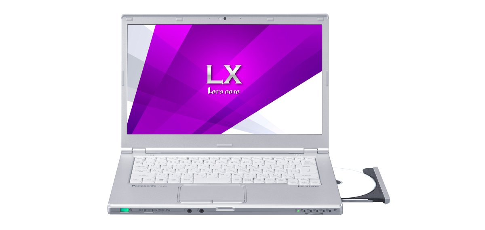
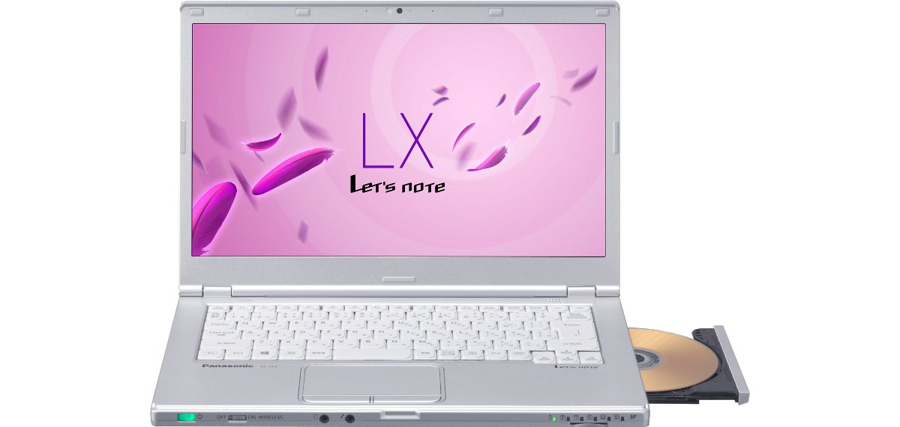
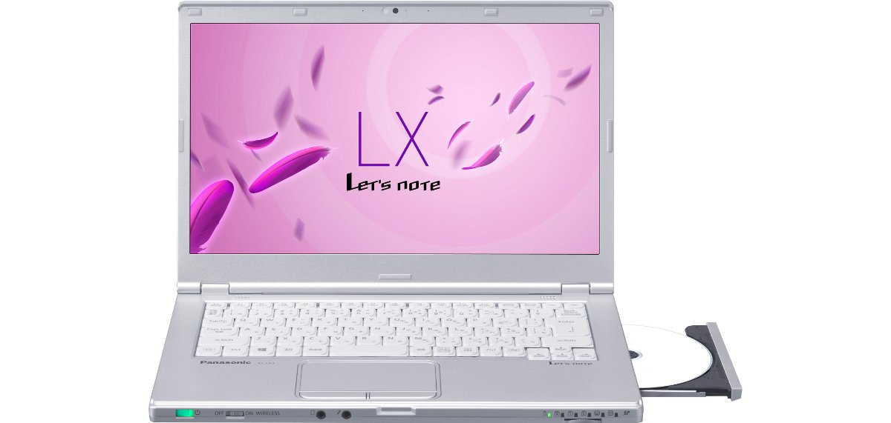
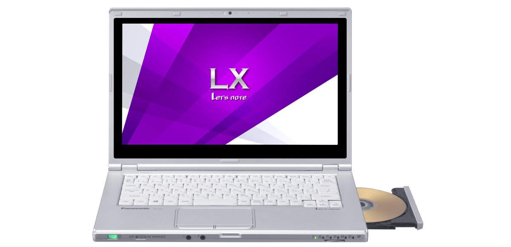
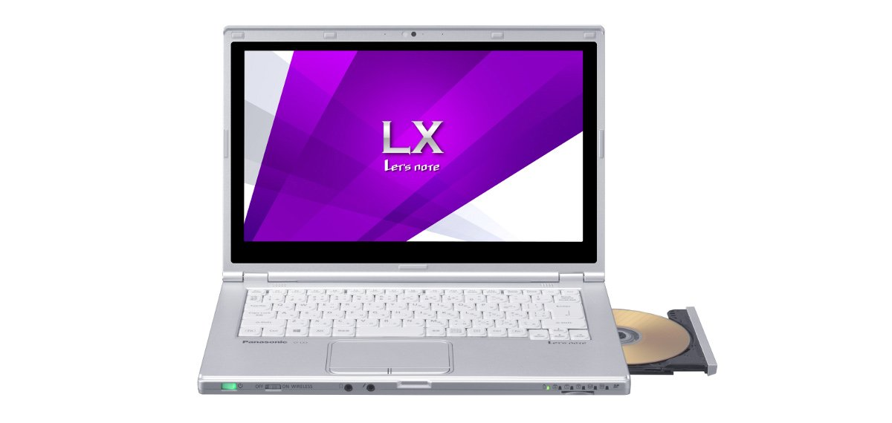
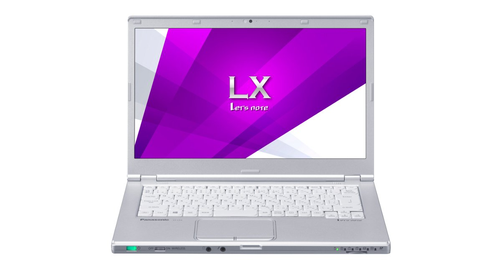

# レッツノート CF-LX3 スペック・仕様一覧

[English](../../en/CF-LX3/) · **日本語** · [中文](../../zh/CF-LX3/)

🗄️ [レッツノート陳列棚](https://letsnote-specs.github.io/ja/CF-LX3/)でこの機種を見る

パナソニック レッツノート **CF-LX3**（LXシリーズ・13.3型HD/14型HD+液晶）の全19品番（2013-09 – 2014-10発売）のスペック・仕様をまとめたページです。各品番の公式仕様表へのリンクも掲載しています。

*レッツノート CF-LX3（CF-LX3JEJJR, CF-LX3JEABR, CF-LX3JEAWR, CF-LX3SEJJR …）・シルバー。画像 © Panasonic*

## 品番一覧

| 品番 | 発売 | 生産終了 | 主な仕様 |
| :-- | :-- | :-- | :-- |
| [CF-LX3DDABR](https://panasonic.jp/pc/p-db/CF-LX3DDABR_spec.html) | 2014-10 | 2015-06 | Windows 8.1 Pro Update 64ビット、Intel® CoreTM i5-4210U プロセッサー、メモリー：8GB（空きスロットなし）、HDD：500GB、スーパーマルチドライブ、LAN、無線LAN 802.11a(W52/W53/W56)/b/g/n/ac、Microsoft® Office Home and Business Premium |
| [CF-LX3ZD9BR](https://panasonic.jp/pc/p-db/CF-LX3ZD9BR_spec.html) | 2014-10 | 2015-06 | Windows 8.1 Pro Update 64ビット、Intel® CoreTM i5-4510U プロセッサー、メモリー：8GB（空きスロットなし）、SSD：256GB、ブルーレイディスクドライブ、LAN、無線LAN 802.11a(W52/W53/W56)/b/g/n/ac、Microsoft® Office Home and Business Premium |
| [CF-LX3DDAWR](https://panasonic.jp/pc/p-db/CF-LX3DDAWR_spec.html) | 2014-10 | 2015-06 | Windows 7 Professional 64ビット、Intel® CoreTM i5-4210U プロセッサー、メモリー：8GB（空きスロットなし）、HDD：500GB、スーパーマルチドライブ、LAN、無線LAN 802.11a(W52/W53/W56)/b/g/n/ac、Microsoft® Office Home and Business Premium |
| [CF-LX3JHBJR](https://panasonic.jp/pc/p-db/CF-LX3JHBJR_spec.html) | 2014-05 | 2015-02 | Windows 8.1 Update 64ビット、インテル® CoreTM i5-4310U（2.00GHz）、メモリー：4GB（最大8GB）、HDD：500GB、スーパーマルチドライブ、LAN、無線LAN 802.11a(W52/W53/W56)/b/g/n/ac、Office Home and Business 2013 |
| [CF-LX3JEJJR](https://panasonic.jp/pc/p-db/CF-LX3JEJJR_spec.html) | 2014-05 | 2015-02 | Windows 8.1 Update 64ビット、インテル® CoreTM i5-4310U（2.00GHz）、メモリー：4GB（最大8GB）、HDD：500GB、スーパーマルチドライブ、LAN、無線LAN 802.11a(W52/W53/W56)/b/g/n/ac |
| [CF-LX3JEABR](https://panasonic.jp/pc/p-db/CF-LX3JEABR_spec.html) | 2014-05 | 2015-02 | Windows 8.1 Pro Update 64ビット、インテル® CoreTM i5-4310U（2.00GHz）、メモリー：4GB（最大8GB）、HDD：500GB、スーパーマルチドライブ、LAN、無線LAN 802.11a(W52/W53/W56)/b/g/n/ac、Office Home and Business 2013 |
| [CF-LX3VECBR](https://panasonic.jp/pc/p-db/CF-LX3VECBR_spec.html) | 2014-05 | 2015-02 | Windows 8.1 Pro Update 64ビット、インテル® CoreTM i7-4500U（1.80GHz）、メモリー：8GB（空きスロットなし）、SSD：256GB、ブルーレイディスクドライブ、LAN、無線LAN 802.11a(W52/W53/W56)/b/g/n/ac |
| [CF-LX3JEAWR](https://panasonic.jp/pc/p-db/CF-LX3JEAWR_spec.html) | 2014-05 | 2015-02 | Windows 7 Professional 64ビット、インテル® CoreTM i5-4310U（2.00GHz）、メモリー：4GB（最大8GB）、HDD：500GB、スーパーマルチドライブ、LAN、無線LAN 802.11a(W52/W53/W56)/b/g/n/ac、Office Home and Business 2013 |
| [CF-LX3SEJJR](https://panasonic.jp/pc/p-db/CF-LX3SEJJR_spec.html) | 2014-01 | 2014-05 | Windows 8.1 64ビット、インテル® CoreTM i5-4200U（1.60GHz）、メモリー：標準4GB（空きスロット1、最大8GB）、HDD：500GB、スーパーマルチドライブ、LAN、無線LAN 802.11a(W52/W53/W56)/b/g/n/ac |
| [CF-LX3SEABR](https://panasonic.jp/pc/p-db/CF-LX3SEABR_spec.html) | 2014-01 | 2014-05 | Windows 8.1 Pro 64ビット、インテル® CoreTM i5-4200U（1.60GHz）、メモリー：標準4GB（空きスロット1、最大8GB）、HDD：500GB、スーパーマルチドライブ、LAN、無線LAN 802.11a(W52/W53/W56)/b/g/n/ac、Office Home and Business 2013 |
| [CF-LX3SEAWR](https://panasonic.jp/pc/p-db/CF-LX3SEAWR_spec.html) | 2014-01 | 2014-05 | Windows 7 Professional 64ビット、インテル® CoreTM i5-4200U（1.60GHz）、メモリー：標準4GB（空きスロット1、最大8GB）、HDD：500GB、スーパーマルチドライブ、LAN、無線LAN 802.11a(W52/W53/W56)/b/g/n/ac、Office Home and Business 2013 |
| [CF-LX3TECBR](https://panasonic.jp/pc/p-db/CF-LX3TECBR_spec.html) | 2014-01 | 2014-05 | Windows 8.1 Pro 64ビット、インテル® CoreTM i7-4500U（1.80GHz）、メモリー：標準8GB（空きスロット0）、SSD：256GB、ブルーレイディスクドライブ、LAN、無線LAN 802.11a(W52/W53/W56)/b/g/n/ac |
| [CF-LX3YHBJR](https://panasonic.jp/pc/p-db/CF-LX3YHBJR_spec.html) | 2013-11 | 2014-04 | Windows 8.1 64ビット、インテル® CoreTM i5-4200U（1.60GHz）、メモリー：標準4GB（空きスロット1、最大8GB）、HDD：500GB、スーパーマルチドライブ、LAN、無線LAN 802.11a(W52/W53/W56)/b/g/n、Office Home and Business 2013 |
| [CF-LX3NECBR](https://panasonic.jp/pc/p-db/CF-LX3NECBR_spec.html) | 2013-09 | 2014-01 | Windows 8 Pro 64ビット、インテル® CoreTM i7-4500U（1.80GHz）、メモリー：8GB（空きスロット0）、SSD：256GB、ブルーレイディスクドライブ、LAN、無線LAN 802.11a(W52/W53/W56)/b/g/n |
| [CF-LX3NERBR](https://panasonic.jp/pc/p-db/CF-LX3NERBR_spec.html) | 2013-09 | 2014-01 | Windows 8 Pro 64ビット、インテル® CoreTM i7-4500U（1.80GHz）、メモリー：8GB（空きスロット0）、SSD：256GB、ブルーレイディスクドライブ、LAN、無線LAN 802.11a(W52/W53/W56)/b/g/n、Office Home and Business 2013 |
| [CF-LX3NEQBR](https://panasonic.jp/pc/p-db/CF-LX3NEQBR_spec.html) | 2013-09 | 2014-01 | Windows 8 Pro 64ビット、インテル® CoreTM i7-4500U（1.80GHz）、メモリー：標準4GB（空きスロット1、最大8GB）、SSD：256GB、スーパーマルチドライブ、LAN、無線LAN 802.11a(W52/W53/W56)/b/g/n |
| [CF-LX3NESBR](https://panasonic.jp/pc/p-db/CF-LX3NESBR_spec.html) | 2013-09 | 2014-01 | Windows 8 Pro 64ビット、インテル® CoreTM i7-4500U（1.80GHz）、メモリー：標準4GB（空きスロット1、最大8GB）、SSD：256GB、スーパーマルチドライブ、LAN、無線LAN 802.11a(W52/W53/W56)/b/g/n、Office Home and Business 2013 |
| CF-LX3NEXBR | 2013-09 | 2014-01 | Windows 8 Pro 64ビット、インテル® CoreTM i7-4500U（1.80GHz）、メモリー：標準4GB（空きスロット1、最大8GB）、SSD：256GB、LAN、無線LAN 802.11a(W52/W53/W56)/b/g/n |
| [CF-LX3YEABR](https://panasonic.jp/pc/p-db/CF-LX3YEABR_spec.html) | 2013-09 | 2014-01 | Windows 8 Pro 64ビット、インテル® CoreTM i5-4200U（1.60GHz）、メモリー：標準4GB（空きスロット1、最大8GB）、HDD：500GB、スーパーマルチドライブ、LAN、無線LAN 802.11a(W52/W53/W56)/b/g/n、Office Home and Business 2013 |

## 共通仕様

| 項目 | 仕様 |
| :-- | :-- |
| 表示方式 / グラフィックアクセラレーター | インテル HD グラフィックス4400（CPUに内蔵） |
| 表示方式 / 外部ディスプレイ出力 | 1024×768、1280×768、1280×1024、1360×768、1366×768、1400×1050、1600×900、1600×1200、1680×1050 、1920×1080、1920×1200ドット：約1677万色 |
| LAN | 1000BASE-T/100BASE-TX/10BASE-T |
| サウンド機能 | PCM音源（24ビットステレオ）、インテル High Definition Audio準拠、ステレオスピーカー |
| SDメモリーカードスロット | SDメモリーカード×1スロット（SDHCメモリーカード/SDXCメモリーカード対応/UHS-I高速転送対応/著作権保護技術対応） |
| 消費電力 | 最大約65W |
| 達成率 ( 2011年度基準 ) | — |
| 本体カラー | シルバー |

## 品番別の違い

| 品番 | CPU | メモリー | ストレージ | 質量 | 駆動時間 |
| :-- | :-- | :-- | :-- | :-- | :-- |
| CF-LX3DDABR | Core i5-4210U | 8GB DDR3L SDRAM 最大8GB | ハードディスクドライブ | 1.31 kg | 6 h |
| CF-LX3ZD9BR | Core i7-4510U | 8GB DDR3L SDRAM 最大8GB | 256GB | 1.395 kg | 14 h |
| CF-LX3DDAWR | Core i5-4210U | 8GB DDR3L SDRAM 最大8GB | ハードディスクドライブ | 1.31 kg | 6 h |
| CF-LX3JHBJR | Core i5-4310U | 4GB PC3L-12800 | ハードディスクドライブ | 1.46 kg | 6.5 h |
| CF-LX3JEJJR | Core i5-4310U | 4GB DDR3L SDRAM 最大8GB | ハードディスクドライブ | 1.34 kg | 6.5 h |
| CF-LX3JEABR | Core i5-4310U | 4GB DDR3L SDRAM 最大8GB | ハードディスクドライブ | 1.31 kg | 6.5 h |
| CF-LX3VECBR | Core i7-4500U | 8GB DDR3L SDRAM 最大8GB | 256GB | 1.395 kg | 14 h |
| CF-LX3JEAWR | Core i5-4310U | 4GB DDR3L SDRAM 最大8GB | ハードディスクドライブ | 1.31 kg | 6.5 h |
| CF-LX3SEJJR | Core i5-4200U | 4GB DDR3L SDRAM 最大8GB | ハードディスクドライブ | 1.34 kg | 10 h |
| CF-LX3SEABR | Core i5-4200U | 4GB DDR3L SDRAM 最大8GB | ハードディスクドライブ | 1.31 kg | 10 h |
| CF-LX3SEAWR | Core i5-4200U | 4GB DDR3L SDRAM 最大8GB | ハードディスクドライブ | 1.31 kg | 10 h |
| CF-LX3TECBR | Core i7-4500U | 8GB DDR3L SDRAM 最大8GB | 256GB | 1.395 kg | 22 h |
| CF-LX3YHBJR | 第四世代Core i5-4200U | 4GB PC3L-12800 | ハードディスクドライブ | 1.46 kg | 10 h |
| CF-LX3NECBR | 第四世代Core i7-4500U | 8GB PC3L-12800 | 256GB | 1.395 kg | 22 h |
| CF-LX3NERBR | 第四世代Core i7-4500U | 8GB PC3L-12800 | 256GB | 1.395 kg | 22 h |
| CF-LX3NEQBR | 第四世代Core i7-4500U | 4GB PC3L-12800 | 256GB | 1.225 kg | 11.5 h |
| CF-LX3NESBR | 第四世代Core i7-4500U | 4GB PC3L-12800 | 256GB | 1.225 kg | 11.5 h |
| CF-LX3YEABR | 第四世代Core i5-4200U | 4GB PC3L-12800 | ハードディスクドライブ | 1.31 kg | 10 h |

CF-LX3DDABR の仕様の違い（すべて）

| 項目 | 仕様 |
| :-- | :-- |
| 搭載OS | Windows 8.1 Pro Update 64ビット（日本語版） |
| CPU | インテル Core i5-4210Uプロセッサー / インテルスマートキャッシュ3MB、動作周波数1.7GHz（インテル ターボ・ブースト・テクノロジー2.0利用時は最大2.7GHz） |
| メインメモリー | 8GB DDR3L SDRAM 最大8GB （空きスロット0） |
| ビデオメモリー | 最大1792MB (メインメモリーと共用) |
| ハードディスクドライブ | ハードディスクドライブ（HDD）500GB（Serial ATA、5400rpm）上記容量のうち約16GBをリカバリー領域、約1GBをシステム領域として使用（ユーザー使用不可） |
| 光学式ドライブ | スーパーマルチドライブ（DVD/CD）内蔵 バッファアンダーランエラー防止機能搭載、トレイ式ドライブ |
| 連続データ転送速度 / 再生 | DVD-RAM：最大5 倍速 / DVD-ROM：最大8 倍速 / DVD-R：最大8倍速 / DVD-R DL：最大8 倍速 / DVD-RW：最大8 倍速 / +R：最大8 倍速 / +R DL：最大8 倍速 / +RW：最大8 倍速 / High Speed +RW：最大8 倍速 / CD-ROM：最大24 倍速 / CD-R：最大24 倍速 / CD-RW：最大24 倍速 / High-Speed CD-RW：最大24 倍速 / Ultra-Speed CD-RW：最大24 倍速 |
| 連続データ転送速度 / 記録 | DVD-RAM書き換え：最大5 倍速 / DVD-R 書き込み：最大8 倍速 / DVD-R DL書き込み：最大6 倍速 / DVD-RW書き換え：最大6 倍速 / +R 書き込み：最大8 倍速 / +R DL書き込み：最大6 倍速 / +RW 書き換え：最大4 倍速 / HighSpeed +RW書き換え：最大8 倍速 / CD-R 書き込み：最大24 倍速 / CD-RW 書き換え：4 倍速 / High-Speed CD-RW書き換え：10 倍速 / Ultra-Speed CD-RW書き換え：最大16 倍速 |
| 対応ディスク、および対応フォーマット / 再生 | DVD-RAM（ 1.4GB、2.8GB、4.7GB、9.4GB ） / DVD-ROM（1層、2層） / DVD-Video（1層、2層） / DVD-R（ 1.4GB、2.8GB、4.7GB ） / DVD-R DL（ 8.5GB ） / DVD-RW（ Ver.1.1/1.2 1.4GB、2.8GB、4.7GB、9.4GB ） / +R（ 4.7GB ） / +R DL（ 8.5GB ） / +RW（ 4.7GB ） / HighSpeed +RW（ 4.7GB ） / CD-Audio / CD-ROM（ XA 対応） / Photo CD（ マルチセッション対応） / Video CD / CD EXTRA / CD-TEXT / CD-R / CD-RW / High-Speed CD-RW / Ultra-Speed CD-RW |
| 対応ディスク、および対応フォーマット / 記録 | DVD-RAM（1.4GB、2.8GB、4.7GB、9.4GB） / DVD-R（1.4GB、2.8 GB、4.7GB for General） / DVD-R DL（8.5GB） / DVD-RW（Ver.1.1/1.2 1.4GB、2.8GB、4.7GB、9.4GB） / +R（ 4.7GB） / +R DL（8.5GB） / +RW（ 4.7GB） / High Speed +RW（ 4.7GB） / CD-R / CD-RW / High-Speed CD-RW / Ultra-Speed CD-RW |
| 表示方式 | 14型ワイド(16:9)HD+ TFTカラー液晶 （1600 x 900ドット） |
| 表示方式 / LCD表示 | 1600×900ドット：約1677万色 |
| 表示方式 / 本体＋外部ディスプレイ同時表示 | 1024×768、1280×768、1360×768、1366×768、1600×900ドット：約1677万色 |
| ワイヤレス通信機能 | インテル Dual Band Wireless-AC 7260 |
| 無線LAN | IEEE802.11a（W52/W53/W56）/b/g/n/ac 準拠 |
| Bluetooth | Bluetooth v4.0 / ■対応プロファイル / 【Classic】 / ・A2DP（Source） / ・AVRCP（Target） / ・BIP（Client） / ・BPP（Sender） / ・FTP（ClientおよびServer） / ・HCRP（Client） / ・HFP（AG） / ・HID（Host） / ・HSP（AG） / ・OPP（ClientおよびServer） / ・PAN（User） / ・PBAP（PCE） / ・SPP（DevAおよびDevB） / ・SYNC（Client） / 【Low Energy】 / ・HOGP（Host） |
| 拡張メモリースロット | DDR3L 204ピン SO-DIMM専用スロット×1（1.35V/PC3L-12800/DDR3L SDRAM） |
| カメラ | 解像度：Full HD（1080p）、有効画素数：最大1920×1080ピクセル |
| 内蔵マイク | アレイマイク |
| センサー | 照度センサー |
| インターフェース | LANコネクター（RJ-45） / 外部ディスプレイコネクター（アナログRGB ミニD-sub 15ピン） / HDMI出力端子 / マイク入力端子（ステレオミニジャックM3（プラグインパワー対応）） / オーディオ出力端子（ステレオミニジャックM3） / USB3.0ポート×2(うち1つはUSB充電ポートも兼ねる) / USB2.0ポート×1 |
| キーボード | OADG準拠87キー、キーピッチ19mm(縦・横)(一部キーを除く） |
| ポインティングデバイス | タッチパッド |
| 電源 | ▼ACアダプター / 入力：AC100V～240V、50Hz/60Hz、出力：DC16V、4.06A、電源コードは100V専用 / ▼バッテリーパック / 10.8V リチウムイオン・公称容量3550mAh、定格容量3400mAh |
| エネルギー消費効率 | 2011年度基準 N区分0.037 |
| 駆動／充電時間 | ▼駆動時間 ： / （JEITA Ver.2.0）約6時間/（JEITA Ver.1.0）約9.5時間 / ▼充電時間： / 電源ON時、OFF時ともに約3時間 |
| 外形寸法(幅×奥行×高さ) | 幅333mm×奥行225.6mm×高さ24.5mm 突起部除く |
| 質量(バッテリーを含む） | パソコン本体：約1.31kg（付属のバッテリーパック（S）(約0.19kg)装着時）、ACアダプター：約0.23kg（電源コード（約0.06 kg）除く） |
| ソフトウェア | ・Microsoft Internet Explorer 11 / ・ネットセレクターLite / ・無線ツールボックス / ・Intel PROSet/Wireless Software for Bluetooth Technology / ・セキュリティ設定ユーティリティ / ・マカフィー・PCセキュリティセンター / ・i-フィルター6.0 (30日お試し版) / ・Adobe Reader / ・WinZip 17.0日本語版（45日体験版） / ・バッテリー残量表示補正ユーティリティ / ・NumLockお知らせ / ・Hotkey設定 / ・Fn Ctrl入れ替えユーティリティ / ・電源プラン拡張ユーティリティ / ・ピークシフト制御ユーティリティ / ・Total Media Backup & Record / ・ArcSoft ShowBiz / ・Microsoft Windows Media Player 12 / ・CyberLink PowerDVD10 / ・プロジェクターヘルパー / ・USBキーボードヘルパー / ・ディスプレイヘルパー / ・Wireless Manager mobile edition / ・USB充電設定ユーティリティ / ・カメラユーティリティ（デスクトップ画面用） / ・Camera for Panasonic PC（スタート画面用） / ・画面分割ユーティリティ / ・PC情報ポップアップ / ・PC情報ビューアー / ・Aptioセットアップユーティリティ / ・PC-Diagnosticユーティリティ / ・Dashboard for Panasonic PC / ・リカバリーディスク作成ユーティリティ / ・ハードディスクデータ消去ユーティリティ / ・DirectX 11.2 / ・Microsoft .NET Framework 4.5 / ・インテル PROSet/Wireless Software / ・VIP Access for Desktop / ・インテル スマート･コネクト･テクノロジー / ・Skype（スタート画面用） / ・NAVITIME（スタート画面用） / ・Adobe Reader Touch（スタート画面用） / ・Bing翻訳（スタート画面用） |
| Microsoft Office | Microsoft Office Home & Business Premium |
| 付属品 | 標準ACアダプター、バッテリーパック(S)、取扱説明書、Microsoft Office Home and Business Premium |

公式仕様表: <https://panasonic.jp/pc/p-db/CF-LX3DDABR_spec.html>

CF-LX3ZD9BR の仕様の違い（すべて）

| 項目 | 仕様 |
| :-- | :-- |
| 搭載OS | Windows 8.1 Pro Update 64ビット（日本語版） |
| CPU | インテル Core i7-4510Uプロセッサー / インテルスマートキャッシュ4MB、動作周波数2.0GHz（インテル ターボ・ブースト・テクノロジー2.0利用時は最大3.1GHz） |
| メインメモリー | 8GB DDR3L SDRAM 最大8GB （空きスロット0） |
| ビデオメモリー | 最大1792MB (メインメモリーと共用) |
| 光学式ドライブ | ブルーレイディスクドライブ内蔵 / DVDスーパーマルチドライブ機能/バッファーアンダーランエラー防止機能搭載 |
| 連続データ転送速度 / 再生 | BD-ROM：最大6倍速 / BD-R：最大6倍速 / BD-R DL：最大6倍速 / BD-R LTH：最大6倍速 / BD-R XL：最大6倍速 / BD-RE：最大6倍速 / BD-RE DL：最大6倍速 / BD-RE XL：最大4倍速 / DVD-RAM：最大5 倍速 / DVD-ROM：最大8 倍速 / DVD-R：最大8倍速 / DVD-R DL：最大8 倍速 / DVD-RW：最大8 倍速 / +R：最大8 倍速 / +R DL：最大8 倍速 / +RW：最大8 倍速 / High Speed +RW：最大8 倍速 / CD-ROM：最大24 倍速 / CD-R：最大24 倍速 / CD-RW：最大24 倍速 / High-Speed CD-RW：最大24 倍速 / Ultra-Speed CD-RW：最大24 倍速 |
| 連続データ転送速度 / 記録 | BD-R書き込み：最大6 倍速 / BD-R DL書き込み：最大6 倍速 / BD-R LTH 書き込み：最大4 倍速 / BD-R XL書き込み：最大4 倍速 / BD-RE書き換え：2倍速 / BD-RE DL書き換え：2 倍速 / BD-RE XL 書き換え：2倍速 / DVD-RAM書き換え：最大5 倍速 / DVD-R 書き込み：最大8 倍速 / DVD-R DL書き込み：最大6 倍速 / DVD-RW書き換え：最大6 倍速 / +R 書き込み：最大8 倍速 / +R DL書き込み：最大6 倍速 / +RW 書き換え：最大4 倍速 / HighSpeed +RW書き換え：最大8 倍速 / CD-R 書き込み：最大24 倍速 / CD-RW 書き換え：4 倍速 / High-Speed CD-RW書き換え：10 倍速 / Ultra-Speed CD-RW書き換え：最大16 倍速 |
| 対応ディスク、および対応フォーマット / 再生 | BD-ROM / BD-R（Ver.1.1/1.2/1.3、25GB） / BD-R DL（Ver.1.1/1.2/1.3、50GB） / BD-R LTH（Ver.1.2/1.3、25GB） / BD-R XL（Ver.2.0、100GB） / BD-RE（Ver. 2.1、25GB） / BD-RE DL（Ver.2.1、50GB） / BD-RE XL（Ver.3.0、100GB） / DVD-RAM（ 1.4GB、2.8GB、4.7GB、9.4GB ） / DVD-ROM（1層、2層） / DVD-Video（1層、2層） / DVD-R（1.4GB、2.8GB、4.7GB） / DVD-R DL（8.5GB） / DVD-RW（Ver.1.1/1.2 1.4GB、2.8GB、4.7GB、9.4GB） / +R（4.7GB） / +R DL（8.5GB） / +RW（4.7GB） / HighSpeed +RW（4.7GB） / CD-Audio / CD-ROM（XA対応） / Photo CD（マルチセッション対応） / Video CD / CD EXTRA / CD-TEXT / CD-R / CD-RW / High-Speed CD-RW / Ultra-Speed CD-RW |
| 対応ディスク、および対応フォーマット / 記録 | BD-R（25GB） / BD-R DL（50GB） / BD-R LTH（25GB） / BD-R XL（100GB） / BD-RE（25GB） / BD-RE DL（50GB） / BD-RE XL（100GB） / DVD-RAM（1.4GB、2.8GB、4.7GB、9.4GB） / DVD-R（1.4GB、2.8 GB、4.7GB for General） / DVD-R DL（8.5GB） / DVD-RW（Ver.1.1/1.2 1.4GB、2.8GB、4.7GB、9.4GB） / +R（ 4.7GB） / +R DL（8.5GB） / +RW（ 4.7GB） / High Speed +RW（ 4.7GB） / CD-R / CD-RW / High-Speed CD-RW / Ultra-Speed CD-RW |
| 表示方式 | 14型ワイド(16:9)HD+ TFTカラー液晶 （1600 x 900ドット） |
| 表示方式 / LCD表示 | 1600×900ドット：約1677万色 |
| 表示方式 / 本体＋外部ディスプレイ同時表示 | 1024×768、1280×768、1360×768、1366×768、1600×900ドット：約1677万色 |
| ワイヤレス通信機能 | インテル Dual Band Wireless-AC 7260 |
| 無線LAN | IEEE802.11a（W52/W53/W56）/b/g/n/ac 準拠 |
| Bluetooth | Bluetooth v4.0 / ■対応プロファイル / 【Classic】 / ・A2DP（Source） / ・AVRCP（Target） / ・BIP（Client） / ・BPP（Sender） / ・FTP（ClientおよびServer） / ・HCRP（Client） / ・HFP（AG） / ・HID（Host） / ・HSP（AG） / ・OPP（ClientおよびServer） / ・PAN（User） / ・PBAP（PCE） / ・SPP（DevAおよびDevB） / ・SYNC（Client） / 【Low Energy】 / ・HOGP（Host） |
| 拡張メモリースロット | DDR3L 204ピン SO-DIMM専用スロット×1（1.35V/PC3L-12800/DDR3L SDRAM、4GBメモリー増設済み） |
| カメラ | 解像度：Full HD（1080p）、有効画素数：最大1920×1080ピクセル |
| 内蔵マイク | アレイマイク |
| センサー | 照度センサー |
| インターフェース | LANコネクター（RJ-45） / 外部ディスプレイコネクター（アナログRGB ミニD-sub 15ピン） / HDMI出力端子 / マイク入力端子（ステレオミニジャックM3（プラグインパワー対応）） / オーディオ出力端子（ステレオミニジャックM3） / USB3.0ポート×2(うち1つはUSB充電ポートも兼ねる) / USB2.0ポート×1 |
| キーボード | OADG準拠87キー、キーピッチ19mm(縦横)(一部キーを除く） |
| ポインティングデバイス | タッチパッド |
| 電源 | ▼ACアダプター / 入力：AC100V～240V、50Hz/60Hz、出力：DC16V、4.06A、電源コードは100V専用 / ▼バッテリーパック / 10.8V リチウムイオン・公称容量7100mAh、定格容量6800mAh |
| エネルギー消費効率 | 2011年度基準 N区分0.033 |
| 駆動／充電時間 | ▼駆動時間： / （JEITA Ver.2.0）約14時間/（JEITA Ver.1.0）約22時間 / / ▼充電時間： / 電源ON時、OFF時ともに約3時間 |
| 外形寸法(幅×奥行×高さ) | 幅333mm×奥行225.6mm×高さ24.5mm 突起部除く |
| 質量(バッテリーを含む） | パソコン本体：約1.395kg（付属のバッテリーパック（L）(約0.33kg)装着時）、ACアダプター：約0.23kg（電源コード（約0.06 kg）除く） |
| ソフトウェア | ・Microsoft Internet Explorer 11 / ・ネットセレクターLite / ・無線ツールボックス / ・Intel PROSet/Wireless Software for Bluetooth Technology / ・セキュリティ設定ユーティリティ / ・マカフィー・PCセキュリティセンター / ・i-フィルター6.0 (30日お試し版) / ・Adobe Reader / ・WinZip 17.0日本語版（45日体験版） / ・バッテリー残量表示補正ユーティリティ / ・NumLockお知らせ / ・Hotkey設定 / ・Fn Ctrl入れ替えユーティリティ / ・電源プラン拡張ユーティリティ / ・ピークシフト制御ユーティリティ / ・Total Media Backup & Record / ・ArcSoft ShowBiz / ・Microsoft Windows Media Player 12 / ・CyberLink PowerDVD10 / ・プロジェクターヘルパー / ・USBキーボードヘルパー / ・ディスプレイヘルパー / ・Wireless Manager mobile edition / ・USB充電設定ユーティリティ / ・カメラユーティリティ（デスクトップ画面用） / ・Camera for Panasonic PC（スタート画面用） / ・画面分割ユーティリティ / ・PC情報ポップアップ / ・PC情報ビューアー / ・Aptioセットアップユーティリティ / ・PC-Diagnosticユーティリティ / ・Dashboard for Panasonic PC / ・リカバリーディスク作成ユーティリティ / ・ハードディスクデータ消去ユーティリティ / ・DirectX 11.2 / ・Microsoft .NET Framework 4.5 / ・インテル PROSet/Wireless Software / ・VIP Access for Desktop / ・インテル スマート･コネクト･テクノロジー / ・Skype（スタート画面用） / ・NAVITIME（スタート画面用） / ・Adobe Reader Touch（スタート画面用） / ・Bing翻訳（スタート画面用） |
| Microsoft Office | Microsoft Office Home & Business Premium |
| 付属品 | 標準ACアダプター、バッテリーパック(L)、取扱説明書、Microsoft Office Home & Business Premium |
| フラッシュメモリードライブ | フラッシュメモリードライブ（SSD）256GB（Serial ATA）上記容量のうち約16GBをリカバリー領域、約1GBをシステム領域として使用（ユーザー使用不可） |

公式仕様表: <https://panasonic.jp/pc/p-db/CF-LX3ZD9BR_spec.html>

CF-LX3DDAWR の仕様の違い（すべて）

| 項目 | 仕様 |
| :-- | :-- |
| 搭載OS | ▼インストールOS： / Windows 7 Professional 64ビット（日本語版）（Windows 8.1 Pro ダウングレード権行使） / ▼ベースOS： / Windows 8.1 Pro Update 64ビット（日本語版）/ / Windows 7 Professional 64ビット（日本語版）/Windows 7 Professional 32ビット（日本語版） |
| CPU | インテル Core i5-4210Uプロセッサー / インテルスマートキャッシュ3MB、動作周波数1.7GHz（インテル ターボ・ブースト・テクノロジー2.0利用時は最大2.7GHz） |
| メインメモリー | 8GB DDR3L SDRAM 最大8GB （空きスロット0） |
| ビデオメモリー | 最大1696MB(メインメモリーと共用） |
| ハードディスクドライブ | ハードディスクドライブ（HDD）500GB（Serial ATA、5400rpm）上記容量のうち約30GBをリカバリー領域、約300MBをシステム領域として使用（ユーザー使用不可） |
| 光学式ドライブ | スーパーマルチドライブ（DVD/CD）内蔵 バッファアンダーランエラー防止機能搭載、トレイ式ドライブ |
| 連続データ転送速度 / 再生 | DVD-RAM：最大5 倍速 / DVD-ROM：最大8 倍速 / DVD-R：最大8倍速 / DVD-R DL：最大8 倍速 / DVD-RW：最大8 倍速 / +R：最大8 倍速 / +R DL：最大8 倍速 / +RW：最大8 倍速 / High Speed +RW：最大8 倍速 / CD-ROM：最大24 倍速 / CD-R：最大24 倍速 / CD-RW：最大24 倍速 / High-Speed CD-RW：最大24 倍速 / Ultra-Speed CD-RW：最大24 倍速 |
| 連続データ転送速度 / 記録 | DVD-RAM書き換え：最大5 倍速 / DVD-R 書き込み：最大8 倍速 / DVD-R DL書き込み：最大6 倍速 / DVD-RW書き換え：最大6 倍速 / +R 書き込み：最大8 倍速 / +R DL書き込み：最大6 倍速 / +RW 書き換え：最大4 倍速 / HighSpeed +RW書き換え：最大8 倍速 / CD-R 書き込み：最大24 倍速 / CD-RW 書き換え：4 倍速 / High-Speed CD-RW書き換え：10 倍速 / Ultra-Speed CD-RW書き換え：最大16 倍速 |
| 対応ディスク、および対応フォーマット / 再生 | DVD-RAM（ 1.4GB、2.8GB、4.7GB、9.4GB ） / DVD-ROM（1層、2層） / DVD-Video（1層、2層） / DVD-R（ 1.4GB、2.8GB、4.7GB ） / DVD-R DL（ 8.5GB ） / DVD-RW（ Ver.1.1/1.2 1.4GB、2.8GB、4.7GB、9.4GB ） / +R（ 4.7GB ） / +R DL（ 8.5GB ） / +RW（ 4.7GB ） / HighSpeed +RW（ 4.7GB ） / CD-Audio / CD-ROM（ XA 対応） / Photo CD（ マルチセッション対応） / Video CD / CD EXTRA / CD-TEXT / CD-R / CD-RW / High-Speed CD-RW / Ultra-Speed CD-RW |
| 対応ディスク、および対応フォーマット / 記録 | DVD-RAM（1.4GB、2.8GB、4.7GB、9.4GB） / DVD-R（1.4GB、2.8 GB、4.7GB for General） / DVD-R DL（8.5GB） / DVD-RW（Ver.1.1/1.2 1.4GB、2.8GB、4.7GB、9.4GB） / +R（ 4.7GB） / +R DL（8.5GB） / +RW（ 4.7GB） / High Speed +RW（ 4.7GB） / CD-R / CD-RW / High-Speed CD-RW / Ultra-Speed CD-RW |
| 表示方式 | 14型ワイド(16:9)HD+ TFTカラー液晶 （1600 x 900ドット） |
| 表示方式 / LCD表示 | 1600×900ドット：約1677万色 |
| 表示方式 / 本体＋外部ディスプレイ同時表示 | 1024×768、1280×768、1360×768、1366×768、1600×900ドット：約1677万色 |
| ワイヤレス通信機能 | インテル Dual Band Wireless-AC 7260 |
| 無線LAN | IEEE802.11a（W52/W53/W56）/b/g/n/ac 準拠 |
| Bluetooth | Bluetooth v4.0 / ■対応プロファイル / 【Classic】 / ・A2DP（Source） / ・AVRCP（Target） / ・BIP（Client） / ・BPP（Sender） / ・FTP（ClientおよびServer） / ・HCRP（Client） / ・HFP（AG） / ・HID（Host） / ・HSP（AG） / ・OPP（ClientおよびServer） / ・PAN（User） / ・PBAP（PCE） / ・SPP（DevAおよびDevB） / ・SYNC（Client） / 【Low Energy】 / ・HOGP（Host） |
| 拡張メモリースロット | DDR3L 204ピン SO-DIMM専用スロット×1（1.35V/PC3L-12800/DDR3L SDRAM） |
| カメラ | 解像度：FullHD（1080p）、有効画素数：最大1920×1080ピクセル |
| 内蔵マイク | アレイマイク |
| センサー | 照度センサー |
| インターフェース | LANコネクター（RJ-45） / 外部ディスプレイコネクター（アナログRGB ミニD-sub 15ピン） / HDMI出力端子 / マイク入力端子（ステレオミニジャックM3（プラグインパワー対応）） / オーディオ出力端子（ステレオミニジャックM3） / USB3.0ポート×2(うち1つはUSB充電ポートも兼ねる) / USB2.0ポート×1 |
| キーボード | OADG準拠87キー、キーピッチ19mm(縦・横)(一部キーを除く） |
| ポインティングデバイス | タッチパッド |
| 電源 | ▼ACアダプター / 入力：AC100V～240V、50Hz/60Hz、出力：DC16V、4.06A、電源コードは100V専用 / ▼バッテリーパック / 10.8V リチウムイオン・公称容量3550mAh、定格容量3400mAh |
| エネルギー消費効率 | 2011年度基準 N区分0.037 |
| 駆動／充電時間 | ▼駆動時間 ： / （JEITA Ver.2.0）約6時間/（JEITA Ver.1.0）約9.5時間 / ▼充電時間： / 電源ON時、OFF時ともに約3時間 |
| 外形寸法(幅×奥行×高さ) | 幅333mm×奥行225.6mm×高さ24.5mm 突起部除く |
| 質量(バッテリーを含む） | パソコン本体：約1.31kg（付属のバッテリーパック（S）(約0.19kg)装着時）、ACアダプター：約0.23kg（電源コード（約0.06 kg）除く） |
| ソフトウェア | ・Microsoft Internet Explorer 11 / ・ネットセレクターLite / ・無線切り替えユーティリティ / ・Intel PROSet/Wireless Software for Bluetooth Technology / ・セキュリティ設定ユーティリティ / ・マカフィー・PCセキュリティセンター / ・i-フィルター6.0 (30日お試し版) / ・Adobe Reader / ・WinZip 17.0日本語版（45日体験版） / ・バッテリー残量表示補正ユーティリティ / ・NumLockお知らせ / ・Hotkey設定 / ・Fn Ctrl入れ替えユーティリティ / ・電源プラン拡張ユーティリティ / ・ピークシフト制御ユーティリティ / ・Total Media Backup & Record / ・ArcSoft ShowBiz / ・Microsoft Windows Media Player 12 / ・CyberLink PowerDVD10 / ・プロジェクターヘルパー / ・USBキーボードヘルパー / ・ディスプレイヘルパー / ・Wireless Manager mobile edition / ・USB充電設定ユーティリティ / ・カメラユーティリティ / ・インテル My WiFiテクノロジー / ・Intel WiDi / ・ズームビューアー / ・画面分割ユーティリティ / ・解像度切り替えユーティリティ / ・クイックブートマネージャー / ・オプティカルディスクドライブ文字変更ユーティリティ / ・PC情報ポップアップ / ・PC情報ビューアー / ・Aptioセットアップユーティリティ / ・PC-Diagnosticユーティリティ / ・Dashboard for Panasonic PC / ・リカバリーディスク作成ユーティリティ / ・ハードディスクデータ消去ユーティリティ / ・DirectX 11.1 / ・Microsoft .NET Framework 4.0 / ・インテル PROSet/Wireless Software / ・VIP Access for Desktop / ・インテル スマート･コネクト･テクノロジー |
| Microsoft Office | Microsoft Office Home & Business Premium |
| 付属品 | 標準ACアダプター、バッテリーパック(S)、取扱説明書、Microsoft Office Home & Business Premium |
| お知らせ | 本ページに記載されている仕様は、Windows 7 Professional 64ビット環境でのデータになります。 |

公式仕様表: <https://panasonic.jp/pc/p-db/CF-LX3DDAWR_spec.html>

CF-LX3JHBJR の仕様の違い（すべて）

| 項目 | 仕様 |
| :-- | :-- |
| 搭載OS | Windows 8.1 Update 64ビット（日本語版） |
| CPU | インテル Core i5-4310Uプロセッサー / インテルスマートキャッシュ3MB、動作周波数2.0GHz（インテル ターボ・ブースト・テクノロジー2.0利用時は最大3.0GHz） |
| メインメモリー | 4GB PC3L-12800/DDR3L SDRAM 最大8GB （空きスロット1） |
| ビデオメモリー | 最大1792MB (メインメモリーと共用) |
| ハードディスクドライブ | ハードディスクドライブ（HDD）500GB（Serial ATA、5400rpm）上記容量のうち約16GBをリカバリー領域、約1GBをシステム領域として使用（ユーザー使用不可） |
| 光学式ドライブ | スーパーマルチドライブ（DVD/CD）内蔵 バッファアンダーランエラー防止機能搭載、トレイ式ドライブ |
| 連続データ転送速度 / 再生 | DVD-RAM：最大5 倍速 / DVD-R：最大8倍速 / DVD-RW：最大8 倍速 / DVD-R DL：最大8 倍速 / DVD-ROM：最大8 倍速 / +R：最大8 倍速 / +R DL：最大8 倍速 / +RW：最大8 倍速 / High Speed +RW：最大8 倍速 / CD-ROM：最大24 倍速 / CD-R：最大24 倍速 / CD-RW：最大24 倍速 / High-Speed CD-RW：最大24 倍速 / Ultra-Speed CD-RW：最大24 倍速 |
| 連続データ転送速度 / 記録 | DVD-RAM書き換え：最大5 倍速 / DVD-R 書き込み：最大8 倍速 / DVD-R DL書き込み：最大6 倍速 / DVD-RW書き換え：最大6 倍速 / +R 書き込み：最大8 倍速 / +R DL書き込み：最大6 倍速 / +RW 書き換え：最大4 倍速 / HighSpeed +RW書き換え：最大8 倍速 / CD-R 書き込み：最大24 倍速 / CD-RW 書き換え：4 倍速 / High-Speed CD-RW書き換え：10 倍速 / Ultra-Speed CD-RW書き換え：最大16 倍速 |
| 対応ディスク、および対応フォーマット / 再生 | DVD-ROM（1層、2層） / DVD-Video（1層、2層） / DVD-R（ 1.4GB、2.8GB、4.7GB ） / DVD-RW（ Ver.1.1/1.2 1.4GB、2.8GB、4.7GB、9.4GB ） / DVD-R DL（ 8.5GB ） / DVD-RAM（ 1.4GB、2.8GB、4.7GB、9.4GB ） / +R（ 4.7GB ） / +R DL（ 8.5GB ） / +RW（ 4.7GB ） / HighSpeed +RW（ 4.7GB ） / CD-Audio / CD-ROM（ XA 対応） / CD-R / Photo CD（ マルチセッション対応） / Video CD / CD EXTRA / CD-RW / High-Speed CD-RW / Ultra-Speed CD-RW / CD-TEXT |
| 対応ディスク、および対応フォーマット / 記録 | DVD-RAM（1.4GB、2.8GB、4.7GB、9.4GB） / DVD-R（1.4GB、2.8 GB、4.7GB for General） / DVD-R DL（8.5GB） / DVD-RW（Ver.1.1/1.2 1.4GB、2.8GB、4.7GB、9.4GB） / +R（ 4.7GB） / +R DL（8.5GB） / +RW（ 4.7GB） / High Speed +RW（ 4.7GB） / CD-R / CD-RW / High-Speed CD-RW / Ultra-Speed CD-RW |
| 表示方式 | 13.3型ワイド(16:9)HD TFTカラー液晶 （1366×768ドット）、静電タッチスクリーン、アンチグレア保護フィルム付 |
| 表示方式 / LCD表示 | 1366×768ドット：約1677万色 |
| 表示方式 / 本体＋外部ディスプレイ同時表示 | 1024×768、1280×768、1360×768、1366×768ドット：約1677万色 |
| ワイヤレス通信機能 | インテル Dual Band Wireless-AC 7260 |
| 無線LAN | IEEE802.11a（W52/W53/W56）/b/g/n/ac 準拠 |
| Bluetooth | Bluetooth v4.0 / ■対応プロファイル / 【Classic】 / ・A2DP（Source） / ・AVRCP（Target） / ・BIP（Client） / ・BPP（Sender） / ・FTP（ClientおよびServer） / ・HCRP（Client） / ・HFP（AG） / ・HID（Host） / ・HSP（AG） / ・OPP（ClientおよびServer） / ・PAN（User） / ・PBAP（PCE） / ・SPP（DevAおよびDevB） / ・SYNC（Client） / 【Low Energy】 / ・HOGP（Host） |
| 拡張メモリースロット | DDR3L 204ピン SO-DIMM専用スロット×1（1.35V/PC3L-12800/DDR3L SDRAM） |
| カメラ | 解像度：Full HD（1080p）、有効画素数：最大1920×1080ピクセル |
| 内蔵マイク | アレイマイク |
| センサー | 照度センサー |
| インターフェース | LANコネクター（RJ-45） / 外部ディスプレイコネクター（アナログRGB ミニD-sub 15ピン） / HDMI出力端子 / マイク入力端子（ステレオミニジャックM3（プラグインパワー対応）） / オーディオ出力端子（ステレオミニジャックM3） / USB3.0ポート×2(左側面) / USB2.0ポート×1(右側面) |
| キーボード | OADG準拠87キー、キーピッチ19mm(横)/19mm(縦)(一部キーを除く） |
| ポインティングデバイス | 静電タッチスクリーン（液晶）/タッチパッド |
| 電源 | ▼ACアダプター / 入力：AC100V～240V、50Hz/60Hz、出力：DC16V、4.06A、電源コードは100V専用 / ▼バッテリーパック / 10.8V リチウムイオン・公称容量3550mAh、定格容量3400mAh |
| エネルギー消費効率 | 2011年度基準 N区分0.034 |
| 駆動／充電時間 | ▼駆動時間 ： / （JEITA Ver.2.0）約6.5時間/（JEITA Ver.1.0）約10時間 / ▼充電時間： / 電源ON時、OFF時ともに約3時間 |
| 外形寸法(幅×奥行×高さ) | 幅333mm×奥行225.6mm×高さ24.5mm 突起部除く |
| 質量(バッテリーを含む） | パソコン本体：約1.46kg（付属のバッテリーパック（S）(約0.19kg)装着時）、ACアダプター：約0.23kg（電源コード（約0.06 kg）除く） |
| ソフトウェア | Microsoft Internet Explorer 11 / ネットセレクターLite / 無線ツールボックス / Intel PROSet/Wireless Software for Bluetooth Technology / WiMAX Connection Utility / セキュリティ設定ユーティリティ / マカフィー・PCセキュリティセンター / i-フィルター6.0 (30日お試し版) / WinZip 17.0日本語版（45日体験版） / バッテリー残量表示補正ユーティリティ / NumLockお知らせ / Hotkey設定 / Fn Ctrl入れ替えユーティリティ / 電源プラン拡張ユーティリティ / ピークシフト制御ユーティリティ / Total Media Backup & Record / ArcSoft ShowBiz / Microsoft Windows Media Player 12 / CyberLink PowerDVD10 / プロジェクターヘルパー / USBキーボードヘルパー / ディスプレイヘルパー / 画面回転ツール / Wireless Manager mobile edition6.0 / USB充電設定ユーティリティ / カメラユーティリティ / Camera for Panasonic PC / タッチ操作ヘルプユーティリティ / 画面分割ユーティリティ / PC情報ポップアップ / PC情報ビューアー / Aptioセットアップユーティリティ / PC-Diagnosticユーティリティ / Dashboard for Panasonic PC / リカバリーディスク作成ユーティリティ / ハードディスクデータ消去ユーティリティ / DirectX 11.2 / Microsoft .NET Framework 4.5 / インテル PROSet/Wireless Software / VIP Access for Desktop（インテルIPT用アプリケーションソフト） / インテル スマート･コネクト･テクノロジー / Skype |
| Microsoft Office | Microsoft Office Home and Business 2013 ServicePack1 |
| 付属品 | 標準ACアダプター、バッテリーパック(S)、取扱説明書、Microsoft Office Home and Business 2013 ServicePack1 |
| モバイルWiMAX | IEEE802.16e-2005準拠（受信最大28Mbps（ベストエフォート方式）、送信最大8Mbps（ベストエフォート方式）） |

公式仕様表: <https://panasonic.jp/pc/p-db/CF-LX3JHBJR_spec.html>

CF-LX3JEJJR の仕様の違い（すべて）

| 項目 | 仕様 |
| :-- | :-- |
| 搭載OS | Windows 8.1 Update 64ビット（日本語版） |
| CPU | インテル Core i5-4310Uプロセッサー / インテルスマートキャッシュ3MB、動作周波数2.0GHz（インテル ターボ・ブースト・テクノロジー2.0利用時は最大3.0GHz） |
| メインメモリー | 4GB DDR3L SDRAM 最大8GB （空きスロット1） |
| ビデオメモリー | 最大1792MB (メインメモリーと共用) |
| ハードディスクドライブ | ハードディスクドライブ（HDD）500GB（Serial ATA、5400rpm）上記容量のうち約16GBをリカバリー領域、約1GBをシステム領域として使用（ユーザー使用不可） |
| 光学式ドライブ | スーパーマルチドライブ（DVD/CD）内蔵 バッファアンダーランエラー防止機能搭載、トレイ式ドライブ |
| 連続データ転送速度 / 再生 | DVD-RAM：最大5 倍速 / DVD-ROM：最大8 倍速 / DVD-R：最大8倍速 / DVD-R DL：最大8 倍速 / DVD-RW：最大8 倍速 / +R：最大8 倍速 / +R DL：最大8 倍速 / +RW：最大8 倍速 / High Speed +RW：最大8 倍速 / CD-ROM：最大24 倍速 / CD-R：最大24 倍速 / CD-RW：最大24 倍速 / High-Speed CD-RW：最大24 倍速 / Ultra-Speed CD-RW：最大24 倍速 |
| 連続データ転送速度 / 記録 | DVD-RAM書き換え：最大5 倍速 / DVD-R 書き込み：最大8 倍速 / DVD-R DL書き込み：最大6 倍速 / DVD-RW書き換え：最大6 倍速 / +R 書き込み：最大8 倍速 / +R DL書き込み：最大6 倍速 / +RW 書き換え：最大4 倍速 / HighSpeed +RW書き換え：最大8 倍速 / CD-R 書き込み：最大24 倍速 / CD-RW 書き換え：4 倍速 / High-Speed CD-RW書き換え：10 倍速 / Ultra-Speed CD-RW書き換え：最大16 倍速 |
| 対応ディスク、および対応フォーマット / 再生 | DVD-RAM（ 1.4GB、2.8GB、4.7GB、9.4GB ） / DVD-ROM（1層、2層） / DVD-Video（1層、2層） / DVD-R（ 1.4GB、2.8GB、4.7GB ） / DVD-R DL（ 8.5GB ） / DVD-RW（ Ver.1.1/1.2 1.4GB、2.8GB、4.7GB、9.4GB ） / +R（ 4.7GB ） / +R DL（ 8.5GB ） / +RW（ 4.7GB ） / HighSpeed +RW（ 4.7GB ） / CD-Audio / CD-ROM（ XA 対応） / Photo CD（ マルチセッション対応） / Video CD / CD EXTRA / CD-TEXT / CD-R / CD-RW / High-Speed CD-RW / Ultra-Speed CD-RW |
| 対応ディスク、および対応フォーマット / 記録 | DVD-RAM（1.4GB、2.8GB、4.7GB、9.4GB） / DVD-R（1.4GB、2.8 GB、4.7GB for General） / DVD-R DL（8.5GB） / DVD-RW（Ver.1.1/1.2 1.4GB、2.8GB、4.7GB、9.4GB） / +R（ 4.7GB） / +R DL（8.5GB） / +RW（ 4.7GB） / High Speed +RW（ 4.7GB） / CD-R / CD-RW / High-Speed CD-RW / Ultra-Speed CD-RW |
| 表示方式 | 14型ワイド(16:9)HD TFTカラー液晶 （1366×768ドット） |
| 表示方式 / LCD表示 | 1366×768ドット：約1677万色 |
| 表示方式 / 本体＋外部ディスプレイ同時表示 | 1024×768、1280×768、1360×768、1366×768ドット：約1677万色 |
| ワイヤレス通信機能 | インテル Dual Band Wireless-AC 7260 |
| 無線LAN | IEEE802.11a（W52/W53/W56）/b/g/n/ac 準拠 |
| Bluetooth | Bluetooth v4.0 / ■対応プロファイル / 【Classic】 / ・A2DP（Source） / ・AVRCP（Target） / ・BIP（Client） / ・BPP（Sender） / ・FTP（ClientおよびServer） / ・HCRP（Client） / ・HFP（AG） / ・HID（Host） / ・HSP（AG） / ・OPP（ClientおよびServer） / ・PAN（User） / ・PBAP（PCE） / ・SPP（DevAおよびDevB） / ・SYNC（Client） / 【Low Energy】 / ・HOGP（Host） |
| 拡張メモリースロット | DDR3L 204ピン SO-DIMM専用スロット×1（1.35V/PC3L-12800/DDR3L SDRAM） |
| カメラ | 解像度：Full HD（1080p）、有効画素数：最大1920×1080ピクセル |
| 内蔵マイク | アレイマイク |
| センサー | 照度センサー |
| インターフェース | LANコネクター（RJ-45） / 外部ディスプレイコネクター（アナログRGB ミニD-sub 15ピン） / HDMI出力端子 / マイク入力端子（ステレオミニジャックM3（プラグインパワー対応）） / オーディオ出力端子（ステレオミニジャックM3） / USB3.0ポート×2（うち1つはUSB充電ポートも兼ねる） / USB2.0ポート×1 |
| キーボード | OADG準拠87キー、キーピッチ19mm(縦・横)(一部キーを除く） |
| ポインティングデバイス | タッチパッド |
| 電源 | ▼ACアダプター / 入力：AC100V～240V、50Hz/60Hz、出力：DC16V、4.06A、電源コードは100V専用 / ▼バッテリーパック / 10.8V リチウムイオン・公称容量3550mAh、定格容量3400mAh |
| エネルギー消費効率 | 2011年度基準 N区分0.034 |
| 駆動／充電時間 | ▼駆動時間 ： / （JEITA Ver.2.0）約6.5時間/（JEITA Ver.1.0）約10時間 / ▼充電時間： / 電源ON時、OFF時ともに約3時間 |
| 外形寸法(幅×奥行×高さ) | 幅333mm×奥行225.6mm×高さ24.5mm 突起部除く |
| 質量(バッテリーを含む） | パソコン本体：約1.34kg（付属のバッテリーパック（S）(約0.19kg)装着時）、ACアダプター：約0.23kg（電源コード（約0.06 kg）除く） |
| ソフトウェア | Microsoft Internet Explorer 11 / ネットセレクターLite / 無線ツールボックス / Intel PROSet/Wireless Software for Bluetooth Technology / WiMAX Connection Utility / セキュリティ設定ユーティリティ / マカフィー・PCセキュリティセンター / i-フィルター6.0 (30日お試し版) / Adobe Reader / WinZip 17.0日本語版（45日体験版） / バッテリー残量表示補正ユーティリティ / NumLockお知らせ / Hotkey設定 / Fn Ctrl入れ替えユーティリティ / 電源プラン拡張ユーティリティ / ピークシフト制御ユーティリティ / Total Media Backup & Record / ArcSoft ShowBiz / Microsoft Windows Media Player 12 / CyberLink PowerDVD10 / プロジェクターヘルパー / USBキーボードヘルパー / ディスプレイヘルパー / Wireless Manager mobile edition6.0 / USB充電設定ユーティリティ / カメラユーティリティ（デスクトップ画面用） / 画面分割ユーティリティ / PC情報ポップアップ / PC情報ビューアー / Aptioセットアップユーティリティ / PC-Diagnosticユーティリティ / Dashboard for Panasonic PC / リカバリーディスク作成ユーティリティ / ハードディスクデータ消去ユーティリティ / DirectX 11.2 / Microsoft .NET Framework 4.5 / インテル PROSet/Wireless Software / VIP Access for Desktop（インテルIPT用アプリケーションソフト） / インテル スマート･コネクト･テクノロジー / Skype / NAVITIME |
| 付属品 | 標準ACアダプター、バッテリーパック(S)、取扱説明書 |
| モバイルWiMAX | IEEE802.16e-2005準拠（受信最大28Mbps（ベストエフォート方式）、送信最大8Mbps（ベストエフォート方式）） |

公式仕様表: <https://panasonic.jp/pc/p-db/CF-LX3JEJJR_spec.html>

CF-LX3JEABR の仕様の違い（すべて）

| 項目 | 仕様 |
| :-- | :-- |
| 搭載OS | Windows 8.1 Pro Update 64ビット（日本語版） |
| CPU | インテル Core i5-4310Uプロセッサー / インテルスマートキャッシュ3MB、動作周波数2.0GHz（インテル ターボ・ブースト・テクノロジー2.0利用時は最大3.0GHz） |
| メインメモリー | 4GB DDR3L SDRAM 最大8GB （空きスロット1） |
| ビデオメモリー | 最大1792MB (メインメモリーと共用) |
| ハードディスクドライブ | ハードディスクドライブ（HDD）500GB（Serial ATA、5400rpm）上記容量のうち約16GBをリカバリー領域、約1GBをシステム領域として使用（ユーザー使用不可） |
| 光学式ドライブ | スーパーマルチドライブ（DVD/CD）内蔵 バッファアンダーランエラー防止機能搭載、トレイ式ドライブ |
| 連続データ転送速度 / 再生 | DVD-RAM：最大5 倍速 / DVD-ROM：最大8 倍速 / DVD-R：最大8倍速 / DVD-R DL：最大8 倍速 / DVD-RW：最大8 倍速 / +R：最大8 倍速 / +R DL：最大8 倍速 / +RW：最大8 倍速 / High Speed +RW：最大8 倍速 / CD-ROM：最大24 倍速 / CD-R：最大24 倍速 / CD-RW：最大24 倍速 / High-Speed CD-RW：最大24 倍速 / Ultra-Speed CD-RW：最大24 倍速 |
| 連続データ転送速度 / 記録 | DVD-RAM書き換え：最大5 倍速 / DVD-R 書き込み：最大8 倍速 / DVD-R DL書き込み：最大6 倍速 / DVD-RW書き換え：最大6 倍速 / +R 書き込み：最大8 倍速 / +R DL書き込み：最大6 倍速 / +RW 書き換え：最大4 倍速 / HighSpeed +RW書き換え：最大8 倍速 / CD-R 書き込み：最大24 倍速 / CD-RW 書き換え：4 倍速 / High-Speed CD-RW書き換え：10 倍速 / Ultra-Speed CD-RW書き換え：最大16 倍速 |
| 対応ディスク、および対応フォーマット / 再生 | DVD-RAM（ 1.4GB、2.8GB、4.7GB、9.4GB ） / DVD-ROM（1層、2層） / DVD-Video（1層、2層） / DVD-R（ 1.4GB、2.8GB、4.7GB ） / DVD-R DL（ 8.5GB ） / DVD-RW（ Ver.1.1/1.2 1.4GB、2.8GB、4.7GB、9.4GB ） / +R（ 4.7GB ） / +R DL（ 8.5GB ） / +RW（ 4.7GB ） / HighSpeed +RW（ 4.7GB ） / CD-Audio / CD-ROM（ XA 対応） / Photo CD（ マルチセッション対応） / Video CD / CD EXTRA / CD-TEXT / CD-R / CD-RW / High-Speed CD-RW / Ultra-Speed CD-RW |
| 対応ディスク、および対応フォーマット / 記録 | DVD-RAM（1.4GB、2.8GB、4.7GB、9.4GB） / DVD-R（1.4GB、2.8 GB、4.7GB for General） / DVD-R DL（8.5GB） / DVD-RW（Ver.1.1/1.2 1.4GB、2.8GB、4.7GB、9.4GB） / +R（ 4.7GB） / +R DL（8.5GB） / +RW（ 4.7GB） / High Speed +RW（ 4.7GB） / CD-R / CD-RW / High-Speed CD-RW / Ultra-Speed CD-RW |
| 表示方式 | 14型ワイド(16:9)HD+ TFTカラー液晶 （1600 x 900ドット） |
| 表示方式 / LCD表示 | 1600×900ドット：約1677万色 |
| 表示方式 / 本体＋外部ディスプレイ同時表示 | 1024×768、1280×768、1360×768、1366×768、1600×900ドット：約1677万色 |
| ワイヤレス通信機能 | インテル Dual Band Wireless-AC 7260 |
| 無線LAN | IEEE802.11a（W52/W53/W56）/b/g/n/ac 準拠 |
| Bluetooth | Bluetooth v4.0 / ■対応プロファイル / 【Classic】 / ・A2DP（Source） / ・AVRCP（Target） / ・BIP（Client） / ・BPP（Sender） / ・FTP（ClientおよびServer） / ・HCRP（Client） / ・HFP（AG） / ・HID（Host） / ・HSP（AG） / ・OPP（ClientおよびServer） / ・PAN（User） / ・PBAP（PCE） / ・SPP（DevAおよびDevB） / ・SYNC（Client） / 【Low Energy】 / ・HOGP（Host） |
| 拡張メモリースロット | DDR3L 204ピン SO-DIMM専用スロット×1（1.35V/PC3L-12800/DDR3L SDRAM） |
| カメラ | 解像度：Full HD（1080p）、有効画素数：最大1920×1080ピクセル |
| 内蔵マイク | アレイマイク |
| センサー | 照度センサー |
| インターフェース | LANコネクター（RJ-45） / 外部ディスプレイコネクター（アナログRGB ミニD-sub 15ピン） / HDMI出力端子 / マイク入力端子（ステレオミニジャックM3（プラグインパワー対応）） / オーディオ出力端子（ステレオミニジャックM3） / USB3.0ポート×2(うち1つはUSB充電ポートも兼ねる) / USB2.0ポート×1 |
| キーボード | OADG準拠87キー、キーピッチ19mm(縦・横)(一部キーを除く） |
| ポインティングデバイス | タッチパッド |
| 電源 | ▼ACアダプター / 入力：AC100V～240V、50Hz/60Hz、出力：DC16V、4.06A、電源コードは100V専用 / ▼バッテリーパック / 10.8V リチウムイオン・公称容量3550mAh、定格容量3400mAh |
| エネルギー消費効率 | 2011年度基準 N区分0.034 |
| 駆動／充電時間 | ▼駆動時間 ： / （JEITA Ver.2.0）約6.5時間/（JEITA Ver.1.0）約10時間 / ▼充電時間： / 電源ON時、OFF時ともに約3時間 |
| 外形寸法(幅×奥行×高さ) | 幅333mm×奥行225.6mm×高さ24.5mm 突起部除く |
| 質量(バッテリーを含む） | パソコン本体：約1.31kg（付属のバッテリーパック（S）(約0.19kg)装着時）、ACアダプター：約0.23kg（電源コード（約0.06 kg）除く） |
| ソフトウェア | Microsoft Internet Explorer 11 / ネットセレクターLite / 無線ツールボックス / Intel PROSet/Wireless Software for Bluetooth Technology / WiMAX Connection Utility / セキュリティ設定ユーティリティ / マカフィー・PCセキュリティセンター / i-フィルター6.0 (30日お試し版) / Adobe Reader / WinZip 17.0日本語版（45日体験版） / バッテリー残量表示補正ユーティリティ / NumLockお知らせ / Hotkey設定 / Fn Ctrl入れ替えユーティリティ / 電源プラン拡張ユーティリティ / ピークシフト制御ユーティリティ / Total Media Backup & Record / ArcSoft ShowBiz / Microsoft Windows Media Player 12 / CyberLink PowerDVD10 / プロジェクターヘルパー / USBキーボードヘルパー / ディスプレイヘルパー / Wireless Manager mobile edition6.0 / USB充電設定ユーティリティ / カメラユーティリティ（デスクトップ画面用） / 画面分割ユーティリティ / PC情報ポップアップ / PC情報ビューアー / Aptioセットアップユーティリティ / PC-Diagnosticユーティリティ / Dashboard for Panasonic PC / リカバリーディスク作成ユーティリティ / ハードディスクデータ消去ユーティリティ / DirectX 11.2 / Microsoft .NET Framework 4.5 / インテル PROSet/Wireless Software / VIP Access for Desktop（インテルIPT用アプリケーションソフト） / インテル スマート･コネクト･テクノロジー / Skype / NAVITIME |
| Microsoft Office | Microsoft Office Home and Business 2013 ServicePack1 |
| 付属品 | 標準ACアダプター、バッテリーパック(S)、取扱説明書、Microsoft Office Home and Business 2013 ServicePack 1 |
| モバイルWiMAX | IEEE802.16e-2005準拠（受信最大28Mbps（ベストエフォート方式）、送信最大8Mbps（ベストエフォート方式）） |

公式仕様表: <https://panasonic.jp/pc/p-db/CF-LX3JEABR_spec.html>

CF-LX3VECBR の仕様の違い（すべて）

| 項目 | 仕様 |
| :-- | :-- |
| 搭載OS | Windows 8.1 Pro Update 64ビット（日本語版） |
| CPU | インテル Core i7-4500Uプロセッサー / インテルスマートキャッシュ4MB、動作周波数1.80GHz（インテル ターボ・ブースト・テクノロジー2.0利用時は最大3.0GHz） |
| メインメモリー | 8GB DDR3L SDRAM 最大8GB （空きスロット0） |
| ビデオメモリー | 最大1792MB (メインメモリーと共用) |
| 光学式ドライブ | ブルーレイディスクドライブ内蔵 / DVDスーパーマルチドライブ機能/バッファーアンダーランエラー防止機能搭載 |
| 連続データ転送速度 / 再生 | BD-ROM：最大6倍速 / BD-R：最大6倍速 / BD-R DL：最大6倍速 / BD-R LTH：最大6倍速 / BD-R XL：最大6倍速 / BD-RE：最大6倍速 / BD-RE DL：最大6倍速 / BD-RE XL：最大4倍速 / DVD-RAM：最大5 倍速 / DVD-ROM：最大8 倍速 / DVD-R：最大8倍速 / DVD-R DL：最大8 倍速 / DVD-RW：最大8 倍速 / +R：最大8 倍速 / +R DL：最大8 倍速 / +RW：最大8 倍速 / High Speed +RW：最大8 倍速 / CD-ROM：最大24 倍速 / CD-R：最大24 倍速 / CD-RW：最大24 倍速 / High-Speed CD-RW：最大24 倍速 / Ultra-Speed CD-RW：最大24 倍速 |
| 連続データ転送速度 / 記録 | BD-R書き込み：最大6 倍速 / BD-R DL書き込み：最大6 倍速 / BD-R LTH 書き込み：最大4 倍速 / BD-R XL書き込み：最大4 倍速 / BD-RE書き換え：2倍速 / BD-RE DL書き換え：2 倍速 / BD-RE XL 書き換え：2倍速 / DVD-RAM書き換え：最大5 倍速 / DVD-R 書き込み：最大8 倍速 / DVD-R DL書き込み：最大6 倍速 / DVD-RW書き換え：最大6 倍速 / +R 書き込み：最大8 倍速 / +R DL書き込み：最大6 倍速 / +RW 書き換え：最大4 倍速 / HighSpeed +RW書き換え：最大8 倍速 / CD-R 書き込み：最大24 倍速 / CD-RW 書き換え：4 倍速 / High-Speed CD-RW書き換え：10 倍速 / Ultra-Speed CD-RW書き換え：最大16 倍速 |
| 対応ディスク、および対応フォーマット / 再生 | BD-ROM / BD-R（Ver.1.1/1.2/1.3、25GB） / BD-R DL（Ver.1.1/1.2/1.3、50GB） / BD-R LTH（Ver.1.2/1.3、25GB） / BD-R XL（Ver.2.0、100GB） / BD-RE（Ver. 2.1、25GB） / BD-RE DL（Ver.2.1、50GB） / BD-RE XL（Ver.3.0、100GB） / DVD-RAM（ 1.4GB、2.8GB、4.7GB、9.4GB ） / DVD-ROM（1層、2層） / DVD-Video（1層、2層） / DVD-R（1.4GB、2.8GB、4.7GB） / DVD-R DL（8.5GB） / DVD-RW（Ver.1.1/1.2 1.4GB、2.8GB、4.7GB、9.4GB） / +R（4.7GB） / +R DL（8.5GB） / +RW（4.7GB） / HighSpeed +RW（4.7GB） / CD-Audio / CD-ROM（XA対応） / Photo CD（マルチセッション対応） / Video CD / CD EXTRA / CD-TEXT / CD-R / CD-RW / High-Speed CD-RW / Ultra-Speed CD-RW |
| 対応ディスク、および対応フォーマット / 記録 | BD-R（25GB） / BD-R DL（50GB） / BD-R LTH（25GB） / BD-R XL（100GB） / BD-RE（25GB） / BD-RE DL（50GB） / BD-RE XL（100GB） / DVD-RAM（1.4GB、2.8GB、4.7GB、9.4GB） / DVD-R（1.4GB、2.8 GB、4.7GB for General） / DVD-R DL（8.5GB） / DVD-RW（Ver.1.1/1.2 1.4GB、2.8GB、4.7GB、9.4GB） / +R（ 4.7GB） / +R DL（8.5GB） / +RW（ 4.7GB） / High Speed +RW（ 4.7GB） / CD-R / CD-RW / High-Speed CD-RW / Ultra-Speed CD-RW |
| 表示方式 | 14型ワイド(16:9)HD+ TFTカラー液晶 （1600 x 900ドット） |
| 表示方式 / LCD表示 | 1600×900ドット：約1677万色 |
| 表示方式 / 本体＋外部ディスプレイ同時表示 | 1024×768、1280×768、1360×768、1366×768、1600×900ドット：約1677万色 |
| ワイヤレス通信機能 | インテル Dual Band Wireless-AC 7260 |
| 無線LAN | IEEE802.11a（W52/W53/W56）/b/g/n/ac 準拠 |
| Bluetooth | Bluetooth v4.0 / ■対応プロファイル / 【Classic】 / ・A2DP（Source） / ・AVRCP（Target） / ・BIP（Client） / ・BPP（Sender） / ・FTP（ClientおよびServer） / ・HCRP（Client） / ・HFP（AG） / ・HID（Host） / ・HSP（AG） / ・OPP（ClientおよびServer） / ・PAN（User） / ・PBAP（PCE） / ・SPP（DevAおよびDevB） / ・SYNC（Client） / 【Low Energy】 / ・HOGP（Host） |
| 拡張メモリースロット | DDR3L 204ピン SO-DIMM専用スロット×1（1.35V/PC3L-12800/DDR3L SDRAM、4GBメモリー増設済み） |
| カメラ | 解像度：Full HD（1080p）、有効画素数：最大1920×1080ピクセル |
| 内蔵マイク | アレイマイク |
| センサー | 照度センサー |
| インターフェース | LANコネクター（RJ-45） / 外部ディスプレイコネクター（アナログRGB ミニD-sub 15ピン） / HDMI出力端子 / マイク入力端子（ステレオミニジャックM3（プラグインパワー対応）） / オーディオ出力端子（ステレオミニジャックM3） / USB3.0ポート×2(うち1つはUSB充電ポートも兼ねる) / USB2.0ポート×1 |
| キーボード | OADG準拠87キー、キーピッチ19mm(縦横)(一部キーを除く） |
| ポインティングデバイス | タッチパッド |
| 電源 | ▼ACアダプター / 入力：AC100V～240V、50Hz/60Hz、出力：DC16V、4.06A、電源コードは100V専用 / ▼バッテリーパック / 10.8V リチウムイオン・公称容量7100mAh、定格容量6800mAh |
| エネルギー消費効率 | 2011年度基準 N区分0.034 |
| 駆動／充電時間 | ▼駆動時間： / （JEITA Ver.2.0）約14時間/（JEITA Ver.1.0）約22時間 / / ▼充電時間： / 電源ON時、OFF時ともに約3時間 |
| 外形寸法(幅×奥行×高さ) | 幅333mm×奥行225.6mm×高さ24.5mm 突起部除く |
| 質量(バッテリーを含む） | パソコン本体：約1.395kg（付属のバッテリーパック（L）(約0.33kg)装着時）、ACアダプター：約0.23kg（電源コード（約0.06 kg）除く） |
| ソフトウェア | Microsoft Internet Explorer 11 / ネットセレクターLite / 無線ツールボックス / Intel PROSet/Wireless Software for Bluetooth Technology / WiMAX Connection Utility / セキュリティ設定ユーティリティ / マカフィー・PCセキュリティセンター / i-フィルター6.0 (30日お試し版) / Adobe Reader / WinZip 17.0日本語版（45日体験版） / バッテリー残量表示補正ユーティリティ / NumLockお知らせ / Hotkey設定 / Fn Ctrl入れ替えユーティリティ / 電源プラン拡張ユーティリティ / ピークシフト制御ユーティリティ / Total Media Backup & Record / ArcSoft ShowBiz / Microsoft Windows Media Player 12 / CyberLink PowerDVD10 / プロジェクターヘルパー / USBキーボードヘルパー / ディスプレイヘルパー / Wireless Manager mobile edition6.0 / USB充電設定ユーティリティ / カメラユーティリティ（デスクトップ画面用） / 画面分割ユーティリティ / / PC情報ポップアップ / PC情報ビューアー / Aptioセットアップユーティリティ / PC-Diagnosticユーティリティ / Dashboard for Panasonic PC / リカバリーディスク作成ユーティリティ / ハードディスクデータ消去ユーティリティ / DirectX 11.2 / Microsoft .NET Framework 4.5 / インテル PROSet/Wireless Software / VIP Access for Desktop（インテルIPT用アプリケーションソフト） / インテル スマート･コネクト･テクノロジー / Skype / NAVITIME |
| 付属品 | 標準ACアダプター、バッテリーパック(L)、取扱説明書 |
| フラッシュメモリードライブ | フラッシュメモリードライブ（SSD）256GB（Serial ATA）上記容量のうち約16GBをリカバリー領域、約1GBをシステム領域として使用（ユーザー使用不可） |
| モバイルWiMAX | IEEE802.16e-2005準拠（受信最大28Mbps（ベストエフォート方式）、送信最大8Mbps（ベストエフォート方式）） |

公式仕様表: <https://panasonic.jp/pc/p-db/CF-LX3VECBR_spec.html>

CF-LX3JEAWR の仕様の違い（すべて）

| 項目 | 仕様 |
| :-- | :-- |
| 搭載OS | ▼インストールOS： / Windows 7 Professional 64ビット（日本語版）（Windows 8.1 Pro ダウングレード権行使） / ▼ベースOS： / Windows 8.1 Pro Update 64ビット（日本語版）/ / Windows 7 Professional 64ビット（日本語版）/Windows 7 Professional 32ビット（日本語版） |
| CPU | インテル Core i5-4310Uプロセッサー / インテルスマートキャッシュ3MB、動作周波数2.0GHz（インテル ターボ・ブースト・テクノロジー2.0利用時は最大3.0GHz） |
| メインメモリー | 4GB DDR3L SDRAM 最大8GB （空きスロット1） |
| ビデオメモリー | 最大1696MB(メインメモリーと共用） |
| ハードディスクドライブ | ハードディスクドライブ（HDD）500GB（Serial ATA、5400rpm）上記容量のうち約30GBをリカバリー領域、約300MBをシステム領域として使用（ユーザー使用不可） |
| 光学式ドライブ | スーパーマルチドライブ（DVD/CD）内蔵 バッファアンダーランエラー防止機能搭載、トレイ式ドライブ |
| 連続データ転送速度 / 再生 | DVD-RAM：最大5 倍速 / DVD-ROM：最大8 倍速 / DVD-R：最大8倍速 / DVD-R DL：最大8 倍速 / DVD-RW：最大8 倍速 / +R：最大8 倍速 / +R DL：最大8 倍速 / +RW：最大8 倍速 / High Speed +RW：最大8 倍速 / CD-ROM：最大24 倍速 / CD-R：最大24 倍速 / CD-RW：最大24 倍速 / High-Speed CD-RW：最大24 倍速 / Ultra-Speed CD-RW：最大24 倍速 |
| 連続データ転送速度 / 記録 | DVD-RAM書き換え：最大5 倍速 / DVD-R 書き込み：最大8 倍速 / DVD-R DL書き込み：最大6 倍速 / DVD-RW書き換え：最大6 倍速 / +R 書き込み：最大8 倍速 / +R DL書き込み：最大6 倍速 / +RW 書き換え：最大4 倍速 / HighSpeed +RW書き換え：最大8 倍速 / CD-R 書き込み：最大24 倍速 / CD-RW 書き換え：4 倍速 / High-Speed CD-RW書き換え：10 倍速 / Ultra-Speed CD-RW書き換え：最大16 倍速 |
| 対応ディスク、および対応フォーマット / 再生 | DVD-RAM（ 1.4GB、2.8GB、4.7GB、9.4GB ） / DVD-ROM（1層、2層） / DVD-Video（1層、2層） / DVD-R（ 1.4GB、2.8GB、4.7GB ） / DVD-R DL（ 8.5GB ） / DVD-RW（ Ver.1.1/1.2 1.4GB、2.8GB、4.7GB、9.4GB ） / +R（ 4.7GB ） / +R DL（ 8.5GB ） / +RW（ 4.7GB ） / HighSpeed +RW（ 4.7GB ） / CD-Audio / CD-ROM（ XA 対応） / Photo CD（ マルチセッション対応） / Video CD / CD EXTRA / CD-TEXT / CD-R / CD-RW / High-Speed CD-RW / Ultra-Speed CD-RW |
| 対応ディスク、および対応フォーマット / 記録 | DVD-RAM（1.4GB、2.8GB、4.7GB、9.4GB） / DVD-R（1.4GB、2.8 GB、4.7GB for General） / DVD-R DL（8.5GB） / DVD-RW（Ver.1.1/1.2 1.4GB、2.8GB、4.7GB、9.4GB） / +R（ 4.7GB） / +R DL（8.5GB） / +RW（ 4.7GB） / High Speed +RW（ 4.7GB） / CD-R / CD-RW / High-Speed CD-RW / Ultra-Speed CD-RW |
| 表示方式 | 14型ワイド(16:9)HD+ TFTカラー液晶 （1600 x 900ドット） |
| 表示方式 / LCD表示 | 1600×900ドット：約1677万色 |
| 表示方式 / 本体＋外部ディスプレイ同時表示 | 1024×768、1280×768、1360×768、1366×768、1600×900ドット：約1677万色 |
| ワイヤレス通信機能 | インテル Dual Band Wireless-AC 7260 |
| 無線LAN | IEEE802.11a（W52/W53/W56）/b/g/n/ac 準拠 |
| Bluetooth | Bluetooth v4.0 / ■対応プロファイル / 【Classic】 / ・A2DP（Source） / ・AVRCP（Target） / ・BIP（Client） / ・BPP（Sender） / ・FTP（ClientおよびServer） / ・HCRP（Client） / ・HFP（AG） / ・HID（Host） / ・HSP（AG） / ・OPP（ClientおよびServer） / ・PAN（User） / ・PBAP（PCE） / ・SPP（DevAおよびDevB） / ・SYNC（Client） / 【Low Energy】 / ・HOGP（Host） |
| 拡張メモリースロット | DDR3L 204ピン SO-DIMM専用スロット×1（1.35V/PC3L-12800/DDR3L SDRAM） |
| カメラ | 解像度：FullHD（1080p）、有効画素数：最大1920×1080ピクセル |
| 内蔵マイク | アレイマイク |
| センサー | 照度センサー |
| インターフェース | LANコネクター（RJ-45） / 外部ディスプレイコネクター（アナログRGB ミニD-sub 15ピン） / HDMI出力端子 / マイク入力端子（ステレオミニジャックM3（プラグインパワー対応）） / オーディオ出力端子（ステレオミニジャックM3） / USB3.0ポート×2(うち1つはUSB充電ポートも兼ねる) / USB2.0ポート×1 |
| キーボード | OADG準拠87キー、キーピッチ19mm(縦・横)(一部キーを除く） |
| ポインティングデバイス | タッチパッド |
| 電源 | ▼ACアダプター / 入力：AC100V～240V、50Hz/60Hz、出力：DC16V、4.06A、電源コードは100V専用 / ▼バッテリーパック / 10.8V リチウムイオン・公称容量3550mAh、定格容量3400mAh |
| エネルギー消費効率 | 2011年度基準 N区分0.034 |
| 駆動／充電時間 | ▼駆動時間 ： / （JEITA Ver.2.0）約6.5時間/（JEITA Ver.1.0）約10時間 / ▼充電時間： / 電源ON時、OFF時ともに約3時間 |
| 外形寸法(幅×奥行×高さ) | 幅333mm×奥行225.6mm×高さ24.5mm 突起部除く |
| 質量(バッテリーを含む） | パソコン本体：約1.31kg（付属のバッテリーパック（S）(約0.19kg)装着時）、ACアダプター：約0.23kg（電源コード（約0.06 kg）除く） |
| ソフトウェア | Microsoft Internet Explorer 11 / ネットセレクターLite / 無線切り替えユーティリティ / Intel PROSet/Wireless Software for Bluetooth Technology / WiMAX Connection Utility / セキュリティ設定ユーティリティ / マカフィー・PCセキュリティセンター / i-フィルター6.0 (30日お試し版) / Adobe Reader / WinZip 17.0日本語版（45日体験版） / バッテリー残量表示補正ユーティリティ / NumLockお知らせ / Hotkey設定 / Fn Ctrl入れ替えユーティリティ / 電源プラン拡張ユーティリティ / ピークシフト制御ユーティリティ / Total Media Backup & Record / ArcSoft ShowBiz / Microsoft Windows Media Player 12 / CyberLink PowerDVD10 / プロジェクターヘルパー / USBキーボードヘルパー / ディスプレイヘルパー / Wireless Manager mobile edition6.0 / USB充電設定ユーティリティ / カメラユーティリティ / インテル My WiFiテクノロジー / Intel WiDi / ズームビューアー / 画面分割ユーティリティ / 解像度切り替えユーティリティ / クイックブートマネージャー / オプティカルディスクドライブ文字変更ユーティリティ / PC情報ポップアップ / PC情報ビューアー / Aptioセットアップユーティリティ / PC-Diagnosticユーティリティ / Dashboard for Panasonic PC / リカバリーディスク作成ユーティリティ / ハードディスクデータ消去ユーティリティ / DirectX 11.1 / Microsoft .NET Framework 4.0 / インテル PROSet/Wireless Software / VIP Access for Desktop（インテルIPT用アプリケーションソフト） / インテル スマート･コネクト･テクノロジー |
| Microsoft Office | Microsoft Office Home and Business 2013 ServicePack1 |
| 付属品 | 標準ACアダプター、バッテリーパック(S)、取扱説明書、Microsoft Office Home and Business 2013 ServicePack1 |
| お知らせ | 本ページに記載されている仕様は、Windows 7 Professional 64ビット環境でのデータになります。 |
| モバイルWiMAX | IEEE802.16e-2005準拠（受信最大28Mbps（ベストエフォート方式）、送信最大8Mbps（ベストエフォート方式）） |

公式仕様表: <https://panasonic.jp/pc/p-db/CF-LX3JEAWR_spec.html>

CF-LX3SEJJR の仕様の違い（すべて）

| 項目 | 仕様 |
| :-- | :-- |
| 搭載OS | Windows 8.1 64ビット（日本語版） |
| CPU | インテル Core i5-4200Uプロセッサー / インテルスマートキャッシュ3MB、動作周波数1.60GHz（インテル ターボ・ブースト・テクノロジー2.0利用時は最大2.60GHz） |
| メインメモリー | 標準4GB DDR3L SDRAM 最大8GB （空きスロット1） |
| ビデオメモリー | 最大1792MB (メインメモリーと共用) |
| ハードディスクドライブ | ハードディスクドライブ（HDD）500GB（Serial ATA、5400rpm）上記容量のうち約16GBをリカバリー領域、約1GBをシステム領域として使用（ユーザー使用不可） |
| 光学式ドライブ | DVDスーパーマルチドライブ内蔵 バッファアンダーランエラー防止機能搭載、トレイ式ドライブ |
| 連続データ転送速度 / 再生 | DVD-RAM：最大5 倍速 / DVD-ROM：最大8 倍速 / DVD-R：最大8倍速 / DVD-R DL：最大8 倍速 / DVD-RW：最大8 倍速 / DVD+R：最大8 倍速 / DVD+R DL：最大8 倍速 / DVD+RW：最大8 倍速 / High Speed DVD+RW：最大8 倍速 / CD-ROM：最大24 倍速 / CD-R：最大24 倍速 / CD-RW：最大24 倍速 / High-Speed CD-RW：最大24 倍速 / Ultra-Speed CD-RW：最大24 倍速 |
| 連続データ転送速度 / 記録 | DVD-RAM書き換え：最大5 倍速 / DVD-R 書き込み：最大8 倍速 / DVD-R DL書き込み：最大6 倍速 / DVD-RW書き換え：最大6 倍速 / DVD+R 書き込み：最大8 倍速 / DVD+R DL書き込み：最大6 倍速 / DVD+RW 書き換え：最大4 倍速 / HighSpeed DVD+RW書き換え：最大8 倍速 / CD-R 書き込み：最大24 倍速 / CD-RW 書き換え：4 倍速 / High-Speed CD-RW書き換え：10 倍速 / Ultra-Speed CD-RW書き換え：最大16 倍速 |
| 対応ディスク、および対応フォーマット / 再生 | DVD-RAM（ 1.4GB、2.8GB、4.7GB、9.4GB ） / DVD-ROM（ 1 層、2 層） / DVD-Video / DVD-R（ 1.4GB、2.8GB、4.7GB ） / DVD-R DL（ 8.5GB ） / DVD-RW（ Ver.1.1/1.2 1.4GB、2.8GB、4.7GB、9.4GB ） / DVD+R（ 4.7GB ） / DVD+R DL（ 8.5GB ） / DVD+RW（ 4.7GB ） / HighSpeed DVD+RW（ 4.7GB ） / CD-Audio / CD-ROM（ XA 対応） / Photo CD（ マルチセッション対応） / Video CD / CD EXTRA / CD-TEXT / CD-R / CD-RW / High-Speed CD-RW / Ultra-Speed CD-RW |
| 対応ディスク、および対応フォーマット / 記録 | DVD-RAM（1.4GB、2.8GB、4.7GB、9.4GB） / DVD-R（1.4GB、2.8 GB、4.7GB for General） / DVD-R DL（8.5GB） / DVD-RW（Ver.1.1/1.2 1.4GB、2.8GB、4.7GB、9.4GB） / DVD+R（ 4.7GB） / DVD+R DL（8.5GB） / DVD+RW（ 4.7GB） / High Speed DVD+RW（ 4.7GB） / CD-R / CD-RW / High-Speed CD-RW / Ultra-Speed CD-RW |
| 表示方式 | 14型ワイド(16:9)HD TFTカラー液晶 （1366×768ドット） |
| 表示方式 / LCD表示 | 1366×768ドット：約1677万色 |
| 表示方式 / 本体＋外部ディスプレイ同時表示 | 1024×768、1280×768、1360×768、1366×768ドット：約1677万色 |
| ワイヤレス通信機能 | インテル Dual Band Wireless-AC 7260 |
| 無線LAN | IEEE802.11a（W52/W53/W56）/b/g/n/ac 準拠 |
| Bluetooth | Bluetooth v4.0 |
| 拡張メモリースロット | DDR3L 204ピン SO-DIMM専用スロット×1（1.35V/PC3L-12800/DDR3L SDRAM） |
| カメラ | 解像度：Full HD（1080p）、有効画素数：最大1920×1080ピクセル |
| 内蔵マイク | アレイマイク |
| センサー | 照度センサー |
| インターフェース | LANコネクター（RJ-45） / 外部ディスプレイコネクター（アナログRGB ミニD-sub 15ピン） / HDMI出力端子 / マイク入力端子（ステレオミニジャックM3（プラグインパワー対応）） / オーディオ出力端子（ステレオミニジャックM3） / USB3.0ポート×2（うち1つはUSB充電ポートも兼ねる） / USB2.0ポート×1 |
| キーボード | OADG準拠87キー、キーピッチ19mm(縦・横)(一部キーを除く） |
| ポインティングデバイス | タッチパッド |
| 電源 | ▼ACアダプター / 入力：AC100V～240V、50Hz/60Hz、出力：DC16V、4.06A、電源コードは100V専用 / ▼バッテリーパック / 10.8V リチウムイオン・公称容量3550mAh、定格容量3400mAh |
| エネルギー消費効率 | 2011年度基準 N区分0.038 |
| 駆動／充電時間 | ▼駆動時間 ：約10時間 / ▼充電時間：電源ON時、OFF時ともに約3時間 |
| 外形寸法(幅×奥行×高さ) | 幅333mm×奥行225.6mm×高さ24.5mm 突起部除く |
| 質量(バッテリーを含む） | パソコン本体：約1.34kg（付属のバッテリーパック（S）(約0.19kg)装着時）、ACアダプター：約0.23kg（電源コード（約0.06 kg）除く） |
| ソフトウェア | Microsoft Internet Explorer 11 / ネットセレクターLite / 無線ツールボックス / Intel PROSet/Wireless Software for Bluetooth Technology / WiMAX Connection Utility / セキュリティ設定ユーティリティ / マカフィー・PCセキュリティセンター / i-フィルター6.0 (30日お試し版) / Adobe Reader / WinZip 17.0日本語版（45日体験版） / バッテリー残量表示補正ユーティリティ / NumLockお知らせ / Hotkey設定 / Fn Ctrl入れ替えユーティリティ / 電源プラン拡張ユーティリティ / ピークシフト制御ユーティリティ / Total Media Backup & Record / ArcSoft ShowBiz / Microsoft Windows Media Player 12 / CyberLink PowerDVD10 / プロジェクターヘルパー / USBキーボードヘルパー / ディスプレイヘルパー / Wireless Manager mobile edition6.0 / USB充電設定ユーティリティ / カメラユーティリティ（デスクトップ画面用） / 画面分割ユーティリティ / PC情報ポップアップ / PC情報ビューアー / Aptioセットアップユーティリティ / PC-Diagnosticユーティリティ / Dashboard for Panasonic PC / リカバリーディスク作成ユーティリティ / ハードディスクデータ消去ユーティリティ / DirectX 11.2 / Microsoft .NET Framework 4.5 / インテル PROSet/Wireless Software / VIP Access for Desktop（インテルIPT用アプリケーションソフト） / インテル スマート･コネクト･テクノロジー / Skype / NAVITIME |
| 付属品 | 標準ACアダプター、バッテリーパック(S)、取扱説明書 |
| モバイルWiMAX | IEEE802.16e-2005準拠（受信最大28Mbps（ベストエフォート方式）、送信最大8Mbps（ベストエフォート方式）） |

公式仕様表: <https://panasonic.jp/pc/p-db/CF-LX3SEJJR_spec.html>

CF-LX3SEABR の仕様の違い（すべて）

| 項目 | 仕様 |
| :-- | :-- |
| 搭載OS | Windows 8.1 Pro 64ビット（日本語版） |
| CPU | インテル Core i5-4200Uプロセッサー / インテルスマートキャッシュ3MB、動作周波数1.60GHz（インテル ターボ・ブースト・テクノロジー2.0利用時は最大2.60GHz） |
| メインメモリー | 標準4GB DDR3L SDRAM 最大8GB （空きスロット1） |
| ビデオメモリー | 最大1792MB (メインメモリーと共用) |
| ハードディスクドライブ | ハードディスクドライブ（HDD）500GB（Serial ATA、5400rpm）上記容量のうち約16GBをリカバリー領域、約1GBをシステム領域として使用（ユーザー使用不可） |
| 光学式ドライブ | DVDスーパーマルチドライブ内蔵 バッファアンダーランエラー防止機能搭載、トレイ式ドライブ |
| 連続データ転送速度 / 再生 | DVD-RAM：最大5 倍速 / DVD-ROM：最大8 倍速 / DVD-R：最大8倍速 / DVD-R DL：最大8 倍速 / DVD-RW：最大8 倍速 / DVD+R：最大8 倍速 / DVD+R DL：最大8 倍速 / DVD+RW：最大8 倍速 / High Speed DVD+RW：最大8 倍速 / CD-ROM：最大24 倍速 / CD-R：最大24 倍速 / CD-RW：最大24 倍速 / High-Speed CD-RW：最大24 倍速 / Ultra-Speed CD-RW：最大24 倍速 |
| 連続データ転送速度 / 記録 | DVD-RAM書き換え：最大5 倍速 / DVD-R 書き込み：最大8 倍速 / DVD-R DL書き込み：最大6 倍速 / DVD-RW書き換え：最大6 倍速 / DVD+R 書き込み：最大8 倍速 / DVD+R DL書き込み：最大6 倍速 / DVD+RW 書き換え：最大4 倍速 / HighSpeed DVD+RW書き換え：最大8 倍速 / CD-R 書き込み：最大24 倍速 / CD-RW 書き換え：4 倍速 / High-Speed CD-RW書き換え：10 倍速 / Ultra-Speed CD-RW書き換え：最大16 倍速 |
| 対応ディスク、および対応フォーマット / 再生 | DVD-RAM（ 1.4GB、2.8GB、4.7GB、9.4GB ） / DVD-ROM（ 1 層、2 層） / DVD-Video / DVD-R（ 1.4GB、2.8GB、4.7GB ） / DVD-R DL（ 8.5GB ） / DVD-RW（ Ver.1.1/1.2 1.4GB、2.8GB、4.7GB、9.4GB ） / DVD+R（ 4.7GB ） / DVD+R DL（ 8.5GB ） / DVD+RW（ 4.7GB ） / HighSpeed DVD+RW（ 4.7GB ） / CD-Audio / CD-ROM（ XA 対応） / Photo CD（ マルチセッション対応） / Video CD / CD EXTRA / CD-TEXT / CD-R / CD-RW / High-Speed CD-RW / Ultra-Speed CD-RW |
| 対応ディスク、および対応フォーマット / 記録 | DVD-RAM（1.4GB、2.8GB、4.7GB、9.4GB） / DVD-R（1.4GB、2.8 GB、4.7GB for General） / DVD-R DL（8.5GB） / DVD-RW（Ver.1.1/1.2 1.4GB、2.8GB、4.7GB、9.4GB） / DVD+R（ 4.7GB） / DVD+R DL（8.5GB） / DVD+RW（ 4.7GB） / High Speed DVD+RW（ 4.7GB） / CD-R / CD-RW / High-Speed CD-RW / Ultra-Speed CD-RW |
| 表示方式 | 14型ワイド(16:9)HD+ TFTカラー液晶 （1600 x 900ドット） |
| 表示方式 / LCD表示 | 1600×900ドット：約1677万色 |
| 表示方式 / 本体＋外部ディスプレイ同時表示 | 1024×768、1280×768、1360×768、1366×768、1600×900ドット：約1677万色 |
| ワイヤレス通信機能 | インテル Dual Band Wireless-AC 7260 |
| 無線LAN | IEEE802.11a（W52/W53/W56）/b/g/n/ac 準拠 |
| Bluetooth | Bluetooth v4.0 |
| 拡張メモリースロット | DDR3L 204ピン SO-DIMM専用スロット×1（1.35V/PC3L-12800/DDR3L SDRAM） |
| カメラ | 解像度：Full HD（1080p）、有効画素数：最大1920×1080ピクセル |
| 内蔵マイク | アレイマイク |
| センサー | 照度センサー |
| インターフェース | LANコネクター（RJ-45） / 外部ディスプレイコネクター（アナログRGB ミニD-sub 15ピン） / HDMI出力端子 / マイク入力端子（ステレオミニジャックM3（プラグインパワー対応）） / オーディオ出力端子（ステレオミニジャックM3） / USB3.0ポート×2(うち1つはUSB充電ポートも兼ねる) / USB2.0ポート×1 |
| キーボード | OADG準拠87キー、キーピッチ19mm(縦・横)(一部キーを除く） |
| ポインティングデバイス | タッチパッド |
| 電源 | ▼ACアダプター / 入力：AC100V～240V、50Hz/60Hz、出力：DC16V、4.06A、電源コードは100V専用 / ▼バッテリーパック / 10.8V リチウムイオン・公称容量3550mAh、定格容量3400mAh |
| エネルギー消費効率 | 2011年度基準 N区分0.038 |
| 駆動／充電時間 | ▼駆動時間 ：約10時間 / ▼充電時間：電源ON時、OFF時ともに約3時間 |
| 外形寸法(幅×奥行×高さ) | 幅333mm×奥行225.6mm×高さ24.5mm 突起部除く |
| 質量(バッテリーを含む） | パソコン本体：約1.31kg（付属のバッテリーパック（S）(約0.19kg)装着時）、ACアダプター：約0.23kg（電源コード（約0.06 kg）除く） |
| ソフトウェア | Microsoft Internet Explorer 11 / ネットセレクターLite / 無線ツールボックス / Intel PROSet/Wireless Software for Bluetooth Technology / WiMAX Connection Utility / セキュリティ設定ユーティリティ / マカフィー・PCセキュリティセンター / i-フィルター6.0 (30日お試し版) / Adobe Reader / WinZip 17.0日本語版（45日体験版） / バッテリー残量表示補正ユーティリティ / NumLockお知らせ / Hotkey設定 / Fn Ctrl入れ替えユーティリティ / 電源プラン拡張ユーティリティ / ピークシフト制御ユーティリティ / Total Media Backup & Record / ArcSoft ShowBiz / Microsoft Windows Media Player 12 / CyberLink PowerDVD10 / プロジェクターヘルパー / USBキーボードヘルパー / ディスプレイヘルパー / Wireless Manager mobile edition6.0 / USB充電設定ユーティリティ / カメラユーティリティ（デスクトップ画面用） / 画面分割ユーティリティ / PC情報ポップアップ / PC情報ビューアー / Aptioセットアップユーティリティ / PC-Diagnosticユーティリティ / Dashboard for Panasonic PC / リカバリーディスク作成ユーティリティ / ハードディスクデータ消去ユーティリティ / DirectX 11.2 / Microsoft .NET Framework 4.5 / インテル PROSet/Wireless Software / VIP Access for Desktop（インテルIPT用アプリケーションソフト） / インテル スマート･コネクト･テクノロジー / Skype / NAVITIME |
| Microsoft Office | Microsoft Office Home and Business 2013 |
| 付属品 | 標準ACアダプター、バッテリーパック(S)、取扱説明書、Microsoft Office Home and Business 2013 |
| モバイルWiMAX | IEEE802.16e-2005準拠（受信最大28Mbps（ベストエフォート方式）、送信最大8Mbps（ベストエフォート方式）） |

公式仕様表: <https://panasonic.jp/pc/p-db/CF-LX3SEABR_spec.html>

CF-LX3SEAWR の仕様の違い（すべて）

| 項目 | 仕様 |
| :-- | :-- |
| 搭載OS | ▼インストールOS： / Windows 7 Professional 64ビット（日本語版）（Windows 8.1 Proダウングレード権行使） / ▼ベースOS： / Windows 8.1 Pro 64ビット（日本語版）/ / Windows 7 Professional 64ビット（日本語版）/Windows 7 Professional 32ビット（日本語版） |
| CPU | インテル Core i5-4200Uプロセッサー / インテルスマートキャッシュ3MB、動作周波数1.60GHz（インテル ターボ・ブースト・テクノロジー2.0利用時は最大2.60GHz） |
| メインメモリー | 標準4GB DDR3L SDRAM 最大8GB （空きスロット1） |
| ビデオメモリー | 最大1696MB(メインメモリーと共用） |
| ハードディスクドライブ | ハードディスクドライブ（HDD）500GB（Serial ATA、5400rpm）上記容量のうち約30GBをリカバリー領域、約300MBをシステム領域として使用（ユーザー使用不可） |
| 光学式ドライブ | DVDスーパーマルチドライブ内蔵 バッファアンダーランエラー防止機能搭載、トレイ式ドライブ |
| 連続データ転送速度 / 再生 | DVD-RAM：最大5 倍速 / DVD-ROM：最大8 倍速 / DVD-R：最大8倍速 / DVD-R DL：最大8 倍速 / DVD-RW：最大8 倍速 / DVD+R：最大8 倍速 / DVD+R DL：最大8 倍速 / DVD+RW：最大8 倍速 / High Speed DVD+RW：最大8 倍速 / CD-ROM：最大24 倍速 / CD-R：最大24 倍速 / CD-RW：最大24 倍速 / High-Speed CD-RW：最大24 倍速 / Ultra-Speed CD-RW：最大24 倍速 |
| 連続データ転送速度 / 記録 | DVD-RAM書き換え：最大5 倍速 / DVD-R 書き込み：最大8 倍速 / DVD-R DL書き込み：最大6 倍速 / DVD-RW書き換え：最大6 倍速 / DVD+R 書き込み：最大8 倍速 / DVD+R DL書き込み：最大6 倍速 / DVD+RW 書き換え：最大4 倍速 / HighSpeed DVD+RW書き換え：最大8 倍速 / CD-R 書き込み：最大24 倍速 / CD-RW 書き換え：4 倍速 / High-Speed CD-RW書き換え：10 倍速 / Ultra-Speed CD-RW書き換え：最大16 倍速 |
| 対応ディスク、および対応フォーマット / 再生 | DVD-RAM（ 1.4GB、2.8GB、4.7GB、9.4GB ） / DVD-ROM（ 1 層、2 層） / DVD-Video / DVD-R（ 1.4GB、2.8GB、4.7GB ） / DVD-R DL（ 8.5GB ） / DVD-RW（ Ver.1.1/1.2 1.4GB、2.8GB、4.7GB、9.4GB ） / DVD+R（ 4.7GB ） / DVD+R DL（ 8.5GB ） / DVD+RW（ 4.7GB ） / HighSpeed DVD+RW（ 4.7GB ） / CD-Audio / CD-ROM（ XA 対応） / Photo CD（ マルチセッション対応） / Video CD / CD EXTRA / CD-TEXT / CD-R / CD-RW / High-Speed CD-RW / Ultra-Speed CD-RW |
| 対応ディスク、および対応フォーマット / 記録 | DVD-RAM（1.4GB、2.8GB、4.7GB、9.4GB） / DVD-R（1.4GB、2.8 GB、4.7GB for General） / DVD-R DL（8.5GB） / DVD-RW（Ver.1.1/1.2 1.4GB、2.8GB、4.7GB、9.4GB） / DVD+R（ 4.7GB） / DVD+R DL（8.5GB） / DVD+RW（ 4.7GB） / High Speed DVD+RW（ 4.7GB） / CD-R / CD-RW / High-Speed CD-RW / Ultra-Speed CD-RW |
| 表示方式 | 14型ワイド(16:9)HD+ TFTカラー液晶 （1600 x 900ドット） |
| 表示方式 / LCD表示 | 1600×900ドット：約1677万色 |
| 表示方式 / 本体＋外部ディスプレイ同時表示 | 1024×768、1280×768、1360×768、1366×768、1600×900ドット：約1677万色 |
| ワイヤレス通信機能 | インテル Dual Band Wireless-AC 7260 |
| 無線LAN | IEEE802.11a（W52/W53/W56）/b/g/n/ac 準拠 |
| Bluetooth | Bluetooth v4.0 |
| 拡張メモリースロット | DDR3L 204ピン SO-DIMM専用スロット×1（1.35V/PC3L-12800/DDR3L SDRAM） |
| カメラ | 解像度：FullHD（1080p）、有効画素数：最大1920×1080ピクセル |
| 内蔵マイク | アレイマイク |
| センサー | 照度センサー |
| インターフェース | LANコネクター（RJ-45） / 外部ディスプレイコネクター（アナログRGB ミニD-sub 15ピン） / HDMI出力端子 / マイク入力端子（ステレオミニジャックM3（プラグインパワー対応）） / オーディオ出力端子（ステレオミニジャックM3） / USB3.0ポート×2(うち1つはUSB充電ポートも兼ねる) / USB2.0ポート×1 |
| キーボード | OADG準拠87キー、キーピッチ19mm(縦・横)(一部キーを除く） |
| ポインティングデバイス | タッチパッド |
| 電源 | ▼ACアダプター / 入力：AC100V～240V、50Hz/60Hz、出力：DC16V、4.06A、電源コードは100V専用 / ▼バッテリーパック / 10.8V リチウムイオン・公称容量3550mAh、定格容量3400mAh |
| エネルギー消費効率 | 2011年度基準 N区分0.038 |
| 駆動／充電時間 | ▼駆動時間 ：約10時間 / ▼充電時間：電源ON時、OFF時ともに約3時間 |
| 外形寸法(幅×奥行×高さ) | 幅333mm×奥行225.6mm×高さ24.5mm 突起部除く |
| 質量(バッテリーを含む） | パソコン本体：約1.31kg（付属のバッテリーパック（S）(約0.19kg)装着時）、ACアダプター：約0.23kg（電源コード（約0.06 kg）除く） |
| ソフトウェア | Microsoft Internet Explorer 10 / ネットセレクターLite / 無線切り替えユーティリティ / Intel PROSet/Wireless Software for Bluetooth Technology / WiMAX Connection Utility / セキュリティ設定ユーティリティ / マカフィー・PCセキュリティセンター / i-フィルター6.0 (30日お試し版) / Adobe Reader / WinZip 17.0日本語版（45日体験版） / バッテリー残量表示補正ユーティリティ / NumLockお知らせ / Hotkey設定 / Fn Ctrl入れ替えユーティリティ / 電源プラン拡張ユーティリティ / ピークシフト制御ユーティリティ / Total Media Backup & Record / ArcSoft ShowBiz / Microsoft Windows Media Player 12 / CyberLink PowerDVD10 / プロジェクターヘルパー / USBキーボードヘルパー / ディスプレイヘルパー / Wireless Manager mobile edition6.0 / USB充電設定ユーティリティ / カメラユーティリティ / インテル My WiFiテクノロジー / Intel WiDi / ズームビューアー / 画面分割ユーティリティ / 解像度切り替えユーティリティ / クイックブートマネージャー / オプティカルディスクドライブ文字変更ユーティリティ / PC情報ポップアップ / PC情報ビューアー / Aptioセットアップユーティリティ / PC-Diagnosticユーティリティ / Dashboard for Panasonic PC / リカバリーディスク作成ユーティリティ / ハードディスクデータ消去ユーティリティ / DirectX 11.1 / Microsoft .NET Framework 4.0 / インテル PROSet/Wireless Software / VIP Access for Desktop（インテルIPT用アプリケーションソフト） / インテル スマート･コネクト･テクノロジー |
| Microsoft Office | Microsoft Office Home and Business 2013 |
| 付属品 | 標準ACアダプター、バッテリーパック(S)、取扱説明書、Microsoft Office Home and Business 2013 |
| お知らせ | 本ページに記載されている仕様は、Windows7 Professional 64ビット環境でのデータになります。 |
| モバイルWiMAX | IEEE802.16e-2005準拠（受信最大28Mbps（ベストエフォート方式）、送信最大8Mbps（ベストエフォート方式）） |

公式仕様表: <https://panasonic.jp/pc/p-db/CF-LX3SEAWR_spec.html>

CF-LX3TECBR の仕様の違い（すべて）

| 項目 | 仕様 |
| :-- | :-- |
| 搭載OS | Windows 8.1 Pro 64ビット（日本語版） |
| CPU | インテル Core i7-4500Uプロセッサー / インテルスマートキャッシュ4MB、動作周波数1.80GHz（インテル ターボ・ブースト・テクノロジー2.0利用時は最大3.0GHz） |
| メインメモリー | 標準8GB DDR3L SDRAM 最大8GB （空きスロット0） |
| ビデオメモリー | 最大1792MB (メインメモリーと共用) |
| 光学式ドライブ | ブルーレイディスクドライブ内蔵 / DVDスーパーマルチドライブ機能/バッファーアンダーランエラー防止機能搭載 |
| 連続データ転送速度 / 再生 | BD-ROM：最大6倍速 / BD-R：最大6倍速 / BD-R DL：最大6倍速 / BD-R LTH：最大6倍速 / BD-R XL：最大6倍速 / BD-RE：最大6倍速 / BD-RE DL：最大6倍速 / BD-RE XL：最大4倍速 / DVD-RAM：最大5 倍速 / DVD-ROM：最大8 倍速 / DVD-R：最大8倍速 / DVD-R DL：最大8 倍速 / DVD-RW：最大8 倍速 / DVD+R：最大8 倍速 / DVD+R DL：最大8 倍速 / DVD+RW：最大8 倍速 / High Speed DVD+RW：最大8 倍速 / CD-ROM：最大24 倍速 / CD-R：最大24 倍速 / CD-RW：最大24 倍速 / High-Speed CD-RW：最大24 倍速 / Ultra-Speed CD-RW：最大24 倍速 |
| 連続データ転送速度 / 記録 | BD-R書き込み：最大6 倍速 / BD-R DL書き込み：最大6 倍速 / BD-R LTH 書き込み：最大4 倍速 / BD-R XL書き込み：最大4 倍速 / BD-RE書き換え：2倍速 / BD-RE DL書き換え：2 倍速 / BD-RE XL 書き換え：2倍速 / DVD-RAM書き換え：最大5 倍速 / DVD-R 書き込み：最大8 倍速 / DVD-R DL書き込み：最大6 倍速 / DVD-RW書き換え：最大6 倍速 / DVD+R 書き込み：最大8 倍速 / DVD+R DL書き込み：最大6 倍速 / DVD+RW 書き換え：最大4 倍速 / HighSpeed DVD+RW書き換え：最大8 倍速 / CD-R 書き込み：最大24 倍速 / CD-RW 書き換え：4 倍速 / High-Speed CD-RW書き換え：10 倍速 / Ultra-Speed CD-RW書き換え：最大16 倍速 |
| 対応ディスク、および対応フォーマット / 再生 | BD-ROM / BD-R（Ver.1.1/1.2/1.3、25GB） / BD-R DL（Ver.1.1/1.2/1.3、50GB） / BD-R LTH（Ver.1.2/1.3、25GB） / BD-R XL（Ver.2.0、100GB） / BD-RE（Ver. 2.1、25GB） / BD-RE DL（Ver.2.1、50GB） / BD-RE XL（Ver.3.0、100GB） / DVD-RAM（ 1.4GB、2.8GB、4.7GB、9.4GB ） / DVD-ROM（1層、2層） / DVD-Video / DVD-R（1.4GB、2.8GB、4.7GB） / DVD-R DL（8.5GB） / DVD-RW（Ver.1.1/1.2 1.4GB、2.8GB、4.7GB、9.4GB） / DVD+R（4.7GB） / DVD+R DL（8.5GB） / DVD+RW（4.7GB） / HighSpeed DVD+RW（4.7GB） / CD-Audio / CD-ROM（XA対応） / Photo CD（マルチセッション対応） / Video CD / CD EXTRA / CD-TEXT / CD-R / CD-RW / High-Speed CD-RW / Ultra-Speed CD-RW |
| 対応ディスク、および対応フォーマット / 記録 | BD-R（25GB） / BD-R DL（50GB） / BD-R LTH（25GB） / BD-R XL（100GB） / BD-RE（25GB） / BD-RE DL（50GB） / BD-RE XL（100GB） / DVD-RAM（1.4GB、2.8GB、4.7GB、9.4GB） / DVD-R（1.4GB、2.8 GB、4.7GB for General） / DVD-R DL（8.5GB） / DVD-RW（Ver.1.1/1.2 1.4GB、2.8GB、4.7GB、9.4GB） / DVD+R（ 4.7GB） / DVD+R DL（8.5GB） / DVD+RW（ 4.7GB） / High Speed DVD+RW（ 4.7GB） / CD-R / CD-RW / High-Speed CD-RW / Ultra-Speed CD-RW |
| 表示方式 | 14型ワイド(16:9)HD+ TFTカラー液晶 （1600 x 900ドット） |
| 表示方式 / LCD表示 | 1600×900ドット：約1677万色 |
| 表示方式 / 本体＋外部ディスプレイ同時表示 | 1024×768、1280×768、1360×768、1366×768、1600×900ドット：約1677万色 |
| ワイヤレス通信機能 | インテル Dual Band Wireless-AC 7260 |
| 無線LAN | IEEE802.11a（W52/W53/W56）/b/g/n/ac 準拠 |
| Bluetooth | Bluetooth v4.0 |
| 拡張メモリースロット | DDR3L 204ピン SO-DIMM専用スロット×1（1.35V/PC3L-12800/DDR3L SDRAM、4GBメモリー増設済み） |
| カメラ | 解像度：Full HD（1080p）、有効画素数：最大1920×1080ピクセル |
| 内蔵マイク | アレイマイク |
| センサー | 照度センサー |
| インターフェース | LANコネクター（RJ-45） / 外部ディスプレイコネクター（アナログRGB ミニD-sub 15ピン） / HDMI出力端子 / マイク入力端子（ステレオミニジャックM3（プラグインパワー対応）） / オーディオ出力端子（ステレオミニジャックM3） / USB3.0ポート×2(うち1つはUSB充電ポートも兼ねる) / USB2.0ポート×1 |
| キーボード | OADG準拠87キー、キーピッチ19mm(縦横)(一部キーを除く） |
| ポインティングデバイス | タッチパッド |
| 電源 | ▼ACアダプター / 入力：AC100V～240V、50Hz/60Hz、出力：DC16V、4.06A、電源コードは100V専用 / ▼バッテリーパック / 10.8V リチウムイオン・公称容量7100mAh、定格容量6800mAh |
| エネルギー消費効率 | 2011年度基準 N区分0.034 |
| 駆動／充電時間 | ▼駆動時間：約22時間 / ▼充電時間：電源ON時、OFF時ともに約3時間 |
| 外形寸法(幅×奥行×高さ) | 幅333mm×奥行225.6mm×高さ24.5mm 突起部除く |
| 質量(バッテリーを含む） | パソコン本体：約1.395kg（付属のバッテリーパック（L）(約0.33kg)装着時）、ACアダプター：約0.23kg（電源コード（約0.06 kg）除く） |
| ソフトウェア | Microsoft Internet Explorer 11 / ネットセレクターLite / 無線ツールボックス / Intel PROSet/Wireless Software for Bluetooth Technology / WiMAX Connection Utility / セキュリティ設定ユーティリティ / マカフィー・PCセキュリティセンター / i-フィルター6.0 (30日お試し版) / Adobe Reader / WinZip 17.0日本語版（45日体験版） / バッテリー残量表示補正ユーティリティ / NumLockお知らせ / Hotkey設定 / Fn Ctrl入れ替えユーティリティ / 電源プラン拡張ユーティリティ / ピークシフト制御ユーティリティ / Total Media Backup & Record / ArcSoft ShowBiz / Microsoft Windows Media Player 12 / CyberLink PowerDVD10 / プロジェクターヘルパー / USBキーボードヘルパー / ディスプレイヘルパー / Wireless Manager mobile edition6.0 / USB充電設定ユーティリティ / カメラユーティリティ（デスクトップ画面用） / 画面分割ユーティリティ / PC情報ポップアップ / PC情報ビューアー / Aptioセットアップユーティリティ / PC-Diagnosticユーティリティ / Dashboard for Panasonic PC / リカバリーディスク作成ユーティリティ / ハードディスクデータ消去ユーティリティ / DirectX 11.2 / Microsoft .NET Framework 4.5 / インテル PROSet/Wireless Software / VIP Access for Desktop（インテルIPT用アプリケーションソフト） / インテル スマート･コネクト･テクノロジー / Skype / NAVITIME |
| 付属品 | 標準ACアダプター、バッテリーパック(L)、取扱説明書 |
| フラッシュメモリードライブ | フラッシュメモリードライブ（SSD）256GB（Serial ATA）上記容量のうち約16GBをリカバリー領域、約1GBをシステム領域として使用（ユーザー使用不可） |
| モバイルWiMAX | IEEE802.16e-2005準拠（受信最大28Mbps（ベストエフォート方式）、送信最大8Mbps（ベストエフォート方式）） |

公式仕様表: <https://panasonic.jp/pc/p-db/CF-LX3TECBR_spec.html>

CF-LX3YHBJR の仕様の違い（すべて）

| 項目 | 仕様 |
| :-- | :-- |
| 搭載OS | Windows 8.1 64ビット正規版 |
| CPU | 第四世代インテル Core i5-4200Uプロセッサー / インテルスマートキャッシュ3MB、動作周波数1.60GHz（インテル ターボ・ブースト・テクノロジー2.0利用時は最大2.60GHz） |
| メインメモリー | 標準4GB PC3L-12800/DDR3L SDRAM 最大8GB （空きスロット1） |
| ビデオメモリー | 最大1792MB (メインメモリーと共用) |
| ハードディスクドライブ | ハードディスクドライブ（HDD）500GB（Serial ATA、5400rpm）上記容量のうち約16GBをリカバリー領域、約1GBをシステム領域として使用（ユーザー使用不可） |
| 光学式ドライブ | DVDスーパーマルチドライブ内蔵 バッファアンダーランエラー防止機能(SmoothLink)搭載、トレイ式ドライブ |
| 連続データ転送速度 / 再生 | DVD-RAM：最大5 倍速、DVD-R：最大8倍速、DVD-RW：最大8 倍速、DVD-R DL：最大8 倍速、DVD-ROM：最大8 倍速、+R：最大8 倍速、+R DL：最大8 倍速、+RW：最大8 倍速、High Speed +RW：最大8 倍速、CD-ROM：最大24 倍速、CD-R：最大24 倍速、CD-RW：最大24 倍速、High-Speed CD-RW：最大24 倍速、Ultra-Speed CD-RW：最大24 倍速 |
| 連続データ転送速度 / 記録 | DVD-RAM書き換え：最大5 倍速、DVD-R 書き込み：最大8 倍速、DVD-R DL書き込み：最大6 倍速、DVD-RW書き換え：最大6 倍速、+R 書き込み：最大8 倍速、+R DL書き込み：最大6 倍速、+RW 書き換え：最大4 倍速、HighSpeed +RW書き換え：最大8 倍速、CD-R 書き込み：最大24 倍速、CD-RW 書き換え：4 倍速、High-Speed CD-RW書き換え：10 倍速、Ultra-Speed CD-RW書き換え：最大16 倍速 |
| 対応ディスク、および対応フォーマット / 再生 | DVD-ROM（ 1 層、2 層）、DVD-Video、DVD-R（ 1.4GB、2.8GB、4.7GB ）、DVD-RW（ Ver.1.1/1.2 1.4GB、2.8GB、4.7GB、9.4GB ）、DVD-R DL（ 8.5GB ）、DVD-RAM（ 1.4GB、2.8GB、4.7GB、9.4GB ）、+R（ 4.7GB ）※3、+R DL（ 8.5GB ）、+RW（ 4.7GB ）、HighSpeed +RW（ 4.7GB ）、CD-Audio、CD-ROM（ XA 対応）、CD-R、Photo CD（ マルチセッション対応）、Video CD、CD EXTRA、CD-RW、High-Speed CD-RW、Ultra-Speed CD-RW、CD-TEXT |
| 対応ディスク、および対応フォーマット / 記録 | DVD-RAM（1.4GB、2.8GB、4.7GB、9.4GB）、DVD-R（1.4GB、2.8 GB、4.7GB for General）、DVD-R DL（8.5GB）、DVD-RW（Ver.1.1/1.2 1.4GB、2.8GB、4.7GB、9.4GB）、+R（ 4.7GB）、+R DL（8.5GB）、+RW（ 4.7GB）、High Speed +RW（ 4.7GB）、CD-R、CD-RW、High-Speed CD-RW、Ultra-Speed CD-RW |
| 表示方式 | 13.3型ワイド(16:9)HD TFTカラー液晶 （1366×768ドット）、静電タッチスクリーン、アンチグレア保護フィルム付 |
| 表示方式 / LCD表示 | 1366×768ドット：約1677万色 |
| 表示方式 / 本体＋外部ディスプレイ同時表示 | 1024×768、1280×768、1360×768、1366×768ドット：約1677万色 |
| ワイヤレス通信機能 | インテル Dual Band Wireless-N 7260 |
| 無線LAN | IEEE802.11a（W52/W53/W56）/b/g/n準拠 |
| Bluetooth | Bluetooth v4.0 |
| 拡張メモリースロット | DDR3L 204ピン SO-DIMM専用スロット×1（1.35V/PC3L-12800/DDR3L SDRAM） |
| カメラ | 解像度：HD（720p）、有効画素数：最大1280×720ピクセル |
| 内蔵マイク | ステレオ |
| インターフェース | LANコネクター（RJ-45） / 外部ディスプレイコネクター（アナログRGB ミニD-sub 15ピン） / HDMI出力端子 / マイク入力端子（ステレオミニジャックM3（プラグインパワー対応）） / オーディオ出力端子（ステレオミニジャックM3） / USB3.0ポート×2(左側面) / USB2.0ポート×1(右側面) |
| キーボード | OADG準拠87キー、キーピッチ19mm(横)/19mm(縦)(一部キーを除く） |
| ポインティングデバイス | 静電タッチスクリーン（液晶）/タッチパッド |
| 電源 | ▼ACアダプター / 入力：AC100V～240V、50Hz/60Hz、出力：DC16V、4.06A、電源コードは100V専用 / ▼バッテリーパック / 10.8V リチウムイオン・公称容量3550mAh、定格容量3400mAh |
| エネルギー消費効率 | 2011年度基準 N区分0.038 |
| 駆動／充電時間 | ▼駆動時間 ：約10時間 / ▼充電時間：電源ON時、OFF時ともに約3時間 |
| 外形寸法(幅×奥行×高さ) | 幅333mm×奥行225.6mm×高さ24.5mm 突起部除く |
| 質量(バッテリーを含む） | パソコン本体：約1.46kg（付属のバッテリーパック（S）(約0.19kg)装着時）、ACアダプター：約0.2kg（電源コード（約0.06 kg）除く） |
| ソフトウェア | Microsoft Internet Explorer 11 / ネットセレクターLite / 無線ツールボックス / Intel PROSet/Wireless Software for Bluetooth Technology / WiMAX Connection Utility / セキュリティ設定ユーティリティ / マカフィー・PCセキュリティセンター / i-フィルター6.0 (30日お試し版) / WinZip 17.0日本語版（45日体験版） / バッテリー残量表示補正ユーティリティ / NumLockお知らせ / Hotkey設定 / Fn Ctrl入れ替えユーティリティ / HOLDモード設定ユーティリティ / 電源プラン拡張ユーティリティ / ピークシフト制御ユーティリティ / Total Media Backup & Record / ArcSoft ShowBiz / Microsoft Windows Media Player 12 / CyberLink PowerDVD10 / プロジェクターヘルパー / USBキーボードヘルパー / ディスプレイヘルパー / 画面回転ツール / Wireless Manager mobile edition6.0 / USB充電設定ユーティリティ / カメラユーティリティ / Camera for Panasonic PC / タッチ操作ヘルプユーティリティ / 画面分割ユーティリティ / PC情報ポップアップ / PC情報ビューアー / Aptioセットアップユーティリティ / PC-Diagnosticユーティリティ / Dashboard for Panasonic PC / リカバリーディスク作成ユーティリティ / ハードディスクデータ消去ユーティリティ / DirectX 11.2 / Microsoft .NET Framework 4.5 / インテル PROSet/Wireless Software / VIP Access for Desktop（インテルIPT用アプリケーションソフト） / インテル スマート･コネクト･テクノロジー / Skype |
| Microsoft Office | Microsoft Office Home and Business 2013 |
| 付属品 | 標準ACアダプター、バッテリーパック(S)、取扱説明書、Microsoft Office Home and Business 2013 |
| モバイルWiMAX | IEEE802.16e-2005準拠（受信最大28Mbps（ベストエフォート方式）、送信最大8Mbps（ベストエフォート方式）） |

公式仕様表: <https://panasonic.jp/pc/p-db/CF-LX3YHBJR_spec.html>

CF-LX3NECBR の仕様の違い（すべて）

| 項目 | 仕様 |
| :-- | :-- |
| 搭載OS | Windows 8 Pro 64ビット正規版 |
| CPU | 第四世代インテル Core i7-4500Uプロセッサー / インテルスマートキャッシュ4MB、動作周波数1.80GHz（インテル ターボ・ブースト・テクノロジー2.0利用時は最大3.0GHz） |
| メインメモリー | 標準8GB PC3L-12800/DDR3L SDRAM 最大8GB （空きスロット0） |
| ビデオメモリー | 最大1746MB (メインメモリーと共用) |
| 光学式ドライブ | ブルーレイディスクドライブ内蔵 / DVDスーパーマルチドライブ機能/バッファーアンダーランエラー防止機能搭載 |
| 連続データ転送速度 / 再生 | BD-R：最大6倍速、BD-R DL：最大6倍速、BD-R LTH：最大6倍速、BD-R XL：最大6倍速、BD-RE：最大6倍速、BD-RE DL：最大6倍速、BD-RE XL：最大4倍速、BD-ROM：最大6倍速 / DVD-RAM：最大5 倍速、DVD-R：最大8倍速、DVD-RW：最大8 倍速、DVD-R DL：最大8 倍速、DVD-ROM：最大8 倍速、+R：最大8 倍速、+R DL：最大8 倍速、+RW：最大8 倍速、High Speed +RW：最大8 倍速、CD-ROM：最大24 倍速、CD-R：最大24 倍速、CD-RW：最大24 倍速、High-Speed CD-RW：最大24 倍速、Ultra-Speed CD-RW：最大24 倍速 |
| 連続データ転送速度 / 記録 | BD-R書き込み：最大6 倍速、BD-R DL書き込み：最大6 倍速、BD-R LTH 書き込み：最大4 倍速、BD-RXL書き込み：最大4 倍速、BD-RE書き換え：2倍速、BD-RE DL※26書き換え：2 倍速、BD-REXL 書き換え：2倍速 / DVD-RAM書き換え：最大5 倍速、DVD-R 書き込み：最大8 倍速、DVD-R DL書き込み：最大6 倍速、DVD-RW書き換え：最大6 倍速、+R 書き込み：最大8 倍速、+R DL書き込み：最大6 倍速、+RW 書き換え：最大4 倍速、HighSpeed +RW書き換え：最大8 倍速、CD-R 書き込み：最大24 倍速、CD-RW 書き換え：4 倍速、High-Speed CD-RW書き換え：10 倍速、Ultra-Speed CD-RW書き換え：最大16 倍速 |
| 対応ディスク、および対応フォーマット / 再生 | BD-R（Ver.1.1/1.2/1.3、25GB）、BD-R DL（Ver.1.1/1.2/1.3、50GB）、BD-R LTH（Ver.1.2/1.3、25GB）、BD-R XL（Ver.2.0、100GB）、BD-RE（Ver. 2.1、25GB）、BD-RE DL（Ver.2.1、50GB）、BD-RE XL（Ver.3.0、100GB）、BD-ROM / DVD-ROM（ 1 層、2 層）、DVD-Video、DVD-R（ 1.4GB、2.8GB、4.7GB ）、DVD-RW（ Ver.1.1/1.2 1.4GB、2.8GB、4.7GB、9.4GB ）、DVD-R DL（ 8.5GB ）、DVD-RAM（ 1.4GB、2.8GB、4.7GB、9.4GB ）、+R（ 4.7GB ）※3、+R DL（ 8.5GB ）、+RW（ 4.7GB ）、HighSpeed +RW（ 4.7GB ）、CD-Audio、CD-ROM（ XA 対応）、CD-R、Photo CD（ マルチセッション対応）、Video CD、CD EXTRA、CD-RW、High-Speed CD-RW、Ultra-Speed CD-RW、CD-TEXT |
| 対応ディスク、および対応フォーマット / 記録 | BD-R（25GB）、BD-R DL（50GB）、BD-R LTH（25GB）、BD-R XL（100GB）、BD-RE（25GB）、BD-RE DL（50GB）、BD-REXL（100GB） / DVD-RAM※8（1.4GB、2.8GB、4.7GB、9.4GB）、DVD-R（1.4GB、2.8 GB、4.7GB for General）、DVD-R DL（8.5GB）、DVD-RW（Ver.1.1/1.2 1.4GB、2.8GB、4.7GB、9.4GB）、+R（ 4.7GB）、+R DL（8.5GB）、+RW（ 4.7GB）、High Speed +RW（ 4.7GB）、CD-R、CD-RW、High-Speed CD-RW、Ultra-Speed CD-RW |
| 表示方式 | 14型ワイド(16:9)HD+ TFTカラー液晶 （1600 x 900ドット） |
| 表示方式 / LCD表示 | 1600×900ドット：約1677万色 |
| 表示方式 / 本体＋外部ディスプレイ同時表示 | 1024×768、1280×768、1360×768、1366×768、1600×900ドット：約1677万色 |
| ワイヤレス通信機能 | インテル Dual Band Wireless-N 7260 |
| 無線LAN | IEEE802.11a（W52/W53/W56）/b/g/n準拠 |
| Bluetooth | Bluetooth v4.0 |
| 拡張メモリースロット | DDR3L 204ピン SO-DIMM専用スロット×1（1.35V/PC3L-12800/DDR3L SDRAM、4GBメモリー増設済み） |
| カメラ | 解像度：HD（720p）、有効画素数：最大1280×720ピクセル |
| 内蔵マイク | ステレオ |
| インターフェース | LANコネクター（RJ-45） / 外部ディスプレイコネクター（アナログRGB ミニD-sub 15ピン） / HDMI出力端子 / マイク入力端子（ステレオミニジャックM3（プラグインパワー対応）） / オーディオ出力端子（ステレオミニジャックM3） / USB3.0ポート×2(左側面) / USB2.0ポート×1(右側面) |
| キーボード | OADG準拠87キー、キーピッチ19mm(縦横)(一部キーを除く） |
| ポインティングデバイス | タッチパッド |
| 電源 | ▼ACアダプター / 入力：AC100V～240V、50Hz/60Hz、出力：DC16V、4.06A、電源コードは100V専用 / ▼バッテリーパック / 10.8V リチウムイオン・公称容量7100mAh、定格容量6800mAh |
| エネルギー消費効率 | 2011年度基準 N区分0.034 |
| 駆動／充電時間 | ▼駆動時間：約22時間 / ▼充電時間：電源ON時、OFF時ともに約3時間 |
| 外形寸法(幅×奥行×高さ) | 幅333mm×奥行225.6mm×高さ24.5mm 突起部除く |
| 質量(バッテリーを含む） | パソコン本体：約1.395kg（付属のバッテリーパック（L）(約0.33kg)装着時）、ACアダプター：約0.2kg（電源コード（約0.06 kg）除く） |
| ソフトウェア | Microsoft Internet Explorer 10 / ネットセレクターLite / 無線ツールボックス / Intel PROSet/Wireless Software for Bluetooth Technology / WiMAX Connection Utility / セキュリティ設定ユーティリティ / マカフィー・PCセキュリティセンター / マカフィー・アンチセフト / i-フィルター6.0 (30日お試し版) / Adobe Reader / WinZip 17.0日本語版（45日体験版） / バッテリー残量表示補正ユーティリティ / NumLockお知らせ / Hotkey設定 / Fn Ctrl入れ替えユーティリティ / ATOK2013体験版 / 電源プラン拡張ユーティリティ / ピークシフト制御ユーティリティ / Total Media Backup & Record / ArcSoft ShowBiz / Microsoft Windows Media Player 12 / CyberLink PowerDVD10 / プロジェクターヘルパー / USBキーボードヘルパー / ディスプレイヘルパー / Wireless Manager mobile edition6.0 / USB充電設定ユーティリティ / カメラユーティリティ / Camera for Panasonic PC / Intel WiDi / 画面分割ユーティリティ / 解像度切り替えユーティリティ / PC情報ポップアップ / PC情報ビューアー / Aptioセットアップユーティリティ / PC-Diagnosticユーティリティ / Dashboard for Panasonic PC / リカバリーディスク作成ユーティリティ / ハードディスクデータ消去ユーティリティ / DirectX 11.1 / Microsoft .NET Framework 4.5 / インテル PROSet/Wireless Software / VIP Access for Desktop（インテルIPT用アプリケーションソフト） / インテル スマート･コネクト･テクノロジー / Skype / NAVITIME |
| 付属品 | 標準ACアダプター、バッテリーパック(L)、取扱説明書 |
| フラッシュメモリードライブ | フラッシュメモリードライブ（SSD）256GB（Serial ATA）上記容量のうち約16GBをリカバリー領域、約1GBをシステム領域として使用（ユーザー使用不可） |
| モバイルWiMAX | IEEE802.16e-2005準拠（受信最大28Mbps（ベストエフォート方式）、送信最大8Mbps（ベストエフォート方式）） |

公式仕様表: <https://panasonic.jp/pc/p-db/CF-LX3NECBR_spec.html>

CF-LX3NERBR の仕様の違い（すべて）

| 項目 | 仕様 |
| :-- | :-- |
| 搭載OS | Windows 8 Pro 64ビット正規版 |
| CPU | 第四世代インテル Core i7-4500Uプロセッサー / インテルスマートキャッシュ4MB、動作周波数1.80GHz（インテル ターボ・ブースト・テクノロジー2.0利用時は最大3.0GHz） |
| メインメモリー | 標準8GB PC3L-12800/DDR3L SDRAM 最大8GB （空きスロット0） |
| ビデオメモリー | 最大1746MB (メインメモリーと共用) |
| 光学式ドライブ | ブルーレイディスクドライブ内蔵 / DVDスーパーマルチドライブ機能/バッファーアンダーランエラー防止機能搭載 |
| 連続データ転送速度 / 再生 | BD-R：最大6倍速、BD-R DL：最大6倍速、BD-R LTH：最大6倍速、BD-R XL：最大6倍速、BD-RE：最大6倍速、BD-RE DL：最大6倍速、BD-RE XL：最大4倍速、BD-ROM：最大6倍速 / DVD-RAM：最大5 倍速、DVD-R：最大8倍速、DVD-RW：最大8 倍速、DVD-R DL：最大8 倍速、DVD-ROM：最大8 倍速、+R：最大8 倍速、+R DL：最大8 倍速、+RW：最大8 倍速、High Speed +RW：最大8 倍速、CD-ROM：最大24 倍速、CD-R：最大24 倍速、CD-RW：最大24 倍速、High-Speed CD-RW：最大24 倍速、Ultra-Speed CD-RW：最大24 倍速 |
| 連続データ転送速度 / 記録 | BD-R書き込み：最大6 倍速、BD-R DL書き込み：最大6 倍速、BD-R LTH 書き込み：最大4 倍速、BD-RXL書き込み：最大4 倍速、BD-RE書き換え：2倍速、BD-RE DL※26書き換え：2 倍速、BD-REXL 書き換え：2倍速 / DVD-RAM書き換え：最大5 倍速、DVD-R 書き込み：最大8 倍速、DVD-R DL書き込み：最大6 倍速、DVD-RW書き換え：最大6 倍速、+R 書き込み：最大8 倍速、+R DL書き込み：最大6 倍速、+RW 書き換え：最大4 倍速、HighSpeed +RW書き換え：最大8 倍速、CD-R 書き込み：最大24 倍速、CD-RW 書き換え：4 倍速、High-Speed CD-RW書き換え：10 倍速、Ultra-Speed CD-RW書き換え：最大16 倍速 |
| 対応ディスク、および対応フォーマット / 再生 | BD-R（Ver.1.1/1.2/1.3、25GB）、BD-R DL（Ver.1.1/1.2/1.3、50GB）、BD-R LTH（Ver.1.2/1.3、25GB）、BD-R XL（Ver.2.0、100GB）、BD-RE（Ver. 2.1、25GB）、BD-RE DL（Ver.2.1、50GB）、BD-RE XL（Ver.3.0、100GB）、BD-ROM / DVD-ROM（ 1 層、2 層）、DVD-Video、DVD-R（ 1.4GB、2.8GB、4.7GB ）、DVD-RW（ Ver.1.1/1.2 1.4GB、2.8GB、4.7GB、9.4GB ）、DVD-R DL（ 8.5GB ）、DVD-RAM（ 1.4GB、2.8GB、4.7GB、9.4GB ）、+R（ 4.7GB ）※3、+R DL（ 8.5GB ）、+RW（ 4.7GB ）、HighSpeed +RW（ 4.7GB ）、CD-Audio、CD-ROM（ XA 対応）、CD-R、Photo CD（ マルチセッション対応）、Video CD、CD EXTRA、CD-RW、High-Speed CD-RW、Ultra-Speed CD-RW、CD-TEXT |
| 対応ディスク、および対応フォーマット / 記録 | BD-R（25GB）、BD-R DL（50GB）、BD-R LTH（25GB）、BD-R XL（100GB）、BD-RE（25GB）、BD-RE DL（50GB）、BD-REXL（100GB） / DVD-RAM※8（1.4GB、2.8GB、4.7GB、9.4GB）、DVD-R（1.4GB、2.8 GB、4.7GB for General）、DVD-R DL（8.5GB）、DVD-RW（Ver.1.1/1.2 1.4GB、2.8GB、4.7GB、9.4GB）、+R（ 4.7GB）、+R DL（8.5GB）、+RW（ 4.7GB）、High Speed +RW（ 4.7GB）、CD-R、CD-RW、High-Speed CD-RW、Ultra-Speed CD-RW |
| 表示方式 | 14型ワイド(16:9)HD+ TFTカラー液晶 （1600 x 900ドット） |
| 表示方式 / LCD表示 | 1600×900ドット：約1677万色 |
| 表示方式 / 本体＋外部ディスプレイ同時表示 | 1024×768、1280×768、1360×768、1366×768、1600×900ドット：約1677万色 |
| ワイヤレス通信機能 | インテル Dual Band Wireless-N 7260 |
| 無線LAN | IEEE802.11a（W52/W53/W56）/b/g/n準拠 |
| Bluetooth | Bluetooth v4.0 |
| 拡張メモリースロット | DDR3L 204ピン SO-DIMM専用スロット×1（1.35V/PC3L-12800/DDR3L SDRAM、4GBメモリー増設済み） |
| カメラ | 解像度：HD（720p）、有効画素数：最大1280×720ピクセル |
| 内蔵マイク | ステレオ |
| インターフェース | LANコネクター（RJ-45） / 外部ディスプレイコネクター（アナログRGB ミニD-sub 15ピン） / HDMI出力端子 / マイク入力端子（ステレオミニジャックM3（プラグインパワー対応）） / オーディオ出力端子（ステレオミニジャックM3） / USB3.0ポート×2(左側面) / USB2.0ポート×1(右側面) |
| キーボード | OADG準拠87キー、キーピッチ19mm(縦横)(一部キーを除く） |
| ポインティングデバイス | タッチパッド |
| 電源 | ▼ACアダプター / 入力：AC100V～240V、50Hz/60Hz、出力：DC16V、4.06A、電源コードは100V専用 / ▼バッテリーパック / 10.8V リチウムイオン・公称容量7100mAh、定格容量6800mAh |
| エネルギー消費効率 | 2011年度基準 N区分0.034 |
| 駆動／充電時間 | ▼駆動時間：約22時間 / ▼充電時間：電源ON時、OFF時ともに約3時間 |
| 外形寸法(幅×奥行×高さ) | 幅333mm×奥行225.6mm×高さ24.5mm 突起部除く |
| 質量(バッテリーを含む） | パソコン本体：約1.395kg（付属のバッテリーパック（L）(約0.33kg)装着時）、ACアダプター：約0.2kg（電源コード（約0.06 kg）除く） |
| ソフトウェア | Microsoft Internet Explorer 10 / ネットセレクターLite / 無線ツールボックス / Intel PROSet/Wireless Software for Bluetooth Technology / WiMAX Connection Utility / セキュリティ設定ユーティリティ / マカフィー・PCセキュリティセンター / マカフィー・アンチセフト / i-フィルター6.0 (30日お試し版) / Adobe Reader / WinZip 17.0日本語版（45日体験版） / バッテリー残量表示補正ユーティリティ / NumLockお知らせ / Hotkey設定 / Fn Ctrl入れ替えユーティリティ / ATOK2013体験版 / 電源プラン拡張ユーティリティ / ピークシフト制御ユーティリティ / Total Media Backup & Record / ArcSoft ShowBiz / Microsoft Windows Media Player 12 / CyberLink PowerDVD10 / プロジェクターヘルパー / USBキーボードヘルパー / ディスプレイヘルパー / Wireless Manager mobile edition6.0 / USB充電設定ユーティリティ / カメラユーティリティ / Camera for Panasonic PC / Intel WiDi / 画面分割ユーティリティ / 解像度切り替えユーティリティ / PC情報ポップアップ / PC情報ビューアー / Aptioセットアップユーティリティ / PC-Diagnosticユーティリティ / Dashboard for Panasonic PC / リカバリーディスク作成ユーティリティ / ハードディスクデータ消去ユーティリティ / DirectX 11.1 / Microsoft .NET Framework 4.5 / インテル PROSet/Wireless Software / VIP Access for Desktop（インテルIPT用アプリケーションソフト） / インテル スマート･コネクト･テクノロジー / Skype / NAVITIME |
| Microsoft Office | Microsoft Office Home and Business 2013 |
| 付属品 | 標準ACアダプター、バッテリーパック(L)、取扱説明書、Microsoft Office Home and Business 2013 |
| フラッシュメモリードライブ | フラッシュメモリードライブ（SSD）256GB（Serial ATA）上記容量のうち約16GBをリカバリー領域、約1GBをシステム領域として使用（ユーザー使用不可） |
| モバイルWiMAX | IEEE802.16e-2005準拠（受信最大28Mbps（ベストエフォート方式）、送信最大8Mbps（ベストエフォート方式）） |

公式仕様表: <https://panasonic.jp/pc/p-db/CF-LX3NERBR_spec.html>

CF-LX3NEQBR の仕様の違い（すべて）

| 項目 | 仕様 |
| :-- | :-- |
| 搭載OS | Windows 8 Pro 64ビット正規版 |
| CPU | 第四世代インテル Core i7-4500Uプロセッサー / インテルスマートキャッシュ4MB、動作周波数1.80GHz（インテル ターボ・ブースト・テクノロジー2.0利用時は最大3.0GHz） |
| メインメモリー | 標準4GB PC3L-12800/DDR3L SDRAM 最大8GB （空きスロット1） |
| ビデオメモリー | 最大1746MB (メインメモリーと共用) |
| 光学式ドライブ | DVDスーパーマルチドライブ内蔵 バッファアンダーランエラー防止機能(SmoothLink)搭載、トレイ式ドライブ |
| 連続データ転送速度 / 再生 | DVD-RAM：最大5 倍速、DVD-R：最大8倍速、DVD-RW：最大8 倍速、DVD-R DL：最大8 倍速、DVD-ROM：最大8 倍速、+R：最大8 倍速、+R DL：最大8 倍速、+RW：最大8 倍速、High Speed +RW：最大8 倍速、CD-ROM：最大24 倍速、CD-R：最大24 倍速、CD-RW：最大24 倍速、High-Speed CD-RW：最大24 倍速、Ultra-Speed CD-RW：最大24 倍速 |
| 連続データ転送速度 / 記録 | DVD-RAM書き換え：最大5 倍速、DVD-R 書き込み：最大8 倍速、DVD-R DL書き込み：最大6 倍速、DVD-RW書き換え：最大6 倍速、+R 書き込み：最大8 倍速、+R DL書き込み：最大6 倍速、+RW 書き換え：最大4 倍速、HighSpeed +RW書き換え：最大8 倍速、CD-R 書き込み：最大24 倍速、CD-RW 書き換え：4 倍速、High-Speed CD-RW書き換え：10 倍速、Ultra-Speed CD-RW書き換え：最大16 倍速 |
| 対応ディスク、および対応フォーマット / 再生 | DVD-ROM（ 1 層、2 層）、DVD-Video、DVD-R（ 1.4GB、2.8GB、4.7GB ）、DVD-RW（ Ver.1.1/1.2 1.4GB、2.8GB、4.7GB、9.4GB ）、DVD-R DL（ 8.5GB ）、DVD-RAM（ 1.4GB、2.8GB、4.7GB、9.4GB ）、+R（ 4.7GB ）※3、+R DL（ 8.5GB ）、+RW（ 4.7GB ）、HighSpeed +RW（ 4.7GB ）、CD-Audio、CD-ROM（ XA 対応）、CD-R、Photo CD（ マルチセッション対応）、Video CD、CD EXTRA、CD-RW、High-Speed CD-RW、Ultra-Speed CD-RW、CD-TEXT |
| 対応ディスク、および対応フォーマット / 記録 | DVD-RAM8（1.4GB、2.8GB、4.7GB、9.4GB）、DVD-R（1.4GB、2.8 GB、4.7GB for General）、DVD-R DL（8.5GB）、DVD-RW（Ver.1.1/1.2 1.4GB、2.8GB、4.7GB、9.4GB）、+R（ 4.7GB）、+R DL（8.5GB）、+RW（ 4.7GB）、High Speed +RW（ 4.7GB）、CD-R、CD-RW、High-Speed CD-RW、Ultra-Speed CD-RW |
| 表示方式 | 14型ワイド(16:9)HD+ TFTカラー液晶 （1600 x 900ドット） |
| 表示方式 / LCD表示 | 1600×900ドット：約1677万色 |
| 表示方式 / 本体＋外部ディスプレイ同時表示 | 1024×768、1280×768、1360×768、1366×768、1600×900ドット：約1677万色 |
| ワイヤレス通信機能 | インテル Dual Band Wireless-N 7260 |
| 無線LAN | IEEE802.11a（W52/W53/W56）/b/g/n準拠 |
| Bluetooth | Bluetooth v4.0 |
| 拡張メモリースロット | DDR3L 204ピン SO-DIMM専用スロット×1（1.35V/PC3L-12800/DDR3L SDRAM） |
| カメラ | 解像度：HD（720p）、有効画素数：最大1280×720ピクセル |
| 内蔵マイク | ステレオ |
| インターフェース | LANコネクター（RJ-45） / 外部ディスプレイコネクター（アナログRGB ミニD-sub 15ピン） / HDMI出力端子 / マイク入力端子（ステレオミニジャックM3（プラグインパワー対応）） / オーディオ出力端子（ステレオミニジャックM3） / USB3.0ポート×2(左側面) / USB2.0ポート×1(右側面) |
| キーボード | OADG準拠87キー、キーピッチ19mm(縦横)(一部キーを除く） |
| ポインティングデバイス | タッチパッド |
| 電源 | ▼ACアダプター / 入力：AC100V～240V、50Hz/60Hz、出力：DC16V、4.06A、電源コードは100V専用 / ▼バッテリーパック / 10.8V リチウムイオン・公称容量3550mAh、定格容量3400mAh |
| エネルギー消費効率 | 2011年度基準 N区分0.034 |
| 駆動／充電時間 | ▼駆動時間 / ：約11.5時間 / ▼充電時間：電源ON時、OFF時ともに約3時間 |
| 外形寸法(幅×奥行×高さ) | 幅333mm×奥行225.6mm×高さ24.5*mm 突起部除く |
| 質量(バッテリーを含む） | パソコン本体：約1.225kg（付属のバッテリーパック（S）(約0.19kg)装着時）、ACアダプター：約0.2kg（電源コード（約0.06 kg）除く） |
| ソフトウェア | Microsoft Internet Explorer 10 / ネットセレクターLite / 無線ツールボックス / Intel PROSet/Wireless Software for Bluetooth Technology / WiMAX Connection Utility / セキュリティ設定ユーティリティ / マカフィー・PCセキュリティセンター / マカフィー・アンチセフト / i-フィルター6.0 (30日お試し版) / Adobe Reader / WinZip 17.0日本語版（45日体験版） / バッテリー残量表示補正ユーティリティ / NumLockお知らせ / Hotkey設定 / Fn Ctrl入れ替えユーティリティ / ATOK2013体験版 / 電源プラン拡張ユーティリティ / ピークシフト制御ユーティリティ / Total Media Backup & Record / ArcSoft ShowBiz / Microsoft Windows Media Player 12 / CyberLink PowerDVD10 / プロジェクターヘルパー / USBキーボードヘルパー / ディスプレイヘルパー / Wireless Manager mobile edition6.0 / USB充電設定ユーティリティ / カメラユーティリティ / Camera for Panasonic PC / Intel WiDi / 画面分割ユーティリティ / 解像度切り替えユーティリティ / PC情報ポップアップ / PC情報ビューアー / Aptioセットアップユーティリティ / PC-Diagnosticユーティリティ / Dashboard for Panasonic PC / リカバリーディスク作成ユーティリティ / ハードディスクデータ消去ユーティリティ / DirectX 11.1 / Microsoft .NET Framework 4.5 / インテル PROSet/Wireless Software / VIP Access for Desktop（インテルIPT用アプリケーションソフト） / インテル スマート･コネクト･テクノロジー / Skype / NAVITIME |
| 付属品 | 標準ACアダプター、バッテリーパック(S)、取扱説明書 |
| フラッシュメモリードライブ | フラッシュメモリードライブ（SSD）256GB（Serial ATA）上記容量のうち約16GBをリカバリー領域、約1GBをシステム領域として使用（ユーザー使用不可） |
| モバイルWiMAX | IEEE802.16e-2005準拠（受信最大28Mbps（ベストエフォート方式）、送信最大8Mbps（ベストエフォート方式）） |

公式仕様表: <https://panasonic.jp/pc/p-db/CF-LX3NEQBR_spec.html>

CF-LX3NESBR の仕様の違い（すべて）

| 項目 | 仕様 |
| :-- | :-- |
| 搭載OS | Windows 8 Pro 64ビット正規版 |
| CPU | 第四世代インテル Core i7-4500Uプロセッサー / インテルスマートキャッシュ4MB、動作周波数1.80GHz（インテル ターボ・ブースト・テクノロジー2.0利用時は最大3.0GHz） |
| メインメモリー | 標準4GB PC3L-12800/DDR3L SDRAM 最大8GB （空きスロット1） |
| ビデオメモリー | 最大1746MB (メインメモリーと共用) |
| 光学式ドライブ | DVDスーパーマルチドライブ内蔵 バッファアンダーランエラー防止機能(SmoothLink)搭載、トレイ式ドライブ |
| 連続データ転送速度 / 再生 | DVD-RAM：最大5 倍速、DVD-R：最大8倍速、DVD-RW：最大8 倍速、DVD-R DL：最大8 倍速、DVD-ROM：最大8 倍速、+R：最大8 倍速、+R DL：最大8 倍速、+RW：最大8 倍速、High Speed +RW：最大8 倍速、CD-ROM：最大24 倍速、CD-R：最大24 倍速、CD-RW：最大24 倍速、High-Speed CD-RW：最大24 倍速、Ultra-Speed CD-RW：最大24 倍速 |
| 連続データ転送速度 / 記録 | DVD-RAM書き換え：最大5 倍速、DVD-R 書き込み：最大8 倍速、DVD-R DL書き込み：最大6 倍速、DVD-RW書き換え：最大6 倍速、+R 書き込み：最大8 倍速、+R DL書き込み：最大6 倍速、+RW 書き換え：最大4 倍速、HighSpeed +RW書き換え：最大8 倍速、CD-R 書き込み：最大24 倍速、CD-RW 書き換え：4 倍速、High-Speed CD-RW書き換え：10 倍速、Ultra-Speed CD-RW書き換え：最大16 倍速 |
| 対応ディスク、および対応フォーマット / 再生 | DVD-ROM（ 1 層、2 層）、DVD-Video、DVD-R（ 1.4GB、2.8GB、4.7GB ）、DVD-RW（ Ver.1.1/1.2 1.4GB、2.8GB、4.7GB、9.4GB ）、DVD-R DL（ 8.5GB ）、DVD-RAM（ 1.4GB、2.8GB、4.7GB、9.4GB ）、+R（ 4.7GB ）※3、+R DL（ 8.5GB ）、+RW（ 4.7GB ）、HighSpeed +RW（ 4.7GB ）、CD-Audio、CD-ROM（ XA 対応）、CD-R、Photo CD（ マルチセッション対応）、Video CD、CD EXTRA、CD-RW、High-Speed CD-RW、Ultra-Speed CD-RW、CD-TEXT |
| 対応ディスク、および対応フォーマット / 記録 | DVD-RAM（1.4GB、2.8GB、4.7GB、9.4GB）、DVD-R（1.4GB、2.8 GB、4.7GB for General）、DVD-R DL（8.5GB）、DVD-RW（Ver.1.1/1.2 1.4GB、2.8GB、4.7GB、9.4GB）、+R（ 4.7GB）、+R DL（8.5GB）、+RW（ 4.7GB）、High Speed +RW（ 4.7GB）、CD-R、CD-RW、High-Speed CD-RW、Ultra-Speed CD-RW |
| 表示方式 | 14型ワイド(16:9)HD+ TFTカラー液晶 （1600 x 900ドット） |
| 表示方式 / LCD表示 | 1600×900ドット：約1677万色 |
| 表示方式 / 本体＋外部ディスプレイ同時表示 | 1024×768、1280×768、1360×768、1366×768、1600×900ドット：約1677万色 |
| ワイヤレス通信機能 | インテル Dual Band Wireless-N 7260 |
| 無線LAN | IEEE802.11a（W52/W53/W56）/b/g/n準拠 |
| Bluetooth | Bluetooth v4.0 |
| 拡張メモリースロット | DDR3L 204ピン SO-DIMM専用スロット×1（1.35V/PC3L-12800/DDR3L SDRAM） |
| カメラ | 解像度：HD（720p）、有効画素数：最大1280×720ピクセル |
| 内蔵マイク | ステレオ |
| インターフェース | LANコネクター（RJ-45） / 外部ディスプレイコネクター（アナログRGB ミニD-sub 15ピン） / HDMI出力端子 / マイク入力端子（ステレオミニジャックM3（プラグインパワー対応）） / オーディオ出力端子（ステレオミニジャックM3） / USB3.0ポート×2(左側面) / USB2.0ポート×1(右側面) |
| キーボード | OADG準拠87キー、キーピッチ19mm(縦横)(一部キーを除く） |
| ポインティングデバイス | タッチパッド |
| 電源 | ▼ACアダプター / 入力：AC100V～240V、50Hz/60Hz、出力：DC16V、4.06A、電源コードは100V専用 / ▼バッテリーパック / 10.8V リチウムイオン・公称容量3550mAh、定格容量3400mAh |
| エネルギー消費効率 | 2011年度基準 N区分0.034 |
| 駆動／充電時間 | ▼駆動時間：約11.5時間 / ▼充電時間：電源ON時、OFF時ともに約3時間 |
| 外形寸法(幅×奥行×高さ) | 幅333mm×奥行225.6mm×高さ24.5mm 突起部除く |
| 質量(バッテリーを含む） | パソコン本体：約1.225kg（付属のバッテリーパック（S）(約0.19kg)装着時）、ACアダプター：約0.2kg（電源コード（約0.06 kg）除く） |
| ソフトウェア | Microsoft Internet Explorer 10 / ネットセレクターLite / 無線ツールボックス / Intel PROSet/Wireless Software for Bluetooth Technology / WiMAX Connection Utility / セキュリティ設定ユーティリティ / マカフィー・PCセキュリティセンター / マカフィー・アンチセフト / i-フィルター6.0 (30日お試し版) / Adobe Reader / WinZip 17.0日本語版（45日体験版） / バッテリー残量表示補正ユーティリティ / NumLockお知らせ / Hotkey設定 / Fn Ctrl入れ替えユーティリティ / ATOK2013体験版 / 電源プラン拡張ユーティリティ / ピークシフト制御ユーティリティ / Total Media Backup & Record / ArcSoft ShowBiz / Microsoft Windows Media Player 12 / CyberLink PowerDVD10 / プロジェクターヘルパー / USBキーボードヘルパー / ディスプレイヘルパー / Wireless Manager mobile edition6.0 / USB充電設定ユーティリティ / カメラユーティリティ / Camera for Panasonic PC / Intel WiDi / 画面分割ユーティリティ / 解像度切り替えユーティリティ / PC情報ポップアップ / PC情報ビューアー / Aptioセットアップユーティリティ / PC-Diagnosticユーティリティ / Dashboard for Panasonic PC / リカバリーディスク作成ユーティリティ / ハードディスクデータ消去ユーティリティ / DirectX 11.1 / Microsoft .NET Framework 4.5 / インテル PROSet/Wireless Software / VIP Access for Desktop（インテルIPT用アプリケーションソフト） / インテル スマート･コネクト･テクノロジー / Skype / NAVITIME |
| Microsoft Office | Microsoft Office Home and Business 2013 |
| 付属品 | 標準ACアダプター、バッテリーパック(S)、取扱説明書、Microsoft Office Home and Business 2013 |
| フラッシュメモリードライブ | フラッシュメモリードライブ（SSD）256GB（Serial ATA）上記容量のうち約16GBをリカバリー領域、約1GBをシステム領域として使用（ユーザー使用不可） |
| モバイルWiMAX | IEEE802.16e-2005準拠（受信最大28Mbps（ベストエフォート方式）、送信最大8Mbps（ベストエフォート方式）） |

公式仕様表: <https://panasonic.jp/pc/p-db/CF-LX3NESBR_spec.html>

CF-LX3YEABR の仕様の違い（すべて）

| 項目 | 仕様 |
| :-- | :-- |
| 搭載OS | Windows 8 Pro 64ビット正規版 |
| CPU | 第四世代インテル Core i5-4200Uプロセッサー / インテルスマートキャッシュ3MB、動作周波数1.60GHz（インテル ターボ・ブースト・テクノロジー2.0利用時は最大2.60GHz） |
| メインメモリー | 標準4GB PC3L-12800/DDR3L SDRAM 最大8GB （空きスロット1） |
| ビデオメモリー | 最大1746MB (メインメモリーと共用) |
| ハードディスクドライブ | ハードディスクドライブ（HDD）500GB（Serial ATA、5400rpm）上記容量のうち約16GBをリカバリー領域、約1GBをシステム領域として使用（ユーザー使用不可） |
| 光学式ドライブ | DVDスーパーマルチドライブ内蔵 バッファアンダーランエラー防止機能(SmoothLink)搭載、トレイ式ドライブ |
| 連続データ転送速度 / 再生 | DVD-RAM：最大5 倍速、DVD-R：最大8倍速、DVD-RW：最大8 倍速、DVD-R DL：最大8 倍速、DVD-ROM：最大8 倍速、+R：最大8 倍速、+R DL：最大8 倍速、+RW：最大8 倍速、High Speed +RW：最大8 倍速、CD-ROM：最大24 倍速、CD-R：最大24 倍速、CD-RW：最大24 倍速、High-Speed CD-RW：最大24 倍速、Ultra-Speed CD-RW：最大24 倍速 |
| 連続データ転送速度 / 記録 | DVD-RAM書き換え：最大5 倍速、DVD-R 書き込み：最大8 倍速、DVD-R DL書き込み：最大6 倍速、DVD-RW書き換え：最大6 倍速、+R 書き込み：最大8 倍速、+R DL書き込み：最大6 倍速、+RW 書き換え：最大4 倍速、HighSpeed +RW書き換え：最大8 倍速、CD-R 書き込み：最大24 倍速、CD-RW 書き換え：4 倍速、High-Speed CD-RW書き換え：10 倍速、Ultra-Speed CD-RW書き換え：最大16 倍速 |
| 対応ディスク、および対応フォーマット / 再生 | DVD-ROM（ 1 層、2 層）、DVD-Video、DVD-R（ 1.4GB、2.8GB、4.7GB ）、DVD-RW（ Ver.1.1/1.2 1.4GB、2.8GB、4.7GB、9.4GB ）、DVD-R DL（ 8.5GB ）、DVD-RAM（ 1.4GB、2.8GB、4.7GB、9.4GB ）、+R（ 4.7GB ）※3、+R DL（ 8.5GB ）、+RW（ 4.7GB ）、HighSpeed +RW（ 4.7GB ）、CD-Audio、CD-ROM（ XA 対応）、CD-R、Photo CD（ マルチセッション対応）、Video CD、CD EXTRA、CD-RW、High-Speed CD-RW、Ultra-Speed CD-RW、CD-TEXT |
| 対応ディスク、および対応フォーマット / 記録 | DVD-RAM（1.4GB、2.8GB、4.7GB、9.4GB）、DVD-R（1.4GB、2.8 GB、4.7GB for General）、DVD-R DL（8.5GB）、DVD-RW（Ver.1.1/1.2 1.4GB、2.8GB、4.7GB、9.4GB）、+R（ 4.7GB）、+R DL（8.5GB）、+RW（ 4.7GB）、High Speed +RW（ 4.7GB）、CD-R、CD-RW、High-Speed CD-RW、Ultra-Speed CD-RW |
| 表示方式 | 14型ワイド(16:9)HD+ TFTカラー液晶 （1600 x 900ドット） |
| 表示方式 / LCD表示 | 1600×900ドット：約1677万色 |
| 表示方式 / 本体＋外部ディスプレイ同時表示 | 1024×768、1280×768、1360×768、1366×768、1600×900ドット：約1677万色 |
| ワイヤレス通信機能 | インテル Dual Band Wireless-N 7260 |
| 無線LAN | IEEE802.11a（W52/W53/W56）/b/g/n準拠 |
| Bluetooth | Bluetooth v4.0 |
| 拡張メモリースロット | DDR3L 204ピン SO-DIMM専用スロット×1（1.35V/PC3L-12800/DDR3L SDRAM） |
| カメラ | 解像度：HD（720p）、有効画素数：最大1280×720ピクセル |
| 内蔵マイク | ステレオ |
| インターフェース | LANコネクター（RJ-45） / 外部ディスプレイコネクター（アナログRGB ミニD-sub 15ピン） / HDMI出力端子 / マイク入力端子（ステレオミニジャックM3（プラグインパワー対応）） / オーディオ出力端子（ステレオミニジャックM3） / USB3.0ポート×2(左側面) / USB2.0ポート×1(右側面) |
| キーボード | OADG準拠87キー、キーピッチ19mm(縦・横)(一部キーを除く） |
| ポインティングデバイス | タッチパッド |
| 電源 | ▼ACアダプター / 入力：AC100V～240V、50Hz/60Hz、出力：DC16V、4.06A、電源コードは100V専用 / ▼バッテリーパック / 10.8V リチウムイオン・公称容量3550mAh、定格容量3400mAh |
| エネルギー消費効率 | 2011年度基準 N区分0.038 |
| 駆動／充電時間 | ▼駆動時間 ：約10時間 / ▼充電時間：電源ON時、OFF時ともに約3時間 |
| 外形寸法(幅×奥行×高さ) | 幅333mm×奥行225.6mm×高さ24.5mm 突起部除く |
| 質量(バッテリーを含む） | パソコン本体：約1.31kg（付属のバッテリーパック（S）(約0.19kg)装着時）、ACアダプター：約0.2kg（電源コード（約0.06 kg）除く） |
| ソフトウェア | Microsoft Internet Explorer 10 / ネットセレクターLite / 無線ツールボックス / Intel PROSet/Wireless Software for Bluetooth Technology / WiMAX Connection Utility / セキュリティ設定ユーティリティ / マカフィー・PCセキュリティセンター / マカフィー・アンチセフト / i-フィルター6.0 (30日お試し版) / Adobe Reader / WinZip 17.0日本語版（45日体験版） / バッテリー残量表示補正ユーティリティ / NumLockお知らせ / Hotkey設定 / Fn Ctrl入れ替えユーティリティ / ATOK2013体験版 / 電源プラン拡張ユーティリティ / ピークシフト制御ユーティリティ / Total Media Backup & Record / ArcSoft ShowBiz / Microsoft Windows Media Player 12 / CyberLink PowerDVD10 / プロジェクターヘルパー / USBキーボードヘルパー / ディスプレイヘルパー / Wireless Manager mobile edition6.0 / USB充電設定ユーティリティ / カメラユーティリティ / Camera for Panasonic PC / Intel WiDi / 画面分割ユーティリティ / 解像度切り替えユーティリティ / PC情報ポップアップ / PC情報ビューアー / Aptioセットアップユーティリティ / PC-Diagnosticユーティリティ / Dashboard for Panasonic PC / リカバリーディスク作成ユーティリティ / ハードディスクデータ消去ユーティリティ / DirectX 11.1 / Microsoft .NET Framework 4.5 / インテル PROSet/Wireless Software / VIP Access for Desktop（インテルIPT用アプリケーションソフト） / インテル スマート･コネクト･テクノロジー / Skype / NAVITIME |
| Microsoft Office | Microsoft Office Home and Business 2013 |
| 付属品 | 標準ACアダプター、バッテリーパック(S)、取扱説明書、Microsoft Office Home and Business 2013 |
| モバイルWiMAX | IEEE802.16e-2005準拠（受信最大28Mbps（ベストエフォート方式）、送信最大8Mbps（ベストエフォート方式）） |

公式仕様表: <https://panasonic.jp/pc/p-db/CF-LX3YEABR_spec.html>

## 写真

*レッツノート CF-LX3（CF-LX3VECBR, CF-LX3TECBR, CF-LX3NECBR, CF-LX3NERBR）・シルバー。画像 © Panasonic*

*レッツノート CF-LX3（CF-LX3DDABR, CF-LX3DDAWR）・シルバー。画像 © Panasonic*

*レッツノート CF-LX3（CF-LX3ZD9BR）・シルバー。画像 © Panasonic*

*レッツノート CF-LX3（CF-LX3JHBJR）・シルバー。画像 © Panasonic*

*レッツノート CF-LX3（CF-LX3YHBJR）・シルバー。画像 © Panasonic*

*レッツノート CF-LX3（CF-LX3NEXBR）。画像 © Panasonic*

## 関連機種

- 同シリーズの後継機種: [CF-LX4](../CF-LX4/)
- [レッツノート全機種一覧](../)

---

出典：パナソニック公式[生産終了品一覧](https://panasonic.jp/pc/support/products/)および各品番の仕様表（panasonic.jp）。製品画像 © Panasonic。本ページは非公式のまとめであり、パナソニックとは関係ありません。
