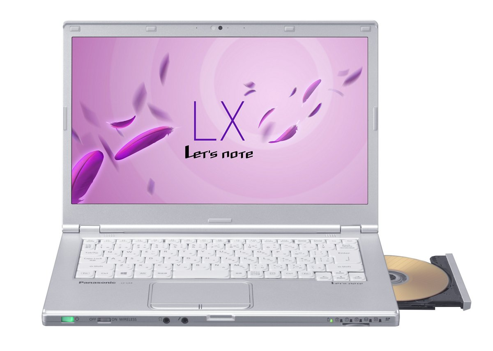
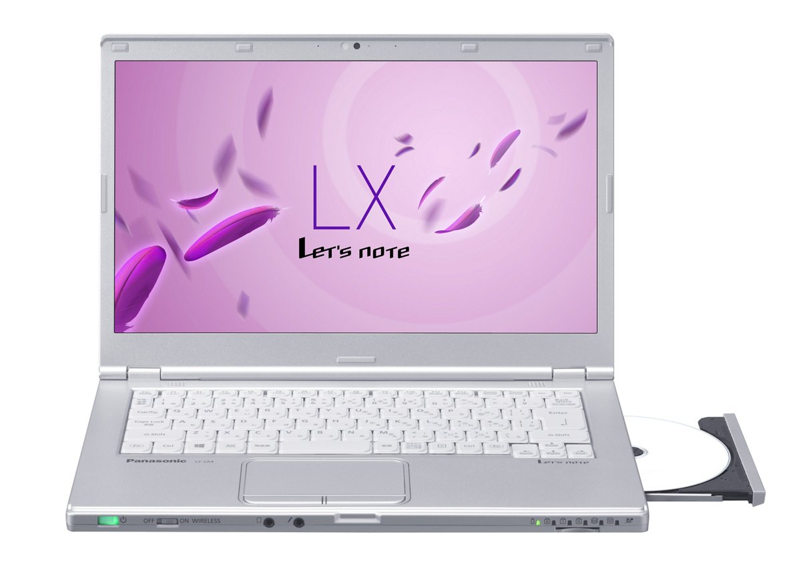

# レッツノート CF-LX4 スペック・仕様一覧

[English](../../en/CF-LX4/) · **日本語** · [中文](../../zh/CF-LX4/)

🗄️ [レッツノート陳列棚](https://letsnote-specs.github.io/ja/CF-LX4/)でこの機種を見る

パナソニック レッツノート **CF-LX4**（LXシリーズ・13.3型HD/14型HD+液晶）の全6品番（2015-01 – 2015-06発売）のスペック・仕様をまとめたページです。各品番の公式仕様表へのリンクも掲載しています。

*レッツノート CF-LX4（CF-LX4DDABR, CF-LX4DDAWR, CF-LX4HDABR, CF-LX4HDAWR）・シルバー。画像 © Panasonic*

## 品番一覧

| 品番 | 発売 | 生産終了 | 主な仕様 |
| :-- | :-- | :-- | :-- |
| [CF-LX4DDABR](https://panasonic.jp/pc/p-db/CF-LX4DDABR_spec.html) | 2015-06 | 2016-02 | Windows 8.1 Pro Update 64ビット、Intel® CoreTM i5-5300U vProTM プロセッサー、メモリー：8GB（空きスロットなし）、HDD：500GB、スーパーマルチドライブ、LAN、無線LAN 802.11a（W52/W53/W56）/b/g/n/ac、Microsoft® Office Home and Business Premium |
| [CF-LX4KD9BR](https://panasonic.jp/pc/p-db/CF-LX4KD9BR_spec.html) | 2015-06 | 2016-02 | Windows 8.1 Pro Update 64ビット、Intel® CoreTM i7-5600U vProTM プロセッサー、メモリー：8GB（空きスロットなし）、SSD：256GB、ブルーレイディスクドライブ、LAN、無線LAN 802.11a（W52/W53/W56）/b/g/n/ac、Microsoft® Office Home and Business Premium |
| [CF-LX4DDAWR](https://panasonic.jp/pc/p-db/CF-LX4DDAWR_spec.html) | 2015-06 | 2016-02 | Windows 7 Professional 64ビット、Intel® CoreTM i5-5300U vProTM プロセッサー、メモリー：8GB（空きスロットなし）、HDD：500GB、スーパーマルチドライブ、LAN、無線LAN 802.11a（W52/W53/W56）/b/g/n/ac、Microsoft® Office Home and Business Premium |
| [CF-LX4HDABR](https://panasonic.jp/pc/p-db/CF-LX4HDABR_spec.html) | 2015-01 | 2015-11 | Windows 8.1 Pro Update 64ビット、Intel® CoreTM i5-5200U プロセッサー、メモリー：8GB（空きスロットなし）、HDD：500GB、スーパーマルチドライブ、LAN、無線LAN 802.11a（W52/W53/W56）/b/g/n/ac、Microsoft® Office Home and Business Premium |
| [CF-LX4JD9BR](https://panasonic.jp/pc/p-db/CF-LX4JD9BR_spec.html) | 2015-01 | 2015-11 | Windows 8.1 Pro Update 64ビット、Intel® CoreTM i7-5500U プロセッサー、メモリー：8GB（空きスロットなし）、SSD：256GB、ブルーレイディスクドライブ、LAN、無線LAN 802.11a（W52/W53/W56）/b/g/n/ac、Microsoft® Office Home and Business Premium |
| [CF-LX4HDAWR](https://panasonic.jp/pc/p-db/CF-LX4HDAWR_spec.html) | 2015-01 | 2015-11 | Windows 7 Professional 64ビット、Intel® CoreTM i5-5200U プロセッサー、メモリー：8GB（空きスロットなし）、HDD：500GB、スーパーマルチドライブ、LAN、無線LAN 802.11a（W52/W53/W56）/b/g/n/ac、Microsoft® Office Home and Business Premium |

## 共通仕様

| 項目 | 仕様 |
| :-- | :-- |
| メインメモリー | 8GB DDR3L SDRAM 最大8GB （空きスロット0） |
| 表示方式 | 14型ワイド(16:9)HD+ TFTカラー液晶 （1600 x 900ドット） |
| 表示方式 / グラフィックアクセラレーター | インテル HD グラフィックス5500（CPUに内蔵） |
| 表示方式 / LCD表示 | 1600×900ドット：約1677万色 |
| 表示方式 / 外部ディスプレイ出力 | 1024×768、1280×768、1280×1024、1360×768、1366×768、1400×1050、1600×900、1600×1200、1680×1050 、1920×1080、1920×1200ドット：約1677万色 |
| 表示方式 / 本体＋外部ディスプレイ同時表示 | 1024×768、1280×768、1360×768、1366×768、1600×900ドット：約1677万色 |
| ワイヤレス通信機能 | インテル Dual Band Wireless-AC 7265 |
| 無線LAN | IEEE802.11a（W52/W53/W56）/b/g/n/ac 準拠 |
| LAN | 1000BASE-T/100BASE-TX/10BASE-T |
| サウンド機能 | PCM音源（24ビットステレオ）、インテル High Definition Audio準拠、ステレオスピーカー |
| SDメモリーカードスロット | SDメモリーカード×1スロット（SDHCメモリーカード/SDXCメモリーカード対応/UHS-I高速転送対応/著作権保護技術対応） |
| 内蔵マイク | アレイマイク |
| センサー | 照度センサー |
| インターフェース | LANコネクター（RJ-45） / 外部ディスプレイコネクター（アナログRGB ミニD-sub 15ピン） / HDMI出力端子 / マイク入力端子（ステレオミニジャックM3（プラグインパワー対応）） / オーディオ出力端子（ステレオミニジャックM3） / USB3.0ポート×2(うち1つはUSB充電ポートも兼ねる) / USB2.0ポート×1 |
| ポインティングデバイス | タッチパッド |
| 消費電力 | 最大約65W |
| 達成率 ( 2011年度基準 ) | — |
| 外形寸法(幅×奥行×高さ) | 幅333mm×奥行225.6mm×高さ24.5mm 突起部除く |
| 本体カラー | シルバー |
| Microsoft Office | Microsoft Office Home & Business Premium |

## 品番別の違い

| 品番 | CPU | メモリー | ストレージ | 質量 | 駆動時間 |
| :-- | :-- | :-- | :-- | :-- | :-- |
| CF-LX4DDABR | Core i5-5300U vPro | 8GB DDR3L SDRAM 最大8GB | ハードディスクドライブ | 1.31 kg | 7 h |
| CF-LX4KD9BR | Core i7-5600U vPro | 8GB DDR3L SDRAM 最大8GB | 256GB | 1.395 kg | 16 h |
| CF-LX4DDAWR | Core i5-5300U vPro | 8GB DDR3L SDRAM 最大8GB | ハードディスクドライブ | 1.31 kg | 6.5 h |
| CF-LX4HDABR | Core i5-5200U | 8GB DDR3L SDRAM 最大8GB | ハードディスクドライブ | 1.31 kg | 7 h |
| CF-LX4JD9BR | Core i7-5500U | 8GB DDR3L SDRAM 最大8GB | 256GB | 1.395 kg | 16 h |
| CF-LX4HDAWR | Core i5-5200U | 8GB DDR3L SDRAM 最大8GB | ハードディスクドライブ | 1.31 kg | 6.5 h |

CF-LX4DDABR の仕様の違い（すべて）

| 項目 | 仕様 |
| :-- | :-- |
| 搭載OS | Windows 8.1 Pro Update 64ビット（日本語版） |
| CPU | インテル Core i5-5300U vProプロセッサー / インテルスマートキャッシュ3MB、動作周波数2.30GHz（インテル ターボ・ブースト・テクノロジー2.0利用時は最大2.90GHz） |
| チップセット | CPUに内蔵 |
| ビデオメモリー | 最大3839MB (メインメモリーと共用) |
| ハードディスクドライブ | ハードディスクドライブ（HDD）500GB（Serial ATA、5400rpm）上記容量のうち約16GBをリカバリー領域、約1GBをシステム領域として使用（ユーザー使用不可） |
| 光学式ドライブ | スーパーマルチドライブ（DVD/CD）内蔵 バッファアンダーランエラー防止機能搭載、トレイ式ドライブ |
| 連続データ転送速度 / 再生 | DVD-RAM：最大5 倍速 / DVD-ROM：最大8 倍速 / DVD-R：最大8倍速 / DVD-R DL：最大8 倍速 / DVD-RW：最大8 倍速 / +R：最大8 倍速 / +R DL：最大8 倍速 / +RW：最大8 倍速 / High Speed +RW：最大8 倍速 / CD-ROM：最大24 倍速 / CD-R：最大24 倍速 / CD-RW：最大24 倍速 / High-Speed CD-RW：最大24 倍速 / Ultra-Speed CD-RW：最大24 倍速 |
| 連続データ転送速度 / 記録 | DVD-RAM書き換え：最大5 倍速 / DVD-R 書き込み：最大8 倍速 / DVD-R DL書き込み：最大6 倍速 / DVD-RW書き換え：最大6 倍速 / +R 書き込み：最大8 倍速 / +R DL書き込み：最大6 倍速 / +RW 書き換え：最大4 倍速 / HighSpeed +RW書き換え：最大8 倍速 / CD-R 書き込み：最大24 倍速 / CD-RW 書き換え：4 倍速 / High-Speed CD-RW書き換え：10 倍速 / Ultra-Speed CD-RW書き換え：最大16 倍速 |
| 対応ディスク、および対応フォーマット / 再生 | DVD-RAM（ 1.4GB、2.8GB、4.7GB、9.4GB ） / DVD-ROM（1層、2層） / DVD-Video（1層、2層） / DVD-R（ 1.4GB、2.8GB、4.7GB ） / DVD-R DL（ 8.5GB ） / DVD-RW（ Ver.1.1/1.2 1.4GB、2.8GB、4.7GB、9.4GB ） / +R（ 4.7GB ） / +R DL（ 8.5GB ） / +RW（ 4.7GB ） / HighSpeed +RW（ 4.7GB ） / CD-Audio / CD-ROM（ XA 対応） / Photo CD（ マルチセッション対応） / Video CD / CD EXTRA / CD-TEXT / CD-R / CD-RW / High-Speed CD-RW / Ultra-Speed CD-RW |
| 対応ディスク、および対応フォーマット / 記録 | DVD-RAM（1.4GB、2.8GB、4.7GB、9.4GB） / DVD-R（1.4GB、2.8 GB、4.7GB for General） / DVD-R DL（8.5GB） / DVD-RW（Ver.1.1/1.2 1.4GB、2.8GB、4.7GB、9.4GB） / +R（ 4.7GB） / +R DL（8.5GB） / +RW（ 4.7GB） / High Speed +RW（ 4.7GB） / CD-R / CD-RW / High-Speed CD-RW / Ultra-Speed CD-RW |
| Bluetooth | Bluetooth v4.0 / ■対応プロファイル / 【Classic】 / ・A2DP（Source） / ・AVRCP（Target） / ・HCRP（Client） / ・HFP（AG） / ・HID（Host） / ・OPP（ClientおよびServer） / ・PAN（User） / ・SPP（DevAおよびDevB） / 【Low Energy】 / ・HOGP（Host） |
| セキュリティチップ | TPM（ TCG V1.2 準拠） |
| 拡張メモリースロット | DDR3L 204ピン SO-DIMM専用スロット×1（1.35V/PC3L-12800/DDR3L SDRAM） |
| カメラ | 有効画素数：最大1920×1080ピクセル(約207万画素) |
| キーボード | OADG準拠87キー、キーピッチ19mm(縦・横)(一部キーを除く） |
| 電源 | ▼ACアダプター / 入力：AC100V～240V、50Hz/60Hz、出力：DC16V、4.06A、電源コードは100V専用 / ▼バッテリーパック / 10.8V リチウムイオン・公称容量3550mAh、定格容量3400mAh |
| エネルギー消費効率 | 2011年度基準 N区分0.029 |
| 駆動／充電時間 | ▼駆動時間 ： / （JEITA Ver.2.0）約7時間 / ▼充電時間： / 電源ON時、OFF時ともに約3時間 |
| 質量(バッテリーを含む） | パソコン本体：約1.31kg（付属のバッテリーパック（S）(約0.19kg)装着時）、ACアダプター：約0.02kg（電源コード（約0.06kg）除く） |
| ソフトウェア | ・Microsoft Internet Explorer 11 / ・ネットセレクターLite / ・Intel PROSet/Wireless Software for Bluetooth Technology / ・セキュリティ設定ユーティリティ / ・マカフィーリブセーフ / ・i-フィルター6.0 (30日間無料お試し版) / ・Adobe Reader / ・WinZip 18.5日本語版（45日体験版） / ・電源プラン拡張ユーティリティ / ・ピークシフト制御ユーティリティ / ・Power2Go with DVD authoring / ・CyberLink PowerDVD10 / ・Wireless Manager mobile edition / ・Intel WiDi / ・USB充電設定ユーティリティ / ・カメラユーティリティ / ・Camera for Panasonic PC / ・Aptioセットアップユーティリティ / ・PC-Diagnosticユーティリティ / ・Dashboard for Panasonic PC / ・無線診断ユーティリティ / ・リカバリーディスク作成ユーティリティ / ・ハードディスクデータ消去ユーティリティ / ・DirectX 11.2 / ・インテル PROSet/Wireless Software / ・インテルMy WiFiテクノロジー / ・Skype / ・NAVITIME / ・Bing翻訳 / ・画面共有アシストユーティリティー / ・タッチパッド誤動作防止ユーティリティ |
| 付属品 | 標準ACアダプター、バッテリーパック(S)、取扱説明書、Microsoft Office Home & Business Premium |

公式仕様表: <https://panasonic.jp/pc/p-db/CF-LX4DDABR_spec.html>

CF-LX4KD9BR の仕様の違い（すべて）

| 項目 | 仕様 |
| :-- | :-- |
| 搭載OS | Windows 8.1 Pro Update 64ビット（日本語版） |
| CPU | インテル Core i7-5600U vProプロセッサー / インテルスマートキャッシュ4MB、動作周波数2.60GHz（インテル ターボ・ブースト・テクノロジー2.0利用時は最大3.20GHz） |
| チップセット | CPUに内蔵 |
| ビデオメモリー | 最大3839MB (メインメモリーと共用) |
| 光学式ドライブ | ブルーレイディスクドライブ内蔵 / DVDスーパーマルチドライブ機能/バッファーアンダーランエラー防止機能搭載 |
| 連続データ転送速度 / 再生 | BD-ROM：最大6倍速 / BD-R：最大6倍速 / BD-R DL：最大6倍速 / BD-R LTH：最大6倍速 / BD-R XL：最大6倍速 / BD-RE：最大6倍速 / BD-RE DL：最大6倍速 / BD-RE XL：最大4倍速 / DVD-RAM：最大5 倍速 / DVD-ROM：最大8 倍速 / DVD-R：最大8倍速 / DVD-R DL：最大8 倍速 / DVD-RW：最大8 倍速 / +R：最大8 倍速 / +R DL：最大8 倍速 / +RW：最大8 倍速 / High Speed +RW：最大8 倍速 / CD-ROM：最大24 倍速 / CD-R：最大24 倍速 / CD-RW：最大24 倍速 / High-Speed CD-RW：最大24 倍速 / Ultra-Speed CD-RW：最大24 倍速 |
| 連続データ転送速度 / 記録 | BD-R書き込み：最大6 倍速 / BD-R DL書き込み：最大6 倍速 / BD-R LTH 書き込み：最大4 倍速 / BD-R XL書き込み：最大4 倍速 / BD-RE書き換え：2倍速 / BD-RE DL書き換え：2 倍速 / BD-RE XL 書き換え：2倍速 / DVD-RAM書き換え：最大5 倍速 / DVD-R 書き込み：最大8 倍速 / DVD-R DL書き込み：最大6 倍速 / DVD-RW書き換え：最大6 倍速 / +R 書き込み：最大8 倍速 / +R DL書き込み：最大6 倍速 / +RW 書き換え：最大4 倍速 / HighSpeed +RW書き換え：最大8 倍速 / CD-R 書き込み：最大24 倍速 / CD-RW 書き換え：4 倍速 / High-Speed CD-RW書き換え：10 倍速 / Ultra-Speed CD-RW書き換え：最大16 倍速 |
| 対応ディスク、および対応フォーマット / 再生 | BD-ROM / BD-R（Ver.1.1/1.2/1.3、25GB） / BD-R DL（Ver.1.1/1.2/1.3、50GB） / BD-R LTH（Ver.1.2/1.3、25GB） / BD-R XL（Ver.2.0、100GB） / BD-RE（Ver. 2.1、25GB） / BD-RE DL（Ver.2.1、50GB） / BD-RE XL（Ver.3.0、100GB） / DVD-RAM（ 1.4GB、2.8GB、4.7GB、9.4GB ） / DVD-ROM（1層、2層） / DVD-Video（1層、2層） / DVD-R（1.4GB、2.8GB、4.7GB） / DVD-R DL（8.5GB） / DVD-RW（Ver.1.1/1.2 1.4GB、2.8GB、4.7GB、9.4GB） / +R（4.7GB） / +R DL（8.5GB） / +RW（4.7GB） / HighSpeed +RW（4.7GB） / CD-Audio / CD-ROM（XA対応） / Photo CD（マルチセッション対応） / Video CD / CD EXTRA / CD-TEXT / CD-R / CD-RW / High-Speed CD-RW / Ultra-Speed CD-RW |
| 対応ディスク、および対応フォーマット / 記録 | BD-R（25GB） / BD-R DL（50GB） / BD-R LTH（25GB） / BD-R XL（100GB） / BD-RE（25GB） / BD-RE DL（50GB） / BD-RE XL（100GB） / DVD-RAM（1.4GB、2.8GB、4.7GB、9.4GB） / DVD-R（1.4GB、2.8 GB、4.7GB for General） / DVD-R DL（8.5GB） / DVD-RW（Ver.1.1/1.2 1.4GB、2.8GB、4.7GB、9.4GB） / +R（ 4.7GB） / +R DL（8.5GB） / +RW（ 4.7GB） / High Speed +RW（ 4.7GB） / CD-R / CD-RW / High-Speed CD-RW / Ultra-Speed CD-RW |
| Bluetooth | Bluetooth v4.0 / ■対応プロファイル / 【Classic】 / ・A2DP（Source） / ・AVRCP（Target） / ・HCRP（Client） / ・HFP（AG） / ・HID（Host） / ・OPP（ClientおよびServer） / ・PAN（User） / ・SPP（DevAおよびDevB） / 【Low Energy】 / ・HOGP（Host） |
| セキュリティチップ | TPM（ TCG V1.2 準拠） |
| 拡張メモリースロット | DDR3L 204ピン SO-DIMM専用スロット×1（1.35V/PC3L-12800/DDR3L SDRAM） |
| カメラ | 有効画素数：最大1920×1080ピクセル(約207万画素) |
| キーボード | OADG準拠87キー、キーピッチ19mm(縦横)(一部キーを除く） |
| 電源 | ▼ACアダプター / 入力：AC100V～240V、50Hz/60Hz、出力：DC16V、4.06A、電源コードは100V専用 / ▼バッテリーパック / 10.8V リチウムイオン・公称容量7100mAh、定格容量6800mAh |
| エネルギー消費効率 | 2011年度基準 N区分0.029 |
| 駆動／充電時間 | ▼駆動時間 ： / （JEITA Ver.2.0）約16時間 / ▼充電時間： / 電源ON時、OFF時ともに約3時間 |
| 質量(バッテリーを含む） | パソコン本体：約1.395kg（付属のバッテリーパック（L）(約0.33kg)装着時）、ACアダプター：約0.02kg（電源コード（約0.06kg）除く） |
| ソフトウェア | ・Microsoft Internet Explorer 11 / ・ネットセレクターLite / ・Intel PROSet/Wireless Software for Bluetooth Technology / ・セキュリティ設定ユーティリティ / ・マカフィーリブセーフ / ・i-フィルター6.0 (30日間無料お試し版) / ・Adobe Reader / ・WinZip 18.5日本語版（45日体験版） / ・電源プラン拡張ユーティリティ / ・ピークシフト制御ユーティリティ / ・Power2Go with DVD authoring / ・CyberLink PowerDVD10 / ・Wireless Manager mobile edition / ・Intel WiDi / ・USB充電設定ユーティリティ / ・カメラユーティリティ / ・Camera for Panasonic PC / ・Aptioセットアップユーティリティ / ・PC-Diagnosticユーティリティ / ・Dashboard for Panasonic PC / ・無線診断ユーティリティ / ・リカバリーディスク作成ユーティリティ / ・ハードディスクデータ消去ユーティリティ / ・DirectX 11.2 / ・インテル PROSet/Wireless Software / ・インテルMy WiFiテクノロジー / ・Skype / ・NAVITIME / ・Bing翻訳 / ・画面共有アシストユーティリティー / ・タッチパッド誤動作防止ユーティリティ / ・Power Producer BD |
| 付属品 | 標準ACアダプター、バッテリーパック(L)、取扱説明書、Microsoft Office Home & Business Premium |
| フラッシュメモリードライブ | フラッシュメモリードライブ（SSD）256GB（Serial ATA）上記容量のうち約16GBをリカバリー領域、約1GBをシステム領域として使用（ユーザー使用不可） |

公式仕様表: <https://panasonic.jp/pc/p-db/CF-LX4KD9BR_spec.html>

CF-LX4DDAWR の仕様の違い（すべて）

| 項目 | 仕様 |
| :-- | :-- |
| 搭載OS | ▼インストールOS： / Windows 7 Professional 64ビット（日本語版）（Windows 8.1 Pro ダウングレード権行使） / ▼ベースOS： / Windows 8.1 Pro Update 64ビット（日本語版）/ / Windows 7 Professional 64ビット（日本語版）/Windows 7 Professional 32ビット（日本語版） |
| CPU | インテル Core i5-5300U vProプロセッサー / インテルスマートキャッシュ3MB、動作周波数2.30GHz（インテル ターボ・ブースト・テクノロジー2.0利用時は最大2.90GHz） |
| チップセット | CPUに内蔵 |
| ビデオメモリー | 最大1696MB (メインメモリーと共用) |
| ハードディスクドライブ | ハードディスクドライブ（HDD）500GB（Serial ATA、5400rpm）上記容量のうち約30GBをリカバリー領域、約300MBをシステム領域として使用（ユーザー使用不可） |
| 光学式ドライブ | スーパーマルチドライブ（DVD/CD）内蔵 バッファアンダーランエラー防止機能搭載、トレイ式ドライブ |
| 連続データ転送速度 / 再生 | DVD-RAM：最大5 倍速 / DVD-ROM：最大8 倍速 / DVD-R：最大8倍速 / DVD-R DL：最大8 倍速 / DVD-RW：最大8 倍速 / +R：最大8 倍速 / +R DL：最大8 倍速 / +RW：最大8 倍速 / High Speed +RW：最大8 倍速 / CD-ROM：最大24 倍速 / CD-R：最大24 倍速 / CD-RW：最大24 倍速 / High-Speed CD-RW：最大24 倍速 / Ultra-Speed CD-RW：最大24 倍速 |
| 連続データ転送速度 / 記録 | DVD-RAM書き換え：最大5 倍速 / DVD-R 書き込み：最大8 倍速 / DVD-R DL書き込み：最大6 倍速 / DVD-RW書き換え：最大6 倍速 / +R 書き込み：最大8 倍速 / +R DL書き込み：最大6 倍速 / +RW 書き換え：最大4 倍速 / HighSpeed +RW書き換え：最大8 倍速 / CD-R 書き込み：最大24 倍速 / CD-RW 書き換え：4 倍速 / High-Speed CD-RW書き換え：10 倍速 / Ultra-Speed CD-RW書き換え：最大16 倍速 |
| 対応ディスク、および対応フォーマット / 再生 | DVD-RAM（ 1.4GB、2.8GB、4.7GB、9.4GB ） / DVD-ROM（1層、2層） / DVD-Video（1層、2層） / DVD-R（ 1.4GB、2.8GB、4.7GB ） / DVD-R DL（ 8.5GB ） / DVD-RW（ Ver.1.1/1.2 1.4GB、2.8GB、4.7GB、9.4GB ） / +R（ 4.7GB ） / +R DL（ 8.5GB ） / +RW（ 4.7GB ） / HighSpeed +RW（ 4.7GB ） / CD-Audio / CD-ROM（ XA 対応） / Photo CD（ マルチセッション対応） / Video CD / CD EXTRA / CD-TEXT / CD-R / CD-RW / High-Speed CD-RW / Ultra-Speed CD-RW |
| 対応ディスク、および対応フォーマット / 記録 | DVD-RAM（1.4GB、2.8GB、4.7GB、9.4GB） / DVD-R（1.4GB、2.8 GB、4.7GB for General） / DVD-R DL（8.5GB） / DVD-RW（Ver.1.1/1.2 1.4GB、2.8GB、4.7GB、9.4GB） / +R（ 4.7GB） / +R DL（8.5GB） / +RW（ 4.7GB） / High Speed +RW（ 4.7GB） / CD-R / CD-RW / High-Speed CD-RW / Ultra-Speed CD-RW |
| Bluetooth | Bluetooth v4.0 / ■対応プロファイル / 【Classic】 / ・A2DP（Source） / ・AVRCP（Target） / ・BIP（Client） / ・BPP（Sender） / ・FTP（ClientおよびServer） / ・HCRP（Client） / ・HFP（AG） / ・HID（Host） / ・HSP（AG） / ・OPP（ClientおよびServer） / ・PAN（User） / ・PBAP（PCE） / ・SPP（DevAおよびDevB） / ・SYNC（Client） / 【Low Energy】 / ・HOGP（Host） |
| セキュリティチップ | TPM（ TCG V1.2 準拠） |
| 拡張メモリースロット | DDR3L 204ピン SO-DIMM専用スロット×1（1.35V/PC3L-12800/DDR3L SDRAM） |
| カメラ | 有効画素数：最大1920×1080ピクセル(約207万画素) |
| キーボード | OADG準拠87キー、キーピッチ19mm(縦・横)(一部キーを除く） |
| 電源 | ▼ACアダプター / 入力：AC100V～240V、50Hz/60Hz、出力：DC16V、4.06A、電源コードは100V専用 / ▼バッテリーパック / 10.8V リチウムイオン・公称容量3550mAh、定格容量3400mAh |
| エネルギー消費効率 | 2011年度基準 N区分0.029 |
| 駆動／充電時間 | ▼駆動時間 ： / （JEITA Ver.2.0）約6.5時間 / ▼充電時間： / 電源ON時、OFF時ともに約3時間 |
| 質量(バッテリーを含む） | パソコン本体：約1.31kg（付属のバッテリーパック（S）(約0.19kg)装着時）、ACアダプター：約0.02kg（電源コード（約0.06kg）除く） |
| ソフトウェア | ・Microsoft Internet Explorer 11 / ・ネットセレクターLite / ・Intel PROSet/Wireless Software for Bluetooth Technology / ・セキュリティ設定ユーティリティ / ・マカフィーリブセーフ / ・i-フィルター6.0 (30日間無料お試し版) / ・Adobe Reader / ・WinZip 18.5日本語版（45日体験版） / ・電源プラン拡張ユーティリティ / ・ピークシフト制御ユーティリティ / ・Power2Go with DVD authoring / ・CyberLink PowerDVD10 / ・Wireless Manager mobile edition / ・Intel WiDi / ・USB充電設定ユーティリティ / ・カメラユーティリティ / ・解像度切り替えユーティリティ / ・ズームビューアー / ・クイックブートマネージャー / ・オプティカルディスクドライブ文字変更ユーティリティ / ・Aptioセットアップユーティリティ / ・PC-Diagnosticユーティリティ / ・Dashboard for Panasonic PC / ・無線診断ユーティリティ / ・リカバリーディスク作成ユーティリティ / ・ハードディスクデータ消去ユーティリティ / ・DirectX 11.1 / ・インテル PROSet/Wireless Software / ・インテル My WiFiテクノロジー / ・画面共有アシストユーティリティー / ・タッチパッド誤動作防止ユーティリティ |
| 付属品 | 標準ACアダプター、バッテリーパック(S)、取扱説明書、Microsoft Office Home & Business Premium |
| お知らせ | 本ページに記載されている仕様は、Windows 7 Professional 64ビット環境でのデータになります。 |

公式仕様表: <https://panasonic.jp/pc/p-db/CF-LX4DDAWR_spec.html>

CF-LX4HDABR の仕様の違い（すべて）

| 項目 | 仕様 |
| :-- | :-- |
| 搭載OS | Windows 8.1 Pro Update 64ビット（日本語版） |
| CPU | インテル Core i5-5200Uプロセッサー / インテルスマートキャッシュ3MB、動作周波数2.2GHz（インテル ターボ・ブースト・テクノロジー2.0利用時は最大2.7GHz） |
| ビデオメモリー | 最大3839MB (メインメモリーと共用) |
| ハードディスクドライブ | ハードディスクドライブ（HDD）500GB（Serial ATA、5400rpm）上記容量のうち約16GBをリカバリー領域、約1GBをシステム領域として使用（ユーザー使用不可） |
| 光学式ドライブ | スーパーマルチドライブ（DVD/CD）内蔵 バッファアンダーランエラー防止機能搭載、トレイ式ドライブ |
| 連続データ転送速度 / 再生 | DVD-RAM：最大5 倍速 / DVD-ROM：最大8 倍速 / DVD-R：最大8倍速 / DVD-R DL：最大8 倍速 / DVD-RW：最大8 倍速 / +R：最大8 倍速 / +R DL：最大8 倍速 / +RW：最大8 倍速 / High Speed +RW：最大8 倍速 / CD-ROM：最大24 倍速 / CD-R：最大24 倍速 / CD-RW：最大24 倍速 / High-Speed CD-RW：最大24 倍速 / Ultra-Speed CD-RW：最大24 倍速 |
| 連続データ転送速度 / 記録 | DVD-RAM書き換え：最大5 倍速 / DVD-R 書き込み：最大8 倍速 / DVD-R DL書き込み：最大6 倍速 / DVD-RW書き換え：最大6 倍速 / +R 書き込み：最大8 倍速 / +R DL書き込み：最大6 倍速 / +RW 書き換え：最大4 倍速 / HighSpeed +RW書き換え：最大8 倍速 / CD-R 書き込み：最大24 倍速 / CD-RW 書き換え：4 倍速 / High-Speed CD-RW書き換え：10 倍速 / Ultra-Speed CD-RW書き換え：最大16 倍速 |
| 対応ディスク、および対応フォーマット / 再生 | DVD-RAM（ 1.4GB、2.8GB、4.7GB、9.4GB ） / DVD-ROM（1層、2層） / DVD-Video（1層、2層） / DVD-R（ 1.4GB、2.8GB、4.7GB ） / DVD-R DL（ 8.5GB ） / DVD-RW（ Ver.1.1/1.2 1.4GB、2.8GB、4.7GB、9.4GB ） / +R（ 4.7GB ） / +R DL（ 8.5GB ） / +RW（ 4.7GB ） / HighSpeed +RW（ 4.7GB ） / CD-Audio / CD-ROM（ XA 対応） / Photo CD（ マルチセッション対応） / Video CD / CD EXTRA / CD-TEXT / CD-R / CD-RW / High-Speed CD-RW / Ultra-Speed CD-RW |
| 対応ディスク、および対応フォーマット / 記録 | DVD-RAM（1.4GB、2.8GB、4.7GB、9.4GB） / DVD-R（1.4GB、2.8 GB、4.7GB for General） / DVD-R DL（8.5GB） / DVD-RW（Ver.1.1/1.2 1.4GB、2.8GB、4.7GB、9.4GB） / +R（ 4.7GB） / +R DL（8.5GB） / +RW（ 4.7GB） / High Speed +RW（ 4.7GB） / CD-R / CD-RW / High-Speed CD-RW / Ultra-Speed CD-RW |
| Bluetooth | Bluetooth v4.0 / ■対応プロファイル / 【Classic】 / ・A2DP（Source） / ・AVRCP（Target） / ・HCRP（Client） / ・HFP（AG） / ・HID（Host） / ・OPP（ClientおよびServer） / ・PAN（User） / ・SPP（DevAおよびDevB） / 【Low Energy】 / ・HOGP（Host） |
| 拡張メモリースロット | DDR3L 204ピン SO-DIMM専用スロット×1（1.35V/PC3L-12800/DDR3L SDRAM） |
| カメラ | 有効画素数：最大1920×1080ピクセル |
| キーボード | OADG準拠87キー、キーピッチ19mm(縦・横)(一部キーを除く） |
| 電源 | ▼ACアダプター / 入力：AC100V～240V、50Hz/60Hz、出力：DC16V、4.06A、電源コードは100V専用 / ▼バッテリーパック / 10.8V リチウムイオン・公称容量3550mAh、定格容量3400mAh |
| エネルギー消費効率 | 2011年度基準 N区分0.032 |
| 駆動／充電時間 | ▼駆動時間 ： / （JEITA Ver.2.0）約7時間/（JEITA Ver.1.0）約10時間 / ▼充電時間： / 電源ON時、OFF時ともに約3時間 |
| 質量(バッテリーを含む） | パソコン本体：約1.31kg（付属のバッテリーパック（S）(約0.19kg)装着時）、ACアダプター：約200g（電源コード（約60g）除く） |
| ソフトウェア | ・Microsoft Internet Explorer 11 / ・ネットセレクターLite / ・Intel PROSet/Wireless Software for Bluetooth Technology / ・セキュリティ設定ユーティリティ / ・マカフィーリブセーフ / ・i-フィルター6.0 (30日間無料お試し版) / ・Adobe Reader / ・WinZip 18.5日本語版（45日体験版） / ・電源プラン拡張ユーティリティ / ・ピークシフト制御ユーティリティ / ・Power2Go with DVD authoring / ・CyberLink PowerDVD10 / ・Wireless Manager mobile edition / ・Intel WiDi / ・USB充電設定ユーティリティ / ・カメラユーティリティ / ・Camera for Panasonic PC / ・Aptioセットアップユーティリティ / ・PC-Diagnosticユーティリティ / ・Dashboard for Panasonic PC / ・無線診断ユーティリティ / ・リカバリーディスク作成ユーティリティ / ・ハードディスクデータ消去ユーティリティ / ・DirectX 11.2 / ・インテル PROSet/Wireless Software / ・インテルMy WiFiテクノロジー / ・Skype / ・NAVITIME / ・Bing翻訳 / ・画面共有アシストユーティリティー / ・タッチパッド誤動作防止ユーティリティ |
| 付属品 | 標準ACアダプター、バッテリーパック(S)、取扱説明書、Microsoft Office Home and Business Premium |

公式仕様表: <https://panasonic.jp/pc/p-db/CF-LX4HDABR_spec.html>

CF-LX4JD9BR の仕様の違い（すべて）

| 項目 | 仕様 |
| :-- | :-- |
| 搭載OS | Windows 8.1 Pro Update 64ビット（日本語版） |
| CPU | インテル Core i7-5500Uプロセッサー / インテルスマートキャッシュ4MB、動作周波数2.4GHz（インテル ターボ・ブースト・テクノロジー2.0利用時は最大3.0GHz） |
| ビデオメモリー | 最大3839MB (メインメモリーと共用) |
| 光学式ドライブ | ブルーレイディスクドライブ内蔵 / DVDスーパーマルチドライブ機能/バッファーアンダーランエラー防止機能搭載 |
| 連続データ転送速度 / 再生 | BD-ROM：最大6倍速 / BD-R：最大6倍速 / BD-R DL：最大6倍速 / BD-R LTH：最大6倍速 / BD-R XL：最大6倍速 / BD-RE：最大6倍速 / BD-RE DL：最大6倍速 / BD-RE XL：最大4倍速 / DVD-RAM：最大5 倍速 / DVD-ROM：最大8 倍速 / DVD-R：最大8倍速 / DVD-R DL：最大8 倍速 / DVD-RW：最大8 倍速 / +R：最大8 倍速 / +R DL：最大8 倍速 / +RW：最大8 倍速 / High Speed +RW：最大8 倍速 / CD-ROM：最大24 倍速 / CD-R：最大24 倍速 / CD-RW：最大24 倍速 / High-Speed CD-RW：最大24 倍速 / Ultra-Speed CD-RW：最大24 倍速 |
| 連続データ転送速度 / 記録 | BD-R書き込み：最大6 倍速 / BD-R DL書き込み：最大6 倍速 / BD-R LTH 書き込み：最大4 倍速 / BD-R XL書き込み：最大4 倍速 / BD-RE書き換え：2倍速 / BD-RE DL書き換え：2 倍速 / BD-RE XL 書き換え：2倍速 / DVD-RAM書き換え：最大5 倍速 / DVD-R 書き込み：最大8 倍速 / DVD-R DL書き込み：最大6 倍速 / DVD-RW書き換え：最大6 倍速 / +R 書き込み：最大8 倍速 / +R DL書き込み：最大6 倍速 / +RW 書き換え：最大4 倍速 / HighSpeed +RW書き換え：最大8 倍速 / CD-R 書き込み：最大24 倍速 / CD-RW 書き換え：4 倍速 / High-Speed CD-RW書き換え：10 倍速 / Ultra-Speed CD-RW書き換え：最大16 倍速 |
| 対応ディスク、および対応フォーマット / 再生 | BD-ROM / BD-R（Ver.1.1/1.2/1.3、25GB） / BD-R DL（Ver.1.1/1.2/1.3、50GB） / BD-R LTH（Ver.1.2/1.3、25GB） / BD-R XL（Ver.2.0、100GB） / BD-RE（Ver. 2.1、25GB） / BD-RE DL（Ver.2.1、50GB） / BD-RE XL（Ver.3.0、100GB） / DVD-RAM（ 1.4GB、2.8GB、4.7GB、9.4GB ） / DVD-ROM（1層、2層） / DVD-Video（1層、2層） / DVD-R（1.4GB、2.8GB、4.7GB） / DVD-R DL（8.5GB） / DVD-RW（Ver.1.1/1.2 1.4GB、2.8GB、4.7GB、9.4GB） / +R（4.7GB） / +R DL（8.5GB） / +RW（4.7GB） / HighSpeed +RW（4.7GB） / CD-Audio / CD-ROM（XA対応） / Photo CD（マルチセッション対応） / Video CD / CD EXTRA / CD-TEXT / CD-R / CD-RW / High-Speed CD-RW / Ultra-Speed CD-RW |
| 対応ディスク、および対応フォーマット / 記録 | BD-R（25GB） / BD-R DL（50GB） / BD-R LTH（25GB） / BD-R XL（100GB） / BD-RE（25GB） / BD-RE DL（50GB） / BD-RE XL（100GB） / DVD-RAM（1.4GB、2.8GB、4.7GB、9.4GB） / DVD-R（1.4GB、2.8 GB、4.7GB for General） / DVD-R DL（8.5GB） / DVD-RW（Ver.1.1/1.2 1.4GB、2.8GB、4.7GB、9.4GB） / +R（ 4.7GB） / +R DL（8.5GB） / +RW（ 4.7GB） / High Speed +RW（ 4.7GB） / CD-R / CD-RW / High-Speed CD-RW / Ultra-Speed CD-RW |
| Bluetooth | Bluetooth v4.0 / ■対応プロファイル / 【Classic】 / ・A2DP（Source） / ・AVRCP（Target） / ・HCRP（Client） / ・HFP（AG） / ・HID（Host） / ・OPP（ClientおよびServer） / ・PAN（User） / ・SPP（DevAおよびDevB） / 【Low Energy】 / ・HOGP（Host） |
| 拡張メモリースロット | DDR3L 204ピン SO-DIMM専用スロット×1（1.35V/PC3L-12800/DDR3L SDRAM、4GBメモリー増設済み） |
| カメラ | 有効画素数：最大1920×1080ピクセル |
| キーボード | OADG準拠87キー、キーピッチ19mm(縦横)(一部キーを除く） |
| 電源 | ▼ACアダプター / 入力：AC100V～240V、50Hz/60Hz、出力：DC16V、4.06A、電源コードは100V専用 / ▼バッテリーパック / 10.8V リチウムイオン・公称容量7100mAh、定格容量6800mAh |
| エネルギー消費効率 | 2011年度基準 N区分0.029 |
| 駆動／充電時間 | ▼駆動時間 ： / （JEITA Ver.2.0）約16時間/（JEITA Ver.1.0）約23時間 / ▼充電時間： / 電源ON時、OFF時ともに約3時間 |
| 質量(バッテリーを含む） | パソコン本体：約1.395kg（付属のバッテリーパック（L）(約0.33kg)装着時）、ACアダプター：約200g（電源コード（約60g）除く） |
| ソフトウェア | ・Microsoft Internet Explorer 11 / ・ネットセレクターLite / ・Intel PROSet/Wireless Software for Bluetooth Technology / ・セキュリティ設定ユーティリティ / ・マカフィーリブセーフ / ・i-フィルター6.0 (30日間無料お試し版) / ・Adobe Reader / ・WinZip 18.5日本語版（45日体験版） / ・電源プラン拡張ユーティリティ / ・ピークシフト制御ユーティリティ / ・Power2Go with DVD authoring / ・CyberLink PowerDVD10 / ・Wireless Manager mobile edition / ・Intel WiDi / ・USB充電設定ユーティリティ / ・カメラユーティリティ / ・Camera for Panasonic PC / ・Aptioセットアップユーティリティ / ・PC-Diagnosticユーティリティ / ・Dashboard for Panasonic PC / ・無線診断ユーティリティ / ・リカバリーディスク作成ユーティリティ / ・ハードディスクデータ消去ユーティリティ / ・DirectX 11.2 / ・インテル PROSet/Wireless Software / ・インテルMy WiFiテクノロジー / ・Skype / ・NAVITIME / ・Bing翻訳 / ・画面共有アシストユーティリティー / ・タッチパッド誤動作防止ユーティリティ / ・Power Producer BD |
| 付属品 | 標準ACアダプター、バッテリーパック(L)、取扱説明書、Microsoft Office Home & Business Premium |
| フラッシュメモリードライブ | フラッシュメモリードライブ（SSD）256GB（Serial ATA）上記容量のうち約16GBをリカバリー領域、約1GBをシステム領域として使用（ユーザー使用不可） |

公式仕様表: <https://panasonic.jp/pc/p-db/CF-LX4JD9BR_spec.html>

CF-LX4HDAWR の仕様の違い（すべて）

| 項目 | 仕様 |
| :-- | :-- |
| 搭載OS | ▼インストールOS： / Windows 7 Professional 64ビット（日本語版）（Windows 8.1 Pro ダウングレード権行使） / ▼ベースOS： / Windows 8.1 Pro Update 64ビット（日本語版）/ / Windows 7 Professional 64ビット（日本語版）/Windows 7 Professional 32ビット（日本語版） |
| CPU | インテル Core i5-5200Uプロセッサー / インテルスマートキャッシュ3MB、動作周波数2.2GHz（インテル ターボ・ブースト・テクノロジー2.0利用時は最大2.7GHz） |
| ビデオメモリー | 最大1696MB (メインメモリーと共用) |
| ハードディスクドライブ | ハードディスクドライブ（HDD）500GB（Serial ATA、5400rpm）上記容量のうち約30GBをリカバリー領域、約300MBをシステム領域として使用（ユーザー使用不可） |
| 光学式ドライブ | スーパーマルチドライブ（DVD/CD）内蔵 バッファアンダーランエラー防止機能搭載、トレイ式ドライブ |
| 連続データ転送速度 / 再生 | DVD-RAM：最大5 倍速 / DVD-ROM：最大8 倍速 / DVD-R：最大8倍速 / DVD-R DL：最大8 倍速 / DVD-RW：最大8 倍速 / +R：最大8 倍速 / +R DL：最大8 倍速 / +RW：最大8 倍速 / High Speed +RW：最大8 倍速 / CD-ROM：最大24 倍速 / CD-R：最大24 倍速 / CD-RW：最大24 倍速 / High-Speed CD-RW：最大24 倍速 / Ultra-Speed CD-RW：最大24 倍速 |
| 連続データ転送速度 / 記録 | DVD-RAM書き換え：最大5 倍速 / DVD-R 書き込み：最大8 倍速 / DVD-R DL書き込み：最大6 倍速 / DVD-RW書き換え：最大6 倍速 / +R 書き込み：最大8 倍速 / +R DL書き込み：最大6 倍速 / +RW 書き換え：最大4 倍速 / HighSpeed +RW書き換え：最大8 倍速 / CD-R 書き込み：最大24 倍速 / CD-RW 書き換え：4 倍速 / High-Speed CD-RW書き換え：10 倍速 / Ultra-Speed CD-RW書き換え：最大16 倍速 |
| 対応ディスク、および対応フォーマット / 再生 | DVD-RAM（ 1.4GB、2.8GB、4.7GB、9.4GB ） / DVD-ROM（1層、2層） / DVD-Video（1層、2層） / DVD-R（ 1.4GB、2.8GB、4.7GB ） / DVD-R DL（ 8.5GB ） / DVD-RW（ Ver.1.1/1.2 1.4GB、2.8GB、4.7GB、9.4GB ） / +R（ 4.7GB ） / +R DL（ 8.5GB ） / +RW（ 4.7GB ） / HighSpeed +RW（ 4.7GB ） / CD-Audio / CD-ROM（ XA 対応） / Photo CD（ マルチセッション対応） / Video CD / CD EXTRA / CD-TEXT / CD-R / CD-RW / High-Speed CD-RW / Ultra-Speed CD-RW |
| 対応ディスク、および対応フォーマット / 記録 | DVD-RAM（1.4GB、2.8GB、4.7GB、9.4GB） / DVD-R（1.4GB、2.8 GB、4.7GB for General） / DVD-R DL（8.5GB） / DVD-RW（Ver.1.1/1.2 1.4GB、2.8GB、4.7GB、9.4GB） / +R（ 4.7GB） / +R DL（8.5GB） / +RW（ 4.7GB） / High Speed +RW（ 4.7GB） / CD-R / CD-RW / High-Speed CD-RW / Ultra-Speed CD-RW |
| Bluetooth | Bluetooth v4.0 / ■対応プロファイル / 【Classic】 / ・A2DP（Source） / ・AVRCP（Target） / ・BIP（Client） / ・BPP（Sender） / ・FTP（ClientおよびServer） / ・HCRP（Client） / ・HFP（AG） / ・HID（Host） / ・HSP（AG） / ・OPP（ClientおよびServer） / ・PAN（User） / ・PBAP（PCE） / ・SPP（DevAおよびDevB） / ・SYNC（Client） / 【Low Energy】 / ・HOGP（Host） |
| 拡張メモリースロット | DDR3L 204ピン SO-DIMM専用スロット×1（1.35V/PC3L-12800/DDR3L SDRAM） |
| カメラ | 有効画素数：最大1920×1080ピクセル |
| キーボード | OADG準拠87キー、キーピッチ19mm(縦・横)(一部キーを除く） |
| 電源 | ▼ACアダプター / 入力：AC100V～240V、50Hz/60Hz、出力：DC16V、4.06A、電源コードは100V専用 / ▼バッテリーパック / 10.8V リチウムイオン・公称容量3550mAh、定格容量3400mAh |
| エネルギー消費効率 | 2011年度基準 N区分0.032 |
| 駆動／充電時間 | ▼駆動時間 ： / （JEITA Ver.2.0）約6.5時間/（JEITA Ver.1.0）約10時間 / ▼充電時間： / 電源ON時、OFF時ともに約3時間 |
| 質量(バッテリーを含む） | パソコン本体：約1.31kg（付属のバッテリーパック（S）(約0.19kg)装着時）、ACアダプター：約200g（電源コード（約60g）除く） |
| ソフトウェア | ・Microsoft Internet Explorer 11 / ・ネットセレクターLite / ・Intel PROSet/Wireless Software for Bluetooth Technology / ・セキュリティ設定ユーティリティ / ・マカフィーリブセーフ / ・i-フィルター6.0 (30日間無料お試し版) / ・Adobe Reader / ・WinZip 18.5日本語版（45日体験版） / ・電源プラン拡張ユーティリティ / ・ピークシフト制御ユーティリティ / ・Power2Go with DVD authoring / ・CyberLink PowerDVD10 / ・Wireless Manager mobile edition / ・Intel WiDi / ・USB充電設定ユーティリティ / ・カメラユーティリティ / ・解像度切り替えユーティリティ / ・ズームビューアー / ・クイックブートマネージャー / ・オプティカルディスクドライブ文字変更ユーティリティ / ・Aptioセットアップユーティリティ / ・PC-Diagnosticユーティリティ / ・Dashboard for Panasonic PC / ・無線診断ユーティリティ / ・リカバリーディスク作成ユーティリティ / ・ハードディスクデータ消去ユーティリティ / ・DirectX 11.1 / ・インテル PROSet/Wireless Software / ・インテル My WiFiテクノロジー / ・画面共有アシストユーティリティー / ・タッチパッド誤動作防止ユーティリティ |
| 付属品 | 標準ACアダプター、バッテリーパック(S)、取扱説明書、Microsoft Office Home & Business Premium |
| お知らせ | 本ページに記載されている仕様は、Windows 7 Professional 64ビット環境でのデータになります。 |

公式仕様表: <https://panasonic.jp/pc/p-db/CF-LX4HDAWR_spec.html>

## 写真

*レッツノート CF-LX4（CF-LX4KD9BR, CF-LX4JD9BR）・シルバー。画像 © Panasonic*

## 関連機種

- 同シリーズの後継機種: [CF-LX5](../CF-LX5/)
- 同シリーズの前機種: [CF-LX3](../CF-LX3/)
- [レッツノート全機種一覧](../)

---

出典：パナソニック公式[生産終了品一覧](https://panasonic.jp/pc/support/products/)および各品番の仕様表（panasonic.jp）。製品画像 © Panasonic。本ページは非公式のまとめであり、パナソニックとは関係ありません。
