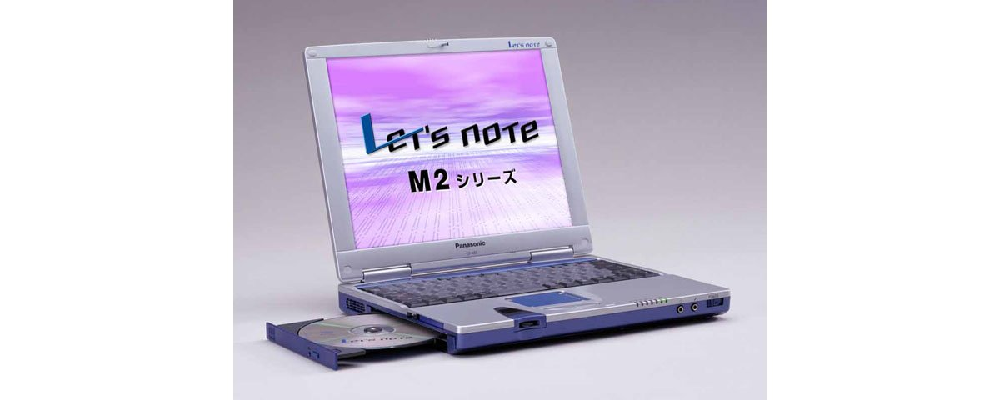

# レッツノート CF-M2 スペック・仕様一覧

[English](../../en/CF-M2/) · **日本語** · [中文](../../zh/CF-M2/)

🗄️ [レッツノート陳列棚](https://letsnote-specs.github.io/ja/CF-M2/)でこの機種を見る

パナソニック レッツノート **CF-M2**（M2シリーズ・11.3型XGA液晶）の全6品番（2000-06 – 2001-03発売）のスペック・仕様をまとめたページです。各品番の公式仕様表へのリンクも掲載しています。

*レッツノート CF-M2（CF-M2XR2K, CF-M2XV, CF-M2XR, CF-M2EV …）。画像 © Panasonic*

## 品番一覧

| 品番 | 発売 | 生産終了 | 主な仕様 |
| :-- | :-- | :-- | :-- |
| [CF-M2XR2K](https://panasonic.jp/pc/p-db/CF-M2XR2K_spec.html) | 2001-03 | 2001-05 | PentiumIII(650MHz)SS、HDD：20GB、CD-R/RW、Windows 2000 <PanaSense専用> |
| [CF-M2XV](https://panasonic.jp/pc/p-db/CF-M2XV_spec.html) | 2001-03 | 2001-05 | Celeron(600MHz)、HDD：10GB、CD-R/RW、Windows Me ＜件名対応商品＞ |
| [CF-M2XR](https://panasonic.jp/pc/p-db/CF-M2XR_spec.html) | 2000-10 | 2001-05 | PentiumIII(650MHz)SS、HDD：20GB、CD-R/RW、Windows Me |
| [CF-M2EV](https://panasonic.jp/pc/p-db/CF-M2EV_spec.html) | 2000-09 | 2000-09 | Celeron(550MHz)、HDD：10GB、CD-R/RW、Windows Me |
| [CF-M2R](https://panasonic.jp/pc/p-db/CF-M2R_spec.html) | 2000-07 | 2000-08 | PentiumIII(600MHz)SS、HDD：20GB、CD-R/RW、Windows 98SE |
| [CF-M2C](https://panasonic.jp/pc/p-db/CF-M2C_spec.html) | 2000-06 | 2000-07 | Celeron(500MHz)、HDD：10GB、CD-ROM、Windows 98SE |

## 共通仕様

| 項目 | 仕様 |
| :-- | :-- |
| チップセット | Intel(R) 440ZX AGPset |
| メインメモリー | 標準 64MB SDRAM (最大 192MB) |
| ビデオメモリー | 2.5MB |
| グラフィックチップ | NeoMagic社製 NM2200 |
| フロッピーディスクドライブ(オプション) | 外付け USB接続 3.5型 3モード対応 (1.44MB /1.2MB /720KB) |
| 表示方式 | XGA(1024×768ドット) 11.3型TFTカラー液晶 |
| 表示方式 / 外部ディスプレイ出力 | 640×480、800×600、1024×768ドット：約1600万色、1280×1024ドット :約256色 |
| サウンド機能 | PCM音源 (16ビットステレオ)、スピーカー内蔵(モノラル)、マイク内蔵（モノラル） |
| カードスロット / PCカードスロット | PCカード(TypeII×1スロット)、CardBus対応 |
| カードスロット / その他カードスロット | ワイヤレススロット / CFカード（TypeII×１スロット） / キースロット / プライベートキー専用１スロット |
| 拡張メモリースロット | 144ピンDIMM専用スロット×1 (64MB /128MB) |
| 音声 | マイク入力(モノラルミニジャック)、オーディオ出力(ステレオミニジャック) |
| USBコネクター | 4ピン ×2 |
| 外部ディスプレイコネクター | アナログRGB ミニDsub 15ピン |
| その他インターフェース | 拡張バスコネクター |
| オプション(Ｉ／Ｏボックス) | シリアル(Dsub 9ピン)、パラレル(Dsub 25ピン)、外部マウス／キーボード(ミニDin 6ピン) |
| キーボード | OADG準拠キーボード (86キー) :キーピッチ 17mm |
| 電源 | AC 100V-240V (50Hz/60Hz)(ACコードは100V専用)、 / 標準バッテリーパック／拡張バッテリーパック<別売>(リチウムイオン) |
| 外形寸法(幅×奥行×高さ) | 272mm × 217mm × 36mm (突起部除く) |
| 質量(バッテリーを含む） | 約1.57kg (ウェイトセーバー装着時)、 / 約1.85kg（CD-R/RWドライブ装着時）、 / 約1.96kg（拡張バッテリーパック<別売>装着時） |

## 品番別の違い

| 品番 | CPU | メモリー | ストレージ | 質量 | 駆動時間 |
| :-- | :-- | :-- | :-- | :-- | :-- |
| CF-M2XR2K | SpeedStep テクノロジ対応Pentium III 650MHz | 64MB SDRAM | 20GB | 1.57 kg | 1.7 h |
| CF-M2XV | Celeron 600MHz | 64MB SDRAM | 10GB | 1.57 kg | 1.5 h |
| CF-M2XR | SpeedStep テクノロジ対応Pentium III 650MHz | 64MB SDRAM | 20GB | 1.57 kg | 1.7 h |
| CF-M2EV | Celeron 550MHz | 64MB SDRAM | 10GB | 1.57 kg | 1.5 h |
| CF-M2R | SpeedStep テクノロジ対応Pentium III 600MHz | 64MB SDRAM | 20GB | 1.57 kg | 1.7 h |
| CF-M2C | Celeron 500MHz | 64MB SDRAM | 10GB | 1.57 kg | 1.6 h |

CF-M2XR2K の仕様の違い（すべて）

| 項目 | 仕様 |
| :-- | :-- |
| CPU | Intel(R) SpeedStep(TM) テクノロジ対応モバイルPentium(R) III プロセッサ 650MHz (システムバスクロック : 100MHz) |
| ２次キャッシュメモリー | 256KB |
| ハードディスクドライブ | 20GB (UltraATA) ※1 |
| 光学式ドライブ | CD-R/RWドライブ :読出最大20倍速・書込書換4倍速 ※2 着脱式 |
| マルチベイ | CD-R/RWドライブ(標準添付)、拡張バッテリーパック(オプション)、 / ウェイトセーバー（標準添付）を交換可 |
| 表示方式 / LCD表示 | 1024×768ドット :約1600万色 ※3 |
| 表示方式 / 本体＋外部ディスプレイ同時表示 | 640×480、800×600、1024×768ドット :約1600万色 ※3、1280×1024ドット ※4 :256色 |
| モデム | 本体内蔵 データ :56kbps (V.90/K56flex自動対応) FAX :14.4kbps /ボイス非対応 (RJ-11) ※5 |
| LAN | 本体内蔵 100BASE-TX /10BASE-T (RJ-45) ※6 |
| ワイヤレスコムポート / 携帯電話 | RCR STD 27準拠 データ／FAX:9600bps パケット通信DoPa（最大28.8kbps）※7 |
| ワイヤレスコムポート / PHS | PIAFS64K ※7 |
| ポインティングデバイス | フラットパッド |
| 消費電力 | 約50W ※8 |
| エネルギー消費効率 | S区分 0.0010 ※9 |
| バッテリー | 標準バッテリーパック / 駆動:約1.7時間 ※10※11 充電:約2.5時間(電源ON/OFF時) ※12 / 標準＋拡張バッテリーパック<別売> / 駆動:約6.5時間 ※10 充電:約5.7時間(電源ON/OFF時) ※12 |
| ソフトウェア | Microsoft(R) Windows(R) Professional Service Pack 1 (NTFSファイルシステム)、 / Microsoft(R) Internet Explorer 5.5、 / Microsoft(R) IME 2000、 / Adobe(R) Acrobat(R) Reader◆、 / プライベートキー関連ソフト、 / Easy CD Creator(TM) 4 Standard、 / DirectCD(TM) 3 |
| 注意書き | ※1 HDD容量は1GB=1,000,000,000バイト表示。 / ※2 書き込み速度はパソコン性能および書き込みソフトに依存します。CD-RWメディアに4倍速で書き込みを行う際は、4倍速対応メディアが必要です。 / ※3 内部LCDについては、グラフィックアクセラレーターのディザリング機能により実現。 / ※4 同時表示では、画面全体の一部(1024×768ドット)が表示されます。カーソルを画面の端に移動すると、画面全体がスクロールします。 / ※5 日本国内NTTアナログ一般回線専用です。V.90とK56flexを自動判別して切り替わります。また、56kbpsはデータ受信時の理論値です。データ送信時は33.6kpbsが最大速度です。 / ※6 コネクターの形状によっては使用できないものがあります。 / ※7 携帯電話、PHS電話接続用。別売の接続ケーブルが必要です。利用できる電話は、携帯電話、データ通信対応PHS(NTTドコモ、アステル)、NTTドコモドッチーモ、DDIポケットのH"(エッジ)およびα-DATA32対応電話機(一部機種を除く)です。PIAFS 64Kの最大通信速度は58.4kbpsです。 / ※8 (社)電子情報技術産業協会 家電・汎用品高調波抑制対策ガイドライン実行計画書に基づく測定値 :30W。 / ※9 エネルギー消費効率とは、省エネ法で定める測定方法により測定された消費電力を省エネ法で定める複合理論性能で除したものです。 / ※10 LCDバックライト輝度最低時。動作環境・システム設定により変動します。 / ※11 CD-R/RWドライブ内蔵時。 / ※12 完全放電したバッテリーを充電すると時間がかかる場合があります。電源が切れている状態でも電力を消費するので、満充電から約2週間(標準バッテリー使用時)でバッテリー残量がなくなります。また、電源ONの充電時間は最短の場合です。コンピュータの動作状態により変動します。 / ◆印のソフトウェアの操作に関するサポートは、各ソフトメーカーで行っております。 / ●本パソコンはWindows 2000以外では動作保証しておりません。 / ●一般的にWindows 2000用と表記されているソフト及び周辺機器の中には本パソコンで使用できないものがあります。ご購入に関しては、各ソフト及び周辺機器の販売元にご確認ください。 / ●付属のプロダクトリカバリーCD-ROMではOSのみの再インストールは行えません。 |

公式仕様表: <https://panasonic.jp/pc/p-db/CF-M2XR2K_spec.html>

CF-M2XV の仕様の違い（すべて）

| 項目 | 仕様 |
| :-- | :-- |
| CPU | モバイルIntel(R) Celeron(TM) プロセッサ 600MHz (システムバスクロック : 100MHz) |
| ２次キャッシュメモリー | 128KB |
| ハードディスクドライブ | 10GB (UltraATA) ※1 |
| 光学式ドライブ | CD-R/RWドライブ :読出最大20倍速・書込書換4倍速 ※2 着脱式 |
| マルチベイ | CD-R/RWドライブ(標準添付)、拡張バッテリーパック(オプション)、 / ウェイトセーバー（標準添付）を交換可 |
| 表示方式 / LCD表示 | 1024×768ドット :約1600万色 ※3 |
| 表示方式 / 本体＋外部ディスプレイ同時表示 | 640×480、800×600、1024×768ドット :約1600万色 ※3、1280×1024ドット ※4 :256色 |
| モデム | 本体内蔵 データ :56kbps (V.90/K56flex自動対応) FAX :14.4kbps /ボイス非対応 (RJ-11) ※5 |
| LAN | 本体内蔵 100BASE-TX /10BASE-T (RJ-45) ※6 |
| ワイヤレスコムポート / 携帯電話 | RCR STD 27準拠 データ／FAX:9600bps パケット通信DoPa（最大28.8kbps）※7 |
| ワイヤレスコムポート / PHS | PIAFS64K ※7 |
| ポインティングデバイス | スマートポインターIV |
| 消費電力 | 約50W ※9 |
| エネルギー消費効率 | S区分 0.0011 ※9 |
| バッテリー | 標準バッテリーパック / 駆動:約1.5時間 ※10※11 充電:約2.5時間(電源ON/OFF時) ※12 / 標準＋拡張バッテリーパック<別売> / 駆動:約5.7時間 ※10 充電:約5.7時間(電源ON/OFF時) ※12 |
| ソフトウェア | Microsoft(R) Windows(R) Millennium Edition、 / Microsoft(R) Internet Explorer 5.5、 / Microsoft(R) IME 2000、 / Adobe(R) Acrobat(R) Reader、 / ウェブナビゲーター2、 / インターネットスターター、 / イラストメール ※13、 / クイックラウンチャー、 / メール自動送受信、 / クイックコネクションセレクター、 / まいと～くFAX 2001 Lite ◆※14、 / プライベートキー関連ソフト、 / オンラインサインアップ (@nifty、ODN)◆、 / Phoenix BaySwap(TM)、 / Easy CD Creator(TM) 4 Standard、 / DirectCD(TM) 3 |
| 注意書き | ※1 HDD容量は1GB=1,000,000,000バイト表示。 / ※2 書き込み速度はパソコン性能および書き込みソフトに依存します。CD-RWメディアに4倍速で書き込みを行う際は、4倍速対応メディアが必要です。 / ※3 内部LCDについては、グラフィックアクセラレーターのディザリング機能により実現。 / ※4 同時表示では、画面全体の一部(1024×768ドット)が表示されます。カーソルを画面の端に移動すると、画面全体がスクロールします。 / ※5 日本国内NTTアナログ一般回線専用です。V.90とK56flexを自動判別して切り替わります。また、56kbpsはデータ受信時の理論値です。データ送信時は33.6kpbsが最大速度です。 / ※6 コネクターの形状によっては使用できないものがあります。 / ※7 携帯電話、PHS電話接続用。別売の接続ケーブルが必要です。利用できる電話は、携帯電話、データ通信対応PHS(NTTドコモ、アステル)、NTTドコモドッチーモ、DDIポケットのH"(エッジ)およびα-DATA32対応電話機(一部機種を除く)です。PIAFS 64Kの最大通信速度は58.4kbpsです。 / ※8 (社)電子情報技術産業協会 家電・汎用品高調波抑制対策ガイドライン実行計画書に基づく測定値 :30W。 / ※9 エネルギー消費効率とは、省エネ法で定める測定方法により測定された消費電力を省エネ法で定める複合理論性能で除したものです。 / ※10 LCDバックライト輝度最低時。動作環境・システム設定により変動します。 / ※11 CD-R/RWドライブ内蔵時。 / ※12 完全放電したバッテリーを充電すると時間がかかる場合があります。電源が切れている状態でも電力を消費するので、満充電から約2週間(標準バッテリー使用時)でバッテリー残量がなくなります。また、電源ONの充電時間は最短の場合です。コンピュータの動作状態により変動します。 / ※13 フォントの種類によって正しく表示されない場合があります。等幅フォントをお使いください。 / ※14 内蔵モデムでのファクス送受信のほか、ワイヤレスコムポートを使った携帯電話でのファクス送受信・NTTドコモのPHSでのファクス送信に対応。ボイス機能には対応していません。 / ◆印のソフトウェアの操作に関するサポートは、各ソフトメーカーで行っております。 / ●本パソコンはWindows Me以外では動作保証しておりません。 / ●一般的にWindows Me用と表記されているソフト及び周辺機器の中には本パソコンで使用できないものがあります。ご購入に関しては、各ソフト及び周辺機器の販売元にご確認ください。 / ●付属のプロダクトリカバリーCD-ROMではOSのみの再インストールは行えません。 |
| 表示方式 / デュアルディスプレイ表示(例) | 内部LCD 1024×768ドット :65536色 － 外部ディスプレイ 640×480ドット :約65536色 / 内部LCD 1024×768ドット :256色 － 外部ディスプレイ 1024×768ドット :約256色 |

公式仕様表: <https://panasonic.jp/pc/p-db/CF-M2XV_spec.html>

CF-M2XR の仕様の違い（すべて）

| 項目 | 仕様 |
| :-- | :-- |
| CPU | Intel(R) SpeedStep(TM) テクノロジ対応モバイルPentium(R) III プロセッサ 650MHz (システムバスクロック : 100MHz) |
| ２次キャッシュメモリー | 256KB |
| ハードディスクドライブ | 20GB (UltraATA) ※1 |
| 光学式ドライブ | CD-R/RWドライブ :読出最大20倍速・書込書換4倍速 ※2 着脱式 |
| マルチベイ | CD-R/RWドライブ(標準添付)、拡張バッテリーパック(オプション)、 / ウェイトセーバー（標準添付）を交換可 |
| 表示方式 / LCD表示 | 1024×768ドット :約1600万色 ※3 |
| 表示方式 / 本体＋外部ディスプレイ同時表示 | 640×480、800×600、1024×768ドット :約1600万色 ※3、1280×1024ドット ※4 :256色 |
| モデム | 本体内蔵 データ :56kbps (V.90/K56flex自動対応) FAX :14.4kbps /ボイス非対応 (RJ-11) ※5 |
| LAN | 本体内蔵 100BASE-TX /10BASE-T (RJ-45) ※6 |
| ワイヤレスコムポート / 携帯電話 | RCR STD 27準拠 データ／FAX:9600bps パケット通信DoPa（最大28.8kbps）※7 |
| ワイヤレスコムポート / PHS | PIAFS64K ※7 |
| ポインティングデバイス | スマートポインターIV |
| 消費電力 | 約50W |
| エネルギー消費効率 | S区分 0.0010 ※8 |
| バッテリー | 標準バッテリーパック / 駆動:約1.7時間 ※9※10 充電:約2.5時間(電源ON/OFF時) ※11 / 標準＋拡張バッテリーパック<別売> / 駆動:約6.5時間 ※9 充電:約5.7時間(電源ON/OFF時) ※11 |
| ソフトウェア | Microsoft(R) Windows(R) Millennium Edition、 / Microsoft(R) Internet Explorer 5.5、 / Microsoft(R) IME 2000、 / Adobe(R) Acrobat(R) Reader ◆、 / ウェブナビゲーター2、 / インターネットスターター、 / イラストメール ※12、 / クイックラウンチャー、 / メール自動送受信、 / クイックコネクションセレクター、 / まいと～くFAX 2001 Lite ◆※13、 / プライベートキー関連ソフト、 / オンラインサインアップ (@nifty、ODN) ◆、 / Phoenix BaySwap(TM)、 / Easy CD Creator(TM) 4 Standard、 / DirectCD(TM) 3 |
| 注意書き | ※1 HDD容量は1GB=1,000,000,000バイト表示。 / ※2 書き込み速度はパソコン性能および書き込みソフトに依存します。CD-RWメディアに4倍速で書き込みを行う際は、4倍速対応メディアが必要です。 / ※3 内部LCDについては、グラフィックアクセラレーターのディザリング機能により実現。 / ※4 同時表示では、画面全体の一部(1024×768ドット)が表示されます。カーソルを画面の端に移動すると、画面全体がスクロールします。 / ※5 日本国内NTTアナログ一般回線専用です。V.90とK56flexを自動判別して切り替わります。また、56kbpsはデータ受信時の理論値です。データ送信時は33.6kpbsが最大速度です。 / ※6 コネクターの形状によっては使用できないものがあります。 / ※7 携帯電話、PHS電話接続用。別売の接続ケーブルが必要です。利用できる電話は、携帯電話、データ通信対応PHS(NTTドコモ、アステル)、NTTドコモドッチーモ、DDIポケットのH"(エッジ)およびα-DATA32対応電話機(一部機種を除く)です。PIAFS 64Kの最大通信速度は58.4kbpsです。 / ※8 エネルギー消費効率とは、省エネ法で定める測定方法により測定された消費電力を省エネ法で定める複合理論性能で除したものです。 / ※9 LCDバックライト輝度最低時。動作環境・システム設定により変動します。 / ※10 CD-R/RWドライブ内蔵時。 / ※11 完全放電したバッテリーを充電すると時間がかかる場合があります。電源が切れている状態でも電力を消費するので、満充電から約2週間(標準バッテリー使用時)でバッテリー残量がなくなります。また、電源ONの充電時間は最短の場合です。コンピュータの動作状態により変動します。 / ※12 フォントの種類によって正しく表示されない場合があります。等幅フォントをお使いください。 / ※13 内蔵モデムでのファクス送受信のほか、ワイヤレスコムポートを使った携帯電話でのファクス送受信・NTTドコモのPHSでのファクス送信に対応。ボイス機能には対応していません。 / ◆印のソフトウェアの操作に関するサポートは、各ソフトメーカーで行っております。 / ●本パソコンはWindows Me以外では動作保証しておりません。 / ●一般的にWindows Me用と表記されているソフト及び周辺機器の中には本パソコンで使用できないものがあります。ご購入に関しては、各ソフト及び周辺機器の販売元にご確認ください。 / ●付属のプロダクトリカバリーCD-ROMではOSのみの再インストールは行えません。 |
| 表示方式 / デュアルディスプレイ表示(例) | 内部LCD 1024×768ドット :65536色 － 外部ディスプレイ 640×480ドット :約65536色 / 内部LCD 1024×768ドット :256色 － 外部ディスプレイ 1024×768ドット :約256色 |

公式仕様表: <https://panasonic.jp/pc/p-db/CF-M2XR_spec.html>

CF-M2EV の仕様の違い（すべて）

| 項目 | 仕様 |
| :-- | :-- |
| CPU | モバイルIntel(R) Celeron(TM) プロセッサ 550MHz (システムバスクロック : 100MHz) |
| ２次キャッシュメモリー | 128KB |
| ハードディスクドライブ | 10GB (UltraATA) ※1 |
| 光学式ドライブ | CD-R/RWドライブ :読出最大20倍速・書込書換4倍速 ※2 着脱式 |
| マルチベイ | CD-R/RWドライブ(標準添付)、拡張バッテリーパック(オプション)、 / ウェイトセーバー（標準添付）を交換可 |
| 表示方式 / LCD表示 | 1024×768ドット :約1600万色 ※3 |
| 表示方式 / 本体＋外部ディスプレイ同時表示 | 640×480、800×600、1024×768ドット :約1600万色 ※3、1280×1024ドット ※4 :256色 |
| モデム | 本体内蔵 データ :56kbps (V.90/K56flex自動対応) FAX :14.4kbps /ボイス非対応 (RJ-11) ※5 |
| LAN | 本体内蔵 100BASE-TX /10BASE-T (RJ-45) ※6 |
| ワイヤレスコムポート / 携帯電話 | RCR STD 27準拠 データ／FAX:9600bps パケット通信DoPa（最大28.8kbps）※7 |
| ワイヤレスコムポート / PHS | PIAFS64K ※7 |
| ポインティングデバイス | スマートポインターIV |
| 消費電力 | 約50W |
| エネルギー消費効率 | S区分 0.0012 ※8 |
| バッテリー | 標準バッテリーパック / 駆動:約1.5時間 ※9※10 充電:約2.5時間(電源ON/OFF時) ※11 / 標準＋拡張バッテリーパック<別売> / 駆動:約5.7時間 ※9 充電:約5.7時間(電源ON/OFF時) ※11 |
| ソフトウェア | Microsoft(R) Windows(R) Millennium Edition、 / Microsoft(R) Internet Explorer5.5、 / Microsoft(R) IME 2000、 / Adobe(R) Acrobat(R) Reader ◆、 / ウェブナビゲーター2、 / インターネットスターター、 / イラストメール ※12、 / クイックラウンチャー、 / メール自動送受信、 / クイックコネクションセレクター、 / まいと～くFAX 2001 Lite ◆※13、 / プライベートキー関連ソフト、 / オンラインサインアップ (@nifty、DION、ODN)◆、 / Phoenix BaySwap(TM)、 / Easy CD Creator(TM) 4 Standard、 / DirectCD(TM) 3 |
| 注意書き | ※1 HDD容量は1GB=1,000,000,000バイト表示。 / ※2 書き込み速度はパソコン性能および書き込みソフトに依存します。CD-RWメディアに4倍速で書き込みを行う際は、4倍速対応メディアが必要です。 / ※3 内部LCDについては、グラフィックアクセラレーターのディザリング機能により実現。 / ※4 同時表示では、画面全体の一部(1024×768ドット)が表示されます。カーソルを画面の端に移動すると、画面全体がスクロールします。 / ※5 日本国内NTTアナログ一般回線専用です。V.90とK56flexを自動判別して切り替わります。また、56kbpsはデータ受信時の理論値です。データ送信時は33.6kpbsが最大速度です。 / ※6 コネクターの形状によっては使用できないものがあります。 / ※7 携帯電話、PHS電話接続用。別売の接続ケーブルが必要です。利用できる電話は、携帯電話、データ通信対応PHS(NTTドコモ、アステル)、NTTドコモドッチーモ、DDIポケットのH"(エッジ)およびα-DATA32対応電話機(一部機種を除く)です。PIAFS 64Kの最大通信速度は58.4kbpsです。 / ※8 エネルギー消費効率とは、省エネ法で定める測定方法により測定された消費電力を省エネ法で定める複合理論性能で除したものです。 / ※9 LCDバックライト輝度最低時。動作環境・システム設定により変動します。 / ※10 CD-R/RWドライブ内蔵時。 / ※11 完全放電したバッテリーを充電すると時間がかかる場合があります。電源が切れている状態でも電力を消費するので、放置するとバッテリー残量がなくなります。また、電源ONの充電時間は最短の場合です。コンピュータの動作状態により変動します。 / ※12 フォントの種類によって正しく表示されない場合があります。等幅フォントをお使いください。 / ※13 内蔵モデムでのファクス送受信のほか、ワイヤレスコムポートを使った携帯電話でのファクス送受信・NTTドコモのPHSでのファクス送信に対応。ボイス機能には対応していません。 / ◆印のソフトウェアの操作に関するサポートは、各ソフトメーカーで行っております。 / ●本パソコンはWindows Me以外では動作保証しておりません。 / ●一般的にWindows Me用と表記されているソフト及び周辺機器の中には本パソコンで使用できないものがあります。ご購入に関しては、各ソフト及び周辺機器の販売元にご確認ください。 / ●付属のプロダクトリカバリーCD-ROMではOSのみの再インストールは行えません。 |
| 表示方式 / デュアルディスプレイ表示(例) | 内部LCD 1024×768ドット :65536色 － 外部ディスプレイ 640×480ドット :約65536色 / 内部LCD 1024×768ドット :256色 － 外部ディスプレイ 1024×768ドット :約256色 |

公式仕様表: <https://panasonic.jp/pc/p-db/CF-M2EV_spec.html>

CF-M2R の仕様の違い（すべて）

| 項目 | 仕様 |
| :-- | :-- |
| CPU | Intel(R) SpeedStep(TM) テクノロジ対応モバイルPentium(R) III プロセッサ 600MHz (システムバスクロック : 100MHz) |
| ２次キャッシュメモリー | 256KB |
| ハードディスクドライブ | 20GB (UltraATA) ※1 |
| 光学式ドライブ | CD-R/RWドライブ :読出最大20倍速・書込書換4倍速 ※2 着脱式 |
| マルチベイ | CD-R/RWドライブ(標準添付)、拡張バッテリーパック(オプション)、 / ウェイトセーバー（標準添付）を交換可 |
| 表示方式 / LCD表示 | 1024×768ドット :約1600万色 ※3 |
| 表示方式 / 本体＋外部ディスプレイ同時表示 | 640×480、800×600、1024×768ドット :約1600万色 ※3、1280×1024ドット ※4 :256色 |
| モデム | 本体内蔵 データ :56kbps (V.90/K56flex自動対応) FAX :14.4kbps /ボイス非対応 (RJ-11) ※5 |
| LAN | 本体内蔵 100BASE-TX /10BASE-T (RJ-45) ※6 |
| ワイヤレスコムポート / 携帯電話 | RCR STD 27準拠 データ／FAX:9600bps パケット通信DoPa（最大28.8kbps）※7 |
| ワイヤレスコムポート / PHS | PIAFS64K ※7 |
| ポインティングデバイス | スマートポインターIV |
| 消費電力 | 約50W |
| エネルギー消費効率 | S区分 0.0011 ※8 |
| バッテリー | 標準バッテリーパック / 駆動:約1.7時間 ※9※10 充電:約2.5時間(電源ON/OFF時) ※11 / 標準＋拡張バッテリーパック<別売> / 駆動:約6.9時間 ※9 充電:約5.7時間(電源ON/OFF時) ※11 |
| ソフトウェア | Microsoft(R) Windows(R) 98 Second Edition、 / Microsoft(R) Internet Explorer 5.01、 / Microsoft(R) IME 98、 / Adobe(R) Acrobat(R) Reader ◆、 / ウェブナビゲーター2、 / インターネットスターター、 / イラストメール ※12、 / クイックラウンチャー、 / メール自動送受信、 / クイックコネクションセレクター、 / まいと～くFAX 2001 Lite ◆※13、 / プライベートキー関連ソフト、 / オンラインサインアップ (@nifty、DION、KDD、ODN)◆、 / Phoenix BaySwap(TM)、 / Easy CD Creator(TM) 4 Standard、 / DirectCD(TM) 3 |
| 注意書き | ※1 HDD容量は1GB=1,000,000,000バイト表示。 / ※2 書き込み速度はパソコン性能および書き込みソフトに依存します。CD-RWメディアに4倍速で書き込みを行う際は、4倍速対応メディアが必要です。 / ※3 内部LCDについては、グラフィックアクセラレーターのディザリング機能により実現。 / ※4 同時表示では、画面全体の一部(1024×768ドット)が表示されます。カーソルを画面の端に移動すると、画面全体がスクロールします。 / ※5 日本国内NTTアナログ一般回線専用です。V.90とK56flexを自動判別して切り替わります。また、56kbpsはデータ受信時の理論値です。データ送信時は33.6kpbsが最大速度です。 / ※6 コネクターの形状によっては使用できないものがあります。 / ※7 携帯電話、PHS電話接続用。別売の接続ケーブルが必要です。利用できる電話は、携帯電話、データ通信対応PHS(NTTドコモ、アステル)、NTTドコモドッチーモ、DDIポケットのH"(エッジ)およびα-DATA32対応電話機(一部機種を除く)です。PIAFS 64Kの最大通信速度は58.4kbpsです。 / ※8 エネルギー消費効率とは、省エネ法で定める測定方法により測定された消費電力を省エネ法で定める複合理論性能で除したものです。 / ※9 LCDバックライト輝度最低時。動作環境・システム設定により変動します。 / ※10 CD-R/RWドライブ内蔵時。 / ※11 完全放電したバッテリーを充電すると時間がかかる場合があります。電源が切れている状態でも電力を消費するので、放置するとバッテリー残量がなくなります。また、電源ONの充電時間は最短の場合です。コンピュータの動作状態により変動します。 / ※12 フォントの種類によって正しく表示されない場合があります。等幅フォントをお使いください。 / ※13 内蔵モデムでのファクス送受信のほか、ワイヤレスコムポートを使った携帯電話でのファクス送受信・NTTドコモのPHSでのファクス送信に対応。ボイス機能には対応していません。 / ◆印のソフトウェアの操作に関するサポートは、各ソフトメーカーで行っております。 / ●本パソコンはWindows 98 Second Edition以外では動作保証しておりません。 / ●一般的にWindows 98 Second Edition用と表記されているソフト及び周辺機器の中には本パソコンで使用できないものがあります。ご購入に関しては、各ソフト及び周辺機器の販売元にご確認ください。 / ●付属のプロダクトリカバリーCD-ROMではOSのみの再インストールは行えません。 |
| 表示方式 / デュアルディスプレイ表示(例) | 内部LCD 1024×768ドット :65536色 － 外部ディスプレイ 640×480ドット :約65536色 / 内部LCD 1024×768ドット :256色 － 外部ディスプレイ 1024×768ドット :約256色 |

公式仕様表: <https://panasonic.jp/pc/p-db/CF-M2R_spec.html>

CF-M2C の仕様の違い（すべて）

| 項目 | 仕様 |
| :-- | :-- |
| CPU | モバイルIntel(R) Celeron(TM) プロセッサ 500MHz (システムバスクロック : 100MHz) |
| ２次キャッシュメモリー | 128KB |
| ハードディスクドライブ | 10GB (UltraATA) ※1 |
| 光学式ドライブ | CD-ROMドライブ :最大24倍速・着脱式 |
| マルチベイ | CD-ROMドライブ(標準添付)、CD-R/RWドライブパック(オプション)、拡張バッテリーパック(オプション)、 / ウェイトセーバー（標準添付）を交換可 |
| 表示方式 / LCD表示 | 1024×768ドット :約1600万色 ※2 |
| 表示方式 / 本体＋外部ディスプレイ同時表示 | 640×480、800×600、1024×768ドット :約1600万色 ※2、1280×1024ドット ※3 :256色 |
| モデム | 本体内蔵 データ :56kbps (V.90/K56flex自動対応) FAX :14.4kbps /ボイス非対応 (RJ-11) ※4 |
| LAN | 本体内蔵 100BASE-TX /10BASE-T (RJ-45) ※5 |
| ワイヤレスコムポート / 携帯電話 | RCR STD 27準拠 データ／FAX:9600bps パケット通信DoPa（最大28.8kbps）※6 |
| ワイヤレスコムポート / PHS | PIAFS64K ※6 |
| ポインティングデバイス | スマートポインターIV |
| 消費電力 | 約50W |
| エネルギー消費効率 | S区分 0.0026 ※7 |
| バッテリー | 標準バッテリーパック / 駆動:約1.6時間 ※8※9 充電:約2.5時間(電源ON/OFF時) ※10 / 標準＋拡張バッテリーパック<別売> / 駆動:約6.3時間 ※8 充電:約5.7時間(電源ON/OFF時) ※10 |
| ソフトウェア | Microsoft(R) Windows(R) 98 Second Edition、 / Microsoft(R) Internet Explorer 5.01、 / Microsoft(R) IME 98、 / Adobe(R) Acrobat(R) Reader ◆、 / ウェブナビゲーター 2、 / インターネットスターター、 / イラストメール ※11、 / クイックラウンチャー、 / メール自動送受信、 / クイックコネクションセレクター、 / まいと～くFAX 2001 Lite ◆※12、 / プライベートキー関連ソフト、 / オンラインサインアップ (@nifty、DION、KDD、ODN)◆、 / Phoenix BaySwap(TM) |
| 注意書き | ※1 HDD容量は1GB=1,000,000,000バイト表示。 / ※2 内部LCDについては、グラフィックアクセラレーターのディザリング機能により実現。 / ※3 同時表示では、画面全体の一部(1024×768ドット)が表示されます。カーソルを画面の端に移動すると、画面全体がスクロールします。 / ※4 日本国内NTTアナログ一般回線専用です。V.90とK56flexを自動判別して切り替わります。また、56kbpsはデータ受信時の理論値です。データ送信時は33.6kpbsが最大速度です。 / ※5 コネクターの形状によっては使用できないものがあります。 / ※6 携帯電話、PHS電話接続用。別売の接続ケーブルが必要です。利用できる電話は、携帯電話、データ通信対応PHS(NTTドコモ、アステル)、NTTドコモドッチーモ、DDIポケットのH"(エッジ)およびα-DATA32対応電話機(一部機種を除く)です。PIAFS 64Kの最大通信速度は58.4kbpsです。 / ※7 エネルギー消費効率とは、省エネ法で定める測定方法により測定された消費電力を省エネ法で定める複合理論性能で除したものです。 / ※8 LCDバックライト輝度最低時。動作環境・システム設定により変動します。 / ※9 CD-R/RW土ライブ内臓時。 / ※10 完全放電したバッテリーを充電すると時間がかかる場合があります。電源が切れている状態でも電力を消費するので、放置するとバッテリー残量がなくなります。また、電源ONの充電時間は最短の場合です。コンピュータの動作状態により変動します。 / ※11 フォントの種類によって正しく表示されない場合があります。等幅フォントをお使いください。 / ※12 内蔵モデムでのファクス送受信のほか、ワイヤレスコムポートを使った携帯電話でのファクス送受信・NTTドコモのPHSでのファクス送信に対応。ボイス機能には対応していません。 / ◆印のソフトウェアの操作に関するサポートは、各ソフトメーカーで行っております。 / ●本パソコンはWindows 98 Second Edition 以外では動作保証しておりません。 / ●一般的にWindows 98 Second Edition用と表記されているソフト及び周辺機器の中には本パソコンで使用できないものがあります。ご購入に関しては、各ソフト及び周辺機器の販売元にご確認ください。 / ●付属のプロダクトリカバリーCD-ROMではOSのみの再インストールは行えません。 |
| 表示方式 / デュアルディスプレイ表示(例) | 内部LCD 1024×768ドット :65536色 － 外部ディスプレイ 640×480ドット :約65536色 / 内部LCD 1024×768ドット :256色 － 外部ディスプレイ 1024×768ドット :約256色 |

公式仕様表: <https://panasonic.jp/pc/p-db/CF-M2C_spec.html>

## 関連機種

- [レッツノート全機種一覧](../)

---

出典：パナソニック公式[生産終了品一覧](https://panasonic.jp/pc/support/products/)および各品番の仕様表（panasonic.jp）。製品画像 © Panasonic。本ページは非公式のまとめであり、パナソニックとは関係ありません。
