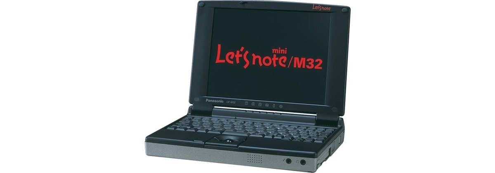

# レッツノート CF-M32 スペック・仕様一覧

[English](../../en/CF-M32/) · **日本語** · [中文](../../zh/CF-M32/)

🗄️ [レッツノート陳列棚](https://letsnote-specs.github.io/ja/CF-M32/)でこの機種を見る

パナソニック レッツノート **CF-M32**（mini M32/N4シリーズ・8.4型SVGA液晶）の全2品番（1998-06 – 1998-07発売）のスペック・仕様をまとめたページです。各品番の公式仕様表へのリンクも掲載しています。

*レッツノート CF-M32（CF-M32J8, CF-M32J5）。画像 © Panasonic*

## 品番一覧

| 品番 | 発売 | 生産終了 | 主な仕様 |
| :-- | :-- | :-- | :-- |
| [CF-M32J8](https://panasonic.jp/pc/p-db/CF-M32J8_spec.html) | 1998-07 | 1998-08 | MMX Pentium(166MHz)、HDD：2.1GB、Windows 98 |
| [CF-M32J5](https://panasonic.jp/pc/p-db/CF-M32J5_spec.html) | 1998-06 | 1998-07 | MMX Pentium(166MHz)、HDD：2.1GB、Windows 95 |

## 共通仕様

| 項目 | 仕様 |
| :-- | :-- |
| CPU | Intel(R) MMX(R)テクノロジ Pentium(R) プロセッサ 166MHz |
| チップセット | Intel(R) 430TX PCI set |
| メインメモリー | 標準 32MB EDO (最大 96MB) |
| ２次キャッシュメモリー | 256KB |
| ビデオメモリー | 2MB |
| グラフィックチップ | NeoMagic社製NM2160 |
| ハードディスクドライブ | 2.1GB ※1 |
| フロッピーディスクドライブ(オプション) | 外付け 3.5型 3モード対応 (1.44MB /1.2MB /720KB) / (I/Oボックス装着時にFDDコネクターに接続して使用) |
| 表示方式 | SVGA(800×600ドット) 8.4型 TFTカラー液晶 |
| 表示方式 / LCD表示 | 800×600ドット 約26万色 |
| 表示方式 / 外部ディスプレイ出力 | 640×480、800×600ドット:約1600万色、1024×768ドット:65,536色 |
| 表示方式 / 本体＋外部ディスプレイ同時表示 | 本体 800×600ドット:約26万色 / 外部ディスプレイ 800×600ドット:約1600万色 |
| サウンド機能 | PCM音源(Sound Blaster PRO互換)、FM音源、モノラルスピーカー、モノラルマイク内蔵 |
| PCカードスロット | PCカード(TypeII×2 または TypeIII×1スロット)、CardBus対応 ※2、ZV-Port対応 ※2 |
| 拡張メモリースロット | 144ピンDIMM専用スロット×1 |
| インターフェース / 音声 | マイク入力(ミニジャック)、オーディオ出力(ミニジャック) |
| インターフェース / USBコネクター | 4ピン |
| インターフェース / シリアルコネクター | Dsub 9ピン(I/Oボックス装着時) |
| インターフェース / パラレルコネクター | Dsub 25ピン(I/Oボックス装着時) |
| インターフェース / 外部ディスプレイコネクター | アナログRGB ミニDsub 15ピン(I/Oボックス装着時) |
| インターフェース / マウス／外部キーボード | ミニDin 6ピン(I/Oボックス装着時) |
| インターフェース / その他インターフェース | I/Oボックス専用コネクター、 / FDD専用コネクター(I/Oボックス装着時) |
| キーボード | OADG準拠キーボード (88キー)、キーピッチ 15mm |
| ポインティングデバイス | 光学式トラックボール(直径16mm) |
| 電源 | AC 100V-240V (50Hz/60Hz)(ACコードは100V専用)、 / バッテリーパック(リチウムイオン) |
| 消費電力 | 約26W |
| エネルギー消費効率 | スタンバイモード時 : 約4W ※4 |
| バッテリー | 標準バッテリーパック / 駆動:約2.5時間 ※5 充電:約2.5時間(電源OFF時)、約5時間(電源ON時)※6 / 大容量バッテリーパック<別売> / 駆動:約8時間 ※5 充電:約6.5時間(電源OFF時)、約13時間(電源ON時)※6 |
| 外形寸法(幅×奥行×高さ) | 225mm × 172mm × 36mm (突起部除く) |
| 質量(バッテリーを含む） | 約1.0kg(標準バッテリーパック装着時、I/Oボックス未装着時) |

## 品番別の違い

| 品番 | CPU | メモリー | ストレージ | 質量 | 駆動時間 |
| :-- | :-- | :-- | :-- | :-- | :-- |
| CF-M32J8 | MMXテクノロジ Pentium 166MHz | 32MB EDO | 2.1GB ※1 | 1.0 kg | 2.5 h |
| CF-M32J5 | MMXテクノロジ Pentium 166MHz | 32MB EDO | 2.1GB ※1 | 1.0 kg | 2.5 h |

CF-M32J8 の仕様の違い（すべて）

| 項目 | 仕様 |
| :-- | :-- |
| インターフェース / 赤外線通信 | IrDA V1.1準拠4Mbps／ASK準拠 ※3 |
| ソフトウェア | Microsoft(R) Windows(R) 98、 / NIFTY Manager for Windows ◆、 / Mouse Ware、 / Intellisync(TM) for Notebooks ◆、 / Panasonic Hi-HO オンラインサインアップソフト |
| 注意書き | ※1 HDD容量は1GB=1,000,000,000バイト表示。 / ※2 2スロット中どちらか1スロットのみ利用可能。 / ※3 赤外線通信ポートの有効距離は20～50cmとなります。 / ※4 省エネ法に基づくエネルギー消費効率。 / ※5 省電力モード設定時。動作環境・システム設定により変動します。 / ※6 完全放電したバッテリーを充電すると時間がかかる場合があります。電源が切れている状態でも電力を消費するので、放置するとバッテリー残量がなくなります。また、電源ONの充電時間は最短の場合です。コンピュータの動作状態により変動します。 / ◆印のソフトウェアの操作に関するサポートは、各ソフトメーカーで行っております。 / ●本パソコンはWindows 98 以外では動作保証しておりません。 / ●一般的にWindows 98用と表記されているソフト及び周辺機器の中には本パソコンで使用できないものがあります。ご購入に関しては、各ソフト及び周辺機器の販売元にご確認ください。 / ●システムの再インストールに必要なCD-ROMドライブは付属しておりません。別途お買い求めいただく必要があります。 |

公式仕様表: <https://panasonic.jp/pc/p-db/CF-M32J8_spec.html>

CF-M32J5 の仕様の違い（すべて）

| 項目 | 仕様 |
| :-- | :-- |
| インターフェース / 赤外線通信 | IrDA V1.1準拠4Mbps／ASK準拠 |
| ソフトウェア | Microsoft(R) Windows(R) 95、 / Microsoft(R) Internet Explorer 4.01、 / Microsoft(R) IME 97、 / NIFTY Manager for Windows ◆、 / Intellisync(TM) for Notebooks ◆、 / Panasonic Hi-HO オンラインサインアップソフト |
| 注意書き | ※1 HDD容量は1GB=1,000,000,000バイト表示。 / ※2 2スロット中どちらか1スロットのみ利用可能。 / ※3 赤外線通信ポートの有効距離は20～50cmとなります。 / ※4 省エネ法に基づくエネルギー消費効率。 / ※5 省電力モード設定時。動作環境・システム設定により変動します。 / ※6 完全放電したバッテリーを充電すると時間がかかる場合があります。電源が切れている状態でも電力を消費するので、放置するとバッテリー残量がなくなります。また、電源ONの充電時間は最短の場合です。コンピュータの動作状態により変動します。 / ◆印のソフトウェアの操作に関するサポートは、各ソフトメーカーで行っております。 / ●本パソコンはWindows 95 以外では動作保証しておりません。 / ●一般的にWindows 95用と表記されているソフト及び周辺機器の中には本パソコンで使用できないものがあります。ご購入に関しては、各ソフト及び周辺機器の販売元にご確認ください。 / ●システムの再インストールに必要なCD-ROMドライブは付属しておりません。別途お買い求めいただく必要があります。 |

公式仕様表: <https://panasonic.jp/pc/p-db/CF-M32J5_spec.html>

## 関連機種

- 同シリーズの前機種: [AL-N4](../AL-N4/)
- [レッツノート全機種一覧](../)

---

出典：パナソニック公式[生産終了品一覧](https://panasonic.jp/pc/support/products/)および各品番の仕様表（panasonic.jp）。製品画像 © Panasonic。本ページは非公式のまとめであり、パナソニックとは関係ありません。
