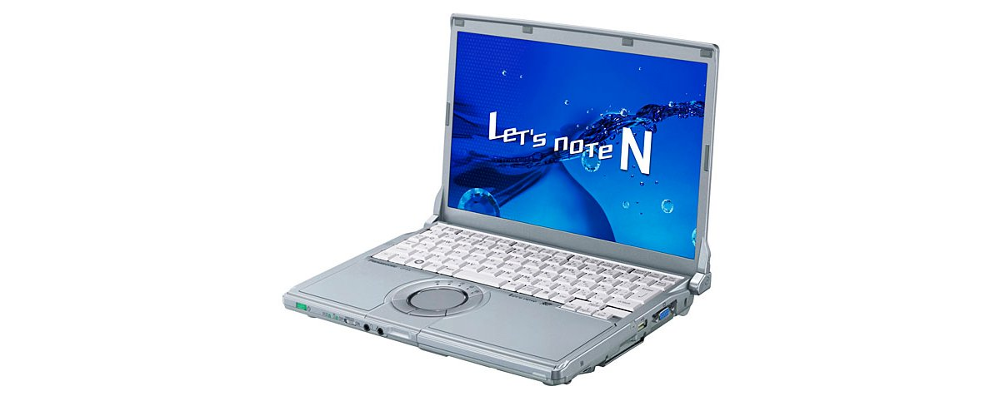
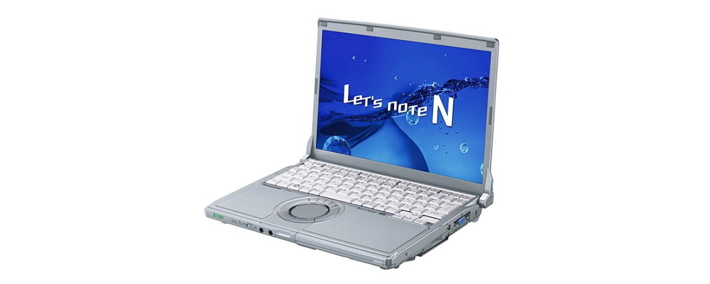
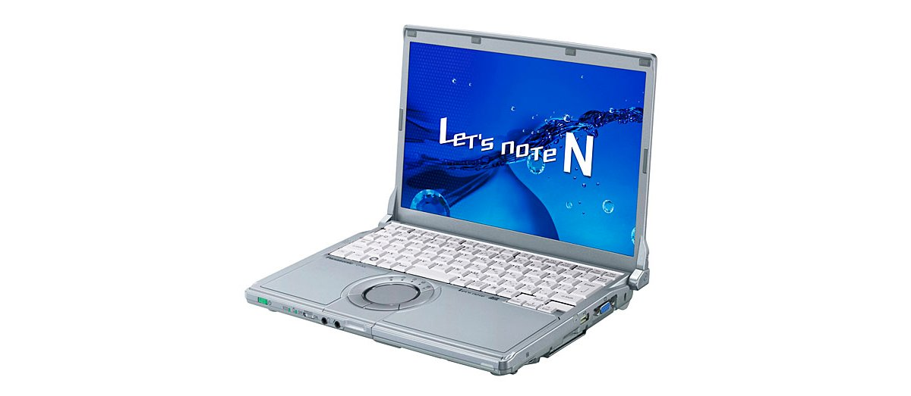

# レッツノート CF-N9 スペック・仕様一覧

[English](../../en/CF-N9/) · **日本語** · [中文](../../zh/CF-N9/)

🗄️ [レッツノート陳列棚](https://letsnote-specs.github.io/ja/CF-N9/)でこの機種を見る

パナソニック レッツノート **CF-N9**（N9シリーズ・12.1型WXGA液晶）の全3品番（2010-02 – 2010-09発売）のスペック・仕様をまとめたページです。各品番の公式仕様表へのリンクも掲載しています。

*レッツノート CF-N9（CF-N9LYPEDR）。画像 © Panasonic*

## 品番一覧

| 品番 | 発売 | 生産終了 | 主な仕様 |
| :-- | :-- | :-- | :-- |
| [CF-N9LYPEDR](https://panasonic.jp/pc/p-db/CF-N9LYPEDR_spec.html) | 2010-09 | 2011-02 | Windows® 7 Professional 正規版 、インテル® CoreTM i5-560M（2.66GHz）、メモリー：標準4GB（拡張メモリースロットに2GBメモリーを増設済み）（最大6GB）、HDD：500GB、LAN、無線LAN 802.11a(W52/W53/W56)/b/g/n |
| [CF-N9KYDEDR](https://panasonic.jp/pc/p-db/CF-N9KYDEDR_spec.html) | 2010-05 | 2010-09 | Windows® 7 Professional 正規版 、インテル® CoreTM i5-520M（2.40GHz）、メモリー：標準4GB（拡張メモリースロットに2GBメモリーを増設済み）、HDD：320GB、LAN、無線LAN 802.11a(W52/W53/W56)/b/g/n |
| [CF-N9JYCADR](https://panasonic.jp/pc/p-db/CF-N9JYCADR_spec.html) | 2010-02 | 2010-05 | Windows®7 Professional 正規版、インテル® CoreTM i5-520M（2.40GHz）、メモリー：標準2GB（最大4GB）、HDD：250GB、LAN、無線LAN 802.11a(W52/W53/W56)/b/g/n |

## 共通仕様

| 項目 | 仕様 |
| :-- | :-- |
| チップセット | モバイル インテル QM57 Express チップセット |
| 表示方式 | 12.1型TFTカラー液晶 WXGA (1280×800ドット) |
| 表示方式 / LCD表示 | 1280×800ドット：約1677万色 |
| 表示方式 / 外部ディスプレイ出力 | 1280×720、800×600、1024×768、1280×768、1280×1024、1400×1050、1680×1050、1600×1200、1920×1080、1920×1200ドット：約1677万色 |
| 無線LAN | IEEE802.11a（W52/W53/W56）/b/g/n準拠 |
| モバイルWiMAX | IEEE802.16e-2005準拠（受信最大20Mbps、送信最大6Mbps） |
| LAN | 1000BASE-T / 100BASE-TX / 10BASE-T |
| ポインティングデバイス | ホイールパッド |
| 消費電力 | 最大約60W |
| 付属品 | プロダクトリカバリーDVD-ROM1枚（Windows7用）、ACアダプター、バッテリーパック、取扱説明書 等 |

## 品番別の違い

| 品番 | CPU | メモリー | ストレージ | 質量 | 駆動時間 |
| :-- | :-- | :-- | :-- | :-- | :-- |
| CF-N9LYPEDR | Core i5-560M vPro | 4GB DDR3 SDRAM | 500GB | 1.28 kg | 14.5 h |
| CF-N9KYDEDR | Core i5-520M vPro | 4GB DDR3 SDRAM | 320GB | 1.28 kg | 13 h |
| CF-N9JYCADR | Core i5-520M vPro | 2GB DDR3 SDRAM | 250GB | 1.26 kg | — |

CF-N9LYPEDR の仕様の違い（すべて）

| 項目 | 仕様 |
| :-- | :-- |
| OS | ▼ベースOS：Windows7 Professional 32ビット正規版/Windows7 Professional 64ビット正規版(WindowsXPMode搭載)▼インストールOS：Windows7 Professional 64ビット正規版(WindowsXP Mode搭載)※全て日本語版。 |
| CPU | インテルvProテクノロジー採用 / インテル Core i5-560M vPro プロセッサー / インテル スマートキャッシュ3MB、動作周波数2.66GHz / (インテル ターボ・ブースト・テクノロジー利用時は最大3.20GHz) |
| メインメモリー | 標準4GB DDR3 SDRAM(拡張メモリースロットに2GBのメモリー増設済み、空きスロット0) ※標準装着済みの2GBのメモリーを取り外して4GBのメモリーを取り付けた場合は最大6GB |
| ビデオメモリー | 最大1696MB (メインメモリーと共用) |
| ハードディスクドライブ | 500GB(Serial ATA、2.5型HDD 5400回転/分)上記容量のうち約12GBをリカバリー領域、約300MBをシステム領域として使用(ユーザー使用不可) |
| 表示方式 / グラフィックアクセラレーター | インテル HD グラフィックス搭載 / (インテル Core i5-560M vPro プロセッサーに内蔵) |
| 表示方式 / 本体＋外部ディスプレイ同時表示 | 800×600、1024×768、1280×720、1280×768、1280×800ドット：約1677万色 |
| ワイヤレス通信機能 | インテル Centrino Advanced-N + WiMAX 6250 |
| サウンド機能 | PCM音源(24ビットステレオ)、インテル High Definition Audio準拠、モノラルスピーカー |
| セキュリティチップ | TPM(TCG V1.2準拠) |
| カードスロット / PCカードスロット | PCカード（TYPEII）×1スロット(CardBus対応、許容電流3.3V：400mA、5V：400mA) |
| カードスロット / SDメモリーカードスロット | SDメモリーカード×1スロット(SDHCメモリーカード/SDXCメモリーカード対応/著作権保護技術対応) |
| 拡張メモリースロット | DDR3 204ピンSO-DIMM専用スロット×1 (1.5V/PC3-6400/DDR3 SDRAM) （2GBのメモリーを増設済み、空きスロット0） |
| インターフェース | LANコネクター(RJ-45)、外部ディスプレイコネクター（アナログRGB ミニDsub 15ピン）、HDMI出力端子、マイク入力（ステレオミニジャックM3（プラグインパワー対応））、オーディオ出力（ステレオミニジャックM3）、USBポート×3（USB2.0） |
| キーボード | OADG準拠85キー、キーピッチ19mm(横)/16mm(縦)(一部キーを除く） |
| 電源 | ▼ACアダプター：入力：AC100V～240V、50Hz/60Hz、出力：DC16 V、3.75A、電源コードは100V専用 / ▼バッテリーパック：7.2V リチウムイオン・公称容量12.4Ah、定格容量11.6Ah |
| エネルギー消費効率 | 2011年度基準 N区分0.13 |
| 達成率( 2011年度基準 ) | — |
| 駆動／充電時間 | 駆動時間：約14.5時間(別売の軽量バッテリーパック装着時：約7時間)／充電時間：約3.5時間（電源OFF時）、約6.5時間（電源ON時）、別売の軽量バッテリーパック装着時：約3.5時間（電源OFF時）、約6.5時間（電源ON時） |
| 外形寸法(幅×奥行×高さ) | 幅282.8mm×奥行209.6mm×高さ23.4mm/38.7mm（前部/後部） / ※最厚部は41.4mm |
| 質量(バッテリーを含む） | パソコン本体：約1.28kg（付属のバッテリーパック(約0.41kg)装着時）、パソコン本体：約1.12kg（別売の軽量バッテリーパック(約0.25kg)装着時） |
| ソフトウェア | Microsoft Internet Explorer8.0、Adobe Reader、Microsoft Windows Media Player12、Microsoft.NET Framework 3.5.1、WindowsLiveメール、WindowsLive Messenger、WindowsLiveフォトギャラリー、WindowsLive Writer、ズームビューアー、PC情報ビューアー、PC情報ポップアップ、NumLockお知らせ、Wireless Manager mobile edition5.5、無線切り替えユーティリティ、セキュリティ設定ユーティリティ、Infineon TPM Professional Package V3.6、バッテリー残量表示補正ユーティリティ、Hotkey設定、マカフィー・PCセキュリティセンター、緑のgooスティック、ハードディスクデータ消去ユーティリティ、ホイールパッドユーティリティ、ネットセレクター2、USBキーボードヘルパー、USBマウスヘルパー、Fn Ctrl機能入れ換えユーティリティ、i-フィルター5.0 (30日お試し版) 、電源プラン拡張ユーティリティ、ディスプレイヘルパー、ぴったりビュー、Aptioセットアップユーティリティ、PC-Diagnosticユーティリティ 、プロジェクターヘルパー、Windows XP Mode、インテル PROSet/Wireless Software、DirectX 11、ATOK for Windows 無償試用版、キングソフト辞書 |

公式仕様表: <https://panasonic.jp/pc/p-db/CF-N9LYPEDR_spec.html>

CF-N9KYDEDR の仕様の違い（すべて）

| 項目 | 仕様 |
| :-- | :-- |
| OS | ▼ベースOS：Windows7 Professional 32ビット正規版/Windows7 Professional64ビット正規版(WindowsXPMode搭載)▼インストールOS：Windows7 Professional 32ビット正規版(WindowsXP Mode搭載)※全て日本語版。 |
| CPU | インテルvProテクノロジー採用 / インテル Core i5-520M vPro プロセッサー / インテル スマートキャッシュ3MB、動作周波数2.40GHz / インテル ターボ・ブースト・テクノロジー利用時は最大2.93GHz |
| メインメモリー | 標準4GB DDR3 SDRAM（拡張メモリースロットに2GBのメモリーを増設済み、空きスロット0） |
| ビデオメモリー | 最大1563MB (メインメモリーと共用) |
| ハードディスクドライブ | 320GB（Serial ATA、2.5型HDD 5400回転/分）※上記容量のうち約12GBをリカバリー領域、約300MBをシステム領域として使用（ユーザー使用不可） |
| 表示方式 / グラフィックアクセラレーター | インテル HD グラフィックス搭載（インテル Core i5-520M vPro プロセッサーに内蔵） |
| 表示方式 / 本体＋外部ディスプレイ同時表示 | 800×600、1024×768、1280×720、1280×768、1280×800ドット / ：約1677万色 |
| ワイヤレス通信機能 | インテル Centrino Advanced-N+WiMAX 6250 |
| サウンド機能 | PCM音源（24ビットステレオ）、インテル High Definition Audio 準拠、モノラルスピーカー |
| セキュリティチップ | TPM（TCG V1.2準拠） |
| カードスロット / PCカードスロット | PCカード（TYPEII）×1スロット(CardBus対応、許容電流3.3V：400mA、5V：400mA) |
| カードスロット / SDメモリーカードスロット | SDメモリーカード×1スロット（SDHCメモリーカード/SDXCメモリーカード対応/著作権保護技術対応） |
| 拡張メモリースロット | DDR3 204ピンSO-DIMM専用スロット×1 (1.5V/PC3-6400/DDR3 SDRAM)（2GBのメモリーを増設済み、空きスロット0） |
| インターフェース | LANコネクター（RJ-45）、外部ディスプレイコネクター（アナログRGB ミニDsub 15ピン）、HDMI出力端子、マイク入力（ステレオミニジャックM3（プラグインパワー対応））、オーディオ出力（ステレオミニジャックM3））、USBポート×3（USB2.0） |
| キーボード | OADG準拠85キー、キーピッチ19mm(横)/16mm(縦)(一部キーを除く) |
| 電源 | ▼ACアダプター：入力：AC100V～240V、50Hz/60Hz、出力：DC16V、3.75A、電源コードは100V専用 / ▼バッテリーパック：7.2V リチウムイオン・公称容量12.4Ah、定格容量11.6Ah。 |
| エネルギー消費効率 | 2011年度基準R区分0.15／2007年度基準I区分0.00015 |
| 達成率( 2011年度基準 ) | — |
| 駆動／充電時間 | 駆動時間：約13時間(別売の軽量バッテリーパック装着時：約6.5時間)／充電時間：約3.5時間（電源OFF時）、約6.5時間（電源ON時） |
| 外形寸法(幅×奥行×高さ) | 幅282.8mm×奥行209.6mm×高さ23.4mm/38.7mm(前部/後部） / ※突起部除く。最厚部は41.4mm |
| 質量(バッテリーを含む） | パソコン本体：約1.28kg（付属のバッテリーパック(約0.41kg)装着時）、パソコン本体：約1.12kg（別売の軽量バッテリーパック(約0.25kg)装着時） |
| ソフトウェア | Microsoft Internet Explorer8.0、Adobe Reader、Microsoft Windows Media Player 12、Microsoft .NET Framework 3.5.1、WindowsLiveメール、WindowsLive Messenger、WindowsLiveフォトギャラリー、WindowsLive Writer、ズームビューアー、PC情報ビューアー、PC情報ポップアップ、NumLockお知らせ、Wireless Manager mobile edition5.5、無線切り替えユーティリティ、セキュリティ設定ユーティリティ、Infineon TPM Professional Package V3.6、バッテリー残量表示補正ユーティリティ、Hotkey設定、マカフィー・PCセキュリティセンター、緑のgooスティック、ハードディスクデータ消去ユーティリティ、ホイールパッドユーティリティ、ネットセレクター2、USBキーボードヘルパー、USBマウスヘルパー、Fn Ctrl機能入れ換えユーティリティ、i-フィルター5.0 (30日お試し版)、電源プラン拡張ユーティリティ、ディスプレイヘルパー、ぴったりビュー、Aptioセットアップユーティリティ、PC-Diagnosticユーティリティ 、プロジェクターヘルパー、Windows XP Mode、インテル PROSet/Wireless Software |

公式仕様表: <https://panasonic.jp/pc/p-db/CF-N9KYDEDR_spec.html>

CF-N9JYCADR の仕様の違い（すべて）

| 項目 | 仕様 |
| :-- | :-- |
| OS | ▼ベースOS：Windows7 Professional 32ビット正規版/Windows7 Professional 64ビット正規版(WindowsXP Mode搭載) / ▼インストールOS：Windows7 Professional 32ビット正規版(WindowsXP Mode搭載)※全て日本語版 |
| CPU | インテルvProテクノロジー採用 / インテル Core i5-520M vPro プロセッサー / インテル スマートキャッシュ3MB、動作周波数2.40GHz / インテル ターボ・ブースト・テクノロジー利用時は最大2.93GHz |
| メインメモリー | 標準2GB DDR3 SDRAM（空きスロット1）/最大4GB |
| ビデオメモリー | 最大763MB 2GBメモリーを増設した場合は1563MB (メインメモリーと共用) |
| ハードディスクドライブ | 250GB（Serial ATA）※左記容量のうち約12GBをリカバリー領域、約300MBをシステム領域として使用（ユーザー使用不可） |
| 表示方式 / 本体＋外部ディスプレイ同時表示 | 800×600、1024×768、1280×720、1280×768、1280×800ドット / ：約1677万色 |
| ワイヤレス通信機能 | インテル Centrino Advanced-N+WiMAX 6250 |
| サウンド機能 | PCM音源（24ビットステレオ）、インテル High Definition Audio 準拠、モノラルスピーカー |
| セキュリティチップ | TPM（TCG V1.2準拠） |
| カードスロット / PCカードスロット | PCカード（TYPEII）×1スロット(CardBus対応、許容電流3.3V：400Ma、5V：400mA) |
| カードスロット / SDメモリーカードスロット | SDメモリーカード×1スロット（SDHCメモリーカード/著作権保護技術対応） |
| 拡張メモリースロット | DDR3 204ピンSO-DIMM専用スロット×1 (1.5V/PC3-6400/DDR3 SDRAM) |
| インターフェース | LANコネクター（RJ-45）、外部ディスプレイコネクター（アナログRGB ミニDsub 15ピン）、HDMI出力端子、マイク入力（ステレオミニジャックM3（プラグインパワー対応））、オーディオ出力（ステレオミニジャックM3）、USBポート×3（USB2.0） |
| キーボード | OADG準拠85キー、キーピッチ19mm(横)/16mm(縦)(一部キーを除く) |
| 電源 | ▼ACアダプター：入力：AC100V～240V、50Hz/60Hz、出力：DC16V、3.75A、電源コードは100V専用 / ▼バッテリーパック：7.2V リチウムイオン・公称容量12.4Ah、定格容量11.6Ah |
| エネルギー消費効率 | 2007年度基準l区分0.00015 |
| 外形寸法(幅×奥行×高さ) | 幅282.8mm×奥行209.6mm×高さ23.4mm/38.7mm(前部/後部） / ※突起部除く。最厚部は41.4mm |
| 質量(バッテリーを含む） | パソコン本体：約1.26kg（付属のバッテリーパック(約0.41kg)装着時）、パソコン本体：約1.1kg（別売の軽量バッテリーパック(約0.25kg)装着時） |
| ソフトウェア | Microsoft Internet Explorer8.0、Adobe Reader、Microsoft Windows Media Player 12、DirectX 11、Microsoft .NET Framework 3.5.1、WindowsLiveメール、WindowsLive Messenger、WindowsLiveフォトギャラリー、WindowsLive Writer、ズームビューアー、PC情報ビューアー、PC情報ポップアップ、NumLockお知らせ、Wireless Manager mobile edition5.5、無線切り替えユーティリティ、セキュリティ設定ユーティリティ、Infineon TPM Professional Package V3.6、バッテリー残量表示補正ユーティリティ、Hotkey設定、マカフィー・PCセキュリティセンター、緑のgooスティック、ハードディスクデータ消去ユーティリティ、ホイールパッドユーティリティ、ネットセレクター2、USBキーボードヘルパー、USBマウスヘルパー、Fn Ctrl機能入れ換えユーティリティ、i-フィルター5.0 (30日お試し版) 、Panasonic電源プラン拡張ユーティリティ、ディスプレイヘルパー、ぴったりビュー、Aptioセットアップユーティリティ、PC-Diagnosticユーティリティ 、プロジェクターヘルパー、Windows XP Mode |
| フロッピーディスクドライブ(オプション) | （別売）USB接続外付3.5型3モード対応（1.44MB/1.2MB/720KB） |
| 達成率 | — |

公式仕様表: <https://panasonic.jp/pc/p-db/CF-N9JYCADR_spec.html>

## 写真

*レッツノート CF-N9（CF-N9KYDEDR）。画像 © Panasonic*

*レッツノート CF-N9（CF-N9JYCADR）。画像 © Panasonic*

## 関連機種

- [レッツノート全機種一覧](../)

---

出典：パナソニック公式[生産終了品一覧](https://panasonic.jp/pc/support/products/)および各品番の仕様表（panasonic.jp）。製品画像 © Panasonic。本ページは非公式のまとめであり、パナソニックとは関係ありません。
