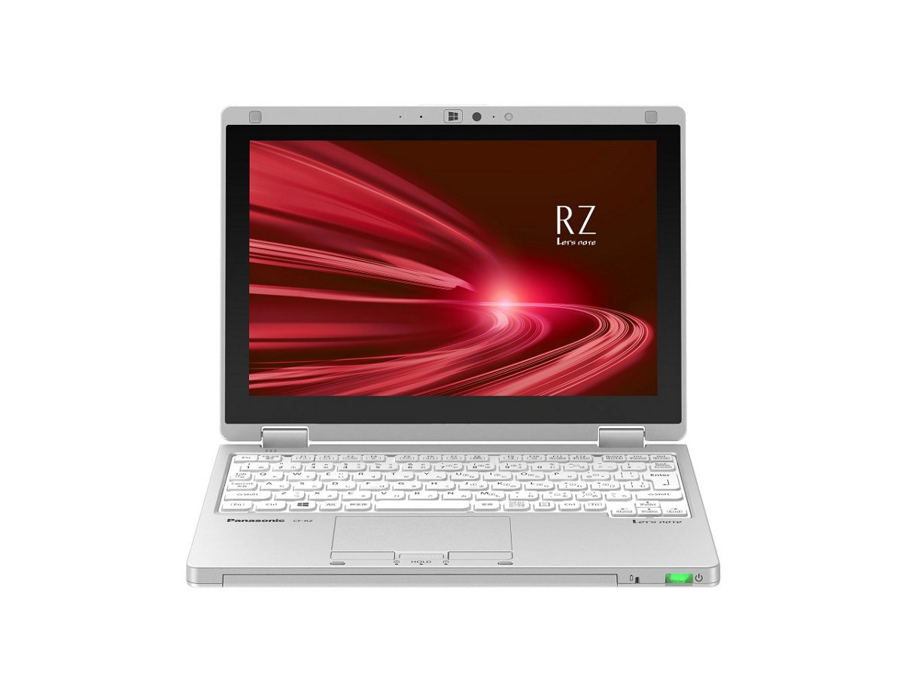
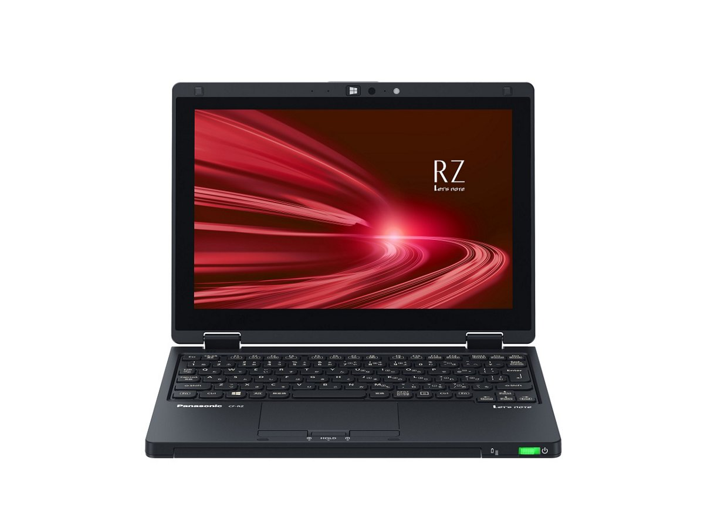
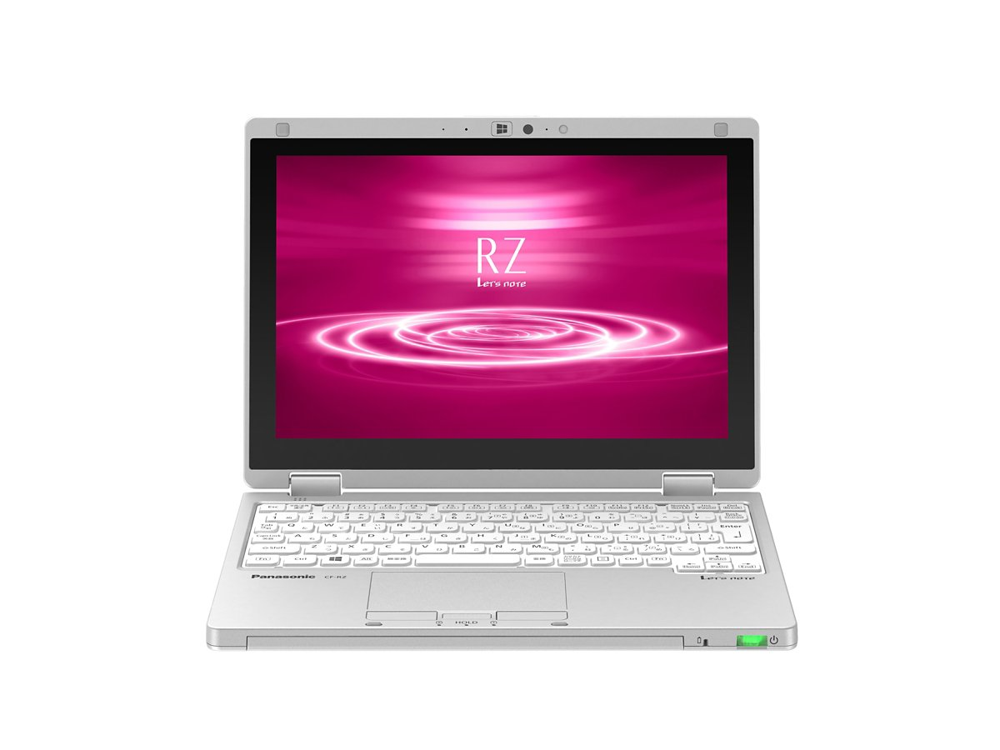
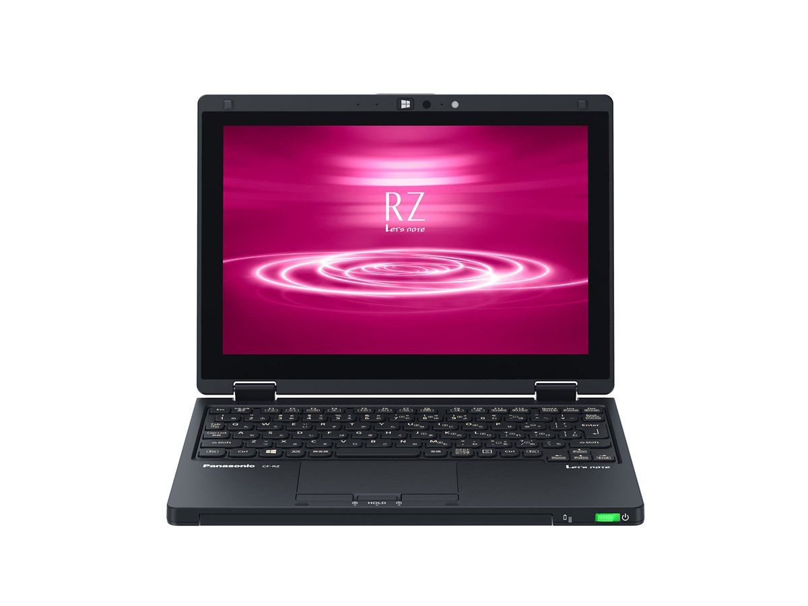
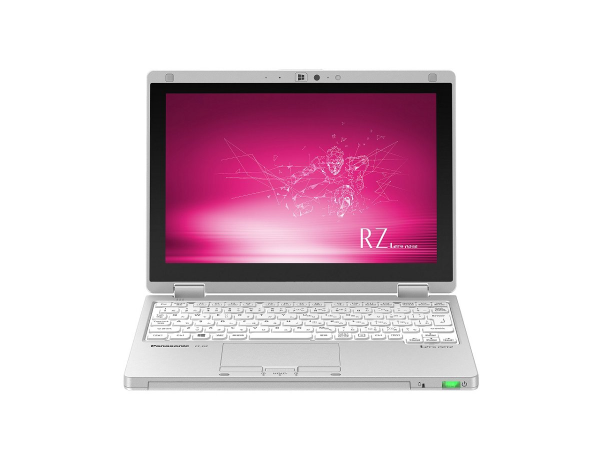
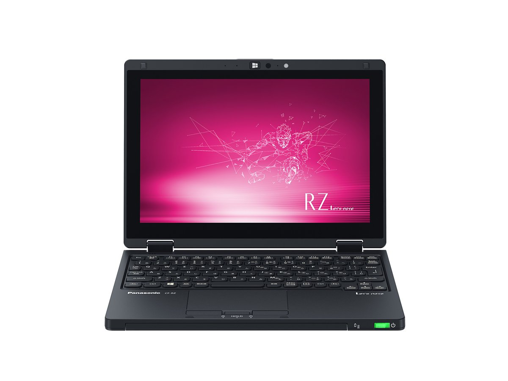

# レッツノート CF-RZ8 スペック・仕様一覧

[English](../../en/CF-RZ8/) · **日本語** · [中文](../../zh/CF-RZ8/)

パナソニック レッツノート **CF-RZ8**（RZシリーズ・10.1型 WUXGA液晶）の全14品番（2019-01 – 2021-01発売）のスペック・仕様をまとめたページです。各品番の公式仕様表へのリンクも掲載しています。

*レッツノート CF-RZ8（CF-RZ8QDEQR, CF-RZ8ADEQR, CF-RZ8HDEQR）・シルバー。画像 © Panasonic*

## 品番一覧

| 品番 | 発売 | 生産終了 | 主な仕様 |
| :-- | :-- | :-- | :-- |
| [CF-RZ8QDEQR](https://panasonic.jp/pc/p-db/CF-RZ8QDEQR_spec.html) | 2021-01 | 2022-01 | Windows 10 Pro 64ビット、Intel® CoreTM i5-8200Y プロセッサー、メモリー：8GB（空きスロットなし）、SSD：256GB、LAN、無線LAN 802.11a（W52/W53/W56）/b/g/n/ac、Microsoft® Office Home and Business 2019 |
| [CF-RZ8QFMQR](https://panasonic.jp/pc/p-db/CF-RZ8QFMQR_spec.html) | 2021-01 | 2022-01 | Windows 10 Pro 64ビット、Intel® CoreTM i5-8200Y プロセッサー、メモリー：16GB（空きスロットなし）、SSD：256GB、LAN、無線LAN 802.11a（W52/W53/W56）/b/g/n/ac、LTE対応ワイヤレスWAN、Microsoft® Office Home and Business 2019 |
| [CF-RZ8ADEQR](https://panasonic.jp/pc/p-db/CF-RZ8ADEQR_spec.html) | 2020-10 | 2021-10 | Windows 10 Pro 64ビット、Intel® CoreTM i5-8200Y プロセッサー、メモリー：8GB（空きスロットなし）、SSD：256GB、LAN、無線LAN 802.11a（W52/W53/W56）/b/g/n/ac、Microsoft® Office Home and Business 2019 |
| [CF-RZ8AFMQR](https://panasonic.jp/pc/p-db/CF-RZ8AFMQR_spec.html) | 2020-10 | 2021-10 | Windows 10 Pro 64ビット、Intel® CoreTM i5-8200Y プロセッサー、メモリー：16GB（空きスロットなし）、SSD：256GB、LAN、無線LAN 802.11a（W52/W53/W56）/b/g/n/ac、LTE対応ワイヤレスWAN、Microsoft® Office Home and Business 2019 |
| [CF-RZ8HDEQR](https://panasonic.jp/pc/p-db/CF-RZ8HDEQR_spec.html) | 2020-06 | 2020-09 | Windows 10 Pro 64ビット、Intel® CoreTM i5-8200Y プロセッサー、メモリー：8GB（空きスロットなし）、SSD：256GB、LAN、無線LAN 802.11a（W52/W53/W56）/b/g/n/ac、Microsoft® Office Home and Business 2019 |
| [CF-RZ8HFMQR](https://panasonic.jp/pc/p-db/CF-RZ8HFMQR_spec.html) | 2020-06 | 2020-09 | Windows 10 Pro 64ビット、Intel® CoreTM i5-8200Y プロセッサー、メモリー：16GB（空きスロットなし）、SSD：256GB、LAN、無線LAN 802.11a（W52/W53/W56）/b/g/n/ac、LTE対応ワイヤレスWAN、Microsoft® Office Home and Business 2019 |
| [CF-RZ8NDEQR](https://panasonic.jp/pc/p-db/CF-RZ8NDEQR_spec.html) | 2020-01 | 2020-10 | Windows 10 Pro 64ビット、Intel® CoreTM i5-8200Y プロセッサー、メモリー：8GB（空きスロットなし）、SSD：256GB、LAN、無線LAN 802.11a（W52/W53/W56）/b/g/n/ac、Microsoft® Office Home and Business 2019 |
| [CF-RZ8NFMQR](https://panasonic.jp/pc/p-db/CF-RZ8NFMQR_spec.html) | 2020-01 | 2020-10 | Windows 10 Pro 64ビット、Intel® CoreTM i5-8200Y プロセッサー、メモリー：16GB（空きスロットなし）、SSD：256GB、LAN、無線LAN 802.11a（W52/W53/W56）/b/g/n/ac、LTE対応ワイヤレスWAN、Microsoft® Office Home and Business 2019 |
| [CF-RZ8FDEQR](https://panasonic.jp/pc/p-db/CF-RZ8FDEQR_spec.html) | 2019-10 | 2020-05 | Windows 10 Pro 64ビット、Intel® CoreTM i5-8200Y プロセッサー、メモリー：8GB（拡張スロットなし）、SSD：256GB、LAN、無線LAN 802.11a（W52/W53/W56）/b/g/n/ac、Microsoft® Office Home and Business 2019 |
| [CF-RZ8FFMQR](https://panasonic.jp/pc/p-db/CF-RZ8FFMQR_spec.html) | 2019-10 | 2020-05 | Windows 10 Pro 64ビット、Intel® CoreTM i5-8200Y プロセッサー、メモリー：16GB（拡張スロットなし）、SSD：256GB、LAN、無線LAN 802.11a（W52/W53/W56）/b/g/n/ac、LTE対応ワイヤレスWAN、Microsoft® Office Home and Business 2019 |
| [CF-RZ8KDEQR](https://panasonic.jp/pc/p-db/CF-RZ8KDEQR_spec.html) | 2019-06 | 2020-01 | Windows 10 Pro 64ビット、Intel® CoreTM i5-8200Y プロセッサー、メモリー：8GB（拡張スロットなし）、SSD：256GB、LAN、無線LAN 802.11a（W52/W53/W56）/b/g/n/ac、Microsoft® Office Home and Business 2019 |
| [CF-RZ8KFMQR](https://panasonic.jp/pc/p-db/CF-RZ8KFMQR_spec.html) | 2019-06 | 2020-01 | Windows 10 Pro 64ビット、Intel® CoreTM i5-8200Y プロセッサー、メモリー：8GB（拡張スロットなし）、SSD：256GB、LAN、無線LAN 802.11a（W52/W53/W56）/b/g/n/ac、LTE対応ワイヤレスWAN、Microsoft® Office Home and Business 2019 |
| [CF-RZ8CFMQR](https://panasonic.jp/pc/p-db/CF-RZ8CFMQR_spec.html) | 2019-01 | 2019-10 | Windows 10 Pro 64ビット、Intel® CoreTM i5-8200Y プロセッサー、メモリー：8GB（拡張スロットなし）、SSD：256GB、LAN、無線LAN 802.11a（W52/W53/W56）/b/g/n/ac、LTE対応ワイヤレスWAN、Microsoft® Office Home and Business 2019 |
| [CF-RZ8BDFQR](https://panasonic.jp/pc/p-db/CF-RZ8BDFQR_spec.html) | 2019-01 | 2019-10 | Windows 10 Pro 64ビット、Intel® CoreTM m3-8100Y プロセッサー、メモリー：8GB（拡張スロットなし）、SSD：128GB、LAN、無線LAN 802.11a（W52/W53/W56）/b/g/n/ac、Microsoft® Office Home and Business 2019 |

## 共通仕様

| 項目 | 仕様 |
| :-- | :-- |
| チップセット | CPUに内蔵 |
| 表示方式 | 10.1型(16:10) WUXGA TFTカラーIPS液晶 （1920×1200ドット）、静電マルチタッチパネル、アンチグレア保護フィルム付 |
| 表示方式 / LCD表示 | 1920×1200ドット：約1677万色 |
| 表示方式 / 外部ディスプレイ出力 | 1024×768、1280×768、1280×1024、1360×768、1366×768、1400×1050、1600×900、1600×1200、1680×1050、1920×1080、1920×1200ドット：約1677万色 / HDMI出力のみ：3840×2160（30 Hz/60 Hz）、4096×2160（30 Hz/60 Hz） |
| 表示方式 / 本体＋外部ディスプレイ同時表示 | 1024×768、1280×768、1280×1024、1360×768、1366×768、1400×1050、1600×900、1600×1200、1680×1050、1920×1080、1920×1200ドット：約1677万色 |
| LAN | 1000BASE-T/100BASE-TX/10BASE-T |
| Bluetooth | Bluetooth v4.2 / ■対応プロファイル / 【Classic】 / ・A2DP（Source） / ・AVRCP（Target） / ・HCRP（Client） / ・HFP（AG） / ・HID（Host） / ・OPP（ClientおよびServer） / ・PAN（User） / ・SPP（DevAおよびDevB） / 【Low Energy】 / ・HOGP（Host） |
| セキュリティチップ | TPM（TCG V2.0準拠） |
| 拡張メモリースロット | なし |
| カメラ | 有効画素数：最大1920×1080ピクセル(約207万画素) |
| 内蔵マイク | アレイマイク |
| センサー | 照度センサー / 地磁気センサー / ジャイロセンサー / 加速度センサー |
| キーボード | OADG準拠86キー、キーピッチ16.8mm(横)/14.2mm(縦)(一部キーを除く） |
| ポインティングデバイス | 静電タッチパネル（10フィンガー対応）/タッチパッド |
| 電源 | ▼ACアダプター / 入力：AC100V～240V、50Hz/60Hz、出力：DC16V、2.8A、電源コードは100V専用 / ▼バッテリーパック / 7.6V（リチウムイオン）・定格容量4740mAh |
| 消費電力 | 最大約45W |
| Microsoft Office | Microsoft® Office Home and Business 2019 |

## 品番別の違い

| 品番 | CPU | メモリー | ストレージ | 質量 | 駆動時間 |
| :-- | :-- | :-- | :-- | :-- | :-- |
| CF-RZ8QDEQR | Core i5-8200Y | 8GB LPDDR3 SDRAM | 256GB | 0.75 kg | 11 h |
| CF-RZ8QFMQR | Core i5-8200Y | 16GB LPDDR3 SDRAM | 256GB | 0.78 kg | 10.5 h |
| CF-RZ8ADEQR | Core i5-8200Y | 8GB LPDDR3 SDRAM | 256GB | 0.75 kg | 11 h |
| CF-RZ8AFMQR | Core i5-8200Y | 16GB LPDDR3 SDRAM | 256GB | 0.78 kg | 10.5 h |
| CF-RZ8HDEQR | Core i5-8200Y | 8GB LPDDR3 SDRAM | 256GB | 0.75 kg | 11 h |
| CF-RZ8HFMQR | Core i5-8200Y | 16GB LPDDR3 SDRAM | 256GB | 0.78 kg | 10.5 h |
| CF-RZ8NDEQR | Core i5-8200Y | 8GB LPDDR3 SDRAM | 256GB | 0.75 kg | 11 h |
| CF-RZ8NFMQR | Core i5-8200Y | 16GB LPDDR3 SDRAM | 256GB | 0.78 kg | 10.5 h |
| CF-RZ8FDEQR | Core i5-8200Y | 8GB LPDDR3 SDRAM | 256GB | 0.75 kg | 11 h |
| CF-RZ8FFMQR | Core i5-8200Y | 16GB LPDDR3 SDRAM | 256GB | 0.78 kg | 10.5 h |
| CF-RZ8KDEQR | Core i5-8200Y | 8GB LPDDR3 SDRAM | 256GB | 0.75 kg | 11.5 h |
| CF-RZ8KFMQR | Core i5-8200Y | 8GB LPDDR3 SDRAM | 256GB | 0.78 kg | 11.5 h |
| CF-RZ8CFMQR | Core i5-8200Y | 8GB LPDDR3 SDRAM | 256GB | 0.78 kg | 11.5 h |
| CF-RZ8BDFQR | Core m3-8100Y | 8GB LPDDR3 SDRAM | 128GB | 0.75 kg | 11.5 h |

CF-RZ8QDEQR の仕様の違い（すべて）

| 項目 | 仕様 |
| :-- | :-- |
| 搭載OS | Windows 10 Pro 64ビット |
| CPU | インテル® Core™ i5-8200Y プロセッサー / (キャッシュ4MB、動作周波数1.30GHz、インテル® ターボ・ブースト・テクノロジー2.0利用時は最大3.90GHz） |
| コア数 | 2コア |
| メインメモリー | 8GB LPDDR3 SDRAM（拡張スロットなし） |
| ビデオメモリー | 最大4169MB (メインメモリーと共用) |
| フラッシュメモリードライブ | フラッシュメモリードライブ（SSD）256GB（PCIe）上記容量のうち約15GBをリカバリー領域、約1GBをシステム領域として使用（ユーザー使用不可） |
| 光学式ドライブ | 搭載されていません |
| 表示方式 / グラフィックアクセラレーター | インテル® UHD グラフィックス615（CPUに内蔵） |
| ワイヤレス通信機能 | インテル® Dual Band Wireless-AC 8265 |
| 無線LAN | IEEE802.11a/b/g/n/ac 準拠（5 GHzチャンネル帯：W52/W53/W56）WPA2-AES/TKIP対応、Wi-Fi準拠 |
| LTE | 搭載されていません |
| サウンド機能 | PCM音源（24ビットステレオ）、インテル® High Definition Audio準拠、モノラルスピーカー |
| SDメモリーカードスロット | SDメモリーカード×1スロット（SDHCメモリーカード/SDXCメモリーカード対応/著作権保護技術対応/UHS-I・UHS-Ⅱ高速転送対応） |
| インターフェース | ・USB3.0 Type-Aポート×3（うち１つはUSB充電ポートを兼ねる） / ・LANコネクター（RJ-45） / ・外部ディスプレイコネクター（アナログRGB ミニD-sub 15ピン） / ・HDMI出力端子（4K60p出力対応） / ・ヘッドセット端子（マイク入力＋オーディオ出力）（ヘッドセットミニジャック3.5mm、CTIA準拠） |
| エネルギー消費効率 | 目標年度2022年度 10区分15.5［kWh/年］ |
| 達成率 | 省エネ基準達成率76％ |
| 駆動／充電時間 | ▼駆動時間 / （JEITA Ver.2.0） / 約11時間 / ▼充電時間 / 約2.5時間（電源ON時/OFF時ともに） |
| 外形寸法(幅×奥行×高さ) | 幅250.0mm × 奥行180.8mm × 高さ19.5mm（突起部除く） |
| 本体カラー | シルバー |
| 質量(バッテリーを含む） | パソコン本体：約0.75kg（付属バッテリーパック(約200ｇ）装着時） / ACアダプター：約185g（ウォールマウントプラグ（約20g）電源コード（約60g）除く） |
| ソフトウェア | ・Microsoft® Internet Explorer 11 / ・Microsoft® Edge / ・Microsoft® .NET Framework 4.8 / ・Microsoft® Windows Media Player 12 / ・マカフィーリブセーフ（60日間 無料体験版） / ・i-フィルター6.0 (30日間無料お試し版) / ・WinZip 20.5日本語版（45日体験版） / ・Aptioセットアップユーティリティ / ・PC-Diagnosticユーティリティ / ・Panasonic PC設定ユーティリティ / ・ハードディスクデータ消去ユーティリティ / ・DirectX 12 / ・PC情報ビューアー / ・Panasonic PC リカバリーディスク作成ユーティリティ / ・Panasonic PC Camera Utility |
| 付属品 | バッテリーパック、ACアダプター（ウォールマウントプラグ付き）、専用布、取扱説明書、Microsoft Office Home & Business 2019等 |

公式仕様表: <https://panasonic.jp/pc/p-db/CF-RZ8QDEQR_spec.html>

CF-RZ8QFMQR の仕様の違い（すべて）

| 項目 | 仕様 |
| :-- | :-- |
| 搭載OS | Windows 10 Pro 64ビット |
| CPU | インテル® Core™ i5-8200Y プロセッサー / (キャッシュ4MB、動作周波数1.30GHz、インテル® ターボ・ブースト・テクノロジー2.0利用時は最大3.90GHz） |
| コア数 | 2コア |
| メインメモリー | 16GB LPDDR3 SDRAM（拡張スロットなし） |
| ビデオメモリー | 最大8265MB (メインメモリーと共用) |
| フラッシュメモリードライブ | フラッシュメモリードライブ（SSD）256GB（PCIe）上記容量のうち約15GBをリカバリー領域、約1GBをシステム領域として使用（ユーザー使用不可） |
| 光学式ドライブ | 搭載されていません |
| 表示方式 / グラフィックアクセラレーター | インテル® UHD グラフィックス615（CPUに内蔵） |
| ワイヤレス通信機能 | インテル® Dual Band Wireless-AC 8265 |
| 無線LAN | IEEE802.11a/b/g/n/ac 準拠（5 GHzチャンネル帯：W52/W53/W56）WPA2-AES/TKIP対応、Wi-Fi準拠 |
| LTE | ワイヤレスWANモジュール内蔵（LTE対応） |
| サウンド機能 | PCM音源（24ビットステレオ）、インテル® High Definition Audio準拠、モノラルスピーカー |
| インターフェース | ・USB3.0 Type-Aポート×3（うち１つはUSB充電ポートを兼ねる） / ・LANコネクター（RJ-45） / ・外部ディスプレイコネクター（アナログRGB ミニD-sub 15ピン） / ・HDMI出力端子（4K60p出力対応） / ・ヘッドセット端子（マイク入力＋オーディオ出力）（ヘッドセットミニジャック3.5mm、CTIA準拠） |
| エネルギー消費効率 | 目標年度2022年度 10区分15.5［kWh/年］ |
| 達成率 | 省エネ基準達成率86％ |
| 駆動／充電時間 | ▼駆動時間 / （JEITA Ver.2.0） / 約10.5時間 / ▼充電時間 / 約2.5時間（電源ON時/OFF時ともに） |
| 外形寸法(幅×奥行×高さ) | 幅250.0mm × 奥行180.8mm × 高さ19.5mm（突起部除く） |
| 本体カラー | ブラック |
| 質量(バッテリーを含む） | パソコン本体：約0.78kg（付属バッテリーパック(約200ｇ）装着時） / ACアダプター：約185g（ウォールマウントプラグ（約20g）電源コード（約60g）除く） |
| ソフトウェア | ・Microsoft® Internet Explorer 11 / ・Microsoft® Edge / ・Microsoft® .NET Framework 4.8 / ・Microsoft® Windows Media Player 12 / ・マカフィーリブセーフ（60日間 無料体験版） / ・i-フィルター6.0 (30日間無料お試し版) / ・WinZip 20.5日本語版（45日体験版） / ・Aptioセットアップユーティリティ / ・PC-Diagnosticユーティリティ / ・Panasonic PC設定ユーティリティ / ・ハードディスクデータ消去ユーティリティ / ・DirectX 12 / ・PC情報ビューアー / ・Panasonic PC リカバリーディスク作成ユーティリティ / ・Panasonic PC Camera Utility |
| 付属品 | バッテリーパック、ACアダプター（ウォールマウントプラグ付き）、専用布、取扱説明書、Microsoft Office Home & Business 2019等 |
| カードスロット / SDメモリーカードスロット | SDメモリーカード×1スロット（SDHCメモリーカード/SDXCメモリーカード対応/著作権保護技術対応/UHS-I・UHS-Ⅱ高速転送対応） |
| カードスロット / その他カードスロット | nano SIMカードスロット |

公式仕様表: <https://panasonic.jp/pc/p-db/CF-RZ8QFMQR_spec.html>

CF-RZ8ADEQR の仕様の違い（すべて）

| 項目 | 仕様 |
| :-- | :-- |
| 搭載OS | Windows 10 Pro 64ビット |
| CPU | インテル® Core™ i5-8200Y プロセッサー / (インテル®スマートキャッシュ4MB、動作周波数1.30GHz、インテル® ターボ・ブースト・テクノロジー2.0利用時は最大3.90GHz） |
| コア数 | 2コア |
| メインメモリー | 8GB LPDDR3 SDRAM（拡張スロットなし） |
| ビデオメモリー | 最大4169MB (メインメモリーと共用) |
| フラッシュメモリードライブ | フラッシュメモリードライブ（SSD）256GB（PCIe）上記容量のうち約15GBをリカバリー領域、約1GBをシステム領域として使用（ユーザー使用不可） |
| 光学式ドライブ | 搭載されていません |
| 表示方式 / グラフィックアクセラレーター | インテル® UHD グラフィックス615（CPUに内蔵） |
| ワイヤレス通信機能 | インテル® Dual Band Wireless-AC 8265 |
| 無線LAN | IEEE802.11a（W52/W53/W56）/b/g/n/ac 準拠（WPA2-AES/TKIP対応、Wi-Fi準拠） |
| LTE | 搭載されていません |
| サウンド機能 | PCM音源（24ビットステレオ）、インテル® High Definition Audio準拠、モノラルスピーカー |
| SDメモリーカードスロット | SDメモリーカード×1スロット（SDHCメモリーカード/SDXCメモリーカード対応/著作権保護技術対応/UHS-I・UHS-Ⅱ高速転送対応） |
| インターフェース | ・USB3.0 Type-Aポート×3（うち１つはUSB充電ポートを兼ねる） / ・LANコネクター（RJ-45） / ・外部ディスプレイコネクター（アナログRGB ミニD-sub 15ピン） / ・HDMI出力端子（4K60p出力対応） / ・ヘッドセット端子（マイク入力＋オーディオ出力）（ヘッドセットミニジャック3.5mm、CTIA準拠） |
| エネルギー消費効率 | 目標年度2022年度 10区分15.5［kWh/年］ |
| 達成率 | 省エネ基準達成率76％ |
| 駆動／充電時間 | ▼駆動時間 / （JEITA Ver.2.0） / 約11時間 / ▼充電時間 / 約2.5時間（電源ON時/OFF時ともに） |
| 外形寸法(幅×奥行×高さ) | 幅250.0mm × 奥行180.8mm × 高さ19.5mm（突起部除く） |
| 本体カラー | シルバー |
| 質量(バッテリーを含む） | パソコン本体：約0.75kg（付属バッテリーパック(約200ｇ）装着時） / ACアダプター：約185g（ウォールマウントプラグ（約20g）電源コード（約60g）除く） |
| ソフトウェア | ・Microsoft® Internet Explorer 11 / ・Microsoft® Edge / ・Microsoft® .NET Framework 4.8 / ・Microsoft® Windows Media Player 12 / ・マカフィーリブセーフ（60日間 無料体験版） / ・i-フィルター6.0 (30日間無料お試し版) / ・WinZip 20.5日本語版（45日体験版） / ・Aptioセットアップユーティリティ / ・PC-Diagnosticユーティリティ / ・Panasonic PC設定ユーティリティ / ・ハードディスクデータ消去ユーティリティ / ・DirectX 12 / ・Panasonic PC 画面共有アシストユーティリティ / ・PC情報ビューアー / ・Panasonic PC リカバリーディスク作成ユーティリティ / ・Panasonic PC Camera Utility |
| 付属品 | バッテリーパック、ACアダプター（ウォールマウントプラグ付き）、専用布、取扱説明書、Microsoft Office Home & Business 2019等 |

公式仕様表: <https://panasonic.jp/pc/p-db/CF-RZ8ADEQR_spec.html>

CF-RZ8AFMQR の仕様の違い（すべて）

| 項目 | 仕様 |
| :-- | :-- |
| 搭載OS | Windows 10 Pro 64ビット |
| CPU | インテル® Core™ i5-8200Y プロセッサー / (インテル®スマートキャッシュ4MB、動作周波数1.30GHz、インテル® ターボ・ブースト・テクノロジー2.0利用時は最大3.90GHz） |
| コア数 | 2コア |
| メインメモリー | 16GB LPDDR3 SDRAM（拡張スロットなし） |
| ビデオメモリー | 最大8265MB (メインメモリーと共用) |
| フラッシュメモリードライブ | フラッシュメモリードライブ（SSD）256GB（PCIe）上記容量のうち約15GBをリカバリー領域、約1GBをシステム領域として使用（ユーザー使用不可） |
| 光学式ドライブ | 搭載されていません |
| 表示方式 / グラフィックアクセラレーター | インテル® UHD グラフィックス615（CPUに内蔵） |
| ワイヤレス通信機能 | インテル® Dual Band Wireless-AC 8265 |
| 無線LAN | IEEE802.11a（W52/W53/W56）/b/g/n/ac 準拠（WPA2-AES/TKIP対応、Wi-Fi準拠） |
| LTE | ワイヤレスWANモジュール内蔵（LTE対応） |
| サウンド機能 | PCM音源（24ビットステレオ）、インテル® High Definition Audio準拠、モノラルスピーカー |
| インターフェース | ・USB3.0 Type-Aポート×3（うち１つはUSB充電ポートを兼ねる） / ・LANコネクター（RJ-45） / ・外部ディスプレイコネクター（アナログRGB ミニD-sub 15ピン） / ・HDMI出力端子（4K60p出力対応） / ・ヘッドセット端子（マイク入力＋オーディオ出力）（ヘッドセットミニジャック3.5mm、CTIA準拠） |
| エネルギー消費効率 | 目標年度2022年度 10区分15.5［kWh/年］ |
| 達成率 | 省エネ基準達成率86％ |
| 駆動／充電時間 | ▼駆動時間 / （JEITA Ver.2.0） / 約10.5時間 / ▼充電時間 / 約2.5時間（電源ON時/OFF時ともに） |
| 外形寸法(幅×奥行×高さ) | 幅250.0mm × 奥行180.8mm × 高さ19.5mm（突起部除く） |
| 本体カラー | ブラック |
| 質量(バッテリーを含む） | パソコン本体：約0.78kg（付属バッテリーパック(約200ｇ）装着時） / ACアダプター：約185g（ウォールマウントプラグ（約20g）電源コード（約60g）除く） |
| ソフトウェア | ・Microsoft® Internet Explorer 11 / ・Microsoft® Edge / ・Microsoft® .NET Framework 4.8 / ・Microsoft® Windows Media Player 12 / ・マカフィーリブセーフ（60日間 無料体験版） / ・i-フィルター6.0 (30日間無料お試し版) / ・WinZip 20.5日本語版（45日体験版） / ・Aptioセットアップユーティリティ / ・PC-Diagnosticユーティリティ / ・Panasonic PC設定ユーティリティ / ・ハードディスクデータ消去ユーティリティ / ・DirectX 12 / ・Panasonic PC 画面共有アシストユーティリティ / ・PC情報ビューアー / ・Panasonic PC リカバリーディスク作成ユーティリティ / ・Panasonic PC Camera Utility |
| 付属品 | バッテリーパック、ACアダプター（ウォールマウントプラグ付き）、専用布、取扱説明書、Microsoft Office Home & Business 2019等 |
| カードスロット / SDメモリーカードスロット | SDメモリーカード×1スロット（SDHCメモリーカード/SDXCメモリーカード対応/著作権保護技術対応/UHS-I・UHS-Ⅱ高速転送対応） |
| カードスロット / その他カードスロット | nano SIMカードスロット |

公式仕様表: <https://panasonic.jp/pc/p-db/CF-RZ8AFMQR_spec.html>

CF-RZ8HDEQR の仕様の違い（すべて）

| 項目 | 仕様 |
| :-- | :-- |
| 搭載OS | Windows 10 Pro 64ビット |
| CPU | インテル® Core™ i5-8200Y プロセッサー / (インテル®スマートキャッシュ4MB、動作周波数1.30GHz、インテル® ターボ・ブースト・テクノロジー2.0利用時は最大3.90GHz） |
| コア数 | 2コア |
| メインメモリー | 8GB LPDDR3 SDRAM（拡張スロットなし） |
| ビデオメモリー | 最大4169MB (メインメモリーと共用) |
| フラッシュメモリードライブ | フラッシュメモリードライブ（SSD）256GB（PCIe）上記容量のうち約15GBをリカバリー領域、約1GBをシステム領域として使用（ユーザー使用不可） |
| 光学式ドライブ | 搭載されていません |
| 表示方式 / グラフィックアクセラレーター | インテル® UHD グラフィックス615（CPUに内蔵） |
| ワイヤレス通信機能 | インテル® Dual Band Wireless-AC 8265 |
| 無線LAN | IEEE802.11a（W52/W53/W56）/b/g/n/ac 準拠（WPA2-AES/TKIP対応、Wi-Fi準拠） |
| LTE | 搭載されていません |
| サウンド機能 | PCM音源（24ビットステレオ）、インテル® High Definition Audio準拠、モノラルスピーカー |
| SDメモリーカードスロット | SDメモリーカード×1スロット（SDHCメモリーカード/SDXCメモリーカード対応/著作権保護技術対応/UHS-I・UHS-Ⅱ高速転送対応） |
| インターフェース | ・USB3.0 Type-Aポート×3（うち１つはUSB充電ポートを兼ねる） / ・LANコネクター（RJ-45） / ・外部ディスプレイコネクター（アナログRGB ミニD-sub 15ピン） / ・HDMI出力端子（4K60p出力対応） / ・ヘッドセット端子（マイク入力＋オーディオ出力）（ヘッドセットミニジャック3.5mm、CTIA準拠） |
| エネルギー消費効率 | 目標年度2022年度 10区分15.5［kWh/年］ |
| 達成率 | 省エネ基準達成率76％ |
| 駆動／充電時間 | ▼駆動時間 / （JEITA Ver.2.0） / 約11時間 / ▼充電時間 / 約2.5時間（電源ON時/OFF時ともに） |
| 外形寸法(幅×奥行×高さ) | 幅250.0mm × 奥行180.8mm × 高さ19.5mm（突起部除く） |
| 本体カラー | シルバー |
| 質量(バッテリーを含む） | パソコン本体：約0.75kg（付属バッテリーパック(約200ｇ）装着時） / ACアダプター：約185g（ウォールマウントプラグ（約20g）電源コード（約60g）除く） |
| ソフトウェア | ・Microsoft® Internet Explorer 11 / ・Microsoft® Edge / ・Microsoft® .NET Framework 4.8 / ・Microsoft® Windows Media Player 12 / ・マカフィーリブセーフ（60日間 無料体験版） / ・i-フィルター6.0 (30日間無料お試し版) / ・WinZip 20.5日本語版（45日体験版） / ・Aptioセットアップユーティリティ / ・PC-Diagnosticユーティリティ / ・Panasonic PC設定ユーティリティ / ・ハードディスクデータ消去ユーティリティ / ・DirectX 12 / ・Panasonic PC 画面共有アシストユーティリティ / ・PC情報ビューアー / ・Panasonic PC リカバリーディスク作成ユーティリティ / ・Panasonic PC Camera Utility |
| 付属品 | バッテリーパック、ACアダプター（ウォールマウントプラグ付き）、専用布、取扱説明書、Microsoft Office Home & Business 2019等 |

公式仕様表: <https://panasonic.jp/pc/p-db/CF-RZ8HDEQR_spec.html>

CF-RZ8HFMQR の仕様の違い（すべて）

| 項目 | 仕様 |
| :-- | :-- |
| 搭載OS | Windows 10 Pro 64ビット |
| CPU | インテル® Core™ i5-8200Y プロセッサー / (インテル®スマートキャッシュ4MB、動作周波数1.30GHz、インテル® ターボ・ブースト・テクノロジー2.0利用時は最大3.90GHz） |
| コア数 | 2コア |
| メインメモリー | 16GB LPDDR3 SDRAM（拡張スロットなし） |
| ビデオメモリー | 最大8265MB (メインメモリーと共用) |
| フラッシュメモリードライブ | フラッシュメモリードライブ（SSD）256GB（PCIe）上記容量のうち約15GBをリカバリー領域、約1GBをシステム領域として使用（ユーザー使用不可） |
| 光学式ドライブ | 搭載されていません |
| 表示方式 / グラフィックアクセラレーター | インテル® UHD グラフィックス615（CPUに内蔵） |
| ワイヤレス通信機能 | インテル® Dual Band Wireless-AC 8265 |
| 無線LAN | IEEE802.11a（W52/W53/W56）/b/g/n/ac 準拠（WPA2-AES/TKIP対応、Wi-Fi準拠） |
| LTE | ワイヤレスWANモジュール内蔵（LTE対応） |
| サウンド機能 | PCM音源（24ビットステレオ）、インテル® High Definition Audio準拠、モノラルスピーカー |
| インターフェース | ・USB3.0 Type-Aポート×3（うち１つはUSB充電ポートを兼ねる） / ・LANコネクター（RJ-45） / ・外部ディスプレイコネクター（アナログRGB ミニD-sub 15ピン） / ・HDMI出力端子（4K60p出力対応） / ・ヘッドセット端子（マイク入力＋オーディオ出力）（ヘッドセットミニジャック3.5mm、CTIA準拠） |
| エネルギー消費効率 | 目標年度2022年度 10区分15.5［kWh/年］ |
| 達成率 | 省エネ基準達成率86％ |
| 駆動／充電時間 | ▼駆動時間 / （JEITA Ver.2.0） / 約10.5時間 / ▼充電時間 / 約2.5時間（電源ON時/OFF時ともに） |
| 外形寸法(幅×奥行×高さ) | 幅250.0mm × 奥行180.8mm × 高さ19.5mm（突起部除く） |
| 本体カラー | ブラック |
| 質量(バッテリーを含む） | パソコン本体：約0.78kg（付属バッテリーパック(約200ｇ）装着時） / ACアダプター：約185g（ウォールマウントプラグ（約20g）電源コード（約60g）除く） |
| ソフトウェア | ・Microsoft® Internet Explorer 11 / ・Microsoft® Edge / ・Microsoft® .NET Framework 4.8 / ・Microsoft® Windows Media Player 12 / ・マカフィーリブセーフ（60日間 無料体験版） / ・i-フィルター6.0 (30日間無料お試し版) / ・WinZip 20.5日本語版（45日体験版） / ・Aptioセットアップユーティリティ / ・PC-Diagnosticユーティリティ / ・Panasonic PC設定ユーティリティ / ・ハードディスクデータ消去ユーティリティ / ・DirectX 12 / ・Panasonic PC 画面共有アシストユーティリティ / ・PC情報ビューアー / ・Panasonic PC リカバリーディスク作成ユーティリティ / ・Panasonic PC Camera Utility |
| 付属品 | バッテリーパック、ACアダプター（ウォールマウントプラグ付き）、専用布、取扱説明書、Microsoft Office Home & Business 2019等 |
| カードスロット / SDメモリーカードスロット | SDメモリーカード×1スロット（SDHCメモリーカード/SDXCメモリーカード対応/著作権保護技術対応/UHS-I・UHS-Ⅱ高速転送対応） |
| カードスロット / その他カードスロット | nano SIMカードスロット |

公式仕様表: <https://panasonic.jp/pc/p-db/CF-RZ8HFMQR_spec.html>

CF-RZ8NDEQR の仕様の違い（すべて）

| 項目 | 仕様 |
| :-- | :-- |
| 搭載OS | Windows 10 Pro 64ビット |
| CPU | インテル® Core™ i5-8200Y プロセッサー / (インテル®スマートキャッシュ4MB、動作周波数1.30GHz、インテル® ターボ・ブースト・テクノロジー2.0利用時は最大3.90GHz） |
| メインメモリー | 8GB LPDDR3 SDRAM（拡張スロットなし） |
| ビデオメモリー | 最大4169MB (メインメモリーと共用) |
| フラッシュメモリードライブ | フラッシュメモリードライブ（SSD）256GB（PCIe）上記容量のうち約15GBをリカバリー領域、約1GBをシステム領域として使用（ユーザー使用不可） |
| 光学式ドライブ | 搭載されていません |
| 表示方式 / グラフィックアクセラレーター | インテル® UHD グラフィックス615（CPUに内蔵） |
| ワイヤレス通信機能 | インテル® Dual Band Wireless-AC 8265 |
| 無線LAN | IEEE802.11a（W52/W53/W56）/b/g/n/ac 準拠（WPA2-AES/TKIP対応、Wi-Fi準拠） |
| LTE | 搭載されていません |
| サウンド機能 | PCM音源（24ビットステレオ）、インテル® High Definition Audio準拠、モノラルスピーカー |
| SDメモリーカードスロット | SDメモリーカード×1スロット（SDHCメモリーカード/SDXCメモリーカード対応/著作権保護技術対応/UHS-I・UHS-Ⅱ高速転送対応） |
| インターフェース | ・USB3.0 Type-Aポート×3（うち１つはUSB充電ポートを兼ねる） / ・LANコネクター（RJ-45） / ・外部ディスプレイコネクター（アナログRGB ミニD-sub 15ピン） / ・HDMI出力端子（4K60p出力対応） / ・ヘッドセット端子（マイク入力＋オーディオ出力）（ヘッドセットミニジャック3.5mm、CTIA準拠） |
| エネルギー消費効率 | 目標年度2022年度基準 10区分15.5［kWh/年］ |
| 達成率 | 省エネ基準達成率76％ |
| 駆動／充電時間 | ▼駆動時間 / （JEITA Ver.2.0） / 約11時間 / ▼充電時間 / 約2.5時間（電源ON時/OFF時ともに） |
| 外形寸法(幅×奥行×高さ) | 幅250.0mm × 奥行180.8mm × 高さ19.5mm（突起部除く） |
| 本体カラー | シルバー |
| 質量(バッテリーを含む） | パソコン本体：約0.75kg（付属バッテリーパック(約200ｇ）装着時） / ACアダプター：約185g（ウォールマウントプラグ（約20g）電源コード（約60g）除く） |
| ソフトウェア | ・Microsoft® Internet Explorer 11 / ・Microsoft® Edge / ・Microsoft® .NET Framework 4.8 / ・Microsoft® Windows Media Player 12 / ・マカフィーリブセーフ（60日間 無料体験版） / ・i-フィルター6.0 (30日間無料お試し版) / ・WinZip 20.5日本語版（45日体験版） / ・Aptioセットアップユーティリティ / ・PC-Diagnosticユーティリティ / ・Panasonic PC設定ユーティリティ / ・ハードディスクデータ消去ユーティリティ / ・DirectX 12 / ・Panasonic PC 画面共有アシストユーティリティ / ・PC情報ビューアー / ・Panasonic PC リカバリーディスク作成ユーティリティ / ・Panasonic PC Camera Utility |
| 付属品 | バッテリーパック、ACアダプター（ウォールマウントプラグ付き）、専用布、取扱説明書、Microsoft Office Home & Business 2019等 |

公式仕様表: <https://panasonic.jp/pc/p-db/CF-RZ8NDEQR_spec.html>

CF-RZ8NFMQR の仕様の違い（すべて）

| 項目 | 仕様 |
| :-- | :-- |
| 搭載OS | Windows 10 Pro 64ビット |
| CPU | インテル® Core™ i5-8200Y プロセッサー / (インテル®スマートキャッシュ4MB、動作周波数1.30GHz、インテル® ターボ・ブースト・テクノロジー2.0利用時は最大3.90GHz） |
| メインメモリー | 16GB LPDDR3 SDRAM（拡張スロットなし） |
| ビデオメモリー | 最大8265MB (メインメモリーと共用) |
| フラッシュメモリードライブ | フラッシュメモリードライブ（SSD）256GB（PCIe）上記容量のうち約15GBをリカバリー領域、約1GBをシステム領域として使用（ユーザー使用不可） |
| 光学式ドライブ | 搭載されていません |
| 表示方式 / グラフィックアクセラレーター | インテル® UHD グラフィックス615（CPUに内蔵） |
| ワイヤレス通信機能 | インテル® Dual Band Wireless-AC 8265 |
| 無線LAN | IEEE802.11a（W52/W53/W56）/b/g/n/ac 準拠（WPA2-AES/TKIP対応、Wi-Fi準拠） |
| LTE | ワイヤレスWANモジュール内蔵（LTE対応） |
| サウンド機能 | PCM音源（24ビットステレオ）、インテル® High Definition Audio準拠、モノラルスピーカー |
| インターフェース | ・USB3.0 Type-Aポート×3（うち１つはUSB充電ポートを兼ねる） / ・LANコネクター（RJ-45） / ・外部ディスプレイコネクター（アナログRGB ミニD-sub 15ピン） / ・HDMI出力端子（4K60p出力対応） / ・ヘッドセット端子（マイク入力＋オーディオ出力）（ヘッドセットミニジャック3.5mm、CTIA準拠） |
| エネルギー消費効率 | 目標年度2022年度基準 10区分15.5［kWh/年］ |
| 達成率 | 省エネ基準達成率86％ |
| 駆動／充電時間 | ▼駆動時間 / （JEITA Ver.2.0） / 約10.5時間 / ▼充電時間 / 約2.5時間（電源ON時/OFF時ともに） |
| 外形寸法(幅×奥行×高さ) | 幅250.0mm × 奥行180.8mm × 高さ19.5mm（突起部除く） |
| 本体カラー | ブラック |
| 質量(バッテリーを含む） | パソコン本体：約0.78kg（付属バッテリーパック(約200ｇ）装着時） / ACアダプター：約185g（ウォールマウントプラグ（約20g）電源コード（約60g）除く） |
| ソフトウェア | ・Microsoft® Internet Explorer 11 / ・Microsoft® Edge / ・Microsoft® .NET Framework 4.8 / ・Microsoft® Windows Media Player 12 / ・マカフィーリブセーフ（60日間 無料体験版） / ・i-フィルター6.0 (30日間無料お試し版) / ・WinZip 20.5日本語版（45日体験版） / ・Aptioセットアップユーティリティ / ・PC-Diagnosticユーティリティ / ・Panasonic PC設定ユーティリティ / ・ハードディスクデータ消去ユーティリティ / ・DirectX 12 / ・Panasonic PC 画面共有アシストユーティリティ / ・PC情報ビューアー / ・Panasonic PC リカバリーディスク作成ユーティリティ / ・Panasonic PC Camera Utility |
| 付属品 | バッテリーパック、ACアダプター（ウォールマウントプラグ付き）、専用布、取扱説明書、Microsoft Office Home & Business 2019等 |
| カードスロット / SDメモリーカードスロット | SDメモリーカード×1スロット（SDHCメモリーカード/SDXCメモリーカード対応/著作権保護技術対応/UHS-I・UHS-Ⅱ高速転送対応） |
| カードスロット / その他カードスロット | nano SIMカードスロット |

公式仕様表: <https://panasonic.jp/pc/p-db/CF-RZ8NFMQR_spec.html>

CF-RZ8FDEQR の仕様の違い（すべて）

| 項目 | 仕様 |
| :-- | :-- |
| 搭載OS | Windows 10 Pro 64ビット（日本語版） |
| CPU | インテル® Core™ i5-8200Y プロセッサー / (インテル®スマートキャッシュ4MB、動作周波数1.30GHz、インテル® ターボ・ブースト・テクノロジー2.0利用時は最大3.90GHz） |
| メインメモリー | 8GB LPDDR3 SDRAM（拡張スロットなし） |
| ビデオメモリー | 最大4169MB (メインメモリーと共用) |
| フラッシュメモリードライブ | フラッシュメモリードライブ（SSD）256GB（PCIe）上記容量のうち約15GBをリカバリー領域、約1GBをシステム領域として使用（ユーザー使用不可） |
| 光学式ドライブ | 搭載されていません |
| 表示方式 / グラフィックアクセラレーター | インテル® UHD グラフィックス615（CPUに内蔵） |
| ワイヤレス通信機能 | インテル® Dual Band Wireless-AC 8265 |
| 無線LAN | IEEE802.11a（W52/W53/W56）/b/g/n/ac 準拠（WPA2-AES/TKIP対応、Wi-Fi準拠） |
| LTE | 搭載されていません |
| サウンド機能 | PCM音源（24ビットステレオ）、インテル® High Definition Audio準拠、モノラルスピーカー |
| SDメモリーカードスロット | SDメモリーカード×1スロット（SDHCメモリーカード/SDXCメモリーカード対応/著作権保護技術対応/UHS-I・UHS-Ⅱ高速転送対応） |
| インターフェース | ・USB3.0 Type-Aポート×3（うち１つはUSB充電ポートを兼ねる） / ・LANコネクター（RJ-45） / ・外部ディスプレイコネクター（アナログRGB ミニD-sub 15ピン） / ・HDMI出力端子（4K60p出力対応） / ・ヘッドセット端子（マイク入力＋オーディオ出力）（ヘッドセットミニジャック3.5mm、CTIA準拠） |
| エネルギー消費効率 | 2011年度基準 N区分0.038 |
| 駆動／充電時間 | ▼駆動時間 / （JEITA Ver.2.0） / 約11時間 / ▼充電時間 / 約2.5時間（電源ON時/OFF時ともに） |
| 外形寸法(幅×奥行×高さ) | 幅250.0mm × 奥行180.8mm × 高さ19.5mm（突起部除く） |
| 本体カラー | シルバー |
| 質量(バッテリーを含む） | パソコン本体：約0.75kg（付属バッテリーパック(約200ｇ）装着時） / ACアダプター：約185g（ウォールマウントプラグ（約20g）電源コード（約60g）除く） |
| ソフトウェア | ・Microsoft® Internet Explorer 11 / ・Microsoft® Edge / ・Microsoft® .NET Framework 4.8 / ・Microsoft® Windows Media Player 12 / ・マカフィーリブセーフ（60日間 無料体験版） / ・i-フィルター6.0 (30日間無料お試し版) / ・WinZip 20.5日本語版（45日体験版） / ・Aptioセットアップユーティリティ / ・PC-Diagnosticユーティリティ / ・Panasonic PC設定ユーティリティ / ・ハードディスクデータ消去ユーティリティ / ・DirectX 12 / ・Panasonic PC 画面共有アシストユーティリティ / ・PC情報ビューアー / ・Panasonic PC リカバリーディスク作成ユーティリティ / ・Panasonic PC Camera Utility |
| 付属品 | バッテリーパック、ACアダプター（ウォールマウントプラグ付き）、専用布、取扱説明書、Microsoft Office Home & Business 2019等 |
| 達成率 ( 2011年度基準 ) | — |

公式仕様表: <https://panasonic.jp/pc/p-db/CF-RZ8FDEQR_spec.html>

CF-RZ8FFMQR の仕様の違い（すべて）

| 項目 | 仕様 |
| :-- | :-- |
| 搭載OS | Windows 10 Pro 64ビット（日本語版） |
| CPU | インテル® Core™ i5-8200Y プロセッサー / (インテル®スマートキャッシュ4MB、動作周波数1.30GHz、インテル® ターボ・ブースト・テクノロジー2.0利用時は最大3.90GHz） |
| メインメモリー | 16GB LPDDR3 SDRAM（拡張スロットなし） |
| ビデオメモリー | 最大8265MB (メインメモリーと共用) |
| フラッシュメモリードライブ | フラッシュメモリードライブ（SSD）256GB（PCIe）上記容量のうち約15GBをリカバリー領域、約1GBをシステム領域として使用（ユーザー使用不可） |
| 光学式ドライブ | 搭載されていません |
| 表示方式 / グラフィックアクセラレーター | インテル® UHD グラフィックス615（CPUに内蔵） |
| ワイヤレス通信機能 | インテル® Dual Band Wireless-AC 8265 |
| 無線LAN | IEEE802.11a（W52/W53/W56）/b/g/n/ac 準拠（WPA2-AES/TKIP対応、Wi-Fi準拠） |
| LTE | ワイヤレスWANモジュール内蔵（LTE対応） |
| サウンド機能 | PCM音源（24ビットステレオ）、インテル® High Definition Audio準拠、モノラルスピーカー |
| インターフェース | ・USB3.0 Type-Aポート×3（うち１つはUSB充電ポートを兼ねる） / ・LANコネクター（RJ-45） / ・外部ディスプレイコネクター（アナログRGB ミニD-sub 15ピン） / ・HDMI出力端子（4K60p出力対応） / ・ヘッドセット端子（マイク入力＋オーディオ出力）（ヘッドセットミニジャック3.5mm、CTIA準拠） |
| エネルギー消費効率 | 2011年度基準 M区分0.038 |
| 駆動／充電時間 | ▼駆動時間 / （JEITA Ver.2.0） / 約10.5時間 / ▼充電時間 / 約2.5時間（電源ON時/OFF時ともに） |
| 外形寸法(幅×奥行×高さ) | 幅250.0mm × 奥行180.8mm × 高さ19.5mm（突起部除く） |
| 本体カラー | ブラック |
| 質量(バッテリーを含む） | パソコン本体：約0.78kg（付属バッテリーパック(約200ｇ）装着時） / ACアダプター：約185g（ウォールマウントプラグ（約20g）電源コード（約60g）除く） |
| ソフトウェア | ・Microsoft® Internet Explorer 11 / ・Microsoft® Edge / ・Microsoft® .NET Framework 4.8 / ・Microsoft® Windows Media Player 12 / ・マカフィーリブセーフ（60日間 無料体験版） / ・i-フィルター6.0 (30日間無料お試し版) / ・WinZip 20.5日本語版（45日体験版） / ・Aptioセットアップユーティリティ / ・PC-Diagnosticユーティリティ / ・Panasonic PC設定ユーティリティ / ・ハードディスクデータ消去ユーティリティ / ・DirectX 12 / ・Panasonic PC 画面共有アシストユーティリティ / ・PC情報ビューアー / ・Panasonic PC リカバリーディスク作成ユーティリティ / ・Panasonic PC Camera Utility |
| 付属品 | バッテリーパック、ACアダプター（ウォールマウントプラグ付き）、専用布、取扱説明書、Microsoft Office Home & Business 2019等 |
| カードスロット / SDメモリーカードスロット | SDメモリーカード×1スロット（SDHCメモリーカード/SDXCメモリーカード対応/著作権保護技術対応/UHS-I・UHS-Ⅱ高速転送対応） |
| カードスロット / その他カードスロット | nano SIMカードスロット |
| 達成率 ( 2011年度基準 ) | — |

公式仕様表: <https://panasonic.jp/pc/p-db/CF-RZ8FFMQR_spec.html>

CF-RZ8KDEQR の仕様の違い（すべて）

| 項目 | 仕様 |
| :-- | :-- |
| 搭載OS | Windows 10 Pro 64ビット（日本語版） |
| CPU | インテル Core i5-8200Y プロセッサー / インテルスマートキャッシュ4MB、動作周波数1.30GHz（インテル ターボ・ブースト・テクノロジー2.0利用時は最大3.90GHz） |
| メインメモリー | 8GB LPDDR3 SDRAM（拡張スロットなし） |
| ビデオメモリー | 最大4169MB (メインメモリーと共用) |
| フラッシュメモリードライブ | フラッシュメモリードライブ（SSD）256GB（Serial ATA）上記容量のうち約15GBをリカバリー領域、約1GBをシステム領域として使用（ユーザー使用不可） |
| 表示方式 / グラフィックアクセラレーター | インテル UHD グラフィックス615（CPUに内蔵） |
| ワイヤレス通信機能 | インテル Dual Band Wireless-AC 8265 |
| 無線LAN | IEEE802.11a（W52/W53/W56）/b/g/n/ac 準拠（WPA2-AES/TKIP対応、Wi-Fi準拠） |
| LTE | 搭載されていません |
| サウンド機能 | PCM音源（24ビットステレオ）、インテル High Definition Audio準拠、モノラルスピーカー |
| SDメモリーカードスロット | SDメモリーカード×1スロット（SDHCメモリーカード/SDXCメモリーカード対応/著作権保護技術対応/UHS-I・UHS-Ⅱ高速転送対応） |
| インターフェース | ・USB3.0 Type-Aポート×3（うち１つはUSB充電ポートを兼ねる） / ・LANコネクター（RJ-45） / ・外部ディスプレイコネクター（アナログRGB ミニD-sub 15ピン） / ・HDMI出力端子（4K60p出力対応） / ・ヘッドセット端子（マイク入力＋オーディオ出力）（ヘッドセットミニジャック3.5mm（M3）、CTIA準拠） |
| エネルギー消費効率 | 2011年度基準 N区分0.038 |
| 駆動／充電時間 | ▼駆動時間 / （JEITA Ver.2.0） / 約11.5時間 / ▼充電時間 / 約2.5時間（電源ON時/OFF時ともに） |
| 外形寸法(幅×奥行×高さ) | 幅250.0mm × 奥行180.8mm × 高さ19.5mm (突起部除く) |
| 本体カラー | シルバー |
| 質量(バッテリーを含む） | パソコン本体：約0.75kg（付属バッテリーパック(約200ｇ）装着時） / ACアダプター：約185g（ウォールマウントプラグ（約20g）電源コード（約60g）除く） |
| ソフトウェア | ・Microsoft® Internet Explorer 11 / ・Microsoft® Edge / ・Microsoft® .NET Framework 4.7 / ・Microsoft® Windows Media Player 12 / ・マカフィーリブセーフ（60日間 無料体験版） / ・i-フィルター6.0 (30日間無料お試し版) / ・WinZip 20.5日本語版（45日体験版） / ・Aptioセットアップユーティリティ / ・PC-Diagnosticユーティリティ / ・Panasonic PC設定ユーティリティ / ・ハードディスクデータ消去ユーティリティ / ・DirectX 12 / ・インテル PROSet/Wireless Software / ・Panasonic PC 画面共有アシストユーティリティ / ・PC情報ビューアー / ・Panasonic PC リカバリーディスク作成ユーティリティ / ・Panasonic PC Camera Utility |
| 付属品 | ウォールマウントプラグ付きACアダプター、バッテリーパック、専用布、取扱説明書、Microsoft Office Home & Business 2019等 |
| 達成率 ( 2011年度基準 ) | — |

公式仕様表: <https://panasonic.jp/pc/p-db/CF-RZ8KDEQR_spec.html>

CF-RZ8KFMQR の仕様の違い（すべて）

| 項目 | 仕様 |
| :-- | :-- |
| 搭載OS | Windows 10 Pro 64ビット（日本語版） |
| CPU | インテル Core i5-8200Y プロセッサー / インテルスマートキャッシュ4MB、動作周波数1.30GHz（インテル ターボ・ブースト・テクノロジー2.0利用時は最大3.90GHz） |
| メインメモリー | 8GB LPDDR3 SDRAM（拡張スロットなし） |
| ビデオメモリー | 最大4169MB (メインメモリーと共用) |
| フラッシュメモリードライブ | フラッシュメモリードライブ（SSD）256GB（Serial ATA）上記容量のうち約15GBをリカバリー領域、約1GBをシステム領域として使用（ユーザー使用不可） |
| 表示方式 / グラフィックアクセラレーター | インテル UHD グラフィックス615（CPUに内蔵） |
| ワイヤレス通信機能 | インテル Dual Band Wireless-AC 8265 |
| 無線LAN | IEEE802.11a（W52/W53/W56）/b/g/n/ac 準拠（WPA2-AES/TKIP対応、Wi-Fi準拠） |
| LTE | ワイヤレスWANモジュール内蔵（LTE対応） |
| サウンド機能 | PCM音源（24ビットステレオ）、インテル High Definition Audio準拠、モノラルスピーカー |
| インターフェース | ・USB3.0 Type-Aポート×3（うち１つはUSB充電ポートを兼ねる） / ・LANコネクター（RJ-45） / ・外部ディスプレイコネクター（アナログRGB ミニD-sub 15ピン） / ・HDMI出力端子（4K60p出力対応） / ・ヘッドセット端子（マイク入力＋オーディオ出力）（ヘッドセットミニジャック3.5mm（M3）、CTIA準拠） |
| エネルギー消費効率 | 2011年度基準 N区分0.038 |
| 駆動／充電時間 | ▼駆動時間 / （JEITA Ver.2.0） / 約11.5時間 / ▼充電時間 / 約2.5時間（電源ON時/OFF時ともに） |
| 外形寸法(幅×奥行×高さ) | 幅250.0mm × 奥行180.8mm × 高さ19.5mm (突起部除く) |
| 本体カラー | ブラック |
| 質量(バッテリーを含む） | パソコン本体：約0.78kg（付属バッテリーパック(約200ｇ）装着時） / ACアダプター：約185g（ウォールマウントプラグ（約20g）電源コード（約60g）除く） |
| ソフトウェア | ・Microsoft® Internet Explorer 11 / ・Microsoft® Edge / ・Microsoft® .NET Framework 4.7 / ・Microsoft® Windows Media Player 12 / ・マカフィーリブセーフ（60日間 無料体験版） / ・i-フィルター6.0 (30日間無料お試し版) / ・WinZip 20.5日本語版（45日体験版） / ・Aptioセットアップユーティリティ / ・PC-Diagnosticユーティリティ / ・Panasonic PC設定ユーティリティ / ・ハードディスクデータ消去ユーティリティ / ・DirectX 12 / ・インテル PROSet/Wireless Software / ・Panasonic PC 画面共有アシストユーティリティ / ・PC情報ビューアー / ・Panasonic PC リカバリーディスク作成ユーティリティ / ・Panasonic PC Camera Utility |
| 付属品 | ウォールマウントプラグ付きACアダプター、バッテリーパック、専用布、取扱説明書、Microsoft Office Home & Business 2019等 |
| カードスロット / SDメモリーカードスロット | SDメモリーカード×1スロット（SDHCメモリーカード/SDXCメモリーカード対応/著作権保護技術対応/UHS-I・UHS-Ⅱ高速転送対応） |
| カードスロット / その他カードスロット | nano SIMカードスロット |
| 達成率 ( 2011年度基準 ) | — |

公式仕様表: <https://panasonic.jp/pc/p-db/CF-RZ8KFMQR_spec.html>

CF-RZ8CFMQR の仕様の違い（すべて）

| 項目 | 仕様 |
| :-- | :-- |
| 搭載OS | Windows 10 Pro 64ビット（日本語版） |
| CPU | インテル Core i5-8200Y プロセッサー / インテルスマートキャッシュ4MB、動作周波数1.30GHz（インテル ターボ・ブースト・テクノロジー2.0利用時は最大3.90GHz） |
| メインメモリー | 8GB LPDDR3 SDRAM（拡張スロットなし） |
| ビデオメモリー | 最大4169MB (メインメモリーと共用) |
| フラッシュメモリードライブ | フラッシュメモリードライブ（SSD）256GB（Serial ATA）上記容量のうち約15GBをリカバリー領域、約1GBをシステム領域として使用（ユーザー使用不可） |
| 表示方式 / グラフィックアクセラレーター | インテル UHD グラフィックス615（CPUに内蔵） |
| ワイヤレス通信機能 | インテル Dual Band Wireless-AC 8265 |
| 無線LAN | IEEE802.11a（W52/W53/W56）/b/g/n/ac 準拠 |
| LTE | ワイヤレスWANモジュール内蔵（LTE対応） |
| サウンド機能 | PCM音源（24ビットステレオ）、インテル High Definition Audio準拠、モノラルスピーカー |
| インターフェース | ・USB3.0 Type-Aポート×3（うち１つはUSB充電ポートを兼ねる） / ・LANコネクター（RJ-45） / ・外部ディスプレイコネクター（アナログRGB ミニD-sub 15ピン） / ・HDMI出力端子（4K60p出力対応） / ・ヘッドセット端子（マイク入力＋オーディオ出力）（ヘッドセットミニジャックM3、CTIA準拠） |
| エネルギー消費効率 | 2011年度基準 N区分0.038 |
| 駆動／充電時間 | ▼駆動時間 / （JEITA Ver.2.0） / 約11.5時間 / ▼充電時間 / 約2.5時間（電源ON時/OFF時ともに） |
| 外形寸法(幅×奥行×高さ) | 幅250mm × 奥行180.8mm × 高さ19.5mm (突起部除く) |
| 本体カラー | ブラック |
| 質量(バッテリーを含む） | パソコン本体：約0.78kg（付属バッテリーパック(約200ｇ）装着時） / ACアダプター：約185g（ウォールマウントプラグ（約20g）電源コード（約60g）除く） |
| ソフトウェア | ・Microsoft® Internet Explorer 11 / ・Microsoft® Edge / ・Microsoft® .NET Framework 4.7 / ・Microsoft® Windows Media Player 12 / ・マカフィーリブセーフ（60日間 無料体験版） / ・i-フィルター6.0 (30日間無料お試し版) / ・WinZip 20.5日本語版（45日体験版） / ・Wireless Manager mobile edition / ・Aptioセットアップユーティリティ / ・PC-Diagnosticユーティリティ / ・Panasonic PC設定ユーティリティ / ・ハードディスクデータ消去ユーティリティ / ・DirectX 12 / ・インテル PROSet/Wireless Software / ・Panasonic PC 画面共有アシストユーティリティ / ・PC情報ビューアー / ・Panasonic PC リカバリーディスク作成ユーティリティ / ・Panasonic PC Camera Utilty |
| 付属品 | ウォールマウントプラグ付きACアダプター、バッテリーパック、専用布、取扱説明書、Microsoft Office Home & Business 2019等 |
| カードスロット / SDメモリーカードスロット | SDメモリーカード×1スロット（SDHCメモリーカード/SDXCメモリーカード対応/著作権保護技術対応/UHS-I・UHS-Ⅱ高速転送対応） |
| カードスロット / その他カードスロット | nano SIMカードスロット |
| 達成率 ( 2011年度基準 ) | — |

公式仕様表: <https://panasonic.jp/pc/p-db/CF-RZ8CFMQR_spec.html>

CF-RZ8BDFQR の仕様の違い（すべて）

| 項目 | 仕様 |
| :-- | :-- |
| 搭載OS | Windows 10 Pro 64ビット（日本語版） |
| CPU | インテル Core m3-8100Y プロセッサー / インテルスマートキャッシュ4MB、動作周波数1.10GHz（インテル ターボ・ブースト・テクノロジー2.0利用時は最大3.40GHz） |
| メインメモリー | 8GB LPDDR3 SDRAM（拡張スロットなし） |
| ビデオメモリー | 最大4169MB (メインメモリーと共用) |
| フラッシュメモリードライブ | フラッシュメモリードライブ（SSD）128GB（Serial ATA）上記容量のうち約15GBをリカバリー領域、約1GBをシステム領域として使用（ユーザー使用不可） |
| 表示方式 / グラフィックアクセラレーター | インテル UHD グラフィックス615（CPUに内蔵） |
| ワイヤレス通信機能 | インテル Dual Band Wireless-AC 8265 |
| 無線LAN | IEEE802.11a（W52/W53/W56）/b/g/n/ac 準拠 |
| LTE | 搭載されていません |
| サウンド機能 | PCM音源（24ビットステレオ）、インテル High Definition Audio準拠、モノラルスピーカー |
| SDメモリーカードスロット | SDメモリーカード×1スロット（SDHCメモリーカード/SDXCメモリーカード対応/著作権保護技術対応/UHS-I・UHS-Ⅱ高速転送対応） |
| インターフェース | ・USB3.0 Type-Aポート×3（うち１つはUSB充電ポートを兼ねる） / ・LANコネクター（RJ-45） / ・外部ディスプレイコネクター（アナログRGB ミニD-sub 15ピン） / ・HDMI出力端子（4K60p出力対応） / ・ヘッドセット端子（マイク入力＋オーディオ出力）（ヘッドセットミニジャックM3、CTIA準拠） |
| エネルギー消費効率 | 2011年度基準 N区分0.044 |
| 駆動／充電時間 | ▼駆動時間 / （JEITA Ver.2.0） / 約11.5時間 / ▼充電時間 / 約2.5時間（電源ON時/OFF時ともに） |
| 外形寸法(幅×奥行×高さ) | 幅250mm × 奥行180.8mm × 高さ19.5mm (突起部除く) |
| 本体カラー | シルバー |
| 質量(バッテリーを含む） | パソコン本体：約0.75kg（付属バッテリーパック(約200ｇ）装着時） / ACアダプター：約185g（ウォールマウントプラグ（約20g）電源コード（約60g）除く） |
| ソフトウェア | ・Microsoft® Internet Explorer 11 / ・Microsoft® Edge / ・Microsoft® .NET Framework 4.7 / ・Microsoft® Windows Media Player 12 / ・マカフィーリブセーフ（60日間 無料体験版） / ・i-フィルター6.0 (30日間無料お試し版) / ・WinZip 20.5日本語版（45日体験版） / ・Wireless Manager mobile edition / ・Aptioセットアップユーティリティ / ・PC-Diagnosticユーティリティ / ・Panasonic PC設定ユーティリティ / ・ハードディスクデータ消去ユーティリティ / ・DirectX 12 / ・インテル PROSet/Wireless Software / ・Panasonic PC 画面共有アシストユーティリティ / ・PC情報ビューアー / ・Panasonic PC リカバリーディスク作成ユーティリティ / ・Panasonic PC Camera Utilty |
| 付属品 | ウォールマウントプラグ付きACアダプター、バッテリーパック、専用布、取扱説明書、Microsoft Office Home & Business 2019等 |
| 達成率 ( 2011年度基準 ) | — |

公式仕様表: <https://panasonic.jp/pc/p-db/CF-RZ8BDFQR_spec.html>

## 写真

*レッツノート CF-RZ8（CF-RZ8QFMQR, CF-RZ8AFMQR, CF-RZ8HFMQR）・ブラック。画像 © Panasonic*

*レッツノート CF-RZ8（CF-RZ8NDEQR, CF-RZ8FDEQR）・シルバー。画像 © Panasonic*

*レッツノート CF-RZ8（CF-RZ8NFMQR, CF-RZ8FFMQR）・ブラック。画像 © Panasonic*

*レッツノート CF-RZ8（CF-RZ8KDEQR）・シルバー。画像 © Panasonic*

*レッツノート CF-RZ8（CF-RZ8KFMQR）・ブラック。画像 © Panasonic*

*レッツノート CF-RZ8（CF-RZ8CFMQR）・ブラック。画像 © Panasonic*

## 関連機種

- 同シリーズの前機種: [CF-RZ6](../CF-RZ6/)
- [レッツノート全機種一覧](../)

---

出典：パナソニック公式[生産終了品一覧](https://panasonic.jp/pc/support/products/)および各品番の仕様表（panasonic.jp）。製品画像 © Panasonic。本ページは非公式のまとめであり、パナソニックとは関係ありません。
