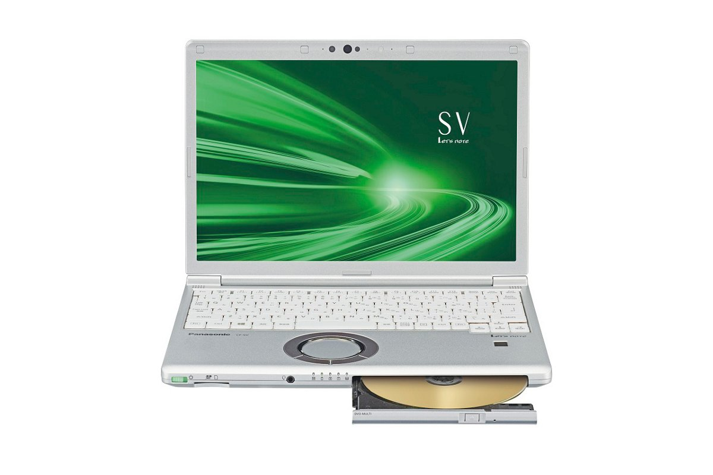
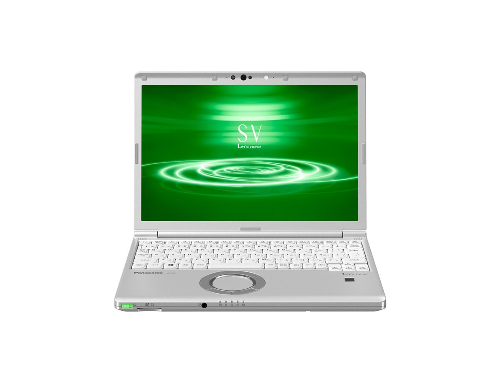
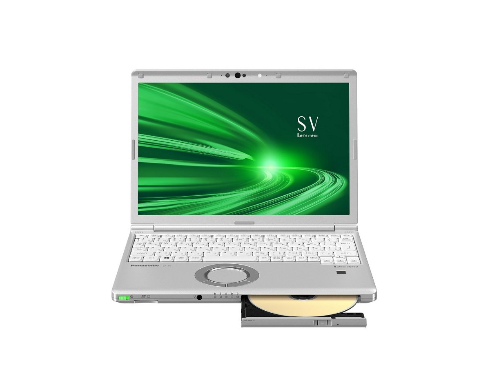
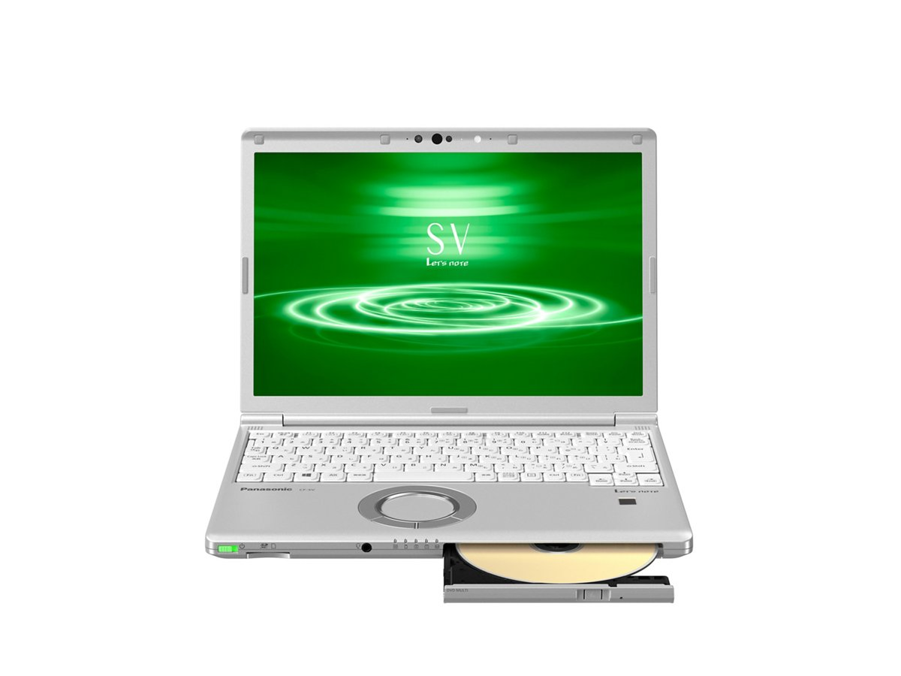

# レッツノート CF-SV9 スペック・仕様一覧

[English](../../en/CF-SV9/) · **日本語** · [中文](../../zh/CF-SV9/)

パナソニック レッツノート **CF-SV9**（SVシリーズ・12.1型WUXGA液晶）の全16品番（2020-01 – 2020-10発売）のスペック・仕様をまとめたページです。各品番の公式仕様表へのリンクも掲載しています。

*レッツノート CF-SV9（CF-SV9HDPQR）・ゴールド&シルバー。画像 © Panasonic*

## 品番一覧

| 品番 | 発売 | 生産終了 | 主な仕様 |
| :-- | :-- | :-- | :-- |
| [CF-SV9ADPQR](https://panasonic.jp/pc/p-db/CF-SV9ADPQR_spec.html) | 2020-10 | 2021-02 | Windows 10 Pro 64ビット、インテル® CoreTM i5-10210Uプロセッサー、メモリー：8GB（空きスロットなし）、SSD：256GB、LAN、無線LAN 802.11a（W52/W53/W56）/b/g/n/ac/ax（6GHz帯含む）、Microsoft® Office Home and Business 2019 |
| [CF-SV9ADSQR](https://panasonic.jp/pc/p-db/CF-SV9ADSQR_spec.html) | 2020-10 | 2021-02 | Windows 10 Pro 64ビット、インテル® CoreTM i5-10210Uプロセッサー、メモリー：8GB（空きスロットなし）、SSD：256GB、スーパーマルチドライブ、LAN、無線LAN 802.11a（W52/W53/W56）/b/g/n/ac/ax（6GHz帯含む）、Microsoft® Office Home and Business 2019 |
| [CF-SV9ADMQR](https://panasonic.jp/pc/p-db/CF-SV9ADMQR_spec.html) | 2020-10 | 2021-02 | Windows 10 Pro 64ビット、インテル® CoreTM i5-10210Uプロセッサー、メモリー：16GB（空きスロットなし）、SSD：256GB、スーパーマルチドライブ、LAN、無線LAN 802.11a（W52/W53/W56）/b/g/n/ac/ax（6GHz帯含む）、Microsoft® Office Home and Business 2019 |
| [CF-SV9EDUQR](https://panasonic.jp/pc/p-db/CF-SV9EDUQR_spec.html) | 2020-10 | 2021-02 | Windows 10 Pro 64ビット、インテル® CoreTM i7-10710Uプロセッサー、メモリー：8GB（空きスロットなし）、SSD：256GB、スーパーマルチドライブ、LAN、無線LAN 802.11a（W52/W53/W56）/b/g/n/ac/ax（6GHz帯含む）、Microsoft® Office Home and Business 2019 |
| [CF-SV9EFNQR](https://panasonic.jp/pc/p-db/CF-SV9EFNQR_spec.html) | 2020-10 | 2021-02 | Windows 10 Pro 64ビット、インテル® CoreTM i7-10710U プロセッサー、メモリー：16GB（空きスロットなし）、SSD：512GB、ブルーディスクドライブ、LAN、無線LAN 802.11a（W52/W53/W56）/b/g/n/ac/ax（6GHz帯含む）、Microsoft® Office Home and Business 2019 |
| [CF-SV9HDSQR](https://panasonic.jp/pc/p-db/CF-SV9HDSQR_spec.html) | 2020-06 | 2020-09 | Windows 10 Pro 64ビット、インテル® CoreTM i5-10210Uプロセッサー、メモリー：8GB（空きスロットなし）、SSD：256GB、スーパーマルチドライブ、LAN、無線LAN 802.11a（W52/W53/W56）/b/g/n/ac/ax（6GHz帯含む）、Microsoft® Office Home and Business 2019 |
| [CF-SV9HDPQR](https://panasonic.jp/pc/p-db/CF-SV9HDPQR_spec.html) | 2020-06 | 2020-09 | Windows 10 Pro 64ビット、インテル® CoreTM i5-10210Uプロセッサー、メモリー：8GB（空きスロットなし）、SSD：256GB、スーパーマルチドライブ、LAN、無線LAN 802.11a（W52/W53/W56）/b/g/n/ac/ax（6GHz帯含む）、Microsoft® Office Home and Business 2019 |
| [CF-SV9HDMQR](https://panasonic.jp/pc/p-db/CF-SV9HDMQR_spec.html) | 2020-06 | 2020-09 | Windows 10 Pro 64ビット、インテル® CoreTM i5-10210Uプロセッサー、メモリー：16GB（空きスロットなし）、SSD：256GB、スーパーマルチドライブ、LAN、無線LAN 802.11a（W52/W53/W56）/b/g/n/ac/ax（6GHz帯含む）、Microsoft® Office Home and Business 2019 |
| [CF-SV9KDUQR](https://panasonic.jp/pc/p-db/CF-SV9KDUQR_spec.html) | 2020-06 | 2020-09 | Windows 10 Pro 64ビット、インテル® CoreTM i7-10710Uプロセッサー、メモリー：8GB（空きスロットなし）、SSD：256GB、スーパーマルチドライブ、LAN、無線LAN 802.11a（W52/W53/W56）/b/g/n/ac/ax（6GHz帯含む）、Microsoft® Office Home and Business 2019 |
| [CF-SV9KFNQR](https://panasonic.jp/pc/p-db/CF-SV9KFNQR_spec.html) | 2020-06 | 2020-09 | Windows 10 Pro 64ビット、インテル® CoreTM i7-10710U プロセッサー、メモリー：16GB（空きスロットなし）、SSD：512GB、ブルーディスクドライブ、LAN、無線LAN 802.11a（W52/W53/W56）/b/g/n/ac/ax（6GHz帯含む）、Microsoft® Office Home and Business 2019 |
| [CF-SV9NDCQR](https://panasonic.jp/pc/p-db/CF-SV9NDCQR_spec.html) | 2020-01 | 2020-10 | Windows 10 Pro 64ビット、インテル® CoreTM i5-10210Uプロセッサー、メモリー：8GB（空きスロットなし）、SSD：256GB、LAN、無線LAN 802.11a（W52/W53/W56）/b/g/n/ac/ax（6GHz帯含む）、Microsoft® Office Home and Business 2019 |
| [CF-SV9NDSQR](https://panasonic.jp/pc/p-db/CF-SV9NDSQR_spec.html) | 2020-01 | 2020-10 | Windows 10 Pro 64ビット、インテル® CoreTM i5-10210Uプロセッサー、メモリー：8GB（空きスロットなし）、SSD：256GB、スーパーマルチドライブ、LAN、無線LAN 802.11a（W52/W53/W56）/b/g/n/ac/ax（6GHz帯含む）、Microsoft® Office Home and Business 2019 |
| [CF-SV9NDRQR](https://panasonic.jp/pc/p-db/CF-SV9NDRQR_spec.html) | 2020-01 | 2020-10 | Windows 10 Pro 64ビット、インテル® CoreTM i5-10210Uプロセッサー、メモリー：8GB（空きスロットなし）、SSD：512GB、スーパーマルチドライブ、LAN、無線LAN 802.11a（W52/W53/W56）/b/g/n/ac/ax（6GHz帯含む）、Microsoft® Office Home and Business 2019 |
| [CF-SV9NDMQR](https://panasonic.jp/pc/p-db/CF-SV9NDMQR_spec.html) | 2020-01 | 2020-10 | Windows 10 Pro 64ビット、インテル® CoreTM i5-10210Uプロセッサー、メモリー：16GB（空きスロットなし）、SSD：256GB、スーパーマルチドライブ、LAN、無線LAN 802.11a（W52/W53/W56）/b/g/n/ac/ax（6GHz帯含む）、Microsoft® Office Home and Business 2019 |
| [CF-SV9PDUQR](https://panasonic.jp/pc/p-db/CF-SV9PDUQR_spec.html) | 2020-01 | 2020-10 | Windows 10 Pro 64ビット、インテル® CoreTM i7-10710Uプロセッサー、メモリー：8GB（空きスロットなし）、SSD：256GB、スーパーマルチドライブ、LAN、無線LAN 802.11a（W52/W53/W56）/b/g/n/ac/ax（6GHz帯含む）、Microsoft® Office Home and Business 2019 |
| [CF-SV9PFNQR](https://panasonic.jp/pc/p-db/CF-SV9PFNQR_spec.html) | 2020-01 | 2020-10 | Windows 10 Pro 64ビット、インテル® CoreTM i7-10710U プロセッサー、メモリー：16GB（空きスロットなし）、SSD：512GB、ブルーディスクドライブ、LAN、無線LAN 802.11a（W52/W53/W56）/b/g/n/ac/ax（6GHz帯含む）、Microsoft® Office Home and Business 2019 |

## 共通仕様

| 項目 | 仕様 |
| :-- | :-- |
| 搭載OS | Windows 10 Pro 64ビット |
| チップセット | CPUに内蔵 |
| 表示方式 | 12.1型(16:10)WUXGA TFTカラー液晶 （1920 x 1200ドット）、アンチグレア |
| 表示方式 / グラフィックアクセラレーター | インテル®UHD グラフィックス（CPUに内蔵） |
| 表示方式 / LCD表示 | 1920×1200ドット：約1677万色 |
| 表示方式 / 外部ディスプレイ出力 | 1024×768、1280×768、1280×1024、1360×768、1366×768、1400×1050、1600×900、1600×1200、1680×1050、1920×1080、1920×1200ドット：約1677万色 / HDMI出力のみ：2560×1440、3840×2160（30 Hz/60 Hz）、4096×2160（30 Hz/60 Hz） |
| 表示方式 / 本体＋外部ディスプレイ同時表示 | 1024×768、1280×768、1280×1024、1360×768、1366×768、1400×1050、1600×900、1600×1200、1680×1050、1920×1080、1920×1200ドット：約1677万色 |
| ワイヤレス通信機能 | インテル® Wi-Fi 6 AX201 |
| 無線LAN | IEEE802.11a（W52/W53/W56）/b/g/n/ac/ax 準拠（WPA3、WPA2-AES/TKIP対応、Wi-Fi準拠） |
| LAN | 1000BASE-T/100BASE-TX/10BASE-T |
| サウンド機能 | PCM音源（24ビットステレオ）、インテル® High Definition Audio準拠、ステレオスピーカー |
| セキュリティチップ | TPM（TCG V2.0準拠） |
| セキュリティ(Windows Hello対応) | 顔認証対応カメラ/指紋センサー（タッチ式） |
| 拡張メモリースロット | なし |
| カメラ | 顔認証対応カメラ、有効画素数：最大 1920x1080ピクセル（約207万画素） |
| 内蔵マイク | アレイマイク |
| センサー | 照度センサー |
| インターフェース | ・USB3.1 Type-Cポート（Thunderbolt™3、USB Power Delivery対応） / ・USB3.0 Type-Aポート×3（うち１つはスマホ充電対応を兼ねる） / ・LANコネクター（RJ-45） / ・外部ディスプレイコネクター（アナログRGB ミニD-sub 15ピン） / ・HDMI出力端子（4K60p出力対応） / ・ヘッドセット端子（マイク入力＋オーディオ出力）（ヘッドセットミニジャック3.5mm、CTIA準拠） |
| キーボード | OADG準拠86キー、キーピッチ19mm(横)/16mm(縦)(一部キーを除く） |
| ポインティングデバイス | ホイールパッド |
| 消費電力 | 最大約85W |
| 達成率 | — |
| 外形寸法(幅×奥行×高さ) | 幅283.5mm×奥行203.8mm×高さ24.5mm（突起部除く） |
| Microsoft Office | Microsoft® Office Home and Business 2019 |

## 品番別の違い

| 品番 | CPU | メモリー | ストレージ | 質量 | 駆動時間 |
| :-- | :-- | :-- | :-- | :-- | :-- |
| CF-SV9ADPQR | Core i5-10210U | 8GB LPDDR3 SDRAM | 256GB | 0.929 kg | 13 h |
| CF-SV9ADSQR | Core i5-10210U | 8GB LPDDR3 SDRAM | 256GB | 1.009 kg | 13 h |
| CF-SV9ADMQR | Core i5-10210U | 16GB LPDDR3 SDRAM | 256GB | 1.009 kg | 12.5 h |
| CF-SV9EDUQR | Core i7-10710U | 8GB LPDDR3 SDRAM | 256GB | 1.109 kg | 20 h |
| CF-SV9EFNQR | Core i7-10710U | 16GB LPDDR3 SDRAM | 512GB | 1.169 kg | 19.5 h |
| CF-SV9HDSQR | Core i5-10210U | 8GB LPDDR3 SDRAM | 256GB | 1.009 kg | 13 h |
| CF-SV9HDPQR | Core i5-10210U | 8GB LPDDR3 SDRAM | 256GB | 1.009 kg | 13 h |
| CF-SV9HDMQR | Core i5-10210U | 16GB LPDDR3 SDRAM | 256GB | 1.009 kg | 12.5 h |
| CF-SV9KDUQR | Core i7-10710U | 8GB LPDDR3 SDRAM | 256GB | 1.109 kg | 20 h |
| CF-SV9KFNQR | Core i7-10710U | 16GB LPDDR3 SDRAM | 512GB | 1.169 kg | 19.5 h |
| CF-SV9NDCQR | Core i5-10210U | 8GB LPDDR3 SDRAM | 256GB | 0.929 kg | 13 h |
| CF-SV9NDSQR | Core i5-10210U | 8GB LPDDR3 SDRAM | 256GB | 1.009 kg | 13 h |
| CF-SV9NDRQR | Core i5-10210U | 8GB LPDDR3 SDRAM | 512GB | 1.009 kg | 13 h |
| CF-SV9NDMQR | Core i5-10210U | 16GB LPDDR3 SDRAM | 256GB | 1.009 kg | 12.5 h |
| CF-SV9PDUQR | Core i7-10510U | 8GB LPDDR3 SDRAM | 256GB | 1.109 kg | 20 h |
| CF-SV9PFNQR | Core i7-10510U | 8GB LPDDR3 SDRAM | 512GB | 1.169 kg | 20 h |

CF-SV9ADPQR の仕様の違い（すべて）

| 項目 | 仕様 |
| :-- | :-- |
| CPU | インテル® Core™ i5-10210U プロセッサー / (インテル®スマートキャッシュ6MB、動作周波数1.60GHz、インテル® ターボ・ブースト・テクノロジー2.0利用時は最大4.20GHz） |
| コア数 | 4コア |
| メインメモリー | 8GB LPDDR3 SDRAM（拡張スロットなし） |
| ビデオメモリー | 最大4071MB (メインメモリーと共用) |
| フラッシュメモリードライブ | フラッシュメモリードライブ（SSD）256GB（PCIe）上記容量のうち約15GBをリカバリー領域、約1GBをシステム領域として使用（ユーザー使用不可） |
| 光学式ドライブ | 搭載されていません |
| LTE | 搭載されていません |
| Bluetooth | Bluetooth v5.1 / ■対応プロファイル / 【Classic】 / ・A2DP（Source） / ・AVRCP（Target） / ・HCRP（Client） / ・HFP（AG） / ・HID（Host） / ・OPP（ClientおよびServer） / ・PAN（User） / ・SPP（DevAおよびDevB） / 【Low Energy】 / ・HOGP（Host） |
| SDメモリーカードスロット | SDメモリーカード×1スロット（SDHCメモリーカード/SDXCメモリーカード対応/著作権保護技術対応/UHS-I・UHS-Ⅱ高速転送対応） |
| 電源 | ▼ACアダプター / 入力：AC100V～240V、50Hz/60Hz、出力：DC16V、5.3A、電源コードは100V専用 / ▼バッテリーパック（S） / 7.2V リチウムイオン・定格容量5900mAh |
| エネルギー消費効率 | 目標年度2022年度 12区分17.6［kWh/年］ |
| 駆動／充電時間 | ▼駆動時間 / （JEITA Ver.2.0） / 約13時間 / ▼充電時間 / 約3時間（電源OFF時）、約3時間（電源ON時） |
| 本体カラー | シルバー |
| 質量(バッテリーを含む） | パソコン本体：約0.929kg（付属バッテリーパック(S)（約255g）装着時） / ACアダプター：約230g（電源コード（約60g）除く） |
| ソフトウェア | ・Microsoft® Internet Explorer 11 / ・Microsoft® Edge / ・Microsoft® .NET Framework 4.8 / ・Microsoft® Windows Media Player 12 / ・マカフィーリブセーフ（60日間 無料体験版） / ・i-フィルター6.0 (30日間無料お試し版) / ・WinZip 20.5日本語版（45日体験版） / ・Aptioセットアップ / ・PC-Diagnosticユーティリティ / ・Panasonic PC設定ユーティリティ / ・ハードディスクデータ消去ユーティリティ / ・DirectX 12 / ・PC情報ビューアー / ・Panasonic PC リカバリーディスク作成ユーティリティ / ・Panasonic PC Camera Utility |
| 付属品 | バッテリーパック(S)、ACアダプター 2個、取扱説明書、Microsoft Office Home & Business 2019等 |

公式仕様表: <https://panasonic.jp/pc/p-db/CF-SV9ADPQR_spec.html>

CF-SV9ADSQR の仕様の違い（すべて）

| 項目 | 仕様 |
| :-- | :-- |
| CPU | インテル® Core™ i5-10210U プロセッサー / (インテル®スマートキャッシュ6MB、動作周波数1.60GHz、インテル® ターボ・ブースト・テクノロジー2.0利用時は最大4.20GHz） |
| コア数 | 4コア |
| メインメモリー | 8GB LPDDR3 SDRAM（拡張スロットなし） |
| ビデオメモリー | 最大4071MB (メインメモリーと共用) |
| フラッシュメモリードライブ | フラッシュメモリードライブ（SSD）256GB（PCIe）上記容量のうち約15GBをリカバリー領域、約1GBをシステム領域として使用（ユーザー使用不可） |
| 光学式ドライブ | スーパーマルチドライブ（DVD/CD）内蔵 バッファアンダーランエラー防止機能搭載 |
| LTE | 搭載されていません |
| Bluetooth | Bluetooth v5.1 / ■対応プロファイル / 【Classic】 / ・A2DP（Source） / ・AVRCP（Target） / ・HCRP（Client） / ・HFP（AG） / ・HID（Host） / ・OPP（ClientおよびServer） / ・PAN（User） / ・SPP（DevAおよびDevB） / 【Low Energy】 / ・HOGP（Host） |
| SDメモリーカードスロット | SDメモリーカード×1スロット（SDHCメモリーカード/SDXCメモリーカード対応/著作権保護技術対応/UHS-I・UHS-Ⅱ高速転送対応） |
| 電源 | ▼ACアダプター / 入力：AC100V～240V、50Hz/60Hz、出力：DC16V、5.3A、電源コードは100V専用 / ▼バッテリーパック（S） / 7.2V リチウムイオン・定格容量5900mAh |
| エネルギー消費効率 | 目標年度2022年度 12区分17.6［kWh/年］ |
| 駆動／充電時間 | ▼駆動時間 / （JEITA Ver.2.0） / 約13時間 / ▼充電時間 / 約3時間（電源OFF時）、約3時間（電源ON時） |
| 本体カラー | シルバー |
| 質量(バッテリーを含む） | パソコン本体：約1.009kg（付属バッテリーパック(S)（約255g）装着時） / ACアダプター：約230g（電源コード（約60g）除く） |
| ソフトウェア | ・Microsoft® Internet Explorer 11 / ・Microsoft® Edge / ・Microsoft® .NET Framework 4.8 / ・Microsoft® Windows Media Player 12 / ・マカフィーリブセーフ（60日間 無料体験版） / ・i-フィルター6.0 (30日間無料お試し版) / ・WinZip 20.5日本語版（45日体験版） / ・Power2Go for Panasonic / ・PowerDirector for Panasonic / ・CyberLink PowerDVD14 / ・Aptioセットアップ / ・PC-Diagnosticユーティリティ / ・Panasonic PC設定ユーティリティ / ・ハードディスクデータ消去ユーティリティ / ・DirectX 12 / ・PC情報ビューアー / ・Panasonic PC リカバリーディスク作成ユーティリティ / ・Panasonic PC Camera Utility |
| 付属品 | バッテリーパック(S)、ACアダプター、取扱説明書、Microsoft Office Home & Business 2019等 |
| 連続データ転送速度 / 再生 | DVD-RAM：最大5倍速 / DVD-ROM：最大8倍速 / DVD-R：最大8倍速 / DVD-R DL:最大8倍速 / DVD-RW：最大8倍速 / +R：最大8倍速 / +R DL：最大8倍速 / +RW：最大8倍速 / High Speed +RW：最大8倍速 / CD-ROM：最大24倍速 / CD-R：最大24倍速 / CD-RW：最大24倍速 / High-Speed CD-RW：最大24倍速 / Ultra-Speed CD-RW：最大24倍速 |
| 連続データ転送速度 / 記録 | DVD-RAM書き換え：最大5倍速 / DVD-R 書き込み：最大8倍速 / DVD-R DL 書き込み：最大6倍速 / DVD-RW 書き換え：最大6倍速 / +R 書き込み：最大8倍速 / +R DL 書き込み：最大6倍速 / +RW 書き換え：最大4倍速 / High Speed +RW 書き換え：最大8倍速 / CD-R 書き込み：最大24倍速 / CD-RW 書き換え：4倍速 / High-Speed CD-RW 書き換え：10倍速 / Ultra-Speed CD-RW 書き換え：最大16倍速 |
| 対応ディスク、および対応フォーマット / 再生 | DVD-RAM（ 1.4GB、2.8GB、4.7GB、9.4GB ） / DVD-ROM（1層、2層） / DVD-Video（1層、2層） / DVD-R（ 1.4GB、2.8GB、3.95GB、4.7GB） / DVD-R DL（ 8.5GB ） / DVD-RW（ Ver.1.1/1.2 1.4GB、2.8GB、4.7GB、9.4GB） / +R（ 4.7GB ） / +R DL（ 8.5GB ） / +RW（ 4.7GB ） / High Speed +RW（ 4.7GB ） / CD-Audio / CD-ROM（XA対応） / Photo CD（マルチセッション対応） / Video CD / CD EXTRA / CD-TEXT / CD-R / CD-RW / High-Speed CD-RW / Ultra-Speed CD-RW |
| 対応ディスク、および対応フォーマット / 記録 | DVD-RAM（ 1.4GB、2.8GB、4.7GB、9.4GB） / DVD-R（ 1.4GB、2.8 GB、4.7GB for General） / DVD-R DL（ 8.5GB ） / DVD-RW（ Ver.1.1/1.2 1.4GB、2.8GB、4.7GB、9.4GB） / +R（ 4.7GB ） / +R DL（ 8.5GB ） / +RW（ 4.7GB ） / High Speed +RW（ 4.7GB） / CD-R / CD-RW / High-Speed CD-RW / Ultra-Speed CD-RW |

公式仕様表: <https://panasonic.jp/pc/p-db/CF-SV9ADSQR_spec.html>

CF-SV9ADMQR の仕様の違い（すべて）

| 項目 | 仕様 |
| :-- | :-- |
| CPU | インテル® Core™ i5-10210U プロセッサー / (インテル®スマートキャッシュ6MB、動作周波数1.60GHz、インテル® ターボ・ブースト・テクノロジー2.0利用時は最大4.20GHz） |
| コア数 | 4コア |
| メインメモリー | 16GB LPDDR3 SDRAM（拡張スロットなし） |
| ビデオメモリー | 最大8166MB (メインメモリーと共用) |
| フラッシュメモリードライブ | フラッシュメモリードライブ（SSD）256GB（PCIe）上記容量のうち約15GBをリカバリー領域、約1GBをシステム領域として使用（ユーザー使用不可） |
| 光学式ドライブ | スーパーマルチドライブ（DVD/CD）内蔵 バッファアンダーランエラー防止機能搭載 |
| LTE | 搭載されていません |
| Bluetooth | Bluetooth v5.1 / ■対応プロファイル / 【Classic】 / ・A2DP（Source） / ・AVRCP（Target） / ・HCRP（Client） / ・HFP（AG） / ・HID（Host） / ・OPP（ClientおよびServer） / ・PAN（User） / ・SPP（DevAおよびDevB） / 【Low Energy】 / ・HOGP（Host） |
| SDメモリーカードスロット | SDメモリーカード×1スロット（SDHCメモリーカード/SDXCメモリーカード対応/著作権保護技術対応/UHS-I・UHS-Ⅱ高速転送対応） |
| 電源 | ▼ACアダプター / 入力：AC100V～240V、50Hz/60Hz、出力：DC16V、5.3A、電源コードは100V専用 / ▼バッテリーパック（S） / 7.2V リチウムイオン・定格容量5900mAh |
| エネルギー消費効率 | 目標年度2022年度 12区分17.6［kWh/年］ |
| 駆動／充電時間 | ▼駆動時間 / （JEITA Ver.2.0） / 約12.5時間 / ▼充電時間 / 約3時間（電源OFF時）、約3時間（電源ON時） |
| 本体カラー | ブラック&シルバー |
| 質量(バッテリーを含む） | パソコン本体：約1.009kg（付属バッテリーパック(S)（約255g）装着時） / ACアダプター：約230g（電源コード（約60g）除く） |
| ソフトウェア | ・Microsoft® Internet Explorer 11 / ・Microsoft® Edge / ・Microsoft® .NET Framework 4.8 / ・Microsoft® Windows Media Player 12 / ・マカフィーリブセーフ（60日間 無料体験版） / ・i-フィルター6.0 (30日間無料お試し版) / ・WinZip 20.5日本語版（45日体験版） / ・Power2Go for Panasonic / ・PowerDirector for Panasonic / ・CyberLink PowerDVD14 / ・Aptioセットアップ / ・PC-Diagnosticユーティリティ / ・Panasonic PC設定ユーティリティ / ・ハードディスクデータ消去ユーティリティ / ・DirectX 12 / ・PC情報ビューアー / ・Panasonic PC リカバリーディスク作成ユーティリティ / ・Panasonic PC Camera Utility |
| 付属品 | バッテリーパック(S)、ACアダプター、取扱説明書、Microsoft Office Home & Business 2019等 |
| 連続データ転送速度 / 再生 | DVD-RAM：最大5倍速 / DVD-ROM：最大8倍速 / DVD-R：最大8倍速 / DVD-R DL:最大8倍速 / DVD-RW：最大8倍速 / +R：最大8倍速 / +R DL：最大8倍速 / +RW：最大8倍速 / High Speed +RW：最大8倍速 / CD-ROM：最大24倍速 / CD-R：最大24倍速 / CD-RW：最大24倍速 / High-Speed CD-RW：最大24倍速 / Ultra-Speed CD-RW：最大24倍速 |
| 連続データ転送速度 / 記録 | DVD-RAM書き換え：最大5倍速 / DVD-R 書き込み：最大8倍速 / DVD-R DL 書き込み：最大6倍速 / DVD-RW 書き換え：最大6倍速 / +R 書き込み：最大8倍速 / +R DL 書き込み：最大6倍速 / +RW 書き換え：最大4倍速 / High Speed +RW 書き換え：最大8倍速 / CD-R 書き込み：最大24倍速 / CD-RW 書き換え：4倍速 / High-Speed CD-RW 書き換え：10倍速 / Ultra-Speed CD-RW 書き換え：最大16倍速 |
| 対応ディスク、および対応フォーマット / 再生 | DVD-RAM（ 1.4GB、2.8GB、4.7GB、9.4GB ） / DVD-ROM（1層、2層） / DVD-Video（1層、2層） / DVD-R（ 1.4GB、2.8GB、3.95GB、4.7GB） / DVD-R DL（ 8.5GB ） / DVD-RW（ Ver.1.1/1.2 1.4GB、2.8GB、4.7GB、9.4GB） / +R（ 4.7GB ） / +R DL（ 8.5GB ） / +RW（ 4.7GB ） / High Speed +RW（ 4.7GB ） / CD-Audio / CD-ROM（XA対応） / Photo CD（マルチセッション対応） / Video CD / CD EXTRA / CD-TEXT / CD-R / CD-RW / High-Speed CD-RW / Ultra-Speed CD-RW |
| 対応ディスク、および対応フォーマット / 記録 | DVD-RAM（ 1.4GB、2.8GB、4.7GB、9.4GB） / DVD-R（ 1.4GB、2.8 GB、4.7GB for General） / DVD-R DL（ 8.5GB ） / DVD-RW（ Ver.1.1/1.2 1.4GB、2.8GB、4.7GB、9.4GB） / +R（ 4.7GB ） / +R DL（ 8.5GB ） / +RW（ 4.7GB ） / High Speed +RW（ 4.7GB） / CD-R / CD-RW / High-Speed CD-RW / Ultra-Speed CD-RW |

公式仕様表: <https://panasonic.jp/pc/p-db/CF-SV9ADMQR_spec.html>

CF-SV9EDUQR の仕様の違い（すべて）

| 項目 | 仕様 |
| :-- | :-- |
| CPU | インテル® Core™ i7-10710U プロセッサー / (インテル®スマートキャッシュ12MB、動作周波数1.10GHz、インテル® ターボ・ブースト・テクノロジー2.0利用時は最大4.70GHz） |
| コア数 | 6コア |
| メインメモリー | 8GB LPDDR3 SDRAM（拡張スロットなし） |
| ビデオメモリー | 最大4071MB (メインメモリーと共用) |
| フラッシュメモリードライブ | フラッシュメモリードライブ（SSD）256GB（PCIe）上記容量のうち約15GBをリカバリー領域、約1GBをシステム領域として使用（ユーザー使用不可） |
| 光学式ドライブ | スーパーマルチドライブ（DVD/CD）内蔵 バッファアンダーランエラー防止機能搭載 |
| LTE | 搭載されていません |
| Bluetooth | Bluetooth v5.1 / ■対応プロファイル / 【Classic】 / ・A2DP（Source） / ・AVRCP（Target） / ・HCRP（Client） / ・HFP（AG） / ・HID（Host） / ・OPP（ClientおよびServer） / ・PAN（User） / ・SPP（DevAおよびDevB） / 【Low Energy】 / ・HOGP（Host） |
| SDメモリーカードスロット | SDメモリーカード×1スロット（SDHCメモリーカード/SDXCメモリーカード対応/著作権保護技術対応/UHS-I・UHS-Ⅱ高速転送対応） |
| 電源 | ▼ACアダプター / 入力：AC100V～240V、50Hz/60Hz、出力：DC16V、5.3A、電源コードは100V専用 / ▼バッテリーパック（L） / 10.8V リチウムイオン・定格容量6300mAh |
| エネルギー消費効率 | 目標年度2022年度 12区分17.6［kWh/年］ |
| 駆動／充電時間 | ▼駆動時間 / （JEITA Ver.2.0） / 約20時間 / ▼充電時間 / 約3時間（電源OFF時）、約3時間（電源ON時） |
| 本体カラー | ブラック |
| 質量(バッテリーを含む） | パソコン本体：約1.109kg（付属バッテリーパック（L）(約355g)装着時） / ACアダプター：約230g（電源コード（約60g）除く） |
| ソフトウェア | ・Microsoft® Internet Explorer 11 / ・Microsoft® Edge / ・Microsoft® .NET Framework 4.8 / ・Microsoft® Windows Media Player 12 / ・マカフィーリブセーフ（60日間 無料体験版） / ・i-フィルター6.0 (30日間無料お試し版) / ・WinZip 20.5日本語版（45日体験版） / ・Power2Go for Panasonic / ・PowerDirector for Panasonic / ・CyberLink PowerDVD14 / ・Aptioセットアップ / ・PC-Diagnosticユーティリティ / ・Panasonic PC設定ユーティリティ / ・ハードディスクデータ消去ユーティリティ / ・DirectX 12 / ・PC情報ビューアー / ・Panasonic PC リカバリーディスク作成ユーティリティ / ・Panasonic PC Camera Utility |
| 付属品 | バッテリーパック(L)、ACアダプター、取扱説明書、Microsoft Office Home & Business 2019等 |
| 連続データ転送速度 / 再生 | DVD-RAM：最大5倍速 / DVD-ROM：最大8倍速 / DVD-R：最大8倍速 / DVD-R DL:最大8倍速 / DVD-RW：最大8倍速 / +R：最大8倍速 / +R DL：最大8倍速 / +RW：最大8倍速 / High Speed +RW：最大8倍速 / CD-ROM：最大24倍速 / CD-R：最大24倍速 / CD-RW：最大24倍速 / High-Speed CD-RW：最大24倍速 / Ultra-Speed CD-RW：最大24倍速 |
| 連続データ転送速度 / 記録 | DVD-RAM書き換え：最大5倍速 / DVD-R 書き込み：最大8倍速 / DVD-R DL 書き込み：最大6倍速 / DVD-RW 書き換え：最大6倍速 / +R 書き込み：最大8倍速 / +R DL 書き込み：最大6倍速 / +RW 書き換え：最大4倍速 / High Speed +RW 書き換え：最大8倍速 / CD-R 書き込み：最大24倍速 / CD-RW 書き換え：4倍速 / High-Speed CD-RW 書き換え：10倍速 / Ultra-Speed CD-RW 書き換え：最大16倍速 |
| 対応ディスク、および対応フォーマット / 再生 | DVD-RAM（ 1.4GB、2.8GB、4.7GB、9.4GB ） / DVD-ROM（1層、2層） / DVD-Video（1層、2層） / DVD-R（ 1.4GB、2.8GB、3.95GB、4.7GB） / DVD-R DL（ 8.5GB ） / DVD-RW（ Ver.1.1/1.2 1.4GB、2.8GB、4.7GB、9.4GB） / +R（ 4.7GB ） / +R DL（ 8.5GB ） / +RW（ 4.7GB ） / High Speed +RW（ 4.7GB ） / CD-Audio / CD-ROM（XA対応） / Photo CD（マルチセッション対応） / Video CD / CD EXTRA / CD-TEXT / CD-R / CD-RW / High-Speed CD-RW / Ultra-Speed CD-RW |
| 対応ディスク、および対応フォーマット / 記録 | DVD-RAM（ 1.4GB、2.8GB、4.7GB、9.4GB） / DVD-R（ 1.4GB、2.8 GB、4.7GB for General） / DVD-R DL（ 8.5GB ） / DVD-RW（ Ver.1.1/1.2 1.4GB、2.8GB、4.7GB、9.4GB） / +R（ 4.7GB ） / +R DL（ 8.5GB ） / +RW（ 4.7GB ） / High Speed +RW（ 4.7GB） / CD-R / CD-RW / High-Speed CD-RW / Ultra-Speed CD-RW |

公式仕様表: <https://panasonic.jp/pc/p-db/CF-SV9EDUQR_spec.html>

CF-SV9EFNQR の仕様の違い（すべて）

| 項目 | 仕様 |
| :-- | :-- |
| CPU | インテル® Core™ i7-10710U プロセッサー / (インテル®スマートキャッシュ12MB、動作周波数1.10GHz、インテル® ターボ・ブースト・テクノロジー2.0利用時は最大4.70GHz） |
| コア数 | 6コア |
| メインメモリー | 16GB LPDDR3 SDRAM（拡張スロットなし） |
| ビデオメモリー | 最大8166MB (メインメモリーと共用) |
| フラッシュメモリードライブ | フラッシュメモリードライブ（SSD）512GB（PCIe）上記容量のうち約15GBをリカバリー領域、約1GBをシステム領域として使用（ユーザー使用不可） |
| 光学式ドライブ | ブルーレイディスクドライブ内蔵 / DVDスーパーマルチドライブ機能/バッファーアンダーランエラー防止機能搭載 |
| LTE | ワイヤレスWANモジュール内蔵（LTE対応） |
| Bluetooth | Bluetooth v5.1 / ■対応プロファイル / 【Classic】 / ・A2DP（Source） / ・AVRCP（Target） / ・HCRP（Client） / ・HFP（AG） / ・HID（Host） / ・OPP（ClientおよびServer） / ・PAN（User） / ・SPP（DevAおよびDevB） / 【Low Energy】 / ・HOGP（Host） |
| 電源 | ▼ACアダプター / 入力：AC100V～240V、50Hz/60Hz、出力：DC16V、5.3A、電源コードは100V専用 / ▼バッテリーパック（L） / 10.8V リチウムイオン・定格容量6300mAh |
| エネルギー消費効率 | 目標年度2022年度 12区分17.6［kWh/年］ |
| 駆動／充電時間 | ▼駆動時間 / （JEITA Ver.2.0） / 約19.5時間 / ▼充電時間 / 約3時間（電源OFF時）、約3時間（電源ON時） |
| 本体カラー | ブラック |
| 質量(バッテリーを含む） | パソコン本体：約1.169kg（付属バッテリーパック(L)（約355g）装着時） / ACアダプター：約230g（電源コード（約60g）除く） |
| ソフトウェア | ・Microsoft® Internet Explorer 11 / ・Microsoft® Edge / ・Microsoft® .NET Framework 4.8 / ・Microsoft® Windows Media Player 12 / ・マカフィーリブセーフ（60日間 無料体験版） / ・i-フィルター6.0 (30日間無料お試し版) / ・WinZip 20.5日本語版（45日体験版） / ・Power2Go for Panasonic / ・PowerDirector BD for Panasonic / ・CyberLink PowerDVD14 / ・Aptioセットアップ / ・PC-Diagnosticユーティリティ / ・Panasonic PC設定ユーティリティ / ・ハードディスクデータ消去ユーティリティ / ・DirectX 12 / ・PC情報ビューアー / ・Panasonic PC リカバリーディスク作成ユーティリティ / ・Panasonic PC Camera Utility |
| 付属品 | バッテリーパック(L)、ACアダプター、取扱説明書、Microsoft Office Home & Business 2019等 |
| 連続データ転送速度 / 再生 | BD-ROM：最大6倍速 / BD-R：最大6倍速 / BD-R DL：最大6倍速 / BD-R LTH：最大6倍速 / BD-R XL：最大6倍速 / BD-RE：最大6倍速 / BD-RE DL：最大6倍速 / BD-RE XL：最大4倍速 / DVD-RAM：最大5 倍速 / DVD-ROM：最大8 倍速 / DVD-R：最大8倍速 / DVD-R DL：最大8 倍速 / DVD-RW：最大8 倍速 / +R：最大8 倍速 / +R DL：最大8 倍速 / +RW：最大8 倍速 / High Speed +RW：最大8 倍速 / CD-ROM：最大24 倍速 / CD-R：最大24 倍速 / CD-RW：最大24 倍速 / High-Speed CD-RW：最大24 倍速 / Ultra-Speed CD-RW：最大24 倍速 |
| 連続データ転送速度 / 記録 | BD-R書き込み：最大6 倍速 / BD-R DL書き込み：最大6 倍速 / BD-R LTH 書き込み：最大4 倍速 / BD-R XL書き込み：最大4 倍速 / BD-RE書き換え：2倍速 / BD-RE DL書き換え：2 倍速 / BD-RE XL 書き換え：2倍速 / DVD-RAM書き換え：最大5 倍速 / DVD-R 書き込み：最大8 倍速 / DVD-R DL書き込み：最大6 倍速 / DVD-RW書き換え：最大6 倍速 / +R 書き込み：最大8 倍速 / +R DL書き込み：最大6 倍速 / +RW 書き換え：最大4 倍速 / High Speed +RW書き換え：最大8 倍速 / CD-R 書き込み：最大24 倍速 / CD-RW 書き換え：4 倍速 / High-Speed CD-RW書き換え：10 倍速 / Ultra-Speed CD-RW書き換え：最大16 倍速 |
| 対応ディスク、および対応フォーマット / 再生 | BD-ROM / BD-R（Ver.1.1/1.2/1.3、25GB） / BD-R DL（Ver.1.1/1.2/1.3、50GB） / BD-R LTH（Ver.1.2/1.3、25GB） / BD-R XL（Ver.2.0、100GB） / BD-RE（Ver. 2.1、25GB） / BD-RE DL（Ver.2.1、50GB） / BD-RE XL（Ver.3.0、100GB） / DVD-RAM（ 1.4GB、2.8GB、4.7GB、9.4GB ） / DVD-ROM（1層、2層） / DVD-Video（1層、2層） / DVD-R（1.4GB、2.8GB、3.95GB、4.7GB） / DVD-R DL（8.5GB） / DVD-RW（Ver.1.1/1.2 1.4GB、2.8GB、4.7GB、9.4GB） / +R（4.7GB） / +R DL（8.5GB） / +RW（4.7GB） / High Speed +RW（4.7GB） / CD-Audio / CD-ROM（XA対応） / Photo CD（マルチセッション対応） / Video CD / CD EXTRA / CD-TEXT / CD-R / CD-RW / High-Speed CD-RW / Ultra-Speed CD-RW |
| 対応ディスク、および対応フォーマット / 記録 | BD-R（25GB） / BD-R DL（50GB） / BD-R LTH（25GB） / BD-R XL（100GB） / BD-RE（25GB） / BD-RE DL（50GB） / BD-RE XL（100GB） / DVD-RAM（1.4GB、2.8GB、4.7GB、9.4GB） / DVD-R（1.4GB、2.8 GB、4.7GB for General） / DVD-R DL（8.5GB） / DVD-RW（Ver.1.1/1.2 1.4GB、2.8GB、4.7GB、9.4GB） / +R（ 4.7GB） / +R DL（8.5GB） / +RW（ 4.7GB） / High Speed +RW（ 4.7GB） / CD-R / CD-RW / High-Speed CD-RW / Ultra-Speed CD-RW |
| カードスロット / SDメモリーカードスロット | SDメモリーカード×1スロット（SDHCメモリーカード/SDXCメモリーカード対応/著作権保護技術対応/UHS-I・UHS-Ⅱ高速転送対応） |
| カードスロット / その他カードスロット | nano SIMカードスロット |

公式仕様表: <https://panasonic.jp/pc/p-db/CF-SV9EFNQR_spec.html>

CF-SV9HDSQR の仕様の違い（すべて）

| 項目 | 仕様 |
| :-- | :-- |
| CPU | インテル® Core™ i5-10210U プロセッサー / (インテル®スマートキャッシュ6MB、動作周波数1.60GHz、インテル® ターボ・ブースト・テクノロジー2.0利用時は最大4.20GHz） |
| コア数 | 4コア |
| メインメモリー | 8GB LPDDR3 SDRAM（拡張スロットなし） |
| ビデオメモリー | 最大4071MB (メインメモリーと共用) |
| フラッシュメモリードライブ | フラッシュメモリードライブ（SSD）256GB（PCIe）上記容量のうち約15GBをリカバリー領域、約1GBをシステム領域として使用（ユーザー使用不可） |
| 光学式ドライブ | スーパーマルチドライブ（DVD/CD）内蔵 バッファアンダーランエラー防止機能搭載 |
| LTE | 搭載されていません |
| Bluetooth | Bluetooth v5.0 / ■対応プロファイル / 【Classic】 / ・A2DP（Source） / ・AVRCP（Target） / ・HCRP（Client） / ・HFP（AG） / ・HID（Host） / ・OPP（ClientおよびServer） / ・PAN（User） / ・SPP（DevAおよびDevB） / 【Low Energy】 / ・HOGP（Host） |
| SDメモリーカードスロット | SDメモリーカード×1スロット（SDHCメモリーカード/SDXCメモリーカード対応/著作権保護技術対応/UHS-I・UHS-Ⅱ高速転送対応） |
| 電源 | ▼ACアダプター / 入力：AC100V～240V、50Hz/60Hz、出力：DC16V、5.3A、電源コードは100V専用 / ▼バッテリーパック（S） / 7.2V リチウムイオン・定格容量5900mAh |
| エネルギー消費効率 | 目標年度2022年度 12区分17.6［kWh/年］ |
| 駆動／充電時間 | ▼駆動時間 / （JEITA Ver.2.0） / 約13時間 / ▼充電時間 / 約3時間（電源OFF時）、約3時間（電源ON時） |
| 本体カラー | シルバー |
| 質量(バッテリーを含む） | パソコン本体：約1.009kg（付属バッテリーパック(S)（約255g）装着時） / ACアダプター：約230g（電源コード（約60g）除く） |
| ソフトウェア | ・Microsoft® Internet Explorer 11 / ・Microsoft® Edge / ・Microsoft® .NET Framework 4.8 / ・Microsoft® Windows Media Player 12 / ・マカフィーリブセーフ（60日間 無料体験版） / ・i-フィルター6.0 (30日間無料お試し版) / ・WinZip 20.5日本語版（45日体験版） / ・Power2Go for Panasonic / ・PowerDirector for Panasonic / ・CyberLink PowerDVD14 / ・Aptioセットアップ / ・PC-Diagnosticユーティリティ / ・Panasonic PC設定ユーティリティ / ・ハードディスクデータ消去ユーティリティ / ・DirectX 12 / ・PC情報ビューアー / ・Panasonic PC リカバリーディスク作成ユーティリティ / ・Panasonic PC Camera Utility |
| 付属品 | バッテリーパック(S)、ACアダプター、取扱説明書、Microsoft Office Home & Business 2019等 |
| 連続データ転送速度 / 再生 | DVD-RAM：最大5倍速 / DVD-ROM：最大8倍速 / DVD-R：最大8倍速 / DVD-R DL:最大8倍速 / DVD-RW：最大8倍速 / +R：最大8倍速 / +R DL：最大8倍速 / +RW：最大8倍速 / High Speed +RW：最大8倍速 / CD-ROM：最大24倍速 / CD-R：最大24倍速 / CD-RW：最大24倍速 / High-Speed CD-RW：最大24倍速 / Ultra-Speed CD-RW：最大24倍速 |
| 連続データ転送速度 / 記録 | DVD-RAM書き換え：最大5倍速 / DVD-R 書き込み：最大8倍速 / DVD-R DL 書き込み：最大6倍速 / DVD-RW 書き換え：最大6倍速 / +R 書き込み：最大8倍速 / +R DL 書き込み：最大6倍速 / +RW 書き換え：最大4倍速 / High Speed +RW 書き換え：最大8倍速 / CD-R 書き込み：最大24倍速 / CD-RW 書き換え：4倍速 / High-Speed CD-RW 書き換え：10倍速 / Ultra-Speed CD-RW 書き換え：最大16倍速 |
| 対応ディスク、および対応フォーマット / 再生 | DVD-RAM（ 1.4GB、2.8GB、4.7GB、9.4GB ） / DVD-ROM（1層、2層） / DVD-Video（1層、2層） / DVD-R（ 1.4GB、2.8GB、3.95GB、4.7GB） / DVD-R DL（ 8.5GB ） / DVD-RW（ Ver.1.1/1.2 1.4GB、2.8GB、4.7GB、9.4GB） / +R（ 4.7GB ） / +R DL（ 8.5GB ） / +RW（ 4.7GB ） / High Speed +RW（ 4.7GB ） / CD-Audio / CD-ROM（XA対応） / Photo CD（マルチセッション対応） / Video CD / CD EXTRA / CD-TEXT / CD-R / CD-RW / High-Speed CD-RW / Ultra-Speed CD-RW |
| 対応ディスク、および対応フォーマット / 記録 | DVD-RAM（ 1.4GB、2.8GB、4.7GB、9.4GB） / DVD-R（ 1.4GB、2.8 GB、4.7GB for General） / DVD-R DL（ 8.5GB ） / DVD-RW（ Ver.1.1/1.2 1.4GB、2.8GB、4.7GB、9.4GB） / +R（ 4.7GB ） / +R DL（ 8.5GB ） / +RW（ 4.7GB ） / High Speed +RW（ 4.7GB） / CD-R / CD-RW / High-Speed CD-RW / Ultra-Speed CD-RW |

公式仕様表: <https://panasonic.jp/pc/p-db/CF-SV9HDSQR_spec.html>

CF-SV9HDPQR の仕様の違い（すべて）

| 項目 | 仕様 |
| :-- | :-- |
| CPU | インテル® Core™ i5-10210U プロセッサー / (インテル®スマートキャッシュ6MB、動作周波数1.60GHz、インテル® ターボ・ブースト・テクノロジー2.0利用時は最大4.20GHz） |
| コア数 | 4コア |
| メインメモリー | 8GB LPDDR3 SDRAM（拡張スロットなし） |
| ビデオメモリー | 最大4071MB (メインメモリーと共用) |
| フラッシュメモリードライブ | フラッシュメモリードライブ（SSD）256GB（PCIe）上記容量のうち約15GBをリカバリー領域、約1GBをシステム領域として使用（ユーザー使用不可） |
| 光学式ドライブ | スーパーマルチドライブ（DVD/CD）内蔵 バッファアンダーランエラー防止機能搭載 |
| LTE | 搭載されていません |
| Bluetooth | Bluetooth v5.0 / ■対応プロファイル / 【Classic】 / ・A2DP（Source） / ・AVRCP（Target） / ・HCRP（Client） / ・HFP（AG） / ・HID（Host） / ・OPP（ClientおよびServer） / ・PAN（User） / ・SPP（DevAおよびDevB） / 【Low Energy】 / ・HOGP（Host） |
| SDメモリーカードスロット | SDメモリーカード×1スロット（SDHCメモリーカード/SDXCメモリーカード対応/著作権保護技術対応/UHS-I・UHS-Ⅱ高速転送対応） |
| 電源 | ▼ACアダプター / 入力：AC100V～240V、50Hz/60Hz、出力：DC16V、5.3A、電源コードは100V専用 / ▼バッテリーパック（S） / 7.2V リチウムイオン・定格容量5900mAh |
| エネルギー消費効率 | 目標年度2022年度 12区分17.6［kWh/年］ |
| 駆動／充電時間 | ▼駆動時間 / （JEITA Ver.2.0） / 約13時間 / ▼充電時間 / 約3時間（電源OFF時）、約3時間（電源ON時） |
| 本体カラー | ゴールド&シルバー |
| 質量(バッテリーを含む） | パソコン本体：約1.009kg（付属バッテリーパック(S)（約255g）装着時） / ACアダプター：約230g（電源コード（約60g）除く） |
| ソフトウェア | ・Microsoft® Internet Explorer 11 / ・Microsoft® Edge / ・Microsoft® .NET Framework 4.8 / ・Microsoft® Windows Media Player 12 / ・マカフィーリブセーフ（60日間 無料体験版） / ・i-フィルター6.0 (30日間無料お試し版) / ・WinZip 20.5日本語版（45日体験版） / ・Power2Go for Panasonic / ・PowerDirector for Panasonic / ・CyberLink PowerDVD14 / ・Aptioセットアップ / ・PC-Diagnosticユーティリティ / ・Panasonic PC設定ユーティリティ / ・ハードディスクデータ消去ユーティリティ / ・DirectX 12 / ・PC情報ビューアー / ・Panasonic PC リカバリーディスク作成ユーティリティ / ・Panasonic PC Camera Utility |
| 付属品 | バッテリーパック(S)、ACアダプター、取扱説明書、Microsoft Office Home & Business 2019等 |
| 連続データ転送速度 / 再生 | DVD-RAM：最大5倍速 / DVD-ROM：最大8倍速 / DVD-R：最大8倍速 / DVD-R DL:最大8倍速 / DVD-RW：最大8倍速 / +R：最大8倍速 / +R DL：最大8倍速 / +RW：最大8倍速 / High Speed +RW：最大8倍速 / CD-ROM：最大24倍速 / CD-R：最大24倍速 / CD-RW：最大24倍速 / High-Speed CD-RW：最大24倍速 / Ultra-Speed CD-RW：最大24倍速 |
| 連続データ転送速度 / 記録 | DVD-RAM書き換え：最大5倍速 / DVD-R 書き込み：最大8倍速 / DVD-R DL 書き込み：最大6倍速 / DVD-RW 書き換え：最大6倍速 / +R 書き込み：最大8倍速 / +R DL 書き込み：最大6倍速 / +RW 書き換え：最大4倍速 / High Speed +RW 書き換え：最大8倍速 / CD-R 書き込み：最大24倍速 / CD-RW 書き換え：4倍速 / High-Speed CD-RW 書き換え：10倍速 / Ultra-Speed CD-RW 書き換え：最大16倍速 |
| 対応ディスク、および対応フォーマット / 再生 | DVD-RAM（ 1.4GB、2.8GB、4.7GB、9.4GB ） / DVD-ROM（1層、2層） / DVD-Video（1層、2層） / DVD-R（ 1.4GB、2.8GB、3.95GB、4.7GB） / DVD-R DL（ 8.5GB ） / DVD-RW（ Ver.1.1/1.2 1.4GB、2.8GB、4.7GB、9.4GB） / +R（ 4.7GB ） / +R DL（ 8.5GB ） / +RW（ 4.7GB ） / High Speed +RW（ 4.7GB ） / CD-Audio / CD-ROM（XA対応） / Photo CD（マルチセッション対応） / Video CD / CD EXTRA / CD-TEXT / CD-R / CD-RW / High-Speed CD-RW / Ultra-Speed CD-RW |
| 対応ディスク、および対応フォーマット / 記録 | DVD-RAM（ 1.4GB、2.8GB、4.7GB、9.4GB） / DVD-R（ 1.4GB、2.8 GB、4.7GB for General） / DVD-R DL（ 8.5GB ） / DVD-RW（ Ver.1.1/1.2 1.4GB、2.8GB、4.7GB、9.4GB） / +R（ 4.7GB ） / +R DL（ 8.5GB ） / +RW（ 4.7GB ） / High Speed +RW（ 4.7GB） / CD-R / CD-RW / High-Speed CD-RW / Ultra-Speed CD-RW |

公式仕様表: <https://panasonic.jp/pc/p-db/CF-SV9HDPQR_spec.html>

CF-SV9HDMQR の仕様の違い（すべて）

| 項目 | 仕様 |
| :-- | :-- |
| CPU | インテル® Core™ i5-10210U プロセッサー / (インテル®スマートキャッシュ6MB、動作周波数1.60GHz、インテル® ターボ・ブースト・テクノロジー2.0利用時は最大4.20GHz） |
| コア数 | 4コア |
| メインメモリー | 16GB LPDDR3 SDRAM（拡張スロットなし） |
| ビデオメモリー | 最大8167MB (メインメモリーと共用) |
| フラッシュメモリードライブ | フラッシュメモリードライブ（SSD）256GB（PCIe）上記容量のうち約15GBをリカバリー領域、約1GBをシステム領域として使用（ユーザー使用不可） |
| 光学式ドライブ | スーパーマルチドライブ（DVD/CD）内蔵 バッファアンダーランエラー防止機能搭載 |
| LTE | 搭載されていません |
| Bluetooth | Bluetooth v5.0 / ■対応プロファイル / 【Classic】 / ・A2DP（Source） / ・AVRCP（Target） / ・HCRP（Client） / ・HFP（AG） / ・HID（Host） / ・OPP（ClientおよびServer） / ・PAN（User） / ・SPP（DevAおよびDevB） / 【Low Energy】 / ・HOGP（Host） |
| SDメモリーカードスロット | SDメモリーカード×1スロット（SDHCメモリーカード/SDXCメモリーカード対応/著作権保護技術対応/UHS-I・UHS-Ⅱ高速転送対応） |
| 電源 | ▼ACアダプター / 入力：AC100V～240V、50Hz/60Hz、出力：DC16V、5.3A、電源コードは100V専用 / ▼バッテリーパック（S） / 7.2V リチウムイオン・定格容量5900mAh |
| エネルギー消費効率 | 目標年度2022年度 12区分17.6［kWh/年］ |
| 駆動／充電時間 | ▼駆動時間 / （JEITA Ver.2.0） / 約12.5時間 / ▼充電時間 / 約3時間（電源OFF時）、約3時間（電源ON時） |
| 本体カラー | ブラック&シルバー |
| 質量(バッテリーを含む） | パソコン本体：約1.009kg（付属バッテリーパック(S)（約255g）装着時） / ACアダプター：約230g（電源コード（約60g）除く） |
| ソフトウェア | ・Microsoft® Internet Explorer 11 / ・Microsoft® Edge / ・Microsoft® .NET Framework 4.8 / ・Microsoft® Windows Media Player 12 / ・マカフィーリブセーフ（60日間 無料体験版） / ・i-フィルター6.0 (30日間無料お試し版) / ・WinZip 20.5日本語版（45日体験版） / ・Power2Go for Panasonic / ・PowerDirector for Panasonic / ・CyberLink PowerDVD14 / ・Aptioセットアップ / ・PC-Diagnosticユーティリティ / ・Panasonic PC設定ユーティリティ / ・ハードディスクデータ消去ユーティリティ / ・DirectX 12 / ・PC情報ビューアー / ・Panasonic PC リカバリーディスク作成ユーティリティ / ・Panasonic PC Camera Utility |
| 付属品 | バッテリーパック(S)、ACアダプター、取扱説明書、Microsoft Office Home & Business 2019等 |
| 連続データ転送速度 / 再生 | DVD-RAM：最大5倍速 / DVD-ROM：最大8倍速 / DVD-R：最大8倍速 / DVD-R DL:最大8倍速 / DVD-RW：最大8倍速 / +R：最大8倍速 / +R DL：最大8倍速 / +RW：最大8倍速 / High Speed +RW：最大8倍速 / CD-ROM：最大24倍速 / CD-R：最大24倍速 / CD-RW：最大24倍速 / High-Speed CD-RW：最大24倍速 / Ultra-Speed CD-RW：最大24倍速 |
| 連続データ転送速度 / 記録 | DVD-RAM書き換え：最大5倍速 / DVD-R 書き込み：最大8倍速 / DVD-R DL 書き込み：最大6倍速 / DVD-RW 書き換え：最大6倍速 / +R 書き込み：最大8倍速 / +R DL 書き込み：最大6倍速 / +RW 書き換え：最大4倍速 / High Speed +RW 書き換え：最大8倍速 / CD-R 書き込み：最大24倍速 / CD-RW 書き換え：4倍速 / High-Speed CD-RW 書き換え：10倍速 / Ultra-Speed CD-RW 書き換え：最大16倍速 |
| 対応ディスク、および対応フォーマット / 再生 | DVD-RAM（ 1.4GB、2.8GB、4.7GB、9.4GB ） / DVD-ROM（1層、2層） / DVD-Video（1層、2層） / DVD-R（ 1.4GB、2.8GB、3.95GB、4.7GB） / DVD-R DL（ 8.5GB ） / DVD-RW（ Ver.1.1/1.2 1.4GB、2.8GB、4.7GB、9.4GB） / +R（ 4.7GB ） / +R DL（ 8.5GB ） / +RW（ 4.7GB ） / High Speed +RW（ 4.7GB ） / CD-Audio / CD-ROM（XA対応） / Photo CD（マルチセッション対応） / Video CD / CD EXTRA / CD-TEXT / CD-R / CD-RW / High-Speed CD-RW / Ultra-Speed CD-RW |
| 対応ディスク、および対応フォーマット / 記録 | DVD-RAM（ 1.4GB、2.8GB、4.7GB、9.4GB） / DVD-R（ 1.4GB、2.8 GB、4.7GB for General） / DVD-R DL（ 8.5GB ） / DVD-RW（ Ver.1.1/1.2 1.4GB、2.8GB、4.7GB、9.4GB） / +R（ 4.7GB ） / +R DL（ 8.5GB ） / +RW（ 4.7GB ） / High Speed +RW（ 4.7GB） / CD-R / CD-RW / High-Speed CD-RW / Ultra-Speed CD-RW |

公式仕様表: <https://panasonic.jp/pc/p-db/CF-SV9HDMQR_spec.html>

CF-SV9KDUQR の仕様の違い（すべて）

| 項目 | 仕様 |
| :-- | :-- |
| CPU | インテル® Core™ i7-10710U プロセッサー / (インテル®スマートキャッシュ12MB、動作周波数1.10GHz、インテル® ターボ・ブースト・テクノロジー2.0利用時は最大4.70GHz） |
| コア数 | 6コア |
| メインメモリー | 8GB LPDDR3 SDRAM（拡張スロットなし） |
| ビデオメモリー | 最大4071MB (メインメモリーと共用) |
| フラッシュメモリードライブ | フラッシュメモリードライブ（SSD）256GB（PCIe）上記容量のうち約15GBをリカバリー領域、約1GBをシステム領域として使用（ユーザー使用不可） |
| 光学式ドライブ | スーパーマルチドライブ（DVD/CD）内蔵 バッファアンダーランエラー防止機能搭載 |
| LTE | 搭載されていません |
| Bluetooth | Bluetooth v5.0 / ■対応プロファイル / 【Classic】 / ・A2DP（Source） / ・AVRCP（Target） / ・HCRP（Client） / ・HFP（AG） / ・HID（Host） / ・OPP（ClientおよびServer） / ・PAN（User） / ・SPP（DevAおよびDevB） / 【Low Energy】 / ・HOGP（Host） |
| SDメモリーカードスロット | SDメモリーカード×1スロット（SDHCメモリーカード/SDXCメモリーカード対応/著作権保護技術対応/UHS-I・UHS-Ⅱ高速転送対応） |
| 電源 | ▼ACアダプター / 入力：AC100V～240V、50Hz/60Hz、出力：DC16V、5.3A、電源コードは100V専用 / ▼バッテリーパック（L） / 10.8V リチウムイオン・定格容量6300mAh |
| エネルギー消費効率 | 目標年度2022年度 12区分17.6［kWh/年］ |
| 駆動／充電時間 | ▼駆動時間 / （JEITA Ver.2.0） / 約20時間 / ▼充電時間 / 約3時間（電源OFF時）、約3時間（電源ON時） |
| 本体カラー | ブラック |
| 質量(バッテリーを含む） | パソコン本体：約1.109kg（付属バッテリーパック（L）(約355g)装着時） / ACアダプター：約230g（電源コード（約60g）除く） |
| ソフトウェア | ・Microsoft® Internet Explorer 11 / ・Microsoft® Edge / ・Microsoft® .NET Framework 4.8 / ・Microsoft® Windows Media Player 12 / ・マカフィーリブセーフ（60日間 無料体験版） / ・i-フィルター6.0 (30日間無料お試し版) / ・WinZip 20.5日本語版（45日体験版） / ・Power2Go for Panasonic / ・PowerDirector for Panasonic / ・CyberLink PowerDVD14 / ・Aptioセットアップ / ・PC-Diagnosticユーティリティ / ・Panasonic PC設定ユーティリティ / ・ハードディスクデータ消去ユーティリティ / ・DirectX 12 / ・PC情報ビューアー / ・Panasonic PC リカバリーディスク作成ユーティリティ / ・Panasonic PC Camera Utility |
| 付属品 | バッテリーパック(L)、ACアダプター、取扱説明書、Microsoft Office Home & Business 2019等 |
| 連続データ転送速度 / 再生 | DVD-RAM：最大5倍速 / DVD-ROM：最大8倍速 / DVD-R：最大8倍速 / DVD-R DL:最大8倍速 / DVD-RW：最大8倍速 / +R：最大8倍速 / +R DL：最大8倍速 / +RW：最大8倍速 / High Speed +RW：最大8倍速 / CD-ROM：最大24倍速 / CD-R：最大24倍速 / CD-RW：最大24倍速 / High-Speed CD-RW：最大24倍速 / Ultra-Speed CD-RW：最大24倍速 |
| 連続データ転送速度 / 記録 | DVD-RAM書き換え：最大5倍速 / DVD-R 書き込み：最大8倍速 / DVD-R DL 書き込み：最大6倍速 / DVD-RW 書き換え：最大6倍速 / +R 書き込み：最大8倍速 / +R DL 書き込み：最大6倍速 / +RW 書き換え：最大4倍速 / High Speed +RW 書き換え：最大8倍速 / CD-R 書き込み：最大24倍速 / CD-RW 書き換え：4倍速 / High-Speed CD-RW 書き換え：10倍速 / Ultra-Speed CD-RW 書き換え：最大16倍速 |
| 対応ディスク、および対応フォーマット / 再生 | DVD-RAM（ 1.4GB、2.8GB、4.7GB、9.4GB ） / DVD-ROM（1層、2層） / DVD-Video（1層、2層） / DVD-R（ 1.4GB、2.8GB、3.95GB、4.7GB） / DVD-R DL（ 8.5GB ） / DVD-RW（ Ver.1.1/1.2 1.4GB、2.8GB、4.7GB、9.4GB） / +R（ 4.7GB ） / +R DL（ 8.5GB ） / +RW（ 4.7GB ） / High Speed +RW（ 4.7GB ） / CD-Audio / CD-ROM（XA対応） / Photo CD（マルチセッション対応） / Video CD / CD EXTRA / CD-TEXT / CD-R / CD-RW / High-Speed CD-RW / Ultra-Speed CD-RW |
| 対応ディスク、および対応フォーマット / 記録 | DVD-RAM（ 1.4GB、2.8GB、4.7GB、9.4GB） / DVD-R（ 1.4GB、2.8 GB、4.7GB for General） / DVD-R DL（ 8.5GB ） / DVD-RW（ Ver.1.1/1.2 1.4GB、2.8GB、4.7GB、9.4GB） / +R（ 4.7GB ） / +R DL（ 8.5GB ） / +RW（ 4.7GB ） / High Speed +RW（ 4.7GB） / CD-R / CD-RW / High-Speed CD-RW / Ultra-Speed CD-RW |

公式仕様表: <https://panasonic.jp/pc/p-db/CF-SV9KDUQR_spec.html>

CF-SV9KFNQR の仕様の違い（すべて）

| 項目 | 仕様 |
| :-- | :-- |
| CPU | インテル® Core™ i7-10710U プロセッサー / (インテル®スマートキャッシュ12MB、動作周波数1.10GHz、インテル® ターボ・ブースト・テクノロジー2.0利用時は最大4.70GHz） |
| コア数 | 6コア |
| メインメモリー | 16GB LPDDR3 SDRAM（拡張スロットなし） |
| ビデオメモリー | 最大8167MB (メインメモリーと共用) |
| フラッシュメモリードライブ | フラッシュメモリードライブ（SSD）512GB（PCIe）上記容量のうち約15GBをリカバリー領域、約1GBをシステム領域として使用（ユーザー使用不可） |
| 光学式ドライブ | ブルーレイディスクドライブ内蔵 / DVDスーパーマルチドライブ機能/バッファーアンダーランエラー防止機能搭載 |
| LTE | ワイヤレスWANモジュール内蔵（LTE対応） |
| Bluetooth | Bluetooth v5.0 / ■対応プロファイル / 【Classic】 / ・A2DP（Source） / ・AVRCP（Target） / ・HCRP（Client） / ・HFP（AG） / ・HID（Host） / ・OPP（ClientおよびServer） / ・PAN（User） / ・SPP（DevAおよびDevB） / 【Low Energy】 / ・HOGP（Host） |
| 電源 | ▼ACアダプター / 入力：AC100V～240V、50Hz/60Hz、出力：DC16V、5.3A、電源コードは100V専用 / ▼バッテリーパック（L） / 10.8V リチウムイオン・定格容量6300mAh |
| エネルギー消費効率 | 目標年度2022年度 12区分17.6［kWh/年］ |
| 駆動／充電時間 | ▼駆動時間 / （JEITA Ver.2.0） / 約19.5時間 / ▼充電時間 / 約3時間（電源OFF時）、約3時間（電源ON時） |
| 本体カラー | ブラック |
| 質量(バッテリーを含む） | パソコン本体：約1.169kg（付属バッテリーパック(L)（約355g）装着時） / ACアダプター：約230g（電源コード（約60g）除く） |
| ソフトウェア | ・Microsoft® Internet Explorer 11 / ・Microsoft® Edge / ・Microsoft® .NET Framework 4.8 / ・Microsoft® Windows Media Player 12 / ・マカフィーリブセーフ（60日間 無料体験版） / ・i-フィルター6.0 (30日間無料お試し版) / ・WinZip 20.5日本語版（45日体験版） / ・Power2Go for Panasonic / ・PowerDirector BD for Panasonic / ・CyberLink PowerDVD14 / ・Aptioセットアップ / ・PC-Diagnosticユーティリティ / ・Panasonic PC設定ユーティリティ / ・ハードディスクデータ消去ユーティリティ / ・DirectX 12 / ・PC情報ビューアー / ・Panasonic PC リカバリーディスク作成ユーティリティ / ・Panasonic PC Camera Utility |
| 付属品 | バッテリーパック(L)、ACアダプター、取扱説明書、Microsoft Office Home & Business 2019等 |
| 連続データ転送速度 / 再生 | BD-ROM：最大6倍速 / BD-R：最大6倍速 / BD-R DL：最大6倍速 / BD-R LTH：最大6倍速 / BD-R XL：最大6倍速 / BD-RE：最大6倍速 / BD-RE DL：最大6倍速 / BD-RE XL：最大4倍速 / DVD-RAM：最大5 倍速 / DVD-ROM：最大8 倍速 / DVD-R：最大8倍速 / DVD-R DL：最大8 倍速 / DVD-RW：最大8 倍速 / +R：最大8 倍速 / +R DL：最大8 倍速 / +RW：最大8 倍速 / High Speed +RW：最大8 倍速 / CD-ROM：最大24 倍速 / CD-R：最大24 倍速 / CD-RW：最大24 倍速 / High-Speed CD-RW：最大24 倍速 / Ultra-Speed CD-RW：最大24 倍速 |
| 連続データ転送速度 / 記録 | BD-R書き込み：最大6 倍速 / BD-R DL書き込み：最大6 倍速 / BD-R LTH 書き込み：最大4 倍速 / BD-R XL書き込み：最大4 倍速 / BD-RE書き換え：2倍速 / BD-RE DL書き換え：2 倍速 / BD-RE XL 書き換え：2倍速 / DVD-RAM書き換え：最大5 倍速 / DVD-R 書き込み：最大8 倍速 / DVD-R DL書き込み：最大6 倍速 / DVD-RW書き換え：最大6 倍速 / +R 書き込み：最大8 倍速 / +R DL書き込み：最大6 倍速 / +RW 書き換え：最大4 倍速 / High Speed +RW書き換え：最大8 倍速 / CD-R 書き込み：最大24 倍速 / CD-RW 書き換え：4 倍速 / High-Speed CD-RW書き換え：10 倍速 / Ultra-Speed CD-RW書き換え：最大16 倍速 |
| 対応ディスク、および対応フォーマット / 再生 | BD-ROM / BD-R（Ver.1.1/1.2/1.3、25GB） / BD-R DL（Ver.1.1/1.2/1.3、50GB） / BD-R LTH（Ver.1.2/1.3、25GB） / BD-R XL（Ver.2.0、100GB） / BD-RE（Ver. 2.1、25GB） / BD-RE DL（Ver.2.1、50GB） / BD-RE XL（Ver.3.0、100GB） / DVD-RAM（ 1.4GB、2.8GB、4.7GB、9.4GB ） / DVD-ROM（1層、2層） / DVD-Video（1層、2層） / DVD-R（1.4GB、2.8GB、3.95GB、4.7GB） / DVD-R DL（8.5GB） / DVD-RW（Ver.1.1/1.2 1.4GB、2.8GB、4.7GB、9.4GB） / +R（4.7GB） / +R DL（8.5GB） / +RW（4.7GB） / High Speed +RW（4.7GB） / CD-Audio / CD-ROM（XA対応） / Photo CD（マルチセッション対応） / Video CD / CD EXTRA / CD-TEXT / CD-R / CD-RW / High-Speed CD-RW / Ultra-Speed CD-RW |
| 対応ディスク、および対応フォーマット / 記録 | BD-R（25GB） / BD-R DL（50GB） / BD-R LTH（25GB） / BD-R XL（100GB） / BD-RE（25GB） / BD-RE DL（50GB） / BD-RE XL（100GB） / DVD-RAM（1.4GB、2.8GB、4.7GB、9.4GB） / DVD-R（1.4GB、2.8 GB、4.7GB for General） / DVD-R DL（8.5GB） / DVD-RW（Ver.1.1/1.2 1.4GB、2.8GB、4.7GB、9.4GB） / +R（ 4.7GB） / +R DL（8.5GB） / +RW（ 4.7GB） / High Speed +RW（ 4.7GB） / CD-R / CD-RW / High-Speed CD-RW / Ultra-Speed CD-RW |
| カードスロット / SDメモリーカードスロット | SDメモリーカード×1スロット（SDHCメモリーカード/SDXCメモリーカード対応/著作権保護技術対応/UHS-I・UHS-Ⅱ高速転送対応） |
| カードスロット / その他カードスロット | nano SIMカードスロット |

公式仕様表: <https://panasonic.jp/pc/p-db/CF-SV9KFNQR_spec.html>

CF-SV9NDCQR の仕様の違い（すべて）

| 項目 | 仕様 |
| :-- | :-- |
| CPU | インテル® Core™ i5-10210U プロセッサー / (インテル®スマートキャッシュ6MB、動作周波数1.60GHz、インテル® ターボ・ブースト・テクノロジー2.0利用時は最大4.20GHz） |
| メインメモリー | 8GB LPDDR3 SDRAM（拡張スロットなし） |
| ビデオメモリー | 最大4089MB (メインメモリーと共用) |
| フラッシュメモリードライブ | フラッシュメモリードライブ（SSD）256GB（PCIe）上記容量のうち約15GBをリカバリー領域、約1GBをシステム領域として使用（ユーザー使用不可） |
| 光学式ドライブ | 搭載されていません |
| LTE | 搭載されていません |
| Bluetooth | Bluetooth v5.0 / ■対応プロファイル / 【Classic】 / ・A2DP（Source） / ・AVRCP（Target） / ・HCRP（Client） / ・HFP（AG） / ・HID（Host） / ・OPP（ClientおよびServer） / ・PAN（User） / ・SPP（DevAおよびDevB） / 【Low Energy】 / ・HOGP（Host） |
| SDメモリーカードスロット | SDメモリーカード×1スロット（SDHCメモリーカード/SDXCメモリーカード対応/著作権保護技術対応/UHS-I・UHS-Ⅱ高速転送対応） |
| 電源 | ▼ACアダプター / 入力：AC100V～240V、50Hz/60Hz、出力：DC16V、5.3A、電源コードは100V専用 / ▼バッテリーパック（S） / 7.2V リチウムイオン・定格容量5900mAh |
| エネルギー消費効率 | 目標年度2022年度基準 12区分17.6［kWh/年］ |
| 駆動／充電時間 | ▼駆動時間 / （JEITA Ver.2.0） / 約13時間 / ▼充電時間 / 約3時間（電源OFF時）、約3時間（電源ON時） |
| 本体カラー | シルバー |
| 質量(バッテリーを含む） | パソコン本体：約0.929kg（付属バッテリーパック(S)（約255g）装着時） / ACアダプター：約230g（電源コード（約60g）除く） |
| ソフトウェア | ・Microsoft® Internet Explorer 11 / ・Microsoft® Edge / ・Microsoft® .NET Framework 4.8 / ・Microsoft® Windows Media Player 12 / ・マカフィーリブセーフ（60日間 無料体験版） / ・i-フィルター6.0 (30日間無料お試し版) / ・WinZip 20.5日本語版（45日体験版） / ・Aptioセットアップユーティリティ / ・PC-Diagnosticユーティリティ / ・Panasonic PC設定ユーティリティ / ・ハードディスクデータ消去ユーティリティ / ・DirectX 12 / ・PC情報ビューアー / ・Panasonic PC リカバリーディスク作成ユーティリティ / ・Panasonic PC Camera Utility+I188 |
| 付属品 | バッテリーパック(S)、ACアダプター、取扱説明書、Microsoft Office Home & Business 2019等 |

公式仕様表: <https://panasonic.jp/pc/p-db/CF-SV9NDCQR_spec.html>

CF-SV9NDSQR の仕様の違い（すべて）

| 項目 | 仕様 |
| :-- | :-- |
| CPU | インテル® Core™ i5-10210U プロセッサー / (インテル®スマートキャッシュ6MB、動作周波数1.60GHz、インテル® ターボ・ブースト・テクノロジー2.0利用時は最大4.20GHz） |
| メインメモリー | 8GB LPDDR3 SDRAM（拡張スロットなし） |
| ビデオメモリー | 最大4089MB (メインメモリーと共用) |
| フラッシュメモリードライブ | フラッシュメモリードライブ（SSD）256GB（PCIe）上記容量のうち約15GBをリカバリー領域、約1GBをシステム領域として使用（ユーザー使用不可） |
| 光学式ドライブ | スーパーマルチドライブ（DVD/CD）内蔵 バッファアンダーランエラー防止機能搭載 |
| LTE | 搭載されていません |
| Bluetooth | Bluetooth v5.0 / ■対応プロファイル / 【Classic】 / ・A2DP（Source） / ・AVRCP（Target） / ・HCRP（Client） / ・HFP（AG） / ・HID（Host） / ・OPP（ClientおよびServer） / ・PAN（User） / ・SPP（DevAおよびDevB） / 【Low Energy】 / ・HOGP（Host） |
| SDメモリーカードスロット | SDメモリーカード×1スロット（SDHCメモリーカード/SDXCメモリーカード対応/著作権保護技術対応/UHS-I・UHS-Ⅱ高速転送対応） |
| 電源 | ▼ACアダプター / 入力：AC100V～240V、50Hz/60Hz、出力：DC16V、5.3A、電源コードは100V専用 / ▼バッテリーパック（S） / 7.2V リチウムイオン・定格容量5900mAh |
| エネルギー消費効率 | 目標年度2022年度基準 12区分17.6［kWh/年］ |
| 駆動／充電時間 | ▼駆動時間 / （JEITA Ver.2.0） / 約13時間 / ▼充電時間 / 約3時間（電源OFF時）、約3時間（電源ON時） |
| 本体カラー | シルバー |
| 質量(バッテリーを含む） | パソコン本体：約1.009kg（付属バッテリーパック(S)（約255g）装着時） / ACアダプター：約230g（電源コード（約60g）除く） |
| ソフトウェア | ・Microsoft® Internet Explorer 11 / ・Microsoft® Edge / ・Microsoft® .NET Framework 4.8 / ・Microsoft® Windows Media Player 12 / ・マカフィーリブセーフ（60日間 無料体験版） / ・i-フィルター6.0 (30日間無料お試し版) / ・WinZip 20.5日本語版（45日体験版） / ・Power2Go for Panasonic / ・PowerDirector for Panasonic / ・CyberLink PowerDVD14 / ・Aptioセットアップユーティリティ / ・PC-Diagnosticユーティリティ / ・Panasonic PC設定ユーティリティ / ・ハードディスクデータ消去ユーティリティ / ・DirectX 12 / ・PC情報ビューアー / ・Panasonic PC リカバリーディスク作成ユーティリティ / ・Panasonic PC Camera Utility |
| 付属品 | バッテリーパック(S)、ACアダプター、取扱説明書、Microsoft Office Home & Business 2019等 |
| 連続データ転送速度 / 再生 | DVD-RAM：最大5倍速 / DVD-ROM：最大8倍速 / DVD-R：最大8倍速 / DVD-R DL:最大8倍速 / DVD-RW：最大8倍速 / +R：最大8倍速 / +R DL：最大8倍速 / +RW：最大8倍速 / High Speed +RW：最大8倍速 / CD-ROM：最大24倍速 / CD-R：最大24倍速 / CD-RW：最大24倍速 / High-Speed CD-RW：最大24倍速 / Ultra-Speed CD-RW：最大24倍速 |
| 連続データ転送速度 / 記録 | DVD-RAM書き換え：最大5倍速 / DVD-R 書き込み：最大8倍速 / DVD-R DL 書き込み：最大6倍速 / DVD-RW 書き換え：最大6倍速 / +R 書き込み：最大8倍速 / +R DL 書き込み：最大6倍速 / +RW 書き換え：最大4倍速 / High Speed +RW 書き換え：最大8倍速 / CD-R 書き込み：最大24倍速 / CD-RW 書き換え：4倍速 / High-Speed CD-RW 書き換え：10倍速 / Ultra-Speed CD-RW 書き換え：最大16倍速 |
| 対応ディスク、および対応フォーマット / 再生 | DVD-RAM（ 1.4GB、2.8GB、4.7GB、9.4GB ） / DVD-ROM（1層、2層） / DVD-Video（1層、2層） / DVD-R（ 1.4GB、2.8GB、3.95GB、4.7GB） / DVD-R DL（ 8.5GB ） / DVD-RW（ Ver.1.1/1.2 1.4GB、2.8GB、4.7GB、9.4GB） / +R（ 4.7GB ） / +R DL（ 8.5GB ） / +RW（ 4.7GB ） / High Speed +RW（ 4.7GB ） / CD-Audio / CD-ROM（XA対応） / Photo CD（マルチセッション対応） / Video CD / CD EXTRA / CD-TEXT / CD-R / CD-RW / High-Speed CD-RW / Ultra-Speed CD-RW |
| 対応ディスク、および対応フォーマット / 記録 | DVD-RAM（ 1.4GB、2.8GB、4.7GB、9.4GB） / DVD-R（ 1.4GB、2.8 GB、4.7GB for General） / DVD-R DL（ 8.5GB ） / DVD-RW（ Ver.1.1/1.2 1.4GB、2.8GB、4.7GB、9.4GB） / +R（ 4.7GB ） / +R DL（ 8.5GB ） / +RW（ 4.7GB ） / High Speed +RW（ 4.7GB） / CD-R / CD-RW / High-Speed CD-RW / Ultra-Speed CD-RW |

公式仕様表: <https://panasonic.jp/pc/p-db/CF-SV9NDSQR_spec.html>

CF-SV9NDRQR の仕様の違い（すべて）

| 項目 | 仕様 |
| :-- | :-- |
| CPU | インテル® Core™ i5-10210U プロセッサー / (インテル®スマートキャッシュ6MB、動作周波数1.60GHz、インテル® ターボ・ブースト・テクノロジー2.0利用時は最大4.20GHz） |
| メインメモリー | 8GB LPDDR3 SDRAM（拡張スロットなし） |
| ビデオメモリー | 最大4089MB (メインメモリーと共用) |
| フラッシュメモリードライブ | フラッシュメモリードライブ（SSD）512GB（PCIe）上記容量のうち約15GBをリカバリー領域、約1GBをシステム領域として使用（ユーザー使用不可） |
| 光学式ドライブ | スーパーマルチドライブ（DVD/CD）内蔵 バッファアンダーランエラー防止機能搭載 |
| LTE | 搭載されていません |
| Bluetooth | Bluetooth v5.0 / ■対応プロファイル / 【Classic】 / ・A2DP（Source） / ・AVRCP（Target） / ・HCRP（Client） / ・HFP（AG） / ・HID（Host） / ・OPP（ClientおよびServer） / ・PAN（User） / ・SPP（DevAおよびDevB） / 【Low Energy】 / ・HOGP（Host） |
| SDメモリーカードスロット | SDメモリーカード×1スロット（SDHCメモリーカード/SDXCメモリーカード対応/著作権保護技術対応/UHS-I・UHS-Ⅱ高速転送対応） |
| 電源 | ▼ACアダプター / 入力：AC100V～240V、50Hz/60Hz、出力：DC16V、5.3A、電源コードは100V専用 / ▼バッテリーパック（S） / 7.2V リチウムイオン・定格容量5900mAh |
| エネルギー消費効率 | 目標年度2022年度基準 12区分17.6［kWh/年］ |
| 駆動／充電時間 | ▼駆動時間 / （JEITA Ver.2.0） / 約13時間 / ▼充電時間 / 約3時間（電源OFF時）、約3時間（電源ON時） |
| 本体カラー | シルバー |
| 質量(バッテリーを含む） | パソコン本体：約1.009kg（付属バッテリーパック(S)（約255g）装着時） / ACアダプター：約230g（電源コード（約60g）除く） |
| ソフトウェア | ・Microsoft® Internet Explorer 11 / ・Microsoft® Edge / ・Microsoft® .NET Framework 4.8 / ・Microsoft® Windows Media Player 12 / ・マカフィーリブセーフ（60日間 無料体験版） / ・i-フィルター6.0 (30日間無料お試し版) / ・WinZip 20.5日本語版（45日体験版） / ・Power2Go for Panasonic / ・PowerDirector for Panasonic / ・CyberLink PowerDVD14 / ・Aptioセットアップユーティリティ / ・PC-Diagnosticユーティリティ / ・Panasonic PC設定ユーティリティ / ・ハードディスクデータ消去ユーティリティ / ・DirectX 12 / ・PC情報ビューアー / ・Panasonic PC リカバリーディスク作成ユーティリティ / ・Panasonic PC Camera Utility |
| 付属品 | バッテリーパック(S)、ACアダプター、取扱説明書、Microsoft Office Home & Business 2019等 |
| 連続データ転送速度 / 再生 | DVD-RAM：最大5倍速 / DVD-ROM：最大8倍速 / DVD-R：最大8倍速 / DVD-R DL:最大8倍速 / DVD-RW：最大8倍速 / +R：最大8倍速 / +R DL：最大8倍速 / +RW：最大8倍速 / High Speed +RW：最大8倍速 / CD-ROM：最大24倍速 / CD-R：最大24倍速 / CD-RW：最大24倍速 / High-Speed CD-RW：最大24倍速 / Ultra-Speed CD-RW：最大24倍速 |
| 連続データ転送速度 / 記録 | DVD-RAM書き換え：最大5倍速 / DVD-R 書き込み：最大8倍速 / DVD-R DL 書き込み：最大6倍速 / DVD-RW 書き換え：最大6倍速 / +R 書き込み：最大8倍速 / +R DL 書き込み：最大6倍速 / +RW 書き換え：最大4倍速 / High Speed +RW 書き換え：最大8倍速 / CD-R 書き込み：最大24倍速 / CD-RW 書き換え：4倍速 / High-Speed CD-RW 書き換え：10倍速 / Ultra-Speed CD-RW 書き換え：最大16倍速 |
| 対応ディスク、および対応フォーマット / 再生 | DVD-RAM（ 1.4GB、2.8GB、4.7GB、9.4GB ） / DVD-ROM（1層、2層） / DVD-Video（1層、2層） / DVD-R（ 1.4GB、2.8GB、3.95GB、4.7GB） / DVD-R DL（ 8.5GB ） / DVD-RW（ Ver.1.1/1.2 1.4GB、2.8GB、4.7GB、9.4GB） / +R（ 4.7GB ） / +R DL（ 8.5GB ） / +RW（ 4.7GB ） / High Speed +RW（ 4.7GB ） / CD-Audio / CD-ROM（XA対応） / Photo CD（マルチセッション対応） / Video CD / CD EXTRA / CD-TEXT / CD-R / CD-RW / High-Speed CD-RW / Ultra-Speed CD-RW |
| 対応ディスク、および対応フォーマット / 記録 | DVD-RAM（ 1.4GB、2.8GB、4.7GB、9.4GB） / DVD-R（ 1.4GB、2.8 GB、4.7GB for General） / DVD-R DL（ 8.5GB ） / DVD-RW（ Ver.1.1/1.2 1.4GB、2.8GB、4.7GB、9.4GB） / +R（ 4.7GB ） / +R DL（ 8.5GB ） / +RW（ 4.7GB ） / High Speed +RW（ 4.7GB） / CD-R / CD-RW / High-Speed CD-RW / Ultra-Speed CD-RW |

公式仕様表: <https://panasonic.jp/pc/p-db/CF-SV9NDRQR_spec.html>

CF-SV9NDMQR の仕様の違い（すべて）

| 項目 | 仕様 |
| :-- | :-- |
| CPU | インテル® Core™ i5-10210U プロセッサー / (インテル®スマートキャッシュ6MB、動作周波数1.60GHz、インテル® ターボ・ブースト・テクノロジー2.0利用時は最大4.20GHz） |
| メインメモリー | 16GB LPDDR3 SDRAM（拡張スロットなし） |
| ビデオメモリー | 最大8185MB (メインメモリーと共用) |
| フラッシュメモリードライブ | フラッシュメモリードライブ（SSD）256GB（PCIe）上記容量のうち約15GBをリカバリー領域、約1GBをシステム領域として使用（ユーザー使用不可） |
| 光学式ドライブ | スーパーマルチドライブ（DVD/CD）内蔵 バッファアンダーランエラー防止機能搭載 |
| LTE | 搭載されていません |
| Bluetooth | Bluetooth v5.0 / ■対応プロファイル / 【Classic】 / ・A2DP（Source） / ・AVRCP（Target） / ・HCRP（Client） / ・HFP（AG） / ・HID（Host） / ・OPP（ClientおよびServer） / ・PAN（User） / ・SPP（DevAおよびDevB） / 【Low Energy】 / ・HOGP（Host） |
| SDメモリーカードスロット | SDメモリーカード×1スロット（SDHCメモリーカード/SDXCメモリーカード対応/著作権保護技術対応/UHS-I・UHS-Ⅱ高速転送対応） |
| 電源 | ▼ACアダプター / 入力：AC100V～240V、50Hz/60Hz、出力：DC16V、5.3A、電源コードは100V専用 / ▼バッテリーパック（S） / 7.2V リチウムイオン・定格容量5900mAh |
| エネルギー消費効率 | 目標年度2022年度基準 12区分17.6［kWh/年］ |
| 駆動／充電時間 | ▼駆動時間 / （JEITA Ver.2.0） / 約12.5時間 / ▼充電時間 / 約3時間（電源OFF時）、約3時間（電源ON時） |
| 本体カラー | シルバー&ブラック |
| 質量(バッテリーを含む） | パソコン本体：約1.009kg（付属バッテリーパック(S)（約255g）装着時） / ACアダプター：約230g（電源コード（約60g）除く） |
| ソフトウェア | ・Microsoft® Internet Explorer 11 / ・Microsoft® Edge / ・Microsoft® .NET Framework 4.8 / ・Microsoft® Windows Media Player 12 / ・マカフィーリブセーフ（60日間 無料体験版） / ・i-フィルター6.0 (30日間無料お試し版) / ・WinZip 20.5日本語版（45日体験版） / ・Power2Go for Panasonic / ・PowerDirector for Panasonic / ・CyberLink PowerDVD14 / ・Aptioセットアップユーティリティ / ・PC-Diagnosticユーティリティ / ・Panasonic PC設定ユーティリティ / ・ハードディスクデータ消去ユーティリティ / ・DirectX 12 / ・PC情報ビューアー / ・Panasonic PC リカバリーディスク作成ユーティリティ / ・Panasonic PC Camera Utility |
| 付属品 | バッテリーパック(S)、ACアダプター、取扱説明書、Microsoft Office Home & Business 2019等 |
| 連続データ転送速度 / 再生 | DVD-RAM：最大5倍速 / DVD-ROM：最大8倍速 / DVD-R：最大8倍速 / DVD-R DL:最大8倍速 / DVD-RW：最大8倍速 / +R：最大8倍速 / +R DL：最大8倍速 / +RW：最大8倍速 / High Speed +RW：最大8倍速 / CD-ROM：最大24倍速 / CD-R：最大24倍速 / CD-RW：最大24倍速 / High-Speed CD-RW：最大24倍速 / Ultra-Speed CD-RW：最大24倍速 |
| 連続データ転送速度 / 記録 | DVD-RAM書き換え：最大5倍速 / DVD-R 書き込み：最大8倍速 / DVD-R DL 書き込み：最大6倍速 / DVD-RW 書き換え：最大6倍速 / +R 書き込み：最大8倍速 / +R DL 書き込み：最大6倍速 / +RW 書き換え：最大4倍速 / High Speed +RW 書き換え：最大8倍速 / CD-R 書き込み：最大24倍速 / CD-RW 書き換え：4倍速 / High-Speed CD-RW 書き換え：10倍速 / Ultra-Speed CD-RW 書き換え：最大16倍速 |
| 対応ディスク、および対応フォーマット / 再生 | DVD-RAM（ 1.4GB、2.8GB、4.7GB、9.4GB ） / DVD-ROM（1層、2層） / DVD-Video（1層、2層） / DVD-R（ 1.4GB、2.8GB、3.95GB、4.7GB） / DVD-R DL（ 8.5GB ） / DVD-RW（ Ver.1.1/1.2 1.4GB、2.8GB、4.7GB、9.4GB） / +R（ 4.7GB ） / +R DL（ 8.5GB ） / +RW（ 4.7GB ） / High Speed +RW（ 4.7GB ） / CD-Audio / CD-ROM（XA対応） / Photo CD（マルチセッション対応） / Video CD / CD EXTRA / CD-TEXT / CD-R / CD-RW / High-Speed CD-RW / Ultra-Speed CD-RW |
| 対応ディスク、および対応フォーマット / 記録 | DVD-RAM（ 1.4GB、2.8GB、4.7GB、9.4GB） / DVD-R（ 1.4GB、2.8 GB、4.7GB for General） / DVD-R DL（ 8.5GB ） / DVD-RW（ Ver.1.1/1.2 1.4GB、2.8GB、4.7GB、9.4GB） / +R（ 4.7GB ） / +R DL（ 8.5GB ） / +RW（ 4.7GB ） / High Speed +RW（ 4.7GB） / CD-R / CD-RW / High-Speed CD-RW / Ultra-Speed CD-RW |

公式仕様表: <https://panasonic.jp/pc/p-db/CF-SV9NDMQR_spec.html>

CF-SV9PDUQR の仕様の違い（すべて）

| 項目 | 仕様 |
| :-- | :-- |
| CPU | インテル® Core™ i7-10510U プロセッサー / (インテル®スマートキャッシュ8MB、動作周波数1.80GHz、インテル® ターボ・ブースト・テクノロジー2.0利用時は最大4.90GHz） |
| メインメモリー | 8GB LPDDR3 SDRAM（拡張スロットなし） |
| ビデオメモリー | 最大4089MB (メインメモリーと共用) |
| フラッシュメモリードライブ | フラッシュメモリードライブ（SSD）256GB（PCIe）上記容量のうち約15GBをリカバリー領域、約1GBをシステム領域として使用（ユーザー使用不可） |
| 光学式ドライブ | スーパーマルチドライブ（DVD/CD）内蔵 バッファアンダーランエラー防止機能搭載 |
| LTE | 搭載されていません |
| Bluetooth | Bluetooth v5.0 / ■対応プロファイル / 【Classic】 / ・A2DP（Source） / ・AVRCP（Target） / ・HCRP（Client） / ・HFP（AG） / ・HID（Host） / ・OPP（ClientおよびServer） / ・PAN（User） / ・SPP（DevAおよびDevB） / 【Low Energy】 / ・HOGP（Host） |
| SDメモリーカードスロット | SDメモリーカード×1スロット（SDHCメモリーカード/SDXCメモリーカード対応/著作権保護技術対応/UHS-I・UHS-Ⅱ高速転送対応） |
| 電源 | ▼ACアダプター / 入力：AC100V～240V、50Hz/60Hz、出力：DC16V、5.3A、電源コードは100V専用 / ▼バッテリーパック（L） / 10.8V リチウムイオン・定格容量6300mAh |
| エネルギー消費効率 | 目標年度2022年度基準 12区分17.6［kWh/年］ |
| 駆動／充電時間 | ▼駆動時間 / （JEITA Ver.2.0） / 約20時間 / ▼充電時間 / 約3時間（電源OFF時）、約3時間（電源ON時） |
| 本体カラー | ブラック |
| 質量(バッテリーを含む） | パソコン本体：約1.109kg（付属バッテリーパック（L）(約355g)装着時） / ACアダプター：約230g（電源コード（約60g）除く） |
| ソフトウェア | ・Microsoft® Internet Explorer 11 / ・Microsoft® Edge / ・Microsoft® .NET Framework 4.8 / ・Microsoft® Windows Media Player 12 / ・マカフィーリブセーフ（60日間 無料体験版） / ・i-フィルター6.0 (30日間無料お試し版) / ・WinZip 20.5日本語版（45日体験版） / ・Power2Go for Panasonic / ・PowerDirector for Panasonic / ・CyberLink PowerDVD14 / ・Aptioセットアップユーティリティ / ・PC-Diagnosticユーティリティ / ・Panasonic PC設定ユーティリティ / ・ハードディスクデータ消去ユーティリティ / ・DirectX 12 / ・PC情報ビューアー / ・Panasonic PC リカバリーディスク作成ユーティリティ / ・Panasonic PC Camera Utility |
| 付属品 | バッテリーパック(L)、ACアダプター、取扱説明書、Microsoft Office Home & Business 2019等 |
| 連続データ転送速度 / 再生 | DVD-RAM：最大5倍速 / DVD-ROM：最大8倍速 / DVD-R：最大8倍速 / DVD-R DL:最大8倍速 / DVD-RW：最大8倍速 / +R：最大8倍速 / +R DL：最大8倍速 / +RW：最大8倍速 / High Speed +RW：最大8倍速 / CD-ROM：最大24倍速 / CD-R：最大24倍速 / CD-RW：最大24倍速 / High-Speed CD-RW：最大24倍速 / Ultra-Speed CD-RW：最大24倍速 |
| 連続データ転送速度 / 記録 | DVD-RAM書き換え：最大5倍速 / DVD-R 書き込み：最大8倍速 / DVD-R DL 書き込み：最大6倍速 / DVD-RW 書き換え：最大6倍速 / +R 書き込み：最大8倍速 / +R DL 書き込み：最大6倍速 / +RW 書き換え：最大4倍速 / High Speed +RW 書き換え：最大8倍速 / CD-R 書き込み：最大24倍速 / CD-RW 書き換え：4倍速 / High-Speed CD-RW 書き換え：10倍速 / Ultra-Speed CD-RW 書き換え：最大16倍速 |
| 対応ディスク、および対応フォーマット / 再生 | DVD-RAM（ 1.4GB、2.8GB、4.7GB、9.4GB ） / DVD-ROM（1層、2層） / DVD-Video（1層、2層） / DVD-R（ 1.4GB、2.8GB、3.95GB、4.7GB） / DVD-R DL（ 8.5GB ） / DVD-RW（ Ver.1.1/1.2 1.4GB、2.8GB、4.7GB、9.4GB） / +R（ 4.7GB ） / +R DL（ 8.5GB ） / +RW（ 4.7GB ） / High Speed +RW（ 4.7GB ） / CD-Audio / CD-ROM（XA対応） / Photo CD（マルチセッション対応） / Video CD / CD EXTRA / CD-TEXT / CD-R / CD-RW / High-Speed CD-RW / Ultra-Speed CD-RW |
| 対応ディスク、および対応フォーマット / 記録 | DVD-RAM（ 1.4GB、2.8GB、4.7GB、9.4GB） / DVD-R（ 1.4GB、2.8 GB、4.7GB for General） / DVD-R DL（ 8.5GB ） / DVD-RW（ Ver.1.1/1.2 1.4GB、2.8GB、4.7GB、9.4GB） / +R（ 4.7GB ） / +R DL（ 8.5GB ） / +RW（ 4.7GB ） / High Speed +RW（ 4.7GB） / CD-R / CD-RW / High-Speed CD-RW / Ultra-Speed CD-RW |

公式仕様表: <https://panasonic.jp/pc/p-db/CF-SV9PDUQR_spec.html>

CF-SV9PFNQR の仕様の違い（すべて）

| 項目 | 仕様 |
| :-- | :-- |
| CPU | インテル® Core™ i7-10510U プロセッサー / (インテル®スマートキャッシュ8MB、動作周波数1.80GHz、インテル® ターボ・ブースト・テクノロジー2.0利用時は最大4.90GHz） |
| メインメモリー | 8GB LPDDR3 SDRAM（拡張スロットなし） |
| ビデオメモリー | 最大4089MB (メインメモリーと共用) |
| フラッシュメモリードライブ | フラッシュメモリードライブ（SSD）512GB（PCIe）上記容量のうち約15GBをリカバリー領域、約1GBをシステム領域として使用（ユーザー使用不可） |
| 光学式ドライブ | ブルーレイディスクドライブ内蔵 / DVDスーパーマルチドライブ機能/バッファーアンダーランエラー防止機能搭載 |
| LTE | ワイヤレスWANモジュール内蔵（LTE対応） |
| Bluetooth | Bluetooth v5.0 / ■対応プロファイル / 【Classic】 / ・A2DP（Source） / ・AVRCP（Target） / ・HCRP（Client） / ・HFP（AG） / ・HID（Host） / ・OPP（ClientおよびServer） / ・PAN（User） / ・SPP（DevAおよびDevB） / 【Low Energy】 / ・HOGP（Host） |
| 電源 | ▼ACアダプター / 入力：AC100V～240V、50Hz/60Hz、出力：DC16V、5.3A、電源コードは100V専用 / ▼バッテリーパック（L） / 10.8V リチウムイオン・定格容量6300mAh |
| エネルギー消費効率 | 目標年度2022年度基準 12区分17.6［kWh/年］ |
| 駆動／充電時間 | ▼駆動時間 / （JEITA Ver.2.0） / 約20時間 / ▼充電時間 / 約3時間（電源OFF時）、約3時間（電源ON時） |
| 本体カラー | ブラック |
| 質量(バッテリーを含む） | パソコン本体：約1.169kg（付属バッテリーパック(L)（約355g）装着時） / ACアダプター：約230g（電源コード（約60g）除く） |
| ソフトウェア | ・Microsoft® Internet Explorer 11 / ・Microsoft® Edge / ・Microsoft® .NET Framework 4.8 / ・Microsoft® Windows Media Player 12 / ・マカフィーリブセーフ（60日間 無料体験版） / ・i-フィルター6.0 (30日間無料お試し版) / ・WinZip 20.5日本語版（45日体験版） / ・Power2Go for Panasonic / ・PowerDirector BD for Panasonic / ・CyberLink PowerDVD14 / ・Aptioセットアップユーティリティ / ・PC-Diagnosticユーティリティ / ・Panasonic PC設定ユーティリティ / ・ハードディスクデータ消去ユーティリティ / ・DirectX 12 / ・PC情報ビューアー / ・Panasonic PC リカバリーディスク作成ユーティリティ / ・Panasonic PC Camera Utility |
| 付属品 | バッテリーパック(L)、ACアダプター、取扱説明書、Microsoft Office Home & Business 2019等 |
| 連続データ転送速度 / 再生 | BD-ROM：最大6倍速 / BD-R：最大6倍速 / BD-R DL：最大6倍速 / BD-R LTH：最大6倍速 / BD-R XL：最大6倍速 / BD-RE：最大6倍速 / BD-RE DL：最大6倍速 / BD-RE XL：最大4倍速 / DVD-RAM：最大5 倍速 / DVD-ROM：最大8 倍速 / DVD-R：最大8倍速 / DVD-R DL：最大8 倍速 / DVD-RW：最大8 倍速 / +R：最大8 倍速 / +R DL：最大8 倍速 / +RW：最大8 倍速 / High Speed +RW：最大8 倍速 / CD-ROM：最大24 倍速 / CD-R：最大24 倍速 / CD-RW：最大24 倍速 / High-Speed CD-RW：最大24 倍速 / Ultra-Speed CD-RW：最大24 倍速 |
| 連続データ転送速度 / 記録 | BD-R書き込み：最大6 倍速 / BD-R DL書き込み：最大6 倍速 / BD-R LTH 書き込み：最大4 倍速 / BD-R XL書き込み：最大4 倍速 / BD-RE書き換え：2倍速 / BD-RE DL書き換え：2 倍速 / BD-RE XL 書き換え：2倍速 / DVD-RAM書き換え：最大5 倍速 / DVD-R 書き込み：最大8 倍速 / DVD-R DL書き込み：最大6 倍速 / DVD-RW書き換え：最大6 倍速 / +R 書き込み：最大8 倍速 / +R DL書き込み：最大6 倍速 / +RW 書き換え：最大4 倍速 / High Speed +RW書き換え：最大8 倍速 / CD-R 書き込み：最大24 倍速 / CD-RW 書き換え：4 倍速 / High-Speed CD-RW書き換え：10 倍速 / Ultra-Speed CD-RW書き換え：最大16 倍速 |
| 対応ディスク、および対応フォーマット / 再生 | BD-ROM / BD-R（Ver.1.1/1.2/1.3、25GB） / BD-R DL（Ver.1.1/1.2/1.3、50GB） / BD-R LTH（Ver.1.2/1.3、25GB） / BD-R XL（Ver.2.0、100GB） / BD-RE（Ver. 2.1、25GB） / BD-RE DL（Ver.2.1、50GB） / BD-RE XL（Ver.3.0、100GB） / DVD-RAM（ 1.4GB、2.8GB、4.7GB、9.4GB ） / DVD-ROM（1層、2層） / DVD-Video（1層、2層） / DVD-R（1.4GB、2.8GB、3.95GB、4.7GB） / DVD-R DL（8.5GB） / DVD-RW（Ver.1.1/1.2 1.4GB、2.8GB、4.7GB、9.4GB） / +R（4.7GB） / +R DL（8.5GB） / +RW（4.7GB） / High Speed +RW（4.7GB） / CD-Audio / CD-ROM（XA対応） / Photo CD（マルチセッション対応） / Video CD / CD EXTRA / CD-TEXT / CD-R / CD-RW / High-Speed CD-RW / Ultra-Speed CD-RW |
| 対応ディスク、および対応フォーマット / 記録 | BD-R（25GB） / BD-R DL（50GB） / BD-R LTH（25GB） / BD-R XL（100GB） / BD-RE（25GB） / BD-RE DL（50GB） / BD-RE XL（100GB） / DVD-RAM（1.4GB、2.8GB、4.7GB、9.4GB） / DVD-R（1.4GB、2.8 GB、4.7GB for General） / DVD-R DL（8.5GB） / DVD-RW（Ver.1.1/1.2 1.4GB、2.8GB、4.7GB、9.4GB） / +R（ 4.7GB） / +R DL（8.5GB） / +RW（ 4.7GB） / High Speed +RW（ 4.7GB） / CD-R / CD-RW / High-Speed CD-RW / Ultra-Speed CD-RW |
| カードスロット / SDメモリーカードスロット | SDメモリーカード×1スロット（SDHCメモリーカード/SDXCメモリーカード対応/著作権保護技術対応/UHS-I・UHS-Ⅱ高速転送対応） |
| カードスロット / その他カードスロット | nano SIMカードスロット |

公式仕様表: <https://panasonic.jp/pc/p-db/CF-SV9PFNQR_spec.html>

## 写真

*レッツノート CF-SV9（CF-SV9NDCQR）・シルバー。画像 © Panasonic*

*レッツノート CF-SV9（CF-SV9ADSQR, CF-SV9HDSQR）・シルバー。画像 © Panasonic*

*レッツノート CF-SV9（CF-SV9ADMQR, CF-SV9HDMQR）・ブラック&シルバー。画像 © Panasonic*

*レッツノート CF-SV9（CF-SV9EDUQR, CF-SV9KDUQR）・ブラック。画像 © Panasonic*

*レッツノート CF-SV9（CF-SV9EFNQR, CF-SV9KFNQR）・ブラック。画像 © Panasonic*

*レッツノート CF-SV9（CF-SV9NDSQR, CF-SV9NDRQR）・シルバー。画像 © Panasonic*

## 関連機種

- 同シリーズの後継機種: [CF-SV1](../CF-SV1/)
- 同シリーズの前機種: [CF-SV8](../CF-SV8/)
- [レッツノート全機種一覧](../)

---

出典：パナソニック公式[生産終了品一覧](https://panasonic.jp/pc/support/products/)および各品番の仕様表（panasonic.jp）。製品画像 © Panasonic。本ページは非公式のまとめであり、パナソニックとは関係ありません。
