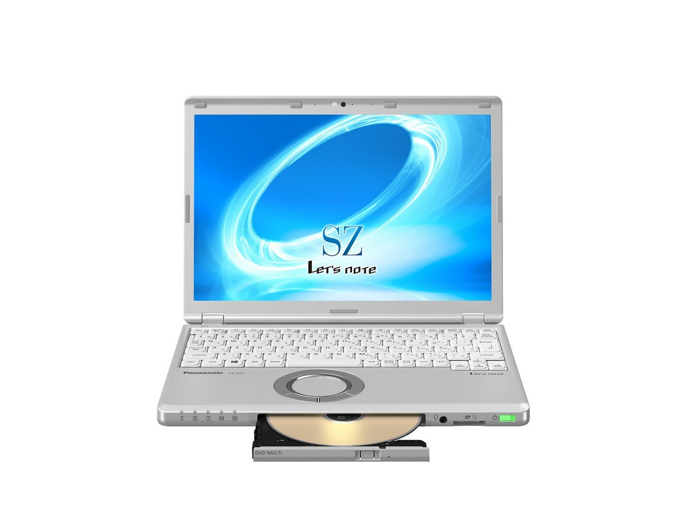
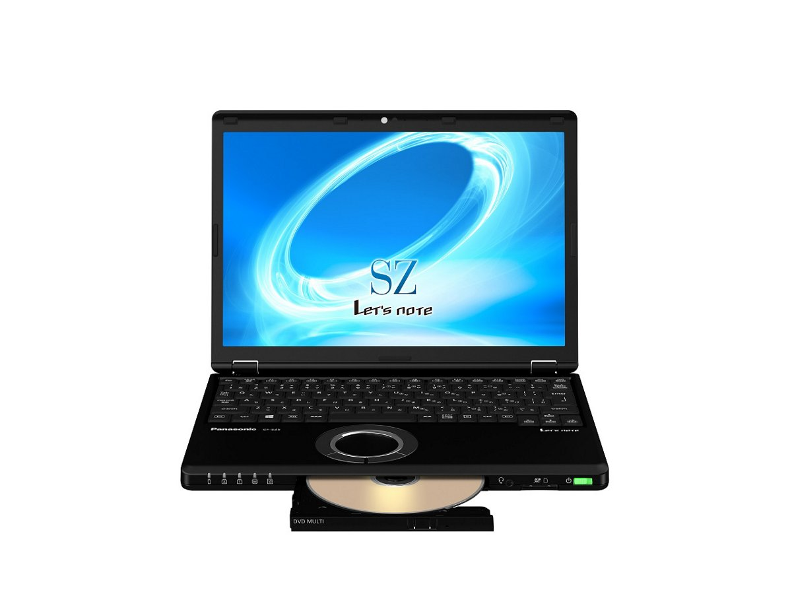
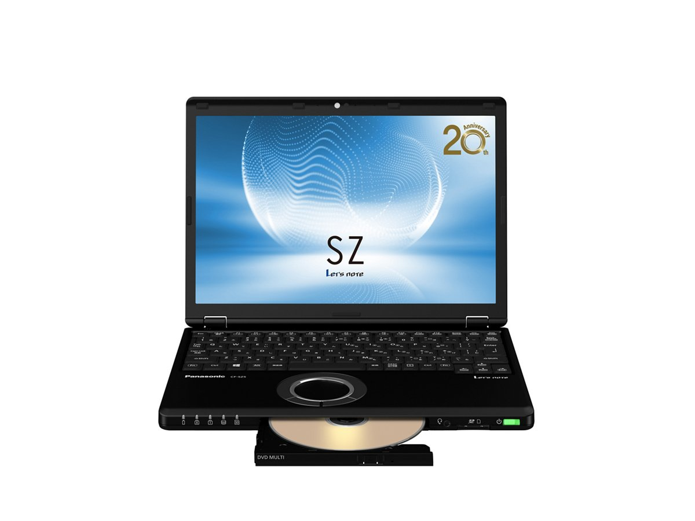

# レッツノート CF-SZ5 スペック・仕様一覧

[English](../../en/CF-SZ5/) · **日本語** · [中文](../../zh/CF-SZ5/)

🗄️ [レッツノート陳列棚](https://letsnote-specs.github.io/ja/CF-SZ5/)でこの機種を見る

パナソニック レッツノート **CF-SZ5**（SZシリーズ・12.1型WUXGA液晶）の全14品番（2015-11 – 2016-06発売）のスペック・仕様をまとめたページです。各品番の公式仕様表へのリンクも掲載しています。

*レッツノート CF-SZ5（CF-SZ5HDKPR, CF-SZ5HDLQR, CF-SZ5HDKRR, CF-SZ5YDKPR …）・シルバー。画像 © Panasonic*

## 品番一覧

| 品番 | 発売 | 生産終了 | 主な仕様 |
| :-- | :-- | :-- | :-- |
| [CF-SZ5WDKPR](https://panasonic.jp/pc/p-db/CF-SZ5WDKPR_spec.html) | 2016-06 | 2017-01 | Windows 10 Home 64ビット、Intel® CoreTM i5-6200U プロセッサー、メモリー：8GB（拡張スロットなし）、HDD：1TB、スーパーマルチドライブ、LAN、無線LAN 802.11a（W52/W53/W56）/b/g/n/ac、Microsoft® Office Home and Business Premium |
| [CF-SZ5WDLQR](https://panasonic.jp/pc/p-db/CF-SZ5WDLQR_spec.html) | 2016-06 | 2017-01 | Windows 10 Pro 64ビット、Intel® CoreTM i5-6200U プロセッサー、メモリー：8GB（拡張スロットなし）、SSD：128GB、スーパーマルチドライブ、LAN、無線LAN 802.11a（W52/W53/W56）/b/g/n/ac、Microsoft® Office Home and Business Premium |
| [CF-SZ5XDMQR](https://panasonic.jp/pc/p-db/CF-SZ5XDMQR_spec.html) | 2016-06 | 2017-01 | Windows 10 Pro 64ビット、Intel® CoreTM i7-6500U プロセッサー、メモリー：8GB（拡張スロットなし）、SSD：256GB、スーパーマルチドライブ、LAN、無線LAN 802.11a（W52/W53/W56）/b/g/n/ac、Microsoft® Office Home and Business Premium |
| [CF-SZ5XFMQR](https://panasonic.jp/pc/p-db/CF-SZ5XFMQR_spec.html) | 2016-06 | 2017-01 | Windows 10 Pro 64ビット、Intel® CoreTM i7-6500U プロセッサー、メモリー：8GB（拡張スロットなし）、SSD：256GB、スーパーマルチドライブ、LAN、無線LAN 802.11a（W52/W53/W56）/b/g/n/ac、LTE対応ワイヤレスWAN、Microsoft® Office Home and Business Premium |
| [CF-SZ5WDKRR](https://panasonic.jp/pc/p-db/CF-SZ5WDKRR_spec.html) | 2016-06 | 2017-01 | Windows 7 Professional 64ビット、Intel® CoreTM i5-6200U プロセッサー、メモリー：8GB（拡張スロットなし）、HDD：1TB、スーパーマルチドライブ、LAN、無線LAN 802.11a（W52/W53/W56）/b/g/n/ac、Microsoft® Office Home and Business Premium |
| [CF-SZ5HDKPR](https://panasonic.jp/pc/p-db/CF-SZ5HDKPR_spec.html) | 2016-01 | 2016-11 | Windows 10 Home 64ビット、Intel® CoreTM i5-6200U プロセッサー、メモリー：8GB（拡張スロットなし）、HDD：750GB、スーパーマルチドライブ、LAN、無線LAN 802.11a（W52/W53/W56）/b/g/n/ac、Microsoft® Office Home and Business Premium |
| [CF-SZ5HDLQR](https://panasonic.jp/pc/p-db/CF-SZ5HDLQR_spec.html) | 2016-01 | 2016-11 | Windows 10 Pro 64ビット、Intel® CoreTM i5-6200U プロセッサー、メモリー：5GB（拡張スロットなし）、SSD：128GB、スーパーマルチドライブ、LAN、無線LAN 802.11a（W52/W53/W56）/b/g/n/ac、Microsoft® Office Home and Business Premium |
| [CF-SZ5JDMQR](https://panasonic.jp/pc/p-db/CF-SZ5JDMQR_spec.html) | 2016-01 | 2016-11 | Windows 10 Pro 64ビット、Intel® CoreTM i7-6500U プロセッサー、メモリー：8GB（拡張スロットなし）、SSD：256GB、スーパーマルチドライブ、LAN、無線LAN 802.11a（W52/W53/W56）/b/g/n/ac、Microsoft® Office Home and Business Premium |
| [CF-SZ5JFMQR](https://panasonic.jp/pc/p-db/CF-SZ5JFMQR_spec.html) | 2016-01 | 2016-11 | Windows 10 Pro 64ビット、Intel® CoreTM i7-6500U プロセッサー、メモリー：8GB（拡張スロットなし）、SSD：256GB、スーパーマルチドライブ、LAN、無線LAN 802.11a（W52/W53/W56）/b/g/n/ac、LTE対応ワイヤレスWAN、Microsoft® Office Home and Business Premium |
| [CF-SZ5HDKRR](https://panasonic.jp/pc/p-db/CF-SZ5HDKRR_spec.html) | 2016-01 | 2016-11 | Windows 7 Professional 64ビット、Intel® CoreTM i5-6200U プロセッサー、メモリー：8GB（拡張スロットなし）、HDD：750GB、スーパーマルチドライブ、LAN、無線LAN 802.11a（W52/W53/W56）/b/g/n/ac、Microsoft® Office Home and Business Premium |
| [CF-SZ5YDKPR](https://panasonic.jp/pc/p-db/CF-SZ5YDKPR_spec.html) | 2015-11 | 2016-11 | Windows 10 Home 64ビット、Intel® CoreTM i5-6200U プロセッサー、メモリー：4GB（拡張スロットなし）、HDD：750GB、スーパーマルチドライブ、LAN、無線LAN 802.11a（W52/W53/W56）/b/g/n/ac、Microsoft® Office Home and Business Premium |
| [CF-SZ5YDLQR](https://panasonic.jp/pc/p-db/CF-SZ5YDLQR_spec.html) | 2015-11 | 2016-11 | Windows 10 Pro 64ビット、Intel® CoreTM i5-6200U プロセッサー、メモリー：4GB（拡張スロットなし）、SSD：128GB、スーパーマルチドライブ、LAN、無線LAN 802.11a（W52/W53/W56）/b/g/n/ac |
| [CF-SZ5ZDMQR](https://panasonic.jp/pc/p-db/CF-SZ5ZDMQR_spec.html) | 2015-11 | 2016-11 | Windows 10 Pro 64ビット、Intel® CoreTM i7-6500U プロセッサー、メモリー：8GB（拡張スロットなし）、SSD：256GB、スーパーマルチドライブ、LAN、無線LAN 802.11a（W52/W53/W56）/b/g/n/ac、Microsoft® Office Home and Business Premium |
| [CF-SZ5ZFMQR](https://panasonic.jp/pc/p-db/CF-SZ5ZFMQR_spec.html) | 2015-11 | 2016-11 | Windows 10 Pro 64ビット、Intel® CoreTM i7-6500U プロセッサー、メモリー：8GB（拡張スロットなし）、SSD：256GB、スーパーマルチドライブ、LAN、無線LAN 802.11a（W52/W53/W56）/b/g/n/ac、LTE対応ワイヤレスWAN、Microsoft® Office Home and Business Premium |

## 共通仕様

| 項目 | 仕様 |
| :-- | :-- |
| チップセット | CPUに内蔵 |
| 光学式ドライブ | スーパーマルチドライブ（DVD/CD）内蔵 バッファアンダーランエラー防止機能搭載 |
| 連続データ転送速度 / 再生 | DVD-RAM：最大5倍速 / DVD-ROM：最大8倍速 / DVD-R：最大8倍速 / DVD-R DL:最大8倍速 / DVD-RW：最大8倍速 / +R：最大8倍速 / +R DL：最大8倍速 / +RW：最大8倍速 / HighSpeed +RW：最大8倍速 / CD-ROM：最大24倍速 / CD-R：最大24倍速 / CD-RW：最大24倍速 / High-Speed CD-RW：最大24倍速 / Ultra-Speed CD-RW：最大24倍速 |
| 連続データ転送速度 / 記録 | DVD-RAM書き換え：最大5倍速 / DVD-R 書き込み：最大8倍速 / DVD-R DL 書き込み：最大6倍速 / DVD-RW 書き換え：最大6倍速 / +R 書き込み：最大8倍速 / +R DL 書き込み：最大6倍速 / +RW 書き換え：最大4倍速 / High Speed +RW 書き換え：最大8倍速 / CD-R 書き込み：最大24倍速 / CD-RW 書き換え：4倍速 / High-Speed CD-RW 書き換え：10倍速 / Ultra-Speed CD-RW 書き換え：最大16倍速 |
| 対応ディスク、および対応フォーマット / 再生 | DVD-RAM（ 1.4GB、2.8GB、4.7GB、9.4GB ） / DVD-ROM（1層、2層） / DVD-Video（1層、2層） / DVD-R（ 1.4GB、2.8GB、4.7GB） / DVD-R DL（ 8.5GB ） / DVD-RW（ Ver.1.1/1.2 1.4GB、2.8GB、4.7GB、9.4GB） / +R（ 4.7GB ） / +R DL（ 8.5GB ） / +RW（ 4.7GB ） / HighSpeed +RW（ 4.7GB ） / CD-Audio / CD-ROM（XA対応） / Photo CD（マルチセッション対応） / Video CD / CD EXTRA / CD-TEXT / CD-R / CD-RW / High-Speed CD-RW / Ultra-Speed CD-RW |
| 対応ディスク、および対応フォーマット / 記録 | DVD-RAM（ 1.4GB、2.8GB、4.7GB、9.4GB） / DVD-R（ 1.4GB、2.8 GB、4.7GB for General） / DVD-R DL（ 8.5GB ） / DVD-RW（ Ver.1.1/1.2 1.4GB、2.8GB、4.7GB、9.4GB） / +R（ 4.7GB ） / +R DL（ 8.5GB ） / +RW（ 4.7GB ） / High Speed +RW（ 4.7GB） / CD-R / CD-RW / High-Speed CD-RW / Ultra-Speed CD-RW |
| 表示方式 / グラフィックアクセラレーター | インテル HD グラフィックス520（CPUに内蔵） |
| 表示方式 / LCD表示 | 1920×1200ドット：約1677万色 |
| 表示方式 / 本体＋外部ディスプレイ同時表示 | 1024×768、1280×768、1280×1024、1360×768、1366×768、1400×1050、1600×900、1600×1200、1680×1050、1920×1080、1920×1200ドット：約1677万色 |
| ワイヤレス通信機能 | インテル Dual Band Wireless-AC 8260 |
| 無線LAN | IEEE802.11a（W52/W53/W56）/b/g/n/ac 準拠 |
| LAN | 1000BASE-T/100BASE-TX/10BASE-T |
| サウンド機能 | PCM音源（24ビットステレオ）、インテル High Definition Audio準拠、モノラルスピーカー |
| 拡張メモリースロット | なし |
| カメラ | 有効画素数：最大1920×1080ピクセル(約207万画素) |
| 内蔵マイク | アレイマイク |
| センサー | 照度センサー |
| インターフェース | ・LANコネクター（RJ-45） / ・外部ディスプレイコネクター（アナログRGB ミニD-sub 15ピン） / ・HDMI出力端子 / ・ヘッドセット端子（マイク入力＋オーディオ出力（ヘッドセットミニジャックM3） / ・USB3.0ポート×3(うち1つはUSB充電ポートも兼ねる) |
| キーボード | OADG準拠86キー、キーピッチ19mm(横)/16mm(縦)(一部キーを除く） |
| ポインティングデバイス | ホイールパッド |
| 消費電力 | 最大約65W |
| 達成率 ( 2011年度基準 ) | — |
| 外形寸法(幅×奥行×高さ) | 幅283.5mm×奥行203.8mm×高さ25.3mm 突起部除く |

## 品番別の違い

| 品番 | CPU | メモリー | ストレージ | 質量 | 駆動時間 |
| :-- | :-- | :-- | :-- | :-- | :-- |
| CF-SZ5WDKPR | Core i5-6200U | 8GB LPDDR3 SDRAM | ハードディスクドライブ | 1.02 kg | 11.5 h |
| CF-SZ5WDLQR | Core i5-6200U | 8GB LPDDR3 SDRAM | 128GB | 0.929 kg | 14 h |
| CF-SZ5XDMQR | Core i7-6500U | 8GB LPDDR3 SDRAM | 256GB | 1.025 kg | 21 h |
| CF-SZ5XFMQR | Core i7-6500U | 8GB LPDDR3 SDRAM | 256GB | 1.05 kg | 21 h |
| CF-SZ5WDKRR | Core i5-6200U | 8GB LPDDR3 SDRAM | ハードディスクドライブ | 1.02 kg | 11 h |
| CF-SZ5HDKPR | Core i5-6200U | 8GB LPDDR3 SDRAM | ハードディスクドライブ | 1.02 kg | 11.5 h |
| CF-SZ5HDLQR | Core i5-6200U | 8GB LPDDR3 SDRAM | 128GB | 0.929 kg | 14 h |
| CF-SZ5JDMQR | Core i7-6500U | 8GB LPDDR3 SDRAM | 256GB | 1.025 kg | 21 h |
| CF-SZ5JFMQR | Core i7-6500U | 8GB LPDDR3 SDRAM | 256GB | 1.05 kg | 21 h |
| CF-SZ5HDKRR | Core i5-6200U | 8GB LPDDR3 SDRAM | ハードディスクドライブ | 1.02 kg | 11 h |
| CF-SZ5YDKPR | Core i5-6200U | 4GB LPDDR3 SDRAM | ハードディスクドライブ | 1.02 kg | 11.5 h |
| CF-SZ5YDLQR | Core i5-6200U | 4GB LPDDR3 SDRAM | 128GB | 0.929 kg | 14.5 h |
| CF-SZ5ZDMQR | Core i7-6500U | 8GB LPDDR3 SDRAM | 256GB | 1.025 kg | 21 h |
| CF-SZ5ZFMQR | Core i7-6500U | 8GB LPDDR3 SDRAM | 256GB | 1.05 kg | 21 h |

CF-SZ5WDKPR の仕様の違い（すべて）

| 項目 | 仕様 |
| :-- | :-- |
| 搭載OS | Windows 10 Home 64ビット（日本語版） |
| CPU | インテル Core i5-6200Uプロセッサー / インテルスマートキャッシュ3MB、動作周波数2.30GHz（インテル ターボ・ブースト・テクノロジー2.0利用時は最大2.80GHz） |
| メインメモリー | 8GB LPDDR3 SDRAM（拡張スロットなし） |
| ビデオメモリー | 最大4176MB (メインメモリーと共用) |
| ハードディスクドライブ | ハードディスクドライブ（HDD）1TB（Serial ATA）上記容量のうち約15GBをリカバリー領域、約1GBをシステム領域として使用（ユーザー使用不可） |
| 表示方式 | 12.1型(16:10)WUXGA TFTカラー液晶 （1920 x 1200ドット）、アンチグレア |
| 表示方式 / 外部ディスプレイ出力 | 1024×768、1280×768、1280×1024、1360×768、1366×768、1400×1050、1600×900、1600×1200、1680×1050、1920×1080、1920×1200ドット：約1677万色 |
| LTE | なし |
| Bluetooth | Bluetooth v4.1 / ■対応プロファイル / 【Classic】 / ・A2DP（Source） / ・AVRCP（Target） / ・HCRP（Client） / ・HFP（AG） / ・HID（Host） / ・OPP（ClientおよびServer） / ・PAN（User） / ・SPP（DevAおよびDevB） / 【Low Energy】 / ・HOGP（Host） |
| セキュリティチップ | TPM（TCG V1.2準拠） |
| SDメモリーカードスロット | SDメモリーカード×1スロット（SDHCメモリーカード/SDXCメモリーカード対応/UHS-I高速転送対応/UHS-Ⅱ高速転送対応/著作権保護技術対応） |
| 電源 | ▼ACアダプター / 入力：AC100V～240V、50Hz/60Hz、出力：DC16V、4.06A、電源コードは100V専用 / ▼バッテリーパック / 7.2V リチウムイオン・公称容量6700mAh、定格容量6400mAh |
| エネルギー消費効率 | 2011年度基準 Ｎ区分0.022 |
| 駆動／充電時間 | ▼駆動時間 ： / （JEITA Ver.2.0）付属バッテリーパック（S）装着時：約11.5時間 / ▼充電時間： / 約3時間（電源OFF時）、約3時間（電源ON時） |
| 本体カラー | シルバー |
| 質量(バッテリーを含む） | パソコン本体：約1.02kg（付属バッテリーパック(S)（約225g）装着時） / ACアダプター：約220g（電源コード（約60g）除く） |
| ソフトウェア | ・Microsoft® Internet Explorer 11 / ・Microsoft® Edge / ・Microsoft® .NET Framework 4.6 / ・Microsoft® Windows Media Player 12 / ・ネットセレクターLite / ・インテル® ワイヤレス Bluetooth® / ・マカフィーリブセーフ（60日間 無料体験版） / ・i-フィルター6.0 (30日間無料お試し版) / ・WinZip 19.5日本語版（45日体験版） / ・Power2Go with DVD authoring / ・CyberLink PowerDVD12 / ・ディスプレイヘルパー / ・Wireless Manager mobile edition / ・Intel WiDi / ・Aptioセットアップユーティリティ / ・PC-Diagnosticユーティリティ / ・パナソニックPC設定ユーティリティ / ・ハードディスクデータ消去ユーティリティ / ・DirectX 12 / ・インテル PROSet/Wireless Software / ・画面共有アシストユーティリティー / ・PC情報ビューアー / ・リカバリーディスク作成ユーティリティ |
| Microsoft Office | Microsoft® Office Home and Business Premium |
| 付属品 | 標準ACアダプター、バッテリーパック(S)、取扱説明書、Microsoft Office Home & Business Premium |

公式仕様表: <https://panasonic.jp/pc/p-db/CF-SZ5WDKPR_spec.html>

CF-SZ5WDLQR の仕様の違い（すべて）

| 項目 | 仕様 |
| :-- | :-- |
| 搭載OS | Windows 10 Pro 64ビット（日本語版） |
| CPU | インテル Core i5-6200Uプロセッサー / インテルスマートキャッシュ3MB、動作周波数2.30GHz（インテル ターボ・ブースト・テクノロジー2.0利用時は最大2.80GHz） |
| メインメモリー | 8GB LPDDR3 SDRAM（拡張スロットなし） |
| ビデオメモリー | 最大4176MB (メインメモリーと共用) |
| 表示方式 | 12.1型(16:10)WUXGA TFTカラー液晶 （1920 x 1200ドット）、アンチグレア |
| 表示方式 / 外部ディスプレイ出力 | 1024×768、1280×768、1280×1024、1360×768、1366×768、1400×1050、1600×900、1600×1200、1680×1050、1920×1080、1920×1200ドット：約1677万色 |
| LTE | なし |
| Bluetooth | Bluetooth v4.1 / ■対応プロファイル / 【Classic】 / ・A2DP（Source） / ・AVRCP（Target） / ・HCRP（Client） / ・HFP（AG） / ・HID（Host） / ・OPP（ClientおよびServer） / ・PAN（User） / ・SPP（DevAおよびDevB） / 【Low Energy】 / ・HOGP（Host） |
| セキュリティチップ | TPM（TCG V1.2準拠） |
| SDメモリーカードスロット | SDメモリーカード×1スロット（SDHCメモリーカード/SDXCメモリーカード対応/UHS-I高速転送対応/UHS-Ⅱ高速転送対応/著作権保護技術対応） |
| 電源 | ▼ACアダプター / 入力：AC100V～240V、50Hz/60Hz、出力：DC16V、4.06A、電源コードは100V専用 / ▼バッテリーパック / 7.2V リチウムイオン・公称容量6700mAh、定格容量6400mAh |
| エネルギー消費効率 | 2011年度基準 Ｎ区分0.022 |
| 駆動／充電時間 | ▼駆動時間 ： / （JEITA Ver.2.0）付属バッテリーパック（S）装着時：約14時間 / ▼充電時間： / 約3時間（電源OFF時）、約3時間（電源ON時） |
| 本体カラー | シルバー |
| 質量(バッテリーを含む） | パソコン本体：約0.929kg（付属バッテリーパック(S)（約225g）装着時） / ACアダプター：約220g（電源コード（約60g）除く） |
| ソフトウェア | ・Microsoft® Internet Explorer 11 / ・Microsoft® Edge / ・Microsoft® .NET Framework 4.6 / ・Microsoft® Windows Media Player 12 / ・ネットセレクターLite / ・インテル® ワイヤレス Bluetooth® / ・マカフィーリブセーフ（60日間 無料体験版） / ・i-フィルター6.0 (30日間無料お試し版) / ・WinZip 19.5日本語版（45日体験版） / ・Power2Go with DVD authoring / ・CyberLink PowerDVD12 / ・ディスプレイヘルパー / ・Wireless Manager mobile edition / ・Intel WiDi / ・Aptioセットアップユーティリティ / ・PC-Diagnosticユーティリティ / ・パナソニックPC設定ユーティリティ / ・ハードディスクデータ消去ユーティリティ / ・DirectX 12 / ・インテル PROSet/Wireless Software / ・画面共有アシストユーティリティー / ・PC情報ビューアー / ・リカバリーディスク作成ユーティリティ |
| Microsoft Office | Microsoft® Office Home and Business Premium |
| 付属品 | 標準ACアダプター、バッテリーパック(S)、取扱説明書、Microsoft Office Home & Business Premium |
| フラッシュメモリードライブ | フラッシュメモリードライブ（SSD）128GB（Serial ATA）上記容量のうち約15GBをリカバリー領域、約1GBをシステム領域として使用（ユーザー使用不可） |

公式仕様表: <https://panasonic.jp/pc/p-db/CF-SZ5WDLQR_spec.html>

CF-SZ5XDMQR の仕様の違い（すべて）

| 項目 | 仕様 |
| :-- | :-- |
| 搭載OS | Windows 10 Pro 64ビット（日本語版） |
| CPU | インテル Core i7-6500U プロセッサー / インテルスマートキャッシュ4MB、動作周波数2.50GHz（インテル ターボ・ブースト・テクノロジー2.0利用時は最大3.10GHz） |
| メインメモリー | 8GB LPDDR3 SDRAM（拡張スロットなし） |
| ビデオメモリー | 最大4176MB (メインメモリーと共用) |
| 表示方式 | 12.1型(16:10)WUXGA TFTカラー液晶 （1920 x 1200ドット）、アンチグレア |
| 表示方式 / 外部ディスプレイ出力 | 1024×768、1280×768、1280×1024、1360×768、1366×768、1400×1050、1600×900、1600×1200、1680×1050、1920×1080、1920×1200ドット：約1677万色 |
| LTE | なし |
| Bluetooth | Bluetooth v4.1 / ■対応プロファイル / 【Classic】 / ・A2DP（Source） / ・AVRCP（Target） / ・HCRP（Client） / ・HFP（AG） / ・HID（Host） / ・OPP（ClientおよびServer） / ・PAN（User） / ・SPP（DevAおよびDevB） / 【Low Energy】 / ・HOGP（Host） |
| セキュリティチップ | TPM（TCG V1.2準拠） |
| SDメモリーカードスロット | SDメモリーカード×1スロット（SDHCメモリーカード/SDXCメモリーカード対応/UHS-I高速転送対応/UHS-Ⅱ高速転送対応/著作権保護技術対応） |
| 電源 | ▼ACアダプター / 入力：AC100V～240V、50Hz/60Hz、出力：DC16V、4.06A、電源コードは100V専用 / ▼バッテリーパック / 7.2V リチウムイオン・公称容量10050mAh、定格容量9600mAh |
| エネルギー消費効率 | 2011年度基準 N区分0.019 |
| 駆動／充電時間 | ▼駆動時間 ： / （JEITA Ver.2.0）付属バッテリーパック（L）装着時：約21時間 / ▼充電時間： / 約3.5時間（電源OFF時）、約3.5時間（電源ON時） |
| 本体カラー | ブラック |
| 質量(バッテリーを含む） | パソコン本体：約1.025kg（付属バッテリーパック（L）(約320g)装着時） / ACアダプター：約220g（電源コード（約60g）除く） |
| ソフトウェア | ・Microsoft® Internet Explorer 11 / ・Microsoft® Edge / ・Microsoft® .NET Framework 4.6 / ・Microsoft® Windows Media Player 12 / ・ネットセレクターLite / ・インテル® ワイヤレス Bluetooth® / ・マカフィーリブセーフ（60日間 無料体験版） / ・i-フィルター6.0 (30日間無料お試し版) / ・WinZip 19.5日本語版（45日体験版） / ・Power2Go with DVD authoring / ・CyberLink PowerDVD12 / ・ディスプレイヘルパー / ・Wireless Manager mobile edition / ・Intel WiDi / ・Aptioセットアップユーティリティ / ・PC-Diagnosticユーティリティ / ・パナソニックPC設定ユーティリティ / ・ハードディスクデータ消去ユーティリティ / ・DirectX 12 / ・インテル PROSet/Wireless Software / ・画面共有アシストユーティリティー / ・PC情報ビューアー / ・リカバリーディスク作成ユーティリティ |
| Microsoft Office | Microsoft® Office Home and Business Premium |
| 付属品 | 標準ACアダプター、バッテリーパック(L)、取扱説明書、Microsoft Office Home & Business Premium |
| フラッシュメモリードライブ | フラッシュメモリードライブ（SSD）256GB（Serial ATA）上記容量のうち約15GBをリカバリー領域、約1GBをシステム領域として使用（ユーザー使用不可） |

公式仕様表: <https://panasonic.jp/pc/p-db/CF-SZ5XDMQR_spec.html>

CF-SZ5XFMQR の仕様の違い（すべて）

| 項目 | 仕様 |
| :-- | :-- |
| 搭載OS | Windows 10 Pro 64ビット（日本語版） |
| CPU | インテル Core i7-6500U プロセッサー / インテルスマートキャッシュ4MB、動作周波数2.50GHz（インテル ターボ・ブースト・テクノロジー2.0利用時は最大3.10GHz） |
| メインメモリー | 8GB LPDDR3 SDRAM（拡張スロットなし） |
| ビデオメモリー | 最大4176MB (メインメモリーと共用) |
| 表示方式 | 12.1型(16:10)WUXGA TFTカラー液晶 （1920 x 1200ドット）、アンチグレア |
| 表示方式 / 外部ディスプレイ出力 | 1024×768、1280×768、1280×1024、1360×768、1366×768、1400×1050、1600×900、1600×1200、1680×1050、1920×1080、1920×1200ドット：約1677万色 |
| LTE | ワイヤレスWANモジュール内蔵（LTE対応） |
| Bluetooth | Bluetooth v4.1 / ■対応プロファイル / 【Classic】 / ・A2DP（Source） / ・AVRCP（Target） / ・HCRP（Client） / ・HFP（AG） / ・HID（Host） / ・OPP（ClientおよびServer） / ・PAN（User） / ・SPP（DevAおよびDevB） / 【Low Energy】 / ・HOGP（Host） |
| セキュリティチップ | TPM（TCG V1.2準拠） |
| 電源 | ▼ACアダプター / 入力：AC100V～240V、50Hz/60Hz、出力：DC16V、4.06A、電源コードは100V専用 / ▼バッテリーパック / 7.2V リチウムイオン・公称容量10050mAh、定格容量9600mAh |
| エネルギー消費効率 | 2011年度基準 N区分0.019 |
| 駆動／充電時間 | ▼駆動時間 ： / （JEITA Ver.2.0）付属バッテリーパック（L）装着時：約21時間 / ▼充電時間： / 約3.5時間（電源OFF時）、約3.5時間（電源ON時） |
| 本体カラー | ブラック |
| 質量(バッテリーを含む） | パソコン本体：約1.05kg（付属バッテリーパック（L）(約320g)装着時） / ACアダプター：約220g（電源コード（約60g）除く） |
| ソフトウェア | ・Microsoft® Internet Explorer 11 / ・Microsoft® Edge / ・Microsoft® .NET Framework 4.6 / ・Microsoft® Windows Media Player 12 / ・ネットセレクターLite / ・インテル® ワイヤレス Bluetooth® / ・マカフィーリブセーフ（60日間 無料体験版） / ・i-フィルター6.0 (30日間無料お試し版) / ・WinZip 19.5日本語版（45日体験版） / ・Power2Go with DVD authoring / ・CyberLink PowerDVD12 / ・ディスプレイヘルパー / ・Wireless Manager mobile edition / ・Intel WiDi / ・Aptioセットアップユーティリティ / ・PC-Diagnosticユーティリティ / ・パナソニックPC設定ユーティリティ / ・ハードディスクデータ消去ユーティリティ / ・DirectX 12 / ・インテル PROSet/Wireless Software / ・画面共有アシストユーティリティー / ・PC情報ビューアー / ・リカバリーディスク作成ユーティリティ |
| Microsoft Office | Microsoft® Office Home and Business Premium |
| 付属品 | 標準ACアダプター、バッテリーパック(L)、取扱説明書、Microsoft Office Home & Business Premium |
| フラッシュメモリードライブ | フラッシュメモリードライブ（SSD）256GB（Serial ATA）上記容量のうち約15GBをリカバリー領域、約1GBをシステム領域として使用（ユーザー使用不可） |
| カードスロット / SDメモリーカードスロット | SDメモリーカード×1スロット（SDHCメモリーカード/SDXCメモリーカード対応/UHS-I高速転送対応/UHS-Ⅱ高速転送対応/著作権保護技術対応） |
| カードスロット / その他カードスロット | ドコモmini UIMカードスロット(micro SIMサイズ) |

公式仕様表: <https://panasonic.jp/pc/p-db/CF-SZ5XFMQR_spec.html>

CF-SZ5WDKRR の仕様の違い（すべて）

| 項目 | 仕様 |
| :-- | :-- |
| 搭載OS | Windows 7 Professional 64ビット / （Windows 10 Proダウングレード権行使） |
| CPU | インテル Core i5-6200Uプロセッサー / インテルスマートキャッシュ3MB、動作周波数2.30GHz（インテル ターボ・ブースト・テクノロジー2.0利用時は最大2.80GHz） |
| メインメモリー | 8GB LPDDR3 SDRAM（拡張スロットなし） |
| ビデオメモリー | 最大1824MB (メインメモリーと共用) |
| ハードディスクドライブ | ハードディスクドライブ（HDD）1TB（Serial ATA）上記容量のうち約30GBをリカバリー領域、約300MBをシステム領域として使用（ユーザー使用不可） |
| 表示方式 | 12.1型(16:10)WUXGA TFTカラー液晶 （1920 x 1200ドット）、アンチグレア |
| 表示方式 / 外部ディスプレイ出力 | 1024×768、1280×768、1280×1024、1360×768、1366×768、1400×1050、1600×900、1600×1200、1680×1050、1920×1080、1920×1200ドット：約1677万色 |
| LTE | なし |
| Bluetooth | Bluetooth v4.0 / ■対応プロファイル / 【Classic】 / ・A2DP（Source） / ・AVRCP（Target） / ・BIP（Client） / ・BPP（Sender） / ・FTP（ClientおよびServer） / ・HCRP（Client） / ・HSP（AG） / ・HFP（AG） / ・HID（Host） / ・OPP（ClientおよびServer） / ・PAN（User） / ・PBAP（PCE） / ・SPP（DevAおよびDevB） / ・SYNC（Client） / 【Low Energy】 / ・HOGP（Host） |
| セキュリティチップ | TPM（TCG V1.2準拠） |
| SDメモリーカードスロット | SDメモリーカード×1スロット（SDHCメモリーカード/SDXCメモリーカード対応/UHS-I高速転送対応/UHS-Ⅱ高速転送対応/著作権保護技術対応） |
| 電源 | ▼ACアダプター / 入力：AC100V～240V、50Hz/60Hz、出力：DC16V、4.06A、電源コードは100V専用 / ▼バッテリーパック / 7.2V リチウムイオン・公称容量6700mAh、定格容量6400mAh |
| エネルギー消費効率 | 2011年度基準Ｎ区分0.022 |
| 駆動／充電時間 | ▼駆動時間 ： / （JEITA Ver.2.0）付属バッテリーパック（S）装着時：約11時間 / ▼充電時間： / 約3時間（電源OFF時）、約3時間（電源ON時） |
| 本体カラー | シルバー |
| 質量(バッテリーを含む） | パソコン本体：約1.02kg（付属バッテリーパック(S)（約225g）装着時） / ACアダプター：約220g（電源コード（約60g）除く） |
| ソフトウェア | ・Microsoft® Internet Explorer 11 / ・Adobe Reader / ・Microsoft® .NET Framework 4.5 / ・Microsoft® Windows Media Player 12 / ・ネットセレクターLite / ・インテル® ワイヤレス Bluetooth® / ・マカフィーリブセーフ（60日間 無料体験版） / ・i-フィルター6.0 (30日間無料お試し版) / ・WinZip 19.5日本語版（45日体験版） / ・Power2Go with DVD authoring / ・CyberLink PowerDVD12 / ・ディスプレイヘルパー / ・Wireless Manager mobile edition / ・Intel WiDi / ・Aptioセットアップユーティリティ / ・PC-Diagnosticユーティリティ / ・セキュリティ設定ユーティリティ / ・ハードディスクデータ消去ユーティリティ / ・DirectX 11.1 / ・インテル PROSet/Wireless Software / ・画面共有アシストユーティリティー / ・PC情報ビューアー / ・リカバリーディスク作成ユーティリティ |
| Microsoft Office | Microsoft® Office Home and Business Premium |
| 付属品 | 標準ACアダプター、バッテリーパック(S)、取扱説明書、Microsoft Office Home & Business Premium |

公式仕様表: <https://panasonic.jp/pc/p-db/CF-SZ5WDKRR_spec.html>

CF-SZ5HDKPR の仕様の違い（すべて）

| 項目 | 仕様 |
| :-- | :-- |
| 搭載OS | Windows 10 Home 64ビット（日本語版） |
| CPU | インテル Core i5-6200Uプロセッサー / インテルスマートキャッシュ3MB、動作周波数2.30GHz（インテル ターボ・ブースト・テクノロジー2.0利用時は最大2.80GHz） |
| メインメモリー | 8GB LPDDR3 SDRAM（拡張スロットなし） |
| ビデオメモリー | 最大4178MB (メインメモリーと共用) |
| ハードディスクドライブ | ハードディスクドライブ（HDD）750GB（Serial ATA）上記容量のうち約15GBをリカバリー領域、約1GBをシステム領域として使用（ユーザー使用不可） |
| 表示方式 | 12.1型(16:10)WUXGA TFTカラー液晶 （1920 x 1200ドット） |
| 表示方式 / 外部ディスプレイ出力 | 1024×768、1280×768、1280×1024、1360×768、1366×768、1400×1050、1600×900、1600×1200、1680×1050 、1920×1080、1920×1200ドット：約1677万色 |
| LTE | なし |
| Bluetooth | Bluetooth v4.1 / ■対応プロファイル / 【Classic】 / ・A2DP（Source） / ・AVRCP（Target） / ・HCRP（Client） / ・HFP（AG） / ・HID（Host） / ・OPP（ClientおよびServer） / ・PAN（User） / ・SPP（DevAおよびDevB） / 【Low Energy】 / ・HOGP（Host） |
| SDメモリーカードスロット | SDメモリーカード×1スロット（SDHCメモリーカード/SDXCメモリーカード対応/UHS-I高速転送対応/UHS-Ⅱ高速転送対応/著作権保護技術対応） |
| 電源 | ▼ACアダプター / 入力：AC100V～240V、50Hz/60Hz、出力：DC16V、4.06A、電源コードは100V専用 / ▼バッテリーパック / 7.2V リチウムイオン・公称容量6700mAh、定格容量6400mAh |
| エネルギー消費効率 | 2011年度基準 Ｎ区分0.022 |
| 駆動／充電時間 | ▼駆動時間 ： / （JEITA Ver.2.0）付属バッテリーパック（S）装着時：約11.5時間 / ▼充電時間： / 約3時間（電源OFF時）、約3時間（電源ON時） |
| 本体カラー | シルバー |
| 質量(バッテリーを含む） | パソコン本体：約1.02kg（付属バッテリーパック(S)（約225g）装着時） / ACアダプター：約220g（電源コード（約60g）除く） |
| ソフトウェア | ・Microsoft® Internet Explorer 11 / ・Microsoft® Edge / ・Microsoft® .NET Framework 4.6 / ・Microsoft® Windows Media Player 12 / ・ネットセレクターLite / ・インテル® ワイヤレス Bluetooth® / ・マカフィーリブセーフ（60日間 無料体験版） / ・i-フィルター6.0 (30日間無料お試し版) / ・WinZip 19.5日本語版（45日体験版） / ・Power2Go with DVD authoring / ・CyberLink PowerDVD12 / ・ディスプレイヘルパー / ・Wireless Manager mobile edition / ・Intel WiDi / ・Aptioセットアップユーティリティ / ・PC-Diagnosticユーティリティ / ・パナソニックPC設定ユーティリティ / ・ハードディスクデータ消去ユーティリティ / ・DirectX 12 / ・インテル PROSet/Wireless Software / ・画面共有アシストユーティリティー / ・PC情報ビューアー / ・リカバリーディスク作成ユーティリティ |
| Microsoft Office | Microsoft® Office Home and Business Premium |
| 付属品 | 標準ACアダプター、バッテリーパック(S)、取扱説明書、Microsoft Office Home & Business Premium |

公式仕様表: <https://panasonic.jp/pc/p-db/CF-SZ5HDKPR_spec.html>

CF-SZ5HDLQR の仕様の違い（すべて）

| 項目 | 仕様 |
| :-- | :-- |
| 搭載OS | Windows 10 Pro 64ビット（日本語版） |
| CPU | インテル Core i5-6200Uプロセッサー / インテルスマートキャッシュ3MB、動作周波数2.30GHz（インテル ターボ・ブースト・テクノロジー2.0利用時は最大2.80GHz） |
| メインメモリー | 8GB LPDDR3 SDRAM（拡張スロットなし） |
| ビデオメモリー | 最大4178MB (メインメモリーと共用) |
| 表示方式 | 12.1型(16:10)WUXGA TFTカラー液晶 （1920 x 1200ドット） |
| 表示方式 / 外部ディスプレイ出力 | 1024×768、1280×768、1280×1024、1360×768、1366×768、1400×1050、1600×900、1600×1200、1680×1050 、1920×1080、1920×1200ドット：約1677万色 |
| LTE | なし |
| Bluetooth | Bluetooth v4.1 / ■対応プロファイル / 【Classic】 / ・A2DP（Source） / ・AVRCP（Target） / ・HCRP（Client） / ・HFP（AG） / ・HID（Host） / ・OPP（ClientおよびServer） / ・PAN（User） / ・SPP（DevAおよびDevB） / 【Low Energy】 / ・HOGP（Host） |
| SDメモリーカードスロット | SDメモリーカード×1スロット（SDHCメモリーカード/SDXCメモリーカード対応/UHS-I高速転送対応/UHS-Ⅱ高速転送対応/著作権保護技術対応） |
| 電源 | ▼ACアダプター / 入力：AC100V～240V、50Hz/60Hz、出力：DC16V、4.06A、電源コードは100V専用 / ▼バッテリーパック / 7.2V リチウムイオン・公称容量6700mAh、定格容量6400mAh |
| エネルギー消費効率 | 2011年度基準 Ｎ区分0.022 |
| 駆動／充電時間 | ▼駆動時間 ： / （JEITA Ver.2.0）付属バッテリーパック（S）装着時：約14時間 / ▼充電時間： / 約3時間（電源OFF時）、約3時間（電源ON時） |
| 本体カラー | シルバー |
| 質量(バッテリーを含む） | パソコン本体：約0.929kg（付属バッテリーパック(S)（約225g）装着時） / ACアダプター：約220g（電源コード（約60g）除く） |
| ソフトウェア | ・Microsoft® Internet Explorer 11 / ・Microsoft® Edge / ・Microsoft® .NET Framework 4.6 / ・Microsoft® Windows Media Player 12 / ・ネットセレクターLite / ・インテル® ワイヤレス Bluetooth® / ・マカフィーリブセーフ（60日間 無料体験版） / ・i-フィルター6.0 (30日間無料お試し版) / ・WinZip 19.5日本語版（45日体験版） / ・Power2Go with DVD authoring / ・CyberLink PowerDVD12 / ・ディスプレイヘルパー / ・Wireless Manager mobile edition / ・Intel WiDi / ・Aptioセットアップユーティリティ / ・PC-Diagnosticユーティリティ / ・パナソニックPC設定ユーティリティ / ・ハードディスクデータ消去ユーティリティ / ・DirectX 12 / ・インテル PROSet/Wireless Software / ・画面共有アシストユーティリティー / ・PC情報ビューアー / ・リカバリーディスク作成ユーティリティ |
| Microsoft Office | Microsoft® Office Home and Business Premium |
| 付属品 | 標準ACアダプター、バッテリーパック(S)、取扱説明書、Microsoft Office Home & Business Premium |
| フラッシュメモリードライブ | フラッシュメモリードライブ（SSD）128GB（Serial ATA）上記容量のうち約15GBをリカバリー領域、約1GBをシステム領域として使用（ユーザー使用不可） |

公式仕様表: <https://panasonic.jp/pc/p-db/CF-SZ5HDLQR_spec.html>

CF-SZ5JDMQR の仕様の違い（すべて）

| 項目 | 仕様 |
| :-- | :-- |
| 搭載OS | Windows 10 Pro 64ビット（日本語版） |
| CPU | インテル Core i7-6500U プロセッサー / インテルスマートキャッシュ4MB、動作周波数2.50GHz（インテル ターボ・ブースト・テクノロジー2.0利用時は最大3.10GHz） |
| メインメモリー | 8GB LPDDR3 SDRAM（拡張スロットなし） |
| ビデオメモリー | 最大4178MB (メインメモリーと共用) |
| 表示方式 | 12.1型(16:10)WUXGA TFTカラー液晶 （1920 x 1200ドット） |
| 表示方式 / 外部ディスプレイ出力 | 1024×768、1280×768、1280×1024、1360×768、1366×768、1400×1050、1600×900、1600×1200、1680×1050 、1920×1080、1920×1200ドット：約1677万色 |
| LTE | なし |
| Bluetooth | Bluetooth v4.1 / ■対応プロファイル / 【Classic】 / ・A2DP（Source） / ・AVRCP（Target） / ・HCRP（Client） / ・HFP（AG） / ・HID（Host） / ・OPP（ClientおよびServer） / ・PAN（User） / ・SPP（DevAおよびDevB） / 【Low Energy】 / ・HOGP（Host） |
| SDメモリーカードスロット | SDメモリーカード×1スロット（SDHCメモリーカード/SDXCメモリーカード対応/UHS-I高速転送対応/UHS-Ⅱ高速転送対応/著作権保護技術対応） |
| 電源 | ▼ACアダプター / 入力：AC100V～240V、50Hz/60Hz、出力：DC16V、4.06A、電源コードは100V専用 / ▼バッテリーパック / 7.2V リチウムイオン・公称容量10050mAh、定格容量9600mAh |
| エネルギー消費効率 | 2011年度基準 N区分0.019 |
| 駆動／充電時間 | ▼駆動時間 ： / （JEITA Ver.2.0）付属バッテリーパック（L）装着時：約21時間 / ▼充電時間： / 約3.5時間（電源OFF時）、約3.5時間（電源ON時） |
| 本体カラー | ブラック |
| 質量(バッテリーを含む） | パソコン本体：約1.025kg（付属バッテリーパック（L）(約320g)装着時） / ACアダプター：約220g（電源コード（約60g）除く） |
| ソフトウェア | ・Microsoft® Internet Explorer 11 / ・Microsoft® Edge / ・Microsoft® .NET Framework 4.6 / ・Microsoft® Windows Media Player 12 / ・ネットセレクターLite / ・インテル® ワイヤレス Bluetooth® / ・マカフィーリブセーフ（60日間 無料体験版） / ・i-フィルター6.0 (30日間無料お試し版) / ・WinZip 19.5日本語版（45日体験版） / ・Power2Go with DVD authoring / ・CyberLink PowerDVD12 / ・ディスプレイヘルパー / ・Wireless Manager mobile edition / ・Intel WiDi / ・Aptioセットアップユーティリティ / ・PC-Diagnosticユーティリティ / ・パナソニックPC設定ユーティリティ / ・ハードディスクデータ消去ユーティリティ / ・DirectX 12 / ・インテル PROSet/Wireless Software / ・画面共有アシストユーティリティー / ・PC情報ビューアー / ・リカバリーディスク作成ユーティリティ |
| Microsoft Office | Microsoft® Office Home and Business Premium |
| 付属品 | 標準ACアダプター、バッテリーパック(L)、取扱説明書、Microsoft Office Home & Business Premium |
| フラッシュメモリードライブ | フラッシュメモリードライブ（SSD）256GB（Serial ATA）上記容量のうち約15GBをリカバリー領域、約1GBをシステム領域として使用（ユーザー使用不可） |

公式仕様表: <https://panasonic.jp/pc/p-db/CF-SZ5JDMQR_spec.html>

CF-SZ5JFMQR の仕様の違い（すべて）

| 項目 | 仕様 |
| :-- | :-- |
| 搭載OS | Windows 10 Pro 64ビット（日本語版） |
| CPU | インテル Core i7-6500U プロセッサー / インテルスマートキャッシュ4MB、動作周波数2.50GHz（インテル ターボ・ブースト・テクノロジー2.0利用時は最大3.10GHz） |
| メインメモリー | 8GB LPDDR3 SDRAM（拡張スロットなし） |
| ビデオメモリー | 最大4178MB (メインメモリーと共用) |
| 表示方式 | 12.1型(16:10)WUXGA TFTカラー液晶 （1920 x 1200ドット） |
| 表示方式 / 外部ディスプレイ出力 | 1024×768、1280×768、1280×1024、1360×768、1366×768、1400×1050、1600×900、1600×1200、1680×1050 、1920×1080、1920×1200ドット：約1677万色 |
| LTE | ワイヤレスWANモジュール内蔵(Xi(LTE)対応) |
| Bluetooth | Bluetooth v4.1 / ■対応プロファイル / 【Classic】 / ・A2DP（Source） / ・AVRCP（Target） / ・HCRP（Client） / ・HFP（AG） / ・HID（Host） / ・OPP（ClientおよびServer） / ・PAN（User） / ・SPP（DevAおよびDevB） / 【Low Energy】 / ・HOGP（Host） |
| 電源 | ▼ACアダプター / 入力：AC100V～240V、50Hz/60Hz、出力：DC16V、4.06A、電源コードは100V専用 / ▼バッテリーパック / 7.2V リチウムイオン・公称容量10050mAh、定格容量9600mAh |
| エネルギー消費効率 | 2011年度基準 N区分0.019 |
| 駆動／充電時間 | ▼駆動時間 ： / （JEITA Ver.2.0）付属バッテリーパック（L）装着時：約21時間 / ▼充電時間： / 約3.5時間（電源OFF時）、約3.5時間（電源ON時） |
| 本体カラー | ブラック |
| 質量(バッテリーを含む） | パソコン本体：約1.05kg（付属バッテリーパック（L）(約320g)装着時） / ACアダプター：約220g（電源コード（約60g）除く） |
| ソフトウェア | ・Microsoft® Internet Explorer 11 / ・Microsoft® Edge / ・Microsoft® .NET Framework 4.6 / ・Microsoft® Windows Media Player 12 / ・ネットセレクターLite / ・インテル® ワイヤレス Bluetooth® / ・マカフィーリブセーフ（60日間 無料体験版） / ・i-フィルター6.0 (30日間無料お試し版) / ・WinZip 19.5日本語版（45日体験版） / ・Power2Go with DVD authoring / ・CyberLink PowerDVD12 / ・ディスプレイヘルパー / ・Wireless Manager mobile edition / ・Intel WiDi / ・Aptioセットアップユーティリティ / ・PC-Diagnosticユーティリティ / ・パナソニックPC設定ユーティリティ / ・ハードディスクデータ消去ユーティリティ / ・DirectX 12 / ・インテル PROSet/Wireless Software / ・画面共有アシストユーティリティー / ・PC情報ビューアー / ・リカバリーディスク作成ユーティリティ |
| Microsoft Office | Microsoft® Office Home and Business Premium |
| 付属品 | 標準ACアダプター、バッテリーパック(L)、取扱説明書、Microsoft Office Home & Business Premium |
| フラッシュメモリードライブ | フラッシュメモリードライブ（SSD）256GB（Serial ATA）上記容量のうち約15GBをリカバリー領域、約1GBをシステム領域として使用（ユーザー使用不可） |
| カードスロット / SDメモリーカードスロット | SDメモリーカード×1スロット（SDHCメモリーカード/SDXCメモリーカード対応/UHS-I高速転送対応/UHS-Ⅱ高速転送対応/著作権保護技術対応） |
| カードスロット / その他カードスロット | ドコモmini UIMカード(micro SIMサイズ) |

公式仕様表: <https://panasonic.jp/pc/p-db/CF-SZ5JFMQR_spec.html>

CF-SZ5HDKRR の仕様の違い（すべて）

| 項目 | 仕様 |
| :-- | :-- |
| 搭載OS | Windows 7 Professional 64ビット / （Windows 10 Proダウングレード権行使） |
| CPU | インテル Core i5-6200Uプロセッサー / インテルスマートキャッシュ3MB、動作周波数2.30GHz（インテル ターボ・ブースト・テクノロジー2.0利用時は最大2.80GHz） |
| メインメモリー | 8GB LPDDR3 SDRAM（拡張スロットなし） |
| ビデオメモリー | 最大1824MB (メインメモリーと共用) |
| ハードディスクドライブ | ハードディスクドライブ（HDD）750GB（Serial ATA）上記容量のうち約30GBをリカバリー領域、約300MBをシステム領域として使用（ユーザー使用不可） |
| 表示方式 | 12.1型(16:10)WUXGA TFTカラー液晶 （1920 x 1200ドット） |
| 表示方式 / 外部ディスプレイ出力 | 1024×768、1280×768、1280×1024、1360×768、1366×768、1400×1050、1600×900、1600×1200、1680×1050 、1920×1080、1920×1200ドット：約1677万色 |
| LTE | なし |
| Bluetooth | Bluetooth v4.0 / ■対応プロファイル / 【Classic】 / ・A2DP（Source） / ・AVRCP（Target） / ・BIP（Client） / ・BPP（Sender） / ・FTP（ClientおよびServer） / ・HCRP（Client） / ・HSP（AG） / ・HFP（AG） / ・HID（Host） / ・OPP（ClientおよびServer） / ・PAN（User） / ・PBAP（PCE） / ・SPP（DevAおよびDevB） / ・SYNC（Client） / 【Low Energy】 / ・HOGP（Host） |
| SDメモリーカードスロット | SDメモリーカード×1スロット（SDHCメモリーカード/SDXCメモリーカード対応/UHS-I高速転送対応/UHS-Ⅱ高速転送対応/著作権保護技術対応） |
| 電源 | ▼ACアダプター / 入力：AC100V～240V、50Hz/60Hz、出力：DC16V、4.06A、電源コードは100V専用 / ▼バッテリーパック / 7.2V リチウムイオン・公称容量6700mAh、定格容量6400mAh |
| エネルギー消費効率 | 2011年度基準Ｎ区分0.022 |
| 駆動／充電時間 | ▼駆動時間 ： / （JEITA Ver.2.0）付属バッテリーパック（S）装着時：約11時間 / ▼充電時間： / 約3時間（電源OFF時）、約3時間（電源ON時） |
| 本体カラー | シルバー |
| 質量(バッテリーを含む） | パソコン本体：約1.02kg（付属バッテリーパック(S)（約225g）装着時） / ACアダプター：約220g（電源コード（約60g）除く） |
| ソフトウェア | ・Microsoft® Internet Explorer 11 / ・Adobe Reader / ・Microsoft® .NET Framework 4.5 / ・Microsoft® Windows Media Player 12 / ・ネットセレクターLite / ・インテル® ワイヤレス Bluetooth® / ・マカフィーリブセーフ（60日間 無料体験版） / ・i-フィルター6.0 (30日間無料お試し版) / ・WinZip 19.5日本語版（45日体験版） / ・Power2Go with DVD authoring / ・CyberLink PowerDVD12 / ・ディスプレイヘルパー / ・Wireless Manager mobile edition / ・Intel WiDi / ・Aptioセットアップユーティリティ / ・PC-Diagnosticユーティリティ / ・セキュリティ設定ユーティリティ / ・ハードディスクデータ消去ユーティリティ / ・DirectX 11.1 / ・インテル PROSet/Wireless Software / ・画面共有アシストユーティリティー / ・PC情報ビューアー / ・リカバリーディスク作成ユーティリティ |
| Microsoft Office | Microsoft® Office Home and Business Premium |
| 付属品 | 標準ACアダプター、バッテリーパック(S)、取扱説明書、Microsoft Office Home & Business Premium |

公式仕様表: <https://panasonic.jp/pc/p-db/CF-SZ5HDKRR_spec.html>

CF-SZ5YDKPR の仕様の違い（すべて）

| 項目 | 仕様 |
| :-- | :-- |
| 搭載OS | Windows 10 Home 64ビット（日本語版） |
| CPU | インテル Core i5-6200Uプロセッサー / インテルスマートキャッシュ3MB、動作周波数2.30GHz（インテル ターボ・ブースト・テクノロジー2.0利用時は最大2.80GHz） |
| メインメモリー | 4GB LPDDR3 SDRAM（拡張スロットなし） |
| ビデオメモリー | 最大2128MB (メインメモリーと共用) |
| ハードディスクドライブ | ハードディスクドライブ（HDD）750GB（Serial ATA）上記容量のうち約15GBをリカバリー領域、約1GBをシステム領域として使用（ユーザー使用不可） |
| 表示方式 | 12.1型(16:10)WUXGA TFTカラー液晶 （1920 x 1200ドット） |
| 表示方式 / 外部ディスプレイ出力 | 1024×768、1280×768、1280×1024、1360×768、1366×768、1400×1050、1600×900、1600×1200、1680×1050 、1920×1080、1920×1200ドット：約1677万色 |
| LTE | なし |
| Bluetooth | Bluetooth v4.1 / ■対応プロファイル / 【Classic】 / ・A2DP（Source） / ・AVRCP（Target） / ・HCRP（Client） / ・HFP（AG） / ・HID（Host） / ・OPP（ClientおよびServer） / ・PAN（User） / ・SPP（DevAおよびDevB） / 【Low Energy】 / ・HOGP（Host） |
| SDメモリーカードスロット | SDメモリーカード×1スロット（SDHCメモリーカード/SDXCメモリーカード対応/UHS-I高速転送対応/UHS-Ⅱ高速転送対応/著作権保護技術対応） |
| 電源 | ▼ACアダプター / 入力：AC100V～240V、50Hz/60Hz、出力：DC16V、4.06A、電源コードは100V専用 / ▼バッテリーパック / 7.2V リチウムイオン・公称容量6700mAh、定格容量6400mAh |
| エネルギー消費効率 | 2011年度基準 R区分0.022 |
| 駆動／充電時間 | ▼駆動時間： / （JEITA Ver.2.0）付属バッテリーパック（S）装着時：約11.5時間 / ▼充電時間： / 約3時間（電源OFF時）、約3時間（電源ON時） |
| 本体カラー | シルバー |
| 質量(バッテリーを含む） | パソコン本体：約1.02kg（付属のバッテリーパック(S)（約0.225kg）装着時） / ACアダプター：約0.220kg（電源コード（約0.06kg）除く） |
| ソフトウェア | ・Microsoft® Internet Explorer 11 / ・Microsoft® Edge / ・Microsoft® .NET Framework 4.6 / ・Microsoft® Windows Media Player 12 / ・ネットセレクターLite / ・インテル® ワイヤレス Bluetooth® / ・マカフィーリブセーフ（60日間 無料体験版） / ・i-フィルター6.0 (30日間無料お試し版) / ・WinZip 19.5日本語版（45日体験版） / ・Power2Go with DVD authoring / ・CyberLink PowerDVD12 / ・ディスプレイヘルパー / ・Wireless Manager mobile edition / ・Intel WiDi / ・Aptioセットアップユーティリティ / ・PC-Diagnosticユーティリティ / ・パナソニックPC設定ユーティリティ / ・ハードディスクデータ消去ユーティリティ / ・DirectX 12 / ・インテル PROSet/Wireless Software / ・画面共有アシストユーティリティー / ・PC情報ビューアー / ・リカバリーディスク作成ユーティリティ |
| Microsoft Office | Microsoft® Office Home and Business Premium |
| 付属品 | 標準ACアダプター、バッテリーパック(S)、取扱説明書、Microsoft Office Home & Business Premium |

公式仕様表: <https://panasonic.jp/pc/p-db/CF-SZ5YDKPR_spec.html>

CF-SZ5YDLQR の仕様の違い（すべて）

| 項目 | 仕様 |
| :-- | :-- |
| 搭載OS | Windows 10 Pro 64ビット（日本語版） |
| CPU | インテル Core i5-6200Uプロセッサー / インテルスマートキャッシュ3MB、動作周波数2.30GHz（インテル ターボ・ブースト・テクノロジー2.0利用時は最大2.80GHz） |
| メインメモリー | 4GB LPDDR3 SDRAM（拡張スロットなし） |
| ビデオメモリー | 最大2128MB (メインメモリーと共用) |
| 表示方式 | 12.1型(16:10)WUXGA TFTカラー液晶 （1920 x 1200ドット） |
| 表示方式 / 外部ディスプレイ出力 | 1024×768、1280×768、1280×1024、1360×768、1366×768、1400×1050、1600×900、1600×1200、1680×1050 、1920×1080、1920×1200ドット：約1677万色 |
| LTE | なし |
| Bluetooth | Bluetooth v4.1 / ■対応プロファイル / 【Classic】 / ・A2DP（Source） / ・AVRCP（Target） / ・HCRP（Client） / ・HFP（AG） / ・HID（Host） / ・OPP（ClientおよびServer） / ・PAN（User） / ・SPP（DevAおよびDevB） / 【Low Energy】 / ・HOGP（Host） |
| SDメモリーカードスロット | SDメモリーカード×1スロット（SDHCメモリーカード/SDXCメモリーカード対応/UHS-I高速転送対応/UHS-Ⅱ高速転送対応/著作権保護技術対応） |
| 電源 | ▼ACアダプター / 入力：AC100V～240V、50Hz/60Hz、出力：DC16V、4.06A、電源コードは100V専用 / ▼バッテリーパック / 7.2V リチウムイオン・公称容量6700mAh、定格容量6400mAh |
| エネルギー消費効率 | 2011年度基準 R区分0.022 |
| 駆動／充電時間 | ▼駆動時間： / （JEITA Ver.2.0）付属バッテリーパック（S）装着時：約14.5時間 / ▼充電時間： / 約3時間（電源OFF時）、約3時間（電源ON時） |
| 本体カラー | シルバー |
| 質量(バッテリーを含む） | パソコン本体：約0.929kg（付属のバッテリーパック(S)（約0.225kg）装着時） / ACアダプター：約0.22kg（電源コード（約0.06kg）除く） |
| ソフトウェア | ・Microsoft® Internet Explorer 11 / ・Microsoft® Edge / ・Microsoft® .NET Framework 4.6 / ・Microsoft® Windows Media Player 12 / ・ネットセレクターLite / ・インテル® ワイヤレス Bluetooth® / ・マカフィーリブセーフ（60日間 無料体験版） / ・i-フィルター6.0 (30日間無料お試し版) / ・WinZip 19.5日本語版（45日体験版） / ・Power2Go with DVD authoring / ・CyberLink PowerDVD12 / ・ディスプレイヘルパー / ・Wireless Manager mobile edition / ・Intel WiDi / ・Aptioセットアップユーティリティ / ・PC-Diagnosticユーティリティ / ・パナソニックPC設定ユーティリティ / ・ハードディスクデータ消去ユーティリティ / ・DirectX 12 / ・インテル PROSet/Wireless Software / ・画面共有アシストユーティリティー / ・PC情報ビューアー / ・リカバリーディスク作成ユーティリティ |
| 付属品 | 標準ACアダプター、バッテリーパック(S)、取扱説明書 |
| フラッシュメモリードライブ | フラッシュメモリードライブ（SSD）128GB（Serial ATA）上記容量のうち約15GBをリカバリー領域、約1GBをシステム領域として使用（ユーザー使用不可） |

公式仕様表: <https://panasonic.jp/pc/p-db/CF-SZ5YDLQR_spec.html>

CF-SZ5ZDMQR の仕様の違い（すべて）

| 項目 | 仕様 |
| :-- | :-- |
| 搭載OS | Windows 10 Pro 64ビット（日本語版） |
| CPU | インテル Core i7-6500U プロセッサー / インテルスマートキャッシュ4MB、動作周波数2.50GHz（インテル ターボ・ブースト・テクノロジー2.0利用時は最大3.10GHz） |
| メインメモリー | 8GB LPDDR3 SDRAM（拡張スロットなし） |
| ビデオメモリー | 最大4176MB (メインメモリーと共用) |
| 表示方式 | 12.1型(16:10)WUXGA TFTカラー液晶 （1920 x 1200ドット） |
| 表示方式 / 外部ディスプレイ出力 | 1024×768、1280×768、1280×1024、1360×768、1366×768、1400×1050、1600×900、1600×1200、1680×1050 、1920×1080、1920×1200ドット：約1677万色 |
| LTE | なし |
| Bluetooth | Bluetooth v4.1 / ■対応プロファイル / 【Classic】 / ・A2DP（Source） / ・AVRCP（Target） / ・HCRP（Client） / ・HFP（AG） / ・HID（Host） / ・OPP（ClientおよびServer） / ・PAN（User） / ・SPP（DevAおよびDevB） / 【Low Energy】 / ・HOGP（Host） |
| SDメモリーカードスロット | SDメモリーカード×1スロット（SDHCメモリーカード/SDXCメモリーカード対応/UHS-I高速転送対応/UHS-Ⅱ高速転送対応/著作権保護技術対応） |
| 電源 | ▼ACアダプター / 入力：AC100V～240V、50Hz/60Hz、出力：DC16V、4.06A、電源コードは100V専用 / ▼バッテリーパック / 7.2V リチウムイオン・公称容量10050mAh、定格容量9600mAh |
| エネルギー消費効率 | 2011年度基準 N区分0.019 |
| 駆動／充電時間 | ▼駆動時間： / （JEITA Ver.2.0）付属バッテリーパック（L）装着時：約21時間 / ▼充電時間： / 約3.5時間（電源OFF時）、約3.5時間（電源ON時） |
| 本体カラー | ブラック |
| 質量(バッテリーを含む） | パソコン本体：約1.025kg（バッテリーパック（L）(約0.320kg)装着時） / ACアダプター：約0.22kg（電源コード（約0.06kg）除く） |
| ソフトウェア | ・Microsoft® Internet Explorer 11 / ・Microsoft® Edge / ・Microsoft® .NET Framework 4.6 / ・Microsoft® Windows Media Player 12 / ・ネットセレクターLite / ・インテル® ワイヤレス Bluetooth® / ・マカフィーリブセーフ（60日間 無料体験版） / ・i-フィルター6.0 (30日間無料お試し版) / ・WinZip 19.5日本語版（45日体験版） / ・Power2Go with DVD authoring / ・CyberLink PowerDVD12 / ・ディスプレイヘルパー / ・Wireless Manager mobile edition / ・Intel WiDi / ・Aptioセットアップユーティリティ / ・PC-Diagnosticユーティリティ / ・パナソニックPC設定ユーティリティ / ・ハードディスクデータ消去ユーティリティ / ・DirectX 12 / ・インテル PROSet/Wireless Software / ・画面共有アシストユーティリティー / ・PC情報ビューアー / ・リカバリーディスク作成ユーティリティ |
| Microsoft Office | Microsoft® Office Home and Business Premium |
| 付属品 | 標準ACアダプター、バッテリーパック(L)、取扱説明書、Microsoft Office Home & Business Premium |
| フラッシュメモリードライブ | フラッシュメモリードライブ（SSD）256GB（Serial ATA）上記容量のうち約15GBをリカバリー領域、約1GBをシステム領域として使用（ユーザー使用不可） |

公式仕様表: <https://panasonic.jp/pc/p-db/CF-SZ5ZDMQR_spec.html>

CF-SZ5ZFMQR の仕様の違い（すべて）

| 項目 | 仕様 |
| :-- | :-- |
| 搭載OS | Windows 10 Pro 64ビット（日本語版） |
| CPU | インテル Core i7-6500U プロセッサー / インテルスマートキャッシュ4MB、動作周波数2.50GHz（インテル ターボ・ブースト・テクノロジー2.0利用時は最大3.10GHz） |
| メインメモリー | 8GB LPDDR3 SDRAM（拡張スロットなし） |
| ビデオメモリー | 最大4176MB (メインメモリーと共用) |
| 表示方式 | 12.1型(16:10)WUXGA TFTカラー液晶 （1920 x 1200ドット） |
| 表示方式 / 外部ディスプレイ出力 | 1024×768、1280×768、1280×1024、1360×768、1366×768、1400×1050、1600×900、1600×1200、1680×1050 、1920×1080、1920×1200ドット：約1677万色 |
| LTE | ワイヤレスWANモジュール内蔵(Xi(LTE)対応) |
| Bluetooth | Bluetooth v4.1 / ■対応プロファイル / 【Classic】 / ・A2DP（Source） / ・AVRCP（Target） / ・HCRP（Client） / ・HFP（AG） / ・HID（Host） / ・OPP（ClientおよびServer） / ・PAN（User） / ・SPP（DevAおよびDevB） / 【Low Energy】 / ・HOGP（Host） |
| 電源 | ▼ACアダプター / 入力：AC100V～240V、50Hz/60Hz、出力：DC16V、4.06A、電源コードは100V専用 / ▼バッテリーパック / 7.2V リチウムイオン・公称容量10050mAh、定格容量9600mAh |
| エネルギー消費効率 | 2011年度基準 N区分0.019 |
| 駆動／充電時間 | ▼駆動時間： / （JEITA Ver.2.0）付属バッテリーパック（L）装着時：約21時間 / ▼充電時間： / 約3.5時間（電源OFF時）、約3.5時間（電源ON時） |
| 本体カラー | ブラック |
| 質量(バッテリーを含む） | パソコン本体：約1.05kg（バッテリーパック（L）(約0.320kg)装着時） / ACアダプター：約0.22kg（電源コード（約0.06kg）除く） |
| ソフトウェア | ・Microsoft® Internet Explorer 11 / ・Microsoft® Edge / ・Microsoft® .NET Framework 4.6 / ・Microsoft® Windows Media Player 12 / ・ネットセレクターLite / ・インテル® ワイヤレス Bluetooth® / ・マカフィーリブセーフ（60日間 無料体験版） / ・i-フィルター6.0 (30日間無料お試し版) / ・WinZip 19.5日本語版（45日体験版） / ・Power2Go with DVD authoring / ・CyberLink PowerDVD12 / ・ディスプレイヘルパー / ・Wireless Manager mobile edition / ・Intel WiDi / ・Aptioセットアップユーティリティ / ・PC-Diagnosticユーティリティ / ・パナソニックPC設定ユーティリティ / ・ハードディスクデータ消去ユーティリティ / ・DirectX 12 / ・インテル PROSet/Wireless Software / ・画面共有アシストユーティリティー / ・PC情報ビューアー / ・リカバリーディスク作成ユーティリティ |
| Microsoft Office | Microsoft® Office Home and Business Premium |
| 付属品 | 標準ACアダプター、バッテリーパック(L)、取扱説明書、Microsoft Office Home & Business Premium |
| フラッシュメモリードライブ | フラッシュメモリードライブ（SSD）256GB（Serial ATA）上記容量のうち約15GBをリカバリー領域、約1GBをシステム領域として使用（ユーザー使用不可） |
| カードスロット / SDメモリーカードスロット | SDメモリーカード×1スロット（SDHCメモリーカード/SDXCメモリーカード対応/UHS-I高速転送対応/UHS-Ⅱ高速転送対応/著作権保護技術対応） |
| カードスロット / その他カードスロット | ドコモmini UIMカード(micro SIMサイズ) |

公式仕様表: <https://panasonic.jp/pc/p-db/CF-SZ5ZFMQR_spec.html>

## 写真

*レッツノート CF-SZ5（CF-SZ5JDMQR, CF-SZ5JFMQR, CF-SZ5ZDMQR, CF-SZ5ZFMQR）・ブラック。画像 © Panasonic*

*レッツノート CF-SZ5（CF-SZ5XDMQR, CF-SZ5XFMQR）・ブラック。画像 © Panasonic*

*レッツノート CF-SZ5（CF-SZ5WDKPR, CF-SZ5WDLQR, CF-SZ5WDKRR）・シルバー。画像 © Panasonic*

## 関連機種

- 同シリーズの後継機種: [CF-SZ6](../CF-SZ6/)
- [レッツノート全機種一覧](../)

---

出典：パナソニック公式[生産終了品一覧](https://panasonic.jp/pc/support/products/)および各品番の仕様表（panasonic.jp）。製品画像 © Panasonic。本ページは非公式のまとめであり、パナソニックとは関係ありません。
