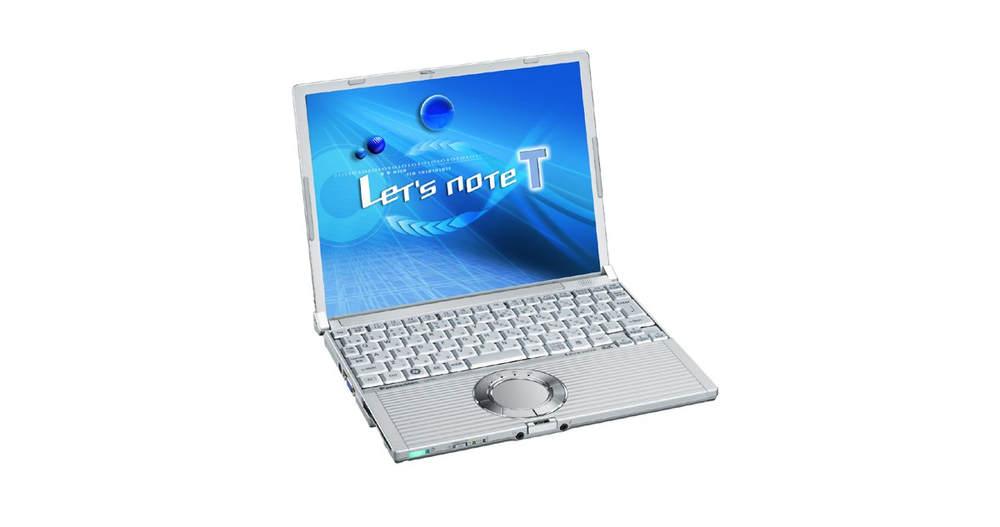
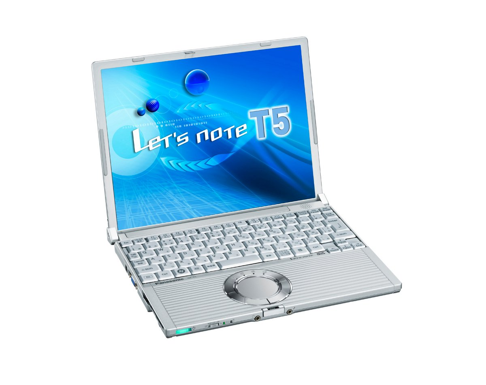
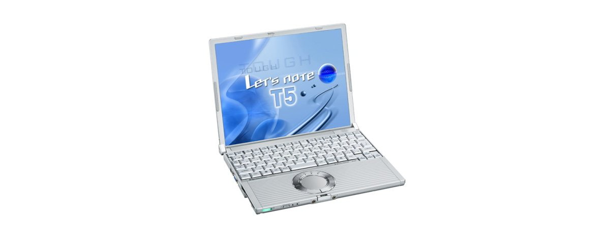
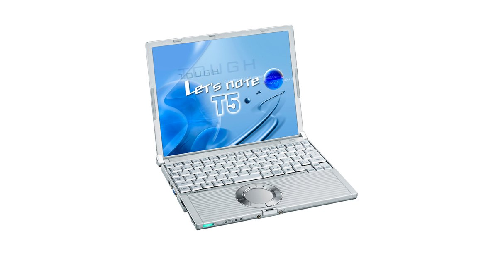

# レッツノート CF-T5 スペック・仕様一覧

[English](../../en/CF-T5/) · **日本語** · [中文](../../zh/CF-T5/)

パナソニック レッツノート **CF-T5**（T5シリーズ・12.1型XGA液晶）の全5品番（2006-05 – 2007-06発売）のスペック・仕様をまとめたページです。各品番の公式仕様表へのリンクも掲載しています。

*レッツノート CF-T5（CF-T5AW1BJR, CF-T5AW1PJR）。画像 © Panasonic*

## 品番一覧

| 品番 | 発売 | 生産終了 | 主な仕様 |
| :-- | :-- | :-- | :-- |
| [CF-T5AW1PJR](https://panasonic.jp/pc/p-db/CF-T5AW1PJR_spec.html) | 2007-06 | 2008-03 | Windows Vista® Business 正規版 、CoreTM2 Duo U7500(1.06GHz・ULV)、メモリー：1GB（最大1.5GB)、HDD：80GB、LAN、無線LAN 802.11a(J52/W52/W53)/b/g、USB2.0、Office Personal ＜台数限定＞ |
| [CF-T5AW1BJR](https://panasonic.jp/pc/p-db/CF-T5AW1BJR_spec.html) | 2007-05 | 2008-03 | Windows Vista® Business 正規版 、CoreTM2 Duo U7500(1.06GHz・ULV)、メモリー：1GB（最大1.5GB)、HDD：80GB、LAN、無線LAN 802.11a(J52/W52/W53)/b/g、USB2.0 |
| [CF-T5MW4AJR](https://panasonic.jp/pc/p-db/CF-T5MW4AJR_spec.html) | 2007-01 | 2008-03 | Windows Vista® Business 正規版 、CoreTM Duo U2400(1.06GHz・ULV)、メモリー：512MB（最大1.5GB)、HDD：60GB、LAN、無線LAN 802.11a(J52/W52/W53)/b/g、USB2.0 |
| [CF-T5LW4AXR](https://panasonic.jp/pc/p-db/CF-T5LW4AXR_spec.html) | 2006-10 | 2006-10 | Windows® XP Professional 正規版 、CoreTM Solo U1400(1.20GHz・ULV)、メモリー：512MB（最大1.5GB)、HDD：60GB、LAN、無線LAN 802.11a(J52/W52/W53)/b/g、USB2.0 |
| [CF-T5KW4AXR](https://panasonic.jp/pc/p-db/CF-T5KW4AXR_spec.html) | 2006-05 | 2006-07 | Windows® XP Professional正規版 、CoreTM Solo U1300(1.06GHz・ULV)、メモリー：512MB（最大1024MB)、HDD：60GB、LAN、無線LAN 802.11a(J52/W52/W53)/b/g、USB2.0 |

## 共通仕様

| 項目 | 仕様 |
| :-- | :-- |
| 表示方式 / LCD表示 | 1024×768ドット：約1677万色 |
| LAN | 100BASE-TX / 10BASE-T |
| ポインティングデバイス | ホイールパッド |
| 消費電力 | 最大約40W |

## 品番別の違い

| 品番 | CPU | メモリー | ストレージ | 質量 | 駆動時間 |
| :-- | :-- | :-- | :-- | :-- | :-- |
| CF-T5AW1PJR | Core 2 Duo 超低電圧版U7500 | 1GB DDR2 SDRAM | 80GB | 1.27 kg | — |
| CF-T5AW1BJR | Core 2 Duo 超低電圧版U7500 | 1GB DDR2 SDRAM | 80GB | 1.27 kg | — |
| CF-T5MW4AJR | Core Duo超低電圧版U2400 | 512MB DDR2 SDRAM | 60GB | 1.26 kg | — |
| CF-T5LW4AXR | Core Solo 超低電圧版 U1400 | 512 MB | 60 GB | 1.26 kg | 15 h |
| CF-T5KW4AXR | Core Solo 超低電圧版 U1300 | 512 MB | 60 GB | 1.26 kg | 15 h |

CF-T5AW1PJR の仕様の違い（すべて）

| 項目 | 仕様 |
| :-- | :-- |
| OS | Windows Vista TM Business 正規版 |
| CPU | インテル(R) Core TM 2 Duoプロセッサー 超低電圧版U7500 / 2次キャッシュメモリー 2MB、動作周波数 1.06GHz、フロントサイド・バス 533MHz |
| チップセット | モバイル インテル(R) 945GMS Express チップセット |
| メインメモリー | 標準1GB DDR2 SDRAM（拡張メモリースロットに512MBメモリー増設済み、空きスロット0。 / 本体に標準装着済みの512MBメモリーを外して、1GBメモリーを増設した場合は、最大1.5GB。） |
| ビデオメモリー | 最大224MB （メインメモリーと共用） |
| ハードディスクドライブ | 80GB（Ultra ATA100）上記容量のうち約6GBは修復用領域（リカバリー用データ領域を含む）として使用。（ユーザー使用不可） |
| フロッピーディスクドライブ(オプション) | USB接続外付3.5型3モード対応（1.44MB /1.2MB /720KB ） |
| 表示方式 | XGA(1024×768ドット)12.1型TFTカラー液晶 |
| 表示方式 / 外部ディスプレイ出力 | 800×600/1024×768/1280×768/1280×1024/1400×1050/1440×900/1600×1200/2048×1536ドット（60Ｈｚ）：約1677万色 |
| 表示方式 / 本体＋外部ディスプレイ同時表示 | 800×600/1024×768ドット：約1677万色 |
| 無線LAN | インテル(R)PRO/Wireless 3945ABGネットワーク・コネクション、IEEE802.11a（J52/W52/W53）/b/g準拠 、 / (WPA-AES/TKIP対応、Wi-Fi準拠) |
| モデム | データ：56kbps（V.90） FAX：14.4kbps /ボイス非対応 |
| サウンド機能 | PCM音源（16ビットステレオ）/インテル(R) High Definition Audio 準拠、モノラルスピーカー |
| セキュリティチップ | ＴＰＭ（TCG V1.2準拠） |
| カードスロット / PCカードスロット | PCカード（TYPEII）×1スロット(CardBus対応、許容電流3.3V：400mA、5V：400mA) |
| カードスロット / SDメモリーカードスロット | SDメモリーカード ×1スロット（SDHCメモリーカード/著作権保護機能対応。Windows Ready Boost機能には対応しておりません） |
| 拡張メモリースロット | DDR2 172ピン マイクロDIMM専用スロット×1(1.8V/PC2-4200/DDR2 SDRAM、512MBメモリー増設済み) |
| インターフェース | USBポート×2（USB2.0） 、モデムコネクター（RJ-11） 、LANコネクター（RJ-45）、 / 外部ディスプレイコネクター（アナログRGB ミニDsub 15ピン）、ミニポートリプリケーターコネクター（専用50ピン・R6に搭載） |
| キーボード | OADG準拠キーボード（85キー）：キーピッチ19mm(横)／16mm(縦) (一部キーを除く) |
| 電源 | AC100V～240V（50Hz/60Hz）（電源コードは100V専用） / バッテリーパック（11.1Vリチウムイオン・7.65Ah） / 別売軽量バッテリーパック：7.4Vリチウムイオン・5.1Ah |
| エネルギー消費効率 | 2007年度基準Ｉ区分0.00027 |
| 外形寸法(幅×奥行×高さ) | 幅268mm×奥行210.4mm×高さ24.9mm/44.3mm（前部/後部） |
| 質量(バッテリーを含む） | 約1270g（標準バッテリーパック使用時）／約1050g(別売軽量バッテリーパック使用時) |
| ソフトウェア | Microsoft(R) Internet Explorer7.0、Adobe(R) Reader、DMIビューアー、Microsoft(R) Windows(R) MediaTM Player 11、DirectX 10、Microsoft(R) Windows(R) Movie Maker 6.0、Microsoft(R) .NET Framework3.0、ホイールパッドユーティリティ、hi-hoオンラインサインアップ、ズームビューアー、PC情報ビューアー、NumLockお知らせ、ハードディスクデータ消去ユーティリティ 、Wireless Manager mobile edition3.0 、無線切り替えユーティリティ、セキュリティ設定ユーティリティ、エコノミーモード（ECO）切り替えユーティリティ、省電力設定ユーティリティ、バッテリー残量表示補正ユーティリティ、Hotkey設定、セットアップユーティリティ、PC-Diagnosticユーティリティ 、マカフィー・インターネットセキュリティスイートベーシックエディション 、gooスティック、ネットセレクター2、Infineon TPM Professional Package V3.0 SP1 / Microsoft(R) Office Personal 2007with PowerPoint 2007 |
| 付属品 | プロダクトリカバリーDVD-ROM、ACアダプター、標準バッテリーパック、Windows Anytime Upgrade DVD、取扱説明書 等 |

公式仕様表: <https://panasonic.jp/pc/p-db/CF-T5AW1PJR_spec.html>

CF-T5AW1BJR の仕様の違い（すべて）

| 項目 | 仕様 |
| :-- | :-- |
| OS | Windows Vista TM Business 正規版 |
| CPU | インテル(R) Core TM 2 Duoプロセッサー 超低電圧版U7500 / 2次キャッシュメモリー 2MB、動作周波数 1.06GHz、フロントサイド・バス 533MHz |
| チップセット | モバイル インテル(R) 945GMS Express チップセット |
| メインメモリー | 標準1GB DDR2 SDRAM（拡張メモリースロットに512MBメモリー増設済み、空きスロット0。 / 本体に標準装着済みの512MBメモリーを外して、1GBメモリーを増設した場合は、最大1.5GB。） |
| ビデオメモリー | 最大224MB （メインメモリーと共用） |
| ハードディスクドライブ | 80GB（Ultra ATA100）上記容量のうち約6GBは修復用領域（リカバリー用データ領域を含む）として使用。（ユーザー使用不可） |
| フロッピーディスクドライブ(オプション) | USB接続外付3.5型3モード対応（1.44MB /1.2MB /720KB ） |
| 表示方式 | XGA(1024×768ドット)12.1型TFTカラー液晶 |
| 表示方式 / 外部ディスプレイ出力 | 800×600/1024×768/1280×768/1280×1024/1400×1050/1440×900/1600×1200/2048×1536ドット（60Ｈｚ）：約1677万色 |
| 表示方式 / 本体＋外部ディスプレイ同時表示 | 800×600/1024×768ドット：約1677万色 |
| 無線LAN | インテル(R)PRO/Wireless 3945ABGネットワーク・コネクション、IEEE802.11a（J52/W52/W53）/b/g準拠 、 / (WPA-AES/TKIP対応、Wi-Fi準拠) |
| モデム | データ：56kbps（V.90） FAX：14.4kbps /ボイス非対応 |
| サウンド機能 | PCM音源（16ビットステレオ）/インテル(R) High Definition Audio 準拠、モノラルスピーカー |
| セキュリティチップ | ＴＰＭ（TCG V1.2準拠） |
| カードスロット / PCカードスロット | PCカード（TYPEII）×1スロット(CardBus対応、許容電流3.3V：400mA、5V：400mA) |
| カードスロット / SDメモリーカードスロット | SDメモリーカード ×1スロット（SDHCメモリーカード/著作権保護機能対応。Windows Ready Boost機能には対応しておりません） |
| 拡張メモリースロット | DDR2 172ピン マイクロDIMM専用スロット×1(1.8V/PC2-4200/DDR2 SDRAM、512MBメモリー増設済み) |
| インターフェース | USBポート×2（USB2.0） 、モデムコネクター（RJ-11） 、LANコネクター（RJ-45）、 / 外部ディスプレイコネクター（アナログRGB ミニDsub 15ピン）、ミニポートリプリケーターコネクター（専用50ピン・R6に搭載） |
| キーボード | OADG準拠キーボード（85キー）：キーピッチ19mm(横)／16mm(縦) (一部キーを除く) |
| 電源 | AC100V～240V（50Hz/60Hz）（電源コードは100V専用） / バッテリーパック（11.1Vリチウムイオン・7.65Ah） / 別売軽量バッテリーパック：7.4Vリチウムイオン・5.1Ah |
| エネルギー消費効率 | 2007年度基準Ｉ区分0.00027 |
| 外形寸法(幅×奥行×高さ) | 幅268mm×奥行210.4mm×高さ24.9mm/44.3mm（前部/後部） |
| 質量(バッテリーを含む） | 約1270g（標準バッテリーパック使用時）／約1050g(別売軽量バッテリーパック使用時) |
| ソフトウェア | Microsoft(R) Internet Explorer7.0、Adobe(R) Reader、DMIビューアー、Microsoft(R) Windows(R) MediaTM Player 11、DirectX 10、Microsoft(R) Windows(R) Movie Maker 6.0、Microsoft(R) .NET Framework3.0、ホイールパッドユーティリティ、hi-hoオンラインサインアップ、ズームビューアー、PC情報ビューアー、NumLockお知らせ、ハードディスクデータ消去ユーティリティ 、Wireless Manager mobile edition3.0 、無線切り替えユーティリティ、セキュリティ設定ユーティリティ、エコノミーモード（ECO）切り替えユーティリティ、省電力設定ユーティリティ、バッテリー残量表示補正ユーティリティ、Hotkey設定、セットアップユーティリティ、PC-Diagnosticユーティリティ 、マカフィー・インターネットセキュリティスイートベーシックエディション 、gooスティック、ネットセレクター2、Infineon TPM Professional Package V3.0 SP1 |
| 付属品 | プロダクトリカバリーDVD-ROM、ACアダプター、標準バッテリーパック、Windows Anytime Upgrade DVD、取扱説明書 等 |

公式仕様表: <https://panasonic.jp/pc/p-db/CF-T5AW1BJR_spec.html>

CF-T5MW4AJR の仕様の違い（すべて）

| 項目 | 仕様 |
| :-- | :-- |
| OS | Windows Vista TM Business 正規版 |
| CPU | インテル(R) Centrino(R) Duo モバイルテクノロジー / インテル(R) Core TM Duoプロセッサー超低電圧版U2400 / 2次キャッシュメモリー2MB、動作周波数 1.06GHz、フロントサイド・バス 533MHz |
| チップセット | モバイル インテル(R) 945GMS Express チップセット |
| メインメモリー | 標準512MB DDR2 SDRAM（最大1536MB）空きスロット1 |
| ビデオメモリー | 最大64MB（メインメモリーと共用） |
| ハードディスクドライブ | 60GB（Ultra ATA100）上記容量のうち約6GBは修復用領域として使用。（ユーザー使用不可） |
| フロッピーディスクドライブ(オプション) | USB接続外付3.5型3モード対応（1.44MB/1.2MB/720KB） |
| 表示方式 | XGA(1024×768ドット)12.1型TFTカラー液晶 |
| 表示方式 / 外部ディスプレイ出力 | 800×600/1024×768/1280×768/1280×1024/1400×1050/1600×1200/2048×1536ドット（60Ｈｚ）：約1677万色 |
| 表示方式 / 本体＋外部ディスプレイ同時表示 | 800×600/1024×768ドット：約1677万色 |
| 無線LAN | インテル(R)PRO/Wireless 3945ABG ネットワーク・コネクション、IEEE802.11a（J52/W52/W53）/b/g準拠、(WPA-AES/TKIP対応、Wi-Fi準拠) |
| モデム | データ：56kbps（V.90）、FAX：14.4kbps /ボイス非対応 |
| サウンド機能 | PCM音源（16ビットステレオ）/インテル(R) High Definition Audio 準拠、ステレオスピーカー |
| セキュリティチップ | ＴＰＭ（TCG V1.2準拠） |
| カードスロット / PCカードスロット | PCカード（TYPEII）×1スロット(CardBus対応、許容電流3.3V：400mA、5V：400mA) |
| カードスロット / SDメモリーカードスロット | SDメモリーカード×1スロット（著作権保護機能対応）・転送速度 8MB/秒 |
| 拡張メモリースロット | DDR2 172ピン マイクロDIMM専用スロット×1(1.8V/PC2-4200/DDR2 SDRAM) |
| インターフェース | USBポート×2（USB2.0）、モデムコネクター（RJ-11）、LANコネクター（RJ-45）、外部ディスプレイコネクター（アナログRGB ミニDsub 15ピン）、ミニポートリプリケーターコネクター（専用50ピン・Y5、R6に搭載） |
| キーボード | OADG準拠キーボード（85キー）：キーピッチ19mm(横)／16mm(縦)(一部キーを除く)／ホイールパッド |
| 電源 | AC100V～240V（50Hz/60Hz）（電源コードは100V専用） / バッテリーパック（11.1Vリチウムイオン・7.65Ah） / 別売軽量バッテリーパック：7.4Vリチウムイオン・5.1Ah |
| エネルギー消費効率 | 2007年度基準Ｉ区分0.00084 |
| 外形寸法(幅×奥行×高さ) | 幅268mm×奥行210.4mm×高さ24.9mm/44.3mm（前部/後部） |
| 質量(バッテリーを含む） | 約1260g、約1040g(別売軽量バッテリーパック） |
| ソフトウェア | Microsoft(R) Internet Explorer7.0、Adobe(R) Reader、DMIビューアー、Microsoft(R) Windows(R) MediaTM Player 11、DirectX 10、Microsoft(R) Windows(R) Movie Maker 6.0、Microsoft(R) .NET Framework3.0、ホイールパッドユーティリティ、hi-hoオンラインサインアップ、ズームビューアー、PC情報ビューアー、NumLockお知らせ、ハードディスクデータ消去ユーティリティ、Wireless Manager mobile edition3.0、無線切り替えユーティリティ、セキュリティ設定ユーティリティ、エコノミーモード（ECO）切り替えユーティリティ、省電力設定ユーティリティ、バッテリー残量表示補正ユーティリティ、Hotkey設定、セットアップユーティリティ、PC-Diagnosticユーティリティ、マカフィー・インターネットセキュリティスイートベーシックエディション、gooスティック、ホイールパッドユーティリティ |
| 付属品 | プロダクトリカバリーDVD-ROM、ACアダプター、標準バッテリーパック、Windows Anytime Upgrade DVD、取扱説明書 等 |

公式仕様表: <https://panasonic.jp/pc/p-db/CF-T5MW4AJR_spec.html>

CF-T5LW4AXR の仕様の違い（すべて）

| 項目 | 仕様 |
| :-- | :-- |
| OS | Microsoft(R) Windows(R) XP Professional Service Pack 2 セキュリティ強化機能搭載(NTFSファイルシステム） |
| CPU | インテル(R) Centrino(R) モバイル・テクノロジー / インテル(R) CoreTM Solo プロセッサー 超低電圧版 U1400（1.20GHz） / (2次キャッシュメモリー2 MB、動作周波数 1.20 GHz、フロントサイド・バス 533 MHz) |
| チップセット | モバイルインテル(R) 945GMS Express チップセット |
| メインメモリー | 標準512 MB/最大1536 MB (PC2-4200 / DDR2 SDRAM)空きスロット1 |
| ビデオメモリー | 最大128 MB(メインメモリーと共用) |
| ハードディスクドライブ | 60 GB (Ultra ATA100) / 上記容量のうち約3 GBはリカバリー用データ領域として使用（ユーザー使用不可） |
| フロッピーディスクドライブ(オプション) | USB接続外付3.5型3モード対応 / (1.44 MB/1.2 MB/720 KB) |
| 表示方式 | XGA(1024×768ドット) 12.1型TFTカラー液晶 |
| 表示方式 / 外部ディスプレイ出力 | 800×600ドット、1024×768ドット、1280×768ドット、1280×1024ドット、1400×1050ドット、1600×1200ドット、2048×1536ドット(60Hz)：約1677万色 |
| 表示方式 / 本体＋外部ディスプレイ同時表示 | 800×600ドット、1024×768ドット：約1677万色 |
| 無線LAN | インテル(R) PRO / Wireless 3945ABG ネットワーク・コネクション IEEE802.11a(J52/W52/W53)/b/g 準拠、（WPA-AES/TKIP対応、Wi-Fi準拠） |
| モデム | データ：56 kbps（V.90） FAX：14.4 kbps / ボイス非対応 |
| サウンド機能 | PCM音源（16ビットステレオ） / インテル(R) High Definition Audio準拠、モノラルスピーカー |
| セキュリティチップ | TPM(TCG V1.2準拠) |
| カードスロット / PCカードスロット | PCカード（TYPE II）×1スロット / （CardBus対応、許容電流3.3 V：400 mA、5 V：400 mA） |
| カードスロット / SDメモリーカードスロット | SDメモリーカード×1スロット（著作権保護機能対応）・転送速度 8MB/秒 |
| 拡張メモリースロット | DDR2 172ピン マイクロDIMM専用スロット×1（1.8V/PC2-4200/DDR2 SDRAM） |
| インターフェース | USBポート×2（USB2.0）、モデムコネクター（RJ-11）、LANコネクター（RJ-45）、外部ディスプレイコネクター（アナログRGB ミニDsub 15ピン）、マイク入力（ステレオミニジャックM3（プラグインパワー対応））、オーディオ出力（ステレオミニジャックM3） |
| キーボード | OADG準拠キーボード（85キー）：キーピッチ19mm（横）×16mm（縦） |
| 電源 | AC100 V～240 V（50 Hz/60 Hz）（電源コードは100 V専用） / 標準バッテリーパック（11.1 Vリチウムイオン・7.65 Ah） / 軽量バッテリーパック（7.4 Vリチウムイオン・5.1 Ah）（オプション） |
| エネルギー消費効率 | S区分 0.00028 |
| 外形寸法(幅×奥行×高さ) | 幅268 mm×奥行210.4 mm×高さ24.9 mm／44.3 mm（前部／後部） |
| 質量(バッテリーを含む） | 約1260 g（標準バッテリー使用時） / 約1040 g（軽量バッテリー（オプション）使用時） |
| ソフトウェア | Microsoft(R) Internet Explorer 6 Service Pack 2、Adobe Reader、DMIビューアー、Microsoft(R) Windows(R) Media Player 10、DirectX 9.0c、Microsoft(R) Windows(R) Movie Maker 2.1、Microsoft(R) .NET Framework 1.1 SP1/2.0、ネットセレクター、SDユーティリティ、ホイールパッドユーティリティ、Hotkey設定、gooスティック、セットアップユーティリティ、hi-hoオンラインサインアップ、フォントサイズ拡大ユーティリティ、ズームビューアー、PC情報ビューアー、NumLockお知らせ、ハードディスクデータ消去ユーティリティ、Wireless Manager mobile edition 3.0、マカフィー(R)・ウイルススキャン◆、無線切り替えユーティリティ、セキュリティ設定ユーティリティ、エコノミーモード(ECO）切り替えユーティリティ、省電力設定ユーティリティ、バッテリー残量表示補正ユーティリティ、Infineon TPM Professional Package V2.5 SP1、PC-Diagnosticユーティリティ / ワープロ、表計算等のアプリケーションソフトは導入されておりません。 |
| 付属品 | ACアダプター、標準バッテリーパック、取扱説明書 等 |
| 達成率 | — |
| バッテリー | 駆動時間※JEITAバッテリー動作時間測定法(Ver.1.0)による駆動時間。エコノミーモード（ECO）無効時。エコノミーモード（ECO）有効に設定している時の駆動時間は、無効時の約8割になります。バッテリー駆動時間は、動作環境・液晶の輝度・システム設定により変動します。※）：約15時間（標準バッテリー使用時） / 約6.5時間（軽量バッテリー（オプション）使用時） / 充電時間：標準バッテリー：約5時間(電源OFF時)、約7時間(電源ON時) / 軽量バッテリー（オプション）：約4時間(電源OFF時/電源ON時) |

公式仕様表: <https://panasonic.jp/pc/p-db/CF-T5LW4AXR_spec.html>

CF-T5KW4AXR の仕様の違い（すべて）

| 項目 | 仕様 |
| :-- | :-- |
| OS | Microsoft(R) Windows(R) XP Professional Service Pack 2 セキュリティ強化機能搭載(NTFSファイルシステム） |
| CPU | インテル(R) Centrino(R) モバイル・テクノロジー / インテル(R) CoreTM Solo プロセッサー 超低電圧版 U1300 （1.06GHｚ） / (2次キャッシュメモリー 2 MB、動作周波数 1.06 GHz、フロントサイド・バス 533 MHz) |
| チップセット | モバイルインテル(R) 945GMS Express チップセット |
| メインメモリー | 標準512 MB/最大1024 MB (PC2-4200 / DDR2 SDRAM) |
| ビデオメモリー | 最大128 MB(メインメモリーと共用) |
| ハードディスクドライブ | 60 GB (Ultra ATA100)（2.5型） / 上記容量のうち約3 GBはリカバリー用データ領域として使用（ユーザー使用不可） |
| フロッピーディスクドライブ(オプション) | USB接続外付3.5型3モード対応 / (1.44 MB/1.2 MB/720 KB) |
| 表示方式 | XGA(1024×768ドット) 12.1型TFTカラー液晶 |
| 表示方式 / 外部ディスプレイ出力 | 800×600ドット、1024×768ドット、1280×768ドット、1280×1024ドット、1400×1050ドット、1600×1200ドット、2048×1536ドット(60Hz)：約1677万色 |
| 表示方式 / 本体＋外部ディスプレイ同時表示 | 800×600ドット、1024×768ドット：約1677万色 |
| 無線LAN | インテル(R) PRO / Wireless 3945ABG ネットワーク・コネクション IEEE802.11a(J52/W52/W53)/b/g 準拠、（WPA-AES/TKIP対応、Wi-Fi準拠） |
| モデム | データ：56 kbps（V.90） FAX：14.4 kbps / ボイス非対応 |
| サウンド機能 | PCM音源（16ビットステレオ）、モノラルスピーカー |
| セキュリティチップ | TPM(TCG V1.2準拠) |
| カードスロット / PCカードスロット | PCカード（TYPE II）×1スロット / （CardBus対応、許容電流3.3 V：400 mA、5 V：400 mA） |
| カードスロット / SDメモリーカードスロット | SDメモリーカード×1スロット（著作権保護機能対応）・転送速度 8MB/秒 |
| 拡張メモリースロット | DDR2 172ピン マイクロDIMM専用スロット×1（1.8V/PC2-4200/DDR2 SDRAM） |
| インターフェース | USBポート×2（USB2.0）、モデムコネクター（RJ-11）、LANコネクター（RJ-45）、外部ディスプレイコネクター（アナログRGB ミニDsub 15ピン） |
| キーボード | OADG準拠キーボード（85キー）：キーピッチ19mm（横）×16mm（縦） |
| 電源 | AC100 V～240 V（50 Hz/60 Hz）（電源コードは100 V専用） / 標準バッテリーパック（11.1 Vリチウムイオン・7.65 Ah） / 軽量バッテリーパック（7.4 Vリチウムイオン・5.1 Ah）（オプション） |
| エネルギー消費効率 | S区分 0.00025 |
| 質量(バッテリーを含む） | 約1260 g（標準バッテリー使用時） / 約1040 g（軽量バッテリー（オプション）使用時） |
| ソフトウェア | Microsoft(R) Internet Explorer 6 Service Pack 2、Adobe Reader、DMIビューアー、Microsoft(R) Windows(R) Media Player 10、DirectX 9.0c、Microsoft(R) Windows(R) Movie Maker 2.1、Microsoft(R) .NET Framework 1.1、ネットセレクター、SDユーティリティ、ホイールパッドユーティリティ、Hotkey設定、gooスティック、セットアップユーティリティ、hi-hoオンラインサインアップ、フォントサイズ拡大ユーティリティ、ズームビューアー、PC情報ビューアー、NumLockお知らせ、ハードディスクデータ消去ユーティリティ、Wireless Manager mobile edition 2.0、マカフィー(R)・ウイルススキャン◆、無線切り替えユーティリティ、セキュリティ設定ユーティリティ、エコノミーモード(ECO）切り替えユーティリティ、省電力設定ユーティリティ、バッテリー残量表示補正ユーティリティ、Infineon TPM Professional Package V2.5、PC-Diagnosticユーティリティ / ワープロ、表計算等のアプリケーションソフトは導入されておりません。 |
| 付属品 | ACアダプター、標準バッテリーパック、取扱説明書 等 |
| 達成率 | — |
| バッテリー | 駆動時間：約15時間（標準バッテリー使用時） / 約6.5時間（軽量バッテリー（オプション）使用時） / 充電時間：標準バッテリー約5時間(電源OFF時)、約7時間(電源ON時) / 軽量バッテリー（オプション）：約4時間(電源OFF時/電源ON時) |
| 外形寸法（突起部除く） | 幅268 mm×奥行210.4 mm×高さ24.9 mm／44.3 mm（前部／後部） |

公式仕様表: <https://panasonic.jp/pc/p-db/CF-T5KW4AXR_spec.html>

## 写真

*レッツノート CF-T5（CF-T5MW4AJR）。画像 © Panasonic*

*レッツノート CF-T5（CF-T5LW4AXR）。画像 © Panasonic*

*レッツノート CF-T5（CF-T5KW4AXR）。画像 © Panasonic*

## 関連機種

- [レッツノート全機種一覧](../)

---

出典：パナソニック公式[生産終了品一覧](https://panasonic.jp/pc/support/products/)および各品番の仕様表（panasonic.jp）。製品画像 © Panasonic。本ページは非公式のまとめであり、パナソニックとは関係ありません。
