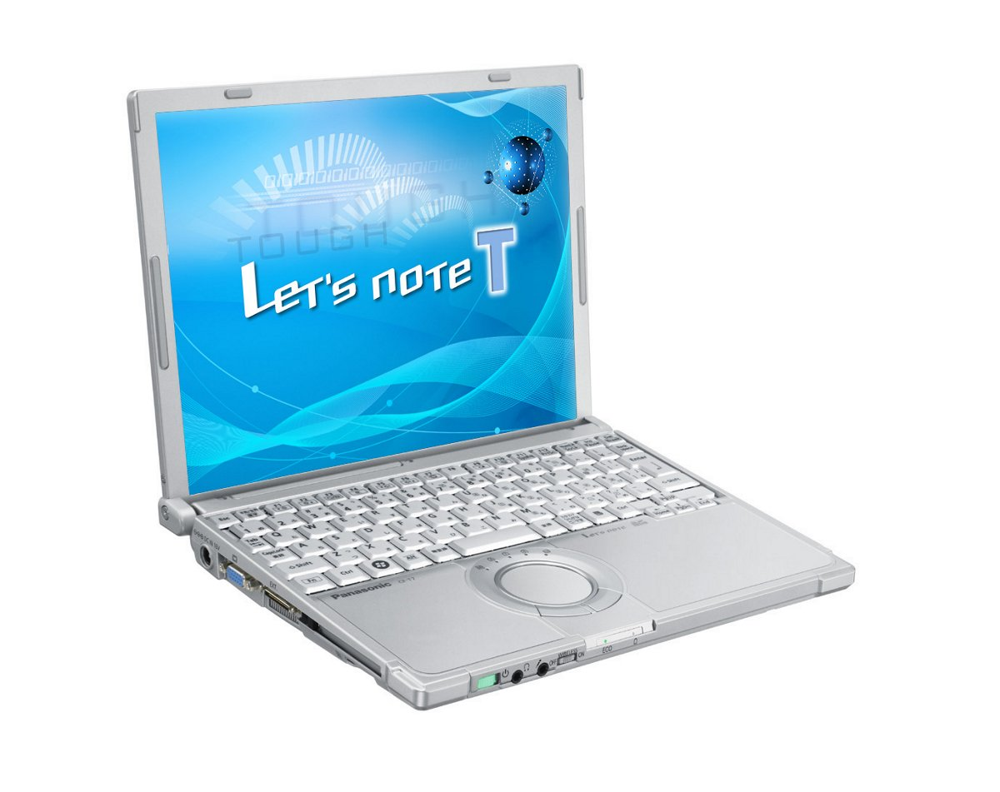

# レッツノート CF-T7 スペック・仕様一覧

[English](../../en/CF-T7/) · **日本語** · [中文](../../zh/CF-T7/)

🗄️ [レッツノート陳列棚](https://letsnote-specs.github.io/ja/CF-T7/)でこの機種を見る

パナソニック レッツノート **CF-T7**（T7シリーズ・12.1型XGA液晶）の全6品番（2007-10 – 2008-05発売）のスペック・仕様をまとめたページです。各品番の公式仕様表へのリンクも掲載しています。

*レッツノート CF-T7（CF-T7DW6AJR, CF-T7DW6NJR, CF-T7CW5AJR, CF-T7CW5NJR …）。画像 © Panasonic*

## 品番一覧

| 品番 | 発売 | 生産終了 | 主な仕様 |
| :-- | :-- | :-- | :-- |
| [CF-T7DW6AJR](https://panasonic.jp/pc/p-db/CF-T7DW6AJR_spec.html) | 2008-05 | 2009-01 | Windows Vista® Business with SP1 正規版 、インテル® CoreTM2 Duo U7600（1.20GHz）、メモリー：標準1GB（最大2GB）、HDD：120GB、LAN、無線LAN 802.11a(J52/W52/W53/W56)/b/g、USB2.0 |
| [CF-T7DW6NJR](https://panasonic.jp/pc/p-db/CF-T7DW6NJR_spec.html) | 2008-05 | 2009-01 | Windows Vista® Business with SP1 正規版 、インテル® CoreTM2 Duo U7600（1.20GHz）、メモリー：標準1GB（最大2GB）、HDD：120GB、LAN、無線LAN 802.11a(J52/W52/W53/W56)/b/g、USB2.0、Office Personal ＜台数限定＞ |
| [CF-T7CW5AJR](https://panasonic.jp/pc/p-db/CF-T7CW5AJR_spec.html) | 2008-02 | 2008-04 | Windows Vista® Business 正規版 、CoreTM2 Duo U7600(1.20GHz・ULV)、メモリー：1GB（最大2GB）、HDD：80GB、LAN、無線LAN 802.11a(J52/W52/W53/W56)/b/g、USB2.0 |
| [CF-T7CW5NJR](https://panasonic.jp/pc/p-db/CF-T7CW5NJR_spec.html) | 2008-02 | 2008-04 | Windows Vista® Business 正規版 、CoreTM2 Duo U7600(1.20GHz・ULV)、メモリー：1GB（最大2GB）、HDD：80GB、LAN、無線LAN 802.11a(J52/W52/W53/W56)/b/g、USB2.0、Office Personal ＜台数限定＞ |
| [CF-T7BW5AJR](https://panasonic.jp/pc/p-db/CF-T7BW5AJR_spec.html) | 2007-10 | 2008-01 | Windows Vista® Business 正規版 、CoreTM2 Duo U7500(1.06GHz・ULV)、メモリー：1GB（最大2GB)、HDD：80GB、LAN、無線LAN 802.11a(J52/W52/W53/W56)/b/g、USB2.0 |
| [CF-T7BW5NJR](https://panasonic.jp/pc/p-db/CF-T7BW5NJR_spec.html) | 2007-10 | 2008-01 | Windows Vista® Business 正規版 、CoreTM2 Duo U7500(1.06GHz・ULV)、メモリー：1GB（最大2GB)、HDD：80GB、LAN、無線LAN 802.11a(J52/W52/W53/W56)/b/g、USB2.0、Office Personal ＜台数限定＞ |

## 共通仕様

| 項目 | 仕様 |
| :-- | :-- |
| チップセット | モバイル インテル（R） GM965 Express チップセット |
| メインメモリー | 標準1GB DDR2 SDRAM（最大2GB）空きスロット1 |
| フロッピーディスクドライブ(オプション) | USB接続外付3.5型3モード対応（1.44MB/1.2MB/720KB） |
| 表示方式 | XGA(1024×768ドット)12.1型TFTカラー液晶 |
| 表示方式 / LCD表示 | 1024×768ドット：約1677万色 |
| 表示方式 / 外部ディスプレイ出力 | 800×600、1024×768、1280×768、1280×1024、1400×1050、1440×900、1600×1200ドット：約1677万色 |
| 表示方式 / 本体＋外部ディスプレイ同時表示 | 800×600、1024×768ドット：約1677万色 |
| 無線LAN | インテル（R） Wireless WiFi Link 4965AGN、IEEE802.11a（J52/W52/W53/W56）/b/g準拠、(WPA-AES/TKIP対応、Wi-Fi準拠) |
| モデム | データ：56kbps（V.90） FAX：14.4kbps /ボイス非対応 |
| LAN | 1000BASE-T/100BASE-TX / 10BASE-T |
| サウンド機能 | PCM音源（24ビットステレオ）、インテル（R） High Definition Audio 準拠、モノラルスピーカー |
| セキュリティチップ | ＴＰＭ（TCG V1.2準拠） |
| 拡張メモリースロット | DDR2 200ピンSO-DIMM専用スロット×1(1.8V/PC2-4200/DDR2 SDRAM) |
| キーボード | OADG準拠キーボード（85キー）：キーピッチ19mm(横)/16mm(縦) / (一部キーを除く) |
| ポインティングデバイス | ホイールパッド |
| 電源 | ACアダプター 入力：AC100V～240V（50Hz/60Hz）（電源コードは100V専用） / バッテリーパック（10.8Vリチウムイオン・5.8Ah） / 別売軽量バッテリーパック：10.8Vリチウムイオン・2.9Ah |
| 消費電力 | 最大約60W |
| 達成率 | — |
| 外形寸法(幅×奥行×高さ) | 幅272mm×奥行214.3mm×高さ24.9mm/45.3mm（前部/後部） |

## 品番別の違い

| 品番 | CPU | メモリー | ストレージ | 質量 | 駆動時間 |
| :-- | :-- | :-- | :-- | :-- | :-- |
| CF-T7DW6AJR | — | 1GB DDR2 SDRAM | 120GB | 1.179 kg | — |
| CF-T7DW6NJR | — | 1GB DDR2 SDRAM | 120GB | 1.179 kg | — |
| CF-T7CW5AJR | — | 1GB DDR2 SDRAM | 80GB | 1.179 kg | — |
| CF-T7CW5NJR | — | 1GB DDR2 SDRAM | 80GB | 1.179 kg | — |
| CF-T7BW5AJR | — | 1GB DDR2 SDRAM | 80GB | 1.179 kg | — |
| CF-T7BW5NJR | — | 1GB DDR2 SDRAM | 80GB | 1.179 kg | — |

CF-T7DW6AJR の仕様の違い（すべて）

| 項目 | 仕様 |
| :-- | :-- |
| OS | Windows Vista（R） Business with Service Pack 1 正規版（Windows（R） XPダウングレード権含む） |
| CPU | インテル（R） CoreTM2 プロセッサー / 超低電圧版 U7600 / 2次キャッシュメモリー 2MB、動作周波数 1.20GHz、フロントサイド・バス 533MHz |
| ビデオメモリー | 最大251MB / メモリー増設時最大358MB （メインメモリーと共用） |
| ハードディスクドライブ | 120GB（Serial ATA）左記容量のうち約6GBは修復用領域（リカバリー用データ領域を含む）として使用（ユーザー使用不可） |
| カードスロット / PCカードスロット | PCカード（TYPEⅡ）×1スロット(CardBus対応、許容電流3.3V：400mA、5V：400mA) |
| カードスロット / SDメモリーカードスロット | SDメモリーカード×1スロット（SDHCメモリーカード/著作権保護技術対応） |
| インターフェース | USBポート×3（USB2.0）、モデムコネクター（RJ-11）、LANコネクター（RJ-45）、 / 外部ディスプレイコネクター（アナログRGB ミニDsub 15ピン）、ミニポートリプリケーターコネクター（専用50ピン） |
| エネルギー消費効率 | 2007年度基準Ｉ区分0.00034 |
| 質量(バッテリーを含む） | 約1.179kg/約1.06kg(別売軽量バッテリーパック使用時) |
| ソフトウェア | Microsoft（R） Internet Explorer7.0、Adobe（R） Reader、DMIビューアー、Microsoft（R） Windows（R） Media Player 11、DirectX 10、Microsoft（R）Windows（R） Movie Maker 6.0、Microsoft（R） .NET Framework3.0、ズームビューアー、PC情報ビューアー、PC情報ポップアップ、NumLockお知らせ、Wireless Manager mobile edition4.5、無線切り替えユーティリティ、セキュリティ設定ユーティリティ、Infineon TPM Professional Package V3.0 SP2HF2、エコノミーモード（ECO）切り替えユーティリティ、省電力設定ユーティリティ、バッテリー残量表示補正ユーティリティ、Hotkey設定、マカフィー・インターネットセキュリティスイートベーシックエディション、gooスティック、ハードディスクデータ消去ユーティリティ、セットアップユーティリティ、PC-Diagnosticユーティリティ、ホイールパッドユーティリティ、ネットセレクター2、LAN省電力ユーティリティ、ファン制御ユーティリティ、Fn Ctrl機能入れ換えユーティリティ |
| 付属品 | プロダクトリカバリーDVD-ROM 2枚（Windows Vista(R)用 / Windows(R) XP用）、ACアダプター、バッテリーパック、取扱説明書 等 |

公式仕様表: <https://panasonic.jp/pc/p-db/CF-T7DW6AJR_spec.html>

CF-T7DW6NJR の仕様の違い（すべて）

| 項目 | 仕様 |
| :-- | :-- |
| OS | Windows Vista（R） Business with Service Pack 1 正規版（Windows（R） XPダウングレード権含む） |
| CPU | インテル（R） CoreTM2 プロセッサー / 超低電圧版 U7600 / 2次キャッシュメモリー 2MB、動作周波数 1.20GHz、フロントサイド・バス 533MHz |
| ビデオメモリー | 最大251MB / メモリー増設時最大358MB （メインメモリーと共用） |
| ハードディスクドライブ | 120GB（Serial ATA）左記容量のうち約6GBは修復用領域（リカバリー用データ領域を含む）として使用（ユーザー使用不可） |
| カードスロット / PCカードスロット | PCカード（TYPEⅡ）×1スロット(CardBus対応、許容電流3.3V：400mA、5V：400mA) |
| カードスロット / SDメモリーカードスロット | SDメモリーカード×1スロット（SDHCメモリーカード/著作権保護技術対応） |
| インターフェース | USBポート×3（USB2.0）、モデムコネクター（RJ-11）、LANコネクター（RJ-45）、 / 外部ディスプレイコネクター（アナログRGB ミニDsub 15ピン）、ミニポートリプリケーターコネクター（専用50ピン） |
| エネルギー消費効率 | 2007年度基準Ｉ区分0.00034 |
| 質量(バッテリーを含む） | 約1.179kg/約1.06kg(別売軽量バッテリーパック使用時) |
| ソフトウェア | Microsoft（R） Internet Explorer7.0、Adobe（R） Reader、DMIビューアー、Microsoft（R） Windows（R） Media Player 11、DirectX 10、Microsoft（R）Windows（R） Movie Maker 6.0、Microsoft（R） .NET Framework3.0、ズームビューアー、PC情報ビューアー、PC情報ポップアップ、NumLockお知らせ、Wireless Manager mobile edition4.5、無線切り替えユーティリティ、セキュリティ設定ユーティリティ、Infineon TPM Professional Package V3.0 SP2HF2、エコノミーモード（ECO）切り替えユーティリティ、省電力設定ユーティリティ、バッテリー残量表示補正ユーティリティ、Hotkey設定、マカフィー・インターネットセキュリティスイートベーシックエディション、gooスティック、ハードディスクデータ消去ユーティリティ、セットアップユーティリティ、PC-Diagnosticユーティリティ、ホイールパッドユーティリティ、ネットセレクター2、LAN省電力ユーティリティ、ファン制御ユーティリティ、Fn Ctrl機能入れ換えユーティリティ、Microsoft（R） Office Personal 2007withPowerPoint 2007 |
| 付属品 | プロダクトリカバリーDVD-ROM 2枚（Windows Vista(R)用 / Windows(R) XP用）、ACアダプター、バッテリーパック、取扱説明書 等 |

公式仕様表: <https://panasonic.jp/pc/p-db/CF-T7DW6NJR_spec.html>

CF-T7CW5AJR の仕様の違い（すべて）

| 項目 | 仕様 |
| :-- | :-- |
| OS | Windows Vista（R） Business 正規版（Windows（R） XPダウングレード権含む） |
| CPU | インテル（R） CoreTM2 Duoプロセッサー / 超低電圧版 U7600 / 2次キャッシュメモリー 2MB、動作周波数 1.20GHz、フロントサイド・バス 533MHz |
| ビデオメモリー | 最大251MB / メモリー増設時最大358MB （メインメモリーと共用） / 本体に標準装着済みの512MBメモリーを外して、1GBメモリーを増設した場合は、最大1.5GB。） |
| ハードディスクドライブ | 80GB（Serial ATA）左記容量のうち約6GBは修復用領域（リカバリー用データ領域を含む）として使用（ユーザー使用不可） |
| カードスロット / PCカードスロット | PCカード（TYPEⅡ）×1スロット(CardBus対応、許容電流3.3V：400mA、5V：400mA) |
| カードスロット / SDメモリーカードスロット | SDメモリーカード×1スロット（SDHCメモリーカード/著作権保護機能対応） |
| インターフェース | USBポート×3（USB2.0）、モデムコネクター（RJ-11）、LANコネクター（RJ-45）、 / 外部ディスプレイコネクター（アナログRGB ミニDsub 15ピン）、ミニポートリプリケーターコネクター（専用50ピン） |
| エネルギー消費効率 | 2007年度基準Ｉ区分0.00034 |
| 質量(バッテリーを含む） | 約1179g/約1060g(別売軽量バッテリーパック使用時) |
| ソフトウェア | Microsoft（R） Internet Explorer7.0、Adobe（R） Reader、DMIビューアー、Microsoft（R） Windows（R） Media Player 11、DirectX 10、Microsoft（R）Windows（R） Movie Maker 6.0、Microsoft（R） .NET Framework3.0、ズームビューアー、PC情報ビューアー、PC情報ポップアップユーティリティ、NumLockお知らせ、Wireless Manager mobile edition4.5、無線切り替えユーティリティ、セキュリティ設定ユーティリティ、Infineon TPM Professional Package V3.0 SP2、エコノミーモード（ECO）切り替えユーティリティ、省電力設定ユーティリティ、バッテリー残量表示補正ユーティリティ、Hotkey設定、マカフィー・インターネットセキュリティスイートベーシックエディション、gooスティック、ハードディスクデータ消去ユーティリティ、セットアップユーティリティ、PC-Diagnosticユーティリティ、ホイールパッドユーティリティ、ネットセレクター2、LAN省電力ユーティリティ、ファン制御ユーティリティ、Fn Ctrl機能入れ換えユーティリティ / オプティカルディスクドライブ文字変更ユーティリティ |
| 付属品 | プロダクトリカバリーDVD-ROM 2枚（Windows Vista(R)用 / Windows(R) XP用）、ACアダプター、バッテリーパック、取扱説明書 等 |

公式仕様表: <https://panasonic.jp/pc/p-db/CF-T7CW5AJR_spec.html>

CF-T7CW5NJR の仕様の違い（すべて）

| 項目 | 仕様 |
| :-- | :-- |
| OS | Windows Vista（R） Business 正規版（Windows（R） XPダウングレード権含む） |
| CPU | インテル（R） CoreTM2 Duoプロセッサー / 超低電圧版 U7600 / 2次キャッシュメモリー 2MB、動作周波数 1.20GHz、フロントサイド・バス 533MHz |
| ビデオメモリー | 最大251MB / メモリー増設時最大358MB （メインメモリーと共用） |
| ハードディスクドライブ | 80GB（Serial ATA）左記容量のうち約6GBは修復用領域（リカバリー用データ領域を含む）として使用（ユーザー使用不可） |
| カードスロット / PCカードスロット | PCカード（TYPEⅡ）×1スロット(CardBus対応、許容電流3.3V：400mA、5V：400mA) |
| カードスロット / SDメモリーカードスロット | SDメモリーカード×1スロット（SDHCメモリーカード/著作権保護機能対応） |
| インターフェース | USBポート×3（USB2.0）、モデムコネクター（RJ-11）、LANコネクター（RJ-45）、 / 外部ディスプレイコネクター（アナログRGB ミニDsub 15ピン）、ミニポートリプリケーターコネクター（専用50ピン） |
| エネルギー消費効率 | 2007年度基準Ｉ区分0.00034 |
| 質量(バッテリーを含む） | 約1179g/約1060g(別売軽量バッテリーパック使用時) |
| ソフトウェア | Microsoft（R） Internet Explorer7.0、Adobe（R） Reader、DMIビューアー、Microsoft（R） Windows（R） Media Player 11、DirectX 10、Microsoft（R）Windows（R） Movie Maker 6.0、Microsoft（R） .NET Framework3.0、ズームビューアー、PC情報ビューアー、PC情報ポップアップユーティリティ、NumLockお知らせ、Wireless Manager mobile edition4.5、無線切り替えユーティリティ、セキュリティ設定ユーティリティ、Infineon TPM Professional Package V3.0 SP2、エコノミーモード（ECO）切り替えユーティリティ、省電力設定ユーティリティ、バッテリー残量表示補正ユーティリティ、Hotkey設定、マカフィー・インターネットセキュリティスイートベーシックエディション、gooスティック、ハードディスクデータ消去ユーティリティ、セットアップユーティリティ、PC-Diagnosticユーティリティ、ホイールパッドユーティリティ、ネットセレクター2、LAN省電力ユーティリティ、ファン制御ユーティリティ、Fn Ctrl機能入れ換えユーティリティ、Microsoft（R） Office Personal 2007withPowerPoint 2007 |
| 付属品 | プロダクトリカバリーDVD-ROM 2枚（Windows Vista(R)用 / Windows(R) XP用）、ACアダプター、バッテリーパック、取扱説明書 等 |

公式仕様表: <https://panasonic.jp/pc/p-db/CF-T7CW5NJR_spec.html>

CF-T7BW5AJR の仕様の違い（すべて）

| 項目 | 仕様 |
| :-- | :-- |
| OS | Windows Vista（R） Business 正規版（Windows（R） XPダウングレード権含む） |
| CPU | インテル（R） CoreTM2 Duoプロセッサー / 超低電圧版 U7500 / 2次キャッシュメモリー 2MB、動作周波数 1.06GHz、フロントサイド・バス 533MHz |
| ビデオメモリー | 最大358MB （メインメモリーと共用） / 本体に標準装着済みの512MBメモリーを外して、1GBメモリーを増設した場合は、最大1.5GB。） |
| ハードディスクドライブ | 80GB（Serial ATA）左記容量のうち約6GBは修復用領域（リカバリー用データ領域を含む）として使用。（ユーザー使用不可） |
| カードスロット / PCカードスロット | PCカード（TYPEII）×1スロット(CardBus対応、許容電流3.3V：400mA、5V：400mA) |
| カードスロット / SDメモリーカードスロット | SDメモリーカード×1スロット（SDHCメモリーカード/著作権保護機能対応） |
| インターフェース | USBポート×3（USB2.0）[W7/T7]、モデムコネクター（RJ-11）、LANコネクター（RJ-45）、 / 外部ディスプレイコネクター（アナログRGB ミニDsub 15ピン）、ミニポートリプリケーターコネクター（専用50ピン） |
| エネルギー消費効率 | 2007年度基準Ｉ区分0.00041 |
| 質量(バッテリーを含む） | 約1179g/約1060g(別売軽量バッテリーパック使用時) |
| ソフトウェア | Microsoft（R） Internet Explorer7.0、Adobe（R） Reader、DMIビューアー、Microsoft（R） Windows（R） Media Player 11、DirectX 10、Microsoft（R）Windows（R） Movie Maker 6.0、Microsoft（R） .NET Framework3.0、ズームビューアー、PC情報ビューアー、PC情報ポップアップユーティリティ、NumLockお知らせ、Wireless Manager mobile edition4.5、無線切り替えユーティリティ、セキュリティ設定ユーティリティ、Infineon TPM Professional Package V3.0 SP1、エコノミーモード（ECO）切り替えユーティリティ、省電力設定ユーティリティ、バッテリー残量表示補正ユーティリティ、Hotkey設定、マカフィー・インターネットセキュリティスイートベーシックエディション、gooスティック、ハードディスクデータ消去ユーティリティ、セットアップユーティリティ、PC-Diagnosticユーティリティ、ホイールパッドユーティリティ、ネットセレクター2、LAN省電力ユーティリティ、ファン制御ユーティリティ、Fn Ctrl機能入れ換えユーティリティ / オプティカルディスクドライブ文字変更ユーティリティ |
| 付属品 | プロダクトリカバリーDVD-ROM、ACアダプター、バッテリーパック、取扱説明書 等 |

公式仕様表: <https://panasonic.jp/pc/p-db/CF-T7BW5AJR_spec.html>

CF-T7BW5NJR の仕様の違い（すべて）

| 項目 | 仕様 |
| :-- | :-- |
| OS | Windows Vista（R） Business 正規版（Windows（R） XPダウングレード権含む） |
| CPU | インテル（R） CoreTM2 Duoプロセッサー / 超低電圧版 U7500 / 2次キャッシュメモリー 2MB、動作周波数 1.06GHz、フロントサイド・バス 533MHz |
| ビデオメモリー | 最大358MB （メインメモリーと共用） |
| ハードディスクドライブ | 80GB（Serial ATA）左記容量のうち約6GBは修復用領域（リカバリー用データ領域を含む）として使用。（ユーザー使用不可） |
| カードスロット / PCカードスロット | PCカード（TYPEII）×1スロット(CardBus対応、許容電流3.3V：400mA、5V：400mA) |
| カードスロット / SDメモリーカードスロット | SDメモリーカード×1スロット（SDHCメモリーカード/著作権保護機能対応） |
| インターフェース | USBポート×3（USB2.0）[W7/T7]、モデムコネクター（RJ-11）、LANコネクター（RJ-45）、 / 外部ディスプレイコネクター（アナログRGB ミニDsub 15ピン）、ミニポートリプリケーターコネクター（専用50ピン） |
| エネルギー消費効率 | 2007年度基準Ｉ区分0.00041 |
| 質量(バッテリーを含む） | 約1179g/約1060g(別売軽量バッテリーパック使用時) |
| ソフトウェア | Microsoft（R） Internet Explorer7.0、Adobe（R） Reader、DMIビューアー、Microsoft（R） Windows（R） Media Player 11、DirectX 10、Microsoft（R）Windows（R） Movie Maker 6.0、Microsoft（R） .NET Framework3.0、ズームビューアー、PC情報ビューアー、PC情報ポップアップユーティリティ、NumLockお知らせ、Wireless Manager mobile edition4.5、無線切り替えユーティリティ、セキュリティ設定ユーティリティ、Infineon TPM Professional Package V3.0 SP1、エコノミーモード（ECO）切り替えユーティリティ、省電力設定ユーティリティ、バッテリー残量表示補正ユーティリティ、Hotkey設定、マカフィー・インターネットセキュリティスイートベーシックエディション、gooスティック、ハードディスクデータ消去ユーティリティ、セットアップユーティリティ、PC-Diagnosticユーティリティ、ホイールパッドユーティリティ、ネットセレクター2、LAN省電力ユーティリティ、ファン制御ユーティリティ、Fn Ctrl機能入れ換えユーティリティ、Microsoft（R） Office Personal 2007withPowerPoint 2007 |
| 付属品 | プロダクトリカバリーDVD-ROM、ACアダプター、バッテリーパック、取扱説明書 等 |

公式仕様表: <https://panasonic.jp/pc/p-db/CF-T7BW5NJR_spec.html>

## 関連機種

- [レッツノート全機種一覧](../)

---

出典：パナソニック公式[生産終了品一覧](https://panasonic.jp/pc/support/products/)および各品番の仕様表（panasonic.jp）。製品画像 © Panasonic。本ページは非公式のまとめであり、パナソニックとは関係ありません。
