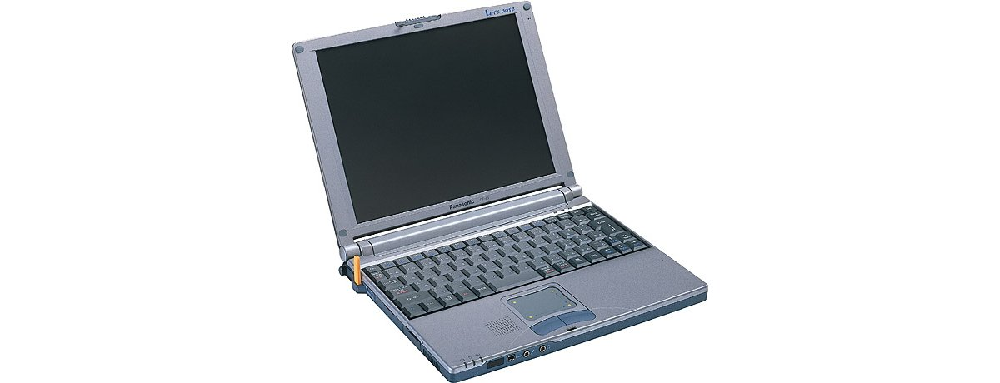

# 松下 Let's note CF-A1 规格参数

[English](../../en/CF-A1/) · [日本語](../../ja/CF-A1/) · **中文**

🗄️ 在 [Let's note 陈列柜](https://letsnote-specs.github.io/zh/CF-A1/)中查看此机型

**CF-A1** 是松下 Let's note 笔记本电脑，属于 A1 系列，配备 10.4英寸 XGA 屏幕。本页收录其全部 4 个型号（1999-09 – 2000-02 发售）的规格参数。每个型号均附官方规格表链接。

*松下 Let's note CF-A1（CF-A1ER, CF-A1R）。图片 © Panasonic*

## 型号列表

| 型号（品番） | 发售 | 停产 | 主要规格 |
| :-- | :-- | :-- | :-- |
| [CF-A1ER](https://panasonic.jp/pc/p-db/CF-A1ER_spec.html) | 2000-02 | 2000-03 | Celeron（400MHz）、HDD：6GB、无线、Windows 98SE |
| [CF-A1EV](https://panasonic.jp/pc/p-db/CF-A1EV_spec.html) | 2000-02 | 2000-03 | Celeron（400MHz）、HDD：6GB、调制解调器、Windows 98SE |
| [CF-A1R](https://panasonic.jp/pc/p-db/CF-A1R_spec.html) | 1999-09 | 1999-10 | Celeron（366MHz）、HDD：6GB、无线、Windows 98SE |
| [CF-A1V](https://panasonic.jp/pc/p-db/CF-A1V_spec.html) | 1999-09 | 1999-10 | Celeron（366MHz）、HDD：6GB、调制解调器、Windows 98SE |

## 通用规格

| 项目 | 规格 |
| :-- | :-- |
| 内存 | 标准 64MB SDRAM（最大 128MB） |
| 二级缓存 | 128KB |
| 显存 | 2.5MB |
| 硬盘 | 6.0GB (UltraATA) ※1 |
| 软驱（选配） | 外置 3.5英寸 支持3模式 (1.44MB /1.2MB /720KB) |
| 显示屏 | XGA (1024×768像素) 10.4英寸多晶硅TFT彩色液晶 |
| 显示屏 / 色彩 | 1024×768像素 :约1600万色 ※2 |
| 显示屏 / 外接显示输出 | 640×480、800×600、1024×768像素：约1600万色、1280×1024像素：约256色 |
| 显示屏 / 同时显示 | 640×480、800×600、1024×768像素：约1600万色 ※2、1280×1024像素 ※3：256色 |
| 显示屏 / 双屏显示（示例） | 内部LCD 1024×768像素 :65536色－ 外部显示器 640×480像素 :约65536色 / 内部LCD 1024×768像素 ：256色－ 外部显示器 1024×768像素：约256色 |
| 音频 | PCM音源 (16位立体声)、内置扬声器(单声道)、内置麦克风（单声道） |
| PC 卡槽 | PC卡(TypeII×1插槽)、CardBus对应 |
| 内存扩展槽 | 144针DIMM专用插槽×1(仅支持单面安装模块) |
| 音频接口 | 麦克风输入（迷你插孔）、音频输出（立体声迷你插孔） |
| USB | 4针 |
| 其他接口 | 扩展总线连接器 |
| 选配 I/O 盒 | 串行（Dsub 9针）、并行（Dsub 25针）、外部显示器（迷你D-sub 9针）、外部鼠标／键盘（迷你Din 6针）、FDD接口 |
| 选件（迷你I/O盒） | 外部显示器(迷你D-sub9针)、外部鼠标／键盘(迷你Din 6针) |
| 键盘 | 符合OADG标准的键盘 (86键)、键距 17mm |
| 指点设备 | 智能指针III |
| 电源 | AC 100V-240V (50Hz/60Hz)（AC电源线仅适用于100V）、 / 标准电池组／<另售>（锂离子） |
| 功耗 | 约33W |
| 尺寸（宽×深×高） | 255mm × 205mm × 25.8mm（不含凸起部） |
| 重量（含电池） | 约1.18kg |

## 各型号差异

| 型号（品番） | 处理器 | 内存 | 存储 | 重量 | 续航 |
| :-- | :-- | :-- | :-- | :-- | :-- |
| CF-A1ER | Celeron 400MHz | 64MB SDRAM | 6.0GB | 1.18 kg | 2 h |
| CF-A1EV | Celeron 400MHz | 64MB SDRAM | 6.0GB | 1.18 kg | 2 h |
| CF-A1R | Celeron 366MHz | 64MB SDRAM | 6.0GB | 1.18 kg | 2 h |
| CF-A1V | Celeron 366MHz | 64MB SDRAM | 6.0GB | 1.18 kg | 2 h |

CF-A1ER 的全部差异规格

| 项目 | 规格 |
| :-- | :-- |
| 处理器 | 移动 Intel(R) Celeron(TM) 处理器 400MHz (系统总线时钟：66MHz) |
| 芯片组 | Intel(R) 440MX PCISET |
| 显示芯片 | NeoMagic公司制 NM2200 |
| 无线通信模块 | PIAFS 64K 自营标准第3版 |
| 接口 / i.LINK（IEEE 1394） | IEEE1394端口 S400 4针 ※4 |
| 无线通信端口 / 手机 | 符合 RCR STD 27 数据／FAX：9600bps 分组通信 DoPa（最大 28.8kbps）※5 |
| 无线通信端口 / PHS | PIAFS64K ※5 |
| 红外 | 符合 IrDA V1.1 标准 4Mbps ※6 |
| 能效 | S区分 0.0021 ※7 |
| 电池 | 标准电池组 / 驱动:约2小时 ※8 充电:约2.5小时(电源OFF时)、约5.5小时(电源ON时)※9 / 大容量电池组<另售> / 驱动:约6小时 ※8 充电:约5.5小时(电源OFF时)、约12小时(电源ON时)※9 |
| 预装软件 | Microsoft(R) Windows(R) 98 Second Edition、 / Microsoft(R) IME 98、 / Adobe(R) Acrobat(R) Reader 4.0J ◆、 / 无线管理器、 / 互联网入门、 / 网页导航器、 / 邮件自动收发、 / DV 采集、 / 视觉邮件（影音邮件、插图邮件 *10、肖像邮件、语音邮件）、 / 图像浏览器、 / 快速启动器、 / 舞铃 FAX V3 Lite ◆*11、 / Intellisync(TM) for Notebooks ◆、 / Phoenix PowerPanel(TM)、 / 在线注册 (@nifty、DION、ODN) ◆ |
| 无线站 / 品番 | CF-VTWS01J |
| 无线站 / 接口 | 串行（Dsub 9针）、模块化插孔×2（TEL／LINE） |
| 无线站 / LINE（调制解调器）端子 | "机身内置 / 数据：56kbps（V.90/K56flex 自动支持）/ FAX：14.4kbps" |
| 无线站 / 无线通信功能 | PIAFS 64K（自营标准第3版） |
| 无线站 / 电源 | AC100V (50/60Hz) |
| 无线站 / 功耗 | 约7W（正常时）、约5.5W（未通信／电源ON时）、约1.4W（电源OFF时） |
| 无线站 / 外形尺寸 | 约162mm×34mm×124mm |
| 无线站 / 质量 | 约300g |
| 注意事项 | ※1 HDD容量以1GB=1,000,000,000字节表示。 / ※2 关于内部LCD，通过图形加速器的抖动功能实现。 / ※3 同时显示时，会显示整个画面的一部分(1024×768像素)。将光标移至画面边缘时，整个画面会滚动。 / ※4 不保证所有支持i.LINK的周边设备的运行。 / ※5 用于手机、PHS电话连接。需要另售的连接线。可使用的电话为手机、支持数据通信的PHS(NTT DoCoMo、Astel)、NTT DoCoMo Docomo、DDI Pocket的H"(edge)以及支持α-DATA32的电话机(部分机型除外)。PIAFS 64K的最大通信速度为58.4kbps。 / ※6 红外线通信端口的有效距离为20～50cm。 / ※7 能源消费效率是指，用节能法规定的测量方法测得的消费电力除以节能法规定的复合理论性能所得的值。 / ※8 CPU 25%、LCD背光亮度最低时。会因运行环境和系统设置而变化。 / ※9 对完全放电的电池充电可能需要较长时间。即使处于关机状态也会消耗电量，因此从充满电起约5天(使用标准电池时)电池余量会耗尽。此外，电源ON时的充电时间为最短情况。会因计算机的运行状态而变化。 / ※10 根据字体种类，可能无法正确显示。请使用等宽字体。 / ※11 支持使用无线基站的传真发送、使用无线通信端口通过手机进行传真收发、以及使用NTT DoCoMo的PHS进行传真发送。不支持语音功能。传真尺寸为A4／信纸2种。 / ◆ 标有◆的软件的操作支持由各软件厂商提供。 / ● 本电脑仅保证在Windows 98 Second Edition下运行。 / ● 一般标注为Windows 98 Second Edition用的软件及周边设备中，有些无法在本电脑上使用。购买时请向各软件及周边设备的销售商确认。 / ● 附带的Product Recovery CD-ROM无法仅重新安装OS。 / ● 未附带重新安装系统所需的CD-ROM驱动器。需另行购买。 |

官方规格表: <https://panasonic.jp/pc/p-db/CF-A1ER_spec.html>

CF-A1EV 的全部差异规格

| 项目 | 规格 |
| :-- | :-- |
| 处理器 | 移动 Intel(R) Celeron(TM) 处理器 400MHz (系统总线时钟：66MHz) |
| 芯片组 | Intel(R) 440MX PCISET |
| 显示芯片 | NeoMagic公司制NM2200 |
| 接口 / i.LINK（IEEE 1394） | IEEE1394端口 S400 4针 ※5 |
| 无线通信端口 / 手机 | 符合 RCR STD 27 数据／FAX：9600bps 分组通信 DoPa（最大 28.8kbps）※6 |
| 无线通信端口 / PHS | PIAFS64K ※6 |
| 红外 | 符合 IrDA V1.1 标准 4Mbps ※7 |
| 能效 | S区分 0.0021 ※8 |
| 电池 | 标准电池组 / 驱动:约2小时 ※9 充电:约2.5小时(电源OFF时)、约5.5小时(电源ON时)※10 / 大容量电池组<另售> / 驱动:约6小时 ※9 充电:约5.5小时(电源OFF时)、约12小时(电源ON时)※10 |
| 预装软件 | Microsoft(R) Windows(R) 98 Second Edition、 / Microsoft(R) IME 98、 / Adobe(R) Acrobat(R) Reader 4.0J ◆、 / 无线管理器、 / 互联网入门、 / 网页导航器、 / 邮件自动收发、 / DV 采集、 / 视觉邮件（影音邮件、插图邮件 *11、肖像邮件、语音邮件）、 / 图像浏览器、 / 快速启动器、 / 舞铃 FAX V3 Lite ◆*12、 / Intellisync(TM) for Notebooks ◆、 / Phoenix PowerPanel(TM)、 / 在线注册 (@nifty、DION、ODN) ◆ |
| 注意事项 | ※1 HDD容量按1GB=1,000,000,000字节显示。 / ※2 内部LCD通过图形加速器的抖动功能实现。 / ※3 同时显示时，仅显示整个画面的一部分（1024×768像素）。将光标移动到画面边缘时，整个画面会滚动。 / ※4 仅限日本国内NTT模拟一般线路专用。并不保证所有i.LINK兼容外围设备的运行。 / ※5 自动判别并切换V.90和K56flex。另外，56kbps为数据接收时的理论值。数据发送时最大速度为33.6kpbs。 / ※6 用于手机、PHS电话连接。需要另售的连接线。可使用的电话为手机、支持数据通信的PHS（NTT DoCoMo、Astel）、NTT DoCoMo Docomo、DDI Pocket的H"（Edge）以及支持α-DATA32的电话机（部分机型除外）。PIAFS 64K的最大通信速度为58.4kbps。 / ※7 红外线通信端口的有效距离为20～50cm。 / ※8 能源消耗效率是指，用依据节能法规定的测量方法测得的耗电量，除以依据节能法规定的复合理论性能所得的值。 / ※9 CPU 25%、LCD背光亮度最低时。会因运行环境和系统设置而变动。 / ※10 对完全放电的电池充电可能需要较长时间。即使电源关闭状态也会消耗电力，因此从满充电起约5天（使用标准电池时）后电池电量会耗尽。另外，电源ON时的充电时间为最短情况。会因计算机的运行状态而变动。 / ※11 根据字体种类的不同，有些可能无法正确显示。请使用等宽字体。 / ※12 除使用内置调制解调器进行传真收发外，还支持使用无线通信端口通过手机进行传真收发以及通过NTT DoCoMo的PHS进行传真发送。不支持语音功能。传真尺寸为A4／信纸2种。 / 关于标有◆的软件操作的售后支持，由各软件厂商提供。 / ●本电脑除Windows 98 Second Edition以外不保证运行。 / ●一般标称为用于Windows 98 Second Edition的软件及外围设备中，有些无法在本电脑上使用。购买时请向各软件及外围设备的销售商确认。 / ●使用随附的产品恢复CD-ROM无法仅重新安装OS。 / ●系统重新安装所需的CD-ROM驱动器不随附。需另行购买。 |
| 调制解调器 | 主机内置 数据：56kbps（V.90/K56flex自动支持） FAX：14.4kbps (RJ-11) ※4 |

官方规格表: <https://panasonic.jp/pc/p-db/CF-A1EV_spec.html>

CF-A1R 的全部差异规格

| 项目 | 规格 |
| :-- | :-- |
| 处理器 | 移动 Intel(R) Celeron(TM) 处理器 366MHz |
| 芯片组 | Intel(R) 440MX CHIP SET |
| 显示芯片 | NeoMagic公司制NM2200 |
| 无线通信模块 | PIAFS 64K 自营标准第3版 |
| 接口 / i.LINK（IEEE 1394） | IEEE1394端口 S400 4针 ※4 |
| 无线通信端口 / 手机 | 符合 RCR STD 27 数据／FAX：9600bps 分组通信 DoPa（最大 28.8kbps）※5 |
| 无线通信端口 / PHS | PIAFS64K ※5 |
| 红外 | 符合 IrDA V1.1 标准 4Mbps ※6 |
| 能效 | 待机模式时：约1.0W ※7 |
| 电池 | 标准电池组 / 驱动:约2小时 ※8 充电:约2.5小时(电源OFF时)、约5.5小时(电源ON时)※9 / 大容量电池组<另售> / 驱动:约6小时 ※8 充电:约5.5小时(电源OFF时)、约12小时(电源ON时)※9 |
| 预装软件 | Microsoft(R) Windows(R) 98 Second Edition、 / Microsoft(R) IME 98、 / Adobe(R) Acrobat(R) Reader 4.0J ◆、 / 无线管理器、 / 互联网入门、 / 邮件自动收发、 / DV 采集、 / 视觉邮件（影音邮件、插图邮件*10、肖像邮件、语音邮件）、 / 图像浏览器、 / 快速启动器、 / 舞铃 FAX V3 Lite ◆*11、 / Intellisync(TM) for Notebooks ◆、 / Phoenix PowerPanel(TM) / NIFTY Manager for Windows |
| 无线站 / 品番 | CF-VTWS01J |
| 无线站 / 接口 | 串行（Dsub 9针）、模块化插孔×2（TEL／LINE） |
| 无线站 / LINE（调制解调器）端子 | "机身内置 / 数据：56kbps（V.90/K56flex 自动支持）/ FAX：14.4kbps" |
| 无线站 / 无线通信功能 | PIAFS 64K（自营标准第3版） |
| 无线站 / 电源 | AC100V (50/60Hz) |
| 无线站 / 功耗 | 约7W（正常时）、约5.5W（未通信／电源ON时）、约1.4W（电源OFF时） |
| 无线站 / 外形尺寸 | 约162mm×34mm×124mm |
| 无线站 / 质量 | 约300g |
| 注意事项 | ※1 HDD容量以1GB=1,000,000,000字节表示。 / ※2 关于内部LCD，通过图形加速器的抖动功能实现。 / ※3 同时显示时，会显示整个画面的一部分(1024×768像素)。将光标移至画面边缘时，整个画面会滚动。 / ※4 不保证所有支持i.LINK的周边设备的运行。 / ※5 用于手机、PHS电话连接。需要另售的连接线。可使用的电话为手机、支持数据通信的PHS(NTT DoCoMo、Astel)、NTT DoCoMo Docomo。PIAFS 64K的最大通信速度为58.4kbps。 / ※6 红外线通信端口的有效距离为20～50cm。 / ※7 基于节能法的能源消费效率。 / ※8 CPU 25%、LCD背光亮度最低时。会因运行环境和系统设置而变化。 / ※9 对完全放电的电池充电可能需要较长时间。即使处于关机状态也会消耗电量，因此从充满电起约5天(使用标准电池时)电池余量会耗尽。此外，电源ON时的充电时间为最短情况。会因计算机的运行状态而变化。 / ※10 根据字体种类，可能无法正确显示。请使用等宽字体。 / ※11 支持使用无线基站的传真发送、使用无线通信端口通过手机进行传真收发、以及使用NTT DoCoMo的PHS进行传真发送。不支持语音功能。传真尺寸为A4／信纸2种。 / ◆ 标有◆的软件的操作支持由各软件厂商提供。 / ● 本电脑仅保证在Windows 98 Second Edition下运行。 / ● 一般标注为Windows 98 Second Edition用的软件及周边设备中，有些无法在本电脑上使用。购买时请向各软件及周边设备的销售商确认。 / ● 附带的Product Recovery CD-ROM无法仅重新安装OS。 / ● 未附带重新安装系统所需的CD-ROM驱动器。需另行购买。 |

官方规格表: <https://panasonic.jp/pc/p-db/CF-A1R_spec.html>

CF-A1V 的全部差异规格

| 项目 | 规格 |
| :-- | :-- |
| 处理器 | 移动 Intel(R) Celeron(TM) 处理器 366MHz |
| 芯片组 | Intel(R) 440MX CHIP SET |
| 显示芯片 | NeoMagic公司制NM2200 |
| 接口 / i.LINK（IEEE 1394） | IEEE1394端口 S400 4针 ※5 |
| 无线通信端口 / 手机 | 符合 RCR STD 27 数据／FAX：9600bps 分组通信 DoPa（最大 28.8kbps）※6 |
| 无线通信端口 / PHS | PIAFS64K ※6 |
| 红外 | 符合 IrDA V1.1 标准 4Mbps ※7 |
| 能效 | 待机模式时：约1.0W ※8 |
| 电池 | 标准电池组 / 驱动:约2小时 ※9 充电:约2.5小时(电源OFF时)、约5.5小时(电源ON时)※10 / 大容量电池组<另售> / 驱动:约6小时 ※9 充电:约5.5小时(电源OFF时)、约12小时(电源ON时)※10 |
| 预装软件 | Microsoft(R) Windows(R) 98 Second Edition、 / Microsoft(R) IME 98、 / Adobe(R) Acrobat(R) Reader 4.0J ◆、 / 无线管理器、 / 互联网入门、 / 邮件自动收发、 / DV 采集、 / 视觉邮件（影音邮件、插图邮件 *11、肖像邮件、语音邮件）、 / 图像浏览器、 / 快速启动器、 / 舞铃 FAX V3 Lite ◆*12、 / Intellisync(TM) for Notebooks ◆、 / Phoenix PowerPanel(TM)、 / NIFTY Manager for Windows ◆ |
| 注意事项 | ※1 HDD容量按1GB=1,000,000,000字节显示。 / ※2 内部LCD通过图形加速器的抖动功能实现。 / ※3 同时显示时，仅显示整个画面的一部分（1024×768像素）。将光标移动到画面边缘时，整个画面会滚动。 / ※4 仅限日本国内NTT模拟一般线路专用。并不保证所有i.LINK兼容外围设备的运行。 / ※5 自动判别并切换V.90和K56flex。另外，56kbps为数据接收时的理论值。数据发送时最大速度为33.6kpbs。 / ※6 用于手机、PHS电话连接。需要另售的连接线。可使用的电话为手机、支持数据通信的PHS（NTT DoCoMo、Astel）、NTT DoCoMo Docomo。PIAFS 64K的最大通信速度为58.4kbps。 / ※7 红外线通信端口的有效距离为20～50cm。 / ※8 基于节能法的能源消耗效率。 / ※9 CPU 25%、LCD背光亮度最低时。会因运行环境和系统设置而变动。 / ※10 对完全放电的电池充电可能需要较长时间。即使电源关闭状态也会消耗电力，因此从满充电起约5天（使用标准电池时）后电池电量会耗尽。另外，电源ON时的充电时间为最短情况。会因计算机的运行状态而变动。 / ※11 根据字体种类的不同，有些可能无法正确显示。请使用等宽字体。 / ※12 除使用内置调制解调器进行传真收发外，还支持使用无线通信端口通过手机进行传真收发以及通过NTT DoCoMo的PHS进行传真发送。不支持语音功能。传真尺寸为A4／信纸2种。 / 关于标有◆的软件操作的售后支持，由各软件厂商提供。 / ●本电脑除Windows 98 Second Edition以外不保证运行。 / ●一般标称为用于Windows 98 Second Edition的软件及外围设备中，有些无法在本电脑上使用。购买时请向各软件及外围设备的销售商确认。 / ●使用随附的产品恢复CD-ROM无法仅重新安装OS。 / ●系统重新安装所需的CD-ROM驱动器不随附。需另行购买。 |
| 调制解调器 | 主机内置 数据：56kbps（V.90/K56flex自动支持） FAX：14.4kbps、支持语音功能 (RJ-11) ※4 |

官方规格表: <https://panasonic.jp/pc/p-db/CF-A1V_spec.html>

## 图片

*松下 Let's note CF-A1（CF-A1EV, CF-A1V）。图片 © Panasonic*

## 相关机型

- [Let's note 全部机型](../)

---

来源：松下官方[停产产品列表](https://panasonic.jp/pc/support/products/)及各型号规格表（panasonic.jp），由日文翻译，准确措辞以官方规格表为准。产品图片 © Panasonic。本页为非官方整理，与松下公司无关。
