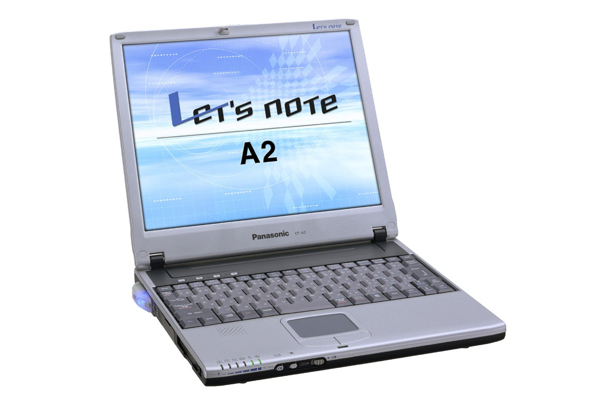

# 松下 Let's note CF-A2 规格参数

[English](../../en/CF-A2/) · [日本語](../../ja/CF-A2/) · **中文**

**CF-A2** 是松下 Let's note 笔记本电脑，属于 A2 系列，配备 11.3英寸 XGA 屏幕。本页收录其全部 1 个型号（2001-06 发售）的规格参数。每个型号均附官方规格表链接。

*松下 Let's note CF-A2（CF-A2R4H2）。图片 © Panasonic*

## 型号列表

| 型号（品番） | 发售 | 停产 | 主要规格 |
| :-- | :-- | :-- | :-- |
| [CF-A2R4H2](https://panasonic.jp/pc/p-db/CF-A2R4H2_spec.html) | 2001-06 | 2001-07 | PentiumIII（600MHz・ULV）、HDD：20GB、H"IN、Windows 2000 |

## 规格

| 项目 | 规格 |
| :-- | :-- |
| 处理器 | 支持 Intel(R) SpeedStep(TM) 技术的超低电压版移动 Pentium(R) III 处理器 600MHz（系统总线时钟：100MHz） |
| 芯片组 | Intel(R) 440MX Chipset |
| 内存 | 标准 64MB SDRAM（最大 192MB） |
| 二级缓存 | 256KB |
| 显存 | 4MB |
| 显示芯片 | Silicon Motion(R), Inc. Lynx 3DM |
| 硬盘 | 20GB (UltraATA) ※1 |
| 软驱（选配） | 外置 USB连接 3.5英寸 支持3模式 (1.44MB /1.2MB /720KB) |
| 显示屏 | XGA (1024×768点) 11.3英寸TFT彩色液晶 |
| 显示屏 / 色彩 | 1024×768点 :约1600万色 ※2 |
| 显示屏 / 外接显示输出 | 640×480、800×600、1024×768、1280×1024像素：约1600万色 |
| 显示屏 / 同时显示 | 640×480、800×600、1024×768、1280×1024 ※3 像素：约1600万色 ※2 |
| 调制解调器 | 主机内置 数据：56kbps（V.90/K56flex自动支持） FAX：14.4kbps /不支持语音 (RJ-11) ※4 |
| 有线网络 | 主机内置 100BASE-TX /10BASE-T (RJ-45) ※5 |
| 音频 | PCM音源 (16位立体声)、内置扬声器 |
| PC 卡槽 | PC卡(Type II×1插槽) CardBus对应 |
| 内存扩展槽 | 144针DIMM专用插槽×1 (64MB /128MB) |
| 接口 / H" IN模块 | 主机内置 ※6（语音、FAX等不支持） |
| 无线通信端口 / 手机 | PDC：数据/FAX 9600bps、分组 9600bps/28.8kbps / cdmaOne：数据/FAX 14.4kbps、分组 64kbps |
| 无线通信端口 / PHS | PIAFS 64K / PIAFS 32K |
| 音频接口 | 麦克风输入（单声道迷你插孔）、音频输出（立体声迷你插孔） |
| USB | 4针 ×2 |
| 外接显示接口 | 模拟RGB 迷你Dsub 15针 |
| 其他接口 | 扩展总线连接器 |
| 键盘 | 符合OADG标准的键盘 (86键)：键距 17mm |
| 指点设备 | 触摸板 |
| 电源 | AC 100V-240V (50Hz/60Hz)（AC电源线仅适用于100V）、 / 标准电池组（锂离子） |
| 功耗 | 最大约40W ※7 |
| 能效 | S区分 0.00086 ※8 |
| 电池 | 标准电池组 / 驱动:约6.0小时 ※9 充电:约3小时(电源OFF时)、约3.5小时(电源ON时)※10 |
| 尺寸（宽×深×高） | 255mm × 220.5mm × 24.7mm（前部）・31.5mm（后部）（不含凸起部） |
| 重量（含电池） | 约1.4kg |
| 预装软件 | Microsoft(R) Windows(R) 2000 Professional(Service Pack 1)、 / Midrosoft(R) Windows Media(TM) Player 7.0、 / Microsoft(R) Internet Explorer5.5、 / Microsoft(R) IME 2000、 / Adobe(R) Acrobat(R) Reader ◆、 / 互联网入门、 / Panasonic PC 在线会员注册、 / 在线注册（@nifty、BIGLOBE、DION、OCN、ODN、docomo AOL）◆、 / 电波状况监视器 II、 / 画面切换实用工具、 / Mobile Editor 2000 ◆※11、 / DMI 查看器、 / H"IN 注册、 / H"IN 实用工具 |
| 附件 | 产品恢复CD-ROM（2张）、USB连接FDD、AC适配器、模块化电缆、标准电池组、应用程序CD-ROM（1张）、使用说明书等 |
| 注意事项 | ※1 HDD容量按1GB=1,000,000,000字节显示。 / ※2 内部LCD通过图形加速器的抖动功能实现。 / ※3 内部LCD显示整个画面的一部分(1024×768像素)。将光标移到画面边缘时，整个画面会滚动。 / ※4 仅限日本国内NTT模拟一般线路使用。自动判别并切换V.90和K56flex。另外，56kbps是数据接收时的理论值。数据发送时33.6kbps为最高速度。 / ※5 根据连接器的形状，有些产品无法使用。 / ※6 不支持通话对方限定服务（Two LINK DATA）。 / ※7 基于(社)电子信息技术产业协会 家电・通用产品高次谐波抑制对策指南执行计划书的额定输入功率值:24W。 / ※8 能源消费效率是指，用节能法规定的测量方法测量出的消费电力除以节能法规定的复合理论性能所得的值。 / ※9 LCD背光亮度最低时。会因运行环境・系统设置而变动。 / ※10 将完全放电的电池充电时可能需要较长时间。 / ※11 需要另售的手机连接线。 / 标有◆的软件的操作支持由各软件厂商提供。 / / ●本电脑不保证在Windows 2000以外的环境下运行。 / ●在一般标为Windows 2000用的软件及外围设备中，有些无法在本电脑上使用。购买时请向各软件及外围设备的销售商确认。 / ●附带的Product Recovery CD-ROM无法仅重新安装OS。 / ●重新安装系统所需的CD-ROM驱动器不附带。需另行购买。 |

## 相关机型

- [Let's note 全部机型](../)

---

来源：松下官方[停产产品列表](https://panasonic.jp/pc/support/products/)及各型号规格表（panasonic.jp），由日文翻译，准确措辞以官方规格表为准。产品图片 © Panasonic。本页为非官方整理，与松下公司无关。
