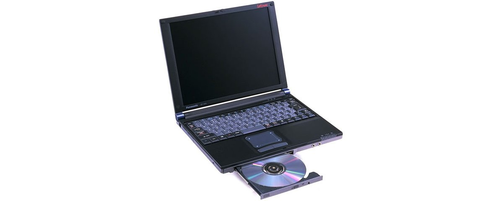

# 松下 Let's note CF-A44 规格参数

[English](../../en/CF-A44/) · [日本語](../../ja/CF-A44/) · **中文**

**CF-A44** 是松下 Let's note 笔记本电脑，属于 ace A77/A44 系列，配备 11.3英寸 XGA 屏幕。本页收录其全部 3 个型号（1998-12 – 1999-02 发售）的规格参数。每个型号均附官方规格表链接。

*松下 Let's note CF-A44（CF-A44EJ8, CF-A44EJ81）。图片 © Panasonic*

## 型号列表

| 型号（品番） | 发售 | 停产 | 主要规格 |
| :-- | :-- | :-- | :-- |
| [CF-A44EJ8](https://panasonic.jp/pc/p-db/CF-A44EJ8_spec.html) | 1999-02 | 1999-05 | MMX Pentium(266MHz)、HDD：4.3GB、CD-ROM、Windows 98 |
| [CF-A44EJ81](https://panasonic.jp/pc/p-db/CF-A44EJ81_spec.html) | 1999-02 | 1999-04 | MMX Pentium(266MHz)、HDD：4.3GB、CD-ROM、Windows 98、Excel&Word |
| [CF-A44J8](https://panasonic.jp/pc/p-db/CF-A44J8_spec.html) | 1998-12 | 1999-01 | MMX Pentium(266MHz)、HDD：4.3GB、CD-ROM、Windows 98 |

## 通用规格

| 项目 | 规格 |
| :-- | :-- |
| 处理器 | Intel(R) MMX(R)技术 Pentium(R) 处理器 266MHz |
| 芯片组 | Intel(R) 430TX PCIset |
| 内存 | 标准 64MB SDRAM（最大 128MB） |
| 二级缓存 | 512KB |
| 显存 | 2.5MB |
| 显示芯片 | NeoMagic公司制NM2200 |
| 硬盘 | 4.3GB (UltraATA) ※1 |
| 光驱 | CD-ROM驱动器：最大20倍速・可拆卸 |
| 软驱（选配） | 外置 3.5英寸 支持3模式 (1.44MB /1.2MB /720KB) |
| 多功能仓位 | CD-ROM驱动器（标准附带）、扩展电池组（选配）、 / 减重器（标准附带）可互换 |
| 显示屏 | XGA (1024×768点) 11.3英寸TFT彩色液晶 |
| 显示屏 / 色彩 | 1024×768点 :约1600万色 ※2 |
| 显示屏 / 外接显示输出 | 640×480、800×600、1024×768像素：约1600万色、1280×1024像素：256色 |
| 显示屏 / 同时显示 | 640×480、800×600、1024×768像素：约1600万色 ※2、1280×1024像素 ※3：256色 |
| 显示屏 / 双屏显示（示例） | 内部LCD 1024×768像素 :约65,536万色 － 外部显示器 640×480像素 :256色 / 内部LCD 1024×768像素 :256色 － 外部显示器 1024×768像素 :65,536色 |
| 调制解调器 | 主机内置 数据：56kbps（V.90/K56flex自动支持） FAX：14.4kbps、支持语音功能 (RJ-11) ※4 |
| 音频 | PCM音源(Sound Blaster PRO兼容)、FM音源、单声道扬声器、内置单声道麦克风 |
| PC 卡槽 | PC卡(TypeII×1插槽)、CardBus对应、ZV-Port对应 |
| 内存扩展槽 | 144针DIMM专用插槽×1 |
| 接口 / 音频 | 麦克风输入（迷你插孔）、音频输出（迷你插孔） |
| 接口 / USB | 4针 |
| 接口 / 红外 | 符合 IrDA V1.1 标准 4Mbps ※5 |
| 接口 / 其他 | 扩展总线连接器 |
| 接口 / 选配 I/O 盒 | 串行（Dsub 9针）、并行（Dsub 25针）、外部显示器（迷你D-sub 9针）、外部鼠标／键盘（迷你Din 6针）、FDD接口 |
| 接口 / 选配迷你 I/O 盒 | 外部显示器(迷你D-sub9针)、外部鼠标／键盘(迷你Din 6针) |
| 键盘 | 符合OADG标准的键盘 (86键)、键距 17mm |
| 电源 | AC 100V-240V (50Hz/60Hz)（AC电源线仅适用于100V）、 / 标准电池组／扩展电池组<另售>（锂离子） |
| 功耗 | 约32W |
| 能效 | 待机模式时：约1.0W ※6 |
| 电池 | 标准电池组 / 驱动:约2小时 ※7※8 充电:约2.5小时(电源OFF时)、约5.5小时(电源ON时)※9 / 大容量电池组<另售> / 驱动:约9.5小时 ※8 充电:约4.5小时(电源OFF时)、约13小时(电源ON时)※9 |
| 尺寸（宽×深×高） | 270mm × 215mm × 27.9mm（不含凸起部） |
| 重量（含电池） | 约1.58kg（安装CD-ROM驱动器时） |

## 各型号差异

| 型号（品番） | 处理器 | 内存 | 存储 | 重量 | 续航 |
| :-- | :-- | :-- | :-- | :-- | :-- |
| CF-A44EJ8 | MMX技术 Pentium 266MHz | 64MB SDRAM | 4.3GB | 1.58 kg | 2 h |
| CF-A44EJ81 | MMX技术 Pentium 266MHz | 64MB SDRAM | 4.3GB | 1.58 kg | 2 h |
| CF-A44J8 | MMX技术 Pentium 266MHz | 64MB SDRAM | 4.3GB | 1.58 kg | 2 h |

CF-A44EJ8 的全部差异规格

| 项目 | 规格 |
| :-- | :-- |
| 指点设备 | 智能指针II |
| 预装软件 | Microsoft(R) Windows(R) 98、 / Microsoft(R) IME 98、 / Adobe(R) Acrobat(R) Reader 3.0J ◆、 / 移动电话 ◆*10、 / Intellisync(TM) for Notebooks ◆、 / NIFTY Manager for Windows ◆、 / Panasonic Hi-HO 在线注册软件 |
| 注意事项 | ※1 HDD容量按1GB=1,000,000,000字节显示。 / ※2 内部LCD通过图形加速器的抖动功能实现。 / ※3 同时显示时，仅显示整个画面的一部分（1024×768点）。将光标移动到画面边缘时，整个画面会滚动。 / ※4 仅限日本国内NTT模拟一般线路专用。自动判别并切换V.90和K56flex。另外，56kbps为数据接收时的理论值。数据发送时最大速度为33.6kpbs。 / ※5 红外线通信端口的有效距离为20～50cm。 / ※6 基于节能法的能源消耗效率。 / ※7 内置CD-ROM驱动器时。 / ※8 LCD背光亮度最低时。会因运行环境和系统设置而变动。 / ※9 对完全放电的电池充电可能需要较长时间。即使电源关闭状态也会消耗电力，因此从满充电起约1周（使用标准电池时）后电池电量会耗尽。另外，电源ON时的充电时间为最短情况。会因计算机的运行状态而变动。 / ※10 传真尺寸为A4／信纸2种。 / 关于标有◆的软件操作的售后支持，由各软件厂商提供。 / ●本电脑除Windows 98以外不保证运行。 / ●一般标称为用于Windows 98的软件及外围设备中，有些无法在本电脑上使用。购买时请向各软件及外围设备的销售商确认。 / ●使用随附的产品恢复CD-ROM无法仅重新安装OS。 |

官方规格表: <https://panasonic.jp/pc/p-db/CF-A44EJ8_spec.html>

CF-A44EJ81 的全部差异规格

| 项目 | 规格 |
| :-- | :-- |
| 指点设备 | 智能指针II |
| 预装软件 | Microsoft(R) Windows(R) 98、 / Microsoft(R) IME 98、 / Microsoft(R) Excel 97 for Windows ◆、 / Microsoft(R) Word 98 for Windows ◆、 / Microsoft(R) Outlook(TM) 98 for Windows ◆、 / Microsoft(R)/Shogakukan Bookshelf(R) Basic ◆*10、 / Adobe(R) Acrobat(R) Reader 3.0J ◆、 / 移动电话 ◆*11、 / Intellisync(TM) for Notebooks ◆、 / NIFTY Manager for Windows ◆、 / Panasonic Hi-HO 在线注册软件 |
| 注意事项 | ※1 HDD容量按1GB=1,000,000,000字节显示。 / ※2 内部LCD通过图形加速器的抖动功能实现。 / ※3 同时显示时，仅显示整个画面的一部分（1024×768点）。将光标移动到画面边缘时，整个画面会滚动。 / ※4 仅限日本国内NTT模拟一般线路专用。自动判别并切换V.90和K56flex。另外，56kbps为数据接收时的理论值。数据发送时最大速度为33.6kpbs。 / ※5 红外线通信端口的有效距离为20～50cm。 / ※6 基于节能法的能源消耗效率。 / ※7 内置CD-ROM驱动器时。 / ※8 LCD背光亮度最低时。会因运行环境和系统设置而变动。 / ※9 对完全放电的电池充电可能需要较长时间。即使电源关闭状态也会消耗电力，因此从满充电起约1周（使用标准电池时）后电池电量会耗尽。另外，电源ON时的充电时间为最短情况。会因计算机的运行状态而变动。 / ※10 仅随CD-ROM附带。 / ※11 传真尺寸为A4／信纸2种。 / 关于标有◆的软件操作的售后支持，由各软件厂商提供。 / ●本电脑除Windows 98以外不保证运行。 / ●一般标称为用于Windows 98的软件及外围设备中，有些无法在本电脑上使用。购买时请向各软件及外围设备的销售商确认。 / ●使用随附的产品恢复CD-ROM无法仅重新安装OS。 |

官方规格表: <https://panasonic.jp/pc/p-db/CF-A44EJ81_spec.html>

CF-A44J8 的全部差异规格

| 项目 | 规格 |
| :-- | :-- |
| 指点设备 | 智能指针 |
| 预装软件 | Microsoft(R) Windows(R) 98、 / Microsoft(R) IME 98、 / Adobe(R) Acrobat(R) Reader 3.0J ◆、 / 移动电话 ◆*10、 / Intellisync(TM) for Notebooks ◆、 / NIFTY Manager for Windows ◆、 / Panasonic Hi-HO 在线注册软件 |
| 注意事项 | ※1 HDD容量按1GB=1,000,000,000字节显示。 / ※2 内部LCD通过图形加速器的抖动功能实现。 / ※3 同时显示时，仅显示整个画面的一部分（1024×768点）。将光标移动到画面边缘时，整个画面会滚动。 / ※4 仅限日本国内NTT模拟一般线路专用。自动判别并切换V.90和K56flex。另外，56kbps为数据接收时的理论值。数据发送时最大速度为33.6kpbs。 / ※5 红外线通信端口的有效距离为20～50cm。 / ※6 基于节能法的能源消耗效率。 / ※7 内置CD-ROM驱动器时。 / ※8 LCD背光亮度最低时。会因运行环境和系统设置而变动。 / ※9 对完全放电的电池充电可能需要较长时间。即使电源关闭状态也会消耗电力，因此从满充电起约1周（使用标准电池时）后电池电量会耗尽。另外，电源ON时的充电时间为最短情况。会因计算机的运行状态而变动。 / ※10 传真尺寸为A4／信纸2种。 / 关于标有◆的软件操作的售后支持，由各软件厂商提供。 / ●本电脑除Windows 98以外不保证运行。 / ●一般标称为用于Windows 98的软件及外围设备中，有些无法在本电脑上使用。购买时请向各软件及外围设备的销售商确认。 / ●使用随附的产品恢复CD-ROM无法仅重新安装OS。 |

官方规格表: <https://panasonic.jp/pc/p-db/CF-A44J8_spec.html>

## 图片

*松下 Let's note CF-A44（CF-A44J8）。图片 © Panasonic*

## 相关机型

- 同系列新一代: [CF-A77](../CF-A77/)
- [Let's note 全部机型](../)

---

来源：松下官方[停产产品列表](https://panasonic.jp/pc/support/products/)及各型号规格表（panasonic.jp），由日文翻译，准确措辞以官方规格表为准。产品图片 © Panasonic。本页为非官方整理，与松下公司无关。
