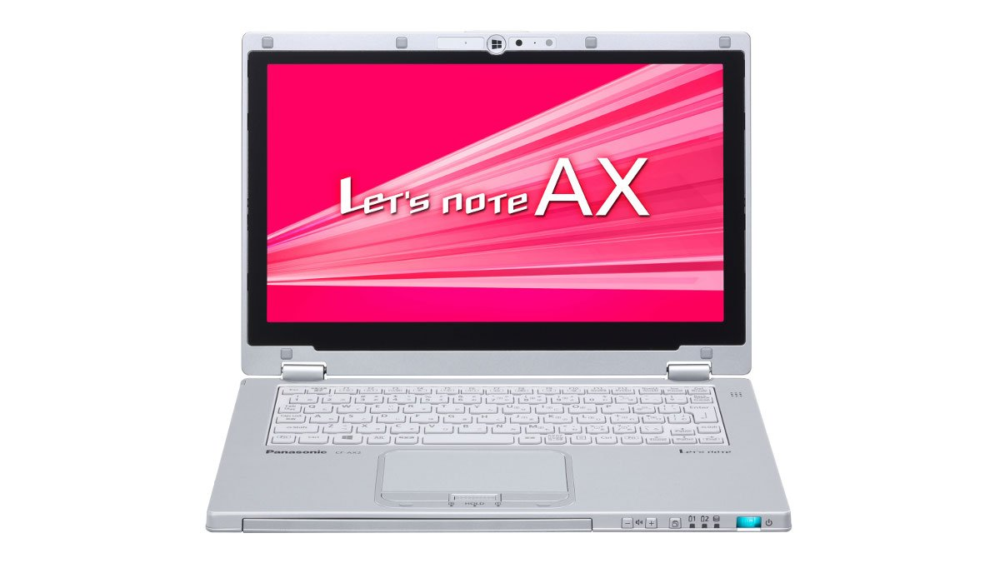
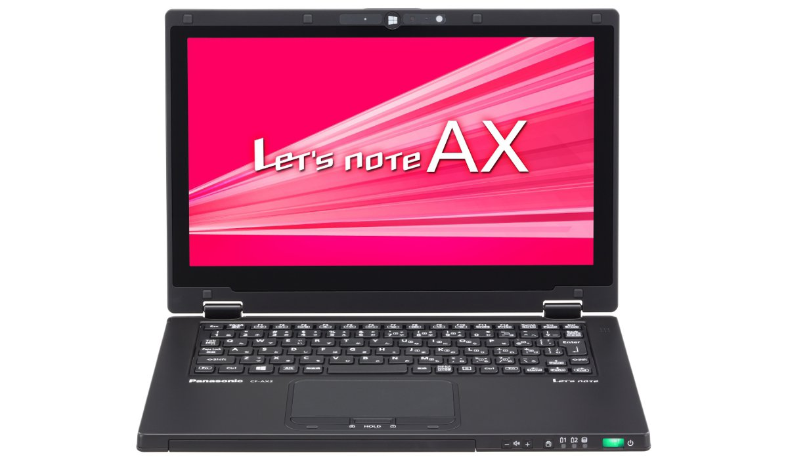
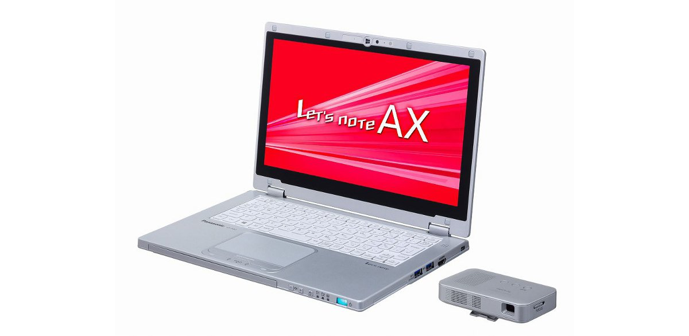

# 松下 Let's note CF-AX2 规格参数

[English](../../en/CF-AX2/) · [日本語](../../ja/CF-AX2/) · **中文**

**CF-AX2** 是松下 Let's note 笔记本电脑，属于 AX 系列，配备 11.6英寸 HD 屏幕。本页收录其全部 13 个型号（2012-10 – 2013-02 发售）的规格参数。每个型号均附官方规格表链接。

*松下 Let's note CF-AX2（CF-AX2TEQBR, CF-AX2AEABR, CF-AX2AEFBR, CF-AX2SEBJR …），银色。图片 © Panasonic*

## 型号列表

| 型号（品番） | 发售 | 停产 | 主要规格 |
| :-- | :-- | :-- | :-- |
| [CF-AX2TEQBR](https://panasonic.jp/pc/p-db/CF-AX2TEQBR_spec.html) | 2013-02 | 2013-11 | Windows 8 Pro 64位、Intel® CoreTM i7-3537U（2.00GHz）、内存：4GB（无扩展插槽）、SSD：128GB、LAN、无线LAN 802.11a(W52/W53/W56)/b/g/n |
| [CF-AX2TERBR](https://panasonic.jp/pc/p-db/CF-AX2TERBR_spec.html) | 2013-02 | 2013-11 | Windows 8 Pro 64位、Intel® CoreTM i7-3537U（2.00GHz）、内存：4GB（无扩展插槽）、SSD：128GB、LAN、无线LAN 802.11a(W52/W53/W56)/b/g/n、附带小型查看器 |
| [CF-AX2TETBR](https://panasonic.jp/pc/p-db/CF-AX2TETBR_spec.html) | 2013-02 | 2013-11 | Windows 8 Pro 64位、Intel® CoreTM i7-3537U（2.00GHz）、内存：4GB（无扩展插槽）、SSD：128GB、LAN、无线LAN 802.11a(W52/W53/W56)/b/g/n |
| [CF-AX2AEABR](https://panasonic.jp/pc/p-db/CF-AX2AEABR_spec.html) | 2013-02 | 2013-11 | Windows 8 Pro 64位、Intel® CoreTM i5-3437U vProTM（1.90GHz）、内存：4GB（无扩展插槽）、SSD：128GB、LAN、无线LAN 802.11a(W52/W53/W56)/b/g/n |
| [CF-AX2AEFBR](https://panasonic.jp/pc/p-db/CF-AX2AEFBR_spec.html) | 2013-02 | 2013-11 | Windows 8 Pro 64位、Intel® CoreTM i5-3437U vProTM（1.90GHz）、内存：4GB（无扩展插槽）、SSD：128GB、LAN、无线LAN 802.11a(W52/W53/W56)/b/g/n、Office Home and Business 2013 |
| [CF-AX2SEBJR](https://panasonic.jp/pc/p-db/CF-AX2SEBJR_spec.html) | 2013-02 | 2013-11 | Windows 8 64位、英特尔® CoreTM i5-3337U（1.80GHz）、内存：4GB（无扩展插槽）、SSD：128GB、LAN、无线LAN 802.11a(W52/W53/W56)/b/g/n |
| [CF-AX2SEGJR](https://panasonic.jp/pc/p-db/CF-AX2SEGJR_spec.html) | 2013-02 | 2013-11 | Windows 8 64位、英特尔® CoreTM i5-3337U（1.80GHz）、内存：4GB（无扩展插槽）、SSD：128GB、LAN、无线LAN 802.11a(W52/W53/W56)/b/g/n、Office Home and Business 2013 |
| [CF-AX2QEQBR](https://panasonic.jp/pc/p-db/CF-AX2QEQBR_spec.html) | 2012-11 | 2013-05 | Windows 8 Pro 64位、Intel® CoreTM i7-3517U（1.90GHz）、内存：4GB（无扩展插槽）、SSD：128GB、LAN、无线LAN 802.11a(W52/W53/W56)/b/g/n |
| [CF-AX2QERBR](https://panasonic.jp/pc/p-db/CF-AX2QERBR_spec.html) | 2012-11 | 2013-05 | Windows 8 Pro 64位、Intel® CoreTM i7-3517U（1.90GHz）、内存：4GB（无扩展插槽）、SSD：128GB、LAN、无线LAN 802.11a(W52/W53/W56)/b/g/n、附带小型查看器 |
| [CF-AX2LEABR](https://panasonic.jp/pc/p-db/CF-AX2LEABR_spec.html) | 2012-10 | 2013-05 | Windows 8 Pro 64位、Intel® CoreTM i5-3427U vProTM（1.80GHz）、内存：4GB（无扩展插槽）、SSD：128GB、LAN、无线LAN 802.11a(W52/W53/W56)/b/g/n |
| [CF-AX2LEFBR](https://panasonic.jp/pc/p-db/CF-AX2LEFBR_spec.html) | 2012-10 | 2013-05 | Windows 8 Pro 64位、Intel® CoreTM i5-3427U vProTM（1.80GHz）、内存：4GB（无扩展插槽）、SSD：128GB、LAN、无线LAN 802.11a(W52/W53/W56)/b/g/n、Office Home and Business 2010 |
| [CF-AX2QEBJR](https://panasonic.jp/pc/p-db/CF-AX2QEBJR_spec.html) | 2012-10 | 2013-05 | Windows 8 64位、英特尔® CoreTM i5-3317U（1.70GHz）、内存：4GB（无扩展插槽）、SSD：128GB、LAN、无线LAN 802.11a(W52/W53/W56)/b/g/n |
| [CF-AX2QEGJR](https://panasonic.jp/pc/p-db/CF-AX2QEGJR_spec.html) | 2012-10 | 2013-05 | Windows 8 64位、英特尔® CoreTM i5-3317U（1.70GHz）、内存：4GB（无扩展插槽）、SSD：128GB、LAN、无线LAN 802.11a(W52/W53/W56)/b/g/n、Office Home and Business 2010 |

## 通用规格

| 项目 | 规格 |
| :-- | :-- |
| 内存 | 标准4GB PC3-10600/DDR3L SDRAM（无空插槽） |
| 显存 | 最大1664MB（与主内存共用） |
| 显示屏 / 显卡 | 英特尔 HD 图形4000（内置于CPU） |
| 显示屏 / 色彩 | 1366×768像素：约1677万色 |
| 显示屏 / 外接显示输出 | 1024×768、1280×768、1280×1024、1360×768、1366×768、1400×1050、1600×900、1600×1200、1680×1050、1920×1080、1920×1200点：约1677万色 |
| 显示屏 / 同时显示 | 1024×768、1280×768、1360×768、1366×768：约1677万色 |
| 无线通信模块 | 英特尔 Centrino Advanced-N + WiMAX 6250 |
| 无线网络 | 符合IEEE802.11a（W52/W53/W56）/b/g/n |
| 移动 WiMAX | 符合IEEE802.16e-2005（接收最大28Mbps（尽力而为方式）、发送最大8Mbps（尽力而为方式）） |
| 有线网络 | 1000BASE-T/100BASE-TX/10BASE-T |
| 蓝牙 | Bluetooth v4.0 |
| 音频 | PCM音源（24位立体声）、英特尔 High Definition Audio标准、单声道扬声器 |
| 卡槽 / PC 卡 | － |
| 卡槽 / SD 卡 | SD存储卡×1插槽（支持SDHC存储卡/SDXC存储卡/支持UHS-I高速传输/支持版权保护技术） |
| 内存扩展槽 | － |
| 摄像头 | 分辨率：HD（720p）、有效像素数：最大1280×720像素 |
| 麦克风 | 单声道 |
| 键盘 | 符合OADG标准86键、键距18mm（横向）/14.2mm（纵向）（部分键除外） |
| 功耗 | 最大约45W（社）电子信息技术产业协会 基于信息处理设备高次谐波电流抑制对策实施计划书的额定输入功率值： 27W。 |
| 能效达成率（2011 年度标准） | — |
| 重量（含电池） | 电脑主机：约1.14kg，AC适配器：约0.185kg（不含壁挂插头（约0.02kg）和电源线（约0.06 kg）） |

## 各型号差异

| 型号（品番） | 处理器 | 内存 | 存储 | 重量 | 续航 |
| :-- | :-- | :-- | :-- | :-- | :-- |
| CF-AX2TEQBR | Core i7-3537U | 4GB PC3-10600 | 128GB | 1.14 kg | 9 h |
| CF-AX2TERBR | Core i7-3537U | 4GB PC3-10600 | 128GB | 1.14 kg | 9 h |
| CF-AX2TETBR | Core i7-3537U | 4GB PC3-10600 | 128GB | 1.14 kg | 9 h |
| CF-AX2AEABR | Core i5-3437U vPro | 4GB PC3-10600 | 128GB | 1.14 kg | 9.5 h |
| CF-AX2AEFBR | Core i5-3437U vPro | 4GB PC3-10600 | 128GB | 1.14 kg | 9.5 h |
| CF-AX2SEBJR | Core i5-3337U | 4GB PC3-10600 | 128GB | 1.14 kg | 9.5 h |
| CF-AX2SEGJR | Core i5-3337U | 4GB PC3-10600 | 128GB | 1.14 kg | 9.5 h |
| CF-AX2QEQBR | Core i7-3517U | 4GB PC3-10600 | 128GB | 1.14 kg | 9 h |
| CF-AX2QERBR | Core i7-3517U | 4GB PC3-10600 | 128GB | 1.14 kg | 9 h |
| CF-AX2LEABR | Core i5-3427U vPro | 4GB PC3-10600 | 128GB | 1.14 kg | 9.5 h |
| CF-AX2LEFBR | Core i5-3427U vPro | 4GB PC3-10600 | 128GB | 1.14 kg | 9.5 h |
| CF-AX2QEBJR | Core i5-3317U | 4GB PC3-10600 | 128GB | 1.14 kg | 9.5 h |
| CF-AX2QEGJR | Core i5-3317U | 4GB PC3-10600 | 128GB | 1.14 kg | 9.5 h |

CF-AX2TEQBR 的全部差异规格

| 项目 | 规格 |
| :-- | :-- |
| 操作系统 | Windows 8 Pro 64位 正版 |
| 处理器 | 英特尔 Core i7-3537U 处理器 / 英特尔智能缓存4MB，运行频率2.0GHz（使用英特尔 睿频加速技术2.0时最高3.1GHz） |
| 芯片组 | 移动 英特尔 HM76 Express 芯片组 |
| 固态硬盘 | 闪存驱动器（SSD）128GB（Serial ATA）上述容量中约10GB用作恢复区域、约1GB用作系统区域（用户不可使用） |
| 显示屏 | 11.6英寸宽屏(16:9)HD TFT彩色液晶（1366 x 768像素）、附静电触摸屏 |
| 安全芯片 | TPM（符合TCG V1.2） |
| 传感器 | 照度传感器 / 地磁传感器 / 陀螺仪传感器 / 加速度传感器 |
| 接口 | ・LAN接口（RJ-45） / ・外接显示器接口（模拟RGB 迷你D-sub 15针） / ・HDMI输出端子 / ・麦克风输入端子（立体声迷你插孔M3（支持插入式电源）） / ・音频输出端子（立体声迷你插孔M3） / ・USB3.0端口×2（右侧面） |
| 指点设备 | 静电触摸屏（液晶）/触控板 |
| 电源 | ▼AC适配器 输入：AC100V～240V、50Hz/60Hz、输出：DC16V、2.8A、电源线仅限100V专用 / ▼内置电池 / 7.2V（锂离子）标称容量2200mAh、额定容量2050mAh※20 / ▼电池组 / 7.2V（锂离子）标称容量4400mAh、额定容量4100mAh |
| 能效 | 2011年度基准 S类别0.075 |
| 续航 / 充电时间 | ▼续航时间：约9小时（仅内置电池组：约3小时） / ▼充电时间：约4小时（电源ON/OFF时均相同）、约2小时（内置电池充满电、电源ON/OFF时均相同） |
| 尺寸（宽×深×高） | 宽288mm × 深194mm × 高18mm（平板状态的高度约为19mm） 不含突起部 |
| 颜色 | 银色 |
| 预装软件 | Microsoft Internet Explorer 10 / 绿色goo棒 / 网络选择器3 / 无线工具箱 / Bluetooth Stack for Windows by TOSHIBA / 安全设置实用程序 / 迈克菲PC安全中心 / 迈克菲防盗 / i-过滤器6.0（30天试用版） / Infineon TPM Professional Package / Adobe Reader / WinZip 16.5日文版（45天体验版） / 电池余量显示校正实用程序 / NumLock通知 / Hotkey设置 / Fn Ctrl互换实用程序 / HOLD模式设置实用程序 / 电源计划扩展实用程序 / 峰值转移控制实用程序 / Microsoft Windows Media Player 12 / 投影仪助手 / USB键盘助手 / 显示器助手 / Wireless Manager mobile edition6.0 / USB充电设置实用程序 / 摄像头实用程序 / Camera for Panasonic PC / 智能拱形 / 画面分割实用程序 / 画面旋转工具 / PC信息弹窗 / PC信息查看器 / Aptio设置实用程序 / PC-Diagnostic实用程序 / Dashboard for Panasonic PC / 恢复光盘创建实用程序 / 硬盘数据擦除实用程序 / DirectX 11 / Microsoft .NET Framework 4.5 / 英特尔 PROSet/Wireless Software |
| 附件 | AC适配器、墙壁安装插头、电池组×2、电池充电器、使用说明书 |

官方规格表: <https://panasonic.jp/pc/p-db/CF-AX2TEQBR_spec.html>

CF-AX2TERBR 的全部差异规格

| 项目 | 规格 |
| :-- | :-- |
| 操作系统 | Windows 8 Pro 64位 正版 |
| 处理器 | 英特尔 Core i7-3537U 处理器 / 英特尔智能缓存4MB，运行频率2.0GHz（使用英特尔 睿频加速技术2.0时最高3.1GHz） |
| 芯片组 | 移动 英特尔 HM76 Express 芯片组 |
| 固态硬盘 | 闪存驱动器（SSD）128GB（Serial ATA）上述容量中约10GB用作恢复区域、约1GB用作系统区域（用户不可使用） |
| 显示屏 | 11.6英寸宽屏(16:9)HD TFT彩色液晶（1366 x 768像素）、附静电触摸屏 |
| 安全芯片 | TPM（符合TCG V1.2） |
| 传感器 | 照度传感器 / 地磁传感器 / 陀螺仪传感器 / 加速度传感器 |
| 接口 | ・LAN接口（RJ-45） / ・外接显示器接口（模拟RGB 迷你D-sub 15针） / ・HDMI输出端子 / ・麦克风输入端子（立体声迷你插孔M3（支持插入式电源）） / ・音频输出端子（立体声迷你插孔M3） / ・USB3.0端口×2（右侧面） |
| 指点设备 | 静电触摸面板（液晶）/触控板 |
| 电源 | ▼AC适配器 / 输入：AC100V～240V、50Hz/60Hz，输出：DC16V、2.8A，电源线为100V专用 / ▼内置电池 / 7.2V（锂离子）标称容量2200mAh、额定容量2050mAh※20 / ▼电池组 / 7.2V（锂离子）标称容量4400mAh、额定容量4100mAh |
| 能效 | 2011年度基准 S类别0.075 |
| 续航 / 充电时间 | ▼续航时间：约9小时（仅内置电池组：约3小时） / ▼充电时间：约4小时（电源ON/OFF时均相同）、约2小时（内置电池充满电、电源ON/OFF时均相同） |
| 尺寸（宽×深×高） | 宽288mm × 深194mm × 高18mm（平板状态的高度约为19mm） 不含突起部 |
| 颜色 | 银色 |
| 预装软件 | Microsoft Internet Explorer 10 / 绿色goo棒 / 网络选择器3 / 无线工具箱 / Bluetooth Stack for Windows by TOSHIBA / 安全设置实用程序 / 迈克菲PC安全中心 / 迈克菲防盗 / i-过滤器6.0（30天试用版） / Infineon TPM Professional Package / Adobe Reader / WinZip 16.5日文版（45天体验版） / 电池余量显示校正实用程序 / NumLock通知 / Hotkey设置 / Fn Ctrl互换实用程序 / HOLD模式设置实用程序 / 电源计划扩展实用程序 / 峰值转移控制实用程序 / Microsoft Windows Media Player 12 / 投影仪助手 / USB键盘助手 / 显示器助手 / Wireless Manager mobile edition6.0 / USB充电设置实用程序 / 摄像头实用程序 / Camera for Panasonic PC / 智能拱形 / 画面分割实用程序 / 画面旋转工具 / PC信息弹窗 / PC信息查看器 / Aptio设置实用程序 / PC-Diagnostic实用程序 / Dashboard for Panasonic PC / 恢复光盘创建实用程序 / 硬盘数据擦除实用程序 / DirectX 11 / Microsoft .NET Framework 4.5 / 英特尔 PROSet/Wireless Software |
| 附件 | AC适配器、墙壁安装插头、电池组×2、电池充电器、使用说明书、小型取景器 |

官方规格表: <https://panasonic.jp/pc/p-db/CF-AX2TERBR_spec.html>

CF-AX2TETBR 的全部差异规格

| 项目 | 规格 |
| :-- | :-- |
| 操作系统 | Windows 8 Pro 64位 正版 |
| 处理器 | 英特尔 Core i7-3537U 处理器 / 英特尔智能缓存4MB，运行频率2.0GHz（使用英特尔 睿频加速技术2.0时最高3.1GHz） |
| 芯片组 | 移动 英特尔 HM76 Express 芯片组 |
| 固态硬盘 | 闪存驱动器（SSD）128GB（Serial ATA）上述容量中约10GB用作恢复区域、约1GB用作系统区域（用户不可使用） |
| 显示屏 | 11.6英寸宽屏(16:9)HD TFT彩色液晶（1366 x 768像素）、附静电触摸屏 |
| 安全芯片 | TPM（符合TCG V1.2） |
| 传感器 | 照度传感器 / 地磁传感器 / 陀螺仪传感器 / 加速度传感器 |
| 接口 | ・LAN接口（RJ-45） / ・外接显示器接口（模拟RGB 迷你D-sub 15针） / ・HDMI输出端子 / ・麦克风输入端子（立体声迷你插孔M3（支持插入式电源）） / ・音频输出端子（立体声迷你插孔M3） / ・USB3.0端口×2（右侧面） |
| 指点设备 | 静电触摸屏（液晶）/触控板 |
| 电源 | ▼AC适配器 输入：AC100V～240V、50Hz/60Hz、输出：DC16V、2.8A、电源线仅限100V专用 / ▼内置电池 / 7.2V（锂离子）标称容量2200mAh、额定容量2050mAh※20 / ▼电池组 / 7.2V（锂离子）标称容量4400mAh、额定容量4100mAh |
| 能效 | 2011年度基准 S类别0.075 |
| 续航 / 充电时间 | ▼续航时间：约9小时（仅内置电池组：约3小时） / ▼充电时间：约4小时（电源ON/OFF时均相同）、约2小时（内置电池充满电、电源ON/OFF时均相同） |
| 尺寸（宽×深×高） | 宽288mm × 深194mm × 高18mm（平板状态的高度约为19mm） 不含突起部 |
| 颜色 | 黑色 |
| 预装软件 | Microsoft Internet Explorer 10 / 绿色goo棒 / 网络选择器3 / 无线工具箱 / Bluetooth Stack for Windows by TOSHIBA / 安全设置实用程序 / 迈克菲PC安全中心 / 迈克菲防盗 / i-过滤器6.0（30天试用版） / Infineon TPM Professional Package / Adobe Reader / WinZip 16.5日文版（45天体验版） / 电池余量显示校正实用程序 / NumLock通知 / Hotkey设置 / Fn Ctrl互换实用程序 / HOLD模式设置实用程序 / 电源计划扩展实用程序 / 峰值转移控制实用程序 / Microsoft Windows Media Player 12 / 投影仪助手 / USB键盘助手 / 显示器助手 / Wireless Manager mobile edition6.0 / USB充电设置实用程序 / 摄像头实用程序 / Camera for Panasonic PC / 智能拱形 / 画面分割实用程序 / 画面旋转工具 / PC信息弹窗 / PC信息查看器 / Aptio设置实用程序 / PC-Diagnostic实用程序 / Dashboard for Panasonic PC / 恢复光盘创建实用程序 / 硬盘数据擦除实用程序 / DirectX 11 / Microsoft .NET Framework 4.5 / 英特尔 PROSet/Wireless Software |
| 附件 | AC适配器、墙壁安装插头、电池组×2、电池充电器、使用说明书 |

官方规格表: <https://panasonic.jp/pc/p-db/CF-AX2TETBR_spec.html>

CF-AX2AEABR 的全部差异规格

| 项目 | 规格 |
| :-- | :-- |
| 操作系统 | Windows 8 Pro 64位 正版 |
| 处理器 | 采用英特尔 vPro 技术 / 英特尔 Core i5-3437U vPro 处理器 / 英特尔智能缓存3MB、工作频率1.90GHz（使用英特尔 睿频加速技术2.0时最高2.90GHz） |
| 芯片组 | 移动 英特尔 QM77 Express 芯片组 |
| 固态硬盘 | 闪存驱动器（SSD）128GB（Serial ATA）上述容量中约10GB用作恢复区域、约1GB用作系统区域（用户不可使用） |
| 显示屏 | 11.6英寸宽屏(16:9)HD TFT彩色液晶（1366 x 768像素）、附静电触摸屏 |
| 安全芯片 | TPM（符合TCG V1.2） |
| 传感器 | 照度传感器 / 地磁传感器 / 陀螺仪传感器 / 加速度传感器 |
| 接口 | ・LAN接口（RJ-45） / ・外接显示器接口（模拟RGB 迷你D-sub 15针） / ・HDMI输出端子 / ・麦克风输入端子（立体声迷你插孔M3（支持插入式电源）） / ・音频输出端子（立体声迷你插孔M3） / ・USB3.0端口×2（右侧面） |
| 指点设备 | 静电触摸屏（液晶）/触控板 |
| 电源 | ▼AC适配器 / 输入：AC100V～240V、50Hz/60Hz，输出：DC16V、2.8A，电源线为100V专用 / ▼内置电池 / 7.2V（锂离子）标称容量2200mAh、额定容量2050mAh※20 / ▼电池组 / 7.2V（锂离子）标称容量4400mAh、额定容量4100mAh |
| 能效 | 2011年度基准 S类别0.081 |
| 续航 / 充电时间 | ▼续航时间：约9.5小时（仅内置电池组：约3小时） / ▼充电时间：约4小时（电源ON/OFF时均相同）、约2小时（内置电池充满电、电源ON/OFF时均相同） |
| 尺寸（宽×深×高） | 宽288mm × 深194mm × 高18mm（平板状态的高度约为19mm） 不含突起部 |
| 颜色 | 银色 |
| 预装软件 | Microsoft Internet Explorer 10 / 绿色goo棒 / 网络选择器3 / 无线工具箱 / Bluetooth Stack for Windows by TOSHIBA / 安全设置实用程序 / 迈克菲PC安全中心 / 迈克菲防盗 / i-过滤器6.0（30天试用版） / Infineon TPM Professional Package / Adobe Reader / WinZip 16.5日文版（45天体验版） / 电池余量显示校正实用程序 / NumLock通知 / Hotkey设置 / Fn Ctrl互换实用程序 / HOLD模式设置实用程序 / 电源计划扩展实用程序 / 峰值转移控制实用程序 / Microsoft Windows Media Player 12 / 投影仪助手 / USB键盘助手 / 显示器助手 / Wireless Manager mobile edition6.0 / USB充电设置实用程序 / 摄像头实用程序 / Camera for Panasonic PC / 智能拱形 / 画面分割实用程序 / 画面旋转工具 / PC信息弹窗 / PC信息查看器 / Aptio设置实用程序 / PC-Diagnostic实用程序 / Dashboard for Panasonic PC / 恢复光盘创建实用程序 / 硬盘数据擦除实用程序 / DirectX 11 / Microsoft .NET Framework 4.5 / 英特尔 PROSet/Wireless Software / VIP Access for Desktop（英特尔 IPT 用应用程序软件） |
| 附件 | AC适配器、墙壁安装插头、电池组×2、电池充电器、使用说明书 |

官方规格表: <https://panasonic.jp/pc/p-db/CF-AX2AEABR_spec.html>

CF-AX2AEFBR 的全部差异规格

| 项目 | 规格 |
| :-- | :-- |
| 操作系统 | Windows 8 Pro 64位 正版 |
| 处理器 | 采用英特尔 vPro 技术 / 英特尔 Core i5-3437U vPro 处理器 / 英特尔智能缓存3MB、工作频率1.90GHz（使用英特尔 睿频加速技术2.0时最高2.90GHz） |
| 芯片组 | 移动 英特尔 QM77 Express 芯片组 |
| 固态硬盘 | 闪存驱动器（SSD）128GB（Serial ATA）上述容量中约12GB用作恢复区域、约1GB用作系统区域（用户不可使用） |
| 显示屏 | 11.6英寸宽屏(16:9)HD TFT彩色液晶（1366 x 768像素）、附静电触摸屏 |
| 安全芯片 | TPM（符合TCG V1.2） |
| 传感器 | 照度传感器 / 地磁传感器 / 陀螺仪传感器 / 加速度传感器 |
| 接口 | ・LAN接口（RJ-45） / ・外接显示器接口（模拟RGB 迷你D-sub 15针） / ・HDMI输出端子 / ・麦克风输入端子（立体声迷你插孔M3（支持插入式电源）） / ・音频输出端子（立体声迷你插孔M3） / ・USB3.0端口×2（右侧面） |
| 指点设备 | 静电触摸屏（液晶）/触控板 |
| 电源 | ▼AC适配器 输入：AC100V～240V、50Hz/60Hz、输出：DC16V、2.8A、电源线仅限100V专用 / ▼内置电池 / 7.2V（锂离子）标称容量2200mAh、额定容量2050mAh※20 / ▼电池组 / 7.2V（锂离子）标称容量4400mAh、额定容量4100mAh |
| 能效 | 2011年度基准 S类别0.081 |
| 续航 / 充电时间 | ▼续航时间：约9.5小时（仅内置电池组：约3小时） / ▼充电时间：约4小时（电源ON/OFF时均相同）、约2小时（内置电池充满电、电源ON/OFF时均相同） |
| 尺寸（宽×深×高） | 宽288mm × 深194mm × 高18mm（平板状态的高度约为19mm） 不含突起部 |
| 颜色 | 银色 |
| 预装软件 | Microsoft Internet Explorer 10 / 绿色goo棒 / 网络选择器3 / 无线工具箱 / Bluetooth Stack for Windows by TOSHIBA / 安全设置实用程序 / 迈克菲PC安全中心 / 迈克菲防盗 / i-过滤器6.0（30天试用版） / Infineon TPM Professional Package / Adobe Reader / WinZip 16.5日文版（45天体验版） / 电池余量显示校正实用程序 / NumLock通知 / Hotkey设置 / Fn Ctrl互换实用程序 / HOLD模式设置实用程序 / 电源计划扩展实用程序 / 峰值转移控制实用程序 / Microsoft Windows Media Player 12 / 投影仪助手 / USB键盘助手 / 显示器助手 / Wireless Manager mobile edition6.0 / USB充电设置实用程序 / 摄像头实用程序 / Camera for Panasonic PC / 智能拱形 / 画面分割实用程序 / 画面旋转工具 / PC信息弹窗 / PC信息查看器 / Aptio设置实用程序 / PC-Diagnostic实用程序 / Dashboard for Panasonic PC / 恢复光盘创建实用程序 / 硬盘数据擦除实用程序 / DirectX 11 / Microsoft .NET Framework 4.5 / 英特尔 PROSet/Wireless Software / VIP Access for Desktop（英特尔 IPT 用应用程序软件） |
| 附件 | AC适配器、墙壁安装插头、电池组×2、电池充电器、使用说明书、Microsoft Office Home and Business 2013 |
| Microsoft Office | Microsoft Office Home and Business 2013 |

官方规格表: <https://panasonic.jp/pc/p-db/CF-AX2AEFBR_spec.html>

CF-AX2SEBJR 的全部差异规格

| 项目 | 规格 |
| :-- | :-- |
| 操作系统 | Windows 8 64位 正版 |
| 处理器 | 英特尔 Core i5-3337U 处理器 / 英特尔智能缓存3MB，运行频率1.80GHz（使用英特尔 睿频加速技术2.0时最高2.70GHz） |
| 芯片组 | 移动 英特尔 HM76 Express 芯片组 |
| 固态硬盘 | 闪存驱动器（SSD）128GB（Serial ATA）上述容量中约10GB用作恢复区域、约1GB用作系统区域（用户不可使用） |
| 显示屏 | 11.6英寸宽屏(16:9)HD TFT彩色液晶（1366 x 768像素）、附静电触摸屏 |
| 安全芯片 | － |
| 传感器 | 照度传感器、地磁传感器、陀螺仪传感器、加速度传感器 |
| 接口 | ・LAN接口（RJ-45） / ・外接显示器接口（模拟RGB 迷你D-sub 15针） / ・HDMI输出端子 / ・麦克风输入端子（立体声迷你插孔M3（支持插入式电源）） / ・音频输出端子（立体声迷你插孔M3） / ・USB3.0端口×2（右侧面） |
| 指点设备 | 静电式触摸屏（液晶）/触控板 |
| 电源 | ▼AC适配器 / 输入：AC100V～240V、50Hz/60Hz，输出：DC16V、2.8A，电源线为100V专用 / ▼内置电池 / 7.2V（锂离子）标称容量2200mAh、额定容量2050mAh / ▼电池组 / 7.2V（锂离子）标称容量4400mAh、额定容量4100mAh |
| 能效 | 2011年度基准 S类别0.087 |
| 续航 / 充电时间 | ▼续航时间：约9.5小时（仅内置电池组：约3小时） / ▼充电时间：约4小时（电源ON/OFF时均相同）、约2小时（内置电池充满电时、电源ON/OFF时均相同） |
| 尺寸（宽×深×高） | 宽288mm × 深194mm × 高18mm（平板状态的高度约为19mm） 不含突起部 |
| 颜色 | 银色 |
| 预装软件 | Microsoft Internet Explorer 10 / 绿色goo棒 / 网络选择器3 / 无线工具箱 / Bluetooth Stack for Windows by TOSHIBA / 安全设置实用程序 / 迈克菲PC安全中心 / 迈克菲防盗 / i-过滤器6.0（30天试用版） / Infineon TPM Professional Package / Adobe Reader / WinZip 16.5日文版（45天体验版） / 电池余量显示校正实用程序 / NumLock通知 / Hotkey设置 / Fn Ctrl互换实用程序 / HOLD模式设置实用程序 / 电源计划扩展实用程序 / 峰值转移控制实用程序 / Microsoft Windows Media Player 12 / 投影仪助手 / USB键盘助手 / 显示器助手 / Wireless Manager mobile edition6.0 / USB充电设置实用程序 / 摄像头实用程序 / Camera for Panasonic PC / 智能拱形 / 画面分割实用程序 / 画面旋转工具 / PC信息弹窗 / PC信息查看器 / Aptio设置实用程序 / PC-Diagnostic实用程序 / Dashboard for Panasonic PC / 恢复光盘创建实用程序 / 硬盘数据擦除实用程序 / DirectX 11 / Microsoft .NET Framework 4.5 / 英特尔 PROSet/Wireless Software |
| 附件 | AC适配器、墙壁安装插头、电池组×1、使用说明书 |

官方规格表: <https://panasonic.jp/pc/p-db/CF-AX2SEBJR_spec.html>

CF-AX2SEGJR 的全部差异规格

| 项目 | 规格 |
| :-- | :-- |
| 操作系统 | Windows 8 64位 正版 |
| 处理器 | 英特尔 Core i5-3337U 处理器 / 英特尔智能缓存3MB，运行频率1.80GHz（使用英特尔 睿频加速技术2.0时最高2.70GHz） |
| 芯片组 | 移动 英特尔 HM76 Express 芯片组 |
| 固态硬盘 | 闪存驱动器（SSD）128GB（Serial ATA）上述容量中约12GB用作恢复区域、约1GB用作系统区域（用户不可使用） |
| 显示屏 | 11.6英寸宽屏(16:9)HD TFT彩色液晶（1366 x 768像素）、附静电触摸屏 |
| 安全芯片 | － |
| 传感器 | 照度传感器 / 地磁传感器 / 陀螺仪传感器 / 加速度传感器 |
| 接口 | ・LAN接口（RJ-45） / ・外接显示器接口（模拟RGB 迷你D-sub 15针） / ・HDMI输出端子 / ・麦克风输入端子（立体声迷你插孔M3（支持插入式电源）） / ・音频输出端子（立体声迷你插孔M3） / ・USB3.0端口×2（右侧面） |
| 指点设备 | 静电触摸屏（液晶）/触控板 |
| 电源 | ▼AC适配器 / 输入：AC100V～240V、50Hz/60Hz，输出：DC16V、2.8A，电源线为100V专用 / ▼内置电池 / 7.2V（锂离子）标称容量2200mAh、额定容量2050mAh※20 / ▼电池组 / 7.2V（锂离子）标称容量4400mAh、额定容量4100mAh |
| 能效 | 2011年度基准 S类别0.087 |
| 续航 / 充电时间 | ▼续航时间：约9.5小时（仅内置电池组：约3小时） / ▼充电时间：约4小时（电源ON/OFF时均相同）、约2小时（内置电池充满电、电源ON/OFF时均相同） |
| 尺寸（宽×深×高） | 宽288mm × 深194mm × 高18mm（平板状态的高度约为19mm） 不含突起部 |
| 颜色 | 银色 |
| 预装软件 | Microsoft Internet Explorer 10 / 绿色goo棒 / 网络选择器3 / 无线工具箱 / Bluetooth Stack for Windows by TOSHIBA / 安全设置实用程序 / 迈克菲PC安全中心 / 迈克菲防盗 / i-过滤器6.0（30天试用版） / Infineon TPM Professional Package / Adobe Reader / WinZip 16.5日文版（45天体验版） / 电池余量显示校正实用程序 / NumLock通知 / Hotkey设置 / Fn Ctrl互换实用程序 / HOLD模式设置实用程序 / 电源计划扩展实用程序 / 峰值转移控制实用程序 / Microsoft Windows Media Player 12 / 投影仪助手 / USB键盘助手 / 显示器助手 / Wireless Manager mobile edition6.0 / USB充电设置实用程序 / 摄像头实用程序 / Camera for Panasonic PC / 智能拱形 / 画面分割实用程序 / 画面旋转工具 / PC信息弹窗 / PC信息查看器 / Aptio设置实用程序 / PC-Diagnostic实用程序 / Dashboard for Panasonic PC / 恢复光盘创建实用程序 / 硬盘数据擦除实用程序 / DirectX 11 / Microsoft .NET Framework 4.5 / 英特尔 PROSet/Wireless Software |
| 附件 | AC适配器、墙壁安装插头、电池组×1、使用说明书、Microsoft Office Home and Business 2013 |
| Microsoft Office | Microsoft Office Home and Business 2013 |

官方规格表: <https://panasonic.jp/pc/p-db/CF-AX2SEGJR_spec.html>

CF-AX2QEQBR 的全部差异规格

| 项目 | 规格 |
| :-- | :-- |
| 操作系统 | Windows 8 Pro 64位 正版 |
| 处理器 | 英特尔 Core i7-3517U 处理器 / 英特尔智能缓存4MB，运行频率1.90GHz（使用英特尔 睿频加速技术2.0时最高3.0GHz） |
| 芯片组 | 移动 英特尔 HM76 Express 芯片组 |
| 固态硬盘 | 闪存驱动器（SSD）128GB（Serial ATA）上述容量中约10GB用作恢复区域、约1GB用作系统区域（用户不可使用） |
| 显示屏 | 11.6英寸宽屏(16:9)HD TFT彩色液晶（1366 x 768像素）、附静电式触摸屏 |
| 安全芯片 | TPM（符合TCG V1.2） |
| 传感器 | 照度传感器 / 地磁传感器 / 陀螺仪传感器 / 加速度传感器 |
| 接口 | ・LAN接口（RJ-45） / ・外接显示器接口（模拟RGB 迷你Dsub 15针） / ・HDMI输出端子 / ・麦克风输入端子（立体声迷你插孔M3（支持插入式电源）） / ・音频输出端子（立体声迷你插孔M3） / ・USB3.0端口×2 |
| 指点设备 | 静电式触摸屏（液晶）/触控板 |
| 电源 | ▼AC适配器 输入：AC100V～240V、50Hz/60Hz、输出：DC16V、2.82A、电源线仅限100V专用 / ▼内置电池 / 7.2V（锂离子）标称容量2200mAh、额定容量2050mAh※20 / ▼电池组 / 7.2V（锂离子）标称容量4400mAh、额定容量4100mAh |
| 能效 | 2011年度基准 S类别0.077 |
| 续航 / 充电时间 | ▼续航时间：约9小时（仅内置电池组：约3小时） / ▼充电时间：约4小时（电源ON/OFF时均相同）、约2小时（内置电池充满电、电源ON/OFF时均相同） |
| 尺寸（宽×深×高） | 宽288mm × 深194mm × 高18mm（平板状态的高度约为19mm） 不含突起部 |
| 颜色 | 银色 |
| 预装软件 | Microsoft Internet Explorer 10、绿色goo棒、网络选择器3、无线工具箱、Bluetooth Stack for Windows by TOSHIBA、安全设置实用程序、迈克菲PC安全中心、i-过滤器6.0（30天试用版）、Infineon TPM Professional Package、Adobe Reader、WinZip 16.5日语版（45天体验版）、电池余量显示校正实用程序、NumLock通知、Hotkey设置、Fn Ctrl互换实用程序、金山词典、HOLD模式设置实用程序、电源计划扩展实用程序、峰值转移控制实用程序、Microsoft Windows Media Player 12、投影仪助手、USB键盘助手、显示器助手、Wireless Manager mobile edition6.0、USB充电设置实用程序、摄像头实用程序、Camera for Panasonic PC、Smart Arch、画面分割实用程序、PC信息弹窗、PC信息查看器、Aptio设置实用程序、PC-Diagnostic实用程序、Dashboard for Panasonic PC、恢复光盘创建实用程序、硬盘数据擦除实用程序、DirectX 11、Microsoft .NET Framework 4.5、英特尔 PROSet/Wireless Software、VIP Access for Desktop（英特尔 IPT 用应用程序） |
| 附件 | AC适配器、墙壁安装插头、电池组×2、电池充电器、使用说明书 |

官方规格表: <https://panasonic.jp/pc/p-db/CF-AX2QEQBR_spec.html>

CF-AX2QERBR 的全部差异规格

| 项目 | 规格 |
| :-- | :-- |
| 操作系统 | Windows 8 Pro 64位 正版 |
| 处理器 | 英特尔 Core i7-3517U 处理器 / 英特尔智能缓存4MB，运行频率1.90GHz（使用英特尔 睿频加速技术2.0时最高3.0GHz） |
| 芯片组 | 移动 英特尔 HM76 Express 芯片组 |
| 固态硬盘 | 闪存驱动器（SSD）128GB（Serial ATA）上述容量中约10GB用作恢复区域、约1GB用作系统区域（用户不可使用） |
| 显示屏 | 11.6英寸宽屏(16:9)HD TFT彩色液晶（1366 x 768像素）、附静电式触摸屏 |
| 安全芯片 | TPM（符合TCG V1.2） |
| 传感器 | 照度传感器 / 地磁传感器 / 陀螺仪传感器 / 加速度传感器 |
| 接口 | ・LAN接口（RJ-45） / ・外接显示器接口（模拟RGB 迷你Dsub 15针） / ・HDMI输出端子 / ・麦克风输入端子（立体声迷你插孔M3（支持插入式电源）） / ・音频输出端子（立体声迷你插孔M3） / ・USB3.0端口×2 |
| 指点设备 | 静电式触摸面板（液晶）/触控板 |
| 电源 | ▼AC适配器 / 输入：AC100V～240V、50Hz/60Hz，输出：DC16V、2.82A，电源线为100V专用 / ▼内置电池 / 7.2V（锂离子）标称容量2200mAh、额定容量2050mAh※20 / ▼电池组 / 7.2V（锂离子）标称容量4400mAh、额定容量4100mAh |
| 能效 | 2011年度基准 S类别0.077 |
| 续航 / 充电时间 | ▼续航时间：约9小时（仅内置电池组：约3小时） / ▼充电时间：约4小时（电源ON/OFF时均相同）、约2小时（内置电池充满电、电源ON/OFF时均相同） |
| 尺寸（宽×深×高） | 宽288mm × 深194mm × 高18mm（平板状态的高度约为19mm） 不含突起部 |
| 颜色 | 银色 |
| 预装软件 | Microsoft Internet Explorer 10、绿色goo棒、网络选择器3、无线工具箱、Bluetooth Stack for Windows by TOSHIBA、安全设置实用程序、迈克菲PC安全中心、i-过滤器6.0（30天试用版）、Infineon TPM Professional Package、Adobe Reader、WinZip 16.5日语版（45天体验版）、电池余量显示校正实用程序、NumLock通知、Hotkey设置、Fn Ctrl互换实用程序、金山词典、HOLD模式设置实用程序、电源计划扩展实用程序、峰值转移控制实用程序、Microsoft Windows Media Player 12、投影仪助手、USB键盘助手、显示器助手、Wireless Manager mobile edition6.0、USB充电设置实用程序、摄像头实用程序、Camera for Panasonic PC、Smart Arch、画面分割实用程序、PC信息弹窗、PC信息查看器、Aptio设置实用程序、PC-Diagnostic实用程序、Dashboard for Panasonic PC、恢复光盘创建实用程序、硬盘数据擦除实用程序、DirectX 11、Microsoft .NET Framework 4.5、英特尔 PROSet/Wireless Software、VIP Access for Desktop（英特尔 IPT 用应用程序） |
| 附件 | AC适配器、墙壁安装插头、电池组×2、电池充电器、使用说明书、小型取景器 |

官方规格表: <https://panasonic.jp/pc/p-db/CF-AX2QERBR_spec.html>

CF-AX2LEABR 的全部差异规格

| 项目 | 规格 |
| :-- | :-- |
| 操作系统 | Windows 8 Pro 64位 正版 |
| 处理器 | 采用英特尔 vPro 技术 / 英特尔 Core i5-3427U vPro 处理器 / 英特尔智能缓存3MB、工作频率1.80GHz（使用英特尔 睿频加速技术2.0时最高2.80GHz） |
| 芯片组 | 移动 英特尔 QM77 Express 芯片组 |
| 固态硬盘 | 闪存驱动器（SSD）128GB（Serial ATA）上述容量中约10GB用作恢复区域、约1GB用作系统区域（用户不可使用） |
| 显示屏 | 11.6英寸宽屏(16:9)HD TFT彩色液晶（1366 x 768像素）、附静电式触摸屏 |
| 安全芯片 | TPM（符合TCG V1.2） |
| 传感器 | 照度传感器 / 地磁传感器 / 陀螺仪传感器 / 加速度传感器 |
| 接口 | ・LAN接口（RJ-45） / ・外接显示器接口（模拟RGB 迷你Dsub 15针） / ・HDMI输出端子 / ・麦克风输入端子（立体声迷你插孔M3（支持插入式电源）） / ・音频输出端子（立体声迷你插孔M3） / ・USB3.0端口×2 |
| 指点设备 | 静电式触摸屏（液晶）/触控板 |
| 电源 | ▼AC适配器 / 输入：AC100V～240V、50Hz/60Hz，输出：DC16V、2.82A，电源线为100V专用 / ▼内置电池 / 7.2V（锂离子）标称容量2200mAh、额定容量2050mAh※20 / ▼电池组 / 7.2V（锂离子）标称容量4400mAh、额定容量4100mAh |
| 能效 | 2011年度基准 S类别0.083 |
| 续航 / 充电时间 | ▼续航时间：约9.5小时（仅内置电池组：约3小时） / ▼充电时间：约4小时（电源ON/OFF时均相同）、约2小时（内置电池充满电、电源ON/OFF时均相同） |
| 尺寸（宽×深×高） | 宽288mm × 深194mm × 高18mm（平板状态的高度约为19mm） 不含突起部 |
| 颜色 | 银色 |
| 预装软件 | Microsoft Internet Explorer 10、绿色goo棒、网络选择器3、无线工具箱、Bluetooth Stack for Windows by TOSHIBA、安全设置实用程序、迈克菲PC安全中心、i-过滤器6.0（30天试用版）、Infineon TPM Professional Package、Adobe Reader、WinZip 16.5日语版（45天体验版）、电池余量显示校正实用程序、NumLock通知、Hotkey设置、Fn Ctrl互换实用程序、金山词典、HOLD模式设置实用程序、电源计划扩展实用程序、峰值转移控制实用程序、Microsoft Windows Media Player 12、投影仪助手、USB键盘助手、显示器助手、Wireless Manager mobile edition6.0、USB充电设置实用程序、摄像头实用程序、Camera for Panasonic PC、Smart Arch、画面分割实用程序、PC信息弹窗、PC信息查看器、Aptio设置实用程序、PC-Diagnostic实用程序、Dashboard for Panasonic PC、恢复光盘创建实用程序、硬盘数据擦除实用程序、DirectX 11、Microsoft .NET Framework 4.5、英特尔 PROSet/Wireless Software、VIP Access for Desktop（英特尔 IPT 用应用程序） |
| 附件 | AC适配器、墙壁安装插头、电池组×2、电池充电器、使用说明书 |

官方规格表: <https://panasonic.jp/pc/p-db/CF-AX2LEABR_spec.html>

CF-AX2LEFBR 的全部差异规格

| 项目 | 规格 |
| :-- | :-- |
| 操作系统 | Windows 8 Pro 64位 正版 |
| 处理器 | 采用英特尔 vPro 技术 / 英特尔 Core i5-3427U vPro 处理器 / 英特尔智能缓存3MB、工作频率1.80GHz（使用英特尔 睿频加速技术2.0时最高2.80GHz） |
| 芯片组 | 移动 英特尔 QM77 Express 芯片组 |
| 固态硬盘 | 闪存驱动器（SSD）128GB（Serial ATA）上述容量中约10GB用作恢复区域、约1GB用作系统区域（用户不可使用） |
| 显示屏 | 11.6英寸宽屏(16:9)HD TFT彩色液晶（1366 x 768像素）、附静电式触摸屏 |
| 安全芯片 | TPM（符合TCG V1.2） |
| 传感器 | 照度传感器 / 地磁传感器 / 陀螺仪传感器 / 加速度传感器 |
| 接口 | ・LAN接口（RJ-45） / ・外接显示器接口（模拟RGB 迷你Dsub 15针） / ・HDMI输出端子 / ・麦克风输入端子（立体声迷你插孔M3（支持插入式电源）） / ・音频输出端子（立体声迷你插孔M3） / ・USB3.0端口×2 |
| 指点设备 | 静电式触摸屏（液晶）/触控板 |
| 电源 | ▼AC适配器 输入：AC100V～240V、50Hz/60Hz、输出：DC16V、2.82A、电源线仅限100V专用 / ▼内置电池 / 7.2V（锂离子）标称容量2200mAh、额定容量2050mAh※20 / ▼电池组 / 7.2V（锂离子）标称容量4400mAh、额定容量4100mAh |
| 能效 | 2011年度基准 S类别0.083 |
| 续航 / 充电时间 | ▼续航时间：约9.5小时（仅内置电池组：约3小时） / ▼充电时间：约4小时（电源ON/OFF时均相同）、约2小时（内置电池充满电、电源ON/OFF时均相同） |
| 尺寸（宽×深×高） | 宽288mm × 深194mm × 高18mm（平板状态的高度约为19mm） 不含突起部 |
| 颜色 | 银色 |
| 预装软件 | Microsoft Internet Explorer 10、绿色goo棒、网络选择器3、无线工具箱、Bluetooth Stack for Windows by TOSHIBA、安全设置实用程序、迈克菲PC安全中心、i-过滤器6.0（30天试用版）、Infineon TPM Professional Package、Adobe Reader、WinZip 16.5日语版（45天体验版）、电池余量显示校正实用程序、NumLock通知、Hotkey设置、Fn Ctrl互换实用程序、金山词典、HOLD模式设置实用程序、电源计划扩展实用程序、峰值转移控制实用程序、Microsoft Windows Media Player 12、投影仪助手、USB键盘助手、显示器助手、Wireless Manager mobile edition6.0、USB充电设置实用程序、摄像头实用程序、Camera for Panasonic PC、Smart Arch、画面分割实用程序、PC信息弹窗、PC信息查看器、Aptio设置实用程序、PC-Diagnostic实用程序、Dashboard for Panasonic PC、恢复光盘创建实用程序、硬盘数据擦除实用程序、DirectX 11、Microsoft .NET Framework 4.5、英特尔 PROSet/Wireless Software、VIP Access for Desktop（英特尔 IPT 用应用程序） |
| 附件 | AC适配器、墙壁安装插头、电池组×2、电池充电器、使用说明书、Microsoft Office Home and Business 2010 |
| Microsoft Office | Microsoft Office Home and Business 2010 |

官方规格表: <https://panasonic.jp/pc/p-db/CF-AX2LEFBR_spec.html>

CF-AX2QEBJR 的全部差异规格

| 项目 | 规格 |
| :-- | :-- |
| 操作系统 | Windows 8 64位 正版 |
| 处理器 | 英特尔 Core i5-3317U 处理器 / 英特尔智能缓存3MB，运行频率1.70GHz（使用英特尔 睿频加速技术2.0时最高2.60GHz） |
| 芯片组 | 移动 英特尔 HM76 Express 芯片组 |
| 固态硬盘 | 闪存驱动器（SSD）128GB（Serial ATA）上述容量中约10GB用作恢复区域、约1GB用作系统区域（用户不可使用） |
| 显示屏 | 11.6英寸宽屏(16:9)HD TFT彩色液晶（1366 x 768像素）、附静电式触摸屏 |
| 安全芯片 | － |
| 传感器 | 照度传感器、地磁传感器、陀螺仪传感器、加速度传感器 |
| 接口 | ・LAN接口（RJ-45） / ・外接显示器接口（模拟RGB 迷你Dsub 15针） / ・HDMI输出端子 / ・麦克风输入端子（立体声迷你插孔M3（支持插入式电源）） / ・音频输出端子（立体声迷你插孔M3） / ・USB3.0端口×2 |
| 指点设备 | 静电式触摸屏（液晶）/触控板 |
| 电源 | ▼AC适配器 / 输入：AC100V～240V、50Hz/60Hz，输出：DC16V、2.82A，电源线为100V专用 / ▼内置电池 / 7.2V（锂离子）标称容量2200mAh、额定容量2050mAh / ▼电池组 / 7.2V（锂离子）标称容量4400mAh、额定容量4100mAh |
| 能效 | 2011年度基准 S类别0.089 |
| 续航 / 充电时间 | ▼续航时间：约9.5小时（仅内置电池组：约3小时） / ▼充电时间：约4小时（电源ON/OFF时均相同）、约2小时（内置电池充满电时、电源ON/OFF时均相同） |
| 尺寸（宽×深×高） | 宽288mm × 深194mm × 高18mm（平板状态的高度约为19mm） 不含突起部 |
| 颜色 | 银色 |
| 预装软件 | Microsoft Internet Explorer 10、绿色goo棒、网络选择器3、无线工具箱、Bluetooth Stack for Windows by TOSHIBA、安全设置实用程序、迈克菲PC安全中心、i-过滤器6.0（30天试用版）、Adobe Reader、WinZip 16.5日语版（45天体验版）、电池余量显示校正实用程序、NumLock通知、Hotkey设置、Fn Ctrl互换实用程序、金山词典、HOLD模式设置实用程序、电源计划扩展实用程序、峰值转移控制实用程序、Microsoft Windows Media Player 12、投影仪助手、USB键盘助手、显示器助手、Wireless Manager mobile edition6.0、USB充电设置实用程序、摄像头实用程序、Camera for Panasonic PC、Smart Arch、画面分割实用程序、PC信息弹窗、PC信息查看器、Aptio设置实用程序、PC-Diagnostic实用程序、Dashboard for Panasonic PC、恢复光盘创建实用程序、硬盘数据擦除实用程序、DirectX 11、Microsoft .NET Framework 4.5、英特尔 PROSet/Wireless Software、VIP Access for Desktop（英特尔 IPT 用应用程序） |
| 附件 | AC适配器、墙壁安装插头、电池组×1、使用说明书 |

官方规格表: <https://panasonic.jp/pc/p-db/CF-AX2QEBJR_spec.html>

CF-AX2QEGJR 的全部差异规格

| 项目 | 规格 |
| :-- | :-- |
| 操作系统 | Windows 8 64位 正版 |
| 处理器 | 英特尔 Core i5-3317U 处理器 / 英特尔智能缓存3MB，运行频率1.70GHz（使用英特尔 睿频加速技术2.0时最高2.60GHz） |
| 芯片组 | 移动 英特尔 HM76 Express 芯片组 |
| 固态硬盘 | 闪存驱动器（SSD）128GB（Serial ATA）上述容量中约10GB用作恢复区域、约1GB用作系统区域（用户不可使用） |
| 显示屏 | 11.6英寸宽屏(16:9)HD TFT彩色液晶（1366 x 768像素）、附静电式触摸屏 |
| 安全芯片 | － |
| 传感器 | 照度传感器 / 地磁传感器 / 陀螺仪传感器 / 加速度传感器 |
| 接口 | ・LAN接口（RJ-45） / ・外接显示器接口（模拟RGB 迷你Dsub 15针） / ・HDMI输出端子 / ・麦克风输入端子（立体声迷你插孔M3（支持插入式电源）） / ・音频输出端子（立体声迷你插孔M3） / ・USB3.0端口×2 |
| 指点设备 | 静电式触摸屏（液晶）/触控板 |
| 电源 | ▼AC适配器 / 输入：AC100V～240V、50Hz/60Hz，输出：DC16V、2.82A，电源线为100V专用 / ▼内置电池 / 7.2V（锂离子）标称容量2200mAh、额定容量2050mAh※20 / ▼电池组 / 7.2V（锂离子）标称容量4400mAh、额定容量4100mAh |
| 能效 | 2011年度基准 S类别0.089 |
| 续航 / 充电时间 | ▼续航时间：约9.5小时（仅内置电池组：约3小时） / ▼充电时间：约4小时（电源ON/OFF时均相同）、约2小时（内置电池充满电、电源ON/OFF时均相同） |
| 尺寸（宽×深×高） | 宽288mm × 深194mm × 高18mm（平板状态的高度约为19mm） 不含突起部 |
| 颜色 | 银色 |
| 预装软件 | Microsoft Internet Explorer 10、绿色goo棒、网络选择器3、无线工具箱、Bluetooth Stack for Windows by TOSHIBA、安全设置实用程序、迈克菲PC安全中心、i-过滤器6.0（30天试用版）、Adobe Reader、WinZip 16.5日语版（45天体验版）、电池余量显示校正实用程序、NumLock通知、Hotkey设置、Fn Ctrl互换实用程序、金山词典、HOLD模式设置实用程序、电源计划扩展实用程序、峰值转移控制实用程序、Microsoft Windows Media Player 12、投影仪助手、USB键盘助手、显示器助手、Wireless Manager mobile edition6.0、USB充电设置实用程序、摄像头实用程序、Camera for Panasonic PC、Smart Arch、画面分割实用程序、PC信息弹窗、PC信息查看器、Aptio设置实用程序、PC-Diagnostic实用程序、Dashboard for Panasonic PC、恢复光盘创建实用程序、硬盘数据擦除实用程序、DirectX 11、Microsoft .NET Framework 4.5、英特尔 PROSet/Wireless Software、VIP Access for Desktop（英特尔 IPT 用应用程序） |
| 附件 | AC适配器、墙壁安装插头、电池组×1、使用说明书、Microsoft Office Home and Business 2010 |
| Microsoft Office | Microsoft Office Home and Business 2010 |

官方规格表: <https://panasonic.jp/pc/p-db/CF-AX2QEGJR_spec.html>

## 图片

*松下 Let's note CF-AX2（CF-AX2QEQBR, CF-AX2LEABR, CF-AX2LEFBR, CF-AX2QEBJR …），银色。图片 © Panasonic*

*松下 Let's note CF-AX2（CF-AX2TETBR），黑色。图片 © Panasonic*

*松下 Let's note CF-AX2（CF-AX2QERBR），银色。图片 © Panasonic*

*松下 Let's note CF-AX2（CF-AX2TERBR），银色。图片 © Panasonic*

## 相关机型

- 同系列新一代: [CF-AX3](../CF-AX3/)
- [Let's note 全部机型](../)

---

来源：松下官方[停产产品列表](https://panasonic.jp/pc/support/products/)及各型号规格表（panasonic.jp），由日文翻译，准确措辞以官方规格表为准。产品图片 © Panasonic。本页为非官方整理，与松下公司无关。
