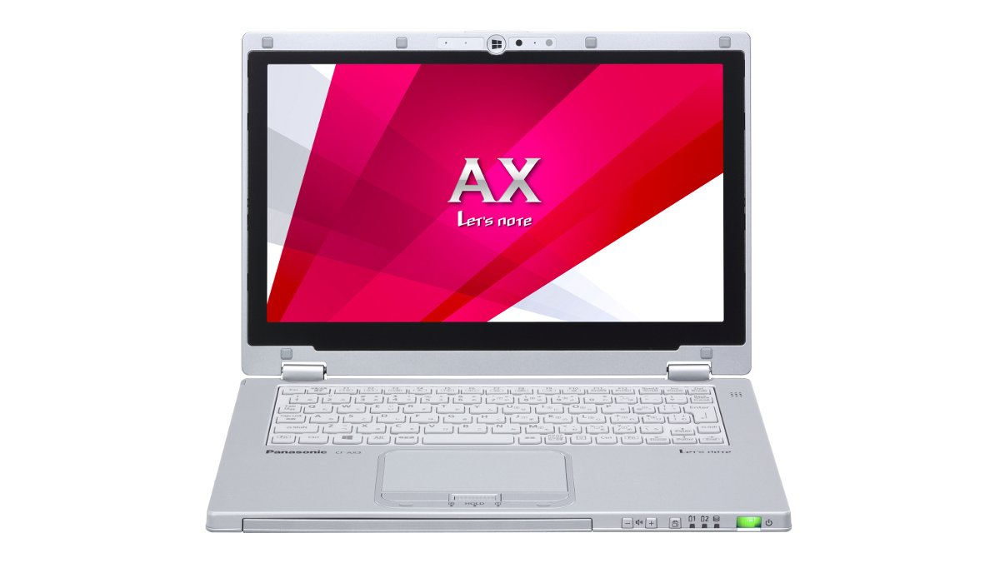
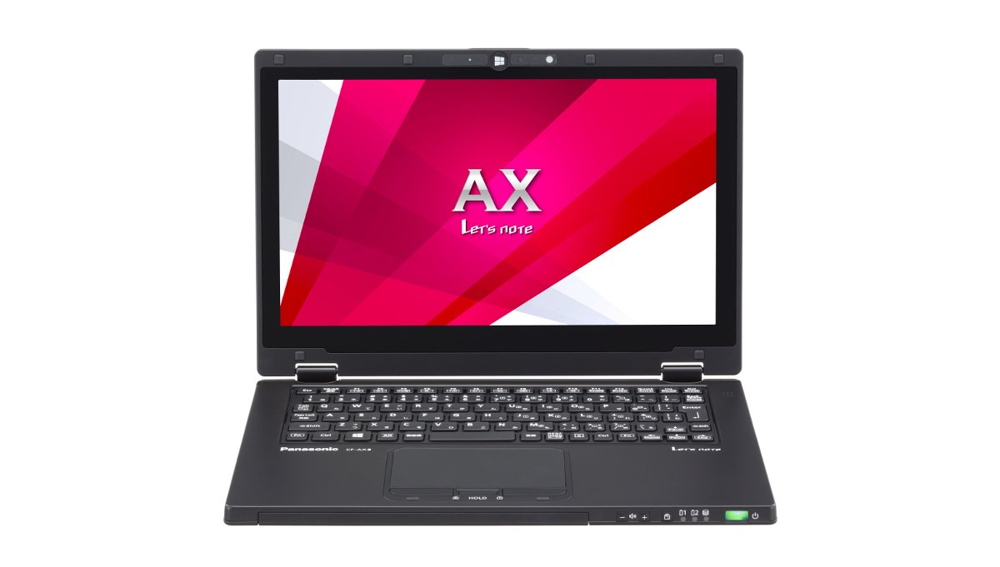
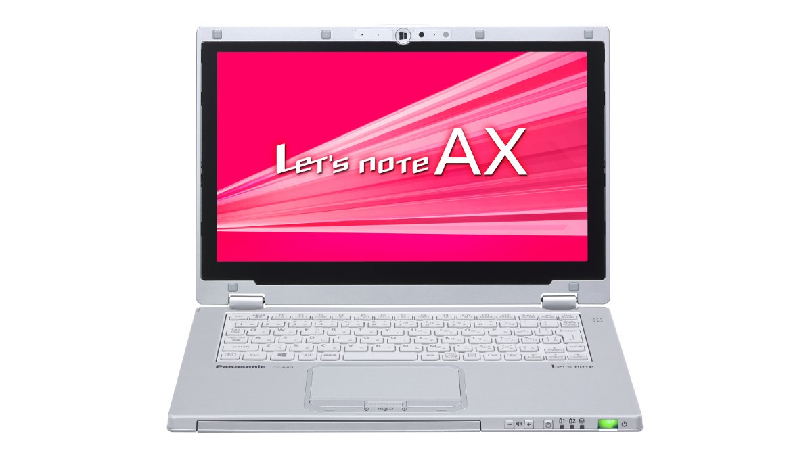
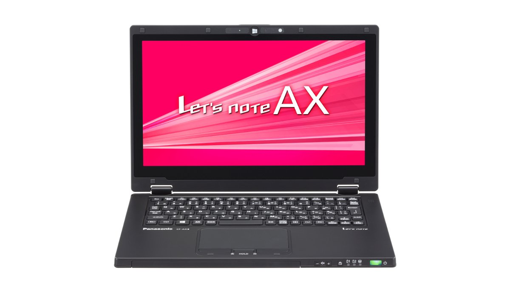
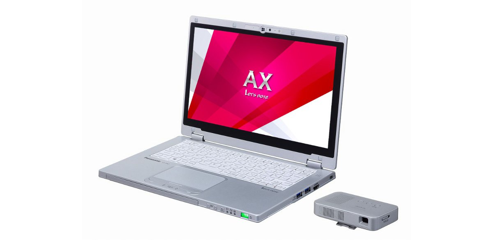
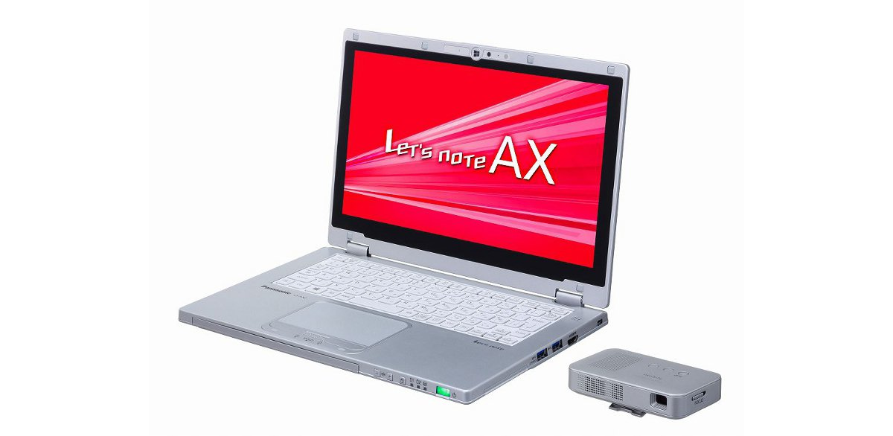

# 松下 Let's note CF-AX3 规格参数

[English](../../en/CF-AX3/) · [日本語](../../ja/CF-AX3/) · **中文**

**CF-AX3** 是松下 Let's note 笔记本电脑，属于 AX 系列，配备 11.6英寸 Full HD 屏幕。本页收录其全部 13 个型号（2013-06 – 2014-01 发售）的规格参数。每个型号均附官方规格表链接。

*松下 Let's note CF-AX3（CF-AX3SEGJR, CF-AX3NEABR, CF-AX3NEFBR, CF-AX3YEBJR …），银色。图片 © Panasonic*

## 型号列表

| 型号（品番） | 发售 | 停产 | 主要规格 |
| :-- | :-- | :-- | :-- |
| [CF-AX3SEGJR](https://panasonic.jp/pc/p-db/CF-AX3SEGJR_spec.html) | 2014-01 | 2014-06 | OS：Windows 8.1 64ビット、CPU：インテル® CoreTM i5-4200U（1.60GHz）、メモリー：4GB（拡張スロットなし）、SSD：128GB、LAN、無線LAN 802.11a(W52/W53/W56)/b/g/n/ac、Office Home and Business 2013 |
| [CF-AX3NERBR](https://panasonic.jp/pc/p-db/CF-AX3NERBR_spec.html) | 2013-10 | 2014-03 | Windows 8.1 Pro 64ビット、インテル® CoreTM i7-4500U（1.80GHz）、メモリー：4GB（拡張スロットなし）、SSD：256GB、LAN、無線LAN 802.11a(W52/W53/W56)/b/g/n、小型ビューアー付属 |
| [CF-AX3NEABR](https://panasonic.jp/pc/p-db/CF-AX3NEABR_spec.html) | 2013-10 | 2014-03 | Windows 8.1 Pro 64ビット、インテル® CoreTM i7-4500U（1.80GHz）、メモリー：4GB（拡張スロットなし）、SSD：256GB、LAN、無線LAN 802.11a(W52/W53/W56)/b/g/n |
| [CF-AX3NEFBR](https://panasonic.jp/pc/p-db/CF-AX3NEFBR_spec.html) | 2013-10 | 2014-03 | Windows 8.1 Pro 64ビット、インテル® CoreTM i7-4500U（1.80GHz）、メモリー：4GB（拡張スロットなし）、SSD：256GB、LAN、無線LAN 802.11a(W52/W53/W56)/b/g/n、Office Home and Business 2013 |
| [CF-AX3NETBR](https://panasonic.jp/pc/p-db/CF-AX3NETBR_spec.html) | 2013-10 | 2014-03 | Windows 8.1 Pro 64ビット、インテル® CoreTM i7-4500U（1.80GHz）、メモリー：4GB（拡張スロットなし）、SSD：256GB、LAN、無線LAN 802.11a(W52/W53/W56)/b/g/n |
| [CF-AX3NEWBR](https://panasonic.jp/pc/p-db/CF-AX3NEWBR_spec.html) | 2013-10 | 2014-03 | Windows 8.1 Pro 64ビット、インテル® CoreTM i7-4500U（1.80GHz）、メモリー：4GB（拡張スロットなし）、SSD：256GB、LAN、無線LAN 802.11a(W52/W53/W56)/b/g/n、Office Home and Business 2013 |
| [CF-AX3YEBJR](https://panasonic.jp/pc/p-db/CF-AX3YEBJR_spec.html) | 2013-10 | 2014-03 | Windows 8.1 64ビット、インテル® CoreTM i5-4200U（1.60GHz）、メモリー：4GB（拡張スロットなし）、SSD：128GB、LAN、無線LAN 802.11a(W52/W53/W56)/b/g/n |
| [CF-AX3YEGJR](https://panasonic.jp/pc/p-db/CF-AX3YEGJR_spec.html) | 2013-10 | 2014-03 | Windows 8.1 64ビット、インテル® CoreTM i5-4200U（1.60GHz）、メモリー：4GB（拡張スロットなし）、SSD：128GB、LAN、無線LAN 802.11a(W52/W53/W56)/b/g/n、Office Home and Business 2013 |
| [CF-AX3WERBR](https://panasonic.jp/pc/p-db/CF-AX3WERBR_spec.html) | 2013-06 | 2013-11 | Windows 8 Pro 64ビット、インテル® CoreTM i7-4500U（1.80GHz）、メモリー：4GB（拡張スロットなし）、SSD：128GB、LAN、無線LAN 802.11a(W52/W53/W56)/b/g/n、小型ビューアー付属 |
| [CF-AX3WEABR](https://panasonic.jp/pc/p-db/CF-AX3WEABR_spec.html) | 2013-06 | 2013-11 | Windows 8 Pro 64ビット、インテル® CoreTM i7-4500U（1.80GHz）、メモリー：4GB（拡張スロットなし）、SSD：128GB、LAN、無線LAN 802.11a(W52/W53/W56)/b/g/n |
| [CF-AX3WEFBR](https://panasonic.jp/pc/p-db/CF-AX3WEFBR_spec.html) | 2013-06 | 2013-11 | Windows 8 Pro 64ビット、インテル® CoreTM i7-4500U（1.80GHz）、メモリー：4GB（拡張スロットなし）、SSD：128GB、LAN、無線LAN 802.11a(W52/W53/W56)/b/g/n、Office Home and Business 2013 |
| [CF-AX3WETBR](https://panasonic.jp/pc/p-db/CF-AX3WETBR_spec.html) | 2013-06 | 2013-11 | Windows 8 Pro 64ビット、インテル® CoreTM i7-4500U（1.80GHz）、メモリー：4GB（拡張スロットなし）、SSD：128GB、LAN、無線LAN 802.11a(W52/W53/W56)/b/g/n |
| [CF-AX3WEWBR](https://panasonic.jp/pc/p-db/CF-AX3WEWBR_spec.html) | 2013-06 | 2013-11 | Windows 8 Pro 64ビット、インテル® CoreTM i7-4500U（1.80GHz）、メモリー：4GB（拡張スロットなし）、SSD：128GB、LAN、無線LAN 802.11a(W52/W53/W56)/b/g/n、Office Home and Business 2013 |

## 通用规格

| 项目 | 规格 |
| :-- | :-- |
| 显示屏 | 11.6型ワイド(16:9)Full HD TFTカラーIPS液晶 （1920 x 1080ドット）、静電タッチスクリーン、アンチグレア保護フィルム付 |
| 显示屏 / 显卡 | インテル HD グラフィックス4400（CPUに内蔵） |
| 显示屏 / 色彩 | 1920 x 1080ドット：約1677万色 |
| 显示屏 / 外接显示输出 | 1024×768ドット、1280×768ドット、1280×1024ドット、1360×768ドット、1366×768ドット、1400×1050ドット、1600×900ドット、1600×1200ドット、1680×1050ドット、1920×1080ドット、1920×1200ドット：約1677万色 |
| 显示屏 / 同时显示 | 1024×768ドット、1280×768ドット、1280×1024ドット、1360×768ドット、1366×768ドット、1400×1050ドット、1600×900ドット、1680×1050ドット、1920×1080ドット：約1677万色 |
| 移动 WiMAX | IEEE802.16e-2005準拠（受信最大28Mbps（ベストエフォート方式）、送信最大8Mbps（ベストエフォート方式）） |
| 有线网络 | 1000BASE-T/100BASE-TX/10BASE-T |
| 蓝牙 | Bluetooth v4.0 |
| 音频 | PCM音源（24ビットステレオ）、インテル High Definition Audio準拠、モノラルスピーカー |
| SD 卡槽 | SDメモリーカード×1スロット（SDHCメモリーカード/SDXCメモリーカード対応/UHS-I高速転送対応/著作権保護技術対応） |
| 传感器 | 照度センサー / 地磁気センサー / ジャイロセンサー / 加速度センサー |
| 键盘 | OADG準拠86キー、キーピッチ18mm(横)/14.2mm(縦)(一部キーを除く） |
| 能效达成率（2011 年度标准） | — |
| 尺寸（宽×深×高） | 幅288mm × 奥行194mm × 高さ18mm（タブレット状態の高さは約19mm） 突起部除く |
| 重量（含电池） | パソコン本体：約1.14kg、ACアダプター：約0.185kg（ウォールマウントプラグ（約0.02kg）電源コード（約0.06 kg）除く） |

## 各型号差异

| 型号（品番） | 处理器 | 内存 | 存储 | 重量 | 续航 |
| :-- | :-- | :-- | :-- | :-- | :-- |
| CF-AX3SEGJR | Core i5-4200U | 4GB DDR3L SDRAM | 128GB | 1.14 kg | 14 h |
| CF-AX3NERBR | 第四世代Core i7-4500U | 4GB PC3-12800 | 256GB | 1.14 kg | 14 h |
| CF-AX3NEABR | 第四世代Core i7-4500U | 4GB PC3-12800 | 256GB | 1.14 kg | 14 h |
| CF-AX3NEFBR | 第四世代Core i7-4500U | 4GB PC3-12800 | 256GB | 1.14 kg | 14 h |
| CF-AX3NETBR | 第四世代Core i7-4500U | 4GB PC3-12800 | 256GB | 1.14 kg | 14 h |
| CF-AX3NEWBR | 第四世代Core i7-4500U | 4GB PC3-12800 | 256GB | 1.14 kg | 14 h |
| CF-AX3YEBJR | 第四世代Core i5-4200U | 4GB PC3-12800 | 128GB | 1.14 kg | 14 h |
| CF-AX3YEGJR | 第四世代Core i5-4200U | 4GB PC3-12800 | 128GB | 1.14 kg | 14 h |
| CF-AX3WERBR | 第四世代Core i7-4500U | 4GB PC3-12800 | 128GB | 1.14 kg | 13 h |
| CF-AX3WEABR | 第四世代Core i7-4500U | 4GB PC3-12800 | 128GB | 1.14 kg | 13 h |
| CF-AX3WEFBR | 第四世代Core i7-4500U | 4GB PC3-12800 | 128GB | 1.14 kg | 13 h |
| CF-AX3WETBR | 第四世代Core i7-4500U | 4GB PC3-12800 | 128GB | 1.14 kg | 13 h |
| CF-AX3WEWBR | 第四世代Core i7-4500U | 4GB PC3-12800 | 128GB | 1.14 kg | 13 h |

CF-AX3SEGJR 的全部差异规格

| 项目 | 规格 |
| :-- | :-- |
| 操作系统 | Windows 8.1 64ビット（日本語版） |
| 处理器 | インテル Core i5-4200Uプロセッサー / インテルスマートキャッシュ3MB、動作周波数1.60GHz（インテル ターボ・ブースト・テクノロジー2.0利用時は最大2.60GHz） |
| 内存 | 4GB DDR3L SDRAM（空きスロット無し） |
| 显存 | 最大1792MB (メインメモリーと共用) |
| 固态硬盘 | フラッシュメモリードライブ（SSD）128GB（Serial ATA）上記容量のうち約16GBをリカバリー領域、約1GBをシステム領域として使用（ユーザー使用不可） |
| 无线通信模块 | インテル Dual Band Wireless-AC 7260 |
| 无线网络 | IEEE802.11a（W52/W53/W56）/b/g/n/ac準拠 |
| 摄像头 | 解像度：FullHD（1080p）、有効画素数：最大1920×1080ピクセル |
| 麦克风 | アレイマイク |
| 接口 | ・LANコネクター（RJ-45） / ・外部ディスプレイコネクター（アナログRGB ミニD-sub 15ピン） / ・HDMI出力端子 / ・マイク入力端子（ステレオミニジャックM3（プラグインパワー対応）） / ・オーディオ出力端子（ステレオミニジャックM3） / ・USB3.0ポート×2（うち1つはUSB充電ポートも兼ねる） |
| 指点设备 | 静電タッチスクリーン（液晶）/タッチパッド |
| 电源 | ▼ACアダプター / 入力：AC100V～240V、50Hz/60Hz、出力：DC16V、2.8A、電源コードは100V専用 / ▼バッテリーパック / 7.2V（リチウムイオン）公称容量4400mAh、定格容量4100mAh / ▼内蔵バッテリー（交換できません） / 7.2V（リチウムイオン）公称容量2200mAh、定格容量2050mAh |
| 功耗 | 最大約45W |
| 能效 | 2011年度基準 S区分0.034 |
| 续航 / 充电时间 | ▼駆動時間：約14時間 / ▼充電時間：約4時間（電源ON時/OFF時ともに）、約2時間（内蔵バッテリー満充電時、電源ON時/OFF時ともに） |
| 颜色 | シルバー |
| 预装软件 | Microsoft Internet Explorer 11 / ネットセレクターLite / 無線ツールボックス / Intel PROSet/Wireless Software for Bluetooth Technology / WiMAX Connectoin Utility / セキュリティ設定ユーティリティ / マカフィー・PCセキュリティセンター / i-フィルター6.0 (30日お試し版) / Adobe Reader / WinZip 17.0日本語版（45日体験版） / バッテリー残量表示補正ユーティリティ / NumLockお知らせ / Hotkey設定 / Fn Ctrl入れ替えユーティリティ / HOLDモード設定ユーティリティ / タッチ操作ヘルプユーティリティ / 電源プラン拡張ユーティリティ / ピークシフト制御ユーティリティ / Microsoft Windows Media Player 12 / プロジェクターヘルパー / USBキーボードヘルパー / ディスプレイヘルパー / Wireless Manager mobile edition6.0.1 / USB充電設定ユーティリティ / カメラユーティリティ（デスクトップ画面用） / 画面分割ユーティリティ / 画面回転ツール / PC情報ポップアップ / PC情報ビューアー / Aptioセットアップユーティリティ / PC-Diagnosticユーティリティ / Dashboard for Panasonic PC / リカバリーディスク作成ユーティリティ / ハードディスクデータ消去ユーティリティ / DirectX 11.2 / Microsoft .NET Framework 4.5 / インテル PROSet/Wireless Software / VIP Access for Desktop（インテルIPT用アプリケーションソフト） / インテル スマート･コネクト・テクノロジー / Skype / NAVITIME |
| Microsoft Office | Microsoft Office Home & Business 2013 |
| 附件 | ACアダプター、ウォールマウントプラグ、バッテリーパック、取扱説明書、Microsoft Office Home and Business 2013 |

官方规格表: <https://panasonic.jp/pc/p-db/CF-AX3SEGJR_spec.html>

CF-AX3NERBR 的全部差异规格

| 项目 | 规格 |
| :-- | :-- |
| 操作系统 | Windows 8.1 Pro 64ビット正規版 |
| 处理器 | 第四世代インテルCore i7-4500U プロセッサー / インテルスマートキャッシュ4MB、動作周波数1.8GHz（インテル ターボ・ブースト・テクノロジー2.0利用時は最大3.00GHz |
| 内存 | 標準4GB PC3-12800/DDR3L SDRAM（空きスロット無し） |
| 显存 | 最大1792MB (メインメモリーと共用) |
| 固态硬盘 | フラッシュメモリードライブ（SSD）256GB（Serial ATA）上記容量のうち約16GBをリカバリー領域、約1GBをシステム領域として使用（ユーザー使用不可） |
| 无线通信模块 | インテル Dual Band Wireless-N 7260 |
| 无线网络 | IEEE802.11a（W52/W53/W56）/b/g/n準拠 |
| 摄像头 | 解像度：HD（720p）、有効画素数：最大1280×720ピクセル |
| 麦克风 | ステレオ |
| 接口 | ・LANコネクター（RJ-45） / ・外部ディスプレイコネクター（アナログRGB ミニD-sub 15ピン） / ・HDMI出力端子 / ・マイク入力端子（ステレオミニジャックM3（プラグインパワー対応）） / ・オーディオ出力端子（ステレオミニジャックM3） / ・USB3.0ポート×2（右側面、うち1つはUSB充電ポートも兼ねる） |
| 指点设备 | 静電タッチスクリーン（液晶）/タッチパッド |
| 电源 | ▼ACアダプター入力：AC100V～240V、50Hz/60Hz、出力：DC16V、2.8A、電源コードは100V専用 / ▼内蔵バッテリー / 7.2V（リチウムイオン）公称容量2200mAh、定格容量2050mAh※20 / ▼バッテリーパック / 7.2V（リチウムイオン）公称容量4400mAh、定格容量4100mAh |
| 功耗 | 最大約45W |
| 能效 | 2011年度基準 S区分0.030 |
| 续航 / 充电时间 | ▼駆動時間：約14時間 / ▼充電時間：約4時間（電源ON時/OFF時ともに）、約2時間（内蔵バッテリー満充電、電源ON/OFF時ともに） |
| 颜色 | シルバー |
| 预装软件 | Microsoft Internet Explorer 11 / ネットセレクターLite / 無線ツールボックス / インテル PROSet/Wireless Software for Bluetooth Technology / WiMAX Connectoin Utility / セキュリティ設定ユーティリティ / マカフィー・PCセキュリティセンター / i-フィルター6.0 (30日お試し版) / WinZip 17.0日本語版（45日体験版） / バッテリー残量表示補正ユーティリティ / NumLockお知らせ / Hotkey設定 / Fn Ctrl入れ替えユーティリティ / HOLDモード設定ユーティリティ / タッチ操作ヘルプユーティリティ / 電源プラン拡張ユーティリティ / ピークシフト制御ユーティリティ / Microsoft Windows Media Player 12 / プロジェクターヘルパー / USBキーボードヘルパー / ディスプレイヘルパー / Wireless Manager mobile edition6.0.1 / USB充電設定ユーティリティ / カメラユーティリティ（デスクトップ画面用） / Camera for Panasonic PC（スタート画面用） / 画面分割ユーティリティ / 画面回転ツール / PC情報ポップアップ / PC情報ビューアー / Aptioセットアップユーティリティ / PC-Diagnosticユーティリティ / Dashboard for Panasonic PC / リカバリーディスク作成ユーティリティ / ハードディスクデータ消去ユーティリティ / DirectX 11.2 / Microsoft .NET Framework 4.5 / インテル PROSet/Wireless Software / インテル スマート･コネクト・テクノロジー / VIP Accsess for Desktop（インテルIPT用アプリケーション） / Skype / NAVITIME |
| 附件 | ACアダプター、ウォールマウントプラグ、バッテリーパック×2、バッテリーチャージャー、取扱説明書、小型ビューアー |

官方规格表: <https://panasonic.jp/pc/p-db/CF-AX3NERBR_spec.html>

CF-AX3NEABR 的全部差异规格

| 项目 | 规格 |
| :-- | :-- |
| 操作系统 | Windows 8.1 Pro 64ビット正規版 |
| 处理器 | 第四世代インテルCore i7-4500U プロセッサー / インテルスマートキャッシュ4MB、動作周波数1.8GHz（インテル ターボ・ブースト・テクノロジー2.0利用時は最大3.00GHz |
| 内存 | 標準4GB PC3-12800/DDR3L SDRAM（空きスロット無し） |
| 显存 | 最大1792MB (メインメモリーと共用) |
| 固态硬盘 | フラッシュメモリードライブ（SSD）256GB（Serial ATA）上記容量のうち約16GBをリカバリー領域、約1GBをシステム領域として使用（ユーザー使用不可） |
| 无线通信模块 | インテル Dual Band Wireless-N 7260 |
| 无线网络 | IEEE802.11a（W52/W53/W56）/b/g/n準拠 |
| 摄像头 | 解像度：HD（720p）、有効画素数：最大1280×720ピクセル |
| 麦克风 | ステレオ |
| 接口 | ・LANコネクター（RJ-45） / ・外部ディスプレイコネクター（アナログRGB ミニD-sub 15ピン） / ・HDMI出力端子 / ・マイク入力端子（ステレオミニジャックM3（プラグインパワー対応）） / ・オーディオ出力端子（ステレオミニジャックM3） / ・USB3.0ポート×2（右側面、うち1つはUSB充電ポートも兼ねる） |
| 指点设备 | 静電タッチスクリーン（液晶）/タッチパッド |
| 电源 | ▼ACアダプター入力：AC100V～240V、50Hz/60Hz、出力：DC16V、2.8A、電源コードは100V専用 / ▼内蔵バッテリー / 7.2V（リチウムイオン）公称容量2200mAh、定格容量2050mAh※20 / ▼バッテリーパック / 7.2V（リチウムイオン）公称容量4400mAh、定格容量4100mAh |
| 功耗 | 最大約45W |
| 能效 | 2011年度基準 S区分0.030 |
| 续航 / 充电时间 | ▼駆動時間：約14時間 / ▼充電時間：約4時間（電源ON時/OFF時ともに）、約2時間（内蔵バッテリー満充電、電源ON/OFF時ともに） |
| 颜色 | シルバー |
| 预装软件 | Microsoft Internet Explorer 11 / ネットセレクターLite / 無線ツールボックス / インテル PROSet/Wireless Software for Bluetooth Technology / WiMAX Connectoin Utility / セキュリティ設定ユーティリティ / マカフィー・PCセキュリティセンター / i-フィルター6.0 (30日お試し版) / WinZip 17.0日本語版（45日体験版） / バッテリー残量表示補正ユーティリティ / NumLockお知らせ / Hotkey設定 / Fn Ctrl入れ替えユーティリティ / HOLDモード設定ユーティリティ / タッチ操作ヘルプユーティリティ / 電源プラン拡張ユーティリティ / ピークシフト制御ユーティリティ / Microsoft Windows Media Player 12 / プロジェクターヘルパー / USBキーボードヘルパー / ディスプレイヘルパー / Wireless Manager mobile edition6.0.1 / USB充電設定ユーティリティ / カメラユーティリティ（デスクトップ画面用） / Camera for Panasonic PC（スタート画面用） / 画面分割ユーティリティ / 画面回転ツール / PC情報ポップアップ / PC情報ビューアー / Aptioセットアップユーティリティ / PC-Diagnosticユーティリティ / Dashboard for Panasonic PC / リカバリーディスク作成ユーティリティ / ハードディスクデータ消去ユーティリティ / DirectX 11.2 / Microsoft .NET Framework 4.5 / インテル PROSet/Wireless Software / インテル スマート･コネクト・テクノロジー / VIP Accsess for Desktop（インテルIPT用アプリケーション） / Skype / NAVITIME |
| 附件 | ACアダプター、ウォールマウントプラグ、バッテリーパック×2、バッテリーチャージャー、取扱説明書 |

官方规格表: <https://panasonic.jp/pc/p-db/CF-AX3NEABR_spec.html>

CF-AX3NEFBR 的全部差异规格

| 项目 | 规格 |
| :-- | :-- |
| 操作系统 | Windows 8.1 Pro 64ビット正規版 |
| 处理器 | 第四世代インテルCore i7-4500U プロセッサー / インテルスマートキャッシュ4MB、動作周波数1.8GHz（インテル ターボ・ブースト・テクノロジー2.0利用時は最大3.00GHz |
| 内存 | 標準4GB PC3-12800/DDR3L SDRAM（空きスロット無し） |
| 显存 | 最大1792MB (メインメモリーと共用) |
| 固态硬盘 | フラッシュメモリードライブ（SSD）256GB（Serial ATA）上記容量のうち約16GBをリカバリー領域、約1GBをシステム領域として使用（ユーザー使用不可） |
| 无线通信模块 | インテル Dual Band Wireless-N 7260 |
| 无线网络 | IEEE802.11a（W52/W53/W56）/b/g/n準拠 |
| 摄像头 | 解像度：HD（720p）、有効画素数：最大1280×720ピクセル |
| 麦克风 | ステレオ |
| 接口 | ・LANコネクター（RJ-45） / ・外部ディスプレイコネクター（アナログRGB ミニD-sub 15ピン） / ・HDMI出力端子 / ・マイク入力端子（ステレオミニジャックM3（プラグインパワー対応）） / ・オーディオ出力端子（ステレオミニジャックM3） / ・USB3.0ポート×2（右側面、うち1つはUSB充電ポートも兼ねる） |
| 指点设备 | 静電タッチスクリーン（液晶）/タッチパッド |
| 电源 | ▼ACアダプター入力：AC100V～240V、50Hz/60Hz、出力：DC16V、2.8A、電源コードは100V専用 / ▼内蔵バッテリー / 7.2V（リチウムイオン）公称容量2200mAh、定格容量2050mAh※20 / ▼バッテリーパック / 7.2V（リチウムイオン）公称容量4400mAh、定格容量4100mAh |
| 功耗 | 最大約45W |
| 能效 | 2011年度基準 S区分0.030 |
| 续航 / 充电时间 | ▼駆動時間：約14時間 / ▼充電時間：約4時間（電源ON時/OFF時ともに）、約2時間（内蔵バッテリー満充電、電源ON時/OFF時ともに） |
| 颜色 | シルバー |
| 预装软件 | Microsoft Internet Explorer 11 / ネットセレクターLite / 無線ツールボックス / インテル PROSet/Wireless Software for Bluetooth Technology / WiMAX Connectoin Utility / セキュリティ設定ユーティリティ / マカフィー・PCセキュリティセンター / i-フィルター6.0 (30日お試し版) / WinZip 17.0日本語版（45日体験版） / バッテリー残量表示補正ユーティリティ / NumLockお知らせ / Hotkey設定 / Fn Ctrl入れ替えユーティリティ / HOLDモード設定ユーティリティ / タッチ操作ヘルプユーティリティ / 電源プラン拡張ユーティリティ / ピークシフト制御ユーティリティ / Microsoft Windows Media Player 12 / プロジェクターヘルパー / USBキーボードヘルパー / ディスプレイヘルパー / Wireless Manager mobile edition6.0.1 / USB充電設定ユーティリティ / カメラユーティリティ（デスクトップ画面用） / Camera for Panasonic PC（スタート画面用） / 画面分割ユーティリティ / 画面回転ツール / PC情報ポップアップ / PC情報ビューアー / Aptioセットアップユーティリティ / PC-Diagnosticユーティリティ / Dashboard for Panasonic PC / リカバリーディスク作成ユーティリティ / ハードディスクデータ消去ユーティリティ / DirectX 11.2 / Microsoft .NET Framework 4.5 / インテル PROSet/Wireless Software / インテル スマート･コネクト・テクノロジー / VIP Accsess for Desktop（インテルIPT用アプリケーション） / Skype / NAVITIME |
| Microsoft Office | Microsoft Office Home & Business 2013 |
| 附件 | ACアダプター、ウォールマウントプラグ、バッテリーパック×2、バッテリーチャージャー、取扱説明書、Microsoft Office Home & Business 2013 |

官方规格表: <https://panasonic.jp/pc/p-db/CF-AX3NEFBR_spec.html>

CF-AX3NETBR 的全部差异规格

| 项目 | 规格 |
| :-- | :-- |
| 操作系统 | Windows 8.1 Pro 64ビット正規版 |
| 处理器 | 第四世代インテルCore i7-4500U プロセッサー / インテルスマートキャッシュ4MB、動作周波数1.8GHz（インテル ターボ・ブースト・テクノロジー2.0利用時は最大3.00GHz) |
| 内存 | 標準4GB PC3-12800/DDR3L SDRAM（空きスロット無し） |
| 显存 | 最大1792MB (メインメモリーと共用) |
| 固态硬盘 | フラッシュメモリードライブ（SSD）256GB（Serial ATA）上記容量のうち約16GBをリカバリー領域、約1GBをシステム領域として使用（ユーザー使用不可） |
| 无线通信模块 | インテル Dual Band Wireless-N 7260 |
| 无线网络 | IEEE802.11a（W52/W53/W56）/b/g/n準拠 |
| 摄像头 | 解像度：HD（720p）、有効画素数：最大1280×720ピクセル |
| 麦克风 | ステレオ |
| 接口 | ・LANコネクター（RJ-45） / ・外部ディスプレイコネクター（アナログRGB ミニD-sub 15ピン） / ・HDMI出力端子 / ・マイク入力端子（ステレオミニジャックM3（プラグインパワー対応）） / ・オーディオ出力端子（ステレオミニジャックM3） / ・USB3.0ポート×2（右側面、うち1つはUSB充電ポートも兼ねる） |
| 指点设备 | 静電タッチスクリーン（液晶）/タッチパッド |
| 电源 | ▼ACアダプター入力：AC100V～240V、50Hz/60Hz、出力：DC16V、2.8A、電源コードは100V専用 / ▼内蔵バッテリー / 7.2V（リチウムイオン）公称容量2200mAh、定格容量2050mAh※20 / ▼バッテリーパック / 7.2V（リチウムイオン）公称容量4400mAh、定格容量4100mAh |
| 功耗 | 最大約45W |
| 能效 | 2011年度基準 S区分0.030 |
| 续航 / 充电时间 | ▼駆動時間：約14時間 / ▼充電時間：約4時間（電源ON時/OFF時ともに）、約2時間（内蔵バッテリー満充電、電源ON時/OFF時ともに） |
| 颜色 | ブラック |
| 预装软件 | Microsoft Internet Explorer 11 / ネットセレクターLite / 無線ツールボックス / インテル PROSet/Wireless Software for Bluetooth Technology / WiMAX Connectoin Utility / セキュリティ設定ユーティリティ / マカフィー・PCセキュリティセンター / i-フィルター6.0 (30日お試し版) / WinZip 17.0日本語版（45日体験版） / バッテリー残量表示補正ユーティリティ / NumLockお知らせ / Hotkey設定 / Fn Ctrl入れ替えユーティリティ / HOLDモード設定ユーティリティ / タッチ操作ヘルプユーティリティ / 電源プラン拡張ユーティリティ / ピークシフト制御ユーティリティ / Microsoft Windows Media Player 12 / プロジェクターヘルパー / USBキーボードヘルパー / ディスプレイヘルパー / Wireless Manager mobile edition6.0.1 / USB充電設定ユーティリティ / カメラユーティリティ（デスクトップ画面用） / Camera for Panasonic PC（スタート画面用） / 画面分割ユーティリティ / 画面回転ツール / PC情報ポップアップ / PC情報ビューアー / Aptioセットアップユーティリティ / PC-Diagnosticユーティリティ / Dashboard for Panasonic PC / リカバリーディスク作成ユーティリティ / ハードディスクデータ消去ユーティリティ / DirectX 11.2 / Microsoft .NET Framework 4.5 / インテル PROSet/Wireless Software / インテル スマート･コネクト・テクノロジー / VIP Accsess for Desktop（インテルIPT用アプリケーション） / Skype / NAVITIME |
| 附件 | ACアダプター、ウォールマウントプラグ、バッテリーパック×2、バッテリーチャージャー、取扱説明書 |

官方规格表: <https://panasonic.jp/pc/p-db/CF-AX3NETBR_spec.html>

CF-AX3NEWBR 的全部差异规格

| 项目 | 规格 |
| :-- | :-- |
| 操作系统 | Windows 8.1 Pro 64ビット正規版 |
| 处理器 | 第四世代インテルCore i7-4500U プロセッサー / インテルスマートキャッシュ4MB、動作周波数1.8GHz（インテル ターボ・ブースト・テクノロジー2.0利用時は最大3.00GHz) |
| 内存 | 標準4GB PC3-12800/DDR3L SDRAM（空きスロット無し） |
| 显存 | 最大1792MB (メインメモリーと共用) |
| 固态硬盘 | フラッシュメモリードライブ（SSD）256GB（Serial ATA）上記容量のうち約16GBをリカバリー領域、約1GBをシステム領域として使用（ユーザー使用不可） |
| 无线通信模块 | インテル Dual Band Wireless-N 7260 |
| 无线网络 | IEEE802.11a（W52/W53/W56）/b/g/n準拠 |
| 摄像头 | 解像度：HD（720p）、有効画素数：最大1280×720ピクセル |
| 麦克风 | ステレオ |
| 接口 | ・LANコネクター（RJ-45） / ・外部ディスプレイコネクター（アナログRGB ミニD-sub 15ピン） / ・HDMI出力端子 / ・マイク入力端子（ステレオミニジャックM3（プラグインパワー対応）） / ・オーディオ出力端子（ステレオミニジャックM3） / ・USB3.0ポート×2（右側面、うち1つはUSB充電ポートも兼ねる） |
| 指点设备 | 静電タッチスクリーン（液晶）/タッチパッド |
| 电源 | ▼ACアダプター入力：AC100V～240V、50Hz/60Hz、出力：DC16V、2.8A、電源コードは100V専用 / ▼内蔵バッテリー / 7.2V（リチウムイオン）公称容量2200mAh、定格容量2050mAh※20 / ▼バッテリーパック / 7.2V（リチウムイオン）公称容量4400mAh、定格容量4100mAh |
| 功耗 | 最大約45W |
| 能效 | 2011年度基準 S区分0.030 |
| 续航 / 充电时间 | ▼駆動時間：約14時間 / ▼充電時間：約4時間（電源ON時/OFF時ともに）、約2時間（内蔵バッテリー満充電、電源ON時/OFF時ともに） |
| 颜色 | ブラック |
| 预装软件 | Microsoft Internet Explorer 11 / ネットセレクターLite / 無線ツールボックス / インテル PROSet/Wireless Software for Bluetooth Technology / WiMAX Connectoin Utility / セキュリティ設定ユーティリティ / マカフィー・PCセキュリティセンター / i-フィルター6.0 (30日お試し版) / WinZip 17.0日本語版（45日体験版） / バッテリー残量表示補正ユーティリティ / NumLockお知らせ / Hotkey設定 / Fn Ctrl入れ替えユーティリティ / HOLDモード設定ユーティリティ / タッチ操作ヘルプユーティリティ / 電源プラン拡張ユーティリティ / ピークシフト制御ユーティリティ / Microsoft Windows Media Player 12 / プロジェクターヘルパー / USBキーボードヘルパー / ディスプレイヘルパー / Wireless Manager mobile edition6.0.1 / USB充電設定ユーティリティ / カメラユーティリティ（デスクトップ画面用） / Camera for Panasonic PC（スタート画面用） / 画面分割ユーティリティ / 画面回転ツール / PC情報ポップアップ / PC情報ビューアー / Aptioセットアップユーティリティ / PC-Diagnosticユーティリティ / Dashboard for Panasonic PC / リカバリーディスク作成ユーティリティ / ハードディスクデータ消去ユーティリティ / DirectX 11.2 / Microsoft .NET Framework 4.5 / インテル PROSet/Wireless Software / インテル スマート･コネクト・テクノロジー / VIP Accsess for Desktop（インテルIPT用アプリケーション） / Skype / NAVITIME |
| Microsoft Office | Microsoft Office Home & Business 2013 |
| 附件 | ACアダプター、ウォールマウントプラグ、バッテリーパック×2、バッテリーチャージャー、取扱説明書、Microsoft Office Home & Business 2013 |

官方规格表: <https://panasonic.jp/pc/p-db/CF-AX3NEWBR_spec.html>

CF-AX3YEBJR 的全部差异规格

| 项目 | 规格 |
| :-- | :-- |
| 操作系统 | Windows 8.1 64ビット正規版 |
| 处理器 | 第四世代インテル Core i5-4200Uプロセッサー / インテルスマートキャッシュ3MB、動作周波数1.60GHz（インテル ターボ・ブースト・テクノロジー2.0利用時は最大2.60GHz） |
| 内存 | 標準4GB PC3-12800/DDR3L SDRAM（空きスロット無し） |
| 显存 | 最大1792MB (メインメモリーと共用) |
| 固态硬盘 | フラッシュメモリードライブ（SSD）128GB（Serial ATA）上記容量のうち約16GBをリカバリー領域、約1GBをシステム領域として使用（ユーザー使用不可） |
| 无线通信模块 | インテル Dual Band Wireless-N 7260 |
| 无线网络 | IEEE802.11a（W52/W53/W56）/b/g/n準拠 |
| 摄像头 | 解像度：HD（720p）、有効画素数：最大1280×720ピクセル |
| 麦克风 | ステレオ |
| 接口 | ・LANコネクター（RJ-45） / ・外部ディスプレイコネクター（アナログRGB ミニD-sub 15ピン） / ・HDMI出力端子 / ・マイク入力端子（ステレオミニジャックM3（プラグインパワー対応）） / ・オーディオ出力端子（ステレオミニジャックM3） / ・USB3.0ポート×2（右側面、うち1つはUSB充電ポートも兼ねる） |
| 指点设备 | 静電タッチスクリーン（液晶）/タッチパッド |
| 电源 | ▼ACアダプター入力：AC100V～240V、50Hz/60Hz、出力：DC16V、2.8A、電源コードは100V専用 / ▼内蔵バッテリー / 7.2V（リチウムイオン）公称容量2200mAh、定格容量2050mAh※20 / ▼バッテリーパック / 7.2V（リチウムイオン）公称容量4400mAh、定格容量4100mAh |
| 功耗 | 最大約45W |
| 能效 | 2011年度基準 S区分0.034 |
| 续航 / 充电时间 | ▼駆動時間：約14時間 / ▼充電時間：約4時間（電源ON時/OFF時ともに）、約2時間（内蔵バッテリー満充電、電源ON時/OFF時ともに） |
| 颜色 | シルバー |
| 预装软件 | Microsoft Internet Explorer 11 / ネットセレクターLite / 無線ツールボックス / インテル PROSet/Wireless Software for Bluetooth Technology / WiMAX Connectoin Utility / セキュリティ設定ユーティリティ / マカフィー・PCセキュリティセンター / i-フィルター6.0 (30日お試し版) / Adobe Reader / WinZip 17.0日本語版（45日体験版） / バッテリー残量表示補正ユーティリティ / NumLockお知らせ / Hotkey設定 / Fn Ctrl入れ替えユーティリティ / HOLDモード設定ユーティリティ / タッチ操作ヘルプユーティリティ / 電源プラン拡張ユーティリティ / ピークシフト制御ユーティリティ / Microsoft Windows Media Player 12 / プロジェクターヘルパー / USBキーボードヘルパー / ディスプレイヘルパー / Wireless Manager mobile edition6.0.1 / USB充電設定ユーティリティ / カメラユーティリティ（デスクトップ画面用） / Camera for Panasonic PC（スタート画面用） / 画面分割ユーティリティ / 画面回転ツール / PC情報ポップアップ / PC情報ビューアー / Aptioセットアップユーティリティ / PC-Diagnosticユーティリティ / Dashboard for Panasonic PC / リカバリーディスク作成ユーティリティ / ハードディスクデータ消去ユーティリティ / DirectX 11.2 / Microsoft .NET Framework 4.5 / インテル PROSet/Wireless Software / インテル スマート･コネクト・テクノロジー / VIP Accsess for Desktop（インテルIPT用アプリケーション） / Skype / NAVITIME |
| 附件 | ACアダプター、ウォールマウントプラグ、バッテリーパック、取扱説明書 |

官方规格表: <https://panasonic.jp/pc/p-db/CF-AX3YEBJR_spec.html>

CF-AX3YEGJR 的全部差异规格

| 项目 | 规格 |
| :-- | :-- |
| 操作系统 | Windows 8.1 64ビット正規版 |
| 处理器 | 第四世代インテル Core i5-4200Uプロセッサー / インテルスマートキャッシュ3MB、動作周波数1.60GHz（インテル ターボ・ブースト・テクノロジー2.0利用時は最大2.60GHz） |
| 内存 | 標準4GB PC3-12800/DDR3L SDRAM（空きスロット無し） |
| 显存 | 最大1792MB (メインメモリーと共用) |
| 固态硬盘 | フラッシュメモリードライブ（SSD）128GB（Serial ATA）上記容量のうち約16GBをリカバリー領域、約1GBをシステム領域として使用（ユーザー使用不可） |
| 无线通信模块 | インテル Dual Band Wireless-N 7260 |
| 无线网络 | IEEE802.11a（W52/W53/W56）/b/g/n準拠 |
| 摄像头 | 解像度：HD（720p）、有効画素数：最大1280×720ピクセル |
| 麦克风 | ステレオ |
| 接口 | ・LANコネクター（RJ-45） / ・外部ディスプレイコネクター（アナログRGB ミニD-sub 15ピン） / ・HDMI出力端子 / ・マイク入力端子（ステレオミニジャックM3（プラグインパワー対応）） / ・オーディオ出力端子（ステレオミニジャックM3） / ・USB3.0ポート×2（右側面、うち1つはUSB充電ポートも兼ねる） |
| 指点设备 | 静電タッチスクリーン（液晶）/タッチパッド |
| 电源 | ▼ACアダプター入力：AC100V～240V、50Hz/60Hz、出力：DC16V、2.8A、電源コードは100V専用 / ▼内蔵バッテリー / 7.2V（リチウムイオン）公称容量2200mAh、定格容量2050mAh※20 / ▼バッテリーパック / 7.2V（リチウムイオン）公称容量4400mAh、定格容量4100mAh |
| 功耗 | 最大約45W |
| 能效 | 2011年度基準 S区分0.034 |
| 续航 / 充电时间 | ▼駆動時間：約14時間 / ▼充電時間：約4時間（電源ON時/OFF時ともに）、約2時間（内蔵バッテリー満充電、電源ON時/OFF時ともに） |
| 颜色 | シルバー |
| 预装软件 | Microsoft Internet Explorer 11 / ネットセレクターLite / 無線ツールボックス / インテル PROSet/Wireless Software for Bluetooth Technology / WiMAX Connectoin Utility / セキュリティ設定ユーティリティ / マカフィー・PCセキュリティセンター / i-フィルター6.0 (30日お試し版) / Adobe Reader / WinZip 17.0日本語版（45日体験版） / バッテリー残量表示補正ユーティリティ / NumLockお知らせ / Hotkey設定 / Fn Ctrl入れ替えユーティリティ / HOLDモード設定ユーティリティ / タッチ操作ヘルプユーティリティ / 電源プラン拡張ユーティリティ / ピークシフト制御ユーティリティ / Microsoft Windows Media Player 12 / プロジェクターヘルパー / USBキーボードヘルパー / ディスプレイヘルパー / Wireless Manager mobile edition6.0.1 / USB充電設定ユーティリティ / カメラユーティリティ（デスクトップ画面用） / Camera for Panasonic PC（スタート画面用） / 画面分割ユーティリティ / 画面回転ツール / PC情報ポップアップ / PC情報ビューアー / Aptioセットアップユーティリティ / PC-Diagnosticユーティリティ / Dashboard for Panasonic PC / リカバリーディスク作成ユーティリティ / ハードディスクデータ消去ユーティリティ / DirectX 11.2 / Microsoft .NET Framework 4.5 / インテル PROSet/Wireless Software / インテル スマート･コネクト・テクノロジー / VIP Accsess for Desktop（インテルIPT用アプリケーション） / Skype / NAVITIME |
| Microsoft Office | Microsoft Office Home & Business 2013 |
| 附件 | ACアダプター、ウォールマウントプラグ、バッテリーパック、取扱説明書、Microsoft Office Home and Business 2013 |

官方规格表: <https://panasonic.jp/pc/p-db/CF-AX3YEGJR_spec.html>

CF-AX3WERBR 的全部差异规格

| 项目 | 规格 |
| :-- | :-- |
| 操作系统 | Windows8 Pro 64ビット正規版 |
| 处理器 | 第四世代インテルCore i7-4500U プロセッサー / インテルスマートキャッシュ4MB、動作周波数1.8GHz（インテル ターボ・ブースト・テクノロジー2.0利用時は最大3.00GHz） |
| 内存 | 標準4GB PC3-12800/DDR3L SDRAM（空きスロット無し） |
| 显存 | 最大1729MB (メインメモリーと共用) |
| 固态硬盘 | フラッシュメモリードライブ（SSD）128GB（Serial ATA）上記容量のうち約14GBをリカバリー領域、約1GBをシステム領域として使用（ユーザー使用不可） |
| 无线通信模块 | インテル Dual Band Wireless-N 7260 2x2 AGN + BT |
| 无线网络 | IEEE802.11a（W52/W53/W56）/b/g/n準拠 |
| 摄像头 | 解像度：HD（720p）、有効画素数：最大1280×720ピクセル |
| 麦克风 | ステレオ |
| 接口 | ・LANコネクター（RJ-45） / ・外部ディスプレイコネクター（アナログRGB ミニD-sub 15ピン） / ・HDMI出力端子 / ・マイク入力端子（ステレオミニジャックM3（プラグインパワー対応）） / ・オーディオ出力端子（ステレオミニジャックM3） / ・USB3.0ポート×2（右側面、うち1つはUSB充電ポートも兼ねる） |
| 指点设备 | 静電タッチパネル（液晶）/タッチパッド |
| 电源 | ▼ACアダプター / 入力：AC100V～240V、50Hz/60Hz、出力：DC16V、2.8A、電源コードは100V専用 / ▼内蔵バッテリー / 7.2V（リチウムイオン）公称容量2200mAh、定格容量2050mAh※20 / ▼バッテリーパック / 7.2V（リチウムイオン）公称容量4400mAh、定格容量4100mAh |
| 功耗 | 最大約45W（社）電子情報技術産業協会 情報処理機器高調波電流抑制対策実行計画書に基づく定格入力電力値： 27W。 |
| 能效 | 2011年度基準 S区分0.030 |
| 续航 / 充电时间 | ▼駆動時間：約13時間 （内蔵バッテリーパックのみ：約4時間） / ▼充電時間：約4時間（電源ON/OFF時ともに）、約2時間（内蔵バッテリー満充電、電源ON/OFF時ともに） |
| 颜色 | シルバー |
| 预装软件 | Microsoft Internet Explorer 10 / ネットセレクターLite / 無線ツールボックス / セキュリティ設定ユーティリティ / マカフィー・PCセキュリティセンター / マカフィー・アンチセフト / i-フィルター6.0 (30日お試し版) / Adobe Reader / WinZip 17.0日本語版（45日体験版） / バッテリー残量表示補正ユーティリティ / NumLockお知らせ / Hotkey設定 / Fn Ctrl入れ替えユーティリティ / ATOK2013体験版 / HOLDモード設定ユーティリティ / 電源プラン拡張ユーティリティ / ピークシフト制御ユーティリティ / Microsoft Windows Media Player 12 / プロジェクターヘルパー / USBキーボードヘルパー / ディスプレイヘルパー / Wireless Manager mobile edition6.0.1 / USB充電設定ユーティリティ / カメラユーティリティ（デスクトップ画面用） / Camera for Panasonic PC（スタート画面用） / 画面分割ユーティリティ / 解像度切り替えユーティリティ / 画面回転ツール / PC情報ポップアップ / PC情報ビューアー / Aptioセットアップユーティリティ / PC-Diagnosticユーティリティ / Dashboard for Panasonic PC / リカバリーディスク作成ユーティリティ / ハードディスクデータ消去ユーティリティ / DirectX 11.1 / Microsoft .NET Framework 4.5 / インテル PROSet/Wireless Software / インテル PROSet/Wireless Software for Bluetooth Technology / Intel WiDi / Intel Smart Connect Technology4.1 / WiMAX Connectoin Utility / VIP Accsess for Desktop（インテルIPT用アプリケーション） / Skype / NAVITIME |
| 附件 | ACアダプター、ウォールマウントプラグ、バッテリーパック×2、バッテリーチャージャー、取扱説明書、小型ビューアー |

官方规格表: <https://panasonic.jp/pc/p-db/CF-AX3WERBR_spec.html>

CF-AX3WEABR 的全部差异规格

| 项目 | 规格 |
| :-- | :-- |
| 操作系统 | Windows8 Pro 64ビット正規版 |
| 处理器 | 第四世代インテルCore i7-4500U プロセッサー / インテルスマートキャッシュ4MB、動作周波数1.8GHz（インテル ターボ・ブースト・テクノロジー2.0利用時は最大3.00GHz） |
| 内存 | 標準4GB PC3-12800/DDR3L SDRAM（空きスロット無し） |
| 显存 | 最大1729MB (メインメモリーと共用) |
| 固态硬盘 | フラッシュメモリードライブ（SSD）128GB（Serial ATA）上記容量のうち約14GBをリカバリー領域、約1GBをシステム領域として使用（ユーザー使用不可） |
| 无线通信模块 | インテル Dual Band Wireless-N 7260 2x2 AGN + BT |
| 无线网络 | IEEE802.11a（W52/W53/W56）/b/g/n準拠 |
| 摄像头 | 解像度：HD（720p）、有効画素数：最大1280×720ピクセル |
| 麦克风 | ステレオ |
| 接口 | ・LANコネクター（RJ-45） / ・外部ディスプレイコネクター（アナログRGB ミニD-sub 15ピン） / ・HDMI出力端子 / ・マイク入力端子（ステレオミニジャックM3（プラグインパワー対応）） / ・オーディオ出力端子（ステレオミニジャックM3） / ・USB3.0ポート×2（右側面、うち1つはUSB充電ポートも兼ねる） |
| 指点设备 | 静電タッチスクリーン（液晶）/タッチパッド |
| 电源 | ▼ACアダプター入力：AC100V～240V、50Hz/60Hz、出力：DC16V、2.8A、電源コードは100V専用 / ▼内蔵バッテリー / 7.2V（リチウムイオン）公称容量2200mAh、定格容量2050mAh※20 / ▼バッテリーパック / 7.2V（リチウムイオン）公称容量4400mAh、定格容量4100mAh |
| 功耗 | 最大約45W（社）電子情報技術産業協会 情報処理機器高調波電流抑制対策実行計画書に基づく定格入力電力値： 27W。 |
| 能效 | 2011年度基準 S区分0.030 |
| 续航 / 充电时间 | ▼駆動時間：約13時間（内蔵バッテリーパックのみ：約4時間） / ▼充電時間：約4時間（電源ON/OFF時ともに）、約2時間（内蔵バッテリー満充電、電源ON/OFF時ともに） |
| 颜色 | シルバー |
| 预装软件 | Microsoft Internet Explorer 10 / ネットセレクターLite / 無線ツールボックス / セキュリティ設定ユーティリティ / マカフィー・PCセキュリティセンター / マカフィー・アンチセフト / i-フィルター6.0 (30日お試し版) / Adobe Reader / WinZip 17.0日本語版（45日体験版） / バッテリー残量表示補正ユーティリティ / NumLockお知らせ / Hotkey設定 / Fn Ctrl入れ替えユーティリティ / ATOK2013体験版 / HOLDモード設定ユーティリティ / 電源プラン拡張ユーティリティ / ピークシフト制御ユーティリティ / Microsoft Windows Media Player 12 / プロジェクターヘルパー / USBキーボードヘルパー / ディスプレイヘルパー / Wireless Manager mobile edition6.0.1 / USB充電設定ユーティリティ / カメラユーティリティ（デスクトップ画面用） / Camera for Panasonic PC（スタート画面用） / 画面分割ユーティリティ / 解像度切り替えユーティリティ / 画面回転ツール / PC情報ポップアップ / PC情報ビューアー / Aptioセットアップユーティリティ / PC-Diagnosticユーティリティ / Dashboard for Panasonic PC / リカバリーディスク作成ユーティリティ / ハードディスクデータ消去ユーティリティ / DirectX 11.1 / Microsoft .NET Framework 4.5 / インテル PROSet/Wireless Software / インテル PROSet/Wireless Software for Bluetooth Technology / Intel WiDi / Intel Smart Connect Technology4.1 / WiMAX Connectoin Utility / VIP Accsess for Desktop（インテルIPT用アプリケーション） / Skype / NAVITIME |
| 附件 | ACアダプター、ウォールマウントプラグ、バッテリーパック×2、バッテリーチャージャー、取扱説明書 |

官方规格表: <https://panasonic.jp/pc/p-db/CF-AX3WEABR_spec.html>

CF-AX3WEFBR 的全部差异规格

| 项目 | 规格 |
| :-- | :-- |
| 操作系统 | Windows8 Pro 64ビット正規版 |
| 处理器 | 第四世代インテルCore i7-4500U プロセッサー / インテルスマートキャッシュ4MB、動作周波数1.8GHz（インテル ターボ・ブースト・テクノロジー2.0利用時は最大3.00GHz） |
| 内存 | 標準4GB PC3-12800/DDR3L SDRAM（空きスロット無し） |
| 显存 | 最大1729MB (メインメモリーと共用) |
| 固态硬盘 | フラッシュメモリードライブ（SSD）128GB（Serial ATA）上記容量のうち約14GBをリカバリー領域、約1GBをシステム領域として使用（ユーザー使用不可） |
| 无线通信模块 | インテル Dual Band Wireless-N 7260 2x2 AGN + BT |
| 无线网络 | IEEE802.11a（W52/W53/W56）/b/g/n準拠 |
| 摄像头 | 解像度：HD（720p）、有効画素数：最大1280×720ピクセル |
| 麦克风 | ステレオ |
| 接口 | ・LANコネクター（RJ-45） / ・外部ディスプレイコネクター（アナログRGB ミニD-sub 15ピン） / ・HDMI出力端子 / ・マイク入力端子（ステレオミニジャックM3（プラグインパワー対応）） / ・オーディオ出力端子（ステレオミニジャックM3） / ・USB3.0ポート×2（右側面、うち1つはUSB充電ポートも兼ねる） |
| 指点设备 | 静電タッチスクリーン（液晶）/タッチパッド |
| 电源 | ▼ACアダプター入力：AC100V～240V、50Hz/60Hz、出力：DC16V、2.8A、電源コードは100V専用 / ▼内蔵バッテリー / 7.2V（リチウムイオン）公称容量2200mAh、定格容量2050mAh※20 / ▼バッテリーパック / 7.2V（リチウムイオン）公称容量4400mAh、定格容量4100mAh |
| 功耗 | 最大約45W（社）電子情報技術産業協会 情報処理機器高調波電流抑制対策実行計画書に基づく定格入力電力値： 27W。 |
| 能效 | 2011年度基準 S区分0.030 |
| 续航 / 充电时间 | ▼駆動時間：約13時間 （内蔵バッテリーパックのみ：約4時間） / ▼充電時間：約4時間（電源ON/OFF時ともに）、約2時間（内蔵バッテリー満充電、電源ON/OFF時ともに） |
| 颜色 | シルバー |
| 预装软件 | Microsoft Internet Explorer 10 / ネットセレクターLite / 無線ツールボックス / セキュリティ設定ユーティリティ / マカフィー・PCセキュリティセンター / マカフィー・アンチセフト / i-フィルター6.0 (30日お試し版) / Adobe Reader / WinZip 17.0日本語版（45日体験版） / バッテリー残量表示補正ユーティリティ / NumLockお知らせ / Hotkey設定 / Fn Ctrl入れ替えユーティリティ / ATOK2013体験版 / HOLDモード設定ユーティリティ / 電源プラン拡張ユーティリティ / ピークシフト制御ユーティリティ / Microsoft Windows Media Player 12 / プロジェクターヘルパー / USBキーボードヘルパー / ディスプレイヘルパー / Wireless Manager mobile edition6.0.1 / USB充電設定ユーティリティ / カメラユーティリティ（デスクトップ画面用） / Camera for Panasonic PC（スタート画面用） / 画面分割ユーティリティ / 解像度切り替えユーティリティ / 画面回転ツール / PC情報ポップアップ / PC情報ビューアー / Aptioセットアップユーティリティ / PC-Diagnosticユーティリティ / Dashboard for Panasonic PC / リカバリーディスク作成ユーティリティ / ハードディスクデータ消去ユーティリティ / DirectX 11.1 / Microsoft .NET Framework 4.5 / インテル PROSet/Wireless Software / インテル PROSet/Wireless Software for Bluetooth Technology / Intel WiDi / Intel Smart Connect Technology4.1 / WiMAX Connectoin Utility / VIP Accsess for Desktop（インテルIPT用アプリケーション） / Skype / NAVITIME |
| Microsoft Office | Microsoft Office Home & Business 2013 |
| 附件 | ACアダプター、ウォールマウントプラグ、バッテリーパック×2、バッテリーチャージャー、取扱説明書 |

官方规格表: <https://panasonic.jp/pc/p-db/CF-AX3WEFBR_spec.html>

CF-AX3WETBR 的全部差异规格

| 项目 | 规格 |
| :-- | :-- |
| 操作系统 | Windows8 Pro 64ビット正規版 |
| 处理器 | 第四世代インテルCore i7-4500U プロセッサー / インテルスマートキャッシュ4MB、動作周波数1.8GHz（インテル ターボ・ブースト・テクノロジー2.0利用時は最大3.00GHz） |
| 内存 | 標準4GB PC3-12800/DDR3L SDRAM（空きスロット無し） |
| 显存 | 最大1729MB (メインメモリーと共用) |
| 固态硬盘 | フラッシュメモリードライブ（SSD）128GB（Serial ATA）上記容量のうち約14GBをリカバリー領域、約1GBをシステム領域として使用（ユーザー使用不可） |
| 无线通信模块 | インテル Dual Band Wireless-N 7260 2x2 AGN + BT |
| 无线网络 | IEEE802.11a（W52/W53/W56）/b/g/n準拠 |
| 摄像头 | 解像度：HD（720p）、有効画素数：最大1280×720ピクセル |
| 麦克风 | ステレオ |
| 接口 | ・LANコネクター（RJ-45） / ・外部ディスプレイコネクター（アナログRGB ミニD-sub 15ピン） / ・HDMI出力端子 / ・マイク入力端子（ステレオミニジャックM3（プラグインパワー対応）） / ・オーディオ出力端子（ステレオミニジャックM3） / ・USB3.0ポート×2（右側面、うち1つはUSB充電ポートも兼ねる） |
| 指点设备 | 静電タッチスクリーン（液晶）/タッチパッド |
| 电源 | ▼ACアダプター入力：AC100V～240V、50Hz/60Hz、出力：DC16V、2.8A、電源コードは100V専用 / ▼内蔵バッテリー / 7.2V（リチウムイオン）公称容量2200mAh、定格容量2050mAh※20 / ▼バッテリーパック / 7.2V（リチウムイオン）公称容量4400mAh、定格容量4100mAh |
| 功耗 | 最大約45W（社）電子情報技術産業協会 情報処理機器高調波電流抑制対策実行計画書に基づく定格入力電力値： 27W。 |
| 能效 | 2011年度基準 S区分0.030 |
| 续航 / 充电时间 | ▼駆動時間：約13時間 （内蔵バッテリーパックのみ：約4時間） / ▼充電時間：約4時間（電源ON/OFF時ともに）、約2時間（内蔵バッテリー満充電、電源ON/OFF時ともに） |
| 颜色 | ブラック |
| 预装软件 | Microsoft Internet Explorer 10 / ネットセレクターLite / 無線ツールボックス / セキュリティ設定ユーティリティ / マカフィー・PCセキュリティセンター / マカフィー・アンチセフト / i-フィルター6.0 (30日お試し版) / Adobe Reader / WinZip 17.0日本語版（45日体験版） / バッテリー残量表示補正ユーティリティ / NumLockお知らせ / Hotkey設定 / Fn Ctrl入れ替えユーティリティ / ATOK2013体験版 / HOLDモード設定ユーティリティ / 電源プラン拡張ユーティリティ / ピークシフト制御ユーティリティ / Microsoft Windows Media Player 12 / プロジェクターヘルパー / USBキーボードヘルパー / ディスプレイヘルパー / Wireless Manager mobile edition6.0.1 / USB充電設定ユーティリティ / カメラユーティリティ（デスクトップ画面用） / Camera for Panasonic PC（スタート画面用） / 画面分割ユーティリティ / 解像度切り替えユーティリティ / 画面回転ツール / PC情報ポップアップ / PC情報ビューアー / Aptioセットアップユーティリティ / PC-Diagnosticユーティリティ / Dashboard for Panasonic PC / リカバリーディスク作成ユーティリティ / ハードディスクデータ消去ユーティリティ / DirectX 11.1 / Microsoft .NET Framework 4.5 / インテル PROSet/Wireless Software / インテル PROSet/Wireless Software for Bluetooth Technology / Intel WiDi / Intel Smart Connect Technology4.1 / WiMAX Connectoin Utility / VIP Accsess for Desktop（インテルIPT用アプリケーション） / Skype / NAVITIME |
| 附件 | ACアダプター、ウォールマウントプラグ、バッテリーパック×2、バッテリーチャージャー、取扱説明書 |

官方规格表: <https://panasonic.jp/pc/p-db/CF-AX3WETBR_spec.html>

CF-AX3WEWBR 的全部差异规格

| 项目 | 规格 |
| :-- | :-- |
| 操作系统 | Windows8 Pro 64ビット正規版 |
| 处理器 | 第四世代インテルCore i7-4500U プロセッサー / インテルスマートキャッシュ4MB、動作周波数1.8GHz（インテル ターボ・ブースト・テクノロジー2.0利用時は最大3.00GHz） |
| 内存 | 標準4GB PC3-12800/DDR3L SDRAM（空きスロット無し） |
| 显存 | 最大1729MB (メインメモリーと共用) |
| 固态硬盘 | フラッシュメモリードライブ（SSD）128GB（Serial ATA）上記容量のうち約14GBをリカバリー領域、約1GBをシステム領域として使用（ユーザー使用不可） |
| 无线通信模块 | インテル Dual Band Wireless-N 7260 2x2 AGN + BT |
| 无线网络 | IEEE802.11a（W52/W53/W56）/b/g/n準拠 |
| 摄像头 | 解像度：HD（720p）、有効画素数：最大1280×720ピクセル |
| 麦克风 | ステレオ |
| 接口 | ・LANコネクター（RJ-45） / ・外部ディスプレイコネクター（アナログRGB ミニD-sub 15ピン） / ・HDMI出力端子 / ・マイク入力端子（ステレオミニジャックM3（プラグインパワー対応）） / ・オーディオ出力端子（ステレオミニジャックM3） / ・USB3.0ポート×2（右側面、うち1つはUSB充電ポートも兼ねる） |
| 指点设备 | 静電タッチスクリーン（液晶）/タッチパッド |
| 电源 | ▼ACアダプター入力：AC100V～240V、50Hz/60Hz、出力：DC16V、2.8A、電源コードは100V専用 / ▼内蔵バッテリー / 7.2V（リチウムイオン）公称容量2200mAh、定格容量2050mAh※20 / ▼バッテリーパック / 7.2V（リチウムイオン）公称容量4400mAh、定格容量4100mAh |
| 功耗 | 最大約45W（社）電子情報技術産業協会 情報処理機器高調波電流抑制対策実行計画書に基づく定格入力電力値： 27W。 |
| 能效 | 2011年度基準 S区分0.030 |
| 续航 / 充电时间 | ▼駆動時間：約13時間（内蔵バッテリーパックのみ：約4時間） / ▼充電時間：約4時間（電源ON/OFF時ともに）、約2時間（内蔵バッテリー満充電、電源ON/OFF時ともに） |
| 颜色 | ブラック |
| 预装软件 | Microsoft Internet Explorer 10 / ネットセレクターLite / 無線ツールボックス / セキュリティ設定ユーティリティ / マカフィー・PCセキュリティセンター / マカフィー・アンチセフト / i-フィルター6.0 (30日お試し版) / Adobe Reader / WinZip 17.0日本語版（45日体験版） / バッテリー残量表示補正ユーティリティ / NumLockお知らせ / Hotkey設定 / Fn Ctrl入れ替えユーティリティ / ATOK2013体験版 / HOLDモード設定ユーティリティ / 電源プラン拡張ユーティリティ / ピークシフト制御ユーティリティ / Microsoft Windows Media Player 12 / プロジェクターヘルパー / USBキーボードヘルパー / ディスプレイヘルパー / Wireless Manager mobile edition6.0.1 / USB充電設定ユーティリティ / カメラユーティリティ（デスクトップ画面用） / Camera for Panasonic PC（スタート画面用） / 画面分割ユーティリティ / 解像度切り替えユーティリティ / 画面回転ツール / PC情報ポップアップ / PC情報ビューアー / Aptioセットアップユーティリティ / PC-Diagnosticユーティリティ / Dashboard for Panasonic PC / リカバリーディスク作成ユーティリティ / ハードディスクデータ消去ユーティリティ / DirectX 11.1 / Microsoft .NET Framework 4.5 / インテル PROSet/Wireless Software / インテル PROSet/Wireless Software for Bluetooth Technology / Intel WiDi / Intel Smart Connect Technology4.1 / WiMAX Connectoin Utility / VIP Accsess for Desktop（インテルIPT用アプリケーション） / Skype / NAVITIME |
| Microsoft Office | Microsoft Office Home & Business 2013 |
| 附件 | ACアダプター、ウォールマウントプラグ、バッテリーパック×2、バッテリーチャージャー、取扱説明書 |

官方规格表: <https://panasonic.jp/pc/p-db/CF-AX3WEWBR_spec.html>

## 图片

*松下 Let's note CF-AX3（CF-AX3NETBR, CF-AX3NEWBR），黑色。图片 © Panasonic*

*松下 Let's note CF-AX3（CF-AX3WEABR, CF-AX3WEFBR），银色。图片 © Panasonic*

*松下 Let's note CF-AX3（CF-AX3WETBR, CF-AX3WEWBR），黑色。图片 © Panasonic*

*松下 Let's note CF-AX3（CF-AX3NERBR），银色。图片 © Panasonic*

*松下 Let's note CF-AX3（CF-AX3WERBR），银色。图片 © Panasonic*

## 相关机型

- 同系列上一代: [CF-AX2](../CF-AX2/)
- [Let's note 全部机型](../)

---

来源：松下官方[停产产品列表](https://panasonic.jp/pc/support/products/)及各型号规格表（panasonic.jp）。规格数值保留官方日文原文。产品图片 © Panasonic。本页为非官方整理，与松下公司无关。
