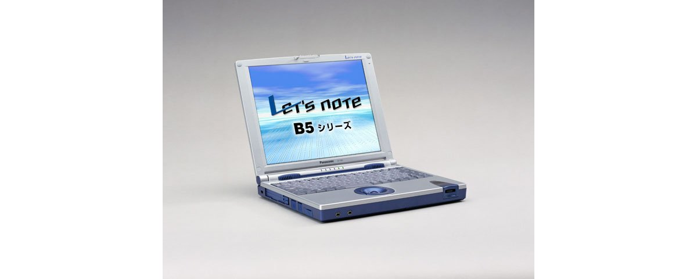

# 松下 Let's note CF-B5 规格参数

[English](../../en/CF-B5/) · [日本語](../../ja/CF-B5/) · **中文**

🗄️ 在 [Let's note 陈列柜](https://letsnote-specs.github.io/zh/CF-B5/)中查看此机型

**CF-B5** 是松下 Let's note 笔记本电脑，属于 B5 系列，配备 10.4英寸 XGA 屏幕。本页收录其全部 4 个型号（2000-06 – 2001-05 发售）的规格参数。每个型号均附官方规格表链接。

*松下 Let's note CF-B5（CF-B5FR, CF-B5ER）。图片 © Panasonic*

## 型号列表

| 型号（品番） | 发售 | 停产 | 主要规格 |
| :-- | :-- | :-- | :-- |
| [CF-B5FR](https://panasonic.jp/pc/p-db/CF-B5FR_spec.html) | 2001-05 | 2001-05 | PentiumIII(700MHz)SS、HDD：30GB、i.LINK、Windows 2000 |
| [CF-B5ER](https://panasonic.jp/pc/p-db/CF-B5ER_spec.html) | 2000-10 | 2001-02 | PentiumIII(650MHz)SS、HDD：20GB、i.LINK、Windows Me |
| [CF-B5R](https://panasonic.jp/pc/p-db/CF-B5R_spec.html) | 2000-06 | 2000-07 | PentiumIII(600MHz)SS、HDD：20GB、Windows 98SE |
| [CF-B5V](https://panasonic.jp/pc/p-db/CF-B5V_spec.html) | 2000-06 | 2000-07 | Celeron(500MHz)、HDD：10GB、Windows 98SE |

## 通用规格

| 项目 | 规格 |
| :-- | :-- |
| 内存 | 标准 64MB SDRAM（最大 192MB） |
| 软驱（选配） | 外置 USB连接 3.5英寸 支持3模式 (1.44MB /1.2MB /720KB) |
| 显示屏 | XGA (1024×768像素) 10.4英寸 多晶硅TFT彩色液晶 |
| 显示屏 / 色彩 | 1024×768像素 :约1600万色 ※2 |
| 调制解调器 | 主机内置 数据：56kbps（V.90/K56flex自动支持） FAX：14.4kbps /不支持语音 (RJ-11) ※4 |
| 有线网络 | 主机内置 100BASE-TX /10BASE-T (RJ-45) ※5 |
| 音频 | PCM音源 (16位立体声)、内置扬声器(立体声)、内置麦克风（单声道） |
| 卡槽 / PC 卡 | PC卡（TypeII×2 或 TypeIII×1插槽）支持 CardBus |
| 卡槽 / 其他 | 专用私钥1个插槽 |
| 内存扩展槽 | 144针DIMM专用插槽×1 (64MB /128MB) |
| 音频接口 | 麦克风输入（单声道迷你插孔）、音频输出（立体声迷你插孔） |
| USB | 4针×2 |
| 串口 | Dsub 9针 |
| 并口 | Dsub 25针 |
| 外接显示接口 | 模拟RGB 迷你Dsub 15针 |
| 键盘 | 符合OADG标准的键盘 (86键)：键距 17mm |
| 指点设备 | 光学式轨迹球（直径16mm） |
| 电源 | AC 100V-240V (50Hz/60Hz)（AC电源线仅适用于100V）、 / 标准电池组（锂离子） |
| 尺寸（宽×深×高） | 255mm × 206mm × 33.4mm（不含凸起部） |
| 重量（含电池） | 约1.53kg |

## 各型号差异

| 型号（品番） | 处理器 | 内存 | 存储 | 重量 | 续航 |
| :-- | :-- | :-- | :-- | :-- | :-- |
| CF-B5FR | SpeedStep 技术对应Pentium III 700MHz | 64MB SDRAM | 30GB | 1.53 kg | 3.0 h |
| CF-B5ER | SpeedStep 技术对应Pentium III 650MHz | 64MB SDRAM | 20GB | 1.53 kg | 3.0 h |
| CF-B5R | SpeedStep 技术对应Pentium III 600MHz | 64MB SDRAM | 20GB | 1.53 kg | 3.5 h |
| CF-B5V | Celeron 500MHz | 64MB SDRAM | 10GB | 1.53 kg | 3.0 h |

CF-B5FR 的全部差异规格

| 项目 | 规格 |
| :-- | :-- |
| 处理器 | 支持 Intel(R) SpeedStep(TM) 技术的移动 Pentium(R) III 处理器 700MHz（系统总线时钟：100MHz） |
| 芯片组 | Intel(R) 440MX PCIset |
| 二级缓存 | 256KB |
| 显存 | 8MB |
| 显示芯片 | ATI公司制RAGE Mobility-M1 |
| 硬盘 | 30GB (UltraATA) ※1 |
| 显示屏 / 外接显示输出 | 640×480、800×600、1024×768、1280×1024、1600×1200像素：约1600万色 |
| 显示屏 / 同时显示 | 640×480、800×600、1024×768、1280×1024 ※3、1600×1200 ※3 像素：约1600万色 ※2 |
| 接口 / i.LINK（IEEE 1394） | IEEE1394端口 S400 4针×2 ※6 |
| 无线通信端口 / 手机 | 符合 RCR STD 27 数据／FAX：9600bps 分组通信 DoPa（最大 28.8kbps）※7 |
| 无线通信端口 / PHS | PIAFS 64K ※7 |
| 红外 | IrDA Ver1.1：最大 4Mbps ※8 |
| 功耗 | 约50W ※9 |
| 能效 | S区分 0.0010 ※10 |
| 电池 | 驱动:约3.0小时 ※11 充电:约3小时(电源ON/OFF时)※12 |
| 预装软件 | Microsoft(R) Windows(R) 2000 Professional (Service Pack 1)、 / Microsoft(R) Internet Explorer 5.5、 / Microsoft(R) IME 2000、 / Adobe(R) Acrobat(R) Reader ◆、 / Panasonic PC 在线会员注册、 / 互联网入门、 / 舞铃 FAX 2001 Lite ◆*13、 / 私钥相关软件、 / 在线注册 (@nifty、BIGLOBE、DION、OCN、ODN、NTT Docomo AOL) ◆、 / Mobile Editor 2000 ◆*14、 / MotionDV STUDIO V1.0 |
| 注意事项 | ※1 HDD容量按1GB=1,000,000,000字节显示。 / ※2 内部LCD通过图形加速器的抖动功能实现。 / ※3 同时显示时，显示整个画面的一部分(1024×768像素)。将光标移到画面边缘时，整个画面会滚动。 / ※4 仅限日本国内NTT模拟一般线路使用。自动判别并切换V.90和K56flex。另外，56kbps是数据接收时的理论值。数据发送时33.6kpbs为最高速度。 / ※5 根据连接器的形状，有些产品无法使用。 / ※6 不保证所有i.LINK兼容外围设备的运行。 / ※7 用于手机、PHS电话连接。需要另售的连接线。可使用的电话为手机、支持数据通信的PHS(NTT DoCoMo、Astel)、NTT DoCoMo DoTchimo、DDI Pocket的H"(Edge)以及α-DATA32兼容电话机(部分机型除外)。PIAFS 64K的最大通信速度为58.4kbps。 / ※8 红外线通信端口的有效距离为20～50cm。未配备支持4Mbps通信的软件。 / ※9 基于(社)电子信息技术产业协会 家电・通用产品高次谐波控制对策指南执行计划书的额定输入功率值：约30W。 / ※10 能源消费效率是指，用节能法规定的测量方法测量出的消费电力除以节能法规定的复合理论性能所得的值。 / ※11 LCD背光亮度最低时。会因运行环境・系统设置而变动。 / ※12 将完全放电的电池充电时可能需要较长时间。由于电源关闭状态下也会消耗电力，从满充电起约2周(使用标准电池时)后电池电量会耗尽。另外，电源ON时的充电时间为最短情况。会因电脑的运行状态而变动。 / ※13 除内置调制解调器的传真收发外，还支持使用无线通信端口的手机传真收发・NTT DoCoMo的PHS传真发送。不支持语音功能。 / ※14 需要另售的手机连接线。 / 标有◆的软件的操作支持由各软件厂商提供。 / ●本电脑不保证在Windows 2000以外的环境下运行。 / ●在一般标为Windows 2000用的软件及外围设备中，有些无法在本电脑上使用。购买时请向各软件及外围设备的销售商确认。 / ●附带的Product Recovery CD-ROM无法仅重新安装OS。 / ●重新安装系统所需的CD-ROM驱动器不附带。需另行购买。 |

官方规格表: <https://panasonic.jp/pc/p-db/CF-B5FR_spec.html>

CF-B5ER 的全部差异规格

| 项目 | 规格 |
| :-- | :-- |
| 处理器 | 支持 Intel(R) SpeedStep(TM) 技术的移动 Pentium(R) III 处理器 650MHz（系统总线时钟：100MHz） |
| 芯片组 | Intel(R) 440MX PCIset |
| 二级缓存 | 256KB |
| 显存 | 8MB |
| 显示芯片 | ATI公司制RAGE Mobility-M1 |
| 硬盘 | 20GB (UltraATA) ※1 |
| 显示屏 / 外接显示输出 | 640×480、800×600、1024×768、1280×1024、1600×1200像素：约1600万色 |
| 显示屏 / 同时显示 | 640×480、800×600、1024×768、1280×1024 ※3、1600×1200 ※3 像素：约1600万色 ※2 |
| 接口 / i.LINK（IEEE 1394） | IEEE1394端口 S400 4针×2 ※6 |
| 无线通信端口 / 手机 | 符合 RCR STD 27 数据／FAX：9600bps 分组通信 DoPa（最大 28.8kbps）※7 |
| 无线通信端口 / PHS | PIAFS 64K ※7 |
| 红外 | IrDA Ver1.1：最大 4Mbps ※8 |
| 功耗 | 约50W |
| 能效 | S区分 0.0010 ※9 |
| 电池 | 驱动:约3.0小时 ※10 充电:约3小时(电源ON/OFF时)※11 |
| 预装软件 | Microsoft(R) Windows(R) Millennium Edition、 / Microsoft(R) Internet Explorer 5.5、 / Microsoft(R) IME 2000、 / Adobe(R) Acrobat(R) Reader ◆、 / 网页浏览器2、 / 互联网入门、 / 插画邮件 ※12、 / 邮件自动收发、 / 快速连接选择器、 / 舞得酷FAX 2001 Lite ◆※13、 / 私钥相关软件、 / 在线注册 (@nifty、ODN)◆、 / MotionDV STUDIO V2.0 |
| 注意事项 | ※1 HDD容量按1GB=1,000,000,000字节显示。 / ※2 内部LCD通过图形加速器的抖动功能实现。 / ※3 同时显示时，仅显示整个画面的一部分（1024×768像素）。将光标移动到画面边缘时，整个画面会滚动。 / ※4 仅限日本国内NTT模拟一般线路专用。自动判别并切换V.90和K56flex。另外，56kbps为数据接收时的理论值。数据发送时最大速度为33.6kpbs。 / ※5 根据接口形状的不同，有些可能无法使用。 / ※6 并不保证所有i.LINK兼容外围设备的运行。 / ※7 用于手机、PHS电话连接。需要另售的连接线。可使用的电话为手机、支持数据通信的PHS（NTT DoCoMo、Astel）、NTT DoCoMo Docomo、DDI Pocket的H"（Edge）以及支持α-DATA32的电话机（部分机型除外）。PIAFS 64K的最大通信速度为58.4kbps。 / ※8 红外线通信端口的有效距离为20～50cm。未配备支持4Mbps通信的软件。 / ※9 能源消耗效率是指，用依据节能法规定的测量方法测得的耗电量，除以依据节能法规定的复合理论性能所得的值。 / ※10 LCD背光亮度最低时。会因运行环境和系统设置而变动。 / ※11 对完全放电的电池充电可能需要较长时间。即使电源关闭状态也会消耗电力，因此从满充电起约2周（使用标准电池时）后电池电量会耗尽。另外，电源ON时的充电时间为最短情况。会因计算机的运行状态而变动。 / ※12 根据字体种类的不同，有些可能无法正确显示。请使用等宽字体。 / ※13 除使用内置调制解调器进行传真收发外，还支持使用无线通信端口通过手机进行传真收发以及通过NTT DoCoMo的PHS进行传真发送。不支持语音功能。 / 关于标有◆的软件操作的售后支持，由各软件厂商提供。 / ●本电脑除Windows Me以外不保证运行。 / ●一般标称为用于Windows Me的软件及外围设备中，有些无法在本电脑上使用。购买时请向各软件及外围设备的销售商确认。 / ●使用随附的产品恢复CD-ROM无法仅重新安装OS。 / ●系统重新安装所需的CD-ROM驱动器不随附。需另行购买。 |
| 显示屏 / 双屏显示（示例） | 内部LCD 1024×768像素 :65536色－ 外部显示器 640×480像素 :约65536色 / 内部LCD 1024×768像素 ：256色－ 外部显示器 1024×768像素：约256色 |

官方规格表: <https://panasonic.jp/pc/p-db/CF-B5ER_spec.html>

CF-B5R 的全部差异规格

| 项目 | 规格 |
| :-- | :-- |
| 处理器 | 支持 Intel(R) SpeedStep(TM) 技术的移动 Pentium(R) III 处理器 600MHz（系统总线时钟：100MHz） |
| 芯片组 | Intel(R) 440MX Chipset |
| 二级缓存 | 256KB |
| 显存 | 2.5MB |
| 显示芯片 | NeoMagic公司制 NM2200 |
| 硬盘 | 20GB (UltraATA) ※1 |
| 显示屏 / 外接显示输出 | 640×480、800×600、1024×768像素：约1600万色、1280×1024像素：约256色 |
| 显示屏 / 同时显示 | 640×480、800×600、1024×768像素：约1600万色 ※2、1280×1024像素 ※3：256色 |
| 无线通信端口 / 手机 | 符合 RCR STD 27 数据／FAX：9600bps 分组通信 DoPa（最大 28.8kbps）※6 |
| 无线通信端口 / PHS | PIAFS 64K ※6 |
| 红外 | IrDA Ver1.1：最大 4Mbps ※7 |
| 功耗 | 约50W |
| 能效 | S区分 0.0011 ※8 |
| 电池 | 驱动:约3.5小时 ※9 充电:约3小时(电源ON/OFF时)※10 |
| 预装软件 | Microsoft(R) Windows(R) 98 Second Edition、 / Microsoft(R) Internet Explorer 5.01、 / Microsoft(R) IME 98、 / Adobe(R) Acrobat(R) Reader◆、 / 网页导航器 2、 / 互联网入门、 / 插图邮件 *11、 / 邮件自动收发、 / 快速连接选择器、 / 舞铃 FAX 2001 Lite ◆*12、 / 私钥相关软件、 / 在线注册 (@nifty、DION、KDD、ODN) ◆、 / Intellisync(R) for Notebooks ◆ |
| 注意事项 | ※1 HDD容量按1GB=1,000,000,000字节显示。 / ※2 内部LCD通过图形加速器的抖动功能实现。 / ※3 同时显示时，仅显示整个画面的一部分（1024×768像素）。将光标移动到画面边缘时，整个画面会滚动。 / ※4 仅限日本国内NTT模拟一般线路专用。自动判别并切换V.90和K56flex。另外，56kbps为数据接收时的理论值。数据发送时最大速度为33.6kpbs。 / ※5 根据接口形状的不同，有些可能无法使用。 / ※6 用于手机、PHS电话连接。需要另售的连接线。可使用的电话为手机、支持数据通信的PHS（NTT DoCoMo、Astel）、NTT DoCoMo Docomo、DDI Pocket的H"（Edge）以及支持α-DATA32的电话机（部分机型除外）。PIAFS 64K的最大通信速度为58.4kbps。 / ※7 红外线通信端口的有效距离为20～50cm。 / ※8 能源消耗效率是指，用依据节能法规定的测量方法测得的耗电量，除以依据节能法规定的复合理论性能所得的值。 / ※9 LCD背光亮度最低时。会因运行环境和系统设置而变动。 / ※10 对完全放电的电池充电可能需要较长时间。即使电源关闭状态也会消耗电力，因此从满充电起约2周（使用标准电池时）后电池电量会耗尽。另外，电源ON时的充电时间为最短情况。会因计算机的运行状态而变动。 / ※11 根据字体种类的不同，有些可能无法正确显示。请使用等宽字体。 / ※12 除使用内置调制解调器进行传真收发外，还支持使用无线通信端口通过手机进行传真收发以及通过NTT DoCoMo的PHS进行传真发送。不支持语音功能。 / 关于标有◆的软件操作的售后支持，由各软件厂商提供。 / / ●本电脑除Windows 98SE以外不保证运行。 / ●一般标称为用于Windows 98SE的软件及外围设备中，有些无法在本电脑上使用。购买时请向各软件及外围设备的销售商确认。 / ●使用随附的产品恢复CD-ROM无法仅重新安装OS。 / ●系统重新安装所需的CD-ROM驱动器不随附。需另行购买。 |
| 显示屏 / 双屏显示（示例） | 内部LCD 1024×768像素 :65536色－ 外部显示器 640×480像素 :约65536色 / 内部LCD 1024×768像素 ：256色－ 外部显示器 1024×768像素：约256色 |

官方规格表: <https://panasonic.jp/pc/p-db/CF-B5R_spec.html>

CF-B5V 的全部差异规格

| 项目 | 规格 |
| :-- | :-- |
| 处理器 | 移动 Intel(R) Celeron(TM) 处理器 500MHz (系统总线时钟：100MHz) |
| 芯片组 | Intel(R) 440MX Chipset |
| 二级缓存 | 128KB |
| 显存 | 2.5MB |
| 显示芯片 | NeoMagic公司制 NM2200 |
| 硬盘 | 10GB (UltraATA) ※1 |
| 显示屏 / 外接显示输出 | 640×480、800×600、1024×768像素：约1600万色、1280×1024像素：约256色 |
| 显示屏 / 同时显示 | 640×480、800×600、1024×768像素：约1600万色 ※2、1280×1024像素 ※3：256色 |
| 无线通信端口 / 手机 | 符合 RCR STD 27 数据／FAX：9600bps 分组通信 DoPa（最大 28.8kbps）※6 |
| 无线通信端口 / PHS | PIAFS 64K ※6 |
| 红外 | IrDA Ver1.1：最大 4Mbps ※7 |
| 功耗 | 约50W |
| 能效 | S区分 0.0026 ※8 |
| 电池 | 驱动:约3.0小时 ※9 充电:约3小时(电源ON/OFF时)※10 |
| 预装软件 | Microsoft(R) Windows(R) 98 Second Edition、 / Microsoft(R) Internet Explorer 5.01、 / Microsoft(R) IME 98、 / Adobe(R) Acrobat(R) Reader◆、 / 网页导航器 2、 / 互联网入门、 / 插图邮件 *11、 / 邮件自动收发、 / 快速连接选择器、 / 舞铃 FAX 2001 Lite ◆*12、 / 私钥相关软件、 / 在线注册 (@nifty、DION、KDD、ODN) ◆、 / Intellisync(R) for Notebooks ◆ |
| 注意事项 | ※1 HDD容量按1GB=1,000,000,000字节显示。 / ※2 内部LCD通过图形加速器的抖动功能实现。 / ※3 同时显示时，仅显示整个画面的一部分（1024×768像素）。将光标移动到画面边缘时，整个画面会滚动。 / ※4 仅限日本国内NTT模拟一般线路专用。自动判别并切换V.90和K56flex。另外，56kbps为数据接收时的理论值。数据发送时最大速度为33.6kpbs。 / ※5 根据接口形状的不同，有些可能无法使用。 / ※6 用于手机、PHS电话连接。需要另售的连接线。可使用的电话为手机、支持数据通信的PHS（NTT DoCoMo、Astel）、NTT DoCoMo Docomo、DDI Pocket的H"（Edge）以及支持α-DATA32的电话机（部分机型除外）。PIAFS 64K的最大通信速度为58.4kbps。 / ※7 红外线通信端口的有效距离为20～50cm。 / ※8 能源消耗效率是指，用依据节能法规定的测量方法测得的耗电量，除以依据节能法规定的复合理论性能所得的值。 / ※9 LCD背光亮度最低时。会因运行环境和系统设置而变动。 / ※10 对完全放电的电池充电可能需要较长时间。即使电源关闭状态也会消耗电力，因此从满充电起约2周（使用标准电池时）后电池电量会耗尽。另外，电源ON时的充电时间为最短情况。会因计算机的运行状态而变动。 / ※11 根据字体种类的不同，有些可能无法正确显示。请使用等宽字体。 / ※12 除使用内置调制解调器进行传真收发外，还支持使用无线通信端口通过手机进行传真收发以及通过NTT DoCoMo的PHS进行传真发送。不支持语音功能。 / 关于标有◆的软件操作的售后支持，由各软件厂商提供。 / / ●本电脑除Windows 98SE以外不保证运行。 / ●一般标称为用于Windows 98SE的软件及外围设备中，有些无法在本电脑上使用。购买时请向各软件及外围设备的销售商确认。 / ●使用随附的产品恢复CD-ROM无法仅重新安装OS。 / ●系统重新安装所需的CD-ROM驱动器不随附。需另行购买。 |
| 显示屏 / 双屏显示（示例） | 内部LCD 1024×768像素 :65536色－ 外部显示器 640×480像素 :约65536色 / 内部LCD 1024×768像素 ：256色－ 外部显示器 1024×768像素：约256色 |

官方规格表: <https://panasonic.jp/pc/p-db/CF-B5V_spec.html>

## 图片

*松下 Let's note CF-B5（CF-B5R, CF-B5V）。图片 © Panasonic*

## 相关机型

- [Let's note 全部机型](../)

---

来源：松下官方[停产产品列表](https://panasonic.jp/pc/support/products/)及各型号规格表（panasonic.jp），由日文翻译，准确措辞以官方规格表为准。产品图片 © Panasonic。本页为非官方整理，与松下公司无关。
