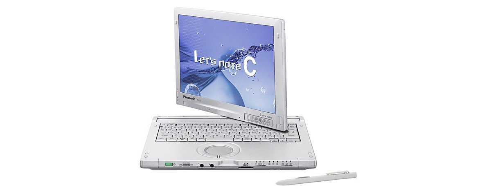
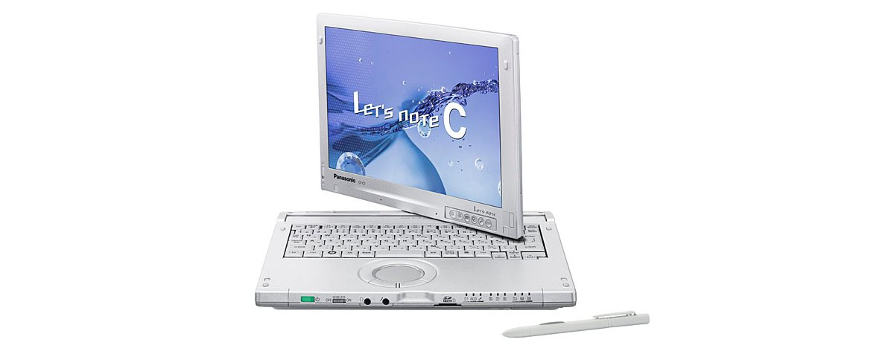

# 松下 Let's note CF-C1 规格参数

[English](../../en/CF-C1/) · [日本語](../../ja/CF-C1/) · **中文**

🗄️ 在 [Let's note 陈列柜](https://letsnote-specs.github.io/zh/CF-C1/)中查看此机型

**CF-C1** 是松下 Let's note 笔记本电脑，属于 C1 系列，配备 12.1英寸 WXGA 屏幕。本页收录其全部 2 个型号（2010-06 – 2011-06 发售）的规格参数。每个型号均附官方规格表链接。

*松下 Let's note CF-C1（CF-C1BEAADR）。图片 © Panasonic*

## 型号列表

| 型号（品番） | 发售 | 停产 | 主要规格 |
| :-- | :-- | :-- | :-- |
| [CF-C1BEAADR](https://panasonic.jp/pc/p-db/CF-C1BEAADR_spec.html) | 2011-06 | 2012-09 | Windows®7 Professional 64位 正版（已应用Service Pack 1）、英特尔® CoreTM i5-2520M（2.50GHz）、内存：标配4GB（空插槽1、最大8GB）、HDD：320GB、LAN、无线LAN 802.11a(W52/W53/W56)/b/g/n |
| [CF-C1AEAADR](https://panasonic.jp/pc/p-db/CF-C1AEAADR_spec.html) | 2010-06 | 2011-04 | Windows®7 Professional 正版、英特尔® CoreTM i5-520M（2.40GHz）、内存：标配2GB（最大6GB）、HDD：250GB、LAN、无线LAN 802.11a(W52/W53/W56)/b/g/n |

## 通用规格

| 项目 | 规格 |
| :-- | :-- |
| 显示屏 / 色彩 | 1280×800像素：约1677万色 |
| 显示屏 / 同时显示 | 800×600、1024×768、1280×720、1280×768、1280×800像素：约1677万色 |
| 无线通信模块 | 英特尔 Centrino Advanced-N + WiMAX 6250 |
| 无线网络 | 符合IEEE802.11a（W52/W53/W56）/b/g/n |
| 有线网络 | 1000BASE-T / 100BASE-TX / 10BASE-T |
| 音频 | PCM音源（24位立体声）、英特尔 High Definition Audio标准、单声道扬声器、内置阵列麦克风 |
| 安全芯片 | TPM（符合TCG V1.2） |
| 键盘 | 符合OADG标准85键、键距19mm（横向）/16mm（纵向）（部分键除外） |
| 指点设备 | 滚轮触控板・静电式多点触控屏＋电磁感应式数字化仪 |
| 功耗 | 最大约80W |
| 能效达成率（2011 年度标准） | — |
| 尺寸（宽×深×高） | 宽299.2mm×深226.5mm×高30.6mm/44.3mm（前部/后部） |

## 各型号差异

| 型号（品番） | 处理器 | 内存 | 存储 | 重量 | 续航 |
| :-- | :-- | :-- | :-- | :-- | :-- |
| CF-C1BEAADR | Core i5-2520M vPro | 4GB PC3-8500 | 320GB | 1.46 kg | 7 h |
| CF-C1AEAADR | Core i5-520M vPro | 2GB DDR3 SDRAM | 250GB | 1.46 kg | 6.5 h |

CF-C1BEAADR 的全部差异规格

| 项目 | 规格 |
| :-- | :-- |
| 操作系统 | ▼基础操作系统：Windows7 Professional32位正版/Windows7 Professional 64位正版（配备 WindowsXP Mode） / ▼安装操作系统：Windows7 Professional64位正版（配备 WindowsXP Mode）[已应用 Service Pack1] |
| 处理器 | 采用英特尔 vPro 技术 / 英特尔 Core i5-2520M vPro 处理器 / 英特尔智能缓存3MB、工作频率2.50GHz（使用英特尔 睿频加速技术2.0时最高3.20GHz） |
| 芯片组 | 移动 英特尔 QM67 Express 芯片组 |
| 内存 | 标配4GB PC3-8500/DDR3 SDRAM 最大8GB （空闲插槽1） |
| 显存 | 最大1696MB（与主内存共用） |
| 硬盘 | 320GB（Serial ATA、2.5英寸HDD 5400转/分）在上述容量中，约12GB用作恢复区域，约300MB用作系统区域（用户不可使用） |
| 显示屏 | 12.1英寸TFT彩色液晶 WXGA (1280×800像素)旋转式 |
| 显示屏 / 显卡 | 配备英特尔 HD 图形3000（内置于英特尔 Core i5-2520M vPro处理器） |
| 显示屏 / 外接显示输出 | 800×600、1024×768、1280×720、1280×768、1280×1024、1400×1050、1600×900、1600×1200、1680×1050、1920×1080、1920×1200像素：约1677万色 |
| 蓝牙 | Bluetooth V2.1+EDR/Class2 |
| 卡槽 / PC 卡 | PC卡(TYPE II)×1插槽(CardBus对应、允许电流3.3V：400mA、5V：400mA) |
| 卡槽 / SD 卡 | SD存储卡×1插槽（支持SDHC存储卡/SDXC存储卡/支持UHS-I高速传输/支持版权保护技术） |
| 内存扩展槽 | DDR3 204针SO-DIMM×1插槽(1.5V/PC3-8500/DDR3 SDRAM) |
| 接口 | LAN接口（RJ-45）、外接显示器接口（模拟RGB 迷你Dsub 15针）、麦克风输入端子（立体声迷你插孔M3（支持插入式电源））、音频输出端子（立体声迷你插孔M3）、USB2.0端口×3 |
| 电源 | ▼AC适配器：输入：AC100V～240V 50Hz/60Hz，输出：DC16V、5.0A，电源线仅适用于100V / ▼电池组：7.4V锂离子・标称容量6.0Ah、额定容量5.7Ah |
| 能效 | 2011年度基准 N类别0.087 |
| 续航 / 充电时间 | ▼续航时间：约7小时（安装附带的电池组时（安装1个电池组时））约14.5小时（安装另售的电池组时（安装2个电池组时）） / ▼充电时间：约2.5小时（电源OFF时）、约3小时（电源ON时）支持快速充电 / 安装2个电池组时：约3小时（电源OFF时）、约4小时（电源ON时） |
| 重量（含电池） | ▼电脑本体：约1.46kg（安装1个附带的电池组(约0.22kg)时） / ▼电脑本体：约1.68kg（安装另售的电池组时）（安装2个电池组时） / ▼AC适配器：约0.29kg（不含电源线(约0.06kg)） |
| 预装软件 | Microsoft Internet Explorer 9.0、绿色goo棒、网络选择器2、无线切换实用程序、安全设置实用程序、迈克菲PC安全中心、i-过滤器6.0（30天试用版）、Infineon TPM Professional Package V3.7、Adobe Reader、WinZip 14.5日语版、电池余量显示校正实用程序、滚轮触控板实用程序、NumLock通知、Hotkey设置、Fn Ctrl功能互换实用程序、ATOK for Windows 免费试用版、金山词典、电源计划扩展实用程序、Microsoft Windows Media Player 12、投影仪助手、USB键盘助手、显示器助手、Wireless Manager mobile edition5.5、英特尔 无线显示软件、缩放查看器、Windows XP Mode、快速启动管理器、PC信息弹窗、PC信息查看器、Aptio设置实用程序、PC-Diagnostic实用程序、硬盘数据擦除实用程序、DirectX 11、Microsoft .NET Framework 3.5.1、英特尔 PROSet/Wireless Software、英特尔身份保护技术、Windows Live邮件、Windows Live照片库、Windows Live Messenger、Windows Live Writer、Silverlight、Software keyboard、画面旋转工具、Dashboard for Panasonic PC、Bluetooth Stack for Windows by TOSHIBA、手写实用程序、透明板、Microsoft Touch Pack for Windows 7、校准实用程序 |
| 附件 | 产品恢复 DVD-ROM 2 张（用于 Windows7）、AC 适配器、电池组、数字化仪笔、笔用线缆、使用说明书 等 |

官方规格表: <https://panasonic.jp/pc/p-db/CF-C1BEAADR_spec.html>

CF-C1AEAADR 的全部差异规格

| 项目 | 规格 |
| :-- | :-- |
| 操作系统 | ▼基础操作系统：Windows7 Professional 32位正版/Windows7 Professional64位正版（配备 WindowsXPMode） / ▼安装操作系统：Windows7 Professional 32位正版（配备 WindowsXP Mode）※均为日语版。 |
| 处理器 | 英特尔 Core i5-520M vPro 处理器（英特尔 智能缓存3MB，运行频率 2.40GHz 使用英特尔 睿频加速技术时最高 2.93GHz） |
| 芯片组 | 移动 英特尔 QM57 Express 芯片组 |
| 内存 | 标准2GB DDR3 SDRAM（最大6 GB、空插槽1） |
| 显存 | 最大763 MB，增加2GB或4GB内存时最大1563MB（与主内存共享） |
| 硬盘 | 250GB（Serial ATA、2.5英寸HDD 5400转/分）在上述容量中，约12GB用作恢复区域，约300MB用作系统区域（用户不可使用） |
| 显示屏 | 12.1英寸TFT彩色液晶 WXGA (1280×800像素) |
| 显示屏 / 显卡 | 英特尔 HD 显卡（集成于英特尔 Core i5-520M vPro 处理器） |
| 显示屏 / 外接显示输出 | 800×600、1024×768、1280×720、1280×768、1280×1024、1400×1050、1680×1050、1600×1200、1920×1080、1920×1200像素：约1677万色 |
| 蓝牙 | Bluetooth 规格 V2.1 + EDR |
| 卡槽 / PC 卡 | PC卡(TYPE II)×1插槽(CardBus对应、允许电流 3.3V：400mA、5V：400mA) |
| 卡槽 / SD 卡 | SD存储卡×1插槽（支持SDHC存储卡/SDXC存储卡/支持版权保护技术） |
| 内存扩展槽 | DDR3 204针SO-DIMM专用插槽×1 (1.5V/PC3-6400/DDR3 SDRAM) |
| 接口 | USB端口×3（USB2.0）、LAN接口（RJ-45）、外部显示器接口（模拟RGB mini Dsub 15针）、麦克风输入（立体声迷你插孔M3（支持插入式电源））、音频输出（立体声迷你插孔M3） |
| 电源 | ▼AC适配器：输入：AC100V～240V、 / 50Hz/60Hz，输出：DC16 V、5.0A，电源线仅适用于100V / ▼电池组：7.4 V锂离子・标称容量6.0 Ah、额定容量5.7 Ah |
| 能效 | 2011年度基准 N类别0.17／ / 2007年度基准 l类别0.00017（Windows 7（32位）的情况）／ / 2007年度基准 f类别0.00030（Windows 7（64位）的情况） |
| 续航 / 充电时间 | 续航时间：约6.5小时（电池的经济模式（ECO）无效时）（安装2个电池组时约13小时（电池的经济模式（ECO）无效时））、 / 充电时间：约2.5小时（电源OFF时）、约4小时（电源ON时）（安装2个电池组时约3小时（电源OFF时）、约5小时（电源ON时）） |
| 重量（含电池） | 电脑主机：约1.46kg（安装附带的电池组（约0.22kg）时）、AC适配器：约0.29kg（不含电源线（约0.06kg）） |
| 预装软件 | Microsoft Internet Explorer8.0、Adobe Reader、Microsoft Windows MediaPlayer 12、Microsoft .NETFramework 3.5.1、WindowsLive 邮件、WindowsLive Messenger、WindowsLive 照片库、WindowsLive Writer、 / 缩放查看器、PC 信息查看器、PC 信息弹窗、NumLock 通知、Wireless Manager mobile edition5.5、无线切换实用程序、安全设置实用程序、Infineon TPM Professional Package V3.6、电池剩余电量显示校正实用程序、Hotkey 设置、McAfee PC 安全 / 中心、绿色 goo 棒 / 、硬盘数据擦除实用程序、滚轮触控板实用程序、网络选择器 2、USB 键盘助手、Fn Ctrl 功能互换实用程序、i-过滤器5.0（30天试用版 / 、电源计划扩展实用程序、显示助手、Aptio 设置实用程序、PC-Diagnostic 实用程序*33、投 / 影仪助手、Windows XP Mode、英特尔 PROSet/Wireless Software、Bluetooth Stack for Windows by TOSHIBA、 / 手写实用程序、Software Keyboard、画面旋转工具、Dashboard for CF-C1、DirectX11 |
| 附件 | 产品恢复DVD-ROM 1张（用于Windows7）、AC适配器、电池组、数字转换笔、防丢绳（笔用电缆）、使用说明书 等 |
| 能效达成率 | — |

官方规格表: <https://panasonic.jp/pc/p-db/CF-C1AEAADR_spec.html>

## 图片

*松下 Let's note CF-C1（CF-C1AEAADR）。图片 © Panasonic*

## 相关机型

- [Let's note 全部机型](../)

---

来源：松下官方[停产产品列表](https://panasonic.jp/pc/support/products/)及各型号规格表（panasonic.jp），由日文翻译，准确措辞以官方规格表为准。产品图片 © Panasonic。本页为非官方整理，与松下公司无关。
