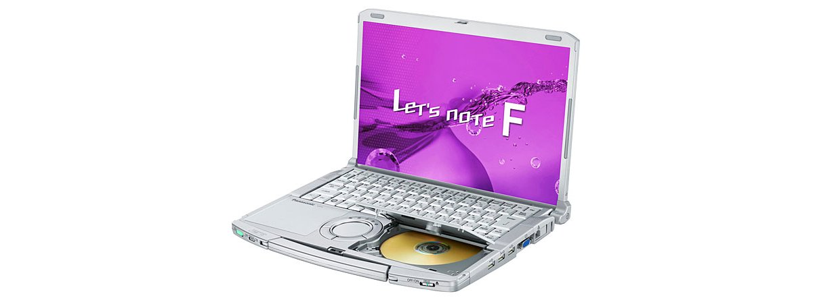
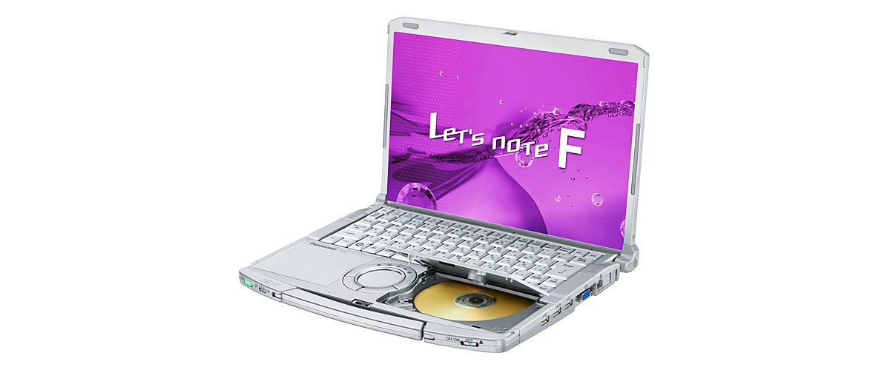

# 松下 Let's note CF-F9 规格参数

[English](../../en/CF-F9/) · [日本語](../../ja/CF-F9/) · **中文**

**CF-F9** 是松下 Let's note 笔记本电脑，属于 F9 系列，配备 14.1英寸 WXGA＋ 屏幕。本页收录其全部 6 个型号（2010-02 – 2010-09 发售）的规格参数。每个型号均附官方规格表链接。

*松下 Let's note CF-F9（CF-F9LYFGDR, CF-F9LYFTDR）。图片 © Panasonic*

## 型号列表

| 型号（品番） | 发售 | 停产 | 主要规格 |
| :-- | :-- | :-- | :-- |
| [CF-F9LYFGDR](https://panasonic.jp/pc/p-db/CF-F9LYFGDR_spec.html) | 2010-09 | 2011-02 | Windows® 7 Professional 正版、英特尔® CoreTM i5-560M（2.66GHz）、内存：标配4GB（已在扩展内存插槽中加装2GB内存）（最大6GB）、HDD：500GB、Super Multi Drive、LAN、无线LAN 802.11a(W52/W53/W56)/b/g/n |
| [CF-F9LYFTDR](https://panasonic.jp/pc/p-db/CF-F9LYFTDR_spec.html) | 2010-09 | 2011-02 | Windows® 7 Professional 正版、英特尔® CoreTM i5-560M（2.66GHz）、内存：标配4GB（已在扩展内存插槽中加装2GB内存）（最大6GB）、HDD：500GB、Super Multi Drive、LAN、无线LAN 802.11a(W52/W53/W56)/b/g/n、Office Home and Business 2010 ＜数量限定＞ |
| [CF-F9KYFSDR](https://panasonic.jp/pc/p-db/CF-F9KYFSDR_spec.html) | 2010-05 | 2010-09 | Windows® 7 Professional 正版、英特尔® CoreTM i5-520M（2.40GHz）、内存：标配4GB（已在扩展内存插槽中加装2GB内存）、HDD：320GB、Super Multi Drive、LAN、无线LAN 802.11a(W52/W53/W56)/b/g/n |
| [CF-F9KYFTDR](https://panasonic.jp/pc/p-db/CF-F9KYFTDR_spec.html) | 2010-05 | 2010-09 | Windows® 7 Professional 正版、英特尔® CoreTM i5-520M（2.40GHz）、内存：标配4GB（已在扩展内存插槽中加装2GB内存）、HDD：320GB、Super Multi Drive、LAN、无线LAN 802.11a(W52/W53/W56)/b/g/n、Office Home and Business 2010 ＜数量限定＞ |
| [CF-F9JYFCDR](https://panasonic.jp/pc/p-db/CF-F9JYFCDR_spec.html) | 2010-02 | 2010-05 | Windows®7 Professional 正版、英特尔® CoreTM i5-520M（2.40GHz）、内存：标配2GB（最大4GB）、HDD：250GB、超级多功能驱动器、LAN、无线LAN 802.11a(W52/W53/W56)/b/g/n |
| [CF-F9JYFNDR](https://panasonic.jp/pc/p-db/CF-F9JYFNDR_spec.html) | 2010-02 | 2010-05 | Windows®7 Professional 正版、英特尔® CoreTM i5-520M（2.40GHz）、内存：标配2GB（最大4GB）、HDD：250GB、超级多功能驱动器、LAN、无线LAN 802.11a(W52/W53/W56)/b/g/n、Office Personal 2007＜数量限定＞ |

## 通用规格

| 项目 | 规格 |
| :-- | :-- |
| 芯片组 | 移动 英特尔 QM57 Express 芯片组 |
| 光驱速度 / 读取 | DVD-RAM 最大5倍速[4.7GB]、DVD-R 最大8倍速、DVD-R DL 最大8倍速、DVD-RW 最大8倍速、DVD-ROM 最大8倍速、+R 最大8倍速、+R DL 最大8倍速、+RW 最大8倍速、High Speed +RW 最大8倍速、CD-ROM 最大24倍速、CD-R 最大24倍速、CD-RW 最大24倍速、High-Speed CD-RW 最大24倍速、Ultra-Speed CD-RW 最大24倍速 |
| 光驱速度 / 写入 | DVD-RAM 最大5倍速[4.7GB]、DVD-R 最大8倍速、DVD-RW 最大6倍速、+R 最大8倍速、+RW 最大4倍速、High Speed +RW 最大6倍速、CD-R 最大24倍速、CD-RW 4倍速、High Speed CD-RW 10倍速 |
| 支持光盘 / 写入 | DVD-RAM、DVD-R、DVD-RW、+R、+RW、CD-R、CD-RW、High Speed +RW、High-Speed CD-RW |
| 显示屏 / 色彩 | 1440×900像素：约1677万色 |
| 显示屏 / 外接显示输出 | 1440×900、800×600、1024×768、1280×768、1280×1024、1400×1050、1680×1050、1600×1200、1920×1080、1920×1200像素：约1677万色 |
| 显示屏 / 同时显示 | 800×600、1024×768、1280×768、1440×900点：约1677万色 |
| 无线网络 | 符合IEEE802.11a（W52/W53/W56）/b/g/n |
| 有线网络 | 1000BASE-T / 100BASE-TX / 10BASE-T |
| 音频 | PCM音源（24位立体声）、英特尔 High Definition Audio 标准、立体声扬声器 |
| 安全芯片 | TPM（符合TCG V1.2） |
| 键盘 | 符合OADG标准的86键、键距19mm（纵向・横向）（部分按键除外） |
| 指点设备 | 滚轮触控板 |
| 功耗 | 最大约80W |
| 尺寸（宽×深×高） | 宽326mm×深251mm×高25.5mm/48.5mm（前部/后部） |

## 各型号差异

| 型号（品番） | 处理器 | 内存 | 存储 | 重量 | 续航 |
| :-- | :-- | :-- | :-- | :-- | :-- |
| CF-F9LYFGDR | Core i5-560M vPro | 4GB DDR3 SDRAM | 500GB | 1.62 kg | 3.5 h |
| CF-F9LYFTDR | Core i5-560M vPro | 4GB DDR3 SDRAM | 500GB | 1.62 kg | 3.5 h |
| CF-F9KYFSDR | Core i5-520M vPro | 4GB DDR3 SDRAM | 320GB | 1.62 kg | 3.5 h |
| CF-F9KYFTDR | Core i5-520M vPro | 4GB DDR3 SDRAM | 320GB | 1.62 kg | 3.5 h |
| CF-F9JYFCDR | Core i5-520M vPro | 2GB DDR3 SDRAM | 250GB | 1.61 kg | — |
| CF-F9JYFNDR | Core i5-520M vPro | 2GB DDR3 SDRAM | 250GB | 1.61 kg | — |

CF-F9LYFGDR 的全部差异规格

| 项目 | 规格 |
| :-- | :-- |
| 操作系统 | ▼基础操作系统：Windows7 Professional 32位正版/Windows7 Professional 64位正版（配备 WindowsXPMode）▼安装操作系统：Windows7 Professional 64位正版（配备 WindowsXP Mode）※均为日语版。 |
| 处理器 | 采用英特尔vPro技术 / 英特尔 Core i5-560M vPro 处理器 / 英特尔 智能缓存3MB，工作频率2.66GHz / （使用英特尔 睿频加速技术时最高3.20GHz） |
| 内存 | 标准4GB DDR3 SDRAM(已在扩展内存插槽增加2GB内存，空插槽0) ※若拆下标准安装的2GB内存并安装4GB内存，则最大6GB |
| 显存 | 最大1696MB（与主内存共用） |
| 硬盘 | 500GB（Serial ATA、2.5英寸HDD 5400转/分）上述容量中约12GB用作恢复区域、约300MB用作系统区域（用户不可使用） |
| 光驱 | 内置超级多功能驱动器 配备缓冲区欠载错误防止功能（SmoothLink） |
| 支持光盘 / 读取 | DVD-RAM、DVD-ROM、DVD-Video、DVD-R、DVD-R DL、DVD-RW、+R、+R DL、+RW、High Speed +RW、CD-Audio、CD-R、CD-ROM（支持XA）、PhotoCD（支持多区段）、VideoCD、CD EXTRA、CD-TEXT、CD-RW、High-Speed CD-RW、Ultra-Speed CD-RW |
| 显示屏 | 14.1英寸TFT彩色液晶屏 WXGA＋(1440×900像素) |
| 显示屏 / 显卡 | 英特尔 HD 显卡 / （集成于英特尔 Core i5-560M vPro 处理器） |
| 无线通信模块 | 英特尔 Centrino Advanced-N + WiMAX 6250 |
| 移动 WiMAX | 符合IEEE802.16e-2005（接收最大20Mbps、发送最大6Mbps） |
| 卡槽 / PC 卡 | PC卡（TYPEII）×1插槽（支持 CardBus、允许电流 3.3V：400mA、5V：400mA） |
| 卡槽 / SD 卡 | SD存储卡×1插槽（支持SDHC存储卡/SDXC存储卡/支持版权保护技术） |
| 内存扩展槽 | DDR3 204针SO-DIMM专用插槽×1 (1.5V/PC3-6400/DDR3 DDR3 204针SO-DIMM专用插槽×1 (1.5V/PC3-6400/DDR3 SDRAM) （已增配2GB内存、空闲插槽0） |
| 接口 | LAN 接口（RJ-45）、外接显示器接口（模拟 RGB 迷你 Dsub 15 针）、麦克风输入（立体声迷你插孔 M3（支持插入式电源））、音频输出（立体声迷你插孔 M3）、USB 端口×3（USB2.0） |
| 电源 | ▼AC适配器：输入：AC100V～240V、50Hz/60Hz，输出：DC16 V、5.0A，电源线仅适用于100V / ▼电池组：10.8V锂离子・标称容量6.2Ah、额定容量5.8Ah |
| 能效 | 2011年度基准 N类别0.15 |
| 能效达成率（2011 年度标准） | — |
| 续航 / 充电时间 | 续航时间：9小时／充电时间：约3.5小时（电源OFF时）、约5小时（电源ON时） |
| 重量（含电池） | 电脑主机：约1.62kg（安装附带的电池组（约0.32kg）时）/AC适配器：约0.29 kg（不含电源线（约0.06 kg）） |
| 预装软件 | 缩放查看器、PC信息查看器、PC信息弹窗、NumLock通知、Wireless Manager mobile edition5.5、无线切换实用工具、安全设置实用工具、电池剩余电量显示校正实用工具、Hotkey设置、硬盘数据擦除实用工具、滚轮触摸板实用工具、网络选择器2、USB键盘助手、USB鼠标助手、Fn Ctrl功能互换实用工具、电源计划扩展实用工具、显示助手、完美视图、Aptio设置实用工具、PC-Diagnostic实用工具 、投影仪助手、光盘驱动器盘符更改实用工具、恢复光盘创建实用工具 |
| 附件 | AC适配器、电池组、使用说明书 等 |

官方规格表: <https://panasonic.jp/pc/p-db/CF-F9LYFGDR_spec.html>

CF-F9LYFTDR 的全部差异规格

| 项目 | 规格 |
| :-- | :-- |
| 操作系统 | ▼基础操作系统：Windows7 Professional 32位正版/Windows7 Professional 64位正版（配备 WindowsXPMode）▼安装操作系统：Windows7 Professional 64位正版（配备 WindowsXP Mode）※均为日语版。 |
| 处理器 | 采用英特尔vPro技术 / 英特尔 Core i5-560M vPro 处理器 / 英特尔 智能缓存3MB，工作频率2.66GHz / （使用英特尔 睿频加速技术时最高3.20GHz） |
| 内存 | 标准4GB DDR3 SDRAM(已在扩展内存插槽增加2GB内存，空插槽0) ※若拆下标准安装的2GB内存并安装4GB内存，则最大6GB |
| 显存 | 最大1696MB（与主内存共用） |
| 硬盘 | 500GB（Serial ATA、2.5英寸HDD 5400转/分）上述容量中约12GB用作恢复区域、约300MB用作系统区域（用户不可使用） |
| 光驱 | 内置超级多功能驱动器 配备缓冲区欠载错误防止功能（SmoothLink） |
| 支持光盘 / 读取 | DVD-RAM、DVD-ROM、DVD-Video、DVD-R、DVD-R DL、DVD-RW、+R、+R DL、+RW、High Speed +RW、CD-Audio、CD-R、CD-ROM（支持XA）、PhotoCD（支持多区段）、VideoCD、CD EXTRA、CD-TEXT、CD-RW、High-Speed CD-RW、Ultra-Speed CD-RW |
| 显示屏 | 14.1英寸TFT彩色液晶屏 WXGA＋(1440×900像素) |
| 显示屏 / 显卡 | 英特尔 HD 显卡 / （集成于英特尔 Core i5-560M vPro 处理器） |
| 无线通信模块 | 英特尔 Centrino Advanced-N + WiMAX 6250 |
| 移动 WiMAX | 符合IEEE802.16e-2005（接收最大20Mbps、发送最大6Mbps） |
| 卡槽 / PC 卡 | PC卡（TYPEII）×1插槽（支持 CardBus、允许电流 3.3V：400mA、5V：400mA） |
| 卡槽 / SD 卡 | SD存储卡×1插槽（支持SDHC存储卡/SDXC存储卡/支持版权保护技术） |
| 内存扩展槽 | DDR3 204针SO-DIMM专用插槽×1 (1.5V/PC3-6400/DDR3 SDRAM) （已增配2GB内存、空闲插槽0） |
| 接口 | LAN 接口（RJ-45）、外接显示器接口（模拟 RGB 迷你 Dsub 15 针）、麦克风输入（立体声迷你插孔 M3（支持插入式电源））、音频输出（立体声迷你插孔 M3）、USB 端口×3（USB2.0） |
| 电源 | ▼AC适配器：输入：AC100V～240V、50Hz/60Hz，输出：DC16 V、5.0A，电源线仅适用于100V / ▼电池组：10.8V锂离子・标称容量6.2Ah、额定容量5.8Ah |
| 能效 | 2011年度基准 N类别0.15 |
| 能效达成率（2011 年度标准） | — |
| 续航 / 充电时间 | 续航时间：9小时／充电时间：约3.5小时（电源OFF时）、约5小时（电源ON时） |
| 重量（含电池） | 电脑主机：约1.62kg（安装附带的电池组（约0.32kg）时）/AC适配器：约0.29 kg（不含电源线（约0.06 kg）） |
| 预装软件 | 缩放查看器、PC信息查看器、PC信息弹窗、NumLock通知、Wireless Manager mobile edition5.5、无线切换实用工具、安全设置实用工具、电池剩余电量显示校正实用工具、Hotkey设置、硬盘数据擦除实用工具、滚轮触摸板实用工具、网络选择器2、USB键盘助手、USB鼠标助手、Fn Ctrl功能互换实用工具、电源计划扩展实用工具、显示助手、完美视图、Aptio设置实用工具、PC-Diagnostic实用工具、投影仪助手、光盘驱动器盘符更改实用工具、恢复光盘创建实用工具 |
| 附件 | AC适配器、电池组、使用说明书 等 |
| Microsoft Office | Office Home and Business 2010(Word、Excel、PowerPoint、Outlook、OneNote) |

官方规格表: <https://panasonic.jp/pc/p-db/CF-F9LYFTDR_spec.html>

CF-F9KYFSDR 的全部差异规格

| 项目 | 规格 |
| :-- | :-- |
| 操作系统 | ▼基础操作系统：Windows7 Professional 32位正版/Windows7 Professional64位正版（配备 WindowsXPMode）▼安装操作系统：Windows7 Professional 32位正版（配备 WindowsXP Mode）※均为日语版。 |
| 处理器 | 采用英特尔vPro技术 / 英特尔 Core i5-520M vPro 处理器 / 英特尔 智能缓存3MB，工作频率2.40GHz / 使用英特尔 睿频加速技术时最高2.93GHz |
| 内存 | 标准4GB DDR3 SDRAM（已在扩展内存插槽增加2GB内存，空插槽0） |
| 显存 | 最大1563MB（与主内存共用） |
| 硬盘 | 320GB（Serial ATA、2.5英寸HDD 5400转/分）※在上述容量中，约12GB用作恢复区域，约300MB用作系统区域（用户不可使用） |
| 光驱 | 内置超级多功能驱动器、配备缓冲区欠载错误防止功能（SmoothLink） |
| 支持光盘 / 读取 | DVD-RAM、DVD-ROM、DVD-Video、DVD-R、DVD-R DL、DVD-RW、+R、+R DL、+RW、High Speed +RW、CD-Audio、CD-R、CD-ROM（支持XA）、PhotoCD（支持多区段）、VideoCD、CD EXTRA、CD-TEXT、CD-RW、High-Speed CD-RW、Ultra-Speed CD-RW |
| 显示屏 | 14.1英寸TFT彩色液晶屏 WXGA＋(1440×900像素) |
| 显示屏 / 显卡 | 英特尔 HD 显卡（集成于英特尔 Core i5-520M vPro 处理器） |
| 无线通信模块 | 英特尔 Centrino Advanced-N+WiMAX 6250 |
| 移动 WiMAX | 符合IEEE802.16e-2005（接收最大20Mbps、发送最大6Mbps |
| 卡槽 / PC 卡 | PC卡（TYPEII）×1插槽（支持 CardBus、允许电流 3.3V：400mA、5V：400mA） |
| 卡槽 / SD 卡 | SD存储卡×1插槽（支持SDHC存储卡/SDXC存储卡/支持版权保护技术） |
| 内存扩展槽 | DDR3 204针SO-DIMM专用插槽×1 (1.5V/PC3-6400/DDR3 SDRAM)（ 已增配2GB内存、空闲插槽0） |
| 接口 | LAN接口（RJ-45）、外接显示器接口（模拟RGB 迷你Dsub 15针）、麦克风输入（立体声迷你插孔M3（支持插入式电源））、音频输出（立体声迷你插孔M3） |
| 电源 | ▼AC适配器：输入：AC100V～240V、50Hz/60Hz，输出：DC16V、5.0A，电源线仅适用于100V / ▼电池组：10.8V锂离子・标称容量6.2Ah、额定容量5.8Ah |
| 能效 | 2011年度基准 R类别0.17／2007年度基准 l类别0.00017 |
| 续航 / 充电时间 | 续航时间：8.5小时／充电时间：约3.5小时（电源OFF时）、约5小时（电源ON时） |
| 重量（含电池） | 电脑主机：约1.62kg（安装附带的电池组（约0.32kg）时）／AC适配器：约0.29 kg（不含电源线（约0.06kg）） |
| 预装软件 | Microsoft Internet Explorer8.0、Adobe Reader、Microsoft Windows Media Player 12、Microsoft .NET Framework 3.5.1、Windows Live邮件、Windows Live Messenger、Windows Live照片库、Windows Live Writer、缩放查看器、PC信息查看器、PC信息弹窗、NumLock通知、Wireless Manager mobile edition5.5、无线切换实用程序、安全设置实用程序、Infineon TPM Professional Package V3.6、电池余量显示校正实用程序、Hotkey设置、迈克菲PC安全中心、绿色goo棒、硬盘数据擦除实用程序、滚轮触控板实用程序、网络选择器2、USB键盘助手、USB鼠标助手、Fn Ctrl功能互换实用程序、i-过滤器5.0（30天试用版）、电源计划扩展实用程序、显示器助手、贴合视图、Aptio设置实用程序、PC-Diagnostic实用程序、投影仪助手、Windows XP Mode、英特尔 PROSet/Wireless Software、光盘驱动器盘符更改实用程序、Roxio Creator LJB、MyDVD、WinDVD8（OEM版）CPRM支持、恢复光盘创建实用程序 |
| 附件 | AC适配器、电池组、使用说明书 等 |
| 能效达成率 | — |
| 能效达成率（2011 年度标准） | — |

官方规格表: <https://panasonic.jp/pc/p-db/CF-F9KYFSDR_spec.html>

CF-F9KYFTDR 的全部差异规格

| 项目 | 规格 |
| :-- | :-- |
| 操作系统 | ▼基础操作系统：Windows7 Professional 32位正版/Windows7 Professional64位正版（配备 WindowsXPMode）▼安装操作系统：Windows7 Professional 32位正版（配备 WindowsXP Mode）※均为日语版。 |
| 处理器 | 采用英特尔vPro技术 / 英特尔 Core i5-520M vPro 处理器 / 英特尔 智能缓存3MB，工作频率2.40GHz / 使用英特尔 睿频加速技术时最高2.93GHz |
| 内存 | 标准4GB DDR3 SDRAM（已在扩展内存插槽增加2GB内存，空插槽0） |
| 显存 | 最大1563MB（与主内存共用） |
| 硬盘 | 320GB（Serial ATA、2.5英寸HDD 5400转/分）※在上述容量中，约12GB用作恢复区域，约300MB用作系统区域（用户不可使用） |
| 光驱 | 内置超级多功能驱动器、配备缓冲区欠载错误防止功能（SmoothLink） |
| 支持光盘 / 读取 | DVD-RAM、DVD-ROM、DVD-Video、DVD-R、DVD-R DL、DVD-RW、+R、+R DL、+RW、High Speed +RW、CD-Audio、CD-R、CD-ROM（支持XA）、PhotoCD（支持多区段）、VideoCD、CD EXTRA、CD-TEXT、CD-RW、High-Speed CD-RW、Ultra-Speed CD-RW |
| 显示屏 | 14.1英寸TFT彩色液晶屏 WXGA＋(1440×900像素) |
| 显示屏 / 显卡 | 英特尔 HD 显卡（集成于英特尔 Core i5-520M vPro 处理器） |
| 无线通信模块 | 英特尔 Centrino Advanced-N+WiMAX 6250 |
| 移动 WiMAX | 符合IEEE802.16e-2005（接收最大20Mbps、发送最大6Mbps |
| 卡槽 / PC 卡 | PC卡（TYPEII）×1插槽（支持 CardBus、允许电流 3.3V：400mA、5V：400mA） |
| 卡槽 / SD 卡 | SD存储卡×1插槽（支持SDHC存储卡/SDXC存储卡/支持版权保护技术） |
| 内存扩展槽 | DDR3 204针SO-DIMM专用插槽×1 (1.5V/PC3-6400/DDR3 SDRAM)（ 已增配2GB内存、空闲插槽0） |
| 接口 | LAN接口（RJ-45）、外接显示器接口（模拟RGB 迷你Dsub 15针）、麦克风输入（立体声迷你插孔M3（支持插入式电源））、音频输出（立体声迷你插孔M3） |
| 电源 | ▼AC适配器：输入：AC100V～240V、50Hz/60Hz，输出：DC16V、5.0A，电源线仅适用于100V / ▼电池组：10.8V锂离子・标称容量6.2Ah、额定容量5.8Ah |
| 能效 | 2011年度基准 R类别0.17／2007年度基准 l类别0.00017 |
| 续航 / 充电时间 | 续航时间：8.5小时／充电时间：约3.5小时（电源OFF时）、约5小时（电源ON时） |
| 重量（含电池） | 电脑主机：约1.62kg（安装附带的电池组（约0.32kg）时）／AC适配器：约0.29 kg（不含电源线（约0.06kg）） |
| 预装软件 | Microsoft Internet Explorer8.0、Adobe Reader、Microsoft Windows Media Player 12、Microsoft .NET Framework 3.5.1、WindowsLive 邮件、WindowsLive Messenger、WindowsLive 照片库、WindowsLive Writer、缩放查看器、PC 信息查看器、PC 信息弹窗、NumLock 通知、Wireless Manager mobile edition5.5、无线切换实用程序、安全设置实用程序、Infineon TPM Professional Package V3.6、电池剩余电量显示校正实用程序、Hotkey 设置、McAfee PC 安全中心、绿色 goo 棒、硬盘数据擦除实用程序、滚轮触控板实用程序、网络选择器 2、USB 键盘助手、USB 鼠标助手、Fn Ctrl 功能互换实用程序、i-过滤器5.0（30天试用版）、电源计划扩展实用程序、显示助手、贴合视图、Aptio 设置实用程序、PC-Diagnostic 实用程序、投影仪助手、Windows XP Mode、英特尔 PROSet/Wireless Software、光盘驱动器盘符更改实用程序、Roxio Creator LJB、MyDVD、WinDVD8（OEM版）支持CPRM、恢复光盘创建实用程序、搭载 Office Home and Business2010（Word、、Excel、PowerPoint、Outlook、OneNote） |
| 附件 | AC适配器、电池组、使用说明书 等 |
| 能效达成率 | — |
| 能效达成率（2011 年度标准） | — |

官方规格表: <https://panasonic.jp/pc/p-db/CF-F9KYFTDR_spec.html>

CF-F9JYFCDR 的全部差异规格

| 项目 | 规格 |
| :-- | :-- |
| 操作系统 | ▼基础操作系统：Windows7 Professional 32位正版/Windows7 Professional 64位正版（配备 WindowsXP Mode） / ▼安装操作系统：Windows7 Professional 32位正版（配备 WindowsXP Mode）※均为日语版 |
| 处理器 | 采用英特尔vPro技术 / 英特尔 Core i5-520M vPro 处理器 / 英特尔 智能缓存3MB，工作频率2.40GHz / 使用英特尔 睿频加速技术时最高2.93GHz |
| 内存 | 标准2GB DDR3 SDRAM（空插槽1）/最大4GB |
| 显存 | 最大763MB，增加2GB内存时1563MB（与主内存共享） |
| 硬盘 | 250GB（Serial ATA）※在左述容量中，约12GB用作恢复区域，约300MB用作系统区域（用户不可使用） |
| 光驱 | 内置超级多功能驱动器、配备缓冲区欠载错误防止功能（SmoothLink） |
| 支持光盘 / 读取 | DVD-RAM、DVD-ROM、DVD-Video、DVD-R、DVD-R DL、DVD-RW、+R、+R DL、+RW、High Speed +RW、CD-Audio、CD-R、CD-ROM（支持XA）、PhotoCD（支持多区段）、VideoCD、CD EXTRA、CD-TEXT、CD-RW、High-Speed CD-RW、 / Ultra-Speed CD-RW |
| 显示屏 | 14.1英寸TFT彩色液晶屏 WXGA＋(1440×1440像素) |
| 无线通信模块 | 英特尔 Centrino Advanced-N+WiMAX 6250 |
| 移动 WiMAX | 符合IEEE802.16e-2005（接收最大20Mbps、发送最大6Mbps） |
| 卡槽 / PC 卡 | PC卡（TYPEII）×1插槽（支持 CardBus、允许电流 3.3V：400Ma、5V：400mA） |
| 卡槽 / SD 卡 | SD存储卡×1插槽（SDHC存储卡/支持版权保护技术） |
| 内存扩展槽 | DDR3 204针SO-DIMM专用插槽×1 (1.5V/PC3-6400/DDR3 SDRAM) |
| 接口 | LAN接口（RJ-45）、外接显示器接口（模拟RGB 迷你Dsub 15针）、麦克风输入（立体声迷你插孔M3（支持插入式电源））、音频输出（立体声迷你插孔M3）、USB端口×3（USB2.0） |
| 电源 | ▼AC适配器：输入：AC100V～240V、50Hz/60Hz，输出：DC16 V、5.0A，电源线仅适用于100V / ▼电池组：10.8V锂离子・标称容量6.2Ah、额定容量5.8Ah |
| 能效 | 2007年度基准l区分0.00017 |
| 重量（含电池） | 电脑主机：约1.61kg（安装附带的电池组（约0.32kg）时）／AC适配器：约0.29 kg（不含电源线（约0.06 kg）） |
| 预装软件 | Microsoft Internet Explorer8.0、Adobe Reader、Microsoft Windows Media Player 12、DirectX 11、Microsoft .NET Framework 3.5.1、Windows Live邮件、Windows Live Messenger、Windows Live照片库、Windows Live Writer、缩放查看器、PC信息查看器、PC信息弹窗、NumLock通知、Wireless Manager mobile edition5.5、无线切换实用程序、安全设置实用程序、Infineon TPM Professional Package V3.6、电池余量显示校正实用程序、Hotkey设置、迈克菲PC安全中心、绿色goo棒、硬盘数据擦除实用程序、滚轮触控板实用程序、网络选择器2、USB键盘助手、USB鼠标助手、Fn Ctrl功能互换实用程序、i-过滤器5.0（30天试用版）、Panasonic电源计划扩展实用程序、显示器助手、贴合视图、Aptio设置实用程序、PC-Diagnostic实用程序、投影仪助手、Windows XP Mode）、光盘驱动器盘符更改实用程序、Roxio Creator LJB、MyDVD、WinDVD8（OEM版）CPRM支持 |
| 附件 | 产品恢复 DVD-ROM 1 张（用于 Windows7）、AC 适配器、电池组、使用说明书 等 |
| 能效达成率 | — |
| 软驱（选配） | （另售）USB连接外置3.5英寸3模式支持（1.44MB/1.2MB/720KB） |

官方规格表: <https://panasonic.jp/pc/p-db/CF-F9JYFCDR_spec.html>

CF-F9JYFNDR 的全部差异规格

| 项目 | 规格 |
| :-- | :-- |
| 操作系统 | ▼基础操作系统：Windows7 Professional 32位正版/Windows7 Professional 64位正版（配备 WindowsXP Mode） / ▼安装操作系统：Windows7 Professional 32位正版（配备 WindowsXP Mode）※均为日语版 |
| 处理器 | 采用英特尔vPro技术 / 英特尔 Core i5-520M vPro 处理器 / 英特尔 智能缓存3MB，工作频率2.40GHz / 使用英特尔 睿频加速技术时最高2.93GHz |
| 内存 | 标准2GB DDR3 SDRAM（空插槽1）/最大4GB |
| 显存 | 最大763MB，增加2GB内存时1563MB（与主内存共享） |
| 硬盘 | 250GB（Serial ATA）※在左述容量中，约12GB用作恢复区域，约300MB用作系统区域（用户不可使用） |
| 光驱 | 内置超级多功能驱动器、配备缓冲区欠载错误防止功能（SmoothLink） |
| 支持光盘 / 读取 | DVD-RAM、DVD-ROM、DVD-Video、DVD-R、DVD-R DL、DVD-RW、+R、+R DL、+RW、High Speed +RW、CD-Audio、CD-R、CD-ROM（支持XA）、PhotoCD（支持多区段）、VideoCD、CD EXTRA、CD-TEXT、CD-RW、High-Speed CD-RW、 / Ultra-Speed CD-RW |
| 显示屏 | 14.1英寸TFT彩色液晶屏 WXGA＋(1440×1440像素) |
| 无线通信模块 | 英特尔 Centrino Advanced-N+WiMAX 6250 |
| 移动 WiMAX | 符合IEEE802.16e-2005（接收最大20Mbps、发送最大6Mbps） |
| 卡槽 / PC 卡 | PC卡（TYPEII）×1插槽（支持 CardBus、允许电流 3.3V：400Ma、5V：400mA） |
| 卡槽 / SD 卡 | SD存储卡×1插槽（SDHC存储卡/支持版权保护技术） |
| 内存扩展槽 | DDR3 204针SO-DIMM专用插槽×1 (1.5V/PC3-6400/DDR3 SDRAM) |
| 接口 | LAN接口（RJ-45）、外接显示器接口（模拟RGB 迷你Dsub 15针）、麦克风输入（立体声迷你插孔M3（支持插入式电源））、音频输出（立体声迷你插孔M3）、USB端口×3（USB2.0） |
| 电源 | ▼AC适配器：输入：AC100V～240V、50Hz/60Hz，输出：DC16 V、5.0A，电源线仅适用于100V / ▼电池组：10.8V锂离子・标称容量6.2Ah、额定容量5.8Ah |
| 能效 | 2007年度基准l区分0.00017 |
| 重量（含电池） | 电脑主机：约1.61kg（安装附带的电池组（约0.32kg）时）／AC适配器：约0.29 kg（不含电源线（约0.06 kg）） |
| 预装软件 | Microsoft Internet Explorer8.0、Adobe Reader、Microsoft Windows Media Player 12、DirectX 11、Microsoft .NET Framework 3.5.1、Windows Live邮件、Windows Live Messenger、Windows Live照片库、Windows Live Writer、缩放查看器、PC信息查看器、PC信息弹窗、NumLock通知、Wireless Manager mobile edition5.5、无线切换实用程序、安全设置实用程序、Infineon TPM Professional Package V3.6、电池余量显示校正实用程序、Hotkey设置、迈克菲PC安全中心、绿色goo棒、硬盘数据擦除实用程序、滚轮触控板实用程序、网络选择器2、USB键盘助手、USB鼠标助手、Fn Ctrl功能互换实用程序、i-过滤器5.0（30天试用版）、Panasonic电源计划扩展实用程序、显示器助手、贴合视图、Aptio设置实用程序、PC-Diagnostic实用程序、投影仪助手、Windows XP Mode）、光盘驱动器盘符更改实用程序、Roxio Creator LJB、MyDVD、WinDVD8（OEM版）CPRM支持、Microsoft(R) Office Personal 2007 with Microsoft(R) Office PowerPoint(R) 2007(ServicePack2) |
| 附件 | 产品恢复 DVD-ROM 1 张（用于 Windows7）、AC 适配器、电池组、使用说明书 等 |
| 能效达成率 | — |
| 软驱（选配） | （另售）USB连接外置3.5英寸3模式支持（1.44MB/1.2MB/720KB） |

官方规格表: <https://panasonic.jp/pc/p-db/CF-F9JYFNDR_spec.html>

## 图片

*松下 Let's note CF-F9（CF-F9JYFCDR, CF-F9JYFNDR）。图片 © Panasonic*

*松下 Let's note CF-F9（CF-F9KYFSDR）。图片 © Panasonic*

*松下 Let's note CF-F9（CF-F9KYFTDR）。图片 © Panasonic*

## 相关机型

- [Let's note 全部机型](../)

---

来源：松下官方[停产产品列表](https://panasonic.jp/pc/support/products/)及各型号规格表（panasonic.jp），由日文翻译，准确措辞以官方规格表为准。产品图片 © Panasonic。本页为非官方整理，与松下公司无关。
